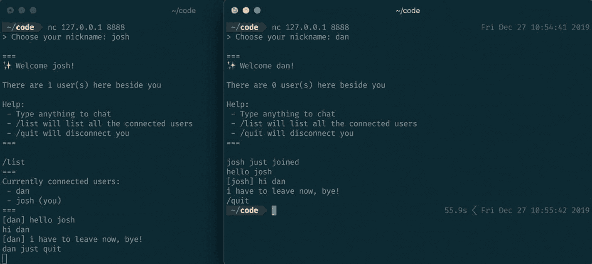

# asyncio 快速入门指南

Python 的 `asyncio` 库提供了大量辅助函数，让我们能以易读的方式编写异步代码。这些函数可以将代码拆分为看似并行运行的任务。

我们通过一个非常简单的程序来理解 `asyncio` 的工作原理：

```
1  import asyncio
2  import time

5  async def greet(name, delay):
6      await asyncio.sleep(delay)
7      print(f'{name}: 我等待了 {delay} 秒才说 "你好"')

10  async def main():
11      task_1 = asyncio.create_task(greet("t1", 3))
12      task_2 = asyncio.create_task(greet("t2", 2))
13      task_3 = asyncio.create_task(greet("t3", 2))

15      start_time = time.time()

17      print("0.00s: 程序开始")

19      await task_1
20      await task_2
21      await task_3

23      print(f"{time.time() - start_time:.2f}s: 程序结束")

26  asyncio.run(main())
```

该程序最重要的部分是以下几行：

```
1  task_1 = asyncio.create_task(greet(1))
2  task_2 = asyncio.create_task(greet(2))
3  task_3 = asyncio.create_task(greet(2))
```

这几行代码将三个任务（带参数的函数）“转化”为可以并发执行的任务；这些任务被称为 *可等待对象*，因为它们即将被“等待”。

接下来的几行代码：

```
1  await task_1
2  await task_2
3  await task_3
```

负责使用 Python 的 `await` 表达式来触发任务的运行。

最后，`main()` 在 `asyncio` 的 `run()` 函数内部被调用；这告诉 Python `main` 函数（及其内部内容）应该并发运行。

运行时，程序会输出以下内容：

```
0.00s: 程序开始
t2: 我等待了 2 秒才说 "你好"
t3: 我等待了 2 秒才说 "你好"
t1: 我等待了 3 秒才说 "你好"
3.00s: 程序结束
```

如上所示，我们的任务确实并发运行了；如果程序是*同步*运行的，那么由于每个函数顺序执行，将需要大约 7 秒。

我在介绍中提到我们“暂停”了任务；这是通过函数内部的 `await asyncio.sleep(...)` 这行代码实现的。仔细审视一下这行代码；它实际上是在问这样一个问题：“*如果 sleep 延迟尚未结束，就在此处暂停函数（await），然后继续执行其他任务。*”

在概念上理解这种模式至关重要（即使不能完全理解），并且要亲自尝试一下，因为它构成了大多数异步程序的模式。`main` 函数有时被称为程序的*入口点*，我们将在后续的构建中广泛使用它。

关于 `asyncio` 的完整论述远远超出了本书的范围，而在构建区块链的上下文中，它既重要又不重要。理解其底层运行机制很重要（如果你关心构建生产级应用的话），但在学习区块链和网络知识的上下文中，它又不那么重要，因为它实际上是一个实现细节，我们可以在后续阶段深入学习。

### 从零开始构建聊天服务器

由于构建的区块链如果不能通过网络连接到其他客户端就毫无用处，我们将从类似但更简单的项目开始：一个允许多个连接的客户端同时相互聊天的聊天服务器。你甚至可以用它来托管自己的聊天服务器，让世界各地的朋友连接进来。我们将用大约 100 行 Python 代码来实现它。

我是在 90 年代末使用 IRC（互联网中继聊天）长大的。这是早期互联网上一个健壮的聊天协议，它让世界各地的人们可以在聊天室中聊天。事实上，freenode 网络上的 #bitcoin 频道至今仍被广泛使用——那里是所有核心贡献者聊天的地方。但是，实现 IRC 协议是一项相当艰巨的任务，而且因为这是“边做边学”，为了节省时间和简化学习，我们将忽略所有现有成果，专注于一个最小化的示例，以帮助掌握用 Python 编写异步 TCP 服务器-客户端应用的要旨。现代 Web 应用程序具有可扩展性和并发性，因此理解异步代码的编写方式对于避免常见陷阱非常重要。

为了实现我们的目标，我们将使用 TCP 套接字来构建聊天服务器。Python 让使用套接字变得很容易。事实上，`asyncio` 模块提供了许多开箱即用的功能。

我们将从一个最简单的情况开始——一个简单的“回声”服务器，它只是将收到的任何消息原样发送回去。

```
1  import asyncio

4  async def handle_connection(reader, writer):
5      writer.write("Hello new user, type something...\n".encode())

7      data = await reader.readuntil(b"\n")

9      writer.write("You sent: ".encode() + data)
10      await writer.drain()

12      # 让我们关闭连接并清理资源
13      writer.close()
14      await writer.wait_closed()

17  async def main():
18      server = await asyncio.start_server(handle_connection,  "0.0.0.0", 8888)

20      async with server:
21          await server.serve_forever()

24  asyncio.run(main())
```

在深入分析代码之前，我们先运行这个服务器并向它发送一些信息，以便对结果有个预期。打开两个终端，将它们并排放置。

在第一个终端中，运行上述代码：

```
$ python my_server.py
```

在第二个终端中，使用 `nc` 连接到服务器：

```
nc 127.0.0.1 8888
```

如果你在 Windows 上，则使用 `telnet`：

```
telnet 127.0.0.1 8888
```

关于不同操作系统的说明

`nc`（`netcat`）和 `telnet` 都是允许你打开到远程主机的套接字连接的程序。由于我不确定你使用的是哪个操作系统，请自行决定使用哪一个（或在必要时安装一个）。

输入一条消息，然后按回车键；你应该会看到以下输出：

```
nc 127.0.0.1 8888
Hello new user, type something...
hey fellow  blockchain  enthusiast!
You sent: hey fellow blockchain enthusiast!
```

如果你看到这条消息，太好了——你已经能够通过 IP 地址 `127.0.0.1`（这是一个指代你本机的特殊 IP 地址）和端口 `8888`（我们选择的一个端口）连接到我们的服务器了。如果你在本地网络中，可以尝试从另一台计算机连接到你的服务器；只需将 `127.0.0.1` 替换为你的本地 IP 地址即可。

卡住了？继续前请确保问题已解决

如果你没有得到上述输出，那么在继续之前需要先解决这个问题。请确保你的 Python 服务器代码确实在运行，并且没有其他进程正在使用端口 `8888`。

在上述代码中，服务器在初始化时（第 `18` 行）使用了一个*回调函数* `handle_connection` 来处理新的连接。`handle_connection` 函数隐式地接收 `reader` 和 `writer` 作为参数（第 `4` 行），它们代表了底层的连接。在第 `24` 行，我们告诉服务器启动并永不停止。

支持多连接

由于我们使用了 `asyncio`，可以尝试打开多个终端并连接到你的服务器。你会发现，由于代码是异步的，我们可以支持大量的并发连接。能支持多少？理论上客户端的最大数量是你的操作系统能够分配的最大端口数；在大多数系统上，这个数字大约是 65,536（或 2¹⁶），但在达到这个数量之前，你很可能会受到内存和 CPU 开销的限制。


#### 构建聊天服务器

我们将通过首先建立一个简单的通信*协议*来实现聊天服务器，该协议用于在服务器上进行聊天：

- 当用户连接时，应提示用户输入他们的*昵称*。
- 当用户连接时，他们的到来应广播给每个已连接的用户（用户自身除外）。
- 如果用户发送了任何消息，该消息将广播给每个已连接的用户（用户自身除外）。
- 如果用户发送了 `/list` 消息，他们应看到所有已连接用户的列表。
- 如果用户发送了 `/quit` 消息，他们应被断开连接，并且一条内容为“`<nickname>` 已退出”的消息应广播给所有已连接的用户。

让我们创建一个 `ConnectionPool` 类来管理已连接客户端的“池”，并包含上述协议的逻辑。为此，我们将为这些方法创建一些占位符（我已添加了一些注释来解释每个方法的功能）。

```
1  import asyncio

4  class ConnectionPool:
5      def __init__(self):
6          self.connection_pool = set()

8      def send_welcome_message(self, writer):
9          """
10          Sends a welcome message to a newly connected client
11          """
12          pass

14      def broadcast(self, writer, message):
15          """
16          Broadcasts a general message to the entire pool
17          """
18          pass

20      def broadcast_user_join(self, writer):
21          """
22          Calls the broadcast method with a "user joining" message
23          """
24          pass

26      def broadcast_user_quit(self, writer):
27          """
28          Calls the broadcast method with a "user quitting" message
29          """
30          pass

32      def broadcast_new_message(self, writer, message):
33          """
34          Calls the broadcast method with a user's chat message
35          """
36          pass

38      def list_users(self,writer):
39          """
40          Lists all the users in the pool
41          """
42          pass

44      def add_new_user_to_pool(self,writer):
45          """
46          Adds a new user to our existing pool
47          """
48          self.connection_pool.add(writer)

50      def remove_user_from_pool(self, writer):
51          """
52          Removes an existing user from our pool
53          """
54          self.connection_pool.remove(writer)

57  async def handle_connection(reader, writer):
58      writer.write("Hello new user, type something...\n".encode())

60      data = await reader.readuntil(b"\n")

62      writer.write("You sent: ".encode() + data)
63      await writer.drain()

65      # Let's close the connection and clean up
66      writer.close()
67      await writer.wait_closed()

70  async def main():
71      server = await asyncio.start_server(handle_connection, "0.0.0.0", 8888)

73      async with server:
74          await server.serve_forever()

77  connection_pool = ConnectionPool()
78  asyncio.run(main())
```

对于那些不熟悉 `asyncio` 的人来说，可能会对我们 `ConnectionPool` 类的架构感到有些困惑。它只被实例化一次，并且其方法接受一个名为 `writer` 的参数。这个 `writer` 参数是 `StreamWriter` 的一个实例——这是一个负责向底层连接（即已连接的用户）写入数据的 `asyncio` 对象。它是“并发”处理的，因为对于每个新连接，我们的 `handle_connection` 都会获得一个新的 `writer` 实例。你可以将 `writer` 视为已连接的用户。

花些时间检查这些方法存根，并思考我们如何开始填充它们——这其实比看起来要简单。我们将从做两件事开始：

1.  收集用户的昵称
2.  填充 `send_welcome_message()` 方法

```
1  import asyncio
2  from textwrap import dedent

5  class ConnectionPool:
6      def __init__(self):
7          self.connection_pool = set()

9      def send_welcome_message(self, writer):
10          message = dedent(f"""
11          ===
12          ( Welcome {writer.nickname}!
```


我们收集用户的昵称在`67—71`行，并在`72`行将其作为`writer`对象的属性保存。请特别注意我们在`71`行如何“读取直到”用户写入换行符。

接下来，我们在`10—19`行广播欢迎消息。

此时，您应该运行服务器并连接，以确保收到欢迎消息。实际上，每次更改后运行服务器是方便的，这样可以更容易地进行调试。

以下代码填充了其余的方法并完成了服务器：

```python
1  import asyncio
2  from textwrap import dedent

5  class ConnectionPool:
6      def __init__(self):
7          self.connection_pool = set()

9      def send_welcome_message(self, writer):
10          message = dedent(f"""
11          ===
12          Welcome {writer.nickname}!

14          There are {len(self.connection_pool) - 1} user(s) here beside you

16          Help:
17           - Type anything to chat
18           - /list will list all the connected users
19           - /quit will disconnect you
20          ===
21          """)

23          writer.write(f"{message}\n".encode())

25      def broadcast(self, writer, message):
26          for user in self.connection_pool:
27              if user != writer:
28                  # We don't need to also broadcast to the user sending the message
29                  user.write(f"{message}\n".encode())

31      def broadcast_user_join(self, writer):
32          self.broadcast(writer, f"{writer.nickname} just joined")

34      def broadcast_user_quit(self, writer):
35          self.broadcast(writer, f"{writer.nickname} just quit")

37      def broadcast_new_message(self, writer, message):
38          self.broadcast(writer, f"[{writer.nickname}] {message}")

40      def list_users(self,  writer):
41          message = "===\n"
42          message += "Currently connected users:"
43          for user in self.connection_pool:
44              if user == writer:
45                  message += f"\n - {user.nickname} (you)"
46              else:
47                  message += f"\n - {user.nickname}"

49          message += "\n==="
50          writer.write(f"{message}\n".encode())

52      def add_new_user_to_pool(self, writer):
53          self.connection_pool.add(writer)

55      def remove_user_from_pool(self, writer):
56          self.connection_pool.remove(writer)

59  async def handle_connection(reader, writer):
60      # Get a nickname for the new client
61      writer.write(">  Choose  your  nickname: ".encode())

63      response = await reader.readuntil(b"\n")
64      writer.nickname = response.decode().strip()
```


```python
66      connection_pool.add_new_user_to_pool(writer)
67      connection_pool.send_welcome_message(writer)
68      await writer.drain()

70      # 让我们关闭连接并进行清理
71      writer.close()
72      await writer.wait_closed()

75  async def main():
76      server = await asyncio.start_server(handle_connection, "0.0.0.0", 8888)

78      async with server:
79          await server.serve_forever()

82  connection_pool = ConnectionPool()
83  asyncio.run(main())
```

现在让我们尝试连接到服务器，确保它按预期工作。首先，确保你正在运行包含最新代码添加的服务器。接下来，打开一个终端窗口，使用`nc`（或`telnet`）进行连接：

```
nc 127.0.0.1 8888
> Choose your nickname: blockchain_dan
===
Welcome  blockchain_dan!
There are 0 user(s) here beside you
Help:
- Type anything to chat
- /list will list all the connected users
- /quit will disconnect you
===
```

如预期所示，连接后，服务器会提示我们输入昵称（“blockchain_dan”），显示欢迎消息，然后断开连接。现在是时候引入一个包含逻辑的循环来保持用户连接了：

```python
1  import asyncio
2  from textwrap import dedent

5  class ConnectionPool:
6      def __init__ (self):
7          self.connection_pool = set()

9      def send_welcome_message(self, writer):
10          message = dedent(f"""
11          ===
12          ( Welcome {writer.nickname}!

14          There are {len(self.connection_pool) - 1} user(s) here beside you

16          Help:
17           - Type anything to chat
18           - /list will list all the connected users
19           - /quit will disconnect you
20          ===
21          """)

23          writer.write(f"{message}\n".encode())

25      def broadcast(self, writer, message):
26          for user in self.connection_pool:
27              if user != writer:
28                  # 我们不需要同时向发送消息的用户广播
29                  user.write(f"{message}\n".encode())

31      def broadcast_user_join(self, writer):
32          self.broadcast(writer, f"{writer.nickname} just joined")

34      def broadcast_user_quit(self, writer):
35          self.broadcast(writer, f"{writer.nickname} just quit")

37      def broadcast_new_message(self, writer, message):
38          self.broadcast(writer, f"[{writer.nickname}] {message}")

40      def list_users(self,  writer):
41          message = "===\n"
42          message += "Currently connected users:"
43          for user in self.connection_pool:
44              if user == writer:
45                  message += f"\n - {user.nickname} (you)"
46              else:
47                  message += f"\n - {user.nickname}"

49          message += "\n==="
50          writer.write(f"{message}\n".encode())

52      def add_new_user_to_pool(self, writer):
53          self.connection_pool.add(writer)

55      def remove_user_from_pool(self, writer):
56          self.connection_pool.remove(writer)

59  async def handle_connection(reader, writer):
60      # 为新客户端获取昵称
61      writer.write("> Choose your nickname: ".encode())

63      response = await reader.readuntil(b"\n")
64      writer.nickname = response.decode().strip()

66      connection_pool.add_new_user_to_pool(writer)
67      connection_pool.send_welcome_message(writer)

69      # 宣布新用户的到来
70      connection_pool.broadcast_user_join(writer)

72      while True:
73          try:
74              data = await reader.readuntil(b"\n")
75          except asyncio.exceptions.IncompleteReadError:
76              connection_pool.broadcast_user_quit(writer)
77              break

79          message = data.decode().strip()
80          if message == "/quit":
81              connection_pool.broadcast_user_quit(writer)
82              break
83          elif message == "/list":
84              connection_pool.list_users(writer)
85          else:
86              connection_pool.broadcast_new_message(writer, message)

88          await writer.drain()

90          if writer.is_closing():
91              break

93      # 我们现在已退出消息循环，用户已退出。让我们进行清理...
94      writer.close()
95      await writer.wait_closed()
96      connection_pool.remove_user_from_pool(writer)

99  async def main():
100      server = await asyncio.start_server(handle_connection, "0.0.0.0", 8888)

102      async with server:
103          await server.serve_forever()

106  connection_pool = ConnectionPool()
107  asyncio.run(main())
```

我们在第`72—91`行引入了循环。注意我们是如何将用户输入（第`74`行）包裹在一个 try-except 块中，以应对用户连接在未通知的情况下断开的情况。然后我们继续处理他们的消息——检查它是 `quit` 还是 `list` 方法——直到我们再次等待进一步的输入。

至此，我们的聊天服务器已完全具备功能。让我们打开两个或三个终端来模拟一个真实的聊天室：



**图 5-2** 并排的两个终端，模拟两个用户互相聊天

> **注意**  
> 把你的计算机 IP 地址给朋友，让他们在你的本地网络上连接到服务器。你也可以把聊天服务器托管在某个网络主机上，并给它一个完整的 URL，以便互联网上的任何用户都能连接。

对于本演示中展示的概念进行实验和尝试非常重要，因为它们将在本书的目标中发挥关键作用：为我们区块链网络的底层网络层奠定基础。

> **提示**  
> 完整源代码位于 GitHub 仓库：[`https://github.com/dvf/blockchain-book`](https://github.com/dvf/blockchain-book)。


### 协议

协议在点对点网络设计中至关重要。协议是“游戏规则”，而设计它们之所以困难，是因为需要长期的前瞻性与规划。缺乏合理的架构会在未来导致结构性裂痕——即需要所谓“硬分叉”或改变网络底层协议的问题。良好的规划能为未来影响（无论是技术进步还是网络社会变迁）留出充足的空间。

比特币成功的部分原因在于其协议的简洁性，以及核心开发者在进行新变更时的审慎考量。协议层面的裂痕常常导致由社区驱动的“硬分叉”，例如比特币现金以及比特币区块链衍生出的众多分支。研究这些分叉发生的原因和时机很有趣，因为它们几乎总是协议层面意见不合的结果。

考虑到这一点，让我们审视一下我们构建的聊天服务器，并通过分析其可能的“消息”来剖析其协议。将这些分解成“用户故事”会很有帮助：

*   作为已连接的用户，我可以通过发送消息 `/quit` 来退出。
*   作为已连接的用户，我可以通过发送消息 `/list` 来列出所有已连接的用户。
*   作为已连接的用户，我发送的任何文本（不包括上述提及的消息）都会被广播给所有已连接的客户端。

我们的玩具聊天服务器极其简单。但通过定义上述协议，我们能够使其变得*通用*；这一点至关重要，因为它意味着互联网上*任何*使用自己软件的客户端，只需遵守该协议就能成功与我们的服务器交互。

通过实现比特币的协议，开发者能够编写自己的软件来与网络交互。他们只需了解网络上可能存在哪些故事和消息。比特币维基忠实提供了这些信息，地址为：[`https://en.bitcoin.it/wiki/Protocol_documentation`](https://en.bitcoin.it/wiki/Protocol_documentation)。当你下载名为“Bitcoin Core”的软件时，你实际上下载的是该协议的*参考*实现，由那些为比特币奉献业余时间的开发者设计和维护。

## 构建区块链的基础工作

点对点网络的实现，依赖于网络上的每个客户端共同执行商定的协议。作为练习，请暂停片刻，尝试思考在点对点网络中应该允许哪些消息。

遵循上述建议，首先将我们的网络分解为用户故事有助于厘清需要哪些消息。让我们将*已连接*节点的概念定义为：一个与足够多的其他对等体建立连接以形成网络的节点。以下是几个可能的故事：

*   作为一个*节点*，我能够通过发现对等体来连接它们。
*   作为一个*已连接节点*，我能够向任何请求者发布我的对等体列表。
*   作为一个*已连接节点*，我能够接受并广播来自对等体的新交易。
*   作为一个*已连接节点*，我能够向任何请求它的对等体提供某个区块的内容。
*   作为一个*已连接节点*，我能够接受一个新区块，并在其满足特定条件时将其添加到我的区块链中。

### 八卦协议

上述列表绝非详尽——我们尚未考虑对行为不端的对等体的惩罚措施，也未就添加两个有效（且冲突）区块时形成任何解决方案——但就目前而言，这是一个良好的构建基础。但最重要的是，由于没有中心化权威，我们需要一种方法让对等体定位网络并形成一个*群组*


图 5-3

一个节点首次加入网络

在上图中，节点 `U` 必须从 `A` 处获取其他节点（对等体）的列表，而 `A` 又从其邻居 `X`、`Y` 和 `Z` 处获取了节点列表，并且必须持续地向它们发送“心跳”以确保它们在网络上仍然“存活”。`A` 还必须向网络宣布 `U` 的存在，以此类推。这种通用方案称为八卦协议，而一个成功的八卦协议正是构建弹性、去中心化网络的关键。

