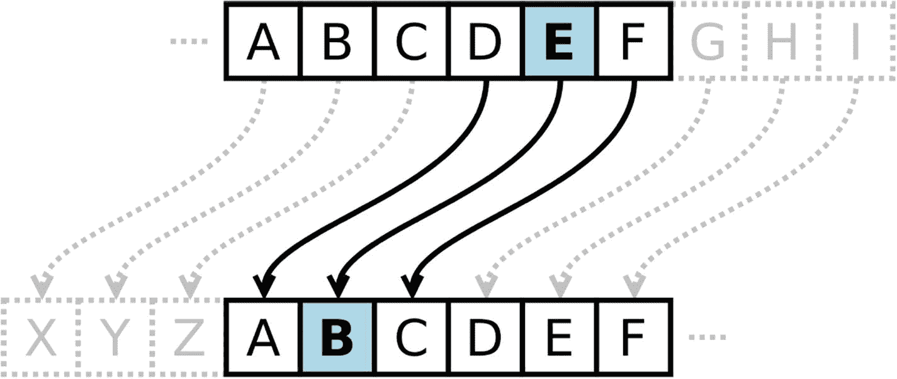
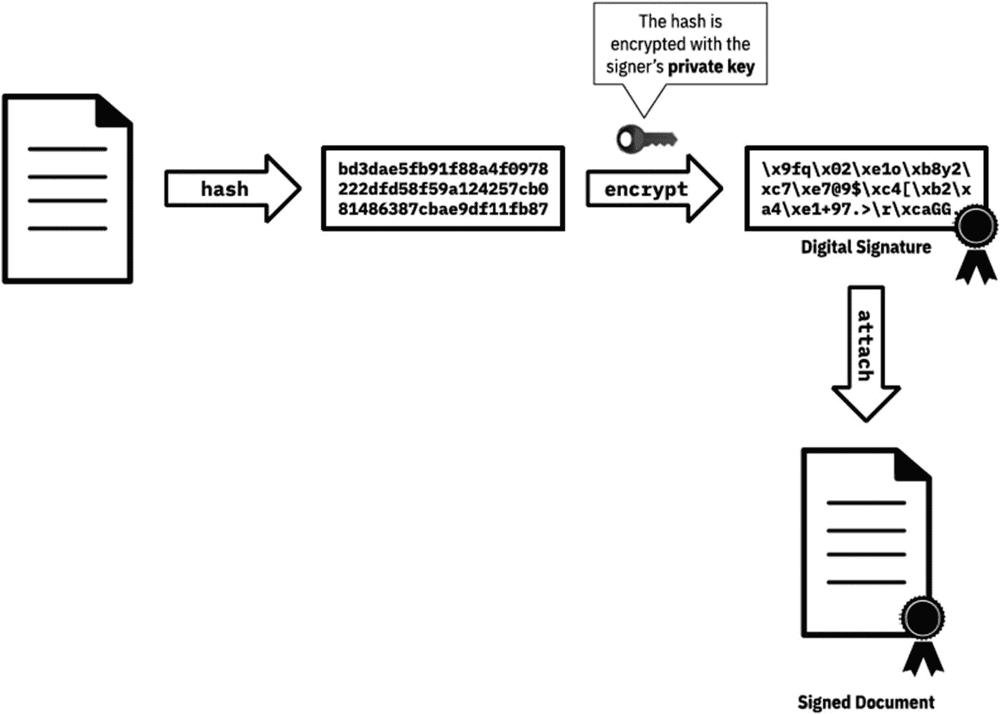
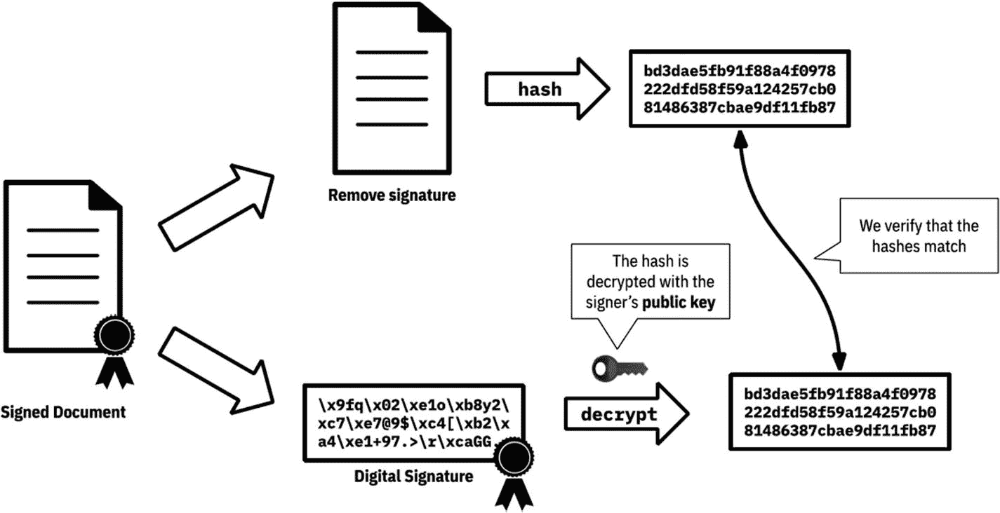
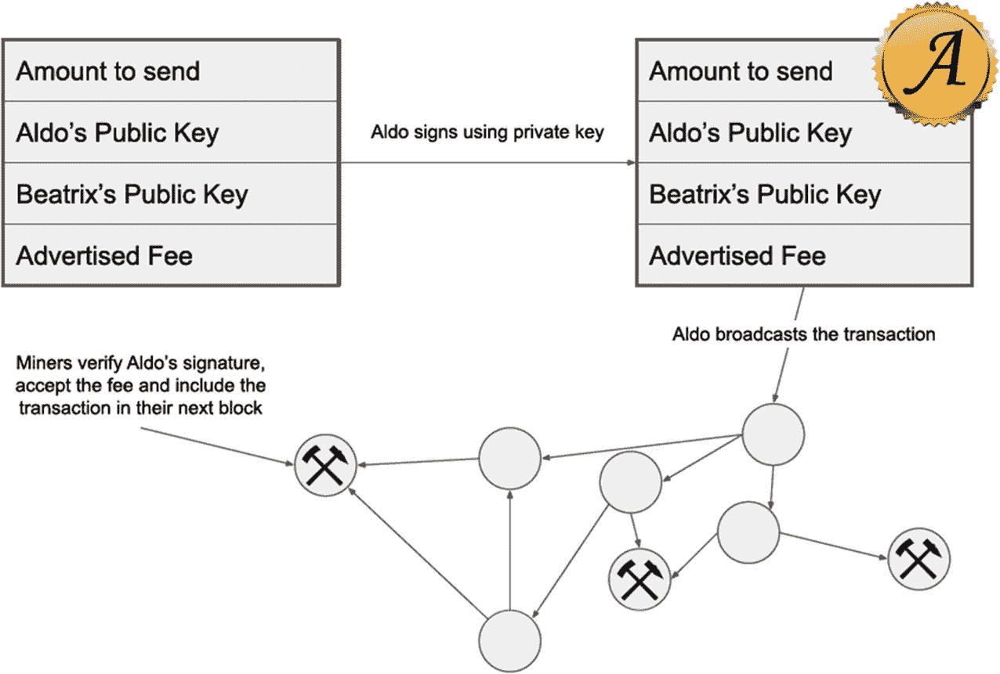

# 密码学入门

本章所涉及算法的研究，远远超出了你所能找到的任何书籍或课程的范畴。它们需要多年的理解和钻研，并建立在特定数学领域所熟悉的代数概念之上。但幸运的是，在实际应用这些工具时，并不需要具备密码算法如何工作的理论洞察力，只要理解其用途和影响即可。换句话说，这里重要的是掌握如何使用密码库的实用知识。

如果你和我一样（不是密码学家），那么对待这些材料的正确方法是保持谨慎。我所理解的密码学知识，仅仅是认识到它是一个终生的平衡课题——一项关于安全性、便捷性和速度之间权衡的研究——并且攻击载体会随着技术进步而不断变化。作为一名初次学习这些内容的人，你应该倾向于那些久经考验、广为人知的最佳实践和工具。在我们的数字世界中，有太多东西岌岌可危，容不得半点偷工减料——互联网上的大多数入侵和攻击都是由简单错误造成的：使用了对某些事物理解不深的糟糕实现，或者更糟的是，个人的“盖章认可”。密码学领域有句格言：*永远不要自行创建你自己的密码学方案*。

密码学（Cryptography）是加密货币（Cryptocurrency）中的“加密”部分。真正的密码学家可能会对使用“crypto”一词来指代加密货币感到懊恼。在现实生活中签署支票与签署区块链交易非常相似——但甚至更加安全，因为签名无法伪造。事实上，签名会根据你签署的文档而发生改变！

## 发送完整性消息

在我们深入探讨数字签名和公钥密码学之前，我想借助你对哈希的了解，展示如何利用哈希在不安全的媒介（如互联网）上发送不可伪造的消息。

> **注意**：注意，这个例子只是一个玩具示例，实际上有构建完善的库可以用于此目的。事实上，Python 自带的 `hmac` 库就是为此目的而构建的。

假设 Alice 想给 Bob 发送一条消息。同时，假设 Alice 和 Bob 在发送消息之前，约定好了共享一个秘密密码 `p@55w0rd`。

Alice 创建一条消息并将其与 `p@55w0rd` 拼接起来；然后计算该消息的哈希值：

```python
from hashlib import sha256
message = "Hello Bob, Let's meet at the Kruger National Park on 2020-12-12 at 1pm."
hash_message = sha256(("p@55w0rd" + message).encode()).hexdigest()
```

计算出的哈希值是 `39aae6ffdb3c0ac1c1cc0f50bf08871a729052cf1133c4c9b44a5bab8fb66211`。Alice 然后将这条消息连同哈希值一起发送给 Bob，Bob 将验证只有 Alice 才能发送它：

```python
from hashlib import sha256
alices_message = "Hello Bob, Let's meet at the Kruger National Park on 2020-12-12 at 1pm."
alices_hash = "39aae6ffdb3c0ac1c1cc0f50bf08871a729052cf1133c4c9b44a5bab8fb66211"
hash_message = sha256(("p@55w0rd" + alices_message).encode()).hexdigest()
if hash_message == alices_hash:
    print("消息未被篡改")
```

这是一个数字签名的简单示例，旨在让你初步了解其工作原理。我们很快会看到，负责验证和签名消息的库更加健壮，并且不需要使用预共享密钥。

### 对称加密

对称加密是最古老的一种加密形式。它涉及与你想要通信的人*共享*一把密钥（`cipher`）。

例如，假设你想和你的兄弟共用你的汽车。你复制了一把钥匙并给他。现在，只有你和你兄弟能启动这辆车。但当你在度假时，你兄弟打电话告诉你钥匙丢了，可能被人偷了。

这个例子说明了对称加密存在的一些问题——主要问题在于你对交易对手的信任，以及维护有权驾驶你汽车的授权人员名单所带来的开销和管理成本。此外，你可能不知道某把钥匙何时已被泄露。让我们来看一个对称加密的经典例子。

## 凯撒密码

大约在公元前 50 年的罗马，尤利乌斯·凯撒在他的私人通信中使用了一种加密方法。这是一种简单的对称加密方法，通过将消息中的字符按固定数量移位来实现。



**图 6-1** 一个凯撒密码示例

事先，凯撒会告知接收者密码（密钥），比如数字 3。那么在加密后的消息中，一个 `D` 就会变成 `A`。接收者反向操作，一个 `A` 就会变回 `D`。

这里的问题是，发送密码这个行为本身是不安全的——任何形式的通信都可能被监视，密钥也可能被获取。我们需要一种摆脱创建和发送共享密钥这一过程的加密形式。这就是公钥密码学被发明的原因，它解决了共享信任的问题。

### 公钥密码学

公钥密码学是*非对称*加密的一个例子。它是保护互联网上几乎所有现代系统安全的加密类型。我们将从一个简单的层面来理解它，让你掌握其工作原理和原因的精要，然后我们会结合一些例子，从更技术性和更细致的角度深入探讨。

公钥密码学涉及的不是一个而是两个（或更多）密钥对，其中一个是保密的。有许多不同的公钥密码算法，但我们将使用流行的 `RSA`（`Rivest`、`Shamir`、`Adleman`——算法创建者）算法（在比特币的情况下，使用的是 `ECDSA`（椭圆曲线数字签名算法））。这些算法是复杂的数学瑰宝，超出了本书的讨论范围，它们有多种变体，各具优势：有些被认为能抵抗量子计算；有些则因其速度或易用性而被选中。但这些算法的输出都是一样的：一对*相关联*的密钥 `A` 和 `B`，你可以用它们来加密消息，以便在不安全的信道上发送。

请注意*相关联*这个词——密钥 `A` 和 `B` 以数学方式链接在一起。`A` 必须保密，只有你知道。但 `B` 是你的*公钥*——你可以在互联网上公开它，别人可以用它来加密一条*只有你*才能解密的消息（使用 `A`）。你可以有效地将你的 `B` 发送给任何希望与你安全通信的人，但你应该像佛罗多守护魔戒一样守护好 `A`。我们一直在使用公钥密码学——大多数时候甚至没有意识到——当你通过 `https` 访问一个网站时，你就是在使用该网站的 `B` 来加密你的传出数据，这样只有该网站才能读取它。

此外——这点非常重要——你可以用你的私钥 `A` 来*签名*一条消息，而 `B`（公开的）可以*验证*签名。区块链上的交易就是这样被验证的。不过后续章节会更详细地讨论。让我们先看一些例子来加深理解。

#### Python 示例

这里有一个来自优秀开源 Python `NaCL` 库的绝妙类比：

> 想象一下，爱丽丝想要将一些有价值的东西运送到她手中。因为东西很贵重，她想确保它能安全送达（即，没有被打开或篡改），并且它不是伪造的（即，它确实来自她期望的发件人，没有人掉包）。
>
> 一种实现方式是，她向发件人（我们称他为鲍勃）提供一个她精心挑选的高安全性盒子。她将这个盒子以及另一样东西提供给鲍勃：一把挂锁，但这是一把没有钥匙的挂锁。爱丽丝自己保留了那把钥匙。鲍勃可以把物品放进盒子，然后将挂锁锁上。但是一旦挂锁锁上，任何没有爱丽丝私钥的人都无法打开这个盒子。
>
> 不过这里有个转折：鲍勃也在盒子上加了一把挂锁。这把挂锁使用了一把鲍勃已经向世界公开的钥匙，这样，如果你有鲍勃的一把钥匙，你就知道这个盒子来自他，因为鲍勃的钥匙会打开鲍勃的挂锁（让我们想象一个即使你知道钥匙也无法伪造挂锁的世界）。然后鲍勃把盒子寄给爱丽丝。
>
> 为了打开盒子，爱丽丝需要两把钥匙：她的私钥，用来打开她自己的挂锁；以及鲍勃广为人知的钥匙。如果鲍勃的钥匙打不开第二把挂锁，那么爱丽丝就知道这不是她期望从鲍勃那里收到的盒子，这是伪造的。
>
> 这种关于身份的双向保证被称为相互认证。

我们将使用 `PyNaCl` 来用 Python 实现上述类比的一个示例。首先，让我们安装 `PyNaCl`：

> **注意**：顺便说一句，`PyNaCl` 是一个经过充分测试的库的绝佳例子，非常适合在你的项目中使用。最重要的是——对于一个加密库来说——它有大量带示例的优秀文档。你可以在这里阅读更多：[`https://pynacl.readthedocs.io/en/stable/public/`](https://pynacl.readthedocs.io/en/stable/public/)

```
poetry add pynacl
```

然后让我们激活虚拟环境并启动一个 Python 解释器：

```
poetry shell
ipython
```

我们将使用给出的类比来深入解释这些概念。鲍勃和爱丽丝都将生成他们自己的公私钥对，鲍勃将加密一条消息给爱丽丝，供她解密。`PyNaCl` 为我们提供了一个非常有用的 `Box` 类，它模拟了上述类比。

我们开始吧：

```python
from nacl.public import PrivateKey, Box
#### 为爱丽丝和鲍勃生成密钥
alices_private_key = PrivateKey.generate()
bobs_private_key = PrivateKey.generate()
#### 公钥由私钥生成
alices_public_key = alices_private_key.public_key
bobs_public_key = bobs_private_key.public_key
#### 鲍勃将发送一条消息给爱丽丝...
# 所以他用他的私钥和爱丽丝的公钥创建了一个 Box
bobs_box = Box(bobs_private_key, alices_public_key)
#### 我们加密鲍勃的秘密消息（字节形式）...
encrypted = bobs_box.encrypt(b"I am Satoshi")
# 爱丽丝用她的私钥和鲍勃的公钥创建了第二个 Box，这样她就能解密该消息
alices_box = Box(alices_private_key, bobs_public_key)
#### 现在爱丽丝可以解密消息：
plaintext = alices_box.decrypt(encrypted)
print(plaintext.decode('utf-8'))
I am Satoshi
```

如果消息被篡改或无法解密，`PyNaCl` 将抛出一个异常。

### 数字签名

数字签名的存在原因，与你在现实生活中签署文件的原因大致相同：它能让接收方对文件的真实性深信不疑。数字签名能满足以下三个关键主张：

1.  **真实性**：“这必然是丹尼尔签署的。”
2.  **完整性**：“这份数据未被伪造或篡改。”
3.  **不可抵赖性**：“丹尼尔无法否认曾发送过这份数据。”

数字签名利用公钥密码学来满足这些主张。正如我们在示例中，爱丽丝用鲍勃的公钥创建了一个“盒子”，我们同样使用鲍勃的公钥来验证，只有鲍勃才能发送并签署一份数据。其核心思想很简单：任何拥有我公钥的人，都能快速验证我确实签署了一条消息。

下图展示了这一思想。



**图 6-2** – 数字签名过程

1.  首先，对未加密的纯文本数据进行哈希处理（防止篡改）。
2.  然后，使用私钥对哈希值进行加密。
3.  最后，将加密后的哈希值附加（拼接）到数据上。

让我们看看在 Python 中如何实现。首先，从鲍勃的角度出发，我们将创建一个密钥对；然后用它对一条消息进行签名。之后，我们将展示任何人都可以使用该公钥来验证这条消息。

```python
1  import nacl.encoding
2  import nacl.signing
4  # 为鲍勃生成一个新的密钥对
5  bobs_private_key = nacl.signing.SigningKey.generate()
6  bobs_public_key = bobs_private_key.verify_key
8  # 由于是字节数据，我们需要将密钥序列化为可读格式后再发布：
9  bobs_public_key_hex = bobs_public_key.encode(encoder=nacl.encoding.HexEncoder)
11  # 现在，用它来签署一条消息
12  signed = bobs_private_key.sign(b"请向爱丽丝发送 37 美元")
```

在第 `10` 行生成的公钥（十六进制）如下：

```
e7ff10ede8a691b982516059a0627d369504e3633e0297e28ec5fc71994577d3
```

首先，我们来看看第 `12` 行中的 `signed` 消息是什么样的。如你所见，消息本身并未加密！但它附加了一些包含签名字节的数据：

```
b'\x9fq\x02\xe1o\xb8y2\xc7\xe7@9$\xc4\xb2\xa4\xe1+97.>\r\xcaGG\x8a
Y\x86\xc3\xfe\xb9W{\xc4\x9c\x87\x00(\x1d\xe9}j\xe4\xed\xd2\x0b\xcb\x88\x87J\xecy\x04GQ
H\xea\xcc\xc2\xe7\x03 请向爱丽丝发送 37 美元'
```

#### 验证过程

验证过程使用签名者的公钥来检查签名。



**图 6-3** – 验证数字签名

让我们看看如何用公钥来验证该消息确实由鲍勃签署：

```python
1  import nacl.encoding
2  import nacl.signing
5  # 来自上述示例...
6  bobs_public_key = b'e7ff10ede8a691b982516059a0627d369504e3633e0297e28ec5fc71994577d3'
8  # 我们生成 verify_key
9  verify_key = nacl.signing.VerifyKey(bobs_public_key, encoder=nacl.encoding.HexEncoder)
11  signed_message = b'\x9fq\x02\xe1o\xb8y2\xc7\xe7@9$\xc4[\xb2\xa4\xe1+97.>\r\xca GG\x8a Y\x86\xc3\xfe\xb9W{\xc4\x9c\x87\x00(\x1d\xe9}j\xe4\xed\xd2\x0b\xcb\x88\x87 J\xecy\x04GQH\xea\xcc\xc2\xe7\x03 请向爱丽丝发送 37 美元'
13  # 现在我们尝试验证消息
14  # 任何验证失败都将引发异常
15  verify_key.verify(signed_message)
```

**注意：** 上面的示例是否清晰易懂？建议你暂停一下，在 Python 解释器中亲自尝试，直到掌握使用 NaCl 的要领。随着我们进入下一章关于交易的内容，它会变得愈发重要。

## 区块链上的钱包

与比特币不同，以太坊采用的是基于账户的模型——这意味着区块链上的每个“用户”都会拥有一个账户。比特币没有*账户*的概念；相反，它的系统非常类似于现金在实物钱包中的流入和流出方式。比特币系统被称为 UTXO（未花费交易输出），这是一种用于建模交易的优雅数据结构。我们将在下一章讨论 UTXO，但现在先让我们专注于以太坊的基于账户的模型。

当你首次与以太坊交互时，通常会生成一个密钥对。你的以太坊*地址*实际上就是你的公钥。你的私钥则被安全地存储在某处，可能是某种软件钱包或硬件钱包中。如果其他人想通过以太坊区块链向你转账，他们只需要知道你的公钥即可。但只有你能动用这笔钱，因为只有你持有私钥。

### 创建交易节点

要实现一个功能完备的加密货币，我们区块链中的数据必须是*交易*。每笔交易都将代币的所有权从一个私钥转移到另一个私钥。这些交易被打包到每个区块中，并通过*挖矿*过程来扩展区块链；事实上，区块存在的时间越久，其确定性就越高——它成为事实区块链一部分的可能性就越大。在任何时候，矿工们都在忙于挖掘包含不同交易的、略有差异的区块——这是一场寻找新区块的竞赛——当某个矿工找到一个区块时，他会广播该区块，其他矿工则会放弃自己当前的区块（他们在竞赛中失败了）并开始寻找下一个区块。这些被“放弃”的区块通常称为孤块。

在本章中，我们将整合之前学到的所有概念，并将它们融入一个能够在点对点网络中运行的全节点。然后，利用上一章的密码学知识，我们将阐明交易是如何创建和验证的。

## 交易与工作量总结

### 脱离比特币的 UTXO 模型

如果你曾研究过比特币，那么很可能听说过 UTXO，或者更正式的名称——未花费交易输出（UTXO）。这个模型很优雅，因为它类似于现实世界中硬通货的运作方式——没有账户的概念：金钱以“纸币”的形式存在，可能存放在某人的钱包（公钥）中。UTXO 与基于账户的模型形成对比，后者大致类似于你银行账户的工作方式：你给别人你的账号，他们就能向你的账户转账。一些加密货币（最著名的是以太坊）就采用这种基于账户的模型。

我们将要实现的正是这个模型，因为它易于推理、测试和解释。我们在设计类时将使其能够方便地替换为 UTXO 模型（将此作为练习留给读者）。

### 矿工的角色

正如我们在第 4 章所见，矿工的角色是通过为区块找到合适的哈希值来生成新的代币。在挖矿过程中，矿工会将收到的交易收集到一个池子中——在比特币中被称为 `mempool`（内存池）——等待被纳入下一个区块。如果等待交易的量超过了区块的容量，矿工会选择手续费最高的交易以增加利润。在 2017 年的加密货币热潮中，由于交易积压严重，比特币交易的手续费一度超过了 40 美元。关于比特币扩容的讨论经常涉及交易内存池和交易费用，其中最关键的问题是区块大小：一个区块中应该存储多少笔交易？在比特币中，限制是 1 兆字节，平均大约能容纳 1700 笔交易。

## 我们将如何实现交易

我们将对我们的 `funcoin` 节点进行一些改动；具体来说，我们必须找出交易如何在整个网络中传播。点对点（`P2P`）网络的结构方式对于加密货币的可靠性至关重要。比特币被认为是一种“推送”（push）网络：不是节点向对等节点查询新交易，而是当一个节点收到新交易时，它会将该交易*推送*给它的所有对等节点。宽松地说，当一个新节点加入网络时，它应该会产生一种*八卦*（gossip）效应，从而使得对等节点的对等节点也能了解到它的存在，并能够可靠地向它发送未来的交易。

交易的数据结构很简单，包含以下内容：



图 7-1：使用数字签名创建交易

1. 发送者的公钥
2. 接收者的公钥
3. 要转移的金额
4. 一个公示的费用（可以理解为“小费”，用于激励矿工将这笔交易包含在下一个区块中）

为了发送或接收 `funcoin`，我们需要生成一个钱包——一个公私钥对。要发送 `funcoin` 给 Beatrix，Aldo 必须创建一笔包含他和 Beatrix 的公钥以及要发送的金额的交易。然后，这笔交易会使用 Aldo 的私钥进行签名。

网络中的任何对等节点都可以通过检查 Aldo 的公钥来验证该交易是否真实有效。如果交易通过了验证，那么稍后，当有矿工将其打包时，它就会被添加到区块链中。

## 勘误与变更

随着依赖项和库的变更，以及人们发现这个初始实现中的错误，随着时间的推移，实际运行的代码与图书内容出现差异是不可避免的，希望这种差异是微小的。如果您需要寻求帮助，请随时查阅公共 GitHub 仓库：[`https://github.com/dvf/learn-blockchains-book/`](https://github.com/dvf/learn-blockchains-book/)。

## 为我们的全节点创建项目

### 安装依赖项

在项目的这个阶段，我们已经涵盖了构建节点所需的所有原子单元：

- 一个用于维护不可变数据链的区块链
- 一个允许客户端连接并来回发送数据的服务器
- 一个用于创建新 `funcoin` 的挖矿算法
- 允许我们验证和构建交易的密码学基础知识

我们现在需要考虑节点的架构，并使用给定的原子单元作为可导入的模块来重构我们的项目。我们将创建一个新的 Python 项目（文件夹）来执行此操作。让我们创建一个新文件夹，并将其初始化为一个空白的 Poetry 项目：

```bash
$ mkdir funcoin
$ cd funcoin
$ poetry init -n
```

并添加必要的依赖项（我将稍后讨论每个依赖项的用途）：

```bash
$ poetry add pynacl structlog colorama marshmallow marshmallow-oneofschema aiohttp
```

**注意**

您可能会注意到新增了 `structlog`——稍后，我们将用它来代替代码中散落的 `print()` 语句，以提供更流畅、更有意义的输出。

Poetry 现在将在适当的位置创建一个虚拟环境，并安装依赖项：

```
Creating virtualenv funcoin-PPSjSr3P-py3.8 in
/Users/dvf/Library/Caches/pypoetry/virtualenvs
Using version ²⁰.1.0 for structlog
Using version ¹.3.0 for pynacl
Updating dependencies
Resolving dependencies... (1.2s)
Writing lock file
Package operations: 22 installs, 0 updates, 0 removals
- Installing idna (2.9)
- Installing multidict (4.7.6)
- Installing pycparser (2.20)
- Installing pyparsing (2.4.7)
- Installing six (1.14.0)
- Installing async-timeout (3.0.1)
- Installing attrs (19.3.0)
- Installing cffi (1.14.0)
- Installing chardet (3.0.4)
- Installing colorama (0.4.3)
- Installing marshmallow (3.6.0)
- Installing more-itertools (8.3.0)
- Installing packaging (20.3)
- Installing pluggy (0.13.1)
- Installing py (1.8.1)
- Installing wcwidth (0.1.9)
- Installing yarl (1.4.2)
- Installing aiohttp (3.6.2)
- Installing marshmallow-oneofschema (2.0.1)
- Installing pynacl (1.3.0)
- Installing pytest (5.4.2)
- Installing structlog (20.1.0)
```

现在，您的 `funcoin` 项目目录中应该已经有了 `pyproject.toml` 和 `poetry.lock` 文件。以下是每个包用途的摘要：

| 包 | 描述 |
|---|---|
| `pynacl` | 对交易进行签名和验证 |
| `structlog` | 日志记录库（优于 `print()` 语句） |
| `colorama` | 允许输出彩色内容（在日志记录中） |
| `marshmallow` | 验证数据结构，例如我们的节点将发送和接收的 JSON 消息 |
| `marshmallow-oneofschema` | 允许 `marshmallow` 验证更复杂的数据结构 |
| `aiohttp` | 一个异步 HTTP 客户端（我们将需要它来查找我们的公网 IP 地址） |

### 创建文件结构

现在，我们将创建一个嵌套的 `funcoin` 文件夹来存放我们的“原子”单元——组合起来形成一个完整节点的不同方面或类。为以下内容创建空文件：

```bash
touch node.py
mkdir funcoin
cd funcoin
touch __init__.py
touch blockchain.py
touch connections.py
touch transactions.py
touch server.py
touch types.py
touch messages.py
touch utils.py
```

您的完整文件夹结构应如下所示：

```
funcoin
├── funcoin
│     ├── __init__.py
│     ├── blockchain.py
│     ├── connections.py
│     ├── messages.py
│     ├── peers.py
│     ├── server.py
│     ├── transactions.py
│     ├── types.py
│     └── utils.py
├── __init__.py
├── node.py
├── poetry.lock
└── pyproject.toml
```

`funcoin/funcoin` 目录下的空文件将包含我们即将从前几章重构的代码。让我们检查一下我们节点的结构。

## 构建我们的节点结构

### 职责分配

我们将使用 `node.py` 作为运行节点的入口点。“什么是入口点？”你可能会问。可以将其视为运行节点的规范方式。在设计程序时，我发现尽可能抽象化是有帮助的——在实现任何功能之前，先设计好你希望程序如何运行：

```python
#### 使用一些配置实例化服务器
server = Server(**some_config)
#### 启动服务器
server.run()
```

请稍作停顿，思考一下我们将要实现的各个部分：你认为我们虚构的 `Server()` 类是否应该负责保存区块链？或者处理交易？如果它负责运行*一切*，那么后续我们如何将交易模型替换为像 UTXO 这样的其他模型呢？

设计应用程序时的一个健全原则是：*每个模块应只负责一件事，并且把它做好*。这里有一种更好的方式来抽象我们的服务器：

```python
from funcoin.blockchain import Blockchain
from funcoin.pool import ConnectionPool
from funcoin.server import Server

#### 实例化区块链和用于“对等节点”的连接池
blockchain = Blockchain()
connection_pool = ConnectionPool()

#### 实例化服务器，并将我们的模块“嵌入”其中
server = Server(blockchain, connection_pool)

#### 现在启动服务器
server.start()
```

现在，我们有了一个更加清晰的抽象——服务器完全无需关心区块链；它只需要专注于成为一个服务器。在不对各个模块进行解释的前提下，这是我们最终 `node.py` 的模样：

```python
import asyncio

from funcoin.blockchain import Blockchain
from funcoin.connections import ConnectionPool
from funcoin.peers import P2PProtocol
from funcoin.server import Server

blockchain = Blockchain()         ①
connection_pool = ConnectionPool() ②

server = Server(blockchain, connection_pool, P2PProtocol)

async def main():
    # 启动服务器
    await server.listen()

asyncio.run(main())
```

*清单 7-1：`funcoin/node.py`*

请注意 `ConnectionPool` ① 和 `Blockchain` ② 类的实例化。这确保了它们是带有状态的单例——意味着任何通过 `from node import connection_pool` 导入的模块都将获得同一个已实例化的对象，从而保持状态一致。

在实现它们之前，我们先设定四个关键模块的目标。

| 模块 | 描述 |
|---|---|
| `blockchain` | 用于存放我们 `Blockchain` 类的模块，该类包含我们在前几章构建的区块链实例 |
| `peers` | 处理对等节点可能发送给我们的消息传播逻辑：即我们如何进行通信。我们将其称为 `P2PProtocol` |
| `connections` | 处理与我们节点通信的活动连接“池”的逻辑 |
| `server` | 存放我们基本 TCP `Server` 的地方 |

> **注意**
> 由于我们使用的是 `asyncio`（而不是线程），我们极大地简化了并发问题：使用线程时，程序员需要担心竞态条件（两个或多个线程争相更新或接收数据）。这种方法的缺点是代码可能变得难以阅读和理解（但根据我的经验，如果你花时间去遵循它，是非常值得的）。

我们的入口点只有一个函数 `main()`。这是 `asyncio` 程序的典型特征，用于启动我们的服务器。

# 服务器模块

我们将改造在第 5 章创建的聊天服务器，并使其适应我们的目的，代码位于`funcoin/server.py`。

以下是我们类的粗略框架：

```python
class Server:
    def __init__(self, blockchain, connection_pool, p2p_protocol):
        ...

    async def get_external_ip(self):
        # 查找我们的“外部 IP”，以便向对等节点广播
        ...

    async def handle_connection(self, reader: StreamReader, writer: StreamWriter):
        # 当收到新连接时调用此函数
        # `writer` 对象代表连接的对等节点
        while True:
            try:
                # 处理并/或回复传入的数据
                ...
            except (asyncio.exceptions.IncompleteReadError, ConnectionError):
                # 发生错误，跳出等待循环
                break

    async def listen(self, hostname="0.0.0.0", port=8888):
        # 这是启动我们服务器的监听方法
        server = await asyncio.start_server(self.handle_connection, hostname, port)
        logger.info(f"服务器正在监听 {hostname}:{port}")
        async with server:
            await server.serve_forever()
```

清单 7-2：`server.py`

让我们依次充实这些方法。如果你在初次检查时没有完全“理解”，不必担心；随着我们不断引导启动各个模块，我们会频繁地回头看这个服务器。

1. ① 这就是我们如何将模块“引导”到服务器的方式：服务器类（以及任何附加到其上的内容）将始终能够通过`self.blockchain`访问我们的`blockchain`。

2. ② 虽然我们还没有实现`get_external_ip()`，但它负责查找我们的外部 IP 地址。

3. ③ 在这里，我们永远等待，直到收到以换行符（`\n`）结尾的消息。这是你需要留意的第一个潜在漏洞，因为任何人都可能用无休止的消息来淹没我们的服务器。

4. ④ 我们尝试通过假定消息是以 UTF-8 格式字符串发送的来解码它。

5. ⑤ 也许我们很快了解到的最令人惊讶的事情是使用了`marshmallow`（我们之前安装的库）来解析和验证来自对等节点的传入消息。

6. ⑥ 一旦消息被成功解析，后续代码就可以假设所有相关字段都存在，我们可以使用我们的`p2p_protocol`来决定如何处理。

7. ⑦ 注意`structlog`的导入和使用——我们用它来替换`print()`语句。当我们运行整个节点时，它会在控制台输出高度可读的信息。例如，它会告诉你日志来自哪个文件。

```python
import asyncio
from asyncio import StreamReader, StreamWriter

import structlog
from marshmallow.exceptions import MarshmallowError

from funcoin.messages import BaseSchema
from funcoin.utils import get_external_ip

logger = structlog.getLogger()  # ⑦

class Server:
    def __init__(self, blockchain, connection_pool, p2p_protocol):
        self.blockchain = blockchain  # ①
        self.connection_pool = connection_pool
        self.p2p_protocol = p2p_protocol
        self.external_ip = None
        self.external_port = None

        if not (blockchain and connection_pool and p2p_protocol):
            logger.error("'blockchain'、'connection_pool' 和 'gossip_protocol' 都必须被实例化")
            raise Exception("无法启动")

    async def get_external_ip(self):
        self.external_ip = await get_external_ip()  # ②

    async def handle_connection(self, reader: StreamReader, writer: StreamWriter):
        while True:
            try:
                # 永远等待新数据的到来
                data = await reader.readuntil(b"\n")  # ③

                decoded_data = data.decode("utf8").strip()  # ④

                try:
                    message = BaseSchema().loads(decoded_data)  # ⑤
                except MarshmallowError:
                    logger.info("收到无法读取的消息", peer=writer)
                    break

                # 从消息中提取地址，并添加到写入器对象中
                writer.address = message["meta"]["address"]

                # 将对等节点添加到连接池中
                self.connection_pool.add_peer(writer)

                # ...并处理消息
                await self.p2p_protocol.handle_message(message, writer)  # ⑥

                await writer.drain()
                if writer.is_closing():
                    break
            except (asyncio.exceptions.IncompleteReadError, ConnectionError):
                # 发生错误，跳出等待循环
                break
            finally:
                # 连接已关闭，开始清理...
                writer.close()
                await writer.wait_closed()
                self.connection_pool.remove_peer(writer)

    async def listen(self, hostname="0.0.0.0", port=8888):
        server = await asyncio.start_server(self.handle_connection, hostname, port)
        logger.info(f"服务器正在监听 {hostname}:{port}")
        self.external_ip = await self.get_external_ip()
        self.external_port = 8888
        async with server:
            await server.serve_forever()
```

清单 7-3 `funcoin/node.py`

你无需理解我们在`Server`类中实现的每一个细节。相反，请从宏观角度把握整体逻辑，思考其中涉及的更重要的原则。

## 区块链模块

让我们回顾一下我们在第 3 章构建的`Blockchain`类，并将其粘贴到`funcoin/blockchain.py`中。

```python
import asyncio
import json
import math
import random
from hashlib import sha256
from time import time

import structlog

logger = structlog.getLogger("blockchain")

class Blockchain(object):
    def __init__(self):
        self.chain = []
        self.pending_transactions = []
        self.target = "0000ffffffffffffffffffffffffffffffffffffffffffffffffffffffffffff"
        # 创建创世区块
        logger.info("正在创建创世区块")
        self.chain.append(self.new_block())

    def new_block(self):
        block = self.create_block(
            height=len(self.chain),
            transactions=self.pending_transactions,
            previous_hash=self.last_block["hash"] if self.last_block else None,
            nonce=format(random.getrandbits(64), "x"),
            target=self.target,
            timestamp=time(),
        )
        # 重置待处理交易列表
        self.pending_transactions = []
        return block

    @staticmethod
    def create_block(
        height, transactions, previous_hash, nonce, target, timestamp=None
    ):
        block = {
            "height": height,
            "transactions": transactions,
            "previous_hash": previous_hash,
            "nonce": nonce,
            "target": target,
            "timestamp": timestamp or time(),
        }
        # 获取新区块的哈希，并将其添加到区块中
        block_string = json.dumps(block, sort_keys=True).encode()
        block["hash"] = sha256(block_string).hexdigest()
        return block

    @staticmethod
    def hash(block):
        # 确保字典已排序，否则哈希值会不一致
        block_string = json.dumps(block, sort_keys=True).encode()
        return sha256(block_string).hexdigest()

    @property
    def last_block(self):
        # 返回链中的最后一个区块（如果存在区块的话）
        return self.chain[-1] if self.chain else None

    def valid_block(self, block):
        # 检查区块的哈希是否小于目标值...
        return block["hash"] < self.target

    def add_block(self, block):
        # TODO: 在此处添加适当的验证逻辑！
        self.chain.append(block)

    def recalculate_target(self, block_index):
        """
        返回挖掘一个区块所需低于的目标数值
        """
        # 检查是否需要重新计算目标值
        if block_index % 10 == 0:
            # 10 个区块的预期时间跨度
            expected_timespan = 10 * 10
            # 计算实际时间跨度
            actual_timespan = self.chain[-1]["timestamp"] - self.chain[-10]["timestamp"]
            # 计算偏移比率
            ratio = actual_timespan / expected_timespan
            # 调整比率，避免极端情况
            ratio = max(0.25, ratio)
            ratio = min(4.00, ratio)
            # 将当前目标值乘以比率来计算新目标值
            new_target = int(self.target, 16) * ratio
            self.target = format(math.floor(new_target), "x").zfill(64)
            logger.info(f"已计算新的挖矿目标值: {self.target}")
        return self.target

    async def get_blocks_after_timestamp(self, timestamp):
        for index, block in enumerate(self.chain):
            if timestamp < block["timestamp"]:
                return self.chain[index:]

    async def mine_new_block(self):
        self.recalculate_target(self.last_block["index"] + 1)
        while True:
            new_block = self.new_block()
            if self.valid_block(new_block):
                break
            await asyncio.sleep(0)
        self.chain.append(new_block)
        logger.info("发现新区块: ", new_block)
```

清单 7-4 `funcoin/blockchain.py`

这里唯一的变化是引入了`structlog`，我们将每个`print()`语句替换为了更实用的`logger`。

## `connections` 模块

在`funcoin/connections.py`中，我们将存储管理`ConnectionPool`的所有逻辑，该逻辑源于我们聊天服务器的第5章。以下是该类的概要：

```python
class ConnectionPool:
    def __init__ (self):
        ...
    def broadcast(self,  message):
        # 向所有已连接的对等节点广播消息的方法
        ...
    @staticmethod
    def get_address_string(writer):
        # 获取对等节点的 ip:port（地址）
        ...
    def add_peer(self, writer):
        # 将对等节点添加到我们的连接池中
        ...
    def remove_peer(self, writer):
        # 从我们的连接池中移除一个对等节点
        ...
    def get_alive_peers(self, count):
        # 返回一些已连接的对等节点
        ...
```

让我们看看完整实现的样貌。由于大多数方法已经在第5章中实现，这里不会有意料之外的内容。主要变化是新增了方法：`get_alive_peers()` 和 `get_address_string()`。

- ① 这里我们使用一个 `dict`，将 `address` 映射到 `writer`（代表对等连接）。
- ② 映射中的 `address` 字符串只是对等节点的 `ip:port` 组合——这一点很重要，因为这是我们唯一标识连接的方式。
- ③ 我们使用 `take()` 函数从池中返回 `count` 数量的对等节点。

```python
import structlog
from more_itertools import take

logger = structlog.getLogger(__name__)

class ConnectionPool:
    def __init__ (self):
        self.connection_pool = dict() ①

    def broadcast(self,  message):
        for user in self.connection_pool:
            user.write(f"{message}".encode())

    @staticmethod
    def get_address_string(writer):
        ip = writer.address["ip"]
        port = writer.address["port"]
        return f"{ip}:{port}" ②

    def add_peer(self, writer):
        address = self.get_address_string(writer)
        self.connection_pool[address] = writer
        logger.info("已向池中添加新对等节点", address=address)

    def remove_peer(self, writer):
        address = self.get_address_string(writer)
        self.connection_pool.pop(address)
        logger.info("已从池中移除对等节点", address=address)

    def get_alive_peers(self, count):
        # TODO（读者）：按活跃度排序，但这里暂时只获取前 count 个
        return take(count , self.connection_pool.items()) ③
```

*列表 7-5：`funcoin/blockchain.py`*

## `peers` 模块

这可能是目前为止最重要的模块：它代表了在 P2P 网络中发送和接收消息的逻辑。让我们在`funcoin/peers.py`中定义这些方法；它们会出乎意料地简单：

- ① 我们需要一个错误类，可以用来从导入代码中“捕获”问题。

```python
class P2PError(Exception): ①
    pass
class P2PProtocol:
    def __init__ (self, server):
        ...
    @staticmethod
    async def send_message(writer, message):
        # 向特定对等节点（writer 对象）发送消息
        ...
    async def handle_message(self, message, writer):
        # 处理服务器传入的消息
        # 将该消息分派给更具体的方法：handle_()
        ...
    async def handle_ping(self, message, writer):
        # 处理传入的 "ping" 消息
        ...
    async def handle_block(self, message, writer):
        # 处理传入的 "block" 消息
        ...
    async def handle_transaction(self, message, writer):
        # 处理传入的 "transaction" 消息
        ...
    async def handle_peers(self, message, writer):
        # 处理传入的 "peers" 消息
        ...
```

每个方法中的注释说明了我们需要实现的代码。这里最重要的方法是`handle_message()`方法。我们还没有定义每个对等节点可以发送的消息，所以让我们定义消息的基本形式：

```json
{
  "meta": {
    "address": {
      "ip": ,
      "port": 
    },
    "client": "funcoin 0.1"
  },
  "message": {
    "name": ,
    "payload": 
  }
}
```

也就是说，所有在 P2P 网络中发送的消息都共享此结构。`meta` 键包含关于发送 `message` 的对等节点（即使该对等节点是我们自己）的信息，而 `message` 键包含正在发送的消息的 `name` 和 `payload`。对于 `funcoin`，我们将实现四种消息。

| 消息名称 | 描述 |
| --- | --- |
| `Ping` | 节点在发起连接时发送给对等节点的初始消息 |
| `Transaction` | 单个交易，在节点之间传播 |
| `Peers` | 一组对等节点可能知道或不知道的地址（用于构建他们的网络） |
| `Block` | 单个区块（可能是最近挖出的），供对等节点添加到其区块链中 |

在我们深入讨论这些消息的具体内容之前，让我们先完成`funcoin/peers.py`模块，实现给定的方法。

```python
import asyncio

import structlog
from funcoin.messages import (
  create_peers_message,
  create_block_message,
  create_transaction_message,
  create_ping_message,
)
from funcoin.transactions import validate_transaction

logger = structlog.getLogger(__name__)

class P2PError(Exception):
    pass

class P2PProtocol:
    def __init__ (self, server):
        self.server = server
        self.blockchain = server.blockchain
        self.connection_pool = server.connection_pool

    @staticmethod
    async def send_message(writer, message):
        writer.write(message.encode() + b"\n")

    async def handle_message(self, message, writer):
        message_handlers = {
            "block": self.handle_block,
            "ping": self.handle_ping,
            "peers": self.handle_peers,
            "transaction": self.handle_transaction,
        }

        handler = message_handlers.get(message["name"])
        if not handler:
            raise P2PError("缺少该消息的处理程序")

        await handler(message, writer)

    async def handle_ping(self, message, writer):
        block_height = message["payload"]["block_height"]

        # 如果他们是矿工，我们将其标记为矿工
        writer.is_miner = message["payload"]["is_miner"]

        # 让我们向该用户发送我们最“活跃”的 20 个对等节点
        peers = self.connection_pool.get_alive_peers(20)
        peers_message = create_peers_message(self.server.external_ip, self.server.external_port, peers
        await self.send_message(writer, peers_message)
```

```python
### 如果他们的区块比我们少，就发送给他们
if block_height < self.blockchain.last_block["height"]:
    # 从他们的高度开始，依次发送每个区块
    for block in self.blockchain.chain[block_height + 1:]:
        await self.send_message(
            writer,
            create_block_message(
                self.server.external_ip, self.server.external_port, block
            ),
        )

async def handle_transaction(self, message, writer):
    """
    当我们接收到对等节点广播的交易时执行
    """
    logger.info("接收到交易")

# 验证交易
    tx = message["payload"]

if validate_transaction(tx) is True:
        # 将交易添加到我们的交易池中，并传播给对等节点
        if tx not in self.blockchain.pending_transactions:
            self.blockchain.pending_transactions.append(tx)

for peer in self.connection_pool.get_alive_peers(20):
                await self.send_message(
                    peer,
                    create_transaction_message(
                        self.server.external_ip, self.server.external_port, tx
                    ),
                )
    else:
        logger.warning("接收到无效交易")

async def handle_block(self, message, writer):
    """
    当我们接收到对等节点广播的区块时执行
    """
    logger.info("接收到新区块")

block = message["payload"]

# 将区块交给区块链，如果有效则追加
    self.blockchain.add_block(block)

# 将区块传输给我们的对等节点
    for peer in self.connection_pool.get_alive_peers(20):
        await self.send_message(
            peer,
            create_block_message(
                self.server.external_ip, self.server.external_port, block
            ),
        )

async def handle_peers(self, message, writer):
    """
    当我们接收到对等节点广播的区块时执行
    """
    logger.info("接收到新对等节点")

peers = message["payload"]

# 构造一个用于发送给每个对等节点的 ping 消息
    ping_message = create_ping_message(
        self.server.external_ip,
        self.server.external_port,
        len(self.blockchain.chain),
        len(self.connection_pool.get_alive_peers(50)),
        False,
    )

for peer in peers:
        # 建立连接，如果成功则添加到连接池
        reader, writer = await asyncio.open_connection(peer["ip"], peer["port"])

# 我们只对 "writer" 感兴趣
        self.connection_pool.add_peer(writer)

# 向对等节点发送 PING 消息
        await self.send_message(writer, ping_message)
```

*列表 7-6：`funcoin/peers.py`*

请特别注意 `handle_ping` 方法（我已添加注释以便于解释）。但此时，有必要讨论一下我们加密货币中发送的消息结构。

## 消息传递

之前，我们展示了一个通用消息格式的 JSON 示例；以下是其表格形式：

**表 7-1：通用消息格式**

| 字段名 | 类型 | 描述 |
| --- | --- | --- |
| `Meta` | `meta` | — |
| `Message` | `message` | — |

`meta` 对象包含在每条消息中，并包含与发送者相关的信息。

**表 7-2：`meta` 对象**

| 字段名 | 类型 | 描述 |
| --- | --- | --- |
| `address` | `Peer` | 包含发送此消息的节点的网络地址信息 |
| `client` | `String` | 发送消息的客户端名称（或版本）。例如：`funcoin-0.1` |

`peer` 类型也相当通用。它出现在待发送的对等节点列表中，例如，新加入网络的节点，或每条已发送消息的 `meta` 块中。

**表 7-3：`peer` 类型（代表一个对等节点）**

| 字段名 | 类型 | 描述 |
| --- | --- | --- |
| `Ip` | `string` | 对等节点的公网 IP |
| `Port` | `Int` | 对等节点监听的端口 |
| `last_seen` | `Int` | 对等节点上次被看到时间的 UTC 时间戳 |

现在，让我们看看网络中四种消息类型的结构。`message` 键很简单；每条消息都有一个 `name` 和一个 `payload`（具体内容取决于发送的消息类型）。

**表 7-4：`message` 对象**

| 字段名 | 类型 | 描述 |
| --- | --- | --- |
| `Name` | `string` | 消息的名称（以便接收方知道如何解析） |
| `Payload` | `object` | 与消息类型对应的消息负载。有关不同的负载，请参见下一节 |

让我们定义不同类型的负载。

**表 7-8：`block` 负载**

| 键 | 值 |
| --- | --- |
| `Name` | `block` |
| `Payload` | **键** | **类型** |
| | `mined_by` | `string` |
| | `transactions` | `List[transaction]` |
| | `height` | `int` |
| | `difficulty` | `int` |
| | `hash` | `string` |
| | `previous_hash` | `string` |
| | `nonce` | `string` |
| | `timestamp` | `int` |

**表 7-7：`peers` 负载**

| 键 | 值 |
| --- | --- |
| `Name` | `Peers` |
| `Payload` | **键** | **类型** |
| | `Peers` | `List[peer]` |

**表 7-6：`transaction` 负载**

| 键 | 值 |
| --- | --- |
| `Name` | `Transaction` |
| `Payload` | **键** | **类型** | **示例** |
| | `Hash` | `string` | `<此负载的 sha 256 哈希值>` |
| | `sender` | `string` | `<发送者的公钥>` |
| | `signature` | `string` | `<发送者的数字签名密钥>` |
| | `timestamp` | `string` | `1589135911` |
| | `Receiver` | `string` | `<接收者的公钥>` |
| | `Amount` | `int` | `<要发送的 funcoin 数量>` |

**表 7-5：`ping` 负载**

| 键 | 值 |
| --- | --- |
| `Name` | `Pong` |
| `Payload` | **键** | **类型** | **示例** |
| | `block_height` | `int` | `2000` |
| | `peer_count` | `int` | `23` |
| | `is_miner` | `bool` | `False` |

### 使用 Marshmallow 验证消息

接下来，我们将使用 `marshmallow` 库来验证我们的消息。我们的服务器执行两项操作：读取消息和发送消息。当服务器收到一条消息时，该消息以 JSON 字符串的形式到达，它必须被转换成 Python 字典并进行验证；这个过程称为**反序列化**，因为我们是从序列化形式（JSON）转换回原生的 Python `dict`。**序列化**则相反：是从 `dict` 转换到 JSON 字符串。总结如下：

1. 服务器读取对等节点发送的消息（反序列化：`json → dict`）。
2. 服务器向对等节点发送消息（序列化：`dict → json`）。

对于每个需要验证的对象，Marshmallow 要求我们定义一个*模式（schema）*。以下是一个 `peer` 对象的模式示例：

```python
from marshmallow import Schema, fields
class Peer(Schema):
    ip = fields.Str(required=True)
    port = fields.Int(required=True)
    last_seen = fields.Int(missing=lambda: int(time()))
```

请注意，我们需要指定每个字段的类型。当 Marshmallow 接收到一个 JSON 对象时，如果某个字段的类型不匹配，它会抛出一个错误，这为我们节省了大量的时间和精力。以下是一个发送到我们服务器的序列化 JSON 字符串示例：

```python
payload = "{'ip': '192.168.0.1', 'port': 8888, 'last_seen': 1589780748}"
```

现在，我们可以让 Marshmallow 对其进行反序列化：

```python
result = Peer().loads(payload)
```