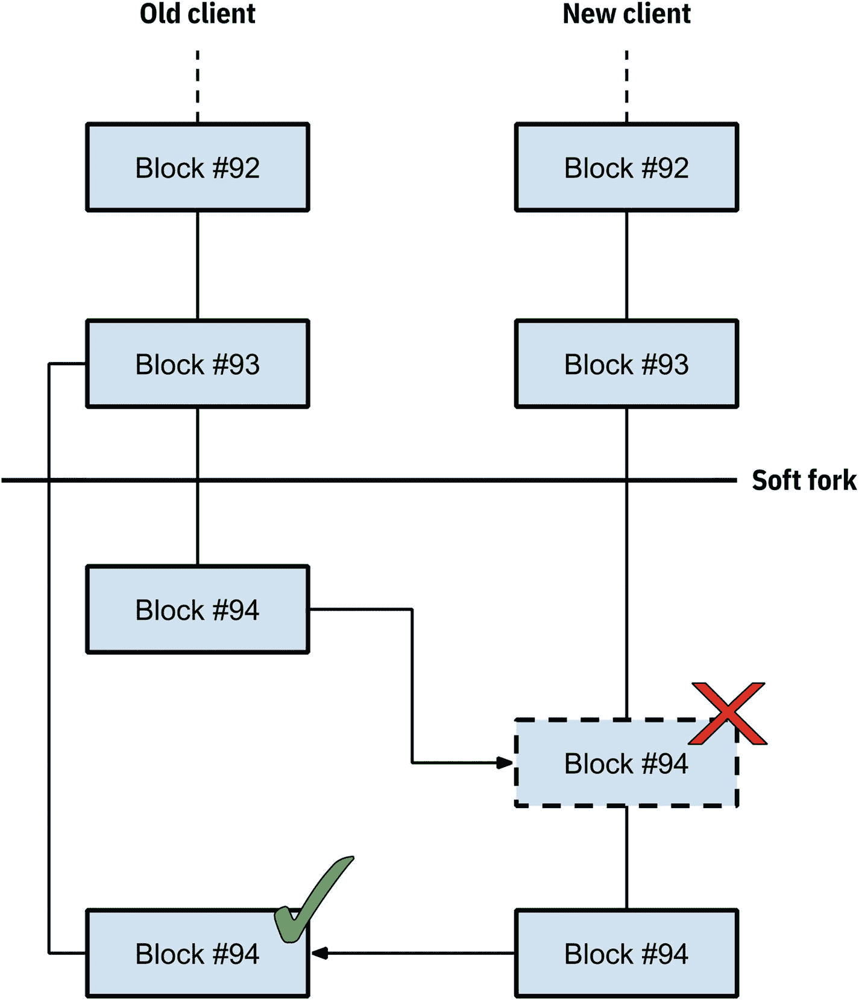
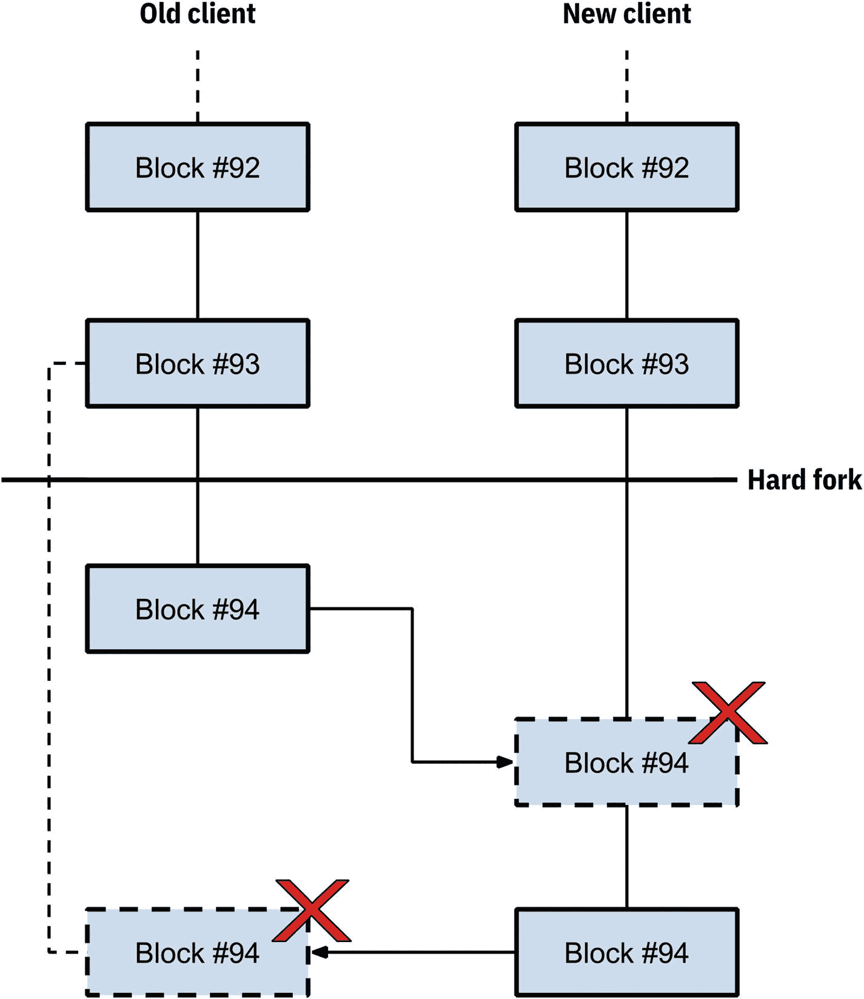
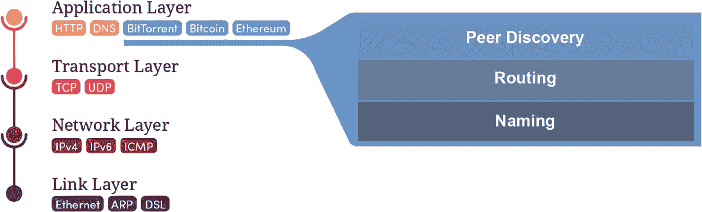
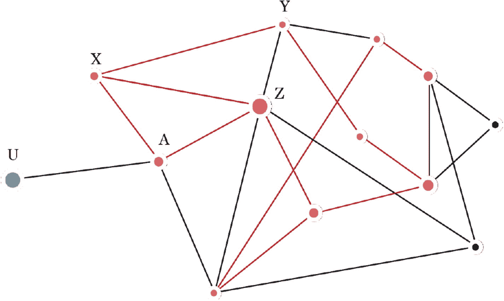
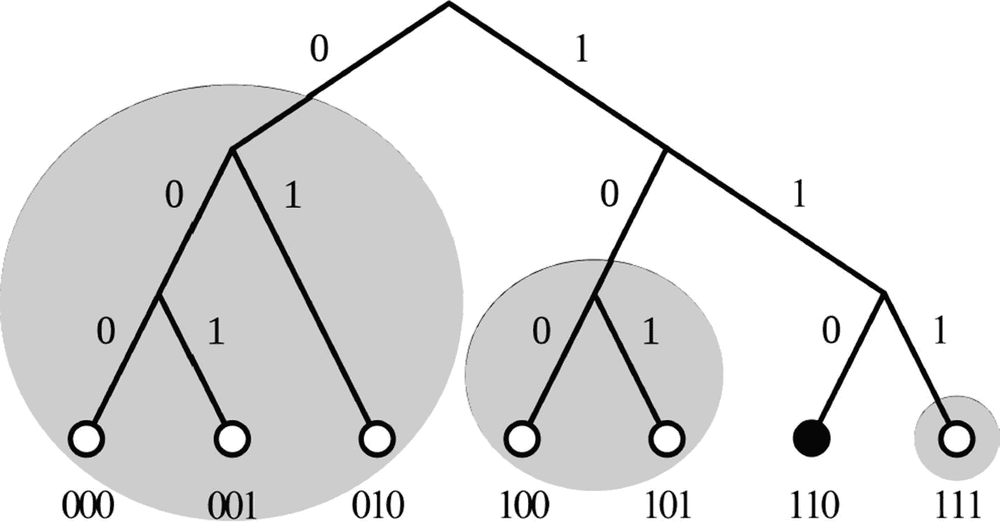
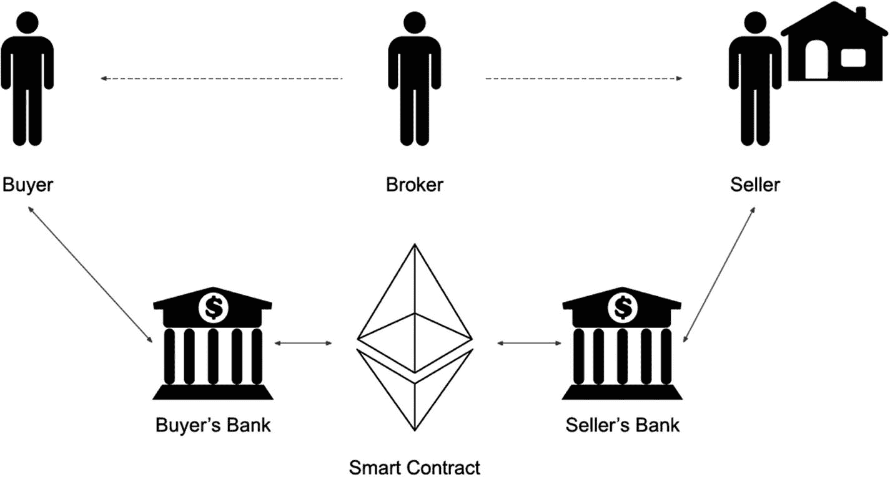

# Passes validation by not throwing an exception

`Block().load(some_block)`

现在，我们可以使用辅助方法来生成消息：

```python
from funcoin.messages import create_block_message
some_block = {
"mined_by": "some public key",
"height":  123,
"difficulty": 10,
"previous_hash": "some previous hash",
"nonce":  "213",
"timestamp":  238778621,
"hash": "a52bfa60bc4ad3d3e9571eab8b28370166f2476e0f1026df219bec07a0a9e2e7"
}
message = create_block_message(some_block, "127.0.0.1", 8888)
```

现在，我们可以将`message`发送给我们的对等节点，从而完整地充实`funcoin/peers.py`模块。

## 整合所有内容

在我们能够运行节点之前，还有一些准备工作要做：

1.  我们需要找到一种方法来定位我们的外部 IP 地址，即对外部世界可见的 IP 地址。
2.  找到一种在节点启动时“引导”对等节点的方法：毕竟，我们需要构建一个网络。
3.  决定我们的节点是否要成为矿工；如果是，我们需要指示它开始挖矿（并在挖到一个区块时将其传播给我们的对等节点）。

让我们依次处理上述要点。

### 查找你的外部 IP 地址

有一些第三方服务，当你连接它们时，会透露你的外部 IP 地址。这听起来可能很奇怪，但这实际上是比特币节点查找自己外部 IP 地址的方式。

打开你的终端，让我们用`cURL`访问`ipinfo.io`服务：

```
curl ipinfo.io
{
"ip": "72.81.18.117",
"hostname":  "XX-XX-XXX-XXX.com",
"city":  "New  York  City",
"region":  "New  York",
"country": "US",
"loc": "41.5143,-73.8060",
"org": "AS701 MCI Communications Services, Inc. d/b/a Verizon Business",
"postal": "10004",
"timezone": "America/New_York",
"readme": "https://ipinfo.io/missingauth"
}
```

注意它显示了我们的外部 IP 地址（`72.81.18.117`）。当我们的节点启动时，让我们在`funcoin/utils.py`中编写一个 Python 方法来实现这一点：

```
import aiohttp
import structlog
logger = structlog.getLogger(__name__)
async def get_external_ip():
    async with aiohttp.ClientSession() as session:
        async with session.get('http://ipinfo.io', headers={"user-agent": "curl/7.64.1"}) as response:
            response_json = await response.json(content_type=None)
            ip = response_json["ip"]
            logger.info(f"Found external IP: {ip}")
            return ip
```

当我们在`server.py`中运行服务器的`listen()`方法时，我们可以填充 IP 地址。

```
1  async def listen(self, hostname="0.0.0.0", port=8888):
2      server = await asyncio.start_server(self.handle_connection, hostname, port)
3      logger.info(f"Server listening on {hostname}:{port}")
5      self.external_ip = await self.get_external_ip()
6      self.external_port = 8888
8      async with server:
9          await server.serve_forever()
Listing 7-9
funcoin/server.py
```

让我们第一次尝试加载服务器：

```
(venv) $ python node.py
2020-05-18  02:42.28 Creating genesis block
2020-05-18 02:42.28 Server listening on 0.0.0.0:8888
2020-05-18 02:42.28 Found external IP: 72.81.18.117
```

哇，这太棒了！我们的服务器现在正在网络上运行。但是节点无法连接到我们，原因有几个：

1. 你启用了防火墙（除非你非常清楚自己在做什么，否则应该保持启用状态）。
2. 你的 Wi-Fi 路由器/接入点不会将外部连接转发到你的本地计算机（你很可能正在这里运行它），而且它也不应该这样做（这是一个重大的安全漏洞）。
3. 网络上的节点无法找到我们，因为到目前为止我们是唯一的节点。

**注意**

上述原因应该清楚地说明构建 p2p 网络有多么困难；除了开放传入互联网流量的安全问题外，播种一个由始终在线节点组成的网络也非常困难。如果你认真对待测试，我建议每月花几美元购买 AWS EC2 或 DigitalOcean Droplets（推荐），并在一个风险较低的环境中运行节点。

# 8. 与现实世界去中心化网络的比较

恭喜，你已经拥有了一个可工作的节点（并且你是一个 Funcoinaire）。但它与比特币、以太坊、门罗币，或者任何其他现有的区块链有何不同？除了工作量证明之外，还有哪些替代方案？什么是智能合约？在本章中，我们将探讨 Funcoin 与现实生产区块链之间的差异，并尝试量化它们之间的距离。

## 为什么区块链工程很困难

区块链工程产生了计算机科学领域中最困难的一些问题，主要是因为它们是去中心化的：它们将分布式系统、网络、并发、密码学、经济学和博弈论的概念联系在一起。任何修复错误或缺陷的工作都必须在实时系统的背景下进行，同时不能牺牲可用性。更复杂的是，任何装有新版软件的客户端必须仍然能够验证由旧版软件创建的区块，这导致了一个不断增长的 `if` 语句列表——这就像在一架满载乘客、正在飞行中的大型喷气式飞机上修复问题一样。

开源软件背后的理念是，任何感兴趣的人都可以贡献修复和改进。从博弈论的角度来看，比特币非常有趣，因为随着时间的推移，随着更多财富投入其中，投资者的警觉目光应该能够更快地对威胁和修复做出反应。但肯定没有多少应用程序像比特币那样高度重视向后兼容性。由于一个错误就可能导致所有财富（在撰写本文时为 1200 亿美元）消失，比特币的理念是谨慎行事，在确定某个方案之前获得开发社区的共识，并在合并之前再次仔细检查以确保万无一失。在某些情况下，错误根本不值得修复，因为修复的成本不值得升级带来的麻烦。例如，在比特币中，中本聪本人引入了著名的“时间扭曲漏洞”，该漏洞导致区块的挖掘时间总是略短于 10 分钟（而不是 10 分钟）：该算法没有对最近 2016 个区块的挖掘时间进行平均，而是错了一位，查看了最近 2015 个区块。这意味着区块的挖掘难度略高于应有的水平。这被认为不是一个主要问题，但修复它的成本远远超过其带来的好处。

在公有区块链中，变更以两种形式出现：硬分叉和软分叉。硬分叉是当前区块链的分歧。这使得旧客户端无法再理解新客户端遵循的新协议。比特币现金、比特币黄金、比特币 XT 和比特币经典都是比特币硬分叉的例子。另一方面，软分叉是向后兼容的：由新客户端生成的新区块能够被旧客户端验证。

不要将硬分叉（一种改变共识规则，对不升级的节点造成安全破坏的变更）、软分叉（一种改变共识规则，削弱不升级节点安全性的变更）、软件分叉（当一个或多个开发者永久性地与其它开发者分开单独开发一个代码库时）、Git 分叉（当一个或多个开发者临时性地与其它开发者分开单独开发一个代码库时）混淆。



图 8-2 一个软分叉



图 8-1 一个硬分叉

**注意**

# funcoin 的不足之处

根据您的亲身实践，一个可公开运行的区块链系统大致需要四个关键组件：

*   **共识协议**：使分布式节点能够就系统状态（区块链中存储的数据）达成一致。正是这种神奇机制，让我们得以将区块链称为“去中心化”系统。
*   **网络层**：使节点能够通信并在整个网络中传播信息。
*   **加密安全区块链**（即区块链本身）。
*   **经济激励方案**（工作量证明）：通过工作量压力来保障链条安全。

上述任何一个组件出现问题，几乎都会对*所有*组件产生影响。例如，网络层的一个漏洞可能被利用，延迟向网络中的某些节点传播交易，从而影响共识协议。撰写本书对我来说极具挑战，因为我最初的目标是构建一个易于理解的区块链，结果却慢慢意识到，像比特币这样的项目也怀有同样的目标：从某种意义上说，它们*就是*各自协议的最简化体现。

作为一次思维练习，我想请您花点时间反思一下 funcoin 各组件中的工作，并思考它们抵御攻击的能力如何。网络层是我们系统中一个既困难又复杂的部分；这或许是个不错的切入点。

## 网络层

我们在网络层做出的第一个假设是使用 JSON 作为消息的序列化格式。出于多种原因，这种选择并非最优，最主要的是它不支持流式传输。换句话说，我们需要知道一个 JSON 编码对象的起点和另一个对象的起点在哪里。为了绕过这个障碍，我们制定了以换行符分隔消息的规则。以下是我们`Server`类中实现此功能的代码：

```
1  async def handle_connection(self, reader: StreamReader, writer: StreamWriter):
2      while True:
3          try:
4              # 永远等待新数据到达
5              data = await reader.readuntil(b"\n")
7              decoded_data = data.decode("utf8").strip()
9              try:
10                  message = BaseSchema().loads(decoded_data)
11              except MarshmallowError:
12                  logger.info("Received unreadable message", peer=writer)
13                  break
15              # 从消息中提取地址，添加到 writer 对象中
16              writer.address = message["meta"]["address"]
18              # 将节点添加到连接池中
19              self.connection_pool.add_peer(writer)
21              # ...然后处理消息
22              await self.p2p_protocol.handle_message(message, writer)
24              await writer.drain()
25              if writer.is_closing():
26                  break
28          except (asyncio.exceptions.IncompleteReadError, ConnectionError):
29              # 发生错误，跳出等待循环
30              break
```

您看到问题所在了吗？这会使我们的节点面临拒绝服务攻击的风险。只需要有人向我们发送一条不带换行符的消息，我们的节点就会保持连接打开状态，等待消息结束。不过，我们可以通过跟踪并限制对等节点可能发送的数据量来轻松缓解这个问题。话虽如此，我们使用基于 JSON 的消息是为了简化实现。比特币对消息结构使用以分隔符分隔的字节，这需要冗长繁琐的实现。以下是比特币消息的结构：

| **字段大小** | **描述** | **数据类型** | **备注** |
| --- | --- | --- | --- |
| 4 | 魔数 | `uint32` | 标识消息应位于测试网络还是真实网络 |
| 12 | 命令 | `char[12]` | 标识消息内容类型的字符串 |
| 4 | 长度 | `uint32` | 有效载荷的字节大小 |
| 4 | 校验和 | `uint32` | 消息哈希的前 4 个字节 |
| ? | 有效载荷 | `char[]` | 实际数据 |

我们也没有讨论节点如何排序和存储对等节点。我们没有任何相关的启发式算法。让我举例说明什么是*启发式*算法：当对等节点向我们请求节点列表时，我们可以将*所有*已知节点都发送给它，但这很浪费，并且可以做得更好。如果我们向请求节点随机发送 20 个对等节点会怎样？这样做能使一个节点将交易传播到整个网络吗（假设其他节点也返回随机节点）？这主要属于点对点网络研究领域，此类启发式算法通常被称为*八卦协议*或*节点发现*。在著名的 Napster 关闭后，这一研究领域重新引起了人们的兴趣。Napster 是第一个允许人们从点对点网络下载音乐的软件。但 Napster 是中心化的：它提供一个可用节点列表，因此如果 Napster 宕机，整个网络也会瘫痪。

BitTorrent 是分布式哈希表的一个例子：一种典型的去中心化键值存储系统，常被用来通过 The Pirate Bay 和 ISOHunt 等网站非法下载电影和电视节目。多年来，各国政府和执法机构一直试图关闭这些所谓的种子网站，但基本上都未能成功——它们至今仍然存在。但这是为什么呢？是什么让它们如此抵制审查？像比特币和以太坊这样的区块链似乎应该从 eDonkey 和 Kad 这样的分布式哈希表中学到一些东西。其中的秘密在于这些网络上的节点如何发现和组织它们的对等节点——正确做法能使点对点网络具备可扩展性、抗审查性和高速性。如果您的网络需要支持文件存储，您可能会考虑使用分布式哈希表，因为它们实际上只是管理网络中哪些节点托管哪些文件的规则。如果您正在构建一个去中心化的区块链，则无需担心存储大文件，因为实际上每个人都存储着同一个“大”文件——区块链本身。

大多数关于点对点协议的研究都处于初期阶段，并且源自文件共享领域。现代去中心化网络存在于应用层，并实现了以下协议：

*   **节点发现**：如何发现网络上的节点
*   **路由**：联系节点（消息）所需采取的路由
*   **命名**：一种统一的节点识别方式

这些协议几乎总是存在于网络协议栈的应用层。



图 8-3

典型的网络协议栈

### 节点发现

**现代的 P2P 网络并非中心化**：曾几何时，它们确实是中心化的——比如 BitTorrent 使用跟踪服务器（像 Napster 那样维护大量 IP 地址列表的服务器）。但如果 P2P 网络依赖跟踪服务器，就很容易遭受一种攻击：瘫痪跟踪服务器。

想象一下，你我想在没有服务器的情况下通过互联网互相通信。我们如何找到对方的 IP 地址？

*   用电子邮件/短信/Telegram/WhatsApp 把各自的 IP 地址发给对方？

这或许可行，但它是**中心化**的——一旦电子邮件服务瘫痪，整个系统就无法运行（有趣的是，比特币早期曾使用 IRC 聊天室来列出 IP 地址）。

*   我们可以约定让客户端监听特定端口，并不断向该端口上的随机 IP 地址发送探测包，直到找到对方。

**找到对方的概率微乎其微**——我们得探测大约 2³²-1 个 IPv4 地址和数量难以想象的 2¹²⁸-1 个 IPv6 地址。**但方向是对的！**

*   那么，比特币是如何做到的呢？

事实证明，如果网络规模足够大，就可以综合运用上述两种方法：当比特币客户端首次启动时，它对整个世界一无所知，也不认识任何其他节点——它依赖于硬编码的 DNS 条目。这些 DNS 条目由比特币社区维护，会向客户端返回一系列可信地址供其连接。

**但 DNS 服务器是中心化的**：单个服务器可能被欺骗，返回虚假的 IP 地址，从而将节点隔离，使其接收伪造的交易和虚假的区块链。仅此一点，客户端就不应完全依赖 DNS。因此，首次运行客户端存在固有风险，但运行时间越长，维持攻击的成本就越高，风险也因此得以缓解。



图 8-4

节点首次加入网络

在上图中，当我们的比特币客户端`节点 U`找到另一个节点时，便开始与之通信：

```
你好节点 A，我使用的是比特币协议 v0.16.0
```

`节点 A`随后回应：

你好节点`U`！我也在使用`v0.16.0`，我的最新区块是`528491`，这里还有一些我认识的节点：节点`X`、节点`Z`……

接着，`节点 A`会将我们广播给其他可能也会联系我们的节点。我们就能从新的节点*集群*中下载缺失的区块，并向它们询问其相邻节点的信息。

这就是节点发现的基本原理，也是P2P网络具有强大韧性的原因——没有中心故障点，只有一片由节点构成的“云”。想要阻止一个组织良好的网络，无异于试图审查单个网络连接——这是一项不可能完成的任务。

### 命名

节点的IP地址可能会改变，因此我们需要一种在网络中稳定引用它的方式。以太坊使用节点公钥的256位哈希值来标识节点。`BitTorrent`则使用随机数的160位哈希值。无论如何，标识符的位数都足够大，可以保证唯一性。如果网络使用合适的哈希函数，例如`SHA-256`，那么我们的网络理论上可以容纳约 2²⁵⁶ 个节点。

### 距离函数

在组织网络之前，我们需要一种方法来测量网络中两个节点之间的“距离”。在数学中，这被称为度量。它意味着“测量距离的一种方式”。需要理解的是，这里指的不是地理（欧几里得）距离，而是一种抽象概念，是网络用来判断两个节点之间亲近程度的通用方法。

2002年，两位研究员`Petar Maymounkov`和`David Mazières`发表了一篇开创性的论文《`Kademlia`》。它描述了当提供一种特定的距离测量方式时，可以如何构建一个去中心化网络，使其变得快速、稳定且具备可路由性。大多数DHT，如`BitTorrent`，都采用了`Kademlia`算法。我们来简单谈谈它的工作原理。

`Kademlia`算法使用异或函数来测量任意两个节点之间的距离。作为复习，异或是两个输入之间的逻辑运算，仅当两个输入不同时输出为真。以下是一些示例：

```
1000 XOR 1000 = 0000
0000 XOR 1111 = 1111
1011 XOR 0101 = 1110
```

在数学上，要被称为度量，距离函数必须满足以下三个条件（异或度量确实满足）：

*   节点到自身的距离为零。
*   节点A到节点B的距离等于节点B到节点A的距离（对称性）。
*   从节点A经节点B到节点C的距离总是大于或等于从节点A直接到节点C的距离（三角不等式）。

此外，异或函数实现简单，计算成本低。重要的是要认识到，异或函数仅仅计算两个节点ID之间的距离。

### 路由

下图展示了一个最多包含八个节点的小型网络的网络映射图。节点ID作为叶子节点列在图表的底部。该图展示了从节点`110`的视角看到的网络结构。可以看到，最近的节点是`111`，因为`110 XOR 111 = 001`。最远的节点是`001`，因为`110 XOR 001 = 111`。可以看出，使用异或作为距离函数有几个很好的特性；首先，它保证了有一半的网络节点被存储在最远的集合（或在论文中被称为桶）中。这很方便，因为当某个节点向节点`110`询问其邻居时，`110`只需返回离请求节点最近的节点即可。



图 8-5

`Kademlia`算法

### 数据持久化

我们的区块链存储在内存中，也就是说，我们的`Blockchain`类在程序运行期间会清空并维护整条链！

```python
class Blockchain(object):
    def __init__(self):
        self.chain = []
```

这意味着每次重启服务器时，我们的节点都必须从其邻居节点那里下载整个区块链。区块链是单调递增的——其规模在不断增长——所以我们需要一个更好的存储方案。比特币使用谷歌的`LevelDB`数据库进行本地存储。`LevelDB`是一个简单的键值存储库，可以持久化到磁盘。在撰写本文时，比特币的完整存储空间约为160GB。

### 替代共识：权益证明（Proof of Stake）

在本书中，我们只讨论过*工作量证明*（Proof of Work）：一种保护区块链安全并达成共识的算法。值得一提的是，针对工作量证明存在强烈的批评声音，其中最流行的一种观点认为它*对环境不利*：比特币为进行工作量证明而消耗大量能源已不是什么秘密。但这在很大程度上受到一种博弈论观点的反驳，即正是这种*能耗*才保障了网络的安全性。此外，这还激励比特币矿工将挖矿业务迁移到电力富余或拥有低成本可再生能源的地区，以保持盈利。在宏观层面上，比特币极端主义者将这种能耗与运行法定银行体系所产生的无法估量的成本进行对比——后者需要无数的分支机构、金库、电力、员工、表格以及看似永不枯竭的纸质钞票。

在权益证明中，下一个区块的矿工是由算法根据特定标准*选择*的。根据具体实现，这些标准可能与矿工的财富、持有余额的时长有关，或者完全是随机的。相比之下，权益证明不需要大量消耗能源来保障网络安全。`NXT`是一种实现了纯权益证明的加密货币；像`Peercoin`等其他加密货币则使用混合系统，而（在撰写本文时）`以太坊`正处在向权益证明系统迁移的过程中。

社区中有许多开发者由于多种因素，并不认为权益证明是工作量证明的理想替代方案。首先，工作量证明能提供额外的网络层优势：如果比特币遭受日蚀攻击——网络中存在大量恶意节点试图伪装成另一条链——这些攻击者将被迫重复所有耗费了数万亿兆瓦时电力的*所有*工作量，这使得攻击不可行；其次，权益证明容易受到一种被称为*无利害关系*问题的影响，即矿工（或许更适合称为区块生成者）无需担心自身受损，因此可以恶意行事（为多条区块链历史投票），从而阻止共识达成。这直接源于没有沉没经济成本（如能源），因此同时处理多条链没有任何成本。为了缓解这些漏洞，有人提出了惩罚协议，用于惩处网络中的不良行为者。

### 智能合约

“智能”合约的概念最初由比特币的`P2PK`（支付到公钥）和`P2PH`（支付到公钥哈希）引入。以太坊的突破在于引入了图灵完备的语言来编写智能合约。通俗地讲，图灵完备意味着智能合约语言能够像任何真实世界的计算机一样有效地执行计算操作。

智能合约的引入最初被视为比特币`Script`系统的更全面版本，或者更简单地说，它是可以存储在区块链上并由矿工执行的代码。它之所以被称为*合约*，是因为代码背后的理念是针对账户操作，或作为中间人记录区块链上的事件，或在满足特定条件时采取行动。这在法律领域意义重大，因为它减少了对中间人或中介的需求。在我们的`Funcoin`中，区块链存储的是简单的交易，而不是指令（或代码）。从技术上讲，智能合约并不那么“智能”——它是由一种特殊语言编写的一组代码，矿工（和节点）在验证区块时会运行这些代码。这些代码可以指示资金从一个账户转移到另一个账户，或者允许在收到请求时执行特定交易；其可能性似乎是无限的。

-   **示例 1：公证文件**
    假设你想公证一份文件。你首先需要指示你的银行向你的律师付款，然后等待律师处理你的文件。然而，有了智能合约，就不需要银行或任何中介机构。通过智能合约，一旦律师生成满足你代码设定条件的文件，就可以自动获得付款。

-   **示例 2：购买房屋**
    购买房产是一个非常复杂的过程。通常有关注佣金的经纪人分别代表卖方和买方。他们相互协调，并与各自的律师和银行合作来管理纳税过程。在某些情况下，资金还必须存入一个托管账户，以便在所有手续完成后从买方释放给卖方。这个过程在多个环节都依赖于大量的*信任*，来促成本质上简单的交易。在这种情况下，智能合约可以自动充当托管服务和支付提供商——因为当条件满足时，所有各方都可以*自动*进行交易。



图 8-6 智能合约示例

-   **示例 3：首次代币发行**
    ICO可以被视为基于区块链的众筹。如果你想为你新项目或公司的股份进行募资，你可以创建一份智能合约，当有人向指定账户转账时，该合约会授予其一份股份。这些股份通常以代币形式存在。

### 智能合约长什么样？

在以太坊中，智能合约是用一种名为`Solidity`的语言编写的。下面是一个投票合约的例子（来自[`https://github.com/ethereum/solidity/blob/v0.4.20/docs/solidity-by-example.rst`](https://github.com/ethereum/solidity/blob/v0.4.20/docs/solidity-by-example.rst)的`Solidity`文档）：

```
/// @title 带委托的投票合约.
contract Ballot {
    // 声明了一个新的复杂类型，将在之后用于变量。
    // 它将代表一个单独的投票者。
    struct Voter {
        uint weight; // 通过委托累积的权重
        bool voted;  // 如果为真，表示该人已经投票
        address delegate; // 被委托的人
        uint vote; // 所投票提案的索引
    }
    // 这是一个表示单个提案的类型。
    struct Proposal {
        bytes32 name;   // 短名称（最多 32 字节）
        uint voteCount; // 累积的票数
    }

address public chairperson;

// 声明了一个状态变量，为每个可能的地址存储一个`Voter`结构体。
    mapping(address => Voter) public voters;

// `Proposal`结构体的动态大小数组。
    Proposal[] public proposals;

/// 创建一份新选票，从`proposalNames`中选一个。
    constructor(bytes32[] memory proposalNames) public {
        chairperson = msg.sender;
        voters[chairperson].weight = 1;

// 对于提供的每个提案名称，
        // 创建一个新的提案对象并将其添加到数组末尾。
        for (uint i = 0; i < proposalNames.length; i++) {
            // `Proposal({...})` 创建一个临时的
            // Proposal 对象，而 `proposals.push(...)`
            // 将其追加到 `proposals` 数组的末尾。
            proposals.push(Proposal({
                name: proposalNames[i],
                voteCount: 0
            }));
        }
    }

// 给予 `voter` 在此选票上的投票权。
    // 只能由 `chairperson` 调用。
    function giveRightToVote(address voter) public {
        // 如果 `require` 的第一个参数计算结果为 `false`，
        // 执行终止，并且所有对状态和以太余额的更改
        // 都将被撤销。
        // 在旧版本 EVM 中这曾消耗所有 gas，但现在不再如此。
        // 使用 `require` 来检查函数是否被正确调用通常是个好主意。
        // 你还可以提供第二个参数来说明哪里出错了。
        require(
            msg.sender == chairperson,
            "只有主席才能授予投票权。"
        );
        require(
            !voters[voter].voted,
            "该投票者已经投过票。"
        );
        require(voters[voter].weight == 0);
        voters[voter].weight = 1;
    }

/// 将你的投票委托给投票者 `to`。
    function delegate(address to) public {
        // 分配引用
        Voter storage sender = voters[msg.sender];
        require(!sender.voted, "你已经投过票了。");

require(to != msg.sender, "不允许自我委托。");

// 只要 `to` 也进行了委托，就转发该委托。
        // 通常，这种循环非常危险，
        // 因为如果它们运行时间过长，可能会消耗超过一个区块中可用的 gas。
        // 在这种情况下，委托将在同一笔交易中执行，并且只涉及少数几轮。
        while (voters[to].delegate != address(0)) {
            to = voters[to].delegate;

// 我们在委托链中发现了一个循环，不允许这样做。
            require(to != msg.sender, "在委托中发现循环。");
        }

// 由于 `sender` 是一个引用，这会修改 `voters[msg.sender].voted`
        sender.voted = true;
        sender.delegate = to;
        Voter storage delegate_ = voters[to];
        if (delegate_.voted) {
            // 如果被委托人已经投票，
            // 直接将其票数加到相应的提案上
            proposals[delegate_.vote].voteCount += sender.weight;
        } else {
            // 如果被委托人尚未投票，
            // 则将其权重加到她的权重上。
            delegate_.weight += sender.weight;
        }
    }

/// 将你的投票（包括委托给你的投票）投给提案 `proposals[proposal].name`。
    function vote(uint proposal) public {
        Voter storage sender = voters[msg.sender];
        require(!sender.voted, "已经投过票。");
        sender.voted = true;
        sender.vote = proposal;

// 如果 `proposal` 超出了数组范围，
        // 这将自动抛出异常并撤销所有更改。
        proposals[proposal].voteCount += sender.weight;
    }

/// @dev 计算获胜提案，考虑所有之前的投票。
    function winningProposal() public view
            returns (uint winningProposal_)
    {
        uint winningVoteCount = 0;
        for (uint p = 0; p < proposals.length; p++) {
            if (proposals[p].voteCount > winningVoteCount) {
                winningVoteCount = proposals[p].voteCount;
                winningProposal_ = p;
            }
        }
    }

// 调用 winningProposal() 函数获取提案数组中获胜者的索引
    // 然后返回获胜者的名称
    function winnerName() public view
            returns (bytes32 winnerName_)
    {
        winnerName_ = proposals[winningProposal()].name;
    }
}
```

当矿工执行这段代码时，计算量以*gas*计量。换句话说，*gas*是对执行合约所需计算工作量的度量。每个操作都会消耗一定量的gas，矿工根据他们消耗的gas总量获得费用（以`Ether`计价）。这种经济模式激励着合约被高效编写。

# 索引

## A
- 异步编程

## B
- 比特币现货价格
- 区块链数据的不可篡改性/哈希值
- Python `blockchain.py.code` 类
- Python字典

## C
- 计算
- 密码学证明
- 密码学

### 区块链数字签名
- 验证示例，Python
- 完整性，发送消息
- 公钥

## D
- 去中心化网络

### 区块链工程
- `funcoin` 组件
- 数据持久化
- 网络层
- POS
- 智能合约
- `solidicity`

### 磁盘空间

## E
- 电子货币

## F
- `funcoin/server.py`
- `funcoin/utils.py`

## G
- 赌徒破产问题
- 八卦协议

## H
- `handle_message()` 方法
- 哈希现金
- 哈希函数

### 类比
- 图像
- 不可逆性
- 命名约定
- 工作量证明
- Python 唯一性

## I, J
- 激励机制
- `ipinfo.io` 服务

## K, L
- Kademlia 算法

## M
- `marshmallow` 库

### 消息块负载
- 定义
- 实现/验证
- `marshmallow` 库
- 对象节点负载
- 节点类型 ping 负载
- 交易负载

## N, O
- 网络 `asyncio` 库
- 聊天服务器 `asyncio` 模块
- 通信协议
- `handle_connection` 循环方法
- 方法存根
- 终端窗口
- 并发编程互联网

### 点对点网络
- 协议
- 不可逆交易

## P, Q
- 支付验证
- 点对点区块链
- 点对点网络
- 隐私

### 项目依赖
- 安装
- 安装 `Poetry`
- 新项目，`Poetry`
- 激活 `virtualenv`

### 权益证明 (PoS)
- 工作量证明 (POW) 算法
- 比特币区块链类，`iPython` 示例
- 实现拼图游戏

### 工作量证明系统
- Python 安装
- Linux
- macOS
- 程序 Windows

## R
- `asyncio` 的 `run()` 函数

## S
- 拆分/合并交易
- 无状态协议

### 对称密码学
- 凯撒密码
- 定义
- 问题

## T
- 时间戳服务器

### 交易
- 创建文件结构
- 实现
- 安装依赖
- 矿工结构
- 区块链模块
- 连接模块
- 删除职责
- 节点模块
- 服务器模块
- UTXO

### 传输控制协议 (TCP)

## U, V, W, X, Y, Z
- 未花费交易输出 (UTXO)
- 用户数据报协议 (UDP)