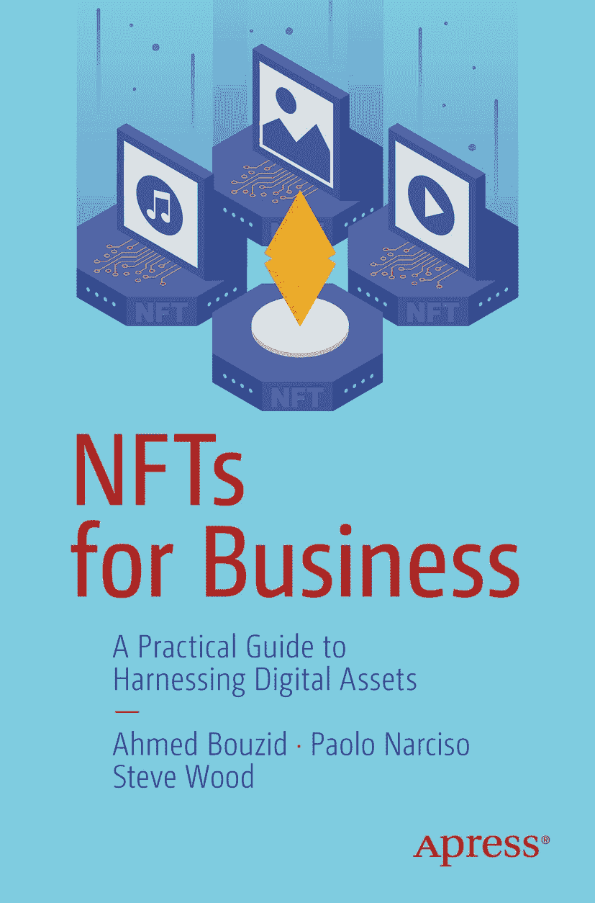

ISBN `978-1-4842-9776-6` e-ISBN `978-1-4842-9777-3` [`doi.org/10.1007/978-1-4842-9777-3`](https://doi.org/10.1007/978-1-4842-9777-3) © Ahmed Bouzid, Paolo Narciso, and Steve Wood 2023

本作品受版权保护。版权所有，全球范围内均由出版商独家许可，涵盖全部或部分素材内容，具体包括翻译、重印、插图复用、朗诵、广播、微缩胶片或其他任何形式的复制、传输或信息存储检索、电子改编、计算机软件，以及目前已知或今后开发的任何相似或不同方法的权利。

本出版物中对通用描述性名称、注册商标、商标、服务标志等的使用，即使在未明确声明的情况下，也不意味着这些名称免于相关保护法律和法规的约束，因此可自由使用。

出版商、作者和编辑可假定本书中的建议和信息在出版之日是真实准确的。出版商、作者或编辑均不对本书包含的材料或可能存在的任何错误或遗漏提供明示或暗示的保证。出版商对已出版地图中的管辖权主张和机构隶属关系保持中立。

本 Apress 印记由注册公司 APress Media, LLC（Springer Nature 旗下）出版。

注册公司地址为：1 New York Plaza, New York, NY 10004, U.S.A.

*献给我们各自的家人、朋友，以及所有 Web3 的同行旅伴*

# 引言