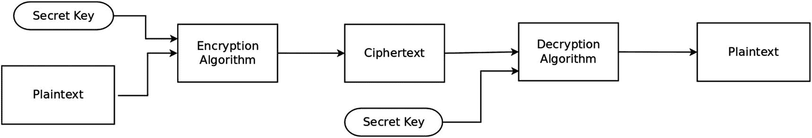
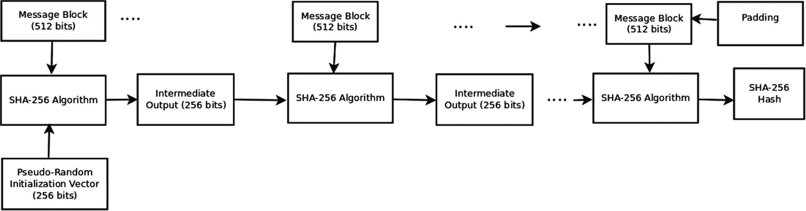
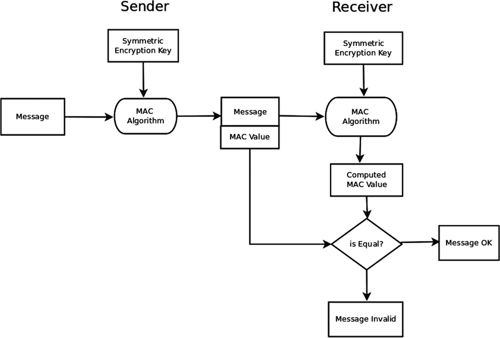

# 3. 对称加密

区块链和加密货币的数学基础源于数学的一个领域，称为密码学。在本章及接下来的三章中，我们将研究这些数学基础。尽管我不会以严谨的引理-定理-推论风格来呈现数学理论，但我将以清晰易懂的方式阐述它。目标是让你对基础数学概念和理论有清晰的理解。这种深入的了解足以让你自信地开发区块链和加密货币应用。

好了，让我们开始深入探索密码学吧。

## 对称加密的工作原理

对称加密（或单密钥加密）已经存在了数千年。对称加密的工作原理如下：一个消息（称为**明文**）使用一个**密钥**进行加密。加密过程将明文转换为一种混乱的消息，称为**密文**。密钥只是一系列字符或符号。只有拥有密钥的人才能解码密文并恢复原始明文。从数学上讲，我们可以将加密过程表示为：

```
c = E(k,p)
```

这里，`E` 是加密算法（函数），`k` 是密钥，`p` 是明文。`c` 是加密算法产生的密文。解密过程可以表示为：

```
p = D(k,c)
```

其中 `D` 是解密算法。注意，加密和解密使用的是同一个密钥。因此得名“对称加密密钥”。

图 3-1 说明了加密和解密过程。



图 3-1 对称加密与解密

对称加密的一个经典例子是凯撒密码，据推测由尤利乌斯·凯撒的罗马军团使用。在这个加密算法中，明文中的每个字母字符都被替换为其右侧第三个位置的字符（如有必要，则循环到字母表开头），单词之间的空格被忽略。例如，字母 `p` 被替换为字母 `s`，字母 `z` 被替换为字母 `c`。因此，明文 *the legion has arrived* 加密如下：

```
明文:  the legion has arrived
密文: xkhohjlrqkdvduulzhg
```

为了解密密文，我们只需将密文中的每个字符替换为其左侧第三个位置的字符。

以下是根据要求翻译的中文版本，保留了所有格式、符号、代码块和链接结构，并确保未遗漏任何内容：

## 对称加密算法的设计

正如我们所了解的，加密算法以明文和密钥作为输入，生成密文作为输出。加密算法必须既独立于明文，也独立于密钥。通常，加密算法由有限轮次组成，每一轮都是有限次替换和置换操作的序列。替换操作将文本中的输入字符替换为其他字符，而置换操作则对输入文本的一部分进行重新排列或排列。加密算法的每一轮都会在一定程度上打乱明文，这种打乱后的输出成为下一轮加密算法的输入。为了从密文中恢复明文，加密算法的操作必须可逆。因此，解密算法只是将加密算法的轮次和操作按相反顺序执行。我们之前讨论过的凯撒密码是一种简单的替换密码，其中不包含置换操作。

对称加密算法有两种类型。分组密码将明文划分为固定长度的块，并一次加密一个块。流密码一次加密一个字节的明文，旨在加密网络上流式传输的数据。

设计一种能够抵御密码分析的强大对称加密算法并非易事。^(⁷) 攻击加密算法从而获得解读其编码信息能力的方法主要有两种。第一种方法依赖于对算法进行暴力破解攻击。这种方法尝试所有可能的密钥，直到获得可理解的明文。如果密钥空间非常大，这种方法就不可行。表 3-1 显示了加密密钥大小与通过暴力破解攻击解密消息所需时间之间的关系。

**表 3-1** 密钥大小与解密时间的关系

| 密钥大小 | 密钥空间中的密钥数量 | 恢复明文的平均时间（每秒进行 10¹⁶ 次解密） |
| --- | --- | --- |
| 8 位 | 256 | < 1 秒 |
| 64 位 | 2⁶⁴ | 0.25 小时 |
| 128 位 | 2¹²⁸ | 53.9 × 10¹² 年 |
| 256 位 | 2²⁵⁶ | 18.3 × 10⁵¹ 年 |

此表显示，与较小的密钥相比，较大的密钥能提供更强的抵御暴力破解攻击的能力。

第二种攻击途径依赖于对密文进行统计分析。在英语中，某些字母出现的频率高于其他字母，某些单词出现的频率也高于其他单词。例如，在一段文本中，单词 `the` 出现的频率通常高于单词 `aardvark`。类似地，某些双字母组合（二合字母）出现的频率高于其他组合；某些三字母组合（三合字母）出现的频率也高于其他组合。表 3-2 取自对 40,000 个单词的分析，分类列出了大量文本样本中字母出现的频率。^(⁸)

**表 3-2** 英文字符的频率分布

| a | 8.12 | b | 1.49 | c | 2.71 | d | 4.32 |
| e | 12.02 | f | 2.30 | g | 2.03 | h | 5.92 |
| i | 7.31 | j | 0.10 | k | 0.69 | l | 3.98 |
| m | 2.61 | n | 6.95 | o | 7.68 | p | 1.82 |
| q | 0.11 | r | 6.02 | s | 6.28 | t | 9.10 |
| u | 2.88 | v | 1.11 | w | 2.09 | x | 9.17 |
| y | 2.11 | z | 0.07 |   |   |   |   |

对英语中 40,000 个单词的分析也显示了最常见的 12 个二合字母的频率分布，如表 3-3 所示。^(⁹)

**表 3-3** 最常见的 12 个二合字母的频率分布

| th | 1.52 | he | 1.28 | in | 0.94 | er | 0.94 |
| an | 0.82 | re | 0.68 | nd | 0.63 | at | 0.59 |
| on | 0.57 | nt | 0.56 | ha | 0.56 | es | 0.56 |

密码分析利用这些语言结构特征来解读密文。这种分析表明，一个好的加密算法会执行多个替换和置换步骤，以改变或掩盖这些语言特征。在理想的加密算法中，所有二合字母、三合字母以及 n 词组合在密文中出现的概率应该相等。其他密码分析技术则利用单词顺序和语法规则。

加密算法的另一个理想特性是，明文中的微小变化应导致密文发生巨大变化，这称为雪崩效应。雪崩效应能够挫败差分密码分析，后者试图通过检查由同一算法加密的不同消息之间的差异来解码密文。

除了密码分析，语言分析在自然语言处理领域也非常重要。自然语言处理在聊天机器人、垃圾邮件过滤器、语言翻译器的设计中，以及在情感分析、行为预测和分类方面都有重要应用。

### 高级加密标准

高级加密标准是美国国家标准与技术研究院推荐的对称加密算法。1997 年，NIST 宣布了一项竞赛，以取代老化的数据加密标准。四年后的 2001 年，AES 在多个竞争加密设计中脱颖而出，被选为获胜者。AES 被世界各地的政府和金融机构广泛使用。它是一种非常快速的加密器。由于其体积小巧，AES 应用于从微控制器到超级计算机的各种设备中。AES 处理 128 位的明文块，并支持 128、192 和 256 位的加密密钥长度。如果选择的密钥长度为 128 位，它使用 10 轮加密；如果密钥为 192 位，则使用 12 轮；如果密钥为 256 位，则使用 14 轮。

表 3-4 列举了一些著名的对称加密算法及其特性。

**表 3-4** 对称加密算法

| 名称 | 引入年份 | 分组大小（位） | 密钥长度（位） | 轮数 |
| --- | --- | --- | --- | --- |
| AES | 2001 | 128 | 128, 192, 256 | 10, 12, 14 |
| Serpent^(¹⁰) | 2001 | 128 | 128, 192, 256 | 32 |
| RC2 | 1987 | 64 | 8–1024 | 18 |
| Twofish^(¹¹) | 2001 | 128 | 128, 192, 256 | 18 |

### 密钥分发问题

一方要解密密文，必须拥有密钥。当必须将密钥分发给大量接收者时，问题就出现了。在这种情况下，敌方很有可能截获并盗用该密钥。当加密密钥需要分发给大量用户时，对称密钥加密并不是一种合适的技术。解决这个密钥分发问题的方法在于一种称为公钥加密的密码技术，我们将在后续章节中研究它。

## 伪随机数生成器

许多密码学算法需要使用一个或多个随机数，通常用于使用种子初始化进程、生成密钥、设定随机数、指定盐值或随机化变量。与通过采样自然过程或计算机上的某个过程来获取随机数不同，常见的做法是使用一个数学函数来生成一系列伪随机数。生成这种序列的函数被称为伪随机数生成器（`PRNG`）。`PRNG`的工作原理如下：`PRNG`被植入一个称为种子的随机数，然后它会递归地生成一个确定性的数字序列。请注意，给定特定的种子，`PRNG`将始终生成相同的数字序列。

一个好的伪随机数生成器具有统计特性，使其很难与真正的随机数序列区分开来。特别是，在一个高质量的`PRNG`中，连续的数字之间没有相关性，并且`PRNG`在数字开始重复之前具有非常大的周期。

线性同余生成器（`LCG`）是一种常用的`PRNG`。它有一个简单的定义：

```
Xn+1 = (m*xn + a) mod P
P >= 2 是一个整数。 P 是 PRNG 的周期。
整数系数 m 被称为乘数； m > 0 且 m < P。
整数 a 被称为加数； a > 0 且 a < P。
生成器的初始值 x0 是种子。
xn 是由该函数生成的第 n 个伪随机数。
```

请注意，`LCG`是一个递归函数。它非常容易实现，并且具有作为快速伪随机数生成器的优势。`LCG`的统计随机性对模数值 `P` 和所选的种子非常敏感。GNU C 库 `glibc` 在其 `LCG` 规范中使用了周期 `2⁴⁵`、乘数值 `25214903917` 和种子值 `11`。

以下代码在 Python 中实现了线性同余生成器：

```
class LCG:
    def __init__(self,mult,addr,prd,seed):
        self.multiplier = mult
        self.addr = addr
        self.period = prd
        self.lastValue = seed
    def generator(self):
        self.lastValue = (self.multiplier*self.lastValue + self.addr) % self.period
        return self.lastValue

lcg = LCG(11, 37, 1000, 0)
ctr = 0
while ctr < 10:
    ret = lcg.generator()
    print(ret)
    ctr += 1
```

梅森旋转算法是另一种备受关注的高质量 `PRNG`。在其最常见的推导中，它使用梅森素数 `2¹⁹⁹³⁷ – 1` 作为种子，并且其周期为 `2¹⁹⁹³⁷ – 1`。

## 结论

在本章中，我们研究了对称加密算法的设计以及对这些算法的密码分析。我们还了解了高级加密标准，这是一种广泛使用的加密算法。向大量用户分发加密密钥是一个严重的问题，因为它增加了密钥在分发过程中被盗的可能性。在后续章节中，我们将展示公钥加密如何解决密钥分发难题。最后，我们详细阐述了伪随机数生成器。

在下一章中，我们将研究密码学哈希函数。这些函数在区块链设计中尤其重要。

## 密码学哈希函数

不要被本章的标题吓到。密码学哈希函数的理论并非特别深奥。困难的是从头开始构建这些函数。然而，我们无需担心数学理论的这一方面，因为大多数编程语言库都为我们提供了丰富的函数可供选择。

密码学哈希函数涉及一个非常实际的问题：确定文档或文本字符串是否被恶意行为者篡改过。这些函数在区块链和加密货币应用的发展中扮演着非常重要的角色，因此，充分理解这些函数的数学理论对你来说至关重要。

### 密码学哈希简介

设想这样一个场景。假设你我位于银河系的两端，我给你发送了一条消息。现在，收到消息后，你希望确信消息在传输过程中没有被某些不友好的外星人篡改。其次，你希望确信这条消息确实是我发送的，而不是某个冒名顶替者。进一步假设你无法与我进行安全通信来确认这两个问题。密码学哈希（或者如果你愿意，可以称之为密码学哈希函数）解决了消息在传输过程中是否被篡改的问题。在本章中，我们将研究这些函数。在后续关于数字签名的章节中，我们将探讨真实性问题：文档或消息是否真的由声称是作者的人所编写？

我可以利用的一种方式来让你确信消息在传输过程中未被篡改，即发送给你一串称为消息摘要的字符，这串字符以某种方式与消息相关联。假设你可以将消息输入一台机器，如果这台机器产生的消息摘要与你发送给我的消息摘要相匹配，那么你就可以断定消息未被更改。如果这台机器输出的字符串与你发送给我的消息摘要不匹配，那么你就可以断定消息在传输过程中被更改了。如果这样的机器满足一些即将讨论的约束条件，它就被称为密码学哈希函数（或密码学哈希算法）。

由这样的机器或密码学哈希函数产生的字符串输出被称为密码学哈希或消息摘要。通常，这个输出被简单（但不正确地）称为哈希。

我们想要构建的机器是一个数学函数或数学算法。那么，我们如何构建这样的函数呢？

### 密码学哈希函数

哈希函数是一种将任意长度的字符串作为输入，并产生一个字符串作为输出的函数。举个简单的例子，考虑函数 `y = F(x)`，它接受一个字符串 `x` 作为输入，并输出一个字符串，其中输入字符串中的每个字符都输出其下一个字符：

```
F('crypto') = 'dszqup'
```

这是一个非常简单的哈希函数，但它不是一个密码学哈希函数，因为它不满足一些必要条件。

密码学哈希函数是一种哈希函数，它具有四个基本属性：

-   该函数产生固定长度的输出字符串。
-   该函数是免碰撞的。
-   该函数是不可逆的。
-   该函数可以被高效计算。

**注意**

我们可以构建输出数字而非字符串的哈希函数。然而，我们通常指定输出字符串的哈希函数。区块链和加密货币应用总是使用产生十六进制字符串输出的密码学哈希函数。

现在让我们来看看密码学哈希函数所需具备的属性。

#### 固定长度输出属性

这是一个简单的要求。我们希望密码学哈希函数产生具有固定长度的消息摘要。理想情况下，我们希望消息摘要的尺寸较小，因为这关系到在网络上传输数据的效率。消息摘要的尺寸越小，在传输过程中被意外损坏的概率就越低。产生长度为 128 位、256 位和 512 位的消息摘要的密码学函数很常见。

#### 抗碰撞性

显而易见，如果我们有两个不同的消息，我们希望密码学哈希函数能产生两个不同的消息摘要。也就是说，如果 `x` 和 `y` 是两个不同的消息，而 `q = H(p)` 是我们的密码学哈希函数，那么我们需要满足：

```
x != y 意味着 H(x) != H(y)
```

当 `x != y` 但 `H(x) = H(y)` 时，就会发生碰撞。如果一个哈希函数发生碰撞的概率极低，那么它就被称为具备抗碰撞性。一个好的密码学哈希函数可能会存在碰撞，但实际上几乎不可能找到这些碰撞。

典型的密码学哈希函数并非经典意义上的简洁数学表达式，例如 `y = e^xln2x`。它们是对输入文本进行的一系列有限且连续的替换和变换。由于函数是以这种方式定义的，我们永远无法绝对确定该函数不存在任何碰撞。^(¹⁵)

#### 不可逆性

这是一个常识性要求：我们不应该能够从消息摘要中推导出原始消息。一个好的密码学哈希函数是不可逆的。这意味着，给定哈希函数 `y = H(x)` 的输出 `y`，从消息摘要 `y` 推导出输入 `x` 在计算上是不可行的。

我们之前讨论的哈希函数：

```
F('crypto') = 'dszqup'
```

不是密码学哈希函数，因为它是可逆的。

#### 高效计算性

这是一个好的密码学哈希函数所期望但不一定必需的特性。我们希望函数能够快速计算消息摘要。这一特性影响着需要计算消息摘要的应用程序的可扩展性。例如，考虑一个银行应用程序，它每秒必须处理数千笔交易，而每笔交易都需要计算一个或多个消息摘要。为了使该应用程序能够扩展，能够非常快速地计算消息摘要是至关重要的。

## 证明文件被篡改过

让我们运用目前所学的知识来证明一个文件没有被篡改过。

假设我们有一个文本文件和一个密码学哈希函数。如果我们将该文件的内容视为一长串字符，我们就可以计算这个文件的消息摘要。然后，如果有另一个新文件呈现给我们，并且它与之前的文件具有相同的消息摘要，那么由于两个文件的消息摘要（即密码学哈希值）相同，我们可以得出这两个文件是完全相同的结论。此外，如果消息摘要不同，我们就可以断定这两个文件不相同。

### 安全哈希算法 256 (SHA-256)

发现密码学哈希函数是相当困难的。`SHA-256`、`SHA-512` 和 `RIPEMD-160` 是三种常用的密码学哈希函数。我们来看一下在区块链应用中广泛使用的 `SHA-256` 和 `RIPEMD-160` 哈希函数。

`SHA-256` 是安全哈希算法 256 的首字母缩写。其中的 256 表示该函数输出的消息摘要（或密码学哈希值）长度为 256 位。

图 4-1 展示了如何为消息或文件生成一个 `SHA-256` 消息摘要。



图 4-1 SHA-256 消息摘要生成过程

文件或消息被分割成连续的块，每个块的大小为 512 位。如果消息或文件的比特长度不能被 512 整除，则在其末尾添加填充（一个 1 位，后跟若干 0 位），以便 512 能够整除该消息或文件的比特长度。

接下来，我们使用伪随机数生成器构造一个 256 位的随机 IV（初始化向量）。这只是一个 256 位长的、由 1 和 0 组成的伪随机序列。IV 的目的是增加哈希生成过程的随机性。我们将这个 IV 与消息或文件的第一个 512 位块拼接起来。得到的 768 位块被输入到安全哈希算法中。该算法是一个加扰和压缩函数，输出一个 256 位的字符串。该算法是对 768 位块进行的一系列替换和置换。

然后，我们取第二个 512 位消息块，并将其与之前输出的 256 位结果拼接起来。这个 768 位字符串被输入到相同的加扰和压缩函数中，产生一个 256 位的输出。我们以此类推，逐个处理消息块。最终的 256 位输出就是由 `SHA-256` 算法生成的消息摘要（或密码学哈希值）。

`SHA-256` 的核心是应用于每个 768 位块的加扰和压缩函数。对于 `SHA-256`，该函数由 64 轮组成。每一轮接收一个 768 位块，通过位移和逻辑位运算（OR、XOR、AND）进行加扰，然后输入到下一轮。最后一轮产生一个 256 位的输出，该输出与消息的下一个 512 位块拼接，然后再次对这 768 位块应用 64 轮。此过程不断重复，直到处理完消息的最后一个块。

`SHA-512` 算法在概念上类似，只是消息块大小为 1024 位，并且加扰函数由 80 轮组成。理论上，加扰过程中涉及的步骤越多，函数的密码学安全性就越高。

### 一个针对 SHA-256 的 Python 示例

Python 在其 `hashlib` 模块中提供了 `SHA-256` 以及其他密码学哈希算法的实现。以下 Python 代码示例演示了如何为字符串生成 `SHA-256` 十六进制编码的消息摘要：

```python
import hashlib
def getSHA256MD(inputStr):
    m = hashlib.sha256()
    # 将输入字符串转换为字节序列
    strAsBytes = str.encode(inputStr)
    m.update(strAsBytes)
    # 以十六进制字符串形式返回消息摘要
    return m.hexdigest()
ret = getSHA256MD('the lazy brown fox jumped over the sleeping dog')
print(ret)
```

执行此程序的结果是 `SHA-256` 哈希值：`1845c1824b7710df04f1307ea1618857c16e891278eb9dc7edba809915581283`

### RIPEMD-160

`RIPEMD` 是 RACE 完整性原语评估消息摘要（RACE Integrity Primitives Evaluation Message Digest）的缩写。这种密码学哈希算法可以生成长度为 128、160、256 和 320 位的消息摘要。`RIPEMD` 于 1996 年进入公共领域。`RIPEMD-160` 在比特币加密货币以及许多其他区块链应用中得到使用。

生成 `RIPEMD-160` 哈希值的算法在概念上与生成 `SHA-256` 哈希值的过程类似。`RIPEMD-160` 将输入消息划分为连续的一系列 512 位块。消息会填充一个 1 位和一连串的 0 位，以确保其长度能被 512 整除。然后，一个编码了消息长度的 64 位字符串会被追加到消息末尾。该算法使用五个 32 位寄存器来保存中间结果以及最终的消息摘要。为了启动哈希生成过程，这五个 32 位寄存器会被初始化为一些固定值。随后，第一个 512 位块会经过十轮（rounds）变换，每一轮由 16 步作用于消息块和寄存器值的置换与替换序列组成。这十轮运算的输出是一个填充了五个 32 位寄存器的 160 位值。然后，这些寄存器值与下一个块一起作为输入，重复此过程，直到消息的最后一个块处理完毕。^(¹⁶^) 最终这五个寄存器中的 160 位值即为消息摘要。

以下 Python 代码为字符串生成 `RIPEMD-160` 哈希值。输出结果编码为十六进制字符串：

```python
import hashlib
def getRIPEMD160(inputStr):
r = hashlib.new('ripemd160')
strAsBytes = str.encode(inputStr)
r.update(strAsBytes)
return r.hexdigest()
ret = getRIPEMD160('the lazy brown fox jumped over the sleeping dog')
print(ret)
```

## 消息认证码

在前面的章节中，我们讨论了如何使用密码学哈希来确定消息的完整性，即证明消息是否被篡改。密码学哈希不能用于证明真实性。真实性关注的是证明消息的发送者确实是其声称的那个人。消息认证码（`MAC`）提供了消息完整性的保证，此外，还提供了有限形式的真实性保证。消息认证码算法依赖于共享的对称加密密钥。

消息认证码的工作原理如下：一组（两个或更多）个体共享一个秘密的对称加密密钥。想要发送消息的人使用 `MAC` 算法为该消息计算一个 `MAC` 值。然后，她将该消息连同 `MAC` 值一起发送给接收者。接收者使用同样的 `MAC` 算法和秘密密钥计算该消息的 `MAC` 值。如果计算出的 `MAC` 值与发送者提供的 `MAC` 值相等，那么我们可以断定该消息未被篡改。此外，接收者可以确信该消息是由拥有该秘密密钥的人发送的。

图 4-2 解释了消息认证码的使用方式。



**图 4-2。** 消息认证码流程

你应该注意到，消息不必加密。在许多用例中，`MAC` 码与明文一起使用。例如，操作系统文件未加密，但可能附有 `MAC` 值以证明文件的完整性。另一个突出的用例涉及通过网络传输文件，当我们希望确保文件在传输过程中未被破坏时。

`MAC` 码只提供有限程度的认证保证。当接收到带有 `MAC` 码的消息时，我们只能断定该消息是由拥有该对称加密密钥的人发送的。特别是，一个人可以声称自己是拥有秘密密钥的其他某人来发送消息，而被冒充的个人将无法否认这一说法。正如我们将在后续章节中看到的，数字签名解决了完整性和认证的难题。

你可能会注意到诸如 `SHA-256` 等密码学哈希算法与 `MAC` 算法之间的一个本质区别。任何人都可以计算消息的 `SHA-512` 消息摘要。相比之下，计算消息的 `MAC` 值需要一个共享的秘密密钥。

## 结论

密码学哈希函数是区块链应用的基础。在本章中，我们讨论了密码学哈希函数的性质。我们还研究了两种著名的密码学哈希算法：安全哈希算法和 `RIPEMD-160`。

密码学哈希算法可以证明消息的完整性，但不能证明真实性（谁编写了消息）。本章最后，我们讨论了消息认证码算法，它不仅能证明消息的完整性，还提供了一种有限形式的认证。

在下一章，我们将深入探讨公钥密码系统的基础。