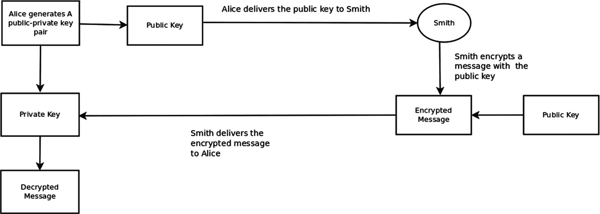
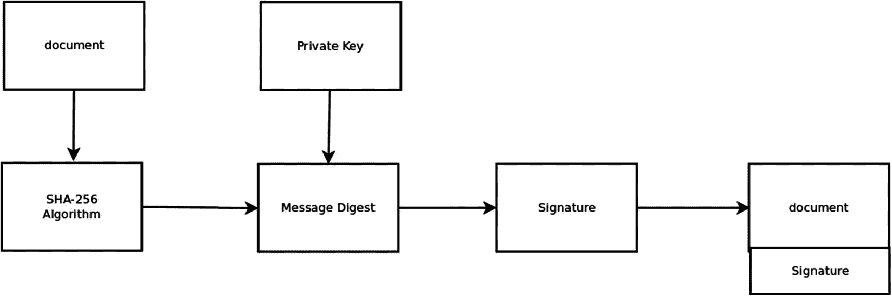
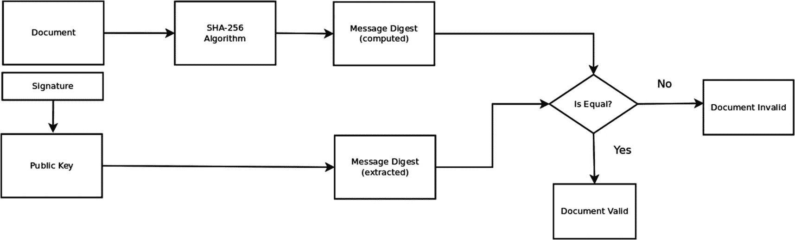

# 5. 公钥密码系统的炼金术

本章关注的是可以被称为现代密码学或非对称密码学的领域。在第 3 章中，我们研究了对称加密，并推断当加密密钥需要分发给大量接收者时，它存在一个显著的可扩展性问题。例如，考虑一个加密密钥必须分发给数千个接收者的场景。每次向接收者传输密钥时，都伴随着一定的密钥被恶意行为者截获的概率。公钥密码系统的目标，*除其他外*，是解决这个可扩展性问题，同时也使得对手截获秘密密钥的问题变得无关紧要。公钥密码系统理论的*点睛之笔*是数字签名算法；它同时解决了三个问题：(i) 保证消息的完整性，(ii) 保证消息的真实性，以及 (iii) 解决可扩展性问题。

公钥密码系统在现代众多应用中都得到了应用。例如，它们被用于安全的 `HTTP` 通信、虚拟专用网络、信用卡、电子商务系统、智能卡、电子身份证以及诸如 `SWIFT` 等国际支付系统，现在也用于加密货币和区块链应用。

在本章中，我将首先总结对称加密密钥分发的问题，然后简要描述经典的数字签名算法。之后，我将向你介绍一些公钥密码系统背后的数学理论，最后深入讨论数字签名算法。随着讲解的深入，我还会提供 Python 代码示例。


## 密钥分发问题再探讨

再次假设你我正处在银河系的两端，而我想给你发送一条秘密消息。首先，你必须拥有对称加密密钥，才能解密该消息。因此，如果你没有这个密钥，我必须将其传输给你。在我提供密钥之后，我就可以向你发送加密消息，你将能够使用该密钥对其进行解密。为了检测消息在传输过程中是否被篡改，我还可以将明文或加密消息的 `SHA-256` 哈希值传输给你。这个加密哈希值可以附加在消息末尾。

在上述场景中，有两个突出问题需要解决。首先，你无法知道该消息是否真的由我发送，还是由某个冒充我的恶意行为者发送。任何拥有加密密钥的人都可以伪造消息。这就是**真实性**问题。我们如何证明一条消息是由声称是其作者的人发送的？第二个问题是，加密密钥在传输过程中可能被恶意实体截获。没有确定性的方法可以证明密钥在传输过程中未被截获。当密钥需要分发给大量接收者时，这个问题会变得更加复杂。例如，考虑一个情报收集网络，其中的每个节点都必须配备加密密钥。

### 数字签名算法的启发式方法

在公钥密码学中，使用非对称密钥生成算法来生成一对公钥和私钥。这些密钥中的每一个都是一个非常长的字符串。生成此密钥对的人会安全地将私钥保存在自己手中，并将公钥分发给预期的接收者。例如，公钥可以通过发布到互联网上，分发给全世界。公钥分发的关键方面在于，我们并不关心恶意实体是否拥有此密钥。由于生成密钥对的实体必须将私钥安全地保存在自己手中，因此非对称密钥生成算法必须使得从公钥恢复私钥在计算上不可行，这一点至关重要。

现在，一个人可以用公钥加密消息并将其传输给私钥持有者，或者直接将加密后的消息发布到互联网上。非对称密钥生成算法保证该消息只能使用私钥解密，也就是说，在没有私钥的情况下解密该消息在计算上是不可行的。所谓计算不可行，我们指的是在没有私钥的情况下，解密消息将花费极其漫长的时间（也许是数亿年之久）。

类似地，使用私钥加密的消息只能由与该私钥对应的公钥解密。对于攻击者来说，在没有公钥的情况下从密文中恢复出原始消息在计算上是不可行的。公钥和私钥互为逆运算，因为由任何一个密钥执行的加密操作都可以被另一个密钥逆转。这就是公钥密码系统的本质。图 5-1 展示了这个过程。



**图 5-1** 公钥密码系统

在上述过程中，爱丽丝生成一对公私钥对，将公钥交付给史密斯，同时将私钥安全地保存在自己手中。然后史密斯用这个公钥加密一条消息，并将密文发送给爱丽丝。爱丽丝再用自己的私钥解密密文。

爱丽丝知道消息是由拥有公钥的人加密的，但通常情况下，爱丽丝无法知道实际加密这条消息的人的身份（除非爱丽丝确定只有史密斯拥有公钥）。确定身份这个问题需要公钥基础设施（PKI）来解决。我们稍后将讨论公钥基础设施。

另一种情况是爱丽丝用她的私钥加密一条消息。任何持有相应公钥的人都可以解密这样的消息。这里的关键特性是，消息的接收者可以得出结论，即该消息是由持有私钥的实体生成的。此外，爱丽丝无法否认该消息是由她持有的私钥生成的这一说法。请注意，在缺乏外部信息的情况下，接收者无法将私钥与爱丽丝关联起来。建立这种关联的一种方式是通过使用证书颁发机构（PKI）。

如果双方都使用对方的公钥发送消息，那么爱丽丝和史密斯就能进行安全的双向通信。

数字签名算法解决了两个问题：一是消息未被篡改，二是签名是由某个特定的私钥生成的，因此是由该密钥的持有者生成的。该算法的第二个方面解决了身份验证问题。

这些算法包括两个阶段：签名生成阶段和签名验证阶段。图 5-2 展示了签名生成阶段涉及的步骤。




**图 5-2** 生成文档的数字签名

爱丽丝生成了一对公私密钥，并有一份希望进行数字签名的文档。^(¹⁷) 第一步，爱丽丝生成该文档的加密哈希值，例如文档的 `SHA-256` 消息摘要。然后爱丽丝用自己的私钥加密该消息摘要。加密结果即为该文档的数字签名。第二步，爱丽丝将文档与数字签名拼接在一起，并将这份拼接后的文档传输给接收方。

正如我们之前指出的，`SHA-256` 这类高质量的加密算法具有雪崩效应。如果文档发生极微小的改变，哪怕只是一个比特位，生成的摘要消息也会发生剧烈变化。当使用私钥对消息摘要进行加密时，同样会产生这种雪崩效应。最后请注意，文档本身无需加密。在许多重要应用中，我们并不关心文档以明文形式传输，因为我们唯一关心的是检测文档是否被篡改以及验证文档的真实性。当然，爱丽丝也可以选择先用自己的私钥加密文档，然后再用私钥对该加密文档的 `SHA-256` 消息摘要进行加密。

数字签名算法的第二阶段是文档接收方对文档进行验证。图 5-3 展示了这一过程。



**图 5-3** 验证文档的数字签名

在验证阶段，拼接文档的接收方（例如史密斯）将文档和签名分离。第一步，史密斯计算收到的文档的 `SHA-256` 消息摘要。第二步，使用爱丽丝的公钥对与文档拼接在一起的签名进行解密。这便得到了文档发送方计算出的消息摘要。然后对比这两个消息摘要。如果消息摘要相同，那么史密斯可以得出结论：文档在传输过程中未被篡改，并且该文档是由爱丽丝签署和发送的，因为她的私钥与史密斯使用的公钥相匹配。如果消息摘要不一致，则存在三种可能性：其一，文档在传输过程中被篡改；其二，爱丽丝并非文档的作者；其三，史密斯所持有的公钥与爱丽丝的私钥不对应。

### 公钥基础设施

回想一下，当史密斯收到一份用私钥加密的消息（或文档）时，他只能推断出发送者身份是持有该加密消息私钥的实体。史密斯必须拥有外部信息，才能将爱丽丝的身份与私钥关联起来。同样地，当爱丽丝收到一份用她的公钥加密的消息时，在没有外部信息的情况下，她只能断定该消息是由某个持有她公钥的人加密的。

将身份与公钥（以及隐含的其私钥）关联起来的一种方法是通过证书颁发机构（CA）。以下是证书颁发机构的工作方式：首先，证书颁发机构获取声称拥有某对公私密钥的申请人的身份信息。申请人向 CA 提供其公钥。接着，CA 要求申请人对 CA 提供的一份文档进行数字签名。申请人签署文档后，CA 对文档的签名进行验证。如果验证成功，则证明申请人确实持有与提供给 CA 的公钥相对应的私钥。随后，CA 向申请人颁发一份 `X.509` 证书。该证书由 CA 使用其私钥签名，以证明证书颁发者的身份，并确保证书未被篡改。颁发的证书通常包含识别申请人的信息，例如姓名、地址以及其他独特细节、申请人生成的公钥、证书的有效期等等。

爱丽丝可以通过以下方式证明某份文档的作者身份：首先，爱丽丝用自己的私钥加密她的证书，并将其与她想要发送的文档拼接在一起。接着，爱丽丝对此拼接后的文档进行数字签名，并将签名附加到拼接文档上。这将使接收方能够通过解密证书来安全地验证文档签署者的身份。

类似地，当史密斯用爱丽丝的公钥加密一份文档时，他也可以用自己的私钥加密他的证书，并将加密后的证书与该文档拼接在一起。爱丽丝随后通过使用史密斯的公钥解密证书，便能知晓这份用她公钥加密的文档的发送者身份。


### RSA 算法

公有领域存在多种公私钥生成算法。最主要的两种算法是 `RSA` 和椭圆曲线数字签名算法（`ECDSA`）。`RSA` 算法是使用最广泛的公钥算法。^(¹⁸) 这些算法依赖于数论中计算难度极高的难题。例如，`RSA` 依赖于将一个极大的数分解为质数乘积在计算上是不可行的这一事实。而 `ECDSA` 则依赖于寻找极大数的离散对数的难度。比特币代码使用了通过椭圆曲线数字签名算法生成的公私钥对。

在本可选章节中，我们将推导 `RSA` 算法。在此之前，我们需要了解一些数论知识：

```
定义（质数）：大于 1 的正整数 n，如果只能被 +1、-1、-n 和 n 整除，则称为质数。
```

定理（算术基本定理）：任何大于 1 的整数 `m` 都可以分解为质数的乘积：

`m = p[1]^(t1)p[2]^(t2)p[3]^(t3) … p[n]^(tn)`

其中 `p[1]` < `p[2]` < … < `p[n]` 是质数，`t1`、`t2`、… `tn` 是大于 0 的自然数。

定义（互质数）：如果两个大于 1 的正整数 `j` 和 `k` 唯一的公因子是 1，则称它们互质。

例如，6 和 9 不互质，因为 3 是公约数。8 和 15 互质。

定义（欧拉函数 `Q(n)`）：对于任何大于 1 的整数 `n`，`Q(n)` 是小于 `n` 且与 `n` 互质的正整数的个数。

例如，`Q(15)` = 7，因为与 15 互质的集合是 { 2,4,7,8,11,13,14 }。

定理（欧拉定理）：对于任何大于 1 的整数 `a` 和 `n`，如果 `a` 和 `n` 互质，则 `a^(Q(n)) % n = 1`。^(¹⁹)

例如，令 `a` = 15，`n` = 8，`Q(n)` = 4，那么

```
154 % 8 = 50625 % 8 = 1
```

应该清楚的是，对于大于 1 的自然数 `m`，其质因数分解 `p[1]^(t1)p[2]^(t2)p[3]^(t3) … p[n]^(tn)` 是唯一的。`RSA` 算法依赖于一个大数的质因数分解在计算上是不可行的这一事实。

现在，我们可以按如下步骤推导出 `RSA` 公私钥对：

```
步骤 1：选择两个大的随机质数 p 和 q，且 p 不等于 q。
步骤 2：计算乘积：n = pq。
步骤 3：由于 p 和 q 是质数，n 的欧拉函数值为 Q(n) = (p-1)(q-1)。
步骤 4：选择一个整数 1 < e < Q(n)，使得 e 和 Q(n) 互质。
步骤 5：获取一个正整数 d，使得 de % Q(n) = 1。
```

公钥是元组 `(n, e)`。私钥是元组 `(p, q, d)`。公钥元组可以自由分发；私钥元组则需保密。

现在，我们来看 `RSA` 算法的应用。假设有一个文档或消息 `D`。`D` 可以看作一个非常长的比特序列，或者等价地看作一个巨大的正整数。因此，我们将 `D` 视为这样一个整数。我们确保选择的质数 `p` 和 `q` 满足 `D < pq`。

史密斯收到公钥元组 `(n, e)` 后，按如下方式创建加密消息 `C`：

```
C = De % n
```

`C` 是一个正整数，或者等价地是一个很长的比特序列。

爱丽丝现在可以用她的私钥元组 `(p, q, d)` 解密密文：

```
D = Cd % n
举个例子，令 p = 7，q = 5。
n = pq = 35
则 Q(35) = 24，我们选择 e = 17。
e 与 Q(n) 互质。
我们选择 d 使得 de % Q(n) = 17d % 24 = 1
d = 17
现在考虑文档 T = 12
则密文为 1217 % 35 = 17
我们用 1717 % 35 = 12 来解密密文
```

`RSA` 公私钥加密是使用最广泛的私钥-公钥加密系统。其安全性与使用椭圆曲线密码学（`ECDSA`）生成的密钥相当。遵循比特币的做法，我们将使用 `ECDSA` 密钥对。此类密钥的逻辑在概念上与 `RSA` 密钥相似，我将省略对其生成过程的讨论，因为对其背后的数学原理进行严谨论述会让我们陷入冗长的题外话。我们的区块链代码将包含生成 `ECDSA` 公私钥对所需的库函数。

### Python 代码示例

在下面的 Python 示例中，我们将使用 `pycryptodome` 包，带领爱丽丝和史密斯完成使用 `RSA` 进行加密、解密、签名生成和签名验证的一系列步骤。^(²⁰) 你应该仔细阅读这段代码，以了解使用公私钥对加密和解密消息的机制。

如果你尚未安装此包，请执行以下命令进行安装：^(²¹)

```
pip3 install pycryptodome
#========================================
## RSA 公钥密码学示例
#========================================
from Crypto.PublicKey import RSA
from Crypto.Cipher import PKCS1_OAEP
from Crypto.Hash import SHA256
from Crypto import Random
from hashlib import sha256
import binascii
#=====================================
### 生成一个 RSA 密钥对
#=====================================
def RSAKeyPair(keylength):
    keyPair = RSA.generate(keylength)
    return keyPair
### 爱丽丝生成一个 RSA 密钥对
AliceKeyPair = RSAKeyPair(1024)
### 爱丽丝的公钥
pubKey = AliceKeyPair.publickey()
print(f"公钥:  (n={hex(pubKey.n)}, e={hex(pubKey.e)})")
### 爱丽丝的公钥（PEM 格式）
### PEM 格式对密钥进行 Base64 编码
pubKeyPEM = AliceKeyPair.publickey().exportKey()
print("公钥 PEM 格式: " + pubKeyPEM.decode('ascii'))
### 爱丽丝的私钥
print(f"私钥: (n={hex(pubKey.n)}, d={hex(AliceKeyPair.d)})")
### 爱丽丝的私钥（PEM 格式）
privKeyPEM = AliceKeyPair.exportKey()
print("私钥 PEM 格式: " + privKeyPEM.decode('ascii'))
#======================================================
### 史密斯使用爱丽丝的公钥加密一条消息
### 消息必须是二进制字符串
#======================================================
message = b"The quick brown fox jumped over the farmer's hedge"
cipher = PKCS1_OAEP.new(pubKey)
cipherText = cipher.encrypt(message)
print("密文: ", binascii.hexlify(cipherText))
#=======================================================
### 爱丽丝使用她的私钥解密史密斯的消息
#=======================================================
decipher = PKCS1_OAEP.new(AliceKeyPair)
plainText = decipher.decrypt(cipherText)
print('解密后的文本: ', plainText)
#==========================================================
### 爱丽丝通过对消息先生成 SHA-256
#### 摘要，然后用她的私钥对其加密来签名一条消息。
### 字符串消息被转换为二进制字符串
#==========================================================
message = b'let sleeping dogs lie, said the farmer'
hash = int.from_bytes(sha256(message).digest(), byteorder="big")
signature = pow(hash, AliceKeyPair.d, AliceKeyPair.n)
print("爱丽丝的签名:", hex(signature))
#============================================================
### 史密斯通过比较从接收到的消息生成的 SHA-256 哈希值
#### 与从爱丽丝收到的签名解密得到的哈希值来验证签名
#=============================================================
hashFromMessage = int.from_bytes(sha256(message).digest(), byteorder="big")
decryptedHash   = pow(signature, AliceKeyPair.e, AliceKeyPair.n)
if (hashFromMessage == decryptedHash):
    print("签名有效")
else:
    print("签名无效")
```


### 生成全局唯一标识符

在区块链应用中，我们通常需要能够标识区块和交易的全局唯一值。生成这些全局 ID 的一种方法是生成一对公私钥，然后获取私钥或公钥的 SHA-256 哈希值。生成的 256 位消息摘要具有全局唯一性。^(22) 这意味着在计算上不可能生成另一对公私钥来产生相同的消息摘要。类似地，我们可以对公钥或私钥应用 RIPEMD-160 加密哈希函数。生成的 160 位消息哈希同样是一个全局唯一 ID。

## 结论

公钥密码学（或称非对称密钥加密）是区块链和加密货币应用非常重要的基础工具。在本章中，我们深入探讨了公钥密码学，特别是公私钥对和数字签名算法。我们还研究了 RSA 算法的推导过程，这是生成公私钥对最流行的算法。此外，我们描述了一种公钥基础设施，可用于将身份与这些密钥对关联起来。

至此，我们结束了密码学领域的探讨，在下一章中，我们将进入本书的核心内容：区块链与加密货币应用。

脚注  
1 2 3 4 5 6

