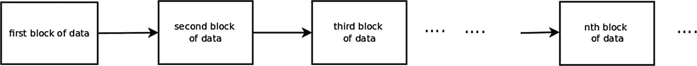
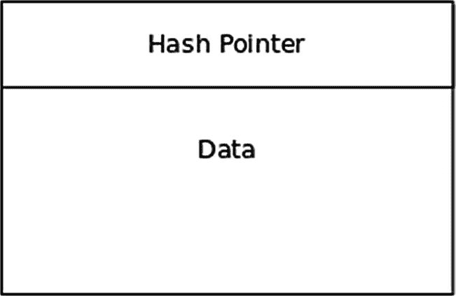
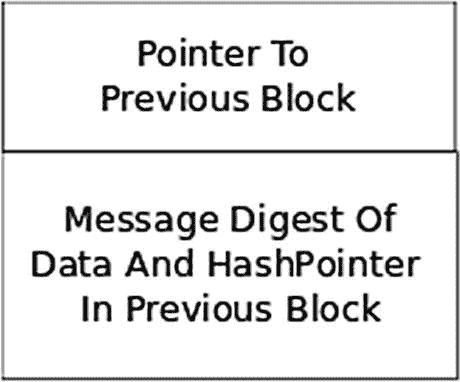
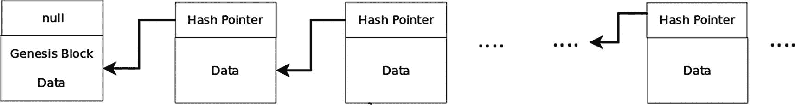

# 6. 区块链构建者指南

在之前的几章中，我们学习了与区块链和加密货币相关的部分密码学数学概念。既然我们已经掌握了这些深奥的理论，现在就可以进入核心问题了：构建区块链与加密货币应用。

在本章及后续章节中，我们将研究构建区块链应用所需的组件。例如区块链、默克尔树、点对点网络、交易、挖矿等组件。随着学习的深入，我将用 Python 从零开始构建一个名为 Helium 的加密货币。后续章节通常成对出现：第一章介绍所研究组件的理论，第二章则开发实现该组件的 Python 代码。与组件相关的全部代码也将收录在本书的附录中。如果你主要对底层理论感兴趣，可以放心跳过代码实现章节。

由于这是一本学习区块链概念的书，我使用了尽可能简单的 Python 代码；清晰性胜过简洁性或*Rubyesque*式的魔法。如果你是一位经验丰富的 Python 开发者，可能会觉得代码不够地道且冗长。这是有意为之，目的是将本书的阅读门槛降到最低。其次，我尝试在代码中添加了大量内联注释，即使冒着冗余和解释显而易见之事的风险。我们的朋友是 KISS 原则（保持简单与直接）。人们经常观察到，自然倾向于简单而非复杂。^(23) 作为一名软件开发人员，我阅读其他程序员编写的代码时有过非常糟糕的经历，因此我希望你能免于这种痛苦和煎熬。

好了，让我们开始吧。

## 为什么用 Python 编写加密货币？

加密货币可以使用多种语言开发。对于 Helium，我考虑过 C++、Go 和 Python。用 C++编写 Helium 的主要优势在于，C++具有卓越的运行时性能，并能生成非常高质量的生产代码。同样重要的是，我们可以使用 C++的类构造、数据封装、多态性及其他面向对象设计原则来模块化地开发 Helium。我排除了 C++，主要是因为这是一本关于学习和实现概念的书，而 C++会限制读者群。C++是一种复杂的语言，用 C++开发 Helium 需要读者对该语言非常精通。

我非常喜欢 Go 语言。^(24) Go 是由与 C 语言密切相关的程序员开发的。Go 简单易学。C 编程语言的影响在 Go 中显而易见。本质上，Go 是面向 Web 的 C 语言。Go 是一种极简主义语言；它摒弃复杂性，遵循 C 语言的元编程原则：做特定事情只有一种方法。Go 有许多非常酷的特性。它是一门严格类型化的编译型语言，因此速度很快。与 C 一样，Go 拥有功能丰富且高质量的的标准库。^(25) 它的并发实现，除 C++外，比任何其他语言都要出色。将 Go 描述为基础设施应用的系统语言是一种*谬误*。事实上，Go 是一种通用编程语言，很像 C++和 Python。Go 不是面向对象的语言，取而代之的是提供了结构体和接口。我排除了 Go 作为 Helium 的开发语言，原因是很少有开发者熟悉这门语言，因此在本书中使用它会限制读者群。

当一种编程语言跃入四大最流行语言的稀薄平流层时，^(26) 与 C++、Java 和 C 这类重量级语言并肩，你就知道它必有过人之处。Python 是一种功能强大且富有表现力的解释型语言，易于学习。Python 拥有庞大的软件包库，因此被广泛应用于前沿领域，如机器学习、神经网络、金融、虚拟现实、基因组学等。Python 是科学家和非程序员出身的学者的最爱。我们将用 Python 开发 Helium。请注意，一旦你理解了区块链应用中常用的架构和算法，你就可以用 C++、Go 或任何其他语言开发自己的应用。当然，你也可以用自己偏好的语言重新编写 Helium。

最后需要说明一点：我努力让 Helium 的代码尽量自包含，因此会避免大量使用 Python 库。

## 计算机即区块链

大约在 1995 年，约翰·盖奇提出了*网络即计算机*的观点。盖奇的假设是，未来的某一天，Windows 等桌面操作系统和桌面应用将被运行在广域网上的应用所取代。考虑到这是在 1996 年互联网仍处于萌芽阶段时提出的，这是一个非凡的观察。如果区块链技术能够实现其作为互联网应用基石的承诺，我们将能够真实地断言*计算机即区块链*。那么，区块链到底是什么？


## 理解区块链

区块链是一种有序、不可变且防篡改的数据区块集合，其中除第一个区块外，每个区块都通过密码学技术与前一个区块相关联。^(²⁷) 参见图 6-1。



**图 6-1** — 区块链结构

每个区块包含特定于区块链应用领域的数据。此外，每个区块一旦创建便不可更改，且具有防篡改特性，恶意入侵者无法修改其数据。除第一个区块外，每个区块通过密码学关系与前一个区块相连。区块是有序排列的，意味着它们以固定的线性顺序依次衔接。这种有序、不可变且具有密码学关联的区块集合，即被称为区块链。^(²⁸)

随着更多区块的生成，它们会被添加到区块链的头部（右侧）。在规范化的区块链应用中，随着右侧不断添加新区块，区块链的规模持续增长。例如，比特币区块链的大小已超过 250 GB 且仍在增长。

规范化的区块链应用维护着分布式区块链，这意味着互联网上有多个实体各自持有一份区块链副本。这些副本之间未必完全一致，因此每个实体有责任同步其持有的区块链副本。这种同步需要借助分布式共识机制来解决副本之间的差异。请注意，这种同步无需任何中心化实体参与。分布式共识算法是区块链应用中极为重要的组成部分，我们将在后续章节中深入探讨。由于区块链是分布式的，它有时也被称为分布式账本。

分布式共识具有深远意义：无需中央权威机构来维护区块链的完整性。这意味着区块链无需许可，面向全世界开放。分布式共识解决了创建分布式货币时的主要障碍之一——双重支付问题。该问题指的是，拥有一定数量加密货币的人试图将同一笔资金花费两次。在中心化的法定货币系统中，防止双重支付轻而易举。然而，在创建分布式加密货币时，这却是一个重大挑战。当我们深入探讨实际创建加密货币的机制时，上述讨论将变得清晰明了。

在比特币等规范化区块链应用中，时间并非重要变量。交易不按时间排序，没有中央计时器，也无需同步区块链实体的时间。交易可以以任意顺序发生，分布式共识算法会自行完成排序。这是一个非常强大的理念。相比之下，在法定货币银行系统中，时间至关重要，交易的有效性通常取决于哪笔交易最先发生。

区块链通常被设计为长期存续，因此其数据通常会被持久化到硬盘或其他存储介质上。最后，在典型的区块链应用中，允许公众查看区块链，但这一点并非必须如此。

### 创世区块

区块链的第一个区块被称为创世区块。它通常由应用主动创建，用于引导区块链的启动。例如，在加密货币应用中，创世区块通常会包含初始的货币分配。

### 区块链数据库

你可能会认为区块链应该使用诸如 `PostgreSQL`、`Cassandra` 或 `Redis` 之类的数据库来实现。这是一种不良实践。区块链应用应尽可能保持实现方案的简单与透明，尤其是在涉及货币的加密货币应用中。数据库实现会引入过多复杂性——若数据库数据损坏或崩溃，该如何应对？

规范化的区块链应用仅将区块以简单的文本或二进制文件形式持久化存储，并借助底层操作系统将区块写入磁盘。每个区块属于“一次写入、多次读取”的文件。

这并不意味着区块链应用完全不使用数据库。例如，比特币使用 `LevelDB` 数据库来索引区块并管理未花费余额。在区块链应用中，这些数据库始终扮演辅助角色，且其中的数据总能从区块链中从头重建。

### 哈希指针：秘密配料

现在我们来探讨区块链中的区块如何通过密码学关系相互关联。除创世区块外，区块链中的每个区块大致如图 6-2 所示。



**图 6-2** — 区块链中的区块

区块由特定应用的数据和一种称为哈希指针的结构组成。哈希指针的结构可如图 6-3 所示。



**图 6-3** — 哈希指针结构

哈希指针是一种数据结构，具备以下功能：

* 指向前一个区块的存储位置
* 包含前一个区块数据及哈希指针的消息摘要

“指向前一个区块的存储位置”是指前一个区块的地址。例如，该指针可以是区块文件的路径、内存地址或列表索引。指针的具体形式取决于区块的表示方式。由于创世区块没有前一个区块，我们只需将其哈希指针设为 `null`。

在计算消息摘要时，我们可以使用 `SHA-256` 算法。

因此，给定一个哈希指针，我们就能检索前一个区块的数据和消息摘要，从而验证前一个区块的数据是否被篡改。

现在，我们可以用哈希指针来表示区块链，如图 6-4 所示。



**图 6-4** — 区块链结构


#### 区块链的不可篡改性

检测区块链是否被篡改是相当容易的。请参考图 6-4 所示的区块链。进一步假设每个区块（创世区块除外）的哈希指针都包含前一个区块数据及哈希指针的`SHA-256`消息摘要。

假设恶意方修改了第二个区块中的数据或哈希指针。正在验证区块链是否被篡改的节点将计算第二个区块的`SHA-256`消息摘要，然后将该值与第三个区块哈希指针中包含的`SHA-256`消息摘要进行比较。由于这两个摘要不匹配，该节点将断定：要么第二个区块被篡改，要么第三个区块中的消息摘要被篡改。

由于恶意方篡改了第二个区块，他还必须更改第三个区块中的加密哈希值，使其与第二个区块的计算哈希值匹配。但这样一来，第四个区块中的加密哈希值将与第三个区块的计算哈希值不匹配。这种对哈希指针的修改必须一直延续到初始被修改区块之后的所有后续区块。此外，由于区块链是一种分布式数据结构，被修改的区块必须传输到区块链网络中的所有其他节点，以便它们修正自己的区块链副本。这些节点将检测到篡改行为并拒绝更改其副本。

#### 构建一个简单的区块链

让我们用 Python 构建一个非常简单的区块链。我们的区块链将是一个列表结构（在其他语言中称为数组）：

```
blockchain = [ ]
```

我们将让每个区块中的数据是斐波那契数列中的下一个数字（0, 1, 1, 2, 3, 5, 8, 13, 21…）。对于除创世区块外的每个区块，数据和哈希指针将表示为以下字典项（在其他语言中称为映射）：

```
{
'ptr':  前一个列表元素的索引
'hash': 前一个区块的 SHA-256 哈希值（十六进制字符串）
'data': 斐波那契数
}
```

区块的`SHA-256`消息摘要将通过将列表元素的值转换为 JSON 字符串，然后计算该字符串的`SHA-256`消息摘要的十六进制值来获得。

根据上述规范，创世区块是：

```
blockchain[0] = {
'ptr': None
'hash': None
'data': 0
}
```

这个区块链中的第二个区块是：

```
blockchain[0] = {
'ptr': 0
'hash': 一个十六进制字符串
'data': 1
}
```

以此类推。

可以注意到的一点是，由于这个区块链是一个列表，指向前一个区块的指针可以简单地表示为前一个列表元素的索引。

#### 区块链宇宙

到目前为止，我们已经深入探讨了区块链的理论；现在该来看看区块链的一些应用了。作为一般性原则，我们可以说任何需要分布式共识来进行决策的应用程序，都可能适合用区块链来实现。

区块链的第一个用途是在加密货币比特币中，而加密货币至今仍是区块链的主要应用领域。另一个主要领域是智能合约加密货币，例如以太坊。这些加密货币允许定义合约，指明价值转移的条件。这些合约通过区块链虚拟机能够理解的编程语言来指定。^( ²⁹ ) 像 Ripple 这样的项目致力于实现金融服务业的自动化，目标是降低交易成本并缩短交易完成时间。

在第二章 2 中，我们研究了 Brave 浏览器，它提出了一种数字广告分发的激进模式。Brave 项目增强了互联网隐私，并奖励数字广告分发中的所有利益相关者：内容创作者、浏览内容的用户以及托管内容的浏览器。所有这些利益相关者都会获得`BAT`加密货币单位的奖励。

另一个应用领域是游戏和数字内容。`TRON`就是此类项目的一个例子。`TRON`旨在通过消除托管此类内容的把关人来使内容分发民主化。`TRON`项目使用`BitTorrent`协议来分发和检索此类内容。^( ³⁰ )

区块链技术的其他应用领域包括供应链管理、防篡改投票系统、分布式身份系统和无需许可的托管系统。当然，这项技术还有更多潜在的应用领域。

## 结论

在本章中，我们定义了区块链，并讨论了其理论基础和基本特征。最后，我们讨论了区块链技术的一些应用领域。

在下一章中，我们将开始我们的主要项目：构建一种名为氦气（Helium）的加密货币。我们的首要任务是为氦气编写一个区块链程序。

