# 9. 加密货币交易处理

在诸如比特币或 Helium 这样的加密货币网络中，交互的基本单元是交易，即价值从一个实体转移到另一个实体。在这类网络中，区块链是一个不可篡改的分布式账本，记录了所有在网络上发生的交易。价值从一个公共地址转移到另一个公共地址。通过扫描整个区块链中涉及某个地址的交易，我们可以查看并列举与该公共地址相关的所有交易。实际上，如果我们从创世块开始向前扫描区块链，那么涉及该地址的最后一笔交易也提供了与该地址关联的加密货币余额。

我们刚刚描述的这类加密货币区块链没有用户账户的概念。区块链不会为每个交易者提供一个记录了所有账户活动的唯一账户。相反，应用仅在交易发生时将其记录在链上。每笔交易由一个或多个原始公共地址组成，价值从这些地址转移到**一个或多个目标公共地址**。因此，由于个人使用公共地址来接收价值和转出价值，我们可以通过从创世块开始向前扫描区块链，查找涉及该个人所拥有的公共地址的交易，来构建与个人相关的交易。这正是用户钱包的构建方式。需要提及的是，重复使用公共地址被认为是一种不良做法，因为无论是离线还是在线创建新地址都几乎是零成本的。此外，使用多个地址在某种程度上可以模糊身份信息。

关于比特币和 Helium 这类加密货币网络，有一件事值得注意：转移价值的合约关系存在于网络之外。网络本身并不记录合约关系。这与以太坊形成对比，以太坊可以在网络上编码合约条款。

本章及接下来的两章将探讨加密货币交易。在本章中，我们将深入探讨加密货币交易、此类交易的验证，特别是价值如何安全地从合法所有者手中转移到预期接收者手中。在下一章中，我们将研究默克尔树以及如何利用它们来验证区块中的交易。在第 11 章中，我们将为 Helium 交易处理编写代码。

## 公共地址构建

在典型的交易中，价值接收方会向价值转出方提供一个公共地址，以便将价值发送到该地址。通过使用加密技术，价值接收方可以证明其生成了该公共地址，因此是已转移到该地址的价值的所有者。

为简洁起见，此后我将把诸如 SHA-256 或 RIPEMD-160 等加密哈希函数的十六进制字符串编码输出简称为**消息摘要**或**哈希**。

以下算法列举了生成公共地址所涉及的步骤：

1.  生成一对随机的 ECC 私钥-公钥对。^(⁴²)
2.  生成公钥的 SHA-256 消息摘要。
3.  生成步骤 2 结果的 RIPEMD-160 消息摘要。
4.  在 RIPEMD-160 哈希前添加一个版本字节 `0x1`。
5.  计算步骤 4 结果的 SHA-256 消息摘要。
6.  提取步骤 5 结果的最后四个字节。这将作为我们的错误检测校验和。
7.  将错误校验和与步骤 4 的结果拼接起来。
8.  对步骤 7 的结果进行 Base58 编码。结果即为一个公共地址。^(⁴³)

我们可以用符号表示公共地址的生成过程：

```
address = base58_encode("1" + RIPEMD-160(SHA256_HASH(public_key)) + checksum)
```

图 9-1 展示了地址生成过程。

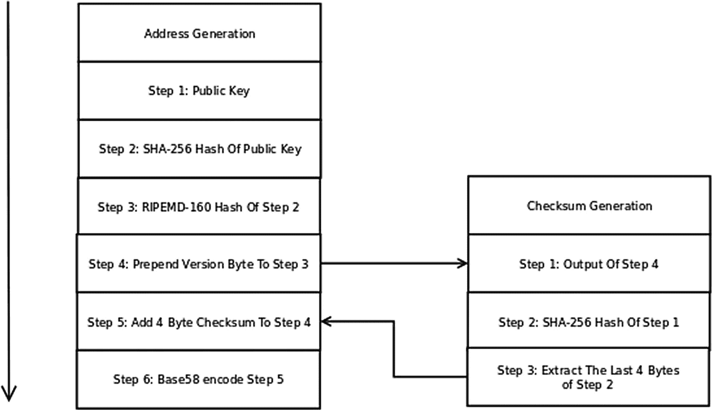

图 9-1

公共地址生成

Helium 地址的版本字节将固定为 `hconfig` 模块中的值。Base58 编码之前的最后四个字节是一个校验和，使我们能够证明地址未被损坏。

此校验和的使用方式如下：

1.  对公共地址进行 Base58 解码。
2.  从上一步的结果中剥离最后四个字节。这四个字节是错误校验和。我们称之为提取的校验和。剩余部分包括前置的版本字节和 RIPEMD-160 哈希。我们将这部分称为 RIPEMD 哈希。
3.  对 RIPEMD 哈希取 SHA-256 哈希，并提取最后四个字节。这是我们计算出的校验和。
4.  如果计算出的校验和与提取的校验和不相等，则该公共地址无效。

请注意，由于公钥的随机生成以及哈希的加密特性，一个公钥总是会生成一个唯一对应的公共地址，*进而*该地址由某个唯一的私钥-公钥对生成。^(⁴⁴)

## 规范交易结构

现在，我们将研究交易的规范 Python 结构。交易具有以下字典结构：

```
{
version:         
transactionid:   
locktime:        
vin:             
vout:            
}
```

尖括号内的文本指定了键对应值的类型。

`version` 键的值描述了用于处理交易的应用程序软件的版本。对于 Helium，该值固定为 "1"。

`transactionid` 是交易的通用唯一标识符。我们将使用 Python 标准库中的 `secrets` 模块来创建一个长度为 512 位的随机且安全的加密十六进制编码字符串。^(⁴⁵)

`locktime` 是一个非负整数。如果此值大于零，则指示矿工在指定时间过去之前不要处理该交易。时间流逝以秒为单位。缓存该交易以供将来处理的矿工，在所需时间过去之前不会将交易包含在区块中。`locktime` 的值不能超过 Helium 配置模块中指定的 `MAX_LOCKTIME`。


### 交易 `vin` 列表

现在我们可以来讨论 `vin` 列表以及解锁先前交易金额的问题了。`vin` 是 value in（输入值）的缩写。`vin` 是一个交易输入列表，它消耗了先前交易的输出。

`vin` 列表中的每个元素都是一个字典。该字典元素通常具有以下结构：

```json
{
txid:             
vout_index:       
ScriptSig:        
}
```

`txid` 是先前某笔交易的交易 ID，该交易的一部分输出正在被消耗。

`vout_index` 是先前交易 `vout` 数组中的一个索引。先前交易的每个 `vout` 元素都指定了一个可被消耗（转移）的值。消耗的总价值是所有 `vin` 元素所转移价值的总和。请注意，先前交易 `vout` 元素中的整个输出都必须被完全消耗。

`ScriptSig` 脚本通过证明对价值的所有权来实现价值转移。它是数字签名和公钥的拼接体。公钥是用于生成公钥地址的密钥，该地址在先前交易中接收了价值转移。我们很快就会详细探讨这个脚本。

### 交易 `vout` 列表

`vout` 是 value out（输出值）的缩写。回想一下，当某个公钥地址根据一笔交易接收价值时，该价值随后可以被其所有者用于另一笔交易。交易的 `vout` 列表指定了可以转移给一个或多个价值接收者的价值。重申一下，`vout` 列表指定了可由其所有者在后续交易中花费的交易价值。

`vout` 是一个列表。每个 `vout` 列表元素都是一个字典，其表示形式如下：

```json
{
value:  ,
ScriptPubKey: 
}
```

`value` 是指定公钥地址接收到的加密货币价值。字符串 `RIPEMD-160(SHA-160(Public Key))` 是从该公钥地址中解析出来的；^((46)) 这个解析出的字符串位于 `ScriptPubKey` 中。`ScriptPubKey` 是一个符号性的解锁操作列表，将在后续讨论。`vout` 元素中的加密货币价值可以被能够解锁 `ScriptPubKey` 脚本的实体所花费。唯一能够解锁该脚本的实体是拥有与 `RIPEMD-160(SHA-160(Public Key))` 相对应的私钥的实体。我将在后面展示这一点。

关于 `vout` 有两点需要注意。首先，只能转移整数金额。在比特币领域，最小的可转移单位是 1 `聪`，即比特币的一亿分之一。在 Helium 中，最小的可转移单位是 1 `helium 分`，也是 Helium 的一亿分之一。通过仅处理整数运算，我们避免了十进制和浮点运算中涉及的所有复杂问题。其次，请注意，整个 `vout` 列表中的价值总和是交易接收方提供的公钥地址所收到的总价值。通常，这个数额会略低于转入该交易的总金额。差额即为交易手续费。

### 交易机制

在牛顿力学中，计算的基本单位是具有质量的物体。物体具有明确定义的属性，并且有物理定律支配它们的行为。类似地，加密货币网络中的基本计算单位是交易。没有交易，就没有区块链。交易具有严格且定义明确的结构，以及支配其行为的固定规则。

让我们逐步了解一笔典型交易中涉及的所有步骤。假设 Alice 想要向 Smith 转移一个 Helium。Alice 面前的任务是创建一个能够促成此转移的交易对象（前述的字典结构）。该交易对象必须 (i) 解锁一些 Alice 拥有的先前 *Helium*，以及 (ii) 锁定输出的 Helium 价值，以便只有 Smith 才能解锁和使用它们。解锁 Alice 拥有的 *Helium* 意味着她证明了自己对这些 *Helium* 的所有权，因此，她可以将其转移出去。一旦这些 *Helium* 被解锁，它们就成为可以交付给 Smith 的输出。Alice 锁定这些输出，以便只有 Smith 可以解锁它们。这将证明 Smith 拥有这些 *Helium*。

在 Alice 能够向 Smith 转移一个 Helium 之前，她必须至少拥有一个 Helium。因此，假设有一笔先前交易，其中包含一个 Alice 拥有的单一输出，金额为 1.08 Helium（一个 `vout` 元素）。我们假设该先前交易的 ID 为：

```json
"618a125ac95ba370187c574d174eb7d618f3ee35d374899ca0007a035ba0a9e1"
```

以下是 Alice 必须遵循的步骤，以便向 Smith 转移一个 Helium：

1.  Alice 请求 Smith 向她发送一个公钥地址，她可以向该地址发送一个比特币。

2.  Smith 向 Alice 发送一个他创建的公钥地址。

3.  Alice 为她的交易创建一个交易 ID。我们假设这个 ID 是：

```json
"d6b77f077ff700cd36df061ed75af353506f0cec6e267f0ce674eaa3b5d53217"
```

4.  当 Alice 在先前交易 `"618...9e1"` 中收到 *Helium* 时，她曾向转让人提供了一个公钥地址。Alice 现在获取用于创建该地址的公钥（例如，称为 `pPubKey`）以及与该公钥配对的私钥（例如，称为 `PrivKey`）。Alice 提取以下可在先前交易输出（`vout` 元素）中获得的值：

```
MDHash = RIPEMD-160(SHA256(pPubKey))
```

Alice 为 `MDHash` 创建数字签名：

```
Sig = Signature(MDHash)
```

接下来，Alice 创建一个包含两个元素的列表：`Sig` 和与该私钥对应的 `公钥` 字符串。这个列表被称为 `ScriptSig`。

5.  利用这些信息，Alice 在交易的 `vin` 列表中创建 `vin` 元素。该列表只包含一个元素。`vout_index` 元素是先前交易 `vout` 列表中的索引，它标识了正在被消耗的先前交易的输出（我们假设它为 0）。该 `vin` 元素为：

```json
{
"txid": "618a125ac95ba370187c574d174eb7d618f3ee35d374899ca0007a035ba0a9e1"
"vout_index": 0
"ScriptSig":  [Sig, PublicKey]
}
```

6.  接下来，Alice 获取 Smith 提供的公钥地址，反转 Base58 编码并剥离校验和。结果是：

```
RESULT =  "1" + RIPEMD-160(SHA256(Smith 的公钥))
```

然后，她使用已剥离的校验和计算 `RESULT` 的 SHA256 哈希值。如果未指示错误，Alice 将以下字符串放入第一个 `vout` 元素的 `ScriptPubKey` 键中：

```
"  MDHASH  "
```

其中 `MDHASH` 是 `RIPEMD-160(SHA256(Smith 的公钥))`。

7.  Alice 的 `vout` 元素是：

```json
{
"value":  1,
"ScriptPubKey": "  MDHASH  "
}
```

8.  至此，Alice 已创建了交易对象，它看起来像这样：


```
{
"version": "1"
"transactionid": "d6b77f077ff700cd36df061ed75af353506f0cec6e267f0ce674eaa3b5d53217"
"locktime": 0
"vin": {
"txid": "618a125ac95ba370187c574d174eb7d618f3ee35d374899ca0007a035ba0a9e1"
"vout_index": 0
"ScriptSig":  "Sig PublicKey"
}
"vout": {
"value":  1,
"ScriptPubKey": [  MDHASH  ]
}
}
```

3.  创建交易对象后，爱丽丝将其序列化为 Base58 字节序列，并在 Helium 点对点网络上广播。监听该网络以获取交易的矿工们会接收这笔交易，并（可能）将其包含在他们打算挖掘的区块中。

在本章的后续部分，我们将展示`ScriptSig`脚本如何确保只有爱丽丝才能解锁之前交易中输出的 1.08 *heliums*，以及`ScriptPubKey`脚本如何确保只有史密斯才能解锁这笔交易中输出的 1 个 helium。只有当`ScriptSig`和`ScriptPubKey`两者都成功执行且无错误时，交易才被视为有效。比特币和 Helium 都实现了一个简单的栈处理器来验证这些脚本是否成功执行。

你可能已经注意到，我们解锁了 1.08 *heliums*，但只向史密斯转移了 1 个 helium。剩下的 0.08 个 helium 去哪了？这部分多余金额被称为交易费。它是激励矿工将爱丽丝的交易包含在他们打算挖掘的区块中的诱因。如果某个矿工成功挖掘了一个包含爱丽丝交易的区块，那么该矿工就可以申领这 0.08 个 helium。

前述逻辑经过适当修改后，可应用于处理来自爱丽丝拥有的多个先前交易输出的输入（这些交易将有多个先前交易的`vout`列表元素），并且该交易可以将输出指向多个 helium 地址（该交易将拥有多个`vout`元素）。

我之前描述的这些步骤通常由爱丽丝的 Helium 钱包执行。

在一个典型的法币收银台交易中，你支付一些钱并收到一些找零。在加密货币中，找零按以下方式处理。假设爱丽丝有一笔包含 5.08 个 helium 的先前交易，她打算在与史密斯的交易中使用这些 *heliums*。爱丽丝将创建一个公开地址，并向该地址转入 4 个 *heliums*。这样，史密斯将在他提供给爱丽丝的地址上收到 1 个 helium，爱丽丝将在地自己创建的地址上获得 4 个 *heliums* 的找零，而交易费将是 0.08 个 *heliums*。交易的这一方面也将由 Helium 钱包透明地处理。

## ScriptPubKey 和 ScriptSig 脚本

交易`vout`元素中的`ScriptPubKey`脚本用于锁定该元素中指定的值。只有该值被转移到的公开地址的所有者才能解锁该值。

交易`vin`元素中的`ScriptSig`脚本描述了先前交易中将在当前交易中被消耗的一个值。该值将被转移到一个或多个公开地址。被消耗的值可以通过先前交易的交易 ID 以及该交易中`vout`元素的索引来完全识别。`ScriptSig`脚本确保先前交易中的这个值只能由该值的所有者转移。

请注意，交易中的每个`vin`元素恰好引用先前交易中的一个`vout`元素，并且这样的`vin`元素必须消耗该`vout`元素中的全部值。

`ScriptPubKey`和`ScriptSig`脚本都是简单的列表。它们由一个我将要描述的简单栈语言处理。

这些脚本中的元素（列表元素）要么是一个操作符符号，要么是一个操作数。我们将操作符符号称为操作码。操作数是一个值；例如，整数 5 和字符串`"hello world"`都是操作数。操作码是对操作数执行操作的可符号化操作。例如，加法操作符`+`是一个对数字进行操作的操作码。每个列表元素恰好包含一个操作码或一个操作数。操作码用尖括号括起来表示。

执行栈是一个由操作码和操作数组成的列表。例如，`ScriptPubKey`和`ScriptSig`都是执行栈。

`vin`和`vout`列表中的每个元素要么是操作码，要么是操作数。每个列表的行为都像一个栈，因此，它只允许对栈执行两种操作：`PUSH`（压入）和`POP`（弹出）。`POP`操作从栈顶弹出一个元素，`PUSH`操作将一个元素压入栈顶。

最后，我们还指定了一个结果栈。执行栈上的操作码将对结果栈上的值进行操作，如果操作码的语义要求，操作的结果可能会被推回结果栈。如果执行栈上的值是一个操作数，它将被简单地推送到结果栈上。

有效的操作码包括`DUP`、`HASH-160`、`PK_HASH`、`EQ-VERIFY`和`CHECK-SIG`。这些操作码的含义如下所述。有效的操作数必须是字符串。

本规范描述了一个简单的栈语言。

如前所述，操作码将通过将其括在尖括号内来表示。表示值的操作数则不括在尖括号内。将要执行的操作码将由一个执行指针（粗箭头）指示。

我们将研究 P2PKHASH（个人到公钥哈希）脚本。这些类型的脚本将价值从单个实体转移到另一个单个实体。在典型的加密货币网络中，P2PKHASH 脚本占所有交易的 98%到 99%。

### ScriptSig 脚本

P2PKHASH 交易的每个`vin`元素中的`ScriptSig`列表具有以下结构（图 9-2）。

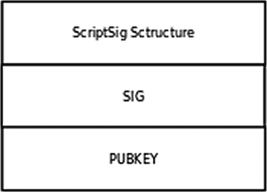

图 9-2

ScriptSig 结构

一个`ScriptSig`脚本由两个操作数组成。`PUBKEY`是用于创建接收先前交易输出的公开地址的公钥（十六进制字符串）。

`SIG`是通过对以下值签名而创建的签名：

```
RIPEMD-160(SHA256(先前交易输入的公钥))
```

该值在先前交易的`vout`元素中也存在。

### ScriptPubKey 脚本

考虑一个 P2PKHASH 交易。在此类交易中，交易每个`vout`元素中的`ScriptPubKey`脚本可以可视化为图 9-3 左侧的栈。

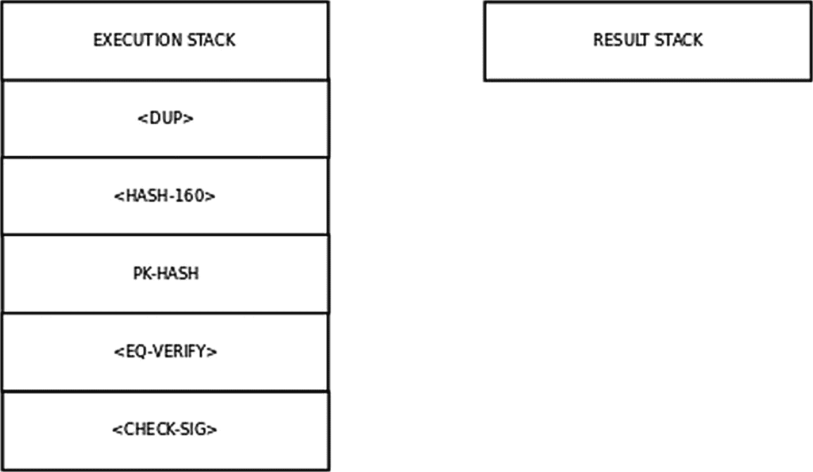

图 9-3

ScriptPubKey 的执行栈

该图还显示了右侧一个空的结果栈。这个栈将存放将由执行栈中的操作码进行操作的操作数。

执行栈中操作码的含义如下：

`<DUP>` 表示取出结果栈顶部的值，并将该值的副本压回结果栈。

`<HASH160>` 表示弹出结果栈顶部的值，并生成值：

```
RIPEMD-160(SHA-256(弹出的值))
```

然后将该消息摘要压入结果栈。`PK-HASH` 是一个字符串。

`<EQUAL_VERIFY>` 表示从结果栈中弹出两个元素，并验证它们是否相等。

`<CHECK_SIG>` 表示从结果栈中弹出两个元素，并验证签名。
```


### 脚本签名与脚本公钥的实际操作

让我们看看如何使用 `ScriptSig` 和 `ScriptPubKey` 脚本来验证一笔 P2PKHASH 交易。只有当这两个脚本都执行无误时，该交易才被视为有效。一笔有效的交易会解锁该交易所引用的先前交易输出。我们将沿用之前的示例，即爱丽丝向史密斯转移一枚氦币。

首先，我们将 `ScriptSig` 和 `ScriptPubKey` 列表连接起来，得到如下执行栈（列表头部位于顶部）（图 9-4）。

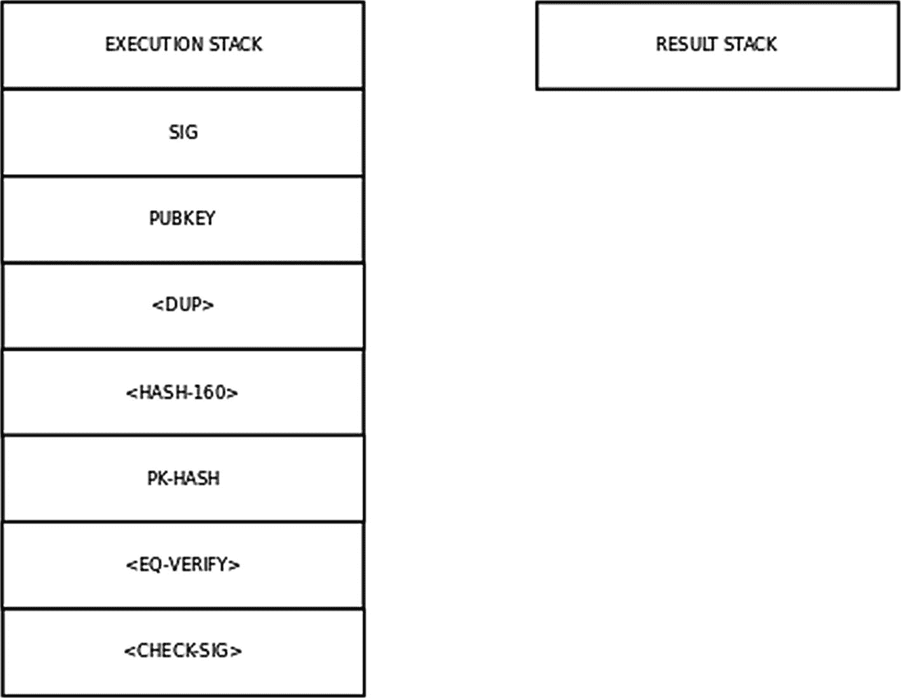

**图 9-4** ScriptSig 和 ScriptPubKey 的执行栈

现在，我们将执行此栈上的操作码。栈中出现的任何操作数都将被直接推入结果栈。

执行栈将通过一个执行指针（用一个粗箭头表示，见图 9-5）来指示下一个要执行的操作。

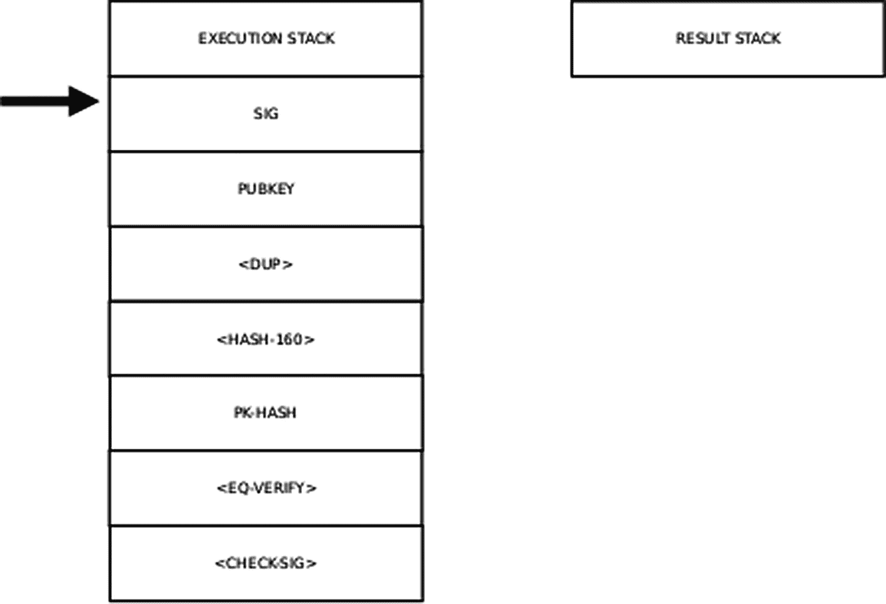

**图 9-5** 执行栈步骤 1

第一个操作是 `SIG`。爱丽丝获取 `RIPEMD-160(SHA256(公钥))` 这个值（该值位于先前交易 `vout` 元素的 `ScriptPubKey` 中），并生成该值的签名。该值被推送到结果栈中。此时两个栈的状态如图 9-6 所示。

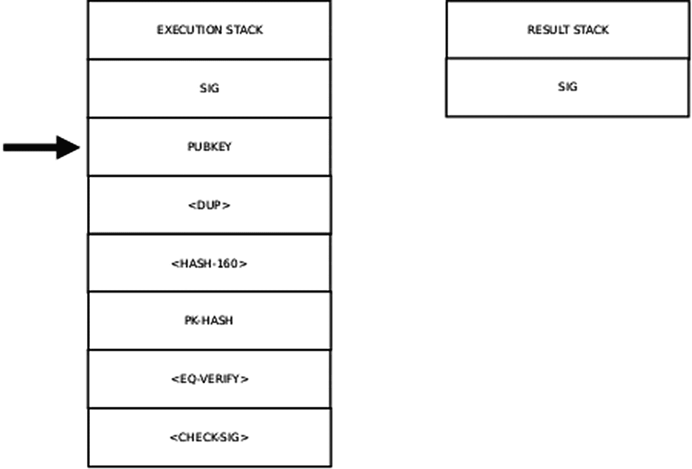

**图 9-6** 执行栈步骤 2

下一个操作是 `PUBKEY`，即爱丽丝用来生成先前交易地址的公钥（该交易的输出正被爱丽丝使用）。此公钥的十六进制字符串被推送到结果栈中。此时两个栈的状态如图 9-7 所示。

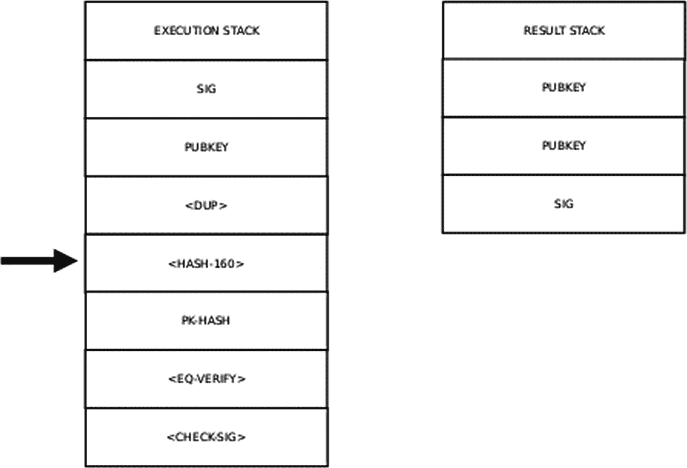

**图 9-7** 执行栈步骤 3

下一个操作码是 `<DUP>`。此操作要求复制结果栈顶部的元素，并将其推回结果栈。执行此操作后，两个栈的状态如图 9-8 所示。

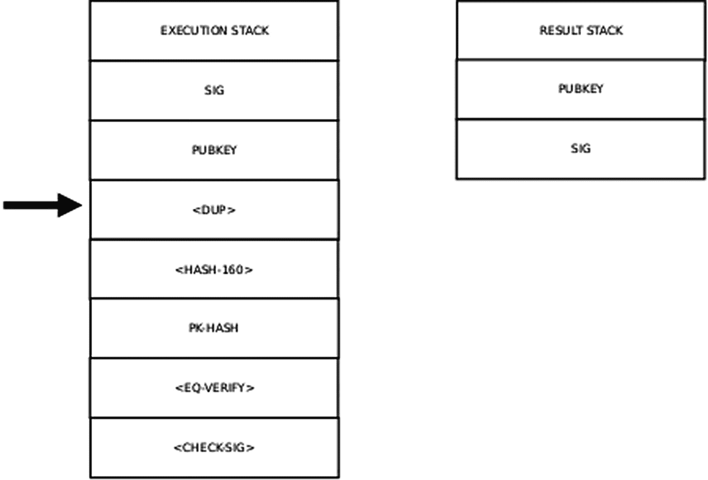

**图 9-8** 执行栈步骤 4

下一个操作码 `<HASH-160>` 要求弹出结果栈顶部的值，计算 `RIPEMD-160(SHA256(弹出的值))`，然后将结果推送到结果栈中。此操作的结果如图 9-9 所示。

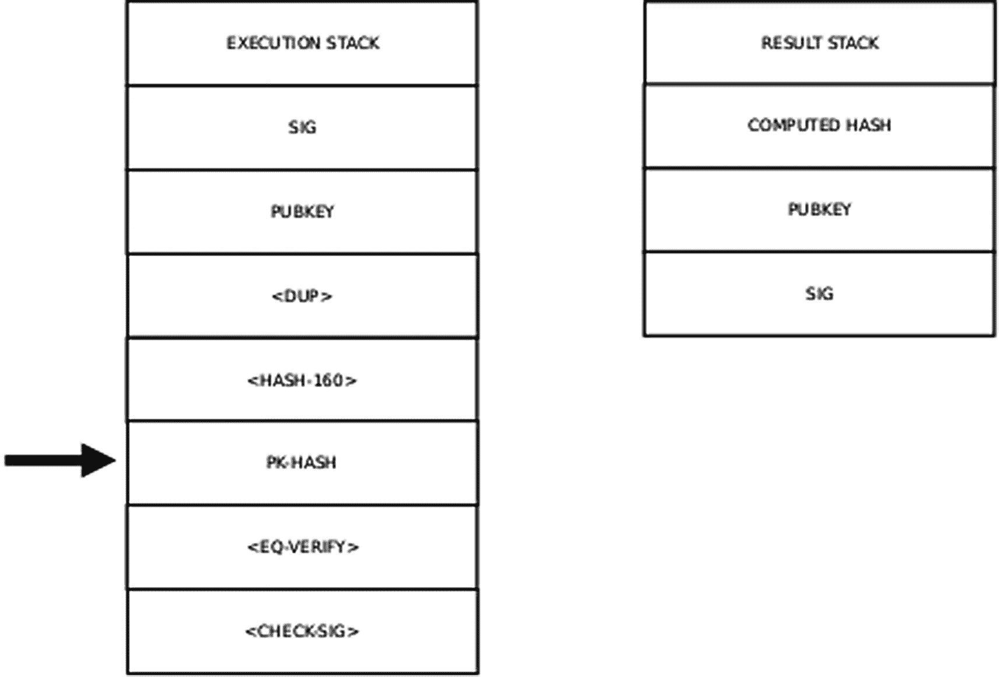

**图 9-9** 执行栈步骤 9

下一个操作将 `PK-HASH` 值推送到结果栈中。`PK-HASH` 是在创建上一笔交易时生成的；其值为 `RIPEMD-160(SHA256(上一笔交易输入的公钥))`，如图 9-10 所示。

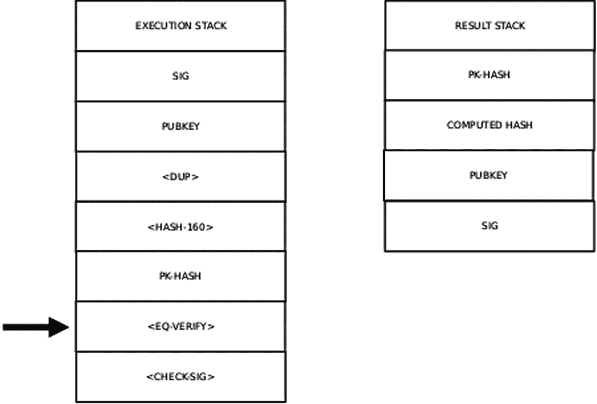

**图 9-10** 执行栈步骤 10

操作码栈上的下一个命令是 `<EQUAL_VERIFY>`。此操作码要求我们弹出结果栈顶部的两个值并比较它们。如果这两个 `RIPEMD-160` 哈希值不相等，则输入解锁失败，因为声称拥有上一笔交易中价值的一方未提供正确的公钥。如果爱丽丝使用她用于上一笔交易输入的公钥来计算哈希值，则相等性验证成功。

如果操作成功，则两个栈的状态如图 9-11 所示。

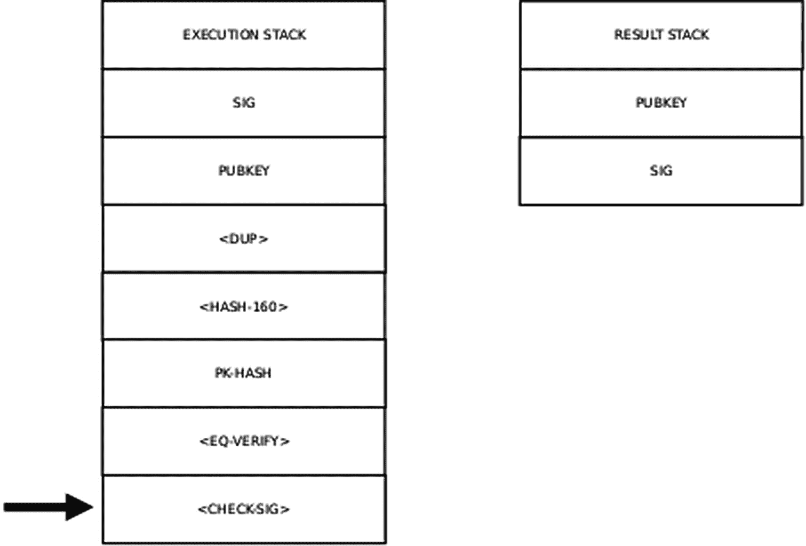

**图 9-11** 执行栈步骤 11

最后一个操作码 `<CHECK_SIG>` 按以下方式验证上一笔交易：

1.  根据爱丽丝用于先前交易输出的公钥，验证与该公钥对应的私钥是否生成了该值的签名。

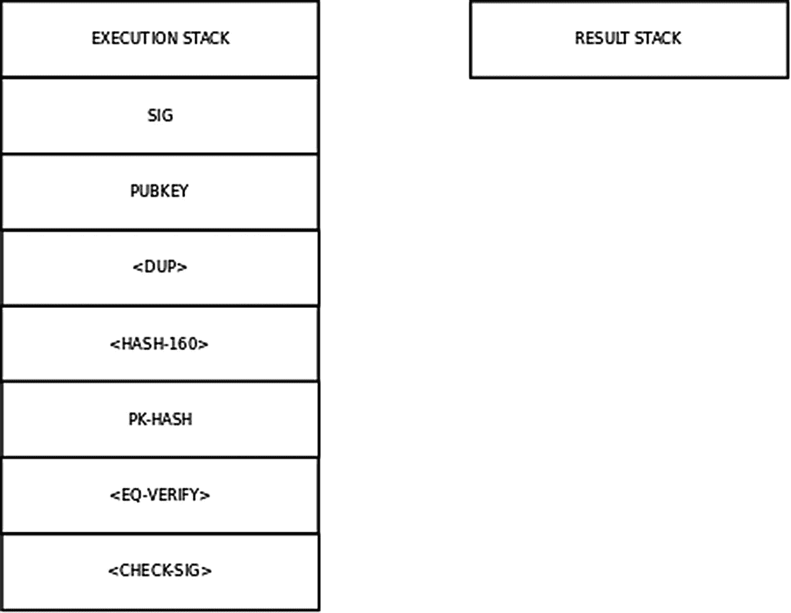

**图 9-12** 交易输出已解锁

1.  如果签名有效，则从结果栈中弹出这两个元素。交易的 `vin` 元素已成功解锁了上一笔交易的输出（图 9-12）。

```
RIPEMD-160(SHA256(公钥))
```

如果当前交易中的所有 `vin` 元素都已解锁，我们就说该交易已解锁。

## 多重签名交易

考虑一个法币支票账户，要求配偶双方均在支票上签字。在这种情况下，有效的价值转移需要双方签字。将这种支票交付给付款人就是一次多重签名交易。在加密货币网络中，多重签名交易指的是涉及 n > 1 个实体的交易，每个实体提供一个该交易的公钥地址。然后，这 n 个实体中至少有 m 个实体必须提供他们的签名，才能将价值转移给接收方。这种交易通常被称为 m:n 交易；它通过一个验证多个签名的脚本来实现。我们的支票示例就是一个 2:2 交易。

多重签名交易有几个有趣的应用场景。

在 2:2 托管交易中，其中一方是中立仲裁人，其职能是监督约定的价值转移条件是否已满足。只有满足这些条件时，仲裁人才会提供其签名。我们也可以有 m:n 托管交易，其中需要 m 个（m < n）仲裁人签署交易。

在双重身份验证交易中，上一笔交易的输出被两个公钥地址锁定。第一个公钥地址由在线钱包生成。第二个地址由保存在冷存储中的密钥生成。当两个签名都验证通过后，上一笔交易的输出才会被转移。

我们指定的这个简单栈语言可用于为多重签名交易以及其他场景创建脚本。请注意，由于此栈语言不支持控制流结构（例如 `if…else if…`）和循环，因此它不是图灵完备的。这是中本聪有意为之的设计，因为使脚本处理快速而简单是一个设计目标。

## 交易手续费

在交易中转移价值的人，通常会为矿工提供激励，促使其将该交易纳入待挖掘的新区块中。这笔交易手续费等于输入总额减去输出总额的差值。支付交易手续费并非强制要求，但不支付手续费可能会显著延迟交易的处理，因为矿工缺乏动力将该交易纳入候选区块进行挖掘。


## 交易验证

一旦 Helium 交易被创建，它就会在 Helium 点对点网络上进行广播。接收到这笔新交易的矿工可以选择将其包含在他正在挖矿的区块中。矿工决定是否包含该交易，部分会受到交易中提供的交易费用的影响。

在将交易包含到区块之前，矿工会对该交易进行测试以确定其有效性。只有有效的交易才会被包含在待挖掘的区块中。

如果矿工挖掘的区块中包含无效交易，网络中的其他节点将拒绝将此新区块纳入其本地区块链版本中，因为每个接收到已挖掘区块的节点都会验证该区块以及其中交易的有效性。

以下是对交易进行验证时执行的部分测试：^(⁴⁸)

1.  交易语法有效；这意味着所需的交易字段都存在且其类型有效。
2.  交易输入为正整数。具体来说，它们不是浮点数。
3.  交易输出为正整数。具体来说，它们不是浮点数。
4.  交易输入和输出不小于一个 Helium 分。
5.  交易输入的总和小于 `hconfig` 模块中 `MAX_HELIUM_COINS` 的值。
6.  交易输出的总和小于 `hconfig` 模块中 `MAX_HELIUM_COINS` 的值。
7.  交易输入的总和大于或等于交易输出的总和。
8.  交易的锁定时间不小于零。
9.  锁定时间不大于 `hconfig` 模块中 `LOCKTIME_INTERVAL` 的值。
10. 每笔交易长度至少为 100 字节。
11. 交易输入数量小于 `hconfig` 模块中的 `MAX_INPUTS`。
12. 交易输出数量小于 `hconfig` 模块中的 `MAX_OUTPUTS`。
13. `ScriptSig` 脚本具有有效值。
14. `ScriptPubKey` 脚本具有有效值。
15. `ScriptSig` 和 `ScriptPubKey` 脚本成功实现价值转移。
16. 只有当区块链从 `coinbase` 交易所在的区块之后增长了 `COINBASE_INTERVAL` 个区块时，`coinbase` 交易的输出才能被花费。我们将在后续讨论 coinbase 交易。
17. `coinbase` 交易没有任何输入（`vin` 列表为空）。
18. 创世区块没有任何输入。

## 总结

加密货币网络中的基本计算单元是交易。区块链中的区块包含交易。随着加密货币网络上的节点处理交易，区块会被添加到区块链中。这些节点被称为矿工，将区块添加到区块链的过程被称为挖矿。

在本章中，我们研究了典型加密货币交易的结构，并审视了解锁先前交易中输入以便花费它们必须遵循的所有步骤。想要向加密货币区块链添加区块的节点必须在其候选区块中包含交易。这些节点必须首先验证区块中包含的交易是有效的。我们探讨了交易验证测试。如果挖矿节点成功地将区块添加到区块链中，它就有权获得该区块中所有交易的交易费用，以及包含在 `coinbase` 交易中的挖矿奖励。

在下一章中，我们将学习默克尔树。这些树结构用于确定交易列表是否被篡改。默克尔树也可用于确定特定交易是否存在于某个区块中。

## 参考

[`https://github.com/bitcoin/bitcoin`](https://github.com/bitcoin/bitcoin)，最后访问于 2020 年 2 月 8 日

脚注 1   2   3   4   5   6   7

# 10. 默克尔树

在上一章中，我们对加密货币交易进行了全面研究。交易是加密货币网络中的基本计算单元。没有交易，就没有区块链。一个区块由若干笔交易以及相关数据组成。对于任何包含交易的区块，我们希望确定两个属性：首先，这些交易没有被篡改；其次，特定交易是否存在于该区块中。

您应该还记得第 8 章中，区块属性 `prevblockhash` 用于测试前一个区块是否被篡改。此哈希值是对前一个区块的区块头进行计算得到的。前一个区块中的交易并不位于该区块头中。然而，区块头包含这些交易的默克尔根。这个根可用于验证区块中交易的完整性。如果任何交易被更改，默克尔根将会改变，因此，前一个区块的哈希值将不匹配，从而使交易无效。

在本章中，我们将了解如何使用默克尔树来验证区块交易的完整性。之后，我们将为 Helium 默克尔树实现代码。

## 树数据结构

在计算机科学中，树是节点的集合，节点之间通过父节点、子节点和兄弟节点关系相互关联。通过图表（图 10-1）可以最好地解释这一点。

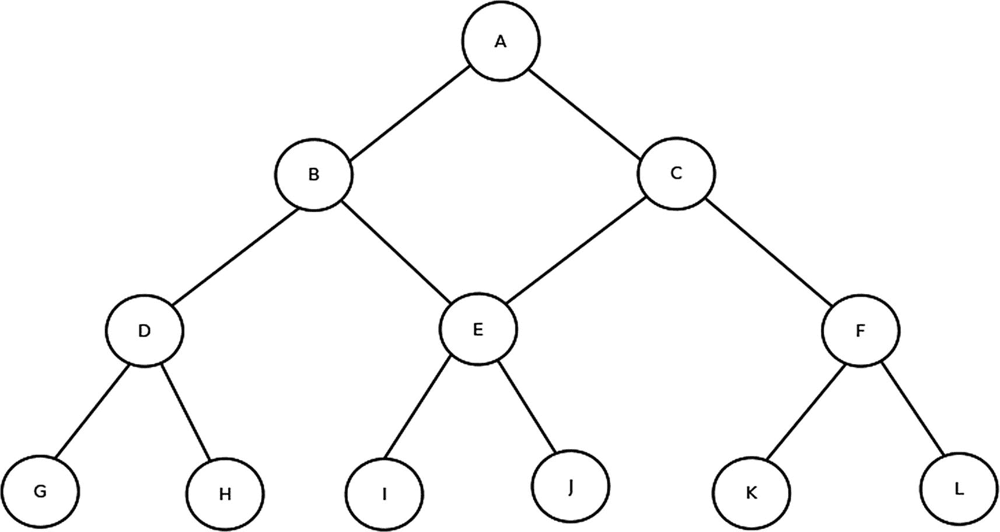

图 10-1

一种树数据结构

在此图中，每个节点由一个圆形表示。共有 12 个节点，标记为 A 到 L。这些节点排列成四层。除了节点 A 之外，每个节点都通过一条线与它上方的节点相连。它上方的节点称为父节点。例如，D 是 H 的父节点，C 是 E 和 F 的父节点。节点 A 没有父节点；它被称为根节点。除了位于此树结构底部的节点 G 到 L 之外，每个节点都与其下方的两个节点相连。这两个节点被称为上方节点（即父节点）的子节点（或称左子节点和右子节点）。例如，节点 E 有两个子节点，即 I 和 J 节点。E 是这些节点的父节点。同一父节点的子节点之间互为兄弟节点。树底部的节点没有子节点，被称为叶节点。

该图是一个二叉树的示例；除叶节点外，所有节点都有两个子节点。此外，这是一棵平衡树，因为所有叶节点都位于同一层级。并非每个父节点都必须有两个子节点，树也不必是平衡的。我们可以构建节点子节点数量不同且树不平衡的树。然而，平衡二叉树具有非常好的性质；特别是，我们可以非常快速地在树中插入和删除节点。此外，在这些树中搜索节点也非常快。

树中的每个节点通常包含指向其子节点、其父节点的指针，以及特定于该树使用领域的数据。这些节点中的指针允许在树中进行双向移动。


## Merkle 树

在典型的加密货币实现中，区块的数据部分包含一组交易。例如，一个比特币区块可能包含 2000 到 4000 笔交易。在 Helium 中，区块中的交易被表示为一个列表。每个列表元素是一笔交易，每笔交易具有字典结构。我们很快会看到，可以将此交易列表表示为树结构。

`Merkle` 树是一种平衡二叉树，其中节点通过加密哈希相互关联。`Merkle` 树的根节点唯一标识该树。

假设我们有一个区块中的八笔交易列表。我们将按如下方式构建此列表的 `Merkle` 树。

对于每笔交易，计算该交易的 `SHA256` 加密哈希作为十六进制字符串。这些值将成为我们 `Merkle` 树的叶节点（图 10-2）。

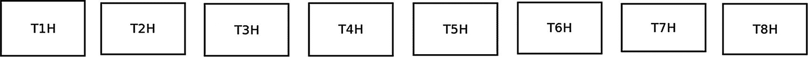

**图 10-2**  
`Merkle` 树的叶节点

`TnhH` 是第 n 笔交易的 `SHA256` 哈希。由于 `Merkle` 树是平衡二叉树，它必须包含偶数个叶节点。因此，如果区块中的交易数量为奇数，我们只需将最后一笔交易在交易列表中重复添加一次。

现在我们可以推导 `Merkle` 树的第二层。从最左侧的叶节点开始，考虑其右侧的兄弟节点。我们将两个哈希 `T1H` 和 `T2H` 拼接起来，并计算此拼接字符串的 `SHA256` 哈希：

```
T12H = SHA256(T1H + T2H)
```

然后我们拼接下一对叶节点哈希并计算 `SHA256` 哈希：

```
T34H = SHA256(T3H + T4H)
```

我们按此方式继续，直到所有叶节点都被处理完毕。这将得到一组加密哈希列表，其长度是叶节点数量的一半。`Merkle` 树第二层的节点由这个新列表构建而成（图 10-3）。

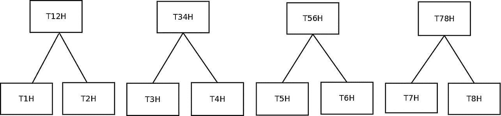

**图 10-3**  
`Merkle` 树的前两层

为了推导 `Merkle` 树的第三层，我们计算以下哈希：

```
T1234H = SHA256(T12H + T34H)
T5678H = SHA256(T56H + T78H)
```

现在我们得到了 `Merkle` 树的第三层（图 10-4）。

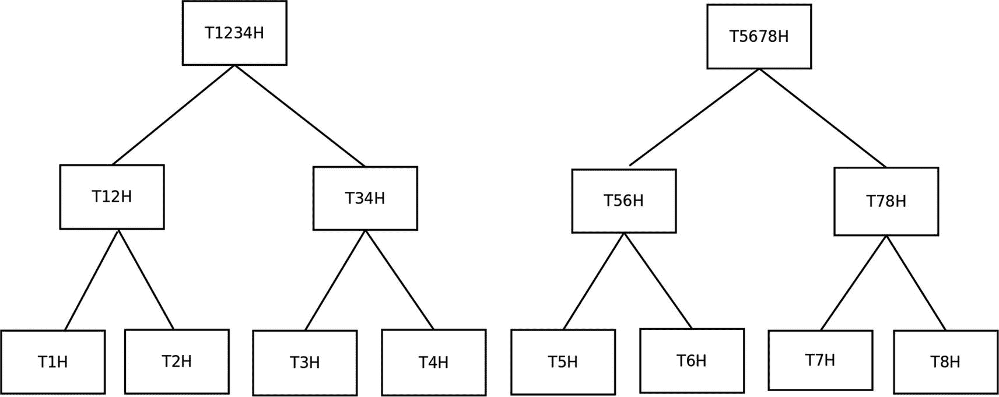

**图 10-4**  
`Merkle` 树的前三层

最后，我们将位于 `Merkle` 树第三层的两个节点中的 `SHA256` 哈希拼接起来：

```
T12345678H = SHA256(T1234H + T5678H)
```

这给出了区块中八笔交易的 `Merkle` 树的最终表示（图 10-5）。

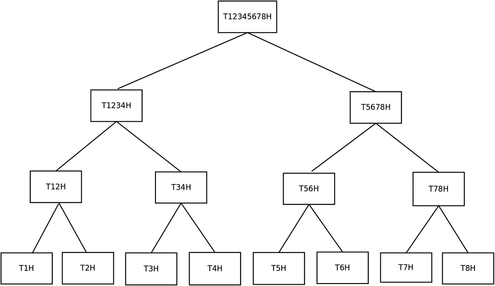

**图 10-5**  
八笔区块交易的 `Merkle` 树

哈希值 `T12345678H` 被称为 `Merkle` 根。它是区块中交易的加密哈希。如果任何交易被篡改，或者它们在区块交易列表中的顺序被改变，`Merkle` 根将与其先前的值不一致。由于 `Merkle` 根位于区块头中，区块头将变得不一致。

你可能会问，为什么我们需要构建 `Merkle` 树。简而言之，像 `Merkle` 树这样的平衡二叉树是一种高效搜索结构。假设有一百万笔区块交易的假设列表。这个列表可以表示为深度为 20 层的 `Merkle` 树。此外，我们可以用 `O(log n)` 的时间在该列表中搜索特定交易，其中 `n` 是交易的数量。

`Merkle` 树的另一个特性是，到任何叶节点（交易）的路径是唯一的。考虑 `SHA256` 哈希为 `T6H` 的交易；到该交易的路径可以表示为：

```
T12345678 + T5678 + T56 + T6
```

在图 10-6 中，此路径用强调线标出。

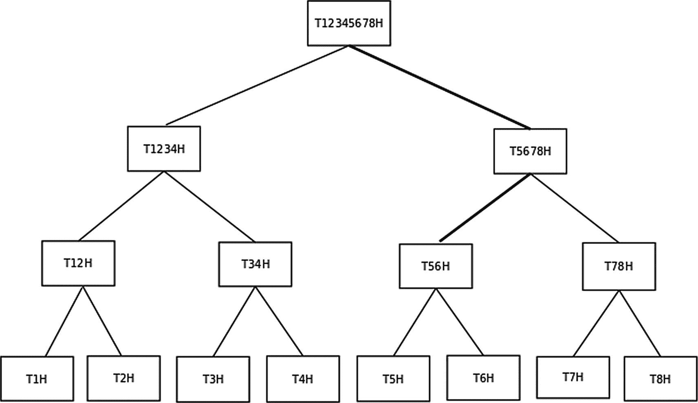

**图 10-6**  
到一笔区块交易的路径


## 在 Helium 中推导默克尔根

在第 8 章中，我们编写了 Helium 区块链的部分 Python 代码。当时该模块中的函数 `merkle_root` 仅作为占位符，返回了一个模拟值。现在我们将修正这一缺陷，编写代码来计算并返回区块中交易列表的默克尔根。

请删除 `hblockchain.py` 文件中的占位函数 `merkle_root`，并将以下代码添加到 `hblockchain` 模块末尾。主函数 `merkle_root` 会将字典值转换为 JSON 编码的字符串，因此请确保已将标准 Python 模块 `json` 导入到 `hblockchain` 中：^(⁴⁹)

```
def merkle_root(buffer: "List", start: "bool" = False) -> "bool or string":
"""
merkle_tree: 计算交易列表的默克尔根。
接收一个交易列表和一个布尔标志，用于指示
该函数是首次被调用还是来自函数内部的递归调用。
如果成功，返回默克尔树的根；如果出错，返回 False。
"""
try:
### 如果 start 为 False，则验证是否包含 SHA-256 哈希列表
if start == False:
for value in buffer:
if rcrypt.validate_SHA256_hash(value) == False:
raise(ValueError("交易列表 SHA-256 验证失败"))
buflen = len(buffer)
if buflen != 1 and len(buffer)%2 != 0:
buffer.append(buffer[-1])
### 如果是首次进入该函数，则创建默克尔叶节点
if start == True:
tmp = buffer[:]
tmp = make_leaf_nodes(tmp)
if tmp == False: return False
buffer = tmp[:]
### 如果 buffer 只有一个元素，则已得到默克尔根
if (len(buffer) == 1):
return buffer[0]
### 从子节点构建父节点列表
index = 0
parents = []
while index < len(buffer):
#### 将两个子节点拼接成一个字符串
parent_value = buffer[index] + buffer[index + 1]
#### 计算父节点字符串的 SHA-256 哈希值并添加到父节点列表
parents.append(rcrypt.make_SHA256_hash(parent_value))
index += 2
### 递归调用本函数，但将 start 标志设置为 False
return merkle_root(parents, False)
except Exception as err:
logging.debug('merkle_root: 异常: ' + str(err))
return False

def make_leaf_nodes(tx_list: "list") -> "List or False":
"""
make_leaf_nodes: 创建默克尔树的叶节点。
接收一个交易列表。如果交易数量为奇数，则将最后一个交易再次追加到列表中，
以便构建一个平衡二叉树。
计算每个交易的十六进制字符串编码的 SHA-256 消息摘要，并将其追加到
初始为空的叶节点列表中。
如果成功，返回叶节点列表；如果出错，返回 False。
"""
try:
### 交易列表不能为空
if (len(tx_list) == 0): raise(ValueError("交易列表长度为 0"))
### 验证类型是否为列表
if type(tx_list) is not list: raise(ValueError("交易不是列表类型"))
### 验证每个交易的类型是否为字典
for tx in tx_list:
if type(tx) is not dict: raise(ValueError("交易不是字典类型"))
### 交易数量必须为偶数
if len(tx_list) % 2 == 1 or len(tx_list) == 1:
tx_list.append(tx_list[- 1] )
### 复制交易列表
trx_list = list(tx_list)
### 将每个交易转换为 JSON 字符串
tx = []
for transaction in trx_list:
tx.append(json.dumps(transaction))
### 创建叶节点
sha256_list = []
for transaction in tx:
sha256_list.append(rcrypt.make_SHA256_hash(transaction))
except Exception as err:
logging.debug('make_leaf_nodes: 异常: ' + str(err))
return False
return sha256_list
```

这里有两个函数：`merkle_root` 和 `make_leaf_nodes`。`merkle_root` 接收一个区块交易列表。`merkle_root` 由 `validate_block` 和 `blockheader_hash` 函数调用。

`merkle_root` 是一个递归函数；它接收一个布尔标志作为其第二个参数。如果 `merkle_root` 是从前述函数调用的，则该标志为 `True`；如果是被自身调用的，则为 `False`。`merkle_root` 做的第一件事就是调用函数 `make_leaf_nodes`，后者的任务是构建默克尔树的叶节点。

`make_leaf_nodes` 对其接收的交易列表执行一些验证。如果列表为空，则返回 `False`。空的交易列表没有叶节点。然后它会进行一些类型检查，以验证接收到的确实是一个列表，而不是其他数据结构。它还验证每个列表元素是否为字典类型。如果发现异常，则返回 `False` 值。否则，`make_leaf_nodes` 为此交易列表构建默克尔树的叶节点，并返回这些值。

然后，`merkle_root` 通过递归调用自身（并将标志参数设置为 `False`）来处理叶节点，从而构建默克尔树。

正如我之前提到的，本书的附录 10 包含了所有 Helium 模块的最终源代码。

## 默克尔代码的 Pytest 测试

现在我们将编写一些 pytest 单元测试来验证默克尔代码。请将以下 pytest 代码添加到 `test_blockchain` 模块的末尾。

添加单元测试代码后，从 `unit_tests` 目录运行测试：

```
$(virtual) pytest test_blockchain.py -k -s
```

您应该会看到总共通过了 30 个测试：

```
def test_empty_merkle_root(monkeypatch):
"""
测试区块的默克尔根不能为空
"""
hblockchain.blockchain.clear()
monkeypatch.setattr(hblockchain, "merkle_root", lambda x, y: "")
assert hblockchain.add_block(block_1) == False
hblockchain.blockchain.clear()
def test_invalid_merkle_root(monkeypatch):
"""
测试无效的默克尔根
"""
monkeypatch.setattr(hblockchain, "merkle_root", lambda x, y: rcrypt.make_SHA256_hash('msg1'))
monkeypatch.setitem(block_1, "merkle_root",  \
"A88a1fd32a1f83af966b31ca781d71c40f756a3dc2a7ac44ce89734d2186f63z")
assert hblockchain.add_block(block_1) == False
"""
测试默克尔根
这些默克尔测试不测试交易的有效性
"""
def test_merkle_root_empty_tx(monkeypatch):
"""
测试空交易列表的默克尔根
"""
monkeypatch.setattr(hblockchain, "merkle_root", \
lambda x, y: rcrypt.make_SHA256_hash('msg0'))
monkeypatch.setitem(block_0, "tx", [])
monkeypatch.setattr(hblockchain, "merkle_root", \
lambda x, y: rcrypt.make_SHA256_hash('msg1'))
monkeypatch.setitem(block_1, "tx", [])
assert hblockchain.add_block(block_1) == False
def test_merkle_root_tx_bad_type():
"""
测试错误交易列表类型的默克尔根
"""
assert bool(hblockchain.merkle_root ("123", True)) == False
def test_merkle_bad_flag():
"""
测试错误标志参数的默克尔根
"""
assert bool(hblockchain.merkle_root ([{"a":1}], False)) == False
def test_merkle_root_transactions_dict_type():
"""
测试交易列表为字典类型的默克尔根
"""
assert bool(hblockchain.merkle_root ({'a': 1}, True)) == False
def test_merkle_root_random_transaction():
"""
测试合成随机交易的默克尔根
不测试前一个区块的哈希值
"""
hblockchain.blockchain.clear()
block_0["merkle_root"] = hblockchain.merkle_root(block_0["tx"], True)
assert hblockchain.add_block(block_0) == True
block_1["merkle_root"] = hblockchain.merkle_root(block_1["tx"], True)
block_1["prevblockhash"] = hblockchain.blockheader_hash(block_0)
assert hblockchain.add_block(block_1) == True
block_2["merkle_root"] = hblockchain.merkle_root(block_2["tx"], True)
block_2["prevblockhash"] = hblockchain.blockheader_hash(block_1)
assert hblockchain.add_block(block_2) == True
```

## 结论

默克尔树在区块链应用中至关重要，主要有两个原因。首先，它使我们能够高效地测试交易列表是否被篡改。其次，我们可以使用这些树来验证特定交易是否存在于交易列表中。在本章中，我们研究了默克尔树，并编写了根据区块中的交易列表构建默克尔树的代码。

在下一章中，我们将为 Helium 编写交易代码并对其进行单元测试。

脚注 1


# 11. 氦气交易处理

本章以代码为主。在前两章中，我们研究了加密货币交易的理论，并了解了如何使用*默克尔根*来验证区块中的交易是否被篡改。在本章中，我们将通过编写处理氦气交易的 Python 代码，将这些理论知识付诸实践。

## 交易处理代码解读

标准的交易处理工作流程如下。一个实体创建一笔交易，然后将该交易提交到氦气点对点网络进行处理。随后，该交易会被氦气挖矿节点获取。这些节点从事交易处理和挖矿活动，以获取奖励。在比特币中，奖励是部分新发行的比特币以及节点成功挖出的区块内交易附带的交易手续费。一笔交易的交易手续费可能为零。交易手续费的具体数额完全由进行价值转移的实体自行决定。矿工可以选择将一笔交易纳入其正在挖掘的区块，也可以拒绝纳入。因此，不同的矿工通常会在同一时间挖掘不同的区块。如果矿工成功将一个区块添加到区块链中，我们就说该矿工挖到了这个区块。氦气中的交易处理工作流程与此相同。

当矿工接收到一个区块时，它要做的第一件事就是验证交易的完整性。验证意味着对交易进行检查，以确定其包含有效的数值。例如，如果交易的*锁定时间*参数是负数，那么它就是无效的。验证的一个重要方面是确保价值转出方花费的是其拥有的价值。本章将介绍交易验证。如果一笔交易有效，它就可以成为矿工意图挖掘的区块的一部分。

矿工挖到一个区块后，会将其添加到自己的本地区块链中。然后，矿工在网络中广播这个新挖出的区块。接收到该区块的其他矿工也会将其添加到自己的本地区块链中。

假设一个矿工挖到了一个包含无效交易的区块。它可能会恶意地将该区块添加到自己的本地区块链副本中。但其他矿工会拒绝将该区块添加到他们的本地区块链中，因为他们会判定该区块包含无效交易。

值得注意的是，氦气网络上的矿工可能拥有彼此不同的本地区块链。但由于分布式共识机制，网络始终会收敛于一条主导区块链。我们将在后续章节中讨论这一点。由于分布式共识的工作方式，网络中不需要信任。我们并不关心某个挖矿节点是否在*恶意*行事。这是中本聪突破性的见解。

好了，让我们开始代码解读。将以下程序代码复制到一个名为 `tx.py` 的文件中，并将其保存在交易目录下。

你会注意到，我们通常会将此模块中的函数体包裹在异常处理块中。

在像 Python 这样的动态类型语言中，调试过程主要包括在运行时检测和修复类型错误。这种负担会随着程序规模的增大而成指数级增长。这一因素使得动态类型的解释型语言不适合大规模程序开发。相比之下，Go 和 C++ 是强类型语言。如果程序中存在类型错误，Go 和 C++ 程序根本不会编译通过。在 Go 中，一旦程序编译成功，调试运行时错误通常非常快（大概是 `O(n)`）。

`tx` 模块中的核心函数是 `validate_transaction`；它负责验证交易的完整性。该函数执行以下测试：

1.  验证所需的交易属性是否存在。
2.  锁定时间大于或等于零。
3.  锁定时间值小于 `hconfig` 模块中指定的最大值。
4.  版本号有效。
5.  交易 ID 格式有效。
6.  如果交易不是创世区块交易且不是 coinbase 交易，则 vin 列表的长度为正数。
7.  对于创世区块交易或 coinbase 交易，vin 列表为空。
8.  vin 列表的长度不大于 `hconfig` 模块中指定的最大允许长度。
9.  vin 列表格式有效。
10. vout 列表的长度为正数。
11. vout 列表的长度不大于 `hconfig` 模块中指定的最大允许长度。
12. vout 列表元素格式有效。
13. 交易实现了 p2pkhash 脚本。
14. 对消耗了其输出的前一笔交易的引用是有效的。
15. 花费的总价值小于或等于可花费的总价值。
16. 交易中所有被花费的价值都大于零。
17. 交易输入可以被解锁。也就是说，一个实体只能消耗它拥有的输入。
18. 在其锁定时间过期之前，coinbase 交易的价值不能被消耗。

在 `tx` 模块中，`prevtx_value` 函数引用前一笔交易中未花费的价值。该函数在单元测试中被模拟，因为我们尚未实现用于获取未花费交易金额的 LevelDB 数据库。我们将在下一章中研究氦气数据库。`transaction_fee` 函数计算交易的交易手续费。

`unlock_transaction_fragment` 函数确定前一笔交易中的价值是否可以被解锁，以便在当前交易中使用。该函数实现了两章之前讨论过的 `p2pkhash` 堆栈处理器。


### `tx.py` 模块文档

`tx.py`：`tx`模块定义了 Helium 交易的结构，并实现了基本的交易验证操作。

```python
"""
tx.py: The tx module defines the structure of Helium transactions and implements
basic transaction validation operations.
"""
import hconfig
import hblockchain as hchain
import json
import rcrypt
import secrets
import pdb
import logging
"""
log debugging messages to the file debug.log
"""
logging.basicConfig(filename="debug.log",filemode="w", \
format='%(asctime)s:%(levelname)s:%(message)s',level=logging.DEBUG)
```

### 交易结构

每笔交易建模为字典：

```json
{
"transactionid": 
"version":   
"locktime":  
"vin":       >
"vout":      >
}
```

- `transactionid` 是当前交易的 ID。
- `vin` 是可花费输入列表，这些输入由花费它们的实体拥有。每个可花费输入来自前一笔交易的`vout`列表。
- 每个`vin`元素是一个字典对象，结构如下：

```json
vin element:
{
"txid":             
"vout_index":       
"ScriptSig":        >
}
```

- `txid` 是前一笔交易的交易 ID。
- `vout_index` 是指向该前一笔交易`vout`列表的索引。

- `vout` 是一个列表，每个`vout`元素是一个字典，结构如下：

```json
vout element:
{
"value":  ,
"ScriptPubKey": >
}
```

### 函数文档

#### `create_transaction()`

```python
def create_transaction(transaction: 'dictionary', zero_inputs: 'boolean'=False) -> 'bool':
```

创建一笔交易。接收一个交易对象和一个谓词。
- `zero_inputs` 在交易是创世块交易或 coinbase 交易时为`True`，否则为`False`。
- 如果交易参数无效则返回`False`，否则返回`True`。

#### `validate_transaction()`

```python
def validate_transaction(trans: "dictionary", zero_inputs: "boolean"=False) -> "bool":
```

验证交易是否具有有效值。接收一笔交易和一个谓词。
- `zero_inputs` 在交易是创世块交易或 coinbase 交易时为`True`，否则为`False`。

执行以下交易验证测试：
1. 必需的属性存在。
2. `locktime` 大于或等于零。
3. `locktime` 小于规定值。
4. 版本号有效。
5. 交易 ID 格式有效。
6. 对于非创世块和非 coinbase 交易，`vin`列表长度为正。
7. 对于 coinbase 交易，`vin`列表为空。
8. 创世块不可有输入。
9. `vin`列表长度不超过最大允许值。
10. `vin`列表格式有效。
11. `vout`列表长度为正。
12. `vout`列表长度不超过最大允许值。
13. `vout`列表元素格式有效。
14. `vout`列表实现 P2PKH 脚本。
15. 对前一笔交易 ID 的引用有效。
16. 花费的总值小于或等于可花费总值。
17. 花费值大于零。
18. `vin`数组中的索引值引用了前一笔交易`vout`数组中的有效元素。
19. 交易输入可被花费。

#### `validate_vin()`

```python
def validate_vin(vin_element: "dictionary") -> "bool":
```

测试`vin`元素是否具有有效值。如果`vin`有效则返回`True`，否则返回`False`。

#### `validate_vout()`

```python
def validate_vout(vout_element: "dictionary") -> "bool":
```

测试`vout`元素是否具有有效值。如果`vout`有效则返回`True`，否则返回`False`。

#### `prevtx_value()`

```python
def prevtx_value(txkey: "string") -> 'bool':
```

检查链状态数据库并返回交易片段：

```json
{
"pkkhash":  ,
"value":    ,
"spent":    ,
"tx_chain": 
}
```

接收一个交易片段键：`"previous txid" + "_" + str(prevtx_vout_index)`。
- 如果交易不存在、值已被花费或值不是正整数，则返回`False`。
- 否则返回前一笔交易片段数据。

#### `transaction_fee()`

```python
def transaction_fee(trans: 'dictionary', value_list: 'list' ) -> 'integer or bool':
```

计算交易的手续费。接收一笔交易和一个链状态交易片段列表。
- 返回交易手续费（以 helium_cents 为单位）或如果出错则返回`False`。
- 创世块交易或 coinbase 交易没有手续费。

#### `unlock_transaction_fragment()`

```python
def unlock_transaction_fragment(vinel: 'dictionary', fragment: "dictionary") -> "boolean":
```

使用 P2PKH 脚本解锁前一笔交易片段。执行脚本，如果交易未解锁则返回`False`。
- 接收：消耗性的`vin`和由该`vin`元素消耗的前一笔交易片段。


## 交易处理单元测试

将以下代码复制到名为`test_tx.py`的文件中，并将该文件复制到`unit_tests`目录下。切换到`unit_tests`目录并运行测试：^((50))

```
$(virtual) pytest test_tx.py -s
```

你会注意到，在开始时我们创建了一个符号交易以及一个符号前序交易，单元测试利用这些数据来生成一对具有随机化数值的交易。`randomize_list`函数为我们的单元测试提供了对`vin`和`vout`列表元素的随机化访问。该模块广泛使用了 pytest 模拟技术，因此如果你对此技术不熟悉，建议查阅附录 3。最后两个单元测试值得你重点关注；它们测试了前序交易输出的解锁操作。

执行命令行后，你应该会看到 35 个单元测试通过：


```python
"""
test_tx.py: 为 transactions 模块实现单元测试
"""

import rcrypt
import hconfig
import hblockchain as bchain
import tx
import pytest
import pdb
import secrets
import random

previous_tx = None
prev_tx_keys = []
num_prev_tx_outputs = 0

##################################
### 合成前期交易
##################################

def make_synthetic_previous_transaction(num_outputs):
    """
    创建具有随机值的合成前期交易
    我们抽象化了前期交易的输入。
    """
    transaction = {}
    transaction['version'] = 1
    transaction['transactionid'] = rcrypt.make_uuid()
    transaction['locktime'] = 0
    transaction['vin'] = []
    transaction['vout'] = []

    def make_synthetic_vout():
        """
        创建一个合成的 vout 对象。
        返回一个 vout 字典项
        """
        key_pair = rcrypt.make_ecc_keys()
        global prev_tx_keys
        prev_tx_keys.append([key_pair[0], key_pair[1]])
        vout = {}
        vout['value'] = secrets.randbelow(1000000) + 1000  # 氦分
        tmp = []
        tmp.append('')
        tmp.append('')
        tmp.append(key_pair[1])
        tmp.append('')
        tmp.append('')
        vout['ScriptPubKey'] = tmp
        return vout

    ctr = 0
    while ctr < num_outputs:
        transaction['vout'].append(make_synthetic_vout())
        ctr += 1
        global num_prev_tx_outputs
        num_prev_tx_outputs = ctr
    return transaction

def make_synthetic_transaction(num_outputs):
    """
    创建一个具有随机值的合成交易。
    """
    transaction = {}
    transaction['version'] = 1
    transaction['transactionid'] = rcrypt.make_uuid()
    transaction['locktime'] = 0
    transaction['vin'] = []
    transaction['vout'] = []

    # 创建合成 vin (输入)
    ctr = 0
    while ctr < num_outputs:
        global previous_tx
        previous_tx = make_synthetic_previous_transaction(num_outputs)
        global num_prev_tx_outputs
        actual_length = num_prev_tx_outputs
        index = secrets.randbelow(actual_length)
        keys = prev_tx_keys[index]
        vin = {}
        vin['txid'] = previous_tx['transactionid']
        vin['vout_index'] = index
        vin['ScriptSig'] = {}
        sig = rcrypt.sign_message(keys[0], keys[1])
        pubkey = keys[1]
        sig_list = []
        sig_list.append(sig)
        sig_list.append(pubkey)
        vin['ScriptSig'] = sig_list
        transaction['vin'].append(vin)
        ctr += 1

    # 创建合成 vout (输出) - 支付到公钥哈希 (P2PKH)
    ctr = 0
    while ctr < num_outputs:
        key_pair = rcrypt.make_ecc_keys()
        vout = {}
        vout['value'] = secrets.randbelow(1000000) + 1000  # 氦分
        tmp = []
        tmp.append('OP_DUP')
        tmp.append('OP_HASH160')
        hash160 = rcrypt.make_RIPEMD160_hash(rcrypt.make_SHA256_hash(key_pair[1]))
        tmp.append(hash160)
        tmp.append('OP_EQUALVERIFY')
        tmp.append('OP_CHECKSIG')
        vout['ScriptPubKey'] = tmp
        transaction['vout'].append(vout)
        ctr += 1
    return transaction

def make_synthetic_previous_transaction_P2SH(num_outputs):
    """
    创建合成的 P2SH 前期交易。
    """
    transaction = {}
    transaction['version'] = 1
    transaction['transactionid'] = rcrypt.make_uuid()
    transaction['locktime'] = 0
    transaction['vin'] = []
    transaction['vout'] = []

    def make_synthetic_vout():
        """
        为 P2SH 创建一个合成的 vout 对象。
        返回一个 vout 字典项
        """
        key_pair = rcrypt.make_ecc_keys()
        global prev_tx_keys
        prev_tx_keys.append([key_pair[0], key_pair[1]])
        vout = {}
        vout['value'] = secrets.randbelow(1000000) + 1000  # 氦分
        tmp = []
        tmp.append('OP_HASH160')
        tmp.append('')
        tmp.append(secrets.token_hex(64))
        tmp.append('')
        tmp.append('')
        vout['ScriptPubKey'] = tmp
        return vout

    ctr = 0
    while ctr < num_outputs:
        transaction['vout'].append(make_synthetic_vout())
        ctr += 1
        global prev_tx_keys
        prev_tx_keys.append([key_pair[0], key_pair[1]])
    return transaction

#############################
### 随机化访问列表
#############################

def randomize_list(lst: "list"):
    """
    随机打乱列表的索引
    返回随机化后的索引列表
    """
    ctr = len(lst)
    p = 0
    index = []
    while p < ctr:
        index.append(p)
        p += 1
    random.shuffle(index)
    return index

###########
### Vin 测试
###########

def test_vin_version(monkeypatch):
    """
    测试 vin 对象的版本。
    """
    monkeypatch.setattr(tx, "transaction_fee", 5)
    monkeypatch.setattr(tx, "unlock_transaction_fragment", True)
    txn = make_synthetic_transaction(7)
    indices = randomize_list(txn['vin'])
    txn['vin'][indices[0]]['ScriptSig'] = ""
    assert tx.validate_vin(txn['vin'][0]) == False
    txn = make_synthetic_transaction(5)
    indices = randomize_list(txn['vin'])
    txn['vin'][indices[0]]['ScriptSig'] = ""
    assert tx.validate_vin(txn['vin'][0]) == False
    txn = make_synthetic_transaction(5)
    txn['vin'][0]['ScriptSig'] = ""
    assert tx.validate_vin(txn['vin'][0]) == False
    txn = make_synthetic_transaction(0)
    assert tx.validate_vin(txn) == False

def test_vin_transactionid(monkeypatch):
    """
    测试 vin 对象的交易 ID。
    """
    monkeypatch.setattr(tx, "transaction_fee", 5)
    monkeypatch.setattr(tx, "unlock_transaction_fragment", True)
    txn = make_synthetic_transaction(7)
    indices = randomize_list(txn['vin'])
    txn['vin'][indices[0]]['txid'] = '*invalid*'
    assert tx.validate_vin(txn['vin'][0]) == False
    txn = make_synthetic_transaction(7)
    indices = randomize_list(txn['vin'])
    txn['vin'][indices[0]]['txid'] = '1' * 64
    assert tx.validate_vin(txn['vin'][0]) == True
    txn = make_synthetic_transaction(7)
    indices = randomize_list(txn['vin'])
    txn['vin'][indices[0]]['txid'] = '1' * 62
    assert tx.validate_vin(txn['vin'][0]) == False
    txn = make_synthetic_transaction(7)
    indices = randomize_list(txn['vin'])
    txn['vin'][indices[0]]['txid'] = '1' * 65
    assert tx.validate_vin(txn['vin'][0]) == False

def test_vin_vout_index(monkeypatch):
    """
    测试 vin 对象的 vout 索引。
    """
    monkeypatch.setattr(tx, "transaction_fee", 5)
    monkeypatch.setattr(tx, "unlock_transaction_fragment", True)
    txn = make_synthetic_transaction(7)
    indices = randomize_list(txn['vin'])
    txn['vin'][indices[0]]['vout_index'] = 'invalid'
    assert tx.validate_vin(txn['vin'][0]) == False
    txn = make_synthetic_transaction(7)
    indices = randomize_list(txn['vin'])
    txn['vin'][indices[0]]['vout_index'] = -1
    assert tx.validate_vin(txn['vin'][0]) == False
    txn = make_synthetic_transaction(7)
    indices = randomize_list(txn['vin'])
    txn['vin'][indices[0]]['vout_index'] = 1000
    assert tx.validate_vin(txn['vin'][0]) == False
    txn = make_synthetic_transaction(7)
    indices = randomize_list(txn['vin'])
    txn['vin'][indices[0]]['vout_index'] = 0
    assert tx.validate_vin(txn['vin'][0]) == True

#############
### Vout 测试
#############

def test_vout_version(monkeypatch):
    """
    测试 vout 对象的版本。
    """
    monkeypatch.setattr(tx, "transaction_fee", 5)
    monkeypatch.setattr(tx, "unlock_transaction_fragment", True)
    txn = make_synthetic_transaction(7)
    indices = randomize_list(txn['vout'])
    txn['vout'][indices[0]]['value'] = -1
    assert tx.validate_vout(txn['vout'][indices[0]]) == False
    txn = make_synthetic_transaction(7)
    indices = randomize_list(txn['vout'])
    txn['vout'][indices[0]]['value'] = 0
    assert tx.validate_vout(txn['vout'][indices[0]]) == False
    txn = make_synthetic_transaction(7)
    indices = randomize_list(txn['vout'])
    txn['vout'][indices[0]]['value'] = 500
    assert tx.validate_vout(txn['vout'][indices[0]]) == True

def test_vout_scriptpubkey_len(monkeypatch):
    """
    测试 vout 的 scriptPubKey 长度。
    """
    monkeypatch.setattr(tx, "transaction_fee", 5)
    monkeypatch.setattr(tx, "unlock_transaction_fragment", True)
    txn = make_synthetic_transaction(7)
    indices = randomize_list(txn['vout'])
    txn['vout'][indices[0]]['ScriptPubKey'] = ["dummy"]
    assert tx.validate_vout(txn['vout'][indices[0]]) == False
    txn = make_synthetic_transaction(7)
    indices = randomize_list(txn['vout'])
    txn['vout'][indices[0]]['ScriptPubKey'] = ["dummy", "dummy"]
    assert tx.validate_vout(txn['vout'][indices[0]]) == False
    txn = make_synthetic_transaction(7)
    indices = randomize_list(txn['vout'])
    txn['vout'][indices[0]]['ScriptPubKey'] = ["dummy", "dummy", "dummy", "dummy", "dummy"]
    assert tx.validate_vout(txn['vout'][indices[0]]) == True

@pytest.mark.parametrize("index,value,ret", [
    (0, '', False),
    (0, 'OP_DUP', True),
    (1, '', False),
    (1, 'OP_HASH160', True),
    (3, '', False),
    (3, 'OP_EQUALVERIFY', True),
    (4, '', False),
    (4, 'OP_CHECKSIG', True),
    (2, 'not_a_valid_hash_', True),
])
def test_bad_scriptpubkey_script(monkeypatch, index, value, ret):
    """
    测试 ScriptPubKey 是否包含无效元素
    """
    monkeypatch.setattr(tx, "transaction_fee", 5)
    monkeypatch.setattr(tx, "unlock_transaction_fragment", True)
    txn = make_synthetic_transaction(7)
    indices = randomize_list(txn['vout'])
    txn['vout'][indices[0]]['ScriptPubKey'][index] = value
    assert tx.validate_vout(txn['vout'][indices[0]]) == ret

def test_pubkeyhash():
    """
    测试 scriptpubkey 中的公钥哈希是否为
    有效的 RIPEMD-160 格式
    """
    txn = make_synthetic_transaction(5)
    indices = randomize_list(txn['vout'])
    for ctr in list(range(len(indices))):
        val = txn['vout'][indices[ctr]]['ScriptPubKey'][2]
        val = rcrypt.make_RIPEMD160_hash(rcrypt.make_SHA256_hash(val))
        assert rcrypt.validate_RIPEMD160_hash(val) == True

########################
### 交易测试
########################

def test_invalid_txid():
    """
    测试前期交易的格式
    """
    txn = make_synthetic_transaction(2)
    id = rcrypt.make_uuid()
    id = "j" + id[1:]
    indices = randomize_list(txn['vin'])
    ctr = secrets.randbelow(len(indices))
    txn['vin'][indices[ctr]]['txid'] = id
    assert tx.validate_transaction(txn) == False

def test_invalid_txid_length():
    """
    测试前期交易 ID 的长度
    """
    txn = make_synthetic_transaction(2)
    id = rcrypt.make_uuid()
    id = "p" + id[0:]
    indices = randomize_list(txn['vin'])
    ctr = secrets.randbelow(len(indices))
    txn['vin'][indices[ctr]]['txid'] = id
    assert tx.validate_transaction(txn) == False

def test_bad_transaction_inputs(monkeypatch):
    """
    测试接收的输入是否有效。
    如果前期交易不存在，
    或前期值已被花费，或为负数，则失败
    """
    monkeypatch.setattr(tx, 'prevtx_value', lambda x: False)
    assert tx.prevtx_value("stubbed function") == False

def test_transaction_inputs(monkeypatch):
    """
    测试接收的输入是否有效
    如果前期交易不存在，
    或前期值已被花费，或为负数，则失败
    """
    txn = make_synthetic_transaction(2)
    monkeypatch.setattr(tx, 'prevtx_value', lambda x: [
        {
            "txid_vout": txn['vin'][0]['txid'] + '_' + str(txn['vin'][0]['vout_index']),
            "value": 210,
            "pkhash": previous_tx['vout'][0]['ScriptPubKey'][2],
            "block": 100,
            "spent": False
        },
        {
            "txid_vout": txn['vin'][0]['txid'] + '_' + str(txn['vin'][0]['vout_index']),
            "value": 38,
            "pkhash": previous_tx['vout'][0]['ScriptPubKey'][2],
            "block": 29,
            "spent": False
        }
    ])
    assert bool(tx.prevtx_value(txn)) == True

def test_zero_output_value(monkeypatch):
    """
    测试零交易输出值
    """
    txn = make_synthetic_transaction(4)
    indices = randomize_list(txn['vout'])
    ctr = secrets.randbelow(len(indices))
    monkeypatch.setitem(txn['vout'][indices[ctr]], 'value', 0)
    assert tx.validate_transaction(txn) == False

def test_negative_output_value(monkeypatch):
    """
    测试负交易输出值
    """
    txn = make_synthetic_transaction(4)
    indices = randomize_list(txn['vout'])
    ctr = secrets.randbelow(len(indices))
    monkeypatch.setitem(txn['vout'][indices[ctr]], 'value', -456712)
    assert tx.validate_transaction(txn) == False

def test_transaction_fee(monkeypatch):
    """
    测试各种交易手续费
    """
    txn = make_synthetic_transaction(2)
    txn['vout'][0]["value"] = 10
    txn['vout'][1]["value"] = 203
    value_list = [
        {
            "txid_vout": txn['vin'][0]['txid'] + '_' + str(txn['vin'][0]['vout_index']),
            "value": 210,
            "pkhash": previous_tx['vout'][0]['ScriptPubKey'][2],
            "block": 100,
            "spent": False
        },
        {
            "txid_vout": txn['vin'][0]['txid'] + '_' + str(txn['vin'][0]['vout_index']),
            "value": 38,
            "pkhash": previous_tx['vout'][0]['ScriptPubKey'][2],
            "block": 29,
            "spent": False
        }
    ]
    assert tx.transaction_fee(txn, value_list) != False

def test_negative_transaction_fee(monkeypatch):
    """
    测试负交易手续费
    """
    txn = make_synthetic_transaction(3)
    monkeypatch.setitem(txn['vout'][0], 'value', 10000)
    value_list = [
        {
            "txid_vout": txn['vin'][0]['txid'] + '_' + str(txn['vin'][0]['vout_index']),
            "value": 210,
            "pkhash": previous_tx['vout'][0]['ScriptPubKey'][2],
            "block": 100,
            "spent": False
        },
        {
            "txid_vout": txn['vin'][0]['txid'] + '_' + str(txn['vin'][0]['vout_index']),
            "value": 38,
            "pkhash": previous_tx['vout'][0]['ScriptPubKey'][2],
            "block": 29,
            "spent": False
        }
    ]
    assert tx.transaction_fee(txn, value_list) == False

def test_unlock_bad_hash(monkeypatch):
    """
    使用错误的 RIPEMD-160 哈希 p2pkhash 值
    测试解锁前期交易输出
    """
    global prev_tx_keys
    prev_tx_keys.clear()
    txn1 = make_synthetic_previous_transaction(4)
    txn2 = make_synthetic_transaction(2)
    # 创建一个交易片段，其中 txn2 的第一个 vin 元素
    # 消耗 txn1 的第一个 vout 元素的值
    # 在 tx2 中合成消耗的 vin 元素
    vin = {}
    vin['txid'] = txn1["transactionid"]
    vin['vout_index'] = 0
    vin['ScriptSig'] = {}
    signature = rcrypt.sign_message(prev_tx_keys[1][0], prev_tx_keys[1][1])
    pubkey = prev_tx_keys[1][1]
    sig = []
    sig.append(signature)
    sig.append(pubkey + "corrupted")
    vin['ScriptSig'] = sig
    # 在 txn2 中使用错误的公钥哈希
    key_pair = rcrypt.make_ecc_keys()
    ripemd_hash = rcrypt.make_RIPEMD160_hash(rcrypt.make_SHA256_hash(key_pair[1]))
    fragment = {
        "value": 210,
        "pkhash": ripemd_hash,
        "spent": False,
        "tx_chain": txn2["transactionid"] + "_" + "0",
        "checksum": rcrypt.make_SHA256_hash(txn1["transactionid"])
    }
    assert tx.unlock_transaction_fragment(vin, fragment) == False

def test_unlock_bad_signature(monkeypatch):
    """
    使用错误签名测试解锁交易
    """
    global prev_tx_keys
    prev_tx_keys.clear()
    txn1 = make_synthetic_previous_transaction(4)
    txn2 = make_synthetic_transaction(2)
    # 创建一个交易片段，其中 txn2 的第一个 vin 元素
    # 消耗 txn1 的第一个 vout 元素的值
    # 在 tx2 中合成消耗的 vin 元素
    vin = {}
    vin['txid'] = txn1["transactionid"]
    vin['vout_index'] = 0
    vin['ScriptSig'] = {}
    # 使用错误的私钥进行签名
    key_pair = rcrypt.make_ecc_keys()
    signature = rcrypt.sign_message(key_pair[0], prev_tx_keys[1][1])
    pubkey = prev_tx_keys[1][1]
    sig = []
    sig.append(signature)
    sig.append(pubkey + "corrupted")
    vin['ScriptSig'] = sig
    # txn2 中的公钥哈希
    ripemd_hash = rcrypt.make_RIPEMD160_hash(rcrypt.make_SHA256_hash(prev_tx_keys[1][1]))
    fragment = {
        "value": 210,
        "pkhash": ripemd_hash,
        "spent": False,
        "tx_chain": txn2["transactionid"] + "_" + "0",
        "checksum": rcrypt.make_SHA256_hash(txn1["transactionid"])
    }
    assert tx.unlock_transaction_fragment(vin, fragment) == False

def test_unlock_bad_pubkey():
    """
    使用错误的公钥测试解锁交易
    """
    global prev_tx_keys
    prev_tx_keys.clear()
    txn1 = make_synthetic_previous_transaction(4)
    txn2 = make_synthetic_transaction(2)
    # 创建一个交易片段，其中 txn2 的第一个 vin 元素
    # 消耗 txn1 的第一个 vout 元素的值
    # 在 tx2 中合成消耗的 vin 元素
    vin = {}
    vin['txid'] = txn1["transactionid"]
    vin['vout_index'] = 0
    vin['ScriptSig'] = {}
    signature = rcrypt.sign_message(prev_tx_keys[1][0], prev_tx_keys[1][1])
    pubkey = prev_tx_keys[1][1]
    sig = []
    sig.append(signature)
    sig.append(pubkey + "corrupted")
    vin['ScriptSig'] = sig
    # txn2 中的公钥哈希
    ripemd_hash = rcrypt.make_RIPEMD160_hash(rcrypt.make_SHA256_hash(prev_tx_keys[1][1]))
    fragment = {
        "value": 210,
        "pkhash": ripemd_hash,
        "spent": False,
        "tx_chain": txn2["transactionid"] + "_" + "0",
        "checksum": rcrypt.make_SHA256_hash(txn1["transactionid"])
    }
    assert tx.unlock_transaction_fragment(vin, fragment) == False

def test_unlock_good():
    """
    使用正确的私钥-公钥对测试解锁交易
    """
    global prev_tx_keys
    prev_tx_keys.clear()
    txn1 = make_synthetic_previous_transaction(4)
    txn2 = make_synthetic_transaction(2)
    # 创建一个交易片段，其中 txn2 的第一个 vin 元素
    # 消耗 txn1 的第一个 vout 元素的值
    # 在 tx2 中合成消耗的 vin 元素
    vin = {}
    vin['txid'] = txn1["transactionid"]
    vin['vout_index'] = 0
    vin['ScriptSig'] = {}
    signature = rcrypt.sign_message(prev_tx_keys[1][0], prev_tx_keys[1][1])
    pubkey = prev_tx_keys[1][1]
    sig = []
    sig.append(signature)
    sig.append(pubkey)
    vin['ScriptSig'] = sig
    # txn2 中的公钥哈希
    ripemd_hash = rcrypt.make_RIPEMD160_hash(rcrypt.make_SHA256_hash(prev_tx_keys[1][1]))
    fragment = {
        "value": 210,
        "pkhash": ripemd_hash,
        "spent": False,
        "tx_chain": txn2["transactionid"] + "_" + "0",
        "checksum": rcrypt.make_SHA256_hash(txn1["transactionid"])
    }
    assert tx.unlock_transaction_fragment(vin, fragment) == True
```


## 更新 Helium 区块链模块

现在我们已经拥有一个功能完整的交易模块；接下来需要更新 `hblockchain` 模块，让其能够验证区块中的交易。请确保将 `tx` 模块导入到 `hblockchain` 中。删除 `hblockchain` 模块中的 `add_block` 函数，并添加以下替代函数：

```
def add_block(block: "dictionary") -> "bool":
"""
add_block: 向区块链添加一个区块。接收一个区块。
检查区块属性是否有效，并验证区块中的每一笔交易。
如果没有任何错误，则将区块以原始字节序列的形式写入文件。
随后将该区块添加到区块链中。
如果区块成功添加到区块链则返回 True，否则返回 False。
"""
try:
### 验证接收到的区块参数
if validate_block(block) == False:
raise(ValueError("block validation error"))
### 验证区块中的交易
for trx in block['tx']:
### 区块中的第一笔交易是 coinbase 交易
if block["height"] == 0 or block['tx'][0] == trx: zero_inputs = True
else: zero_inputs = False
if tx.validate_transaction(trx, zero_inputs) == False:
raise(ValueError("transaction validation error"))
### 将区块序列化到文件
if (serialize_block(block) == False):
raise(ValueError("serialize block error"))
### 将区块添加到内存中的区块链
blockchain.append(block)
except Exception as err:
print(str(err))
logging.debug('add_block: exception: ' + str(err))
return False
return True
```

此方法会在将区块添加到区块链之前，验证该区块中的所有交易。

## 本章小结

在本章中，我们编写了用于验证 Helium 交易的程序代码。我们还为交易程序代码编写了单元测试。最后，我们优化了 Helium 区块链代码，使其在将区块添加到区块链之前验证交易。

你可能已经注意到，我们尚未实现从先前交易中检索未花费交易值的代码。此功能在我们的单元测试中被模拟了。下一章将解决这个问题。

我们将为 Helium 实现两个数据库。与比特币类似，我们将实现一个 LevelDB 数据库，用于验证和获取未花费的交易金额。我们还将实现第二个 LevelDB 数据库，以便快速定位特定交易所在的区块。

# 12. 链状态

在上一章中，我们实现了验证交易完整性的程序代码。这段代码中有一个重大遗漏：我们没有解决如何从先前交易中获取未花费值的问题，也没有处理验证先前交易中未花费值的相关事宜。遗漏的原因是未花费值是在键值存储中实现的。在本章中，我们将通过为交易实现一个键值存储来弥补这一不足。我们还将实现一个键值存储，用于确定包含特定交易的区块。

简而言之，键值存储是一种将键映射到值的数据结构。给定一个键，我们可以获取与其关联的值。存储中的键是唯一的。如果你想要一个类比，那么电话簿就是一个很好的模拟键值存储的例子。键值存储的主要且显著的优势在于它提供了对存储的随机访问。因此，获取、修改和删除键值都极其快速。一个非常大的持久化键值存储可以在一次磁盘访问中搜索并获取一个值。

在比特币中，未花费交易值的键值存储是通过 LevelDB 数据库实现的。Helium 在其实现中也使用了 LevelDB。本书附录 2 对安装和使用 LevelDB 进行了很好的介绍。如果你不熟悉 LevelDB，应该阅读该附录。LevelDB 是一个特别简单的键值存储。这是有意为之的设计。LevelDB 的设计目标是实现一个极其简单、速度极快且具有极高可靠性的持久化存储。例如，你会注意到 LevelDB 仅支持字符串键和字符串值，并且 API 接口非常小。

## 查找未花费的交易值

在比特币和 Helium 中，区块作为普通文本文件存储在磁盘上。区块不存储在数据库中。这是一个刻意的设计特性。比特币的设计目标是将加密货币的实现保持在尽可能简单的水平。这最大化了可靠性。通过简单地将区块作为普通二进制文件存储到磁盘，确保区块成功写入磁盘的责任就落在了操作系统的肩上。此外，操作系统必须确保这些文件不会损坏。加密货币应用程序只需检查操作系统对写入区块请求的响应。这种基于文件的区块存储实现还有另一个原因。在比特币和 Helium 中，所有数据库和其他所需的数据结构都可以从这些区块文件从头开始构建。因此，唯一重要的故障点是任何缺失或损坏的区块文件。由于区块链是不可变的结构，区块文件也必须是不可变的、一次写入、多次读取的结构。确保区块文件完整性的主要责任在于操作系统。这种区块存储的实现比将区块存储在 SQL 或 NoSQL 数据库中要简单得多。

然而，这种基于文件的区块存储模型存在一个固有的缺陷。考虑一笔交易，我们想要使用某笔先前交易中的某个值。进一步假设我们只有与该值对应的交易 ID。我们必须从包含该交易的区块中检索该交易，然后确定该值是否未被花费。由于区块没有索引，这将需要搜索所有区块文件以找到该特定交易，然后搜索后续是否有交易花费了这个值。例如，如果区块链由一千万个区块文件组成，那么这种搜索显然会慢得不可接受。在现实世界的应用中，每秒可能有数千笔交易。

交易存储可以通过在内存键值存储中维护交易元数据来解决这一可扩展性问题。每次发生交易时，应用程序都会将与该交易相关的元数据保存到键值存储中，并将这些数据持久化到磁盘。现在，如果应用程序需要查询区块链有关某一交易的信息，它会搜索键值存储，由于这种存储提供随机访问，响应几乎是即时的。我们将构建一个 LevelDB 数据库实现，为交易提供这种能力，并构建第二个 LevelDB 数据库，允许我们查询包含特定交易的区块。


## 链状态数据库设计

我们将提供查询交易输出未花费状态能力的 LevelDB 数据库称为链状态数据库，或简称为 Chainstate。Chainstate 将帮助我们确定某个特定交易是否存在，以及某个特定交易价值是否已被花费。此外，Chainstate 还会提供其他对交易处理有用的元信息。

Chainstate 数据库在构建钱包方面也极具价值。类似比特币的加密货币并不为每个进行交易的实体维护一个账户。相反，加密货币网络维护着一个记录交易发生的分布式账本。使用此类加密货币的客户端必须维护自己的钱包来进行交易。这样的钱包将包含用户的公私钥对，以及钱包持有者创建的公共地址上可用的未花费价值。钱包将提供钱包持有者已完成的交易历史记录。最后，钱包还允许用户创建用于交易的公私钥。您会注意到，如果没有这样的钱包，客户端将不得不维护整个区块链的本地副本，并在每次想要进行交易时查询区块链。

以下是 Chainstate 数据库的记录结构：

```
key: "transaction_index" + "_" + "vout_index"
value: {
"pkhash":
"value":
"spent":
"tx_chain"
}
```

该键称为交易键，是交易 ID 与指向所需价值所在位置的 *vout 列表* 索引的拼接。这两部分信息足以识别先前交易中的某个价值。由于交易 ID 的特性，交易键保证是全局唯一的。

与键关联的值是一个字典。我们将这个键值对称为交易片段。其字段解释如下。

`value` 是一个正数。它是交易键中 `transactionid` 和 `vout index` 所指代交易中可花费的氦分数量。`value` 是一个整数。

`pk_hash` 是以下形式的字符串：

```
"pk_hash": RIPEMD_160(SHA-256(public_key))
```

`pk_hash` 由价值的接收方提供给转让方的公共地址构建而成。^(⁵³)

`spent` 是布尔类型。如果该价值已被花费则为 True，否则为 False。

`tx_chain` 指向花费了此输出的交易输入。如果输出尚未被花费，则 `tx_chain` 为空。

由于 LevelDB 数据库只接受字符串类型的键和值，我们在将交易片段字典插入数据库之前必须将其转换为字符串。^(⁵⁴) 在 Python 中，可以很容易地使用 `json` 模块中的 `dumps` 函数来实现这一点。

我们的 Chainstate 数据库将有五个接口函数：

```
open_chainstate(directory_path: "string")
close_chainstate()
put_transaction(key: "string", value: "dictionary") => "bool"
get_transaction(key: "string") => "bool or string"
transaction_update(key: "string") => "bool"
```

`open_chainstate` 函数打开 Helium LevelDB Chainstate 数据库，如果该数据库不存在则创建它。此函数接收包含完整或部分文件路径的参数，其中包含数据库名称。`close_chainstate` 用于关闭数据库。

`get_transaction` 函数接收一个格式为“`transaction id` + `"_"` + `str(vout_index)`”的交易键。此函数返回与该键相关的交易片段，如果 Chainstate 中不存在该键则返回 False。

`put_transaction` 函数向 Chainstate 添加一个键值对。此函数接收一个交易键和一个交易片段作为参数。如果键值对成功添加到 Chainstate 则返回 True，否则返回 False。`put_transaction` 对 Chainstate 执行同步写入操作。

LevelDB API 期望接收字节串参数并返回字节串。字节串是长度前缀字符串（与以空终止符 `'\0'` 结尾的字符串相对）。这对于确保跨网络的传输可移植性是必需的。这些转换由我们的接口函数在内部处理。LevelDB API 还包含一些函数，允许在将键值对写入存储之前进行批处理；这是一个性能特性。

`transaction_update` 函数在交易价值被花费时更新 Chainstate 数据库。此函数确保其价值正在被花费的先前交易片段确实存在。它防止了对已花费价值的“双重花费”。此函数将交易片段标记为已花费，并将片段属性 `tx_chain` 设置为接收了可花费价值的交易片段。此函数接收一个交易作为其参数。

我们现在可以为 chainstate 模块实现程序代码了。

## 链状态数据库代码

确保您已编译并安装了 LevelDB 数据库。此外，请确保您在虚拟 Helium 环境中安装了 LevelDB Python 接口，即 `plyvel` 模块。相关说明见附录 2。

接下来，我们将创建一个空的 Helium LevelDB 数据库。该数据库将位于 Helium 根目录下的 `data` 子目录中。导航到虚拟环境的根目录，进入 Python shell，并执行以下操作：

```
$(virtual) python
>>> import plyvel
### 创建 Helium Chainstate 键值存储
>>> db = plyvel.DB('data/heliumdb/')
```

如果您导航到 `data` 目录，您将看到一个 `heliumdb` 子目录。此子目录包含 Chainstate 文件。

现在我们准备对 Helium Chainstate 程序代码进行逐步讲解。将以下代码复制到名为 `hchaindb.py` 的文件中，然后将此文件复制到根目录下的 `chainstate` 子目录中。

Helium 在追踪和汇总交易方面有着特别简单的实现。`open_hchainstate` 函数接收包含 LevelDB 数据库名称的完整或部分文件路径。它打开路径中指定的 Helium Chainstate 数据库，如果该数据库不存在则创建它。此函数不会创建文件路径中列出的任何不存在的子目录。如果函数成功，它会返回一个指向 Chainstate 数据库的句柄。如果失败，函数返回 False。

`close_hchainstate` 函数接收一个指向 Chainstate 的句柄，并有序地关闭数据库。

`put_transaction` 函数接收一个交易键和一个交易片段作为参数。如果成功将 `transactionid`、`transaction fragment` 键值对插入 Chainstate 数据库，则返回 True，否则返回 False。

`get_transaction` 函数有一个交易键参数，并返回与该键关联的交易片段（以及校验和）。如果交易键是虚构的，`get_transaction` 返回 False。

`update_transaction` 函数在先前未花费价值被花费时更新 Chainstate。特别地，它防止一个未花费价值被两次或多次花费。此函数以一个交易作为其参数：


```python
"""
Helium 链状态键值存储的实现。该存储使我们能够通过交易密钥访问交易片段的相关信息。
"""
import hconfig
import rcrypt
import plyvel
import logging
import json
import pdb

"""
将调试信息记录到 debug.log 文件中
"""
logging.basicConfig(filename="debug.log", filemode="w",
                    format='%(asctime)s:%(levelname)s:%(message)s', level=logging.DEBUG)

### Helium 链状态数据库句柄
hDB = None


def open_hchainstate(filepath: "string") -> "db handle or False":
    """
    打开 Helium 链状态键值存储并返回其句柄。
    如果数据库不存在，则会创建该数据库。filepath 中的所有目录必须已存在。
    成功则返回数据库句柄，否则返回 False
    """
    try:
        global hDB
        hDB = plyvel.DB(filepath, create_if_missing=True)
    except Exception as err:
        logging.debug('open_hchainstate: exception: ' + str(err))
        return False
    return hDB


def close_hchainstate() -> "bool":
    """
    关闭 Helium 链状态存储
    如果数据库已关闭则返回 True，否则返回 False
    """
    global hDB
    try:
        hDB.close()
        if hDB.closed != True:
            return False
    except Exception as err:
        logging.debug('close_hchainstate: exception: ' + str(err))
        return False
    return True


def put_transaction(txkey: "string", tx_fragment: "dictionary") -> "bool":
    """
    在链状态数据库中创建键值对
    接收一个交易密钥和一个交易片段。
    交易密钥的格式为：transactionid + "_" + str(vout_index)
    接收的 tx_fragment 参数格式如下：
    {
        "pkhash":                  
        "value":                   
        "tx_chain"                 
    }
    如果键值对创建成功则返回 True，否则返回 False
    """
    try:
        # 如果交易密钥已存在则删除，因为交易片段即将被更新
        encoded_key = str.encode(txkey)
        hDB.delete(encoded_key)
        keyvalue = json.dumps(tx_fragment)
        # 将 txkey-fragment 键值对保存到存储中
        hDB.put(encoded_key, str.encode(keyvalue))
    except Exception as err:
        print(str(err))
        logging.debug('put_transaction: exception: ' + str(err))
        return False
    return True


def get_transaction(key: "string") -> "False or dictionary":
    """
    接收一个交易片段的交易密钥 (格式为：transactionid + "_" + str(vout_index))
    如果成功则返回该密钥对应的值（字典形式），否则返回 False。返回的交易片段格式如下：
    {
        "pkhash":                  
        "value":                   
        "spent":                   
        "tx_chain"                 
    }
    """
    try:
        # 获取与交易密钥对应的交易片段，如果密钥不存在则返回 False
        fragment = hDB.get(str.encode(key))
        if fragment == None:
            raise (ValueError("transaction fragment not found"))
        fragment = json.loads(fragment.decode())
    except Exception as err:
        logging.debug('get_transaction: exception: ' + str(err))
        return False
    return fragment


def transaction_update(trx: "transaction") -> "bool":
    """
    接收一个交易。更新链状态数据库以反映该交易。将之前的交易片段标记为已花费。
    并更新这些片段，注明其被哪个交易 ID 所消费。
    如果执行成功则返回 True，否则返回 False
    """
    try:
        # 收集所有前序交易的输出并将其标记为已花费
        # 指定消费前序交易输入的交易密钥
        for vin in trx["vin"]:
            # 获取前序交易片段。该片段必须存在
            prev_tx_key = vin["txid"] + "_" + str(vin["vout_index"])
            tx_fragment = get_transaction(prev_tx_key)
            if tx_fragment == False:
                print("vin fragment not found: " + prev_tx_key)
                raise (ValueError("transaction fragment not found"))
            # 双重花费错误
            # 应当在写入链状态之前被检测到
            if tx_fragment["spent"] == True:
                print("fragment is double spend error: " + prev_tx_key)
                raise (ValueError("transaction fragment double spend error: " + prev_tx_key))
            # 将前序交易片段中的 spent 值设置为 True
            tx_fragment["spent"] = True
            # 设置对消费交易的引用
            tx_fragment["tx_chain"] = trx["transactionid"] + "_" + str(vin["vout_index"])
            # 保存到 HeliumDB
            ret = put_transaction(prev_tx_key, tx_fragment)
            if ret == False:
                raise (ValueError("failed to update spent tx fragment"))
        # 将消费交易的片段放入 HeliumDB
        ctr = 0
        for vout in trx["vout"]:
            tx_fragment = {}
            txkey = trx["transactionid"] + "_" + str(ctr)
            tx_fragment["pkhash"] = vout["ScriptPubKey"][2]
            tx_fragment["value"] = vout["value"]
            tx_fragment["spent"] = False
            tx_fragment["tx_chain"] = ""
            if put_transaction(txkey, tx_fragment) == False:
                raise (ValueError("failed to insert consuming transaction fragment"))
            ctr += 1
    except Exception as err:
        print(str(err))
        logging.debug('transaction_update: exception: ' + str(err))
        return False
    return True
```

## 链状态数据库的 Pytest 测试

将以下单元测试代码复制到 `test_hchaindb.py` 文件中，并将该文件保存在 `unit_tests` 目录下。切换到 `unit_tests` 目录，并在虚拟 Helium 环境中运行测试：

```bash
$(virtual): pytest test_hchaindb.py -s
```

`test_hchaindb.py` 中的 `setup_module` 函数会在所有测试运行之前打开链状态数据库。`teardown_module` 函数会在测试执行完成后关闭数据库。其中有两个辅助函数，用于生成一对相邻的、随机化的合成交易。测试涵盖了 `put_transaction`、`get_transaction` 和 `transaction_update` 功能。`put_transaction` 函数会测试 `pkhash`、`value` 和 `spent` 的多种随机值。对于 `get_transaction`，我们特别测试了尝试获取不存在的交易密钥值时是否会失败。`update_transaction` 函数测试了未花费片段的创建，并验证了双重花费无法发生。

当你执行这些测试时，应该会看到六个测试全部通过。


### hchaindb 模块的 Pytest 单元测试

```python
"""
hchaindb 模块的 pytest 单元测试
"""
import hchaindb as chain
import rcrypt
import pytest
import json
import random
import secrets
import pdb
import os

def setup_module():
    assert bool(chain.open_hchainstate("heliumdb")) == True

def teardown_module():
    assert chain.close_hchainstate() == True
    if os.path.isfile("heliumdb"):
        os.remove("heliumdb")

###############################################
### 用于合成前一笔交易的全局变量
###############################################
prev_tx = None
prev_tx_keys = []

def make_keys():
    """
    为合成的前一笔交易生成一对公私钥
    """
    prev_tx_keys.clear()
    key_pair = rcrypt.make_ecc_keys()
    prev_tx_keys.append([key_pair[0],key_pair[1]])
    return

### 实例化密钥对
make_keys()

def make_synthetic_previous_transaction(num_outputs):
    """
    使用随机值生成合成的前一笔交易
    我们将前一笔交易的输入进行抽象化处理
    """
    transaction = {}
    transaction['version'] = 1
    transaction['transactionid'] = rcrypt.make_uuid()
    transaction['locktime'] = 0
    transaction['vin']  = []
    transaction['vout'] = []

    def make_synthetic_vout():
        """
        生成一个合成的 vout 对象
        返回一个 vout 字典项
        """
        vout = {}
        vout['value'] = secrets.randbelow(1000000) + 1000  # 氦币单位：分
        tmp = []
        tmp.append('')
        tmp.append('')
        tmp.append(prev_tx_keys[0][1])
        tmp.append('')
        tmp.append('')
        vout['ScriptPubKey'] = tmp
        return vout

    ctr = 0
    while ctr < num_outputs:
        transaction['vout'].append(make_synthetic_vout())
        ctr += 1
    return transaction

def make_synthetic_transaction(prev_tx):
    """
    生成合成交易，该交易消耗前一笔交易的输出并生成新的输出
    """
    transaction = {}
    transaction['version'] = 1
    transaction['locktime'] = 0
    transaction['transactionid'] = make_transactionid()
    transaction['vin'] = make_synthetic_vin(prev_tx)
    transaction['vout'] = make_synthetic_vouts(transaction['vin'])
    return transaction

def make_synthetic_vin(prev_tx):
    """
    生成合成 vin，消耗前一笔交易的输出
    返回一个字典列表
    """
    vins = []
    ctr = 0
    for vout in prev_tx['vout']:
        vinobj = {}
        vinobj['txid'] = prev_tx['transactionid']
        vinobj['vout'] = ctr
        vinobj['ScriptSig'] = make_scriptsig()
        vins.append(vinobj)
        ctr += 1
    ctr = 0
    for x in range(0,random.randrange(10)):
        vinobj = {}
        vinobj['txid'] = rcrypt.make_uuid()
        vinobj['vout'] = 0
        vinobj['ScriptSig'] = make_scriptsig()
        vins.append(vinobj)
    return vins

def make_scriptsig():
    """
    生成一个合成的 ScriptSig
    返回字符串和字节的列表
    """
    tmp = []
    tmp.append(secrets.token_hex(64))
    tmp.append(secrets.token_hex(64))
    return tmp

def make_synthetic_vouts(vins):
    """
    生成合成的 vouts，接收交易输出
    返回一个字典列表
    """
    vouts = []
    for vin in vins:
        vout = {}
        vout['value'] = make_value()
        tmp = []
        tmp.append('')
        tmp.append('')
        tmp.append(secrets.token_hex(64))
        tmp.append('')
        tmp.append('')
        vout['ScriptPubKey'] = tmp
        vouts.append(vout)
    return vouts

def make_transactionid():
    """
    生成随机交易 ID
    """
    return rcrypt.make_uuid()

def make_vout_index():
    """
    生成随机 vout 索引
    """
    return random.randrange(10)

def make_pkhash():
    """
    创建随机 pkhash 值
    """
    id = rcrypt.make_uuid()
    return rcrypt.make_RIPEMD160_hash(rcrypt.make_SHA256_hash(id))

def make_value():
    """
    创建随机值
    """
    return random.randrange(1000000)

def make_spent():
    """
    创建随机已花费布尔值
    """
    sbool = random.randrange(10) % 2
    if sbool: return False
    return True

def test_put_keyvalue():
    """
    将键值对存入链状态数据库
    这些值已由 validate_transaction 验证通过
    """
    ctr = 0
    while ctr < 10:
        txid = make_transactionid()
        vout_index = make_vout_index()
        keyvalue = {
            "pkhash": make_pkhash(),
            "value":  make_value(),
            "spent":  make_spent(),
            "tx_chain": ""
        }
        assert chain.put_transaction(txid + "_" + str(vout_index), keyvalue) == True
        ctr += 1

def test_get_keyvalue():
    """
    获取已有键的键值
    """
    txid = make_transactionid()
    vout_index = make_vout_index()
    keyvalue = {
        "pkhash": make_pkhash(),
        "value":  make_value(),
        "spent":  make_spent(),
        "tx_chain": ""
    }
    assert chain.put_transaction(txid + "_" + str(vout_index), keyvalue) == True
    key = txid + "_" + str(vout_index)
    ret = chain.get_transaction(key)
    assert ret != False
    assert type(ret) == dict

def test_get_for_fake_key():
    """
    尝试获取虚构键的键值
    """
    txid = make_transactionid()
    vout_index = make_vout_index()
    keyvalue = {
        "pkhash": make_pkhash(),
        "value":  make_value(),
        "spent":  make_spent(),
        "tx_chain": ""
    }
    assert chain.put_transaction(txid + "_" + str(vout_index), keyvalue) == True
    key = "junk_" + str(vout_index)
    ret = chain.get_transaction(key)
    assert ret == False

def test_transaction_update():
    """
    更新 HeliumDB 以反映交易内容
    """
    # 生成一个合成的前一笔交易
    num_prev_tx_outputs = secrets.randbelow(5) + 1
    previous_tx = make_synthetic_previous_transaction(num_prev_tx_outputs)
    # 在 HeliumDB 中反映此前一笔交易
    ctr = 0
    for vout in previous_tx["vout"]:
        fragment = {}
        fragment["pkhash"] = vout["ScriptPubKey"][2]
        fragment["spent"] = False
        fragment["value"] = max(secrets.randbelow(1000000), 10)
        fragment["tx_chain"] = ""
        txid = previous_tx["transactionid"] + "_" + str(ctr)
        chain.put_transaction( txid, fragment)
        ctr += 1
    # 生成一笔消耗前一笔交易某些输出的交易
    trx = make_synthetic_transaction(previous_tx)
    # 更新 Helium 链状态
    assert chain.transaction_update(trx) == True

def test_double_spend():
    """
    测试当某个前一笔交易片段已被花费时的交易更新
    """
    # 生成一个合成的前一笔交易
    num_prev_tx_outputs = secrets.randbelow(5) + 1
    previous_tx = make_synthetic_previous_transaction(num_prev_tx_outputs)
    # 在 HeliumDB 中反映此前一笔交易
    ctr = 0
    for vout in previous_tx["vout"]:
        fragment = {}
        fragment["pkhash"] = vout["ScriptPubKey"][2]
        fragment["spent"] = True
        fragment["value"] = max(secrets.randbelow(1000000), 10)
        fragment["tx_chain"] = ""
        txid = previous_tx["transactionid"] + "_" + str(ctr)
        chain.put_transaction( txid, fragment)
        ctr += 1
    # 生成一笔消耗前一笔交易某些输出的交易
    trx = make_synthetic_transaction(previous_tx)
    # 更新 Helium 链状态
    assert chain.transaction_update(trx) == 0

def test_previous_tx_non_existent():
    """
    测试当某笔前一笔交易不存在时的交易更新
    """
    # 生成一个合成的前一笔交易
    num_prev_tx_outputs = secrets.randbelow(5) + 1
    previous_tx = make_synthetic_previous_transaction(num_prev_tx_outputs)
    # 在 HeliumDB 中反映此前一笔交易
    ctr = 0
    for vout in previous_tx["vout"]:
        fragment = {}
        fragment["pkhash"] = vout["ScriptPubKey"][2]
        fragment["spent"] = False
        fragment["value"] = max(secrets.randbelow(1000000), 10)
        fragment["tx_chain"] =  ""
        txid = previous_tx["transactionid"] + "_" + str(ctr)
        chain.put_transaction( txid, fragment)
        ctr += 1
    # 生成一笔消耗前一笔交易某些输出的交易
    trx = make_synthetic_transaction(previous_tx)
    trx["vin"][0]["txid"] = "错误的前一笔交易 ID"
    # 更新 Helium 链状态
    assert chain.transaction_update(trx) == False
```

## 更新 tx 模块

既然我们已经拥有一个功能完备的链状态模块，接下来可以更新 `tx` 模块以获取前一笔交易片段。请确保将 `hchaindb` 和 `json` 模块导入到 `tx` 模块中。在 `tx` 模块中，移除 `prevtx_value` 函数，并插入以下函数作为替代：

```python
def prevtx_value(txkey: "string") -> 'bool':
    """
    检查链状态数据库，返回与 txkey 对应的交易片段：
    {
        "pkkhash":  <pkhash>,
        "value":    <value>,
        "spent":    <spent>,
        "tx_chain": <tx_chain>
    }
    接收一个交易片段键：
    "前一笔交易 ID" + "_" + str(prevtx_vout_index)
    如果交易不存在，或者该值已被花费，或者值不是正整数，则返回 False
    否则返回前一笔交易片段数据
    """
    try:
        fragment = hchaindb.get_transaction(txkey)
        if fragment == False:
            raise(ValueError("无法从链状态获取片段"))
        # 如果值已被花费或值不是正数，则返回 False
        if fragment["spent"] == True:
            raise(ValueError("无法在链状态中重新花费片段: " + txkey))
        if fragment["value"] <= 0:
            raise(ValueError("片段值 <= 0"))
    except Exception as err:
        logging.debug('prevtx_value: 异常: ' + str(err))
        return False
    return fragment
```

如果 `prevtx_value` 无法从链状态获取交易片段，则返回 `False`。如果交易键是虚构的，链状态将返回 `False`。另外，如果返回的字典中的值项不是正整数，或者该值已被花费，`prevtx_value` 也会返回 `False`。


## `blk_index` 数据库

`blk_index` 数据库使我们能够确定包含特定交易的区块。这是一个 LevelDB 数据库。

`blk_index` 数据库包含五个接口函数：

```
open_blk_index(directory_path: "string")
close_blk_index()
get_blockno(key: "string") => "bool or integer"
put_index(key: "string", value: "integer") => "bool"
delete_index(key: "string") => "bool"
```

`open_blk_index` 函数用于打开 Helium LevelDB `blk_index` 数据库，如果数据库不存在则创建它。该函数接收一个完整或部分文件路径参数，其中包含数据库名称。`close_blk_index` 函数用于关闭数据库。

`get_blockno` 函数接收一个交易键作为参数。该函数返回包含该交易的区块编号（或区块高度），如果该交易键在 `blk_index` 中不存在，则返回 `False`。请注意，这是一个交易 ID，而不是指向交易片段的指针。

`put_index` 函数用于向 `blk_index` 添加一个键值对。该函数接收一个交易 ID 键和一个区块编号（或区块高度）作为参数。如果键值对被成功添加到 `blk_index`，则返回 `True`，否则返回 `False`。请注意，创世区块的高度为零。

`delete_index` 函数接收一个交易键，如果该键值对存在，则从 `blk_index` 中删除交易键与区块编号对。如果该键不存在或出现其他错误，此函数返回 `False`。否则，函数返回 `True`。

### `blk_index` 代码解读

我们将创建一个空的 Helium `blk_index` 数据库。该数据库将位于 Helium 应用程序根目录下的 `data` 子目录中。切换到虚拟环境的根目录，进入 Python shell，然后执行以下操作：

```
#### 创建 Helium blk_index 键值存储
>>> db = plyvel.DB('data/blk_index')
```

如果你切换到 `data` 目录，你会看到一个 `blk_index` 子目录已被创建。该子目录包含 Helium `blk_index` 数据库。

将以下程序代码复制到文件 `blk_index.py` 中，并将该文件复制到 `chainstate` 目录：

```python
"""
Helium 区块索引键值存储的实现
使我们能够搜索包含某交易的区块
"""
import plyvel
import pdb
import logging
import json
import rcrypt
"""
将调试消息记录到文件 debug.log 中
"""
logging.basicConfig(filename="debug.log",filemode="w", format='%(asctime)s:%(levelname)s:%(message)s',
level=logging.DEBUG)
#### Helium blk_index 键值存储的句柄
bDB = None
def open_blk_index(filepath: "string") -> "db handle or False":
"""
打开 Helium blk_index 存储并返回该数据库的句柄。
filepath 中的所有目录必须存在。
如果数据库不存在则会创建它。
返回数据库句柄或 False
"""
try:
global bDB
bDB = plyvel.DB(filepath, create_if_missing=True)
print("blk_index opened")
except Exception as err:
print("open_blk_index: exception: " + str(err))
logging.debug("open_blk_index: exception: " + str(err))
return False
return bDB
def close_blk_index() -> "bool":
"""
关闭 Helium 区块索引存储
如果数据库已关闭则返回 True，否则返回 False
"""
try:
bDB.close()
if bDB.closed != True: return False
except Exception as err:
logging.debug("close_blk_index: exception: " + str(err))
return False
return True
def get_blockno(txid: "string") -> "False or integer":
"""
接收一个交易 ID（不是交易片段 ID）
返回包含该交易的区块的区块编号：
"""
try:
#### 获取区块编号，如果该交易在存储中不存在则返回 False
block_no = bDB.get(str.encode(txid))
if block_no == None:
raise(ValueError("txid does not have a block no."))
block_no = block_no.decode()
block_no = int(block_no)
except Exception as err:
logging.debug('get_blockno: exception: ' + str(err))
return False
return block_no
def put_index(txid: "string", blockno: "integer") -> "bool":
如果成功创建了 transactionid_block_no 键值对，则返回 True，否则返回 False
"""
try:
if len(txid.strip()) != 64:
raise(ValueError("txid invalid length"))
if len(str(blockno).strip()) == 0:
raise(ValueError("blockno field is empty"))
if blockno < 0:
raise(ValueError("negative blockno"))
#### 在存储中保存 transactionid-block no 键值对
bDB.put(str.encode(txid), str.encode(str(blockno)))
except Exception as err:
logging.debug('put_blockno: exception: ' + str(err))
return False
return True
def delete_index(txid: "string"):
"""
从 blk_index 存储中删除一个 (txid, blockno) 键值对
"""
try:
bDB.delete(str.encode(txid))
except Exception as err:
logging.debug('delete_tx_blockno: exception: ' + str(err))
return False
return True
```

## `blk_index` 数据库的 Pytest 测试

将以下单元测试代码复制到文件 `test_blk_index.py` 中，并将该文件保存在 `unit_tests` 目录中。切换到 `unit_tests` 目录，在虚拟 Helium 环境中运行测试：

```
$(virtual): pytest test_blk_index.py -s
```

你应该会看到有 9 个测试通过：

```python
"""
blk_index 模块的 pytest 单元测试
"""
import blk_index as blkindex
import rcrypt
import pytest
import json
import random
import secrets
import pdb
import os
def setup_module():
assert bool(blkindex.open_blk_index("hblk_index")) == True
if os.path.isfile("hblk_index"):
os.remove("hblk_index")
def teardown_module():
assert blkindex.close_blk_index() == True
@pytest.mark.parametrize("txid, value, ret", [
("",  9, False),
("abc", "", False),
('290cfd3f3e5027420ed483871309d2a0780b6c3092bef3f26347166b586ff89f', 10899, True),
(rcrypt.make_uuid(), 9, True),
(rcrypt.make_uuid(), -1, False),
(rcrypt.make_uuid(), -56019, False),
(rcrypt.make_uuid(), 90890231, True),
])
def test_put_index(txid, value, ret):
"""
测试向 blk_index 存储中放入有效和无效的 transaction_index 与 blockno 键值对
"""
assert blkindex.put_index(txid, value) == ret
def test_get_existing_tx():
"""
测试获取一个已存在交易的区块信息
"""
txid = rcrypt.make_uuid()
blkindex.put_index(txid, 555)
assert blkindex.get_blockno(txid) == 555
def get_faketx():
"""
测试获取一个虚假交易的区块信息
"""
assert blkindex.get_blockno("dummy tx") == False
def test_delete_tx():
txid = rcrypt.make_uuid()
blkindex.put_index(txid, 555)
assert blkindex.delete_index(txid) == True
assert blkindex.get_blockno(txid) == False
```


## 更新区块链模块

既然我们已经有了`Chainstate`和`blk_index`数据库的功能代码，就可以使用这些数据库来索引区块链了。`blk_index`算法特别简单。每次向区块链添加一个区块时，执行以下操作：

```
for transaction in block:
    add blk_index[transaction id] = block["height"]
```

删除`hblockchain`模块中的`add_block`函数，并添加以下函数代码：

```
def add_block(block: "dictionary") -> "bool":
    """
    add_block: 向区块链添加一个区块。接收一个区块。
    检查区块属性的有效性，并测试区块中每笔交易的有效性。
    如果没有错误，将区块以原始字节序列的形式写入文件。
    然后将该区块添加到区块链中。
    更新 chainstate 数据库和 blk_index 数据库。
    如果区块成功添加到区块链则返回 True，否则返回 False。
    """
    try:
        # 验证接收到的区块参数
        if validate_block(block) == False:
            raise(ValueError("block validation error"))
        # 验证区块中的交易
        # 更新 chainstate 数据库
        for trx in block['tx']:
            # 区块中的第一笔交易是 coinbase 交易
            if block["height"] == 0 or block['tx'][0] == trx:
                zero_inputs = True
            else:
                zero_inputs = False
            if tx.validate_transaction(trx, zero_inputs) == False:
                raise(ValueError("transaction validation error"))
            if hchaindb.transaction_update(trx) == False:
                raise(ValueError("chainstate update transaction error"))
        # 将区块序列化到文件
        if (serialize_block(block) == False):
            raise(ValueError("serialize block error"))
        # 在内存中向区块链添加该区块
        blockchain.append(block)
        # 更新 blk_index
        for transaction in block['tx']:
            blockindex.put_index(transaction["transactionid"], block["height"])
    except Exception as err:
        print(str(err))
        logging.debug('add_block: exception: ' + str(err))
        return False
    return True
```

确保导入`blk_index`模块：

```
import blk_index as blockindex
```

## 结论

在本章中，我们探讨了 Helium `Chainstate` 数据库存在的*理由*，并编写了与其交互的代码。我们可以查询该数据库并获得相关问题的答案，例如：(i) 交易价值是否已被花费？(ii) 可以解锁此交易的公钥的`RIPEMD-160`哈希值是什么？正如我们所看到的，`Chainstate`数据库对于构建客户端钱包也很重要。我们还构建了一个`blk_index`键值存储，它将区块高度与交易 ID 关联起来。这使得我们能够找到包含特定交易的区块。

我们已经为`chainstate`和`blk_index`数据库编写了单元测试。此外，我们还在`hblockchain`模块中添加了代码，以便在新区块添加到区块链时保持`blk_index`和`chainstate`数据库的更新。最后，我们更新了`tx`模块中的代码，以获取并验证过往的交易价值。

在下一章中，我们将探讨加密货币应用的一个核心支柱。这就是以分布式方式挖掘加密货币区块和创建新的货币单位，这种方式不受任何特定实体的控制，无论其*善意*与否。

脚注 1 2 3 4

# 13. 挖掘加密货币

现在我们开始讨论挖掘加密货币，这是任何加密货币实现的核心支柱之一。挖矿执行三项基本任务：

1. 验证加密货币网络上发生的交易
2. 向区块链添加区块
3. 创建新的货币单位

所有这些活动都以分布式方式进行，不受加密货币网络上任何特定节点的控制。区块通过分布式共识添加到区块链中。

在本章中，我们将探讨在类似比特币的货币中如何进行挖矿，以及分布式共识算法如何将区块添加到区块链中。

需要事先说明一点。在本章中，你有时会看到“the blockchain”（区块链）这个词组被使用。实际上，并不存在由某个超级节点拥有的单一权威区块链。各个节点持有不同的区块链，其中一些节点持有的区块链可能与其他节点持有的不同。区块链是一种分布式结构。我们将各个网络节点持有的区块链称为本地区块链。区块链是所有本地区块链的聚合抽象。分布式共识算法确保所有分叉的区块链最终收敛到单一的权威区块链。


## 挖矿过程

一个实体为何要参与挖矿？毕竟，挖矿是一个昂贵的过程，会消耗大量的 CPU 周期，进而耗费电力。其激励来源于交易手续费以及矿工成功挖出一个区块后获得的挖矿奖励。这笔报酬相当可观。任何拥有本地区块链的实体都可以参与加密货币的挖矿。让我们来看看挖矿是如何运作的。

设想一个人发起了一笔转移一定数量加密货币的交易。当交易完成后，加密货币的转出方会将该交易广播至加密货币的对等网络。^(⁵⁵) 拥有本地区块链的矿工（挖矿节点）会监听正在该网络上传播的交易。

矿工面临的任务是构建一个可以添加到区块链上的候选新区块。矿工将交易添加到候选区块中，然后对这个区块进行挖矿。

假设一个矿工接收到了一笔交易。矿工会验证该交易是否有效。如果无效，矿工便会丢弃这笔交易。否则，矿工会将这笔新收到的交易广播给该矿工已发现的其他挖矿节点。

接着，矿工会检查所接收交易的`locktime`。如果该交易计划在未来某个时间点处理，矿工就会将其放入一个本地缓存中，这个缓存存储着未来待处理的交易，被称为`memcache`。如果矿工决定将这笔特定交易纳入其打算挖矿的候选区块，则将其添加到区块中。否则，矿工将该交易添加到`memcache`中。

矿工会访问`memcache`以及新收到的交易，以便将交易添加到其候选区块中。在受限于区块最大尺寸的条件下，矿工完全有权自行决定将哪些交易以及多少交易纳入候选区块。每笔交易都可能附带一笔交易手续费。是否设置交易手续费以及设置多少，完全由价值转出方自行决定。显然，矿工希望最大化其成功挖出候选区块后所能获得的交易手续费。

一旦矿工认为候选区块中的交易数量已经足够，它就会向该区块添加一笔特殊的交易。这笔交易被称为`coinbase 交易`。它是候选区块交易列表中的第一笔交易。`coinbase 交易`包含了如果矿工成功挖出该区块将产生的新加密货币数量。这个值被称为`挖矿奖励`。矿工有权获得这笔挖矿奖励。因此，挖矿奖励以及区块内所有交易的总手续费，就是矿工成功挖出该区块后将获得的总收入。

在比特币和 Helium 中，挖矿奖励的数额由一个算法决定，该算法依赖于已经挖出的区块数量。随着区块链规模的增长，挖矿奖励会定期减半。挖矿奖励会渐近地趋向于零。请注意，由于挖矿奖励是新增的货币，它没有对应的`vin`元素。

比特币的挖矿算法意味着最多只能产生 2100 万个比特币。这表明比特币是渐近通缩的；其价值（购买力）必须随着时间的推移而上升。其他加密货币可以实现不同的货币创造算法。例如，挖矿奖励可以是恒定的，或者根据固定时间单位内的交易量而变化。TRON 加密货币因其允许通过表面上的分布式委员会共识来创造无限数量的货币单位而声名狼藉。Helium 则遵循比特币的算法。

在将`coinbase 交易`添加到候选区块后，矿工开始构建该区块的区块头。回顾一下，一个 Helium 区块具有如下的字典结构。排除`tx`列表后的子字典被称为区块头：

```
{
"prevblockhash":   
"version":         
"timestamp":       
"difficulty_bits": 
"nonce":           
"merkle_root":     
"height":          
"tx":              
}
```

矿工计算其区块链中最新区块头的 SHA-256 哈希值，并将此值与候选区块的`prevblockhash`键配对。接下来，它计算区块内交易的默克尔根，并将此值也插入到区块头中。同样地，矿工将当前的 Unix 时间戳、难度系数、初始随机数值和版本号放入区块头。回顾一下，创世区块的高度为 0，后续区块的高度为 1，依此类推。

在矿工设定了区块头之后，它就准备好对候选区块进行挖矿了。


## 挖掘区块

现在矿工已准备好一个候选区块并可开始挖掘，即可启动实际流程。候选区块的区块头中有一个名为 `nonce` 的数值；这是一个初始化为零的非负整数。`nonce` 启动挖矿流程，并随着流程推进而递增。

矿工计算包含 `nonce` 的区块头的 SHA-256 十六进制摘要。这个十六进制字符串会被转换成一个（非常大的）数字，并与网络当前指定的难度数值进行比较。如果计算值小于难度值，则该区块被视为已挖掘完成^((56))。如果 SHA-256 哈希值大于或等于难度值，则 `nonce` 递增，重新计算 SHA-256 哈希值并再次与难度值比较。此过程持续进行，直到获得一个小于难度值的哈希值为止。

在比特币中，`nonce` 是一个 32 位整数，当计算遍历完 2**32 – 1 个 `nonces` 的整个范围后，计算值常常仍无法小于难度值。如果发生这种情况，`nonce` 会再次初始化为 0，并放置于 coinbase 交易的第一个 `vin` 列表元素的交易 ID 字段中。这对我们的 Python 实现来说不成问题，因为 Python 可以对任意大的数字执行算术运算。

图 13-1 展示了挖掘区块的流程图。

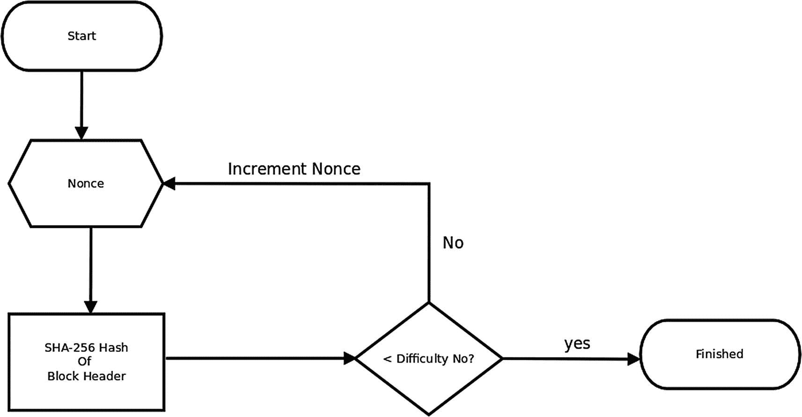

图 13-1

挖掘区块

当矿工正在挖掘其候选区块时，其他矿工也在挖掘区块。其他矿工挖掘的区块不一定要包含与我们矿工候选区块相同的交易。事实上，一些矿工的本地区块链可能与其他矿工的区块链不同。

如果矿工成功挖掘出一个候选区块，它会将该新区块添加到自己的本地区块链中，然后在加密货币网络上广播这个已挖掘的区块。这是邀请其他节点将此区块纳入其本地区块链。

接收到新挖掘区块的节点会运行一系列测试来验证该区块。这些测试包括：

1.  已使用正确的难度数值。
2.  该区块的计算哈希值小于区块头中 `nonce` 对应的难度值。
3.  新区块的区块高度有效。
4.  区块交易的默克尔根与区块头中的默克尔根匹配。
5.  区块中没有交易被锁定。
6.  区块中的交易有效。
7.  如果某交易转移了 coinbase 值，则自包含该 coinbase 交易的区块之后，区块链上必须已添加了所需的最小区块数量。
8.  存在匹配的 `prevblockhash`，如下文所述。

如果被挖掘的节点通过这组验证测试，该节点即可将此区块添加到其区块链中。

### 区块高度验证

接收新区块的节点会检查区块中 `height` 键的值：

1.  如果 `height` 为负数或零，则拒绝该区块。
2.  如果 `height` 值小于节点区块链的高度，则拒绝该区块。
3.  如果区块高度等于节点区块链高度加 2，则将该区块放入孤块列表。
4.  如果区块高度大于节点区块链高度加 2，则将该区块放入孤块列表。节点的区块链可能已过时。节点会向其他节点请求最新区块，以便在必要时更新其区块链。

### 前序区块验证

已完成新区块接收和验证的节点现在可以添加该新区块。以下算法列出了将区块添加到区块链的步骤。

#### 定义

设 `previousblockhash` 为已挖掘区块中 `prevblockhash` 键的值。

设 `block_name[latest]` 为名为 "`block_name`" 的区块链上的最新区块。

设 `block_name[latest-1]` 为名为 "`block_name`" 的区块链上的次新区块。

设 `hash(block_name[x])` 为名为 `block_name` 的区块头的 SHA-256 哈希值，其中 `x` 为 `latest` 或 `latest-1`。

如果节点有一个区块链，则将其命名为 `primary_blockchain`。

如果节点有两个区块链，则将一个命名为 `primary_blockchain`，另一个命名为 `secondary_blockchain`。

#### 算法

1.  如果节点有一个区块链，并且：
```
previousblockhash == hash(primary_blockchain[latest])
```
则将挖掘出的区块追加到 `primary_blockchain`。

2.  否则如果节点有一个区块链，并且：
    ```
    previousblockhash == hash(primary_blockchain[latest -1])
    ```
    那么：
    1.  通过移除 `primary_blockchain` 的最新元素，创建一个名为 `secondary_blockchain` 的新区块链。
    2.  将挖掘出的区块追加到 `secondary_blockchain`。

3.  如果节点有两个区块链，则：
    ```
    if previousblockhash == primary_blockchain[latest]
    then add the mined block to primary_blockchain
    else if previousblockhash == secondary_blockchain[latest]
    then add the mined block to secondary_blockchain
    ```

4.  如果上述情况均不成立，则节点将该区块放入孤块列表。

请注意，在第二种情况下，节点拥有两条相互竞争成为主链的区块链。

如果接收到新挖掘区块的节点是一个矿工，它将检查该挖掘区块中的任何交易是否也存在于它一直在挖掘的区块中。如果是这种情况，矿工将丢弃它一直在挖掘的区块，并将该区块中的交易返回给内存池。如果不是这种情况，它可以继续挖掘其候选区块。接下来，矿工通过移除内存池中也存在于已接收挖掘区块中的任何交易来更新其内存缓存。

最后，节点在加密货币网络上广播其接收到的新区块，以便其他节点能够验证该区块并将其添加到它们的本地区块链中。

### 工作量证明

挖掘区块是一项计算密集型任务。当一个区块被挖掘出来时，区块中包含的 `nonce` 和难度值使得其他矿工能够验证该矿工确实挖掘出了这个区块。这种验证称为工作量证明。未通过此工作量证明的区块将不会被其他矿工用来扩展其本地区块链。


## 难度值

难度值并非固定不变的数字，它会随时间动态调整。例如在比特币中，约束条件是大约每十分钟应挖出一个区块。难度值的目的是确保区块平均能在该时间周期内被挖出。在比特币生态系统中，难度值每两周调整一次，以保证区块大约每十分钟被挖出一个。Helium 遵循了这一模式。

在 Helium 中，当挖出固定数量的区块后，挖矿节点会检查区块被挖出的频率。如果频率过高，难度值会向下调整；如果区块产出过慢，难度值则会增加。每个节点都会自行调整其难度值。当挖矿节点收到一个已挖出的区块时，它会检查该区块是否使用了正确的难度值。

在 Helium 中，平均每十分钟应挖出一个新区块。Helium 的难度值通过以下算法每 1000 个区块校准一次^(⁵⁷)：

``` 
time_initial    = 1000 个区块之前的区块时间戳
time_now        = 最新区块的时间戳
elapsed_seconds = time_now - time_old
blocks_expected_to_be_mined = elapsed_seconds / 600
实际挖出的区块数 = 1000
差异值 = 1000 - blocks_expected_to_be_mined
新难度值 = 旧难度值 - 旧难度值 * \
(20/100)*(差异值/(1000 + blocks_expected_to_be_mined))
```

分数 `20/1000` 将新难度值的变动限制在其先前值的 20% 以内。

## 算力计算

挖矿需要计算当前区块头值的 SHA-256 哈希值。根据矿工可用的硬件设备，该矿工每秒能执行固定次数的哈希运算。加密货币网络的总算力是指网络中所有矿工根据其硬件配置，每秒能执行的总哈希次数。因此，矿工挖出区块的概率为：

```
概率 _ 区块 = (矿工的算力) / (网络总算力)
```

矿工挖出一个区块所需的平均时间（`矿工平均时间`）计算如下：

```
设 区块时间 = 网络挖出一个区块的平均时间
则：
矿工平均时间 = 区块时间 / 概率 _ 区块
```

对于比特币网络，挖出一个区块的平均时间为 600 秒，因此：

```
矿工平均时间 = 600 / 概率 _ 区块
```

## 分布式共识算法

现在我们准备讨论加密货币网络中的节点如何就网络上的主导区块链达成共识。

加密货币网络中的每个全节点都维护着自己的区块链^(⁵⁸)。此外，这样的节点并不知道其他全节点的区块链是什么样子。可以想象，这些本地区块链之间可能存在差异。分布式共识算法决定了当加密货币网络中不同节点拥有彼此不同的区块链时，区块将如何被添加到这些本地区块链中。该算法实现了一种分布式共识，它能使各节点收敛到同一条区块链上，且无需任何节点信任其他节点。这个分布式共识算法构成了中本聪实现比特币时最重要的创新。

准确地说，我们讨论的这种分布式共识算法被称为工作量证明分布式共识算法，以区别于权益证明分布式共识算法。

在我们开始研究这种分布式共识算法之前，请注意系统中没有时钟或计时器，也没有基于时间或其他因素对交易进行排序的概念。节点在收到区块时就进行处理，而这些区块到达的顺序可能并非其被产生的顺序。节点可能因各种原因（包括网络临时分区）而未接收到某个区块。

挖矿是一项成本高昂的工作，需要消耗 CPU 周期（电力）来解决一个困难的数学问题。矿工只有在能够通过足够的挖矿奖励和交易费用获得补偿时，才愿意承担挖矿成本。正是这种对利润的激励机制促使矿工们收敛到对区块链相同的视图上。正如我们将看到的，这种激励迫使节点保持诚实并遵循区块链共识算法。

考虑一个加密货币网络，其中所有节点最初对区块链拥有相同的视图。

在图 13-2 中，每个圆圈代表加密货币网络中的一个节点。每个节点中的矩形代表该节点本地区块链的头部。由于所有这些形状都相同，我们将其理解为每个节点都拥有相同的区块链。


图 13-2
加密货币网络中的节点

现在，节点 X 成功挖出了一个区块，并将其添加到本地区块链的头部。X 随后广播该区块，其相邻节点将该新区块追加到各自本地区块链的头部。那些已将新区块追加到其区块链的节点用带有星号的圆圈表示。网络中部分节点尚未收到该新区块，或出于某种原因尚未将其追加到本地区块链上。这些节点的形状保持不变（图 13-3）。


图 13-3
节点 X 挖出一个区块

在此时刻，由于一些节点尚未将新区块追加到其区块链上，因此存在两种区块链视图。这些节点实际上落后了一个区块。

在 X 挖出区块后很短的时间内，节点 Y 挖出了一个区块，并将其添加到自己的区块链后，在网络中广播该新区块。许多节点收到这个区块并将其追加到自己的区块链上（图 13-4）。那些已将 Y 挖出的区块追加到其区块链的节点被描绘为圆圈内带有倾斜矩形的节点。

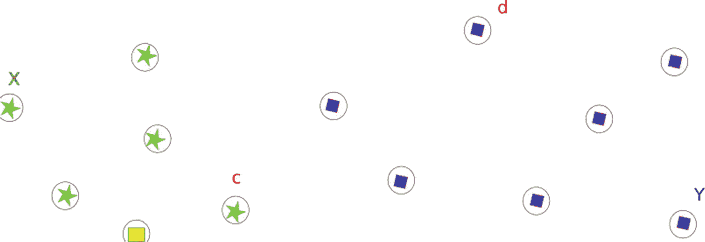

图 13-4
节点 Y 挖出一个区块


**图 13-4** 节点 Y 挖出一个区块

现在，节点 Y 挖出的区块到达节点 C。节点 C 发现无法将该区块添加到其区块链版本的顶端，因为前一个区块的哈希值不匹配。节点 C 还观察到，如果区块链顶端区块的前一个区块实际上位于区块链顶端，那么这个新区块就可以被添加。因此，节点 C 通过移除区块链顶端的节点，并将新区块添加到这条次级区块链上，从而创建了一条次级区块链。此时，节点 C 拥有一条主区块链和一条次级区块链，这两条区块链的顶端是不同的。

所有带有星标的节点都遵循相同的逻辑，在节点 Y 的区块到达它们时，创建主区块链和次级区块链。

类似地，当节点 X 挖出的区块到达带有直角矩形的节点时，这些节点会接受传入的区块，但必须创建主区块链和次级区块链。

现在，节点 X 和节点 Y 挖出的两个区块都到达了带有矩形的节点，该节点也同样创建了一条主区块链和一条次级区块链。

接下来，节点 d 成功挖出一个区块，并将其广播到网络上。这一次，网络上的其他挖矿节点无法足够快地挖出新区块，因此节点 d 挖出的区块到达了网络上的所有节点（图 13-5）。其中一些节点可以将该区块添加到它们的主区块链上（这些是首先收到节点 Y 所挖区块的节点）。这些节点将该区块添加到它们的主区块链上。如果较短的区块链比长区块链短两个或更多区块，则较短的那条会被清除。

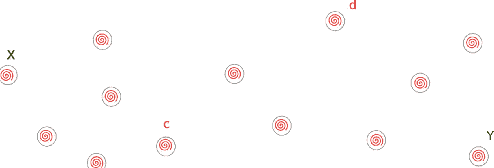

**图 13-5** 节点 d 挖出一个区块

类似地，那些首先收到节点 X 所挖区块的节点，可以将这个新区块添加到它们的次级区块链上。这些节点将该区块添加到它们的次级区块链上，然后删除它们的主区块链，并将次级区块链指定为新的主区块链。请注意，再次出现了较短的区块链被删除的情况。

在此阶段，网络上的所有节点已经收敛到对区块链相同的视图。上述过程描述了中本聪为比特币首次实现的分布式共识算法。所有矿工之所以会遵循最长的区块链，是因为如果他们不这样做，大多数矿工都会将区块添加到最长的区块链上，而持不同意见的矿工会发现，尽管他们可以挖出区块，但却无法说服其他矿工将这些区块添加到较短的区块链上，因此他们将无法获得挖矿奖励和交易手续费。

由于最长的区块链上投入了最多的算力，节点认为这条区块链是正确的，并会致力于延长它。

正如我们刚刚看到的，当两条分叉的区块链（主区块链和次级区块链）重新收敛时，其中一条会被删除。那么被删除的区块链中的交易会发生什么？假设由于次级区块链比主区块链多一个区块，主区块链被删除。由于次级区块链是在排除主区块链上最新区块的情况下从主区块链创建的，我们只需要考虑这个特定区块中的交易。我们只需将这些交易中那些也不在次级区块链最新区块中的交易，放回交易内存池中。

### 恶意节点

我们可以注意到恶意节点的三个方面。恶意节点无法创建窃取他人加密货币的交易，因为它需要该个体的私钥才能对恶意交易进行数字签名。

其次，恶意挖矿节点可能决定不处理某笔交易。但这是一个无用的行为，因为收到该交易的其他挖矿节点会将其包含在自己的候选区块中。

最后，一群串通作恶的恶意节点无法将其共同的区块链强加为网络上的主导区块链，除非它们控制了至少 51%的总算力。原因在于，如果这些节点拥有至少 51%的总算力，那么下一个区块由它们产出并添加到它们自己区块链版本上的概率至少为 51%。因此，由于它们控制了大多数算力，它们将能够延长自己的区块链版本，并将其强加为网络上的主区块链。

### 交易确认

当一个区块被挖出并添加到区块链上时，我们说该区块中的交易获得了一次确认。当另一个区块被添加时，前一个区块中的交易就获得了两次确认。随着添加到区块链上的区块数量不断增加，确认次数也在增加。在比特币中，获得六次确认的交易被认为是不可逆的，因为网络要撤销一个位于六个区块深度之下的区块中的交易，所需的算力成本是极其高昂的。恶意节点必须控制网络的大多数算力才能撤销这些区块，并构建出一条替代的最长区块链。

### 双重支付问题

考虑以下场景。爱丽丝有一个氦币，她将其发送给史密斯。爱丽丝在网络上传播这笔交易，一名矿工开始挖一个包含该交易的区块。现在爱丽丝去了别处，再次花费了相同的氦币。由于还没有矿工挖出包含爱丽丝第一笔交易的区块，第二笔交易也在网络上传播，一些矿工将其添加到自己的候选区块中，并开始挖掘这些区块。这就是双重支付问题。爱丽丝显然两次花费了她的氦币。

第一个矿工成功挖出它的区块，并在网络上广播该区块。该区块包含爱丽丝的第一笔交易。极短时间后，第二个矿工也成功挖出一个区块，并在网络上传播该区块。该区块包含爱丽丝的第二笔交易。

考虑一个收到其中一个区块的节点。该节点会根据收到的区块延长自己的区块链，并更新其`Chainstate`数据库。如果不久后它收到了第二个区块，它会拒绝这个区块，因为对`Chainstate`数据库的查询会显示爱丽丝没有该交易所需要的金额。由于对`Chainstate`的检查，一个节点只会拥有包含爱丽丝交易的两个区块中的一个。即使节点已经分叉出一条主区块链和一条次级区块链，这一点也同样成立。

这个例子说明了为什么交易确认很重要。对于小额交易，两次确认就足够了（在比特币网络上平均 20 分钟）。对于大额交易，至少需要获得六次确认（在比特币网络上大约一小时）。


  
## 结论  

本章我们探讨了加密货币挖矿过程的工作原理。在类似比特币的分布式加密货币中，挖矿扮演着至关重要的角色。挖矿节点验证交易并将区块添加到本地区块链中。这些节点无需依赖信任、中央时钟或超级节点协调器，即可就主链或占主导地位的区块链达成分布式共识。我们研究了网络中区块链如何通过应用分布式共识算法收敛到单一视图的区块链。最后，我们分析了分布式加密货币如何解决“双重支付”问题。  

下一章，我们将为 Helium 挖矿节点编写程序代码。  

# 14. Helium 挖矿  

上一章我们详细探讨了加密货币的挖矿过程。在模仿比特币构建的分布式加密货币中，挖矿是一个关键环节。回顾一下，挖矿会产生三个结果：  

1. 将新区块附加到区块链上  
2. 就区块链的内容达成分布式共识，进而对网络中的交易达成分布式共识  
3. 创建新的加密货币单位并分配给矿工  

本章我们将以理论概念为基础，通过实现挖矿节点来解决一个复杂的数学问题，从而达成分布式共识。解决这个问题被称为工作量证明，它使挖矿节点能够将区块附加到区块链上，并获得丰厚的挖矿奖励和交易费用。挖矿是一项计算密集型任务，因此会消耗大量电力。节点之间相互竞争以获取挖矿的经济利益。实现利润最大化的唯一途径就是尽可能多地挖掘区块，并将其附加到最长的区块链上。更长的区块链意味着在其上投入了更多的计算工作量。矿工不会尝试将新挖出的区块附加到较短的次级区块链上，因为这条区块链最终会被其他矿工删除。  

本章我们将为 Helium 挖矿节点编写 Python 程序代码。像往常一样，我们将使用`pytest`单元测试来强化这段代码。闲话少叙，让我们开始这项任务。  

## 分布式共识算法详解  

在第 13 章中，我们描述了区块在 Helium 网络中的处理流程，以及网络如何就区块链达成分布式共识。现在，我们将提供矿工节点用于处理交易和区块并达成分布式共识的精确算法：  

| **处理传入交易**                                                                                                                                                                                                                                                                                                                                                             |
|--------------------------------------------------------------------------------------------------------------------------------------------------------------------------------------------------------------------------------------------------------------------------------------------------------------------------------------------------------------------------------|
| 交易到达矿工接口。存在两种情况：                                                                                                                                                                                                                                                                                                                                             |
| **情况 A：** | 如果交易有效，则将其添加到`mempool`中。具体而言，由于交易有效，它不会花费`Chainstate`数据库中已被花费的交易片段。                                                                                                                                                                                      |
|              | **将交易添加到候选区块**                                                                                                                                                                                                                                                                                                                                                  |
|              | 当交易被添加到候选区块时，我们会维护一个临时列表，记录这些交易将要花费的先前交易片段。如果被选入候选区块的交易试图花费该列表中的某个片段，则该交易将被拒绝纳入区块，并且也会从`mempool`中删除。                                                |
| **情况 B：** | 交易无效。例如，矿工检查`Chainstate`数据库后发现，该交易引用的一个或多个先前交易片段已被花费。该交易被拒绝。                                                                                                                                                             |
| **处理传入区块**                                                                                                                                                                                                                                                                                                                                                                  |
| 区块到达矿工节点接口：                                                                                                                                                                                                                                                                                                                                                   |
| 获取传入区块的区块高度。然后存在五种可能的情况：                                                                                                                                                                                                                                                                                                               |
| **情况 A：** | 区块高度小于当前区块链的高度。                                                                                                                                                                                                                                                                                                                                   | 拒绝该区块；该区块已过时。此高度上的区块已被挖出。 |
| **情况 B：** | 区块高度大于当前区块链高度 + 1。                                                                                                                                                                                                                                                                                                                            | 将该区块放入`orphan_blocks`列表中。待我们的区块链高度增加后，再处理此区块。 |
| **情况 C：** | 区块高度等于当前区块链高度 + 1。                                                                                                                                                                                                                                                                                                                                | 根据`prevblockhash`属性的值（参见以下注释），我们可以将此区块添加到主区块链或次级区块链（如果存在）。 |
| **情况 D：** | 区块高度等于当前区块链高度。                                                                                                                                                                                                                                                                                                                                        | 如果新区块的`prevblock`哈希值与主链顶端区块的父区块的区块头哈希匹配，则分叉区块链。否则，拒绝该区块（参见以下注释）。 |
| **情况 E：** | 收到一个高度大于当前区块链高度 + 1 的区块。                                                                                                                                                                                                                                                                                                                              | 如果矿工已收到一定数量的此类区块，则触发更新我们区块链的调用。我们的区块链可能落后于其他矿工的区块链。 |
| **注释：** | 假设我们区块链顶端的一个区块包含一笔花费了某个交易片段的交易，而传入区块也包含一笔花费了同一交易片段的交易，那么除非挖掘传入区块的矿工存在*恶意*行为，否则新区块的`prevblockhash`值不可能指向我们主区块链的顶端。新区块必须要么位于次级区块链之上（如果存在），要么其`prevblockhash`匹配我们区块链顶端区块的父区块的哈希。在后一种情况下，我们将产生主区块链的一个分叉。但无论哪种情况，一条区块链上都不可能存在两笔双重支付交易。一笔交易将存在于主区块链上，另一笔将存在于次级区块链上。这解决了双重支付问题。进一步假设，我们有一条主区块链和一条次级区块链，收到一个区块其`prevblockhash`值与其中一条链上顶端区块的父区块的哈希匹配。该区块将被拒绝，因为它实际上匹配的是分叉前区块链顶端区块的祖父区块的哈希（练习：请借助一些图表来深入理解这一点）。 |


## 氦气挖矿代码详解

在挖矿子目录中创建一个名为 `hmining.py` 的文件，并将以下 Python 代码复制到该文件中。我们对 `hmining` 模块中数据结构和函数的详解紧接在程序代码之后。

```python
"""
hmining.py: 本模块中的代码实现了一个氦气挖矿节点。
该节点构建包含交易候选区块，然后对这些区块进行挖矿。
"""
import blk_index
import hconfig
import hblockchain as bchain
import hchaindb
import networknode
import rcrypt
import tx
import asyncio
import json
import math
import sys
import time
import threading
import pdb
import logging
"""
将调试消息记录到文件 debug.log 中
"""
logging.basicConfig(filename="debug.log",filemode="w",  \
format='%(asctime)s:%(levelname)s:%(message)s',
level=logging.DEBUG)
"""
氦气网络上节点的地址列表
"""
address_list = []
"""
指定一个列表容器来存放矿工接收到的交易。
"""
mempool       = []
"""
此挖矿节点接收到的、由其他矿工挖出的区块，
这些区块旨在被追加到此矿工的区块链上。
"""
received_blocks = []
"""
已接收但无法添加到区块链头部或头部区块的父区块的区块。
"""
orphan_blocks = []
"""
某个已挖出区块中包含的交易列表，这些交易将被从内存缓存中移除。
"""
remove_list = []
semaphore = threading.Semaphore()
def mining_reward(block_height:"integer") -> "non-negative integer":
"""
mining_reward 函数确定挖矿奖励。
当矿工成功挖出一个区块时，他有权获得一定数量的氦气币作为奖励。
奖励取决于目前已挖出的区块数量。
初始奖励为 hconfig.conf["MINING_REWARD"] 个氦气币。
该奖励每经过 hconfig.conf["REWARD_INTERVAL"] 个区块减半。
"""
try:
### 创世区块没有奖励
sz = block_height
sz = sz // hconfig.conf["REWARD_INTERVAL"]
if sz == 0:  return hconfig.conf["MINING_REWARD"]
### 确定挖矿奖励
reward = hconfig.conf["MINING_REWARD"]
for __ctr in range(0,sz):
reward = reward/2
#### 截断为整数
reward = int(round(reward))
#### 挖矿奖励不能低于最小面额的货币单位
if reward  "bool":
"""
接收通过 P2P 加密货币网络传播的交易。
此函数在线程中执行。
"""
### 在以下情况下不添加交易：
#### 交易已存在于交易池中
#### 交易存在于链状态中
#### 交易无效
try:
### 如果交易在交易池中，则返回
for trans in mempool:
if trans == transaction: return False
### 如果交易已被记录在链状态数据库中，则不添加
tx_fragment_id = transaction["transactionid"] + "_" + "0"
if hchaindb.get_transaction(tx_fragment_id) != False:
return True
### 验证传入的交易是否有效
if len(transaction["vin"]) >  0: zero_inputs = False
else: zero_inputs = True
if tx.validate_transaction(transaction, zero_inputs) == False:
raise(ValueError("收到的交易无效"))
### 将交易添加到交易池
mempool.append(transaction)
### 将交易放置在 P2P 网络上以进一步传播
propagate_transaction(transaction)
except Exception as err:
logging.debug('receive_transaction: exception: ' + str(err))
return False
return True
def make_candidate_block() -> "dictionary || bool":
"""
制作一个候选区块以包含在氦气区块链中。
创建候选区块的步骤如下：
(i)  从交易池中获取交易并将其添加到候选区块的交易列表中。
(ii) 指定区块头。
返回候选区块，如果发生错误或交易池为空，则返回 False。
在 Python 线程中执行
"""
try:
### 如果交易池为空，则无法将任何交易放入候选区块
if len(mempool) == 0: return False
### 生成矿工用于接收挖矿奖励和交易费用的公私钥对
key_pair = make_miner_keys()
block = {}
### 创建不完整的候选区块头
block['version']   = hconfig.conf["VERSION_NO"]
block['timestamp'] = int(time.time())
block['difficulty_bits']    = hconfig.conf["DIFFICULTY_BITS"]
block['nonce']     = hconfig.conf["NONCE"]
if len(bchain.blockchain) > 0:
block['height'] = bchain.blockchain[-1]["height"] + 1
else:
block['height'] = 0
block['merkle_root'] = ""
#### 获取前一个区块头的哈希值
#### 这可以保证区块链的防篡改性
if len(bchain.blockchain) > 0:
block['prevblockhash'] = bchain.blockheader_hash(bchain.blockchain[-1])
else:
block['prevblockhash'] = ""
#### 计算候选区块头的大小（以字节为单位）
#### 数字 64 是 SHA-256 十六进制默克尔根的字节大小
#### 默克尔根是在所有交易都包含在候选区块后计算的
#### 为 coinbase 交易预留 1000 字节
block_size =  sys.getsizeof(block['version'])
block_size += sys.getsizeof(block['timestamp'])
block_size += sys.getsizeof(block['difficulty_bits'])
block_size += sys.getsizeof(block['nonce'])
block_size += sys.getsizeof(block['height'])
block_size += sys.getsizeof(block['prevblockhash'])
block_size += 64
block_size += sys.getsizeof(block['timestamp'])
block_size += 1000
### 区块中的交易列表
block['tx'] = []
### 获取当前 Unix 时间
now = int(time.time())
### 从交易池向候选区块添加交易，
#### 直到交易池中的交易耗尽或区块达到其最大允许大小
for memtx in mempool:
### 不处理未来的交易
if memtx['locktime'] > now: continue
memtx = add_transaction_fee(memtx, key_pair[1])
### 将交易添加到候选区块
block_size += sys.getsizeof(memtx)
if block_size  'dictionary':
"""
将交易的交易费用定向给矿工。
接收一个交易和矿工的公钥。
修改并返回交易，使其消耗交易费用。
"""
try:
### 获取之前的交易片段
prev_fragments = []
for vin in trx["vin"]:
fragment_id = vin["txid"] + "_" + str(vin["vout_index"])
prev_fragments.append(hchaindb.get_transaction(fragment_id))
### 计算交易费用
fee = tx.transaction_fee(trx, prev_fragments)
if fee > 0:
vout = {}
vout["value"] = fee
ScriptPubKey = []
ScriptPubKey.append('SIG')
ScriptPubKey.append(rcrypt.make_RIPEMD160_hash(rcrypt.make_SHA256_hash(pubkey)))
ScriptPubKey.append('')
ScriptPubKey.append('')
ScriptPubKey.append('HASH-160')
ScriptPubKey.append('')
ScriptPubKey.append('')
vout["ScriptPubKey"] = ScriptPubKey
trx["vout"].append(vout)
except Exception as err:
logging.debug('add_transaction_fee: exception: ' + str(err))
return False
return trx
def make_coinbase_transaction(block_height: "integer", pubkey: "string") -> 'dict':
"""
制作一个 coinbase 交易，这是矿工挖矿的奖励。
接收一个公钥来表示奖励的所有权。
由于这是新发行的氦气币，因此没有 vin 元素。
将该交易锁定 hconfig["COINBASE_INTERVAL"] 个区块。
返回 coinbase 交易。
"""
try:
### 计算挖矿奖励
reward = mining_reward(block_height)
### 创建一个 coinbase 交易
trx = {}
trx['transactionid'] = rcrypt.make_uuid()
trx['version']  = hconfig.conf["VERSION_NO"]
#### 挖掘大约 100 个区块后才可以领取挖矿奖励
#### 将其转换为时间间隔
trx['locktime'] = hconfig.conf["COINBASE_INTERVAL"]*600
trx['vin']  = []
trx['vout'] = []
ScriptPubKey = []
ScriptPubKey.append('SIG')
ScriptPubKey.append(rcrypt.make_RIPEMD160_hash(rcrypt.make_SHA256_hash(pubkey)))
ScriptPubKey.append('')
ScriptPubKey.append('')
ScriptPubKey.append('HASH-160')
ScriptPubKey.append('')
ScriptPubKey.append('')
#### 创建包含奖励的 vout 元素
trx['vout'].append({
'value':  reward,
'ScriptPubKey': ScriptPubKey
})
except Exception as err:
logging.debug('make_coinbase_transaction: exception: ' + str(err))
return trx
def remove_mempool_transactions(block: 'dictionary') -> "bool":
"""
从交易池中移除候选区块中的交易
"""
try:
for transaction in block["tx"]:
if transaction in mempool:
mempool.remove(transaction)
except Exception as err:
logging.debug('remove_mempool_transactions: exception: ' + str(err))
return False
return True
def mine_block(candidate_block: 'dictionary') -> "bool":
"""
挖矿一个候选区块。
如果区块被挖出，则返回解出的 nonce 作为十六进制字符串，否则返回 False。
在 Python 线程中执行
"""
try:
final_nonce = None
save_block = dict(candidate_block)
### 循环直到区块被挖出
while True:
#### 计算候选区块头的 SHA-256 哈希值
hash = bchain.blockheader_hash(candidate_block)
#### 将 SHA-256 哈希字符串转换为 Python 整数
mined_value = int(hash, 16)
mined_value = 1/mined_value
#### 测试以确定区块是否已被挖出
if mined_value  0:
if compare_transaction_lists(candidate_block) == False:
return False
#### 挖矿失败，因此递增 nonce 并重试
candidate_block['nonce'] += 1
logging.debug('mining.py: block has been mined')
### 将区块添加到 received_blocks 列表并处理列表
received_blocks.append(save_block)
ret = process_received_blocks()
if ret == False:
raise(ValueError("无法将挖出的区块添加到区块链"))
except Exception as err:
logging.debug('mine_block: exception: ' + str(err))
return False
return hex(final_nonce)
def proof_of_work(block):
"""
证明收到的区块是否确实被挖出。
返回 True 或 False
"""
try:
if block['difficulty_bits'] != hconfig.conf["DIFFICULTY_BITS"]:
raise(ValueError("使用了错误的工作量证明难度位"))
#### 计算候选区块头的 SHA-256 哈希值
hash = bchain.blockheader_hash(block)
#### 将 SHA-256 哈希字符串转换为 Python 整数（基数为 10）
mined_value = int(hash, 16)
mined_value = 1/mined_value
#### 测试以确定区块是否已被挖出
if mined_value  (区块链高度 + 1)
(4)  工作量证明失败
(5)  区块未包含至少两笔交易
(6)  区块的第一笔交易不是 coinbase 交易
(7)  区块中的交易无效
(8)  区块已存在于区块链中
(9)  区块已存在于 received_blocks 列表中
否则 (i)  将区块添加到 received_blocks 列表
(ii) 传播该区块
在 Python 线程中执行
"""
try:
### 测试区块是否已存在于 received_blocks 列表中
with semaphore:
for blk in received_blocks:
if blk == block: return False
### 验证工作量证明
if proof_of_work(block) == False:
raise(ValueError("区块工作量证明失败"))
### 将 Nonce 恢复为其初始值
block["nonce"] = hconfig.conf["NONCE"]
### 验证区块和区块交易
if bchain.validate_block(block) == False: return False
for trx in block["tx"]:
if block["height"] == 0 or block["tx"][0] == trx: flag = True
else: flag = False
if tx.validate_transaction(trx, flag) == False: return False
if len(bchain.blockchain) > 0:
### 不要将过时的区块添加到区块链
if block["height"]  bchain.blockchain[-1]["height"] + 1:
raise(ValueError("区块高度超出未来范围"))
### 测试区块是否在主区块链或辅助区块链中
if len(bchain.blockchain) > 0:
if block == bchain.blockchain[-1]: return False
if len(bchain.blockchain) > 1:
if block == bchain.blockchain[-2]: return False
if len(bchain.secondary_blockchain) > 0:
if block == bchain.secondary_blockchain[-1]: return False
if len(bchain.secondary_blockchain) > 1:
if block == bchain.secondary_blockchain[-2]: return False
### 将区块添加到 blocks_received 列表
with semaphore:
received_blocks.append(block)
process_received_blocks()
except Exception as err:
logging.debug('receive_block: exception: ' + str(err))
return False
return True
def process_received_blocks() -> 'bool':
"""
处理 received_blocks 列表中已挖出的区块，
并尝试将这些区块添加到区块链中。
算法：
(1)  从 received_blocks 列表中获取一个区块。
(2)  如果区块链为空且该区块的 prevblockhash 字段为空，则将该区块添加到区块链。
(3)  计算区块链上最后一个区块的区块头哈希值。
如果 blkhash == block["prevblockhash"]，则将该区块添加到区块链。
(4)  如果区块链至少有两个区块，则：
令 blk_hash 为区块链的倒数第二个区块的哈希值，
如果：block["prevblockhash"] == blk_hash
创建一个由区块链除最后一个区块外的所有区块组成的辅助区块链。将该区块追加到辅助区块链。
(5)  否则将区块移动到孤块列表。
(6)  如果收到的区块被附加到区块链上，则对于孤块列表中的每个区块，
尝试将孤块附加到主区块链或辅助区块链（如果存在）。
(7)  如果收到的区块被附加到区块链上且辅助区块链中有元素，
则如果辅助区块链的长度更大，则交换区块链和辅助区块链。
(8)  如果收到的区块被附加且辅助区块链中有元素，
则如果辅助区块链的长度比主区块链落后超过两个区块，则清空辅助区块链。
注意：在 Python 线程中运行
"""
while True:
### 处理 received_blocks 列表中的所有区块
add_flag = False
#### 获取一个收到的区块
with semaphore:
if len(received_blocks) > 0:
block = received_blocks.pop()
else:
return True
#### 尝试将区块添加到主区块链
if bchain.add_block(block) == True:
logging.debug('receive_mined_block: 区块已添加到主区块链')
add_flag = True
#### 测试主区块链是否必须分叉
#### 如果前一个区块哈希等于区块链头部区块的父区块的哈希值，
##### 则将该区块添加为父区块的子区块并创建一个辅助区块链。这构成主区块链的分叉
elif len(bchain.blockchain) >= 2 and  block['prevblockhash'] == \
bchain.blockheader_hash(bchain.blockchain[-2]):
logging.debug('receive_mined_block: 区块链正在分叉')
ret = fork_blockchain(block)
if ret == True: add_flag = True
#### 尝试将区块添加到辅助区块链
elif len(bchain.secondary_blockchain) > 0 and block['prevblockhash'] == \
bchain.blockheader_hash(bchain.secondary_blockchain[-1]):
if append_secondary_blockchain(block) == True: add_flag = True
#### 无法将区块附加到区块链，添加到孤块列表
else:
if add_flag == False: orphan_blocks.append(block)
if add_flag == True:
if block["height"] % hconfig.conf["RETARGET_INTERVAL"] == 0:
retarget_difficulty_number(block)
handle_orphans()
swap_blockchains()
propagate_mined_block(block)
#### 移除该区块中同样存在于交易池中的任何交易
remove_mempool_transactions(block)
return True
def fork_blockchain(block: 'list') -> 'bool':
"""
分叉主区块链并从主区块链创建辅助区块链，
然后将收到的区块添加到辅助区块链
"""
try:
bchain.secondary_blockchain = list(bchain.blockchain[0:-1])
if append_secondary_blockchain(block) == False: return False
#### 如果需要，切换主区块链和辅助区块链
swap_blockchains()
except Exception as err:
logging.debug('fork_blockchain: exception: ' + str(err))
return False
return True
def swap_blockchains() -> 'bool':
"""
比较主区块链和辅助区块链的长度。
最长的区块链被指定为主区块链，另一区块链被指定为辅助区块链。
如果主区块链至少领先辅助区块链两个区块，
则清空辅助区块链。
"""
try:
##### 如果辅助区块链比主区块链长，
###### 则将辅助区块链指定为主区块链，主区块链指定为辅助区块链
if len(bchain.secondary_blockchain) > len(bchain.blockchain):
tmp = list(bchain.blockchain)
bchain.blockchain = list(bchain.secondary_blockchain)
bchain.secondary_blockchain = list(tmp)
##### 如果主区块链至少领先辅助区块链两个区块，
###### 则清空辅助区块链
if len(bchain.blockchain) - len(bchain.secondary_blockchain) > 2:
bchain.secondary_blockchain.clear()
except Exception as err:
logging.debug('swap_blockchains: exception: ' + str(err))
return False
return True
def append_secondary_blockchain(block):
"""
将一个区块追加到辅助区块链
"""
with semaphore:
tmp = list(bchain.blockchain)
bchain.blockchain = list(bchain.secondary_blockchain)
bchain.secondary_blockchain = list(tmp)
ret = bchain.add_block(block)
if ret == True: swap_blockchains()
return ret
def handle_orphans() -> "bool":
"""
尝试将孤块附加到主区块链或辅助区块链的头部。
有时区块接收顺序错乱，无法附加到主区块链或辅助区块链。
这些区块被放在 orphan_blocks 列表中，
随着新区块被添加到主区块链或辅助区块链，
会尝试将孤块添加到区块链。
"""
try:
#### 遍历孤块，尝试将孤块追加到区块链
for block in orphan_blocks:
if bchain.add_block(block) == True:
orphan_blocks.remove(block)
continue
##### 尝试追加到主区块链
if len(bchain.blockchain) > 1 and len(bchain.secondary_blockchain) == 0:
if block['prevblockhash'] == \
bchain.blockheader_hash(bchain.blockchain[-1]):
if block["height"] == bchain.blockchain[-1]["height"] + 1:
if fork_blockchain(block) == True:
orphan_blocks.remove(block)
continue
##### 尝试追加到辅助区块链
if len(bchain.secondary_blockchain) > 0:
if block['prevblockhash']  == \
bchain.blockheader_hash(bchain.secondary_blockchain[-1]):
if block["height"] == bchain.secondary_blockchain[-1]["height"] + 1:
if append_secondary_blockchain(block) == True:
orphan_blocks.remove(block)
continue
orphan_blocks.remove(block)
except Exception as err:
logging.debug('handle_orphans: exception: ' + str(err))
return False
return True
def remove_received_block(block: 'dictionary') -> "bool":
"""
从 received_blocks 列表中移除一个区块
"""
try:
with semaphore:
if block in received_blocks:
received_blocks.remove(block)
except Exception as err:
logging.debug('remove_received_block: exception: ' + str(err))
return False
return True
def retarget_difficulty_number(block):
"""
每 hconfig.conf["RETARGET_INTERVAL"] 个区块重新校准一次难度值
"""
if block["height"] == 0: return
old_diff_no   = hconfig.conf["DIFFICULTY_NUMBER"]
initial_block = bchain.blockchain[(block["height"] - \
hconfig.conf["RETARGET_INTERVAL"])]
time_initial  = initial_block["timestamp"]
time_now      = block["timestamp"]
elapsed_seconds = time_now - time_initial
### 平均每 600 秒挖出一个区块
blocks_expected_to_be_mined = int(elapsed_seconds / 600)
discrepancy = 1000 - blocks_expected_to_be_mined
hconfig.conf["DIFFICULTY_NUMBER"] =  old_diff_no - \
old_diff_no * (20/100)*(discrepancy /(1000 + blocks_expected_to_be_mined))
return
def propagate_transaction(txn: "dictionary"):
"""
传播收到的交易
"""
if len(address_list) % 20 == 0: get_address_list()
cmd = {}
cmd["jsonrpc"] = "2.0"
cmd["method"]  = "receive_transaction"
cmd["params"]  = {"trx":txn}
cmd["id"] = 0
for addr in address_list:
rpc = json.dumps(cmd)
networknode.hclient(addr,rpc)
return
def propagate_mined_block(block):
"""
将区块发送给其他挖矿节点，以便它们可以将此区块添加到其区块链中。
我们定期刷新已知节点地址列表
"""
if len(address_list) % 20 == 0: get_address_list()
cmd = {}
cmd["jsonrpc"] = "2.0"
cmd["method"]  = "receive_block"
cmd["params"]  = {"block":block}
cmd["id"] = 0
for addr in address_list:
rpc = json.dumps(cmd)
networknode.hclient(addr,rpc)
return
def get_address_list():
'''
更新已知的节点地址列表
根据需要修改 IP 地址和端口。
'''
ret = networknode.hclient("http://127.0.0.69:8081",
'{"jsonrpc":"2.0","method":"get_address_list","params":{},"id":1}')
if ret.find("error") != -1: return
retd = json.loads(ret)
for addr in retd["result"]:
if address_list.count(addr) == 0:
address_list.append(addr)
return
def compare_transaction_lists(block):
"""
测试收到的区块中的交易是否也存在于正在挖矿的候选区块中
"""
for tx1 in block["tx"]:
for tx2 in remove_list:
if tx1 == tx2: return False
return True
def start_mining():
"""
组装一个候选区块，然后挖矿这个区块
"""
while True:
candidate_block = make_candidate_block()
if candidate_block() == False:
time.sleep(1)
continue
### 从交易池中移除已挖矿区块中的交易
if mine_block(candidate_block) != False:
remove_mempool_transactions(remove_list)
else: time.sleep(1)
```


## 氦气挖矿数据结构

### mempool

`mempool` 是一个列表，包含已收到但尚未被任何已挖出区块收录的交易。

### received_blocks

这是一个由其他挖矿节点挖出的区块列表，这些区块旨在被纳入接收节点的区块链中。

### orphan_blocks

这是一个来自其他节点、已被验证有效但由于某种原因无法被追加到接收矿工区块链上的区块列表。

### Blockchain

这是由当前挖矿节点维护的本地区块链，位于 `hblockchain` 模块中。此区块链也被称为主区块链。

### Secondary Blockchain

当主区块链发生分叉时，矿工维护的另一条备选区块链。

## 氦气挖矿函数

### mining_reward

成功挖出区块的矿工有权获得奖励，奖励包括新发行的氦气币。挖矿奖励决定了授予矿工的新增货币数量。该奖励会定期减半。初始奖励和减半周期均由 `hconfig` 模块设定。

初始奖励为 `hconfig.conf["MINING_REWARD"]` 个币。该奖励每挖出 `hconfig.conf["REWARD_INTERVAL"]` 个区块减半一次。

### receive_transaction

`receive_transaction` 函数负责接收在氦气 P2P 网络上传播的交易。该函数会检查交易是否已存在于 `mempool` 中。如果交易已在 `mempool` 中，则将其丢弃。

下一步，`receive_transaction` 会验证交易的有效性。如果交易有效，则将其添加到 `mempool` 中；否则丢弃该交易。如果交易被添加到 `mempool`，它将被发送以在氦气网络上进行进一步传播。

`receive_transaction` 应在 Python 线程中运行。^(⁵⁹)

### make_candidate_block

`make_candidate_block` 的目的是创建一个可供挖矿的区块。如果 `mempool` 为空，该函数直接返回。

`make_candidate_block` 会为区块创建一个部分头部，然后从 `mempool` 中抽取交易，并将其追加到该区块的 `tx` 字段中。可以使用任意算法从 `mempool` 中抽取交易。`make_candidate_block` 使用简单的先进先出（FIFO）算法，持续抽取交易，直到接近达到 1 MB 的最大区块大小或 `mempool` 被抽空。对于每笔交易，该函数会插入一个 `vout` 交易片段，将交易费分配给自身。

`make_candidate_block` 完成从 `mempool` 的抽取后，会创建一个 `coinbase` 交易。`coinbase` 交易是 `tx` 列表中的第一笔交易。对于每个区块，该函数会生成一对新的公私钥，用于创建 `coinbase` 交易和交易费片段。

最后，`make_candidate_block` 计算交易的默克尔根，并将其插入区块头部的默克尔字段中。然后，它测试所构建区块的有效性。如果区块有效，它会将区块中的交易从 `mempool` 中移除。此时，候选区块即可准备挖矿。

### make_miner_keys

该函数创建一对公私钥，并将这些密钥保存到一个文本文件中。`make_candidate_block` 使用公钥创建 `RIPEMD160(SHA256(public key))` 哈希，该哈希被插入到 `coinbase` 交易的 `ScriptPubKey` 部分以及每个交易费 `vout` 片段中。

### add_transaction_fee

`add_transaction_fee` 由 `make_candidate_block` 调用。它接收一笔交易和矿工的公钥。该函数计算交易费，更新链状态，并创建一个交易片段，将交易费定向到与公钥对应的私钥持有者。

### make_coinbase_transaction

`make_coinbase_transaction` 由 `make_candidate_block` 调用。它接收候选区块的高度和矿工的公钥。该函数计算区块奖励，然后创建并返回一个 `coinbase` 交易。

### remove_mempool_transactions

该函数从 `mempool` 中移除交易，从而防止同一笔交易在多个不同候选区块中被重复包含。

### mine_block

`mine_block` 接收一个候选区块并开始对该区块进行挖矿。计算区块头部中 nonce 值的 SHA256 哈希值。如果计算出的 SHA-256 哈希值小于氦气 `hconfig` 模块中的难度值，则认为该区块已被挖出。如果该值大于或等于难度值，则 nonce 递增，并再次将计算结果与难度值进行比较。此过程持续进行，直到区块被挖出或计算循环被退出。

一旦区块被挖出，它将被附加到矿工的区块链上，然后在氦气 P2P 网络上传播，以便其他矿工将其追加到自己的区块链上。

### proof_of_work

在将从其他矿工处收到的区块纳入本地区块链之前，节点必须验证区块及其交易的完整性，并验证区块头部提供的 nonce 值是否小于本节点 `hconfig` 文件中的难度值。该函数为收到的区块实现工作量证明。

### receive_block

`receive_block` 接收由其他矿工挖出的区块。如果区块有效，挖矿节点会将该区块添加到其 `received_blocks` 列表中。出现以下任一条件则区块无效：

1.  区块无效。
2.  区块高度小于（区块链高度 - 2）。
3.  工作量证明失败。
4.  区块未包含至少两笔交易。
5.  区块的第一笔交易不是 coinbase 交易。
6.  区块中的交易无效。
7.  区块已在区块链中。
8.  区块已在 `received_blocks` 列表中。

如果接收的区块有效，它将被添加到 `received_blocks` 列表中，并在氦气 P2P 网络上传播，以便其他节点将其附加到自己的区块链上。

`receive_block` 应作为 Python 线程执行。


#### `process_received_blocks`

`process_received_blocks` 从 `received_blocks` 列表中取出区块，并尝试将其附加到区块链上。此函数实现了分布式共识。请注意，由于矿工受利益驱动，他们总会延长自己最长的区块链。处理接收区块的算法如下：

1. 从 `received_blocks` 列表中获取一个区块。
2. 如果区块链为空，且该区块的 `prevblockhash` 字段为空，则将此区块添加到区块链中（这是一个创世区块）。
3. 计算区块链上最后一个区块的区块头哈希值（`blkhash`）：

```
if blkhash == block["prevblockhash"]
```

然后将该区块添加到区块链中。

4. 如果区块链至少有两个区块，令 `blk_hash` 为区块链中倒数第二个区块的区块头哈希值，然后如果

```
block["prevblockhash"] == blk_hash
```

则创建一个由区块链中除最新区块外的所有区块组成的二级区块链。将该区块附加到此二级区块链上。

5. 否则，将该区块移动到 `orphan_blocks` 列表。
6. 如果接收到的区块已附加到某个区块链，则对于 `orphan_blocks` 列表中的每个区块，尝试将该孤立区块附加到主区块链或二级区块链（如果存在）。
7. 如果接收到的区块已附加到某个区块链，且二级区块链中有元素，那么若二级区块链的长度更长，则交换主区块链和二级区块链。
8. 如果接收到的区块已附加，且二级区块链中有元素，那么若二级区块链的长度比主区块链落后两个区块以上，则清空二级区块链。

`process_receive_block` 旨在并发线程中运行。

#### `fork_blockchain`

此函数通过分叉主区块链来创建二级区块链。`fork_blockchain` 接收一个区块参数，并将其附加到二级区块链上。

#### `swap_blockchains`

`swap_blockchains` 交换主区块链和二级区块链，使得主区块链成为更长的区块链。

#### `handle_orphans`

`handle_orphans` 从孤儿列表取出孤立区块，并尝试将它们附加到主区块链上。距离区块链头部超过两个区块的孤立区块将被删除。

#### `remove_received_block`

此函数从 `received_blocks` 列表中移除一个区块。

#### `retarget_difficulty_number`

此函数每处理 `hconfig.conf["RETARGET_INTERVAL"]` 个区块后被调用一次。它重新校准难度值。此函数的目的是确保区块平均每十分钟被挖出一个。该函数实现了第 13 章中阐述的算法。

#### 其他内容

`hmining` 模块中剩余的函数处理并发挖矿，将在下一章讨论。

## 对氦区块链模块的修改

为了处理二级区块链，请在 `hblockchain` 模块中添加以下顶层属性：

```
"""
挖矿节点使用的二级区块链
"""
secondary_blockchain = []
```

## 氦挖矿单元测试

现在我们可以对挖矿模块运行单元测试了。将以下代码复制到名为 `test_hmining.py` 的文件中，并将其保存在 `unit_tests` 目录下。在您的 Python 虚拟环境中使用以下命令执行测试：

```
$ pytest test_hmining.py -s
```

您应该会看到 40 个单元测试通过。


```python
"""
hmining 模块的 pytest 单元测试
"""
import hmining
import hblockchain
import tx
import hchaindb
import blk_index
import hconfig
import rcrypt
import plyvel
import random
import secrets
import time
import pytest
import pdb
import os

def teardown_module():
    # hchaindb.close_hchainstate()
    if os.path.isfile("coinbase_keys.txt"):
        os.remove("coinbase_keys.txt")

##################################
### 合成交易
##################################
def make_synthetic_transaction():
    """
    创建一个带有随机值的合成交易
    """
    transaction = {}
    transaction['version'] = hconfig.conf["VERSION_NO"]
    transaction['transactionid'] = rcrypt.make_uuid()
    transaction['locktime'] = 0
    transaction['vin'] = []
    transaction['vout'] = []
    # 创建 vin 列表
    vin = {}
    vin["txid"] = rcrypt.make_uuid()
    vin["vout_index"] = 0
    vin["ScriptSig"] = []
    vin["ScriptSig"].append(rcrypt.make_uuid())
    vin["ScriptSig"].append(rcrypt.make_uuid())
    transaction['vin'].append(vin)
    # 创建 vout 列表
    vout = {}
    vout["value"] = secrets.randbelow(10000000) + 1000
    vin["ScripPubKey"] = []
    transaction['vout'].append(vout)
    return transaction

def make_synthetic_block():
    """
    为单元测试创建合成区块
    """
    block = {}
    block["transactionid"] = rcrypt.make_uuid()
    block["version"] = hconfig.conf["VERSION_NO"]
    block["difficulty_bits"] = hconfig.conf["DIFFICULTY_BITS"]
    block["nonce"] = hconfig.conf["NONCE"]
    block["height"] = 1024
    block["timestamp"] = int(time.time())
    block["tx"] = []
    # 向区块添加交易
    num_tx = secrets.randbelow(6) + 2
    for __ctr in range(num_tx):
        trx = make_synthetic_transaction()
        block["tx"].append(trx)
    block["merkle_root"] = hblockchain.merkle_root(block["tx"], True)
    block["prevblockhash"] = rcrypt.make_uuid()
    return block

@pytest.mark.parametrize("block_height, reward", [
    (0, 50),
    (1, 50),
    (11, 25),
    (29, 12),
    (31, 12),
    (34, 6),
    (115, 0)
])
def test_mining_reward(block_height, reward):
    """
    测试挖矿奖励的减半机制
    """
    # 重新按比例缩放以进行测试
    hconfig.conf["REWARD_INTERVAL"] = 11
    hconfig.conf["MINING_REWARD"] = 50
    assert hmining.mining_reward(block_height) == reward
    hconfig.conf["MINING_REWARD"] = 5_000_000

def test_tx_in_mempool(monkeypatch):
    """
    测试如果交易已在交易池中，则不重复添加
    """
    hmining.mempool.clear()
    monkeypatch.setattr(tx, "validate_transaction", lambda x: True)
    monkeypatch.setattr(hchaindb, "get_transaction", lambda x: True)
    syn_tx = make_synthetic_transaction()
    hmining.mempool.append(syn_tx)
    assert hmining.receive_transaction(syn_tx) == False
    assert len(hmining.mempool) == 1
    hmining.mempool.clear()

def test_tx_in_chainstate(monkeypatch):
    """
    测试如果交易已在链状态中，则不添加该交易
    """
    hmining.mempool.clear()
    monkeypatch.setattr(hchaindb, "get_transaction", lambda x: {"mock": "fragment"})
    syn_tx = make_synthetic_transaction()
    assert hmining.receive_transaction(syn_tx) == True
    hmining.mempool.clear()

def test_invalid_transaction(monkeypatch):
    """
    测试无效交易不会被添加到交易池
    """
    monkeypatch.setattr(hchaindb, "get_transaction", lambda x: False)
    monkeypatch.setattr(tx, "validate_transaction", lambda x: False)
    hmining.mempool.clear()
    syn_tx = make_synthetic_transaction()
    assert hmining.receive_transaction(syn_tx) == False
    assert len(hmining.mempool) == 0

def test_valid_transaction(monkeypatch):
    """
    测试有效交易会被添加到交易池
    """
    monkeypatch.setattr(hchaindb, "get_transaction", lambda x: False)
    monkeypatch.setattr(tx, "validate_transaction", lambda x, y: True, False)
    hmining.mempool.clear()
    syn_tx = make_synthetic_transaction()
    assert hmining.receive_transaction(syn_tx) == True
    assert len(hmining.mempool) == 1
    hmining.mempool.clear()

def test_make_from_empty_mempool():
    """
    测试当交易池为空时，无法创建候选区块
    """
    hmining.mempool.clear()
    assert hmining.make_candidate_block() == False

def test_future_lock_time(monkeypatch):
    """
    测试锁定在未来的交易将不会被处理
    """
    monkeypatch.setattr(tx, "validate_transaction", lambda x: True)
    monkeypatch.setattr(hchaindb, "get_transaction", lambda x: True)
    hmining.mempool.clear()
    tx1 = make_synthetic_transaction()
    tx1["locktime"] = int(time.time()) + 86400
    hmining.mempool.append(tx1)
    assert(bool(hmining.make_candidate_block())) == False

def test_no_transactions():
    """
    测试不含交易的候选区块不会被处理
    """
    hmining.mempool.clear()
    tx1 = make_synthetic_transaction()
    tx1[tx] = []
    assert hmining.make_candidate_block() == False

def test_add_transaction_fee(monkeypatch):
    """
    测试交易包含矿工交易费
    """
    monkeypatch.setattr(tx, "validate_transaction", lambda x: True)
    monkeypatch.setattr(hchaindb, "get_transaction", lambda x: True)
    monkeypatch.setattr(tx, "transaction_fee", lambda x,y: 12_940)
    trx = make_synthetic_transaction()
    trx = hmining.add_transaction_fee(trx, "pubkey")
    vout_list = trx["vout"]
    vout = vout_list[-1]
    assert vout["value"] == 12_940

def test_make_coinbase_transaction():
    """
    测试创建 coinbase 交易
    """
    ctx = hmining.make_coinbase_transaction(10, "synthetic pubkey")
    assert len(ctx["vin"]) == 0
    assert len(ctx["vout"]) == 1
    hash = rcrypt.make_RIPEMD160_hash(rcrypt.make_SHA256_hash("synthetic pubkey"))
    assert ctx["vout"][0]["ScriptPubKey"][1] == hash

def test_mine_block(monkeypatch):
    """
    测试可以成功挖掘一个有效区块
    """
    block = make_synthetic_block()
    monkeypatch.setattr(hchaindb, "get_transaction", lambda x: False)
    monkeypatch.setattr(hchaindb, "transaction_update", lambda x: True)
    monkeypatch.setattr(hblockchain, "validate_block", lambda x: True)
    monkeypatch.setattr(tx, "validate_transaction", lambda x,y: True)
    monkeypatch.setattr(blk_index, "put_index", lambda x,y: True)
    # 降低挖矿难度
    hconfig.conf["DIFFICULTY_NUMBER"] = 0.0001
    assert hmining.mine_block(block) != False

def test_receive_bad_block(monkeypatch):
    """
    测试如果收到的区块无效，则不会被添加到 received_blocks 列表
    """
    monkeypatch.setattr(hchaindb, "get_transaction", lambda x: False)
    monkeypatch.setattr(tx, "validate_transaction", lambda x,y: True)
    monkeypatch.setattr(hblockchain, "validate_block", lambda x: False)
    hmining.received_blocks.clear()
    block = make_synthetic_block()
    assert hmining.receive_block(block) == False
    assert len(hmining.received_blocks) == 0

def test_receive_stale_block(monkeypatch):
    """
    测试如果收到的区块高度过旧，则不会被添加到 received_blocks 列表
    """
    monkeypatch.setattr(hblockchain, "validate_block", lambda x,y: True)
    monkeypatch.setattr(hchaindb, "get_transaction", lambda x: True)
    monkeypatch.setattr(tx, "validate_transaction", lambda x,y: True)
    hmining.received_blocks.clear()
    for ctr in range(50):
        block = make_synthetic_block()
        block["height"] = ctr
        hblockchain.blockchain.append(block)
    syn_block = make_synthetic_block()
    syn_block["height"] = 47
    assert hmining.receive_block(syn_block) == False
    hblockchain.blockchain.clear()

def test_receive_future_block(monkeypatch):
    """
    测试如果收到的区块高度过大，则不会被添加到 received_blocks 列表
    """
    monkeypatch.setattr(hblockchain, "validate_block", lambda x,y: True)
    monkeypatch.setattr(tx, "validate_transaction", lambda x,y: True)
    monkeypatch.setattr(hchaindb, "get_transaction", lambda x: True)
    hmining.received_blocks.clear()
    for ctr in range(50):
        block = make_synthetic_block()
        block["height"] = ctr
        hblockchain.blockchain.append(block)
    syn_block = make_synthetic_block()
    syn_block["height"] = 51
    assert hmining.receive_block(syn_block) == False
    hblockchain.blockchain.clear()

def test_bad_difficulty_number(monkeypatch):
    """
    测试如果难度值不匹配，工作量证明将失败
    """
    monkeypatch.setattr(hblockchain, "validate_block", lambda x,y: True)
    monkeypatch.setattr(hmining, "proof_of_work", lambda x: False)
    block = make_synthetic_block()
    block["difficulty_no"] = -1
    block["nonce"] = 60
    assert hmining.proof_of_work(block) == False

def test_invalid_block(monkeypatch):
    """
    测试如果收到的区块无效，则不会被添加到 received_blocks 列表
    """
    monkeypatch.setattr(hblockchain, "validate_block", lambda x,y: False)
    monkeypatch.setattr(tx, "validate_transaction", lambda x,y: True)
    monkeypatch.setattr(hchaindb, "get_transaction", lambda x: True)
    hmining.received_blocks.clear()
    block = make_synthetic_block()
    assert hmining.receive_block(block) == False
    assert len(hmining.received_blocks) == 0

def test_block_receive_once(monkeypatch):
    """
    测试如果收到的区块已在列表中，则不会被再次添加
    """
    monkeypatch.setattr(hblockchain, "validate_block", lambda x: True)
    monkeypatch.setattr(tx, "validate_transaction", lambda x,y: True)
    monkeypatch.setattr(hchaindb, "get_transaction", lambda x: True)
    hmining.received_blocks.clear()
    block1 = make_synthetic_block()
    hmining.received_blocks.append(block1)
    assert hmining.receive_block(block1) == False
    assert len(hmining.received_blocks) == 1
    hmining.received_blocks.clear()

def test_num_transactions(monkeypatch):
    """
    一个收到的区块必须包含至少两笔交易
    """
    monkeypatch.setattr(hblockchain, "validate_block", lambda x: True)
    monkeypatch.setattr(tx, "validate_transaction", lambda x,y: True)
    monkeypatch.setattr(hchaindb, "get_transaction", lambda x: True)
    hmining.received_blocks.clear()
    block1 = make_synthetic_block()
    block1["tx"] = []
    block1["tx"].append(make_synthetic_transaction())
    hmining.received_blocks.append(block1)
    assert hmining.receive_block(block1) == False
    assert len(hmining.received_blocks) == 1
    hmining.received_blocks.clear()

def test_coinbase_transaction_present(monkeypatch):
    """
    一个收到的区块必须包含一个 coinbase 交易
    """
    monkeypatch.setattr(hblockchain, "validate_block", lambda x: True)
    monkeypatch.setattr(tx, "validate_transaction", lambda x,y: True)
    monkeypatch.setattr(hchaindb, "get_transaction", lambda x: True)
    hmining.received_blocks.clear()
    block1 = make_synthetic_block()
    block1["tx"] = []
    hmining.received_blocks.append(block1)
    assert hmining.receive_block(block1) == False
    assert len(hmining.received_blocks) == 1
    hmining.received_blocks.clear()

def test_block_in_blockchain(monkeypatch):
    """
    测试收到的区块是否已在区块链中
    """
    monkeypatch.setattr(hblockchain, "validate_block", lambda x: True)
    monkeypatch.setattr(tx, "validate_transaction", lambda x,y: True)
    monkeypatch.setattr(hchaindb, "get_transaction", lambda x: True)
    block1 = make_synthetic_block()
    block2 = make_synthetic_block()
    hblockchain.blockchain.append(block1)
    hblockchain.blockchain.append(block2)
    assert len(hblockchain.blockchain) == 2
    assert hmining.receive_block(block2) == False
    hblockchain.blockchain.clear()

def test_block_in_secondary_blockchain(monkeypatch):
    """
    测试收到的区块是否在辅助区块链中
    """
    monkeypatch.setattr(hblockchain, "validate_block", lambda x: True)
    monkeypatch.setattr(tx, "validate_transaction", lambda x,y: True)
    monkeypatch.setattr(hchaindb, "get_transaction", lambda x: True)
    block1 = make_synthetic_block()
    block2 = make_synthetic_block()
    hblockchain.secondary_blockchain.append(block1)
    hblockchain.secondary_blockchain.append(block2)
    assert len(hblockchain.secondary_blockchain) == 2
    assert hmining.receive_block(block2) == False
    hblockchain.secondary_blockchain.clear()

def test_add_block_received_list(monkeypatch):
    """
    将一个区块添加到接收列表。测试区块的 coinbase 交易
    """
    monkeypatch.setattr(hblockchain, "validate_block", lambda x: True)
    #monkeypatch.setattr(tx, "validate_transaction", lambda x,y: True)
    monkeypatch.setattr(hchaindb, "get_transaction", lambda x: True)
    monkeypatch.setattr(hchaindb, "transaction_update", lambda x: True)
    monkeypatch.setattr(blk_index, "put_index", lambda x,y: True)
    block = make_synthetic_block()
    trx = make_synthetic_transaction()
    block["tx"].insert(0, trx)
    assert hmining.receive_block(block) == False
    assert len(hblockchain.blockchain) == 0
    hmining.received_blocks.clear()
    hblockchain.blockchain.clear()

def test_fetch_received_block(monkeypatch):
    """
    可以获取 received_blocks 列表中的区块进行处理
    """
    monkeypatch.setattr(hblockchain, "validate_block", lambda x: True)
    monkeypatch.setattr(tx, "validate_transaction", lambda x,y: True)
    monkeypatch.setattr(hchaindb, "get_transaction", lambda x: True)
    monkeypatch.setattr(hchaindb, "transaction_update", lambda x: True)
    block = make_synthetic_block()
    hmining.received_blocks.append(block)
    assert hmining.process_received_blocks() == True
    assert len(hmining.received_blocks) == 0
    hmining.received_blocks.clear()
    hblockchain.blockchain.clear()

def test_remove_received_block():
    """
    测试从 received_blocks 列表中移除一个收到的区块
    """
    block = make_synthetic_block()
    hmining.received_blocks.append(block)
    assert len(hmining.received_blocks) == 1
    assert hmining.remove_received_block(block) == True
    assert len(hmining.received_blocks) == 0

def test_remove_mempool_transaction():
    """
    测试从交易池中移除一笔交易
    """
    block = make_synthetic_block()
    hmining.mempool.append(block["tx"][0])
    assert len(hmining.mempool) == 1
    assert hmining.remove_mempool_transactions(block) == True
    assert len(hmining.mempool) == 0

def test_fork_primary_blockchain(monkeypatch):
    """
    测试主链的分叉
    """
    monkeypatch.setattr(hblockchain, "validate_block", lambda x: True)
    monkeypatch.setattr(tx, "validate_transaction", lambda x,y: True)
    monkeypatch.setattr(hchaindb, "get_transaction", lambda x: True)
    monkeypatch.setattr(hchaindb, "transaction_update", lambda x: True)
    hblockchain.blockchain.clear()
    hblockchain.secondary_blockchain.clear()
    hmining.received_blocks.clear()
    block1 = make_synthetic_block()
    block2 = make_synthetic_block()
    block3 = make_synthetic_block()
    block4 = make_synthetic_block()
    block4["prevblockhash"] = hblockchain.blockheader_hash(block2)
    hblockchain.blockchain.append(block1)
    hblockchain.blockchain.append(block2)
    hblockchain.blockchain.append(block3)
    assert len(hblockchain.blockchain) == 3
    hmining.received_blocks.append(block4)
    assert len(hmining.received_blocks) == 1
    hmining.process_received_blocks()
    assert len(hblockchain.blockchain) == 4
    assert len(hblockchain.secondary_blockchain) == 0
    hblockchain.blockchain.clear()
    hblockchain.secondary_blockchain.clear()
    hmining.received_blocks.clear()

def test_append_to_primary_blockchain(monkeypatch):
    """
    测试将一个收到的区块添加到主链
    """
    monkeypatch.setattr(hblockchain, "validate_block", lambda x: True)
    monkeypatch.setattr(tx, "validate_transaction", lambda x,y: True)
    monkeypatch.setattr(hchaindb, "get_transaction", lambda x: True)
    monkeypatch.setattr(hchaindb, "transaction_update", lambda x: True)
    hblockchain.blockchain.clear()
    hblockchain.secondary_blockchain.clear()
    hmining.received_blocks.clear()
    block1 = make_synthetic_block()
    block2 = make_synthetic_block()
    block3 = make_synthetic_block()
    block4 = make_synthetic_block()
    block4["prevblockhash"] = hblockchain.blockheader_hash(block3)
    hblockchain.blockchain.append(block1)
    hblockchain.blockchain.append(block2)
    hblockchain.blockchain.append(block3)
    assert len(hblockchain.blockchain) == 3
    hmining.received_blocks.append(block4)
    assert len(hmining.received_blocks) == 1
    hmining.process_received_blocks()
    assert len(hblockchain.blockchain) == 4
    assert len(hblockchain.secondary_blockchain) == 0
    hblockchain.blockchain.clear()
    hblockchain.secondary_blockchain.clear()
    hmining.received_blocks.clear()

def test_add_orphan_block(monkeypatch):
    """
    测试添加孤儿块
    """
    hblockchain.blockchain.clear()
    hblockchain.secondary_blockchain.clear()
    hmining.received_blocks.clear()
    hmining.orphan_blocks.clear()
    monkeypatch.setattr(hblockchain, "blockheader_hash", lambda x: "mock_hash")
    monkeypatch.setattr(tx, "validate_transaction", lambda x,y : True)
    monkeypatch.setattr(hchaindb, "transaction_update", lambda x : True)
    monkeypatch.setattr(blk_index, "put_index", lambda x,y : True)
    block0 = make_synthetic_block()
    block1 = make_synthetic_block()
    block1["height"] = block0["height"] + 1
    block1["prevblockhash"] = "mock_hash"
    hblockchain.blockchain.append(block0)
    hmining.received_blocks.append(block1)
    assert len(hmining.received_blocks) == 1
    hmining.process_received_blocks()
    assert len(hmining.orphan_blocks) == 0
    assert len(hblockchain.blockchain) == 2
    assert len(hblockchain.secondary_blockchain) == 0
    hblockchain.blockchain.clear()
    hblockchain.secondary_blockchain.clear()
    hmining.received_blocks.clear()

def test_swap_blockchain():
    """
    测试交换主链和辅助链
    """
    hblockchain.blockchain.clear()
    hblockchain.secondary_blockchain.clear()
    hmining.received_blocks.clear()
    block1 = make_synthetic_block()
    block2 = make_synthetic_block()
    block3 = make_synthetic_block()
    block4 = make_synthetic_block()
    block4["prevblockhash"] = hblockchain.blockheader_hash(block3)
    hblockchain.blockchain.append(block1)
    hblockchain.secondary_blockchain.append(block2)
    hblockchain.secondary_blockchain.append(block3)
    hblockchain.secondary_blockchain.append(block4)
    assert len(hblockchain.blockchain) == 1
    assert len(hblockchain.secondary_blockchain) == 3
    hmining.swap_blockchains()
    assert len(hblockchain.blockchain) == 3
    assert len(hblockchain.secondary_blockchain) == 1
    hblockchain.blockchain.clear()
    hblockchain.secondary_blockchain.clear()

def test_clear_blockchain():
    """
    测试清除辅助链
    """
    hblockchain.blockchain.clear()
    hblockchain.secondary_blockchain.clear()
    hmining.received_blocks.clear()
    block1 = make_synthetic_block()
    block2 = make_synthetic_block()
    block3 = make_synthetic_block()
    block4 = make_synthetic_block()
    block5 = make_synthetic_block()
    hblockchain.blockchain.append(block1)
    hblockchain.blockchain.append(block2)
    hblockchain.secondary_blockchain.append(block3)
    hblockchain.blockchain.append(block4)
    hblockchain.blockchain.append(block5)
    assert len(hblockchain.secondary_blockchain) == 1
    assert len(hblockchain.blockchain) == 4
    hmining.swap_blockchains()
    assert len(hblockchain.blockchain) == 4
    assert len(hblockchain.secondary_blockchain) == 0
    hblockchain.blockchain.clear()
    hblockchain.secondary_blockchain.clear()

def test_remove_stale_orphans(monkeypatch):
    """
    测试移除旧的孤儿块
    """
    hblockchain.blockchain.clear()
    hblockchain.secondary_blockchain.clear()
    hmining.received_blocks.clear()
    hmining.orphan_blocks.clear()
    block1 = make_synthetic_block()
    block1["height"] = 1290
    block2 = make_synthetic_block()
    block2["height"] = 1285
    monkeypatch.setattr(hblockchain, "blockheader_hash", lambda x: "mock_hash")
    monkeypatch.setattr(tx, "validate_transaction", lambda x,y : True)
    monkeypatch.setattr(hchaindb, "transaction_update", lambda x : True)
    monkeypatch.setattr(blk_index, "put_index", lambda x,y : True)
    hblockchain.blockchain.append(block1)
    assert len(hblockchain.blockchain) == 1
    hmining.orphan_blocks.append(block2)
    assert len(hmining.orphan_blocks) == 1
    hmining.handle_orphans()
    assert len(hmining.orphan_blocks) == 0
    assert len(hblockchain.blockchain) == 1
    assert len(hblockchain.secondary_blockchain) == 0
    hblockchain.blockchain.clear()
    hblockchain.secondary_blockchain.clear()
    hmining.orphan_blocks.clear()

def test_add_orphan_to_blockchain(monkeypatch):
    """
    测试将孤儿块添加到区块链
    """
    hmining.orphan_blocks.clear()
    hblockchain.blockchain.clear()
    hblockchain.secondary_blockchain.clear()
    hmining.received_blocks.clear()
    monkeypatch.setattr(hblockchain, "validate_block", lambda x: True)
    monkeypatch.setattr(hblockchain, "blockheader_hash", lambda x: "mockvalue")
    monkeypatch.setattr(tx, "validate_transaction", lambda x, y: True)
    monkeypatch.setattr(hchaindb, "transaction_update", lambda x: True)
    monkeypatch.setattr(blk_index, "put_index", lambda x, y: True)
    block0 = make_synthetic_block()
    block1 = make_synthetic_block()
    block1["height"] = 1290
    block2 = make_synthetic_block()
    block2["height"] = 1291
    hblockchain.blockchain.append(block0)
    hblockchain.blockchain.append(block1)
    assert len(hblockchain.blockchain) == 2
    hmining.orphan_blocks.append(block2)
    assert len(hmining.orphan_blocks) == 1
    block2["prevblockhash"] = "mockvalue"
    hmining.handle_orphans()
    assert len(hmining.orphan_blocks) == 0
    assert len(hblockchain.blockchain) == 3
    assert len(hblockchain.secondary_blockchain) == 0
    hblockchain.blockchain.clear()
    hmining.orphan_blocks.clear()

def test_add_orphan_to_secondary_blockchain(monkeypatch):
    """
    测试将孤儿块添加到辅助链
    """
    hmining.orphan_blocks.clear()
    hblockchain.blockchain.clear()
    hblockchain.secondary_blockchain.clear()
    hmining.received_blocks.clear()
    #monkeypatch.setattr(hblockchain, "validate_block", lambda x: True)
    monkeypatch.setattr(tx, "validate_transaction", lambda x, y: True)
    monkeypatch.setattr(hchaindb, "transaction_update", lambda x: True)
    monkeypatch.setattr(blk_index, "put_index", lambda x, y: True)
    block0 = make_synthetic_block()
    hblockchain.blockchain.append(block0)
    block1 = make_synthetic_block()
    block1["height"] = 1290
    block2 = make_synthetic_block()
    block2["height"] = 1291
    block3 = make_synthetic_block()
    block3["height"] = 1292
    block3["prevblockhash"] = hblockchain.blockheader_hash(block2)
    hblockchain.secondary_blockchain.append(block1)
    hblockchain.secondary_blockchain.append(block2)
    assert len(hblockchain.secondary_blockchain) == 2
    hmining.orphan_blocks.append(block3)
    assert len(hmining.orphan_blocks) == 1
    hmining.handle_orphans()
    assert len(hmining.orphan_blocks) == 0
    assert len(hblockchain.secondary_blockchain) == 1
    assert len(hblockchain.blockchain) == 3
    hblockchain.blockchain.clear()
    hblockchain.secondary_blockchain.clear()
    hmining.orphan_blocks.clear()

def test_append_to_secondary_blockchain(monkeypatch):
    """
    测试将一个收到的区块添加到主链
    """
    #monkeypatch.setattr(hblockchain, "validate_block", lambda x: True)
    monkeypatch.setattr(tx, "validate_transaction", lambda x,y: True)
    monkeypatch.setattr(hchaindb, "get_transaction", lambda x: True)
    monkeypatch.setattr(hchaindb, "transaction_update", lambda x: True)
    hblockchain.blockchain.clear()
    hblockchain.secondary_blockchain.clear()
    hmining.received_blocks.clear()
    block1 = make_synthetic_block()
    hblockchain.blockchain.append(block1)
    block2 = make_synthetic_block()
    block3 = make_synthetic_block()
    block4 = make_synthetic_block()
    block4["prevblockhash"] = hblockchain.blockheader_hash(block3)
    hblockchain.secondary_blockchain.append(block2)
    hblockchain.secondary_blockchain.append(block3)
    assert len(hblockchain.blockchain) == 1
    assert len(hblockchain.secondary_blockchain) == 2
    block4["height"] = block3["height"] + 1
    block4["prevblockhash"] = hblockchain.blockheader_hash(block3)
    hmining.received_blocks.append(block4)
    assert len(hmining.received_blocks) == 1
    hmining.process_received_blocks()
    assert len(hblockchain.blockchain) == 3
    assert len(hblockchain.secondary_blockchain) == 1
    hblockchain.blockchain.clear()
    hblockchain.secondary_blockchain.clear()
    hmining.received_blocks.clear()
```


## 结论

至此，我们已经实现了一个氦气挖矿节点的大部分功能。但我们的挖矿节点实现尚未完成。我们还需要将`hmining`模块的部分功能实现为并发进程，并将挖矿节点与外部氦点对点网络对接。这将是接下来要处理的事项。

脚注 1

# 15\. 氦气网络

在本章中，我们将研究点对点网络的拓扑结构，并与互联网上占主导地位的计算模型——客户端-服务器模型进行对比。之后，我们将在本地回环地址`127.0.x.x`上搭建一个氦点对点网络。该网络可用于氦气的测试。

在上一章中，我们构建了氦挖矿节点的大部分功能。然而，我们并未将挖矿节点暴露给氦网络，也未说明如何实现这一点。关于挖矿节点，还存在一些未解决的问题：挖矿节点如何接收交易？节点如何处理由其他节点挖出的区块？挖矿节点如何告知其他节点它刚刚挖出了一个区块？一个没有区块链的新挖矿节点如何获取分布式区块链的副本？在本章中，我们将通过构建一个规范的 API 接口来回答这些问题，该接口使氦加密货币点对点网络上的节点能够相互协作。

要跟上本章内容，你需要熟悉 Python 并发编程以及 JSON 远程过程调用。如有需要，可以参考附录 4 和附录 6。这些附录提供了你在这些领域所需的所有知识。

## 客户端-服务器模型

客户端-服务器模型是互联网上主流的网络拓扑结构。在这种拓扑模型中，互联网上的节点要么是服务器，要么是客户端。希望执行任务的客户端联系服务器并发出请求。服务器可以选择响应请求或忽略它。某些服务器可能同时也是由其他服务器提供服务的客户端。

这种拓扑结构如图 15-1 所示。

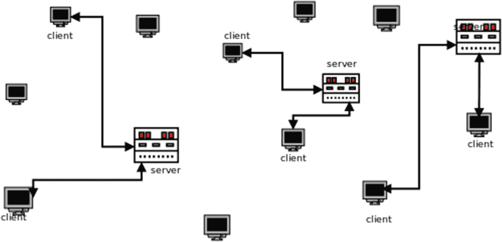

图 15-1

客户端-服务器拓扑结构

此图展示了客户端与服务器之间的交互。线条代表客户端与服务器之间的双向通信线路（请求-响应）。客户端发出请求，服务器则响应这些请求。例如，网络浏览器（客户端）向服务器请求一个网页，服务器通过向客户端发送 HTML 页面来响应。

就我们的目的而言，我们只需要注意到这种拓扑结构中存在一定程度的集中化。节点分为两种类型：服务器和客户端。服务器响应请求，并可以选择忽略某些请求。服务器控制着网络中的信息流。

## 点对点网络

就此而言，区块链网络或加密货币网络是一种点对点网络。在点对点网络（P2P）中，所有节点在能力上都是平等的，没有超级节点。

在 P2P 网络中，节点之间互为对等节点。就氦气而言，这意味着通常所有节点都维护着完整的区块链，并具备挖矿能力。当然，某些节点可能选择不参与挖矿，而其他节点出于自身目的，可能只维护区块链的一部分。正如我们之前所见，氦节点之间互不信任，但网络仍然可以就网络状态（即区块链）达成共识。

网络缺乏集中化，这正是区块链网络具有弹性且无法被关闭的原因。这与客户端-服务器网络形成鲜明对比，在后者中，只需关闭服务器即可使整个网络瘫痪。

图 15-2 展示了区块链网络的整体拓扑结构。

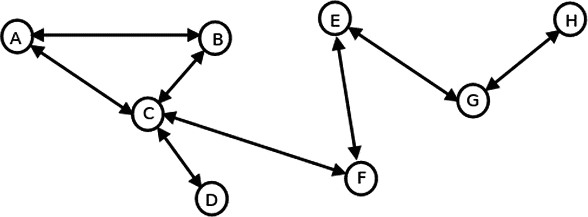

图 15-2

*点对点网络*

此图展示了多个在功能上彼此相同的节点在网络中相互交互。线条代表对等节点之间的双向通信通道。这种拓扑结构称为点对点网络，有时也称为网状网络。节点可以加入系统或退出系统，而不会降低网络的效能。此外，节点之间会临时建立通信链路。

以往建立替代货币网络的尝试都基于客户端-服务器模型。这些货币系统很容易被识别并关闭。此外，它们往往会引发出于动机的刑事起诉，这些起诉通常基于可疑的政治法律依据。比特币的核心优势在于它无法被关闭。中本聪意识到潜在刑事诉讼的可能性，在 2011 年将比特币网络投入正常运行状态后便从公众视野中消失了。

P2P 网络中的节点没有全局唯一的 ID 来区分彼此。所有节点在概念上互为对等节点。节点只能通过其 IP 地址相互区分。这种节点匿名性的后果之一是网络容易遭受女巫攻击。在女巫攻击中，一个节点会伪装成另一个节点或多个其他节点。

## 启动一个节点

当点对点网络上的一个节点启动时，它会连接到一个或多个种子节点，并向这些节点查询网络上其他节点的地址。种子节点就像一个目录服务器，维护着节点的地址。向目录服务器发起查询，允许节点加入 P2P 网络并与一部分节点通信。在启动阶段，不同的节点可能联系不同的种子节点，因此，每个节点对网络的视图可能各不相同。P2P 网络上的每个节点都维护着一个已知节点地址的列表，因此，如果它愿意，也可以充当目录服务器。这些节点可以通过提供其节点地址列表来响应提供节点地址的查询。

分布式哈希表（DHT）是在 P2P 网络中提供节点地址最通用的方式。在这种 P2P 网络中，网络上的部分节点（如果不是全部）维护着一个地址的分布式哈希表。^(⁶⁰) DHT 是一种键值存储，它将键空间映射到地址空间。网络上的任何节点都可以选择维护 DHT 的一部分。正在启动的节点会向 P2P 网络广播，搜索维护着地址分布式哈希表的节点。这些节点就是 DHT 类型网络中的种子节点。

就我们的目的而言，我们只需指定一个或多个 P2P 节点作为目录服务器，负责响应节点地址的查询。^(⁶¹) 为氦网络实现一个分布式哈希表虽然并不困难，但这会使我们偏离主题太远。

在图 15-3 中，节点 A 请求目录服务器（种子）为其提供网络上其他节点的地址列表。目录服务器回复一个节点地址列表，并将查询节点的地址也添加到其节点列表中。目录服务器提供的节点成为请求节点的邻居。

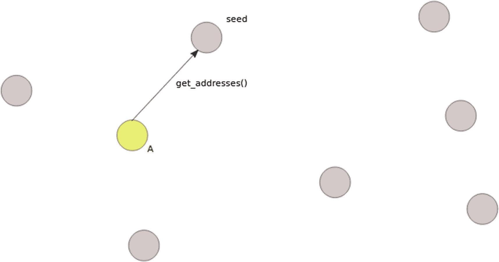

图 15-3

在点对点网络上通过目录服务器启动一个节点


## 点对点网络上的数据传播

在比特币和 Helium 网络中，交易和新挖掘的区块通过一种称为"泛洪"的过程在网络中传播。网络中的每个节点都在特定端口上监听网络中发生的交易以及新挖掘的区块。当节点收到新交易或新区块时，它会处理该新区块或交易，并可能将其传输到地址列表中的其他节点。图 15-4 展示了一个交易在网络中传播的过程。

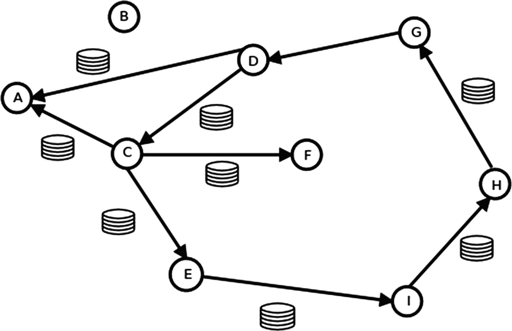

图 15-4

*点对点网络上的交易传播*

此图展示了一个由四个堆叠圆盘表示的交易从节点 D 开始传播的过程。节点 D 查询其地址列表，并将交易传送至节点 A 和 C。节点 C 查询其地址列表，并将交易传送至节点 E 和 F。传播过程按图中箭头所示继续进行。

这种泛洪过程使得交易和新区块能够快速在网络中传播。当然，正如我们在上一章所讨论的，节点在将交易或新挖掘的区块转发给相邻节点之前，会先验证区块和交易。

您可能会担心交易和区块会在网络上无限传播。有两种方法可以确保这种情况不会发生。传统方法是为每个交易或区块包含一个生存时间（TTL）参数。例如，考虑一个全新的交易。该交易的元数据将包含一个生存时间（TTL）计数器，例如初始值为 256。当一个节点收到此交易时，它会将 TTL 减 1，然后重新广播该交易。如果节点收到 TTL 为 0 的交易，则会直接丢弃该交易。

第二种方法是比特币和 Helium 处理交易路由的方式。比特币节点会在以下情况丢弃传入的交易：(i) 该交易已存在于节点等待处理的事务缓存（*内存池*）中；(ii) 该交易已存在于区块链中；或 (iii) 该交易无效。否则，节点会将该交易重新广播至其地址列表中的其他节点。

请注意，交易传播机制还使每个接收节点能够获取传播该交易的节点地址。接收节点可以将此地址添加到其地址列表中。这一特性使接收节点能够通过将以前未知的地址添加到地址列表中来扩展其网络视野。

由于泛洪算法，每个节点通常会处理一组不同的交易，特别是，某个节点可能无法接收到某些正在网络中传播的交易。如果出现临时网络分区或节点宕机，该节点可能会完全停止接收交易。

另外请注意，节点接收交易的顺序可能与交易创建的时间顺序不同。

## 并发挖矿

如上一章所述，挖矿模块中的某些函数设计为与 RPC 服务器并发运行。为便于实现这一点，请在`hmining`模块中的以下两个函数（例如`make_candidate_block`和`mine_block`）中添加`async`关键字：

```
async def mine_block(candidate_block: 'dictionary')
async def make_candidate_block()
```

通过这一简单修改，这两个函数便能够并发运行。

`start_mining`函数是一个启动区块挖矿的并发线程。请在`hmining`模块末尾添加以下代码块：

```
#####################################
### start mining in a thread:
### $(virtual) python hmining.py
#####################################
if __name__ == "__main__":
#Create the Threads
t1 = threading.Thread(target=start_mining, args=(), daemon=True)
t1.start()
t1.join()
```

从命令行启动此模块将在一个线程上开始区块挖矿。

## 在本地主机上模拟 Helium 网络

本章中，我们将在托管于本地主机网络（127.0.x.x）^(⁶²)的点对点网络上模拟并测试 Helium 挖矿节点。您应该已经在 Helium 根目录下创建了一个`simulated_network`子目录（参见第 7 章）。`simulated_network`目录必须位于 Python 解释器的路径中^(⁶³)。在`simulated_network`目录下创建一个名为`node_1`的目录。接下来，将 Helium 根目录下除`unit_tests`目录和`simulated_network`目录之外的所有子目录复制到`simulated_network/node_1`子目录中。删除`simulated_network/node_1/data`子目录中的所有文件。`node_1`目录树包含在模拟 Helium 网络上运行的节点所需的所有 Python 代码。

接下来，在`simulated_network`目录下创建一个子目录树`seed_1/hnetwork`。将以下程序代码复制到一个名为`directory_server.py`的文件中，并将该文件保存到`seed_1/hnetwork`子目录下。这段代码指定了 Helium 网络上的一个目录服务器。

至此，我们已经为模拟网络指定了一个种子节点和一个 Helium 挖矿节点。您现在可以根据需要，多次将`node_1`目录树复制并粘贴到`simulated_network`目录中，并根据需要重命名这些子树的根目录。这将为模拟网络上的每个 Helium 节点提供一个对应的子目录。您也可以根据需要指定多个种子节点（作必要修改后）。

我们还可以使用 Docker 镜像和容器在本地主机上搭建 Helium 网络。Docker 是一种准虚拟化解决方案，可在容器中构建应用程序。容器可以部署到多个主机，而无需任何复杂的部署流程或对容器源代码进行任何修改。有关更多信息，请参考以下 Docker 资源：*Ian Miell 和 Aidan Sayers 著，《Docker 实战》，Manning Publications，2016 年版*

下面我们来看一下`directory_server`模块的代码。该程序代码位于`seed_1/hnetwork`子目录中：


```python
'''
在 127.0.0.69:8081 上启动目录服务器
'''
import hmining
from tornado import ioloop, web
from jsonrpcserver import method, async_dispatch as dispatch
import ipaddress
import json
import threading
import pdb
import logging

### 仅供测试的虚假地址列表
address_list = ["127.0.0.10:8081", "127.0.0.11:8081", "127.0.0.12:8081", "127.0.0.13:8081", \
"127.0.0.14:8081", "127.0.0.15:8081", "127.0.0.16:8081", "127.0.0.17:8081", \
"127.0.0.18:8081", "127.0.0.19:8081", "127.0.0.20:8081" ]

logging.basicConfig(filename="debug.log", filemode="w", \
format='server: %(asctime)s:%(levelname)s:%(message)s', level=logging.DEBUG)

@method
async def get_address_list():
    with hmining.semaphore:
        ret = address_list
    return ret

@method
async def register_address(address: "string"):
    global address_list
    try:
        # 验证 IP 地址和端口格式：addr:port
        if address.find(":") == -1:
            return "error-invalid address"
        addr_list = address.split(":")
        addr_list[1] = addr_list[1].strip()
        if len(addr_list[0]) == 0 or len(addr_list[1]) == 0:
            return "error-invalid address"
        if int(addr_list[1]) >= 65536:
            return "error-invalid address"
        _ = ipaddress.ip_address(addr_list[0])
        addr = addr_list[0] + ":" + addr_list[1]
        if addr not in address_list:
            with hmining.semaphore:
                address_list.append(addr)
        return address
    except Exception as err:
        logging.debug('directory server::register address - ' + str(err))
        return "error-register address"

class MainHandler(web.RequestHandler):
    async def post(self):
        request = self.request.body.decode()
        logging.debug('decoded server request =  ' + str(request))
        response = await dispatch(request)
        print(response)
        self.write(str(response))

app = web.Application([(r"/", MainHandler)])

### 在本地回环地址 127.0.0.69:8081 上启动节点的网络接口
if __name__ == "__main__":
    app.listen(address="127.0.0.69", port="8081")
    logging.debug('server running')
    print("directory server started at 127.0.0.69:8081")
    ioloop.IOLoop.current().start()
```

这个 Python 脚本将在本地主机网络的 IP 地址 `127.0.0.69` 和端口 `8081` 上启动一个异步 JSON-RPC 目录服务器。如果你不熟悉 JSON 远程过程调用服务器和客户端，请参考附录 6。该目录服务器维护一个名为 `address_list` 的列表，其中包含其他 Helium 节点正在监听的 IP 地址和端口。^((64)) 此目录服务器执行两项任务：(i) 在收到请求时提供网络上 RPC 服务器（Helium 挖矿节点）的地址，以及 (ii) 注册 RPC 服务器节点的地址。

请注意，共享资源 `address_list` 通过使用信号量来防止数据竞争。如果你需要复习 Python 并发和资源锁定的理论，可以参考附录 4。

为了启动此目录服务器，请进入 `seed_1/hnetwork` 目录，并在你的 Helium 虚拟环境中执行 `directory-server.py` 脚本：

```
$(virtual) python directory_server.py
```

每个非目录服务器的 Helium 节点都维护着一个 JSON-RPC 客户端和一个 JSON-RPC 服务器。RPC 客户端向 Helium P2P 网络上的其他 RPC 服务器发出请求，并处理接收到的响应。同样，RPC 服务器会响应网络上其他 RPC 客户端发出的请求。

对于你创建的每个节点目录（`node_1`、`node_2`……）（除了 `seed` 目录），请将以下程序代码复制到文件 `networknode.py` 中，并将此文件保存到相应的 `node_x/hnetwork` 子目录中。

让我们来看看这段程序代码：


### 代码架构说明

`networknode`：一个同步 RPC 客户端节点的实现，该节点使用 JSON RPC 协议版本 2 向 RPC 服务器发起远程过程调用，以及一个响应来自 RPC 客户端节点请求的 JSON-RPC 服务器。

```python
'''
netnode: 一个同步 RPC 客户端节点的实现，该节点使用 JSON RPC 协议版本 2 向 RPC 服务器发起远程过程调用，
以及一个响应来自 RPC 客户端节点请求的 JSON-RPC 服务器。
'''
import blk_index as blkindex
import hblockchain
import hchaindb
import hmining
import networknode
from   tornado import ioloop, web
from   jsonrpcserver import method, async_dispatch as dispatch
from   jsonrpcclient.clients.http_client import HTTPClient
import ipaddress
import threading
import json
import pdb
import logging
import os
import sys
logging.basicConfig(filename="debug.log",filemode="w",  \
format='server: %(asctime)s:%(levelname)s:%(message)s', level=logging.DEBUG)
##################################
#### JSON-RPC 客户端
##################################
def hclient(remote_server, json_rpc):
'''
向远程 RPC 服务器发送同步请求
'''
try:
client = HTTPClient(remote_server)
response = client.send(json_rpc)
valstr = response.text
val = json.loads(valstr)
print("结果: " + str(val["result"]))
print("id:  " + str(val["id"]))
return valstr
except Exception as err:
logging.debug("node_client: " + str(err))
return '{"jsonrpc": "2.0", "result":"error", "id":"error"}'
#######################################
#### JSON-RPC 服务器
#######################################
address_list = []
@method
async def receive_transaction(trx):
"""
接收在 Helium 网络上广播的交易
"""
try:
hmining.semaphore.acquire()
ret = hmining.receive_transaction(trx)
hmining.semaphore.release()
if ret == False: return "error: invalid transaction"
return "ok"
except Exception as err:
return "error: " + err
@method
async def receive_block(block):
"""
接收在 Helium 网络上广播的区块
"""
try:
ret = hmining.receive_block(block)
if ret == False: return "error: invalid block"
return "ok"
except Exception as err:
return "error: " + err
@method
async def get_block(height):
"""
返回指定高度的区块，如果区块不存在则返回错误
"""
with hmining.semaphore:
if len(hblockchain.blockchain) == 0:
return ("error: empty blockchain")
if height  hblockchain.blockchain[-1]["height"]:
return "error-invalid block height"
block = json.dumps(hblockchain.blockchain[height])
return block
@method
async def get_blockchain_height():
"""
返回区块链的高度。注意，第一个区块的高度为 0
"""
with hmining.semaphore:
if hblockchain.blockchain == []: return -1
height = hblockchain.blockchain[-1]["height"]
return height
@method
async def clear_blockchain():
"""
清除主区块链和辅助区块链。
"""
pdb.set_trace()
with hmining.semaphore:
hblockchain.blockchain.clear()
hblockchain.secondary_blockchain.clear()
return "ok"
class MainHandler(web.RequestHandler):
async def post(self):
request = self.request.body.decode()
logging.debug('decoded server request =  ' + str(request))
response = await dispatch(request)
print(response)
self.write(str(response))
def startup():
'''
启动节点相关系统
'''
try:
### 移除所有锁文件
os.system("rm -rf ../data/heliumdb/*")
os.system("rm -rf ../data/hblk_index/*")
### 启动链状态数据库
ret = hchaindb.open_hchainstate("../data/heliumdb")
if ret == False: return "error: failed to start Chainstate database"
else: print("链状态数据库正在运行")
### 启动 LevelDB 数据库 blk_index
ret = blkindex.open_blk_index("../data/hblk_index")
if ret == False: return "error: failed to start blk_index"
else: print("blkindex 数据库正在运行")
except Exception:
return "error: failed to start Chainstate database"
return True
app = web.Application([(r"/", MainHandler)])
######################################################
### 在本地回环地址上启动服务器节点的网络接口
#### 127.0.0.19:8081
#####################################################
if __name__ == "__main__":
app.listen(address="127.0.0.51", port="8081")
logging.debug('服务器节点正在运行')
print("网络节点启动于 127.0.0.19:8081")
###############################
### 启动此节点
###############################
if startup() != True:
logging.debug('服务器节点资源故障')
print("正在停止")
sys.exit()
logging.debug('服务器节点正在运行')
print('服务器节点正在运行')
################################
### 启动事件循环
################################
ioloop.IOLoop.current().start()
```

该代码库基于我们在附录 6 中的 JSON-RPC 实现。请注意，此特定节点正在监听`127.0.0.19:8081`。模拟网络上的每个网络节点必须在（`localhost`）上监听唯一的 IP 地址。

## RPC 请求格式

由 RPC 客户端发起的请求具有以下语法格式：

```python
rpc   = json.dumps({"jsonrpc":"2.0","method":"receive_block","params":{"block": blocks[0]}, "id":21})
ret = networknode.hclient("http://127.0.0.51:8081", rpc)
```

`json.dumps()`函数的参数是 JSON-RPC v.2 格式的远程过程调用。第二个参数的值是要在远程服务器上调用的方法（`receive_block`）。第三个参数的值是要传递给远程函数的参数，参数是一个 Python 字典。如果我们调用一个不带任何函数参数的远程方法，第三个参数将是空字典`{}`。第四个参数是标识我们请求的数字 ID，远程服务器将使用此 ID 返回其响应。此 JSON-RPC 命令在被放置到网络上之前，先由`json.dumps`打包为字符串。

## 发送命令到远程服务器

我们现在准备将此命令发送到远程服务器。`networknode`是包含 RPC 客户端和服务器的 Python 模块。函数`networknode.hclient()`将把命令发送到远程服务器。`networknode.hclient()`函数的第一个参数是被调用的远程 JSON-RPC 服务器的 IP 地址和端口。请注意，地址包含用于与此服务器通信的协议（`http`）。第二个参数是我们打包后的 RPC 命令。

## 远程 JSON 服务器响应格式

远程 JSON 服务器通常会以以下语法格式的响应进行回复：

```json
'{"jsonrpc": "2.0", "result": ["127.0.0.10:8081", "127.0.0.11:8081"],"id":5}'
```

这是一个编码为字符串的 JSON 对象。我们可以通过函数`json.loads()`将其转换为 Python 字典。

第一个键项指定了用于格式化响应的 JSON RPC 版本。第二个键项是`"result"`，这个键的值是我们感兴趣的。第三个键`id`标识了此响应所对应的请求 ID。

## 错误响应格式

在出错的情况下，服务器将以以下格式响应：

```json
'{"jsonrpc": "2.0", "error": "message", "id": 5 }'
```
或：
```json
'{"jsonrpc": "2.0", "result": "error: message", "id": 5 }'
```

## JSON-RPC 服务器部分

`networknode`模块的第二部分是 JSON-RPC 服务器。请检查此模块中的`app.listen()`调用：

```python
app.listen(address="127.0.0.19", port="8081")
```

这指定了服务器将在 IP 地址`127.0.0.19`的`8081`端口上监听。每个网络节点必须监听唯一的 IP 地址和端口组合。

最后，请注意共享资源通过使用信号量来防止数据竞争。

## 启动服务器

为了在模拟网络上启动此服务器，请导航到节点的`hnetwork`目录，并在 Helium 虚拟环境中执行`networknode.py`脚本：

```bash
$(virtual) python networknode.py
```


## 氦气节点网络接口

氦气加密货币 P2P 网络上的节点执行以下网络任务：

1.  查询节点地址并从一台或多台目录服务器获取地址列表。
2.  向其他请求节点提供其地址列表。
3.  查询其他节点以获取区块，并处理接收到的区块。
4.  获取节点区块链的高度。
5.  接收网络上传播的交易和区块，并将其传播到其他节点。

氦气网络接口的规范如下。接口中的所有功能都实现为 JSON 远程过程调用。^(⁶⁵) JSON-RPC 服务器上的过程通过 HTTP 调用。^(⁶⁶) RPC 服务器异步处理远程过程调用。每个氦气挖矿节点在其`networknode`模块中实现了以下所有功能，因此它既是 JSON-RPC 服务器又是客户端。

### 氦气启动脚本

```
directory_server.py
networknode.py
```

有两种类型的启动脚本：一个名为`directory_server.py`的目录服务器启动脚本和一个名为`networknode.py`的节点启动脚本。

`directory_server.py`启动一个目录服务器，该服务器向请求节点提供氦气节点地址列表。

`networknode.py`是一个 Python 脚本，它启动一个氦气节点，并将 RPC 服务器节点置于 P2P 网络上的运行状态。如前所述，氦气网络上每个非目录服务器的节点都实现了一个 RPC 服务器和一个客户端。

### 地址解析

```
get_address_list() -> "string"
register_address(address: "string") -> "string"
```

`get_address_list`：通过请求调用一个种子节点（目录服务器），要求其发送节点地址列表。远程服务器返回一个字符串化的 P2P 节点地址列表。

`register_address`：节点向种子节点或目录服务器注册其地址（例如`127.0.0.34:8081`）。

### 区块链初始化

```
clear_blockchain() -> "string"
```

此命令清除节点的主区块链和副区块链。如果区块链被清除，它将返回字符串"`ok`"。

### 区块链查询

有两个远程过程调用可用于进行区块链查询：

```
get_blockchain_height() -> "integer"
get_block(block_no: "int") -> "stringified block or an error string"
```

`get_blockchain_height`：向远程节点请求提供其区块链的高度。请求者收到一个整数回复。节点使用此函数来确定其区块链是否与其他节点的区块链同步，或用于填充空的区块链。如果由于停机或网络故障等原因，节点区块链的高度远小于其他节点区块链的高度，则会出现不同步的情况。

`get_block`：请求远程节点发送具有特定区块高度的区块。如果请求的区块不存在，此函数返回一个区块或一个错误字符串。错误字符串将包含单词`error`。

### 区块传播

```
receive_block(block: "string") -> "ok or an error string"
```

`receive_block`：一个节点（作为 JSON-RPC 客户端）向远程节点（作为 JSON-RPC 服务器）发送一个区块。函数参数是一个字符串化的区块。该区块可以是新挖出的区块，或是在氦气 P2P 网络上传播的区块。如果发生错误，该函数将返回一个错误字符串。错误字符串将包含单词`error`。

### 交易传播

```
receive_transaction(transaction: "string") -> "ok or an error string"
```

节点通过由远程节点（作为 JSON-RPC 客户端）发起的远程过程调用接收交易。如果发生错误，此函数返回一个错误字符串。错误字符串将包含单词`error`。

### 节点进程空间

我们模拟的 P2P 网络在实际用途上与运行在互联网上的氦气网络完全相同。需要牢记的一点是，每个节点的 JSON-RPC 服务器和客户端都在其自己的进程空间中执行，特别是，即使所有内容都运行在一台机器上，也没有共享内存或程序代码。客户端只能通过 HTTP 和 JSON-RPC 2.0 协议与服务器通信。进一步说明，每个`networknode`模块及其导入的所有模块都在其自己的进程空间中执行。

### 氦气网络接口的 Pytest 测试

要开始测试，请确保你已按先前所述创建了模拟网络，并启动了一些服务器节点和一个或多个目录服务器节点。请确保在实例化服务器时你处于虚拟氦气环境中，并且每个服务器都在监听一个唯一的地址。我们的 Pytest 代码使用一个监听在`127.0.0.69:8081`的目录服务器，以及一个监听在`127.0.0.51:8081`的用于远程挖矿节点的 JSON-RPC 服务器。最后，将`networknode.py`复制到`unit_tests`目录，并在`127.0.0.19:8081`启动一个服务器。

将以下 Pytest 程序代码复制到一个名为`test_hnetwork.py`的文件中，并将此文件保存在氦气根目录的`unit_tests`子目录中。

该文件中的测试是集成测试，也就是说，它们在实际的模拟网络上执行远程过程调用，并返回获得的实际结果。它们不会模拟测试中涉及的任何函数。为了实现这一点，测试借助`make_blocks`和`make_random_transaction`函数构建了一个实际的合成区块链。附录 7 讨论了创建任意高度的模拟区块链。

导航到氦气根目录的`unit_tests`目录，并使用以下命令运行测试：

```
$(virtual) pytest test_hnetwork.py -s
```

注意：在使用这些单元测试测试模块时，不要从命令行实例化`hmining`模块并执行`mine_blocks`。

注意

你可以通过使用`-s`选项获取测试的扩展输出，例如：

```
$(virtual) pytest test_hnetwork.py -s -k test_get_address_list
```

`-k`选项仅测试`test_get_address_list`而忽略其他测试。`-s`选项可提供扩展输出，否则该输出会被抑制。对于此特定测试，`-s`选项将在终端屏幕上打印接收到的地址列表。命令

```
$(virtual) pytest test_hnetwork.py -s
```

将执行所有测试并提供扩展输出。

你应该会看到六个测试通过。请注意，执行这些测试将输出构建模拟网络时的交易片段。


```python
###########################################################################
#### 测试氦气网络
###########################################################################
import blk_index as blkindex
import hchaindb
import hmining
import hconfig
import hblockchain
import networknode
import rcrypt
import tx
import json
import logging
import pdb
import pytest
import os
import secrets
import sys
import time
"""
将调试信息记录到文件 debug.log
"""
logging.basicConfig(filename="debug.log",filemode="w",  \
format='client: %(asctime)s:%(levelname)s:%(message)s', level=logging.DEBUG)
def setup_module():
os.system("rm -rf ../data/heliumdb/*")
os.system("rm -rf ../data/hblk_index/*")
os.system("rm *.log")
### 启动链状态数据库
ret = hchaindb.open_hchainstate("../data/heliumdb")
if ret == False: return "错误：链状态数据库启动失败"
else: print("链状态数据库运行中")
### 启动 LevelDB 数据库 blk_index
ret = blkindex.open_blk_index("../data/hblk_index")
if ret == False: return "错误：blk_index 启动失败"
else: print("blkindex 数据库运行中")
def teardown_module():
"""
移除调试日志，关闭数据库
"""
hchaindb.close_hchainstate()
blkindex.close_blk_index()
#### 未花费交易片段值 [{fragmentid:value}]
unspent_fragments = []
"""
将调试信息记录到文件 debug.log
"""
logging.basicConfig(filename="debug.log",filemode="w",  \
format='client: %(asctime)s:%(levelname)s:%(message)s', level=logging.DEBUG)
def startup():
"""
启动数据库
"""
### 启动链状态数据库
ret = hchaindb.open_hchainstate("heliumdb")
if ret == False: return "错误：链状态数据库启动失败"
else: print("链状态数据库运行中")
### 启动 LevelDB 数据库 blk_index
ret = blkindex.open_blk_index("hblk_index")
if ret == False: return "错误：blk_index 启动失败"
else: print("blkindex 数据库运行中")
def stop():
"""
停止数据库
"""
hchaindb.close_hchainstate()
blkindex.close_blk_index()
#### 未花费交易片段值 [{fragmentid:value}]
unspent_fragments = []
######################################################
### 创建一个用于测试的合成随机交易
#### 接收区块编号和一个指示交易是否为币基交易的谓词
######################################################
def make_random_transaction(blockno, is_coinbase):
txn = {}
txn["version"] =  "1"
txn["transactionid"] = rcrypt.make_uuid()
if is_coinbase == True: txn["locktime"] = hconfig.conf["COINBASE_LOCKTIME"]
else: txn["locktime"] = 0
#### 此交易的公钥-私钥对
transaction_keys = rcrypt.make_ecc_keys()
#### 此交易花费的先前交易片段
total_spendable = 0
#######################
### 构建 vin 数组
#######################
txn["vin"] = []
#### 创世区块交易没有前置输入。
#### 币基交易没有任何输入
if (blockno > 0) and (is_coinbase != True):
max_inputs = secrets.randbelow(hconfig.conf["MAX_INPUTS"])
if max_inputs == 0: max_inputs = hconfig.conf["MAX_INPUTS"] - 1
#### 获取一些随机的先前未花费交易
##### 片段进行花费
ind = 0
ctr = 0
while ind  0
#### 创建一个随机 vin 元素
key_array = key.split("_")
signed = rcrypt.sign_message(val["privkey"], val["pubkey"])
ScriptSig = []
ScriptSig.append(signed)
ScriptSig.append(val["pubkey"])
txn["vin"].append({
"txid": key_array[0],
"vout_index": int(key_array[1]),
"ScriptSig": ScriptSig
})
ctr = 0
ind += 1
#####################
### 构建 Vout 列表
#####################
txn["vout"] = []
### 创世区块
if blockno == 0:
total_spendable = secrets.randbelow(10_000_000) + 50_000
#### 对于非币基交易，我们至少需要一个交易输出
if is_coinbase == True: max_outputs = hconfig.conf["MAX_OUTPUTS"]
else:
max_outputs = secrets.randbelow(hconfig.conf["MAX_OUTPUTS"])
if max_outputs ")
ScriptPubKey.append("")
ScriptPubKey.append(tmp)
ScriptPubKey.append("")
ScriptPubKey.append("")
if is_coinbase == True:
value = hmining.mining_reward(blockno)
else:
amt = int(total_spendable/max_outputs)
value = secrets.randbelow(amt)   # 氦分
if value == 0:
value = int(amt / 10)
total_spendable -= value
assert value > 0
assert total_spendable >= 0
txn["vout"].append({
"value": value,
"ScriptPubKey": ScriptPubKey
})
#### 保存交易片段
fragid = txn["transactionid"] + "_" + str(ind)
fragment = {}
fragment[fragid] = { "value":value,
"privkey":transaction_keys[0],
"pubkey":transaction_keys[1],
"blockno": blockno
}
unspent_fragments.append(fragment)
#打印("已添加至未花费片段: " + fragid)
if total_spendable  0 and txctr == 0: is_coinbase = True
else: is_coinbase = False
trx = make_random_transaction(ctr, is_coinbase)
assert trx != False
block["tx"].append(trx)
txctr += 1
if ctr > 0:
block["prevblockhash"] = \
hblockchain.blockheader_hash(hblockchain.blockchain[ctr - 1])
ret = hblockchain.merkle_root(block["tx"], True)
assert ret != False
block["merkle_root"] = ret
ret = hblockchain.add_block(block)
assert ret == True
blocks.append(block)
ctr+= 1
return blocks
def test_register_address():
'''
测试向位于 127.0.0.69:8081 的目录服务器注册地址
'''
#测试 1
ret = networknode.hclient("http://127.0.0.69:8081",
'{"jsonrpc":"2.0","method":"register_address","params":{"address":"127.0.0.19:8081"},"id":1}')
result = (json.loads(ret))["result"]
print(result)
assert result.find("error") == -1
#测试 2
ret = networknode.hclient("http://127.0.0.69:8081",
'{"jsonrpc":"2.0","method":"register_address","params":{"address":"127.0.0.19"},"id":2}')
result = (json.loads(ret))["result"]
print(result)
assert result.find("error") >= 0
#测试 3
ret = networknode.hclient("http://127.0.0.69:8081",
'{"jsonrpc":"2.0","method":"register_address","params":{"address":"127.0.0:8081"},"id":3}')
result = (json.loads(ret))["result"]
print(result)
assert result.find("error")  >= 0
def test_get_address_list():
'''
从目录服务器获取地址列表。这些是合成地址，
这些地址上并没有运行服务器。
'''
ret = networknode.hclient("http://127.0.0.69:8081",
'{"jsonrpc":"2.0","method":"get_address_list","params":{},"id":4}')
assert (ret.find("error")) == -1
retd = json.loads(ret)
assert "127.0.0.10:8081" in retd["result"]
print(ret)
def test_get_blockchain_height():
""" 测试获取某个节点区块链的高度"""
blocks = make_blocks(2)
assert len(blocks) == 2
#### 为此测试清除主区块链和次区块链
ret = networknode.hclient("http://127.0.0.51:8081",
'{"jsonrpc": "2.0", "method": "clear_blockchain", "params": {}, "id": 10}')
assert ret.find("ok") != -1
rpc   = json.dumps({"jsonrpc":"2.0","method":"receive_block",
"params":{"block": blocks[0]}, "id":11})
ret = networknode.hclient("http://127.0.0.51:8081",rpc)
assert ret.find("ok") != -1
ret = networknode.hclient("http://127.0.0.51:8081",
'{"jsonrpc": "2.0", "method": "get_blockchain_height", "params": {}, "id": 12}')
assert ret.find("error") == -1
height = (json.loads(ret))["result"]
assert height == 0
rpc   = json.dumps({"jsonrpc":"2.0","method":"receive_block",
"params":{"block": blocks[1]}, "id":13})
ret = networknode.hclient("http://127.0.0.51:8081",rpc)
assert ret.find("ok") != -1
ret = networknode.hclient("http://127.0.0.51:8081",
'{"jsonrpc": "2.0", "method": "get_blockchain_height", "params": {}, "id": 14}')
assert ret.find("error") == -1
height = (json.loads(ret))["result"]
assert height == 1
def test_receive_block():
"""
向远程节点发送一个区块。如果该区块被追加到其 received_blocks 列表中，
远程节点返回 ok，否则返回错误字符串
"""
blocks = make_blocks(2)
assert len(blocks) == 2
#### 为此测试清除主区块链和次区块链
ret = networknode.hclient("http://127.0.0.51:8081",
'{"jsonrpc": "2.0", "method": "clear_blockchain", "params": {}, "id": 10}')
assert ret.find("ok") != -1
rpc   = json.dumps({"jsonrpc":"2.0","method":"receive_block",
"params":{"block": blocks[0]}, "id":8})
ret = networknode.hclient("http://127.0.0.51:8081",rpc)
assert ret.find("ok") != -1
rpc   = json.dumps({"jsonrpc":"2.0","method":"receive_block",
"params":{"block": blocks[1]}, "id":9})
ret = networknode.hclient("http://127.0.0.51:8081",rpc)
assert ret.find("ok") != -1
def test_receive_transaction():
"""
向远程节点发送一个交易。如果该交易被追加到其交易内存池中，
远程节点返回 ok。否则返回错误字符串
"""
blocks = make_blocks(2)
assert len(blocks) == 2
#### 为此测试清除主区块链和次区块链
ret = networknode.hclient("http://127.0.0.51:8081",
'{"jsonrpc":"2.0", "method": "clear_blockchain", "params": {}, "id": 15}')
assert ret.find("ok") >= 0
rpc   = json.dumps({"jsonrpc":"2.0","method":"receive_transaction",
"params":{"trx":blocks[0]["tx"][0]},"id":16})
ret = networknode.hclient("http://127.0.0.51:8081",rpc)
assert ret.find("ok") >= 0
rpc   = json.dumps({"jsonrpc":"2.0","method":"receive_transaction",
"params":{"trx": blocks[0]["tx"][1]}, "id":17})
ret = networknode.hclient("http://127.0.0.51:8081",rpc)
assert ret.find("ok") >= 0
def test_clear_blockchain(monkeypatch):
"""
构建并清除一个节点的主区块链和次区块链
"""
#### 为此测试清除主区块链和次区块链
ret = networknode.hclient("http://127.0.0.51:8081",
'{"jsonrpc":"2.0", "method": "clear_blockchain", "params": {}, "id": 19}')
assert ret.find("ok") >= 0
monkeypatch.setattr(tx, "validate_transaction", lambda x,y: True)
num_blocks = 20
blocks = make_blocks(num_blocks)
assert len(blocks) == num_blocks
tmp = hblockchain.blockheader_hash(blocks[0])
assert tmp == blocks[1]["prevblockhash"]
assert blocks[1]["height"] == 1
rpc   = json.dumps({"jsonrpc":"2.0","method":"receive_block",
"params":{"block": blocks[0]}, "id":21})
ret = networknode.hclient("http://127.0.0.51:8081",rpc)
assert ret.find("ok") != -1
ret = networknode.hclient("http://127.0.0.51:8081",
'{"jsonrpc": "2.0", "method": "get_blockchain_height", "params": {}, "id": 22}')
assert ret.find("error") == -1
height = (json.loads(ret))["result"]
#### 区块链中最新区块的高度属性值
#### 表示区块链中有一个区块
assert height == 0
rpc   = json.dumps({"jsonrpc":"2.0","method":"receive_block",
"params":{"block": blocks[1]}, "id":23})
ret = networknode.hclient("http://127.0.0.51:8081",rpc)
assert ret.find("ok") != -1
ret = networknode.hclient("http://127.0.0.51:8081",
'{"jsonrpc": "2.0", "method": "get_blockchain_height", "params": {}, "id": 24}')
assert ret.find("error") == -1
height = (json.loads(ret))["result"]
#### 区块链中最新区块的高度属性值
#### 表示区块链中有两个区块
assert height == 1
#### 为此测试清除主区块链和次区块链
ret = networknode.hclient("http://127.0.0.51:8081",
'{"jsonrpc":"2.0", "method": "clear_blockchain", "params": {}, "id": 25}')
assert ret.find("ok") >= 0
```


## 结论

在本章中，我们讨论了互联网上的两种主要网络拓扑：客户端-服务器拓扑和对等网络拓扑（P2P）。我们还开发了将 Helium 节点连接到 Helium P2P 网络所必需的代码。为此，我们为每个挖矿节点构建了一个 JSON-RPC 服务器和一个 JSON-RPC 客户端接口。我们还创建了一个目录服务器（或称种子节点）。我们的接口代码允许挖矿节点执行以下操作：

1.  从目录服务器获取其他节点的地址。
2.  从网络接收交易并进一步传播。
3.  接收网络中传播的区块并进一步传播。
4.  获取节点区块链的高度。
5.  请求节点发送特定区块。
6.  清除主区块链和备用区块链。

在下一章中，我们将探讨将区块链序列化到磁盘的问题。我们还将展示节点如何从已序列化的区块链中重建其整个区块链环境（包括数据库）。

脚注 1 2 3 4 5 6 7

# 16. 区块链维护

在本章中，我们将探讨 Helium 区块链的维护。将讨论以下主题：

1.  一个拥有空区块链的新 Helium 节点如何从 Helium 网络获取区块，并与分布式区块链保持同步。当节点离线或出现临时网络分区时，此获取区块的流程也同样适用。
2.  重建 `Chainstate` 数据库。
3.  重建 `blk_index` 数据库。

## 区块链维护

加入 Helium 对等网络的新节点需要获取区块链。此外，如果节点离线或出现临时网络分区，其持有的区块链可能需要同步。

Helium 网络接口提供了两个远程过程调用来处理这些用例：

```
get_blockchain_height() -> "integer"
get_block(block_no: "int") ->  "stringified block or an error string"
```

`get_blockchain_height()` 用于获取远程节点持有的区块链高度。调用 `get_block()` 用于从远程节点获取特定区块。这两个远程过程调用在上一章中已讨论过。

我将留待您自行开发用于获取区块的测试。在生产环境中，为了提升性能，您可能希望增强代码以实现从多个远程节点同时并发下载区块。

## Helium 的可靠性工程

管理金融交易的应用程序必须具有极高的可靠性。基本原则是，应用程序应尽可能采用最简的架构模式来实现其目标。

在上一章中，我们了解到 Helium 的分布式对等架构创建了一个不易被降级（性能下降）的网络架构。生态系统中的所有节点能力均等，任何人都可以实例化一个节点并加入 Helium 网络。此外，比特币和 Helium 对硬件要求非常低，因此可以在廉价的普通硬件上运行。在笔记本电脑上运行 Helium 或比特币节点是完全可行的。

此外，我们在上一节中看到，如果节点离线或发生意外的网络分区，Helium 节点始终可以将其区块链与分布式区块链同步。

除了这些可靠性特性之外，Helium 和比特币还实现了一种单一故障点架构。这个故障点就是区块文件，它是一种简单的、编码后的文本文件。区块链就是这些文件的集合。

Helium 节点可以从区块链（即区块文件的集合）重建其运行所需的所有数据结构和数据库。Helium 使用两个键值存储：`Chainstate` 数据库和 `blk_index` 数据库，并通过设计确保这些数据库不是关键故障点。换句话说，只要拥有所有区块文件，Helium 始终可以重建这些数据库。

Helium 区块是编码后的、只读的文本文件。由于区块链是一种不可变的结构，因此不需要也不支持更新或删除区块文件。创建和读取操作由底层操作系统处理。以下来自 `hblockchain` 模块的代码片段展示了 Helium 中如何实现区块持久化：

```
def add_block(block: "dictionary") -> "bool":
"""
add_block: adds a block to the blockchain. Receives a block. The block
attributes are checked for validity and each transaction in the block is
tested for validity. If there are no errors, the block is written to a file
as asequence of raw bytes. Then the block is added to the blockchain.
The chainstate database and the blk_index databases are updated.
returns True if the block is added to the blockchain and False otherwise
"""
try:
### validate the received block parameters
if validate_block(block) == False:
raise(ValueError("block validation error"))
### validate the transactions in the block
### update the chainstate database
for trx in block['tx']:
### first transaction in the block is a coinbase transaction
if block["height"] == 0 or block['tx'][0] == trx: zero_inputs = True
else: zero_inputs = False
if tx.validate_transaction(trx, zero_inputs) == False:
raise(ValueError("transaction validation error"))
if hchaindb.transaction_update(trx) == False:
raise(ValueError("chainstate update transaction error"))
### serialize the block to a file
if (serialize_block(block) == False):
raise(ValueError("serialize block error"))
### add the block to the blockchain in memory
blockchain.append(block)
### update the blk_index
for transaction in block['tx']:
blockindex.put_index(transaction["transactionid"], block["height"])
except Exception as err:
print(str(err))
logging.debug('add_block: exception: ' + str(err))
return False
return True
def serialize_block(block: "dictionary") -> "bool":
"""
serialize_block: serializes a block to a file using pickle.
Returns True if the block is serialized and False otherwise.
"""
index = len(blockchain)
filename = "block_" + str(index) + ".dat"
### create the block file and serialize the block
try:
f = open(filename, 'wb')
pickle.dump(block, f)
except Exception as error:
logging.debug("Exception: %s: %s", "serialize_block", error)
f.close()
return False
f.close()
return True
```

一旦区块经过验证，它就会被持久化到特定目录。^((67)) 您希望将区块写入 `data` 目录。函数 `serialize_block()` 会将区块写入到一个目录中。正如您将注意到的，它非常简单。每个区块被写入一个名为

```
"block" + "height of block " + ".dat"
```

的文件中。这种简单的命名方案按高度索引区块文件。创世区块的高度为零。

该目录中所有区块的集合就是区块链。


### 构建模拟区块链

以下程序代码构建了一个高度为 500 个区块的模拟区块链。这种合成区块链在多种场景下会非常有用：

1.  在开发阶段测试区块链
2.  检查区块链参数修改后的行为变化
3.  测试区块链的弹性和可靠性

将这段代码复制到一个名为 `simulated_blockchain.py` 的 Python 文件中，并将其保存在 `unit_tests` 目录中。之后，在 Helium 虚拟环境中使用以下命令执行它：

```
$(virtual) simulated_blockchain.py
```

你应该会在 `unit_tests` 目录中看到一条包含 500 个区块的区块链。你可以通过向 `make_blocks` 函数提供所需的高度参数来构建任意高度的区块链。

这里需要提一个注意事项。由于模拟区块链上会发生交易，那些输出值非常小的零碎交易比例会增加。由于这种碎片化，构建非常高高度的区块链将会失败。零碎交易输出的合并通常由钱包处理。欢迎你为我们这个模拟区块链构建一个碎交易合并器。这将为你提供关于区块链如何构建以及如何随时间演变的宝贵见解。

```
######################################################
### 模拟区块链构造器
######################################################
import blk_index as blkindex
import hchaindb
import hmining
import hconfig
import hblockchain
import rcrypt
import tx
import json
import logging
import pdb
import os
import secrets
import sys
import time
"""
将调试信息记录到文件 debug.log 中
"""
logging.basicConfig(filename="debug.log",filemode="w",  \
format='client: %(asctime)s:%(levelname)s:%(message)s', level=logging.DEBUG)
def startup():
"""
启动数据库
"""
### 启动链状态数据库
ret = hchaindb.open_hchainstate("heliumdb")
if ret == False: return "error: failed to start Chainstate database"
else: print("Chainstate Database running")
### 启动 LevelDB 数据库 blk_index
ret = blkindex.open_blk_index("hblk_index")
if ret == False: return "error: failed to start blk_index"
else: print("blkindex Database running")
def stop():
"""
停止数据库
"""
hchaindb.close_hchainstate()
blkindex.close_blk_index()
### 未花费的交易碎片值 [{fragmentid:value}]
unspent_fragments = []
######################################################
### 创建一个用于测试的合成随机交易
### 接收一个区块编号和一个指示交易是否为 coinbase 交易的谓词
######################################################
def make_random_transaction(blockno, is_coinbase):
txn = {}
txn["version"] =  "1"
txn["transactionid"] = rcrypt.make_uuid()
if is_coinbase == True: txn["locktime"] = hconfig.conf["COINBASE_LOCKTIME"]
else: txn["locktime"] = 0
### 该交易的公私钥对
transaction_keys = rcrypt.make_ecc_keys()
### 该交易花费的先前交易碎片
total_spendable = 0
#######################
### 构建 vin 数组
#######################
txn["vin"] = []
### 创世区块交易没有先前的输入。
### coinbase 交易没有任何输入
if (blockno > 0) and (is_coinbase != True):
max_inputs = secrets.randbelow(hconfig.conf["MAX_INPUTS"])
if max_inputs == 0: max_inputs = hconfig.conf["MAX_INPUTS"] - 1
### 获取一些随机的、先前未花费的交易碎片用于花费
ind = 0
ctr = 0
while ind  0
### 创建一个随机的 vin 元素
key_array = key.split("_")
signed = rcrypt.sign_message(val["privkey"], val["pubkey"])
ScriptSig = []
ScriptSig.append(signed)
ScriptSig.append(val["pubkey"])
txn["vin"].append({
"txid": key_array[0],
"vout_index": int(key_array[1]),
"ScriptSig": ScriptSig
})
ctr = 0
ind += 1
#####################
### 构建 Vout 列表
#####################
txn["vout"] = []
### 创世区块
if blockno == 0:
total_spendable = secrets.randbelow(10_000_000) + 50_000
### 对于非 coinbase 交易，我们至少需要一个交易输出
if is_coinbase == True: max_outputs = 1
else:
max_outputs = secrets.randbelow(hconfig.conf["MAX_OUTPUTS"])
if max_outputs == 0: max_outputs = 6
ind = 0
while ind ")
ScriptPubKey.append("")
ScriptPubKey.append(tmp)
ScriptPubKey.append("")
ScriptPubKey.append("")
if is_coinbase == True:
value = hmining.mining_reward(blockno)
else:
amt = int(total_spendable/max_outputs)
value = secrets.randbelow(amt)   # 单位：氦分
if value == 0:
pdb.set_trace()
value = int(amt / 10)
total_spendable -= value
assert value > 0
assert total_spendable >= 0
txn["vout"].append({
"value": value,
"ScriptPubKey": ScriptPubKey
})
### 保存交易碎片
fragid = txn["transactionid"] + "_" + str(ind)
fragment = {}
fragment[fragid] = { "value":value,
"privkey":transaction_keys[0],
"pubkey":transaction_keys[1],
"blockno": blockno
}
unspent_fragments.append(fragment)
print("added to unspent fragments: " + fragid)
if total_spendable  0 and txctr == 0: is_coinbase = True
else: is_coinbase = False
trx = make_random_transaction(ctr, is_coinbase)
assert trx != False
block["tx"].append(trx)
txctr += 1
if ctr > 0:
block["prevblockhash"] = \
hblockchain.blockheader_hash(hblockchain.blockchain[ctr - 1])
ret = hblockchain.merkle_root(block["tx"], True)
assert ret != False
block["merkle_root"] = ret
ret = hblockchain.add_block(block)
assert ret == True
blocks.append(block)
ctr+= 1
return blocks
###################################################
### 构建模拟区块链
###################################################
startup()
make_blocks(500)
print("finished synthetic blockchain construction")
stop()
```

## 目录文件约束

一个正在运行的 Helium 节点会在其 `data` 目录中积累大量的区块文件。这引发了一个问题，即一个目录中可以写入的最大文件数。此约束取决于底层操作系统。在使用 `ext4` 文件系统的 Linux 中，理论上对可以写入一个目录的文件数量没有限制。然而，我们仍然可以选择使用分片算法将区块写入到多个子目录中，例如：

```
创建数据目录的 n 个子目录：0, 1, 2, 3, ... n-1
对于每个区块：
    计算该区块的 SHA-256 哈希值。
    将此哈希值转换为整数：hash_num。
    计算 hash_num 对 n 的模：hash_mod = hash_num % n
    将该区块写入目录 hash_mod
```


好的，作为高级文档工程师和翻译员，我将严格遵循注意事项和示例，将给定的英文文本翻译成中文。


## 链状态维护

在典型的加密货币交易中，一个实体花费之前收到但尚未使用的交易价值。`Chainstate` 数据库跟踪加密货币生态系统中所有已花费和未花费的价值。每个这样的价值都表示为一个交易片段。在任何时间点，`Chainstate` 提供系统中已花费和未花费片段的快照。您可以参考第 12 章来复习 `Chainstate` 的理论。

如果一个 Helium 节点拥有区块链，它总是可以重建 `Chainstate` 数据库。以下伪代码算法实现了这一点：

```
for each block:
for each transaction in the block:
let transaction id be trnid.
let ctr = 0.
for each vout element in the transaction:
fragment_id = trnid + "_" + string(ctr)
value = vout["value"]
hash = RIPEMD160(SHA256(public_key))
chainstate[fragment_id] = {"value": value,
"spent": False,
"tx_chain": "",
"pkhash": hash
}
ctr += 1
for each vin element in the transaction:
fragment_id = vin["txid] + "_" + vin["vout_index"]
chainstate[fragment_id] = {"value": value,
"spent": True,
"tx_chain": some_fragment,
"pkhash": hash
}
```

以下程序代码从区块文件集合中从头重建 `Chainstate` 数据库。您会注意到，此代码利用了 `hchaindb` 模块，特别是使用了该模块中的 `update_transaction()` 函数来构建 `Chainstate` 数据库。

为了运行此代码，请将其复制到文件 `build_chainstate.py` 中，并保存在 `unit_tests` 目录下。然后在 `unit_tests` 目录下创建一个高度为 500 个区块的模拟区块链。最后，如果存在，删除 `unit_tests/helium` 子目录中的 `Chainstate` 数据库 `helium_db` (`rm -rf heliumdb`)。以下命令将重建 Chainstate：

```
$(virtual) python build_chainstate.py
###########################################################################
### build_chainstate: Builds the chainstate database from the blockchain files.
###########################################################################
import hblockchain
import hchaindb
import pickle
import os.path
import pdb
def startup():
"""
start the chainstate database
"""
### start the Chainstate Database
ret = hchaindb.open_hchainstate("heliumdb")
if ret == False:
print("error: failed to start Chainstate database")
return
else: print("Chainstate Database running")
def stop():
"""
stop the chainstate database
"""
hchaindb.close_hchainstate()
def build_chainstate():
'''
build the Chainstate database from the blockchain files
'''
blockno  = 0
tx_count = 0
try:
while True:
### test whether the block file exists
block_file = "block" + "_" + str(blockno) + ".dat"
if os.path.isfile(block_file)== False: break
### load the block file into a dictionary object
f = open(block_file, 'rb')
block = pickle.load(f)
### process the vout and vin arrays for each block transaction
for trx in block["tx"]:
ret = hchaindb.transaction_update(trx)
tx_count += 1
if ret == False:
raise(ValueError("failed to rebuild chainstate. block no: " + \
str(blockno)))
blockno += 1
except Exception as err:
print(str(err))
return False
print("transactions processed: " + str(tx_count))
print("blocks processed: " +  str(blockno))
return True
### start the chainstate build
print("start build chainstate")
startup()
build_chainstate()
print("chainstate rebuilt")
stop()
```

`build_chainstate()` 函数位于附录 9。

## blk_index 维护

在第 12 章中，我们讨论了 `blk_index` 数据库。这是一个键值存储，用于确定特定交易所在的区块。键是交易 ID，值是区块高度。

与 `Chainstate` 数据库一样，`blk_index` 数据库也可以从区块链文件重建。

以下伪代码从区块链重建 `blk_index`：

```
for block in blockchain:
for transaction in block:
blk_index[transaction[transactionid]] = block["height"]
```

以下模块 `build_blk_index` 用于重建 `blk_index` 存储。将以下代码复制到文件 `build_blk_index.py` 中，并保存在 `unit_tests` 目录下。如果存在，请删除 `hblk_index` 子目录。

我们现在可以重建 `blk_index` 数据库：

```
$(virtual) python build_index.py
#########################################################################
### build_blk_index: rebuilds the blk_index database from the blockchain
#########################################################################
import blk_index
import pickle
import os.path
import pdb
def startup():
"""
start/create the blk_index database
"""
### start the blk_index Database
ret = blk_index.open_blk_index("hblk_index")
if ret == False:
print("error: failed to start blk_index database")
return
else: print("blk_index Database running")
return True
def stop():
"""
stop the blk_index database
"""
blk_index.close_blk_index()
def build_blk_index():
'''
build the blk_index database from the blockchain
'''
blockno = 0
tx_count = 0
try:
while True :
### test whether the block file exists
block_file = "block" + "_" + str(blockno) + ".dat"
if os.path.isfile(block_file)== False: break
### load the block file into a dictionary object
f = open(block_file, 'rb')
block = pickle.load(f)
### process the transactions in the block
for trx in block["tx"]:
ret = blk_index.put_index(trx["transactionid"], blockno)
tx_count += 1
if ret == False:
raise(ValueError("failed to rebuild blk_index. block no: " \
+ str(blockno)))
blockno += 1
except Exception as err:
print(str(err))
return False
print("transactions processed: " + str(tx_count))
print("blocks processed: " +  str(blockno))
return True
### start the build_index build
print("start build blk_index")
ret = startup()
if ret == False:
print("failed to open blk_index")
os._exit(-1)
build_blk_index()
print("blk_index rebuilt")
stop()
```

## 结论

在本章中，我们探讨了 Helium 的一些重要维护方面。这些包括为新节点获取区块链，以及在节点宕机或出现临时网络分区时同步节点所持有的区块链。我们还展示了从区块链文件重建 `Chainstate` 数据库和 `blk_index` 数据库的代码。

在下一章中，我们将开发一个 Helium 用户钱包。

脚注 1

# 17. Helium 钱包构建

## 引言

在本章中，我们将研究 Helium 钱包的构建。特别是，我们将讨论以下主题：

1.  什么是钱包
2.  Helium 钱包接口
3.  Helium 钱包程序代码
4.  Helium 钱包 Pytest 代码

比特币参考钱包的实现依赖于对完整比特币区块链的访问。同样，任何拥有完整 Helium 区块链或可以访问此区块链的 Helium 节点都可以创建和维护一个钱包。

本章创建一个实现核心功能的基本命令行 Helium 钱包。一旦我们实现了核心功能，我们就可以为钱包增加额外的功能。例如，我们可以为我们的命令行钱包包装一个 GUI。

## 什么是钱包

Helium 钱包是一个执行以下功能的对象：

1.  创建并维护私钥-公钥对
2.  记录钱包持有者收到的 Helium
3.  记录转给其他实体的 Helium
4.  记录钱包持有者的最终 Helium 余额（截至查询时）
5.  创建交易并在 Helium 网络上传播
6.  将钱包数据保存到文件


## Helium 钱包接口

Helium 钱包维护以下字典数据结构：

```
wallet_state = {
"keys": [],          # 私钥-公钥元组列表
"received": [],      # 钱包持有者接收的值
"spent": [],         # 钱包持有者转移的值
"received_last_block_scanned": 0,
"spent_last_block_scanned": 0
}
```

`wallet_state` 描述了钱包在某一时间点的状态。

`wallet["keys"]` 是钱包持有者拥有的私钥-公钥对元组列表。钱包应用程序可以创建私钥-公钥对。

`wallet["received"]` 是钱包持有者收到的所有值的列表。该列表中的每个元素的结构如下：

```
{
"value": value
"blockno": block_height
"fragmentid: transaction["transactionid"] + "_" + str(index)
"public_key" = key_pair[1]
}
```

`wallet["spent"]` 是钱包持有者转移的所有值的列表。该列表中的每个元素与 `wallet["received"]` 的结构相同。

`wallet["received_last_block_scanned"]` 是扫描区块链以查找收到的值时，最后扫描的区块链区块。

`wallet["spent_last_block_scanned"]` 是扫描区块链以查找钱包持有者转移的值时，最后扫描的区块链区块。

我们的 Helium 钱包包含以下接口函数：

### 密钥管理

```
create_keys() -> "public, private key tuple"
```

此函数创建一个可用于交易的公钥-私钥对。

### 交易记录

```
value_received(block_height -> "integer" = 0) ->   "boolean"
```

`value_received` 创建一个钱包持有者已接收的 Helium 值列表。`block_height` 是一个可选参数，指示函数获取自指定高度（含该区块）以来接收的值。如果函数失败，则返回 `False`，否则返回 `True`。

`value_received` 创建或更新 `wallet_state["received"]` 键值。

该函数的算法基于以下观察：将值转移给钱包持有者的交易中的 `vout` 元素包含由钱包持有者生成的公钥，其编码形式为 `RIPEMD-160(SHA-256(public_key))`。

该函数的伪代码如下：

```
let values_received = []
for each block where block["height"] >= block_height:
for each transaction trx in the block:
for each vout array element in trx:
for each public_key, pk, owned by the wallet holder:
if RIPEMD-160(SHA-256(pk)) == vout_element["ScriptPubKey][3]:
values_received.append {
value: vout_element[value]
block: block["height"]
transaction: trx[transactionid]
public_key: pk
}
```

函数 `value_spent` 创建一个钱包持有者已转移给其他实体的 Helium 值列表。`block_height` 是一个可选参数，指示函数获取自指定高度（含该区块）之后转移的值。

```
value_spent(block_height -> "integer" = 0) ->   "list"
```

此函数基于以下观察：钱包持有者转移给某个实体的每个值，都会由交易中包含钱包持有者公钥的 `vin` 元素标识。以下伪代码实现了此功能：

```
let values_spent = []
for each block where block["height"] >= block_height:
for each transaction trx in the block:
for each vin list element, vin_element, in trx:
for each public_key, pk, owned by the wallet holder:
if pk == vin_element["ScriptPubKey][1]:
pointer = vin_element[transactionid] + "_" + \
vin_element[vout_index]
values_spent.append {
value: vin_element[value],
block: block["height"],
transaction: pointer,
public_key: pk
}
```

### 持久化

```
save_wallet() → "boolean"
```

`save_wallet` 函数保存 `wallet_state`。具体来说，`wallet_state` 被持久化到磁盘文件 `wallet.dat` 中：

```
load_wallet()   ->  "dictionary"
```

此函数将 `wallet.dat` 中的所有钱包数据加载到 `wallet_state` 结构中。

请注意，由于钱包状态已持久化，我们无需查询整个区块链来更新钱包。我们只需从参数 `received_last_block_scanned` 和 `spent_last_block_scanned` 指定的区块开始检查即可。


## Helium 钱包程序代码

将以下程序代码复制到一个名为 `wallet.py` 的文件中，并保存在 `wallet` 目录下：

```
###########################################################################
### wallet.rb: Helium 的命令行钱包
###########################################################################
import hblockchain
import rcrypt
import pdb
import pickle
### 钱包的状态
wallet_state = {
"keys": [],          # 私钥-公钥元组列表
"received": [],      # 钱包持有者接收的值
"spent": [],         # 钱包持有者转出的值
"received_last_block_scanned": 0,
"spent_last_block_scanned": 0
}
def create_keys():
key_pair = rcrypt.make_ecc_keys()
wallet_state["keys"].append(key_pair)
def initialize_wallet():
wallet_state["received"] = []
wallet_state["spent"] = []
wallet_state["received_last_block_scanned"] = 0
wallet_state["spent_last_block_scanned"] = 0
def value_received(blockno:"integer"=0) -> "list" :
"""
通过检查区块链中的交易，获取钱包持有者收到的所有 Helium 值。
更新钱包状态。
{
value:  ,
ScriptPubKey: 
}
"""
hreceived = []
rvalue = {}
### 从区块链中获取接收的值
for block in hblockchain.blockchain:
for transaction in block["tx"]:
ctr = -1
for vout in transaction["vout"]:
ctr += 1
for key_pair in wallet_state["keys"]:
if rcrypt.make_RIPEMD160_hash(rcrypt.make_SHA256_hash(key_pair[1])) \ == vout["ScriptPubKey"][2]:
rvalue["value"] = vout["value"]
rvalue["blockno"] = block["height"]
rvalue["fragmentid"] = transaction["transactionid"] + "_" + str(ctr)
rvalue["public_key"] = key_pair[1]
hreceived.append(rvalue)
break
### 更新钱包状态
if block["height"] > wallet_state["received_last_block_scanned"]:
wallet_state["received_last_block_scanned"] = block["height"]
for received in hreceived:
wallet_state["received"].append(received)
return
def value_spent(blockno:"integer"=0):
"""
通过检查区块链中的交易，获取钱包持有者转出的所有 Helium 值。
更新钱包状态。
"""
hspent = []
tvalue = {}
### 从区块链交易中获取转出的值
for block in hblockchain.blockchain:
for transaction in block["tx"]:
ctr = -1
for vin in transaction["vin"]:
ctr += 1
for key_pair in wallet_state["keys"]:
if rcrypt.make_RIPEMD160_hash(rcrypt.make_SHA256_hash(key_pair[1])) \ == vin["ScriptSig"][1]:
tvalue["value"] = vin["value"]
tvalue["blockno"] = block["height"]
tvalue["fragmentid"] = transaction["transactionid"] + "_" +  str(ctr)
tvalue["public_key"] = key_pair[1]
hspent.append(tvalue)
break
### 更新钱包状态
if block["height"] > wallet_state["spent_last_block_scanned"]:
wallet_state["spent_last_block_scanned"] = block["height"]
for spent in hspent:
wallet_state["spent"].append(spent)
return
def save_wallet() -> "bool":
"""
将钱包状态保存到文件
"""
try:
f = open('wallet.dat', 'wb')
pickle.dump(wallet_state, f)
f.close()
return True
except Exception as error:
print(str(error))
return False
def load_wallet() -> "bool":
"""
从文件加载钱包状态
"""
try:
f = open('wallet.dat', 'rb')
global wallet_state
wallet_state = pickle.load(f)
f.close()
return True
except Exception as error:
print(str(error))
return False
```

`wallet.py` 包含扫描区块链并构建所有已接收交易值以及已发送交易值列表的函数。由于钱包状态会维护构建这些列表时最后扫描的区块标记（`received_last_block_scanned` 和 `spent_last_block_scanned`），因此只要钱包只使用通过其 `create_keys` 函数创建的私钥-公钥对，我们就无需重新扫描区块链中已扫描的部分来创建这些列表。

如果我们决定从创世块开始重新扫描区块链，可以调用 `initialize_wallet` 函数。

我将把编写一个接收 Helium 地址并创建交易的钱包函数代码留作读者练习，该交易将在 Helium 网络上传播（有关创建和转换 Helium 地址的算法，请参阅第 9 章）。可以添加到该钱包的另一个功能是自动将钱包持有者拥有的小额输入值合并为更大的值。

## Helium 钱包 Pytest 代码

以下程序代码为我们的 Helium 钱包实现了 Pytest 测试。这些测试是使用模拟区块链的集成测试。将此代码复制到一个名为 `test_wallet.py` 的文件中，并将其保存在 `unit_tests` 目录下。像往常一样，我们可以通过以下命令运行这些测试：

```
(virtual) $ pytest test_wallet.rb
```

执行这些测试应显示 13 个测试通过。


```python
######################################################
### test_wallet.rb
######################################################
import hchaindb
import hmining
import hconfig
import hblockchain
import rcrypt
import tx
import wallet
import json
import logging
import os
import pdb
import pytest
import secrets
import sys
import time

"""
将调试信息记录到文件 debug.log 中
"""
logging.basicConfig(filename="debug.log", filemode="w", 
                    format='client: %(asctime)s:%(levelname)s:%(message)s', level=logging.DEBUG)


def setup_module():
    """
    启动数据库
    """
    # 启动 Chainstate 数据库
    ret = hchaindb.open_hchainstate("heliumdb")
    if ret == False:
        print("错误：无法启动 Chainstate 数据库")
        return
    else:
        print("Chainstate 数据库运行中")

    # 创建一个高度为 5 的模拟区块链
    make_blocks(5)


def teardown_module():
    """
    停止数据库
    """
    hchaindb.close_hchainstate()


### 未花费交易片段的值 [{fragmentid:value}]
unspent_fragments = []
keys = []


######################################################
### 生成用于测试的随机合成交易
### 接收区块编号和一个指示交易是否为 Coinbase 交易的谓词
######################################################
def make_random_transaction(blockno, is_coinbase):
    txn = {}
    txn["version"] = "1"
    txn["transactionid"] = rcrypt.make_uuid()
    if is_coinbase == True:
        txn["locktime"] = hconfig.conf["COINBASE_LOCKTIME"]
    else:
        txn["locktime"] = 0

    # 此交易的公私钥对
    transaction_keys = rcrypt.make_ecc_keys()
    global keys
    keys.append(transaction_keys)

    # 此交易花费的先前交易片段
    total_spendable = 0

    #######################
    # 构建 vin 数组
    #######################
    txn["vin"] = []
    # 创世块交易没有前驱输入。
    # Coinbase 交易没有任何输入
    if (blockno > 0) and (is_coinbase != True):
        max_inputs = secrets.randbelow(hconfig.conf["MAX_INPUTS"])
        if max_inputs == 0:
            max_inputs = hconfig.conf["MAX_INPUTS"] - 1

        # 获取一些随机的先前未花费交易片段来花费
        ind = 0
        ctr = 0
        while ind < max_inputs:
            if ctr > 1000:
                break
            key = unspent_fragments[secrets.randbelow(len(unspent_fragments))]["key"]
            key = fragments.get(key)
            if key == None:
                ctr += 1
                continue
            frag_dict = key
            # 从此片段的值中减去总值
            total_spendable += frag_dict["value"]
            # 创建一个随机的 vin 元素
            key_array = key.split("_")
            signed = rcrypt.sign_message(frag_dict["privkey"], frag_dict["pubkey"])
            ScriptSig = []
            ScriptSig.append(signed)
            ScriptSig.append(frag_dict["pubkey"])
            txn["vin"].append({
                "txid": key_array[0],
                "vout_index": int(key_array[1]),
                "ScriptSig": ScriptSig
            })
            ctr = 0
            ind += 1

    #####################
    # 构建 Vout 列表
    #####################
    txn["vout"] = []

    # 创世块
    if blockno == 0:
        total_spendable = secrets.randbelow(10000000) + 50000

    # 对于非 Coinbase 交易，至少需要一个交易输出
    if is_coinbase == True:
        max_outputs = 1
    else:
        max_outputs = secrets.randbelow(hconfig.conf["MAX_OUTPUTS"])
        if max_outputs == 0:
            max_outputs = hconfig.conf["MAX_OUTPUTS"]
    ind = 0
    while ind < max_outputs:
        ScriptPubKey = []
        tmp = rcrypt.make_ecc_keys()
        ScriptPubKey.append("OP_DUP")
        ScriptPubKey.append("OP_HASH160")
        ScriptPubKey.append(tmp)
        ScriptPubKey.append("OP_EQUALVERIFY")
        ScriptPubKey.append("OP_CHECKSIG")
        if is_coinbase == True:
            value = hmining.mining_reward(blockno)
        else:
            amt = int(total_spendable / max_outputs)
            if amt == 0:
                break
            value = secrets.randbelow(amt)  # 以氦分（helium cents）为单位
            if value == 0:
                value = int(amt)
            total_spendable -= value

        assert value > 0
        assert total_spendable >= 0

        txn["vout"].append({
            "value": value,
            "ScriptPubKey": ScriptPubKey
        })

        # 保存交易片段
        fragid = txn["transactionid"] + "_" + str(ind)
        fragment = {
            "key": fragid,
            "value": value,
            "privkey": transaction_keys[0],
            "pubkey": transaction_keys[1],
            "blockno": blockno
        }
        unspent_fragments.append(fragment)
        print("已添加到未花费片段：" + fragment["key"])

        if total_spendable < 0:
            break
        ind += 1

    # 如果还有剩余，则添加一个找零输出
    if total_spendable > 0:
        ScriptPubKey = []
        ScriptPubKey.append("OP_DUP")
        ScriptPubKey.append("OP_HASH160")
        ScriptPubKey.append(tmp)
        ScriptPubKey.append("OP_EQUALVERIFY")
        ScriptPubKey.append("OP_CHECKSIG")
        txn["vout"].append({
            "value": total_spendable,
            "ScriptPubKey": ScriptPubKey
        })
    # 检查交易是否过大
    if sys.getsizeof(txn) > hconfig.conf["MAX_TRANSACTION_SIZE"]:
        print("警告：交易大小超过限制")
    return txn


def make_blocks(blockcount):
    """
    生成用于测试的合成区块链
    """
    blockchain = []
    blocks = []
    total_tx = 0
    ctr = 0
    while ctr < blockcount:
        block = {'tx': []}
        block['height'] = ctr
        block['difficulty'] = 1
        block['version'] = 0.1
        block['nonce'] = 1
        block['timestamp'] = int(time.time())
        txctr = 0
        maxtx = secrets.randbelow(hconfig.conf['MAX_TRANSACTIONS']) + 1
        coinbase_trans = False
        while txctr < maxtx:
            if ctr > 0 and txctr == 0:
                coinbase_trans = True
            else:
                coinbase_trans = False
            trx = make_random_transaction(ctr, coinbase_trans)
            assert trx != False
            block["tx"].append(trx)
            total_tx += 1
            txctr += 1

        if ctr > 0:
            block["prevblockhash"] = hblockchain.blockheader_hash(hblockchain.blockchain[ctr - 1])
        ret = hblockchain.merkle_root(block["tx"], True)
        assert ret != False
        block["merkle_root"] = ret
        ret = hblockchain.add_block(block)
        assert ret == True
        blocks.append(block)
        ctr += 1

    print("区块链高度：" + str(blocks[-1]["height"]))
    print("总交易数量：" + str(total_tx))

    return blocks


def test_no_values_received():
    """
    测试当钱包持有者没有密钥时，
    获取其收到的所有交易值的情况。
    """
    wallet.wallet_state["keys"] = []
    wallet.value_received(0)
    assert wallet.wallet_state["received"] == []


@pytest.mark.parametrize("index", [
    (0),
    (1),
    (11),
    (55),
])
def test_values_received(index):
    """
    测试钱包所有者收到的每个值是否都对应
    其拥有的公钥。
    注意：必须至少生成 55 个私钥-公钥对。
    """
    wallet.initialize_wallet()
    wallet.wallet_state["keys"] = []

    my_key_pairs = keys[:]
    for _ in range(index):
        key_index = secrets.randbelow(len(my_key_pairs))
        wallet.wallet_state["keys"].append(keys[key_index])

    # 移除任何重复项
    wallet.wallet_state["keys"] = list(set(wallet.wallet_state["keys"]))

    my_public_keys = []
    for key_pair in wallet.wallet_state["keys"]:
        my_public_keys.append(key_pair[1])

    wallet.value_received(0)

    for received in wallet.wallet_state["received"]:
        assert received["public_key"] in my_public_keys


def test_one_received():
    """
    测试对于钱包持有者拥有的一个给定公钥，
    钱包中至少存在一个交易片段。
    """
    wallet.initialize_wallet()
    wallet.wallet_state["keys"] = []

    key_index = secrets.randbelow(len(keys))
    wallet.wallet_state["keys"].append(keys[key_index])

    ctr = 0
    wallet.value_received(0)
    for received in wallet.wallet_state["received"]:
        if received["public_key"] == wallet.wallet_state["keys"][0][1]:
            ctr += 1
    assert ctr >= 1


@pytest.mark.parametrize("index", [
    (0),
    (1),
    (13),
    (49),
    (55)
])
def test_values_spent(index):
    """
    测试已花费的值是否对应钱包所有者拥有的公钥。
    注意：必须至少生成 55 个私钥-公钥对。
    """
    wallet.initialize_wallet()
    wallet.wallet_state["keys"] = []

    my_key_pairs = keys[:]
    for _ in range(index):
        key_index = secrets.randbelow(len(my_key_pairs))
        wallet.wallet_state["keys"].append(keys[key_index])

    # 移除任何重复项
    wallet.wallet_state["keys"] = list(set(wallet.wallet_state["keys"]))

    my_public_keys = []
    for key_pair in wallet.wallet_state["keys"]:
        my_public_keys.append(key_pair[1])

    wallet.value_spent(0)

    for spent in wallet.wallet_state["spent"]:
        assert spent["public_key"] in my_public_keys


def test_received_and_spent():
    """
    测试如果一个交易片段被花费，那么它之前
    也必须被钱包所有者收到过。
    """
    wallet.initialize_wallet()
    wallet.wallet_state["keys"] = []

    key_index = secrets.randbelow(len(keys))
    wallet.wallet_state["keys"].append(keys[key_index])

    wallet.value_received(0)
    wallet.value_spent(0)

    assert len(wallet.wallet_state["received"]) >= 1

    for spent in wallet.wallet_state["spent"]:
        ctr = 0
        assert spent["public_key"] == wallet.wallet_state[keys][0][1]
        ptr = spent["fragmentid"]
        for received in wallet.wallet_state["received"]:
            if received["fragmentid"] == ptr:
                ctr += 1
        assert ctr == 1
        ctr = 0


def test_wallet_persistence():
    """
    测试钱包持久化到文件的功能。
    """
    wallet.initialize_wallet()
    wallet.wallet_state["keys"] = []

    my_key_pairs = keys[:]
    for _ in range(25):
        key_index = secrets.randbelow(len(my_key_pairs))
        wallet.wallet_state["keys"].append(keys[key_index])

    # 移除任何重复项
    wallet.wallet_state["keys"] = list(set(wallet.wallet_state["keys"]))

    wallet.value_spent(0)
    wallet.value_received(0)

    wallet_str = json.dumps(wallet.wallet_state)
    wallet_copy = json.loads(wallet_str)

    assert wallet.save_wallet() == True
    assert wallet.load_wallet() == True

    assert wallet.wallet_state["received"] == wallet_copy["received"]
    assert wallet.wallet_state["spent"] == wallet_copy["spent"]
    assert wallet.wallet_state["received_last_block_scanned"] == wallet_copy["received_last_block_scanned"]
    assert wallet.wallet_state["spent_last_block_scanned"] == wallet_copy["spent_last_block_scanned"]

    max = len(wallet_copy["keys"])
    ctr = 0
    for ctr in range(max):
        assert wallet.wallet_state["keys"][ctr][0] == wallet_copy["keys"][ctr][0]
        assert wallet.wallet_state["keys"][ctr][1] == wallet_copy["keys"][ctr][1]
```


  
## 结论  

在本章中，我们基于区块链构建了一个基本的命令行钱包。该钱包实现了钱包所需的所有核心功能。可以通过加密用于持久化钱包状态的磁盘文件、将钱包包装在图形用户界面中以及提供其他便利功能来美化钱包。  

在下一章（也是最后一章）中，我们将回到为 Helium 网络创建测试网络的问题。  

# 18. Helium 测试网  

在这简短的最后章节中，我们将简要讨论与测试 Helium 点对点网络相关的两个问题：  

1. 在互联网上实现 Helium 测试网络  
2. Helium 水龙头  

## 实现 Helium 测试网  

在第 15 章中，我们在本地主机网络上实现了一个 Helium 点对点网络。在此实现中，网络节点监听回环地址（`127.0.0.x`）。在 `networknode.py` 文件中启用此功能的代码相关部分如下：  

```  
######################################################  
### start the network interface for the server node on  
### the localhost loop: 127.0.0.19:8081  
#####################################################  
if __name__ == "__main__":  
    app.listen(address="127.0.0.19", port="8081")  
    logging.debug('server node is running')  
    print("network node starting at 127.0.0.19:8081")  
```  

我们可以轻松更改此实现，使节点监听可路由的互联网地址。每个网络节点编辑其 `networknode.py` 文件，将 `app.listen` 函数的 `address` 参数替换为自己拥有的唯一可路由 IP 地址。  

这一简单的调整使我们能够在互联网上搭建一个 Helium 测试网，该网络监听某个指定的公共端口。  

## 实现 Helium 水龙头  

一旦我们在互联网上搭建了 Helium 测试网，就需要为网络节点提供 Helium 加密货币，以便它们能够在网络上创建并传播测试交易。这可以通过创建 Helium 水龙头来实现。水龙头是一个网络节点，它：  

1. 创建一对私钥-公钥  
2. 创建并传播一笔交易，将固定数量的 Helium 币转移给所创建密钥对的所有者  

水龙头的工作方式如下：请求者通过 JSON 远程过程调用向水龙头 JSON-RPC 服务器请求一些免费的 Helium 币。水龙头生成一对私钥-公钥，并将其发送回请求者。随后，水龙头创建一笔类似 coinbase 的交易，通过提供给请求者的密钥对将固定数量的 Helium 币转移给请求者。最后，水龙头在 Helium 网络上传播此交易。最终，这笔交易将被添加到一个区块中，该区块将被挖出。挖出后，请求者便拥有水龙头创建的、可供使用的 Helium 币。  

我们也可以将水龙头实现为一项网络服务。访问水龙头网站的访客会获得一对私钥-公钥。该网站随后调用 JSON-RPC 水龙头服务器，该服务器创建并传播一笔使用提供给网站访客的密钥对的 Helium 交易。  

## 结论  

如果你读到了这里，那么恭喜你。你已经到达了本书的终点。我们从区块链和加密货币的密码学基础出发，一路构建了交易、区块链、挖矿节点和加密货币网络，完成了一段漫长的旅程。在此过程中，我们学习了该领域运行的关键算法。现在，你应该有能力自信地使用你选择的语言来设计和编程区块链及加密货币应用程序。  

在锡克族的玄学中，物质世界被描绘为恐怖的汪洋大海。每当摆渡人安全地将某人渡到彼岸，世间便会增添一份善的能量。凭借你辛苦习得的知识，你也成为了摆渡的大师，善的力量与你同在。感谢你的耐心阅读。祝好运。  

Karan Singh  
律师  


# 脚注 1 2

## 索引

### A
`高级加密标准（AES）`

`app.listen` 函数

`非对称密钥`

`真实性`

### B
`基本注意力代币（BAT）`

`币安币（BNB）`

`比特币`

`比特币现金（BCH）`

`BitTorrent`

`blk_index` 数据库

`代码接口函数`

`Pytest`

`blk_index` 数据库

`blk_index` 维护

`区块`

`区块链`

`属性`

`区块字段`

`blockheader_hash` 函数

`config` 模块

`crypto` 包

`字典数据结构`

`异常错误`

`hblockchain.py` 模块

`Pytest` 入门

`Python` 日志记录器

`rcrypt` 代码

`read_block` 函数

`单元测试`

`validate_block` 函数

`区块链维护`

`get_block`

`点对点网络`

`区块检查`

`Brave` 浏览器

`暴力破解攻击`

### C
`凯撒密码`

`规范交易处理`

`规范交易结构`

`执行栈`

`Helium` 锁定时间机制

`已解锁的 vin 列表`

`vout 列表`

`Cassandra`

`链状态数据库`

`代码接口函数`

`pk_hash`

`公私钥对`

`Pytest`

`结构`

`交易键`

`tx_chain`

`tx 模块`

`钱包`

`链状态维护`

`密文`

`客户端-服务器模型`

`close_blk_index` 函数

`close_chainstate` 函数

`close_hchainstate` 函数

`Coinbase 交易`

`碰撞`

`并发异步函数`

`并发 Python 程序`

`异步函数`

`代码`

`fibonacci` 函数

`fibprime.py` 文件

`互斥`

`质数函数`

`竞态条件`

`信号量`

`threading.Thread` 函数

`配置`

`coinbase 交易`

`config` 目录

`货币单位`

`DIFFICULTY_NUMBER`

`MAX_BLOCK_SIZE`

`Helium 币的最大数量`

`Max-Inputs` 参数

`MAX-LOCKTIME`

`Max-Outputs` 参数

`MINING_REWARD`

`随机数 (nonce)`

`REWARD_INTERVAL`

`版本号`

`确认数`

`共识`

`可兑换性`

`密码分析`

`加密货币`

`区块链，交易`

`pycryptodome`

`密码哈希函数`

### D
`DApp（去中心化应用）`

`暗网`

`delete_index` 函数

`denarius`

`难度值`

`数字广告`

`数字签名`

`有向图 (Digraph)`

`分布式共识算法`

`分布式哈希表 (DHT)`

`双重支付`

### E
`椭圆曲线数字签名算法 (ECDSA)`

`employee_record` 函数

`加密密钥`

`交换方程`

`ERC-20 代币`

`以太坊 (ETH)`

`以太坊虚拟机 (EVM)`

`欧拉定理`

### F
`水龙头`

`法定货币`

`fibonacci` 函数

`泛洪`

`部分准备金银行制度`

`算术基本定理`

`可互换性`

### G
`游戏`

`创世区块`

`get_blockno` 函数

`get_transaction` 函数

`全局唯一标识符`

`Go 语言`

`金本位制`

`大萧条`

### H
`算力`

`哈希指针`

`哈瓦拉 (Hawala)`

`hblockchain` 模块

`Helium`

`Helium blk_index 模块`

`Helium 区块链模块`

`Helium 配置模块`

`Helium 加密货币`

`比特币区块链`

`配置`

`参见“配置”`

`deadsnakes` 仓库

`Debian 衍生 Linux 发行版`

`开发环境`

`pip3` 工具

`Python 安装/虚拟环境`

`Shell 命令`

`交易处理`

`virtualenv`

`Helium 数据库维护`

`blk_index`

`链状态 (Chainstate)`

`Helium 数据结构`

`区块链`

`区块`

`文件`

`挖矿`

`交易`

`Helium 目录服务器模块`

`Helium hchaindb 模块`

`Helium 挖矿模块`

`Helium 网络节点模块`

`Helium 交易处理`

`hblockchain` 模块

`本地区块链`

`p2pkhash`

`栈处理器`

`点对点网络`

`tx` 模块

`单元测试`

`验证`

`Helium tx 模块`

`Helium 钱包模块`

`hmutex.acquire` 函数

`hmutex.release` 函数

`黄，秦石 (Huang, Qin Shi)`

`恶性通货膨胀`

### I
`不可篡改性`

`初始化向量`

`完整性`

### J
`JSON 远程过程调用 (RPC) 服务器`

`add` 函数

`app.listen` 函数

`代码`

`fibonacci` 函数

`ioloop`

`MainHandler` 类

`输出`

`params`

`rpc_client.py`

`tmp` 目录

`Tornado`

### K
`保持简单明了 (KISS)`

`密钥分发`

`凯恩斯主义经济学`

`凯恩斯，约翰·梅纳德 (Keynes, John Maynard)`

`密钥对`

`键值存储`

### L
`LevelDB 数据库`

`定义`

`安装`

`键空间`

`Plyvel`

`莱特币 (LTC)`

`锁定时间`

### M
`M2`

`make_blocks` 函数

`make_coinbase_transaction` 函数

`make_random_transaction` 函数

`恶意节点`

`内存池`

`梅克尔树`

`平衡二叉树`

`blockheader_hash` 函数

`区块交易`

`加密货币实现`

`hblockchain` 模块

`叶子节点`

`make_leaf_nodes`

`SHA256 哈希`

`第三层`

`unit_tests` 目录

`消息认证码 (MAC)`

`消息摘要`

`挖矿`

`add_transaction_fee`

`比特币区块链`

`分布式共识算法`

`经济收益`

`fork_blockchain`

`handle_orphans`

`hblockchain 模块`

`hmining 模块`

`make_candidate_block`

`make_coinbase_transaction`

`make_miner_keys`

`内存池 (mempool)`

`mine_block`

`挖矿奖励 (mining_reward)`

`杂项`

`孤块 (orphan_blocks)`

`process_receive_block`

`工作量证明`

`received_blocks`

`receive_transaction`

`remove_mempool_transactions`

`remove_received_block`

`retarget_difficulty_number`

`swap_blockchains`

`交易费`

`单元测试`

`模拟 / Mocks`

`门罗币 (Monero)`

`门罗币 (XMR)`

`货币理论 (M1)`

`monkeypatch()` 函数

`多重签名交易`

### N
`中本聪 (Nakamoto Satoshi)`

`Napster`

`自然语言处理 (NLP)`

`新石器时代`

`网络`

`地址列表`

`地址解析`

`区块链初始化`

`启动脚本`

`客户端-服务器模型`

`directory_server 模块`

`directory-server.py`

`hnetwork 目录`

`JSON 远程过程调用`

`JSON-RPC 服务器`

`networknode.hclient 函数`

`节点进程`

`空间`

`过程查询`

`receive_block`

`任务`

`交易传播`

`unit_tests 目录`

`NIST`

`随机数 (Nonce)`

`NoSQL 数据库`

### O
`操作码 (Opcodes)`

`open_blk_index` 函数

`open_chainstate` 函数

`open_hchainstate` 函数

`操作数`

### P, Q
`参数化测试函数`

`Pastry`

`点对点网络 (P2P)`

`双向通道`

`比特币节点启动`

`客户端-服务器网络`

`加密货币网络`

`DHT`

`目录服务器`

`泛洪`

`IP 地址`

`女巫攻击`

`拓扑结构`

`交易传播`

`TTL 参数`

`无许可`

`石油美元`

`Pickle 模块`

`明文`

`PostgreSQL`

`英镑`

`prevblockhash` 值

`prevtx_value` 函数

`质数函数`

`私钥`

`期票`

`伪随机数生成器 (PRNG)`

`公钥地址`

`算法`

`校验和`

`生成`

`公钥`

`公私钥`

`put_index` 函数

`put_transaction` 函数

`Pytest`

`assert 函数`

`fixture 函数`

`浮点数/近似值`

`模拟 (mocks)`

`monkeypatching`

`参数化测试函数`

`setup_module()` 函数

`teardown_module()` 函数

`测试异常`

`单元测试`

### R
`randomize_list` 函数

`rcrypt 模块`

`Redis`

`可靠性工程`

`比特币目录文件`

`约束条件`

`hblockchain` 模块

`点对点架构`

`serialize_block`

`模拟区块链`

`结果栈`

`RIPEMD-160`

`RippleNet`

`瑞波币 (XRP)`

`RSA`

### S
`中本聪 (Satoshi Nakamoto)`

`ScriptPubKey` 脚本

`ScriptSig` 脚本

`安全哈希算法 (SHA)`

`Serpent`

`setup_module` 函数

`SHA-256`

`模拟区块链`

`碎片化`

`make_blocks` 函数

`make_random_transaction` 函数

`simulated_blockchain.py`

`用途`

`simulated_network` 目录

`智能合约`

`Solidity`

`主权特权`

`稳定币`

`供应链`

`SWIFT`

`对称加密`

### T
`teardown_module` 函数

`test_blockchain.py`

`test_division` 函数

`测试网 (Testnet)`

`泰达币 (USDT)`

`洋葱路由 (TOR)`

`时间戳`

`存活时间 (TTL) 参数`

`欧拉函数 (Totient function)`

`交易确认数`

`transaction_fee` 函数

`transaction_update` 函数

`交易验证`

`树形数据结构`

`平衡二叉树`

`双向移动`

`图表`

`节点`

`三字母词 (Trigraphs)`

`波场 (TRON / TRX)`

`图灵机`

`Twofish`

### U
`unit_tests` 目录

`unlock_transaction_fragment` 函数

`update_transaction` 函数

### V
`vin 列表`

`vout_index`

### W
`钱包`

`字典数据结构`

`函数`

`接口函数`

`save_wallet` 函数

`value_spent`

`unit_tests` 目录

`vin` 元素

`wallet.py`

### X, Y, Z
`X.509`

## 脚注 1 2 3 4 5 6 7 8 9 10
