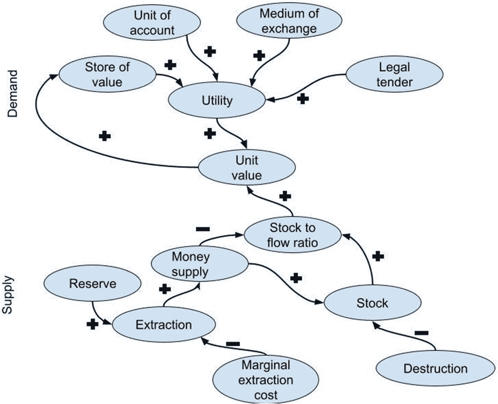

# 7. 常见嫌疑人？

如前所述，之前提出的中本聪身份似乎有待修正。我们绘制的画像进一步支持了这样的结论：此前的尝试尚未找到中本聪的真实身份。我们掌握的最有力的法医学证据是，中本聪是英国人，居住在伦敦。之前的嫌疑人无一符合这一事实。有必要将目光投向更广的范围。

因此，我们必须想办法扩大搜索范围。最好的办法是再次审视中本聪本人撰写的原始资料。正如我们所见，他并未明确提及自己或任何合作者，但比特币白皮书引用了其他几位研究人员的成果。在学术界，引用导师、合作者，尤其是引用自己的成果，是非常普遍的做法。这为搜索开辟了一条激动人心的新途径：中本聪是否会引用自己？即使他没有，我们也能从中获得关于他所属的社交和学术圈子的重要线索。那么，让我们回到比特币白皮书的参考文献列表。

## 重新绘制嫌疑人名单

比特币白皮书中列出了八篇参考文献，涉及总共十位不同的人物。在附录中，我详细分析了这些人的身份，以及他们在多大程度上符合中本聪的特征。这份引用列表是我们寻找中本聪众多线索之一。从白皮书中我们可以推断，他受亚当·拜克的`Hashcash`和戴维的`B-money`启发最大。这些理念可能唯一被详细讨论过的地方就是密码朋克邮件列表，拜克和戴维在 20 世纪 90 年代末在那里宣布了它们。历史上的中本聪很有可能曾是那个社区的成员，并从中了解了`Hashcash`和`B-money`。由于该列表包含数千名普遍对密码学感兴趣的成员，他们并非都对虚拟货币这一相对小众的领域感兴趣。因此，我们应该将范围缩小到那些积极参与`Hashcash`和`B-money`相关讨论的成员。中本聪很可能就是这样做的。

`Hashcash`于 1997 年春天被提交到该列表。此后，它被讨论过几次。`B-money`于 1998 年秋天在该邮件列表中被提出，随后也被讨论过几次。总而言之，这两个提议都没有引起太多关注，但仍有相当数量的人做出了回应。总共有 19 个可识别的个人与戴维和拜克进行了互动，就这两个想法提供反馈并提出问题。

这样一来，我们就得到了一个 29 人的名单，理论上他们每个人都可能是历史上的中本聪。在表 7-1 中，我们可以看到他们与我们构建的画像标准的匹配程度。`M`表示我们有证据表明此人符合该标准。`D`表示我们有证据表明此人偏离且不符合标准，而`U`表示根据我所能找到的证据，情况未知。

**表 7-1** 潜在历史人物与中本聪的匹配度分析

| --- |
|  一张用于分析潜在历史人物与中本聪匹配度的表格，以 14 列和 29 行呈现数据。表中填充`M`的区块为深色阴影，填充`U`的为浅色阴影，填充`D`的为无阴影。 |

快速浏览表格可以发现，所有人都是男性，并且很可能都受过大学教育。但除此之外，有些人在某些方面匹配，而另一些人则在其他方面匹配。没有任何一项画像标准是某个人独有的。

我们还可以看到，几乎每个人都至少有少数几项标准不符合画像，因此不可能成为中本聪背后的历史人物。但我们也看到，有一个人脱颖而出，匹配了画像的所有部分。这个人就是亚当·拜克。这并不一定意味着亚当·拜克就是中本聪。他是唯一一个符合画像所有关键标准的人，因此应该对其进行更详细的审视。

## 聚焦亚当·拜克

和大多数密码朋克一样，他是一个注重隐私的人，不常分享自己的信息，但我们可以从各种来源拼凑出最核心的事实。他于 1970 年出生在伦敦，并在数学、物理和经济学方面完成了 A-level 考试。他的英语是地道的英式英语，文章也无可挑剔。他于 1995 年在埃克塞特大学获得计算机科学博士学位，研究方向是分布式计算。其博士论文的代码是用`C++`编写的。他曾是一名密码朋克，是密码学邮件列表非常活跃的贡献者，并且对虚拟货币特别感兴趣。

关于识别中本聪，这并非拜克第一次被评估为中本聪候选人：多米尼克·弗里斯比曾考虑过拜克可能是中本聪的可能性，但后来排除了这个想法，因为拜克向他承认自己更喜欢`C`而不是`C++`。弗里斯比没有注意到拜克在博士期间广泛使用了`C++`，并且在比特币开发期间他很可能也在使用这种语言。他还从拜克在 Bitcoin Talk 上的第一个帖子中得出结论，认为拜克当时才刚开始了解比特币。这是一个令人震惊的推测。其他一些人，比如 YouTube 博主 Barely Sociable（他也认定亚当·拜克就是中本聪），则正确地指出了拜克从一开始就对细节有着难以置信的深入了解。他立即开始贡献关于改进的详细想法。

让我们看看其他证据，以帮助我们评估拜克是否就是中本聪。其中大部分证据由上述的 YouTube 博主 Barely Sociable 提供，他做了令人难以置信的取证调查工作。我们很快就会回到这个话题。

### 拜克在比特币领域的缺席

首先要注意的是，拜克在早期所有关于比特币的讨论中都是缺席的。直到 2013 年他首次出现在 Bitcoin Talk 上，他才开始涉足比特币。而这是一个自 1997 年以来就一直像追寻比特币这样的虚拟货币的人。想想他在 1997 年 4 月的一条回复，他在密码学邮件列表中呼吁建立一种电子现金系统：

> 这样一个系统的密码学要求应该是：
>
> 1.  匿名（保护隐私，付款人和收款人匿名）
> 2.  分布式（使其难以被关闭）
> 3.  具有一定内在稀缺性
> 4.  无需信任任何一个人
> 5.  最好支持离线（纯软件很难实现）
> 6.  可重复使用

这几乎就是比特币在发布前十几年的路线图，然而拜克在将近五年的时间里没有对比特币表现出任何可验证的兴趣。当然，人们的兴趣会随时间改变，所以这本身并不能证明什么。但似乎可以稳妥地得出结论：拜克至少拥有构建比特币的动机。

### 拜克与中本聪的互动

另一个奇怪的事实是，中本聪与密码学虚拟货币领域的所有关键人物都进行过通信，包括哈尔·芬尼、戴维和尼克·萨博，唯独没有亚当·拜克。据称中本聪与拜克有过交流，但当我们仔细审视证据时，似乎并不充分。我们是通过两个较晚出现的来源了解到这种互动的。第一个是戴维公开的一封电子邮件，中本聪在其中提到了与拜克的交流。该邮件日期为 2008 年 8 月 22 日，中本聪在给戴维的信中写道：“亚当·拜克（hashcash.org）注意到了相似之处，并将我引荐到了你的网站。”另一个来源是 2020 年 Cointelegraph 对拜克的一次采访，他在采访中提到与中本聪的邮件往来，时间大致与中本聪和戴维的邮件通信时间相同。但与戴维不同的是，他拒绝分享这些邮件，因此无法核实这一说法。这些邮件和采访都是远离比特币创建时间的二手证据。因此，没有确凿的证据表明拜克曾与中本聪有过交流。

### 其他证据

其他证据也与亚当·拜克就是中本聪的说法相符。例如，他在句号后使用双空格，这与中本聪的书写习惯相似。当然，他在这方面并非独一无二，因为这是在上世纪计算机普及之前，那些在打字机上开始写作的人被教导的一种写作风格。他的语言符合英式英语，同样流利，写作中很少有错误。

另一个需要考虑的因素是，他拥有中本聪所展现出的独特技能组合。同时精通分布式计算、密码学和虚拟货币的人并不常见。这是一个相对罕见的技能组合，特别是了解点对点计算，而这正是拜克的专业领域。

YouTube 博主 Barely Sociable 也指出，亚当·拜克在 2005 年之前一直在申请专利，之后便停止了，直到 2011 年中本聪从比特币项目中隐退后才再次开始申请。在此期间，他也没有撰写学术论文。从 2007 年到 2010 年，他没有参与邮件列表的讨论。`Hashcash`网站似乎也在 2004 年停止了更新，因为此后没有列出任何媒体报道。拜克在 2012 年开始更新关于比特币的维基百科页面，但直到 2013 年才真正参与其中。在推特上，他密切关注着关于维基解密使用比特币的讨论。2013 年，当他加入 Bitcoin Talk 论坛时，他提及了一个在 2010 年修复的、并不广为人知的漏洞，该漏洞曾允许中本聪挖掘第二批无法追溯到他本人的比特币。

如果你对比亚当·拜克的网站和比特币网站的第一个版本，你会发现它们在缺乏样式设计方面很相似。但这同样也是标准的密码朋克风格。

所有这些都只是指向拜克的间接证据。其中每一条都可以被单独解释清楚。重要的是，我们在此已经表明，在一份潜在的嫌疑人名单中，亚当·拜克是唯一一个完全符合我们为中本聪构建的侧写画像的所有方面的人。他具备成为比特币发明者的技能和动机。当然，这并不能证明任何确凿无疑的事情，但“如果它看起来像鸭子，叫起来也像鸭子……”

### 然而，话说回来……

亚当·拜克坚称他与中本聪有过电子邮件往来，但出于“网络礼仪”不会公开这些邮件。他认为未经事先同意就公开私人通信是不妥当的。另一个他在 2013 年 5 月 14 日在 Bitcoin Talk 上提供的耐人寻味的线索，是 1999 年在一个密码朋克邮件主题帖中的一个匿名评论。他暗示这条回复可能是中本聪所写。在这条回复中，这位匿名回复者提出了一个电子现金系统，通过一个公共数据库解决了双重支付问题，该数据库与`Hashcash`和`B-money`结合实现分布式。这个建议听起来确实很像比特币的早期构想。作者甚至也在句号后使用了双空格。他似乎很喜欢拜克和戴伟。在 1998 年 1 月 9 日的一条回复中，他主张像蒂莫西·梅、保罗·布拉德利和其他一些人应该离开这个邮件列表：“这将会留下像亚当·拜克、比尔·斯图尔特、戴伟和其他那些仍然相信密码学可以为我们的自由做出巨大贡献的优秀思想家。” 他也展示了相对深厚的密码学知识。

那么，这会是中本聪吗？在其他回复中，“匿名者”似乎更具对抗性，并且他使用的是美式英语。如果他真是中本聪，为什么他会在 2008 年说是拜克指引他去了解戴伟的工作？如果他早在 1999 年就知道了，为什么在给戴伟的邮件中会提到一个完全不正确的年份作为引用出处？或者说，这实际上正是那条帖子，将拜克引向了正确道路，从而以中本聪的身份创造了比特币？

## 寻找中本聪的结论

与历史上的任何事物一样，很难确切知道中本聪背后的人是谁。本次调查的目的是审视现有证据，并查明是否有可能识别出潜在的嫌疑人。我们首先审视证据，构建一个我们确定或高度可能成立的侧写画像。然后，我们开始寻找可能与这幅画像匹配的潜在嫌疑人。这是通过查看中本聪的比特币白皮书的引用来进行的，因为学者们倾向于引用自己的研究成果。接着，我们研究了那些就构成比特币白皮书基础的两个核心思想——`Hashcash`和`B-money`——展开过对话的人的证据。这是通过梳理密码朋克邮件列表中所有关于这两个主题的讨论串，并列出所有回复这些讨论串的人来完成的。这产生了一份包含 29 人的名单，我们对他们进行了研究，以确定他们与侧写标准匹配的程度。除了亚当·拜克，没有人匹配超过 13 项标准中的 8 项。审阅额外的证据支持了他具备创造比特币的动机、机会和手段的观点。拜克否认这一点，正如我们所看到的，任何被指认为中本聪的人都有充分的理由这么做。当然，有可能其他人在这个高度专业化的领域没有留下其他可辨识的痕迹，而他就是中本聪。可能是 FBI、彼尔德伯格集团，或者仅仅是其他某个“匿名”天才在旁听对话、阅读研究论文。但这并不是最简单的解释。科学和历史的认知是通过遵循证据、接受最简单的解释来推进的，但我将把决定谁或什么创造了比特币的权利留给读者。我只希望能阐明我们相当大量的证据实际告诉了我们什么。

## 8. 货币

说比特币是货币似乎很直接，几乎是显而易见的。你可以用它兑换法定货币，查看你的账户余额，以及购买商品和服务。但由此开始，情况就变得模糊了，因为它与我们用来纳税和购买日用品的常规货币不同。人们所理解的“正常”货币，是所谓的法定货币（fiat currencies），例如美元、日元和欧元。*Fiat*这个词源自拉丁语，意为“可以这样做”或“让它做成”。这是《武加大译本》（即圣经的拉丁文译本）中使用的词语，更准确地说，是在《创世纪》的开篇，上帝说“要有光”（“Fiat lux”，《创世纪》1:3）时使用的。现代货币的运作方式与此类似，都是通过法令来生效，尽管并非完全由上帝认可，而是由民族国家认可，即它们印刷的货币具有价值。可以用类似的方式来理解法定货币：“让它有价值。”

比特币的运作方式则不同。没有神圣的政府或其他实体来认可其价值。因此，要理解比特币的意义，我们需要问：“货币是如何成为货币的？或者，什么是货币？”以及比特币在其中的位置何在？

## 货币的多样性

在深入探讨比特币是否属于货币这一问题之前，让我们先从一个比现代法定货币（这是一种相对近期且特殊的现象）更广阔的视角来看，什么是货币。首先，让我们考虑一些展现货币多样性的例子。

### 罗塞尔岛民

在巴布亚新几内亚路易西亚德群岛最东端的热带阳光下，坐落着一座与世隔绝的小岛，名为罗塞尔岛。岛上仅有数千居民，他们的语言与任何已知语言都无关联，且以难以翻译著称。居民几乎完全与世隔绝，与外界鲜有往来。罗塞尔岛的基本社会单位是居住在几个小村庄里的家庭。经济以自给农业为主，兼种少量经济作物。自 20 世纪 70 年代起在此工作了四十余年的人类学家约翰·利普，将经济领域划分为三个范畴：**家庭领域**、**商品领域**和**仪式交换领域**。

家庭领域的交换表现为亲属服务，因此无需通过礼物、物物交换或货币来维持互惠平衡。这与大多数文化相似——家庭成员互相帮助而不记账。例如，最常见的交换是园艺互助，对方以一顿饭作为酬劳。

商品领域涉及衣物、煤油、电池等物品。这类交换通过现金媒介进行，罗塞尔岛民通过在种植园劳动或销售经济作物来赚取现金。该领域由西方货币主导，但仅限与外界贸易的商品相关。因此，货币受到限制，只能用于购买进口商品。

仪式交换领域是岛上社会生活的主要领域，用于支付嫁妆、丧葬费用以及猪宴这一核心仪式。在该领域，支付使用的是当地特有的贝壳货币，称为`ndap`和`ke`。这两种货币源于两种不同的海贝，价值各异。

`ndap`价值最高，又细分为三个等级。最高等级极为罕见，现存可能不足一百枚。高等级略为常见，而低等级的数量则多得多。利普估计岛上总共只有两万枚`ndap`，平均每户 41 枚。

作为聘礼一部分的交换遵循复杂模式，需分多次支付不同等级的特定数量贝壳。同样，在猪宴上，猪的不同部位可用不同种类的`ndap`购买。最高等级的`ndap`过去仅用于最重要的交换，例如以人命抵偿谋杀受害者亲属。如今它们不再用于支付，但可作为贷款抵押品。

高等级`ndap`在仪式交换体系中扮演重要角色。这类贝壳通常作为第一笔聘礼支付，用以缔结婚约。也可用于购买猪宴上的猪主体部位、房屋或独木舟。低等级`ndap`流通更广泛，但不如西方货币那般自由。它们常用于猪宴上支付猪的多个部位，以及其他所有交换活动。

`ke`是一串由十枚贝壳组成的货币，在太平洋地区常见，现存数量更少。利普估计总共仅 2500 串。其价值低于`ndap`，并有自己的等级分类系统来标示价值。`ke`与低等级`ndap`之间存在兑换率，建立了这两种货币之间的交叉关系。

因此，罗塞尔岛的贝壳货币用于购买岛民传统所需的商品和服务，如婚姻、葬礼、盛宴以及建造独木舟和房屋。西方货币在这一领域无法使用。西方货币仅用于从外界获取的商品，且仅限此用途。在家庭领域，亲属关系构成了交换服务的框架，例如园艺互助及其他家务劳动。

### 香烟

1946 年 1 月，《萨斯喀彻温报》援引一位归来的加拿大飞行员的话说：“黑市活动正在扰乱欧洲大多数国家的经济，香烟正在取代国家货币成为法定货币。12 打鲜鸡蛋售价 100 支香烟，瑞典丝袜每双 35 支香烟。”二战结束后，由于食品短缺和经济普遍衰退，黑市应运而生。香烟在这些市场中作为一种替代支付方式被使用。这并非因为国家法定货币消失，而是由于通货膨胀严重。在德国，外汇兑换受到限制，导致香烟取代货币成为交换媒介。不吸烟的人也会使用香烟，使其价值超越了商品本身。

这并非特殊环境下产生的孤例。20 世纪 90 年代初的南斯拉夫内战中也发生过同样的情况，甚至在最近乌克兰战争中俄占赫尔松地区也有记载。香烟似乎总在战争期间作为货币反复出现。

但香烟在其他情境下似乎也扮演着货币的角色。在美国和英国的监狱中，囚犯无法使用货币，香烟长期以来一直充当囚犯之间交易商品和服务的替代货币——尽管最近它们已被更健康的方便面取代。

由此可见，在某些条件下，香烟之类的商品可以承担货币的职能。这通常发生在货币体系正常运作受到阻碍时：在监狱中，货币显然无法获得；在战后欧洲，要么是外汇兑换被刻意限制，要么是恶性通货膨胀导致不便。在现代战争中，当与外界交换受到限制时，香烟便取代了货币。因此，替代货币可以在不同时期、不同条件下应运而生。

### 积分

大约在 2009 年，丹麦零售商 Coop 重启了名为 Coop Plus 的会员计划。会员在这里获得的奖励是积分，而非当地货币丹麦克朗（笔者本人曾参与该计划的实施）。积分与克朗按固定汇率挂钩。在 Coop 商店购物时，会员可获得积分。这些积分可在线上商城使用，与克朗一同支付商品货款。

每年一次，会员账户中的全部积分余额可转换为商店购物金。积分将按汇率折算成克朗。顾客通过扫描会员卡即可访问包含这些资金的虚拟钱包。积分无法提取或购买，只有购物才能产生积分。因此，Coop 看似在为其会员铸造货币。但从会计角度而言，事实并非如此。实际上，积分被视为递延折扣，即对未来折扣的权益。

零售业提供奖励十分普遍。如今，几乎所有现代零售商都设有某种会员计划，会员可获得奖励。这些奖励通常是折扣或返利，但部分地区仍在使用积分。这类奖励通常仅限于同一家公司的商店，但更通用的奖励计划也早已存在。

### 货币的多面性

这些示例仅让我们初步领略了货币的多样性与多元性。我们可以看到，即便像罗塞尔岛民这样的小型社会，也能运用多种货币，服务于不同的经济领域。它们还可被用作贷款抵押品，并且不同货币之间存在着汇率。香烟作为替代性货币出现的例子告诉我们，不同类型的货币可能根据社会环境的变化而诞生或消失。相比之下，积分奖励计划的存在则表明，替代性货币在和平时期也能与通用货币和谐共存。

## 什么是货币？

上述例子表明，货币与非货币之间的界限并不清晰。关于货币的定义有很多。在其巨著《货币史》中，格林·戴维斯将货币定义为：“……一种被消费者和使用者普遍认可为有价值，并能在经济体系内用以交换商品的商品，它不必具备任何特定的属性，无论是国家强制规定的还是其他方面的，都能发挥其功能”（戴维斯，第 xxix 页）。这是厘清我们所谓“货币”内涵的一个良好起点。其他人对此有不同的定义，但对于本次探讨而言，我认为这一定义指出了关于货币的几个关键点：

- 它是一种商品。
- 它被普遍视为具有价值。
- 它可以用于交换商品和服务。

作为一种商品，意味着每一单位货币的实例与其他实例是相同的。这与艺术品不同，例如，评估每件艺术品的价值需要对其有更细致的评估。货币还需要人们认同它具有价值。仅仅一个人相信它有价值是不够的。另一方面，货币所需要的仅仅是人们相信它具有价值。任何可能被用于定义货币的事物，其本身并不具备内在的固有属性。最后一点涉及到货币的使用方式。仅仅是被普遍认为有价值还不够，比如时间或好天气；它还需要被用于交换。

### 货币的职能

在 1875 年出版的《货币与交换机制》一书中，英国经济学家威廉·斯坦利·杰文斯区分了货币的四种职能：交换媒介、价值公度、价值标准（或延期支付标准）以及价值储藏。

在其见解的基础上，现代经济学通常区分出货币的三个关键职能：交换媒介、记账单位，以及价值储藏（将价值标准职能归入其他两者之中）。货币必须至少满足这三个职能才能作为货币发挥作用。格林·戴维斯提到了十种不同的职能，所以这并非一门精确的科学。为简便起见，让我们关注大多数现代货币理论著作的共识，深入研究货币的三大关键职能。

### 交换媒介

交换媒介是指任何被普遍接受用于交换商品和服务的东西。我们之前看到诸如贝壳、香烟和积分这样的商品如何成为交换媒介。要履行这一职能，这种媒介应该能够用于交换多种不同的商品和服务，但不一定非得是全部。想想赌场筹码或游戏厅、自助洗衣店里的代币的例子。它们被用作交换媒介，但其适用的经济领域范围过于狭窄，因此不能说它们履行了货币的职能。积分奖励适用于零售商提供的全部商品，但仅限于该特定零售商。因此，交换媒介可以局限于特定领域，正如我们在罗塞尔岛上，西方货币仅被限制作为进口商品的交换媒介时所看到的那样。

纵观历史，不同的物品曾被用作交换媒介。尤其是商品一直被用于此目的。在全球范围内，牲畜曾经并且现在仍然是一种强大的交换媒介。历史上，在欧洲和西方世界也是如此，这在英语词汇中有所体现。术语 *pecuniary*，意为“与货币有关的或由货币构成的”，源自拉丁语 *pecuniarius*，而 *pecuniarius* 又源自拉丁语 *pecus*（牲畜）。牲畜历来被用作交换媒介，特别是用于交换诸如彩礼等价值较高的大件物品。虽然体积庞大，但它是一种相对方便的交换媒介，因为可以自行移动，但不太方便的地方在于它不易分割。

幸运的是，其他商品在交换较小的商品和服务时能更好地履行这一职能。盐是另一种通用且方便的交换媒介的例子，它也进入了我们的语言。英语单词 *salary*（薪水）同样源自拉丁词 *salarium*，而 *salarium* 又来自单词 *sal*，意为“盐”。在罗马时代，盐是一种稀缺且有价值的商品。与牲畜相比，它易于分割，因此更适合作为较低价值商品和服务的交换媒介。

### 记账单位

记账单位是对商品或服务价值的一种标准数值衡量。我们看到了香烟如何成为支付鸡蛋或长袜的记账单位。同样地，罗塞尔岛上的 ndap 贝壳规定了需要为一位新娘支付多少。因此，它可用于比较两种不同商品或商品与服务的相对价值。记账单位对于延期支付也是必要的，正如我们在积分作为延期折扣的例子中所见。这并不意味着付款必须以这个单位进行。付款可以用其他单位或构成特定数量的商品来完成。

这种情况可能会发生，例如，你去跳蚤市场发现了一张漂亮的橡木桌子。经过恰当的讨价还价，你与卖家商定它值 100 美元。不幸的是，你没有那么多现金。但你刚从另一个摊位买了一个卖家感兴趣的复古台灯。你们商定它值 40 美元。你还有上周去温哥华旅行时剩下的 50 加元。按汇率折算成美元大约是 35 美元。幸运的是，你的妻子有剩余的 25 美元现金，她借给你直到你回家。

请注意，在这次交易中，你没有提供任何以该记账单位计价的货币。记账单位是美元，但台灯是一种商品，加元是另一种货币，剩余的部分是通过债务提供的。单独来看，这些都不足以购买那张橡木桌，但由于有了一个共同的记账单位，交易仍然得以促成。

基本上，任何东西都可以用作记账单位，只要它是可测量的。我们可以想象用长度、热量、电压或压力作为记账单位，但这在实践中难以测量。历史上，两种度量方式占主导地位：计数和称重。在这两者中，计数更为通用。这被用于货贝、海狸皮等物品。当单位是可互换的或质量非常相似时，这种方式效果很好。例如，这对钻石来说效果不佳。尽管钻石被普遍视为有价值，但它们必须逐一评估。

称重在历史上更为占主导地位，至少在西欧是如此。英镑（British pound）源自一磅（pound）标准纯银的价值。直到后来，这被转换成代表一个（现在抽象的）英镑的硬币。拉丁语“libra”，即法郎（livre）的来源，同样是一个重量单位。称重面临的挑战以及它为何未能作为首选的记账单位持续下去，在于需要秤来测量。这更容易引发欺诈，因为秤可以被人为篡改。同时，称重的物质本身也可能被篡改。如果使用像银这样的贵金属进行支付，它可能会与非贵金属如锡混合。

### 价值储存

货币主要功能的最后一项是作为价值储存手段，这或许是最关键也最具争议的。理想情况下，货币应发挥价值储存的功能，从而使消费能够推迟到未来。一些经济学家认为，货币作为价值储存手段的功能是最重要的。

这个概念很直白。如果某人赚了`100 美元`并决定存一年，那么一年后这笔钱应该仍然值`100 美元`。不幸的是，情况很少如此。通常这`100 美元`可能只值一个零头，比如说`90 美元`。这是由于通货膨胀造成的。通胀削弱了货币作为价值储存手段的功能。如果你原本打定主意要买一条特别好看的裤子，这可就糟了。另一方面，如果你借了`1000 美元`，现在你只需偿还`900 美元`，从而赚了`100 美元`。

相反的情况也可能发生：这`100 美元`可能会增值，比如说变成`110 美元`。如果你想要储蓄并推迟消费，这更有吸引力，但如果你有债务则不然。如果你借了`1000 美元`，现在你就必须偿还`1100 美元`。

由此可见，货币作为价值储存手段的功能对经济有着重要影响。极高的通货膨胀，即当货币作为价值储存手段的表现特别糟糕时，会对经济造成严重破坏。这时，像香烟或黄金这样的替代货币或商品就会流行起来。但还有一点需要记住，因为它以后会很重要，那就是价值储存功能与债务紧密相连。

如果你持有大量以某种货币计价的债务，你会希望它作为一种糟糕的价值储存手段。另一方面，如果你是债权人或储蓄者，你会希望它尽可能成为一种良好的价值储存手段。历史上，像贵金属这类商品，在不作为货币使用的情况下，也曾是并且现在仍然是重要的价值储存手段。这与它们以重量为计量单位的问题有关。

对于什么构成良好的价值储存手段，并没有精确的公式。我们稍后会回到这个话题，但目前我们可以强调，最重要的品质是耐久性。任何会快速消失的商品，按理说都会是一种糟糕的价值储存手段。这很可能也是为什么在许多文化中，黄金和贵金属被用作价值储存手段的原因。即使经过数百万年，黄金也不会失去光泽。铁腐蚀得相对较快，铜也一样。贝壳和其他海贝也具有同样的品质；它们不会消失，这可能也是它们能在世界各地长久成功的原因。

## 货币与交换的历史

在现代世界，我们走到杂货店购买晚餐食材，或到咖啡馆点一杯燕麦奶肉桂拿铁，又或者在线支付房租，这些经历可能让我们觉得货币的存在是不言而喻的。它几乎像衣服和音乐一样，已成为人类生存中不可或缺的一部分。然而，从历史角度看，情况远非如此。我们已经看到了货币的多样性，但让我们追溯一下人类是如何走到如今货币主导我们生活的地步的。

### 交换

首先，我们需要退一步，思考货币所要解决的基本问题，那就是交换。与并非直系后代的同类交换食物、物品和其他服务的能力并非人类独有。蚂蚁系统地进行着交换，蜜蜂也是如此。灵长类动物也有一定的交换概念，但当人类从灵长类动物中进化分化出来后，这种能力占据了中心位置。正如认知科学家迈克尔·托马塞洛所论证的，人类在共同狩猎和分享战利品的能力上是独一无二的。在《人类思维的自然史》一书中，他提出，**海德堡人**是两百万年前最早进行合作狩猎的人种。合作狩猎的性质必然要求交换。每个参与狩猎的人，以其参与行为换取一份猎物。海德堡人猎杀的猎物（如大型野生动物）就证明了这一点。除非他们以群体协作，否则仅凭他们的工具是无法杀死这些动物的。

现代人类学奠基人之一马塞尔·莫斯在其 1950 年的经典论文《礼物：古式社会中交换的形式与理由》中，证明了交换能力成为人类文明支柱这一事实。在这部著作中，他研究了物品交换如何构建人类群体的凝聚力。他通过来自全球各地（当代和历史上）社会的令人印象深刻的大量证据，论证了交换并非新概念，而是深深植根于史前时期。物品在个人和群体之间流动最常见的基本形式就是礼物。在所有社会中，这都是物品在个人和群体间流动的一种常见方式。

礼物交换可以构成礼物经济的基础，这在另一位人类学传奇人物、莫斯的同时代人布罗尼斯瓦夫·马林诺夫斯基的研究中首次得到证实。他在大约同一时期记录了特罗布里恩群岛上礼物如何成为经济的基础。礼物通过互惠（即期望回报）来运作。莫斯是第一个论证给予行为本身就已蕴含回报承诺的人。在人类社会中，礼物从来都不是免费的。

### 以物易物

根据大多数对货币历史的论述，第一阶段是以物易物，它可以被视为建立在互惠关系（如礼物经济）基础上的一种更集中、更直接的交换形式。两者的区别在于，礼物的馈赠在互惠的性质和时间上不那么明确。而在以物易物中，交换的精确性质和时间都会被切实执行。

不幸的是，以物易物存在几个结构性问题。首先是缺乏共同的价值标准。如果有人想用杏子换刀，那么很难直接确定杏子与刀之间的价值关系。你也许可以算出，一把刀值 120 个杏子，这在这个特定案例中会使交易变得直接，但这仅仅是两种产品；茶叶、农活或牛奶呢？每一对产品组合都需要一个交换比率才能顺畅且可预测地运作。随着市场上交易的商品和服务种类增加，这一点很快就变得不可行。

下一个挑战有时被称为“需求的双重巧合”问题。如果我有一个果园，且有多余的杏子想要交换出去，同时我需要一把刀，那么我就需要找到一个有多余的刀并且想要杏子的人。这种双重巧合是交易得以发生的必要条件。这也许并非不可能，但可能性不大，尤其是在较小的社会中。

最后一个问题是如何储存价值。到了收获季节，我的果园可能杏子丰收，我可以用它们来交换所需物品，但它们很快就会腐烂。在收获季节之外，我就没有价值之物可以用来交易，这很不方便。所有易腐烂的商品（主要是食物）都存在这种情况。刀则经久耐用，因此更适合用于以物易物。

这些关于以物易物的事实限制了它作为经济体系支柱的效用。这就是为什么以物易物体系常常会发展出一种改进模式，即使用几种优选交换物。这类优选交换物的例子包括我们已经见过的牛和盐，此外，小麦、大米、糖和毯子也常被用作优选交换物。然后，这些物品可以作为其他商品的计价参考。也许 100 个杏子值一条毯子，而一把刀值五条毯子。这样我就知道大概要付多少了。有了几种优选交换物，记住市场价格就变得可控，这最大限度地减少了需求的双重巧合和价值标准的问题。现在，我可以推着一车杏子去市场，把它们换成毯子，然后找到某人用毯子换一把刀。即使刀贩子不想要我的杏子，这个交易也能成功；同时它也解决了我的价值储存问题，因为多余的毯子可以存放整个冬天。

### 原始货币

优选交换物离所谓的原始货币仅有一步之遥。关于原始货币究竟是什么，有各种不同的看法。在《货币的起源》一书中，菲利普·格里尔森认为它是“所有非铸币或现代纸币（作为铸币衍生物）的货币。”这告诉我们要基于我们现代对货币（即铸币或纸币）的概念去探寻，但回避了货币究竟是什么这个根本问题。保罗·艾因齐格在其 1966 年出版的《原始货币的民族学、历史学及经济学视角》一书中，提供了一个更具操作性的概念：“一种符合某种合理程度统一标准的单位或物件，用于在相关社区中进行计算或进行大部分支付。”这句话指出了几个关键属性，例如物件的统一性，以及它们在较大社区中作为记账单位和交换媒介的功能。现在我们开始看到某种初步具备了货币三大职能的事物。许多不同种类的物品都曾充当过原始货币。

历史上，商品曾被广泛使用。我们已经看到牛和盐是如何被使用的，但谷物的作用更为重要。美索不达米亚文化率先发展出了会计，其目的就是为了记录存入和提取自仓库的谷物数量。在埃及，谷物在数千年间都是经济的基础，并为修建金字塔等宏伟建筑提供了便利。这些商品之所以被使用，是因为它们在人们生活中普遍存在且稳定。

这些商品本身都具有使用价值。牛、盐和谷物都可以食用。其他类型的原始货币则不具备这种特性。例如，随处可见的货贝（cowries）没有直接用途，完全是象征性的。从史前时代起，太平洋和印度洋周边地区的人们就开始使用它。它取自生活在这些地区，尤其是马尔代夫群岛附近的一种软体动物的贝壳。甚至在古代中国，货贝也被使用，以至于中文里表示“钱”的象形文字就是一个贝壳。

金属从石器时代晚期开始被使用，并成为工具制造和武器的核心材料。这促进了它们作为货币的使用。例如，中国人在石器时代晚期制作了金属仿制的货贝。工具和武器也众所周知被用作货币。例如，凯撒曾提到，他所遇到的布立吞人（Britons）就用剑作为货币。金属被制成各种形状和形式，如棒状、线圈状，甚至是不规则的小块。

### 银行业

货币历史上的下一个重大转变是银行业的出现。当货币变得具有表征性时（正如古代美索不达米亚在楔形文字泥板上所记载的那样），一种专门的官僚体系也随之发展起来。这促进了银行业的发展。事实上，正如人类学家兼“占领华尔街”活动组织者大卫·格雷伯在其著作《债：第一个 5000 年》中所论证的那样，债务与货币的纠缠之深，以至于难以区分。它们同时出现，格雷伯主张“一部债务史（……）因而必然是货币史。”这种观点很有见地，因为货币极大地放大了运用债务的能力。甚至可以说，文字正是源于记录债务的需求。来自乌鲁克城（Uruk）的最早文本（约公元前 3100 年）就是牲畜清单。

正是在这样的背景下，古代近东地区发展出了银行业。最古老的巴比伦私人银行家族是匿名的，但我们知道一个名为“埃吉比家族”（Grandsons of Egibi）的机构，其总部位于巴比伦。他们提供一系列银行服务。他们发放以各种证券为抵押的贷款，并接受存款，客户可以通过支票部分或全额提取存款。巴比伦的银行还为基础设施建设（如灌溉渠）提供融资，并提供租赁安排。

然而，正是在埃及，所谓的“转账银行”体系（giro-banking system）得到了完善。在埃及，谷物已成为主要的货币形式，而国家粮仓实际上充当了银行的角色，谷物可以随时存入和提取。这里发展出了一套体系，存款所有者可以通过书面指令，将其存款的一部分作为税款转给国王。这个体系在埃及民众中逐渐普及，成为了一种结算债务的方式，由此诞生了已知的第一个转账银行实例。

在公元前三千纪早期，古代近东地区就已记载了大部分银行功能。奇怪的是，这比使用铸币和金属作为货币早了上千年；而在西方，情况则恰恰相反，铸币比最早的银行早出现了上千年。因此，我们无法看出铸币与银行功能之间存在单向的关系。那么，让我们接着来谈一谈铸币的历史。

### 硬币

现代关于货币的概念与硬币密切相关，即由某个权威铸造和授权发行的金属片。硬币的发明可以追溯到中国。在此之前，中国已经使用金属仿制的贝壳作为货币。中国硬币由价值不高的贱金属制成，因此仅用于小额交易。有趣的是，`cash` 这个词正是源于这种由开辟了通往中国航线的葡萄牙人带到欧洲的中国货币。在泰米尔语中，这种货币被称为 `cash`。

在欧洲，硬币走上了一条不同的道路，因为它们是用金银等贵金属铸造的。西方硬币的发明发生在小亚细亚的吕底亚和爱奥尼亚希腊地区。硬币在当时当地出现有许多促成因素，但其中关键的一点是，该地区的河流富含金银矿藏。大约在同一时期，吕底亚和爱奥尼亚的城市是当时最富有的城邦，它们位于伟大近东帝国的边缘并与这些帝国进行贸易。硬币最初在公元前六世纪中期以粗糙的形态出现，到了公元前五世纪，则演变为标准化且精美的艺术品。

从那时起，世界便一往无前。硬币成为了货币的主导形式，因为它很好地履行了货币的三大职能。它易于作为交换媒介使用。特别是贵金属货币，由于其重量和体积可控，既可以用于高价值购买，也适用于低价值交易。货币的标准化以及由权威机构为硬币背书（即铸币）的范式，促进了标准化，使硬币易于用作记账单位。由于使用了贵金属，硬币也便于作为价值储藏手段。贵金属具有稀缺且分布广泛的特点。只要其开采量没有突然增加，其价值就会保持稳定，而历史也的确如此。

### 货币的发明

正如我们所见，货币的基本功能是促进交换。历史上，这一功能是通过其他方式实现的，如礼物馈赠和物物交换。经由偏好交换品的路径，原始货币的观念胜出了。它们通常基于具有一定效用的商品，但纯粹象征性或代表性的物品，如贝壳和金属，也变得普遍。这些原始货币形式成为了银行服务中使用的纯粹代表性货币的基础。在古埃及，他们有一个分类账，记录谁拥有什么，并允许在账户之间进行交易，而无需任何实物交换。

最终，这导致了非常适合商业活动的贵金属硬币的发明。需要强调的是，这些不同类型的交换方式之间并非单向发展，也并非相互排斥。物物交换可以与货币体系并存并用。整个体系也是动态的，因为当货币体系崩溃时，社会可能会退回到物物交换或原始货币状态。虽然货币历史存在不同阶段，但更恰当的做法是谈论“阶段”，并关注具体的货币实例如何在特定的历史背景下履行货币的基本职能。因此，让我们更仔细地审视货币的动态变化。

## 货币的动态变化

货币是一种难以捉摸且变化无常的对象。它似乎总在流动。不同的媒介被用作货币，其价值也起伏不定。从历史的角度来看，稳定期是例外而非常态。这并不意味着每个与货币相关的事件都是全新的、不可理解的。我们有可能辨别出影响货币动态变化的一些关键因素。

### 货币的关键因素

理解货币动态变化的关键因素有四个：货币的标准、铸币、法定货币以及供求关系。

#### 标准

虽然货币可以基于像谷物这类具有一定效用的商品，但它也可以是完全象征性的，比如现代货币或那些除了作为货币功能外毫无用处的货贝。最成功的货币类型是贵金属硬币。在古希腊和古罗马时代，主要使用白银作为制造硬币的媒介（而波斯人则偏爱黄金）。因此，白银是这类货币的标准。设计可以改变，但最终的价值来源于白银本身。这被称为银本位制。标准就是货币价值所锚定的对象，也就是货币价值的最终来源。如果这个锚定物的价格发生变化——例如当银矿开采突然产生大量白银时——基于银本位的货币价值就会受到影响。

近来，金本位制更为成功。金本位制从 19 世纪 70 年代到 20 世纪 20 年代，以及二战后直到 1971 年，曾是世界性的标准。在金本位制下，货币与黄金价值挂钩，这使得货币价值清晰透明。所有货币都可以兑换成黄金。并非只有实物商品才能作为标准。金本位制崩溃后，美元取代其位置，成为国际贸易的标准。其他货币同样可以充当这种标准储备货币，作为安全的价值储存手段。

当一种标准在国际上确立，如金本位、银本位或美元本位，就会为国际贸易带来稳定，因为价格不会剧烈波动。其结果是，由于商品价格更具可预测性，投资或储存财富变得更容易。

#### 铸币

对于任何类型的货币而言，一个关键问题是允许谁来铸造它。如果允许任何人自行制造货币，货币体系很快就会崩溃。历史上，铸币厂会加盖印章或采用其他机制来证明硬币是经授权且合格的。这个印章向人们证明这确实是一枚真币。锯齿边缘的发明则确保了硬币不会被切割。铸币技术的多项改进都提升了硬币的实用性。

在民族国家成为主要社会组织形式并取得成功后，铸造货币的权力便受到这些国家政府的严密控制。他们对铸币权实行垄断。奇怪的是，美国在历史上很晚才实行这种垄断。直到 18 世纪，美国各地仍盛行地方性货币。它们由当地银行发行，人们旅行时不得不兑换当地货币。单一货币带来了拥有共同交换媒介的便利，也使得垄断铸币权成为必要。由于货币体系支撑着整个经济，因此规范铸币的法律及其执行往往非常严厉。

许多富有创造力的虚拟货币爱好者都感受到了这一点。我们看到了自由美元以及其他类似的可被视为替代货币的计划是如何被打击的。事实上，这种特殊的动态很可能就是中本聪选择使用笔名写作的原因。

加密货币爱好者们很快便注意到，这种特权伴随着巨大的责任，他们认为现代国家并未妥善处理这一责任，因为政府无差别地印钞导致了通货膨胀。但这是另一个由于民族国家控制法定货币铸造权而引发的问题。如果铸币权完全缺乏控制，将导致人们对货币普遍失去信任，并导致货币贬值。

### 法定货币

或许最重要的因素是由法定货币定义的。法定货币是法院有义务承认的支付形式。每个司法管辖区都会定义自己的法定货币。在大多数现代国家，它都是法定纸币。法定货币不仅指定了货币种类，还指定了可用于支付的特定纸币和硬币类型。有时，某种特定的纸币或硬币会退出流通，从而变得一文不值。有时，整个被承认为法定货币的货币体系也会发生转换。这种情况近年来在欧洲频繁发生，许多国家都采用了新的欧元货币。例如，在德国，德国马克不再是法定货币，欧元成为了新的货币。

法定货币问题与司法管辖权问题息息相关。由于当今的民族国家是主权国家，这些国家的政府定义了什么是法定货币。截至撰写本文时，比特币仅在萨尔瓦多和中非共和国被承认为法定货币。这些都是小国，很难说这对比特币产生了什么影响。尽管如此，如果像欧盟或美国这样更大的司法管辖区接受比特币作为法定货币，这将极大地提升比特币的实用性。

### 供给与需求

在 16 世纪，西班牙神学家马丁·德·阿斯皮尔奎塔观察到，商品的价格会因其稀缺性而发生变化。他是最早提出供求定律的人。该定律指出，在自由市场上，交易商品的价格会稳定在需求量等于供给量的水平。其结果是，如果需求或供给任何一方发生变化，就会影响商品的价格。如果需求增加而供给稳定，价格就会上涨。反之，如果供给增加而需求保持不变，价格就会下跌。

这种对价格动态的观察构成了现代经济学的基本定律之一。这本身就很有趣，但阿斯皮尔奎塔意识到的是，货币本身也受供求定律的支配。货币本身就是一种商品。如果货币供应量增加而需求保持不变，货币的价值就会下降。这就是为什么尤其是银本位和金本位在历史上如此成功。贵金属与贱金属不同，具有天然的稀缺性，从而限制了其供应量。货币的供应只能根据开采出的贵金属数量来确定。

赛费迪安·阿莫斯解释了这种动态机制是如何相对于那些曾作为货币标准的金属运作的。在贵金属中，金是地壳中最稀缺的金属，这或许并不令人意外。银也很稀缺，但程度稍逊。铜则更为常见，但仍然稀缺。这与这些金属的相对价值相对应，这一点也可以从它们在奥运会等赛事中的使用看出——金、银、铜牌分别颁发给第一、二、三名。阿莫斯指出，这背后的真正原因是存量-流量比率，即产量相对于全球存量的比率。他指出，黄金的开采量惊人地稳定，至少一百年来一直维持在存量的 2%左右。白银的比率大约为 10-15%。这意味着黄金的存量-流量比率约为 60，因为需要 60 年的产量才能匹配当前的存量。白银的比率是 5，而铜的比率则小于 1。

反过来，存量-流量比率也解释了为什么黄金作为货币标准表现如此出色，而白银则稍逊一筹。当白银的开采量增加时，其价值就会下降。这也解释了为什么中国使用铁来铸币，确保其钱币始终只具有足以用于小额购物的价值。

### 货币如何变得有价值

现在我们更接近于理解货币的动态机制以及货币价值如何随其他因素变化。这一点如图 8-1 所示。

一张示意图展示了价值储藏、记账单位、交换媒介、法定货币、效用和单位价值的需求，这些需求与供给方面的存量-流量比率、存量、销毁、货币供应、储备、开采和边际开采成本相连。

**图 8-1** *货币的动态机制*

首先，关于如何解读该图的一点说明。箭头表示影响方向。加号表示源变量和目标变量同向变动，即当源变量上升时，目标变量也上升。反之，当源变量下降时，目标变量也下降。减号表示源变量和目标变量之间存在反向关系。如果源变量下降，目标变量上升，反之亦然。特别值得关注的是环路。一个全部由加号组成的环路是增强环路，而一个同时包含加号和减号的环路则是平衡环路。

不应将本图视为全面的，因为还有许多其他经济因素，如流通速度、时间价值、利率、发行方的可信度等，也对货币的动态机制有显著影响。相反，本图旨在突出历史上一直很重要并将继续重要的几个关键因素。

图的中心也是所有货币关注的焦点：单个货币单位的价值。货币价值的不利变化可能是由于通货膨胀或贬值造成的。与此同时，有利的变化可能是由于通货紧缩造成的。很明显，如果一个单位具有高价值或正在升值，那么它就是一种良好的价值储藏手段，这会产生一个增强环路。这是所有资产泡沫背后的动态机制。我们最可能从房地产市场认识到这一点。当房价上涨时，它们被视为良好的投资或价值储藏手段，于是更多人购买房地产，从而增加了需求和价格。这可以被视为一个增强环路，直到泡沫破裂。届时房地产价值下跌，它不再是一种良好的价值储藏手段，导致价格进一步下跌。房地产的基本效用，即提供住所，构成了其价格不会跌破的底线。

图的上半部分捕捉了货币的需求侧因素，下半部分则捕捉了供给侧。货币的需求源于其效用。请记住，从物物交换到偏好物物交换再到原始货币的过渡，是经过那些因其潜在消费性而具有效用的商品，例如牛、盐和谷物。当这些商品开始被用作货币时，它们就被赋予了三大关键货币功能，从而增强了其效用。这个过程一直持续到现代货币出现，其所有效用都源于货币功能，而非基础商品的效用。

一些例子，比如黄金，可能作为价值储藏手段非常出色，但作为记账单位，尤其是作为交换媒介却不实用。将其铸造成金币增强了这些功能。现在作为硬币，它们是可数的、易于分割的，并且足够小巧，便于实际购买。中国的铁币例子则展示了一个相反的案例。它们同样有助于实现这三种功能，但由于铁的价值不高，进行更大额的购买时必须使用更大量的铁币。因此，中国硬币始终局限于小众市场，仅用于小额交易。

这就引出了下半部分：供给端。我们看到了存流量比对于解释贵金属价值的关键作用。回想一下，流量是指一年的产量，而存量是指现有的总库存。如果货币供给相对于存量较高，那么存流量比就低。如果货币供给像白银那样因开采量增加而上升，存流量比就会下降，从而影响单位价值。我们看到了贱金属的存流量比很低，这也就解释了为什么中国的铁币不如希腊的金币和银币值钱。

虽然货币供给的增加会提升存量，理论上这应该会提高存流量比，但实际上，供给速率的影响更为强大。同样，货币的销毁会降低存量，这应该会降低存流量比，从而降低价值。我们在历史上并没有看到这种情况，因为与货币总存量和新增产量相比，货币的销毁量总是微乎其微的。

在底部，我们看到了为什么黄金比其他金属更值钱：地壳中的储量比其他金属更少。如果开采成本下降，例如发现新矿或取得技术进步，开采量就会增加。正如我们将要看到的，这是比特币试图利用的一个关键动态。只有当货币供应直接基于铸造，或间接基于与金属等开采商品挂钩时，开采才具有相关性。宝贝贝壳和珠子也遵循同样的规律。当它们被使用的市场因开采和生产的改进而泛滥时，其价值便一落千丈。

## 货币的关键动态

现在，我们可以审视一些历史上观察到的货币关键动态了。

第一个是货币动态。这是一种商品通过履行一项或多项货币职能，从而承担起货币功能的过程。美索不达米亚的谷物和二战后欧洲的香烟就是如此。关键在于充当货币的媒介其效用得到了提升。

第二个是泡沫动态。当一种资产价值上升时，在其他条件不变的情况下，它是一种更好的价值储存手段，这增加了它的效用。如果这是该资产效用的主要来源，就会强化其价值增长，并可能形成泡沫。反之，当它突然停止上涨时，其价值会迅速下跌，因为它不再是一种良好的价值储存手段。

第三个是供给动态。当货币供给相对于存量增加时，在其他条件不变的情况下，这会降低货币的价值。这种情况发生在恶性通胀期间，政府大量印钞时，但同样也发生在突然发现新的金属或作为货币本位商品的其他资源时。

第四个是开采动态。当一种商品依赖于开采时，就会看到这种动态。储量限制了开采的上限，而开采成本则决定着何时具有良好的盈利能力以及商品价格何时能够稳定。因此，新矿床的发现或更廉价的开采技术都会影响开采动态。

## 比特币与货币

现在让我们来看看比特币。这些动态如何能够阐明比特币呢？让我们试着看看能否利用这些见解来理解比特币的历史动态以及潜在的未来。

### 作为货币的比特币

2010 年 5 月 22 日，拉斯洛·汉耶茨用比特币购买了披萨。这是有记录以来第一次比特币承担了交换媒介的功能。这是货币的一项关键功能，使其能够用于购买商品和服务。大约在同一时间，各种交易所涌现出来，允许人们将比特币兑换成法定货币。随着比特币越来越广为人知，当人们用美元兑换比特币时，它开始发挥价值储存的功能。它可以作为记账单位，但在主流经济中并未广泛应用。主要是在黑市和勒索软件攻击中，比特币是首选的记账单位。

虽然接受比特币的商家数量有所增加，例如偶尔会有理发店或咖啡馆，但这远未达到显著程度。如果当今普通人意外得到了一些比特币想要花掉，他们会很难找到可以用它购买任何东西的地方。简单在线搜索哪里可以用比特币购买产品，结果会发现，你能实际使用比特币作为交换媒介的顶尖场所清单包括 Overstock、Newegg、Shopify、Microsoft、Twitch、ProtonMail、NordVPN、Dish Network 和 CheapAir。除了微软之外，这些品牌并非家喻户晓。或许 Shopify 是个例外，但它们都是服务或软件。在作为一种名义上的虚拟货币超过十年之后，比特币在这一指标上并不令人印象深刻。

作为记账单位，目前的状况也好不了多少。很少有地方使用比特币作为记账单位并以比特币标价。虽然我偶尔见过一些标有比特币价格的招牌图片，但这总是作为另一种货币的补充。在萨尔瓦多，比特币是法定货币，但即使在那里，它也不是记账单位。这种情况可能会改变，但有一个结构性原因使其复杂化。比特币波动性太大，难以成为一个良好的记账单位。如果商家需要持续地、甚至每天调整所有价格以跟上波动，那它就不是一个方便的记账单位。

第三项功能——价值储存，是比特币取得的主要成功。几乎所有使用比特币的人都是为了将其用作价值储存手段。它作为价值储存手段很好地发挥作用，因为它不可摧毁且高度便携。比特币本身永远不会丢失（但访问它的代码可能会丢失）。自诞生以来，平均而言，比特币的表现优于任何其他价值储存手段，如今它可以在线上交易所轻松兑换成其他货币。

如果我们退一步审视比特币，不可否认它在很多方面是成功的，但从货币角度来看，它的效用并不高。它实际上只很好地履行了货币的一项关键功能，并且只在两个经济上微不足道的国家是法定货币。因此，之前确定的货币动态并不特别强大，在历史上也不是比特币成功的核心驱动力。

### 稀缺性与价值存储

2010 年 8 月 27 日，中本聪在比特币论坛上写道：

> *我认为传统货币资格的认定是建立在这样一个假设之上的：世界上存在如此之多的竞争性稀缺物品，一个具有内在价值自动引导机制的物品，必然能够战胜那些缺乏内在价值的物品。但如果世上没有任何可用于充当货币且具备内在价值之物，只有稀缺却无内在价值的物品，我认为人们仍然会接受某种东西（我在此处使用"稀缺"一词仅指潜在的有限供应量）。*

这表明中本聪认为稀缺性是比特币价值的关键，并理解限制供应量的重要性。在比特币中，这一点通过固定的发行总量及流通中比特币数量的逐次减半得以保障。我们的分析显示，保障比特币价值的并非稀缺性。事实上，如果比特币过于稀缺，反而会降低其效用，因为市场将缺乏流动性。这会削弱其作为价值存储的核心功能。相反，是我们之前识别的供应动态解释了这一点。正如中本聪所写，正是通过控制供应量，进而控制存量-流量比，才支撑了比特币的价值。比特币是唯一一个货币政策不仅被明文规定、更被写入代码的主要货币。不断递减的比特币产出率将确保：在其他条件不变的情况下，由于之前所识别的提取动态，每个单位的价值将持续上升。

### 拉高与抛售

在过去十年间，比特币从我撰写本文时的约一百美元涨至约三万美元。2021 年 10 月，其价格甚至翻了一番，十年间实现了惊人的三百倍增长，但同期内也经历了五次约 50%至 70%的急剧下跌。这种效应源于泡沫动态。

现在我们能够理解，为什么与其他货币相比，比特币容易陷入从单位价值到价值存储的正反馈循环。比特币的独特之处在于，其存储乃至生成价值的能力是其效用的核心功能。正如我们之前所见，它作为货币表现不佳，因为货币动态十分薄弱。其几乎全部效用都依赖于它被视为一种价值存储手段。一旦这种情况发生，就形成了一个自我强化的过程。任何关注比特币的人都熟悉这种动态：比特币价格上涨。更多人因为其是良好的价值存储工具而买入比特币。价格随买家人数增多而上涨，直到买盘枯竭。当价格停滞或下跌时，相反的情况便会发生，因为这是一个强化循环：价格下跌，人们开始抛售，导致价格进一步下跌，进而引发更多人抛售。

其他货币的效用主要来源于货币动态的其他因素，因此波动性较小。即便是令人畏惧的法币，因其法定货币地位，也拥有较高的基础效用。它们同样很好地履行了货币的三项职能：你确实可以去商店用它们购买食品杂货。即使所有商店都接受比特币，支付税款这一基本需求仍然存在。法币尽管存在其他所有弱点，但其货币动态要强大得多。

### 作为动态系统的比特币概览

我们可以进一步深入细节，理解比特币不同组成部分之间如何相互关联，并产生我们所观察到的动态。显然，自 2009 年诞生以来，比特币的价值经历了爆炸式增长，且其波动幅度之大，是其他任何货币或资产都无法比拟的。

现在，我们可以根据前述动态重新诠释比特币的动态机制。起初，比特币经历了一个技术成熟阶段，它不过是一种鲜为人知、使用人数更少的新奇事物。事实上，直到 2010 年中，才有人将其用于货币目的。最初的尝试是通过将比特币兑换成美元来推广它，使其成为价值存储工具。但这些尝试均未成功，因为货币动态完全缺失。没有这种动态赋予其效用，它更像是一个抽象的意识形态项目，而非任何真正的货币体系。如果情况继续如此，很难相信我们今天还会对它大加讨论。它本会加入早已长长的失败虚拟货币清单。但比特币找到了它的杀手级应用：丝绸之路。罗斯·乌布利希创建了丝绸之路，这是一个用于交易毒品和其他非法商品的暗网网站，而所选货币正是比特币。由于其匿名性和快速性，比特币非常适合此类交易。由于当时已有 Mt.Gox 和 BitInstant 等交易所允许人们兑换比特币，这使得比特币作为一种交易媒介获得了不断增长的最初效用。这种来自货币动态的初始推动力启动了一连串连锁反应。

在本文提出的分析中，比特币的成功可以理解为泡沫动态与受提取动态约束的供应动态相互作用的结果。在货币动态的初始推动之后，这些因素共同促成了比特币价值的持续上升。具有有限储备和固定时间表的提取动态约束了供应动态，确保存量-流量比维持高位，从而提升单位价值。泡沫动态则通过一个正反馈循环放大了这一效应。

其极端波动性可以由货币动态的薄弱来解释，或者直白地说，是比特币在经济中除某些邪恶角落之外，作为货币的相对无用性所致。其他资产泡沫具有"安全垫"，因为它们通常具有基础效用，构成了一个确保其具备一定价值的下限。而比特币，正如我们从中本聪之前的引文中看到的，本质上是毫无价值的。它仅仅从新单位产出所具有的稀缺性中获得价值。

这一分析还允许我们对未来动态进行推断。只要比特币的效用主要源于其价值存储功能，它就会持续波动。如果比特币能改善其他货币功能——记账单位和交换媒介，它将趋于稳定并可能提升其价值。只有当比特币被用于其他目的时，其波动性才会终结。这正是我们需要考虑比特币标准与金本位之间区别的地方。

正如在阿姆斯的《比特币标准》一书中常被提及的那样，比特币被描绘为一种可以替代黄金的价值存储工具。这一想法在虚拟货币历史中颇具影响力。许多比特币之前最成功的虚拟货币，如 e-gold，都有黄金支撑。尼克·萨博提出的 Bitgold 理念，在许多方面都与后来的比特币相似。这个想法似乎颇具吸引力，并得到了相同动态的支持。大多数人和公司并非实物购买黄金，而是通过 ETF 等工具，这些工具只是通过经纪账户进行的虚拟交易。因此，这种转换看似简单直接。

区别在于，这条虚拟线中的某处存在着真实的实物黄金，而黄金像货币一样，其用途远不止作为价值储存手段。事实上，它的主要用途是首饰和工业应用。因此，除了作为价值储存手段之外，黄金还存在持续的需求。但比特币的情况并非如此，它除了货币功能之外别无他用。尽管黄金的价格也会波动，但波动性并没有那么大。在过去十年中，黄金上涨了约 70–80%，远低于比特币的 3000%，但与比特币不同的是，它从未经历过超过 30% 的下跌。因此，即使比特币作为一种投机对象远胜于黄金，但目前看来它似乎还无法匹敌黄金作为价值储存手段的地位。

然而，与黄金不同的是，比特币的优势在于，挖出一枚比特币的边际成本会随着其单位价值的变动而变动。这是因为决定挖矿成本的难度取决于比特币网络的总算力。如果价值下跌，并且挖矿在电价最高的地区变得无利可图，这些矿工就会退出比特币网络。这将降低算力，从而降低挖出一个单位的边际成本。这对作为一个系统的比特币来说是好事。对某些人来说，挖矿可能永远都是有利可图的。因此，比特币动态系统在供应和开采成本之间拥有一个平衡回路。如果比特币下跌 95%，挖矿可能仍然有利可图，因为大多数矿工会离开，导致算力下降，从而使挖矿成本降低。这与黄金或任何其他可开采或生产的商品形成对比。如果黄金下跌 95%，就再也不会有人去挖矿了，因为那将无利可图。黄金的挖矿成本不会随着金价下跌而下降。对于黄金来说，单位价值与开采成本之间不存在平衡回路。

我相信，这正是比特币真正独特之处。在人类历史上，从未有过一种货币的开采成本会随着资产价值的涨跌而变化。开采成本通常是脱钩的。即使高资产价格能够推动降低开采成本的创新，反之亦然。实际上，这种变化似乎恰恰相反。如果价值上涨，创新会降低开采成本。如果价值下跌，开采成本可能保持稳定甚至上升。对于金属和大宗商品来说，价值和边际成本之间似乎反而存在一个微弱的增强回路。

因此，在可预见的未来，比特币很可能仍将保持波动性，但也会持续运作。比特币能否增加更多用例，并将其影响力扩展到社会和经济的其他领域，将是接下来几章的主题。

