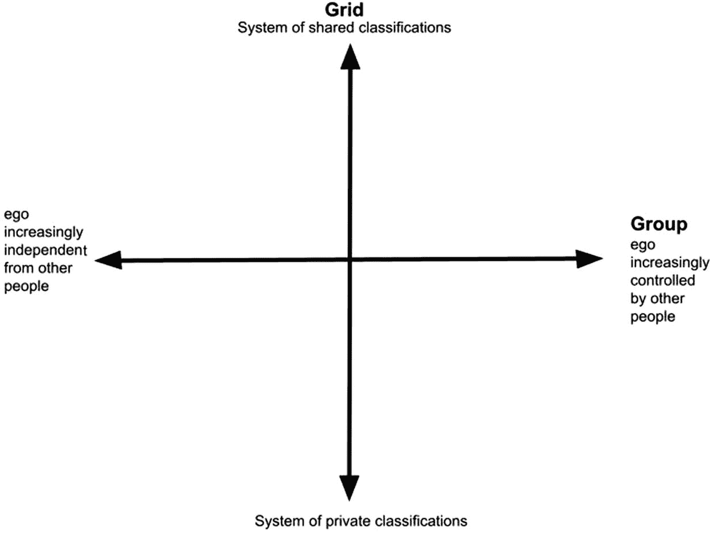

# 9. 社会组织

就其引发的社会参与度而言，比特币无法与我们当代世界的任何其他货币相提并论。没有人会不停地发布关于摩洛哥迪拉姆的推文，或为越南盾进行充满激情的辩护。没有人会去参加主题是瑞典克朗的会议，也没有人会费心去预测文莱元的未来。

对比之下，比特币则截然不同，围绕它已经发展出一个庞大的亚文化群体，他们在社交媒体上全力推广它，并编写软件来改进其功能。这一切都是无偿进行的，没有任何直接报酬。比特币是某种特定社会组织的产物，也吸引着这样的组织。关于加密安全和私人货币的想法源自特定的社会群体。在本章中，我们将重点介绍在开发最终催生比特币的加密虚拟货币过程中发挥了重要作用的不同社会群体和运动。

## 黑客与开源的起源

20 世纪 70 年代，美国的反文化运动也影响了计算机领域。在 20 世纪 70 年代之前，政府和大型企业几乎主导了所有与硬件和软件相关的事务。在那之前，政府（主要是 DARPA）几乎是所有技术相关事务的推动力。战后时期最重要的技术创新，都直接或间接地得到了 DARPA 的资助。

这种情况在 1970 年左右开始改变。在此之前，典型的开发者是刚从大学被 IBM 或类似公司雇用的工程师或数学家。突然间，一批心态各异、刚毕业的年轻计算机科学毕业生开始寻找工作。他们深受反文化运动的影响，谈论着自由与正义。这一点，加上硅谷的 DIY（自己动手）精神，共同塑造了最初的黑客。如今，这个词更多带有负面含义，指非法入侵系统并窃取钱财或私人数据的人。第一部分与最初的黑客相似。他们也“入侵”系统，但部分是出于好奇，部分是由于对大型企业及其专有知识产权的不满。他们的口号是：信息想要自由，软件想要自由，而不应被大公司作为专有财产保护起来。

这种精神催生了著名的“家酿计算机俱乐部”，爱好者们在那里组装自己的计算机。史蒂夫·沃兹尼亚克就是其中一员，他成功组装并制造了第一台苹果电脑及其操作系统。他利用爱好者们可以买到的现成部件，并通过向家酿计算机俱乐部的同行学习来完成这一切。

黑客精神也驱使其他开发者逆向工程和破解其他系统，以创建替代版本，或者仅仅是为了获得对它们的控制权。这些项目本着当时平等和合作的精神进行。黑客们共同构建了可以与所有人自由共享的软件。这就是后来成为开源开发的起点。

开源指的是软件的源代码对任何人开放检查。这与企业开发的专有软件形成对比，后者是受权利人保密的知识产权。

开源的一般原则是，一个松散的志愿者开发者团队合作进行一个项目，并持续向公众发布新版本。源代码也会向公众发布，供任何人检查、修改并进一步开发。

这些群体的组织结构和工作方式各不相同。娜迪亚·埃格巴尔根据她的研究以及在 GitHub 多年的工作经验，区分了四种通用的开源软件项目类型。

埃格巴尔沿着两个维度构建了一个类型学：用户增长和贡献者增长（表 9-1）。

**表 9-1**

开源项目类型

|   | 高用户增长 | 低用户增长 |
| --- | --- | --- |
| 高贡献者增长 | 联邦 (例如 Linux) | 俱乐部 (例如 Astropy) |
| 低贡献者增长 | 体育场 (例如 Babel) | 玩具 (例如 SSH-chat) |

联邦是我们通常理解的开源项目形式，拥有活跃的用户群和开发者社区，共同合作改进软件。像 Rust、Node.js 和 Linux 这样的项目都属于这一类。但它们在现实中很少见。相反，它们类似于非政府组织，从治理角度来看很难管理。

俱乐部是指大多数贡献者同时也是用户的项目。它们类似于聚会或兴趣小组。这意味着它们能吸引专注的参与者，但影响力相对较低。一个例子是 Astropy，这是一套用 Python 编写的、用于天文目的的软件包集合。

## 开源社区类别

### 玩具型项目

玩具型项目是指贡献者和用户增长都较低的项目。它们更接近个人项目，通常是程序员的副业项目。这类项目往往仅供娱乐，通常没有直接的应用场景。例如 `SSH-chat`，这个项目利用安全外壳（`SSH`）协议提供用于聊天的客户端。这提供了加密聊天功能，看起来很方便，但 WhatsApp 也同样能做到。

### 体育场型项目

最后一类是体育场型项目。这类项目的用户增长很高，但贡献者增长却没有像联盟型项目那样同步跟上。这方面的例子是 `Babel.js`，一个 JavaScript 编译器。在体育场型项目中，一两个人代表庞大的用户群做出决策。这种模式如今越来越常见。维护者如同业主，社区中的每个人都与他们相关联。这类社区的另一个例子是酒店，每个人都通过中心业主（酒店老板）相互连接。

在这些类型中，比特币目前就是一个体育场型项目。比特币核心只有五名开发者负责围绕比特币做出决策，而成千上万的用户虽然部署比特币软件，却不以任何方式参与其开发与维护。

开源社区可能会经历不同阶段，从而适配其他类别。最初，比特币是个玩具型项目，本质上是中本聪的一个副业项目，他首先得到了哈尔·芬尼的帮助。随后马蒂·马尔米和加文·安德烈森加入并协助编写代码。中本聪离开后，安德烈森负责管理。纵观比特币的历史，一个小型核心团队始终牢牢掌控着源代码的变更。这并不意味着他们可以为所欲为，因为比特币的任何变更都取决于比特币矿工是否愿意采用新版本的软件。从技术上讲，只有核心团队有权更改比特币源代码。这意味着虽然任何人都可以自由开发新功能，但未经核心团队成员的批准，他们无法将变更提交到下一版本的源代码中。

关于比特币应如何运作的提议变更曾引发激烈争论，因为自最初实现以来，比特币已发生了巨大变化，且比特币社区内部存在不同的理念。当这些分歧无法调和时，就导致了分裂，正如比特币现金的例子所示。2017 年，一场关于比特币未来的争论导致了所谓的硬分叉，比特币一分为二：传统比特币和比特币现金。如今这两种货币均在交易所交易，各自拥有忠实的追随者。

## 密码朋克

对比特币发展产生重大影响的另一个群体是所谓的密码朋克。密码朋克是一群主张利用密码学来推动社会和政治变革的人。这个词是`cipher`（密码）和`cyberpunk`（赛博朋克）的结合。`赛博朋克`因威廉·吉布森 1984 年的小说*神经漫游者*而闻名，该书描绘了一个反乌托邦的未来世界，其中的边缘人物通过身体的技术增强而生存。在这个世界里，黑客与体制作斗争，或者仅仅是受雇于他人进行攻击。`密码`一词源于密码学，密码（cipher）是用于加密的算法。这个群体与其他黑客的区别在于，虽然黑客通常左倾，但密码朋克的政治取向源于自由意志主义。

1992 年，埃里克·休斯、蒂莫西·C·梅和约翰·吉尔摩创建了一个小组，定期会面讨论政治、计算机科学、密码学和数学等广泛主题。这场运动有其意识形态上的先驱，最著名的是大卫·乔姆及其 1985 年的论文《无需身份认证的安全保障：让老大哥过时的交易系统》，该论文成为了灵感来源。其他灵感来源还包括安·兰德和弗诺·文奇的科幻小说。

同年，一个被称为密码朋克邮件列表的邮件列表建立起来。在这个列表上，密码朋克们就广泛的主题进行辩论，从当前的政治议题，到对未来的宏大愿景，再到复杂的密码学问题。因此，这个群体主要通过邮件列表相互联系，匿名人士在其中交流，无需面对面互动。这往往导致激烈的交流演变成有毒环境，并且，依照该群体的理想，没有人进行内容审核。最终，这导致邮件列表因宗派争论而内爆。它分裂成其他邮件列表，其中许多还是同样的人。不同时期存在不同的迭代版本。其中最重要的是密码学邮件列表，中本聪就是在那里发布了他关于比特币的想法。

如果说开源社区的主要目的是协作构建新的自由软件，那么密码朋克群体中任何实际的组织努力似乎都更像是偶然为之。哈尔·芬尼在一次采访中直言不讳地承认，其他社区成员通常会迅速否决大多数想法，比特币也不例外。

但这并不意味着他们没有合作，就像哈尔·芬尼与中本聪的合作那样。这个社区似乎更侧重于交流思想，而非共同协作编写代码。戴维和亚当·巴克就是很好的例子。戴维从未为其“B-money”构想编写过任何代码，甚至也没想过要编写代码。他只是向社区描述了一个想法。巴克在提出“Hashcash”时也是如此，不过他接着自己编写了代码。但值得注意的是，他是独自完成的。中本聪的情况也一样。比特币在发布后才成为一个开源项目。从外部来看，密码朋克群体更像是一群独狼，而非一个连贯的政治运动。

唯一让密码朋克们团结一致、并贯穿密码学邮件列表邮件内容的，是对政府的不信任。这当然是美国常见的论调，但在这个现代版本中，彻底没有政府似乎才是梦想。第一步是关注隐私，这自然也是密码学的核心。通过密码学，个人可以确保隐私，完全摆脱政府。除此之外，密码朋克们几乎没有其他共识。

密码朋克理想中的社会愿景是一个免于政府干预的社会。用蒂莫西·梅的话来说，人们生活在“虚拟地域”中，个人可以在没有任何中心化实体（无论是政府还是中央银行）为人们制定生活规则的情况下，进行双方自愿的交易。他们觉得规则对个人不公平，因为规则优先考虑政府和中央集权。在这种去中心化的模式下，个人可以为特定目的组成小团体，但一切都是基于交易而非规则。不应该有规则，因为规则是政府的手段。事实上，也不应该有任何道德规范。

密码朋克运动的创始人之一埃里克·休斯将密码朋克精神浓缩为一句广为流传的口号：“密码朋克们，写代码。” 因此，唯一需要存在的真理是嵌入代码中的真理。除此之外，没有道德观点或伦理规范。如果代码有缺陷，或者你误用了它，又或者你遭到了黑客攻击，那只是你自己的问题。你有责任正确理解和使用代码。反之，如果有人利用代码获得了他们（从周围社会的角度来看）无权获得的成果，比如访问政府信息，那也不是他们的问题，而是编写了允许他们访问的代码的那些人的问题。真理就在代码之中。

因此，密码朋克的特点在于信念高度分歧，但普遍情感围绕着免于政府和规则的自由以及隐私权。作为一个运动，其联合行动是临时且缺乏协调的。

## 自由意志主义与奥地利经济学

自由意志主义的政治哲学源于左翼反威权、反国家的思潮，这一点与无政府主义相通。自由意志主义存在诸多流派，但都以自由为核心价值。它们力求最小化国家权力对个人自由的侵蚀，并对权威及其他强制性社会机构持怀疑态度。除此之外，对于何谓自由意志主义者，该群体内部也存在巨大分歧。

两个主要流派差异显著：左翼自由意志主义与右翼自由意志主义。左翼自由意志主义者认为地球资源应在所有居民中平均分配，反对个人占有。因此，他们普遍不信任资本主义。右翼自由意志主义在这一问题上则完全相反，只接受捍卫所有权与自治权的制度。这一流派源自由所谓奥地利经济学派，也是美国最常见的自由意志主义类型。

奥地利经济学派是一种强调激进自由市场政治与个人主义的思想流派。尤其是**弗里德里希·哈耶克**和**路德维希·冯·米塞斯**，他们奠定了奥地利学派的思想内核。其核心理念是：社会现象源于个人的行动与认知。因此，市场应当完全自由，政府干预应彻底废止或最小化。当这一点实现时，价格形成机制会自动将资源配置到对社会最有利的地方。

就比特币社群而言，自然只有右翼自由意志主义者与其相关。美国的自由意志主义者早已接纳了虚拟货币的理念。`Liberty dollar`和`e-gold`均由自由意志主义者创立，并在自由意志主义社群中传播。这为比特币的诞生培育了土壤。

## 比特币的社会结构

可以说，比特币由密码朋克设想，由开源黑客构建和维护，并由自由意志主义者采纳。这是影响比特币发展的三大社会群体。比特币既是这些群体的产物，也是他们的媒介，因此与其偏好及优先事项紧密相连。

这里并没有推动形成大规模、团结一致的社会运动以改变社会的动力。这些群体中没有人真正在意他人的看法，尽管他们确实喜欢争论自己的观点并相互嘲笑。群体凝聚力有限，仅由极少数的共同信念与实践维系。群体凝聚力在另一方面也很薄弱，因为在比特币社群内部形成了各种分裂派系，更不用说那些因不认同比特币某些特性而随后与比特币并行开发的众多替代加密货币了。

这里普遍存在对官僚体制和道德推理的反感。例如，如果你把钱转错了账户、丢失了私钥，或者有人发现了代码漏洞以生成新的比特币——那又如何？强硬派并不认为这是问题。真相就在代码之中；如果你粗心大意转错了账或弄丢了私钥，那是你的事。如果有人找到了在挖矿流程之外创造新比特币的方法，那恭喜他们。这些事情在比特币历史上都曾发生过。相较于基于普遍原则的道德推理，这里更倾向于一种交易性的视角。交易既是比喻，也是字面意义上的全部。比特币区块链就是一系列交易记录。没有人知道或关心这些交易具体是什么——无论是捐赠、投资，还是为披萨、枪支或赎金付款。

## 网格/群体特征描述

理解这一点的一种方式是借助人类学理论。社会学之父**埃米尔·涂尔干**的核心思想之一是：任何分类体系都是其社会关系的产物。观念由产生观念的社会组织所塑造。但我们该如何理解比特币社群的社会组织与其观念之间的关系呢？

英国人类学家**玛丽·道格拉斯**将涂尔干的基本洞见扩展为一种工具，用以概念化宇宙观念与社会关系之间的联系。她观察到，一个维度涉及“群体”，即群体对个人施加权力的程度，或是个人自身行使权力的程度。另一个维度她称之为“网格”，描述关于世界的观念在多大程度上被共享。这两个维度被置于两条坐标轴上。x 轴涉及群体维度。0 点表示对个人不施加任何压力。向右移动，群体对个人施加的遵守规则和惯例的压力增加。向左移动，意味着个人对周围环境施加的压力日益增大。y 轴即所谓的“网格”维度，描述观念在社会中的共享程度。网格维度因此衡量决定个人在宇宙中位置的公共分类体系的广度。0 点以上是共享公共分类的区域。沿此轴向下，紧贴 x 轴上方和下方的是社会中越来越边缘化和非主流的群体。纵轴最底端是无人共享的私人观念。这就是道格拉斯在其著作《*自然象征*》中提出的所谓群体/网格模型，可用于概念化不同社会群体及其对世界的看法。

根据道格拉斯的观点，右上象限（强群体、强网格）会助长“……对权威及其象征的例行化虔诚，对惩罚性的道德宇宙的信仰，以及对被排斥者的归类。任何足够稳固且隔绝于批评的官僚体系往往会秉持同样的思维方式。这是修道院式的生活，或是军事化社会。”这一描述也同样适用于大多数现代西方社会。现代民族国家的特征在于要求个人服从国家权威。国家拥有权力垄断。这就是政府，而银行体系只是这种充满官僚体制和规则的普遍生活模式的延伸。

一幅图示展示了垂直和水平的双箭头，形成一个加号，其标注如下：网格体系（共享与私人分类）以及群体（个人日益受到他人控制或日益独立于他人）。

**图 9-1** 群体与网格分类

将此与左下象限的描述进行对比，那里是“自愿的流放者、流浪汉、吉普赛人、富裕的怪人，或那些以某种代价保有自由的人”，正如玛丽·道格拉斯在《*自然象征*》中所写。我们很难不将这里所审视的不同社会群体视为符合这一描述。他们与周围现代民族国家的主流社会共识甚少，内部也只有少数共享信念。此外，他们是自愿的流放者和怪人。无论我们考虑的是自由意志主义者、黑客、密码朋克，还是比特币社群（与网格中心的距离仅有细微差别），这一点都适用。

## 比特币、社会与宇宙

总之，我们可以看到，比特币由 extropians（未来主义者）构想，由 cypherpunks（密码朋克）创造，由开源黑客开发，并被自由意志主义者采纳。它依赖于一种特定的社会组织形式，其特点是弱网格和弱群体。社区成员之间没有高度的凝聚力。参与是交易性的。将其与周围充满通用规则、法规和繁琐官僚程序的法币世界相比。

道格拉斯总结了这两种模式的区别：“页面上的那条线将顺从区与创新区分开来。”这一点可以从它们所使用的货币工具中看出。法币遵循顺从之道，而比特币则是创新。因此，这些货币既是不同类型社会和宇宙观的工具，也是其代理，而这些观念深植于社会群体之中。

比特币不仅仅是一项迷人的技术创新。它深深植根于创造它的社会结构之中，并且是这些社会结构的产物。这些社会结构也推广了一种特定的世界观，与周围社会的方式截然不同。它们试图通过颠覆性行为和公开宣传来抵制并改变这些方式。因此，这不仅仅关乎一种货币；它关系到社会乃至整个世界的理想形态。

