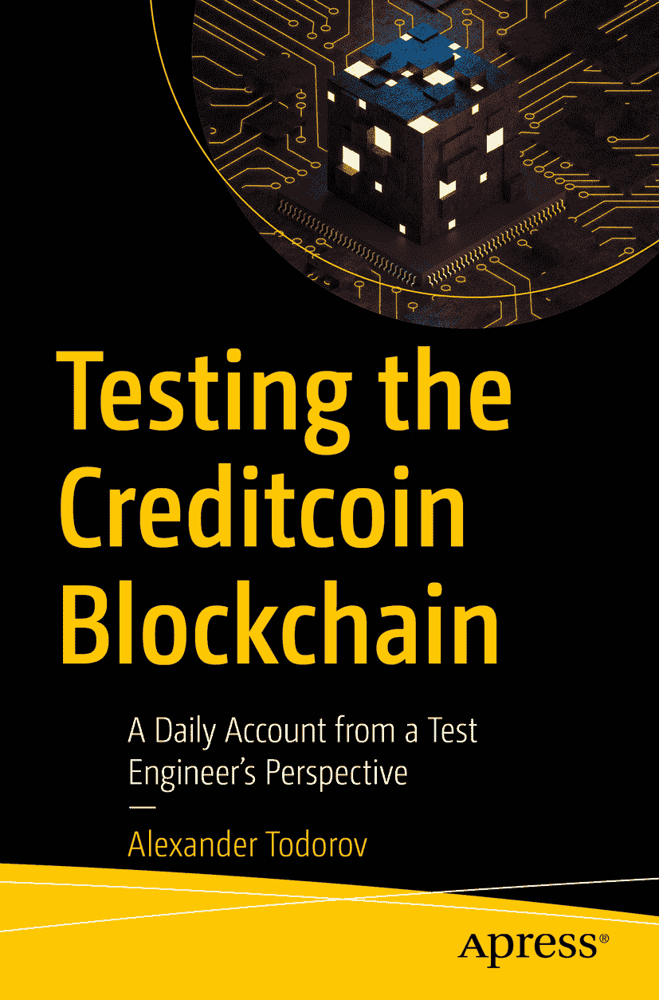

ISBN 979-8-8688-0872-2 e-ISBN 979-8-8688-0873-9 [`doi.org/10.1007/979-8-8688-0873-9`](https://doi.org/10.1007/979-8-8688-0873-9) © 编辑者（如适用）及作者，获得 Apress Media, LLC（Springer Nature 旗下公司）独家许可，2024。本作品受版权保护。所有权利均由出版商独家许可，无论涉及材料的全部或部分内容，特别是翻译、重印、重新使用插图、朗诵、广播、微缩胶片复制或任何其他物理形式的复制，以及信息存储与检索的传输、电子改编、计算机软件，或现在已知或以后开发的类似或不相似方法的使用。本出版物中使用通用描述性名称、注册商标、商标、服务标志等，即使未作明确声明，也不意味着这些名称不受相关保护法律和法规的约束，因此可供公众自由使用。出版商、作者及编辑均认为，本书中的建议和信息在出版之日是真实准确的。出版商、作者及编辑不对书中内容或可能存在的任何错误或遗漏提供明示或暗示的担保。出版商在已出版地图和机构隶属关系方面保持中立立场。

本 Apress 印记由注册公司 APress Media, LLC（Springer Nature 旗下公司）出版。注册公司地址为：1 New York Plaza, New York, NY 10004, U.S.A.

*致给予我一切的测试者。你让我明白了什么是真正、无条件的爱与牺牲。我将永远珍惜你允许我与你共度的时光！我非常抱歉当初太过自私，未能及时意识到这一点。我由衷地道歉，因为夺走了你最神圣的梦想，伤害并背叛了你。请原谅我！*

## 前言

本书以第一人称视角，讲述了 Creditcoin 区块链在四个不同实现版本及众多技术中的质量工程之旅。书中讨论了使用 Hyperledger Sawtooth 和 Substrate 区块链框架进行的测试实现、从工作量证明到权益证明共识算法的测试转换，以及以太坊虚拟机兼容层的测试。

读者将经历数年快节奏的区块链实现和技术变革，内容涵盖所有被测试主要组件的解释、所采用的方法（包括测试自动化和工具的示例）、有趣的错误以及测试挑战。各章节将跟随 Creditcoin 区块链的每一次重大实现，最后以对其他从事不同区块链相关产品测试工作的测试者的几次访谈作为结束。

本书讨论的内容几乎 99%都是开源的，书中多处引用了源代码和 GitHub 的链接。

本书面向软件测试人员和质量工程人员。他们可能即将需要参与区块链实现项目，但目前尚不具备必要的理解，不清楚区块链是什么、如何工作，以及在“保障”质量方面哪些是重要的。

**目标读者：**

*   软件测试员
*   测试自动化方向的软件开发人员
*   质量保证工程师
*   质量保证经理

**你将学到：**

1.  区块链的关键组件（附有部分图表）
2.  流行的区块链和加密货币术语表
3.  使用 Hyperledger Sawtooth 框架实现区块链的概述
4.  使用 Substrate 框架实现区块链的概述
5.  与测试工作量证明、权益证明和基于 EVM 的区块链相关的实践主题

## 致谢

我要感谢 Jeroen Rosink，他是第一个就本书内容给我反馈的人。到目前为止，你已经多次为我提供了宝贵的反馈。我可能误解了其中一些内容，也肯定没有完全采纳所有建议，但我毫不怀疑你的反馈给我的写作带来了积极的改变。接下来要感谢 Sebastian Malyska，他帮助我联系了其他区块链测试者。Seba，希望我们很快能在另一个测试会议上相见！感谢我的同行兼邻居 Liviu Damian，他帮我联系上了 Andrew Snaith。感谢 Andrew Snaith 同意为本书分享你的测试经验，这为我个人的故事增添了更多维度。最后但同样重要的是，感谢 Sebastian Viquez 同意分享你在智能合约方面的测试经验，使本书得以完善。

## 关于作者
## 关于技术审校者

