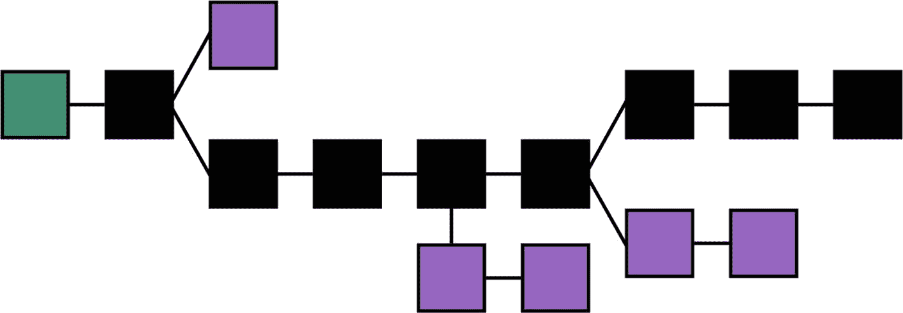
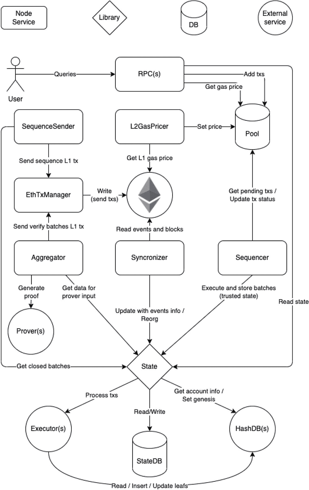

# 第一部分：区块链入门

## 1. 介绍

密码学家大卫·乔姆在其 1982 年的论文《由相互猜疑的群体建立、维护和信任的计算机系统》中首次提出了一种类似区块链的协议，并在随后的 15-20 年中对此想法进行了进一步改进。第一个去中心化的区块链由化名为中本聪的个人（或团体）于 2008 年构想，从而催生了比特币。2013 年是以太坊的起点，它引入了智能合约功能。由于对密码学计算所需高能耗的担忧，后来的链如 Cardano（2017）、Solana（2020）和 Polkadot（2020）开始采用能耗较低的权益证明模型。

目前，我们正目睹对区块链技术的兴趣和投资持续增长^(¹)，众多公司正在寻找加密货币之外的实际应用。这是一个区块链技术正进入更普遍的软件工程人员世界的时代。这也是区块链技术正在产品化的时代，这导致了对这些产品进行更多测试的必要性。

作为一名拥有近二十年经验的质量保证工程师，我对在区块链测试领域工作感到非常好奇，但与此同时，在很长一段时间里，我也感到极度不自在。我之前有测试底层基础设施类软件的经验，比如 Linux 操作系统的各个部分，但在此之前没有任何加密货币或区块链的经验。由于我参与的是一个已经投产的产品，我需要非常快速地学习大量知识，才能成为团队中高效的一员。这就像对着消防水管喝水，直到今天有时仍有这种感觉。

本书面向普通的测试人员和质量工程人员。他们可能很快就需要参与区块链软件产品的工作，但目前尚不具备必要的理解，不清楚它是什么、实际如何工作，以及在“保障”质量方面哪些是重要的。

区块链网络是分布式系统，通常比常规软件产品更复杂，并且有大量需要测试的项目，这需要广泛的技能组合。本书并非旨在成为涵盖所有可能场景的详尽资源；这是不可能的。相反，它旨在讲述我作为一名区块链测试工程师的故事，并希望能成为你在这个领域的起点。

祝你测试愉快！

### 区块链简介

像区块链这样的分布式系统包含多个组成部分，除非你之前从事过这个特定的技术领域，否则其中一些部分未必是常识。本章将解释什么是区块链，建立该领域中常用的一些术语，并为你提供一些示例。

区块链是一种不断增长的数据记录列表，这些记录被称为区块，它们通过密码学函数安全地链接在一起，从而保证数据不可篡改。在图 1-1 的语境中，我们可以将每个区块视为特定时间段内当前状态的一个快照。如果有人稍后试图修改这个状态，那么相对于被修改的区块，所有后续区块都将变得无效，从而暴露数据篡改行为。它也被称为分布式数字账本。这种架构使得互不信任的参与者仍能信任记录在区块链上的数据。

图 1-1 构成区块链的链接数据块示例 许可协议：CC BY 3.0，来源：`https://commons.wikimedia.org/wiki/File:Blockchain_landscape.svg`

区块链参与者是在其计算机系统上运行区块链客户端软件的个体操作者。他们的动机通常是经济方面的——通过向区块链提供分布式计算资源来获得奖励。

为了将新信息记录到区块链上，参与者必须达成一致——例如，一个困难数学问题的答案是什么。这被称为共识。根据设计，大多数区块链系统对任何人开放参与，并且在许多情况下，参与者是匿名的，可能出错（由于软件或硬件错误）或行为不端（由于可能存在篡改区块链记录的外部激励），并且通常不可信任。共识算法的工作就是确保在这种系统中的参与者能够达成一致，并检测和排除被认为有错误的参与者。否则，区块链软件无法进入下一步，即将实际数据记录到存储中。

一旦新的交易被组合成一个区块，并且该区块被分发到区块链中的多个节点，它就无法被删除或修改。区块链确保了完整的交易历史，而密码学函数的使用则保证了记录在链上的信息在设计上是安全的。这些记录本质上是只读的。所选择的算法和软件架构确保了这些原则得以实现。实际的密码学、共识、网络以及其他算法和实现架构各不相同，并且该领域有大量正在进行的研究，但其基本原则是确保数据完整性，如图 1-1 所示。

尽管当今许多区块链平台能够支持智能合约和加密货币，但这些对于区块链作为安全分布式账本的核心运作来说并非严格必需。恰恰相反，正是作为安全分布式账本这一点，才使得智能合约和加密货币的存在成为可能。

区块链实现是一种基础设施类型的软件，在非常高的抽象层面上类似于数据库——存储中记录了一些数据，外部世界（即其他应用程序）可以对区块链进行读写。

区块链应用程序通常比测试人员可能熟悉的其他软件更复杂，它包含多个并行工作的组件，以及同时活动的多个网络通道和协议。

### 区块链属性

本节仅供参考。在实际实现中，借助所选用的区块链框架，这些属性中的大部分都可以直接为你所用。

围绕这些特定属性的测试要求取决于你的运营和业务需求，并且在实际实现中（例如，在你并非开发底层算法本身的情况下），最有可能通过加强监控和警报而不是功能测试套件来解决。

- **安全性**：一般认为区块链上的信息在防篡改方面是安全的，因此历史记录可以信赖。由于其分布式特性，区块链通常也被认为能够抵御恶意行为者。
- **容错性**：在区块链网络中，可能存在表现出错误行为或完全恶意的节点。区块链实现对此具有内置的容错能力。
- **可靠性**：区块链在指定环境中、在给定时间内正常工作的概率。对于指定的权益证明共识机制而言，这转化为在当前时代，至少有三分之二当选的验证者在线且正常运行。
- **可复现性**：区块链上的交易可以由另一个节点重放，并且应始终产生相同的状态，例如，对于重放交易的节点，其本地磁盘上存储的信息相同。
- **透明度**：公共区块链上的记录对所有人开放访问，从创世区块到当前区块的所有状态转换都可以被单独重放和验证。也就是说，尽管参与者通常是匿名的，但他们所有的行为都是完全透明的，任何人都可以追溯。
- **最终确定性** 指的是对于最近添加到区块链的一个格式正确的区块不会在未来被撤销，因此可以信赖的置信度。大多数分布式区块链协议无法保证一个新提交区块的最终确定性，而是依赖于“概率性最终确定性”：随着区块在区块链中深入，它被新发现的共识更改或回滚的可能性就越小。
- **公开 vs. 私有**：指区块链是完全对公众开放（例如，任何人都可以参与）还是并非如此。你在新闻中听到的区块链，包括 Creditcoin，都是公开的。
- **无需许可 vs. 需许可**：指任何人是否可以在未经事先获得某种许可、批准等的情况下，加入现有的区块链网络，运行节点，并参与共识。流行的区块链，如比特币、以太坊，当然还有 Creditcoin，都是无需许可的。

### 区块链术语表

**交易**，与常规 SQL 数据库中的事务非常相似，是一种旨在向区块链追加新信息的操作。它通常以 API 函数的形式暴露出来，以便用户可以与区块链进行交互。区块链交易通常是一个独立的实体，类似于针对传统数据库执行的单条 SQL 语句。交易代表了区块链的业务领域，例如 Creditcoin 的 `AddBidOrder`，或者以太坊中以太币从一方转移到另一方。一个区块链网络可以支持多种交易类型。

**哈希** 是一种单向加密函数的结果，通常接收二进制数据作为输入，并返回一个十六进制字符串。每个数据都有唯一的哈希表示，并且你无法将哈希值反向推导回原始输入数据。即使输入数据修改一个比特位，也会导致哈希值截然不同。这使得公开共享哈希值来代替数据本身是安全的，并且可以使用相同的哈希值来验证两段数据是否完全相同。

**交易哈希** 是一个十六进制字符串，代表每笔交易的加密哈希值。这些字符串通常被用作标识符。例如，`https://etherscan.io/tx/0x8d116ea41628ac89745c95147c0ea394809074607395b0d792d1bea9136280b1` 代表了我用一种加密代币（G-CRE）兑换另一种（ETH）的交易。

**Gas** 或 **交易费** 代表在区块链上执行特定交易所需的成本。它可能随时间变化，也因交易类型而异，旨在表示该交易的计算开销。该值通常以区块链的原生加密代币表示。Gas 的目的与代币经济学相关，同时也提供了一种安全特性，使得恶意行为在经济上不可行。

**区块浏览器** 通常是一种 Web 应用程序，允许用户搜索和查看区块链上的区块、交易和地址。一个流行的例子是上一段中链接的 Etherscan。对于 Creditcoin，类似的功能由 Subscan（`https://creditcoin3-testnet.subscan.io/`）和 Blockscout（`https://creditcoin-testnet.blockscout.com`）提供。

**区块** 是原子性地记录到区块链上的多个交易的集合。区块内的所有交易要么一起被记录，要么都不被记录。如果我们类比 git 版本控制系统，单个修改过的源代码块将是一个“交易”，而包含多个修改的一次 git 提交则是“区块”。

虽然我们通常将区块称为记录，但其含义与数据库记录不同，数据库记录表示离散值的单一集合，换句话说就是一行列值。在区块链上下文中，术语记录更接近于存储了多首歌曲的黑胶唱片的含义。

区块包含一个交易列表、对前一个和下一个区块的引用，以及附加元数据，例如时间戳、加密哈希和签名。根据实现方式，单个区块中可以存储的交易数量有最大限制。

**区块饱满度** 或 **区块饱和度** 代表区块内总可用空间实际使用的百分比。例如，如果区块链没有被使用，每个区块可能只包含一个心跳/时间戳交易。而在一个被重度使用的区块链中，它可能包含数百笔交易。

**区块哈希** 是一个十六进制字符串，代表每个区块的加密哈希值。这些字符串通常被用作地址或标识符。例如，`0x34e89f72d1bc09af19759a94c347d769a94bb0ca9d257b2efe8ad5ac0502cc11` 对应于以太坊主网上的第 19517842 号区块。其内容可以通过 `https://etherscan.io/block/0x34e89f72d1bc09af19759a94c347d769a94bb0ca9d257b2efe8ad5ac0502cc11` 或 `https://etherscan.io/block/19517842` 查看。该区块包含 185 笔单独交易，包括我进行了一些代币兑换的那一笔。

**区块高度** 或 **区块编号** 是其前面区块的数量。较旧的区块高度较低。这个数字越大，区块链存在的时间就越长。

**出块时间** 是区块链上区块之间的平均时间，例如 15 秒。这个值本身是任意的，由区块链的创建者选择。重要的是这个值大致是一个常数。在比特币中，预期的出块时间是 10 分钟，而在以太坊中，设计要求的出块时间是 15 秒，实际上通常在 10 到 19 秒之间。Creditcoin 的初始实现使用了 60 秒，后来的版本降到了 15 秒。恒定的出块时间对于分层应用更有利，因为它们可以知道在什么时间范围内可以认为一个操作失败或超时。

**创世区块** 是编号为零的区块。它通常被硬编码到区块链的实现中，例如你的客户端程序，并且可能包含后续链正确运行所需的元数据。例如，哪个账户是根账户，或者一组预定义地址的起始余额。

**分叉** 发生在区块链向两个可能的路径前进时。当多个节点几乎同时生成一个块时就可能发生分叉。当后续区块被添加并且其中一条路径比其他路径更长时，分叉就会得到解决。

**硬分叉** 通常发生在区块链协议发生不向后兼容的更改，并要求所有用户升级其软件才能继续参与网络时。在硬分叉的情况下，区块链网络作为两个彼此不连接的数字实体存在。硬分叉也可能由于软件实现中的错误和/或导致共识失败的网络问题而发生。换句话说，区块链中的参与者无法就哪条前进路径应该是权威路径达成一致，结果是产生了两条独立的链。

由于区块链旨在用作事实来源，无法解决导致硬分叉的情况被认为是严重的，并且可能对区块链造成损害。

区块**最终性** 指的是区块链上交易的不可逆确认，确保了安全性并防止了双花。区块**最终化** 是用于处理分叉并选择权威链的过程，在该链上，大多数参与者都同意区块不应被回滚。实际上，这意味着所有参与者的三分之二同意。

**状态** 是区块链上的当前快照——包括区块总数、这些区块中记录的交易，以及本地存储中记录的值。在实践中，当我们谈论状态时，指的通常是某个特定区块的区块链快照。例如，区块 1000 的状态是 Alice 有 300 余额，而 Bob 为零！到了区块 1010，内部状态可能因其间执行的交易而发生变化。例如，Bob 现在获得了一定数量的代币。当我们谈论状态时，通常指的是记录在区块链上的最新值，忽略之前的历史。但根据上下文，我们可能也需要考虑先前历史，比如在尝试复现某个特定错误时。

**挖矿** 是作为工作量证明共识算法的一部分，执行计算密集型加密操作的过程。执行此工作的计算机被称为**矿工**。广义而言，无论实际采用何种共识算法，当我们指代参与区块链的计算机和/或人类时，也会使用术语**矿工**。

在密码学和区块链中，**随机数（nonce）** 是一个在通信中仅能使用一次的任意数字。它通常是认证协议中颁发的伪随机数，用于确保旧通信无法在重放攻击中被重复使用。

**验证者** 是验证区块链交易合法性的计算机节点。也称为**矿工**或**铸币者**，验证者是参与共识算法并获得特权将区块追加到区块链上的人。这个过程完全是自动化的，当我们说“用户”时，通常是指参与区块链网络的计算机；但请记住，这台计算机是由人类操作的，也就是用户，可能也用同样的术语来指代。术语“验证者”常用于权益证明共识算法，而“矿工”更常用于工作量证明算法。

**提名者** 是区块链中的参与者，他们用自己的资金为选定的验证者投票。在权益证明网络中，提名者是一种用户角色，无需太多技术知识即可参与区块链，而不必操作区块链节点。他们有时也被称为**“投资者”**，因为他们只使用自己的资金，而非作为技术操作者。

**[加密]代币** 是一种数字代币，用于在区块链上代表价值，从而使区块链网络在经济上可持续运行。验证者通过运行支持区块链及其存储数据的计算机硬件，获得代币作为奖励。

像 BTC、ETH、CTC 等代币被称为**加密货币**，它们随后可能会自成体系。由于代币是价值的代表，它可以兑换成其他有价值的代币，例如纸币（也称为**法定货币**）或其他数字代币。代币经济学不在本书讨论范围之内。

加密代币的存在通常是公共区块链网络的必要条件，因为它为操作者提供了加入网络的激励。对于访问控制更严格或专注于解决特定业务问题的私有网络，则很少需要加密代币。解决当前业务问题所带来的预期利润，为此类网络的操作者提供了必要的动力。

> **注意**
> 区块链通常拥有所谓的**原生代币**或**实用代币**，旨在便利区块链的运行。此外还可以有其他代币，也称为**币**，它们可以被交换、交易或用于任何其他目的。此类**币**仅仅因为其存在而非技术实用性而被赋予重大价值的情况并不少见。

一个[加密]**钱包地址** 以一个长十六进制字符串表示，其中包含关于不同加密代币及其余额的信息，这些代币归地址控制者所有。该十六进制字符串用作钱包地址，实际上代表公钥-私钥对中的公钥。通常，钱包是区块链上的匿名账户。请注意，此地址与特定的区块链相关。我在以太坊上的地址是 `0x718bb20f20ab1937710D2Ac579D97835a6fD099C`。这个地址可能在其他区块链网络上不存在。同样重要的是，不同的区块链可能使用不同的地址格式和表示方式。在以太坊中，地址长度为 20 字节，如上所示，用 40 个十六进制数字表示。在 Creditcoin（基于 Substrate 框架）中，格式是 32 字节的账户标识符；然而，并非所有基于 Substrate 的网络中的地址都基于密钥。

由于生成这些地址的算法发生冲突的概率极低，只要格式支持，钱包地址实际上是唯一的，并且可以在不同的区块链上使用。在实践中，当首次向某个特定地址进行转账时，该地址背后的“账户”将在该特定区块链上开始存在。

# 区块链基础概念与组件

## 核心概念

### 钱包应用
**钱包应用**是持有你公钥/私钥，并允许用户通过签署交易来与区块链交互（用于转账或交换不同加密代币）的应用程序。最常见的是网页浏览器扩展或移动应用程序。流行的钱包应用例如有**MetaMask**和**SubWallet**，但还有许多其他具有不同功能的钱包应用可用。例如，金融移动应用Revolut也包含加密钱包的功能，允许你购买代币、向其他地址转账或进行加密货币投资，尽管其功能范围要大得多。由于钱包应用持有私钥并允许用户签署交易，它们通常是用户与区块链交互时最显眼的软件之一。

请注意，根据上下文，术语**钱包**可能指账户的地址，也可能指用于管理该账户中资金的面向用户的应用程序，或者两者兼指。

### 水龙头
加密**水龙头**是一种快速向用户奖励少量加密代币的方式，作为在网站或移动应用上完成各种任务的交换。用户完成的任务可能是点击付费广告、完成CAPTCHA测试、每日登录或与Discord机器人交互等。在区块链测试环境中，你的团队很可能会有内部/外部水龙头，以帮助测试者获取一些加密货币并用于测试。

### 空投
**空投**是一种营销策略，涉及将币或代币免费发送给区块链社区活跃成员的钱包地址，或作为完成一项小服务的回报。出于测试目的，它执行与水龙头相同的功能，但并非自助服务。

### 网络类型
**主网**、**测试网**、**开发网**和**阶段网**是区块链网络的独立实例。它们彼此隔离，你可以根据需要拥有任意数量用于测试和开发目的。唯一的账户、代币、区块和交易将存在于每个网络实例中。名为**主网**的实例是生产环境。其余的则由区块链创建者或多或少地任意分配命名。某些区块链可能拥有由不同名称表示的多个测试和开发环境。

### 质押与罚没
**质押**是指为了参与权益证明共识机制而提交一定数量加密代币的行为。这适用于验证者和提名者两种角色。其经济激励是更高的投资回报。虽然与传统投资工具类似，但质押过程本身旨在让用户积极参与，以确保区块链社区的健康。请记住，区块链是一个高度分布式的环境，参与者越多越好。

**罚没**是对权益证明区块链网络中的恶意验证者实施惩罚（扣除代币）的过程，从而使此类行为在经济上不可行。罚没也适用于提名者，这就是为什么建议区块链质押的参与者保持活跃并定期监控链上动态。例如，不要投票给某个验证者后就再也不管了。

### 客户端与运行时
**客户端**程序是指任何与区块链通信的软件程序。在区块链应用的语境中，我们通常指那些在计算机上原生执行并实现区块链各组件的软件程序。这通常是在区块链上充当验证者的程序。在更广泛的语境中，客户端也可以指钱包应用，或与区块链交互的其他应用，例如质押仪表板或遥测仪表板。它也可以指为与特定智能合约交互而设计的应用。

某些区块链实现有一个独立的**运行时**组件，它封装了交易和业务逻辑，而客户端本身则被委以更底层的任务，例如网络通信、写入磁盘存储、共识等。

## 关键技术

### Web3
**Web3**是万维网新迭代的一种构想，它融合了去中心化、区块链技术和基于代币的经济学等概念。该术语由以太坊联合创始人加文·伍德于2014年提出。

### 智能合约
**智能合约**是用特定编程语言（例如Solidity）编写的程序，并存储在能够执行此类程序的区块链上。并非所有区块链都支持智能合约。最著名的例子是实施一种加密代币，例如存储在以太坊主网上；然而，智能合约并不仅限于此。示例包括交易类游戏（如井字棋）、投票、盲拍、支付通道等等。我认为任何可以表示为交易的内容都可以被编程到智能合约中。

智能合约的核心属性是：一旦部署到链上就无法更改（它与特定地址或交易哈希绑定），并且与智能合约的交互是透明的，以交易的形式呈现，即使各方的参与者可能是匿名的且彼此不一定信任。智能合约也可以通过调用其公开的函数来执行其他智能合约。在智能合约内部定义的函数的执行会被记录为区块链上的交易。一旦部署到链上，智能合约就无法更改；但是，你可以部署合约的新版本，这会产生一个不同的合约地址。智能合约具有合约存储（即存储）的概念，合约内部可用，可以保存诸如新创建的加密货币的代币余额等信息。

### EVM
**EVM**，即**以太坊虚拟机**，是执行智能合约和去中心化应用的环境。顾名思义，该规范源自以太坊主网区块链。该规范是开放的，由以太坊基金会和以太坊社区维护。

## 区块链组件

以下为Polygon zkEVM网络的单个计算节点架构图，用于说明区块链实现的复杂性：

*来源：[`github.com/0xPolygonHermez/zkevm-node#architecture`](https://github.com/0xPolygonHermez/zkevm-node#architecture) 许可证：GNU AFFERO GENERAL PUBLIC LICENSE, Version 3*

区块链应用拥有多个并行工作且以分布式方式协同的组件。所有这些组件都可以被视为独立的软件系统，例如点对点网络，它们各自拥有自己的模块、复杂性和测试要求。许多此类组件依赖于在其他更常见的软件开发领域中不常使用的算法。因此，区块链实现往往比其他软件更为复杂。

### 点对点网络
区块链节点之间需要相互通信，以交换数据和网络信息，例如区块。这通过点对点网络完成。

该组件负责对等节点发现和连接管理。它是某种形式的点对点网络实现，例如基于`libp2p`库。可能还有其他需要通过或依赖网络通信的组件，它们可以彼此分离，例如通过不同的TCP端口暴露，或作为独立的进程实现。

### 共识算法
分布式计算系统中的一个基本问题是如何在存在故障节点或不可信节点的情况下实现整个系统的可靠性。这通常需要协调进程以就计算过程中所需的某个数据值达成一致。

共识算法、共识模型或共识引擎确保区块链的参与者就区块链的当前状态达成一致，并且旨在通过阻止恶意参与者获得向链中添加区块的机会来保障区块链的安全。

## 交易

除了将单一交易序列化为二进制格式以便记录到区块的具体机制外，区块链的`交易`组件代表着其业务逻辑。也就是说，该特定区块链上可以记录何种类型的操作。

例如，资金转移（作为现代区块链背后的原始概念）、保险、借贷（以信用币为例），以及通常与金融资产、物流和供应链追踪、所有权证明与转移（如房地产契约）等相关的任何内容。

一个既实用又易于理解的例子是井字游戏。我们可以设计交易来记录新游戏开始、每位玩家的回合（例如，棋盘上的符号和位置）以及游戏的最终结果。一个交易模式可能如下所示：
* `start_game(玩家一地址, 玩家二地址)`
* `record_move(玩家地址, 符号, 棋盘坐标)`
* `calculate_outcome()` - 可能在内部触发
* `record_victory(玩家地址)`

以最初的信用币白皮书为例，其交易模式如下：
* 借款人请求贷款（`具体条款`）。
* 贷款人提出贷款（`具体条款`）。
* 记录贷款人与借款人配对，例如，条款匹配/双方同意条款。
* 记录资金转移。
* 实际资金转移等。

交易可以在区块链上的节点之间内部消耗——例如，每个井字游戏参与者必须成为区块链上的验证者，并且只能通过其验证者程序与区块链通信。

然而，更实用的做法是，交易也对外暴露，并通过某种RPC接口可用。这意味着游戏中的玩家可以与验证者不同。这也意味着他们可以更轻松地参与，例如通过移动端或Web应用程序，同时利用区块链来记录他们的操作。

### 交易费用
区块链网络的运行和维护并非免费。它需要真实世界的计算资源，这些资源通常由庞大的外部社区提供。这在公有区块链网络中尤其如此。这要求引入以加密代币形式存在的交易费用。

为了使区块链在经济上具有灵活性，实现方需要根据自身需求控制交易费用组件。它可以是一个简单的数学公式，也可以是一个考虑多种因素（包括但不限于区块链的历史性能）的更复杂的算法。例如，当使用率高且呈上升趋势时，费用也可能上涨。如果网络闲置了一段时间，费用可以自动下调以刺激更多使用。

## 区块生产与奖励

### 区块生产
这是一个负责将交易序列化为区块，并与共识、存储和点对点组件进行通信的组件。区块链能够生产新区块至关重要。如果没有外部活动，内部时钟可能会触发一个`time.set`交易。

由于此组件中的软件错误，或者由于共识或网络问题，区块生产可能会受到损害。当区块链无法恢复时，就说**我们损坏了区块链**，该链变得不可用，也就是说，无法再向其追加新区块，这很可能意味着你的区块链的终结。

### 区块奖励
区块链上的矿工和/或验证者通常期望通过提供计算资源来维护基础设施而获得奖励作为回报。

与交易费用类似，奖励以加密代币（可以是相同或不同的代币）的形式表示，并且通常是可以调整的。区块奖励组件可以是一个简单的数学公式或更复杂的算法——这取决于特定区块链的创建者来决定。

该公式可能根据区块链的流行度随时间变化，例如，在初始阶段提供更高的奖励以刺激参与，然后随着区块链变得更受欢迎或参与者饱和而降低奖励。

## 网络交互与存储

### 远程过程调用（RPC）API
为了使区块链用户能够与网络交互，他们需要某种支持网络的接口。RPC组件负责在区块链实现内部如何定义RPC方法，以及如何将它们暴露给外部世界。当谈到“用户”时，这里我指的是“API消费者”，无论他们在现实生活中的角色如何。

例如，通过JSON-RPC和/或REST协议提供API接口，这些协议可能通过HTTP和/或WebSocket暴露。在各种实现中也可能使用其他网络传输和RPC协议。例如，Hyperledger Sawtooth区块链框架使用ZeroMQ / Protobuf作为其内部通信层。如果我没记错的话，客户端可以直接使用它。为了方便起见，该层被封装到一个REST API中。

需要通过RPC层导出的最重要的组件是交易接口。通过标准网络协议公开交易API，允许多种类型的应用程序能够与区块链交互。使用广泛采用的行业协议可以更容易地从任何编程语言访问这个API。

例如，一个移动应用程序可能使用公私钥对签署交易，并将其发送到区块链节点，该节点随后会将该交易传达给p2p网络上的其他节点，最终该交易会被包含在一个区块中。通过RPC API组件接收交易的节点可能与执行验证和区块生产的节点不同。

### 存储
负责在参与网络的每个节点的本地磁盘上持久化数据，通常采用高效的键值存储形式。

出于实际开发目的，区块链上表示的数据必须通过具有字段的数据类型来表示，而不是二进制数据块流。也就是说，我们有一个数据模式，在区块链软件程序开发期间使用，也可以由第三方以SDK的形式使用。

为了抽象的目的，存储组件的某些部分可以视作Web应用开发中常见的对象关系映射框架。

## 演进与升级

### 迁移
为了使实际的区块链应用能够根据业务需求演进，开发者需要能够修改数据模式。例如，在我们的井字游戏示例中，我们可能希望记录游戏在哪一步获胜，或者我们可能允许第三位玩家加入。

与对象关系映射框架类似，迁移组件允许开发者转换区块链上表示的数据，甚至删除其中的一部分。所有这些转换都将保存在特定区块高度的区块链历史中。如果查询较旧的区块，可以检索到较旧的数据，但无法保证客户端应用程序向后兼容。

失败的迁移可能导致区块生产受损，这可能是致命的。

#### 运行时升级
由于区块链应用因业务需求而不断演进，其实现版本会有所不同。假设我们想要为井字棋区块链引入一个功能，让三名玩家能够同时互相竞技。

运行时升级组件就负责实现这一功能。在某些区块链实现中，业务逻辑（交易）可能与实际的客户端程序分离保存。使用Substrate区块链框架时便是这种情况。一种流行的选择是WebAssembly格式。如果运行时是独立的，它也可以被记录在区块链本身之上。

在其他实现中，交易可能与客户端程序的其余部分紧密耦合，需要软件升级和重启后，用户才能访问区块链的新功能。

该组件引发了关于不同客户端和运行时版本之间兼容性/互操作性测试的问题。

#### 指标与遥测
由于区块链应用是分布式的，并且出于安全原因鼓励大量节点参与，因此常常需要公开区块链软件内部运行的信息。这些信息可以汇总到诸如Grafana之类的工具中，以便进行进一步分析。

遥测组件就是定义此类指标，并随后通过例如HTTP协议将其推送到外部服务的地方。

#### 链下工作机（Off-Chain Worker）或预言机（Oracle）
在区块链的语境中，所有计算和状态都存储在链上。然而，实际应用需要与外部世界通信，并将信息安全地传入和传出区块链。这就是所谓的预言机或链下工作机组件的领域。

这里需要注意一点：链下工作机能够读取链上数据，但不应直接修改它。不过，如果需要反映外部世界的状态，该组件会将交易发送回区块链。这可以在内部发生，例如，在源代码中调用交易函数，或者通过现有的RPC接口从外部路由到区块链。这些交易调用随后将由其他组件处理，如果成功，将被打包进一个区块。交易也可能因各种原因失败或未能被打包进区块。

#### 智能合约
智能合约是存储在区块链网络上的计算机程序。一旦智能合约被部署到区块链上，它可以存储任意状态、执行任意计算，或调用区块链上的其他合约。

每个智能合约都有一个与之关联的地址，该地址充当合约的入口点，非常类似于REST API函数的URL地址。终端客户端通过与智能合约交互，使用其地址通过某种客户端库发送交易——一个流行的选择是`ethers.js`。

一旦部署，智能合约便无法修改。不过，合约的新版本可以部署到不同的地址。

智能合约的创建者铸造一种新的加密代币（即凭空创造出来）相当流行，这种代币随后被用作某些区块链网络上的价值表示。然而，智能合约也可以实现其他功能，例如自动透明的投票计数、托管拍卖、游戏以及安全地远程购买商品。

智能合约的实际应用超出了本书的讨论范围。

## 共识机制
共识引擎是区块链网络中最重要的组件之一，目前有许多正在开发或使用的机制。例如，工作量证明、权益证明、消逝时间证明、容量证明和位置证明等等。它们的特性影响着诸多属性，例如谁可以参与、参与难易程度、维护网络的成本、激励机制、出块速度快慢、网络能支持的节点数量、交易吞吐量，以及最重要的是，区块链的安全性！

请查看这个包含20多种算法的列表以作进一步参考：[`https://medium.com/hackernoon/consensuspedia-an-encyclopedia-of-29-consensus-algorithms-e9c4b4b7d08f`](https://medium.com/hackernoon/consensuspedia-an-encyclopedia-of-29-consensus-algorithms-e9c4b4b7d08f)

### 工作量证明 (PoW)
在PoW共识中，参与者需要消耗计算资源，以获取将新区块追加到区块链的机会。他们需要解决一个CPU密集型的加密难题，并将解（一个非常大的数字）提交给其他参与者，这些参与者可以非常容易地计算（并认同）该解是正确的。每个区块的数据部分被用作加密难题的输入。

第一个找到正确解的矿工获得将新区块追加到区块链的机会。正因如此，我们说他们“挖”到了一个区块。

矿工拥有的CPU资源越多，他们解决加密难题并将区块追加到区块链的机会就越大，从而为他们的努力赚取更多奖励。

在PoW网络中，出块时间相对较慢，并且对电力有很高的要求。

### 权益证明 (PoS)
在PoS共识机制中，参与者根据其质押的代币数量竞争追加区块的机会。一般而言，投资的代币越多，被算法选择去追加区块并因此获得更高回报的可能性就越大。

PoS网络避免了PoW网络的高计算成本。由于涉及的加密计算少得多，因此并没有真正的“挖矿”；然而，即使在这种情况下，我们通常也把验证者称为矿工。

质押的资金被区块链实现作为“人质”持有，如果验证者被举报并被发现有错误或恶意行为，其资金可能会被作为惩罚没收。这个过程是自动化的，旨在限制人为参与并促进区块链网络的健康行为。例如，当一个验证者节点长时间离线时，他们将受到惩罚。

在区块链网络中对参与者施加惩罚并没收其现有资金的过程，也被称为“罚没”（slashing）。

### 权威证明 (PoA)
权威证明是一种算法，它通过一种基于身份作为抵押品或声誉作为抵押品的共识机制，提供相对较快的出块时间。在PoA网络中，个人通过努力获得成为验证者的权利，因此有动力去维持他们已经获得的地位。PoA共识通常可以在私有非许可链中找到。

## 本章小结
在本章中，我介绍了区块链的基本概念，并讨论了一个区块链实现的一些主要组件和属性，以建立基础知识。你也可以随时参考术语表章节来温故知新。

接下来，我将介绍我使用过的区块链开发框架、构建实际区块链实现的一些实用笔记，以及这对我们测试人员意味着什么。

脚注1