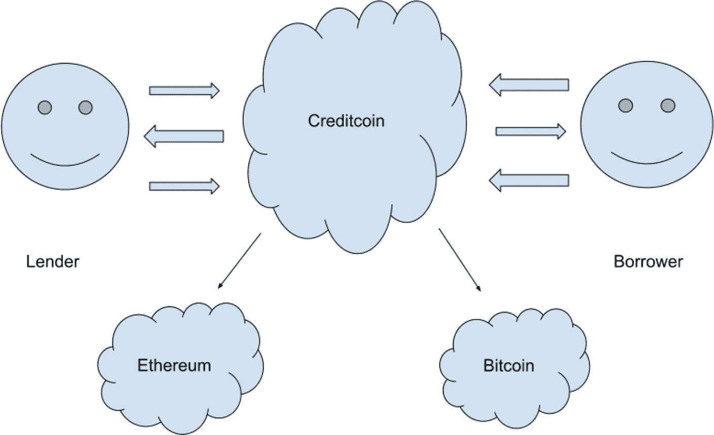
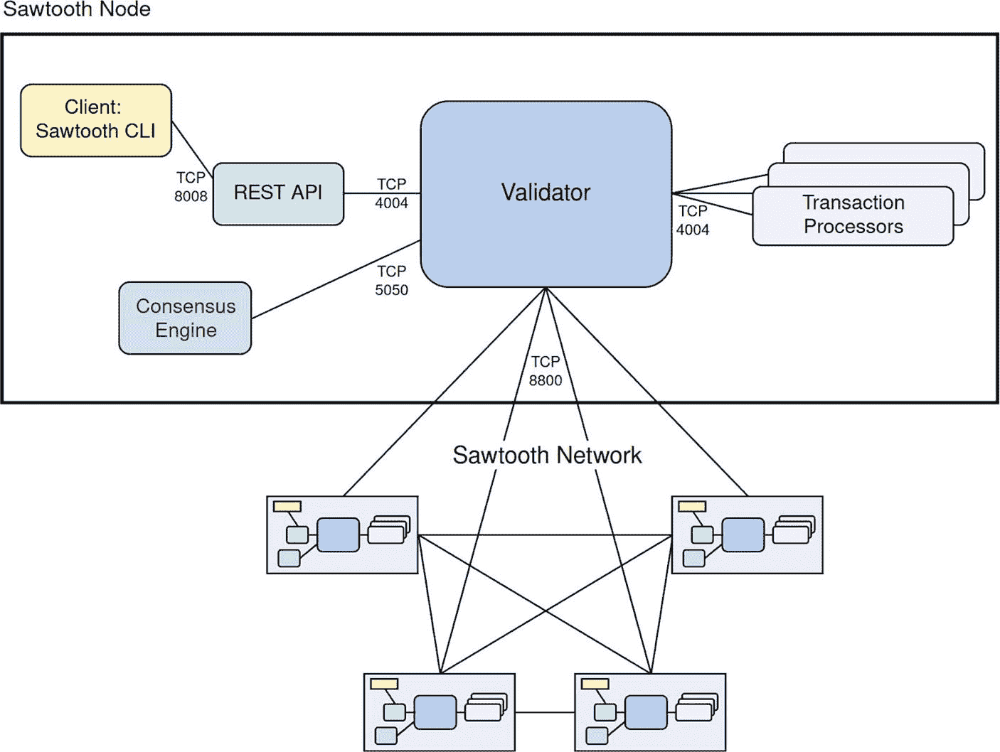
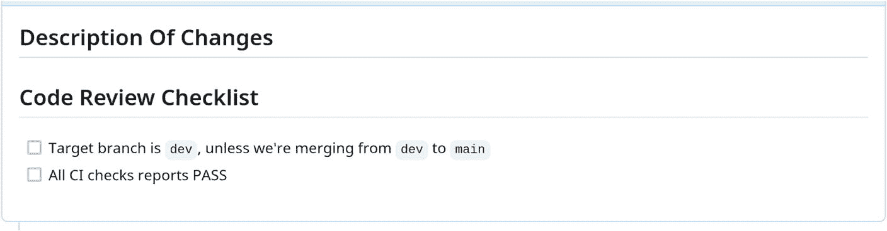

# 2. 区块链开发框架

在互联网上搜索“区块链开发框架”会得到大量结果，并且当你阅读本书时，偏好很可能已经发生了变化。具体细节会有所不同，但基本概念应该是相似的。在本章中，我将列出我个人使用过的框架，以便为后续章节提供更多背景信息。

## Hyperledger Sawtooth

Hyperledger Sawtooth 是由 Hyperledger 和 Linux 基金会主导，IBM、英特尔等公司共同贡献的一个区块链开发框架。该框架采用模块化架构，将核心系统与应用领域分离，使开发者能够为应用程序指定业务规则，而无需了解整个系统的底层设计。Sawtooth 支持多种共识算法。

Sawtooth 最初由英特尔贡献，是一个专为灵活性和可扩展性设计的区块链套件。交易业务逻辑通过所谓的 `Transaction Families` 与共识层解耦，这些“交易家族”既可支持受限语义，也可支持非受限语义。原网站：[`https://wiki.hyperledger.org/display/sawtooth`](https://wiki.hyperledger.org/display/sawtooth)。

Sawtooth 的初始版本使用 `Python` 实现，随后部分组件又用 `Rust` 重新实现。

**注意**：GitHub 上的原始 Hyperledger Sawtooth 仓库已于 2024 年 2 月 1 日（本书撰写期间）应其维护者要求归档。此后，该代码库的持续维护版本已迁移至 Splinter 社区，地址为 [`https://www.splinter.dev/`](http://www.splinter.dev/)。

Hyperledger Sawtooth 是我在 Creditcoin 1.x 区块链生命周期末期所体验到的该链所使用的开发框架。

## Substrate

Substrate，[`https://substrate.io`](https://substrate.io/)，是一个区块链框架，自称是快速构建定制化、面向未来的区块链的最强大框架。该框架允许开发者构建专业化的区块链应用。Substrate 由 Polkadot 网络和 Parity Technologies 主导，后者由以太坊首位 CTO 加文·伍德领导。

使用 Substrate 构建自己的区块链出奇地容易，只需按照其教程即可快速上手。参见 [`https://docs.substrate.io/tutorials/build-a-blockchain/build-local-blockchain/`](https://docs.substrate.io/tutorials/build-a-blockchain/build-local-blockchain/)。其核心概念是**可组合性**——你的区块链实现由多个称为“Pallets”（模块）的组件构成，这些组件在运行时中组合在一起。

Substrate 使用 `Rust` 编程语言构建，而 Polkadot 的其他工具则使用 `TypeScript` —— 这些通常包括客户端库和前端应用程序。

Creditcoin 2.x 及更高版本使用 Substrate 构建。

## Ethereum

我个人并未在以太坊上进行过任何开发与测试工作，但在此提及它是因为它非常流行。`Geth` 似乎是使用 `Go` 编程语言实现的主要以太坊客户端；参见 [`https://github.com/ethereum/go-ethereum`](https://github.com/ethereum/go-ethereum)。由于该实现是开源的，完全可以通过分叉并修改代码来创建你自己风格的定制化区块链。显然，Musicoin 链就是这样做的。另一方面，你更有可能在以太坊主网上部署智能合约，而非构建自定义链。

无论哪种情况，以太坊都有大量的开发工具可用；如有兴趣，请参见 [`https://ethereum.org/en/developers/docs/frameworks/`](https://ethereum.org/en/developers/docs/frameworks/)。

### 编程语言

本书讨论的编程语言构成了一种丰富多彩的组合：在 Creditcoin 1.x 时代，包括 `Python`、`C++` 和 `C# .NET`；而在 2.0 及更高版本中，则主要是 `Rust` 和 `TypeScript`。

`Rust` 是一种通用编程语言，强调性能、类型安全性和并发性。它在没有垃圾回收器的情况下保障内存安全。`Rust` 是一种静态类型且强类型的函数式语言，是系统编程（包括区块链等分布式系统以及 `Linux` 内核）的热门语言。

开发者格雷登·霍尔在 2006 年于 Mozilla Research 工作时，将 `Rust` 作为个人项目创建。Mozilla 于 2009 年正式赞助该项目，此后该语言得到了迅速普及。以下是 `Rust` 中 Hello World 程序的样子。

```
fn main() {
    println!("Hello, World!");
}
```

在 `Rust` 中，开发者可以使用 `struct` 或 `enum` 关键字创建用户自定义类型，然后使用 `impl` 关键字为这些类型附加方法。`Rust` 受到许多其他语言的影响，并非纯粹的面向对象语言。虽然你可以拥有带有数据和方法的用户自定义数据类型（看起来像类），但 `Rust` 没有真正的面向对象继承概念。相反，`Rust` 使用泛型、`trait` 和多态。如果你对 `trait` 不熟悉，可以将其视为一种接口定义，所有应支持该接口的数据类型都需要实现它。

从测试人员的角度来看，使用 `Rust` 会遇到一些“已知问题”：

- 编译器是你的朋友——内存安全几乎排除了随机的运行时故障；强类型意味着几乎不可能在代码块中误用本不该在那使用的变量（例如，复制粘贴问题）。
- 语言内置了优秀的自动化测试工具。
- 测试可以并行执行。
- 断言通过宏来执行，当断言失败时会产生运行时恐慌（`panic`）。
- 从头开始编译需要相当长的时间，因此保留构建缓存非常重要。
- 流行的代码覆盖率和静态分析工具可能对 `Rust` 支持不佳，因为它仍然是一门相对较新的语言。
- “单元”测试代码和“集成”测试代码之间的区别相对较小，如果你对该语言经验不足，可能不容易立即区分。
- 内置的测试框架库中没有用于共享 `setup/teardown` 的语法。

有关 `Rust` 语言特别是测试的更多信息，请参阅 [`https://doc.rust-lang.org/book/ch11-00-testing.html`](https://doc.rust-lang.org/book/ch11-00-testing.html)。

`TypeScript` 是带有类型语法的 `JavaScript`。`TypeScript` 是一种建立在 `JavaScript` 之上的强类型编程语言。

```
const message: string = 'Hello, World!';
console.log(message);
```

前面提到的 `Rust` 的优点在此同样适用。`TypeScript` 编译器和 `linter` 是测试人员最好的朋友，它们会为你捕获错误。一个巨大的优势是，流行的 `JavaScript` 测试框架都拥有 `TypeScript` 绑定，为测试自动化提供了更多选择，并且第三方工具和服务对其支持相当好。网站：[`https://www.typescriptlang.org/`](http://www.typescriptlang.org/)。

在 `Substrate/Polkadot` 生态系统中，首选的框架是流行的 `Jest` 测试框架，我在测试 `Creditcoin` 时广泛使用了它。如果你来自（例如）Web 应用的测试自动化背景，那么你可能拥有足够的经验来快速上手。我个人测试背景与 `Web` 和 `JavaScript` 相去甚远，但入门时只遇到了一些小问题。

`Solidity` 是一种静态类型的、使用花括号的编程语言，专为开发在以太坊及其他 `EVM` 兼容链上运行的智能合约而设计。

```
// SPDX-License-Identifier: MIT
pragma solidity ^0.8.24;

contract HelloWorld {
    string public greet = "Hello World!";
}
```

代码清单 2-3
`Solidity` 中的 Hello World 示例

上述示例展示了一个智能合约，该合约存储了一个特定值，但未暴露任何可供外部调用的函数，此处仅作说明之用。更多信息请参阅 [`https://soliditylang.org/`](https://soliditylang.org/)。

尽管 `Creditcoin` 最初并非智能合约平台，但始终需要与智能合约进行交互——请注意，实际的加密代币贷款转移和还款发生在外部区块链上。后来在 `Creditcoin 3.0` 版本中，智能合约成为了核心组成部分。

本书不涉及智能合约本身的测试，我个人在此领域也缺乏经验。但至少在需要与智能合约交互的边界场景中，能够阅读并理解 `Solidity` 代码至关重要。

### 如何构建区块链实现

区块链实现是一种复杂的基础设施类软件，类似于操作系统或数据库管理引擎。要实现一个具备分布式账本形态和运作方式的系统，需要构建所有相关组件和算法。

幸运的是，大多数软件公司并非操作系统或数据库供应商。这些公司更专注于利用区块链技术为客户解决特定问题（例如安全记录贷款交易），从而将区块链实现的关注点转移到其他领域。

在我看来，当今大多数实用的区块链应用要么构建在现有区块链平台上，要么使用区块链开发框架作为独立网络构建，或者至少是其他现有区块链实现的分叉。

作为从事区块链工作的测试人员和 QA 工程师，我们需要深刻理解基本原理，但主要精力会放在根据利益相关者需求测试业务领域功能和特定区块链组件上。只有极少数人会实际参与底层算法及复杂性的测试工作。即便我自己直接测试 `Creditcoin` 区块链，也很少需要深入探索 `Substrate` 框架的内部机制，尤其是出于测试目的。

以下是使用 `Substrate` 框架的区块链实现代码片段（代码清单 2-4）。

```
/// 具体数据类型定义
pub type BlockNumber = u32;
pub type Signature = MultiSignature;
pub type AccountId = ::AccountId;
pub type Signer = ::Signer;
pub type AccountIndex = u32;
pub type Balance = u128;
pub type Nonce = u32;
pub type Hash = H256;
/// 运行时中各模块的配置
impl pallet_balances::Config for Runtime {
    type RuntimeEvent = RuntimeEvent;
    type WeightInfo =     pallet_balances::weights::SubstrateWeight;
    type Balance = Balance;
    type DustRemoval = ();
    type ExistentialDeposit = ExistentialDeposit;
    type AccountStore = System;
    type ReserveIdentifier = [u8; 8];
    type RuntimeHoldReason = ();
    type FreezeIdentifier = ();
    type MaxLocks = MaxLocks;
    type MaxReserves = ();
    type MaxHolds = ();
    type MaxFreezes = ();
}
impl pallet_sudo::Config for Runtime {
    type RuntimeEvent = RuntimeEvent;
    type RuntimeCall = RuntimeCall;
    type WeightInfo =     pallet_sudo::weights::SubstrateWeight;
}
impl pallet_evm_chain_id::Config for Runtime {}
/// 实现运行时 API
impl_runtime_apis! {
    impl sp_api::Core for Runtime {
        fn version() -> RuntimeVersion {
            VERSION
        }
        fn execute_block(block: Block) {
            Executive::execute_block(block)
        }
        fn initialize_block(header: &::Header) {
            Executive::initialize_block(header)
        }
    }
    impl sp_api::Metadata for Runtime {
        fn metadata() -> OpaqueMetadata {
            OpaqueMetadata::new(Runtime::metadata().into())
        }
        fn metadata_at_version(version: u32) -> Option<OpaqueMetadata> {
            Runtime::metadata_at_version(version)
        }
        fn metadata_versions() -> Vec<u32> {
            Runtime::metadata_versions()
        }
    }
}
```

代码清单 2-4
`Substrate` 框架中区块链运行时的实现示例

完整版本请访问 [`https://github.com/gluwa/creditcoin3/blob/dev/runtime/src/lib.rs`](https://github.com/gluwa/creditcoin3/blob/dev/runtime/src/lib.rs)。

### 开发与测试的思考

与任何软件一样，构建方式会影响测试方式。

例如，在使用 `Hyperledger Sawtooth` 时，感觉抽象层级过多，让我很难完全理解。从测试角度来看，主要缺点是所有组件都作为独立的仓库/`Docker` 容器存在，因此很难单独测试某些功能。显而易见的选择是将整个系统视为一个大型整体，并从外部进行测试。

相比之下，基于 `Substrate` 的实现更像一个单体应用，所有内容都打包在一起。我发现上手更容易，工作效率也更高。`Substrate` 框架本身还提供了创建模拟运行时的功能，以便单独测试特定组件。这成为能够为 `Creditcoin` 构建全面单元测试套件的巨大推动力。

我需要指出，当我提到“测试框架”时，通常指的是特定编程语言中提供的实际工具和库。由于我的背景偏技术，且倾向于直接与开发者合作，因此很少涉及“创建自己的测试框架”，更多的是“直接编写代码，利用现有工具完成任务”，尤其是在单元测试方面。如果读者您来自不同背景，不必担心。您只需了解我的出发点即可。

在本书的初稿审阅阶段，我收到了 Jeroen Rosink 关于使用数据集进行测试/测试自动化的一个相当有趣的反馈。我认为我们在这方面存在很大分歧。请允许我详细说明。

在实际操作中，我不会保留测试数据来喂给测试场景，并执行数百笔贷款交易以寻找 bug。我更关心的是，传入的数据能否在不崩溃的情况下记录到区块链上，以及谁可以记录，例如借款人或贷款人。输入验证的许多方面实际上由底层编程语言处理。例如，当为某个参数指定了无符号整数数据类型时，我不需要显式测试是否不允许使用负值——我的编译器会处理这些，而彻底的代码审查就足够了。

另一个需要考虑的事实是，`Creditcoin` 是一个平台，最初是为了解决特定业务问题而创建的，后来演变为更通用的平台。在高抽象层面上，它只是一个区块链参与者可以记录数据的地方。这并不是说 `Creditcoin` 没有 bug，很可能是有一些的；然而，当你倾向于构建一个通用平台时，数据是否 100% 准确，以及你的软件是否允许用户搬起石头砸自己的脚，就变成了次要问题，因此你会相应地进行规划并确定优先级。

同样重要的是要注意，我的实践经验较少涉及针对共享环境运行的测试套件（其中先前状态和现有数据会影响其结果和/或影响准备测试数据的可用性），而更多地是使用编程语言即时创建临时环境，注入数据，并建模我需要的任何前置条件，作为被测系统的一部分，以便断言特定行为。也就是说，`Creditcoin` 的大部分测试发生在任何内容被合并并部署到现有网络之前。这进而也消除了区块链新版本部署后许多测试活动的必要性。这或许让我免于处理许多实际挑战，但这确实值得思考，具体取决于您所在组织及您个人如何看待测试。

### 总结

在本章中，我介绍了使用过的区块链开发框架，并讨论了它们之间的差异及其对测试的影响。

在下一章中，我将向您介绍 `Creditcoin` 是什么及其工作原理，这将是后续章节的基础，我将在其中与您分享我的测试历程。

## 第二部分：Creditcoin 区块链：目标与目的

## 3. 介绍 Creditcoin 区块链

`Creditcoin` 解决的主要问题之一是，发展中国家有数百万甚至数十亿人无法使用传统银行系统——也就是说，他们根本没有银行账户。这些人无法将信贷作为金融工具来改善生活，因为由于没有银行账户，他们无法使用这种传统工具。在某些地区，可能还缺乏实体基础设施，例如银行网点，来实现这种接入。

例如，想象一位农民，他愿意承担债务来购买机械，这能节省数小时的体力劳动，从而提高生产力。当你无法使用基础设施时，这根本不可能实现，而这正是 `Creditcoin` 发挥作用的地方。

### 什么是 Creditcoin

`Creditcoin` 最初是一个与区块链无关的投资协议，允许参与者借出和借入任何加密货币。在其官网上，它也被描述为“无国界金融平台”，此后该平台不断发展。该协议的详细内容发布在 `https://creditcoin.org` 网站上的一份白皮书中，第一版于 2017 年发布，此后已多次更新。

`Creditcoin` 区块链是 `Creditcoin` 协议的规范开源实现，由 `Gluwa, Inc.` 构建和维护。它是一个面向投资相关活动的区块链网络，将贷款交易记录在分布式公共账本上。这使得现实世界资产得以表示，并促进了投资者与筹资者之间的连接。这些记录将永久存储在区块链上，感兴趣方（例如传统贷款机构）可在未来利用这些数据进行信用评估。

本书中提到的 1.x 和 2.x 版本范围较窄，主要关注贷款相关交易的记录，而最新的 3.x 版本则变得更加通用，演变为一个多链信用协议，通过原生支持智能合约来赋能现实世界资产。在 `https://gluwa.com/` 网站上，这一最新迭代版本被称为“推动全球金融包容性的技术”，不过这里我就不展开了。



图 3-1
Creditcoin 的示意图

贷款条款、还款和信用表现等信息均可在 `Creditcoin` 区块链上获取，从而促进简单透明的风险评估，并将 Web3 资本与现实的信用投资机会连接起来。`Creditcoin` 区块链本身是创建与贷款相关的其他金融产品（例如点对点借贷平台、投资平台、交易所，或上述功能的组合）所必需的基础设施。

原始 `Creditcoin` 贷款周期的完整架构图在本页展示：

`https://docs.creditcoin.org/cc2/faq#how-does-the-creditcoin-network-use-ctc`

如图 3-1 所示，`Creditcoin` 在设计上是多链的。原生记录在 `Creditcoin` 链上的数据代表了贷款条款和协议，以及参与者之间随时间变化的借贷、放贷和还款状态。例如，Alice 可以记录她正在寻求特定条款的贷款，然后 Bob 可以记录他愿意按相同条款放贷，最后他们的协议记录（称为 `DealOrder`）可以被记录在链上。`Creditcoin`（至少在最初的设计中）不支持加密货币，这意味着实际的资产转移发生在 `Creditcoin` 网络之外。资产转移在外部区块链网络上进行，并由第三方加密代币表示。例如，如果用 `ETH` 进行借贷，交易会记录在以太坊主网上。如果使用不同的加密代币来记录法币交易，则可能会使用其他与以太坊兼容的网络，如 `Goerli` 或 `Sepolia`。当外部区块链上的资金发生转移时，这一行为必须记录到 `Creditcoin` 中。实际记录包含外部链上的有效交易哈希，`Creditcoin` 软件会（例如）访问以太坊来检查并验证提交给它的信息。两个参与者之间转移的金额及其地址应与之前在 `Creditcoin` 中记录的他们的身份和贷款条款相匹配。最初的 1.x 版 `Creditcoin` 实现也包含了针对比特币的概念验证代码；不过，我不知道该代码是否在实际中曾被使用过。

`Creditcoin` 区块链会验证并记录其他区块链上的外部工件（如地址和交易），并将其记录到自己的链上，同时还会验证地址的所有权（例如在以太坊上）。

`Creditcoin` 区块链上的原生加密代币称为 `CTC`。它作为一种实用代币，用于保证区块链本身的经济稳定性。在撰写本书时，`CTC` 代币并未直接用于借贷。

从商业角度来看，`Creditcoin` 背后的模型可描述为“基础设施即服务”。该区块链基础设施的主要使用者将是金融科技合作伙伴，他们希望将交易记录到区块链上，并愿意访问先前的信用记录，以及/或获得该基础设施所支持的潜在新市场及商业机会。例如，尼日利亚的 Aella 就是这样的合作伙伴之一。事实上，根据 `Creditcoin` 文档，[Aella](https://aellaapp.com/) 是 `Creditcoin` 区块链的首个机构用户，其在 [2022 年 6 月](https://medium.com/creditcoin-foundation/creditcoin-x-aella-integration-live-c8b8eb3b606d) 将其运营与 `Creditcoin` 进行了集成。

真实用户会参与信用相关活动，例如，我例子中的农民或投资代理在技术上可以直接使用区块链；这在展示 `Creditcoin 1.x` 客户端程序的 YouTube 视频中甚至有过演示。不过，我认为这并非一个可行的长期策略。这类用户更有可能在日常交互中使用移动应用，然后该移动应用会直接或通过某种后端 `API` 层与区块链基础设施进行通信。事实上，`Gluwa, Inc.` 也一直在开发这样一个名为 `Credal` 的 `API` 层，但我并未过多参与这方面的工作。

区块链上的所有参与者都需要支付交易费用，无论他们是只执行少量交易的自然人，还是在网络上记录数千笔交易的借贷合作伙伴。然而，绝大部分运营费用由那些运行计算机节点（即各种区块链节点）的人承担；他们通常需要向云服务提供商支付计算、存储容量和网络带宽的费用。

### 对测试活动的影响

请注意，本书所涵盖的时间段与 `Creditcoin` 自身的快速开发及演变相吻合。一方面，从 3.0 版本开始，`Creditcoin` 的定义开始向更通用的区块链网络转变。另一方面，我们需要讨论这对测试活动的影响。

与任何快节奏环境一样，实际的工程和测试活动可能看起来非常混乱，并且与我们能在更传统或更慢速环境中发现的情况不同。具体来说：

- 没有太多时间正式收集和记录深入的需求。通常，需求目标本身会在实际技术实施进行时发生变化。
- 技术细节通常未知且不明确。这在当今的软件世界中并不罕见，因为用于构建软件的多个抽象层和第三方组件随处可见。而在区块链世界中，由于分布式系统固有的复杂性，这种情况可能更胜一筹。
- 测试策略可能不会立即显现，这是前述项目的直接后果。很多时候，测试会基于基本原则开始，覆盖最明显的正向和负向场景，并随着我们对被测系统了解的增加而逐步扩展。这与其他软件测试项目相比并没有太大不同，但可能由于环境本身风险较高，遗漏重要测试的风险略高。
- 与更传统类型的应用相比，可用的测试工具选择较少。例如，如果我没记错的话，在最初研究 `Substrate` 的客户端库时，只有两个可用——一个用 `Python` 编写，另一个用 `TypeScript` 编写。现在我可以找到第三个，用 `Rust` 编写。虽然我个人更喜欢 `Python`，但当时那个特定的库不支持异步函数，而整个 `Substrate API` 都是异步的。所以技术选择其实并非真正的选择。

后续章节将记录具体场景，但需要注意的是，这里涉及大量的第三方开源组件。事实上，`Creditcoin 3.0` 版本几乎完全由第三方依赖项组成，其自身的原生组件非常少。我个人认为，对于区块链而言，这比 `Web` 或移动开发带来了更高的风险。

虽然 `Web` 和移动开发同样依赖许多第三方组件，但背后的组织通常不是你的直接竞争对手。例如，`Django` 和 `Ruby on Rails` `Web` 框架由大型社区开发，并由各自的非营利基金会管理，其唯一目的是为其他 `IT` 社区提供更好的框架来创建 `Web` 应用。另一个例子是分别由 `Facebook` 和 `Google` 支持的 `React Native` 和 `Flutter` 移动应用框架。虽然 `Facebook` 和 `Google` 都不是独立的软件供应商，但它们的核心业务依赖于快速开发高质量应用的能力，并且它们开发了大量的软件，这意味着它们实际上有直接的动机来创建优秀的通用开发框架。

具体来说，关于 `Substrate` 区块链框架及其生态系统，其主要开发者是 `Polkadot/Parity Technologies`，其核心业务是运行 `Polkadot` 网络区块链。虽然他们在提供通用区块链框架方面做得非常出色，但我们必须考虑到，某些组件的内部优先级可能高于其他组件，这与其业务目标一致。特别是，我在 `Polkadot Staking Dashboard` 代码库中看到了一些在 `Creditcoin` 方面导致问题的领域。这是一种情况，同样的核心技术导致了在同一领域内运营的两个不同供应商面临已知问题和 Bug 的不同严重程度。在我看来，这是一种需要考虑的技术风险形式，这种风险在更传统的 `Web` 和移动世界中程度较低。

由于上述所有因素，我认为 `Creditcoin` 的测试策略可以概括为 **计划-构建-测试-发现-重复**，或者像我称之为的那样，*“吃饭、睡觉、测试、重复。”* 也就是说，测试 `Creditcoin` 和提高质量是一个迭代过程，随着新领域和风险的发现，这个过程不断自我强化。

这也意味着，测试区块链实现与开发紧密耦合，通过将测试工程师直接嵌入开发团队，你可以获得最大的成果。考虑到已经提到的所有约束条件，我认为不可能有其他方式。

关于测试的好消息是，尽管 `Creditcoin` 区块链用于记录有关现实世界金融资产的信息，但它并不直接处理此类资产。贷款和还款转账由其各自方在单独的区块链上发起，这意味着你不直接处理转账，而只检查和记录关于它们的信息。这大大降低了任何金融服务应用中存在的相关风险。

可能发生的最坏情况是完全服务中断和 100% 的数据丢失。从业务和工程的角度来看，这仍然是一个噩梦般的场景，但比损失数百万真实金融资产的风险小得多。为了便于讨论，人们可以通过在热备份上增加冗余服务能力、制定良好的备份和灾难恢复程序、以及制定在发生最坏情况时的应急计划，来规避此类技术风险。

### 总结

既然我已经介绍了 `Creditcoin` 的历史及其目标，那么让我们进入测试环节！在接下来的几章中，我将讨论我在 `Creditcoin` 实现的各个主要版本期间所做的工作。

脚注 1   2   3

## 第三部分 测试 Creditcoin 区块链

## 4. 信用币 1.0 版

这是信用币的第一个实现版本，采用超级账本锯齿湖开发框架，初始版本为 1.0.5，后来切换到框架的 1.2 版本。信用币 1.x 是一个工作量证明区块链。一个重要的补充说明是，锯齿湖本身最初是用 `Python` 编写的，在后来的版本中，其某些组件被用 `Rust` 重写。一个锯齿湖节点代表多个组件的集合，如图 4-1 所示。



图 4-1
多个参与网络的锯齿湖节点示意图 许可协议：[知识共享署名 4.0 国际许可协议](http://creativecommons.org/licenses/by/4.0/)；参见[`https://github.com/hyperledger/sawtooth-docs/tree/main#license`](https://github.com/hyperledger/sawtooth-docs/tree/main#license) 来源：[`https://github.com/hyperledger-archives/sawtooth-docs-archive/blob/main/docs/1.2/app_developers_guide/creating_sawtooth_network.md`](https://github.com/hyperledger-archives/sawtooth-docs-archive/blob/main/docs/1.2/app_developers_guide/creating_sawtooth_network.md) [`https://github.com/hyperledger-archives/sawtooth-docs-archive/blob/main/images/1.2/appdev-environment-multi-node.svg`](https://github.com/hyperledger-archives/sawtooth-docs-archive/blob/main/images/1.2/appdev-environment-multi-node.svg)

使用超级账本锯齿湖实现的区块链包含多个相互连接的节点。在信用币的锯齿湖架构中，上述每个组件都作为独立程序实现，并以容器镜像形式分发。单个信用币节点是一组一起运行的容器集合，例如，在测试期间通过 `docker-compose` 启动。

### 信用币 1.0 版的组件

以下是信用币 1.0 版高层级组件的列表。请务必记住，这些组件彼此完全独立，以独立容器形式分发，并通过多种网络协议相互通信以及与其他信用币节点通信！每个组件可能都有自己的子组件！

#### 客户端

`ccclient` 是一个命令行程序，允许用户与信用币区块链交互，方法是注册其以太坊地址、收集一些初始 `CTC` 代币，然后作为贷款人、借款人或收款人参与贷款周期。该程序不仅允许用户向区块链发送特定交易，还允许他们执行某些查询。例如，以下是一些命令的示例：

```
list Transfers
list AskOrders
list BidOrders
list Offers
show Balance sighash|0
show Address sighash|0 blockchain address network
show MatchingOrders sighash|0
show CurrentOffers sighash|0
show CreditHistory sighash|0
show NewDeals sighash|0
show Transfer sighash|0 dealOrderId
show CurrentLoans sighash|0
creditcoin SendFunds amount sighash
creditcoin RegisterAddress blockchain address network
creditcoin RegisterTransfer gain transferId txId
creditcoin AddAskOrder addressId amount interest maturity fee expiration
creditcoin AddBidOrder addressId amount interest maturity fee expiration
creditcoin AddOffer askOrderId bidOrderId expiration
creditcoin AddDealOrder offerId expiration
bitcoin RegisterTransfer gain dealOrderId|repaymentOrderId sourceTxId
ethereum RegisterTransfer gain dealOrderId|repaymentOrderId
erc20 RegisterTransfer gain dealOrderId|repaymentOrderId
```

此应用程序从 `json` 文件读取配置，然后与锯齿湖网络图中单个节点的 `REST API` 端点进行通信。它可以是任何节点，但通常是信用币的公开访问 `URL`，或您自己运行的节点。此组件使用 `C# .NET` 编写。

源代码：[`https://github.com/gluwa/creditcoin-legacy-client`](https://github.com/gluwa/creditcoin-legacy-client)

#### 验证器

在锯齿湖框架中，验证器组件确保相同的交易将产生相同的状态转换，并且对于网络中的所有参与者，最终的数据是相同的。验证器有两个主要的子组件，它们使用调度器基于交易处理来计算状态变化和由此产生的默克尔哈希。这些子组件负责创建新的候选区块、完成已发布的区块以及验证提议的区块，以确定它们是否应被考虑作为新的链头。尽管名称相同，但请不要将其与信用币 2.0 及更高版本范围内定义的验证器混淆。

虽然共识接口负责确定谁可以发布区块、发布的区块是否符合共识规则，以及在分叉情况下哪个区块应成为链头，但实际发布区块的是验证器组件。

信用币 1.x 中的验证器组件基于 `hyperledger/sawtooth-validator:1.0` 容器镜像，该镜像使用 `Python` 实现。为信用币部署的容器镜像是自定义构建版本，带有热修复补丁，覆盖了与工作量证明相关的原始 `Python` 文件！

请注意，在信用币 1.x 生命周期末期，曾尝试切换到 `hyperledger/sawtooth-validator:1.2`，该版本本身使用 `Rust` 实现，信用币团队贡献了一些补丁。由于书中将进一步讨论的原因，这次切换很短暂。

另一个重要说明是，此组件仍然属于一个较旧的单一代码仓库，而其他一些组件已被转换为独立的 `git` 仓库！这种结构反映了工程团队的成长以及同时进行的 `git` 仓库整体重组。

源代码：[`https://github.com/gluwa/creditcoin-legacy/tree/dev/PoW`](https://github.com/gluwa/creditcoin-legacy/tree/dev/PoW)

#### 共识

信用币 1.x 使用一个工作量证明共识引擎，该引擎由团队开发，并通过锯齿湖的内部互连协议直接连接到验证器组件。它使用 `Rust` 编程语言实现。由于 `git` 历史记录不早于我加入信用币团队的时间，我不完全确定这个共识实现是否从一开始就存在，还是取代了之前存在的另一个实现。

源代码：[`https://github.com/gluwa/creditcoin-legacy-consensus-rust`](https://github.com/gluwa/creditcoin-legacy-consensus-rust)

#### 交易处理器

在 `Hyperledger Sawtooth` 框架的架构中，交易事务通过一个可扩展的系统（称为交易族）来定义。每个应用程序为其独特需求定义自定义交易族；这是区块链应用的业务逻辑。对于 `Creditcoin` 而言，这包括如何建模贷款周期并将其工件记录到区块链上。

`Sawtooth` 框架允许应用开发者使用他们选择的编程语言编写交易处理器。有效的交易族集合最初在创世块中配置，并作为链上值保存，后续可以进行更改。`Creditcoin 1.x` 使用两个独立的交易处理器，它们作为节点的一部分以独立容器的形式运行。

`Settings-tp` 最初源自 `hyperledger/sawtooth-settings-tp:1.0`（`Python`），后来升级为 `hyperledger/sawtooth-settings-tp:1.2`（`Rust`）。此交易处理器负责存储链上设置，例如网关 `URL`（见下文）、有效的交易族及其版本、共识算法及其属性等。它作为一个键值对存储在区块链上，并且还可以定义供其他组件使用的自定义设置。

`CREDITCOIN` 交易族处理器理解贷款周期的概念。其版本自 1.1 以来，依次经历了 1.1、1.2、1.3 乃至 1.8 的演进。客户端发送的每个交易都包含一个版本号，并且可以被拥有兼容版本号的交易处理器所理解。换言之，这就是协议升级的方式。`CREDITCOIN` 族处理器使用 `Protocol Buffers` 数据格式解析原始交易负载，并在将交易交给验证器组件写入链之前执行一些维护任务，例如关闭过期的贷款请求。

`Creditcoin` 交易处理器版本 1.0 到 1.7 最初使用 `C++` 实现，并一直使用到 2021 年中旬我开始处理 `Creditcoin` 时。

源代码：[`https://github.com/gluwa/creditcoin-legacy/tree/dev/ccprocessor`](https://github.com/gluwa/creditcoin-legacy/tree/dev/ccprocessor)

大约在同一时间，`Creditcoin` 交易处理器使用 `Rust` 完全重写，并向后兼容支持 1.0 到 1.7 族，这也是我主要使用的版本。这个新实现旨在作为之前提到的切换到 `Sawtooth 1.2` 的一部分进行部署。请注意，尽管版本号格式看起来像兼容的 `SemVer` 数字，但同一交易处理器族的不同版本可能彼此不兼容。这意味着使用旧版本的区块链运营商可能无法处理来自新客户端的事务，他们应该进行升级。例如，这可能是由于后续版本中添加了新的事务，如果由旧版交易处理器执行，则会失败。

最后一个支持的事务族版本是 1.8！

源代码：[`https://github.com/gluwa/creditcoin-legacy-processor-rust`](https://github.com/gluwa/creditcoin-legacy-processor-rust)

#### REST API

`Sawtooth` 框架提供了一个 `REST API`，允许客户端和外部应用使用常见的 `HTTP/JSON` 协议与区块链交互。它提供了一个与语言无关的接口，用于提交事务和读取区块。特别地，这对于在测试期间使用 `curl` 或你偏好的编程语言的库来查询区块信息非常有用。所有响应均采用 `JSON` 格式。

`REST API` 是构建在 `Sawtooth` 内部 `ZeroMQ/Protobuf` 通信层之上的轻量级层。如果愿意，客户端可以完全绕过 `REST API` 接口，直接使用 `ZeroMQ/Protobuf` 与区块链通信。

`Creditcoin` 中使用的 `REST API` 组件是 `hyperledger/sawtooth-rest-api` 的一个分支，并在其基础上进行了微小的外观修补。据我所知，使用自定义容器是因为原始 `sawtooth-core` 仓库是一个单体仓库，而非其他原因。

源代码：[`https://github.com/gluwa/sawtooth-legacy-core/tree/dev/rest_api`](https://github.com/gluwa/sawtooth-legacy-core/tree/dev/rest_api)

#### 网关

网关组件促进与外部区块链的通信，以验证加密代币的转移。这就是后续版本中所谓的“链下工作者”组件。也就是说，它会确保当 `Creditcoin` 记录贷款人与借款人之间的贷款事务时，双方之间有相应的、相同金额的转移被记录在外部区块链（如以太坊）上。

`Creditcoin` 网关监听一个网络套接字，接收以下形式的请求：

```
verify      
```

网关与 `CREDITCOIN` 交易处理器之间的通信协议是 `ZeroMQ`，而网关与区块链 `RPC` 端点之间的通信则依赖目标链，使用 `Nethereum` 或 `NBitcoin` 库实现。

此组件使用 `C# .NET` 实现，并异步并行处理所有请求。网关实现了比特币、`ERC20`、以太坊和 `Ethless` 插件，其愿景是未来可以支持其他区块链网络。据我所知，只有以太坊经过了测试并在生产环境中得到正式支持！

源代码：[`https://github.com/gluwa/creditcoin-legacy-gateway`](https://github.com/gluwa/creditcoin-legacy-gateway)

#### SDK

`Sawtooth-SDK-Rust` 和 `Sawtooth-SDK-Cxx` 是其各自上游仓库的分支，用于开发 `Creditcoin` 交易族处理器。它们包含许多与 `Creditcoin` 相关的补丁。

源代码：[`https://github.com/gluwa/sawtooth-legacy-sdk-rust`](https://github.com/gluwa/sawtooth-legacy-sdk-rust) [`https://github.com/gluwa/sawtooth-legacy-sdk-cxx`](https://github.com/gluwa/sawtooth-legacy-sdk-cxx)

`Creditcoin-Shared` 是一个 `C#` 库，被一些使用该编程语言编写的组件使用，例如网关组件。

源代码：[`https://github.com/gluwa/creditcoin-legacy-shared`](https://github.com/gluwa/creditcoin-legacy-shared)

请注意，在过渡到 `Creditcoin 2.0` 之后，所有与 1.x 相关的仓库都已重命名，其名称中包含 `-legacy-` 模式。我们曾经称之为 *processor* 的组件现在变成了 `creditcoin-legacy-processor-rust`！在本书的其余部分，我将使用当前名称来指代各个组件，以最大程度地减少混淆。

#### Creditcoin-Legacy-Tests

这是 1.x 发布系列的主要测试套件。它是一个集成类型的测试套件，通过 `RPC` 端点向区块链发送事务。它由外部触发和执行，并存在于一个独立的 `git` 仓库中。不幸的是，该源代码仓库不可公开获取，因此我们在本书中不会过多讨论它。

这个仓库中的大部分基础工作在我开始研究时已经存在，我添加了一些改进和新的测试场景，但没有改变测试套件本身的整体架构。相同的代码库还被用作创建性能基准测试工具的起点。这个测试套件主要使用 `C# .NET` 编写，最初使用 `MSTest`，后来改用 `NUnit` 测试框架。

#### Creditcoin-Legacy-Docker-Compose

用于 `Creditcoin v1.x` 主网的 `Docker Compose` 文件。该仓库是 `Creditcoin 1.x` 各组件的各种 `Docker` 镜像的规范参考，也是如何启动必要组件以成为网络参与者的配置示例。它也是创建用于测试目的配置的起点。

源代码：[`https://github.com/gluwa/creditcoin-legacy-docker-compose`](https://github.com/gluwa/creditcoin-legacy-docker-compose)

#### Creditcoin-Legacy-Docker-Compose-Testnet

这是后文讨论的用于测试的仓库。它包含用于部署隔离测试环境的配置文件和对 `Docker` 镜像的引用。

后来，社区成员也监控此仓库，以获取测试即将发布的 `Creditcoin 1.8` 版本所需的最新容器版本信息！

源代码：[`https://github.com/gluwa/creditcoin-legacy-docker-compose-testnet`](https://github.com/gluwa/creditcoin-legacy-docker-compose-testnet)

### Creditcoin 1.x 时间线

根据 `GitHub` 和 `Docker Hub` 上的公开历史记录，我可以梳理出以下时间线。此处主要是为了提供背景参考。

1.  我于 `2021 年 6 月 17 日` 开始与 `Creditcoin` 团队合作。
2.  我的第一个拉取请求似乎是在 `2021 年 7 月 13 日`。
3.  `Creditcoin 1.7.1` 于 `2021 年 7 月 23 日` 发布，我并未参与其中。
4.  基于 `Sawtooth` 框架的 `Creditcoin 1.8` 容器镜像于 `2022 年 3 月 28 日` 作为 `1.x` 网络的最后一个版本发布到 `Docker Hub`。

实际上，我对 `1.x` 系列的最后一个更新进行了测试，耗时大约 6 个月，因此如果信息不完整，还请见谅。后续章节会提供更多时间戳信息。

### 测试 Creditcoin 1.x

当谈到 `Creditcoin 1.x`，特别是测试以及普遍改进团队工作以提高软件质量的话题时，我们必须考虑其所处的时期。在我看来，测试与流程和组织变革相结合是不可避免的。

这里关注的时间段大致是 2021 年，在此期间团队开始在 `GitHub` 上为每个组件使用独立的公共仓库。这也是团队过渡到与一名全职 `QA` 工程师（即我本人）直接合作，并嵌入团队的时期。

**仓库创建时间线：**

*   `2018 年 11 月 27 日`：创建了 [`https://github.com/gluwa/creditcoin-legacy`](https://github.com/gluwa/creditcoin-legacy)
*   `2019 年 2 月 28 日`：创建了 [`https://github.com/gluwa/creditcoin-legacy-docker-compose-testnet`](https://github.com/gluwa/creditcoin-legacy-docker-compose-testnet)
*   `2019 年 7 月 29 日`：创建了 [`https://github.com/gluwa/creditcoin-legacy-docker-compose`](https://github.com/gluwa/creditcoin-legacy-docker-compose)
*   `2021 年 4 月 14 日`：在 `fork` 中提交了 [`https://github.com/gluwa/sawtooth-legacy-sdk-cxx`](https://github.com/gluwa/sawtooth-legacy-sdk-cxx) 的首次提交。
*   `2021 年 4 月 17 日`：创建了 [`https://github.com/gluwa/creditcoin-legacy-shared`](https://github.com/gluwa/creditcoin-legacy-shared)
*   `2021 年 4 月 17 日`：创建了 [`https://github.com/gluwa/creditcoin-legacy-client`](https://github.com/gluwa/creditcoin-legacy-client)
*   `2021 年 5 月 12 日`：在 `fork` 中提交了 [`https://github.com/gluwa/sawtooth-legacy-core`](https://github.com/gluwa/sawtooth-legacy-core) 的首次提交。
*   `2021 年 5 月 28 日`：创建了 [`https://github.com/gluwa/creditcoin-legacy-processor-rust`](https://github.com/gluwa/creditcoin-legacy-processor-rust)
*   本人正式加入团队。
*   `2021 年 8 月 3 日`：创建了 [`https://github.com/gluwa/creditcoin-legacy-consensus-rust`](https://github.com/gluwa/creditcoin-legacy-consensus-rust)
*   `2021 年 9 月 21 日`：在 `fork` 中提交了 [`https://github.com/gluwa/sawtooth-legacy-sdk-rust`](https://github.com/gluwa/sawtooth-legacy-sdk-rust) 的首次提交。
*   `2021 年 9 月 29 日`：创建了 [`https://github.com/gluwa/creditcoin-legacy-gateway`](https://github.com/gluwa/creditcoin-legacy-gateway)

**CI 启用时间线：**

*   `2020 年 2 月 25 日`：**creditcoin-legacy-docker-compose-testnet** – 用于 `GitHub Pages` 构建的 `CI` 状态，此仓库无实际测试。
*   `2020 年 7 月 15 日`：**creditcoin-legacy-docker-compose** – 用于 `GitHub Pages` 构建的 `CI` 状态，直到我加入团队后才开始进行测试。
*   `2020 年 10 月 27 日`：**sawtooth-legacy-core** – 在 `fork` 中的一次提交上报告了首个 `CI` 状态，似乎是一个 `Azure` 流水线。配置文件不在 `git` 中，实际的 `CI` 任务日志早已丢失。我假设这是一个编译任务，根据 `GitHub` 上的提交历史来看，它似乎并未在每次提交时都触发。
*   `2021 年 4 月 14 日`：**sawtooth-legacy-sdk-cxx** – 在 `GitHub` 中启用 `CI`；`fork` 中有两次之前的提交。它在 `Docker` 容器内运行 `CMake` 构建。
*   `2021 年 4 月 26 日`：**creditcoin-legacy-shared** – `Azure` 流水线已不可用，源代码不在 `git` 中，我假设它是一个构建/编译任务。稍后在 6 月，有来自安全扫描服务 `Snyk` 报告的扫描状态，这些状态与个人账户关联，随后消失。
*   `2021 年 4 月 26 日`：**creditcoin-legacy-client** – 同样是 `Azure` 流水线，源代码不在 `git` 中，流水线也已不可用。我假设它是一个构建任务。同年晚些时候，我们可以看到一些来自 `Snyk` 的状态报告，但之后消失了。
*   我加入了团队，开始快乐地测试！
*   `2021 年 6 月 17 日`：**sawtooth-legacy-core** – 首个带有状态检查的 `PR`。
*   `2021 年 6 月 18 日`：**creditcoin-legacy** – 首个 `CI` 状态。
*   `2021 年 7 月 20 日`：**sawtooth-legacy-core** – `fork` 中的首个 `GitHub Actions`。
*   `2021 年 7 月 20 日`：**creditcoin-legacy-processor-rust** – 在主分支上记录了首个 `CI` 状态，但默认开发分支上没有。
*   `2021 年 8 月 9 日`：**creditcoin-legacy-consensus-rust** – `Azure Pipelines`。
*   `2021 年 8 月 23 日`：**creditcoin-legacy-docker-compose** – `CI` 中的首次实际测试，但从未合并。
*   `2021 年 8 月 13 日`：**creditcoin-legacy-consensus-rust** – `GitHub Actions`。
*   `2021 年 9 月 21 日`：**sawtooth-legacy-sdk-rust** – 在 `GitHub Actions` 中启用 `CI`；`fork` 中的首次提交。
*   `2021 年 9 月 29 日`：**creditcoin-legacy-gateway** – `Azure Pipelines` 和 `GitHub actions`。

#### 我加入前的测试状况

根据公开的 `GitHub` 历史记录，两个仓库正在运行 `GitHub Pages` 动作，但并未对被测软件本身进行任何实际检查。另外四个仓库正在 `Azure DevOps` 中运行 `CI` 流水线，我推测这些流水线仅编译软件，而没有执行其他操作。

`Azure` 中的这些流水线似乎未在源代码中定义，其定义似乎也不是任何 `git` 仓库的一部分，因此我无法判断这些流水线执行了何种测试。同样不清楚这些 `Azure CI` 任务是如何触发的，以及这是否是一个可靠的事件，因为有些提交和拉取请求上没有报告任何状态。

#### 测试概览

在我加入 `Creditcoin` 团队时，恰好赶上各个组件的独立 `GitHub` 仓库相继发布。这个时间点位于`v1.7`版本发布之后、`v1.8`版本发布之前。

与此同时，我一直在努力弄清楚每个组件的功能及其对应的测试需求。以下我概括了几个主要方面。

私有仓库 `creditcoin-legacy-tests` 中的测试套件及其相关工作项，可能消耗了我大部分的精力。

对于每个独立的仓库，我通常试图了解其现有测试覆盖情况，并确保已启用通用的测试和静态分析工具：

- 使用 `GitHub Actions` 为每个拉取请求启用持续集成执行。弃用未纳入 `git` 管理的旧版 `Azure Pipelines`。
- 执行所有明显的单元测试（例如 `cargo test`），并在可能的情况下开始收集覆盖度指标，以便为后续决策提供依据。
- 启用静态分析工具（即 `linter`）和代码格式化工具（例如 `cargo check`、`cargo fmt`），并了解当前状态。着手修复报告的问题。
- 开始使用 `Dependabot` 来保持依赖项为最新版本。
- 为组件构建 `Docker` 容器，并针对其进行健全性检查，因为这是组件的预期交付方式。
- 尝试其他静态分析工具，看看哪些有帮助（例如 `SonarCube`），并修复一些代码异味作为初步改进。

对于上游仓库的所有分支，尽可能尝试做同样的工作，但这并非总能成功。请记住，在最初的几个月里，我对区块链的整体工作原理仍缺乏深入理解，更不用说 `Creditcoin` 的各个组件及其上游仓库是如何组合在一起的了！

在流程方面，建立这样一种模式：测试工程师将参与代码审查、缺陷验证，最好能直接基于现有的拉取请求进行测试，并在**任何内容合并之前**将工单移至“完成”状态！为代码审查建立一份检查清单，其中一项是添加新的单元/集成测试。同时，启用分支保护规则，并要求拉取请求在合并前至少获得两个批准。你可能会争辩说这不是测试人员的工作，但我会反驳。如果它能提高质量，那就是我的工作！

在此期间，我试图更熟悉 `Hyperledger Sawtooth` 框架以及 `Creditcoin 1.x` 的各种组件，以便开始添加用 `Rust` 编写的单元测试和集成测试。由于优先级、时间限制以及 `Sawtooth` 的特性，我在这方面并未成功。我只设法在这里和那里为一些独立函数添加了几个显而易见的单元测试，但远未达到我期望的数量。在后续章节中，你会看到 `Creditcoin 2` 与此完全相反。

在此期间，大部分焦点集中在集成测试套件上，并利用它来为即将到来的 `v1.7` 到 `v1.8` 版本切换做准备。`1.8` 版本的事务族与旧版本不兼容，而且几乎所有其他组件都发生了变更，这使得我们需要更严格地演练和测试这条迁移路径。

由于一个 `Sawtooth` 节点由多个独立组件表示，每个组件都作为一个独立的容器运行，因此直接基于拉取请求进行测试并不容易。你需要硬件资源才能启动一个独立的区块链，而且功能变更通常可能涉及多个组件。这意味着孤立地进行测试是不切实际的。实际上，我经常做的是检出所有相关的拉取请求，有时会将相关提交 `cherry-pick` 到一个临时分支；然后为所有组件重建 `Docker` 镜像，并使用前面提到的 `docker-compose` 文件启动一个本地链。接着，由于主测试套件是一个集成类型的套件，其访问控制机制与其余组件不同（即不公开在 `GitHub` 上），执行它最实际的方法是将它的配置指向新创建的链，并手动启动所有测试场景。鉴于现有基础设施，这并非无法实现自动化，但也并非特别实用。

虽然并非不可能，但使用集成类型的测试套件，跨多个分布在几个不同仓库中、用不同编程语言编写的组件来收集覆盖度指标，同样不切实际。因此，我并不清楚现有测试套件对实现的覆盖程度和深度。我分析了现有测试套件的源代码，据我所知，它至少对贷款周期中的每个事务都执行了一次，包括正向和逆向场景。是否存在遗漏的测试场景，或者某些场景实际上是彼此重复的，我完全不知道，而且哪种情况才是事实也并不明显。

#### 测试改进

我将本节命名为“测试改进”，因为当时我对 `Creditcoin 1.x` 的所有组件仍然非常陌生，可视化并实施测试策略在这一时期尚处于起步阶段。因此，本节更多地是基于 `GitHub` 历史记录，对我早期为 `Creditcoin 1.x` 所做贡献的简要说明。

在私有 `creditcoin-legacy-tests` 测试套件及相关性能基准测试上开展工作。

为每个拉取请求（Pull Request）启用基础的 `CI`（持续集成）——包括单元测试、代码检查器（`linter`）、收集代码覆盖率——最初是为了更熟悉代码库，建立“测试覆盖率”的基线，并找到我可以取得进展的领域。这适用于：
- `creditcoin-legacy-consensus-rust`
- `creditcoin-legacy-processor-rust`
- `creditcoin-legacy-shared`

我认为用“实验”这个词来形容为一些用 `Rust` 编写的组件添加小型单元测试是比较恰当的。我并没有在这项任务上投入太多时间，而且当时整个组件的架构和实现对我来说仍然很模糊，所以我的效率并不高。

启用分支保护规则，并要求在合并前至少获得两个批准，包括我提出的首个流程改进——一个带有审查清单（Checklist）的拉取请求模板，如图 4-2 所示。



**图 4-2** 代码审查清单

这个清单后来演变成了包含更多细节的版本，但这是最早的版本之一。在我写这本书的时候，我在一个开源项目中看到了类似的清单；不过，他们的要好得多。每个条目都是一个超链接，链接到提供特定要求详细信息、示例或如何执行特定任务的页面。

> **注意**
> 作为测试人员，我们绝对应该利用这种格式，将清单链接回文档和示例，因为这对于在仓库中工作的每个人来说效率都会高得多！

对于分叉的仓库 `gluwa/sawtooth-legacy-core` 和 `gluwa/sawtooth-legacy-sdk-rust`，我最初尝试启用 `GitHub Actions`，希望我们可以直接使用它们已有的测试。但这很快就结束了，因为当时 `Hyperledger Sawtooth` 使用的是 `Jenkins`，而不是 `GitHub Actions`，而且我既没有足够的时间来完成全面迁移，也不希望仅仅为了这两个仓库而部署和维护一个独立的 `Jenkins` 实例。取而代之的是，我选择了编译、代码检查器和单元测试的 `CI` 工作，只要我们除了配置 `CI` 管道和执行几个 `cargo` 命令之外不需要再做其他任何事情。

我让 `creditcoin-legacy-gateway` 在应对外部世界发来的格式错误消息时更加健壮，这是在处理一个不相关任务时发现的。我让它忽略无法解析的消息，而不是直接崩溃。作为我正在进行性能基准测试工作的一部分，我还贡献了一些优化。

我对 `ccclient` 进行了一些小改进；在多个仓库中更新了错误消息；更新了示例 `docker-compose` 文件中的 `restart_policy` 字段，因为我发现节点有时会内存不足然后崩溃——这些大多是关乎工程团队生活质量的小事。

在尽可能多的仓库上启用 `Dependabot`，以便我们能够保持更新。对于那些不了解的人来说，`Dependabot` 最初是一家独立公司，后来被 `GitHub` 收购，它会自动跟踪你的依赖项，并在有新版本可用时开启拉取请求。这还有一个额外的好处：如果版本之间存在不兼容问题，你的 `CI` 作业很可能会失败。这并不能 100% 保证如果 `CI` 一切顺利就万无一失，但尽管如此，`Dependabot` 使维护多个仓库的更新变得相对容易。它支持大量的包管理系统，包括 `Docker`、`NuGet`、`cargo`（用于 `Rust`）以及我最感兴趣的 `Node.js` 使用的 `npm/yarn`。

对于 `C# .NET` 仓库，主要是 `creditcoin-legacy-shared`，我可以使用 `SonarCloud` 作为静态分析工具，它暴露了许多代码异味（`code smells`）。然后我致力于修复其中许多问题。有人可能会说这不是测试人员的工作，但我不同意——我是一名测试工程师，只要我有能力修复代码，我并不介意。

如果我们看看我最喜欢的一个定义：

> *静态分析是……在不实际执行程序的情况下对计算机软件进行的分析……对某个版本的源代码进行分析……*
>
> —[`https://en.wikipedia.org/wiki/Static_program_analysis`](https://en.wikipedia.org/wiki/Static_program_analysis)

尤其是参考文献 15、16 和 17，我们会发现这与测试人员的角色存在重叠。我坚信静态分析工具的力量，事实上，我曾使用过、谈论过，并主持过关于如何扩展或构建具有自定义规则的自有静态分析工具的实践工作坊，这些工具可以在测试金字塔的第 0 步——在你真正开始测试其他任何东西之前——帮助你检测某些 bug 或可能的错误。这就是为什么我倾向于使用大量此类工具，在接下来的章节中，你将看到我如何添加了一些自定义规则来防止 `Creditcoin 2` 可能的错误情况。

在 `Creditcoin 1.8` 的开发过程中，新增了一个名为 `RegisterDealOrder` 的交易。这也是与旧版 `Creditcoin` 不兼容的原因。这个新交易作为一个便捷的入口点，内部记录了与多个独立交易相同的状态。我为 `RegisterDealOrder` 开发了新的集成测试和性能测试，并实际检查了它在链上产生的副作用是否与它本应打包的其他交易产生的副作用一致！贷款终究是贷款，无论你使用多少笔交易将其记录到区块链中——结果都必须相同。

由于 `Creditcoin` 的几乎所有组件都以 `Docker` 镜像形式分发，因此有必要设置 `CI` 作业来持续构建和检查这些容器。最初的测试重点是在 `Dockerfile` 中包含 `HEALTHCHECK` 指令以及容器内部（而非数据卷）的只读文件系统，这些从运维角度来看非常重要。在 `Creditcoin 2` 和 3 中，通过使用额外的静态分析工具（可检测多种偏离行业最佳实践的情况）扩展了此覆盖范围，但我们也放宽了对只读文件系统的要求。

在测试活动期间，我开始发布一种容器清单，让内部和外部观察者了解我们构建了什么以及我们/他们正在用什么进行测试，请参见 [`https://github.com/gluwa/creditcoin-legacy-docker-compose-testnet/pull/7/files`](https://github.com/gluwa/creditcoin-legacy-docker-compose-testnet/pull/7/files)。效果如下所示。

```yaml


##### 此 `docker-compose` 文件使用以下镜像：