# gluwa/creditcoin-gateway-priv 测试构建信息

## 构建自：
- **Sawtooth-Core (validator/rest-api):**
  - https://github.com/gluwa/Sawtooth-Core/pull/54
  - https://github.com/gluwa/Sawtooth-Core/pull/55
  - https://github.com/gluwa/Sawtooth-Core/pull/59
  - https://github.com/gluwa/Sawtooth-Core/pull/60
  - https://github.com/gluwa/Sawtooth-Core/pull/61
  - 变基至 `dev@f80dc9d5249dcfe3ee1acb121e44f01c1be0dc67`

- **Creditcoin-Processor-Rust:**
  - `dev@ac074bcb2899125b2c5ac6197f24d9a4fca86aae`

- **Creditcoin-Consensus-Rust:**
  - https://github.com/gluwa/Creditcoin-Consensus-Rust/pull/34
  - https://github.com/gluwa/Creditcoin-Consensus-Rust/pull/19
  - 变基至 `dev@48b19e442cb18300cd43db3f400dce19ecba0a73`

- **Creditcoin-Gateway:**
  - `dev@e354f2e2a837f7408f5bba21f9a4fa015120b694`

## 测试 v1.7 ➤ v1.8 切换及疑似网络问题

作为现有测试套件的一部分，我添加了额外的节点，以模拟一个较旧的 `1.7` 节点试图与升级后的 `1.8` 链建立对等连接（这本来不应该发生）。实际的断言很简单，即检查被测节点，确保它没有连接到区块链的其余部分。还添加了一些其他场景，例如通过内省被测区块链来跟踪平均区块发布时间，以及对所谓的日常维护交易进行健全性检查。

在 `Creditcoin 1.8` 的测试活动中，我主要与一位开发人员合作，调试一个疑似网络问题（可能是多个问题）。使用现有的 docker-compose 文件，我们启动了一个专用版本的区块链，该区块链分布在多个云提供商和地理区域，并且网络对等节点的指定方式略有不同——要么是静态指定，要么是动态发现。然后，使用现有的测试套件，开始向这个目标链发送交易，并观察网络状态。这就是 `creditcoin-legacy-docker-compose-testnet` 存储库的起源。之后，这个网络被开放给选定的社区成员，以寻求更大的多样性。

我们主要使用 `https://github.com/atodorov/Creditcoin-Tools` 中的工具来检查节点的对等状态和是否存在分叉，因为这些是根因尚不明确的最明显症状。在实践中，一个仅有 6-10 个节点的区块链，如果不对一些节点失去彼此连接、无法重新连接并开始自行分叉的情况进行处理，几乎无法持续半天。有时，节点会分裂成集群，最终形成 2 到 3 个孤立的分叉。手动强制它们重新连接（例如通过重启）并不总是有效，有时会导致无法解决的分叉。请记住，即使验证器断开连接，它们仍然会生产区块，因为内部会触发一些交易，例如时间戳和日常维护交易。

在 `v1.8` 发布之前，这项工作经历了 41 次内部重建，如 `https://github.com/gluwa/creditcoin-legacy-docker-compose-testnet/pull/12` 所示。我最后一次测试 `Creditcoin` Sawtooth 实现是在 2022 年 3 月 15 日。参见 `https://github.com/gluwa/creditcoin-legacy-docker-compose-testnet/pull/13`。

## 结局

尽管我们在多个领域进行了改进，并升级了核心的 Hyperledger Sawtooth 组件，但问题仍然存在。`Creditcoin` 文档包含以下警告：

> *关于 1.8 版本和发布的通用建议说明：*
>
> *   > *无法阻止旧镜像加入网络，并且它们会持续干扰网络。*
> *   > *对等连接问题仍然存在，频繁出现长时间的分叉。*
> *   > *没有任何机制可以阻止节点从头开始启动网络，并尝试从非常低的高度解析它们自己的链。*
> *   > *验证器/共识之间的通信损坏或故障可能触发共识中不可恢复的错误，具体取决于发布状态机中缺失的事件/超时或状态。*
>
> —Creditcoin 1.8 变更日志^(⁵)

我们决定不再继续沿着这个方向前进，最好使用不同的框架从头重写区块链。`Substrate` 被选为替代技术栈。

`Creditcoin v1.8` 作为 `1.x` 系列的最后一个版本发布，并且已告知社区，下一个版本将不兼容，社区成员应逐步迁移到新链。`Creditcoin 1.x` 系列的这最终版本使用的是 Hyperledger Sawtooth `1.2.6` 版本。

## 总结

真是一段奇妙的旅程！刚加入一个新团队，他们就发布了旗舰产品的升级版，然后开始测试，结果在短短几个月内，这一切就都走到了尽头。我相信我们每个人都见过这种情况发生，但我不记得在我的职业生涯中见过它发生得如此之快。

这绝对是情绪的过山车。一方面，我感到兴奋，因为我在做一些新颖且有挑战性的事情；另一方面，有时又觉得难以承受，并因自己未能理解被测软件的大部分内部机制，以及未能取得预期的进展而感到沮丧。

也许是技术的问题，也许是我自己的问题，也许是所有这些因素以及更多因素的综合作用。在下一章中，你将看到随着 `Creditcoin 2` 的引入，测试工作如何变得更加成熟和结构化。

# 5. Creditcoin 2.0

`Creditcoin 2.0` 是一个使用 `Substrate` 框架实现的**工作量证明**区块链。它的交易模型和业务逻辑与之前的 `1.8` 版本相同，但属于独立开发。

`Creditcoin 2.0` 的主要目标是实现与旧版 `1.x` 系列的协议兼容性。这里的兼容性是指，`Creditcoin` 白皮书中列出的所有可能交易，在 `2.0` 中都得以实现，且交易名称（允许大小写差异）和输入参数与旧版相同或非常相似。我的意思是实现一种逻辑上的兼容性，仅需对白皮书和客户端应用程序进行最小程度的必要修改。`1.8` 和 `2.0` 版本之间不存在二进制兼容性，并且它们也从未设计为可以协同工作。

`Creditcoin 2.0` 主网是独立于 `Creditcoin 1.x` 主网部署的，两者之间没有任何连接。由于底层数据结构和技术栈完全不同，两种实现之间的互操作性从来都不是必需要求，因此也无需进行互操作性测试。

在创建 `2.0` 版本时，`1.8` 版本主网上大概已经产生了一百万个区块。当时被认为重要且需要迁移的唯一数据是所有现存账户的非零 CTC 余额，这些余额已被包含在 `2.0` 的创世区块中！换句话说，如果一位名叫傑基的用户曾参与 `Creditcoin 1.x` 并积累了大于零的余额，那么她应该能够立即使用相同账户（相同的公钥和私钥）开始使用 `Creditcoin 2.0`，并且看到她的余额与之前完全一致。这种切换是单向的。唯一需要验证的数据是新区块链与旧区块链之间的账户/余额映射关系，这通过查询所有数据并进行比较相对容易实现。不迁移其他数据（如现有的贷款流程交易）是一项业务决策，幸运的是，这也消除了在迁移过程中进行更全面的数据一致性测试的需要。

为了便于讨论，假设保留链历史记录是一个要求，但仍然不需要将两个不同的技术栈连接到彼此。在这种情况下，我认为某种重放程序会是一个很好的实用解决方案：

-   从 `1.x` 查询区块，并遍历结果以检查每笔交易。这在技术上是可行的，而且我们已知如何实现，因为所有必要的技术步骤都已在之前的 `creditcoin-legacy-tests` 测试套件中使用过。实际上，Sawtooth REST API 很好地暴露了这些信息。
-   然后，使用相同的输入参数将每笔 `1.x` 交易在 `2.0` 链上重放，从而重建历史记录。交易哈希和区块哈希将会不同；区块编号也不会保持一致。为了透明起见，也许可以在每个数据结构中包含一个 `old_hash` 字段，用于引用 `1.x` 的交易。
-   测试时，查询两条链并“确保状态匹配”，同时要考虑两者在数据表示上的差异！在实际实现中，这会更复杂一些，但应该是可行的。

同一个重放程序既可以用于测试和迁移准备，也可以用于实际的生产数据迁移。正如我们将在本书后面看到的那样，保留链历史记录成为了 `2.3` 版本的一个要求！

对于需要保留先前技术栈的二进制历史记录的情况——意味着能够通过其现有哈希查询区块和交易，并拥有一个横跨两条不同链的有效贷款历史——这超出了本书的范围，因为我还没有测试过类似的情况。我能想到实现这一目标的最简单方法是同时运行一个 `Substrate` 节点和一个 `Sawtooth` 节点，外加一个额外的 RPC 路由层，该层将根据区块号连接到相应的链。在这个假设设置的一个版本中，您必须处理 Hyperledger Sawtooth 和 `Substrate` 之间 RPC 调用的差异，并/或为此提供一个兼容层。很可能您还需要在新链上生成虚拟区块，以弥补区块高度的差异。

另一种可能性是将 `v1.8` 的原始区块数据包装到一个 `Substrate` 区块中，并在 `2.0` 网络启动过程中将这些区块注入，同时作为 `Substrate` 实现的一部分提供某种兼容层。哪种方法更容易或更合适，我无法断言。

## Creditcoin 2.0 的组件

基于 `Substrate` 框架的区块链实现是一个整体式代码库，它编译成一个名为节点的可执行二进制文件。节点有两个主要部分，称为客户端（client）和运行时（runtime）。定义区块链行为的应用逻辑、交易和存储项都在运行时内定义。客户端部分负责标准化任务，例如点对点网络、暴露 RPC、共识、生成区块等。与之前的版本不同，在 `Creditcoin 2.0` 中，所有内容都封装在一个单一运行的容器中。节点本身是一个多线程应用程序，它生成区块链的各个组件并并行执行它们——大约有 50 个线程，如清单 5-1 所示。

# Creditcoin 2.0 架构与组件详解


```
creditcoin3-nod─┬─11*[{creditcoin3-nod}]
├─{futures-timer}
├─{log-autoflush}
├─10*[{offchain-worker}]
├─{rocksdb:high}
├─5*[{rocksdb:low}]
└─20*[{tokio-runtime-w}]
```

`清单 5-1` 从操作系统角度看到的 Creditcoin 节点进程

`Substrate` 框架采用灵活的模块化架构，如图 5-1 所示，您可以相对轻松地扩展和/或替换其组件，从而仅在需要的地方添加自定义功能。

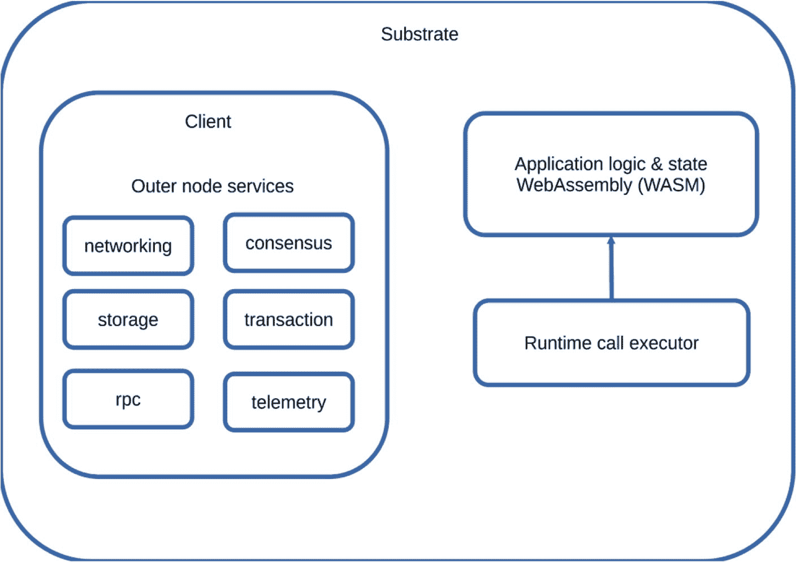

`图 5-1` Substrate 框架的通用架构

`Creditcoin 2.0` 使用 Rust 编程语言实现，并以 Docker 镜像形式分发，不过为了测试目的，我们通常编译代码并将其作为独立的二进制文件直接运行。

源代码：[`https://github.com/gluwa/creditcoin`](https://github.com/gluwa/creditcoin)

## 外部函数（Extrinsics）和功能模块（Pallets）

定义区块链业务逻辑的函数称为 `extrinsics`（外部函数）。这相当于其他框架中的交易。在 `Creditcoin 2.0` 内部，这些函数被组织成名为 `pallets`（功能模块）的模块。`Creditcoin 2.0` 使用了一些现成的模块，例如 `sudo` 模块、`system` 模块、`balances` 模块等。它还使用了与主要业务逻辑相关的自定义模块。请参阅源代码中的 `pallets/` 目录。

外部函数会通过 RPC 自动导出，并且可以使用客户端库在外部触发。集成测试套件和客户端应用程序正是这样做的。在编写单元测试时，也可以直接调用外部函数。

### Creditcoin 功能模块

定义了如何将贷款周期记录到区块链上，这正是 `Creditcoin` 白皮书详细描述的内容。它提供了与现有 `Creditcoin 1.x` 系列匹配的 RPC 调用。RPC 接口和函数签名在逻辑上是匹配的，但与 v1.x 交易系列并不完全一致！

这是供集成商和外部应用程序使用的区块链主要入口点。这也是大部分测试活动的重点——主要是功能类型测试。

### 难度调整模块（Difficulty Pallet）

难度调整是 PoW 共识算法的重要组成部分。所谓网络密码难题的难度级别，旨在确保出块时间保持一致、防止中心化与攻击，并维持挖矿的盈利性。该 `pallet` 负责在每个区块上计算和调整难度。它不对外使用，也不暴露外部交易（`extrinsics`）；但它暴露了一些存储项，可被外部查询。

### 链下任务调度器模块（Off-Chain Task Scheduler Pallet）

负责执行需要与外部世界交互的任务，例如验证另一个区块链（如 Ethereum）上的转账。请记住，实际的贷款转账和还款发生在 `Creditcoin` 链之外。

此类交互具有不可预测性，并可能因各种原因失败。因此，它们无法在链上计算，需要一个单独的组件。链下任务调度器本质上是一个待处理任务的队列。

该 `pallet` 对链上存储项具有只读访问权限，以促进组件间通信。然而，它无法直接写入区块链，需要调用外部交易（`extrinsics`）来记录每个正在处理的任务的成功或失败。此类外部交易调用与任何其他常规交易的处理方式相同。

### 奖励模块（Rewards Pallet）

在 `Creditcoin 2.0` 中，区块挖矿者因在区块链上运行节点而获得 `CTC` 代币奖励。基础奖励为每区块 `28 CTC` 代币，这些代币会在区块最终确认时存入链上。回忆一下，在 PoW 区块链中，多个节点竞争追加区块到链上的机会。成功者将获得奖励。启动 `Creditcoin 2.0` 节点时，可以选择额外的参数 `--mining-key <SS58Address>`，用于指定接收奖励的账户地址。该 `pallet` 负责计算实际奖励并将其存入相应的目标账户。

## 交易费用

有一个公式定义了每笔交易需要支付的费用。费用可以是固定的，也可以是动态的。在 `Creditcoin 2.0` 中，交易费用是动态的，其主要组成部分是所谓的“权重”（`weight`）；请参见下一节。

业务需求设定了最低 `0.01 CTC` 的费用。实际值和费用公式会根据链的使用情况而波动，并且在链不活跃期间（尤其是在隔离环境中测试全新链时）可能降至所需最小值以下。

其原理是，我们将区块填充率目标设为 `25%`。因此，当区块填充率低于 `25%` 时，我们会降低费用；当区块填充率高于 `25%` 时，则会提高费用。这源于通证经济学研究^(⁶)，并与波卡区块链所使用的机制一致。费用在 `24` 小时内最高可变化 `30%`。

更多信息和技术细节，请参见 [`https://wiki.polkadot.network/docs/learn-transaction-fees`](https://wiki.polkadot.network/docs/learn-transaction-fees) 和 [`https://github.com/paritytech/substrate/issues/2430`](https://github.com/paritytech/substrate/issues/2430)。

## 权重与基准测试

权重（`Weights`）代表了在区块链上执行特定交易所需的计算负担，是决定交易费用的主要组成部分。在填充交易时，每个区块能容纳的最大权重是有上限的。在基于 Substrate 的链（如 `Creditcoin`）中，权重通常表示为每个外部函数（`extrinsic`）在链上执行的读取和写入次数。权重也可能因硬件配置而异。

基准测试（`Benchmarks`）提供了一种统一的方式来表达运行时中不同函数在不同条件下执行所需的时间。基准测试由开发人员编写，然后可用于自动生成更精确的外部调用（`extrinsic calls`）权重！

通常，这些基准测试会在被称为“参考硬件”（`reference hardware`）上执行，自动生成的权重会被包含在源代码中。此操作会定期重复进行，例如在准备发布新版本时。

参考硬件取决于你根据区块链的功能和客户/参与者的目标所做的决定。对 `Creditcoin` 而言，这是在 `Azure` 上配置的一个内存优化的 `Standard_E4as_v4` 虚拟机实例。Substrate 框架的创建者波卡（`Polkadot`）推荐使用更强大的硬件：Google Cloud Platform 上的 `n2-standard-8` 虚拟机实例和 `Amazon Web Services EC2` 上的 `c6i.4xlarge`。

## 运行时（Runtime）

在 `runtime/src/` 目录中，所有组件被组合在一起，以定义 `Creditcoin` 节点的构成。这主要是些“管道”代码，用于为实现中所涉及的所有 `pallet` 定义具体的数据类型，例如：

```
pub type Moment = u64;
/// Some way of identifying an account on the chain. We intentionally make it equivalent
/// to the public key of our transaction signing scheme.
pub type AccountId = ::AccountId;
/// Balance of an account.
pub type Balance = u128;
```

`Runtime` 本身被编译为 WebAssembly（WASM），并可以作为发布流程的一部分发布到链上。

当本地编译的运行时版本与链上运行时版本匹配时，Substrate 节点将使用其本地运行时，因为速度更快。在所有其他情况下，当链上和本地运行时的版本号不匹配时，节点将使用从链上下载的 WASM 运行时。这就是为什么为基于 Substrate 的区块链实现正确更新版本号至关重要！

这使得发布和升级过程更加容易，因为矿工无需同时升级他们的容器！需要指出的是，不同本地和 WASM 版本之间的兼容性/互操作性属于 Substrate 框架本身的范畴，并未作为 `Creditcoin` 的一部分进行详细测试。由于团队对版本号更新采取了预防性措施，我不记得这曾引发过问题。

## 存储迁移（Storage Migrations）

对于存储在链上的实际信息，一个很好的类比是典型的 Web 2.0 应用程序的数据库。类似于 `Creditcoin 2.0` 中的 ORM 模型，我们有存储项（`storage items`），它们是定义了写入链上内容的数据类型，例如账户与余额之间的映射，或出借人与借款人之间的映射！在区块链上，所有这些都以二进制格式 `SCALE` 编码。

随着业务逻辑和源代码的变更，我们需要执行一些操作，将二进制数据从旧格式转换为所需的当前格式。这就是迁移组件（`migrations`）的职责，其行为类似于传统 ORM 框架中的数据库迁移。

迁移是通过在 WASM 运行时升级时触发的内部钩子来执行的，并遵循内部编号方案。每个单独的 `pallet` 可以有独立于其他 `pallet` 的迁移。在 `Creditcoin 2.0` 中，除了系统 `pallet` 之外，只有 `pallets/creditcoin` 包含自定义迁移。

## 自定义 RPC（Custom RPCs）

此组件允许你定义和暴露额外的 RPC 方法，以供外部应用程序使用。这些方法可以是你决定的任何内容。在 `Creditcoin 2.0` 中，它被用于暴露一些与挖矿相关的统计数据以及一些用于监控运行中的矿工节点群的链内部信息。

在 Substrate 框架中，RPC 方法通过 HTTP 和 WebSockets 协议以 JSON-RPC 的形式暴露。

## 遥测与自定义指标

Substrate 框架允许你自动将遥测数据流暴露给 `Prometheus`（一款开源监控系统），并在 `Grafana` 中将这些指标进行可视化。该组件也允许你定义自己的指标，这些指标可以通过 `<url>:9615/metrics` 以纯文本格式方便地获取。

在 `Creditcoin 2.0` 的某些情况下，相同的数据既会以 `Prometheus` 指标的形式提供，也会通过自定义的 `RPC` 方法提供。这两个端点都调用相同的底层内部函数，并作为这些函数的封装器。

在 `Creditcoin 2.0` 中还存在另一种情况，即自定义指标定义会调用一个 `RPC` 方法来提取信息。我们同时调用了自定义 `RPC` 方法和系统定义的 `RPC` 方法，二者之间没有区别。

相似或相同的信息同时以 `JSON-RPC` 和 `Prometheus` 数据流的形式暴露，这主要是为了方便决策。你无需同时实现这两种方式。

## Creditcoin-js

`Creditcoin-js` 是对 `polkadot-js` 库的一个封装，而 `polkadot-js` 是与基于 Substrate 的链进行通信的主要手段。`Creditcoin-js` 在错误处理方面提供了一些便利，并提供了更简洁的消费者接口。在撰写本文时，它主要用于集成测试和/或辅助脚本。

## Creditcoin-squid

这是一个索引和代理服务，用于摄取区块链上发生的事件，并将它们记录到标准的 `RDBMS` 中，然后导出一个 `GraphQL API` 供消费使用。它基于 Subsquid 开源项目（[`https://subsquid.io`](https://subsquid.io/)），因此得名。该组件的整体架构如图 5-2 所示。

该组件独立于区块链，代表了第三方应用程序消费区块链相关数据的一种行业标准方式。其源代码使用 `GPL-3.0` 开源许可证；然而，在撰写本文时，它尚未公开发布！

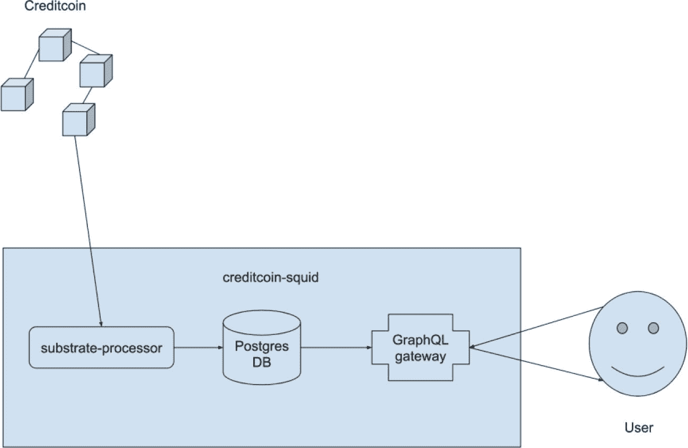

`图 5-2` Creditcoin-squid 架构

## Creditcoin 2.0 时间线

`Creditcoin 2.0` 的生命周期始于 2021 年 11 月下旬，当时在基于 Substrate 的区块链节点示例代码库之上构建了 `creditcoin` 模块的骨架。那时我仍在测试即将发布的 `1.8` 版本，而 `2.0` 的实现仍被视为一个实验。后来发现，直接重新实现所有内容是一个可行的选择。

在接下来的几个月里，所有现有的外部函数都被实现，包括基本的单元测试、代码库清理，以及在发现额外依赖项时启用其他模块。该实现被打包成一个 Docker 镜像。

第一个公开发布版本是 2022 年 3 月 2 日的 `2.0.0-beta-2`，随后在 2022 年 3 月 23 日发布了另一个版本，标题为 `主网发布：2.0.0-beta-5`。^(⁷)。`Creditcoin 2.0` 的开发贯穿 2022 年和 2023 年，并最终成为本书后续描述到的 `Creditcoin 2.3`。

## Creditcoin 2.0 测试

`Creditcoin 2.0` 的测试在其生命周期早期就已开始，与 `Creditcoin 1.x` 相比，过程更自然。测试也更有结构性，定义更清晰。Substrate 框架使得通过 `cargo test` 来执行大量功能并收集覆盖率指标变得相对容易。所有与测试 `Creditcoin 2.0` 相关的内容都已自动化，并且在其 `GitHub` 仓库中可用！执行这些自动化测试的 `CI` 环境是 `GitHub Actions`。

常规的 `CI` 任务如下所示。

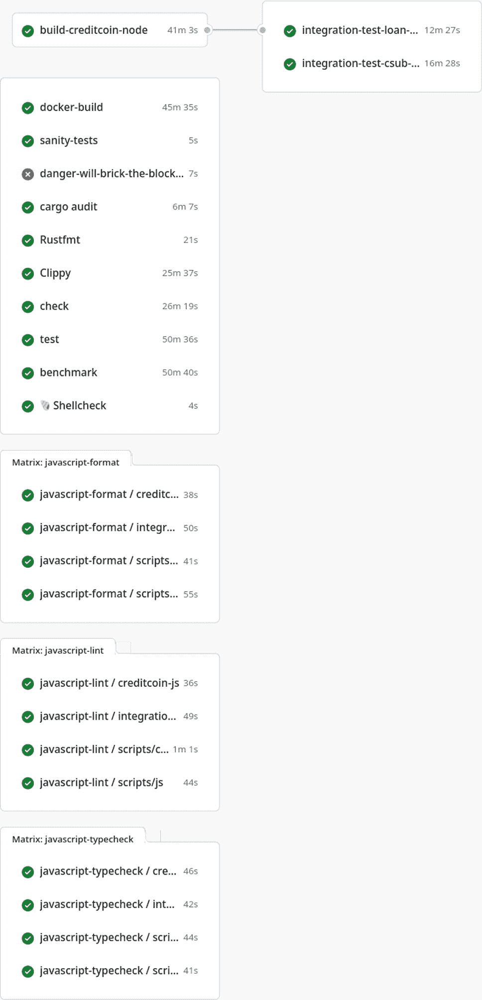

而升级 `CI` 任务如下所示。

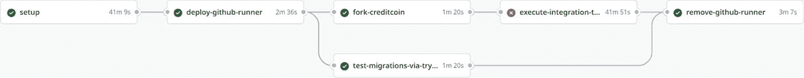

这些图片取自 [`https://github.com/gluwa/creditcoin/pull/1203/commits`](https://github.com/gluwa/creditcoin/pull/1203/commits)，该提交位于原始 `2.0` 生命周期的末期。

### 单元测试

Rust 编程语言自带内置的测试框架，内置测试运行器的入口点是 `cargo test` 命令！Cargo 是 Rust 的包管理器！

所有可以轻松作为单元测试执行的内容都在这里得到覆盖，主要关注点是外部函数。对于每个外部函数，我们都有正向场景以及所有可能的负向场景。对于正向情况，在存储和生成的事件上断言结果。对于负向场景，对返回的错误进行断言，每个错误条件返回不同的错误结果（具有不同名称的类型）。

```rust
#[test]
fn close_deal_order_should_error_when_not_signed_by_borrower() {
    ExtBuilder::default().build_and_execute(|| {
        let test_info = TestInfo::new_defaults();
        let (deal_order_id, deal_order) = test_info.create_deal_order();
        let transfer_id = TransferId::new::(&deal_order.blockchain, b"12345678");
        assert_noop!(
            Creditcoin::close_deal_order(
                // bogus signature --------v
                Origin::signed(test_info.lender.account_id),
                deal_order_id,
                transfer_id,
            ),
            crate::Error::::NotBorrower
        );
    });
}

#[test]
fn close_deal_order_should_error_when_deal_timestamp_is_in_the_future() {
    ExtBuilder::default().build_and_execute(|| {
        let test_info = TestInfo::new_defaults();
        let (deal_order_id, deal_order) = test_info.create_deal_order();
        let transfer_id = TransferId::new::(&deal_order.blockchain, b"12345678");
        // simulate deal with a timestamp in the future
        crate::DealOrders::::mutate(
            deal_order_id.expiration(),
            deal_order_id.hash(),
            |deal_order_storage| {
                deal_order_storage.as_mut().unwrap().timestamp = Creditcoin::timestamp() + 99999;
            },
        );
        assert_noop!(
            Creditcoin::close_deal_order(
                Origin::signed(test_info.borrower.account_id),
                deal_order_id,
                transfer_id,
            ),
            crate::Error::::MalformedDealOrder
        );
    });
}
```


在此示例中，`ExtBuilder::default().build_and_execute()` 创建了所谓的外部环境构建器，它是模拟运行时的一个封装器，我们可以在其中调用外部函数并模拟区块链中产生区块的过程。这使得许多自定义链功能和错误处理可以在单元测试级别得到覆盖。`ExtBuilder` 内部的执行环境是链上存储的内存实现。除此之外，所谓的模拟运行时是真实区块链运行时的部分表示，它可以简化具体数据类型并删除不必要的模块，以便于测试。对于 `creditcoin` 模块，它看起来像这样：

```rust
// Configure a mock runtime to test the pallet.
frame_support::construct_runtime!(
    pub enum Test where
        Block = Block,
        NodeBlock = Block,
        UncheckedExtrinsic = UncheckedExtrinsic,
    {
        System: frame_system::{Pallet, Call, Config, Storage, Event},
        Creditcoin: pallet_creditcoin::{Pallet, Call, Storage, Event, Config},
        Balances: pallet_balances::{Pallet, Call, Storage, Config, Event},
        Timestamp: pallet_timestamp::{Pallet, Call, Storage},
        TaskScheduler: pallet_offchain_task_scheduler::{Pallet, Storage, Event},
    }
);

parameter_types! {
    pub const BlockHashCount: u64 = 250;
    pub const SS58Prefix: u8 = 42;
    // used in tests, lower values == faster execution
    pub const PendingTxLimit: u32 = 500;
}
```

在此示例中，用于单元测试 `pallets/creditcoin` 的运行时仅配置了 5 个模块——即被测目标和直接依赖项。

当测试 `pallets/difficulty` 时，模拟的运行时甚至更简单：

```rust
// Configure a mock runtime to test the pallet.
frame_support::construct_runtime!(
    pub enum Test where
        Block = Block,
        NodeBlock = Block,
        UncheckedExtrinsic = UncheckedExtrinsic,
    {
        System: frame_system::{Pallet, Call, Config, Storage, Event},
        Difficulty: pallet_difficulty::{Pallet, Storage},
        Timestamp: pallet_timestamp::{Pallet, Call, Storage},
    }
);
```

有关如何在 Substrate 中开始进行单元测试的更多信息，请参阅他们的文档 [`https://docs.substrate.io/test/`](https://docs.substrate.io/test/)。

### 单元测试

通常，外部函数的初始单元测试由实现该函数的开发人员创建。之后，我通常会补充更多场景、修正和/或改进，主要围绕错误处理和边界情况覆盖。有时这些工作会在同一个拉取请求中完成，有时则作为单独的拉取请求提交。

代码覆盖率指标是判断外部函数的所有分支和错误条件是否通过单元测试得到验证的主要信息来源。在开发 Creditcoin 2.0 期间，我有意识地努力改善这一指标，并尽可能多地实现单元测试。如果我没记错的话，目标是 85% 的覆盖率，我们最终接近了 80%。

有些时候，仅仅为了满足指标要求，我会为辅助函数和特征添加单元测试，这些测试虽然提高了覆盖率百分比，但总体来看似乎并没有增加太多价值。不过，这纯粹是一种推测，因为我并没有尝试通过突变测试覆盖等技术来评估这套单元测试的有效性。我的经验法则很简单：如果覆盖率不足，并且添加单元测试以增加指标很容易，那就去做。

编写单元测试也是一个很好的机会，可以更深入地了解 Substrate 框架的工作原理以及 Creditcoin 实现是如何组合在一起的。从流程上看，它强化了一种预期，即质量保证团队将持续进行代码审查，并从早期阶段就参与到开发过程中。

### 集成测试

Creditcoin 2.0 的集成测试套件源于多个与区块链交互的示例。我希望运行这些示例，并确保在我们对实现进行更改时它们仍然能够正常工作——这再次遵循了简单的经验法则：如果代码存在于 git 中，那么它必须被持续地运行和检查！

一个粗略的 CI 作业执行了这些原始示例，这让我们意识到可以重构代码，使其对消费者更易用。因此，这些示例被转换成一个名为 `creditcon-js` 的 TypeScript 库。它是围绕 `polkadot/api` TypeScript 库的一个包装器。随后，触发这些示例演变成了集成测试套件，并成为了 `creditcoin-js` 的第一个消费者。

集成测试套件本身是围绕流行的 `Jest` 测试框架构建的。当时，关于使用哪种语言和测试框架的选择并不多。一方面，有 `Jest` 可用，并且 `polkadot/api` 也在上游的 Substrate 社区中使用。另一方面，虽然有一个 Python 客户端库，但遗憾的是它当时不支持异步函数，所以其实并没有太多选择。

一个简单的集成测试如下所示。

```
import { Blockchain, Guid } from 'creditcoin-js';
import { KeyringPair } from 'creditcoin-js';
import { createCreditcoinLoanTerms } from 'creditcoin-js/lib/transforms';
import { AddressRegistered } from 'creditcoin-js/lib/extrinsics/register-address';
import { signAccountId } from 'creditcoin-js/lib/utils';
import { creditcoinApi } from 'creditcoin-js';
import { CreditcoinApi } from 'creditcoin-js/lib/types';
import { testData, tryRegisterAddress } from 'creditcoin-js/lib/testUtils';
import { extractFee } from '../utils';
describe('AddAskOrder', (): void => {
let ccApi: CreditcoinApi;
let lender: KeyringPair;
let lenderRegAddr: AddressRegistered;
let askGuid: Guid;
const { blockchain, expirationBlock, loanTerms, createWallet, keyring } = testData(
(global as any).CREDITCOIN_ETHEREUM_CHAIN as Blockchain,
(global as any).CREDITCOIN_CREATE_WALLET,
);
beforeAll(async () => {
ccApi = await creditcoinApi((global as any).CREDITCOIN_API_URL);
lender = (global as any).CREDITCOIN_CREATE_SIGNER(keyring, 'lender');
});
afterAll(async () => {
await ccApi.api.disconnect();
});
beforeEach(async () => {
const lenderWallet = createWallet('lender');
lenderRegAddr = await tryRegisterAddress(
ccApi,
lenderWallet.address,
blockchain,
signAccountId(ccApi.api, lenderWallet, lender.address),
lender,
(global as any).CREDITCOIN_REUSE_EXISTING_ADDRESSES,
);
askGuid = Guid.newGuid();
});
it('fee is min 0.01 CTC', async (): Promise => {
const { api } = ccApi;
return new Promise((resolve, reject): void => {
const unsubscribe = api.tx.creditcoin
.addAskOrder(
lenderRegAddr.itemId,
createCreditcoinLoanTerms(api, loanTerms),
expirationBlock,
askGuid.toString(),
)
.signAndSend(lender, { nonce: -1 }, async ({ dispatchError, events, status }) => {
await extractFee(resolve, reject, unsubscribe, api, dispatchError, events, status);
})
.catch((error) => reject(error));
}).then((fee) => {
expect(fee).toBeGreaterThanOrEqual((global as any).CREDITCOIN_MINIMUM_TXN_FEE);
});
});
});
```

该集成测试套件的核心重点在于测试每一个可用的外部函数，以确保它们能够从外部访问。在实际检查方面，主要重点在于验证交易费用不低于 0.01 CTC。实际上，这个值可以通过参数进行配置，并且允许一定的误差范围，因为费用并非固定不变，还取决于区块链的使用情况。

自定义 RPC、自定义指标、几个值得注意的错误条件以及一个完整的借贷周期也通过此集成测试套件进行了测试，并且结果以易于阅读的格式呈现。

```
PASS src/test/collect-coins.test.ts (49.97 s)
CollectCoins
request
✓ fee is min 0.01 CTC (10 ms)
✓ 000 - with mixed up Ethereum addresses should throw IncorrectSender error (11797 ms)
✓ 001 - end-to-end (15014 ms)
✓ should throw TransactionNotFound when txHash not found (9984 ms)
fail
✓ fee is min 0.01 CTC (8 ms)
persist
✓ fee is min 0.01 CTC but bypassed by OCW (8 ms)
PASS src/test/register-funding-transfer.test.ts (59.98 s)
RegisterFundingTransfer
✓ fee is min 0.01 CTC (29060 ms)
✓ emits a failure event if transfer is invalid (29987 ms)
PASS src/test/close-deal-order.test.ts (70.005 s)
CloseDealOrder
✓ fee is min 0.01 CTC (69127 ms)
```

这些集成测试中有许多是通过配置变量控制的，`Jest` 使用配置文件，有时甚至会被跳过，因为我们增加了针对多个环境（甚至生产环境）执行测试的能力。在主网上，这作为一种健全性测试，用于验证借贷周期功能是否仍然有效，以及交易费用是否满足最低要求。

### 冒烟测试与静态分析

在这个类别中，我将大部分不属于其他分类的内容归入其中：linter、代码格式化程序和自定义脚本——我喜欢遵循语言的最佳实践并编写干净的代码。我在测试 Creditcoin 时使用过的一些工具包括 `ShellCheck`、`cargo fmt`、`Clippy`、`eslint` 和 `prettier`。

在某些情况下，静态分析工具可以检测出已知可能导致错误的模式，因此我会确保创建自定义工具来检查源代码中是否存在此类模式。在一些语言生态系统中，这项工作表现为 linter 插件的形式，而在 Creditcoin 中，这些主要是独立的 bash 脚本。这些脚本会检查源代码，例如使用 `grep`，并提醒我们注意那些可能导致错误的常见失误。例如：

-   还记得有原生运行时和链上运行时之分，且具体使用哪个取决于运行时版本号吗？现在想象一下运行时行为发生了变化，但版本号却没变的情况——这可能导致节点运行着不同版本的代码。在许多情况下都需要增加版本号，因此该脚本会采取预防性措施，基于一个简化的启发式规则要求增加版本号。有时增加版本号并非绝对必要，但稳妥总比后悔好。这也与其余开发流程配合得很好。

-   在其 pallet 源代码中定义的外在函数（extrinsic functions）的顺序，直接决定了它们在链上元数据中的内部索引。这些索引会直接转换为终端用户通过 `polkadot-js` API 库解析后看到的错误消息，因此我们需要确保外联函数的顺序没有改变。这个 bash 脚本是 `polkadot-js-metadata-cmp` 工具的一个包装器。

-   为了确保交易费用准确，每个外联函数都需要有一个关联的权重（weight），该权重由关联的基准测试函数生成。因此，要确保所有内部定义的 pallet 都有基准测试，并且这些基准测试已接入 CI 以实现自动权重生成。同时，还要尽量确保外联函数名称、基准测试函数名称和权重函数名称相匹配，以避免复制粘贴错误。

-   我们希望保持依赖项为最新，并使用各种安全相关工具，这些工具通常通过扫描软件包版本并与流行的第三方软件包仓库进行匹配来运行。因此，倾向于不直接从 git 仓库使用库，而应使用软件包。对于 Rust，推荐使用软件包仓库 `crates.io`！

# 使用机器人进行测试与持续测试流程

## 使用机器人进行测试

在 Creditcoin 2.0 的开发过程中，会执行多项自动化操作。我称之为“使用机器人进行测试”，但严格来说，这些大多与开发流程相关。无论如何，将它们自动化是很有好处的：

- 琐碎的任务需要较少的人力参与。
- 它们会定期执行。
- 拉取请求将自动创建，进而触发整个 CI/CD 流水线。
- 拉取请求会像其他任何拉取请求一样被审查和合并。

其中一些静态分析脚本是针对内部开发标准进行断言的——例如，是否使用某个特定的函数或宏。这是为了提升区块链工程团队的生活质量，而这通常也能转化为软件本身某种程度的质量提升。

在冒烟测试方面，我们会构建一个 docker 容器，并确保它在启动时不会崩溃，并且能够执行一些常见操作——例如，与现有的运行中的链进行同步；确保容器暴露一个`/health`端点，供 DevOps 用于监控运行的集群等。并未对容器目标本身进行 100%显式测试，因为其大部分内容都是`creditcoin-node`二进制文件，而该文件已作为其他测试任务的一部分进行了测试。

### Dependabot

第三方依赖项的自动升级是 Creditcoin 2.0 及未来版本不可或缺的一部分，并且我个人多年来也一直在使用此功能。该服务按计划运行，每当有新的依赖库版本可用时，就会自动创建拉取请求。其中大多数与`creditcoin-js`和`integration-tests`相关，因为它们是用 TypeScript 编写的，并且更新频率更高。然而，即使在 Rust 方面，我们也希望尽可能保持最新。从长远来看，这可以减少维护负担，让你了解被测软件是否仍与较新的库兼容，并且对提高软件的总体安全性也有小小的贡献。如果 CI 任务通过，通常会合入更新后的版本，通常只需 QA 工程师提供审查。

这里有一个显著的例外，即 Substrate 框架本身，它是通过 git 仓库来使用的。Substrate 框架的各个组件很少通过 Rust 软件包仓库`crates.io`发布，并且需要手动升级。在 Creditcoin 2.0 中，这个过程并未实现自动化。从技术上讲，创建自己的机器人来提议升级 Substrate 框架的更新版本（即使是通过 git 分支使用）是相对容易的。我的印象是 Substrate 仍在频繁地活跃变化，这需要人工检查并评估任何不兼容性问题，因此自动化此过程可能好处不大。

### Pre-commit CI

这是一个受 Python 开发者欢迎的服务，它可以修改源代码并创建一个新的提交。Creditcoin 2.0 并未使用该服务的全部功能——主要使用 pre-commit CI 来纠正文件末尾缺少换行符、行尾空白以及一些拼写错误。该服务本身并非针对 Rust 或 TypeScript 代码库而设计，你能从中获得的好处是有限的。我引入它的主要动机是——令人烦恼的缺失换行符，当在终端[编辑器]中显示文件内容时，会让一切看起来都很丑陋。只是为了让代码看起来漂亮。

### 使用 Gluwa-bot 的类型定义

任何基于 Substrate 的链都会以 SCALE 格式（二进制编码）序列化其数据类型和错误消息，并通过 RPC 暴露这些元数据。使用 Polkadot JS 库构建的客户端可以利用这些信息来刷新其内部的 TypeScript 定义，并始终保持与区块链节点实现同步。这使得 JavaScript 组件的类型检查工作得很好，进而将一些错误的检测转移到了静态分析层面。强类型只会让测试人员的工作更轻松！

在 CI 中运行测试任务时，Creditcoin 2.0 会自动刷新类型定义，并自动将这些更改提交并推送到拉取请求的当前分支。为了避免无限的 CI 循环，大多数 GitHub 任务不会在自动提交上重复执行。为了明确说明——在 CI 中执行任何测试之前，所有类型都会被更新，并且只有当这些测试通过时，这些更改才会被包含到一个提交中。

## 使用 `Gluwa-bot` 进行基准测试和权重生成

在 Substrate 中，基准测试是一种程序化手段，用于发现链上操作（如外部调用）的计算复杂程度。通俗来说，这与存储读取和写入的次数有关。基准测试文件由人工编写。

随后，基准测试会作为持续集成的一部分执行，以确保它们能正常编译且不会崩溃。这是健全性测试环节。

在发布之前，基准测试会在参考硬件上执行，生成的权重会被提交到发布分支。由于这与 `dev` 分支不同，同一提交会被自动变基并作为拉取请求发布到 `dev` 分支。这确保了所有发布的内容也会通过 `dev` 分支，从而最大程度地减少未来的偏差以及解决 git 冲突的需求，尤其是在发布过程中。

## 迁移与升级测试

在内部 Pallet 中，只有 `pallet/creditcoin/` 实际包含存储迁移。它们按顺序命名，例如 `v1`、`v2`、`v3` 等，每个迁移都在模拟环境中通过单元测试进行验证。这是为了确保迁移按预期运行——换句话说，存储条目确实被迁移了（可以理解为 ORM 应用中的数据库迁移）。这种模拟环境还会执行迁移前/后钩子，作为对迁移函数内部错误的早期预警。然而，仍存在一些不确定性：

- 我们是否遗漏了边界情况
- 迁移能否在实际生产数据下工作

这些不确定性通过两个额外的测试任务来解决：

1. 模拟升级过程，确保其不会崩溃。
2. 模拟链上状态和本地存储，确保存储迁移能够在不崩溃的情况下应用。

相同的模拟通过两种不同的方法执行：

1. 通过 `try-runtime`：这是 Substrate 框架提供的一套功能集，允许在内存中模拟升级和迁移。它会查询生产环境的 RPC 端点以获取当前链上状态，并在本地内存中进行复制。然后，它会针对本地内存存储执行迁移。如果一切顺利，我们就认为成功。这可以看作是运行时升级的健全性测试。详细的上游文档位于 `https://paritytech.github.io/try-runtime-cli/try_runtime/`。

2. 分叉链并进行升级：这种方法更接近现实，因为它使用真实的生产数据并执行真正的运行时升级（在隔离环境中）。首先，我们启动一个 `creditcoin-node` 并与已有的区块链同步——例如，测试网或主网，具体取决于我们的发布目标。然后，使用一个名为 `creditcoin-fork` 的辅助工具（`https://github.com/gluwa/creditcoin-fork`），将当前的链上状态抓取并记录到一个 JSON 文件中。这个 JSON 文件代表一个新的链规范，其中创世块是最新链上状态的副本。这允许你执行一个本地链，其存储项与生产版本匹配，但同时将开发账户注入其中并独立运行。当新创建的本地链启动并运行后，执行运行时升级以触发存储迁移。如果通过，则针对该分叉执行集成测试套件，以确保分叉在功能上仍然与原始链等效。

对于升级和迁移测试，我们使用自托管的 GitHub 运行器，这些运行器按需部署在 Azure 中。这是因为升级和迁移工作流需要大量内存——至少需要 16 GiB。区块导入过程也是计算密集型的。

为了方便这些测试活动，存储迁移钩子通过两种方式进行检测：

- 每个迁移都有前后钩子，允许我们在迁移前后共享状态以进行断言。由于存储迁移在运行时执行，我们利用了 Rust 中 `assert!` 宏会导致运行时恐慌（即如果断言失败，会导致进程崩溃）这一特性。非零退出代码会导致 CI 作业报告失败。

- 每当可能出现边界情况时，在 `if` 语句周围使用 `warn_or_panic!` 宏。在生产节点中，此宏只会产生警告；然而，在测试期间，它也会导致崩溃。此行为通过测试期间显式配置的编译器标志来控制。你可以将其视为最后一道防线，希望在测试期间看到它崩溃，以便提醒你生产数据中存在的边界情况，但你不希望它在生产中崩溃，以免意外导致区块链停机。该宏如其名所示——要么记录警告，要么引发恐慌。

- 一个辅助静态分析脚本，当迁移源代码直接使用 `log::warn!` 宏时，该脚本会失败。这有助于确保我们始终使用 `warn_or_panic!` 宏，并且不会意外删除或绕过它。否则，由实际生产数据触发的边界情况分支在测试期间将不会失败，团队可能无法察觉。

除此之外，`creditcoin` pallet 定义了一个 `STORAGE_VERSION` 常量，该常量必须与最后一个迁移的编号匹配。这也通过每次迁移中的断言以及静态分析脚本来强制执行——最后一个迁移文件的编号必须与 Pallet 中定义的 `STORAGE_VERSION` 常量值匹配！

以下是一个迁移如何在两个 Pallet 之间移动存储项的例子：

```rust
impl Migrate for Migration {
    fn pre_upgrade(&self) -> Vec {
        let count = Authorities::<T>::iter().count();
        assert!(count != 0, "Authorities not found during migration");
        let old_pallet = TaskScheduler::<T>::name();
        let new_pallet = SCHEDULER_PREFIX;
        if old_pallet == new_pallet {
            log::info!(
                target: "runtime::Creditcoin",
                "pre-migrate V7, nothing to do.",
            );
            return vec![];
        }
        let storage_prefix = Authorities::<T>::storage_prefix();
        let new_pallet_prefix = twox_128(new_pallet.as_bytes());
        let authorities_prefix = [&new_pallet_prefix, &twox_128(storage_prefix)[..]].concat();
        let new_pallet_prefix_iter = frame_support::storage::KeyPrefixIterator::new(
            authorities_prefix.clone(),
            authorities_prefix,
            |key| Ok(key.to_vec()),
        );
        assert!(
            new_pallet_prefix_iter.count() == 0,
            "Expected new authorities storage to be empty"
        );
        assert!( T as GetStorageVersion>::on_chain_storage_version() < 7 );
        let count = count.saturated_into();
        Ok(encode(count))
    }

    fn execute_upgrade(&self, weight: Weight) -> Weight {
        let count: u32 = Authorities::<T>::iter().count().saturated_into();
        let creditcoin = TaskScheduler::<T>::name();
        move_storage_from_pallet(
            Authorities::<T>::storage_prefix(),
            creditcoin.as_bytes(),
            SCHEDULER_PREFIX.as_bytes(),
        );
        crate::weights::WeightInfo::<T>::migration_v7(count)
    }

    fn post_upgrade(&self, ctx: Vec<u8>) {
        assert_eq!(
            StorageVersion::get::<T>(),
            7,
            "expected storage version to be 7 after migrations complete"
        );
        let new_pallet = SCHEDULER_PREFIX;
        let new_pallet_prefix = twox_128(new_pallet.as_bytes());
        let new_pallet_prefix_iter = frame_support::storage::KeyPrefixIterator::new(
            new_pallet_prefix.to_vec(),
            new_pallet_prefix.to_vec(),
            |key| Ok(key.to_vec()),
        );
        let past_count = usize::from_le_bytes(ctx.try_into().unwrap());
        assert_eq!(new_pallet_prefix_iter.count(), past_count);
    }
}
```

其余迁移的源代码位于 `https://github.com/gluwa/creditcoin/tree/dev/pallets/creditcoin/src/migrations`。

## 在拉取请求、Devnet、Testnet 和 Mainnet 上进行持续测试

在解释测试发生的时间以及每个独立目标之前，我们需要先说明各种环境。

- **CI 环境**：这是 GitHub Actions 运行一个隔离的区块链，并使用所有可用的测试套件和测试脚本对其进行各种断言。这通常发生在开放的拉取请求上下文中，无论目标分支是哪个。

- **Devnet**：这是一个通常已升级到最新可用版本的区块链实例。该实例的主要使用者是其他开发团队，他们正在开发分层产品，例如，移动端和/或前端应用程序。Devnet 环境主要用于开发与其他区块链通信的应用程序，旨在充当内部“吃自己的狗粮”环境。该网络本身是公开的，但与 Testnet 相比，外部参与的可能性要小得多。该环境中的实际区块链数据更有可能不会被保留，并且会随着时间推移被销毁。

- **Testnet**：这是 Creditcoin 的一个公共实例。它旨在作为发布流程的一部分，并且更新的频率低于 Devnet。它是即将发布的 Creditcoin 版本的“浸泡”场所，也对公众开放。Testnet 既用于必要时的社区测试，也作为即将推出功能的展示实例，同时还是贷款提供商针对其自身代码进行测试的演练场（以确保最新版本不会破坏他们自己的应用程序）。该环境可能会被清除，但预计这种情况只会发生在极少数情况下。出于所有实际目的，这被视为生产环境。一旦进行了升级，我们会针对此实例进行明确测试，以确保其按预期运行。

- **Mainnet**：这是向公众和贷款提供商开放的 Creditcoin 生产区块链。这是保存贷款交易规范信息的地方。一旦升级，我们将针对此环境明确执行测试。

有关不同环境及其预期用途的更多文档，请参阅 [https://docs.creditcoin.org/cc2/environments](https://docs.creditcoin.org/cc2/environments)。

Creditcoin 的开发和发布流程已确定为以下顺序：

1. 每个新功能都通过拉取请求引入，该请求通过可用的测试套件自动进行测试，并在必要时手动进行测试，并根据需要反复进行。
2. 每个功能拉取请求都会合并到 `dev` 分支。几乎所有的 CI 作业也会针对 `dev` 分支执行。自动创建新提交的作业会被跳过；它们仅在拉取请求上执行。
3. 来自 `dev` 分支的 WASM 运行时被编译，当其版本与 Devnet 环境上的版本不同时，会自动安排运行时升级。
4. 一段时间后，将从 `dev` 创建一个临时分支，并针对 `testnet` 分支打开一个新的拉取请求。所有可用的 CI 作业都会执行。此时，独立的运行时升级和迁移测试也会启动。这个拉取请求是为新版本发布做准备。有时可能因为 Git 冲突而需要调整；有时可能是精选的提交选择，而非 `dev` 中的所有内容，等等。通常，除非版本最近已更新，否则这里需要进行强制性的版本提升。
5. 将步骤 4 中的拉取请求合并到 `testnet` 分支。
6. 使用必要的版本号发布一个新的 Git 标签。这将构建 Docker 容器和二进制产物，上传到 Docker Hub，并创建一个 GitHub Release。后缀为 `-testnet`。
7. 手动将 WASM 运行时上传到 Testnet 环境。随后还要为客户端应用程序部署较新版本的容器。没有特别的原因说明为什么这一步没有自动化。
8. 一段时间后，重复步骤 4 中描述的过程，并打开一个拉取请求，将代码从 `testnet` 分支合并到 `main` 分支。所有可用的 CI 作业，包括升级和迁移测试，都将启动。
9. 合并到 `main` 分支并创建一个 Git 标签，等待 WASM 运行时、Docker 镜像和二进制产物被创建并附加到 GitHub release。创建 release 本身是全自动的。
10. 手动升级 Mainnet 运行时。与 DevOps 协调何时升级客户端容器。

除了在每个这样的拉取请求上执行的单元测试、集成测试和各种脚本之外，还有一些特殊用例：

- 运行时升级和迁移测试会检查它们的目标环境以进行同步：要么是 Testnet，要么是 Mainnet。该决策基于拉取请求的目标分支做出。例如，针对 `testnet` 分支的拉取请求将针对 `rpc.testnet.creditcoin.network` 测试升级和存储迁移。
- 集成测试套件会在新版本部署到 Testnet 或 Mainnet 环境**之后**手动触发。这通常发生在部署之后，因为`creditcoin-js`（由测试套件使用）存在版本问题。在之后的某个时间点，最简单的方法是检出相应的 Git 提交或 Git 标签，重新安装必要的 Node.js 依赖项，然后执行测试套件。通过向 Jest 测试运行器传递一个配置文件来选择目标环境，例如，`jest --config testnet.config.ts`。

- 针对 `Testnet` 和 `Mainnet` 启动集成测试是手动执行的。没有特别的原因；只要所有必要的触发器和凭据在 GitHub CI 中安全定义，这也可以自动触发。

- 针对 `Devnet`、`Testnet` 和 `Mainnet` 环境进行测试需要账户凭据和充足的资金。这些通过环境变量定义并保密。出于安全考虑，这些账户没有 sudo 权限。同样重要的是，这些用于测试的账户会连接到外部区块链（如以太坊），以模拟贷款交易。这也意味着它们使用真实的加密代币进行操作，这会影响测试成本。

Jest 使用的配置文件是 TypeScript，如下所示：

```typescript
import type { Config } from "@jest/types";
const config: Config.InitialOptions = {
preset: "ts-jest",
testEnvironment: "node",
testTimeout: 240000,
globalSetup: "./src/devnetSetup.ts",
};
export default config;
```

`globalSetup` 的值是另一个 TypeScript 文件，它为您提供了完全的自由度来控制 Jest 和所有集成测试用例可用的全局状态。它通常定义连接 URL，在运行时从环境变量中读取实际值，并定义一些硬编码的预期值。例如：

```typescript
(global as any).CREDITCOIN_API_URL = 'wss://rpc.devnet.creditcoin.network/ws';
(global as any).CREDITCOIN_USES_FAST_RUNTIME = false;
(global as any).CREDITCOIN_CREATE_WALLET = createWallet;
(global as any).CREDITCOIN_ETHEREUM_DECREASE_MINING_INTERVAL = false;
(global as any).CREDITCOIN_ETHEREUM_NAME = 'Sepolia';
const ethereumNodeUrl = process.env.ETHEREUM_NODE_URL;
if (ethereumNodeUrl === undefined) {
throw new Error('ETHEREUM_NODE_URL environment variable is required');
}
(global as any).CREDITCOIN_ETHEREUM_NODE_URL = ethereumNodeUrl;
(global as any).CREDITCOIN_ETHEREUM_USE_HARDHAT_WALLET = false;
(global as any).CREDITCOIN_EXECUTE_SETUP_AUTHORITY = false;
(global as any).CREDITCOIN_NETWORK_LONG_NAME = 'Devnet';
(global as any).CREDITCOIN_NETWORK_SHORT_NAME = 'creditcoin_devnet';
(global as any).CREDITCOIN_REUSE_EXISTING_ADDRESSES = true;
// https://sepolia.etherscan.io/address/0xd2f6CBE058b7233FE5fd1a790A8D85328e3a5d3D
(global as any).CREDITCOIN_CTC_CONTRACT_ADDRESS = '0xd2f6CBE058b7233FE5fd1a790A8D85328e3a5d3D';
// we need a new tx hash every time so we call .burn() in globalSetup()! See ctc-deploy.ts
(global as any).CREDITCOIN_CTC_BURN_TX_HASH = undefined;
```

#### 安全相关测试

工程团队内部有一种倾向，即希望生成一个定义较为宽泛的 Creditcoin 安全实现。Creditcoin 2.0 瞄准的是安全光谱上最容易解决的那些问题。相关工作通常围绕以下几个基准来展开：安全实践的基准、安全相关工具的基准，以及社区参与安全的基准。这些基准内容不分先后，包括：

- 保持所有依赖项为最新版本。
- 开始使用 `rustc` 稳定版而非夜间版。
- 启用流行的静态分析工具，以确定哪些工具适用于 Rust 生态和 Creditcoin，并修复这些工具报告的任何代码异味和问题。
- 启用一个低调的安全漏洞赏金计划，以便外部研究人员发现更多漏洞并进行跟进。

我已启用的工具包括：

- `Dependabot`：会将第三方依赖项更新至最新版本并创建拉取请求。此外，还会在 GitHub 界面内提供关于影响任何第三方库的安全问题的报告。
- `GitHub 的 CodeQL`：静态分析器，支持 JavaScript，但不支持 Rust，因此用处不大。
- `Cargo audit`：一个 Rust 原生工具。报告 CVE 和未维护的依赖项。我们已将报告按一级依赖项进行过滤，因为我们对 Substrate 框架及其带来的整个依赖栈控制力较弱。随着时间的推移，此工具开始报告一些只有升级 Substrate 框架版本才能修复的问题。
- `MegaLinter 的 Rust 风格`：一个更大的代码检查工具集合，其中一些与安全相关。它帮助我们强化了 GitHub Actions 的权限，并改进了 Dockerfile 实践。强制升级了一些存在 CVE 报告的依赖项。

在保持最新状态方面，我们不允许通过 git 仓库使用 Rust 包，因为这会破坏 `Dependabot` 和大多数其他工具——这是通过静态分析脚本强制执行的。一个显著的例外是 Substrate 框架本身，它不在 `crates.io` 上发布包。相反，我们为 Substrate 跟踪特定的 git 标签。在撰写本文时，关于 Substrate 新版本的警报尚未自动化，但实现起来相当直接。

启用 `Rustc` 稳定版编译需要对 Substrate 本身进行多次升级，原因在于 WASM 运行时功能。我们不得不一次升级一个版本，并解决新版本 Substrate 引入的不兼容问题，但最终成功了。这样做并不特别困难，但它带来了大量的维护负担，而没有明显的好处——任何试图跟上流行框架更新步伐的人都可以证明这一点——所以，如果没有必要，你可能不想过于频繁地这样做。

#### 测试 Creditcoin-squid

作为一个索引代理，`creditcoin-squid` 的主要挑战是维护数据完整性。出于测试目的，这可以概括为：“导出的数据是否始终与区块链保持一致！”

次要的测试目标与聚合区块链上多个事件数据的能力有关——例如，累积事件功能是否正常工作，比如我们是否正确地对所有交易费用进行了求和！

最初，我研究了基于属性的测试，并试图找到类似“跨数据记录断言属性”的方法。最终，我参考了 Slack 的数据一致性检查框架 [`slack.engineering/data-consistency-checks/`](https://slack.engineering/data-consistency-checks/)，它提供了最初的灵感。

这里的第三个重大挑战是，GraphQL API 应该为构建分层应用程序提供一个稳定的接口。因此，API 端点中的任何向后不兼容的更改都有可能破坏现有应用程序，这是非常不可取的。

你可以发挥想象力，为这些挑战找出创造性的解决方案。遗憾的是，我无法在此分享源代码或更多细节。

#### 我们在第 100 万个区块发现了一个漏洞

我们确实有一个不属于常规开发生命周期的环境；它用于进行性能测试，在该环境中网络被数千笔交易淹没，最终达到了第 100 万个区块。

这暴露了一个漏洞：许多记录（`DealOrders`）被设置为在第 1000000 个区块（来自测试脚本的硬编码值）时过期。Creditcoin 过滤过期条目的方式是从存储中获取所有条目，移除未注资的条目，然后将剩余条目写回存储。这段代码在每个区块的 `on_initialize()` 函数内执行。这个简单的实现方式是从存储中读取所有数据，进行迭代，过滤项目，然后写回剩余部分。这导致内存分配增长超过某个边界并导致崩溃。

团队采取的临时解决方案是将过期记录保留在存储中，代价是占用更多的磁盘空间，因为这些记录仅在存在借贷市场的情况下才相关，而在撰写本文时我们还没有借贷市场，因此这种权衡是可以接受的。更多详情请参阅 [`github.com/gluwa/creditcoin/pull/1253`](https://github.com/gluwa/creditcoin/pull/1253)。

这个漏洞的技术背景在于 Substrate 框架内部。运行时内部有 32 MB 的最大分配限制，而 Creditcoin 试图分配 52 MB；请参阅 [`github.com/paritytech/substrate/issues/11132`](https://github.com/paritytech/substrate/issues/11132) 和 [`github.com/paritytech/substrate/pull/11206`](https://github.com/paritytech/substrate/pull/11206)。

当这个问题出现时，用于构建 Creditcoin 生产版本的 Substrate 版本已经过时了 10 个月，因此通过从上游挑选提交来进行热修复可能并不现实。这可能会暴露我们未知的其他风险，因此团队没有走这条路！

这些事实恰好说明，每个测试基础设施都应像生产基础设施一样受到同等关注——包括监控、警报等一切！

这也表明，你的区块链实现中可能隐藏着一些漏洞，这些漏洞会在数月甚至数年后，根据使用量而暴露出来，因此模拟区块链的长期使用非常重要。命运弄人，Creditcoin 2.3 也出现了非常类似的问题。

#### 其他有趣事实

如前所述，交易费用并非固定不变，而是会根据区块链的使用情况而波动。在 Creditcoin v2.0 生命周期的相对早期阶段，我想通过集成测试来验证这一点，并断言当区块链“被高负载使用”时交易费用会增加。当时我不清楚“高负载使用”的确切定义，于是设想了一个直截了当的场景：提交 10 笔交易，并期望最后一笔交易的手续费高于第一笔。详见 [`https://github.com/gluwa/creditcoin/pull/142/files`](https://github.com/gluwa/creditcoin/pull/142/files)。

这个测试实际上并没有按预期工作，因为测试场景本身是错误的。它需要生成更多交易，才能在一段时间（即多个区块）内达到区块填充率 25% 甚至更高的水平，这样我们才能看到内部费用调整算法开始发挥作用。团队很快估算出，我们需要每秒生成数千笔交易。如果我没记错的话，讨论的交易量在 40000 笔左右，但这个数字我可能记错了。现有的集成测试套件根本无法实现这一点。

或许可以使用 `Promise.all` 以及 Creditcoin RPC 和 TypeScript 客户端库的异步/并行特性来调度这数千笔交易。然而，我们需要解决的问题是 nonce 管理——也就是说，客户端应用程序需要生成唯一的数字标识符，并与每笔交易一起发送，而不是依赖区块链像默认情况那样自行处理。当时我们没有简单的解决方案，这属于额外的工作，且不在项目范围内，因此该测试被放弃了。

大约 6 个月后，团队再次面临生成大量交易的挑战。当时的背景是，我们希望用大量记录填充测试网环境，使其看起来更像主网。这一点很重要，例如，对于测试迁移以模拟真实的升级场景以及进行性能基准测试来说都是如此。解决方案是创建一个名为 `creditcoin-transaction-producer` 的自定义工具，它能够并行生成数千笔交易，并实现了适当的 nonce 管理。

另一个曾被短暂探索的测试领域是在 Creditcoin 运行时中启用所谓的“混沌”（chaos）模块；详见 [`https://github.com/gluwa/pallet-chaos/pull/1`](https://github.com/gluwa/pallet-chaos/pull/1) 和 [`https://github.com/gluwa/creditcoin/pull/774`](https://github.com/gluwa/creditcoin/pull/774)。该模块旨在向现有运行时注入混乱，并试图从本质上破坏你的实现，以此来发现边界情况并挑战现有代码的极限。这是一次短暂的尝试，因为该模块本身在 Creditcoin 的语境下似乎不太实用。上游的 Polkadot 和其他 Substrate 链使用模糊测试（fuzzing），在这种语境下更为实用，但我并未尝试过。

发现的一个有趣问题是，`creditcoin-node` 并不总是响应 `SIGTERM` 信号，而且日志会丢失，因此你无法判断发生了什么。我测试这个问题的方法是，使用一个设置了人为资源限制的 Docker 容器，并在终端上按下 `Ctrl+C`，[`https://github.com/gluwa/creditcoin/pull/970`](https://github.com/gluwa/creditcoin/pull/970)。后来发现这是上游 Substrate 的一个 bug，通过升级到更新版本的 Substrate 框架得到了修复。

之前我提到过，集成测试套件是在部署到特定环境后手动启动的。对于主网，我们也使用了以太坊主网；对于其他环境，我们最初使用 Rinkeby 测试网；但后来出现了零星问题。过了一段时间，我们发现以太坊基金会计划于 2022 年 10 月 5 日弃用 Rinkeby，因此我们切换到了 Goerli 测试网。在短期内，Goerli 也出现了问题，尤其是交易费用高昂。临时切换到 Sepolia 解决了这个问题；不过我们后来又切换回了 Goerli。你可以在这里了解更多关于 Goerli 和 Sepolia 差异的信息：

[`https://www.quicknode.com/guides/ethereum-development/getting-started/goerli-vs-sepolia-a-head-to-head-comparison`](http://www.quicknode.com/guides/ethereum-development/getting-started/goerli-vs-sepolia-a-head-to-head-comparison)。

需要提醒一句：请注意，与外部区块链的交互需要额外的加密货币代币形式的资金，这意味着对于 Creditcoin 主网与以太坊主网的集成，测试套件实际上会消耗真实的 ETH 代币！如果不小心，这可能会很快造成成本飙升，尤其是在处理高价值代币时。

### 总结

在本章中，你可以看到 Creditcoin 的测试是如何开始成型，并逐步探索除了最显而易见领域之外的新兴趣点的。在 Creditcoin 区块链上工作确实是一段非常愉快的时光，我不仅在测试方面取得了相当大的进展，而且对区块链工作原理的理解也加深了。

在下一章中，我将继续讲述 Creditcoin 2 的故事，涉及另一个重大变化——将共识算法从工作量证明切换为权益证明！

脚注 1 2

# 6. Creditcoin 2.3

Creditcoin 2.3（技术版本号），在公开场合也被称为 Creditcoin 2.0+（2.0 增强版），是 Creditcoin 2.x 系列中的下一个重要版本。它是 v2.0 的自然延续，并建立在现有实现的基础上。最显著的变化是从工作量证明共识算法切换为提名权益证明（`NPoS`）共识算法。

> **注意**
> 在本书中，我将继续使用 2.3 版本号，以便在谈论 Creditcoin 2 的 `NPoS` 变体时更明确一些！

权益证明共识机制的参与者根据其质押的加密货币代币数量来竞争追加区块到区块链的机会。一般来说，质押的代币越多，被算法选中的几率就越大。提名权益证明（`NPoS`）是 `PoS` 共识机制的一种变体，它还允许其他区块链参与者为行为诚实的验证人投票。

运行 Creditcoin 节点的操作者仍然被称为验证人。此外，还有一组新的参与者，称为提名人，他们可以使用自己的资金为验证人投票。也就是说，提名人是在声明：我们信任这位（些）验证人，并将资金托付给他们，因为他们过去表现出了诚信行为。请记住，一般来说，所有这些参与者都是匿名的。

### Creditcoin 2.3 的组件

从操作角度来看，Creditcoin 2.3 为区块链引入了几个新组件，但其他几乎所有内容都保持不变！这些组件是 Polkadot 区块链（一个流行的权益证明区块链，也是 Substrate 区块链框架的创建者）所使用工具的衍生版本。

#### 与质押相关的 Pallet

本组件指的是 Substrate 的标准 pallet，它们提供了质押功能，例如：质押资金的能力；为验证人投票的能力；`PoS` 参与者的惩罚和奖励机制；以及决定当前时代活跃验证人集合的选举机制。在 Creditcoin 2.3 及更高版本中，一个时代被定义为 24 小时，包含 2 个会话（也称为时段）。

这些 pallet 在被纳入 Creditcoin 运行时之前，本身进行了少量修改。但是，运行时为它们定义了一些值，例如预期的出块时间和以区块为单位的时段时长。

请不要将此与 Creditcoin 源代码中 `pallets/staking/src` 目录混淆。那是早期为去中心化链下工作者组件所做努力的一部分，该组件后来已被移除。可以说，这个组件的命名选择并不恰当。

#### Creditcoin-cli

与工作量证明链相比，一个提名权益证明区块链要求所有参与者进行更多的交互。虽然提名人有 `Creditcoin Staking Dashboard` 这个 Web 应用程序，但验证人并没有专用的 Web 界面。公平地说，有 `Polkadot JS Apps` 应用程序（也称为 `Substrate` 门户）可用于为任何兼容 NPoS 的 `Substrate` 区块链配置验证人。为了避免使用这个无品牌的通用第三方界面，`creditcoin-cli` 允许用户质押资金、成为验证人，并执行一些其他维护操作。

这是一个用 TypeScript 编写的命令行应用程序，它被打包在 Docker 镜像中。CLI 应用程序中的所有命令都通过 WebSockets RPC 端点与区块链通信。默认端点是 `ws://127.0.0.1:9944`，这是在运行中的容器内，`creditcoin-node` 二进制文件接受 RPC 连接的地址。

将它们打包在一起的原因是，某些 RPC 调用被认为是不安全的，不应通过互联网暴露——例如，轮换节点会话密钥。几乎所有其他操作要么是查询区块链，要么需要用户签名一个外部函数（`Extrinsic`），这些操作可以安全地发送到任何可用的 RPC 端点。Creditcoin 2 的规范 RPC URL 是 `wss://rpc.mainnet.creditcoin.network/ws`，CLI 命令可以直接与之通信。

因为 Creditcoin 是一个分布式系统，所以将 CLI 应用程序指向哪个 RPC 端点实际上并不重要。只要一笔交易被签名并被某个运行中的节点接收，它就会被传递到底层区块链。完全有可能接收交易的 RPC 节点与最终将该交易包含进区块的节点不是同一个。我能想到的唯一例外是前面提到的 `rotate-keys` 操作，它直接与节点通信，不需要签名，并且在某种程度上绕过了区块链。

#### `Switch_to_pos()`

这是一个自定义的外部函数（`Extrinsic`），位于一个同名的专用 `pallet` 中。它的工作是存储从 PoW 切换到 PoS 时的区块号，将区块难度提高到最大值以防止任何现有的 PoW 节点产块，并初始化第一个权益证明会话的验证人列表。

此外部函数旨在仅执行一次，作为生产环境迁移到权益证明的最后一步，之后便不再使用。它需要 `sudo` 权限。

这也是 Creditcoin 开发生命周期中生命周期最短的组件。在切换后，其大部分内容已被移除，只留下了 `posSwitch.switchBlockNumber` 存储项。

对于好奇的读者，该更改发生在区块号 715,239，可以直接从 Creditcoin 主网查询；请参见 [`https://creditcoin.subscan.io/block/715239`](https://creditcoin.subscan.io/block/715239) 和 [`https://polkadot.js.org/apps/?rpc=wss://rpc.mainnet.creditcoin.network/ws#/explorer/query/0x0e754be623e67ba57b51c40a8603342736987b8cdfeacb88819c8457d0a40d93`](https://polkadot.js.org/apps/?rpc=wss://rpc.mainnet.creditcoin.network/ws#/explorer/query/0x0e754be623e67ba57b51c40a8603342736987b8cdfeacb88819c8457d0a40d93)。

您也可以直接查询区块链存储，查看切换发生的时间，如图 6-1 所示。

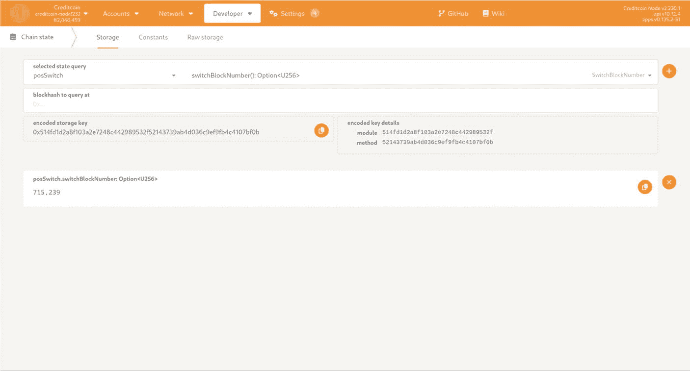

图 6-1

Polkadot/Substrate 门户显示 Creditcoin 切换到提名权益证明共识的区块号

#### 区块历史

由于 Creditcoin 2.3 是现有 2.0 链的自然演进，因此工作量证明期间生成的区块仍然可以在链上获取，并且在切换共识算法后仍然可以验证，这一点非常重要。

原始的 `Substrate` 实现假定权益证明历史从零区块开始，这在源代码中的多个位置被硬编码。最直接的解决方案是复刻（Fork）`Substrate` 并修改这些硬编码的位置。这已在 Gluwa 的 `Substrate` 复刻仓库 [`https://github.com/gluwa/substrate`](https://github.com/gluwa/substrate) 的 `pos-keep-history` 分支中完成。

#### `Creditcoin Staking Dashboard`

这是一个 Web 应用程序，允许提名人质押资金并为验证人投票。它是一个标准的 `React.js` 应用程序，将 `SubWallet` 等钱包浏览器扩展连接到 Creditcoin 区块链。`Creditcoin Staking Dashboard` 的主要功能是质押资金、筛选和投票给验证人，以及监控过往表现和奖励。

它是 `Polkadot Staking Dashboard` 的一个复刻，其品牌形象已针对 Creditcoin 进行了调整，修复了一些错误并简化了功能。主要是移除了关于提名池的功能，因为业务决策决定不将此功能作为迁移过程的一部分。后来在 Creditcoin 3.0 中，提名池功能被重新引入。

可通过以下网址访问：[`https://staking.creditcoin.org`](https://staking.creditcoin.org/)

源代码：[`https://github.com/gluwa/creditcoin-staking-dashboard`](https://github.com/gluwa/creditcoin-staking-dashboard)

#### `Subscan Essentials`

`Subscan` 是一个 API 服务，它监控数十个基于 `Substrate` 的区块链网络，并将信息聚合到 SQL 数据库中。`Subscan Essentials` 是实现此功能的开源组件。值得注意的是，真正的 `Subscan` 软件实际上并非开源，其本地部署版本需要付费。`Subscan` 似乎采用了开源核心开发模式。据我所知，这个开源组件与其服务并非一一对应，并且缺少某些功能，这也在意料之中。

该组件被 `Creditcoin Staking Dashboard` 用于渲染性能图表，例如过往奖励。它使用 Go 编程语言编写。

Creditcoin 2.3 使用了一个 `subscan essentials` 的复刻版本，该版本添加了 Staking Dashboard 所需的缺失 API 端点。该复刻还引入了各种改进。

来源：[`https://github.com/gluwa/subscan-essentials`](https://github.com/gluwa/subscan-essentials)

#### `Creditcoin-squid`

这与前面描述的 GraphQL 索引器相同。这里没有添加与权益证明相关的实质性新功能，提及其仅为了完整性。

### Creditcoin 2.3 时间线

v2.3 的时间线大致从 2023 年 5 月延伸到 2023 年 9 月。这是一个快速测试和开发的时期，在此期间主要组件已经成型。这个时期经历了开发、NPoS 测试网公告及社区参与，最后是 Creditcoin 主网向权益证明的迁移。

### Creditcoin 2.3 测试

此处的首要目标是确保现有功能均未受影响，并且切换到提名权益证明不会导致现有网络崩溃——这包括两方面：网络保持正常运行；切换后网络能持续出块，且旧区块历史仍可访问！

次要测试目标是确保用户能够承担新引入的角色（验证人或提名人），并使用为此类角色提供的应用程序，而不会遇到重大错误——这些应用程序是新的 `creditcoin-cli` 和 `Creditcoin` 质押仪表盘。

任何其他组件可视为较低优先级，因为它们更多扮演支持角色，而非用户交互的核心和焦点！

#### 单元测试

在 Creditcoin 2.3 期间新增的 `switch_to_pos` 等外部函数，已按照先前建立的工作流程进行了单元测试。我尝试覆盖所有可能的场景和错误条件，并对存储变化和触发的事件进行了断言。这里并无特别之处。

关于 NPoS 切换，其影响实际上无法从单元测试级别观察到，尝试通过单元测试模拟共识切换也不具实际价值，因为我们使用的是模拟运行时实现。这更适合从外部进行观察和检查。

#### 集成测试

原有集成测试套件的大部分内容保持不变，我按照常规工作流程为新增外部函数添加了测试。少量与指标和 RPC 相关的测试被移除，因为它们不再适用于权益证明。例如，由于不再进行挖矿，节点算力指标变得毫无用处。

在正式切换到权益证明之前，有两个新事项变得重要：

1.  断言区块历史得以保留。
2.  将 `switch_to_pos()` 的调用整合到现有的升级测试流程中。

断言历史区块保留相对直接：

-   启动一个独立的区块链用于测试目的。它仍以工作量证明方式启动。
-   在集成测试套件外部，记录最后一个工作量证明区块的信息——其哈希值和区块详情。将此信息保存到 JSON 文件中。也可以在测试套件内部作为设置步骤完成。之所以在测试套件外部进行，是为了能够针对其他已完成切换的链执行此测试套件。
-   通过调用 `switch_to_pos()` 外部函数切换到权益证明。
-   使用 JSON 文件中存储的同一区块哈希再次查询区块链。
-   比较区块详情——它们应与 JSON 文件中存储的完全一致！

在现有升级测试中模拟切换同样直接：

-   启动一个独立的区块链用于测试目的。它仍以工作量证明方式启动。
-   像之前一样与目标区块链同步，例如测试网。
-   执行 `runtimeUpgrade` 脚本，将最新的 WASM 运行时二进制文件上传到链上。
-   分叉或断开本地节点与目标实时链的连接，以防止变更传播。我们在两个独立的测试任务中都进行操作。
-   针对本地运行的节点调用 `switchToPos()` 以触发切换。
-   针对本地节点执行现有的集成测试套件，以确保一切仍正常工作。这包括内置于集成测试套件中的区块历史保留检查。

提示

在 Rust 源代码中，外部函数遵循所谓的 `snake_case` 命名约定，而在 TypeScript 客户端库中，相同的名称会转换为 `camelCase`。两者是相同的，但我认为不熟悉此规则的人可能会感到困惑！

#### 测试 `Subscan` 基础组件

实际的上游 `Subscan` 基础组件仓库在测试方面状态不佳。GitHub 上的历史记录显示，我上次检查时，CI 作业已失败超过一年，并且有一个长串的提交在 CI 失败的情况下被合并到主分支。

作为 Creditcoin 分支的一部分，我启用了我们在其他仓库中使用的所有常见工具——`MegaLinter`、`pre-commit CI`、`Dependabot`、`CodeQL` 等。还添加了 `golang CI linter` 作为特定语言工具，并确保我们拥有代码覆盖率报告，且 CI 作业在每个拉取请求上执行。

除此之外，我还对测试环境中所需服务的设置进行了多项改进——例如，使用现有的 `docker-compose.yml` 配置，而不是在多个位置指定配置值；在 CI 中使用相同的 golang 版本；在构建 Docker 镜像时清理 `Dockerfile` 等。基本上是确保所有符合 Creditcoin 标准实践的额外工具都能正常运行，并且它们报告的问题都得到了解决。

好消息是，存在一个用 Go 编写的现有测试套件。据我所知，它类似于一个 API 测试套件，介于功能完备的集成测试套件和单元测试套件之间。其任务是检验各个 API 端点并对它们的响应进行断言。

开发人员在开发新的 API 端点时曾尝试扩充这个现有测试套件；然而，我们并未对其进行彻底调查，我也不太清楚现有测试覆盖率（非代码覆盖率）以及该套件的质量究竟如何。简而言之，我没有足够的时间深入钻研这个现有代码库，弄清其测试套件的真实状况。

对该组件的信心可以这样表述：“只要它不崩溃，不导致 Creditcoin 质押仪表盘产生错误，并且 Creditcoin 质押仪表盘能正确显示奖励图表，那么它可能就没问题。”这被视为非关键任务组件，因此制定了上述验收标准。

#### 测试 `Creditcoin` 质押仪表板

该组件的上游版本位于 [`https://github.com/paritytech/polkadot-staking-dashboard`](https://github.com/paritytech/polkadot-staking-dashboard)。如果我们仔细查看其 2023 年夏季的测试套件，会发现里面内容并不多，至少没有公开可见的内容。每个拉取请求都会执行 CI 任务，这些任务会运行代码检查器和构建任务。我能找到的唯一测试文件名为 `graphs.test.ts`，它测试了一些辅助函数。似乎没有其他形式的单元测试或组件测试，也没有使用 `Selenium` 或 `Playwright` 等工具进行任何可视化自动化测试。与 `Polkadot` 生态系统中的其他组件不同，这个组件似乎没有在私有 `GitLab CI` 或 `Jenkins` 实例中安排其他测试任务。

现在，完全有可能该应用程序正在进行内部测试，并且/或者自动化测试套件作为另一个 Git 仓库的一部分存在。我很难相信不存在这种情况。只是我没能在 GitHub 上找到任何明显公开可用的东西。因此，如果你在开发下游分叉，这并非理想状况，但你也无能为力。这是你分叉 Git 仓库并决定使用它时就必须接受的风险。

对于 Creditcoin 分叉，我已经启用了我们所有的标准工具——预提交 CI、`Dependabot`、`CodeQL`、`MegaLinter` 等。其中一些工具仍然报告了大量针对代码库的问题，这些问题在该组件初始状态时就已存在。并非所有这些问题都被认为足够重要而需要修复，而在 Creditcoin 3 中，所有报告的问题实际上都得到了修复。

由于开发和发布 Creditcoin v2.3 的时间有限，团队同意采用一个简单的手动测试计划——大约 20 个测试场景，涵盖了品牌和正常路径功能中最显眼的方面，即确保其能够为验证人提供资金和提名，而没有任何明显的问题。这并不意味着没有错误；当然有。只是大多数错误都不够严重，不足以成为阻碍发布的障碍。许多错误也在未来的下游版本中得到了修复。

请记住，这个测试计划最初是根据 `Polkadot` 质押仪表板的视觉线索制定的，当时 Creditcoin 中还没有任何质押功能，并且在积极执行过程中经历了多次修改和改进。这只是测试人员必须为未知情况做好准备的又一种情况。

此外，每个拉取请求都经过了手动测试——验证原本要修复的问题是否真的被修复了，并且如上所述，没有发现任何被破坏的地方。

从实际操作角度来看，这意味着需要检出拉取请求，在本地构建它，并运行一个本地 Creditcoin 区块链，然后才能重现并测试这些拉取请求。这个流程在 Creditcoin 3.0 中得到了改进。

#### 测试 `creditcoin-cli`

`creditcoin-cli` 是一个标准的 TypeScript 应用程序，设计用于在终端中执行，更准确地说，是在运行的 docker 容器内执行。

有两个主要子组件以相当直接的方式进行测试——实用工具和辅助函数通过单元测试进行测试，而实际命令则通过集成测试套件进行测试，测试方式与节点操作员触发这些命令的方式相同。这两个测试套件都使用 `Jest` 测试框架以 TypeScript 编写。

这两个测试套件之间有明确的区分——单元测试无需任何外部依赖即可执行，而集成测试则需要一个正在运行的 `creditcoin-node(s)` 和一个兼容以太坊的区块链（例如 `Hardhat`）。所有这些都在本地隔离环境中运行，并使用预定义的账户 `Alice` 和 `Bob`。

在断言方面，集成测试重用现有的辅助函数和区块链 API 来断言预期状态。它们还对命令的标准输出进行断言！

由于开发节奏很快，`creditcoin-cli` 最初是通过直接使用命令并尝试成为 PoS 链中的验证人来进行手动测试的。我发现了大量边缘情况、错误和小问题，这些问题在正式发布前都得到了纠正。单元测试和集成测试套件正是基于这次经验诞生的，并且在撰写本文时，由于大部分测试工作仍在进行中，它们也还在开发中。

例如，一个有趣的奇怪现象是，当一个新的参与者想要加入 Creditcoin 区块链时，他们首先需要在其账户中拥有 CTC 资金。设置过程需要执行 `registerAddress` 和 `requestCollectCoins` 外部调用。这些调用的目的是允许外部方证明对以太坊钱包的所有权，并随后将以太坊上的 G-CRE 代币转换为 Creditcoin 主网上的 CTC。

这里的麻烦在于，这两个外部调用都有关联的交易费用，而对于一个新用户来说，如果没有外部资金，就无法在 Creditcoin 上入门。这也给测试带来了问题，因为我们需要有资金的账户才能索取更多资金。在隔离测试期间，这相对容易解决，因为我们可以通过发出 `sudo` 交易来更新测试账户的余额，我们知道 `sudo` 账户的秘密！在针对测试网或主网进行测试时，我们需要使用已经拥有资金的账户，并且有些步骤不能执行两次，所以你无法真正覆盖所有测试场景。

在撰写本书时，这个问题仍然存在，尚未解决。我认为它作为 Creditcoin 交互流程的一部分一直存在，但之前没有浮出水面，因为到目前为止，无辅助的外部参与是有限的。解决这个问题最简单的方法可能是免除 `registerAddress` 和 `requestCollectCoins` 外部调用的交易费用。

`creditcoin-cli` 测试套件会自动收集代码覆盖率指标，并将其发送到 [`https://app.codecov.io/gh/gluwa/creditcoin/tree/main/scripts%2Fcc-cli`](https://app.codecov.io/gh/gluwa/creditcoin/tree/main/scripts/cc-cli)；但是，这个指标并未用于指导测试套件的开发。在撰写本文时，`cli` 集成测试套件的重点是测试 `wizard` 命令，并模拟一个完整的验证人周期作为正常路径测试场景。其他一些命令也经过了测试，但并未对所有可用命令进行全面覆盖。这种测试覆盖是在该组件初始发布之后才添加的。

## 测试 Gluwa 的 Substrate 分叉

由于前面提到的区块历史保留功能，我们选择使用 Substrate 框架的一个分叉。关于质押奖励和惩罚的一个问题促使我更深入地研究他们在上游是如何测试的。我所发现的情况，作为一个毕生从事开源项目开发的人，我并不赞同。

上游 Substrate 在私有 GitLab 实例中执行其测试。据我所知，他们的一些作业定义使用了也未公开的工具和容器镜像。总的来说，如果你试图维护一个开源框架的下游分叉，这体验简直糟透了。

本质上，Creditcoin 团队根本无法知道我们所做的任何更改是否破坏了 Substrate，或者任何较新的 Substrate 版本是否与我们自己的更改不兼容——直到所有这些内容被合并到下游分支，然后你尝试在此基础上构建 Creditcoin 为止。

### 注意事项

Substrate 的新版本对质押子系统进行了重大更改，例如，将他们所谓的“质押账户”和“控制器账户”合并为单一账户，这改变了与质押相关的大多数 API/交易调用的签名！

在向 GitLab 注册了一个与 Creditcoin 相关的群组后，我花了大约一周时间，试图弄清楚上游的所有 CI 作业，找出它们在哪里出错，注释掉代码或尝试一些快速补丁，并大致探索了其整体状态。这个过程似乎并不容易，我感觉所需的时间会比最初预期的要长得多，因此我需要为分叉仓库实现一种应急测试方法。

团队决定重用我们自己的私有测试基础设施（按需自托管 GitHub 运行器）并运行 `cargo check` 和 `cargo test`。尽管硬件资源部署在私有环境中，但它们的配置和测试结果是公开可见的。

我们通过 Rust 编译器和现有的 Substrate 单元测试套件进行了静态检查。请注意，我称之为“单元测试”套件，因为在使用 Rust 内置测试工具时这最常见，但该测试套件本身包含数百个针对多个模块的测试场景，执行需要数小时，因此它可能包含多种类型的测试。这是另一段第三方代码，我们并不掌握所有细节，如果试图完全搞清楚，将会花费过多时间。

根据我之前的调查，我发现质押奖励和惩罚在自动化测试场景中得到了相当充分的测试，而这正是我们所关心的。我确实尝试过将上游测试文件复制到 Creditcoin 代码库中，并修改导入/调用路径；然而，我很快意识到这行不通。上游质押模块内部存在一些私有函数，这些函数被用作现有单元测试的一部分，这意味着需要对分叉进行更多修改，而这是我并不想维护的。

### 备注

请注意，在 Creditcoin 2.3 开发期间，Substrate 框架发布了新版本。我们至少知道一个重大变更，需要下游给予更多关注。不过，为了最大程度降低失败风险和工程资源压力，我们决定在最初的 2.3 开发阶段不升级 Substrate。正因如此，当出现重大变更时，现有下游 CI 作业的表现如何尚不明确——在撰写本文时，我们尚未涉足这条路径！

另一个重要说明是，`gluwa/substrate` 遵循的是上游的一个版本分支。如果我们想要升级，那么我们需要从当前代码库拉出分支，基于较新的上游版本分支进行变基，然后看看效果如何。这（在本书撰写时）是一个手动过程，尚未实现自动化。在能对我们的测试方法以及下游测试作业检测故障的能力充满信心之前，我们还需要做更多工作。

## 在 PoS 测试网上进行社区测试

没有完美无瑕的软件；然而，为区块链切换共识引擎是一件大事，如果处理不当，会带来品牌受损和社区反对的风险。数据丢失（无论是历史数据还是产生区块的能力）是另一个主要风险，这已由现有的测试覆盖范围所涵盖。此处，我们重点关注技术栈中的其余组件。

在内部，所有组件都已打磨至不存在重大漏洞或视觉缺陷，或者这些缺陷对公众来说并非一目了然，至此，`Creditcoin` 的权益证明版本被认为已足够完善，可以作为公开测试版发布。我们进行了全新的测试网部署，并附带了配套的文档、Staking Dashboard、Subscan Essentials 和 `creditcoin-cli` 组件。首次部署的是“PoS Devnet”（PoS 开发网），仅供工程团队内部使用。面向社区的环境称为“Creditcoin PoS Testnet”。

在创建了这个新的 PoS 测试网环境并部署了所有组件之后，我们在 Creditcoin 官网和社区频道上发布了公告。社区成员获得了测试网 CTC 代币，并被鼓励以提名人和验证人的身份参与网络。换句话说，他们被激励去试用新引入的软件组件。这项工作主要由市场团队推动，他们负责收集用户反馈，并整理一份来自社区的漏洞和问题清单，然后提交给区块链工程团队。

此次社区测试的目的多种多样，与其他软件厂商的类似努力别无二致：

1.  当然是为了制造营销热点并提升社区参与度。
2.  确保主要组件按预期工作，或者至少没有灾难性故障，并从实际用户群中收集漏洞和反馈。
3.  确保文档足够充分，以便用户即使对实际技术不太熟悉，也能参与并执行预期任务，而不会遇到技术难题。据我们所知，有些用户可能是首次参与区块链网络。我曾经就是这样的用户之一。
4.  为预计会有多少提名人和验证人参与网络建立一个基准。稍后我会谈到一些限制，而这是收集真实数据的一种便捷方式。
5.  允许其他工程团队（包括内部和外部）试用 Creditcoin PoS 实现，并在必要时调整他们的应用。如有需要，可将其作为这些团队的预发布环境。

关于为何要独立部署，这里有几句话要说！主要有两种选择：

1.  升级现有的 Creditcoin 测试网区块链。
    -   优点
        -   这正是你在主网上实际会做的操作；保持流程一致以便演练、获得信心并可能发现迄今为止被忽视的问题，这是有意义的。
        -   允许对历史区块保存功能进行真实世界的测试。
        -   切换过程高度可见，如果进展顺利，会向你的社区传达积极信号。
    -   缺点
        -   现有的 PoW 矿工可能无法准确预知切换发生的时间，这将导致他们在无法产生区块的情况下继续运行。这可能是不期望的，因为他们会持续消耗计算资源，并且可能尚未准备好与你同时过渡到权益证明。
        -   不受控制的快速采用会导致饱和/过载/边界情况错误——例如，10000 个验证人同时想加入。
        -   如果切换失败，这也同样高度可见，并且声誉受损的风险非常高。
    -   应急方案
        -   销毁出现问题的链，并从备份中恢复。从技术上讲相对容易实现，但可能需要与社区成员进行一些协调，但如果真的发生这种情况，总体而言会非常损害声誉。

2.  部署一条全新的区块链。
    -   优点
        -   完全独立。
        -   允许参与者按自己的意愿加入。现有的矿工可以自行决定是否重新分配其硬件资源。
        -   允许你控制谁能参与，并通过控制这条新链上的代币供应量以及设置允许的活跃验证人数量（例如，缓慢增长）来限制用户数量。
        -   即使出错，也不会中断现有的 PoW 测试网。虽然也不是什么好消息，但负面影响应该会更小。
    -   缺点
        -   无法演练在主网上执行切换的工作流程。
        -   无法测试历史区块保存功能。
    -   应急方案
        -   销毁 PoS 链并从头开始。虽然也不是什么好消息，但负面影响应该会降到最低。

### 文档审阅

在引入质押功能之前，现有针对 1.x 和 2.0 版本的文档包含的用户指导非常有限。那就是所谓的“Creditcoin 挖矿节点设置”，它基本上告诉用户如何生成公钥/私钥对，以及如何在启动 Creditcoin 容器时使用他们的公共地址。该文档已在 `https://github.com/gluwa/creditcoin/pull/1505` 中被移除。

新的文档解释了“质押”的概念、工作量证明与权益证明的区别，以及一些基本概念，如验证人选举、时代与周期、质押奖励和惩罚。关于钱包的章节记录了常见的第三方浏览器扩展以及自研和第三方的命令行界面。接着是两个新章节“提名人指南”和“验证人指南”，解释了提名权益证明区块链中的两个主要角色，并指引用户使用他们可以使用的相应应用程序。

与成为工作量证明区块链中的矿工相比，成为权益证明网络中的验证人要复杂得多，并且包含多个独立的步骤。

审阅文档，无论来自 QE 还是其他利益相关者，其确切含义就是——检查拼写错误、语法错误、不合逻辑的条目、术语不清晰或对没有经验的人来说不易理解的地方等等。这是一个迭代的过程，在短时间内收到了大量反馈并进行了多次修改。

“测试文档”的另一部分则是实际按照所列出的所有技术步骤操作，并确保它们是正确的；顺序是正确的，并且显示的命令会产生文档中所述的结果，同时确保版本号、URL 等也都是正确的。

文档的某些部分包含针对非 Linux 平台的示例，因此需要有人验证这些示例是否正确。与这份文档合作一段时间后，人们会变得相当有偏见，开始跳过文档的某些部分，或者已经能预见到需要输入哪些命令，因此以极其勤勉的态度反复检查所有内容变成了一件苦差事。这时就需要引入其他团队成员，最好是那些经验较少和/或不熟悉这份文档以及整个“成为验证人”工作流程的人，这样他们就能发现更多的边缘情况，并帮助改进文档。

文档 URL：`https://docs.creditcoin.org/cc2`（不同于 Creditcoin 3.0 文档）。

### 负载与性能测试

在提名权益证明的背景下，区块链的性能问题再次变得重要起来。同时存在多个待处理事项：

-   用于选择下一时代验证者的算法实际上是在遍历一个图。验证者数量越多，图就越大，求解所需时间就越长。如果我没记错，Web3 研究文档指出的实际限制约为 300 个验证者，而 Kusama 和 Polkadot 等其他 Substrate 链已经运行在此限制下。对 Creditcoin 而言，找出我们自己的实际限制至关重要。
-   还有一个设置限制了每个验证者的提名者数量。我不清楚这个数字是否会对上一项中的图算法产生影响。
-   所有验证者在当前时代都会发送一个`i-am-online`的 ping 信号；否则，他们将受到惩罚。
-   惩罚子系统监控在线 ping 信号，并在必要时计算惩罚，如有需要则冻结验证者节点。
-   根据每个验证者在当前时代产生的区块数量，奖励子系统会计算验证者及其所有提名者的奖励。
-   还有常规的 Creditcoin 借贷周期交易。

与之前的工作量证明版本相比，整个区块链的通信量要繁重得多。

着眼于 Creditcoin 2.3 的所有这些，我们需要建立一个性能基准，以及一套用于“性能测试”的工具集/方法论。这里使用引号，是因为我仅仅是触及了这个领域的皮毛，并未深入探究，你将会看到这一点。

工具库中的第一个工具叫做 `Zombienet`，[`https://github.com/paritytech/zombienet`](https://github.com/paritytech/zombienet)。它使用模板，会启动一个独立的临时区块链网络。通过模板文件，可以配置不同数量的节点和参数。你还可以使用 `Zombienet DSL` 语言对生成的网络进行断言！

我使用 `Zombienet` 启动了包含 100 到 300 个验证者的网络，并调整了 Creditcoin 的设置，以建立测试所需的硬件基准和网络行为基准。Creditcoin Zombienet 的入口点是主 Git 仓库中的 `zombienet/` 目录。

下一个重要问题是：“如果我们切换到提名权益证明，Creditcoin 能否支持最低数量的借贷交易？”或者更确切地说，“它能支持多少笔借贷交易？”换言之，从业务角度来看，切换到权益证明是否会对区块链吞吐量产生影响？起初我们研究了 [`https://github.com/paritytech/polkadot-stps`](https://github.com/paritytech/polkadot-stps)，这是一个适用于任何基于 Substrate 链的通用工具。`Polkadot-STPS` 发送余额转账，这种交易在几乎所有使用 Substrate 框架实现的区块链中都必然存在；然而，与借贷周期交易相比，它们相当轻量，因此并非最佳选择。

我没有深入探究这个难题，因为最初发现的数据已经回答了关于未来短期到中期内预期区块链性能的最重要问题。还有另一位团队成员创建的工具 `creditcoin-transaction-producer`，其任务是发送成百上千笔交易，从而实际回答关于吞吐量的问题。

### 安全赏金计划

安全问题一直是 Creditcoin 持续关注的重点。并且在我看来，我们作为工程师应该始终努力创建安全的软件，并沿着这条思路去思考。

例如，作为 `creditcoin-cli` 开发的一部分，我成功地倡导移除了直接以明文指定密钥或在终端中直接显示这些密钥的功能。此类功能会带来安全风险，因为这些明文值可能会出现在终端历史文件中，或者在用户试图报告问题时，随着命令输出被复制粘贴给更广泛的受众。我在这个行业工作了足够长的时间，亲眼见识过经验丰富的团队通过各种不同方式在网上泄露他们的凭证。如果你的软件在没有最低限度防范措施的情况下以明文形式暴露密钥，那些安全意识较弱/技术不精的用户肯定会泄露他们的密钥。这无异于自找麻烦！

在 `creditcoin-cli` 中，密钥要么通过终端提示符交互式读取（会屏蔽输入字符且不允许复制该值），要么需要作为环境变量指定！应用程序本身绝不会将这些值存储在磁盘上。

除了 Creditcoin 工程师从安全角度进行内部风险评估、使用之前提到的静态分析工具、遵循最佳实践以及保持第三方依赖项更新之外，团队还在我们的安全赏金计划上做了更多工作。

这是一个低调的赏金计划，最初托管在 `Hunter.dev` 平台上（该平台后来改变了其关注重点），并在每个仓库的 `SECURITY.md` 文件中记录了负责任地披露安全漏洞的步骤。其目标是让社区能够发现一些低级漏洞，同时让团队建立一个针对修补和响应安全漏洞的工作流程。对于测试而言，这意味着验证报告的条目，最重要的是确保重现步骤和问题描述足够精确，以便工程师能够着手处理。

安全之旅的下一步将是一个专门的安全赏金计划，提供高额现金或加密货币奖励，并托管在一个专注于 Web3 安全研究的高知名度平台上。在撰写本文时，团队尚未达到这一步。

注意，在编写本书期间，`huntr.dev` 平台本身发生了所有权变更，并将其关注点从一个通用安全赏金平台转向了专注于 AI/ML 的平台。因此，原来的赏金计划已不复存在！安全漏洞仍然可以通过电子邮件和/或 GitHub 的安全公告界面（对所有人开放）进行披露，但这并非专门针对安全研究领域的专业人士。

恰巧的是，我还参与起草了几个 Creditcoin 的安全公告，这些公告最终发布在 [`https://github.com/gluwa/creditcoin/security/advisories`](https://github.com/gluwa/creditcoin/security/advisories)。这是测试工程师工具带中需要增加的又一利器！

### 其他有趣的测试及若干缺陷

作为 v2.3 开发的一部分，曾出现过一些有趣的故障。这些故障发生在专用测试环境中，并促使我们在现有测试套件中增加了更多测试。

一旦切换到指定权益证明机制，你就无法再更改区块链实现中的某些值。最重要的是，你不能更改质押周期——即选择验证人出块的时长！更改此项会导致区块链崩溃，因此我添加了静态分析检查和集成测试来捕获此问题！这也凸显了在此处选择合适的实际值是多么重要。

另一个与升级测试基础设施相关的问题，是如何基于 Git 标签发现最新版本。CI 任务期望遵循特定的命名约定，例如，针对 Devnet（开发者网络）的升级使用 `-devnet`，针对 Testnet（测试网）的升级使用 `-testnet`，以此类推。还记得运行时升级测试 CI 任务是如何检查拉取请求的目标分支，以确定同步到哪个链的吗？类似地，它们需要知道如何找到先前版本——该版本在 CI 任务中会被多处使用。一致地命名版本非常重要，而有些版本打破了现有的命名约定，这对未来版本的 CI 任务执行产生了负面影响。通过更新版本号并在 GitHub 上使用适当的名称标记新版本，该问题已得到修复。在测试方面，我还添加了另一个静态分析脚本，这样如果命名约定未被遵循，实际上就会中断发布流程。我打赌你没想到命名你的 Git 标签也需要测试，但当你将其转变为公共接口时，它确实需要进行测试。

当我着手设置负载测试工具时，曾短暂地遇到 `creditcoin-transaction-producer` 无法与最新版 Creditcoin 配合工作的问题。原因在于它在创建待发送交易之前会使用链元数据检查兼容性，请记住 `gluwa-bot` 会在需要时自动更新链元数据。这个机器人带来的一个副作用是，更新 Creditcoin 版本号也会更改元数据。所有这些最终导致了一个 CI 任务，该任务会检查区块链与我们开发工具之间的兼容性，以便我们知道它们始终可用且相互同步！

作为 Testnet 上社区测试流程的一部分，开发账户 Alice 和 Bob 已被剥夺资金以防止滥用，例如盗窃资金。默认情况下，Alice 还拥有 sudo 权限。这种资金剥夺行为破坏了针对实时目标的升级和集成测试。此后，测试流程开始使用不同的账户，这些账户的凭据在外部定义，并且出于安全考虑，被排除在 CI 执行环境之外。我想，除非你能够直接控制，否则不能想当然地认为某些账户和前置条件会始终成立。

作为 PoW 到 PoS 迁移准备的一部分，团队一直在使用测试环境进行演练。这个测试环境最初在我们尝试对其执行 PoW 到 PoS 迁移过程后卡住了。原因是，当调用 `switch_to_pos()` 外部函数时，它期望提供一个账户列表，这些账户将在第一个选举周期完成前充当初始验证人。该列表期望每个验证人有两条记录——一个 `stash` 账户和一个 `controller` 账户——这些随后被传递给 BABE 模块（负责生产新区块的模块）。在源代码中指定这些参数的顺序，与 BABE 期望的顺序相反。在之前的测试中，我们总是对 `stash` 和 `controller` 使用相同的账户，因此没有发现这个缺陷。从“测试”的角度看，测试环境成功地执行了发现问题的任务。

附带说明一下：“`stash`”和“`controller`”是来自 Substrate 框架的概念，其中一个账户（“`controller`”）代表另一个账户（“`stash`”）行事。在迁移期间，Substrate 已经发布了该框架的新版本，从同时使用 `stash` 和 `controller` 账户迁移到仅使用单个账户，因为使用两个账户容易混淆。在 Creditcoin 3.0 中，只有一个“`stash` 账户”！工程团队中的每个人都知道这一点，这也是包括我在内没人考虑使用两个不同账户进行测试的部分原因。

与迁移相关的另外两个问题同样是在测试环境中发现的，这两个问题几乎肯定会导致整个区块链崩溃。两者都与一个特定的区块号有关，仅仅因为这个数字被用作一个硬编码的、足够大的值：

1.  最初发现了一个节点内存耗尽并崩溃的问题。这发生在运行时升级之后。该操作试图分配过多内存，导致节点崩溃。内存足够大的机器没有崩溃，但升级耗时过长，无法被认为可行。

2.  下一个问题与此相关——在每个区块上执行的 `on_initialize()` 钩子函数，试图从存储中删除过多的条目。这与 Creditcoin 2.0 中发现的那个过度“贪婪”地将链上存储条目读入内存的函数是同一个；参见 [`https://github.com/gluwa/creditcoin/pull/1253`](https://github.com/gluwa/creditcoin/pull/1253)。当前的问题是，要删除的条目过多，I/O 操作耗时超过了提议新区块所允许的时间，从而破坏了区块生产。这是 `::clear_prefix(block_number, u32::MAX, None)` 这段代码，试图删除数量极其庞大的条目。修复方法在 [`https://github.com/gluwa/creditcoin/pull/1353`](https://github.com/gluwa/creditcoin/pull/1353) 中——设置每个区块能删除的最大数量限制，并将内部清理过程分散到多个区块中执行。

在测试方面学到的一些重要经验：

1.  当你看到像 `u32::MAX` 这样的东西时，要高度质疑它们，并让你的 CI 工具能触发类似模式的检查。试图将软件系统推向极限从来不会带来什么好处。

2.  读/写操作应该有限制，并且这些限制必须在它们变得过大以至于破坏系统之前得到验证。尤其是在 Substrate 框架中，从链上存储读取条目然后对其进行迭代是非常容易的——实现此功能的代码非常优雅且易于使用。然而，这同时也意味着很容易忘记设置上限，并尝试将过多数据读入内存。

3.  警惕文档、示例和测试套件中硬编码的“足够大”的值，因为这些地方是用户在不完全清楚自己在做什么或不够小心时，会去查找参考的地方。如果可能，尽量使用能对硬编码数值进行触发的静态工具。

上述问题之所以差点在生产环境演变成大问题，唯一原因是可能有人被要求使用一个从未打算用于生产环境的示例。由于不了解且可能不理解该示例的含义，他们复制了一个当时看来可能还很遥远的数值。有点像程序员过去不得不处理的千年虫问题。

如果测试环境不是从生产环境分叉出来的，或者如果它包含的区块（存储中的数据）太少，这些问题永远不会被发现。这说明使用生产数据进行测试是多么重要！也说明良好的开发者体验（例如，文档和高质量的示例）可以直接惠及供应商和社区开发者。

### 另一个问题：链下工作者的 Nonce 管理

另一个被发现的问题与链下工作者的 nonce 管理有关。请记住，这是一个与外部世界通信的组件，而 nonce 是通信过程中使用的唯一编号。问题在于，当验证失败时，链下工作者仍然会更新其 nonce，而链上的 nonce 却保持不变。链下工作者可以处理发送交易且该交易立即失败的情况，但无法检查交易在稍后被从交易池中移除或未立即失败时的状态。因此，在下一轮中，你可能会遇到几种失败场景：

- `OCW` nonce 过小；链上 nonce 更大——交易将失败，因为该 nonce 已被使用。
- 交易池中存在两个具有相同 nonce 的交易——其中一个会被从池中丢弃，但你不知道它已被丢弃。交易从交易池中被丢弃还有其他原因，这会导致两个 nonce 计数器不同步。
- `OCW` nonce 过大；链上 nonce 更小——交易看起来没问题，但它会“永远”留在交易池中。池中的交易不会被纳入区块，因为它要一直等到链上 nonce 计数器追上它。在那之前，该交易很可能会过期。

这个问题一直存在；然而，随着向权益证明的转换，Creditcoin 团队还增加了更多需要链下工作的外部函数。与闲置的工作量证明链相比，即使没有贷款交易，权益证明的投票过程也会产生更多的链上活动。这两个因素叠加在一起，使得该问题出现的频率更高。

对此的技术修复方案是监控这些计数器何时会即将进入不可恢复的状态，然后重置它们。

### v2.3 期间的测试挑战

我在 v2.3 的开发阶段遇到了一些挑战。我认为其中大部分源于快速的开发过程以及对所有相关组件缺乏全面的理解。这听起来和其他任何测试项目一样，对吧？

首先，关于所有第三方组件和分支——在做出任何选择并着手实施之前，我们本应花时间检查它们上游的代码库、测试套件的状态、CI 作业历史记录以及整体的测试实践。然而实际情况是，我们分叉的每个第三方组件的测试状况都相当糟糕，这引出了大量关于长期维护的问题。这里有一个误导了团队的棘手之处：其他更流行的区块链也是基于相同的组件构建的。在检查了上游仓库的状态后，我并不认为 GitHub 上发布的代码库与生产环境中使用的完全相同。至少并非所有涉及的组件都是如此。

不过，这里也没有好的替代方案。如果团队决定这些上游组件不够好，那么我们就需要投入更多时间来开发自己的组件，或者与第三方供应商进行及时的讨论，以使用他们的托管服务。这是一个可作长期战略的方案，团队可能最终也会这么做，但在需要快速开发的短期周期内是行不通的。

> **提示**
>
> 务必对你可能依赖的任何关键第三方开源组件的状态进行断言！即使该组件最初看起来并没有那么关键！

接下来的挑战与此相关——由于对组件本身不够熟悉，以及与利益相关者就他们对发布周期的期望和所感知的质量水平沟通不够详细，导致对组件需求的理解不够充分。实际上，“公共测试网发布”在时间安排和质量上都与真正的主网发布非常接近。对于这次测试网发布，人们并未期望它是测试版质量，而是期望它接近生产质量，仅存在细微的问题和 bug。这与更传统的软件开发及发布方式不同。换句话说，大部分测试和开发压力被转移到了发布周期的早期阶段，你会遇到一些冲刺阶段，这些阶段大致可以分为高活跃期和相对平静期。

在某些领域，尤其是区块链和加密货币领域，测试版发布的外观可能比其功能质量更重要。这会使看似微小的问题（“你可以稍后修复”）的优先级发生偏移，实际上变成需要快速解决的大问题，甚至可能阻碍你的发布。这一切都关乎观感！

我在本书前面提到过，当依赖第三方组件时，你需要了解生产它们的供应商是谁，以及他们的主要业务目标是什么。当直接分叉一个开源应用程序时，这一点肯定也是正确的。例如，Polkadot Staking Dashboard 被 Polkadot 区块链使用，我发现了它乐于容忍的一些 bug。另一方面，同样的 bug 也存在于 Creditcoin Staking Dashboard 的分叉中，而 Creditcoin 的产品负责人不太愿意容忍这些问题，因此需要在同一领域增加额外的开发和测试资源投入。仅仅因为一个更大的参与者使用了与你相同的基础软件组件，并不意味着该软件是 100% 一流的！

> **提示**
>
> 确保整个团队在质量期望方面达成一致！确保工程团队和利益相关者步调一致！

此外，如果我们测试人员能够率先采用验收标准/发布标准，那就太好了。这些标准在处理企业级软件的大型组织中相对常见，但在快速发展的初创型环境中则少得多。

例如，Fedora 项目 Linux 发行版的基本发布标准记录在 `https://fedoraproject.org/wiki/Basic_Release_Criteria` 中，并且每个特定版本中添加的每个新功能都有其自己的附加标准。我相信这有助于让所有人对将要交付的内容达成一致期望，并接受反馈、规划和调整。显然，它可以从小处着手，并随着时间的推移而发展，但我认为缺乏此类标准是一个错误，特别是从我作为测试人员的角度来看。

### 从 PoW 迁移到 PoS

实际的迁移过程被整理成一个清单文档，并在不同的环境中多次执行：本地环境、Staging 环境（即主网的分叉），直到团队对所有步骤充满信心，并且在实际迁移主网节点之前没有发现明显的问题！

遗憾的是，`switch_to_pos()` 外部函数、上述清单以及所有与从工作量证明迁移到权益证明之前和之后断言状态相关的测试，在之后都不再需要，并且已被删除。这真的是一种“一次性”的测试类型。

## 总结

Creditcoin 2.3 显然挺过了向权益证明的转换。在撰写本文时，它已经运行了超过 200 万个区块，因此区块链作为权益证明运行的时间已经比作为工作量证明运行的时间更长了。更重要的是，我也挺过了这个非常忙碌的时期，并学到了更多我之前未曾考虑过的“测试区块链”的方面。

在下一章中，我将讨论下一次迭代——Creditcoin 3.0 及其带来的新事物。团队将再次做出转变——这次的方向略有不同。

# Creditcoin 3.0

`Creditcoin 3.0` 是 `Creditcoin` 区块链的下一代演进产物，它从一个专门用于记录贷款交易的专用链，发展为一个面向现实世界资产管理的更通用的链。它是一个完全兼容 EVM 的 Layer 1 区块链。换句话说，它支持智能合约开发，并且兼容以太坊生态系统中使用的许多流行工具，例如钱包应用和智能合约开发工具。`Creditcoin 3.0` 使用 `Substrate` 框架构建，并在其上添加了一个特殊的 EVM 兼容层，同时像其前身一样采用了提名权益证明共识算法。

其两个主要设计特点是 EVM 兼容性和所谓的通用预言机，后者解锁了多链信息流和跨链交易，以帮助构建和部署多链合约。开发工作分阶段进行，在撰写本书时，仅实现了 EVM 兼容层。

`Creditcoin 3.0` 被提议作为一个独立的区块链，而不是从 2.x 系列的增量升级，这再次极大地简化了开发和测试。最初的提议还指出，`Creditcoin 2` 功能将作为 `Creditcoin 3.0` 上的一个 L2 来实现。我假设这将是一组能够记录贷款周期流程的智能合约。然而，在撰写本文时，这些实现细节尚不存在。

`注意`

`Creditcoin 3.0` 测试网的公开声明 ^(⁸) 还提到了对现有区块链的重新命名。之前的 `Creditcoin 2` 将更名为 *“Creditcoin Classic”*，而新的兼容 EVM 的 v3.0 将简称为 *“Creditcoin”*。为了避免混淆，我将在本书的其余部分继续使用明确的版本号。

## Creditcoin 3.0 的组件

我将在下文中概述 `Creditcoin 3.0` 最重要的组件。由于它是一个基于 Substrate 的链，因此某些部分与 `Creditcoin 2` 基本相同。

### Polkadot-sdk

如前所述，这是用于构建区块链的核心 `Substrate` 框架。在比 `Creditcoin 2` 所使用的更新的版本中，上游维护者决定将几个 git 仓库合并在一起，并归档旧仓库。这是新的名称。

`Creditcoin 3.0` 使用了一个最初遵循 `release-polkadot-v1.1.0` 分支并在此基础上添加了几个补丁的派生版本。

来源：[`https://github.com/gluwa/polkadot-sdk`](https://github.com/gluwa/polkadot-sdk)

### Frontier

这是 `Substrate` 的一个以太坊兼容层，提供了额外的模块（pallets），你可以将其包含在运行时实现中。该组件使得每个 `Substrate` 账户自动拥有一个所谓的“关联 EVM 地址”，该地址可用于任何与 EVM 相关的交易。正是这个组件提供了 EVM 兼容性，并允许区块链用户在 `Creditcoin 3.0` 上部署智能合约。其架构如下所示。

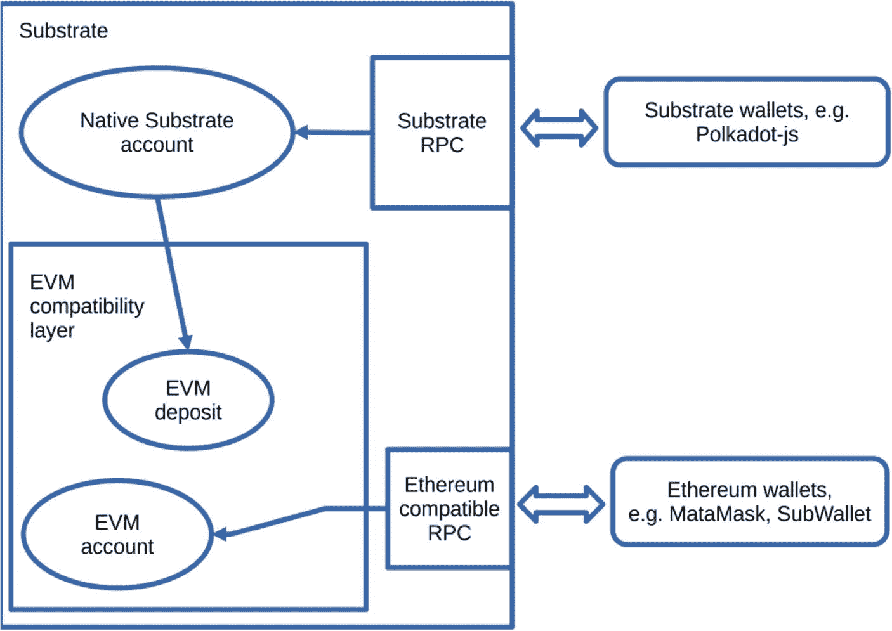

`图 7-1`

基于 Substrate 的链中的 EVM 兼容性

这里需要重要说明的是，`Substrate` 和以太坊使用不同的地址格式，并且地址长度也不同。以太坊地址以 `“0x”` 前缀开头，而 `Substrate` 地址则没有（并且它们总是以 5 开头）。以太坊风格的地址长度为 20 字节，而 `Substrate` 地址长度为 32 字节。这就是为什么在 `Creditcoin 3.0` 中，每个账户有两个不同的地址——原生的 `Substrate` 地址和一个被称为关联地址的虚拟 EVM 地址。

来源：[`https://github.com/gluwa/frontier`](https://github.com/gluwa/frontier)

### Creditcoin3

这是 3.0 版本的主源代码仓库，包含了区块链运行时实现、Docker 容器规范以及其他一些内容。与 `Creditcoin 2` 的主要区别在于，该仓库中的大部分代码都是管道代码——在撰写本文时，没有自定义模块，没有自定义交易，也几乎没有额外的 RPC 调用。

来源：[`https://github.com/gluwa/creditcoin3`](https://github.com/gluwa/creditcoin3)

### EVM 跟踪 RPC

这是一个内部组件，是 `creditcoin3-node` 客户端的一部分，它导出了一些 RPC 方法，能够跟踪在基于 Substrate 的链内部的 EVM 层上发生的交易，例如，智能合约内部的交易。该组件的主要目的是暴露区块浏览器（如 `Blockscout`）所需的信息。如果没有它，区块浏览器应用仍然能够看到每个区块和其中记录的交易；但是，它将无法遍历 EVM 相关的交易并显示关于它们的更细粒度的细节。

这些 RPC 的代码来自 `Moonbeam` 区块链，并已合并到 `creditcoin3-node` 中，参见 [`https://github.com/gluwa/creditcoin3/pull/169`](https://github.com/gluwa/creditcoin3/pull/169)。由于这是一大块第三方代码，因此已经过人工审核以确保其按预期运行。最初，该组件公开的 RPC 方法通过编译器标志有条件地启用，之后已被纳入标准构建的一部分。

### 预编译合约

这是一个在 `Creditcoin 3 测试网` 正式公告后添加的，`gluwa/creditcoin3` 仓库内部的组件。该组件允许你弥合 `Creditcoin 3` 以太坊端与 `Substrate` 运行时之间的差距，并能够从正常情况下不可行的 EVM 侧与运行时进行交互。

从外部来看，该组件充当一个始终在固定地址可用的智能合约，即一组预定义的智能合约集合。在实现方面，有一个用 Rust 编写的入口函数，它是 `Creditcoin` 运行时的一部分。这与外部函数非常相似。此外，还有用 `Solidity` 语言编写的智能合约接口定义。这里的关键部分是合约将要部署的预定义地址。

在撰写本书时，`Creditcoin 3` 包含一个名为 `substrate-transfer` 的预编译合约，其目标是简化从现有的 `Substrate` 钱包为 `Creditcoin` 上的 EVM 地址提供资金的步骤，只需一步即可完成（否则需要两步）。它在地址 `0x0000000000000000000000000000000000000Fd1` 可用 ➤ [`https://creditcoin-testnet.blockscout.com/address/0x0000000000000000000000000000000000000Fd1`](https://creditcoin-testnet.blockscout.com/address/0x0000000000000000000000000000000000000Fd1)

包含更多预编译合约的反例是 `Moonbeam` 网络；详情请参见 [`https://docs.moonbeam.network/builders/pallets-precompiles/precompiles/`](https://docs.moonbeam.network/builders/pallets-precompiles/precompiles/) 和 [`https://github.com/moonbeam-foundation/moonbeam/tree/master/precompiles`](https://github.com/moonbeam-foundation/moonbeam/tree/master/precompiles)。

### Creditcoin 3 命令行界面

与 `Creditcoin 2` 版本类似，这是一个打包在容器镜像中的命令行程序，供验证人节点操作员使用。它是 `gluwa/creditcoin3` git 仓库的一部分。该组件最初是作为现有 `Creditcoin 2` 命令行源代码的副本开始的，但有两个重要的补充：处理 EVM 转账的命令 + 对代理功能的支持。

#### 代理功能

# Creditcoin 3.0

这是区块链和命令行应用程序的一个功能性子组件。我在这里提及它是因为它很重要，并且它极大地影响了我们的测试方式。

请记住，在谈论 Creditcoin 2.3 时，我曾提到过名为“stash”和“controller”的账户，并且该功能已被弃用。代理账户是新晋的功能。

顾名思义，在 Creditcoin 3.0 中，用户可以创建另一个账户，该账户持有足够的资金来支付交易费用，并用于代表其主要账户执行日常操作。代理由主账户授权，然后用于代表主账户签署交易。使用代理账户可以显著降低因凭证意外泄露或被盗而导致大量资金受损的风险，因为持有所有资金的主账户只需与区块链进行一次交互——即授权代理。所有后续的其他交易都可以使用代理账户的秘密信息来执行，从而最大限度地减少主账户的暴露风险。

在基于 Substrate 的链中，可以实现一个代理过滤器，它向用户导出不同的代理类型，并控制允许哪些运行时调用（即 `extrinsics`）。这就是如何为代理账户实现访问控制。Creditcoin 3 提供了三种不同的代理类型：`Staking`（质押）、`NonTransfer`（非转账）和 `All`（全部）！这就是 Creditcoin 中过滤器的定义方式（`代码清单 7-1`）。

```rust
impl InstanceFilter for ProxyFilter {
fn filter(&self, call: &RuntimeCall) -> bool {
match self {
ProxyFilter::All => true,
ProxyFilter::Staking => matches!(
call,
RuntimeCall::Staking(_)
| RuntimeCall::Session(_)
| RuntimeCall::Utility(_)
| RuntimeCall::VoterList(_)
),
ProxyFilter::NonTransfer => matches!(
call,
RuntimeCall::Grandpa(_)
| RuntimeCall::ImOnline(_)
| RuntimeCall::Proxy(_)
| RuntimeCall::Session(_)
| RuntimeCall::Staking(_)
| RuntimeCall::System(_)
| RuntimeCall::Timestamp(_)
| RuntimeCall::Utility(_)
| RuntimeCall::VoterList(_)
),
}
}
fn is_superset(&self, o: &Self) -> bool {
match (self, o) {
(ProxyFilter::All, _) => true,
(ProxyFilter::NonTransfer, ProxyFilter::Staking) => true,
(a, b) if a == b => true,
_ => false,
}
}
}
```

`代码清单 7-1：代理过滤器实现`

## 质押面板

这是一个 Web 应用程序，允许提名人质押他们的资金并为验证人投票。这是一个标准的 `React.js` 应用程序，它将钱包浏览器扩展（例如 `SubWallet`）连接到 Creditcoin 3 区块链。Creditcoin 质押面板的主要功能包括：质押资金、筛选和投票给验证人、创建和参与提名池，以及监控过往表现和奖励。

Creditcoin 3 质押面板的起源始于链的 v2 版本的现有 Creditcoin 质押面板。最初，我们认为从上游分支进行变基（`rebase`）到最新版本就足以同时支持两个版本的区块链。原始提交位于 `https://github.com/gluwa/creditcoin-staking-dashboard/pull/108`。

在进行此变基工作的过程中，团队实际上确认上游代码库已经发展到需要更新用于构建区块链的 Substrate 框架版本的程度。幸运的是，不兼容的地方并不多，并且在技术上可以使用单个质押面板实例来支持两个版本的 Creditcoin；详情请参见 `PR #108` 的最后一次提交。

在单个质押面板代码库中支持拥有不同版本的多个链这种安排是否可行，这谁也说不准。它很可能在将来导致某种兼容性问题。我们永远无法得知了，因为团队决定将现有代码拆分到一个名为 `gluwa/creditcoin3-staking-dashboard` 的新仓库中，并独立地继续开发。在生产环境中，这两个质押面板实例是分开的，并且托管在不同的 URL 下。

公共 URL：`https://cc3-staking.creditcoin.org`

源码：`https://github.com/gluwa/creditcoin3-staking-dashboard/`

## Subscan API

Subscan 是一个 API 服务，它监控数十个基于 Substrate 的区块链网络，并将信息聚合到 SQL 数据库中。质押面板使用此组件来渲染性能图表（例如过去的奖励）。它还提供了一定程度的区块浏览器功能。

这个组件与 Creditcoin 2.3 中的相同；但是，Creditcoin 3 并没有将其作为开源分支使用，而是使用了该 API 的 SaaS 版本，该版本可通过 `https://creditcoin3-testnet.subscan.io/` 公开访问。

## Blockscout

Blockscout 是一个用于检查和基于 EVM 的区块链的工具，也称为区块链浏览器。Blockscout 与其他浏览器（例如 Subscan）的主要区别在于，它能够理解智能合约调用或所谓的内部交易。换句话说，它是现有 `Substrate extrinsics` 不代表的交易。

该组件作为服务使用，Creditcoin 3.0 的测试网浏览器可在 `https://creditcoin-testnet.blockscout.com/` 上访问。

## Crunch

在基于 Substrate 框架的 `NPoS` 区块链中，验证人和提名人以加密代币的形式获得奖励。这种情况在每个 `Era` 都会发生，并且支付此类奖励有一个最长期限窗口——84 个 `Era`。任何人都可以触发支付，但这不会自动发生。

Crunch 是一个命令行界面和一个 Matrix 机器人，用于在每个 `Era` 为基于 Substrate 的链领取质押奖励，从而减少与区块链手动交互的需要。

此组件是 `turboflakes/crunch` 的一个分支，并针对 Creditcoin 3.0 进行了特定更改，特别是旨在用于自动请求 Gluwa 自身验证节点所赚取的奖励。它使用 `Rust` 编程语言编写。

源码：`https://github.com/gluwa/crunch`

### Creditcoin 3.0 时间线

本书概述了从 3.0 仓库初始创建到 Creditcoin 3.0 测试网公开宣布后不久的测试活动——大致在 2023 年 12 月至 2024 年 5 月之间。

Creditcoin 3 测试网于 2024 年 3 月 21 日正式宣布！

### Creditcoin 3.0 的测试

对 3.0 版本的测试在很大程度上建立在测试 Creditcoin 2.x 系列期间获得的经验之上。这意味着静态分析工具、外部和内部代码检查工具以及自动更新（例如 `Dependabot`）等，基本上与之前的版本相同。

由于 Creditcoin 3 的开发是在 Creditcoin 2 的 99% 的测试实践和基础设施已就位之后才开始的，因此在早期阶段，直接从 Creditcoin 2 仓库复制所有 CI 配置，然后根据需要进行调整，这是相当常见的做法。本节将尝试重点介绍 Creditcoin 3.0 测试方面的不同之处，而不是重复我在 Creditcoin 2.0 和 2.3 中提到的所有内容。

请记住，3.0 版本的主要测试目标之一是 EVM 兼容性。

以下是在拉取请求上执行的典型 CI 流水线图（`图 7-2`）。

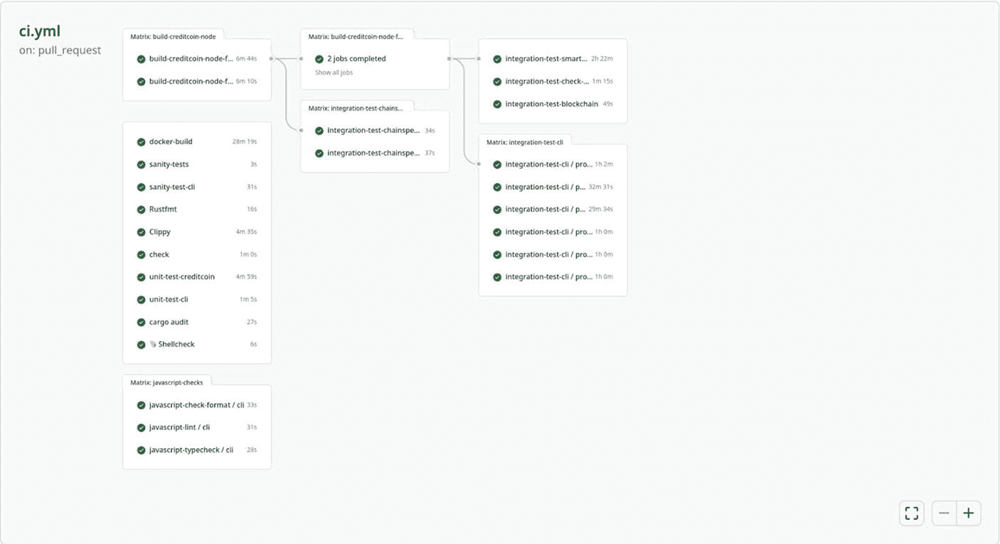

## 单元测试

Creditcoin 3.0 的 `Rust` 代码库中单元测试数量很少，主要来自 `evm-tracing` 包。其余测试围绕以太坊账户 ID 推导以及检查基础外部权重是否与 EVM 兼容。预编译与外部函数类似，它们也有自己的单元测试。

`gluwa/creditcoin3` 仓库中的实际源代码（不包括 `evm-tracing` 包和 `precompiles/` 目录）主要是运行时管道代码。在单元测试层面可测试的内容不多——没有自定义 `RPC` 或自定义指标，也没有 `pallet`，更没有像 Creditcoin 2 中那样的自定义外部函数。

## EVM 和智能合约测试

我们使用了一个由不同团队编写的智能合约测试套件。该测试套件被打包为 `@gluwa/evm-network-test` NPM 包，并提供几个可执行命令作为其入口点。在撰写本书时，存在 `basicTest` 和 `gasTest` 两个命令，它们都需要一个 Creditcoin `RPC` `URL` 和一个私钥作为参数。

这些命令可以这样执行：

```
./node_modules/.bin/basicTest --rpc <RPC_URL> --private_key <PRIVATE_KEY>
```

请注意，这里的地址和私钥是 EVM 格式，以 `0x` 开头，而非 `Substrate` 格式。如果需要在以开发者模式运行的独立区块链上执行，可以使用预充值的开发账户及其地址和私钥，这些信息在 `https://docs.moonbeam.network/builders/get-started/networks/moonbeam-dev/#pre-funded-development-accounts` 有更详细的描述。

这个 EVM 测试套件通过 `Hardhat Runner` 执行——这是一个流行的任务运行器，是名为 Hardhat 的、基于以太坊的智能合约开发的极流行开发环境的一部分。包含测试场景的实际文件是用 `JavaScript` 编写的，使用了流行的 `chai` 断言库，该库是 Hardhat 生态系统中的默认选择。

`basicTest` 编译并部署一个代表加密代币的智能合约，然后对其执行各种交易，并断言期望的状态。其重点是确保一个代表 `ERC20` 加密代币的合约能够部署到 Creditcoin 上，代币可以在不同钱包之间转移，并且通常用户可以与被部署的合约进行交互。`gasTest` 工具将 `gas` 结果收集到一个 `CSV` 文件中。尽管有这个名字，但这个文件中没有断言。

此测试套件的源代码仓库无法通过 GitHub 获取，但以开源 MIT 许可证发布的 NPM 包可从 `https://www.npmjs.com/package/@gluwa/evm-network-test` 获取，安装后即可查看实际代码。只需 `cd` 进入 `node_modules/@gluwa/evm-network-test/` 目录，然后查看即可。

从区块链的角度来看，此测试套件中的工具会针对我们运行区块链相关集成测试的每个环境执行，例如本地环境、`Devnet`、`Testnet` 等。你可以将其视为主仓库中可用的集成测试套件的另一个分支。

## 测试 EVM 追踪功能

`RPC` 方法 `debug_traceTransaction` 和 `debug_traceBlockByHash` 是 EVM 追踪的入口点，它们通过一个集成测试来验证，该测试部署一个智能合约，进行几笔交易，然后使用相应的交易哈希调用这些 `RPC` 方法，并断言响应。这两个 `RPC` 方法旨在供第三方提供商使用，因此被认为很重要，如果此测试失败，将成为一个主要的阻碍因素。这不是一个独立的测试套件，而只是现有的一些测试场景。

## 区块链的集成测试

这是与区块链本身相关的所有所谓集成测试的父级。它使用 `TypeScript` 编写，并使用 `Jest` 测试框架。它在 `gluwa/creditcoin3` 仓库下的源代码位置是 `cli/src/test/blockchain-tests`。

**注意**：为了更轻松/更简单地重用共享代码和辅助函数，区块链集成测试套件与 Creditcoin 3 `CLI` 组件的单元/集成测试套件捆绑在一起。这节省了试图弄清楚所有内容位置的一些精力，并使代码库更简单。另一种选择是将其移到一个单独的目录中并分别管理依赖关系，这被认为是额外的工作而没有额外的好处。

与 Creditcoin 2 类似，此测试套件通过 `Jest` 配置文件进行控制，并且可以针对不同环境执行，包括针对生产环境。在撰写本文时，它包括了前面提到的 `evm-tracing` 测试、对其执行时所运行的链的一些运行时值进行查询和断言，并从外部测试可用的预编译 `substrate_transfer`。

另一个重要的提及点是，在不同环境的配置方面，Creditcoin 3 更加多样化。主要区别在于区块时间和质押纪元时长，这些对于本地环境、`Devnet` 和 `Testnet` 是不同的。

## 预编译测试

这一点已经提到过，但值得单独一节来阐述，因为这方面内容更多。显然，有覆盖正向和逆向路径场景的单元测试和集成测试。还有一些其他内容，称为合约元数据。

这些元数据存储在 `JSON` 文件中，Blockscout 浏览器应用程序通过其 `URL` 读取这些 `JSON` 文件。这是必要的，以便 Blockscout 在分析与该合约相关的内部交易时知道要显示哪些额外信息。

这些元数据包含预编译的名称、地址、其字节码以及一行版本的 `Solidity` 源代码。它被视为来自 Blockscout 应用程序的外部 `API` 接口。

在测试方面，我主要使用自定义的静态分析脚本来断言诸如以下事项：

-   文件名不会改变，因为改变会导致 `404` 错误并破坏消费者应用程序。
-   元数据中包含的字节码和源代码实际上与 `Solidity` 接口定义相匹配。
-   地址在单独的 `JSON` 字段中定义，因此它们需要匹配。
-   我们已经知道如何自动更新仓库中的源代码，以便在底层源代码发生变化时重新生成元数据，并使用 `gluwa-bot` 提交到 `git`。
-   这里的命名约定是按分支即按环境（例如，`Devnet`、`Testnet`、`Mainnet`）进行，因此需要确保根据我们发布到的分支存在预期的文件，并根据现有的发布流程推进前面提到的自动源代码更新。
-   现有的集成测试使用 `ethers.js` 库，该库在实例化一个与区块链交互的对象之前需要合约十六进制地址和合约 `ABI`（应用程序二进制接口），以另一个 `JSON` 文件的形式提供。显然，这两条信息是硬编码的，但我们需要确保它们始终与原始源代码匹配，并且不会随着时间的推移而偏离，也就是说，不要测试与你正在构建的代码不完全相同的代码！

在我撰写本文时，我仍不清楚的一个问题是，如果向区块链添加更多预编译合约，我们需要做什么。我们是将其所有元数据合并到同一个 `JSON` 文件中，还是开始为每个合约单独建立文件？这个问题的答案将影响检查的执行方式。

## 测试 Creditcoin 3 `CLI` 和代理功能

对于 Creditcoin 3 `CLI`，预期包含以下测试组合：针对各种辅助函数的单元测试（无需运行链），以及集成测试（执行单个命令和验证者流程，并断言其成功执行、预期错误处理及链上状态）。与 Creditcoin 2 `CLI` 的测试套件相比，现有的测试套件更为详细。我有意添加了针对命令行应用所支持的每一个命令的测试，既涵盖正面和负面场景，也包含若干端到端测试场景。

由于每个测试场景都是独立执行，我放弃了尝试收集和合并代码覆盖率指标。相反，我分析了每个命令的测试覆盖率，并补充了缺失的部分。这并没有听起来那么糟糕，因为可用命令集在最初引入后几乎保持不变——我认为，在这种情况下，手动进行测试覆盖率分析是可以接受的。这次我选择了一种低技术含量的解决方案，而不是寻求自动化。

Creditcoin 3 `CLI` 测试套件的一个显著区别是，将代理功能作为测试套件的一部分进行测试。我们必须考虑以下属性：

-   是否使用代理账户？是或否。
-   提供的代理账户密钥是否有效？有效；无效；有效，但账户没有资金；有效，但代理已配置给其他账户。
-   代理类型是什么？有三种可能的值。

在实现上，使用代理账户会导致一些重要的差异：

1.  任何密钥处理代码都必须请求代理账户密钥，而不是存储账户密钥。
2.  向区块链签名并提交交易必须通过代理账户进行。
3.  检查可用余额分为两步：
    -   代理账户必须有足够的资金来支付费用。
    -   任何额外的金额必须与存储账户余额进行核对——例如，当你想质押更多资金时，你的主账户（而非代理账户）必须拥有指定的可用余额。
4.  显示余额和状态、查询操作，即使通过代理账户查询链，也必须始终使用主账户地址。

我们对提供的密钥无效的情况不感兴趣，因为这会导致无法初始化任何密钥环，无论是否使用代理账户。这种情况会在到达链之前提前失败，并且不会被显式测试。其他一些组合也无效，因此我们剩下以下测试组合，这些组合在 `CI` 配置中表示为环境变量：

1.  `proxy=no`
2.  `proxy=yes / no-funds`
3.  `proxy=yes / not-a-proxy`
4.  `proxy=yes / valid-proxy / type=Staking`
5.  `proxy=yes / valid-proxy / type=NonTransfer`
6.  `proxy=yes / valid-proxy / type=All`

对于场景 2 和 3，重点是断言预期的错误处理。命令行应用不应崩溃，也不应允许交易通过。相反，它应该打印一条易于理解的错误消息，解释出了什么问题。即使在测试网公告发布后，我仍在处理这个问题，因为我们第一次尝试时并未完全正确。

测试套件使用通用的 `setup`/`teardown` 函数来相应地操作测试账户、其资金和/或其密钥。该测试套件中的大多数测试场景都使用条件执行，利用名为 `testIf` 和 `describeIf` 的自定义函数，参见代码清单 7-2。这些函数建立在 Jest 测试框架现有的 `test()` 和 `describe()` 函数之上，并且仅当给定表达式评估为 `true` 时才执行实际测试场景，因为并非每个测试场景都适用于所有可能的环境组合，例如：

```javascript
testIf(
    process.env.PROXY_ENABLED === 'yes' && process.env.PROXY_SECRET_VARIANT === 'no-funds',
    '应该报错并显示账户余额过低的提示',
    () => {
        try {
            CLI('bond --amount 111');
        } catch (error: any) {
            expect(error.exitCode).toEqual(1);
            expect(error.stderr).toContain(
                '无效交易: 无法支付某些费用，例如账户余额过低',
            );
        }
    },
);
```

*代码清单 7-2* `testIf()` 函数的使用示例

某些 CLI 命令不支持代理功能，要么是明确选择不支持，要么是因为它们根本不需要用户进行身份验证。对于此类命令，条件测试执行将评估环境，并在需要时跳过测试，而不是复制不会带来任何新信息的额外执行。这些命令主要在 `proxy=no` 时进行测试。

请注意，这六种变体都是并行执行的，并且由于它们有选择地跳过某些测试场景，因此在打开拉取请求时，总体反馈时间开销并不大。最长的变体是 `proxy=no`，其次是所有包含有效代理配置的组合。其中，最长的测试场景实际上是 `validatorCycle.test.ts`，它依次执行每个单独的命令，等待并断言结果，分发奖励，然后停止作为验证者，解除所有资金的绑定，等待它们变得可用，然后提取资金。

为整个测试套件集体添加的另一个可变维度是为所有 CLI 命令参数化目标 URL。有两个节点，分别称为 Alice 和 Bob，我们与哪个节点通信由 `--url ws://127.0.0.1:<port>` 指定。在大多数测试场景中，我们利用代理处理代码，它会方便地将 `--url` 参数插入到最终的命令行中。

所有现有的 CLI 命令都已涵盖在测试中，并且为每个命令添加更多测试场景导致测试套件增长到实际上开始失败的程度，因为测试自动化代码本身存在问题。简而言之，原本应该相互独立的场景实际上共享了一个状态，这导致副作用在其他测试场景之间显现。具体来说，实际的集成测试如图 7-3 所示。

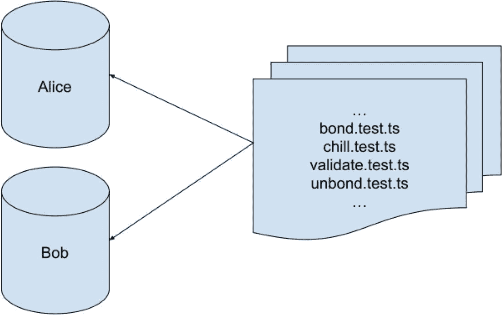

*图 7-3 所有测试使用一个共享的区块链*

虽然各个 `*.test.ts` 文件仍然是按顺序独立执行的，但在实际实现中，每个测试场景会在区块链上创建一个随机账户，然后使用该账户扮演活跃验证者的角色，并以该角色测试不同的命令。共享状态（例如，谁是活跃验证者，以及哪个账户控制 Alice 和 Bob 节点）记录在链上，有时会发生这样的情况：区块链的活跃验证者集合配置了某些账户，而实际上下一个命令正在使用不同的账户执行。

例如，`validate.test.ts` 使用账户 XXXXXX 成为 Bob 节点的验证者，但之后没有正确清理。下一步，另一个测试场景生成账户 YYYYYY，并也试图成为控制 Bob 节点的验证者！从某种意义上说，这是在未正确清理的情况下劫持正在运行的 Creditcoin 节点。这是可能的，因为为节点配置会话密钥（例如，轮换密钥）是一项无需许可的操作，只要你能访问正在运行的进程（例如，RPC 端口），就可以做到这一点。

这会导致链上算法在最终确定区块前等待特定签名，但由于验证人账户已不存在，这些签名永远不会到达。这破坏了最终确定性，进而影响所有客户端交易。更准确地说，交易仍能进入新区块，但我们的工具（包括测试自动化套件）设计为等待区块最终确定后才报告错误。由于最终确定性无法达成，所有操作变得极其缓慢，直到命令和测试任务最终超时。

这个问题的解决方案其实非常简单——确保测试场景不共享状态，即在执行每组测试场景前启动新的独立链，如图 7-4 所示。

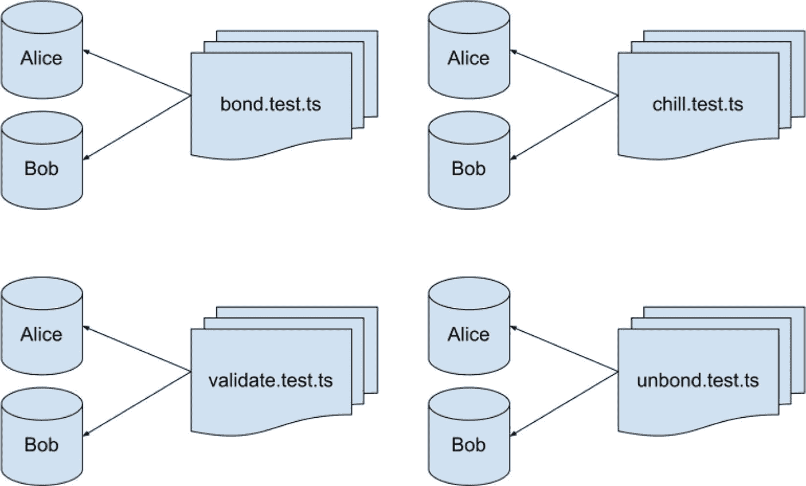

**图 7-4** 每个测试使用专用区块链实例

实现单个测试之间分离的具体方法是在 Jest 测试运行器配置中为 `setupFilesAfterEnv` 键提供自定义值，并配合全局的 `beforeAll`/`afterAll` 配对来设置和拆除各个链。这一方案效果完美，且对整个测试套件的总执行时间增加的开销微乎其微。

```typescript
// integration-tests.config.ts
import type { Config } from '@jest/types';
const config: Config.InitialOptions = {
  preset: 'ts-jest',
  testEnvironment: 'node',
  setupFilesAfterEnv: ['./integrationTestSetupAfterEnv.ts'],
};
export default config;
```

```typescript
// integrationTestSetupAfterEnv.ts
global.beforeAll(async () => {
  await startAliceAndBob();
}, 10_000);
global.afterAll(() => {
  killCreditcoinNodes();
});
```

为了在执行任何命令并断言其副作用之前确保被测目标状态正常，采用了同样的方法。代码清单 7-3 展示了全局 `beforeEach()` 函数，这还带来了提前失败的额外好处。

```javascript
global.beforeEach(async () => {
    const [last, finalized] = await Promise.all([
        api.rpc.chain.getBlock(),
        api.rpc.chain.getBlock(await api.rpc.chain.getFinalizedHead()),
    ]);
    const lastBlockNumber = last.block.header.number.toNumber();
    const lastFinalizedNumber = finalized.block.header.number.toNumber();
    expect(lastBlockNumber - lastFinalizedNumber).toBeLessThanOrEqual(5);
});
```

**代码清单 7-3** 全局 `beforeEach()` 设置函数的实现

`startAliceAndBob` 函数会生成两个后台进程，并将标准输出和标准错误捕获到文本文件中，这些文件稍后会作为 CI 产物上传，方便调试失败时使用。在实现 `global.beforeEach` 钩子时，这一功能非常实用。为简洁起见，代码清单中未显示的 `api` 变量在同一函数内创建，并始终连接到 Alice 节点。原因在于这段代码在所有真实测试场景之前执行，我们无法访问这些测试场景中的上下文变量。在运行了大约八个测试文件后，CI 环境中的测试开始随机失败，但本地环境却没有。最终发现原因是网络问题，新的连接无法建立。具体情况如代码清单 7-4 所示。

```
PASS src/test/integration-tests/validate.test.ts (285.371 s)
  validate
    ✓ should error when current bond < MinValidatorBond (105372 ms)
    when NOT bonded
      ✓ should error with staking.NotController message (62097 ms)
    when ALREADY bonded
      ✓ should become a waiting validator (94698 ms)
      ○ skipped should error with account balance too low message
      ○ skipped should error with proxy.NotProxy message
PASS src/test/integration-tests/unbond.test.ts (155.562 s)
  unbond
    when NOT bonded
      ✓ should error with validator not bonded message (46586 ms)
    when ALREADY bonded
      ✓ should be able to unbond (100319 ms)
      ○ skipped should error with account balance too low message
      ○ skipped should error with proxy.NotProxy message
FAIL src/test/integration-tests/evm.test.ts (254.119 s)
  EVM Commands
    EVM Fund
      ✓ should be able to fund an EVM account (31576 ms)
      ✓ should not be able to fund more than existing funds (15386 ms)
    EVM Withdraw
      ✓ should be able to withdraw CTC to a Substrate account via --url ws://127.0.0.1:9944 (44660 ms)
      ✓ should be able to withdraw CTC to a Substrate account via --url ws://127.0.0.1:9955 (44010 ms)
    EVM Balance
      ✕ should be able to show evm balance correctly when balance is zero (100112 ms)
      ✕ should be able to show balance correctly after funding (10001 ms)
    ● EVM Commands › EVM Balance › should be able to show evm balance correctly when balance is zero
      thrown: "Exceeded timeout of 100000 ms for a hook.
      Add a timeout value to this test to increase the timeout, if this is a long-running test. See https://jestjs.io/docs/api#testname-fn-timeout".
```

**代码清单 7-4** 集成测试套件的失败输出

实际的错误是我的辅助函数没有调用 `api.disconnect()`。我是如何调试的呢？

1.  所有测试文件按顺序执行，所以我统计了第一个失败的测试文件序号。我关注的是序号本身而非实际测试文件，且该序号在不同 CI 执行之间非常稳定。

2.  然后从 CI 产物中下载所有日志文件——其文件名包含 Alice 或 Bob 模式以及时间戳，参见代码清单 7-5。

3.  找到与失败执行序号（我推断是第 8 次）对应的 Alice 和 Bob 日志文件，开始分析。由于每个测试现在使用独立的区块链，这些文件并不大。

4.  我从上到下阅读日志文件。区块生产方面一切正常，直到突然看到代码清单 7-6 中的错误信息：

```
creditcoin3-node-Alice-2024-04-03T10-01-55.594Z-log.stderr
creditcoin3-node-Alice-2024-04-03T10-07-22.470Z-log.stderr
creditcoin3-node-Alice-2024-04-03T10-12-03.658Z-log.stderr
creditcoin3-node-Alice-2024-04-03T10-16-49.086Z-log.stderr
```

**代码清单 7-5** 多个并行测试任务的日志文件名

```
2024-04-03 10:22:06 Too many connections. Please try again later.
```

**代码清单 7-6** `creditcoin3-node` 日志中显示的错误信息

我怀疑本地操作系统回收 TCP 连接的速度比 GitHub Actions 使用的容器化运行器快得多，和/或他们的环境在可用 TCP 端口数量上更受限制。一旦我添加了 `.disconnect()` 调用，一切就正常了！

## 运行时升级测试

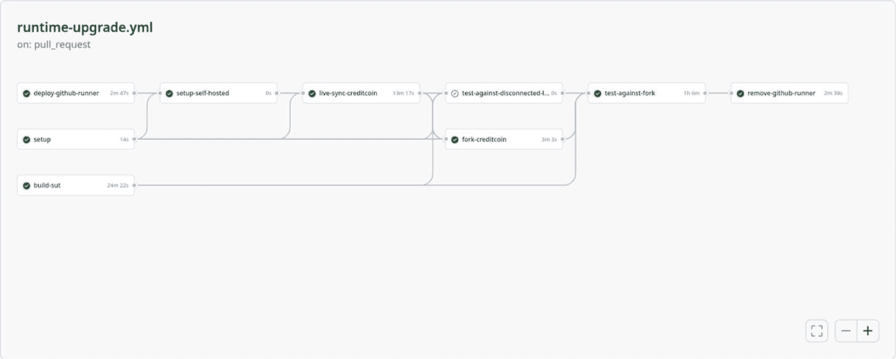

**图 7-5** 运行时升级 CI 流水线

与 Creditcoin 2 不同，Creditcoin 3 没有自定义存储迁移，因为没有自定义 pallet。这消除了前述围绕迁移测试和断言所需的所有基础设施。因此不再需要 `try-runtime`，不再需要在迁移前后对存储中的项目进行断言，也不需要在迁移失败时使用特殊宏来使节点崩溃！

尽管如此，仍然需要执行运行时升级并检查链是否继续正常运行。这在某种程度上也涵盖了可能存在的任何系统迁移。此流程与 Creditcoin 2 非常相似，如图 7-5 所示——同步到活跃链、分叉、升级和测试（区块链+智能合约测试）。

## 测试 Creditcoin 质押面板

此前关于 `质押面板` 以及上游仓库缺乏全面测试套件的情况依然存在。因此，该组件在很大程度上依赖人工测试，这需要连接到一条正在运行的链。

我经常使用我们的 `快速运行时` 编译标志运行本地 Creditcoin 节点，以缩短质押周期，然后检出一个拉取请求，执行 `yarn dev` 来审查和测试为 `质押面板` 提出的新更改。在底层，该组件是一个静态的 JavaScript 单页应用程序。为了方便我和他人审查拉取请求，我在构建过程中加入了将静态文件复制到云存储的步骤，然后在拉取请求中发布评论（图 7-6）。

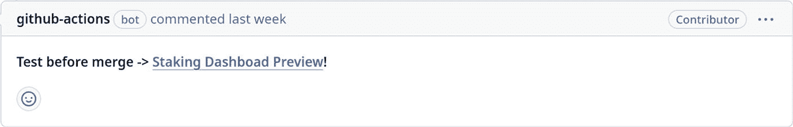

**图 7-6** 作为 GitHub 评论的临时预览

点击 *“质押面板预览”* 链接将打开一个 URL，该 URL 对于每个拉取请求都是唯一的，并托管从该拉取请求的最新提交构建的应用程序。我称之为 *临时部署* 或 *预览构建*，但这里并没有太多的实际部署——它只是 HTML 和 JavaScript。

这还会以开发模式构建被测应用程序，以便菜单中显示连接 *“CreditcoinLocal”*。这使得测试人员在使用 Creditcoin 质押面板的同时，可以轻松连接到运行在 `ws://127.0.0.1:9944` 的本地区块链。或者，如果某个错误只在 Devnet 或 Testnet 等特定环境中可重现，你也可以连接到这些环境。

一个非常小的技术贡献，参见 [`https://github.com/gluwa/creditcoin3-staking-dashboard/pull/34`](https://github.com/gluwa/creditcoin3-staking-dashboard/pull/34)，它实际上极大地提高了生产力，所以我今后一定会继续这样做。

可以预见，上游的 `polkadot-staking-dashboard` 代码库也包含影响下游分叉的问题和错误，例如，[`https://github.com/paritytech/polkadot-staking-dashboard/issues/2031`](https://github.com/paritytech/polkadot-staking-dashboard/issues/2031)。我本人发现的另一个问题是，一旦设置了提名池佣金的当前配置，便无法显示。下次打开相应的模态窗口部件时，会显示一个空白屏幕，就好像什么都没配置过一样。在翻阅 Substrate 源代码的相关部分后，在我看来，这个功能领域的功能并不完整，并且有一些提交表明，未来版本将实现一个关于谁能配置提名池佣金的访问控制模型。如果真是这样，那就能解释为什么 `质押面板` 中的这个部件看起来有些粗糙了。

虽然我们可以向上游报告此类问题，在下游修补它们，甚至向上游贡献这些补丁，但我们应该认识到，无法保证维护者会接受这些。虽然他们慷慨地将其代码库作为开源提供，但重要的是要认识到 Polkadot 正在构建一个 Web3 平台，并且实际上是一个直接竞争对手。他们不一定是软件供应商或传统的开源项目，对代码库的更改如果符合他们自身的长期愿景和目标，才最有可能被接受。正如本书其他部分多次展示的那样，这会影响像 Creditcoin 这样的下游消费者。

事实上，在本书写作期间，上游出现了一些破坏性变更，Polkadot 生态系统中一个重要的、与`质押面板`类似的 UI 应用程序，其某个页面已被更新，以至于只适用于更新、更兼容的链。这个页面就是质押页面。Polkadex 立即报告了这个问题，从附带的截图中看，他们似乎将 Polkadot JS Apps 用作其用户界面的一部分；参见 [`https://github.com/polkadot-js/apps/issues/10505`](https://github.com/polkadot-js/apps/issues/10505)。在撰写本文时，这个上游问题正在寻求指导，了解预期的前进方向是什么，以及是否会提供某种向后兼容性。就目前而言，在撰写本节内容期间，这一上游更改可能会影响 Creditcoin 的多个下游组件。其他依赖同一上游代码库的区块链也是如此！

此更改不仅影响生产部署，还影响测试——Polkadot JS Apps UI 是探索和监控区块链的便捷方式，尤其是在执行测试活动时监控本地区块链。如果此应用中的某个页面（尤其是与所有质押活动相关的页面）实际上消失，将导致无法观察与此领域相关的任何内容，从而使下游测试更加困难。幸运的是，此应用的非开发实例（实际上是较旧版本）在连接到不兼容的链（即较旧的链）时仍会显示质押页面，这在测试目的下是一个可行的变通方法，直到该旧版本从互联网上移除为止。托管于 [`https://ipfs.io/ipfs/Qmd5YFzh6CqnJJJyQ9FWYff9SDSP2mmj8oTqgBaQz8uWwV/#/staking`](https://ipfs.io/ipfs/Qmd5YFzh6CqnJJJyQ9FWYff9SDSP2mmj8oTqgBaQz8uWwV/?rpc=wss://rpc.cc3-devnet.creditcoin.network/ws#/staking)。

请注意，此 URL 代表一个较旧的生产版本，此后可能已过期。

还记得 Subscan API 服务吗？虽然迁移到 SaaS 服务会将此组件在质量和测试方面的所有顾虑转移给供应商，但它也会引入一个略微不理想的副作用——你无法测试`质押面板`应用程序的某些功能，因为它们依赖于使用并非所有环境都可用的 SaaS API。在`localhost`上运行开发区块链时当然不可用。例如，关于提名池成员的数据来自 Subscan API 服务。由于该服务对`127.0.0.1`不可用，Creditcoin 质押面板在相应的 UI 部件中显示为零成员和一个空列表！

虽然你可以使用连接到其他区块链环境（例如 Devnet、Testnet，甚至 Mainnet，它们都有相应的 Subscan API SaaS 端点）的任意`质押面板`部署进行测试，但你根本无法针对`CreditcoinLocal`进行测试，即使已连接上它！根据某些功能的技术细节，这要么只是一个麻烦，要么会升级为一个更大的测试障碍。在使用第三方服务时需要牢记这一点！

### 测试 Gluwa 的 Polkadot-sdk 分支

与其他上游分支一样，我遵循“启用所有已有的 CI 作业和测试，并尽可能增加更多”的原则。对于`polkadot-sdk`来说，这并不多——只有一些文档检查、linter 和`rustfmt`。与较早的 Substrate 上游仓库类似，该仓库的大部分上游测试作业都位于私有 GitLab CI 实例中，下游很难完全复现。定义文件虽然仍在 git 仓库中，但它严重依赖私有 Docker 镜像和资源。

同样，最低要求是启用分支保护规则、lint、构建和执行现有的单元测试。CI 配置使用按需部署的自托管 GitHub Runner，执行时间在 5 到 6 小时之间。这是一个巨大的测试套件！事实上，这个仓库非常大，在我的笔记本电脑上甚至无法编译源代码。在真正崩溃之前，它大约需要运行几个小时，因为我内存不足！32G 内存应该对每个人来说都足够了吧？！？

### 测试 Gluwa 的 Frontier 分支

这个分支在下游仓库中已有的上游测试和 CI 配置方面要好得多。只需在分支上启用 GitHub Actions 并配置分支保护规则即可。它足够小，不需要自托管的 GitHub Runner。

### 测试 Gluwa 的 Crunch 分支

这大概是我最近见过的最糟糕的上游和下游都缺乏测试的例子。或者也许只是因为我希望所有东西都有测试而有失偏颇。

上游只包含针对发布的管道配置，并且仅在 git 标签上触发。它们会通过`cargo test`执行可用的单元测试套件，然后构建并上传二进制文件。在撰写本文时，上游仓库`turboflakes/crunch`只有不到 10 个单元测试，完全没有 lint 配置，并且无法使用旧版本的`rustc`构建。

下游的情况也好不到哪里去，现有的与配置相关的测试场景在提交`f29129d12f9ba6c03d67b450b39f1eba3782bc6d`时实际上已经失败了。

请注意，在撰写本文时，我尚未参与 crunch 组件，并且其 CI 作业、工具和分支保护规则的配置还有待未来完成。有时我确实觉得，我花在应对上游带来的次优测试和代码质量上的时间，比真正测试我们构建产品的行为还要多。

### 文档审查与第三方工具测试

可以想象，Creditcoin v3 的文档最初是 Creditcoin 2.3 现有文档的分支，然后增加了关于 EVM 兼容层的信息和部署智能合约的指南。初始内容由开发团队创建，并由 QA 进行校对。文档的某些页面包含命令行或源代码示例，特别是智能合约指南部分。这自然引出一个问题：我们如何确保这些示例始终是最新的？我甚至想更进一步问：`我们如何测试第三方可视化工具`，例如，通过 Remix（一个流行的以太坊 IDE）或通过命令行工具 Hardhat 部署智能合约？

请记住，Creditcoin 2.0 上类似的最初编程示例用例促成了`creditcoin-js`库的诞生。随后，这个库有了自己的生命力。

从功能角度来看，检查第三方工具的代码示例、文档和说明可能看起来并不重要——毕竟这不是你的源代码。但是，当你的核心功能变成支持智能合约的能力时，你的主要客户就变成了区块链开发者或准开发者，那么至少确保你宣传的工具能够可接受地工作就变得至关重要。我们可以将其视为互操作性测试的一部分，并注意潜在已知问题，这些问题虽然不完全是你的责任，但可能会对用户体验产生负面影响。

在撰写本文时，我开始练习使用这些第三方工具，并发现以 Hardhat 为例，该工具发展迅速，以至于 Creditcoin 文档中提供的一些命令和示例已经被视为过时。安装最新版本的 Hardhat 并逐字遵循文档根本无法工作。这就是为什么所有这些示例都被移到了 git 下，并通过 CI 作业执行命令。文档也已更新，通过 URL 指向示例内容，以便读者可以复制最新版本。

文档 URL：[`https://docs.creditcoin.org/`](https://docs.creditcoin.org/)（与 Creditcoin 2.0+ 文档不同）

### 其他有趣的测试

**提示**

如果你采用激进的升级策略，你所使用的任何第三方工具和依赖项——即使它们只是你开发、测试和/或发布管道的一部分——也可能会失败。

就 Creditcoin 和 Rust 编程语言而言，一些工具和包需要更新的编译器版本，例如 [`https://github.com/gluwa/creditcoin3/pull/159`](https://github.com/gluwa/creditcoin3/pull/159)。当你了解这一点并且可以等待所有相关部分升级时，这没问题。但当你拥有额外的依赖项，这些依赖项并非直接在`Cargo.toml`（Rust 包管理器文件）中指定，而是使用固定版本直接安装到 CI 作业中时，这就成了一个问题。更糟糕的是，失败的 CI 作业是条件性执行的，当然不是在更新编译器版本的拉取请求的一部分！更更糟糕的是，在 Rust 包仓库`crates.io`上，导致失败的`subwasm`包已经三年没有更新了；新版本仅以 git 标签形式存在，无法受益于自动化的 Dependabot 升级。

总而言之，这是一个关于测试的教训——你需要测试你所使用的一切。如果它没有作为现有 CI 作业/测试套件的一部分包含在内，那么你需要确保它被显式地执行！否则，它只会在你最意想不到的时候失败；参见 [`https://github.com/gluwa/creditcoin3/pull/332`](https://github.com/gluwa/creditcoin3/pull/332)。在撰写本文时，我不得不从`v0.17.1`升级到`v0.19.0`以避免编译器错误。即使这个版本也不是完全没问题。它会产生一个编译器警告：

```
warning: ambiguous glob re-exports
--> lib/src/lib.rs:19:9
|
19 | pub use chain_info::*;
|     ^^^^^^^^^^^^^ the name `Error` in the type namespace is first re-exported here
...
24 | pub use types::*;
|     -------- but the name `Error` in the type namespace is also re-exported here
|
= note: `#[warn(ambiguous_glob_reexports)]` on by default
warning: `subwasmlib` (lib) generated 1 warning
Compiling subwasm v0.19.0
```

#### 挑战：如何分析并追踪链上设置的变更

修改各种链上（可能还包括运行时）的配置设置，会带来一个有趣的挑战。回顾一下，许多区块链参数硬编码在`runtime/`目录下的源代码中，但还有更多参数是可以在后续进行修改的。例如，通过 Polkadot JS Apps 网页界面，可以非常轻松地发送一条`nominationPools.setConfig`交易来修改现有配置——比如，更改创建提名池所需的最低保证金数额。这带来了两个主要挑战：

1.  如何追踪此类变更？换句话说，如果我打算清除现有环境，并用最新的 Creditcoin 版本重新部署，如何确保其运行参数与之前保持一致？

2.  如何分析此类变更，以弄清修改链上某个值可能带来的风险？在 [`https://github.com/paritytech/polkadot-sdk/issues/3739`](https://github.com/paritytech/polkadot-sdk/issues/3739) 中，polkadot-sdk 的上游维护者建议区块链开发者在修改现有链上的值时务必谨慎，以免搬起石头砸自己的脚。原因在于，上游现有的测试和检查也并非完美无缺，它们可能遗漏了某些会产生负面影响的场景。

第一个挑战相对容易解决。Substrate 已经包含了存储迁移子组件，并且我也概述了与迁移相关的若干测试活动。虽然仅仅为了更改一个值就启用整套迁移机制和相关的测试基础设施有些小题大做（例如，参见 [`https://github.com/gluwa/creditcoin3/pull/120`](https://github.com/gluwa/creditcoin3/pull/120)），但我相信，这是解决这两个挑战的重要第一步。

将所有链上存储变更作为迁移的一部分来管理，有几个好处：

*   所有内容都在 git 中，因此保留了历史记录和可追溯性。
*   任何从未来代码版本启动的新环境都会自动按需进行配置。
*   可以针对模拟数据和生产数据进行测试，以发现边界情况。
*   假设你知道如何解决挑战 #2，那么你就可以利用迁移机制，在源代码中实现前置条件，当迁移即将出错时（例如，在发布前针对生产环境进行测试时），这些前置条件会向你发出警报。

接下来是更大的挑战——如何分析一个提议的变更，从而确信不会出问题，或者不会导致无法预见的副作用？例如，我们已经知道修改出块时间是不可行的，并且代码中也设置了断言，以便在变更通过整个发布流水线之前捕获这种情况。那么，其他看起来无害的设置呢？

在撰写本书时，我一直在思考如何解决这个挑战，但尚未找到完整的答案。因为 Creditcoin 的整体架构包含多个层级和应用，我认为任何分析都必须涵盖所有这些部分。我也坚信，面对未知的技术，我们首先应该努力理解其核心运作原理，然后再尝试寻找边界情况和潜在风险。没有深入的理解，我们只是在猜测，而这在我看来是远远不够的。整个过程可能大致如下：

*   在所有应用程序或库中，找到某个特定存储项/设置值被使用的所有位置。
*   创建一个列表，列出该值被使用到的不同功能领域，例如 [`https://github.com/gluwa/creditcoin3/pull/283#issuecomment-2015201729`](https://github.com/gluwa/creditcoin3/pull/283#issuecomment-2015201729)，因为影响可能不是立竿见影的，或者因为其他开发者可能决定在非预期的地方添加额外的检查。
*   尝试理解列表中所有领域的功能及其工作方式。
*   追踪条件表达式，例如`if`语句和宏，特别是那些对你正在分析的值进行断言的条件表达式，尤其留意何时会产生错误和恐慌（panic）。这是一个明确的信号，表明在特定条件下会出现问题。
*   对于表示最小值、最大值等的数值——检查你当前的链上数据，看是否存在异常值。例如，如果我即将重新配置一个与最低限额相关的设置，链上是否已有参与者质押的数额低于提议的新值？这是一种对现有数据进行的边界值分析。
*   这些“特定条件”就成为了你应用迁移并将设置更新到所需新值的先决条件。这也是对此领域进行更深入测试的起点。

以上列表只是一个粗略的提纲。需要强调的是，它必须被编撰成一个更正式的流程，供工程师和利益相关者遵循，并且流程中应设置多个可以停下来评估利弊、做出决策的节点。另一个重要事项是，这样的流程和评估不能耗时过长，或者至少是可预测的，以便能够及时交付软件变更。而这正是所有软件开发和测试的症结所在——你如何评估未知因素？当你对成千上万依赖的小部件如何协同工作一无所知时，你又如何管理风险？

## 生产环境中的测试资源管理

我之前提到过如何在多种环境中进行测试，并希望尽可能在`生产环境`中执行测试套件，包括针对任何第三方组件的测试套件。那么挑战就变成了：当测试步骤之间存在长时间间隔时，如何进行事后清理（参见图 7-7）？

任何与质押相关的操作，最终都需要执行一笔`unbond`交易，然后等待一段停机时间，之后再提取资金。在某些场景下，可能涉及更多步骤、更多参与者和更长的等待时间。这个周期基于区块时间和周期数（例如，一个验证周期）计算。在本地或 CI 环境中执行所有这些操作时，速度相对较快，并且你能完全控制所有值和环境。但在生产环境中执行同样的操作时，差异是巨大的——一个周期的时间是 24 小时。解绑期是 7 天。某些操作还取决于你在 24 小时内的哪个时间点发起交易，这会导致更长的等待时间。这是一个滚动的时间窗口，效果生效可能需要 12 到 36 小时。

显然，你不能让测试套件运行 7 天，就为了等待它自行清理——这完全是浪费资源。你可以拆分它，并通过`cron`单独执行清理部分——但这又引出了一个问题：如何在测试套件/清理工具之间存储和共享凭证。

这也带来了另一个问题：如何对那些易于自动化但运行时间很长的任务进行断言？例如，成为 Creditcoin 区块链上的验证者是一个相对简单的过程；CLI 中甚至提供了`wizard`命令，它可以为你执行所有步骤。然而，这个命令仅表示一个意图。结果不会立即生效。假设其他一切正常，参与者发出意图后，且相关交易被打包进区块后，成为活跃验证者可能需要 12 到 36 小时。

你如何断言测试套件所做的一切确实产生了预期的结果？你如何确保动态配置的资源（例如，虚拟机或容器）不会在实际需要之前被回收，也不会在之后被闲置？

一种可能性是只进行人工测试，而忽略你花费时间自动化测试套件的事实。另一种可能性是采用分层方法，即所有功能都在隔离环境中进行测试，仅对生产环境进行部分测试。这引出了信心（可信度）的问题。

如图 7-8 所示的第三种可能性，是将传统的*准备-执行-断言-拆除*流程拆分成多个独立的片段，这些片段可以独立执行，例如通过`cron`或某种队列。这些独立的自动化部分需要在它们之间共享数据。在测试区块链的上下文中，最简单的方法可能是在链上直接记录这些数据——无需额外的 SQL 数据库。QA 和利益相关者应该能够查询这些数据以生成状态报告。然而，这并不能解决触发这些自动化脚本的问题——智能合约不能自己发起操作，所以你需要一个外部进程每隔一段时间调用智能合约中的函数。智能合约内部运行时间非常长的函数也面临挑战：它们会因 Gas 耗尽而被回滚，因此你不能在测试开始时调用一个函数，让它休眠几天，然后再让它自行清理。智能合约也无法与链下世界交互，例如通过互联网调用 API 函数。有一些可用的解决方案，比如 ChainAPI（[`https://chainapi.com/`](https://chainapi.com/)），但我还没有尝试过。

我认为，在这里，一个用于编排长时间运行测试场景的实用解决方案大致如下：

- 触发测试的*准备 + 执行*脚本。
- 测试状态数据被记录到共享位置，可能通过智能合约记录在链上。
- 应在未来执行的自动化脚本被记录到队列中，可能附带它们需要执行时的预估区块号。
- 在未来的某个时间点，执行*断言 + 拆除*部分；结果通过智能合约记录回链上。
- 在某些情况下，*拆除*部分本身就是一个包含多个步骤的长期运行任务。例如，解绑资金，然后在一周后提取它们。也遵循已经描述过的流程来处理。

在能够访问区块链并测试同一区块链的背景下，我认为将共享数据记录到链本身是有意义的，这也是“吃自己的狗粮”的另一种方式。但这并非强制要求。你可以使用标准的 SQL 数据库并构建自己的报告，或者更好的是使用像开源 `Kiwi TCMS` 这样的测试管理系统，它已经内置了必要的功能。

**免责声明**

我也是 `Kiwi TCMS` 的项目负责人！

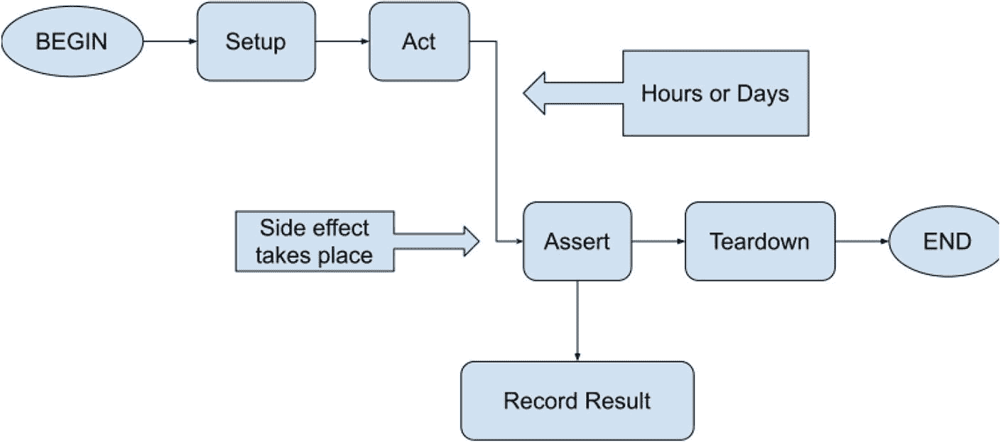

*图 7-7：传统测试序列在区块链长时间运行流程生效前中断的图示*

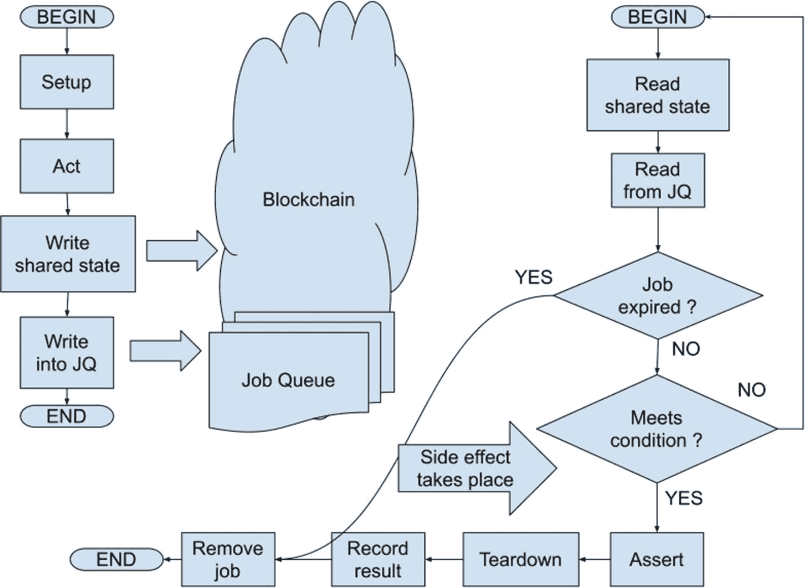

*图 7-8：提议的测试编排器的示意性描述*

### 故障排查指南与 `sos-report` 命令

我遇到的另一个有趣挑战与社区互动有关。由于种种原因，用户最终会遇到麻烦——要么没阅读文档，要么不够留意，要么尝试了从未预料到的操作——用户对此很在行，甚至可能比我们测试人员更擅长。可能的情况是，用户在尝试执行操作时确实遇到了某种技术问题，或者用户的技术水平不足以理解文档，又或者他们只是犯了个错误。当这种情况发生时，他们会通过可用的沟通和支持渠道反映问题并抱怨。

由于区块链中发生的一切都涉及较长的周期，而且你的用户群体不一定具备技术背景，因此最初的问题报告总会缺少重要信息。有时工程团队比较容易猜测出实际问题是什么，并给出解决方案进行反馈；而有时则完全不可能。需要明确的是，当有人想通过 `Creditcoin Staking Dashboard` 成为活跃验证者而非提名者时，这种情况更有可能发生。

为了应对这种情况，我提出了一个两步法：

1.  整理一份常见问题及额外信息请求清单——这是为了确保你能尽可能多地收集用户初始数据，并涵盖已知的常见陷阱和边缘情况。每当用户联系你的支持团队时，他们会被要求提供这些问题的答案。越早这样做越好——例如，如果用户关闭了电脑，第二天早上再重试，链的状态已经改变，因此他们的操作可能会产生略有不同的结果。理想情况下，这份问题清单应在文档中公开，并且用户知晓在联系技术支持时应提供何种信息。

2.  日志、本地结果、计算机运行时间、进程运行时间以及许多其他数据，实际上可以直接从区块链和运行 `creditcoin3-node` 进程的主机上查询。列出开放端口、尝试通过互联网访问知名的 `Creditcoin` URL、测量网络速度等操作也是可行的。我将此命令称为 `sos-report`，类似于我在商业 Linux 发行版中见过的功能。理想情况下，此命令应成为 Docker 容器的一部分，它能收集步骤 1 中的所有必要信息，然后允许用户查看并将其提交给支持团队！

这个提议也是你开始构建知识库并扩展面向公众的支持服务的地方。虽然这不严格属于测试相关活动，但它可以在几个方面有益于整体质量。

-   测试人员可以从实际用户那里学到很多东西——这是被测软件的真实世界使用情况，我们可以利用这些知识在需要的地方改进测试覆盖。
-   如果遇到已知问题，测试人员很可能已经见过或熟悉该问题，因为我们通过无数次测试和运行同一应用程序，积累了关于该应用程序的大量边缘情况知识。我们可以解锁这些知识，并与组织的其他成员分享。

### 集成测试加速

我之前提到过，`Creditcoin 3` 测试套件中最大的部分是 CLI 集成测试套件。它包含最多的单个测试场景，并且执行时间最长。就单个 CI 任务而言，最长任务的执行时间已增长到大约 90 分钟。在撰写本书期间，我致力于一些任务来尝试降低这一时间，当然首先要衡量我们实际进行了多少测试。

在撰写本书时，仅 `gluwa/creditcoin3` 仓库在 `GitHub Actions` 中的工作流运行次数就超过 7000 次。其中，CLI 集成测试任务平均每月大约耗时 1000 小时。

最初的加速针对一些容易实现的目标：

-   减少硬编码的 `sleep` 调用值，并在可能的情况下移除这类调用。
-   重写设置部分，使相关的测试场景共享它们的设置，而不是每个场景都有自己的设置。这对于像 `withdrawUnbonded.test.ts` 这样的长时间运行测试场景特别有用，该场景需要等待 15 分钟以上的正确前置条件才能实际执行任何操作。
-   有条件地跳过其他长时间运行的测试场景，例如特意跳过 `validatorCycle.test.ts`。此场景大约需要 20 分钟，最大超时时间约为 30 分钟，它作为一个端到端测试，其中使用的所有单个命令都已单独隔离测试过。我们不需要在每个拉取请求上都重复此测试，因此我添加了一个条件语句，使得该场景仅在直接提交到 `dev` 分支（例如合并后）时才会执行。它仍然在其他分支的拉取请求上执行，以在新版本发布前提供额外的安全性。

此优化领域中最显著的改变是，从使用 GitHub 托管的运行器切换到使用自托管的运行器。这已经是我在运行时升级测试中使用的方法，所以只需在现有的 CI 流水线中添加一些额外的配置即可。具体来说，使用一个矩阵任务提供自托管运行器，其参数与 `integration-test-cli` 矩阵类似。根据测试矩阵，用相应的标签标记新配置的运行器，然后在 `integration-test-cli` 任务定义中使用相同的标签来选择适当的运行器。这保证了六个独立的运行器，每个运行器将只分配给一个集成测试任务。然后在完成后销毁它们！

这项工作使该矩阵中运行时间最长的测试任务减少了 30 分钟。我的推测是，尽管有很多等待区块链相关操作的时间，但使用这些自托管运行器仍然比使用 GitHub 共享运行器快，因为它们是一种不会被过度订阅的专用资源。I/O 以及很可能 CPU 操作所需的时间会更少，因为底层操作系统会将全部注意力投入到你的测试中，而不是同时处理成百上千的其他进程。我没有确凿的证据证明这就是实际原因，但这说得通，而且经验结果表明，使用这些自托管运行器比使用共享运行器更快！

**注意**

除了在你的托管环境中同时可以配置的虚拟机数量有限制之外，还有另一个更微妙的因素可能会对你的 CI 造成意外限制。这就是你选择的云提供商设置的 API 请求限制速率，这与你需要按需配置资源的频率有关。在使用 `Creditcoin 3` 时，我经常遇到底层配置 API 返回 `429 Too Many Requests` 错误，这足以令人烦恼，并导致我的 CI 设置失败！

这也告诉我，在任何给定时间我能拥有的虚拟机总数，与每小时/每分钟允许的 API 请求次数无关。如果你的测试严重依赖自托管运行器，这一点需要更详细地评估。

在 GitHub Actions 中使用现有语法来完成所有这些并不难；然而，它带来了一个不良副作用——你现在有了一个依赖于另一个矩阵测试任务的矩阵测试任务，见图 7-9。如果某个集成测试任务失败或超时，没有简单的方法重启它。我的意思是，你可以在 GitHub 界面中点击那个失败任务的重新启动按钮，但这会导致不期望的结果。你能做的最多就是一起重启矩阵中的所有任务——而通过当前的 GitHub 界面根本无法做到这一点——你必须重启同一个 YAML 文件中定义的所有任务。

在撰写本书时，这是一个相当近期的问题，但我想我知道解决方案应该是什么。如果在 `deploy-github-runner` 任务之前（即在依赖链的左侧）再多一个 CI 任务，它就可以作为入口点。我们称它为 `integration-test-cli-entrypoint`。如果后续任何任务需要重启，测试人员可以重启 `integration-test-cli-entrypoint` 任务以及其后所有任务。这仍然不是最优方案，但不会触发同一个 YAML 文件中定义的其他所有 CI 任务重启。我绝对要试试这个！

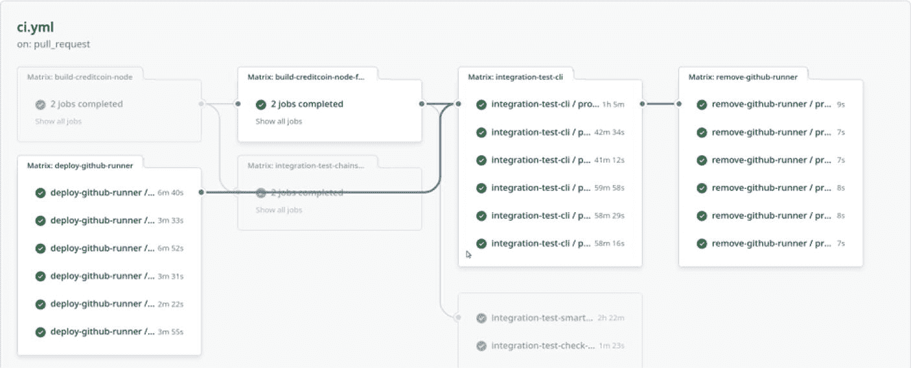

*图 7-9：依赖矩阵任务*

### 总结

正如你现在所见，测试 `Creditcoin 3` 与其 v2 系列的前身非常相似。这是意料之中的，因为底层技术栈和开发实践大致相同。另一方面，也出现了一些新的测试挑战，我想这也是可以预见的。

不幸的是，目前我没有更多测试内容可以分享。在撰写本书时，`Creditcoin 3` 的下一个阶段尚未到来，我也没有参与其中，并且不了解与其实现相关的实际细节。

在下一章中，我将讨论我通常如何进行测试，以及我认为测试工程师的职责是什么。请继续阅读。

# 第四部分 区块链测试方法

## 8. 他人如何测试区块链

我撰写本书的动机是分享我在区块链测试方面的个人经验，希望能对他人有所帮助。在写作过程中，我实际上结识了其他在区块链领域工作的测试人员。当然，他们从事的产品与我的不同，他们的方法也与我不同。

本章概述了 Andrew Snaith 和 Sebastian Viquez 的经验，他们欣然同意与我交流。如您所见，区块链中需要测试的内容比我前面所有章节中涵盖的还要多。

### 我的区块链测试方法

与其他任何类型的测试一样，我从试图理解我们想要做什么以及我所处环境的限制开始：

*   被测区块链的所有组件是什么？
*   每个组件如何工作，其复杂性如何？
*   涉及哪些风险？业务需求是什么？
*   哪些部分可以通过单元测试、集成测试和/或其他类型的测试来覆盖？
*   我如何实际编写这些类型的测试——例如，可用的工具、语法和示例。

这有助于我从业务角度和技术角度建立起对所有动态部分的理解。我倾向于先从技术方面入手，然后逐渐扩展我的理解。只要有可能，我会选择在开发周期早期进行测试，并尽可能实现自动化。这也有助于将复杂系统的行为编码化，这在许多情况下都非常有用。

对 Creditcoin 而言，这意味着我主要专注于测试业务逻辑，并在出现新场景以及随着我们对整个区块链的使用方式和详细运作方式有了更多理解时，覆盖这些附加场景。持续参与拉取请求的代码审查，为缺失的测试或重构需求提出问题并提交工单以确保不被遗忘，从长远来看，这比我自动化过的任何特定测试场景或我发现的任何单个错误对质量的贡献都更大。

这是一种自下而上的方法，也是一种非常有机的方法——从第一天开始测试，并测试你能接触到的每一个微小的产品部分。这也是我个人的偏好，源于我多年来的职业生涯发展——我一直在产品公司工作，总是从事高度技术性的产品，并且总是与开发人员处于同一水平。无论如何，这本身就是基础设施类软件产品的特性。

我不确定我是否有资格为那些与我处境不同的人提供建议。我想“试一试”就是足够好的建议了。

### 与 Andrew Snaith 一起测试跨区块链栈

测试区块链协议和客户端实现只是难题的一个方面，可以说 Gluwa, Inc. 控制着这两者使得测试 Creditcoin 相对容易。我与 ChainSafe 的质量工程主管 Andrew Snaith 讨论了他对区块链测试的看法，并发现了比我之前想象的更多的细微差别。

ChainSafe 是一家多链区块链研发公司，专注于开源软件。他们为外部客户提供开发服务，也开发自己的产品。

在组织方面，公司有多个工程团队，大部分时间在所谓的“流”上工作。一些工程师专注于单个流，而另一些则同时并行处理多个流。同样，有些团队有专门的质量工程师，有些则没有，稍后会详细介绍。工作本身横跨多条链以及整个技术栈：主机客户端开发、跨链桥、Web3 工具库和 SDK、分布式应用、智能合约以及浏览器扩展。

**注意**

`桥`是一种计算机程序，它连接两个或多个区块链，通常用于在它们之间转移资产。不同的链并非原生相互连接，因此桥必须确保代币所有权和数量在跨链转移中得到正确表示。

**注意**

`Filecoin` 是一个基于区块链的去中心化存储网络。它由 [Protocol Labs](https://en.wikipedia.org/wiki/Protocol_Labs)^(¹⁰) 开发，并借鉴了 [星际文件系统](https://en.wikipedia.org/wiki/InterPlanetary_File_System)^(¹¹) 的一些理念，允许用户出租未使用的磁盘空间。该区块链基于复制证明和 [时空证明](https://en.wikipedia.org/wiki/Proof_of_space-time)^(¹²) 共识算法。

#### 被测产品

我不打算列出 ChainSafe 参与的每一个项目，但以下是按各自类别分组的几个值得注意的被测产品列表。请务必记住这种多样性，因为它反映了测试是如何进行的。

#### 协议客户端与桥接

`Lodestar`^(¹³) 是以太坊共识层在 TypeScript 语言中的一种实现。它是以太坊的轻客户端，并已达到生产级标准。

`Forest`^(¹⁴) 是 Filecoin 主机客户端的另一种实现，使用 Rust 编程语言编写，而官方 Filecoin 客户端及其参考实现则使用 Go 语言。`Forest` 已被视为已进入生产环境。

`Gossamer`^(¹⁵) 是 Polkadot 主机客户端的一种 Go 语言实现，尚未在生产环境中启动。该工作由一个成功的 Open Gov 提案获得波卡国库资助后得以开展。

需要特别注意的是，所有这些本质上都是对他人开源协议的第三方实现，而本书其余部分讨论的是由同一团队创建的协议（Creditcoin 借贷周期与数据结构）和客户端实现（`creditcoin-node`）！客户端多样性的一个重要原因是为了增强生态系统安全性，即防止攻击者利用某些在替代实现中可能不存在的漏洞。这里指的漏洞存在于客户端程序本身，例如逻辑错误，或编写该程序所用的编程语言固有的错误。

`Sygma`^(¹⁶) 是一个模块化、开源的跨链连接协议，允许应用在 EVM、Substrate 及其他链之间进行互操作。您也可以将其视为一种跨链桥，例如，一种能够连接不同区块链事件的软件组件。该组件的具体范围取决于业务和功能需求。

#### 库与 SDK

`web3.js`^(¹⁷) – 一个非常流行的用于在以太坊上进行开发的 JavaScript 库，是曾使用过的 `ethers.js` 的替代方案。ChainSafe 是该开源库的当前维护者。

`web3.unity`^(¹⁸) – 一个用于 Unity 框架的 SDK，允许游戏与区块链交互，并提供一个管理面板。

您可以在 ChainSafe 的 GitHub 页面上找到更多库：[`https://github.com/orgs/ChainSafe/repositories?q=web3`](https://github.com/orgs/ChainSafe/repositories?q=web3)。

ChainSafe 也对他们的 `cypress-polkadot-wallet` 插件感到非常自豪；然而，这并非核心产品，而是他们的测试工具之一，稍后将对此进行更多介绍。

#### 浏览器扩展与分布式应用

`Polkadot Wallet Snap for MetaMask`^(¹⁹) 是一个 MetaMask 插件，用于与 Polkadot 及其他基于 Substrate 的链上的分布式应用进行交互，因为原生的 MetaMask 安装只能与兼容以太坊的链一起工作。

`Multix`^(²⁰) 是一个用于在 Polkadot 区块链上轻松管理复杂多签钱包的界面。

#### 测试策略

Andrew 和我一样，是从传统软件开发与测试背景进入区块链世界的。他的价值主张是将他现有的专业知识带入区块链领域。实际而言，这意味着要平衡区块链开发对敏捷快速的需求，同时定义一些流程，例如收集产品需求、建立代码审查流程、制定并执行测试计划、添加测试自动化等。

虽然我最初的印象是，由于分布式系统固有的复杂性以及相对不熟悉的编程语言，区块链领域没有多少测试工程师，但 Andrew 带来了略有不同的观点：

-   在软件开发领域，区块链开发仍然是一个非常小众的领域。它主要由较小的团队组成，技术栈也仍是新的，因此总体而言，找到合适的人才，特别是测试人员，可能很棘手。
-   部分由于不可变性，我也认为部分由于分布式系统的性质，与 IT 行业的其他领域相比，区块链开发者似乎拥有更高水平的测试经验。或者，可能他们只是更有经验的开发者，因为为了在该领域工作，他们必须具备这些经验。
-   在单元和集成层面的测试编写方面，我们看到了很多；然而，这是由开发者作为众多职责之一来完成的，并非专门的投入。
-   拥有一位真正专注于质量流程和风险缓解的人员至关重要，因为构建高质量产品远不止是创建和执行测试。

我还要补充一点，一些区块链相关的初创公司一直在从事投机性的代币开发，并承受着偷工减料、寻求快速变现的压力，而不是遵循传统的软件开发流程来构建高质量产品。在这方面，Andrew 很庆幸在 ChainSafe 没有遇到这个挑战。

由于 ChainSafe 的项目和团队具有多样性，并且总体而言，每个人对“高质量”的定义都不同。Andrew 遵循 ISO 25010^(²¹) 标准采用了一个实用模型——高质量是指被测软件满足其利益相关者提出的要求的程度。这个通用模型被用作 ChainSafe 的指导原则，随后会根据产品和区块链的具体需求而演变。

据 Andrew 所述，在处理区块链方面面临的挑战如下：

-   **数据不可变性**：区块链状态一旦记录便无法更改，如果您的测试需要特定的链上状态，可以通过每次使用新的测试账户和/或使用本地及共享测试网链来缓解这一问题。在 Creditcoin 中，我实际上大部分时候都使用全新的测试账户，再加上测试套件并不依赖于实际数据本身——只依赖于数据存在的事实！我在这里可能遗漏了一些测试覆盖率。

#### 关键挑战 in 区块链测试

-   **最终性**: 这是指最近添加的区块不会被从链上移除的置信度。其挑战在于存在多个独立运行的节点，你的交易很可能在某个节点 A 上被打包进一个区块的同时，另一个节点 B 也生成了一个区块。这被称为分叉，一个健康的区块链能够解决这些分叉，并最终使所有节点保持一致。对于开发和测试（特别是像桥接这样的产品）而言，挑战在于当你检查链上状态时，你看到的可能是规范链的一个分叉，该分叉稍后会被回滚，即尚未完全最终确定。一种解决方法是等待一定数量的区块（例如 12 个），然后针对最新区块执行断言。这个宽限期的长短通常取决于你对底层区块链的深入了解。与在单链上工作相比，这更可能是在处理跨链应用时遇到的挑战。

-   **延迟**: 被测系统中因果之间的延迟是一个挑战，这并非区块链特有，但根据 Andrew 的说法，这在区块链测试场景中是一个更突出的因素。对于某些项目，ChainSafe 通过将其候选发布客户端部署到共享环境（例如测试网）中，然后在特定时间段（通常为两周）内在 Grafana 中记录性能统计数据来处理此问题。你可以将此视为一种浸泡测试。在浸泡期结束时，将当前基线数据与之前发布版本、竞争对手主机客户端的基线数据以及利益相关者的需求进行比较。

-   **数据保留/数据可用性**: 这指的是如果节点运营商没有动力去保留历史数据，那么历史区块链数据和链下数据可能不再可用。这在 NFT 的背景下变得尤为重要，因为在许多链上，NFT 只是一个指向外部 URL 的链上收据。这个外部资源随时可能被移除。与此形成对比的是*Sui*网络上的 NFT 实现（²²），在该网络中，所有数据都可以（但并非必须）无限期地存储在链上。解决此问题的一种方法是使用*Pinata*（²³）等固定服务，你付费以使你的数据在特定时间段内被持久化。这本质上是一种数据镜像服务，可保证 IPFS 文件的可用性。另一种可行的方法是自行运营数据镜像服务或所谓的全节点，但在第三方链上工作时，这种方法的成本效益可能较低。当针对公共区块链网络进行测试时，你可能会遇到预期数据缺失的情况，这将导致测试套件失败。

#### 拥有专职 QA 工程师的团队

ChainSafe 的某些团队拥有一名全职分配到团队的专职 QA 工程师。这些工程师参与所有团队活动，如站立会议和拉取请求审查。他们的工作重点和大部分测试工作发生在拉取请求本身，在新功能或新变更被合并之前。其他测试活动如下：

-   在独立环境中进行补充测试，例如独立链或测试网。
-   参与早期规划阶段——审查产品需求文档，并在编写任何代码之前与开发人员讨论实施细节并提出问题。
-   为新功能进行测试自动化工作，主要是集成类型的测试。

这里的长期目标是通过让 QA 人员持续参与开发过程，使其变得更强大、更有价值。

#### 没有专职 QA 工程师的团队

这些团队通常负责新项目（可能只是概念验证等）的工作。他们主要由开发人员组成，主要依赖单元测试和集成测试。这些测试套件大部分最初由开发人员自己创建，QA 工程师随后加入，以填补测试空白，但测试的主体（集成测试）由开发团队负责。在这类团队中，QA 工程师协助并就测试相关活动提供建议，例如在需要时创建测试计划和测试用例，或执行手动测试，但不会完全掌控测试工作。

在此情况下，根据产品的不同，团队可能会拥有一套手动冒烟测试套件，测试工程师需要参与用户验收测试、端到端测试、在测试网环境中的测试，以及主要在 Git 仓库外部进行的自动化任务。

例如，在测试*Sygma*桥接时，可能需要对两个不同的链执行多个步骤。在这种情况下，QA 工程师更有可能编写一些辅助脚本来自动化设置链上状态，然后手动进行验证和检查，尤其是针对新功能和新集成。这是一种半自动化的测试方法，而不是编写一个完整的端到端测试用例。在 Creditcoin 质押的背景下，我之前描述过，全自动化的端到端测试套件在清理自身方面会遇到挑战，因为它需要等待很长时间才能在链上满足某些条件。通过不追求 100%的自动化，ChainSafe 能够避免此类问题。

### 关于测试自动化和工具

鉴于产品及其成熟度阶段的多样性，ChainSafe 对测试自动化和代码覆盖率指标没有统一的标准。在产品进行快速迭代和概念验证期间，通常不会在测试自动化上投入太多。团队更倾向于等到架构模型稳定后，才开始着手增加测试自动化，并在 GitHub 的拉取请求上启用 CI 任务。这通常发生在向被测产品添加新功能的过程中。

在编程语言和测试框架方面，ChainSafe 团队在同一仓库中进行单元测试和集成测试时，会使用语言自带的默认工具，这些语言包括 Go、Rust 和 TypeScript。Andrew 的原则是“使用语言内置的标准测试工具”，他称之为“核心测试”。

随着测试金字塔上升到端到端测试和用户验收测试，工具变得更标准化，明显倾向于使用 Cypress 来测试任何涉及用户界面的部分。然而，当需要与签名并向底层区块链提交交易的浏览器扩展进行交互时，使用 Cypress 会遇到限制——它不直接支持，尽管有变通方法和第三方插件；参见 [`https://github.com/cypress-io/cypress/issues/16703`](https://github.com/cypress-io/cypress/issues/16703) 和 [`https://github.com/cypress-io/cypress/issues/14808`](https://github.com/cypress-io/cypress/issues/14808)。黑客手段可以使 Cypress 与浏览器扩展通信是可行的；但 ChainSafe 更倾向于不将这种复杂性引入其测试工具，因为从 Cypress 向扩展发送命令时会失去内省能力，也无法监听那些可能不会通过 DOM 报告或观察到的区块链事件，或者更确切地说，无法通过扩展本身观察到。

对于被测对象是分布式应用程序但并非钱包扩展本身的情况，Andrew 的主要目标是保证被测 dApp 的功能，因此他更倾向于完全将钱包排除在外。本质上，是通过在测试套件内部伪造一个程序可控的钱包，例如，通过模拟 `window.ethereum` 对象来伪造 EVM 端。假设扩展按预期工作，则无需显式测试。实际上，浏览器扩展仍然需要测试，至少通过手动冒烟测试，因为仍需了解分布式应用程序和扩展是否能良好协作，没有明显问题，或者如果有问题则需要记录。

这种方法对 *Multix* 效果不佳，因为 Polkadot 链上的钱包与基于以太坊的链上的钱包工作方式略有不同。另外，对于多签钱包，Andrew 发现他们需要应对更多场景。解决方案是提供一个可编程的钱包库，将测试框架连接到 Polkadot API。这就是之前提到的 `cypress-polkadot-wallet` 插件，可以在 [`https://github.com/chainsafe/cypress-polkadot-wallet`](https://github.com/chainsafe/cypress-polkadot-wallet) 找到。

另一方面，如果你没有资源创建自己的测试工具和库，或者 ChainSafe 的工具不适用于你的用例，你可以选择使用 Playwright 进行 UI 测试自动化。我见过一个有效的测试套件，使用 Chrome 浏览器操作了多个浏览器扩展，这些扩展可以签名和提交交易。这可能不够优雅，但却是相对容易上手的方式。

ChainSafe 使用的其他工具：
- Chopsticks，[`https://github.com/AcalaNetwork/chopsticks`](https://github.com/AcalaNetwork/chopsticks)，是一个用于 Substrate 网络的分叉工具，类似于我们自己的 `creditcoin-fork`。
- Dappeteer，[`https://github.com/ChainSafe/dappeteer`](https://github.com/ChainSafe/dappeteer)，现已归档，是一个使用 Puppeteer + MetaMask 促进 dApp 端到端测试的库。它最初由 ChainSafe 创建，用于使用真实的 MetaMask 扩展对被测试的 dApp 进行签名，但后来被进一步用于测试 MetaMask 中的 snaps 开发工作。

对于智能合约，测试活动围绕逻辑验证、漏洞扫描和安全审计展开，包括来自外部第三方提供商的审计。

### 与 Sebastian Viquez 一起测试智能合约

在我测试 Creditcoin 的过程中，我主要专注于协议层本身的测试，几乎不涉及构建在它之上的那一层——即作为智能合约实现的区块链应用。我甚至在这本书的开头提到，智能合约的实际应用不在本书的讨论范围之内。

不过，鉴于 Creditcoin 现已发展成一个支持智能合约的通用区块链，我们确实有必要听听在这方面更有经验的人的不同观点。

我与 Sebastian Viquez 进行了交谈，他是一位来自哥斯达黎加的 QA 负责人，也是比特币的早期采用者。以下是他的经验总结。

> **注意**  
> 智能合约是记录在区块链本身的计算机程序！它可以在链上存储数据、执行其他智能合约程序并发出事件。用户通过向智能合约部署的地址发送交易来与之交互。从用户的角度来看，这些交互是通过钱包应用程序（例如 `MetaMask`）执行的。

#### 被测产品

在本书中，我们将用一个虚构的名称来指代被测应用：`NFT 市场`。请注意，其名称和描述均为虚构；但核心产品功能并非如此。

**提示**

`非同质化代币`或 `NFT` 是记录在区块链上的独特数字资产，具有加密可验证的所有权。NFT 的元数据使其独一无二，这意味着任意两个 NFT 都不可能相同。例如，这些元数据可以链接到数字文件。你可以将 `NFT` 视为一种标识符或收据，用于证明所有权和真实性。术语 *非同质化* 意味着它是唯一的，且无法被其他东西替代；换句话说，每个代币都是非常特定的。另一端则是可互换的常规加密货币代币，它们彼此相似，可以轻松交换。

NFT 是通过一种名为“铸造”（minting）的过程创建的，该过程也涉及与智能合约的交互。铸造 NFT 的主要目标是将你的数字内容上传到区块链，同时证明你对你数字艺术或物品的所有权。根据实际区块链的不同，NFT 指向的数字艺术可能采用链上或链下存储！

# NFT 市场：标准、应用与测试

实现 NFT 的智能合约遵循区块链生态系统中已建立的标准，例如 `ERC-721` 和 `ERC-1155`。相比之下，流行的加密代币则遵循另一种标准，例如 `ERC-20`。有关这些标准的更多信息，可参阅 [`https://vegavid.com/blog/erc20-vs-erc721-vs-erc1155/#`](https://vegavid.com/blog/erc20-vs-erc721-vs-erc1155/)。

数字内容可以被无限复制，并且无法区分一个文件与另一个文件，也就是说，原件与副本之间没有区别。使用 NFT 的唯一标识符有助于区分一个 NFT 与另一个 NFT——即区分一个数字文件与另一个数字文件，即使它们的内容相同。这反过来为希望在数字世界中从自己的作品中获利的创作者开辟了更多可能性。

NFT 市场是一个允许用户根据其订阅等级，交易代表图像的 NFT 资产的应用。用户可以查看、购买、出售或拍卖不同的数字资产。他们还可以获取价值点数，并监控其资产如何根据其他用户的互动（例如，他们的图像获得了多少个赞）而增值。

NFT 市场应用由一个传统的 Web 2.0 前端、一个铸造流程以及一组智能合约组成，这些合约用于：

- 管理定义了多种角色的用户账户：普通用户、管理员、艺术家。每种角色允许不同的功能集。
- NFT 铸造流程，涉及创建数字物品或文件、设计伴随该物品的艺术品、建立包含代码的文本文件、将文件上传到 NFT 智能合约，并将其发布到 NFT 市场。
- 处理资产交易，例如，转移给其他用户。在铸造过程中，智能合约用于分配所有权并处理 NFT 的转移，同时证明物品的真实性。当一件艺术品被铸造为 NFT 时，它会被分配一个直接链接到单个区块链地址的唯一标识符。每件数字艺术品都有一个所有者，其所有权详细信息在区块链上公开可用且可验证。即使创作者铸造了同一物品的 1,000 个 NFT，其中每一个都可以通过其唯一标识符轻松与其他区分开来。
- 实现市场及相关应用功能。想象一个网站，你可以在其中上传图像，并将此图像转换为数字资产，并将其包含在你的个人资料账户中，就像艺术家在陈列室中展示所有待售画作一样。概念相同，但增加了其他因素，例如社交媒体点赞和网站浏览量：越多人喜欢，获得的增值越大，艺术家能赚到的钱就越多。

该应用部署在 Polygon 区块链网络上，其主要目标是：

1. 鼓励用户根据他们可以铸造、获取、出售或转让的资产来参与订阅。
2. 通过订阅和铸造费用，增加市场中可用资产的价值。

用户能够使用钱包应用（在本例中为 MetaMask）来交换他们的 NFT。

## 测试

Sebastian 在 Medium 的一篇文章中描述了他的测试策略：[`https://medium.com/@sebas.viquez/simple-test-strategy-for-web3-apps-using-hardhat-testing-framework-2e5efa21e98e`](https://medium.com/@sebas.viquez/simple-test-strategy-for-web3-apps-using-hardhat-testing-framework-2e5efa21e98e)，我强烈建议你仔细阅读。以下是其核心要义：

- 从智能合约的单元测试开始，使用流行的 `Hardhat` 工具来验证智能合约中每个单独函数的正确性。你可以配置 `Hardhat` 使用其自带的嵌入式以太坊链、其他本地链（如 `Ganache`），或是像 `Goerli`（一个指定的以太坊测试网实例）这样的外部链。

- 接着进行集成测试，以检验 Web3 应用程序的不同部分，重点关注多个智能合约之间的交互。

- 然后进行安全相关测试，使用 `MythX`^(²⁴) 或 `Slither`^(²⁵) 等工具分析你的智能合约是否存在常见安全漏洞。鉴于此工具更偏向静态分析，我个人会将它们置于测试金字塔的底部，并在流程的初期就尽早引入。

- 进行端到端测试，其中也包括应用程序的用户界面。对于测试中的 UI 部分，你可以使用自己偏好的工具。这里值得一提的是 `truffle-assertions`^(²⁶) 库，它允许测试对智能合约发出的事件进行断言。

- Sebastian 所谓的“区块链网络测试”，实际上是将合约部署到真实世界运行的区块链网络上，而不是使用本地计算机上的链，然后重新运行应用程序和测试套件。由于在真实链上消耗代币需要成本，可以先使用类似测试网的环境（例如 `Goerli` 和 `Sepolia`），然后再迁移到主网。这不可避免地导致测试套件必须根据某些场景有条件地执行。正如本书前文所述，这也是我非常推崇的一种方法。判断应用程序能否在真实环境中运行的最可靠方式，就是在生产环境中尽可能多地执行测试。

- Sebastian 描述了使用 `k6`^(²⁷) 工具进行负载和性能测试；不过，任何你熟悉的工具在此处都可以适用。另一方面，我个人进行性能和负载测试的方法是与区块链直接交互，使用特定于链的客户端库发送交易。

对于 The NFT Marketplace，一个显著的测试挑战在于，你的测试入口点仅是区块链上的一个随机地址，除此之外别无他物。与应用程序交互并检索数据的一种方式是使用客户端库，例如 `ethers.js`；另一种方式是使用更高层次的工具（如 `Postman` 或 `RestAssured` 库）来提取数据和/或执行交互。我个人对此并不十分热衷，因为我认为这会为测试工程师带来更多工作量，而且我也更喜欢通过编程而非使用“一刀切”类型的工具；不过，这完全是可行的。请记住，为了让区块链网络对外部参与者有用，它通常会通过标准的 RPC 协议导出 API 接口，这正是 `Postman` 等工具可以接入的地方。当你作为测试人员需要进行探索性测试，并且需要能手动与区块链交互的工具时，这种方法可能更有用。由于我的工作性质，这方面的经验有限，因此很难感同身受。

Sebastian 提到的另一个有趣的挑战，是了解 The NFT Marketplace 中每项操作的成本，并在一定程度上能够控制它，因为交易成本会直接影响用户体验、应用程序的采用以及参与市场的代价。为此，Sebastian 大量使用了 `Ganache`^(²⁸) 工具，以便在检查测试 The NFT Marketplace 之前，轻松模拟特定条件。你可以将 `Ganache` 视为一种工具，它允许你在测试基于区块链的应用程序之前，模拟并控制有关区块链的一切。这种方法应该能使你作为测试人员，甚至在将智能合约部署到公有链之前，就能理解被测合约的所有内部机制。

此前，LinkedIn 上有一个展示此 NFT 市场应用程序测试的简短演示视频。从中我们可以观察到以下执行的测试场景，这让我们对被测功能有了更深入的了解：

- 应转移 NFT 并支付 250MATIC 的场外版税
- 如果合约暂停，则不应铸造代币
- 如果公共铸造被锁定，则不应铸造代币
- 不应让用户铸造超过 5 个 NFT
- 应允许铸造超过最大 NFT 数量
- 仅允许管理员设置代币 URI
- 如果地址在排除列表中，则不应支付版税
- 如果没有足够的代币用于支付版税，则不应转移 NFT
- 应能从排除列表中添加/移除地址
- 应使用市场转移方法转移 NFT，并将销售额的 6% 奖励给艺术家

上述演示的代码见代码清单 8-1。

代码清单 8-1. `nft-test.js`

```javascript
const { expect } = require('chai');
const { ethers } = require('hardhat');

describe('NFT', async () => {
  let admin, artist, owner1, owner2;
  const offMarketTransferFee = ethers.utils.parseUnits("250", "ether");
  const mintPrice = ethers.utils.parseUnits("75", "ether");
  const maxNFTS = 10;
  let token, nft;

beforeEach(async () => {
    ([admin, artist, owner1, owner2] = await ethers.getSigners());
    const Token = await ethers.getContractFactory('MockToken');
    token = await Token.deploy();
    await token.deployed();
    await token.transfer(
      owner1.address,
      ethers.utils.parseUnits("500", "ether")
    );
    await token.transfer(
      owner2.address,
      ethers.utils.parseUnits("500", "ether")
    );
    const NFT = await ethers.getContractFactory('SNFT');
    nft = await NFT.deploy(artist.address, token.address, 6, offMarketTransferFee, mintPrice, maxNFTS);
    await nft.deployed();
    nft = nft.connect(admin);
    await nft.safeMint(artist.address, "0x");
  });

it('Should transfer NFT and pay 250MATIC off market royalties', async () => {
    let ownerNFT, balanceSender, balanceArtist;
    nft = nft.connect(artist);
    await nft.transferFrom(
      artist.address,
      owner1.address,
    );
    ownerNFT = await nft.ownerOf(0);
    expect(ownerNFT).to.equal(owner1.address);
    await token.connect(owner1).approve(nft.address, offMarketTransferFee);
    await nft.connect(owner1).transferFrom(
      owner1.address,
      owner2.address,
    );
  });
});
```

```javascript
ownerNFT = await nft.ownerOf(0);
balanceSender = await token.balanceOf(owner1.address);
balanceArtist = await token.balanceOf(artist.address);
expect(ownerNFT).to.equal(owner2.address);
expect(balanceSender.toString()).to.equal(ethers.utils.parseUnits('250', 'ether'));
expect(balanceArtist.toString()).to.equal(ethers.utils.parseUnits('250', 'ether'));
```

```javascript
it('Should not mint tokens if contract is paused', async () => {
  // 只有管理员角色可以暂停合约
  nft = nft.connect(admin);
  await nft.pause();
  nft = nft.connect(owner1);
  await expect(nft.preMint(artist.address)).to.be.reverted;
  // 确保取消暂停后可以铸造
  nft = nft.connect(admin);
  await nft.unpause();
  await nft.grantMinterRole(owner1.address);
  nft = nft.connect(owner1);
  await token.connect(owner1).approve(nft.address, mintPrice);
  await nft.preMint();
  ownerNFT = await nft.ownerOf(1);
  expect(ownerNFT).to.equal(owner1.address);
});
```

```javascript
it('Should not mint tokens if public mint locked', async () => {
  // 只有管理员角色可以锁定公开铸造
  nft = nft.connect(admin);
  await nft.lockPublicMinting();
  nft = nft.connect(owner1);
  await expect(nft.mint()).to.be.reverted;
  // 确保解锁后可以铸造
  nft = nft.connect(admin);
  await nft.unlockPublicMinting();
  nft = nft.connect(owner1);
  await token.connect(owner1).approve(nft.address, mintPrice);
  await nft.mint();
  ownerNFT = await nft.ownerOf(1);
  expect(ownerNFT).to.equal(owner1.address);
});
```

```javascript
it('Should not let users mint more than 5 NFTs', async () => {
  // 只有管理员角色可以分配铸造者角色
  nft = nft.connect(admin);
  await nft.grantMinterRole(owner1.address);
  nft = nft.connect(owner1);
  await token.connect(owner1).approve(nft.address, ethers.utils.parseUnits("500", "ether"));
  // 铸造 5 个 NFT
  for(let i = 1; i <= 5; i++) {
    await nft.preMint();
  }
  // 尝试铸造第 6 个应被回滚
  await expect(nft.preMint()).to.be.reverted;
});
```

```javascript
it('Should not let admin mint more than max supply of 10', async () => {
  // 只有管理员角色可以分配铸造者角色
  nft = nft.connect(admin);
  await nft.grantMinterRole(owner1.address);
  nft = nft.connect(admin);
  // 铸造最多 10 个 NFT
  for(let i = 1; i <= 10; i++) {
    await nft.preMint();
  }
  // 尝试铸造第 11 个应被回滚
  await expect(nft.preMint()).to.be.reverted;
});
```

```javascript
it('Should not set token URI without admin role', async () => {
  // 没有管理员角色尝试设置 token URI 应被回滚
  nft = nft.connect(artist);
  const expectedTokenURI = "https://example.io/nft.json";
  await expect(nft.setTokenURI(0, expectedTokenURI)).to.be.reverted;
  nft = nft.connect(admin);
  await nft.setTokenURI(0, expectedTokenURI);
  actualTokenURI = await nft.tokenURI(0);
  expect(actualTokenURI).to.equal(expectedTokenURI);
  ownerNFT = await nft.ownerOf(0);
  expect(ownerNFT).to.equal(artist.address);
});
```

# NFT 智能合约测试总结与区块链测试思考

```javascript
it('Should not pay royalties if in excludedList', async () => {
  let balanceSender, balanceArtist;
  nft = nft.connect(artist);
  await nft.transferFrom(artist.address, owner1.address, );
  balanceArtist = await token.balanceOf(artist.address);
  expect(balanceArtist).to.equal(0);
  await nft.setExcluded(owner1.address, true);
  nft = nft.connect(owner1);
  await nft.transferFrom(owner1.address, owner2.address, );
  balanceSender = await token.balanceOf(owner1.address);
  balanceArtist = await token.balanceOf(artist.address);
  expect(balanceSender).to.equal(ethers.utils.parseUnits('500', 'ether'));
  expect(balanceArtist).to.equal(0);
});
```

```javascript
it('Should not transfer NFT if not enough token for royalties', async () => {
  nft = nft.connect(artist);
  await nft.transferFrom(artist.address, owner1.address, );
  token = token.connect(owner1);
  await token.transfer(owner2.address, ethers.utils.parseUnits('500'));
  await token.approve(nft.address, offMarketTransferFee);
  nft = nft.connect(owner1);
  await expect(nft.transferFrom(owner1.address, owner2.address, 0))
    .to.be.revertedWith('ERC20: transfer amount exceeds balance');
});
```

```javascript
it('Should add/remove from excludedList', async () => {
  nft = nft.connect(artist);
  await nft.setExcluded(owner1.address, true);
  expect(await nft.excludedList(owner1.address)).to.equal(true);
  await nft.setExcluded(owner1.address, false);
  expect(await nft.excludedList(owner1.address)).to.equal(false);
  nft = nft.connect(owner2);
  await expect(nft.setExcluded(owner2.address, true))
    .to.be.revertedWith('artist only');
});
```

```javascript
it('Should transfer NFT using market transfer method and award the artist 6% of sale amount', async () => {
  nft = nft.connect(artist);
  await nft.transferFrom(artist.address, owner1.address, );
  nft = nft.connect(owner1);
  token = token.connect(owner1);
  token.approve(nft.address, ethers.utils.parseUnits("100", "ether"));
  const GiftMarketRoyaltyPercentage = await nft.GiftMarketRoyaltyPercentage();
  const offMarkeyRoyaltyAmount = await nft.offMarkeyRoyaltyAmount();
  console.log(GiftMarketRoyaltyPercentage.toString());
  console.log(offMarkeyRoyaltyAmount.toString());
  const amount = await nft.GiftMarketTransferFrom(owner1.address, owner2.address, 0, ethers.utils.parseUnits("100", "ether"));
  let balanceSender = await token.balanceOf(owner1.address);
  let balanceArtist = await token.balanceOf(artist.address);
  expect(balanceArtist.toString()).to.equal(ethers.utils.parseUnits("6", "ether"));
  ownerNFT = await nft.ownerOf(0);
  console.log(ethers.utils.formatEther(balanceSender), ethers.utils.formatEther(balanceArtist));
});
```

### 代码总结
- **环境搭建**：合约部署并初始化；测试账户初始化。
- **转账测试**：确保 NFT 可以转移，并支付相应版税。
- **铸造测试**：验证各种条件下的铸造功能——合约暂停、公开铸造锁定、超过铸造限制。
- **管理员功能**：确保只有管理员能执行特定操作，例如设置 token URI。
- **排除列表**：测试与从版税支付中排除地址相关的功能。
- **余额检查**：验证仅当发送方有足够代币支付版税时，NFT 转账才能进行。
- **市场转账**：测试特定的市场转账方法及相关版税。

### 区块链测试实践与思考
几年前在波兰 `TestWarez` 测试大会上发表题为《区块链测试框架挑战》的演讲时，Sebastian 提到了我们可以且应该测试的多个区块链组件和层级，但需要注意，这并非适用于所有场景。我认为许多区块链相关应用只关注技术栈的特定层级，而大部分测试也将集中于此。

在上述示例中，NFT 市场本质上是一个智能合约，根据业务需求，可能无需对这一层级之外的内容进行测试。一个反面例子是 `Creditcoin`，其主要测试集中在协议层。尽管在 `Creditcoin` 2.x 中，我们从工作量证明共识切换到了权益证明共识，但我们并未测试算法实现本身。我们测试了转换流程，以及保留链上数据和区块历史的能力，但共识算法本身是一个现成的组件，我们的实现几乎是直接将其作为替代组件引入。

演讲中我特别喜欢的一句引文是：
> "如果我们不完全理解智能合约，也没有相应的知识和工具，该如何测试它？"
> —塞巴斯蒂安·维克斯

我完全同意这一点，只需将“`smart contract`”替换为你正在处理的任何区块链组件即可。我主要的工作是测试数据模型和交易层，这相对较为直接。尽管如此，我还是花了很长时间才能完全理解所有涉及的组件及其内部交互，然后才对自己的工作环境感到得心应手。如果你作为一名测试人员，既不了解某个项目，也不熟悉区块链技术，那么你必然会经历同样的过程。

在工具方面，我惊讶地了解到 `Hyperledger Caliper`，这是一个性能基准测试工具，本可以在 `Creditcoin` 1.x 时期使用。但我和团队最终选择了内部工具，因为那是我们熟悉的方式，而且坦白说，我加入项目的时机相对较晚，在开发周期中已经没有时间去研究并发现这个工具了。在 `Creditcoin` 2.x 及随后的 3.0 版本中，我的团队进行了更多的性能基准测试，这次我们意识到了 `Substrate` 生态系统中已有现成工具可用。然而，我们再次选择了内部解决方案，因为现有工具并不完全适用于我们的使用场景，而自己创建所需工具反而比费心弄清楚如何绕过一个我们毫无经验的工具的局限性要来得更快。这仅仅表明，在工具和测试框架生态系统的某些领域，可能还不够成熟，或者无法满足你的特定测试需求。

### 总结
正如你已看到的，区块链测试可以非常丰富多彩。我们有诸多领域可以进行测试，也有许多工具可以使用。尽管如此，并且尽管某些软件组件本身具有固有的复杂性，但区块链测试与传统软件测试并没有本质上的巨大差异。

感谢您一直阅读本书至此。希望您喜欢本书，并学到了有价值的内容，能够应用到日常工作中去！

祝测试顺利！

---
**索引**
**A**
- `AddBidOrder`
- `Aella`
- `Airdrop`

**B**
- `Bitcoin`
- `Blockchain`
  - `attributes`（特性）
    - `fault tolerance`（容错性）
    - `finality`（最终性）
    - `permissionless` *vs.* `permissioned`（无许可 vs. 有许可）
    - `public` *vs.* `private`（公有 vs. 私有）
    - `reliability`（可靠性）
    - `reproducibility`（可复现性）
    - `security`（安全性）
    - `testing requirements`（测试需求）
    - `transparency`（透明性）
  - `Blockchain components`（区块链组件）
    - `block production`（区块生产）
    - `block rewards`（区块奖励）
    - `consensus algorithm`（共识算法）
    - `metrics and telemetry`（指标与遥测）
    - `migrations`（迁移）
    - `off-chain worker/oracle`（链下工作机/预言机）
    - `peer-to-peer networking`（点对点网络）
    - `polygon network and its components`（Polygon 网络及其组件）
    - `RPC API`（RPC API）
    - `runtime upgrades`（运行时升级）
    - `smart contracts`（智能合约）
    - `storage`（存储）
    - `transaction fees`（交易费）
    - `transactions`（交易）
  - `Blockchain development frameworks`（区块链开发框架）
    - `blockchain implementation`（区块链实现）
    - `development and testing`（开发与测试）
    - `Ethereum`
    - `Hyperledger Sawtooth`
    - `programming languages`（编程语言）
    - `substrate`
  - `Blockchain implementations`（区块链实现）
  - `Blockchain integration test suite`（区块链集成测试套件）
  - `Blockchain networks`（区块链网络）
  - `Blockchain Network Testing`（区块链网络测试）
  - `Blockchain node`（区块链节点）
  - `Blockchain protocol`（区块链协议）
  - `Blockchains`（区块链）
    - `algorithms and software architecture`（算法与软件架构）
    - `attributes` (See `Blockchain attributes`)（特性）(参见 `Blockchain 特性`)
    - `components` (See `Blockchain components`)（组件）(参见 `Blockchain 组件`)
    - `cryptographic functions`（密码学函数）
    - `data availability`（数据可用性）
    - `data immutability`（数据不可变性）
    - `data latency`（数据延迟）
    - `data retention`（数据留存）
    - `finality`（最终性）
    - `implementation`（实现）
    - `linked data blocks as secure distributed ledger`（作为安全分布式账本的链接数据块）
  - `Blockchain stack`（区块链技术栈）
    - `products under test`（被测产品）
    - `browser extensions`（浏览器扩展）
    - `distributed apps`（分布式应用）
    - `libraries and SDK`（库与 SDK）
    - `protocol clients and bridges`（协议客户端与桥接）
    - `testing strategy development`（测试策略开发）
    - `generic model`（通用模型）
    - `immutability aspect`（不可变性方面）
    - `processes`（流程）
    - `QA engineer`（QA 工程师）
    - `quality process/risk mitigation`（质量流程/风险缓解）
    - `semi-automated testing approach`（半自动化测试方法）
    - `test automation`（测试自动化）
    - `test engineers`（测试工程师）
    - `test suites`（测试套件）
    - `test writing tools`（测试编写工具）
  - `Blockchain technology`（区块链技术）
  - `Blockchain testing`（区块链测试）
  - `Blockchain transactions`（区块链交易）
- `Block explorer`（区块浏览器）
- `Block fullness`（区块饱满度）
- `Block hash`（区块哈希）
- `Block height`（区块高度）
- `Block miners`（区块矿工）
- `Block number`（区块编号）
- `Block production`（区块生产）
- `Block rewards`（区块奖励）
- `Block saturation`（区块饱和度）
- `Block time`（出块时间）
- `Borderless Financial Platform`（无边界金融平台）
- `Bottom-up approach`（自底向上方法）
- `Bridge`（桥接）
  - `20-bytes`（20 字节）
  - `32-bytes`（32 字节）

# C
- `CAPTCHA test`（CAPTCHA 测试）
- `Cargo audit`（Cargo 审计）
- `cargo test` command（`cargo test` 命令）
- `Cargo.toml`
- `ccclient`
- `ChainSafe`
- `Chopsticks`
- `Client program`（客户端程序）
- `Code coverage metric`（代码覆盖率指标）
- `Code review`（代码审查）
- `Coins`（代币）
- `Consensus algorithm`（共识算法）
- `Consensus engine`（共识引擎）
- `Consensus mechanism`（共识机制）
  - `PoA`
  - `PoS`
  - `PoW`
- `Credal`
- `Creditcoin 1.8`
- `Creditcoin 1.x`
  - `components`（组件）
    - `client`（客户端）
    - `consensus`（共识）
    - `Creditcoin-Legacy-Docker-Compose`
    - `Creditcoin-Legacy-Docker-Compose-Testnet`
    - `Creditcoin-Legacy-Tests`
    - `gateway`（网关）
    - `REST API`
    - `SDKs`
    - `transaction processors`（交易处理器）
    - `validator testing`（验证者测试）
  - `Code Review Checklist`（代码审查清单）
  - `Creditcoin 1.8`
  - `creditcoin-legacy-tests`
    - `house-keeping transactions`（日常维护交易）
  - `Hyperledger Sawtooth framework`（Hyperledger Sawtooth 框架）
    - `improvement on tests`（对测试的改进）
    - `integration test suite`（集成测试套件）
    - `programming languages`（编程语言）
    - `repositories`（仓库）
    - `Sawtooth node`（Sawtooth 节点）
    - `suspected networking issue timeline`（疑似网络问题时间线）
    - `CI enablement repositories creation`（CI 赋能仓库创建）
- `Creditcoin 1.x client program`（Creditcoin 1.x 客户端程序）
- `Creditcoin 2`
  - `cli test suite repository`（CLI 测试套件仓库）
  - `test suite`（测试套件）
- `Creditcoin 2.0`
  - `accounts/balance mappings`（账户/余额映射）
  - `benchmarks`（基准测试）
  - `creditcoin-js library`（creditcoin-js 库）
  - `creditcoin-squid`
  - `custom RPCs`（自定义 RPC）
  - `extrinsics`（外部函数）
  - `pallets`（模块）
    - `creditcoin pallet`（creditcoin 模块）
    - `difficulty pallet`（难度模块）
    - `off-chain task scheduler pallet`（链下任务调度模块）
    - `rewards pallet`（奖励模块）
  - `multi-threaded application`（多线程应用）
  - `node, client and runtime` *vs.* `1.8 versions`（节点、客户端与运行时对比 1.8 版本）
  - `protocol compatibility`（协议兼容性）
  - `reference hardware`（参考硬件）
  - `replay program`（重放程序）
  - `RPC routing layer`（RPC 路由层）
  - `runtime`（运行时）
  - `Rust programming language`（Rust 编程语言）
  - `storage migrations`（存储迁移）
  - `telemetry and custom metrics`（遥测与自定义指标）
  - `testing`（测试）
    - `"chaos" pallet`（“混沌”模块）
    - `CI environment`（CI 环境）
    - `creditcoin-squid development and release process`（creditcoin-squid 开发与发布流程）
    - `Devnet environment`（开发网环境）
    - `integration test`（集成测试）
    - `integration test and assert`（集成测试与断言）
    - `Mainnet`（主网）
    - `migrations and upgrade testing`（迁移与升级测试）
    - `performance testing`（性能测试）
    - `Promise.all`
    - `sanity testing and static analysis`（冒烟测试与静态分析）
    - `security-related testing`（安全相关测试）
    - `Testnet`（测试网）
    - `testing with bots`（使用机器人进行测试）
      - `Dependabot`
      - `Gluwa-bot`
      - `pre-commit CI timeline`（pre-commit CI 时间线）
    - `transaction fees`（交易费）
    - `unit testing`（单元测试）
    - `weights`（权重）
- `Creditcoin 2.3`
  - `components`（组件）
    - `block history`（区块历史）
    - `creditcoin-cli`
    - `creditcoin-squid`
    - `Creditcoin Staking Dashboard`（Creditcoin 质押仪表盘）
    - `stock pallets`（标准模块）
    - `subscan essentials`（Subscan 要点）
    - `switch_to_pos()`
    - `creditcoin-cli documentation`（creditcoin-cli 文档）
  - `failures`（故障）
  - `security bounty program`（安全漏洞奖励计划）
  - `testing challenges`（测试挑战）
    - `community testing`（社区测试）
    - `Creditcoin-cli`
    - `Creditcoin staking dashboard documentation`（Creditcoin 质押仪表盘文档）
    - `gluwa/substrate`
    - `integration tests`（集成测试）
    - `large-enough values`（足够大的值）
    - `load/performance`（负载/性能）
    - `load testing tools`（负载测试工具）
    - `migrations`（迁移）
    - `OCW`
    - `nonce`（随机数）
    - `PoS`
    - `PoW-PoS migration`（PoW 到 PoS 迁移）
    - `read/write operations`（读写操作）
    - `staging environment`（预发布环境）
    - `stash and controller`（存储账户与控制账户）
    - `subscan essentials`（Subscan 要点）
    - `u32::MAX`
    - `unit tests`（单元测试）
    - `upgrade testing`（升级测试）
    - `voting process`（投票流程）
    - `testing objective timeline`（测试目标时间线）
- `Creditcoin 3`
  - `configuration`（配置）
  - `development documentation`（开发文档）
  - `testing`（测试）
- `Creditcoin 3.0`
  - `challenges`（挑战）
    - `block time`（出块时间）
    - `layers and applications`（层与应用）
    - `on-chain storage`（链上存储）
  - `process`（流程）
    - `CJ jobs overview`（CJ 任务概览）
    - `CLI integration test suite`（CLI 集成测试套件）
    - `labels`（标签）
    - `runners`（运行器）
    - `scenarios setup sections`（场景设置部分）
    - `7000 workflow test jobs`（7000 个工作流测试任务）
    - `community interactions`（社区交互）
    - `components`（组件）
      - `blockscout`
      - `Creditcoin 3 CLI`
      - `Crunch`
      - `EVM tracing`（EVM 追踪）
      - `RPC`
      - `frontier`
      - `polkadot-sdk`
      - `precompiles`（预编译）
      - `proxy functionality`（代理功能）
      - `staking dashboard`（质押仪表盘）
      - `Subscan API`
    - `design features`（设计特性）
    - `documentation`（文档）
      - `fast-runtime compiler flag`（快速运行时编译器标志）
    - `GitHub interface`（GitHub 界面）
      - `integration-test-cli-entrypoint matrix jobs`（集成测试 CLI 入口点矩阵任务）
    - `Polkadot JS Apps web interface`（Polkadot JS Apps 网页界面）
    - `proposal`（提案）
    - `public announcement`（公告）
    - `quality`（质量）
    - `staking dashboard`（质押仪表盘）
      - `arbitrary`（任意）
      - `CreditcoinLocal`
      - `impacts issues`（影响问题）
      - `non-development instance`（非开发实例）
      - `Polkadot SaaS`
      - `staking page`（质押页面）
      - `technical contribution`（技术贡献）
      - `static files`（静态文件）
    - `testing`（测试）
      - `api variable`（api 变量）
      - `beforeAll/afterAll pair`（`beforeAll`/`afterAll` 配对）
      - `blockchain instance`（区块链实例）
      - `CLI commands`（CLI 命令）
      - `command line application`（命令行应用）
      - `compiler warning`（编译器警告）
      - `Creditcoin 3 CLI`
      - `crunch`
      - `debugging`（调试）
      - `EVM compatibility`（EVM 兼容性）
      - `EVM test suite`（EVM 测试套件）
      - `EVM tracing`（EVM 追踪）
      - `frontier`
      - `global.beforeEach`
      - `polkadot-sdk`
      - `precompiles`（预编译）
      - `proxy accounts`（代理账户）
      - `proxy functionality`（代理功能）
      - `resource management, production environment`（资源管理，生产环境）
      - `runtime upgrade`（运行时升级）
      - `setupFilesAfterEnv key`（`setupFilesAfterEnv` 键）
      - `setup/teardown functions`（设置/拆卸函数）
      - `shared state`（共享状态）
      - `signatures`（签名）
      - `smart-contract test suite`（智能合约测试套件）
      - `startAliceAndBob function`（`startAliceAndBob` 函数）
      - `TCP connections`（TCP 连接）
      - `test()` and `describe()` functions（`test()` 和 `describe()` 函数）
      - `test files`（测试文件）
      - `testing combinations`（测试组合）
      - `test scenarios`（测试场景）
      - `*.test.ts` files（`*.test.ts` 文件）
      - `transactions`（交易）
      - `unit testing`（单元测试）
      - `validate.test.ts`
      - `validatorCycle.test.ts`
      - `variants testing`（变体测试）
    - `challenges`（挑战）
    - `test jobs`（测试任务）
    - `test orchestrator`（测试编排器）
    - `tests timeline`（测试时间线）
    - `traditional testing sequence`（传统测试序列）
    - `two-step approach`（两步法）
- `Creditcoin blockchain`（Creditcoin 区块链）
  - `canonical, open source implementation`（规范的开源实现）
  - `credit-related activities`（信用相关活动）
  - `CTC`
  - `external artifacts`（外部工件）
  - `Initial Creditcoin implementation`（初始 Creditcoin 实现）
  - `loan-related transactions`（贷款相关交易）
  - `loan terms, repayments and credit performance`（贷款条款、还款与信用表现）
  - `real-world financial assets`（现实世界金融资产）
  - `schematic depiction`（示意图）
  - `testing activities`（测试活动）
  - `transfer of assets`（资产转移）
- `Creditcoin chain`（Creditcoin 链）
- `Creditcoin-js`
- `creditcoin-legacy-docker-compose-testnet` repository（`creditcoin-legacy-docker-compose-testnet` 仓库）
- `Creditcoin-legacy-shared`
- `Creditcoin-legacy-tests`
- `Creditcoin loan cycle`（Creditcoin 贷款周期）
- `Creditcoin PoS Testnet`（Creditcoin PoS 测试网）
  - `community testing`（社区测试）
  - `CTC tokens`（CTC 代币）
  - `deployment`（部署）
- `blockchain upgrading`（区块链升级）
- `Creditcoin-squid`
- `CREDITCOIN transaction`（CREDITCOIN 交易）
- `Creditcoin transaction processors`（Creditcoin 交易处理器）
- `CREDITCOIN transaction`（CREDITCOIN 交易）
- `Sawtooth framework`（Sawtooth 框架）
  - `settings-tp`
  - `versions 1.0 through 1.7`（1.0 至 1.7 版本）
- `Creditcoin v1.8`
- `Crude CI enablement`（初步 CI 赋能）
- `Cryptocurrencies`（加密货币）
- `Crypto faucet`（加密货币水龙头）
- `Crypto tokens`（加密代币）
- `Cypress`
- `Cypress-polkadot-wallet`

# D
- `Dappeteer`
- `Data availability`（数据可用性）
- `Data immutability`（数据不可变性）
- `Data integrity`（数据完整性）
- `Data retention`（数据留存）
- `Decentralized blockchain`（去中心化区块链）
- `Dependabot`
- `Devnet`（开发网）
- `Distributed digital ledger`（分布式数字账本）
- `Documentation`（文档）
  - `Creditcoin 2.3`
  - `Creditcoin 3.0`

# E
- `End-to-end testing`（端到端测试）
- `Engineers`（工程师）
- `Error handling`（错误处理）
- `Ethereum`
- `Ethereum-compatible networks`（Ethereum 兼容网络）
- `Ethereum ecosystem`（Ethereum 生态系统）
- `Ethereum Virtual Machine (EVM)`（Ethereum 虚拟机 (EVM)）
- `ethers.js`
- `EVM` (See `Ethereum Virtual Machine (EVM)`)（EVM）(参见 `Ethereum 虚拟机 (EVM)`)
- `ExtBuilder`
- `Externalities builder`（外部状态构建器）
- `Extrinsic functions`（外部函数）

# F
- `Faucet`（水龙头）
- `Fiat currency`（法定货币）
- `Filecoin`
- `Finality`（最终性）
- `Finalization`（最终确定）
- `Forest`
- `Fork`（分叉）

# G
- `Ganache`
- `Gas or transaction fee`（Gas 或交易费）
- `Gateway`（网关）
- `Genesis block`（创世区块）
- `Geth`
- `GitHub's CodeQL`（GitHub 的 CodeQL）
- `globalSetup value`（`globalSetup` 值）
- `Gluwa-bot`
- `Goerli`
- `Goerli testnet`（Goerli 测试网）
- `Go programming language`（Go 编程语言）
- `Gossamer`

# H
- `Hard forks`（硬分叉）
- `Hash`（哈希）
- `HEALTHCHECK command`（`HEALTHCHECK` 命令）
- `Hyperledger Caliper`
- `Hyperledger Sawtooth`
- `hyperledger/sawtooth-rest-api`
- `hyperledger/sawtooth-validator:1.0`
- `hyperledger/sawtooth-validator:1.2`

# I
- `Integration testing`（集成测试）
- `Integration tests`（集成测试）
  - `block preservation`（区块保留）
  - `Creditcoin 2.3`
  - `important items`（重要事项）
  - `smart contracts`（智能合约）
  - `upgrading`（升级）
- `Integration test suite`（集成测试套件）

# J, K
- `Jest testing framework`（Jest 测试框架）

# L
- `Linux operating system`（Linux 操作系统）
- `Load and performance testing`（负载与性能测试）
- `Lodestar`

# M
- `Mainnet`（主网）
- `MegaLinter's Rust flavor`（MegaLinter 的 Rust 风味）
- `MetaMask`
- `Migrations`（迁移）
- `Migration testing`（迁移测试）
- `Miners`（矿工）
- `Mining`（挖矿）
- `Minters`（铸造者）
- `Multiple Sawtooth nodes`（多个 Sawtooth 节点）
- `Multix`

# N
- `Native crypto token`（原生加密代币）
- `Native token`（原生代币）
- `NFTs` (See `Non-fungible tokens (NFTs)`)（NFT）(参见 `非同质化代币 (NFT)`)
- `The NFT Marketplace`（NFT 市场）
  - `business requirements`（业务需求）
  - `code summary`（代码摘要）
  - `costs`（成本）
  - `demonstration code`（演示代码）
  - `entrypoint, testing`（入口点，测试）
  - `Ganache`
  - `Polygon testing`（Polygon 测试）
  - `Web 2.0 front-end`（Web 2.0 前端）
- `Nominated proof-of-stake (NPoS)`（提名权益证明 (NPoS)）
- `Nominator`（提名者）
- `Nonce`（随机数）
- `Non-fungible tokens (NFTs)`（非同质化代币 (NFT)）
- `NPoS` (See `Nominated proof-of-stake (NPoS)`)（NPoS）(参见 `提名权益证明 (NPoS)`)

# O
- `Object Relational Mapping framework`（对象关系映射框架）
- `OCW` (See `Off-chain workers (OCW)`)（OCW）(参见 `链下工作机 (OCW)`)
- `Off-chain workers (OCW)`（链下工作机 (OCW)）
- `on_initialize()`
- `Oracle`（预言机）

# P, Q
- `Peer-to-peer networking`（点对点网络）
- `Pinata`
- `Plan–Build–Test–Discover–Repeat`（计划-构建-测试-发现-重复）
- `PoA` (See `Proof of authority (PoA)`)（PoA）(参见 `权威证明 (PoA)`)
- `Polkadex`
- `Polkadot`
- `polkadot-js-metadata-cmp tool`（`polkadot-js-metadata-cmp` 工具）
- `Polkadot Network blockchain`（Polkadot 网络区块链）
- `Polkadot/Parity Technologies`
- `Polkadot Wallet Snap for MetaMask`（用于 MetaMask 的 Polkadot Wallet Snap）
- `Polygon zkEVM network`（Polygon zkEVM 网络）
- `PoS` (See `Proof-of-stake (PoS)`)（PoS）(参见 `权益证明 (PoS)`)
- `Postman`
- `PoW` (See `Proof of work (PoW)`)（PoW）(参见 `工作量证明 (PoW)`)
- `PoW to PoS migration process`（PoW 到 PoS 迁移流程）
- `Pre-commit CI`（预提交 CI）
- `Programming languages`（编程语言）
  - `Rust`
  - `Solidity`
  - `testing framework`（测试框架）
  - `TypeScript`
- `Proof of authority (PoA)`（权威证明 (PoA)）
- `Proof-of-stake (PoS)`（权益证明 (PoS)）
- `Proof of work (PoW)`（工作量证明 (PoW)）
- `Pyramid testing`（金字塔测试）
- `Python`
- `Python client library`（Python 客户端库）

# R
- `Reference hardware`（参考硬件）
- `RegisterDealOrder`
- `Remote procedure call (RPC) API`（远程过程调用 (RPC) API）
- `REST API`
- `RestAssured library`（RestAssured 库）
- `Rinkeby testnet`（Rinkeby 测试网）
- `RPC methods`（RPC 方法）
- `runtime/src/` directory（`runtime/src/` 目录）
- `Rust programming language`（Rust 编程语言）

# S
- `Sawtooth framework`（Sawtooth 框架）
- `Sawtooth network diagram`（Sawtooth 网络图）
- `Sawtooth REST API`
- `Sawtooth-SDK-Cxx`
- `Sawtooth-SDK-Rust`
- `Security bounty program`（安全漏洞奖励计划）
- `Security-related testing`（安全相关测试）
- `Sepolia`
- `Slashing`（罚没）
- `Smart-contract development tools`（智能合约开发工具）
- `Smart contracts`（智能合约）
  - `blockchain component`（区块链组件）
  - `definition`（定义）
  - `end-to-end testing`（端到端测试）
  - `ethers.js`
  - `integration testing`（集成测试）
  - `load and performance testing`（负载与性能测试）
  - `NFTs`
  - `presentation quote`（演讲引述）
  - `product under test`（被测产品）
  - `digital content`（数字内容）
  - `users`（用户）
  - `security-related testing`（安全相关测试）
  - `testing strategy`（测试策略）
    - `NFT Marketplace` (See `The NFT Marketplace`)（NFT 市场）(参见 `NFT 市场`)
  - `tools spectrum`（工具范围）
  - `transitioning procedure`（转换流程）
  - `unit testing`（单元测试）
- `Solidity`
- `Stagenet`（试运行网）
- `Staked funds`（质押资金）
- `Staking`（质押）
- `Stash and controller concept`（存储账户与控制账户概念）
- `Storage migrations`（存储迁移）
- `Substrate API`
- `Substrate-based implementation`（基于 Substrate 的实现）
- `Substrate blockchain framework`（Substrate 区块链框架）
- `Substrate framework`（Substrate 框架）
- `Substrate/Polkadot ecosystem`（Substrate/Polkadot 生态系统）
- `SubWallet`
- `switch_to_pos()`
- `Sygma`

# T
- `Testers`（测试人员）
- `Testing framework`（测试框架）
- `Testing tools`（测试工具）
- `Testnet`（测试网）
- `TestWarez testing conference`（TestWarez 测试会议）
- `Third-party tools`（第三方工具）
- `time.set` transaction（`time.set` 交易）
- `Traditional banking system`（传统银行系统）
- `Transaction business logic`（交易业务逻辑）
- `Transaction families`（交易族）
- `Transaction fees`（交易费）
- `Transaction hash`（交易哈希）
- `Transactions`（交易）
- `Transaction schema`（交易模式）
- `TypeScript`
- `TypeScript client libraries`（TypeScript 客户端库）

# U
- `Unit testing`（单元测试）
  - `Creditcoin 2.3`
  - `Creditcoin 3.0`
  - `smart contracts`（智能合约）
- `Upgrade testing`（升级测试）
- `Utility token`（实用代币）

# V
- `Validator component`（验证者组件）
- `Validators`（验证者）
- `Virtual machines`（虚拟机）

# W, X, Y
- `Wallet address`（钱包地址）
- `Wallet apps`（钱包应用）
- `WASM` (See `WebAssembly (WASM)`)（WASM）(参见 `WebAssembly (WASM)`)
- `Web3`
- `web3.js`
- `web3.unity`
- `WebAssembly (WASM)`（WebAssembly (WASM)）
- `WebSocket`

# Z
- `ZeroMQ`
- `Zombienet`