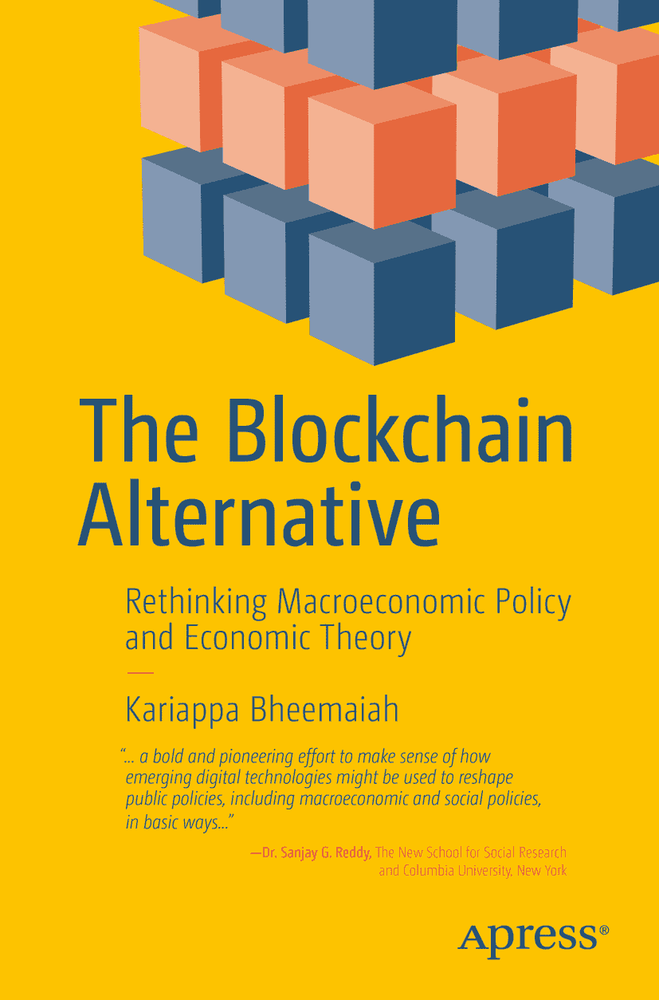

# 区块链的替代方案
## 重新思考宏观经济政策与经济理论

Kariappa Bheemaiah

本书作者引用的任何源代码或其他补充材料，读者均可通过本书的产品页面在 GitHub 上获取，网址为 [`www.apress.com/9781484226735`](http://www.apress.com/9781484226735)。如需更详细信息，请访问 [`http://www.apress.com/source-code/`](http://www.apress.com/source-code/)。

ISBN 978-1-4842-2673-5
电子书 ISBN 978-1-4842-2674-2
DOI 10.1007/978-1-4842-2674-2
美国国会图书馆控制编号：2017934075

© Kariappa Bheemaiah 2017

本作品受版权保护。出版商保留所有权利，涉及全部或部分材料，特别是翻译、重印、再使用插图、朗读、广播、缩微胶片复制或以任何其他物理方式复制，以及信息存储与检索的电子改编、计算机软件，或目前已知或日后开发的类似或不同方法的传输权利。

本书中可能出现商标名称、标志和图像。我们并非在每次出现商标名称、标志或图像时都使用商标符号，而是仅在编辑风格中使用这些名称、标志和图像，以利于商标所有者，并无侵犯商标权的意图。本出版物中使用商品名称、商标、服务标志及类似术语，即使未予明确标识，也不应被视为对其是否受所有权保护的表达意见。

尽管本书中的建议和信息在出版时被认为是真实准确的，但作者、编辑和出版商均不对可能出现的任何错误或遗漏承担法律责任。出版商对本书所含材料不作任何明示或暗示的保证。

印刷于无酸纸

全球图书贸易发行：Springer Science+Business Media New York, 233 Spring Street, 6th Floor, New York, NY 10013。电话：1-800-SPRINGER，传真：(201) 348-4505，电子邮件：orders-ny@springer-sbm.com，或访问 www.springeronline.com。

Apress Media, LLC 是加利福尼亚州有限责任公司，其唯一成员（所有者）是 Springer Science + Business Media Finance Inc (SSBM Finance Inc)。SSBM Finance Inc 是特拉华州的公司。

谨以此书纪念 Nigel F.B. Allington 教授。一位教会我如何学习的老师、导师和朋友。