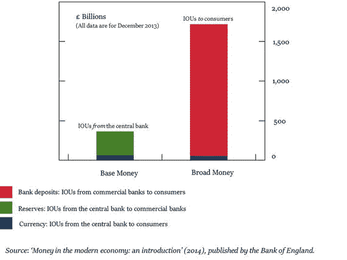

# 货币的演变与本质

货币总体上一直处于逐步演变的状态，其形式随经济体的发展而变化。早期的货币更像是商品而非货币，本身具有内在价值。早期货币的例子包括牛、种子，甚至木材。事实上，由抛光榛木或柳木制成的“符木”自公元 1100 年起在英国使用，直到 1834 年才被废除。³ 这就是“`tally up`”这个短语的起源。

在货币史上，黄金和白银作为公认的交换形式和财富衡量标准，持续了很长一段时期。⁴ 金银复本位制在 20 世纪初催生了金本位制，并在 1946 年的布雷顿森林会议期间促成了固定汇率的建立。通过这种方法，一国的主权货币与黄金挂钩，使得货币的每种面值都具有了理论上可用黄金兑现的价值。

由于黄金和白银在储存、携带和使用上很不方便，到了 18 世纪，一种更便携、更方便的新货币形式——“商品支持”货币开始被使用。这种货币形式与以往形式的区别在于，货币本身没有内在价值。与黄金和白银不同，这种货币形式基于一种共识：个人持有的货币可以兑换成某种商品作为交换。

随着时间的推移，这种货币形式演变成了法定货币，也就是现代经济体目前使用的货币。法定货币于 1971 年开始使用，此前尼克松总统决定停止使用金本位制。金本位制的终结帮助切断了世界货币与实物商品之间的联系，并催生了浮动汇率。然而，商品支持货币与法定货币的一个显著区别在于，法定货币基于信任，而非本身具有有形价值。法定货币由中央或政府当局支持，作为一种法定货币发挥作用，它将被其他人接受以换取商品和服务。它可以被视为一种“借条”，但又是独一无二的，因为每个使用它的人都信任它。因此，货币的价值基于信任，而非兑换成某种商品。

“信任”这一概念对于货币的故事至关重要，因为它与债务和现金的生产直接相关。我们信任我们的银行来保管我们的钱，也信任我们的借款人偿还他们的债务。我们可能会通过收取利息来对冲违约的可能性，但基本概念仍然是基于信任的。这两种信任的体现是货币创造的基础。

主要有三种类型的货币：流通货币、银行存款和央行储备。每一种都代表了经济体中一个部门对另一个部门的借据。在当今运转的经济体中，大多数货币以银行存款的形式存在，这些存款由商业银行自身创造。公众以流通货币形式持有资金，而他们的银行则以不计息的活期存款和计息的可开支票账户形式持有资金。纸币和银行存款作为商品没有价值。正是人们对自己将货币兑换成资产、商品和服务的能力所抱有的信心，赋予了货币价值。

信任从人际关系向价值符号的转移，使得货币成为一种特殊的社会制度。在任何特定的社会中，任何人都可以通过每次购买商品时发出个人的借据来创造金融资产和负债，然后在分类账中结算他们的债权和债务借据。事实上，在中世纪，欧洲商人通过发行借据相互交易，并在集市上结算债权，从而抵消债务。然而，要使这样一个体系蓬勃发展，需要极大的信心，即欠你钱的人是值得信赖的并且会偿还债务。更糟糕的是，即使一个人值得信赖，他们也可能会与不可信的人打交道，而这些人可能会违约，从而导致这个可信的人无法偿还你的贷款。但是有了货币，我们就不再需要处理这个不信任的问题了，因为每个人都信任一种允许进行商品和服务交换的媒介。

正是这种信任的象征赋予了货币价值，并使其能够执行其三项功能。法定货币缺乏内在价值，但仍然充当交换媒介。一个国家货币的价值是由对该国货币的供求关系以及对其经济中其他商品和服务的供求关系决定的。这个价值也直接与货币的可得性、获取它所需支付的价格以及其供应的稀缺性相关。

当现金从账户中被提取时，在公共实体领域流通的货币量反而会增加。这使得货币能够根据其交易地位、其母国的 GDP 以及该国是进口多于出口还是出口多于进口来获得经济意义。当一个国家是大型进口国时，它的货币也可能被其他依赖型经济体用作挂钩货币，美元和欧元的情况就是如此。⁵ 由于货币的价值基于货币的供求，一个问题出现了：在自由市场中，货币创造的主要驱动因素是如何调整的？为了理解这个概念，我们需要重新认识部分准备金银行制度、通货膨胀以及中央银行和商业银行所扮演的角色。

## 部分准备金银行制度与债务货币

要理解部分准备金银行制度的概念，首先必须认识到，尽管中央银行和政府在主权货币发行方面属于同类机构并协同运作，但实际上是中央银行根据通胀目标和利率来影响货币创造的数量。强调这一区别的原因在于，大多数国家的中央银行是独立企业，其货币政策决策无需得到总统或政府行政、立法部门的任何其他人批准⁶。这种工作模式与更发达国家一致，其基础是英格兰银行的模式。英格兰银行成立于 1694 年，是一家为购买政府债务而成立的合股公司⁷。在这种模式下，当政府需要资金履行职能时，它们会与中央银行交换债券。中央银行随后创造并发行货币，以换取政府债券（包括国库券）和利息。通过这种方式，中央银行与政府保持一致，但仍保持相对独立的地位。

需要考虑的第二点是货币数量与其所代表价值之间的关系。虽然稀缺性在赋予货币价值方面起着首要作用，但这一价值与货币用于交换商品和服务的实用性成正比。这种实用性由货币需求来衡量，而稀缺性则由货币供应量决定。这两者之间的微妙平衡赋予了货币价值，每个发行货币的国家都力求在其境内外稳定其货币的供应量或流通量。

由于货币的价值仅由其能购买多少东西来衡量，其价值与经济中商品和服务的总体价格水平成反比。因此，如果货币供应量的增长速度快于经济提供的商品和服务总量，物价就会上涨。这种现象称为通货膨胀。相反的现象称为通货紧缩，导致价格普遍下跌。

因此，大多数中央银行制定货币政策，使其能够维持较低的通货膨胀率，这反过来又为其货币的价值提供了稳定性。这进而提供了可持续增长和经济稳定。由于货币创造及其供应控制在经济中扮演着如此关键的角色，中央银行在这一领域发挥主要的控制作用也就不足为奇了。然而，货币创造过程也发生在商业银行中。事实上，现代经济中的大部分货币是由商业银行通过发行债务创造的。

在深入探讨货币生产的机制和债务发行之前，我们还需要定义在我们经济中流通的货币类型，即广义货币和基础货币。广义货币是指消费者用于交易的货币。它包括流通中的现金（纸币和硬币），这是中央银行的债务凭证；以及银行存款，这是商业银行对消费者的债务凭证。通常，广义货币衡量的是家庭和公司持有的货币量（`Berry 等`，2007）。

基础货币，也称为中央银行货币，由中央银行的债务凭证组成。这包括流通中的现金（对消费者的债务凭证），也包括中央银行储备金，即中央银行对商业银行的债务凭证。基础货币之所以重要，是因为它由中央银行发行，从而使它们能够实施货币政策。尽管广义货币和基础货币的产生密切相关，但广义货币，即商业银行对客户的债务凭证，其流通量远大于基础货币，即中央银行的债务凭证。图 1-1 中的图表取自英格兰银行 2014 年的一份报告，说明了这一点：



图 1-1. 流通中的不同货币形式

广义货币与基础货币之间存在巨大差异的原因在于商业银行具有更强的货币创造能力。如果你拿起一本本科经济学教科书，这一点并不会被明确阐述。你可能会看到类似的描述：“银行是经法律批准的金融机构，从个人和储蓄者那里吸收存款，并将其贷给企业，从而在各种资本投资机会之间分配资本。”但从图 1-1 可以看出，商业银行的作用似乎远远超出了这个简单的定义。

商业银行最重要的功能是创造信贷。商业银行并非简单地充当中间人，持有储蓄者的资本并将这些存款作为贷款发放出去。当银行提供贷款时，它同时也为借款人的账户创建了一笔相应的存款。正是在这里，中央银行与商业银行之间错综复杂的互动导致了债务货币的产生。

当客户将资金存入银行时，他们只是将中央银行的债务凭证兑换成商业银行的债务凭证。商业银行确实获得了资本注入，但它也会将存入的金额记入客户的账户贷方。再次强调，这一操作建立在信任之上。客户信任商业银行能够按要求偿还存入的金额。为此，银行需要确保拥有足够的资金来偿还这些债务凭证。为了实现这一点，银行存款必须能够容易地兑换成现金，而今天的情况正是如此。

由于存款可以兑换成现金，发放新贷款的行为对于创造货币变得至关重要。当银行向其一位客户发放贷款时，它会将借款人的账户余额增加到更高的存款金额。然而，同时，它也在其资产负债表的负债方创建了新的条目。尽管这笔负债此前并不存在，因此没有任何现金形式的实物体现，但它实际上是银行账户中的一个条目。但由于所有这些条目都可以兑换成现金，因此商业银行在发行债务的那一刻就是在创造新的货币。因此，贷款创造了存款，而不是相反。

如果你是第一次读到关于商业银行通过发放贷款或提供信贷来创造货币的方式，可能会觉得难以理解，但这正是当今货币被创造出来的方式。当商业银行向客户发放贷款（例如用于买房）时，它并非以现金形式提供这笔贷款。相反，它会将相当于抵押贷款金额的存款记入其账户贷方。当他们向借款人发放贷款时，他们也在其资产负债表上记入资产。房子可能属于申请抵押贷款的客户，但在贷款还清之前，它实际上是银行的一项资产。因此，即使贷款可以在以后某个日期偿还，这笔钱也能立即使用，代价只是暂时牺牲所有权。

抵押贷款的所有者现在用借来的资金支付房款。通过这样做，他们向另一家企业（在本例中是房地产中介，如果是私人出售则向家庭）注入了资本。因此，通过发行债务，商业银行创造了货币、信贷和购买力。我们通常认为的货币，绝大多数都是以这种方式创造的。在两种类型的广义货币中，银行存款占当前流通总量的 97%–98%。只有 2%–3% 是政府发行的纸币和负债形式（`McLeay 等人`，2014）。

因此，商业银行发行多少债务以及这些债务如何使用，是至关重要的话题。大多数消费者不是通过兑换货币，而是使用银行存款作为价值储存手段和交换媒介。一旦银行通过发行债务创造了货币，大多数人就会利用这些货币通过其存款（而非现金）进行收付款，尤其是在当今交易大多为数字化的背景下。当消费者通过银行间清算系统进行支付时，这些货币就会在账户之间转移。因此，货币一旦被创造出来，几乎必然留存于银行体系内，极少被提取出来以现金形式使用。

从上述描述来看，通过这种方式创造的新货币量似乎应该等于贷款额。但是，有许多其他因素会改变这一等式。为了理解其运作原理，我们需要从定量角度审视部分准备金银行制度，追问自己：商业银行能够以这种方式创造多少新货币？

为了回答这个问题，我们现在将目光从广义货币转向由中央银行创造的`基础货币`。如上所述，由于货币创造及其供给控制在经济中扮演着关键角色，中央银行在这一领域发挥着主要的控制作用。因此，它们负责确保商业银行发行多少债务，没有这一点，它们就无法控制货币供应。这种控制杠杆以`资本要求`的形式存在。

`资本要求`在基于债务的货币生产过程中扮演着重要角色，因为它们除了其他作用外，还为银行挤兑提供了保障。由于银行在发放贷款时创造货币，因此如果大量存款人决定提取存款，它们就有可能耗尽实体货币。为了应对这种风险，商业银行有义务持有一定数量的货币以应对存款提取和其他资金流出，但使用实体纸币进行这些大额交易极其不便。因此，允许商业银行以`中央银行储备金`的形式持有一种中央银行的借据，该储备金按商业银行持有的总资本比率计算。中央银行还保证，如果商业银行需要，任何数量的储备金都可以兑换成现金。

现代商业银行必须以库存现金以及其在中央银行的存款余额形式持有法定准备金，这些准备金等于其总存款的一定百分比。计算此百分比是为了确定银行需要持有的最低资本要求，以最小化信用风险。制定这些国际银行监管规定的机构是`巴塞尔银行监管委员会`，它是`国际清算银行`（`BIS`）的一部分，后者是一家由中央银行拥有的国际金融机构。⁸ 商业银行持有的总资本被分类为`一级资本`、`二级资本`和`三级资本`。⁹

根据巴塞尔协议 III 的规定，中央银行要求持有的最低资本量取决于商业银行的规模。银行分为两类：`第一类银行`是一级资本超过 30 亿欧元且具有国际活跃度的银行。所有其他银行则归类为`第二类银行`（`欧洲银行管理局`，2013）。截至 2016 年 3 月，根据巴塞尔协议 III 框架的实施情况，第一类银行的平均资本充足率为 11.5%，其一級资本充足率为 12.2%，总资本充足率为 13.9%。对于第二类银行，平均资本充足率为 12.8%，其一級资本充足率为 13.2%，总资本充足率为 14.5%（`BIS`，2016）。

在货币创造的背景下，这些以分级资本控制形式存在的资本要求，使得中央银行能够控制商业银行的债务发行，从而控制货币发行。为简化起见，我们假设商业银行（第一类或第二类）需持有的最低资本量约等于其总资本的 10%。则需要在中央银行持有的资本百分比计算公式为：

```
资本要求 = (一级资本 + 二级资本) / (银行按风险加权的资产) ≥ 10%
```

这个 10% 的最低要求是`部分准备金银行制度`的基础。它表明，根据 `BIS` 制定的规则，银行只需要持有其货币的一小部分作为准备金（在此情况下为 10%），即可发放贷款。基于这一规定，商业银行可以扩大其持有的存款，只需将存款的 10% 保留为准备金，并将剩余的 90% 以固定或浮动利率贷出。换句话说，仅保留初始存款的一小部分，银行就可以对全部存款进行放贷活动。正是由于这个原因，这种做法被称为`部分准备金银行制度`。

按照部分准备金银行制度的规则，如果`$10,000`存入一家商业银行，则只需持有`$1,000`作为存款准备金，而剩余的`$9,000`可以由银行贷出或投资。存款人账户中的存款额将显示为`$10,000`，尽管账户持有人原始存款中只有 10% 实际存在于该账户中。然而，贷款并不是基于银行现在持有的`$9,000`发放的。相反，银行会发放贷款，并同意“接受本票，以换取对借款人交易账户的信贷”（`芝加哥联邦储备银行`，2011）。贷款（资产）和存款（负债）均增加`$9,000`。因此，这笔交易并未改变准备金，但借款人账户中的存款信贷现在为银行的总存款增加了新的资本。

其结果是，初始存款`$10,000`被分为`$1,000`的准备金和`$9,000`的待贷款项。待贷的`$9,000`进入借款人的信贷账户，并继续遵循同样的规则：只需保留`$1,900`作为准备金，剩余`$8,100`可以贷出。这个循环不断重复，直到初始的`$10,000`存款理论上可以在银行存款中创造出`$100,000`。¹⁰ 由此可见，消费者的储蓄并非允许商业银行放贷的主要存款来源。在现代经济中，商业银行是存款货币的创造者，而且，并非通过贷出存入它们的存款来运作，放贷行为本身创造了存款——这与大多数经济学教科书中的典型描述恰恰相反（`McLeay 等人`，2014）。

商业银行发行的存款数量在很大程度上受到中央银行设定的利率的影响（其他因素包括通货膨胀率、净息差等）。如果利率较高，会导致贷款机会无利可图，因为商业银行发放的贷款会被记录为银行欠其客户的金额。因此，在高利率环境下，存款创造量较低，而在低利率环境下则较高。如果银行存款是通过发放贷款创造的，那么以货币或现有资产形式偿还贷款则会导致存款的消失。因此，影响存款数量的第二个因素是市场。如果市场情绪不利于投资，消费者可能更倾向于不申请贷款，或偿还现有贷款以规避风险。这一情况还会受到竞争银行的影响，这些银行可能会在向消费者提供的贷款利率上设定更低的利率。由于银行的盈利能力取决于其发放贷款所获得的利率高于其支付给存款的利率，因此其能够创造存款并维持市场份额的限度，会受到竞争对手所执行的利润率策略的影响。

中央银行还设定了商业银行持有的中央银行准备金所支付的利率。商业银行以其在中央银行以资本要求形式存入的存款所获得的利率，自然会影响到它们向消费者及其他银行（即银行间拆借）放贷的意愿。中央银行通过制定旨在实现政府设定的通货膨胀目标的货币政策来计算该利率。通过保持稳定的消费者价格通胀（通常约为 2%），货币政策力求确保信贷和货币创造的稳定速度。利率也不是由所选定的准备金数量决定的。相反，它基于信贷的价格，而信贷价格由信贷的供需关系决定。信贷需求的增加会抬高利率，而信贷需求的减少则会降低利率。

因此，中央银行根据信贷供应的定价以及其为实现货币政策目标而持有的准备金所需支付的利息，来控制短期利率。但由于流向中央银行的准备金和货币（广义货币）的供应量由商业银行发放的贷款决定，因此对基础货币的需求深受商业银行正在发放的贷款的影响。此外，银行系统中已有的准备金数量并不直接限制通过发行债务来创造广义货币。例如：英国央行没有正式的准备金要求。商业银行确实会将其部分负债的一定比例作为无息的现金比率存款存放在英国央行。但这些现金比率存款的功能并非操作性的，其唯一目的是为英国央行提供收入（`McLeay 等人`，2014 年）。商业银行拓展信贷的真正决定因素是基于盈利能力。

## 我们与债务的华尔兹

因此，与私人信贷发行相关的盈利能力是一个至关重要的话题。正是通过向消费者和企业发放信贷，广义货币才被引入经济体系。随着私人信贷需求的上升，以货币和存款形式存在的货币供应量也会增加。这让我们回到了图[1-1]中的曲线图。为什么广义货币会是基础货币的许多倍？答案是信贷需求。请记住，信贷扩张对发放贷款的银行来说是有利可图的，因为这意味着更多的存款。因此，如果信贷需求上升，商业银行就会获利。在过去的四十多年里，这种需求一直在增长。

1997 年至 2007 年间，美国的私人信贷以每年 9%的速度增长，英国则为每年 10%。与此同时，私营部门的杠杆率也出现了惊人的增长。在英国，私营部门杠杆率从 1964 年的 50%上升至 2007 年的 180%（`Turner`, 2015）；而在美国，家庭债务与收入比率从低于 0.5 上升至 2.2（`Sufi` and `Mian`, 2014）。大多数其他发达经济体也出现了类似的数据，并且最近，这一模式在许多新兴经济体中也在重复出现。在大多数情况下，私人信贷的增长速度超过了以 GDP 衡量的经济增长速度。

通过追踪并绘制这些数据，我们注意到，在过去六十年间，债务需求稳步增长。这种不断增长的债务需求是这一时期所采取的行动和政策的产物，这些行动和政策定义了当前高杠杆的经济环境。虽然详细分析这一主题超出了本书的范围，但必须简要提及，因为追溯当今负债累累的文化的历史，与找到解决方案同样重要。侧边栏 1-1 总结了一系列事件，为我们如何走到今天这一步提供了一些见解。

**侧边栏 1-1：垃圾债券与里根经济学**

家庭和公司债务不断增长的趋势，部分可以追溯到 70 年代的能源危机。随着 1973 年的石油禁运与 1980 年两伊战争的爆发，石油价格大幅上涨，并在发达工业化国家引发了经济和社会混乱。结果，80 年代在美国和英国新当选的政府转向了激进的新方法来创造经济增长。这一时期也被称为里根-撒切尔时代，并导致了现在俗称的里根经济学的实施（`Hill`, 2012）。


# 里根时代的经济变革与债务角色

当罗纳德·里根于 1981 年就职时，他承诺重振美国经济。但里根认为政府是实现这一目标的障碍。正如他在就职总统演说中所言，“在这场危机中，政府不是我们问题的解决方案。政府就是问题本身”（Wisensale, 2001）。因此，他的策略是剥夺政府的经济决策权，将其交给金融市场和华尔街。毫不意外，这成为了大多数华尔街银行家的机会。

抓住这一机会的银行家之一是迈克尔·米尔肯，他未来将成为米尔肯研究所的创始人。米尔肯发明了一种名为高收益债券（老牌银行称之为垃圾债券）的债务工具，他曾利用这种债券筹集巨额资金，在拉斯维加斯建造赌场。赌博业是大多数银行避之不及的行业，因为风险太高。但米尔肯能够证明，由于这些投资涉及的风险更高，这使得投资者能够要求非常高的回报率。即使其中一些企业确实倒闭了，但通过广泛投资于这些公司，平均而言，投资者仍能获得巨额财富。这就像是把哈里·马科维茨的现代投资组合理论用在了类固醇上。

20 世纪 80 年代，虽然高收益债券本身具有革命性，但其真正的变革在于，它让传统银行此前拒绝提供资本的金融体系外部人士，也能获得资金。过去，资本掌握在美国大型工业家族手中。但有了高收益债券，资本变得民主化，不再是小部分人的财产。越来越多投资垃圾债券的新兴企业家变得富有，这吸引了渴望购买这些垃圾债券的新投资者。本质上，它成为了一种挑战华尔街既有权力格局的工具，并开始以收购的形式实施。

里根通过的首批政策之一，就是放宽了管辖公司收购的规则。米尔肯意识到，这项政策的通过可能让他的高收益债券能够筹集大量资金，因为尽管涉及高风险，但老牌公司内部隐藏着可以解锁、出售并为投资者带来巨额利润的资产（Curtis and Hobley, 1999）。这不仅导致了对现有行业巨头的敌意收购，也意味着资本创造的力量已从少数人手中转移到了市场。高管的决策现在由股票市场以及那些为股东创造最大利润的高管所支配。

随着权力转移到市场，自由市场经济思维也在其他发达国家发展起来。债券及其伴随的债务，成为企业家利用债务收购现有公司或其部分业务的重要资本来源。一旦完成收购，提高股价的主要策略就是裁员。随着市场日益看涨，失业率与企业利润同步飙升。企业和家庭为了适应资本市场的变革，越来越多地承担债务。随着债务需求上升，与之相关的利率也随之提高。

这些政府实施的市场导向政策以及私营企业采取的最终措施，起初似乎奏效了。通货膨胀被挤出经济体系，经济开始稳定。但也带来了其他后果。随着利率大幅上升，这些国家的制造业受到了重创。高薪的技术工作被服务行业的低薪工作所取代。英国记者兼纪录片制作人亚当·柯蒂斯在纪录片系列《五月花集团》和《苦湖》（见下文注释）中，对这些社会经济变化进行了最佳报道。

在寻找解决方案的过程中，政府再次求助于商业银行并放宽了贷款限制。如果工资不能再涨，那么银行可以借钱。结果，一场借贷浪潮席卷了这些国家。即使工资停滞不前，人们也可以借钱维持某种生活方式。结果，管理社会和经济的能力悄然从国家和中央银行的掌控，滑向了商业银行和金融市场。随着监管放松，信贷扩张加剧，银行的利润也随之增长，因为发放贷款意味着更多的存款。

同样的过程在 2001 年重演。在 9·11 袭击的冲击之后，最大的恐惧是随着投资者支出暴跌和市场冻结，美国经济可能崩溃。作为回应，在经济专家的建议下，政客们将利率降至历史低位以鼓励支出。作为回应，廉价资金开始涌入体系，灾难暂时得以避免，尽管这种缓冲措施的有效性目前仍存在争议。前述追踪私人信贷水平增长的图表，正是这些转变的体现。

注释：`The Mayfair Set`（1999 年）审视了全球军火贸易的诞生、资产剥离的发明，以及英国资本家如何塑造了撒切尔时代。该片在 2000 年英国电影和电视艺术学院奖上获得了最佳纪实系列或专题奖。`Bitter Lake`（2015 年）追溯了伊斯兰恐怖组织的起源，并指出它们源于美国与沙特阿拉伯之间长期的经济联盟。关于美沙联盟的详细记录，也可以参见 2005 年 PBS Frontline 的纪录片《沙特家族》。

本插页描述的事件似乎将债务描绘成一种必要的恶，它以利润最大化为借口被毫无顾忌地使用。然而，这是经济压力以及一个尝试新思想的新政权领导人决策的结果。这并不是说债务需求的增长和私人信贷行业的发展是一个完全人为制造的过程。债务本身对增长至关重要，任何使用某种形式货币的文明，也使用过某种形式的债务工具（Graeber, 2012）。当个人和企业试图成长并实现更高水平的繁荣时，他们通常需要债务来扩张和规模化。我们需要问自己的是，为了增长并在社会层面达到一定的繁荣阈值，我们需要多少债务？

我们需要问这个问题的原因，在于债务在我们经济中的核心作用。正如我们所见，当前的货币体系建立在债务和基于债务的货币之上。用美联储主席马里纳·埃克尔斯的话来说：“如果我们的货币体系中没有债务，就不会有货币。”因此，为了回应需要多少债务的问题，我们需要理解我们对承担债务的依恋。难道不能通过股权实现同样的繁荣吗？债务为何如此诱人，又为何在所有讨论中无处不在？

这些问题的答案在于安全性和所有权。对于股权而言，投资者的回报直接与所资助商业项目的成功挂钩。然而，增发股票的代价是分割公司的所有权蛋糕。即使项目成功，现在也需要在其他股东之间分配利润份额。近年来，以奖金形式出现的对所有权减少的反应已有所显现。由于业务经理比投资者更了解业务，如果他们决定这样做，他们可以将利润分流给自己，并减少支付给投资者的股息和回报。业务经理薪酬规模的增加正是这种做法的体现。

相比之下，债券被认为更安全，因为它们提供固定的预定回报，并且不侵犯所有者的领地。此外，债务具有更大的灵活性，因为流动性强的债券市场为投资者提供了投资长期资产的机会，他们可以在短期内出售这些资产以换取流动性。然而，这种债务工具带来的安全感也伴随着其他复杂性。首先，结合部分准备金银行制度，基于债务的货币和债务融资可以用来资助更多的债务。这可能会造成过度依赖债务的危险，因为未偿债务的偿还也依赖于债务的供应。如果一家公司需要资金扩张，并大量使用债券来实现这一点，那么如果没有持续的债务发行，这些公司将被迫停止投资，并看到其资产价格下跌。这也使它们在面对投资者信心下降和银行贷款减少时更加脆弱。
