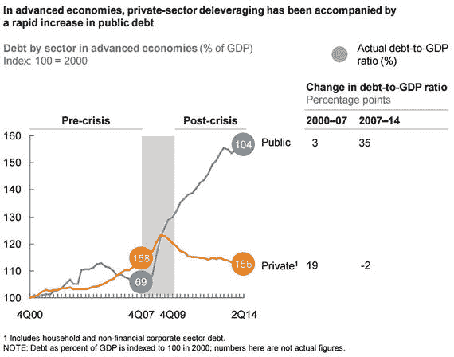

# 全球债务格局：变迁与影响

## 债务增长的总体趋势与二元现象

数据显示了这一效应：2007 年至 2014 年间，全球债务占 GDP 的比例从 269%上升至 286%（Dobbs 等人，2015 年）。然而，剖析公共杠杆率增长的分支，会发现一个在不同经济体中均有体现的二元现象。例如：2008 年至 2015 年期间，美国家庭债务占 GDP 的比例从 99.03%下降至 79.95%，¹⁴ 私人债务占 GDP 的比例从 212.28%下降至 194.72%。¹⁵ 同期，公共债务占 GDP 的比例则从 92.34%上升至 125.34%。¹⁶ 图 1-2 展示了这一现象。

*图 1-2.* 私人部门与公共部门之间的债务转移  
*来源：* “债务与（不多的）去杠杆化”（2015 年），麦肯锡全球研究所

## 分化趋势与新兴经济体的变化

尽管该图显示公共债务增长呈总体上升趋势，但同一份报告进一步指出，债务和债务积压的演变正日益分化且速度加快。此外，在法国、瑞典和比利时等少数发达国家，自危机以来，私人部门债务实际上与公共部门债务同步增长。在新兴经济体中，自 2008 年以来私人部门和公共部门杠杆率的不断上升同样成为一个令人担忧的问题。

这在危机之后是意料之中的。随着危机后发达经济体的增长萎缩，导致其从新兴国家的进口放缓。其结果是，这些国家被迫从出口导向型增长转向由国内信贷扩张推动的内需导向型增长。这一点在中国最为显著，但并非仅限于中国。

此外，由于发达经济体的利率降至超低水平，寻求更高债券收益率的投资者开始为新兴经济体的项目提供资金。由于债券提供了更安全的投资选择，新兴经济体的企业开始发行债务而非股权，以利用市场信心的变化并吸引不断增长的外国信贷供给。因此，与 21 世纪初期的阶段相比，这波新的外国直接投资（FDI）主要由债券市场推动，结果，2009 年至 2013 年间，外国投资者持有的新兴市场债券份额翻了一番，从 8170 亿美元增至 1.6 万亿美元（Dobbs 等人，2015 年）（Buttiglione 等人，2014 年）。看来，债务的华尔兹已成为 GDP 增长的民间舞蹈。