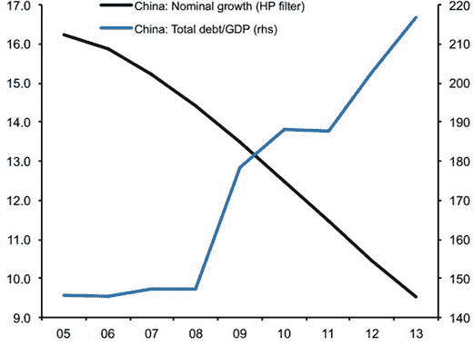

# 多少债务才算过多？

各国不断上升的债务水平迫使我们重新审视前文提出的问题：为了增长并在社会层面达到一定程度的繁荣，我们需要多少债务？债务与增长似乎如影随形，因为过去几年中，债务类工具相对于股权类工具（就股票市值而言）更受青睐（Buttiglione 等人，2014 年）。随着这一趋势在全球市场蔓延，引发了一个问题：为什么经济体需要越来越多的债务来推动经济增长？更重要的是，我们需要确定这种基于债务的增长模式是否可持续。

对这种基于债务的增长模式感到担忧的原因是多方面的。在私人层面，债务数额会影响投资和消费决策。在公共层面，它会影响支出和税收，并决定应对危机和冲击的抵抗力，因为有大量证据表明，高额债务存量会增加金融危机的脆弱性（Jorda 等人，2011 年）（Catão 和 Milesi-Ferretti，2013 年）。然而，购买债务类资产之所以流行，是因为其不太可能引发偿还问题，并且假设债务将通过未来的收入流来偿还。但问题恰恰出在这里。在经济停滞和工资增长僵化的情况下，偿还债务的能力正面临越来越大的挑战。这并不仅限于发达经济体，也涉及新兴经济体，而在当今中国最为突出。

2015 年底，中国录得了四分之一世纪以来最缓慢的增长，为 6.9%。为提振经济增长，北京政府于二月份向银行系统注资，以便为企业及消费者提供低成本信贷（Wildau，2016 年）。虽然可以说这是为了资助创新，但考虑到其他经济事实，这一论点便失去了部分说服力。2008 年至 2014 年间，中国总债务增长了 GDP 的 72%，即每年增长 14%。这几乎是同期美国和英国的两倍。由于这种信贷扩张，中国经济的总体杠杆率接近 GDP 的 220%，几乎是其他新兴市场平均水平的两倍（Buttiglione 等人，2014 年）。因此，中国正经历着信贷扩张加速而名义 GDP 增长放缓的局面。图 1-3 展示了这一矛盾，而中国生产率的放缓预示着未来偿债将面临困难。

*图 1-3.* 中国的杠杆率与潜在名义 GDP 增长  
*来源：* “去杠杆化，什么去杠杆化？”，第 16 届日内瓦世界经济报告

如前所述，债务的连锁反应是周期性的，而过高的债务水平会加剧这种效应。如果家庭和企业发现自己因偿债或承担更多债务而受到过度约束，那么另一方面，由于不确定债务人是否有能力偿还债务，债权人就会不愿发放新贷款或续签现有承诺。结果，信贷成本上升，使得债务不再具有吸引力，在某些情况下甚至变得不可持续。市场的相互关联性进一步放大了这种效应，以至于一个部门的信贷紧缩可能引发一波丧失抵押品赎回权的浪潮，并威胁到银行业，进而如果银行需要政府救助，则可能引发主权债务危机。这反过来又火上浇油，因为对救助的预期可能导致私人部门债权人的还款纪律降低，尤其是当债务问题在经济中广泛存在，以至于惩罚威胁不可信时（Arellano 和 Kocherlakota，2014）。总而言之，用于创新的资金减少，创业活动下降，失业率上升，经济衰退随之而来。

债务水平上升的影响还因投资于房地产和购买现有资产的固定模式而进一步加剧。例如，在英国，2013 年仅有约 15% 的金融流实际流入了新投资项目。其余部分用于购买现有企业资产、房地产或无担保的个人理财，以“促进生命周期消费平滑”（Tett，2013）。当债务用于创造经济活动时，它可能是有益的。但正如本节所记录的证据所示，如今的债务并未用于创办新企业，且不断增加的债务已超出偿还能力。由于债务同时也是银行存款，私人债务的违约会影响银行业，从而产生系统性风险。

此外，一个国家的债务问题不仅仅是主权事务。由于金融机构通过复杂的支付系统紧密相连，一个国家债务水平的脆弱性可能传染给其他国家。大型国际银行和对冲基金通常借入大部分资金用于购买资产。如果这些资产的价格因悲观的市场环境而下跌，那么公司负债（即债务）的价值可能超过其资产价值。在这种情况下，公司的股权价值也会下降。因此，更高的杠杆率会导致资不抵债的情况。最终，过度的债务类似于庞氏骗局（Das，2016）。家庭、企业和国家需要借入越来越多的债务来偿还现有贷款并维持经济增长。信贷体系得以借助影子银行在國際范围内朝这个方向发展，这是理解这个谜题的最后一块拼图。

## 影子银行与系统性风险

2005 年，艾伦·格林斯潘在联邦储备委员会发表了一次题为“经济灵活性”的演讲，他在其中陈述道：“这些日益复杂的金融工具有助于发展出一个远比四分之一个世纪前更加灵活、高效，因而也更具韧性的金融体系。在 2000 年股市泡沫破裂之后，与以往经历重大金融冲击的时期不同，没有任何一家大型金融机构违约，而且经济的表现比许多人预期的要好得多。” ¹⁷

他所指的金融工具是商业银行¹⁸创建的各种实体和工具，用以形成涉及多层次证券化¹⁹、多个杠杆方以及风险分配不透明的复杂信贷中介链条（Dobbs et al，2015）。在他发表演讲两年后，次贷危机便显现了这种金融复杂性的真实后果。

理解这一切是如何发生的，是理解债务增长的必然推论。如侧边栏 1-1 所示，在里根-撒切尔时代之后，金融和银行业开始增长，并逐渐成为经济中更重要的参与者。随着银行业、资产管理、保险、风险投资和私募股权的发展，金融产品的创新不断扩大，而拥有金融热点地区的国家，如英国、瑞士和美国，逐渐发现金融业在就业（在金融服务行业）和国内生产总值中占据了更大的份额。

金融产品的这种增长是家庭和企业日益倾向于承担债务的副产品。随着消费者要求的债务越来越多，而这些债务又越来越容易获得，这刺激了这些产品的创造，也导致了这些产品在其中交易的金融体系内部的发展。越来越多的人强烈认同，金融体系内部所从事的活动带来了更好的价格发现、更好的资本、资源和风险配置，并使经济体更加稳定，更能抵御冲击。艾伦·格林斯潘的声明表明了这种共识，尽管没有证据表明自 1970 年代以来，随着金融复杂性的增加，经济体变得更加高效（Turner，2010）。从这种日益增长的复杂性中产生的是对债务驱动型增长的沉迷以及影子银行体系的发展。

纽约联邦储备银行 2012 年的一篇论文提供了对影子银行的理解。该论文指出：“影子银行是进行期限、信用和流动性转换的金融中介，但它们无法直接获得中央银行流动性或公共部门信用担保。影子银行的例子包括金融公司、资产支持商业票据管道、结构性投资工具、信用对冲基金、货币市场共同基金、证券出借人、特定目的金融公司以及政府资助企业”（Pozsar et al.，2012）。本质上，这是通过非银行渠道提供信贷的做法。

自 2008 年以来，随着大多数发达经济体的银行贷款减少，非金融企业的信贷大部分来自非银行渠道，形式包括公司债券、证券化以及非银行机构的贷款。由于这些金融中介在正规银行体系之外提供信贷中介，它们缺乏正式的安全网（IMF，2014）。尽管意识到了这一风险，但在危机之前，金融机构还是增加了它们的金融工程活动。

银行参与此类高风险活动的原因，与它们在危机前轻易发放信贷如出一辙——有利可图。随着银行持续扩张（正如过去四十年间那样），它们的目标是变得更大。对增长和盈利能力的追求，促使它们承担更多风险。这一点首先体现在贷款标准的降低上，这也是次贷危机的主要原因。当这些抵押贷款被计入银行资产负债表的资产项后，它们便以证券化为幌子，被引入投机活动，用于套利、做市和持仓交易等与客户需求无关、对经济活动贡献甚微的操作。银行间金融体系与其他银行、对冲基金及资产管理公司之间的高渗透性，最终导致银行资产负债表中充斥着这些影子银行资产。尽管影子银行被宽泛地定义为传统银行体系之外的信用中介，但它约占全球金融中介总量的四分之一（国际货币基金组织，2014 年）。影子银行体系还参与场外衍生品交易，该市场在 2008 年金融危机前的十年间迅速膨胀（国际清算银行，2008 年）。截至 2015 年 6 月，经过大幅缩减和监管加强后，场外衍生品市场的估值为 553 万亿美元（国际清算银行，2015 年）。2015 年底，全球 GDP 为 73.17 万亿美元²⁰。

随着影子银行的扩张，其复杂性也在增加。中介业务是危机前银行业长期存在的做法。但由于衍生品的层层剥离与拆分，简单的证券化形式变得日益复杂。以债务类衍生品为例，基础资产的期限转换风险被进一步复制到证券中，从而创造了新的信用形式并倍增了交易对手风险。这些产品信息的不透明是导致其蔓延的另一因素。由于这些产品的卖方、买方和监管机构之间信息不对称，监管难度加大。因此，从长远来看，证券的金融化削弱了市场机制，导致了人为且波动的价值（达斯，2016 年）。

人们很容易说监管者失职了。但实际情况是，监管者和宏观经济学家在很大程度上一直遵循着规则。事实上，他们的模型和政策基于众所周知的经济理论、统计分析，以及一个认知：即复杂性的增加会带来更高效、更公正的市场。那么，为什么这么多经济学家没有预见到危机的到来呢？

普遍认为金融市场复杂性的增加能带来更高效率的主要原因是，现有关于金融市场与货币政策相互关联的宏观经济理论。在过去三四十年里，标准经济学理论将市场视为货币政策得以渗透的一层面纱。金融体系被允许按照其传统功能运作——吸收存款和发行债务——而宏观经济学家则专注于通过利率和通胀目标来控制经济。这种宏观经济学与银行业及金融市场之间的脱节，已经发展到几乎不关注货币和债务是如何被创造的层面。这在教育层面也具代表性，因为如今大多数大学和商学院并未将大量课程重点放在银行业和信贷上。要理解其原因，我们需要审视经济学的思考方式。

尽管技术不断演进，宏观经济理论仍然牢固地建立在两个众所周知的概念之上：有效市场假说和理性预期理论。根据这些概念，市场参与者的预期是基于过往经验形成的，通常是过去观察结果的某种加权平均以及新数据的可得性。然后，参与者会最优地利用这些信息来识别机会，因此，考虑到任何不可避免的错误，他们的预期将是正确的。这就是理性预期理论的核心。由于这些基于经验和新数据的预期，如果某一事件原本应该发生的方式发生了变化（例如税率变动），那么参与者甚至在实际变化发生之前，就会立即改变对该事件未来值的预期。由于所有参与者都能获得相同的信息——尽管粒度不同——一个参与者的错误决策会被另一个参与者的正确决策所抵消。这使得超越市场变得不可能，因为股票价格本质上已包含了所有相关信息。这就是有效市场假说。

尽管有效市场假说和理性预期理论可能是理解经济学和股票市场的合理起点，但它们并非全貌，并且在当今背景下值得商榷。在当今复杂的经济环境中——充斥着影子银行、不断变化的监管和网络攻击——现实世界中的投资者无法获得“所有相关”的可得信息。这些理论对此有解释，并指出如果投资者未能使用所有可得的、相关的信息，或者未能最优地使用所有所得的、相关的信息，那么期望可能无法达到强式有效意义上的理性²¹。然而，它未能考虑到，即使投资者拥有相同的信息，心理构成的差异也可能导致系统性的预期差异。它还假设股票价格由“内在价值”决定，因而是静态的，因为它忽略了正反馈循环。

然而，大多数中央银行用来衡量经济体运作方式的模型——称为动态随机一般均衡模型²²——正是基于这些理论。更令人惊讶的是，在这些模型中，银行的运作并未被考虑在内，尽管它们确实会关注与大型企业和家庭总体相关的微观经济数据。

这种宏观经济理论的研究方法是相对较新的现象，恰巧始于 20 世纪 70 年代末。在此之前，如约翰·梅纳德·凯恩斯、欧文·费雪和亨利·卡尔弗特·西蒙斯等杰出经济学家的工作，都深刻地聚焦于货币的创造方式。虽然这种学术分野的原因本身就是一部经济史著作的题材，但这种在使用有效市场假说和理性预期理论的同时，忽略银行作用的方法，正是许多经济学家未能预见危机的主要原因。尽管债务与货币体系如此紧密地联系在一起，但这些理论以及基于这些理论创建模型的经济学家认为，复杂性的增加导致了更好的价格发现，因此认为债务对经济增长至关重要。那么，我们一直未关注货币的创造，这难道还令人惊讶吗？

