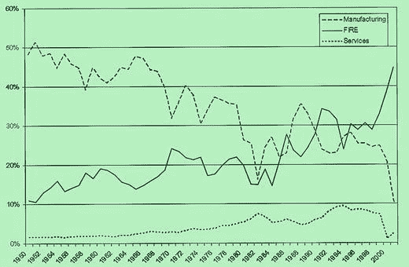
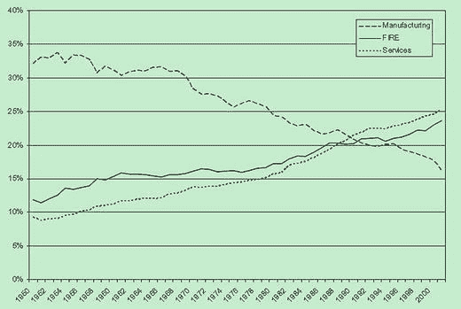

# 金融化的模糊性

1982 年，`金融时报`采用了一句新的企业口号：“没有《金融时报》，就没有评论。”与这句口号相关的电视广告展示了一条掠食性鱼类试图捕捉河豚，却未能成功。当河豚逃脱时，画外音男声说道：“你不必每天阅读《金融时报》，但可以肯定的是，你必须与那些阅读它的人打交道。”这则广告大获成功：它不仅赢得了广告口号名人堂的第三名，还进入了流行文化——当热门电视剧《纸牌屋》的主角弗朗西斯·厄克特/弗兰克·安德伍德在每次被问到有争议的问题时，都会用这句话作为回应（“你很可能这么想，但我无可奉告”）。

这句口号在当时之所以流行，部分原因在于它反映了一种文化共识。随着里根-撒切尔时代的到来，国有企业的私有化、市场放松管制以及垃圾债券资本的支配地位，意味着金融正渗入公共和私人生活的方方面面。作为金融信息的主要来源，“没有《金融时报》，就没有评论”体现了一种现实：审慎的做法是查看《金融时报》对某个话题或投资的评论，从而在这个新时代中自我教育，成为参与者或旁观者。这句流行语代表了一种日益增长的知识模式，这种模式正将家庭和非金融企业沉浸于金融市场中。

四分之一个世纪后，《金融时报》再次重复了这种对社会心态变化的体现，它已成为经济金融信息的事实参考和提供者。2007 年，就在危机爆发前夕，《金融时报》发布了新的广告宣传活动，用三种不同的图像象征全球化、并购和创业精神。这三张图像都带有他们的新口号“我们生活在金融时报时代”，几乎暗示着无论行业或规模如何，金融无处不在。一年后，随着危机的展开，他们的广告牌显示，一只圣伯纳犬的项圈上挂着一份报纸，取代了救命的白兰地酒瓶，以宣传其在经济衰退期间的重要作用（Sweney, 2008）。

这些《金融时报》的口号代表了金融对我们事务各个方面的支配地位。这种现象一直并继续被称为“金融化”，下面的图表显示了其上升趋势。

**图 2-2.** 1950-2001 年美国经济中公司利润的相对行业份额。图片来源：“美国经济的金融化”（Greta R. Krippner, 2005）

**图 2-1.** 1950-2001 年美国经济中就业的相对行业份额。FIRE：金融、保险和房地产。注意服务业和 FIRE 行业的曲线相似性。图片来源：“美国经济的金融化”（Greta R. Krippner, 2005）。

金融化的定义因语境而异。《牛津词典》将其定义为“金融机构、市场等规模和影响力增长的过程。”但任何过程都建立在一系列事件的基础上。因此，金融化不应被视为一种存在的现实主义，而应被视为事件的逐渐累积。

随着金融工具的数量、多样性和周转率增长快于实体经济，金融部门的增长也快于实体经济（Smaghi, 2010）。结果，市场和机构对非金融企业管理者的行为产生了越来越大的影响（Zorn, 2000），而家庭和非金融企业也日益陷入金融产品和市场的纠葛中。此外，随着金融化继续其广泛的渗透，它被广泛认为是件好事，其伪装是一种允许我们驯服风险的机制。正如本·伯南克在 2004 年对东部经济协会的演讲中所说：

> “过去二十年左右经济格局最显著的特征之一，是宏观经济波动性的显著下降……”

伴随这种文化转变的，是对信贷对经济增长重要性的护身符般的推崇。但是，正如前一章所见，发行越来越多的债务会导致债务积压，并将债务负担从私人部门转移到公共部门。此外，消费主义社会中可持续的持续增长需要不断购买和消费商品。廉价信贷的可用性意味着，那些收入增长与经济增速不同步的人，可以被说服通过借贷来维持某种生活方式。

因此，这些趋势的集体效应意味着经济绩效的提升依赖于消费者债务不成比例的增长。正因如此，家庭债务的增长速度快于一般经济活动水平，也解释了为什么每个连续的经济周期都需要更大剂量的家庭债务来刺激经济活动。当结合先前的陈述和第一章描述的主题来看，最终结果是金融化已无处不在，渗透到工业化社会的每一个角落。正如利维经济研究所的托马斯·I·帕利所言，这种变化的影响包括：

1.  提升了金融部门相对于实体部门的重要性；
2.  将收入从实体部门转移到金融部门；
3.  加剧了收入不平等并导致工资停滞。

虽然可以推断这些行为可能日益威胁社会凝聚力，但必须记住，金融的文化侵蚀只是金融化增长的部分原因。毕竟，金融应被视为一种催化剂，能够实现商品和服务的有效生产和分配。这一功能通过提供信贷并在最适合承担这些角色的经济主体之间分配风险来实现，从而在经济中实现资源的合理配置。

然而，正如已经讨论过的，由于宏观经济理论只考虑涉及“实际”变量的商品和服务的生产与交换，货币和信贷被认为发生在一个独立的分析部门中。因此，金融一直被视为一层模糊的面纱，在这层面纱之后是“有形的”、对社会产生影响的产品的“实际”交换。正因如此，宏观经济学家通常很少关注金融市场的运作。文化转型与正式宏观经济学研究令人惊讶的忽视相结合，在一定程度上导致了金融化的增长。

