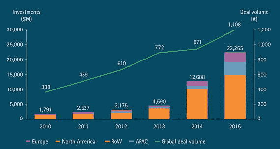
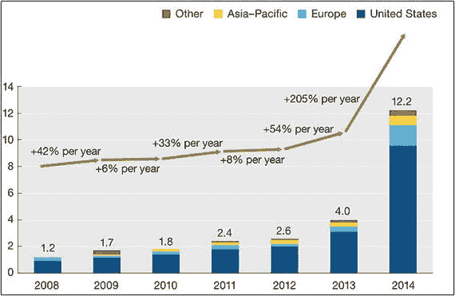

# 分片

2015 年初，在达沃斯世界经济论坛上，英国央行现任行长马克·卡尼对满座商界和经济学界最具影响力的声音表示，我们正面临银行业的“优步式局面”（爱德华兹，2015）。

卡尼是加拿大人，他之所以值得倾听，不仅因为他过去在私营领域的成就，更因为他当下所处的独特位置。作为英国央行第 120 任行长，在英国脱欧公投后的恐慌中，他必须迅速采取行动平息动荡。他如今面临的挑战清单令人望而生畏：维护伦敦作为全球金融中心的地位，防止英国脱欧后市场信心缺乏的恶性循环，平衡英国经济，避免经济衰退演变为萧条，并继续激发伦敦金融城的企业家精神。在正常情况下，一位央行行长能应对其中一两个目标就已满足。所以说他任务繁重，已是轻描淡写。

在达沃斯演讲一年多后，卡尼于 2016 年 6 月 16 日在伦敦金融城市长与银行家及商人宴会上再次发表了发人深省的讲话。在这次题为“推动金融科技转型：革命、复兴还是改革？”的演讲中，卡尼进一步指出，`FinTech`和`Blockchain`可能变革全球金融体系和英国经济。以下是他演讲的几段摘录，这些内容揭示了他对未来的愿景，巧合的是，也触及了本书此前讨论的一些主题：

- “金融科技……将改变货币的性质，撼动中央银行的根基，并为所有金融服务使用者带来一场不折不扣的民主革命。”
- “金融科技有潜力将银行业大幅拆解，回归其结算支付、期限转换、风险分担和资本配置等核心功能。这将意味着革命，从根本上重塑金融体系。”
- “……一些金融科技可能使现有银行更高效、更盈利，从而强化银行业现有的规模经济和范围经济。这将意味着复兴，巩固现有市场参与者的权力。”
- “这些力量的平衡可能产生第三种选择——一场改革——为消费者打造一个更多元、更具韧性、更高效的体系。在这个体系中，大型银行将与进入价值链各环节竞争的新玩家共存。”

演讲接着描述了年内将同步推进的五项举措，以推动银行业的`FinTech`转型。这些措施包括测试新的概念验证、使用分布式账本，以及启动一个`FinTech`加速器，旨在促进英格兰银行与选定的`FinTech`公司之间的合作关系。展示卡尼演讲摘录的目的，不仅在于展现他的前瞻性思维或对金融未来的愿景，更在于说明，银行业的碎片化已经在技术变革的巧妙体面伪装下悄然进行。

`FinTech`是金融科技（Financial Technology）的简称。在过去十年的大部分时间里，新兴科技公司得以利用数字技术，开发出更以客户为导向、交付成本更低且原生数字化的金融服务和银行产品。由于这些参与者不像银行那样受制于严格的监管合规要求，它们在特定市场拥有更大的运作空间。不受复杂遗留信息系统的束缚，它们具备更高的技术灵活性，从而更能适应市场变化。规模较小的它们通常专注于单一产品或服务，并把重点放在客户易用性上。最后，它们更契合过去十年塑造了社交媒体一代的点对点文化。灵活性、低成本和以用户为中心的策略使其迅速普及、取得惊人成功并实现巨大增长。

全球范围内，对`FinTech`企业的投资从 2010 年的 18 亿美元、2014 年的 126 亿美元攀升至 2015 年的 223 亿美元（埃森哲报告，2016 年）。而 2016 年可能更有前景，因为 2016 年第一季度的`FinTech`投资额较 2015 年同期飙升 67%，达到 53 亿美元（金融科技创新报告，2016 年）。2016 年第一季度，针对`FinTech`公司的`VC`融资共有 13 轮超过 5000 万美元，较 2015 年第四季度的 10 轮同等级融资略有增加（毕马威报告，2016 年）。此外，增长是全球性的。虽然北美领先，但亚洲（尤其是中国）和欧洲也正加大对该领域的`VC`投资（见图表）。

  
图 2-4. 全球金融科技融资活动（2010–2015）图片来源：《金融科技与演变中的格局：行业着陆点》，埃森哲（2016）。数据来源：CB Insights

  
图 2-3. 全球金融科技融资活动（2008–2014）图片来源：《厘清金融科技周遭的噪音》，麦肯锡（2016）。数据来源：CB Insights

这种广泛投资的原因在于其对多种金融服务产生的广泛影响。`FinTech`创新正在影响贷款、支付、资产管理、交易、资本市场、贸易融资甚至保险等服务。`Blockchain`也可以归入此类，因为它本质上是一种原生于价值交换的技术。但为简便起见，考虑到其独特性，我们将单独讨论它。

可以想象，这种投资水平也在商界和学术界的各个层面引发了好奇。我关于`Blockchain`的第一篇文章于 2014 年上线。自那时起，仅英语世界就出版了超过五十本关于`FinTech`和`Blockchain`的书籍。尝试在`Amazon`上用关键词“FinTech”或“Blockchain”搜索一下，观察结果。试图统计这段时间内关于这些主题的博客文章数量是毫无意义的。即使仅在`LinkedIn Pulse`这一个平台上，结果也多到无法计数。加上无数相关会议、演讲和圆桌讨论，像我这样资质的研究人员几乎不可能再写出关于这些主题的、提及某些此前未被提及的技术要点的原创文本。