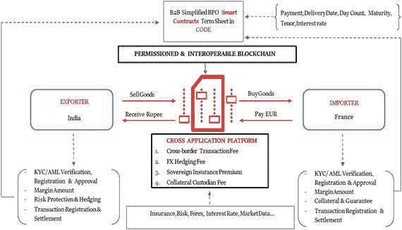

# 贸易融资的局限性及区块链解决方案

## 贸易融资的现有局限性

贸易融资领域现状的最后一个局限是其包容性不足。尽管新参与者正在进入市场并为中小企业提供服务，但这一趋势无法在全球范围内推广。这一点必须加以考虑，因为中小企业为欠发达国家的大量人口提供了就业机会。在整个经合组织地区，中小企业约占所有企业的 99%，并提供了 2/3 的就业岗位（经合组织，2010 年）。在西欧、日本和美国，中小企业贡献了总就业人数的 55%至 80%，而在巴基斯坦和肯尼亚，中小企业分别贡献了总就业人口的 80%和 60%（Katua，2014 年）。然而，由于缺乏为出口融资的周转资金、市场信息有限、缺乏标准化的互操作系统、无法联系潜在的海外客户，以及无法获得可靠的外国代理，这些地区的中小企业无法参与全球贸易舞台。最终结果是，全球对贸易融资的未满足需求高达 1.4 万亿美元⁷（亚洲开发银行，2015 年）（世界贸易组织，2016 年）。

## 作为技术解决方案的区块链

鉴于这些局限性，监管机构和政策制定者需要寻求技术解决方案来克服这些缺陷。显然，目标应该是创建一个具有特定标准、更具互操作性的系统，以确保信任并增强包容性。正是在这里，使用区块链最有意义。由于大部分贸易是以记账交易方式进行的，区块链可用于实时透明地获取贸易交易文件，包括发票、付款、所有权变更、海关文件和银行相关数据。这不仅会简化贸易流程，还能实现更好的数据匹配、更优的争议调解和更佳的信用风险管理。区块链的透明性还将实现更完善的审计追踪，这反过来有助于信用风险评估和欺诈预防，从而为所有进出口商创造一个更公平的竞争环境。

智能合约提供的自动化也将有助于减少贸易流程中的中介数量。随着交易和文件在区块链上交换，所有权的转移可以作为触发条件来执行贸易流程的下一步。当一方发起付款时，智能合约可用于将商品所有权转移给另一方。将智能合约与黑名单/制裁名单和禁运条款相连接的能力，将确保贸易在法规和政策规范内进行。随着航运业迎来技术转折点并为集装箱添加追踪芯片，区块链将允许在贸易融资流程中实现另一层次的物联网集成。由于智能合约允许即时触发效应，资金可以更早释放，从而实现更精细化的支付。例如，如果出口商和进口商之间的智能合约规定，例如，一旦货物通过海关清关，15%的资金将释放给出口商，这将降低交易的风险敞口，为出口商提供部分资金（这意味着更多的周转资金），增加供应链内的流动性，并抵销重复开票，从而在市场内建立更高水平的信任。最后，如果区块链和智能合约在市场上得到广泛应用，将能够升级现有的 IT 系统，并解决当前困扰这个市场的互操作性问题。

## 监管影响与安全担忧

正如数字化正在改变贸易融资领域一样，区块链为监管机构提供了一种构建新贸易融资框架的手段，以提高效率、减少纸质文件的使用、增强互操作性、自动化流程、刺激竞争，并让全球经济的更多部分参与进来。一些批评者可能会说，区块链的可扩展性和当前范围不适合这项任务。这在某种程度上是正确的，但正如我们所看到的，许多不同方面的进展正在取得（参见注释：“可扩展性”）。这些批评者需要提出的一个更重要的问题是，在近期事件发生后，他们是否应该满足于 SWIFT 系统提供的现有规定。2016 年 2 月，黑客利用当地安全系统的弱点，入侵网络，并在 SWIFT 网络上发送欺诈性消息，要求转账。黑客试图进行 35 笔银行转账，虽然其中大部分被阻止，但黑客仍成功转移了 8100 万美元。网络成员被要求升级其安全系统，随着调查的开始，大家认为最坏的情况已经过去。然而，2016 年 8 月底，SWIFT 网络发出一封信函，通知客户自 6 月以来，新的网络盗窃企图——其中一些成功了——不断出现。

> 根据路透社审阅的信函副本，“客户的环境已遭入侵，随后有人试图发出欺诈性支付指令……这种威胁是持续的、适应性强的、复杂的——而且还将持续下去。”（Finkle，2016）

正如一再提到的，区块链提供的不可篡改性和保护是解决此类安全问题最有希望的替代方案。基于区块链的贸易融资系统将减少中介数量，同时仍能执行相同的功能，但方式更安全、更透明。图 3-1 以图形摘要形式展示了其可能的面貌。

图 3-1. 基于区块链的贸易融资产品与收入模型

## 前进之路：监管与标准

但正如在借贷和支付市场部分所提到的，要使这样一个系统运作，需要在机构层面部署区块链。与其说是技术挑战，不如说真正的障碍还是监管。只要贸易融资机构不确定监管机构如何看待区块链的使用，它们就不太可能将其作为其流程中可互操作的核心支柱。监管机构需要提供具体的规则和标准，以帮助降低违反监管的风险，从而在发挥其所有优势的情况下扩大这项技术的使用规模。这并不是说该技术已经准备好部署。本书中提到了许多障碍。但监管机构需要承认，事实胜于雄辩，并决定如何行动。

值得庆幸的是，监管机构并不缺乏如何实现这一目标的参考。正如互联网的演变提供了一个历史参考框架一样，R3 联盟的原型平台`Corda`（见边栏 3-2）的持续开发，可以为监管机构提供一个当前运作模式，展示新的市场结构可能是什么样子。

边栏 3-2: R3 `Corda™`：一个作为未来市场框架的金融服务区块链

来源：《Corda：导论》，R.G. Brown, J. Carlyle, I. Grigg, M. Hearn（2016 年 8 月）