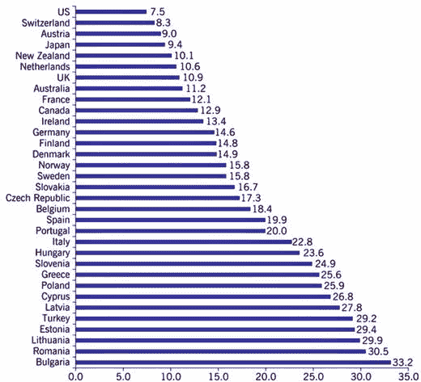

# 迈向无现金经济的复杂局面

就迈向无现金经济而言，情况十分复杂。自信用卡和借记卡问世以来，我们对现金的使用确实一直在减少。国际清算银行指出，在 19 个最大经济体中，流通中的未偿还现金量占 GDP 的比例从 2010 年的 8.4%下降到了 2014 年的 7.9%（Tett, 2016）。然而，这种下降并非在所有经济体中均匀发生。由于对银行的不信任、金融危机、负利率威胁以及非法活动（尤其是恐怖主义），日本、瑞士、欧盟和英国的现金流通量实际上反而有所增加（Tett, 2016）。但未来似乎准备改变这一趋势的某些部分。日益严重的恐怖主义和犯罪威胁正促使政策制定者移除大面额纸币。自 2016 年 5 月起，欧洲央行已停止生产和发行 500 欧元面额纸币，以应对这些非法活动。

然而，除了哈尔丹所阐述的原因和欧洲央行的动机之外，转向无现金系统对社会有益还有其他原因。首先是成本问题。根据帝国理工学院和花旗银行最近的一份报告，全球每年从自动取款机中取出的金额高达 13 万亿美元——几乎占全球 GDP 的 18%。这些以及诸如此类的现金操作带来了巨额成本。该报告的作者指出，转向无现金系统“即使仅将四分之一的纸质交易转为数字交易，也能节省高达 4000 亿美元的年开支，并带来强大的社会效益”（Davé, 2016）。

其次是逃税问题。现金使我们能够匿名进行交易，并向政府隐瞒我们的活动。用现金向非法劳工行贿或支付报酬，使犯罪者得以建立地下经济，逃避法律、法规和税收，同时继续进行其他形式的犯罪活动。哈佛大学经济学家肯尼思·罗格夫的研究证明，大多数国家中很大一部分（通常远超过 50%）的货币恰恰被用于隐藏交易（Rogoff, 1998, 2002）。这与大多数原则上可以被追踪的数字现金形式形成了巨大差异。

## 现金在犯罪中的作用

如果要谈论逃税，那么我们也需要重新审视实物现金在犯罪和重罪中的作用。如今，现金在两种环境中被使用：合法的国内经济和地下经济。各国央行的最新研究显示，消费者承认持有的现金量仅占流通中总货币量的 5%-10%（Stavins & Schuh, 2015）。波士顿联邦储备银行 2014 年在七个国家（加拿大、澳大利亚、奥地利、法国、德国、荷兰和美国）进行的一项研究表明，对于小额/低价值交易（5 美元、10 美元），现金是迄今最常见的支付工具；但对于较大额的支付，其重要性日益降低。

然而，对于地下经济而言，情况并非如此。地下经济不仅包括恐怖主义、毒品交易、贿赂、人口贩卖和洗钱等非法活动，还包括通过现金支付和雇佣非法移民进行的逃税。有些犯罪比其他更为严重，但无论犯罪类型如何，真正值得注意的是地下经济的规模，尤其是逃税的影响。

美国国税局进行的研究表明，企业主和公司为逃税而少报收入。截至 2015 年，一项研究发现，仅 2015 年一年，这就在联邦税收中导致了 5000 亿美元的税收缺口（已缴税款与应缴税款之间的差额）（Rogoff, 2016）。这部分金额中有一部分与存放在避税天堂的现金有关（参见哈罗德·克鲁克斯），但这仅占总金额的约 20%（Zucman, 2015）。超过 50%的未偿金额与现金密集型活动有关（Rogoff, 2016）。在其他国家也出现了类似情况。尽管具体数字可能不同，但欧盟国家拥有更严格的税法，这意味着与 GDP 相比的百分比值更为显著。图 3-2 有助于我们了解情况的严重性。

**图 3-2.** 地下经济（不包括所有犯罪活动）占 GDP 的百分比 来源：IZA World of Labor, Data and Calculations—“The shadow economy” F. Schneider (2013)

更严重的犯罪，如恐怖主义、贿赂/腐败、毒品和人口贩卖，大多是现金交易并涉及大量洗钱活动的严重犯罪。但与逃税相比，这些金额相对较小。

## 中央银行的悖论

鉴于这些现实情况，显而易见的问题是：既然中央银行知道现金为社会中的恶意和不良分子提供了便利，为什么它们仍在印制现金？答案一言以蔽之：铸币税。

铸币税是指货币的价值与其生产成本之间的差额。当使用商品货币时，铸币税是铸造硬币的面值与其所含金属的实际市场价值之间的差额。如果铸币税为正，则政府获得的收入本质上是利润。然而，对于法定货币，同样的公式并不适用。在法定货币体系下，铸币税收入体现在三个方面：

-   **第一**，收入来自货币的实物生产。虽然印刷一张 50 美元纸币的成本是 10.6 美分¹⁰，但这张纸币的实际价值是 50 美元。在 2006 年至 2015 年间，美国政府通过印制新钞并投放使用，每年赚取相当于 GDP 0.40%的收入，而欧洲央行每年赚取 0.55%（Rogoff, 2016）。
-   **第二**，当商业银行需要现金时，它们通过其在中央银行必须持有的准备金从中央银行购买现金。这反过来成为中央银行的收入来源，该铸币税来自于中央银行利息成本的降低，因为准备金需要支付利息，而现金则无需支付利息。
-   **第三**，商业银行也可以通过与中央银行签订回购协议来购买现金。作为交换，中央银行从商业银行购买证券。但商业银行必须在以后某个日期购回这些证券（因此称为回购协议）。因此，铸币税是在回购协议的回购阶段由中央银行赚取的（Dyson and Hodgson, 2016）。

由于政府对印钞拥有完全垄断权，它们从货币生产中获得了可观的利润。请记住，商业银行可以通过向消费者提供贷款来发行货币。但实物现金的印制仍然是政府的权利，纸币带来的收入相当可观，足以成为反对转向无现金系统的最有力论据。但考虑到现金助长的非法活动所带来的成本，铸币税所赚取的利润相比之下就相形见绌了。正如肯尼思·罗格夫在《现金的诅咒》（2016 年）中所言。

> 政府通过盲目迎合现金需求所获得的“利润”，与现金（尤其是大面额钞票）所助长的非法活动成本相比，显得微不足道。仅削减纸币对逃税的影响，即便逃税数额仅下降 10-15%，就可能抵消印制纸币所损失的利润。而对非法活动的影响可能更为重要。

仅凭打击犯罪和逃税这一点，似乎就足以成为迈向无现金经济的动机。对无现金体系的批评者众多，在哈尔德恩发表转向无现金体系的言论后，英国央行的其他成员（包括货币政策委员会的前成员）迅速对他提出批评，一些记者还称此举是“毛派中国的回声”（《金融时报》，2015 年）。可以肯定的是，即使我们转向完全无现金的经济，它也无法解决所有问题。但尽管如此，它仍然能实现当今无法实现，或只有通过加强监管、监督和政府成本才能实现的优势和可能性。为了确定转向无现金体系是否需要深思熟虑，以及我们需要达到何种无现金程度，让我们审视一下转向基于政府发行的、运行在`区块链`上的法定货币的货币体系可能带来的后果。

## 运行在`区块链`上的法定货币

如果央行能够完全控制货币创造，而非私营部门，那么它们就可以向个人和公司提供官方数字货币（就像它们已经提供现金和硬币一样），而不是商业银行的存款。这可以通过两种方式实现。要么央行直接向公众提供存款账户，要么商业银行提供由央行准备金全额支持的账户（这与之前讨论的 100%准备金银行模式类似）。

问题在于，我们为何要沉溺于这样的转型？答案是多方面的。显然，它能在一定程度上让政府解决上述逃税及其他此类犯罪的问题。但对于正规经济而言，其影响将更为深远。这种货币模式将摧毁私营银行基于债务存款的融资模式，并改变它们在社会中的职能。它们仍将充当借贷双方之间的直接中介，并向家庭和企业提供投资产品，但广义货币供应量将更直接地由央行控制，使其独立于私营部门的借贷决策。以主权数字现金或运行在`区块链`上的法定货币形式存在的广义货币供应量越大，央行就越容易使用负利率或直升机撒钱等工具（在全民基本收入部分详细讨论）。强调这两种经济工具很重要。负利率和直升机撒钱是古老的理论，已受到研究和批评一段时间。但鉴于技术性失业和老龄化社会，它们在未来可能变得不可或缺。

在过去几个月中，构建这样一个框架已坚定地成为主流议题。2016 年 7 月，英国央行发布了一份长达 90 页的报告，题为《央行发行数字货币的宏观经济学》。作者约翰·巴尔德尔和迈克尔·库姆霍夫（侧边栏 3-4 中描述的《芝加哥计划》报告的共同作者）研究了一个发行央行数字货币的许可制货币体系的创建及其后果。作者校准的`DGSE`模型基于新凯恩斯货币模型（包含名义和实际利率以及通胀效应），但在两个方面有所不同。

第一个不同点是，该模型纳入了部分准备金银行体系，并承认了基于债务的货币的存在。作者认为，这样做的原因“是因为（商业）银行作为货币交易媒介提供者的关键作用，这些媒介将在现实世界中与央行数字货币竞争。”因此，作者在模型中囊括了家庭、金融投资者、工会和银行（连同制定货币和财政政策的政府）的支出与投资特征，从而声明并承认了私营部门货币交易的需求。在该模型中，私人货币与政府货币按 1:1 的汇率存在（100%准备金）。

第二个不同点是，他们的模型不将政府货币视为经济的外生变量。作者指出，他们的模型允许非银行私营部门持有央行数字货币（这在当前是不存在的），并且与普通现金不同，这种数字货币是计息的。因此，它可以与内生创造的商业银行发行的货币竞争。

基于这些假设建立了数字货币框架后，下一个问题是数字货币的发行数量。他们的模型显示，如果我们制造并注入相当于 GDP 30%的主权数字货币，由于利率和税率降低以及交易成本节省，GDP 将增长 3%（他们选择 30%，是因为其规模与过去十年央行实施的量化宽松相似。他们的`DSGE`模型经过校准，以匹配危机前美国的经济状况）。

此外，作者发现，这种制度将为政策制定者提供一种稳定商业周期的新工具。由于数字货币的数量和/或价格可由政府调节，这将使他们能够利用这种灵活性，以逆周期的方式应对不断变化的商业周期。虽然当今的货币供应依赖于私人借贷决策，但在私人货币需求波动的经济冲击时期，拥有控制现金价格和数量的政策工具将变得特别有效。通过这种方式，主权数字货币提供了更好的金融稳定性。通过进一步的实验（报告非常详细），作者能够确定引入主权数字货币将产生的众多后果。

