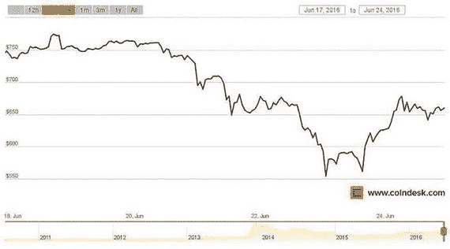
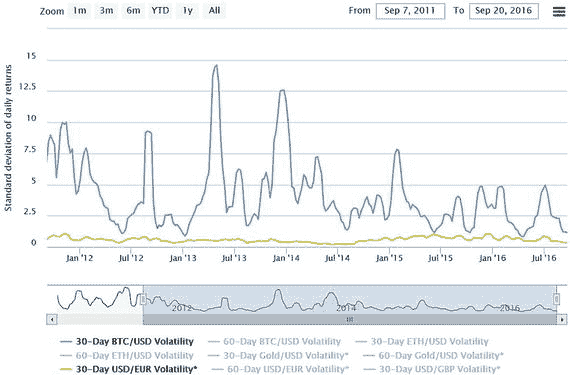

近期两部著作中描述的理念与方法，使我们得以一窥：若转向基于主权无现金区块链的基础设施，并采用100%准备金制度，货币政策将如何执行。这些方法或能为政策制定者当前在提升履职生产力与效率方面所面临的僵局，提供重要解答。它们还将促进金融包容性、提升透明度，并降低系统性风险。然而，转向100%准备金支持制度仍需审慎考量。部分保留意见已在侧边栏3-4的结论部分描述，其中我们读到了《芝加哥计划》。首先，仅依靠央行100%准备金无法解决私人信贷过度创造的问题，因为如果消费者感到受限，他们可能创造并使用新型金融工具来绕过这一体系。其次，即便现有债务被准备金取代，也意味着将出现赢家和输家。第三，政府在掌管货币创造方面的记录并不光彩，且存在利用此权力谋求短期政治利益的风险。我们需要找到一种管理债务数量与类型的方法。与其依赖中央全额准备金银行模式，答案是否在于多种货币共存？

## 无现金环境下的多种货币

关于私人货币发行的文献数量庞大。私人现金最坚定的支持者之一是奥地利经济学家弗里德里希·哈耶克，他认为私人主体可以利用市场创造兼具价值储存和记账单位功能的货币。在哈耶克看来，私人参与者无需政府干预即可创建稳定的货币体系。他认为，政府应允许公民使用自己选择的货币，并允许企业家通过创建数字货币和铸造商品货币在货币领域进行创新（`Hayek, 1976`）。

但以太坊和比特币等货币并非商品货币。它们可被视为私人发行的法定货币，本质上属于信用货币——即无商品支撑，且不能兑换为任何其他资产。尽管这些货币在去中心化网络上转移价值十分有效，但从经济学角度而言，由于与常规法定货币存在差异，其履行货币三大职能¹⁴的能力已受到质疑。这些差异包括：

**波动性**：比特币等货币的价格波动一直是持续辩论的主题，导致分析人士评论称，由于存在大幅价格波动，该货币永远无法成为良好的价值储存手段。这确是事实，但若观察过去五年的波动性，可见其已逐渐趋于稳定。截至撰写本章时（2016年9月），30日`BTC/USD`波动率为1.16%，而30日`USD/EUR`波动率为0.32%。2015年9月至2016年9月间，`BTC/USD`波动率在4.93%的高点与0.32%的低点之间震荡，而`USD/EUR`波动率则维持在0.67%至0.32%的区间内（图3-3）。实际上，比特币尚未像主权法定货币那样稳定，但随着网络效应和用户基础扩大，其波动性正逐步降低。值得注意的是，英国脱欧公投宣布后比特币价格激增（图3-4）。加密货币的价值变化仍令人担忧，因为这削弱了其购买力及作为长期储蓄工具的功能。

```

```

图3-4. 英国脱欧公投宣布后不久比特币价格飙升（2016年6月23日）
来源：CoinDesk ([`http://www.coindesk.com/bitcoin-brexit-ether-price-rollercoaster/`](http://www.coindesk.com/bitcoin-brexit-ether-price-rollercoaster/))。访问于2016年9月

```

```

图3-3. 过去五年`BTC/USD`与`USD/EUR`波动率对比
来源：比特币波动率指数 ([`https://btcvol.info/`](https://btcvol.info/))。访问于2016年9月

**法律地位**：根据欧洲央行的观点，从法律角度看，货币是指在一个国家/地区内普遍使用的特定货币形式。由于加密货币未被广泛用于价值交换，故不被视为货币，也不构成通货。其结论是：没有一种虚拟货币是真正的货币。

关于何种货币可被接受的法律定义，似乎取决于其作为价值转移方式的法律解释。用于支付的货币包括欧元纸币和硬币，它们在欧盟国家被视为“法定货币”，因此根据法律，在这些领土内必须被接受用于偿还债务。然而，欧元银行货币或电子货币（e-money）并不被视为法定货币。尽管如此，这些货币形式仍被广泛选择用于各类支付。因此，欧元作为一种货币可能采取纸币、硬币和电子货币的形式（`ECB, 2015`）。

尽管对什么可以被合法视为货币有着基于选择的解释，但同样的规则并未延伸至加密货币，因为它们使用自己的面额，即它们并非某种特定货币的电子、数字或虚拟形式。它们与已知货币不同，并且由于没有任何一种被宣布为某个国家的官方货币，它们不具备法定货币地位。因此，没有债权人必须接受用它来支付以解除债务人的债务（`ECB, 2015`）。这意味着虚拟货币只能作为“合同货币”使用，即当买卖双方达成协议接受某种虚拟货币作为支付手段时（`ECB, 2015`）。

围绕加密货币的法律术语在美国更为复杂，其差异取决于：使用方式（是否属于`SEC`、`CFTC`或`FinCEN`的管辖范围？）、使用地点（取决于各州。例如，纽约已开始提供商业许可证（`BitLicense`），要求虚拟货币公司遵守特定的许可制度），以及使用者（矿工、银行、用户、交易所……）。在其他国家，情况类似，目前对于加密货币的法律地位尚未达成共识。¹⁵ 加密货币的定义和法律接受度是其大规模使用的主要障碍。

除了这两个障碍，加密货币与国家法定货币之间还存在其他差异。从法律角度来看，法定货币的接受度决定了货币的使用。中央银行已经在各自国家内部与其他中央银行发行的货币竞争，而对于国内央行来说，私人货币本质上是一种外币，因为其货币政策由国内政府管辖之外的实体所掌控（`Andolfatto, 2016`）。但细节决定成败。中央银行发行的货币是法定货币，并受法律约束，确保其在国内的接受度。如果国内各方决定使用另一种货币而非央行发行的货币，那么这些法律便不适用。因此，如果双方使用国家货币以外的货币签订了合同协议，国家在任何债务违约（例如）情况下都不负有任何法律责任。¹⁶ 这是格雷欣法则的基本论点：劣币驱逐良币。这也是中央银行在货币供应方面拥有垄断特权，以及现金生产和供应在货币政策中占据核心功能的原因。

然而，私人法定加密货币的供应是以另一种方式计算的。由于私人货币创造者本质上是在发行代币，而这些代币本身毫无价值，其价值基于稀缺性、实用性和声誉。由于代币是唯一且不可伪造的，网络内的每个用户都能够验证流通中的总数量，并见证用户之间的资金流动。因此，货币供应由利润最大化决定。当用户见证其他用户的转账流时，他们会形成关于私人法定货币交换价值的信念体系，并改变其行为（储蓄/支出）以保护自身利益。因此，利润最大化和私人货币的货币政策起到了相同作用（`Fernández-Villaverde 和 Sanches, 2016`）。

私人货币与国家法定货币供应方式上的差异，是决定它们如何在共同国家内竞争的关键问题。费城联邦储备银行和宾夕法尼亚大学的研究人员近期的一些工作突显了这种差异的后果。在一篇题为《货币竞争可行吗？》（2016年4月）的论文中，`Jesus Fernandez-Villaverdea` 和 `Daniel Sanches` 使用了一个定量模型¹⁷来研究私人货币与政府货币混合情况下的货币可能性。

首先，作者发现，当一个经济体中仅存在多种私人货币时（如哈耶克在《货币非国家化：论点精炼》中所提议），可以达到一个均衡点，在此点上私人货币的实际价值保持不变。然而，这种均衡状态是暂时的，随着时间的推移，私人货币的价值开始下降。此外，由于私人行为者的利润最大化努力，纯粹的私人货币体系也容易像国家发行的货币一样出现恶性通货膨胀。结论是，纯粹的私人货币体系无法提供社会最优的货币数量。

其次，当作者修改模型以模拟私人货币与政府法定货币共存时，只有政府保持其货币供应量恒定，才能实现两种货币的价格稳定。在现实世界中，政府需要采取扩张性和紧缩性政策来应对市场和政治变化。因此，政府将不得不偏离维持恒定供应的做法，这使得私人货币与政府货币的共存成为一种不稳定的交换媒介。

多种货币并存所带来的波动性、法律问题和供应复杂性，进一步因税收挑战而加剧。当政府发行货币时，它们也会通过法定货币法律。这些法律为货币传输提供了许可要求，以间接监管来自竞争货币的威胁，从而使政府更容易打击逃税和洗钱行为（`Raskin 和 Yermack, 2016`）。如果使用多种货币，则需要一个监控系统，以便基于所有流通中的货币进行适当征税。

现有关于主权现金和多种货币混合体系的证据似乎表明，如果我们转向一个通过区块链发行货币的无现金货币体系，那么单一货币将更容易适应。当然，这只是基于现有数据的一个工作假设。随着网络效应和加密货币使用规模的不断扩大，我们可能需要重新审视这一假设，并根据不断变化的市场趋势进行调整。

有些评论家认为，像比特币这样的私人货币很快将不复存在。但没有任何证据证实这一观点，网站“Bitcoin Obituaries”¹⁸提供了一些有趣的证据，证明这些观点是如何被证明是错误的。在关于多货币操作的网络科学领域，正在探索一些新的研究（见注释——多重货币机制）。尽管如此，从大规模区块链应用的角度来看，在当前时间点，更明智的做法是继续研究在区块链上使用单一政府发行的法定货币。