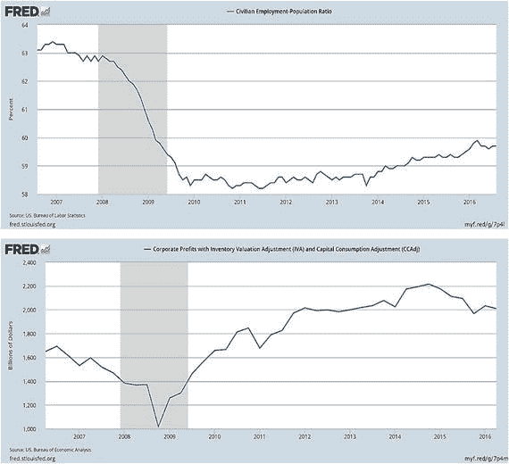

# 个人观点与货币发行

就个人而言，我倾向于继续采用以单一主权货币发行者为中心的方法，是因为我个人认为市场金融化的加剧带来的问题多于好处。这似乎与去中心化的精神（这正是区块链的全部意义所在）相悖，但鉴于过去三十年来我们所目睹的金融丑闻和彻头彻尾的犯罪行为，个人利润最大化似乎总会产生社会利益错位的圈子，以及投机取巧、不择手段的玩家。关于富国银行虚假账户及信用卡/借记卡发行丑闻¹⁹的持续发酵，只是又一个例证，说明那些负责我们金融安全的人如何为了快速赚钱而背弃了他们的职责。

货币与其他产品不同，因为它一旦发行就提供即时的购买力。监管机构的工作节奏可能较慢，但其工作的重要性不应因不耐烦和个人臆想的阴谋论而被忽视。我们需要的是清晰透明，而区块链提供了这一点。在此基础上，在思考货币问题时，我倾向于支持基于对国家信任的民主货币发行体系，而不是为私人铸币者建立多层信任。然而，这只是个人观点，并非我向读者倡导的理念。我的目标是提供信息，以引发当前关于货币体系运作方式讨论方向的变化，而任何讨论都必然始于分歧。如果未来有证据证明我是错的，我会乐于调整我的信念体系（或许还会写一本关于此事的书）。

总之，所审查的证据似乎支持这样一个结论：货币发行的角色是国家最能履行的职能。正如英国散文家沃尔特·白芝浩在一个多世纪前（1873 年）在自由银行制度的背景下所言：

> “我们如此习惯于一个其核心功能依赖于单一银行的银行体系，以至于几乎无法想象其他体系。但自然的体系——如果政府不干预银行业，本应出现的体系——是许多规模相等或不完全相等的银行……我会立刻被问到：‘你是在提议一场革命吗？你是在提议放弃单一准备金体系，创建一个新的多重准备金体系吗？’我的直白回答是：我并不提议这样做；我知道那是幼稚的……一个以英格兰银行作为其轴心和基础的庞大信贷体系如今已经存在。英国人民和外国人都深信不疑……这一切都建立在由使用和岁月所产生的本能信心之上……如果某种灾难将其摧毁，至少需要几代人才能对任何其他同等体系产生同样的信任。如果某种奇迹将一个多重准备金体系置于伦巴第街，那在那里会显得怪异。没有人会理解它，也没有人会信任它。信贷是一种可能成长，但无法被构建的力量。”（弗里德曼和施瓦茨，1987）

归根结底，在思考改变货币发行和使用不同货币时，问题不在于价值如何转移。问题在于信任如何被取代。

## 一种数字货币统治一切——财政政策取代货币政策？

区块链突显了一个事实：现有的货币创造结构和政策制定参数是为前互联网时代构建的。随着世界进入无现金环境，需要制定适应于此的政策。但需要做出的改变不仅仅涉及货币设计的技术基础。鉴于长期的低利率、飙升的债务水平、高赤字和疲弱的经济增长，我们还需要重新思考如何理解货币和宏观经济政策，以及转向完全无现金经济是否能帮助我们解决这些问题。没有这种追问，区块链就只是破旧棚屋里一件闪亮的新工具。

让我们首先看看为什么我们需要去现金化，以及这样做的最大后果是什么。本章前面提供的证据（参见“区块链上的法定货币”）从货币政策角度列举了转向无现金系统的诸多优势。但需要考虑的要点是负利率。

如果央行负债是数字化的，那么对准备金支付负利率（本质上就是收费）将是一件相当简单的事情。但只要货币可以从电子存款转换为零利息的现金，就很难将利率降低到（例如）-0.25%至-0.50%以下，并且更难长期维持。因此，纸币使得央行难以将政策利率大幅降至零以下，再加上零下限，这意味着央行在需要时无法像他们希望的那样控制利率。

对某些读者来说，支付负利率的概念可能看起来与货币政策的功能不一致。但可以说，这与通货膨胀并无太大不同，通货膨胀同样会降低货币的购买力（罗格夫，2014）。如果通胀变得不稳定，那么采用负利率将是更好的方法。

过去一年负利率成为新闻的主要原因，是过去几年（大多数发达国家）持续的超低通胀和接近零的利率。当通胀过低时，政府更难应对，尤其是当利率趋近于零下限（也称为“流动性陷阱”）时。其次，自危机以来，全球市场经历了更大的经济波动。波动越大，经济体就越可能面临需要央行降息的严重衰退（罗格夫，2016），因此我们也就越可能需要采用负利率。第三，新兴经济体储蓄倾向的增强，加上发达经济体人口老龄化，产生了减少投资的净效应，从而进一步使低利率长期化。这正是本·伯南克在假设“全球储蓄过剩”时所暗示的。正是由于这些原因，央行行长们一直在实施负利率并就其使用进行辩论。

由于该政策工具长期使用的罕见性，其是否能有效解决低通胀和近零利率问题仍有待观察。负利率仍是一项实验性政策，理论上可能有效，但无人能确定如果利率大幅为负会出现何种问题。政府理论上可以通过对公民持有的现金征收零散的小额税款来规避负利率。即使我们逐步淘汰现金并实施负利率，税务问题或法律障碍等其他复杂情况也可能出现并威胁稳定。但鉴于当前低通胀和低利率的现状，政策制定者或许需要利用这一杠杆，而要在整个经济体层面推广，无现金系统是最有效的途径。

向无现金系统的转变也将挑战我们对货币理论的正统观点。根据正统观点，政府支出应受其通过税收和借贷获得的收入约束。如果允许政府发行超过经济产出的法币，就会导致过多货币追逐过少商品，最终引发通胀。因此，政府不应被允许随意“印钞”。相反，为了补充支出，正统理论规定政府应借贷，但只能在一定限度内；因为如果借贷过多，政府将与私营部门争夺资金，从而推高利率并抑制私人贷款和投资。因此，正统观点将法币视为外生实体，其供给量相对于产出会影响商品价格。基于此，货币供给需要受到控制，并且是控制通胀的核心（Wray and Nesisyan, 2016）。

但正如我们在第 1 章中看到的，在部分准备金银行体系下，法币供给并非如此决定，央行在创造货币方面也并非主导者。当商业银行向消费者提供贷款时，货币就被创造出来。因此，是贷款需求决定了货币供给。因此，法币对经济而言是内生的，而非如正统理论所述是外生的（Wray and Nesisyan, 2016）。这种关于货币供给的内生视角被称为现代货币理论。

理解货币的外生与内生功能之间的区别至关重要，这有助于我们理解政府不必依赖商业银行来创造货币，也不受制于部分准备金银行体系。为阐述这一点，我们需要将讨论回到税收问题上。虽然正统理论认为政府只能根据其税收和债务收入进行支出，但现代货币理论指出，政府在支出前并不需要税收收入。事实上，如果纳税人必须用政府法币缴税，那么政府必须先进行支出，然后才能收税。换句话说，政府以主权法币征税的能力，使其在决定货币供给方面具有优势。税收支付和债券销售（政府贷款）发生在政府支出之后。

关于货币的内生与外生角色，以及正统理论与现代货币理论的比较，Randall Wray 和 Yeva Nesisyan 在他们的著作“Understanding Money and Macroeconomic Policy²⁰”（2016 年）中，结合政府收支平衡进行了详细阐述。在他们的研究中，作者得出了三个结论：

第一，一个发行自己主权货币的国家不受财务约束，其支出并非由税收和贷款收入提供资金，因为政府支出必须先于税收征收和债券销售。因此，政府不受财务约束，而是受资源约束。如果政府支出超过产出，就会发生通胀。但通胀源于过度支出，而非货币本身过多。支出如何融资并不决定通胀。因此，问题变成了政府应如何支出？政府可能有合适的理由来抑制支出，但“资金短缺”不应成为理由之一。

第二，由于要创造的货币数量基于货币的总需求，因此正统观点认为央行可以通过利率和准备金数量来控制经济是错误的。根据现代货币理论，利率控制才是央行唯一可用的工具。最后，作者指出，由于货币供给本质上是政府决策，货币政策实际上就是财政政策。由于财政政策可以直接刺激总需求，政府实际上拥有强大的支出控制能力。用他们的话说：

> “……财政扩张可以在不恶化私营部门资产负债表的情况下提高需求；事实上，政府的赤字支出通过提供收入和安全的政府负债供投资组合积累，实际上改善了私营部门财务状况……拥有货币主权的政府不受财务约束：它们通过发行自己的借据（货币）进行支出。它们可以利用这种能力购买实际资源，并以此促进充分就业。”

在本章开头，我们问了自己一个问题：在市场、监管和政策的背景下，资本主义的定义是什么？正如我们所看到的，资本主义的这三大支柱正处于变革状态，它们赖以运作的当前定义和意识形态正受到挑战。此外，越来越明显的是，随着技术变革的速度和影响持续加速，任何新的定义都必须能够适应未来的影响。

我们需要的是对资本主义的重新思考。自危机以来，政策制定者一直在重新思考这一概念。若非如此，我们就不会有量化宽松和量化质化宽松等帮助我们避免全球萧条的举措。然而，现在尘埃落定，我们需要审视这些行动并评估其有效性。

让我们以量化宽松（`QE`）为例。量化宽松之所以有效，是因为长期低债券收益率推高了资产价格。这刺激资产持有者增加消费或投资，因此必然会加剧不平等（Turner, 2015）。我们也可以看看持续的低利率。虽然超低利率的目标是刺激支出，但更有可能的是，在刺激经济需求之前，它们会鼓励高风险和杠杆化的投机。而且，它们只能通过鼓励私人信贷增长来刺激需求，而这正是我们问题的根源。

私人信贷的增长导致了金融化，并使信贷从实现未来繁荣的手段转变为可交换价值的商品。这一转变的核心是分类上的冲突。货币和信贷属于不同的产品类别，因为它们不同于商品、货物和服务。货币和信贷的创造会产生购买力，进而带来宏观经济影响。这与基于技术创造新产品或服务截然不同。因此，将主导商品和服务生产的自由市场原则应用于信贷和货币供应，从根本上就是有缺陷的，这也凸显了货币政策的危险性和局限性的本质。正是出于这些原因，我们需要将目光转向财政政策。

政策制定者需要明白，如今他们有能力利用技术在市场上获得更具决定性的地位，并且通过合理运用财政政策和监管，他们可以建立一个更加民主和透明的货币体系。像“芝加哥计划”这样的构想已经存在了很长时间，但借助区块链等技术，我们现在有能力在社会层面利用它。这并不是说我们应该立即转向 100% 的储备金体系。根据贝内斯和库姆霍夫提出的计划，转向 100% 储备金体系还需要注销大量债务。在这种情况下，必然会有赢家和输家。因此，应该设想一种方式，既能随时间逐步减少现有债务，同时新的银行业务又能遵循芝加哥计划的原则进行。一种选择可能是对或有可转换债券（参见注释：“CoCo 债券与区块链”）进行改良应用，这种债券允许将债务转换为股权。

如今，由于我们的债务水平过高，进行反映这些原则的改革至关重要。我们必须认识到，市场力量并不会自动发行最优数量的信贷，也不会让信贷用于恰当的目的。我们需要摒弃那种认为信贷创造可以交给市场、并且部分准备金银行体系可以继续以目前形式运作的观念。

干预不应针对信贷的发放，而应针对其创造的数量。然而，更少的信贷并不意味着更少的增长。正如我们在前几章所见，如今大量信贷并未用于经济增长，而是投资于住房/房地产。因此，它并没有按比例增加需求，反而导致了债务积压和经济衰退。因此，政策制定者的主要目标应该是创造一个信贷集中度更低的经济。如果没有这些措施，资本主义就是一个由低效监管和政策支撑着的、滴答作响的定时炸弹。

正如斯蒂芬妮·凯尔顿在《紧缩政策的失败：重新思考财政政策》（2016 年）中所说：

> “在放松对金融（及其他）市场的严格监管的同时，过去三十年间几乎所有经合组织国家都大幅降低了税收。高收入者的平均边际所得税率从 1981 年的 66% 下降到 2013 年的 43%。同期，平均企业所得税率也大幅下降，从 47% 降至 25%，而股息收入的税率则从 75% 降至 42%。这些供给侧的操作非但没有释放就业创造者、让繁荣惠及所有人，反而与日益加剧的不平等和更大的金融不稳定性密切相关。换句话说，这些实验都失败了。资本主义变得更加不稳定，财富和收入分配变得更加不平等，而每次我们遭受经济衰退后，系统需要越来越长时间才能恢复所失去的工作岗位。”（Jacobs 和 Mazzucato，2016 年）。

转向基于芝加哥计划原则的、主权性的、无现金的、基于区块链的货币基础设施，是政府不仅能够降低债务水平，还能重写宏观经济和治理规则手册的一种方式。政策的作用不仅仅是纠正和惩罚自由市场参与者的越轨行为。它同样在于塑造市场，以获得正确的资源配置、长期的价值创造、社会福祉、降低不平等，并确保环境的可持续性。短期的 `GDP` 增长不能再成为政府的主要目标。

因此，随着资本主义的定义开始更多地包含民主国家，我们也应该利用这个机会，思考如何解决技术性失业、教育、生产力变化、不平等以及年龄歧视等问题。一个可能的解决途径在于“直升机撒钱”和全民基本收入。

### 直升机撒钱与全民基本收入

重温一下记忆，想想你上一次听到这些“关键词”是什么时候：技术性失业、收入不平等、工资停滞、贫困、监管僵局。如果你经常关注新闻，那么你很可能几乎每周都会听到这些术语。

但这些术语本质上是宏观的，涉及多种社会经济或政治议题。在思考这些问题时，我们很容易迷失方向，因为海量的数据和观点（大多是无关紧要的）无法为日常事件提供稳定的锚点，使我们忽略了根本问题。问题……本身就是问题。因此，让我们关注一个与所有这些关键词都相关的特定实体，看看这个单一实体的最新发展如何与当今热议的各种行话联系起来。我们选择的实体是聊天机器人。

`Chatbot`（聊天机器人）本质上是一种由规则和人工智能驱动、用户可以通过聊天界面与之交互的服务。这项服务可以是任何东西，从功能型到娱乐型，它可以存在于任何聊天产品中（`Facebook Messenger`、`Slack`、`telegram`、短信等）。自然语言处理和自动语音识别的最新进展，加上众包数据输入和机器学习技术，现在不仅允许人工智能理解词组，还能针对词组提交相应的自然回应。这基本上是对话的基本定义，只不过这段对话是与一个“机器人”进行的。

这是否意味着我们很快就会拥有能够通过图灵测试的技术？也许还没有，但聊天机器人似乎正在朝着这个目标前进。当今最先进的聊天机器人是微软开发的`小冰`，它可以像人类一样回答问题、提问和表达“想法”。例如，如果用户发送一张脚踝骨折的照片，`小冰`会回复一个问题，询问伤势造成的疼痛程度（Slater-Robins，2016）。

毫不奇怪，聊天机器人正越来越吸引投资者。根据`Tracxn`（一家由红杉资本和 Accel 校友创立的全球追踪风险投资、企业投资和创业活动的市场研究公司）的数据，自 2010 年以来，已有超过 1.4 亿美元投资于聊天机器人，其中大部分（约 8500 万美元）是在 2015 年至 2016 年期间投资的（Tracxn，2016）。这种兴趣不仅体现在金融领域，今天几乎任何行业都可见：酒店业、新闻业、医疗、保险、旅游、零售、汽车、娱乐等（CB Insights，2016），并且正在催生一波新的公司，如`X.AI.`（人工智能日程助手）、`Clara Labs`、`Julie Desk`、`Kono`、`Overlap`、`Babylon Health`、`Ozlo`、`Maluuba`、`GoButler`、`Your.MD`、`Arya`（研究助手）等等。正如 Business Insider 最近的一份报告所述：

> “聊天机器人也有可能帮助企业大幅削减劳动力成本。虽然完全自动化客服人员队伍并不可行，但在美国，通过聊天机器人和其他自动化技术尽可能实现客户管理和销售职位的自动化，将带来可观的节省。”（“聊天机器人解读”，BI Intelligence，2016 年 7 月）

对话曾经是人类独有的活动，但随着聊天机器人的兴起，这一准则正受到考验。聊天机器人的发展只是技术如何取代人类从事那些本质上是人本中心工作领域的一个例子。那么，让我们重新审视本节开头提到的那些关键词，不过这次是从聊天机器人的语境出发。随着聊天机器人的出现，现有的呼叫中心员工会面临怎样的就业情况？Gartner 预测，到 2020 年，这种类型的对话自动化将管理 85%的企业客户关系（Busby，2016）。这可能会影响多少人？仅在美国，就有 500 万人受雇于呼叫中心，而在印度和菲律宾等国，呼叫中心为数以百万计的人提供了就业机会。那么，当这项技术取代劳动力时，它将对收入不平等、工资水平和贫困程度产生什么影响？

引用这个例子的目的，并非为了找到问题的答案。更多的是为了帮助我们认识到，如果我们拆解一项单一技术的结构，它会揭示出一系列溢出效应，而我们当前对资本主义的定义不仅无法预见这些效应，更遑论提供应急预案了。如果我们对其他技术也进行同样的分析，类似的启示也会随之而来。它还会向我们展示，我们对“收益”的概念有多么上瘾，而对溢出效应却漠不关心。想想看。你上一次听到经理大声说“我怎样才能增加员工数量？”是什么时候？

这让我们又回到了本章开头讨论的话题（参见边栏 3-1）。虽然起初我们是从市场、监管和政策——资本主义的支柱——的角度来看待技术，但审视单一技术分支的细枝末节却得出了相同的结论。技术对就业的影响是房间里显而易见的大问题。此外，随着技术不断发展和演进，它为少数人（他们从中榨取租金控制权）带来利益，同时在此过程中消灭了劳动力。图 3-5 中的图表来自圣路易斯联邦储备银行。它们帮助我们看到了这一过程中的范式转变。请注意自危机以来，就业和企业利润是如何呈现出截然相反的轨迹的。

图 3-5. 过去 10 年就业与企业利润对比图

这种趋势是可以预见的。劳动力是公司最大的支出，如果你能摆脱劳动力并用技术取而代之，在其他条件不变的情况下，利润就会上升。但这种影响并不仅限于利润率。当某个行业的人员被大规模地用技术取代时，显然会导致该行业的失业，同时也会导致类似或相关行业的就业不足²²。这会产生连锁反应，因为当高技能工人被迫去申请低技能工人的工作时，就会为边缘化群体创造一个自我维持的贫困循环，压低各行业的工资，增加国家负担，并影响货币和财政政策。因此问题就变成了：资本主义如何应对技术进化这一庞然大物？

技术与创新有着胚胎般的联系，而创新常被奉为解决任何行业问题的万灵药。但在创新的语境下，市场与政府之间的联系常常被边缘化。正因为如此，当我们谈论创新，特别是那些将取代认知性和重复性体力劳动的工作时，我们还需要讨论它对资本主义的影响（见边栏 3-1）。需要记住的是，随着劳动力规模的减少，工资也会降低或停滞。虽然这几乎使工人阶级无法为自己提供保障，但这也是央行行长们担忧的问题，因为随着人们失业，这将减少总需求，加剧收入不平等，并扩大储蓄与投资之间的差距，进而迫使借贷成本（即利率）下降。总而言之，技术创新在推动社会前进的同时，也在将我们推向零下限。

正是出于这个原因，我们需要推翻当前关于资本主义生活叙事的主流范式。当今的主流范式是，私人创造的财富被国家用于社会目的。但这是一种谬误，因为实际上，财富的生产是社会性的和集体性的，然后被私人占有。为了解释这一点，让我们做一个简单的实验。环顾四周，选择一样技术产品。它可以是周围的灯，你读这本书的平板电脑，或者是你时刻随身携带的智能手机。现在，你已经选择了一项技术，请彻底拆解它，并追溯它所嵌入的每一项技术的起源。你会发现，在每一种情况下，如果没有政府资助，你所分析的技术就不可能存在。即使是区块链也是如此。虽然区块链最初是由一个人/团体（中本聪）创造的，但它代表着密码学、加密技术、经济学和博弈论等领域数十年的研究和发展——所有这些领域都得到了政府的大力资助。如果没有`ARPANet`，文特·瑟夫和鲍勃·卡恩就永远不会获得开发数据包交换技术的必要资金，如果那样的话，你也不会读到这本书。

因此，技术的发展是财富的集体创造，正是出于这个原因，我们需要扭转资本主义的叙事，表明自由市场与国家之间没有分离。没有国家就没有市场，没有国家就没有资本主义。但没有私人企业家也就没有国家。因此，市场与国家之间的关系是共生的，认为它们是独立的实体是错误的。

遵循这个思路，我们就能看到，既然技术是由国家的集体努力发展而来，并导致了财富的生产，那么贡献者（公民）从他们的投资中获得红利就合情合理了。我所说的这种红利就是全民基本收入。

UBI 是一种无条件授予政治共同体每个成员的收入。根据基本收入地球网络的标准，在谈论 UBI 时需要遵守以下标准：

1.  这是一种为确保生存和允许社会参与而给予的收入。
2.  它是一种个人权利主张，支付给个人而非家庭。
3.  无需经过经济状况调查核实即可支付。
4.  没有工作义务。无论是否有其他来源的收入都会支付。
5.  支付时不要求履行任何工作或愿意接受提供的工作。

虽然全民基本收入的概念并非为解决技术性失业而设计，但它正日益与当前的经济流散问题产生关联。它本质上是一种保障性工资，每月发给每个人，无论他们做什么、如何生活。这是公民与国家之间的一项无条件契约，确保每个人仅仅因为身为社区一员就能获得一份收入。实现这一目标有多种途径，本节后续部分将详细介绍 UBI 的历史、已进行的实验、实验的结果，以及我们如何利用区块链为 UBI 建立一个框架。

UBI 的第一个主要倡导者是托马斯·潘恩，他在《土地正义》（1795）中阐述了基本收入背后的哲学。根据潘恩的观点，每个土地所有者都应为他持有的土地向社区缴纳地租，因为正是依靠这块土地，他才得以改善自己的财富。潘恩因此建议，这笔地租应该以 UBI 的形式返还给社区：

> “在为这些因此被剥夺土地的人辩护时，我恳求的是一种权利，而非慈善。但这是那种最初被忽视的权利，直到上天通过政府体系的革命开辟了道路，才得以被重新提出。那么，让我们以正义为革命增光添彩，并以祝福的方式传播其原则……简略地阐述了本案的要点之后，我现在要提出我的计划，即……建立一个国家基金，从中向每个年满二十一岁的人支付十五英镑，作为对其因土地所有权制度的引入而失去的自然继承权的一部分补偿；并且，向每个现在年满五十岁的人，以及所有将来达到该年龄的人，每年支付十英镑，终身有效。”（潘恩，1795）

潘恩的其他作品影响了美国宪法的起草，但他并非历史上唯一提出 UBI 的人。多年来，哲学家、政治家、经济学家和社会科学家，如伯特兰·罗素、丹尼斯·米尔纳、C.H.道格拉斯、詹姆斯·米德、米尔顿·弗里德曼、F.A.哈耶克和本·伯南克，都曾以这样或那样的形式倡导 UBI。

弗里德曼在思考 UBI 时有一种替代方法。根据他的理论，如果一个经济体正经历需求下降（这可能是由技术性失业和就业不足导致的），他建议政府印一些钱，然后从直升机上撒下来。当人们捡起散落的钞票并花掉它们时，对商品和服务的需求就会增加，名义 GDP 会上升，并导致通胀略有上升。通胀的上升当然取决于人们是花钱还是存钱，但最终结果将与直升机撒下的数量挂钩。按照弗里德曼的说法，政府在增加需求方面从不缺乏选择，因为我们可以向国家投放现金。撒得太多，我们会得到通胀。但如果撒得足够少，就能产生理想的结果。

虽然弗里德曼的想法似乎有点戏剧化和牵强，但今天，无论是否有区块链，它在技术上实际上是可行的。比如说，政府可以通过公民的商业银行账户，向每个公民的银行账户转入 1000 欧元。或者，他建议采用负所得税、降低税率或（以现金支付的）税收抵免。根据弗里德曼的说法，最终结果是一样的：名义需求会增加，增加的程度将与注入的现金量成正比。由于这实际上是让消费者掌握更多的购买力，它将避免资产价格过高，遏制信贷扩张，消除对超低利率的需求，因此比传统的财政或货币政策工具更有利。

尽管这个想法令人难以置信，但当我们结合我们回顾过的所有关于部分准备金银行制度的材料来看待它时，它存在一个致命弱点。如果政府通过现有体系实施 UBI，它将在央行创造额外的商业银行准备金。这反过来会帮助商业银行创造额外的私人信贷和基于债务的现金。因此，对需求的初始刺激效应很快就会被其对私人信贷发行的乘数效应所压倒，并使我们在不断上升的债务水平和失控的信贷方面回到今天的状况。

这种体系能够切实可行的唯一办法，是银行业体系基于芝加哥计划。在这种体系中，基础货币将成为唯一的流通货币。因此，供应量的增加会刺激需求，但不会增加私人信贷增长。政府因此能够通过纯粹的财政政策来控制经济。阿代尔·特纳在《债务与魔鬼之间》中的一段摘录简洁地总结了直升机撒钱和芝加哥计划的概念如何运作：

> “因此，部分准备金银行使货币融资²³的实施变得复杂，但 100%准备金银行的模式提出了一个显而易见的解决方案：如果央行强制规定准备金资产要求，那么过度长期需求刺激的任何危险都可以被抵消。这些要求将迫使银行将其总负债的规定比例存放在央行，从而限制银行创造额外私人信贷和货币的能力。这些比率可以随着时间的推移根据自由裁量权加以实施，如果通胀威胁超过目标，央行可以提高这些比率。但从理论上讲，它们也可以以立即且规则驱动的方式部署，在电子货币投放的同时，将商业银行所需的准备金增加完全相同的数量。这实质上将对新的法定货币创造施加 100%的准备金要求。我们实际上可以将银行体系视为部分是 100%准备金体系，部分是部分准备金体系：我们不必做出非此即彼的绝对选择”（第[14](http://dx.doi.org/10.1007/978-1-4842-2674-2_14)章，第 221 页，《债务与魔鬼之间》，特纳，2015）。

如果你在阅读了前面所有内容之后读到了本书的这一部分，那么串联这些线索对你来说将是显而易见的。在一个无现金社会中，政府负责在一个主权区块链上发行法定货币，这不仅可以解决债务、逃税和过度金融化的问题，而且还可以成为政府实施像 UBI 这样彻底改变社会的举措的工具。这是政策制定者需要认真考虑的概念，尤其是在面临技术性失业和日益加剧的收入不平等等挑战时。如果我们要为当前的社会经济萎靡不振找到解药，我们就不能依赖现有的理论和实践，因为它们已经被尝试过、检验过、衡量过，但仍然被发现有缺陷。UBI 是一个值得探索的计划，虽然深入探讨这个主题超出了本书的目标，但将其纳入文本是为了表明它在技术上是切实可行的。但这仅仅是可以用这种框架实现的一个例子。还有什么其他可能性，将在下一章探讨。

确实有一些政策制定者正在认真考虑实施 UBI，雅尼斯·瓦鲁法基斯最近的一些言论显示了关于这一主题的思考深度：

> “简单地说，在 20 世纪，我们通过社会民主的兴起、美国的新政以及欧洲的社会市场发展，实现了资本主义的稳定和文明化。不幸的是，这种协议已经终结，无法复兴。……（因此）基本收入是一种必需品……这不是我们喜欢与否的问题……它将是任何使资本主义文明化尝试的主要组成部分，因为资本主义正在经历一场由其自身催生的、最终会削弱自身的技术的痉挛。”（瓦鲁法基斯，2016）

有兴趣了解更多关于 UBI 的读者，可以查阅本章注释部分中引用的资源列表（参见注释：UBI 阅读材料）。

## UBI 实例

我们将通过观察 UBI 的部署实例、其产生的影响，以及我们如何设想类似项目的部署，来结束这篇关于 UBI 的说明。

### 阿拉斯加

在 20 世纪 70 年代，横贯阿拉斯加管道系统建设期间，阿拉斯加州因企业购买石油钻探权租赁而获得了巨额资金流入。阿拉斯加政府因此设立了阿拉斯加永久基金，向每位居民（65 万阿拉斯加人）支付每人 2000 美元的 UBI。该项目至今仍在运行，并帮助农村地区居民应对失业问题，被誉为使阿拉斯加成为最平等的州之一。

### 加拿大“Mincome”项目

1973 年 3 月，马尼托巴省政府为一个名为“Mincome”的项目拨出了 8300 万美元的资金。该项目在温尼伯西北部一个人口 13,000 的小镇多芬实施。镇上每位居民都保证能获得 UBI，目标是确保无人生活在贫困线以下。镇上 30%的居民——约 1000 个家庭——每月都会收到一张支票，一个四口之家每年可收到相当于现在约 19,000 美元的款项，不论其社会或经济阶层如何。

最初，政界担心发放 UBI 会降低劳动参与率，并鼓励大家庭的发展。但实际情况恰恰相反。年轻人结婚更晚，出生率下降，入学率提高。男性总体工作时间与以往相同，女性则利用这笔钱休假照顾孩子或继续学业。心理健康投诉减少，家庭暴力下降，甚至住院率也降低了 8.5%（Bregman, 2016）。该项目运行了四年，后因政府更迭而被废除。但 Mincome 项目是成功的。

### 纳米比亚奥奇维罗

UBI 如何能大幅减少贫困水平，其效果在奥奇维罗这个村庄得到了最佳体现。2009 年，这个位于沙漠中的贫困小镇被选为实验对象。930 名居民每月无条件获得 100 纳米比亚元（约合 7 欧元）。实验开始时，几乎所有居民都住在纸板或塑料房子里。实验进行一年后，居民住房条件有了显著改善。创业活动增加，平均收入在 UBI 基础上增长了 39%（Stern, 2016）。女性变得更加独立，感染艾滋病毒的居民能够获得所需的治疗。由于父母不再需要节省学费，辍学率下降了 40%，营养不良率从 42%降至 10%。UBI 不仅让他们变得富裕和独立，也让他们变得更健康。

还有其他一些 UBI 实验也得到了类似的结果。但这并不是说 UBI 是解决所有与贫困和社会福祉相关问题的万能药。如果金额设定过低，并伴随取消所有社会福利或附加某些条件，UBI 也可能被滥用，弊大于利。此外，还有移民问题需要考虑。一个新加入国家公民的人是否应获得同样的福利，还是只有在满足一定条件后才能获得？这些都是值得且应该进行辩论的问题。

### 为部署提供资金

但所有在美国、加拿大、欧洲和非洲进行的实验证据都显示了积极的效果。当你无条件地向人们提供资金时，劳动参与率反而上升，因为个人现在意识到他们不必仅仅为了获得收入而工作。他们有能力追求自己关心的事业，并且在大多数情况下，个人表示他们现在的工作量甚至比以前更多，因为他们正在从事自己选择的职业。在几乎所有案例中，女性变得更加独立，整体教育水平（尤其是成人教育水平）提高，贫困水平下降。普遍的共识是压力减轻，幸福感增加——这是 GDP 这一增长标尺所无法衡量的。

那么，在一个发达国家的层面上，如何获得部署 UBI 所需的资金呢？已经提出了几种方法。威廉·比特的论文《直升机撒钱的简单分析》为我们提供了一种数学方法，有助于建立这样的系统。但为了避免数学公式，我们可以参考安迪·斯特恩近期的一些工作，他是服务业雇员国际工会前主席、哥伦比亚大学高级研究员，他在其近著《提高底线》（2016 年）中详细阐述了为 UBI 提供资金的可能性。

根据斯特恩的估算，美国政府每年需要花费 1.75 万亿至 2.5 万亿美元，才能向所有 18 至 64 岁的人提供每人 12,000 美元的 UBI。斯特恩建议，我们可以通过取消食品券（每年 760 亿美元）、住房援助（每年 490 亿美元）和劳动所得税抵免（每年 820 亿美元）来找到这些资源。他还提议，可以通过取消政府 1.2 万亿美元的税收支出²⁴，并对股票发行征收 0.1%的金融交易税、对股票转让征收 0.04%的税来增加收入。据他估算，后一项措施每年可增加 1500 亿美元收入。他提出的其他资金来源包括对个人资产征收财富税（如皮凯蒂所提议）、削减军事预算和农业补贴，以及增加对石油和天然气公司的征税。

除了上述资金来源，我们还看到了区块链的实施如何能减少公司逃税，以及转向更符合“芝加哥计划”的金融体系如何能降低现有公共债务水平。所有这些手段，再加上向无现金经济转型所带来的储蓄和成本削减，不仅为我们提供了实施像 UBI 这样的计划的手段，更提出了一个问题：我们为什么还没有开始实施它们？

