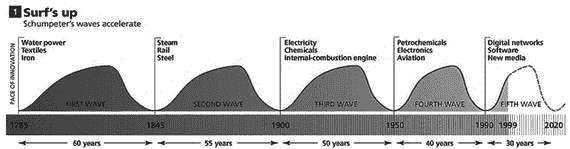
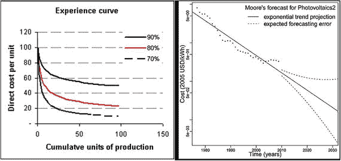
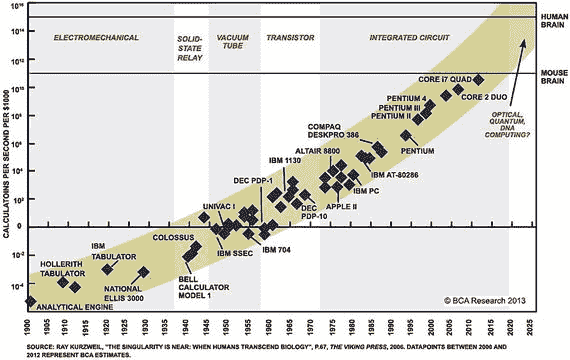

# 技术与发明：一个组合过程

著名发明家兼未来学家雷·库兹韦尔（Ray Kurzweil）曾说过，当前技术趋势所呈现的指数级增长曲线，是基于技术“以技术为食”的倾向。鉴于我们当前所目睹的变化速度，如果我们接受所有已发明、正在发明和将要发明的技术都遵循同一套公式——即它们是已有技术的组合，而非纯粹源于灵感，那么这可以算是一个公允的说法。

这对某些人来说可能像是一个常识性的陈述。过去，哲学家、历史学家、社会学家和经济学家，如刘易斯·芒福德（Lewis Mumford）、乔治·巴萨拉（George Basalla）、乔尔·莫基尔（Joel Mokyr）和保罗·罗默（Paul Romer），都提出过一些轶事性的理论来阐述这一概念。但是，如果我们想尊重波普尔（Popperian）科学方法来提出论断，那么我们需要查阅与此主题相关的研究来证明我们的假设。更重要的是，如果我们宣称技术是通过组合先前技术发明的零碎部分而创造的，那么我们也需要将这个假设扩展到发明过程本身，因为正是发明产生了新技术。

圣塔菲研究所（Santa Fe Institute）和牛津马丁学院（Oxford Martin School）的研究人员发现，发明（以及由此衍生的几乎所有技术）都表现出这种组合现象。在 2015 年由皇家学会（Royal Society）发表的一篇题为《发明作为组合过程：来自美国专利的证据》（Invention as a combinatorial process: evidence from US patents）的论文中，研究人员研究了 1790 年至 2010 年的美国专利记录，试图概念化发明——即我们如何获得新技术。专利被视为技术的“载体”或发明的“足迹”，因为它们留下了技术演变方式的文献轨迹。通过执行这项研究，研究人员能够证明，发明是将技术（无论是全新的还是以前使用过的）以未曾见过的方式汇集和组合的过程（Youn et.al，2015）。根据这项研究以及其他开始研究技术组合进化概念的研究，发明可以被概念化为组合的可能性。换句话说，发明仅仅是现有技术能力的新颖组合，本质上是进化性的。

这种技术建立在先前或现有技术之上的倾向与生物进化非常相似。凯文·凯利（Kevin Kelly）以更简洁的方式类比了生物进化与技术进化。根据他的研究，自然和技术范式中看到的长期共同进化趋势共享五个共同的显著特征：专业化、多样性、普遍性、社会化以及复杂性。任何技术都表现出这五个特征。由于金融科技是本书和现代资本主义的主角之一，让我们分析一下这项技术的演变：

金融科技根植于计算机的历史（参见注释：计算机简史）。最初，计算机是为非常特定或专业化的操作而制造的。例如，早期的计算机，如万尼瓦尔·布什（Vannevar Bush）在 20 世纪 30 年代中期发明的微分分析机，是模拟计算设备，旨在求解常微分方程以帮助计算炮弹的轨迹。随着第二次世界大战爆发，这些计算方面的进步被各国军方采用和发展，通过集成密码学技术（一种自然选择）来传递敏感信息。为了对抗这一点，艾伦·图灵（Alan Turing）和他的导师马克斯·纽曼（Max Newman）等先驱开始设计和建造能够解密这些伪装的通信内容的自动化机器（图灵机）。这有效地改变了计算机的用途，并增加了计算机种类的多样性。

战后，约翰·莫奇利（John Mauchly）、普雷斯珀·埃克特（Presper Eckert）和约翰·冯·诺依曼（John von Neumann，一位真正的博学家）等著名发明家的进步，促成了第一台二进制计算机——`EDVAC`（电子离散变量自动计算机）的诞生。随着二进制计算机的成熟，开发软件以向计算机发出指令的需求日益增长。打孔卡很快被逻辑门（来自布尔代数）所取代，而`COBOL`和`FORTRAN`（公式翻译）等语言帮助创建了早期操作系统。随着软件设计开始演变，计算机的功能也随之演变。`BASIC`、`LISP`、`SIMULA`、`C`、`C++`、`UML`、`Unix`、`Linux`等编程语言帮助构建了分布式通信网络、互联网，并最终形成了万维网。随着晶体管成本开始下降（摩尔定律），越来越多的任务实现了计算机化，导致了计算机在商业和生活的几乎所有功能中的普遍性。

这种普遍性逐渐进入了贸易领域，进而扩展到金融。由于贸易是一种基本的社会互动，将计算机用于通信和价值交换的社会化，是一个自然的进化技术发展。过去二十年，通过数字渠道增加的社会化，导致了不同节点之间更多的互联，并形成了一个复杂的交织结构，其中没有一个中心点能够支撑整个大厦。随着计算的发展过程变得越来越分布式，计算的未来（以及金融科技的未来）必然会增加复杂性。选择、多样性、增量变异和时间进程（Wagner & Rosen，2014）将成为未来技术和资本主义的标志。

正是最后的复杂性阶段，对我们理解现代资本主义构成了最大的智力挑战。正如前几章所示，银行业和商业的社会化和金融化所产生的高度复杂性，已经创造了一个不透明且难以监管的系统。金融系统中新技术的引入，如区块链，将帮助我们获得更高的透明度，但也会进一步增加系统的复杂性，因为每个参与节点都将成为通信和价值交换的一个点。如果监管者今天在识别系统性风险点和恶意参与者方面面临困难，那么在一个更具包容性和更复杂的无现金系统中，这个问题必然会变得越来越复杂。

### 其次，我们还需关注技术加速趋同的现象

需要强调“技术加速趋同”这一概念，因为它为我们理解经济学与技术的研究和分析方式为何存在脱节奠定了基础。这种脱节尤为重要，因为技术演进的步伐及其对经济产生的颠覆性影响正变得越来越短、越来越快，如图 4-1 所示。

**图 4-1.** 康德拉季耶夫长波周期加速 来源：《经济学人》，“工业创新——乘风破浪”，1999 年。⁶

随着技术的持续加速，它对经济产生了深远影响，因为技术性能的提升带来了生产成本的降低。`赖特定律`（1936 年）和`摩尔定律`（1965 年）表明，技术性能提高的同时，生产成本也会随之下降（图 4-2）。西奥多·赖特（`赖特定律`的提出者）于 1936 年预测，随着技术随时间呈指数级改进，成本将随着累计产量的幂律关系而下降。麻省理工学院和圣塔菲研究所最近的一些研究表明，成本的指数级下降与产量的指数级增长相结合，将使`摩尔定律`和`赖特定律`难以区分（正如 Sahal 最初指出的那样）（Nagy 等人，2013 年）。

**图 4-2.** 技术曲线及其对生产成本的 经济影响。左图：`赖特定律`（1936 年）；右图：`摩尔定律`（1965 年） 来源：左图 - 维基百科；右图 - `http://dx.doi.org/10.1371/journal.pone.0052669`

技术的组合演化与其对网络化经济的影响之间的这种联系，不仅是理解技术进步经济影响的关键，也是理解现代资本主义核心信条的关键——技术与经济遵循着与生态系统相同的演化模式，并在此过程中增加了系统的复杂性。

区块链（其本身是密码学、计算机科学、博弈论和货币经济学的结合体）只是增加经济学复杂性的一个元素。本书中讨论的其他技术也表明，当今大多数新创企业并非依赖单一技术来为客户提供价值。正是由于这种加速趋同，新企业能够比老牌企业遵循的路径更快地实现规模化。

如果将经济视为一个生产代理网络，其中每个节点代表一个行业，那么由于技术的趋同性，一个行业生产的商品会被用作另一个行业的投入。当一个行业的技术开始与另一个行业的技术相结合时，就会产生创新，从而降低生产成本并催生新技术。随着投入成本降低或效率提高，新商品得以诞生。当新产品变得无处不在时，社会联系（包括管理模式）的改善，会带来更好的技术分配以及相关的规模经济效应。行业之间的联系越紧密，即经济结构网络化程度越高，这种现象的重复速度就越快，从而导致技术演化和生产成本降低发生指数级变化（另请参阅 Farmer 和 Lafond，2015 年）。

从以上表述我们可以推断，技术和投资决策处于持续变化的状态，很少是静态的。然而，尽管技术在经济中的内生作用在学术界获得了越来越多的关注，但经济学研究尚未实现向将经济变化视为一个沉浸于生态环境中的熵系统的转变。即使是在这个主题上被引用最多的论文之一——世界银行现任首席经济学家保罗·M·罗默于 1990 年发表的《内生技术变革》——其模型也是围绕在技术变革下寻找均衡状态而构建的。⁷

由于这些技术上的物质流伴随着货币流，技术变革的经济影响是同一枚硬币的两面。随着技术复杂性的持续增加，现代资本主义的网络化经济也必然会变得更加复杂。但尽管存在这种日益增长的复杂性及其伴随的熵，当今使用的经济模型仍然基于均衡状态。

因此，如果我们想要纠正对技术和经济存在的脱节看法，就需要重新思考经济理论。当一个系统变得更为复杂时，新的联系会形成，旧的联系会被打破，这些创造性破坏运动的影响会创造一种持续变化或熵的状态。那么，为什么当我们学习经济学时，学到的却是均衡理论和理性预期理论，而实际发生的变化却是熵性的且大多是未预见到的，即非理性预期的？如果技术创造了复杂性，为什么经济理论仍基于均衡状态，尽管技术不断变化的性质对经济和资本主义具有高度的内生性？这种思维模式的一个主要原因基于我们如何认知地解释世界，以及我们为何总是试图预测未来。侧边栏 4-1 提供了一些神经科学方面的见解。

### 侧边栏 4-1：理性预期的一个依据

**来源：**《如何创造思维：人类思想奥秘的揭示》，雷·库兹韦尔（2014 年）；《组织变革的神经科学》，希拉里·斯卡利特（2016 年）；《领导组织变革的社会认知神经科学》，罗伯特·A·斯奈德（2016 年）。

理性预期基于人脑固有的工作方法论。我们必须记住，人脑并非在当今世界性都市环境中演化而来。它是在数千年前凶险的萨瓦纳环境中形成的，演化以实现两个主要目标：如何生存和如何预测。

生存是大脑的自然状态，基于风险与回报之间的权衡。由于在人类的早期环境中风险更多，识别风险以求生存更为重要。因此，大脑更适应这种状态。当面对任何情况时，大脑会分析任何潜在的生存风险，这种原始本能反应更快、冲动和感觉更强烈，并且作为记忆留存时间更长。当某些刺激触发大脑的奖赏网络时，研究表明大脑反应较慢（因为这并非我们的自然状态）。这种感觉也较温和且相对短暂（几天后你就会忘记赞扬，但不会忘记辱骂）。

为了在持续风险中生存，大脑必须具备预测能力。事实上，大脑可以被视为一个持续的预测机器，不断试图寻找安全并规避风险。我们大脑的`neocortex`（新皮层）持续预测着它将遇到的事物。这是一项巧妙工具，能够不间断地识别、记忆和预测模式，并形成关于我们将要体验到的假设。正如`Ray Kurzweil`所言，预测未来实际上是大脑存在的首要原因。下面的陈述例证了大脑如何持续进行预测，即使在没有明显危险迹象时也是如此：

“I cnduo’t bvleiee taht I culod aulaclty uesdtannrd waht I was rdnaieg. Unisg the icndeblire pweor of the hmuan mnid, aocdcrnig to rseecrah at Cmabrigde Uinervtisy, it dseno’t mttaer in waht oderr the lterets in a wrod are, the olny irpoamtnt tihng is taht the frsit and lsat ltteer be in the rhgit pclae. The rset can be a taotl mses and you can sitll raed it whoutit a pboerlm”。

但预测的过程是耗费精力的。大脑仅占我们体重的`2%`，却消耗了我们`20%`的能量。因此，大脑会试图通过走认知捷径来节省能量。它尝试使用抽象概念进行预测，即使我们面对的是具有多维特征的事件，大脑也会将事件模式表示为低层级模式的一维序列。换句话说，我们大脑内在的预测机制试图通过线性思维来节省能量。我们的大脑最擅长预测那些具有线性函数关系的事物。

考虑这个简单的例子：一个球棒和一个球的费用共计€1.10。球棒比球贵€1。那么球的价格是多少？在大多数情况下，我们大脑本能预测出的第一个答案是 10 分钱。但如果我们将这个简单的计算推导出来，会发现球的实际价格是 5 分钱。（(球棒 + 球 = 1.10)；既然 (球棒 = 1 + 球)；这意味着 ((球棒 + 球) = (2 * 球 + 1) = 1.10)；因此，2 * 球 = 0.10；球 = 0.05）。

大脑偏爱线性可预测性的历史倾向，可能解释了为何我们在技术变革背景下修改经济思维方式时会遇到困难。这两个学科过去可能都呈现出线性增长趋势。但正如我们在本章引言中讨论的，技术是基于`consilience`（知识整合）——即对旧技术的整合。

随着技术日益数字化，技术的整合正在加速并以指数级速率进化。图 4-3 中所示的对数曲线就代表了这一事实。

**图 4-3.** 摩尔定律：跨越 199 年并依旧强劲。图片来源：`BCA Research Special Report, ‘Human Intelligence and Economic Growth - From 50,000 B.C. to the Singularity’`（2013 年）。

如图所示，这些指数曲线在经济史中是相对近期才出现的。当`Adam Smith`在 1776 年出版《国富论》时，经济学学科还代表着线性规模。技术演进的步伐要慢得多（参考图 4-1），这促使社会科学中的经济学发展出那些最适合线性技术增长曲线以及我们线性预测思维方式的模型。在很长一段时间里，这是常态，而`理性预期理论`（`RET`）并非错误，而是对更简单经济体的自然反映。

但随着技术进化并开始以指数级速率增长，它所带来的日益增长的复杂性正在挑战这一理论。`RET`基于经济学中的完全竞争理论，该理论预设了完备知识。但随着互动日益增多，经济系统参与者所持有的观点由于信息不对称而总是片面和扭曲的。那么，当我们并不拥有“完备”知识时，我们又如何能“理性地”预期任何事物呢？

由区块链提供的信息将在一定程度上帮助我们解决这个问题，新的数据分析技术也将如此。但了解经济方方面面的尝试似乎是对完美的渐近追求。正是出于这个原因，在审视经济时，我们需要根据结果的可能性进行预测，而不是创建精确的线性模型。通过这一视角重新思考经济学的任务将是一项艰巨的挑战，但我认为仍然可行。近年来神经科学研究最令人惊讶的成果之一是大脑的`神经可塑性`（见注释）。大脑会根据新信息不断更新其认知地图或信念系统。随着新想法占据主导，旧的信念要么被升级要么被摒弃。经济学或许是一门古老的学科，但科学向我们表明，我们仍然可以教老狗学新把戏。

