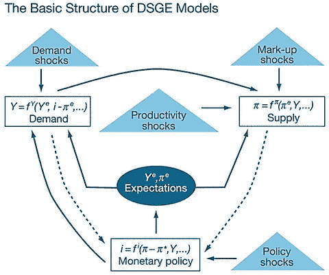

# 效率工资

`效率工资`是指高于市场均衡水平的工资。管理者选择支付效率工资的一些原因是为了降低员工流失率并吸引高生产力员工。此外，如果员工的工作努力程度与实际工资率正相关，雇主可能有意将工资设定在均衡水平之上，以提高员工的生产力。

## 菜单成本

`菜单成本`是企业因调整价格而产生的成本。菜单成本会阻碍企业设定最优价格，从而造成私人利润损失，然而这些损失低于菜单成本本身。通过采取“近乎理性行为”，这些企业偏离了最优价格（工资）设定，并减少了与搜寻需求（劳动力供给）变化信息相关的交易成本。在这种情况下，价格（工资）偏离最优值所造成的利润损失可以通过交易成本的降低来抵消。从企业角度看，这种行为可能最优，但却会导致总产出和就业水平的显著损失。

## DSGE 模型的局限性

过去几十年中，`DSGE` 模型的广泛使用并非没有争议。随着经济日益互联，经济主体可获得的数据量越来越大。因此，经济主体的理性预期开始比以往更剧烈地波动。由于企业和家庭的预期无法观测，较老的 `DSGE` 模型无法区分经济活动的变化是源于当前预期的改变，还是对过去计划的滞后反应。例如，它们无法确定企业资本投资的增长是归因于对销售额预期的修正，还是与早期投资计划相关的一系列渐进式资本收购的一部分（Brayton et al., 1997）。

因此，美联储于 1996 年开始开发并使用一种新的宏观经济政策分析工具（此后经历了定期修订），即如今所称的 `FRB/US` 模型。根据美联储理事会的描述，“与动态随机一般均衡（`DSGE`）模型相比，其一个显著特点是在经济主体的预期形成假设之间进行切换的能力。另一个特点是模型的详细程度：`FRB/US` 包含了美国国民账户中产品和收入方面的所有主要组成部分”。（斜体文字摘自 2014 年 4 月发表在美国联邦储备委员会网站上的一篇文章。参见下方网站链接¹⁷）。

鉴于该模型的范围和规模，`FRB/US` 模型可以被认为是当今使用的最先进的宏观经济政策工具（尽管对此模型存在各种批评，这些批评可以追溯到该模型概念化初期的 20 世纪 70 年代）。但 `FRB/US` 模型仍然是一个“美国经济的大规模估算一般均衡模型”（美联储理事会，2014）。前一句中需要强调的关键词是“估算”和“均衡”。自 20 世纪 60 年代至今，几乎存在的每一个模型都基于这两个术语。无论我们使用传统结构模型、理性预期结构模型、均衡商业周期模型，还是向量自回归（`VAR`）模型（参见注释“宏观经济模型类型”），这些模型赖以构建的基础参数都是假设、估算和均衡。

## 金融部门的缺失

其次，金融市场并未被真正纳入模型。我们已快速讨论过的 `DSGE` 宏观经济模型系列，是在大稳健时期（1983‑2008 年）作为芝加哥学派与新凯恩斯主义方法之间的综合产物而出现的。这是一个经济相对稳定的时期，使得政策方法只能依赖于货币政策（即利率）的运用。这是因为以芝加哥学派为主导的思想认为，应对商业周期和/或衰退趋势所需的一切就是积极的货币政策。有些人甚至认为连这都不需要，因为他们相信自由市场调整总能找到出路（Garcia, 2011）。新新凯恩斯主义者也持有这种信念，他们认为不需要财政政策来处理商业周期或衰退趋势。因此，两个学派都汇聚于一种观点：避免商业周期或衰退趋势风险所需的一切，就是由一条货币规则引导的巧妙货币政策（García, 2010）。其结果是财政政策逐渐被排挤，对财政政策替代方案的关注甚至更少。然而，危机向我们展示了，如果仅由财政政策指导，经济政策可能多么无效。这也是提出基于区块链的财政政策系统的主要原因之一。（另见：“货币融资的理由¹⁸——一个本质上的政治问题”，Turner, 2015）。

这种被广泛接受的假设——金融市场将基于经济主体做出逻辑决策而成为价格的最佳决定因素，因此无需将金融市场模型纳入考虑——与 `EMH` 直接相关。如果市场有效地反映了资产价格，那为什么还要费力为金融部门建模呢？这一逻辑基于两个假设：首先，金融部门总是趋向于均衡；其次，金融市场是完备的，即不平衡（违约、破产、流动性不足等）会随时间得到平衡。但正如我们在前几章中所见，这并不反映现实。因此，得知 `DSGE` 模型无法捕捉国际金融联系的完整图景也就不足为奇了（Tovar, 2008）。

## 理性预期理论（RET）前提

`RET` 前提是 `DSGE` 模型的另一个缺陷。有充分的科学证据，特别是来自 1993 年诺贝尔经济学奖得主道格拉斯·C·诺斯的证据表明，在不确定性下，不存在理性行为的确定性。用他自己的话说：

> “弗兰克·奈特（1933）对风险和不确定性做出了根本性区分。在前者的情况下，可以通过足够的信息推导出结果的概率分布，因此选择是基于该概率分布做出的（保险的基础）。但在不确定性的情况下，不存在这样的概率分布，因此，引用两位最杰出的经济学实践者的话，‘在这种情况下无法形成任何理论’（Arrow, 1951 p. 417），以及再次引用‘在不确定的情况下，经济推理将价值不大’（Lucas, 1981, p. 224）。但人类在纯粹不确定性的条件下确实一直在构建理论——并且确实依据这些理论行事……正是广泛存在的神话、禁忌、偏见和仅仅是不成熟的想法构成了决策的基础。事实上，塑造政体和经济发展方向的大多数基本经济和政治决策都是在面对不确定性时做出的。”（道格拉斯·C·诺斯，‘经济学与认知科学’，*Procedia - 社会与行为科学杂志*，2010）。

另一位诺贝尔奖得主丹尼尔·卡尼曼在其前景理论中提出了类似的观点。卡尼曼能够凭经验证明，不确定性下的决策并不指向“行为人的理性行为”，而是风险规避主导了行为。斯坦福大学心理学社会科学荣誉教授阿尔伯特·班杜拉在其社会认知理论中也提出了类似的主张，他指出：

> “理性取决于推理技能，而这些技能并不总是得到良好发展或有效运用。即使人们知道如何推理，当他们基于不完整或错误的信息进行推理，或者未能充分考虑不同选择的全部后果时，也会做出错误的判断。他们常常通过认知偏差以错误的方式解读事件，从而产生关于自身和周围世界的错误信念。当他们按照这些在他们看来主观合理的误解行事时，会被他人视为行为不合理或愚蠢。此外，人们通常知道应该做什么，但会被令人信服的环境或情感因素所左右而做出其他行为。”（班杜拉，《社会认知理论》，1998 年）

在`DSGE`模型背景下，强调理性预期理论的作用至关重要，因为它们在这些模型中充当输入变量。正如在`DSGE`模型和`FRB/US`模型中所见，主体预期是政策影响经济的主要渠道（斯博多内等人，2010 年）。但如果结构参数基于错误假设的微观基础，那么即使该模型在技术上是卢卡斯批判稳健的，它也注定会做出糟糕的预测并存在错误。

最后，它们对均衡的执着是这些模型的祸根。`DSGE`模型基于一个绝对的信念，即市场调整总会趋向均衡。这一信念基于四个原则：（i）在预算约束下，消费者总是最大化其个人效用；（ii）在资源约束下，生产者总是最大化其利润；（iii）市场可能因外生冲击而变得动荡，但这总会在几个季度后恢复到均衡状态；（iv）主体基于理性预期做出决策。因此，即使冲击使经济偏离稳态增长，在几个季度内，市场也会经历一个动态调整过程，并恢复到此前的状态。

因此，`DSGE`模型建立在经济存在稳态均衡的假设之上。它们允许实际时间向该稳态移动，也允许三个整合模块（供给、需求和货币政策）之间的动态相互作用。因此，`DSGE`标签中的“动态”方面——即关于未来的预期是决定今日结果的关键因素（斯博多内等人，2010 年）。它们也允许在走向该稳态的路径中存在一个随机（即随机的）元素。但其基本前提是一个无所不在的均衡状态的存在。图 4-4 提供了一个图形化解释：

图 4-4.

`DSGE`模型的基本结构 图片来源：《使用`DSGE`模型进行政策分析：导论》，纽约联邦储备银行

这些模型总是趋向均衡，是因为它们被构建成以这种方式运行，而不是因为它们准确解释了现实经济。花旗集团首席经济学家威廉·比特指出，这种构建模式的主要原因之一是政策决策往往会产生非线性行为。由于这种非线性与主体不确定性的相互作用会产生复杂的数学问题，`DSGE`建模者移除了非线性元素，并将随机变量的复杂演化简化为一个带有加性随机变化的线性系统。在一篇题为《`DSGE`模型与中央银行》的文章中，国际货币基金组织高级经济学家卡米洛·E·托瓦尔也支持这一论点，他指出：“存在与当前`DSGE`模型错误设定程度相关的重要担忧……`DSGE`模型过于程式化，无法真正以有用的方式描述数据的动态变化”（托瓦尔，2008 年）。在同一篇由国际清算银行发表的文章中，他还指出：“当前`DSGE`模型可能的主要弱点在于缺乏适当的金融市场建模方式。”

然而，这些模型所依据的前提代表了一个更大的问题。在一篇题为《大多数‘最先进的’学术货币经济学的不幸无用性》的短文（发布于经济政策研究中心网站）中，威廉·比特解释了使用基于线性和均衡的`DSGE`模型的后果：

> “当你对一个模型进行线性化，并用加性随机扰动对其进行冲击时，一个不幸的副产品是，由此产生的线性化模型要么以非常强烈的稳定方式运行，要么以无情的爆炸性方式运行。这类模型中不存在‘有界的不稳定性’。动态随机一般均衡圈子看到经济在过去没有无界地爆炸，并由此得出结论，认为在线性化模型中排除爆炸性解轨迹是合理的。他们剩下的是一个在外生随机扰动后会相当迅速地恢复到确定性稳态的东西。没有`L`型衰退。没有累积因果和衰退或扩张的有界但持续的过程。只有漂亮的`V`型衰退……
……
‘从随后用于实际数值政策分析的模型中移除所有非线性和大多数有趣的不确定性方面，是一个重大的倒退。我相信，在那些重要的中央银行中，这现在已经被扔进了历史的垃圾堆。’……
……
‘自 1970 年代以来大多数主流宏观经济理论创新……充其量只是自我参照、内向型的干扰。研究往往由既定研究项目的内部逻辑、智力沉没成本和审美难题所驱动，而不是由理解经济如何运作——更不用说理解经济在压力和金融不稳定时期如何运作的强烈愿望所驱动。’……（比特，2009 年）”

这些陈述不仅反映了经济理论的糟糕构思，也反映了数学上的无知和傲慢，这正在将经济学变成科学不良应用的反面典型。世界银行现任首席经济学家保罗·罗默在其论文《经济增长理论中的数学化》中探讨了过去七十年这一趋势的增长。罗默将数学化定义为：“它让学术政治伪装成科学。如同数学理论，数学化使用文字和符号的混合，但它没有建立紧密的联系，而是在自然语言与形式语言的陈述之间，以及在理论内容与经验内容的陈述之间留下了足够的滑动空间。”（罗默，2015 年）（另见《宏观经济学的问题》，罗默，2016 年）。

