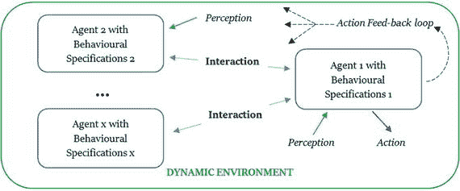
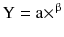
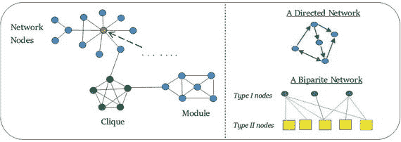
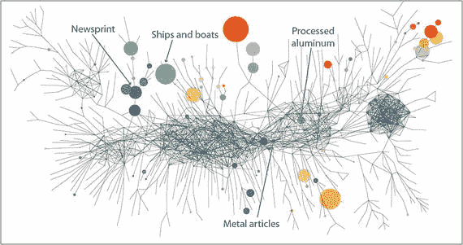

# 复杂经济学与基于主体的建模导论

> “科学是现实的诗歌”，理查德·道金斯

如果要为观察和衡量经济提供一种新视角，我们首先需要追问：为何经济学采纳了“经济是一个均衡系统”这一本体论概念，并借用了与之配套的数学工具？这个问题的答案，需追溯至经济学作为一门正式学科的开端。

19 世纪 70 年代，法国数理经济学家莱昂·瓦尔拉斯偶然读到一本由法国数学家兼物理学家路易·潘索所著的《静力学原理》。该书代表了当时数学和物理领域的前沿水平，探讨了静态均衡系统分析、联立方程及相互依存方程等概念 (Beinhocker, 2007；另见 Mirowski, 《More Heat than Light》, 1991)。瓦尔拉斯大量借鉴此书，形成了自己的理论，最终提出边际价值论并发展了一般均衡理论。他并非唯一这样做的人，同时代的经济学家威廉·斯坦利·杰文斯也如法炮制，从开尔文勋爵和彼得·格思里·泰特合著的另一本著名物理教科书《自然哲学论》中汲取养分²¹，并独立发展了边际效用价值论²²。

这些经济学家主张经济学是一门研究数量的数学科学，由此开启了经济思想史上的一个新篇章。事实上，瓦尔拉斯将潘索的思想推向了极致，他将经济主体简化为遵循物理定律、既不会学习也不会适应新行为的原子 (Walker, 1996)。

从早期开始，经济学逐渐被当作一门基于均衡方程的数学学科来对待，经济主体则按照市场的总体趋势行事（参见前文罗默关于“数学味”的注释）。这种遗留影响至今犹存，体现在最大化原则（例如效用）上——它模仿了物理学中的最小化原则（例如最小作用量原理）(Sinha et al., 2010)，也体现在“货币流通”这一概念上——这是由（以菲利普斯曲线闻名的）比尔·菲利普斯根据其建造的 MONIAC²³ (图 4-5) 所提出的。将宏观经济运动映射为流体运动，表明这些思想家将经济视为一个物理研究客体。

图 4-5.

A.W.H. (比尔) 菲利普斯教授与菲利普斯机器 (MONIAC) 来源：Nicholas Bar，《菲利普斯机器项目》，《伦敦政治经济学院杂志》，1988 年 6 月，第 75 期。

然而，20 世纪 50 年代约翰·冯·诺依曼引入的数学博弈论，却给经济学与物理学之间的这种联系投下了一枚炸弹。当博弈论被引入（参见冯·诺依曼和摩根斯坦的《博弈论与经济行为》），经济学界立即意识到，该领域的数学方法可用于研究经济中自私主体如何胜过其他主体的行为。但在以真实对象进行的实验中，主体却表现出非理性的合作行为才是常态 (Sinha et al., 2010)。因此，经济学家们还原并接受了一个抽象观念：经济会收敛于均衡，在此过程中，一个主体的负面行为会被另一个主体的正面行为所抵消。复杂经济学试图解决的正是这一谬误。

我们目前所看到的是，尽管我们使用确定性和公理化的模型进行经济研究，但经济现象并非源于确定性、公理化、可预见或机械化的规则。过去古典和新古典经济学家所采用的还原论方法，忽视了不同主体之间的相互依赖和相互联系、它们对彼此的影响以及这些互动带来的宏观经济后果。经济学家们不是去分析这些互动，而是将一个系统的总体行为简化为一系列基本规则，然后试图单独研究这些部分，以期了解整体图景。这种方法为他们提供了特定经济现象的聚合视图，随后这些视图被概括并应用于解释经济的合理行为规则。这种还原论排除了对主体所创造展现模式的研究，并简化了它们各自的后果，从而在现实与其形式化表达之间造成了脱节 (Bruno et al., 2016)。

复杂经济学挑战了均衡、原型主体和理性行为等基本的正统假设。它试图通过强调网络效应、反馈回路和主体异质性的重要性，来改变经济学研究的叙事方式。公理化、线性化和一般化被对主体间相互联系、关系相关性以及它们对经济环境（反之亦然）影响的深入研究所取代。异质的、相互作用的主体根据从环境和其他主体接收的新信息做出新决策，取代了传统上那些“理性”的、在时间静止状态下做出决策的独立主体 (Gallegati and Kirman, 2013)。

时间和信息在这一新的经济思想范式中扮演着关键角色，因为它们凸显了中层结构的重要性——即连接经济体微观与宏观结构的“结缔组织”。在复杂经济学中，抽象和教条的理论被对模式的研究所取代，这些模式产生于相互作用的主体接触新信息、做出影响周围其他主体的决策，并在此过程中改变经济环境结构之时。随着经济及主体决策随时间变化，新的结构得以形成。因此，复杂经济学是关于形成的——基于外生和内生变化，经济体内新结构的形成，以及这些形成过程如何影响引发它们的那些主体 (Arthur, 2013)。

信息也发挥着关键作用，因为决策的变化和新技术的引入影响着知识与诀窍的集中与分散。由于信息不断变化，主体必然相互作用以增加对这些变化的认识。由于相互作用无处不在，这加剧了非线性并催生了冲击，从而削弱了因果之间的直接比例关系：一次小冲击，基于主体对该冲击的解释，可能导致巨大的影响。这也意味着，由于主体具有处理信息并根据新信息做出相应决策的认知能力，标准的物理学工具不能`sic et simpliciter`（简单照搬）。

信息之所以值得强调，不仅因为它在当今数字经济中无处不在，更因为它与经济繁荣密切相关。塞萨尔·伊达尔戈²⁴在其著作《*为什么信息会增长*》（2015）中指出，信息是一种成长性实体，能够具象化为本质上就是信息熔炉的新产品。新产品的生产基于知识在主体网络中的积累与专业技能的增长。主体间的连接数越高，网络规模越大，知识积累也越丰厚。理解这一概念至关重要，因为经济增长正是建立在信息增长的基础之上。伊达尔戈阐明，越是繁荣的国家，越擅长促进信息增长；而那些构成网络边界渗透性较差的区域，则会阻碍信息增长，并限制其应对经济变化的长期适应能力。

因此，复杂性经济学的核心在于信息流动及其对主体的影响。经济网络仍然可以产生宏观模式，但值得注意的是：首先，这些模式是进化的；其次，正是主体的个体决策引发了特定模式的出现。主体会受到这种模式的影响，并将其解读为新信息。随着新信息的引入，主体的决策会发生变化，新的模式也开始形成。两者并非割裂，而是内在相连。加总并不仅仅是把个体主体的市场结果相加，以获得整个经济体的总量。它是主体与系统宏观属性之间双向依赖的关系：相互作用的要素产生宏观模式，而这些要素反过来又对这些模式做出反应（Gallegati 和 Kirman, 2013）。因此，*中层* 在这一经济学研究中扮演了关键角色。

与主体之间完全不互动的瓦尔拉斯方法相反，复杂性经济学将互动视为经济发展的基础，因为这些互动不仅影响宏观模式，还会创造出日益复杂的网络，使主体能够弥补信息有限的不足。这种将经济视为行动与策略不断演化、时间变得重要、结构不断形成与重组、标准均衡分析无法察觉的现象浮现、以及微观与宏观之间的中层变得关键的视角（Arthur, 2013），正是复杂性经济学的核心分支。

因此，复杂性经济学研究的是一个具有历史依赖性、充满活力且不断演化的系统，其属性源于自适应个体主体之间相互作用的结果。这些主体在适应新信息的过程中，改变了系统层面的行为以及系统的整体状态。因此，将系统分解为个体组件会破坏系统的属性（Bruno 等, 2016）。由此，复杂性经济学的主要研究领域包括：自组织、模式发展与模式识别、主体决策、网络传播、相互作用的依存性、涌现、学习与记忆、内生创新、制度效应、不可预测的动态、异质性、路径依赖、拓扑结构、变化与演化、整体论与协同作用（Manson, 2001）。这一跨学科研究分支融合了物理学、数学、计算机科学、生态学、工程学，当然还有经济学。

我并非打算在本章中提供复杂性经济学的完整教育。首先，我并非此领域专家；其次，近年来已有越来越多优秀的研究人员和学者在此方面做出了令人钦佩的工作。表 4-1 列出了一些我参考过的著作，可以作为你自行探索的起点。

**表 4-1.** 复杂性经济学与基于主体建模的参考书目

| 作者 | 著作 |
| --- | --- |
| W. Brian Arthur | Complexity and the Economy (2014) |
| Dirk Helbing | Quantitative Sociodynamics (2010) |
| Dirk Helbing | Thinking Ahead - Essays on Big Data, Digital Revolution, and Participatory Market Society (2015) |
| César Hidalgo | Why Information Grows: The Evolution of Order, from Atoms to Economies (2015) |
| Sitabhra Sinha, Arnab Chatterjee, Anirban Chakraborti, Bikas K. Chakrabarti | Econophysics: An Introduction (2010) |
| Sitabhra Sinha, Arnab Chatterjee, Anirban Chakraborti, Bikas K. Chakrabarti | Econophysics of income and wealth distributions (2012) |
| Linda F Dennard, Kurt A Richardson and Göktuğ Morçöl | Complexity and Policy Analysis (2008) |
| Uri Wilensky, William Rand, David S. Wilson, and Alan Kirman | An Introduction to Agent-Based Modelling: Modelling Natural, Social, and Engineered Complex Systems with NetLogo (2015) & Complexity and Evolution: Toward a New Synthesis for Economics (2016) |
| Jean-Luc Gaffard and Mauro Napoletano | Agent-based models and economic policy (2012) |

在接下来的部分，我希望提供一份与复杂性经济学相关的关键研究领域总结，以便你能识别出激发自己兴趣的研究分支，从而继续在这一领域进行探索。学习复杂性经济学的乐趣在于，当你踏上这段旅程时，你将接触到来自其他学科的丰富思想，获得对科学的整体性认识。基于此介绍，我们来看看该学科的一些关键主题：

- 动态性
- 非线性
- 幂律
- 网络
- 反馈循环
- 路径依赖
- 涌现
- 主体

### 动态性

在复杂性经济学中，主体会受到其他主体以及系统整体行为的影响，从而在宏观层面产生涌现行为。瓦尔拉斯经济学是封闭、静态且线性的，可以用代数几何和流形理论的工具来理解；而复杂经济则是开放、动态、非线性的，且通常远离均衡状态（Beinhocker, 2007）。动态互动基于主体的特性——主体试图尽可能理性地行动，但受到其他主体以及变化的市场中宏观行为的影响，从而偏离先前的最优行为。图 4-6 以图形方式诠释了这一观点：

**图 4-6.** 动态环境与主体决策影响因素示意图。参考：第 [7](http://dx.doi.org/10.1007/978-1-4842-2674-2_7) 章，《计算复杂性》，Robert A. Meyers, (2012)。

### 非线性

复杂经济中动态变化的一种延伸便是非线性。如果一个系统的方程解可以任意相加得到另一个解，并且任意解乘以任意因子仍能得到另一个解，那么该系统就是线性的（Ladyman, Lambert and Wiesner, 2012）。这被称为叠加原理（Bruno et al., 2016），因为整体被视为其各部分之和。由于复杂系统依赖于主体间的相互作用，叠加原理并不适用，因为整体被视为超越其部分之和的存在。因此，一个主体带来的微小变化可能对环境产生巨大影响，反之亦然。

因此，非线性可以定义为非比例性。正如我们在专栏 9 中讨论的，我们的思维习惯于线性模式，而我们在经济学中使用的工具也体现了这一特征。例如，在回归分析中，不符合我们线性模型的分数被视为误差或具有极端变异。复杂性经济学则将这种变异视为相互关联系统的固有特征。因此，非线性在复杂性经济学中扮演着核心角色。

### 幂律

主体在非线性动态系统中的影响遵循幂律规则。幂律意味着小规模事件非常普遍，而大规模的生态系统变化则很少见。例如，涉及收入、城市增长、企业、股票市场及回报波动、订单流、交易量、流动性，甚至飓风和地震等自然灾害的模式，都遵循幂律。幂律也可称为标度律，因为两个变量之间存在直接关系。这可以用数学公式表示为：

其中 `Y` 和 `X` 是感兴趣的变量，`β` 称为幂律指数，`a` 通常是一个无关紧要的常数。因此，如果 `X` 乘以 10 倍，那么 `Y` 也乘以 10 倍；即 `Y` 按 `X` 的幂次标度。

幂律或标度律出现在不同的学科领域，尤其是物理学。一个广为人知的幂律是帕累托原则（例如用于市场营销研究），也被称为 80/20 法则，它指出对于许多事件，大约 80%的后果来自 20%的原因。市场中幂律的研究日益成为经济物理学家的兴趣所在²⁵（复杂性经济学的一个补充分支），因为幂律预示着与相变和临界现象密切相关的无标度行为的发生。金融市场中存在一些可靠的幂律分布实例（Sinha et al., 2010）（另见《金融中的幂律》第 [5](http://dx.doi.org/10.1007/978-1-4842-2674-2_5) 章，《经济物理学导论》，Sinha et al., (2010)；《经济学中的幂律导论》，Xavier Gabaix (2008)）。

复杂系统更常由概率分布来表征，这些分布用幂律而非正态分布来描述更为贴切，因为这种逐渐衰减的数学函数能更好地概率性地预测即使是高度复杂系统的未来状态（Levy D. L., 2000）。

### 网络

网络科学及其相关学科的研究是复杂性经济学的支柱之一。复杂经济中的主体参与在相互交织重叠的网络中，这使他们能够弥补自身信息获取有限的不足。在瓦尔拉斯经济学中，主体之间根本不进行互动。相反，每个主体面对的是一个非人格化的价格结构（Beinhocker, 2007）。然而，在复杂性经济学中，网络研究是以高度精细化的方式进行的，因为主体之间的经济交换（无论是债权-债务关系、资产所有权变更、简单的货币交易，还是银行或国家之间的交易）都不是随机发生的。它们依赖于每个单独节点的位置和声誉。扮演更重要角色的节点（例如大型银行）将与其他节点有更多的连接，从而成为枢纽中心。与枢纽中心的连接之间存在相关性，可能导致同配性或同配混合，即节点偏好与自身在某些方面相似的另一个节点连接。这也可能导致节点之间的连接聚类，这些节点自认为是某个特定子群体的一部分，从而表现出派系现象；也就是说，节点基于属于某个排他性小团体而相互关联。图 4-7 提供了直观的解释。

图 4-7. 网络中次群体的形成 来源：《社会网络方法导论》，Hanneman and Riddle, 2005。

网络的这些凝聚特性对于识别模式的出现和判断网络的引力中心至关重要。更重要的是，节点中的中心点如何影响其他节点的行为。这可以通过节点拓扑结构随时间变化的方式来观察，而在动态互联系统中传播的信息反馈意味着一些节点会改变联盟，而另一些节点则可能完全退出网络，导致现有节点之间的连接不断重新排列。网络拓扑结构对于系统性风险至关重要，因为节点可能随机地或根据其某些内在属性受到影响。例如，如果我们考察信贷债权或信贷关系，那么节点可以被视为主体，而连接则可以代表债权和负债。通过识别网络内连接节点子集的密度，我们可以识别出高杠杆率的社区。因此，不是像我们如今那样普遍地看待社区，而是在真实经济网络中进行社区检测提供了一种识别违约传播和蔓延的途径。

从图 4-7 可以看出，图论是网络数学研究的自然框架，因为一个复杂网络可以用 `X` 个节点和 `Y` 条边（连接）来表示，其中每条边对应网络中一对特定的节点。网络可以根据连接分为有向或无向网络——有向网络是指节点按特定方向直接关联的网络；无向网络则没有这种方向性。节点之间的连接也可以根据关系的容量和强度而具有不同的权重。大多数复杂网络具有高度变化的异质性，从而形成复杂的网络拓扑结构。

基于这种连接类型，网络还可以根据节点之间关系的不同进行细分和分类。例如，如图 4-6 所示，一个网络中某些群体之间的节点可能具有特定类型的连接。这可以在股东与公司之间，或不同对等群体之间，以及保险人与被保险人之间观察到。

聚类是网络的另一重要特征。如果一对节点`a`、`b`与另一对节点`b`、`c`相连，那么`a`、`c`也可通过`b`相连。在这种情况下，节点`a`、`b`和`c`被称为聚类节点。平均聚类系数衡量的是节点`a`邻居的紧密程度，也是该网络区域集团化程度的度量。因此，网络的平均聚类系数就是诸如`a`这类节点集团化程度的平均值，能够代表网络的紧密程度。非常紧密的网络被称为小世界网络（SWN）。在许多现实世界中，这是一种常见现象（Sinha 等人，2010）。

在中观层面，即网络中的群体与聚类之间，许多网络都呈现出模块化结构。模块化结构的存在改变了风险传播、传染、协调、子群崩溃等动态现象在网络中的发生方式。毫不意外，目前已有大量研究专注于观察网络中的中观联系（参见：《银行间市场的网络方法》，Fricke、Alfarano、Lux 和 Raddant，2016；《金融网络中传染的可能性有多大？》，Glasserman 和 Young，2015）。

图 4-8 展示了即使在经济体的宏观层面，网络也能被可视化呈现。这项由塞萨尔·伊达尔戈及其研究团队开展的工作，使我们能够看到国家和国际层面的贸易与商业联系。（有关根据出口及其经济复杂性来可视化经济的更多信息，请访问经济复杂性观察站。）

图 4-8.

1963-1969 年挪威的出口情况，以复杂网络形式呈现。（注意：部门间联系）来源：《连接经济复杂性、制度与收入不平等》（D. Hartmann 等人，2015）。

### 反馈回路

随着自组织系统的相互作用，系统中的主体交换信息，从而涌现出复杂模式。这种交换通常被称为反馈（参见图 4-5）。当网络中的一个节点或部分在稍后的时间点与其相邻节点或部分的交互方式，取决于它之前与它们的交互方式时，该节点或部分就接收到了反馈（Bruno 等人，2016）。由于这种机制，某个变量的变化可能会导致该变化的增强（正反馈）或减弱（负反馈）。当这种变化反复出现时，就形成了一个回路。

反馈回路意味着回路的行为是自我强化的：它会一直持续下去，直到有外界干预。正反馈回路的一个例子是收入与消费之间的关系。经济体中人均收入越高，人们的消费就越多。这又会进一步增加他们的人均收入，如此循环往复。另一方面，不平等也恰好是自组织系统中常见的一种反馈回路（DiMaggio 和 Cohen，2003）。

这两种反馈之间的相互作用，是复杂系统中自我维持过程的一个例子。反馈回路也是自组织背后的原因。随着主体通过反馈进行适应和信息获取，它们开始基于内部约束和偏好形成联盟，并随后建立不需要中央协调的自主组织结构。剖析这种组织过程的涌现，类似于见证亚当·斯密“看不见的手”在现实中的体现。

### 路径依赖

简而言之，路径依赖可以概括为历史。路径依赖是指经济结果依赖于以往结果的路径，而非基于当前条件。例如，陈述“我们去年进行了储蓄和投资，因此今天我们拥有资产”可能更时髦地表述为“资本存量是路径依赖的”（Margolis 和 Liebowitz，1998）。

历史对现状的依附是复杂性经济学的主要特征之一。近年来，人们逐渐忽视了通过观察过去来决定未来的方向。但是，复杂系统随时间变化和演化，它们都有自己的历史。主体在过去做出的决策，以及网络间接做出的决策，决定了它们当前的行为。任何忽略时间维度的复杂系统分析都是不完整的，最多只能算是对一个历时性过程的共时性快照（Bruno 等人，2016）。

### 涌现

正如复杂分子的化学成分是核与电子相互作用的结果一样，在复杂经济中，宏观经济模式也是由于微观层面的交换和行为而涌现出来的。市场是涌现的一个著名例子。只要买方和卖方存在，并进行资产、服务和商品与货币之间的交换，市场就能运作。因此，市场与买卖活动相关，既不能仅用买方或卖方的属性来解释，也无法仅用交易的特征来说明（Noell, 2007）（Bruno 等人，2016）。

涌现与系统中各组成部分之间相互作用的动态性质有关（Gallegati 和 Kirman，2012）。涌现现象的动态特性并非预先设定好的整体属性，而是随着复杂系统随时间演变而出现并变得明显（Goldstein，1999）。毕竟，系统中的复杂性可以从简单的规则中产生——这在诸如元胞自动机、神经网络和遗传算法等例子中可见（参见注释）。这是由于系统关系的非线性所致。随着系统变得复杂，涌现会以自组织的形式表现出来。换句话说，系统无需外部力量就能具备某些属性和特征，而这些系统属性源于远离平衡态的条件（Morçöl，2008）。

远离平衡态的条件往往对外部冲击很敏感——一个微小的变化就可能产生巨大的影响（参见上文 (iii) 幂律法则）。虽然我们无法通过分析的方式从宏观系统的组成部分推导出其属性，但我们仍然可以运用新颖的数学技术来模拟涌现属性的行为（Beinhocker，2007）。这对于复杂经济模型工具箱来说是一个至关重要的补充，因为一旦复杂系统的属性涌现出来，系统的属性就无法还原为其组成部分的属性了，因为支配复杂性的法则与支配其组成部分的法则不同（Kauffman，1996）。因此，基于主体建模（下文讨论）的工具至关重要，它们能帮助我们检测和研究模式的发展。

通过研究基于主体间相互作用的模式涌现，我们得以研究分化、选择和放大的演化过程，从中产生新颖性、秩序和复杂性的增长（参见 Kevin Kelly）。这一点很重要，因为在经济学中，商品和服务存在于由其他商品和服务（组合）创造出的利基市场或群体中（参见上文 (iv) 网络），而主体则根据其所处的利基市场以及所交互的节点来获取收益（Kauffman，1996）。

尽管瓦尔拉斯经济中不存在可以从微观属性推导出的宏观属性（例如，第一和第二福利定理²⁶），但也没有研究新颖性或复杂性增长的涌现机制。在复杂经济学中，这些相互作用可以被建模，从而使我们能够采用自下而上的方法观察经济的演化。对这些更高层级的结构进行建模并非易事，并且只能在一定程度上通过基于主体的建模（ABM）来实现。在定义了主体之后，我们将很快详细探讨 ABM。

### 主体

主体是一个具有特定属性和行为的自主计算个体或对象（Wilensky 和 Rand，2015）。这个自主实体有能力决定其在所嵌入环境中需要执行的动作，以及根据其感知和内部状态，需要与其他主体建立的交互（Bandini 等人，2012）。

在复杂经济中，主体拥有有限的信息，并面临高昂的信息处理成本。他们通过反馈循环以及从其信任的网络群体中获取信息来弥补这一点。然而，当面对新信息或新技术时，并不能保证他们会立即且高效地转向新的启发式方法。主体会以自己的方式解读呈现给他们的数据，并据此做出自己的非最优决策。

主体的决策过程取决于其架构，该架构指的是根据主体的感知和内部状态，负责有效选择要执行动作的内部结构。为了获得特定的主体行为，人们提出了不同的架构，这些架构通常分为慎思型和反应型（Bandini 等人，2012）。做出自主决策是基于四种选项之间的权衡——(i) 行动的时机；(ii) 是否满足某个请求；(iii) 是否在没有触发事件的情况下行动，即：主动决策；(iv) 基于个人经验或硬编码知识做出决策（Russell 和 Norvig，2009）。不同的主体会体现这些权衡的不同组合。

在新古典经济学中，主体被认为拥有完美的信息，并且能够低成本地决定什么是最佳（即：理性）决策。之所以采用这种方法，是因为新古典经济学家假设，某个部门（消费者）中所有多样化主体的选择，可以被视为一个“代表性”的标准效用最大化个体的选择，而该个体的选择与异质性个体的总体选择相一致（Kirman，1992）。

Kirman²⁷ 认为这种推理存在四个缺陷：首先，没有证据表明个体的总和代表了单个个体的行为。个体行为与集体行为没有直接联系。其次，无论主体如何追求最大化，都无法保证主体对经济变化（例如利率）的反应方式能够代表该主体所“代表”的个体的总体反应。这使得对政策变化的分析尤其存在缺陷。第三，如果代表性主体做出了支持或反对总体决策的决定，由于他或她是效用最大化者，就无法判断一个决定是否优于另一个决定。最后，试图用一个个体来解释一个群体的行为具有局限性，让单一实体体现一个动态群体的决策可能导致创造出具有非自然特征的个体。因此，基于代表性主体创建实证检验模型会带来不利因素，因为它既不能代表主体的异质性，也无法代表该学派所赖以构建的微观基础。

因此，宏观经济学的研究不应基于对孤立个体的研究，而应基于主体的异质性以及不同个体之间直接相互作用所创造的总体模式。复杂经济学允许我们通过使用计算机程序对每个主体的行为以及主体之间的相互作用进行建模和模拟来解决这个问题。通过使用基于主体的模拟，我们可以研究具有许多异质性且不一定完全理性的主体的复杂经济系统的动态（Levy，2012）。

决策制定背后的理性是创建这些模拟中代表性智能体的关键方面。如基尔曼所述，当前的假设是，理性行为将在经济中整体呈现。这可能适用于一小部分智能体，但并不能确定所有智能体都同样理性（如传统模型所假设的那样）。在现实中，智能体基于其过去和当前的知识以及其行动的后果，其理性是“有限”的。因此，智能体的信念是与其所掌握的信息以及其所处的经济环境相关的概率陈述。基于这些概率，他们开发出适应性、非最优的启发式方法，以便在复杂环境中做出决策。但正如基尔曼指出的，无法保证当面对新信息时，个体能够高效地转向新的启发式方法。

复杂性经济学接受这些智能体特征，并认为智能体具有“有限理性”。有限理性的智能体在其优化能力上受到限制。这种限制可能源于有限的计算能力、错误或各种经实验证实的心理偏差。这种看待理性的方式无疑比新古典经济学所假设的版本——完美、逻辑、最优、清晰、演绎的理性——要复杂得多。但有多种理由拒绝这种理性版本。

首先，存在复杂性的阈值。智能体只能在一定的逻辑复杂度内做出理性决策。因此，它们在本质上受到理性的限制。其次，是信任问题。智能体不能依赖其他智能体做出理性决策。它们必须猜测其他智能体的行为（通过反馈循环），并在此过程中，进入基于主观信念的主观信念迷宫（Arthur, 1994）。因此，问题不在于如何完善理性，而在于用什么来替代它。阿瑟指出，替代品不在于理性，而在于推理，即归纳推理。

归纳推理基于我们与生俱来的识别模式的能力。虽然人类不擅长演绎逻辑（除了夏洛克·福尔摩斯），但进化使我们非常善于识别模式，甚至从婴儿时期就开始识别模式。当面对复杂情况时，我们会搜索模式，提出假设，并根据事件发生的概率（例如在下棋时）在脑海中构建简单的模型。这个过程被称为归纳推理。经济智能体进行这种练习，并利用来自环境的反馈来测试他们的假设，并以此来为他们的决策寻找理由。

解释归纳推理的概念是一回事。但由于基于智能体的建模（ABM）建立在模拟之上，核心问题是我们如何对归纳推理进行建模？正是在这里，四种选项之间的权衡发挥了作用。当面临一个假设时，智能体会权衡这四种选项，并形成关于哪个是最优决策的信念。这种信念并非正确性的结果（因为实际上无法知道这一点）。相反，它是一种基于过去成功记录的主观选择。只有当某个信念反复表现出失败的记录时，它才会被丢弃（Arthur, 1994）。不同的智能体具有不同的主观性，这些主观性通过反馈循环共生演化。因此，假设和决策处于不断的演化状态（另见：`'Knowledge, expectations, and inductive reasoning within conceptual hierarchies', Coley, Hayes, Lawson, Moloney, (2004)`）。

因此，在创建基于智能体的模拟时，多个相互作用的智能体（也称为“微观模拟”）被赋予“微观”规则（因为它们是程序），这些规则基于真实世界数据，代表了智能体的不同行为。因此，复杂性经济学家并不对智能体特征及其行为规则的来源做出特定假设。智能体的特征可能源于其有限理性（即：其本性），并可能受到系统的社会规则或规范的影响。智能体遵循一套归纳推理系统来形成信念，这些信念会适应它们共同创造和共同演化的总体环境，使得经济成为一个复杂适应系统。

因此，对这些智能体进行建模和模拟是基于网络科学、反馈循环、幂律和非线性动力学等概念。这种融合的产物是基于智能体的计算经济学（以下简称 ABCE）领域。虽然复杂性经济学为我们提供了对新古典经济学的理论反驳，但 ABCE 模型为我们提供了对动态随机一般均衡（DSGE）模型的替代方案。

使用 ABCE 模型，复杂性经济学家可以研究无法用传统方法研究的系统。这些经济学家现在正在探索诸如以下问题：

-   异质性和系统性的理性偏离如何影响市场？
-   这些元素能否解释在标准经济学文献中被视为“异常”的经验观察现象？
-   使用传统分析模型所得的结果有多稳健？

通过解决这些问题，ABCE 补充了传统的分析性分析，并逐渐被应用于经济分析中。像麻省理工学院和牛津马丁学院这样的学府设有专门从事这类分析的部门，而像新经济思维研究所（INET）和滑铁卢复杂性与创新研究所（WICI）这样的研究中心，正在联合来自不同学科的科学家和经济学家，共同推进这些工具的研究和开发。这种经济学研究方法仍处于早期阶段，但已取得进展。下一节将介绍创建一个 ABM 模拟需要遵循的步骤，并涵盖几个用例，展示如何应用这些方法和模型来理解当前的经济现象。

