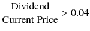
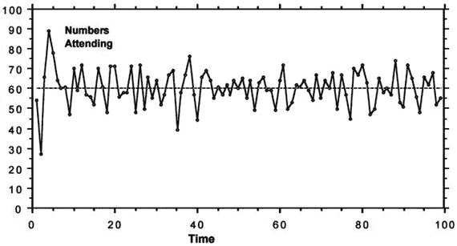

# 基于此参照点

基于此参照点，它们可以改变自身行为以及与其他智能体的结盟关系。将随机性引入系统的能力，使我们能够观察到智能体将如何改变其行为及相互连接方式。以股市为例，我们可以设想一位经纪人决定清仓，因为他需要为一所昂贵学校的孩子支付大学学费，或者因为他中了彩票，决定退出游戏，在余生中啜饮椰林飘香鸡尾酒。这将会在他与那些曾与他合作的智能体之间造成断裂。由于智能体可以访问历史数据，问题就变成了：这些其他智能体在下次得知他们合作的一位股票经纪人同伴刚刚中了彩票时，将如何改变其行为？

无法确定新的中奖者是否会走上“椰林飘香”之路。他反而可能决定将奖金投资于自己的投资组合以求长期收益。这会对与他合作的其他智能体产生连锁效应。因此，问题就变成了双重性的：（1）当智能体意识到其中一人中了彩票时，他们会如何表现？他们会因为过去的经历而断绝关系，还是会基于直觉/个人偏见/情感忠诚而决定加强与这位幸运中奖者的联系？（2）当这位中奖的智能体执行了一个与过去处于相同位置的另一智能体不同的行动时，会发生什么？为什么他没有选择“椰林飘香”之路（也许退休计划不适应当前的经济环境？）？是环境导致了这一决定，还是智能体固有的风险规避水平？ABM 使我们能够观察这些变化的发生过程，并创建与现实相似的场景。

虽然 ABM 的目标是对单个智能体进行编码，但模拟成千上百万个智能体确实需要巨大的计算能力。这是任何模型或模拟所特有的权衡。细节越多，建模决策的数量就越大，所需的计算能力也越高。这个问题部分可以通过对模型的某些部分进行“黑箱化”处理来克服（Wilensky and Rand, 2015）。黑箱化是一种策略性地使用方程来控制模型中计算密集型部分的方法。但在需要时，这个黑箱可以被“打开”。

之所以进行黑箱化，是因为构建模型所使用的变量或自由参数数量众多。ABM 拥有多得多的自由参数，以帮助其表示所试图描绘的过程或环境的细节水平。但纳入这些自由参数很重要，因为它使我们能够控制模型的假设。虽然 EBM 会“精挑细选”它们的自由参数并对其运作方式做出假设（因为并不总能将它们纳入方程），但 ABM 则揭示这些假设，并根据观测到的现实世界数据校准自由参数。这是一项耗时但重要的任务，因为它为我们提供了丰富的个体层面数据。

正如智能体的支配行为被定义一样，它们的交互规则也同样被定义。因此，要设置或修改这些参数和建模决策，就需要 ABM 建模者掌握单个智能体如何运作的方式。获取这种见解是 ABM 的先决条件，但对于 EBM 则不然。虽然我们不需要在 ABM 中对微观行为进行建模，但我们确实需要理解微观行为和个体层面的机制。这可能需要建模者拓宽其研究范围，有时甚至会超出其专业领域。但当我们研究社会系统时，这也可谓是因祸得福。

回想我们之前的股票市场例子——思考单个股票经纪智能体的行为特征，比思考该智能体中彩票的消息将如何影响与之相关的众多智能体要容易得多。事实上，建模者甚至不必深入到关于单个智能体特征的极其繁琐的细节之中。从一些初始假设开始，建模者可以生成一个代表这些假设的模型。随着系统动力学在离散的时间步长上演化，其结果可以检验其有效性，如果它们能代表现实世界的现象，就形成了一个概念验证。

这种方法的优势在于，它可以用于研究对初始条件不敏感的系统的一般属性，或者用于研究具有相当清晰初始条件的特定系统的动力学，例如婴儿潮一代退休对美国股市的影响（Bandini et al., 2012）。

## 设计 ABM 模拟

ABM 的主要目标是，利用具有特定属性和支配规则的智能体（小程序），为现有系统构建一个计算机化的对应物，然后在计算机中模拟该系统，直到它类似于现实世界现象。实现这一目标后，我们就可以创建多种场景，以更细致的层面理解系统，并识别出对系统有利或不利的威胁和条件。

创建 ABM 取决于多种因素，例如试图建模的对象以及该主题的可用数据。ABM 通常分为两类模型：基于现象的建模和探索性建模。

在前者中，模型是基于一个已知的现象开发的，该现象表现出某种特征模式，并作为参考模式——例如：星系的螺旋形状、城市地区的人口统计学隔离、花朵中看到的对称性等……目标是使用规则定义的智能体重现参考模式。一旦实现这一目标，就可以进行更改，以观察可能出现的新模式。

后者在本质上更具演绎性。在为智能体赋予规则后，让智能体进行交互，探索出现的模式，看它们是否与真实世界现象相关联。然后修改模型，以便为我们提供关于发生了什么以及我们如何达到该状态的一种解释。

模型的结构也可以基于构建它所采用的方式。如果建模者拥有关于智能体类型和环境基本特征的充分信息，他可以采用自上而下的方法，并遵循结构化的概念蓝图来构建模型。

如果建模者没有这种细粒度的洞察力，那么他可以采用自下而上的方法，即从底层开始创建模型，通过发现主要的机制特性是什么、智能体的特征是什么以及需要回答哪些研究问题。这样做时，模型的概念阶段和构建阶段是同步发展的。大多数建模者在创建模型时会同时使用这两种风格。

无论采用何种方法，每个 ABM 都有三个基本组成部分——智能体、智能体所处的环境，以及智能体与环境之间以及它们彼此之间的交互。让我们更详细地阐述这三个组成部分。

### 指定智能体行为

在选取智能体的行为特征和状态时，**具体性**至关重要。赋予智能体过多信息，可能导致其难以管理并执行不合逻辑的举动。**独特性**同样关键。如果智能体要以合乎逻辑的方式交互，则必须能够彼此区分。因此，智能体行为的两个主要方面是：它们所拥有的属性，以及它们基于自身行为所执行的行动（Wilensky 和 Rand, 2015）。

指定智能体的行为，就是让它知晓自己能采取哪些行动。这些行动可以包括改变环境状态、改变其他智能体状态或改变自身状态的方式。智能体的行动通常分为两类：**反应式**或**慎思式**。反应式智能体是简单的智能体，它们遵循“条件-行动”规则，通常不具备记忆功能，其存在是为了在环境中执行非常特定的角色（例如：如果 `input = 0`，则说“hello world”；否则，什么都不做）。它们根据从其他智能体或环境接收到的输入来执行行动。它们不能主动行事。

慎思式智能体则更为复杂，它们拥有一个行动选择机制，该机制受制于关于环境的特定知识以及对过往经验的记忆。这使得它们具备心理状态，因此也被称为认知智能体。它们利用这种状态，针对所接收到的每一组感知信息，选择一系列行动。所选行动序列旨在实现一个预设目标。因此，慎思式智能体遵循一套特定的信念、愿望和意图（BDI 架构），其中信念代表智能体关于其环境的信息，愿望是智能体的目标，而意图则代表智能体已选择并承诺执行的愿望（Bandini 等人, 2012）。

大多数基于智能体的模型（ABM）可以混合包含反应式和慎思式智能体，且这种混合是异质的。所有智能体还需要知道：当环境发生变化时如何应对，以及当其他智能体执行特定行动时自己需要采取什么行动。根据它们能采取的行动类型，我们可以将智能体归为不同的类别。例如，一个智能体可能被编码为扮演投资者角色（慎思式），而另一个智能体则可能被编码为仅发挥连接者功能（反应式），负责连接投资者之间或投资者与企业，但其本身并不进行投资。通过这种分类，我们可以在模拟中拥有执行特定角色的“品种”。通过将智能体划分为不同种类的群体或品种，我们就能看出哪些交互和决策导致了某种现象的产生，以及谁对此负责。

所有将要采取的行动，都可以表示为规范和约束智能体行为的系统命令。因此，行动是智能体为实现既定目标而执行的复杂任务，并且这些任务会考虑到环境的反应以及对先前行动的修正（Bandini 等人, 2012）。

### 创建环境

环境充当着控制参数的角色，智能体的行动正是在这些参数基础上进行的。环境包含智能体在模型中行动和交互时周围的各类条件和栖息地。然而，环境与智能体之间的关系并非单向的——随着智能体与环境交互，环境也会根据它们的决策而发生改变。环境的不同部分也可能具有不同属性，并对邻近的智能体产生不同影响。因此，环境负责：

-   定义并间接强制推行规则。
-   反映并管理所有智能体的社会安排。
-   管理智能体对系统特定部分的访问权限。
-   通过提供正确的输入数据，辅助智能体的决策过程。
-   维持内部动态（例如，资源的自发增长、智能体发出的信号消散等）（Bandini 等人, 2012）。

环境的一个重要组成部分是**时间步长**，它决定了行动顺序的执行序列。智能体根据其行为规范以及对其他智能体行动的解读，对自己的行动拥有自主权和控制权。但时间仍然扮演着关键角色，因为智能体的行动必须按一定序列发生。因此，环境通过时间步长来协助管理这一属性。

环境还可以基于真实世界场景进行建模——例如，`Netlogo`，²⁸ 是 ABM 中用于建模去中心化、相互关联现象的热门平台之一，它允许我们利用地理信息系统工具包或社交网络分析工具包来创建模拟真实世界环境的环境。

### 执行智能体交互

ABM（基于智能体的建模）的主要目标是观察智能体之间以及智能体与环境之间的交互。在经济模型中，通常采用自上而下与自下而上相结合的方法——自上而下的组成部分包括环境宏观经济因素，如生产、交换、就业等的变化。智能体在种类上具有异质性，因为这会导致对涌现现象产生更大影响的交互。

智能体有多种交互方式：

- **直接交互** - 在此类模型中，智能体之间存在直接的信息交换。点对点消息交换协议规范了智能体之间的信息交换。在开发这些模型时，需要谨慎对待交换格式。
- **间接交互** - 在间接交互模型中，一个中间实体调节智能体之间的交互。该实体甚至可以对交互进行调控（Akhbari 和 Grigg，2013）。

这种智能体交互方式的差异提供了交互机制，使得协作能够在不同层面发生。在现实世界中，协作是一项分布式的任务，因为并非所有智能体都能由于知识、角色和能力的差异而做出决策。因此，拥有独立的交互机制为智能体交互提供了特定的抽象，并提供了分离的计算和协调上下文（Gelernter 和 Carriero，1992）。

例如，如果交互效应较弱（如拍卖市场中所见），那么模型的结构维度（如成本以及买卖双方的数量）将决定市场结果。如果交互效应较强（如劳动力市场中所见），那么市场结果将高度依赖于市场结构中观察到的交互网络（Salzano，2008）。

这种交互强度的概念引出了 ABM 建模中的最后一个概念：规模。如果我们要对一个经济体进行建模，我们应该细化到何种粒度？我们是应该对个体人进行建模，还是应该将大型群体（银行、金融公司）建模为代表大型人群的单一实体？真的有必对多个微观智能体进行模拟吗？

在与该领域的几位专家（包括多恩·法默²⁹和杰基·马利特³⁰）讨论过这个问题后，我得到的共识是模型越详细越好。正如马利特在一次一对一访谈中所说：

> “数学系统建模或模拟的简单规则是，你必须模拟并建模到能够显示影响系统行为的最底层细节。我们来自物理学领域，不需要包含详细的原子级建模来重现太阳系中行星的行为，尽管了解它们各自的质量很重要。事实上，物理学通常处理的是微观层面不影响宏观层面的系统——不幸的是，这种方法似乎对宏观经济学产生了强烈影响，而没有人质疑其基本假设。然而，反过来，如果能够证明某一特定层级的细节确实会影响更大系统的行为，那么你就需要将其纳入模型。这在所有学科中都是如此……这就是为什么可以忽略所有不包含银行体系的经济模型，因为很容易证明，国家间银行体系结构或其使用的金融工具的差异会影响经济。关于[建模]单个家庭的问题提出了一个非常重要的议题：在这一层面上是否存在可能影响宏观经济的差异？答案是存在，这些差异包括财富分配、财产所有权、遗产继承和养老金提供方式——例如，德国的现收现付制与金融化方法大相径庭，后者对经济其他部分有重大影响，因为它会影响经济中可获得的贷款量。”（另见：‘对 VerðtryggðLán（指数挂钩贷款）对冰岛银行体系影响的研究’，马利特，2014 年）。

至此，我们简要介绍了基于智能体计算经济学的关键主题和设计参数。

## 使用中的 ABCE 模型

在本节中，我们将回顾一些开创性研究，并了解一些在该领域取得重大进展的研究人员的工作。

### 金-马科维茨投资组合保险模型

最早的多智能体模型之一是由 H.M. 马科维茨和 G.W. 金为模拟 1987 年股市崩盘而构建的。马科维茨因在现代投资组合理论方面的开创性工作而获得诺贝尔奖。但除此之外，他也是 ABCE 领域的先驱之一。他们开展仿真研究的动机源于 1987 年的股市崩盘，当时美国股市在几天内下跌了超过百分之二十。崩盘之后，研究人员集中精力审视外部和内部市场特征，以寻找崩盘原因。金和马科维茨决定利用 ABM 来探究采用投资组合保险策略的智能体比例与市场波动性之间的关系（Samanidou 等人，2007）。

基于金-马科维茨的智能体模型包含两类个人投资者：再平衡者和投资组合保险者（CPPI 投资者³¹）。再平衡者的目标是保持其投资组合的恒定构成——他们打算将一半财富持有股票，另一半持有现金。另一方面，投资组合保险者遵循一种旨在在指定的保险到期日保证最低财富水平的策略。保险者遵循这一策略是为了确保其最终损失不会超过在此时间段内其投资的某个特定比例。

在仿真开始时，每个再平衡者智能体的投资组合价值相同（$100,000），其中一半是股票，一半是现金。由于智能体被编程为维持这种投资组合结构，如果股价上涨，再平衡者将不得不卖出股票，因为随着股价上涨，股票在其投资组合中的权重会增加。因此，再平衡者会卖出股票，直到股票再次占其投资组合的 50%。如果股价下跌，那么再平衡者则会反向操作，买入股票，因为其股票价值也会随价格下跌而减少。因此，再平衡者通过高卖低买对市场产生了稳定作用。

保险者的规则也按类似思路构建，其目标是确保在一个季度内，其初始财富的损失不超过某个特定百分比（例如 10%）。因此，保险者旨在确保在每个周期中，初始财富的 90% 都处于无风险状态。为实现这一目标，他假设股票资产的当前价值一日之内不会下跌超过某个因子 2（Levy, 2009）。基于这一假设，他始终持有等于当前财富与初始财富 90% 之间差值的两倍的股票。这决定了保险者在每个阶段买入或卖出的数量。

如果价格下跌，保险者会希望减少其计划持有的股票数量，从而卖出股票。这样做可能破坏市场稳定，因为保险者向市场抛售股票，进一步压低价格。另一方面，如果某只股票的价格上涨，那么保险者希望持有的股票数量会增加，导致他买入更多股票。这一行为会进一步推高股价，并在此过程中形成价格泡沫。

对这两种智能体进行的仿真表明，相对较小比例的保险者就足以破坏市场稳定并引发崩盘和繁荣。因此，金和马科维茨得以证明，保险者所遵循的策略才是导致崩盘的原因（另请参阅：《基于智能体的计算经济学》，Levy, 2009；《金融市场的基于智能体模型》，Samanidou 等人，2007）。

### 圣塔菲人工股票市场模型

这个模型，也被称为亚瑟、霍兰德、勒巴伦、帕尔默和泰勒股票市场模型，于 2002 年创建，用于研究基于内生智能体预期的资产价格变化。当时，标准的新古典股票市场模型假设所有投资者都是同质的，并使用相同的预测来制定投资策略。虽然该理论很优雅，但上述研究人员发现这些假设不切实际，因为它排除了在真实市场中出现的泡沫、崩盘、价格波动和极端交易量的可能性。因此，他们创建了一个 ABM，其中投资者必须创建自己的预测，并在一段时间内学习哪些预测有效，哪些无效。

他们模型的前提是，异质智能体基于对其他智能体预期的预判来形成自己的预期。因此，智能体必须不断形成个体化的、假设性的预期模型，利用这些模型创建理论，然后检验这些理论是否有效。糟糕的假设会被抛弃，新的假设会被引入。这些变化会改变智能体的预期，从而影响价格。因此，价格受到内生因素的影响，并与市场共同演进，而市场又由智能体共同创造（LeBaron, 2002）。

由于智能体的异质性在模型演化中扮演着重要角色，作者们还特别强调了归纳推理。每个归纳理性的智能体被期望生成多个预期模型，这些模型会根据其预测能力而被接受或拒绝。随着价格和股息的变化，智能体总体行为的模式也被预期会发生变化，因为智能体会制定新的策略。作者将这种市场“心理”定义为“在一给定时间点上被付诸行动的一系列市场假设、预期模型或心智信念的集合”（Arthur, 2013）。

为了简化对智能体策略的研究，研究人员将预期结果归为两种管理机制——一种是理性基本面策略占主导的机制，另一种是投资者开始基于技术交易制定策略的机制。

一个基本面规则可能需要类似（例如）的市场条件：

一个技术规则会有不同的条件，例如：

过去价格的 6 期移动平均线

如果技术交易机制正在运作，那么那些遵循基本面策略的智能体将受到市场的惩罚而非奖励。通过将策略归为两种机制（基本面 vs. 技术），研究人员还能够分析市场的波动性属性（如聚集性、过度波动等）的影响。

最初，模型构建者模拟了市场中的单只股票，并给智能体三种选择：

1.  出价买入一股
2.  出价卖出一股
3.  什么都不做。

这三个选择随后与智能体的行为动作相结合，这些行为动作以概率方式规定了他们在不同市场条件下应如何行动。如果市场创造了这些规则未覆盖的条件，智能体将无所作为。但如果市场创造了适用多条规则的条件，那么智能体将根据在这些条件下哪条规则得到更好支持来进行概率性选择。该选择也受到智能体过往行为的影响——如果某条规则之前有效，那么它更有可能再次被使用。

### 基于代理的模型与市场动态

随着代理开始买卖股票，价格会根据需求函数而波动。环境被赋予指令，要求根据这些需求请求来抬高股票价格。随后，使用常绝对风险厌恶（CARA）效用函数来转换由需求变化做出的价格预测，以启动代理的买入/卖出响应。代理策略中的权衡会受到当前生效制度的影响——即基本面规则制度或技术规则制度。

建模者发现，经过一段时间后，规则和策略开始发生变异和变化。较弱的规则被过去最成功的规则副本所取代。这代表了代理在学习能力上的表现，即它们会审视新策略并采纳最佳策略。该模型的发现表明，当存在一小群代理且其规则数量较少（且股息变化很小）时：

*   不会出现崩盘、泡沫或任何异常现象。
*   交易量较低。
*   代理遵循几乎相同的规则。
*   股票价格将收敛于均衡价格。

然而，当存在大量代理且规则数量众多时：

*   代理会变得异质化。
*   代理会集体执行自我实现的策略，导致价格大幅波动。
*   交易量会发生波动，大量的交易会引发泡沫和崩盘。
*   规则和策略会随时间变化且具有时间依赖性——如果某个策略在过去有效，并不能保证在较晚的时间点重新引入时同样有效。

随后，建模者开始运行多次模拟，涉及不同数量的股票、代理以及不同的规则集。他们得出结论：代理表现出反射性（参见上文索罗斯的观点），并且市场价格基于代理的预期形成。这些预期又建立在对其他预期的预判之上，这表明预期本质上是归纳性的，而非演绎性的。由具有归纳理性的代理组成的此类市场存在于两种制度之下——一种是与理性预期均衡相对应的简单制度，另一种是更现实、复杂且自组织的制度，后者会表现出泡沫和崩盘的出现。基于模拟结果与现实世界市场现象之间的实证对比，他们由此能够证明金融市场处于复杂制度之中。自该结果发表以来，该模型产生了多种变体，并被广泛应用于经济学领域。

### 埃尔法罗尔问题与少数派博弈

埃尔法罗尔问题源于新墨西哥州圣塔菲一家名为“埃尔法罗尔”的酒吧。这是一个由布莱恩·阿瑟根据个人经历首次提出的决策问题。每周四晚上，埃尔法罗尔酒吧都会有现场乐队表演。但这给酒吧的常客们带来了问题，因为这意味着要去一个拥挤的酒吧，这相当令人不悦。

这也引出了一个经典的预期问题——如果一群代理都认为酒吧会过于拥挤，并决定周四晚上不去，那么去的人就会很少。如果大量代理认为酒吧不会太拥挤，并基于这种预期前往，那么就会人满为患。阿瑟提出的问题是：人们如何决定是否应该去酒吧？

阿瑟以一种简单的方式概念化这个问题——他设想有 100 个人喜欢周四在酒吧听音乐。如果这群人中的代理认为酒吧会变得拥挤（超过 60 人），他们就会呆在家里。如果他们认为不会拥挤，他们就会去。

如果出席人数信息是可得的，并且每个代理都能记住前几周（比如说三周）的出席人数，那么可以模拟代理基于这些规则运作一系列策略。代理可以根据不完美的信息规则来做出策略选择，例如：出席人数是上周的两倍，或者最近三周出席人数的平均值，等等。基于这些输入，代理可以预测本周会有多少人出席，并随之做出是否前往的选择。

该模型因此按以下方式构建：

*   过去 X 周的出席人数 = 44, 56, 73, 23, 56, 89, 44......
*   代理的假设——预测下周的出席人数为：
    *   与上周相同（此处为 44）
    *   过去几周的平均值
    *   与两周前相同
    *   最近四周的平均值，以此类推……
*   每个代理有一定数量的预测器来做出决定
*   其决策基于这组预测器中更准确的那个，尽管这每周都会变化。

使用这种运作方式，当阿瑟运行他的基于代理的模型（ABM）时，他发现无论代理使用哪种策略，平均出席人数都大约在 60 人左右，并且平均有 40%的代理预测人数超过 60，60%的代理预测人数低于 60。此外，尽管代理在这些群体中的成员身份不断变化，人口仍然在一段时间内维持着这个 40/60 的比例。这些发现，如图 4-9 所示，得出了以下结论：即使面对不完美的信息和多种策略，代理也已设法最优地利用了酒吧这一资源。

图 4-9. 埃尔法罗尔问题前 100 周的酒吧出席人数 来源：《归纳推理与有限理性：埃尔法罗尔问题》，阿瑟，1994 年

埃尔法罗尔模拟是复杂性领域的基石，多年来被众多论文和文章引用。1997 年，两位物理学家达米安·沙莱和 Y.-C.·张将其推广并转化为博弈形式，创建了他们所谓的“少数派博弈”。该模型具有经济学起源却由物理学家发展而来，这显示了少数派博弈的跨学科性质。

