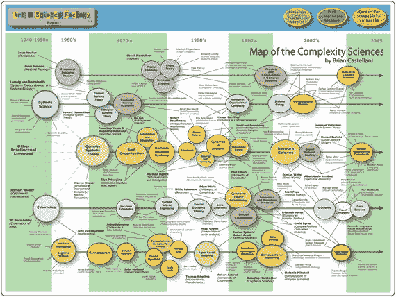

# 艾尔法罗尔酒吧问题与少数者博弈

在最初的艾尔法罗尔酒吧问题中，一个群体中的每个个体都需要决定每周四晚上是否去酒吧。酒吧的座位有限，最多只能容纳总人口的`x%`。如果去酒吧的人数少于`x%`，那么酒吧的演出被认为是令人愉快的。反之，酒吧里的所有人都会经历一场不愉快的演出，而待在家里被视为比去酒吧更好的选择。阿瑟发现这个`x%`是 60%，并且参与者会利用他们不断变化的过往经验来做出决策。

在少数者博弈中，所使用的信息不再是过去参与人数的历史，而是一串记录了过去几轮获胜预测或行动的二进制比特串。策略的预测内容是下一轮中的获胜选择，而不是对实际参与人数的预测。因此，博弈采用了二进制信息和预测，并且每轮游戏的获胜选择是由少数派的选择（而非酒吧问题中的参数`x`）决定的。这使得两个选择是对称的。由于少数派规则，原始设定中参与人数被限制为奇数（Yeung and Zhang, 2008）。

博弈过程如下：

*   共有`N`个参与者在`N`轮重复博弈中竞争，其中`N`为奇数。
*   在每一轮中，每个参与者必须在两个行动（即`0`和`1`）中做出选择，这两个行动也可以被解释为“卖出”和“买入”行为。
*   该轮中的少数派选择获胜，所有获胜的参与者将获得奖励。
*   博弈开始时，每个参与者从一个策略池中抽取`S`个策略，这些策略将帮助他们在整个博弈过程中做出决策。
*   这些策略可以以表格的形式呈现，每个策略包含一个“历史列”（或“信号列”）和一个“预测列”。

| 历史 | 预测 |
| --- | --- |
| 000 | 1 |
| 001 | 0 |
| 010 | 0 |
| 011 | 1 |
| 101 | 0 |
| 111 | 1 |

*   在游戏的每一轮中，参与者根据该时刻得分最高的策略做出决策。如果存在多个得分最高的策略，则会随机选择其中一个来执行。

少数者博弈是一个简单模型，用于描述参与者在理想化情境下的集体行为，他们必须通过适应过程来竞争有限资源。由于该博弈的基础策略基于归纳推理和参与者之间的互动，因此衍生出了各种更新版本和变体。随着少数者博弈被视为一个简单的金融市场自适应多智能体模型，围绕该模型在金融市场互动中的应用积累了大量的研究兴趣。

基于金融市场中投资者可能存在的互动关系，该博弈的一些变体对真实金融数据展现出一定的预测能力。尽管少数者博弈模型简单，但它们建立了一个基于智能体的模型框架，可以由此构建复杂的交易模型，并可能应用于实际交易。尽管这些复杂的模型通常用于私人交易而不对外公开，但少数者博弈正日益成为理解金融市场动态的有用工具。

## ABCE 模型的最新发展

所讨论的三种 ABCE 模型是复杂性经济学领域的“经典”。然而，它们只是冰山一角。继这些开创性工作之后，在过去几年中，该领域的研究日益增多，逐渐吸引了来自多个领域、背景更加多元的研究人员，来测试、试验并理解复杂金融系统中正在发生的经济变化。表 `4-2` 展示了当前正在探索的研究领域以及正在形成中的洞见轨迹。所涉及的问题范围广泛——从识别系统性风险的方法，到研究部分准备金银行的限制，再到利用 ABCE 的见解来指导政策制定。

`表 4-2.` ABCE 论文和研究项目精选（排名不分先后）

| 作者 | 书籍/研究项目/文章 |
| --- | --- |
| Gaffard & Napoletano | 《基于智能体的模型与经济政策》，2012 |
| 康伟，孙彩虹 | 《基于 JASA 的人工股票市场模型构建》，2011 |
| Jacky Mallett | 《Threadneedle：一个用于模拟和分析部分准备金银行系统的实验工具》，2015 |
| Berman, Peters and Adamou | 《远离均衡：美国的财富再分配》 |
| Hartmann, Guevara, Jara-Figueroa, Aristarán, Hidalgo | 《连接经济复杂性、制度与收入不平等》，2015 |
| Foxon, Köhler, Michie and Oughton | 《迈向可持续发展的新复杂性经济学》，2012 |
| Alfarano, Fricke, Lux, Raddant | 《银行间市场网络方法：前言》，2015 |
| Arinaminpathy, Kapadia, May (英格兰银行) | 《模型金融系统中的规模与复杂性》，2012 |
| Aymanns, Caccioli, Farmer, Tan | 《驯服巴塞尔杠杆周期》，2016 |
| Baptista, Farmer, Hinterschweiger, Low, Tang, Uluc (英格兰银行) | 《英国住房市场基于智能体模型中的宏观审慎政策》，2016 |
| Giovanni Dosi, Giorgio Fagiolo, Mauro Napoletano, Andrea Roventini, Tania Treibich | 《复杂演化经济体中的财政与货币政策》(2014) |

参考文献中列出的研究人员的资质表明，他们中有相当多的人并非经济学专业出身。事实上，他们中的大多数人主要拥有数学、物理学和/或计算机科学领域的资格。这表明，随着复杂性经济学的发展，其进展是由来自多种科学背景的多元化研究人员群体共同推动的。通过将科学训练的标准应用于经济学主题，这些研究人员正在创造一种新的经济思维范式。

这就是复杂性科学的承诺。尽管经济学过去一直被教条主义意识形态和过时的 DSGE 模型所束缚，导致了对经济学的低效理解，但复杂性科学正在探索的方法提供了一种更加跨学科的途径，因为它们借鉴了丰富多彩的各种科学。图 `4-10` 展示了各个科学领域及其关键人物对这一进展的贡献。

`图 4-10.` Brian Castellani 制作的复杂性科学图谱。来源：[`www.art-sciencefactory.com/complexity%20map.pdf`](http://www.art-sciencefactory.com/complexity%20map.pdf)

前面三章试图展示为什么经济学研究需要升级。正如我们所看到的，这一点至关重要，因为政策制定者正是基于这些模型和理论来做出治理我们经济的决策的。这种思维方式正是我们可以统称为资本主义的东西。