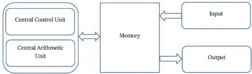

# 在经济网络中使用复杂性模型与信任

借助复杂性模型，伊达尔戈开发了`TCT`，用以说明在经济网络中，链接成本越低，网络规模就越大。他运用科斯的理论指出，信任是社会资本的关键要素，它是维系和形成大型网络所需的粘合剂，而这样的网络能够促进其中积累的知识与技能的传播。信任通过降低链接成本来扩大网络规模。因此，链接的建立变得更加容易，因为创建新链接不再被视为高风险行为。相反，低信任网络会形成边界渗透性较差的网络，从而限制了其长期适应能力。他在书的结尾总结道，经济增长建立在信息增长的基础之上，而那些更擅长促进信息增长的国家则更加繁荣。总而言之，信任水平越高，经济越复杂，经济就越繁荣。

由于`区块链`是一种通过共识和透明度以加密方式强制执行约定合约的机制，它提供了一种在很大程度上降低信任需求的控制机制（Davidson 等人，2016）。随着`区块链`的采用率持续上升，它为政府提供的潜力不仅在于提高透明度，还在于作为增强经济信任度的一种方式。在一个饱受技术性失业和不平等困扰的世界里，`区块链`为政府提供了多种途径来重新思考其职能以及构成其经济的各种制度。

此外，对于在这些去中心化网络上流动的交易数据，政府不必被动旁观。通过运用复杂性经济学的方法，他们可以利用这些数据来观察一个经济体的重要组成部分之间如何发生交易，以及它们的互动如何改变生态系统。利用这些信息，他们可以创建模拟，以了解货币和财政政策（即：环境变化）将引发何种反应，以及这些环境变化的涟漪效应将如何影响经济中的较小参与者。货币和财政政策将不再需要具有被动反应的性质，而是可以具有前瞻性。

当然，过渡到这样一种框架并非一蹴而就的过程，因为这迫使我们从根本上重新思考市场基础和经济政策制定。但正如我们本章所见，这一进程已经开始，并且一个全新的科学研究领域正在重新构建我们对经济理论基础的认识。如何实施这一过程，以及它在微观、中观和宏观层面将带来的挑战，是未来几年需要详细探讨的课题。本书的篇幅有限，无法对所有与此努力相关的问题提供如此百科全书式的概述。正如从一开始就提到的，本书的目标一直是改变我们当下有关资本主义的对话方向。正如我们在这四个章节中所见，这种对话在部分学术界和政策圈中已经开始。我的目标是让这些对话发出集体的声音。

## 结论

> “我认为下一个世纪将是复杂性的世纪。”——斯蒂芬·霍金，2000 年 1 月

经济学与生态学有着共同的词源。它们都源自希腊语中表示“家”的词——"Oikos"。"Logy" 源自另一个希腊词"Logos"（源自 `legein`），意为收集、计数或说明。而"Nomos" 则源自希腊语"Nemein"，意为分配或管理。因此，生态学在根源上指代的是居所的逻辑，或我们居住地的故事。经济学是`eco`加上`nomos`，意为家务管理（希腊语`oikonomia`）。

令人惊讶地发现，尽管这两个词同源，但在历史进程中它们已完全分道扬镳。这不仅体现在它们被研究的方式上，也体现在它们被相互对立的方式上。随着金融化程度加深、过度消费主义盛行、债务与不平等持续上升，气候变化和生态破坏的问题也日益严峻。我时常思考，如果我们当初开始学习经济学时，采用的是生态学家的视角，而非物理学家的工具（瓦尔拉斯方法），我们的生态是否还会是今天这般模样。

经济学那种陈旧的学科沙文主义似乎也忽略了其希腊表亲——民主。资本主义与民主常被视为携手并进，是天然的盟友。大多数资本主义国家同时也是民主国家，在某种程度上，尽管资本主义和民主都存在种种缺陷，但因为没有合理的意识形态替代方案，它们仍被广泛接受。然而，随着世界因`区块链`等技术的进步而日益复杂，我们需要留意这些技术的影响是什么，以及我们如何研究这些变化所带来的后果。

仅仅专注于技术的应用无法实现这一壮举。它还需要我们对经济史有深刻的理解。正如我们在本书中所见，我们今天面临的许多问题的解决方案，早在几十年前就已经由那些对经济理论的局限性以及在自由民主背景下资本主义的定义有着深刻理解的经济学家提出了。亚当·斯密、大卫·李嘉图、卡尔·马克思，直至熊彼特，都试图忠实于这种方法。亚尼斯·瓦鲁法基斯在 2016 年 4 月于新学院的一次演讲中最好地总结了这一困境：

> “没有国家的资本主义就像没有地狱的基督教。它行不通……将资本主义和民主视为天然盟友是一种非常晚近的现象……[但是]除非我们通过……同时研究经济史……或资本主义史、生产关系与技术之间的冲突演变，[以及另一方面]我们关于正在被这一历史演化过程所塑造的世界的观念的演变……来研究它（资本主义研究）……除非我们通过这个棱镜来研究过去、现在和未来的可能性，否则我们绝无可能利用数学化方法来把握我们所处的现实。”

今天的资本主义所走向的方向，是在它成为共产主义之前的一个阶段——资产阶级自由民主。利用那些正在改变资本主义定义的技术，来创建一个更理性、更公正且更符合科学现实的资本主义版本，是我们共同的责任和替代性义务。

在一个任何问题的答案都能被找到的信息世界里，真正的价值来自于提出正确的问题。`区块链`是一种用于转移价值并记录这些信息的工具。是时候开始提出正确的问题了：我们能利用这个工具做什么？

## 一些最后的说明

以下部分为本章前面涉及的主题提供了进一步的视角：

*   第“技术与发明：一个组合过程”节
*   边栏 4-1：“理性预期的理论基础”
*   第“均衡经济模型的数学魔法”节

### 计算简史

资料来源：《计算宇宙：一场革命之旅》，托尼·海伊与久里·帕帕伊著（2014 年）；《现代计算史（第二版）》，保罗·E·塞鲁齐著（1998 年）。

计算与计算机的故事可以追溯到 19 世纪初，当时一位在剑桥接受过教育的数学家查尔斯·巴贝奇首次萌生了制造一台机器来计算对数表的想法。1819 年，在离开剑桥后不久，巴贝奇正与天文学家约翰·赫歇尔合作，手工进行算术计算。由于这个过程既繁琐又容易出错，巴贝奇突然想到可以制造一台机器，通过遵循精确的算术程序来执行常规计算。这促使巴贝奇开始着手研究他后来称之为“差分机”的机器——一种能够计算天文和航海表，并将结果记录在金属板上（以便直接用于印刷）的机器。该项目后来由英国政府资助，由巴贝奇和约瑟夫·克莱门特共同开发了十多年。由于巴贝奇与克莱门特之间的分歧，该项目于 1842 年被取消，并已花费政府超过 17,000 英镑——这在当时是一笔巨款。

巴贝奇的差分机是第一台专用计算器，也是他下一个构想——分析机的基础。尽管他从未获得资金来推进第二个项目，但其设计理念（记录在超过 6000 页的笔记、数百张工程图纸和操作流程图中）是当今现代计算机的基础。这些理念包括一个独立的计算部分（我们今天称之为中央处理器（`CPU`））、另一个用于存储数据（或内存）的部分，以及一种向机器提供指令的方法（编程语言）。与巴贝奇通信的艾达·洛夫莱斯也在编程语言的发展中发挥了 influential 作用，她强调分析机不仅可以进行数值计算，还可以操作符号。然而，编程语言的真正进步来自乔治·布尔，他设计了一种语言来描述和操作复杂的逻辑语句，以判断语句的真假。尽管创建了布尔代数的布尔本人并未从事计算工作，但他的逻辑运算（`AND`、`OR` 和 `NOT`）思想后来被用于提升后续计算机的性能以及创建逻辑门。

20 世纪 30 年代中期，美国工程师、发明家、二战期间美国科学研究与发展局（`OSRD`）负责人万尼瓦尔·布什创建了一台被称为“微分分析机”的模拟计算机。这台计算机用于求解常微分方程，这有助于计算炮弹的弹道。它由多个旋转圆盘和圆筒组成，由电动机驱动，并通过金属连杆连接，需要手动设置（有时长达两天）来解决任何微分方程问题。万尼瓦尔招募了克劳德·香农（今天被称为信息论之父），一位专攻符号逻辑的年轻研究生。

尽管微分分析机是一台带有活动部件的机械机器，但香农将其识别为一个带有继电器的复杂控制电路。因此，香农开始创建第一代电路设计，并在此过程中，能够将信息转化为可由机器操作的数量。利用布尔代数、逻辑门和二进制算术（比特和字节），香农能够用数字表示所有类型的信息，并在此过程中为当今的现代信息论奠定了基础。正因如此，他被称为信息技术之父。

随着 1939 年第二次世界大战的爆发，这些信息技术的进步已被各国军方采用，用于传递敏感信息。密码学成为掩盖信息的一种合适方式，并促成了恩尼格玛密码机的诞生。对盟军来说幸运的是，希望来自于另一位剑桥数学家艾伦·图灵几年前所做的一些工作。图灵与他的导师马克斯·纽曼一起着手设计和建造能够解密德国军方秘密通信的自动化机器（图灵机）（正如热门电影《模仿游戏》中所记载的那样）。然而，由于战时及战后数年对保密的执着，图灵和布莱切利园团队在计算机发展方面取得的成就一直未被公开。

与图灵机同期，在大西洋彼岸，约翰·莫奇利和普雷斯珀·埃克特正在开发一台名为 `ENIAC`（电子数值积分计算机）的机器。对气象学感兴趣的物理学家莫奇利试图开发一个天气预报模型。但他很快意识到，没有某种自动计算设备，这是不可能实现的。因此，他提出了使用真空管制造电子计算机的概念。正是在开发 `ENIAC` 期间，他遇到了博学多才的约翰·冯·诺依曼，并在他的帮助下设计出了一台存储程序计算机 `EDVAC`（电子离散变量自动计算机），这是第一台二进制计算机（`ENIAC` 是十进制的）。见图 4-11。

图 4-11.  
电子离散变量自动计算机的总体设计。资料来源：《冯·诺依曼架构》，《计算宇宙》，2014 年

从抽象架构的角度来看，冯·诺依曼的设计在逻辑上等同于图灵的通用图灵机。事实上，冯·诺依曼在设计他的机器之前，已经阅读过图灵的理论论文。最终，正是这个简洁的设计被一代又一代的计算机科学家所发展，并导致了多处理器计算机的设计和并行计算的诞生。

战后的时期见证了计算机硬件方面的巨大进步。从早期的真空管和水银延迟线（一种充满水银的细管，用于存储代表二进制数据点的电脉冲——一个脉冲代表 `1`；没有脉冲代表 `0`），计算硬件迎来了磁芯内存的引入和硬盘的诞生。但在软件开发领域也取得了同样（甚至更加多样化）的进展。从穿孔卡片和简单的逻辑门开始，软件访问、计算和处理数据的能力取得了飞跃式的进步。像 `COBOL` 和 `FORTRAN`（`FORmula TRANslation`，公式翻译）这样的语言，帮助创建了早期操作系统，多年来，我们见证了软件设计和编程语言的兴起，例如 `BASIC`、`LISP`、`SIMULA`、`C`、`C++`、`UML`、`Unix`、`Linux` 等。最终，正是这些进步促成了分布式通信网络、互联网和万维网的构建。

