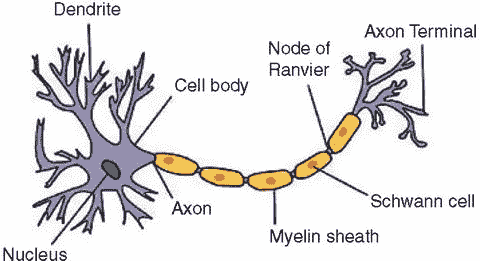
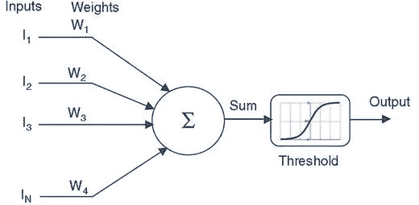

# 计算历史简述

计算的历史无法用简短的内容概括，鼓励读者查阅本注记开头引用的参考文献中列出的优秀书籍，以获得更详细的理解。提供此简要说明的目的在于强调技术是如何发展的。随着自然科学不同领域的每一次进步，技术都借鉴其前身，而创新来自于将不同技术家族中累积的微小变化结合起来。计算机可能源于数学，但正是物理学、化学以及最近生物学的发展，才使我们能够开发出今天的技术。如果没有这种科学探究方法和科学合流，我们将无法拥有今天的技术，也绝对无法谈论区块链。随着情感计算的进步，人类情感在技术演化中的作用将变得越来越重要。

## 神经可塑性

大脑包含约 800 亿个神经元，它们构成了大脑的线路，每个细胞通过化学和电信号与其他 10,000 个细胞相连。在大约 100 万亿个突触（神经元之间的连接）处，大脑是最复杂的网络，其动态互连的数量比银河系中的恒星和行星还要多。

大脑中互连的数量是学习的关键。在思考和学习的方面，大脑通过基于接触新想法和现有记忆，在大脑中建立新的突触连接来进行自我学习。当大脑接触到新想法时，这些连接会不断变化，并响应于经验、思维和心理活动。换句话说，心理活动（思考）不是大脑的产物，而是塑造大脑的东西。这被称为神经可塑性，正是它使我们能够学习新想法。这也是任何技能或才能得以发展的方式。

神经可塑性通过连接性（突触）发生变化。当接收到新信息时，会形成新的突触，现有的突触会断开，新的想法会涌现。基于哪些神经元受到刺激，某些连接会变得更强、更高效。如果某个动作被重复，现有的连接会得到加强，执行重复任务的能力也会变得更快。重复并不能帮助我们更好地学习，它只是让我们做事情更快。

随着更多连接的形成，我们学到更多，并能够将想法与现有知识联系起来。这使我们能够形成认知地图来解释世界，或者根据手头的信息形成某种信念体系。当接触到新想法时，大脑要么通过将新信息与已知信息进行验证来试图保护其现有想法，要么根据接收到的新信息更新其信念体系。

这种升级活动也受到社会属性以及我们在社区中位置的支配。心理学家将此称为自我形象，在此过程中，我们对信念体系的适应基于他人如何解读我们。因此，智力是一种协作努力，也是我们交流的首要原因——通过阅读、倾听、观看，以及最近的大脑间传输来传递知识。毫不奇怪，科学的进步基于合流，因为我们天生就是信息、经验和知识的社会传递者。

## 宏观经济模型的类型

来源：《预期在 FRB/US 宏观经济模型中的作用》，作者：弗林特·布雷顿、艾琳·莫斯科普夫、大卫·雷夫施奈德、彼得·廷斯利和约翰·威廉姆斯（1997 年）。

`FRB/US`是过去 30 年来开发的众多宏观经济模型之一。宏观经济模型是用于总结诸如国内生产总值（`GDP`）、通货膨胀和利率等经济变量之间相互作用的方程系统。这些模型可以分为几种类型：

- **传统结构模型**通常遵循凯恩斯范式，特点是价格调整缓慢。这类模型通常假设预期是适应性的，但将其融入特定方程的一般动态结构中，以至于预期本身的贡献无法被识别。以前在美联储使用的`MPS`和多国（`MCM`）模型就是例子。

- **理性预期结构模型**明确纳入了与模型结构一致的预期。例子包括目前在美联储使用的`FRB/US`和`FRB/MCM`模型的变体、泰勒的多国模型以及国际货币基金组织的`Multimod`。

- **均衡商业周期模型**假设劳动力市场和商品市场始终处于均衡状态，且预期是理性的。所有方程都紧密基于家庭效用最大化和企业利润最大化的假设。例子包括基德兰德和普雷斯科特以及克里斯蒂亚诺和艾肯鲍姆开发的模型。

- **向量自回归（VAR）模型**使用少量估计方程来总结整个宏观经济的动态行为，除了模型中包含变量的选择外，经济理论对其限制很少。`Sims`是这类模型的最初倡导者。

- **元胞自动机（CA）**：“自动机”（复数：“自动机”）是计算机科学和数学中使用的一个技术术语，用于描述一种假设的机器，它根据输入和先前的状态改变其内部状态（Sayama, 2015）。一个元胞自动机由一个规则的单元格网格组成，每个单元格处于有限数量的状态之一，例如开和关。每个单元格被一组称为其邻域的单元格包围。在特定时间（`t`），单元格及其邻域单元格根据某些固定的数学规则处于特定状态。这些规则还决定了单元格如何随时间更新以及它们如何与其邻域交互。随着时间从（`t`）推进到（`t + t`），通过相互交互和同步更新，产生新一代的单元格。

`CA`的原始想法由约翰·冯·诺依曼和斯坦尼斯瓦夫·乌拉姆提出。他们发明了这个建模框架，这是第一个用于模拟复杂系统的框架，目的是描述生命系统的自我繁殖和可演化行为。`CA`用于可计算性理论、数学、物理学、复杂性科学、理论生物学和微观结构建模。

- **神经网络**：更具体地说是人工神经网络（`ANN`），它们是处理设备（可以是算法或实际硬件），松散地模仿了大脑皮层神经元的神经结构，但规模较小（图 4-12）。

**图 4-12.** 生物神经网络示意图 来源：无边界心理学，2013

现代`ANN`的起源基于一个称为感知器的神经元的数学模型，由弗兰克·罗森布拉特于 1957 年提出（Papay and Hey, 2015）。如图 4-13 所示，该模型与神经元的结构非常相似，其输入类似于树突。

**图 4-13.**

