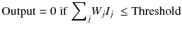
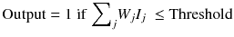
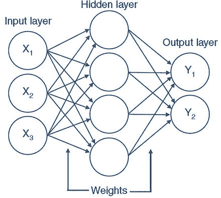
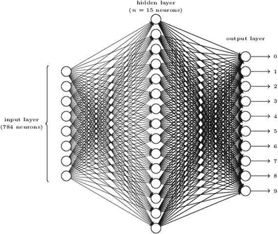

# 人工神经元的表示

## 基本模型
具有输入、连接权重以及受阈值函数约束的输出的人工神经元示意图。来源：《计算宇宙》，Gyuri Papay 和 Tony Hey，2015 年

## Warren McCulloch 和 Walter Pitts 的原始模型
在 Warren McCulloch 和 Walter Pitts 提出的原始模型中，输入值为 0 或 1。每个树突/输入也带有 +1 和 -1 的权重。因此，输入与其权重相乘，然后输入的总和被馈送到模型中。因此，感知机接收多个二进制输入 `I[1]`、`I[2]`、…… `I[N]`，并产生一个单一的二进制输出。如果输出大于设定的阈值水平，则模型产生特定输出。这可以用数学公式表示为：

## 感知机模型的发展
基于这一初始模式，感知机模型得以发展，允许神经元输入和权重取任意值。人工神经网络（ANN）无非就是感知机互连的层次结构，如图 4-14 所示。

`图 4-14.` 感知机互连的层次结构。图片来源：《计算宇宙》，Gyuri Papay 和 Tony Hey，2015 年

## 多层感知机网络
通过改变权重和阈值，我们可以得到不同的决策模型。隐藏层的输出也可以馈送到另一个感知机隐藏层。第一列感知机层通过权衡输入证据做出非常简单的决策。这些输出随后被馈送到第二层感知机，该层通过权衡来自第一层决策的结果来做出决策。通过这种方法，第二层的感知机可以做出比第一层感知机更复杂、更抽象的决策。如果涉及第三层，那么这些感知机做出的决策将更加复杂。通过这种方式，多层感知机网络可以从事复杂的决策。感知机层数越多，决策能力越高（图 4-14）。

`图 4-15.` 感知机多层网络。来源：`http://neuralnetworksanddeeplearning.com/`