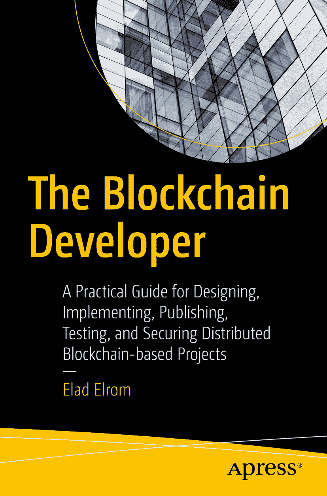

ISBN 978-1-4842-4846-1 e-ISBN 978-1-4842-4847-8 [`doi.org/10.1007/978-1-4842-4847-8`](https://doi.org/10.1007/978-1-4842-4847-8) © Elad Elrom 2019

本作品受版权保护。版权所有者为出版商，无论涉及材料的全部或部分，具体包括翻译、重印、复用插图、朗诵、广播、微缩胶片复制或以任何其他物理方式复制，以及电子改编、计算机软件、或目前已知或今后开发的任何类似或不同方法的传输或信息存储与检索。

本书中可能出现商标名称、标识和图像。我们并非在每次出现商标名称、标识或图像时均使用商标符号，而是仅出于编辑目的并为了商标所有者的利益使用这些名称、标识和图像，无意侵犯商标权。本出版物中对商品名称、商标、服务标记及类似术语的使用，即使未标明为商标，也不应视为对它们是否受所有权保护的表述。

尽管本书中的建议和信息在出版时被认为是真实准确的，但作者、编辑或出版商均不对可能出现的任何错误或遗漏承担法律责任。出版商对本书所含内容不作任何明示或暗示的担保。

本书由 Springer Science+Business Media New York 在全球图书贸易中发行，地址：233 Spring Street, 6th Floor, New York, NY 10013。电话：1-800-SPRINGER，传真：(201) 348-4505，电子邮件：orders-ny@springer-sbm.com，或访问 `www.springeronline.com`。Apress Media, LLC 是加利福尼亚州的有限责任公司，其唯一成员（所有者）为 Springer Science + Business Media Finance Inc (SSBM Finance Inc)。SSBM Finance Inc 是特拉华州的一家公司。

*谨以此书献给我的孩子，Romi Scarlett Elrom 和 Ariel Rocco Elrom。愿你们拥有坚定的界限，不让任何人左右你们什么能成就或不能做什么。我深爱你们，并将永远陪伴在你们身边。*