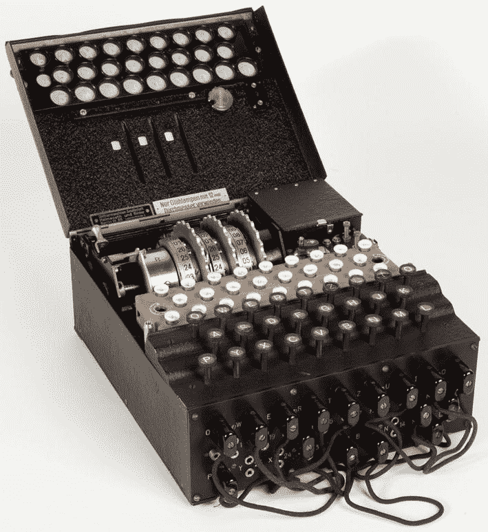
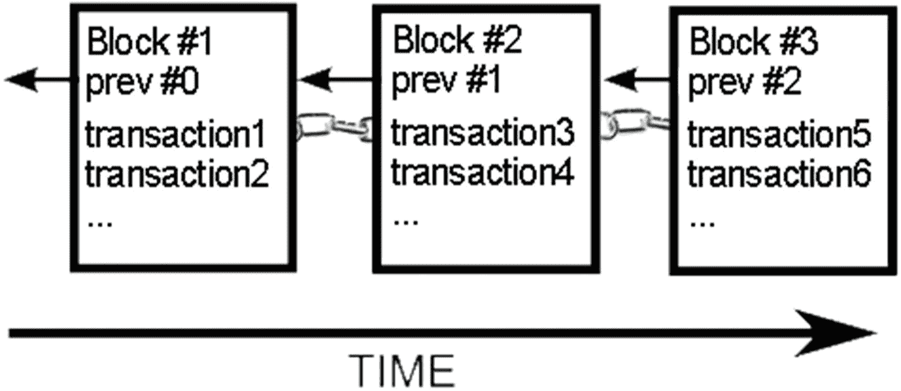
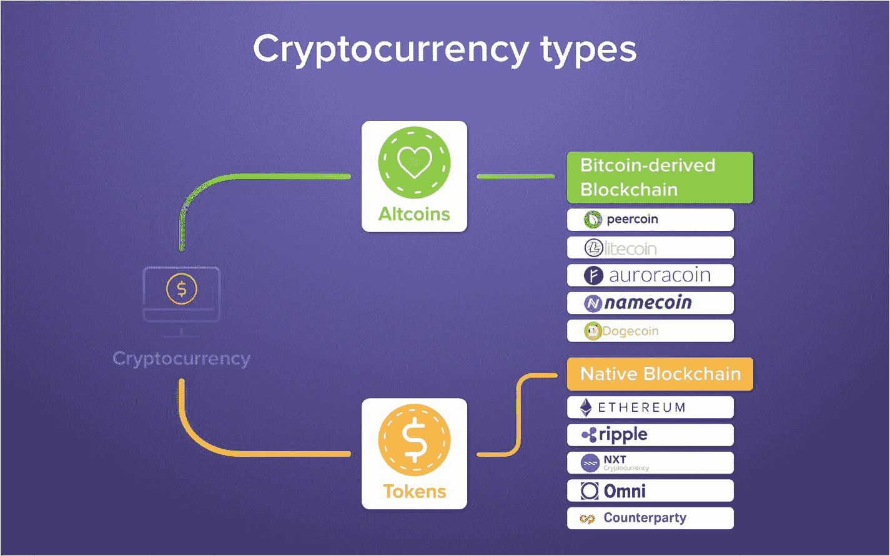
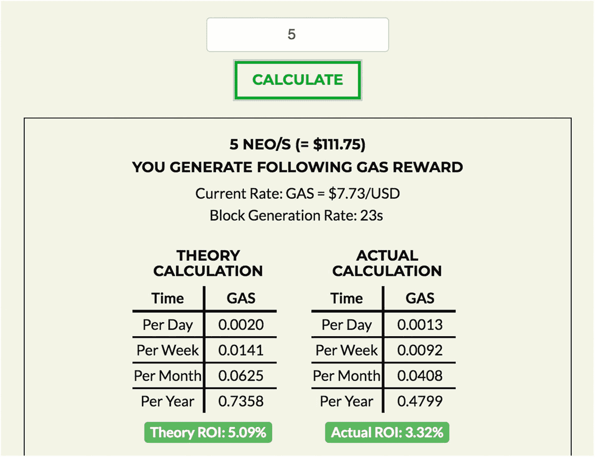
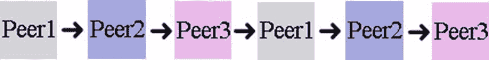
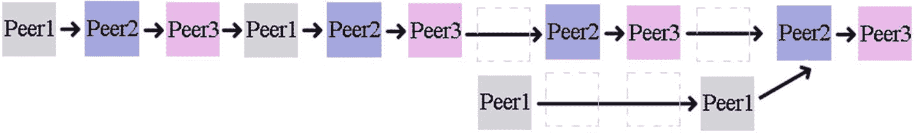

# 1. 区块链基础

本章将成为你“起飞”前的基础知识学校。它将介绍一些基本概念，帮助你理解区块链技术。本章分为四个部分。

*   加密经济学入门

*   区块链详解

*   加密货币概览

*   区块链 P2P 网络

要理解加密经济学，你首先需要理解诸如加密与解密、公私钥、密码学、数字资产、密码学和加密货币等概念。

一旦你理解了这些基本概念，我将介绍区块链。我将涵盖构成单个区块链的各个部分，例如区块，以及区块是如何链接在一起的，还包括区块链存在的问题，比如双重支付。我还将解释加密挖矿、加密矿工和加密货币钱包。

然后，我将介绍不同类型的加密货币：比特币、代币和替代加密货币币种（山寨币）。

最后，我将介绍区块链技术中使用的 P2P 网络，以及构成该网络的不同层次：共识层、矿工层、传播层、语义层和应用层。

## 加密经济学入门

加密世界充满了技术术语，即使是经验最丰富的技术忍者也可能感到困惑。比特币引入了加密经济学的概念，并为许多区块链平台的创建铺平了道路。在深入探讨区块链如何工作之前，让我们先了解什么是加密经济学以及区块链背后的基本概念。

语言交流是基于选择词语来描述你想要传达的信息。然而，有时你只想与特定人群交流，同时排除其他人。战时就是一个很好的例子：指挥官与驻守前线的士兵沟通，同时确保敌人无法窃听。指挥官可以使用加密技术进行这种通信。

从电子层面来说，如今所有购物网站都通过一种称为安全套接层（SSL）的加密协议提供商品，该协议可以保护你的个人信息免受黑客攻击。视频加密和解密很常见，以确保视频仅传递给授权会员。在个人电脑上，人们经常使用加密来备份和保护文件及密码。

此外，作为开发者，你可能已经借助库发送过加密消息，并解密过传入的消息，因为所有编程语言都提供字符串加密和解密函数。

那么，让我们来看一些定义：

*   *加密*：加密是将你的消息转换为代码的过程，以便只有授权方才能访问它。

*   *解密*：解密是逆转加密过程，从而将消息转换回原始消息。

*   *密码学*：这是利用加密和解密技术来发送和接收消息。

*   *加密货币*：这是以与之前的 SSL 或视频示例相同的方式使用密码学，但专门为了满足数字资产的需求。

#### 注意

*数字资产*可以是任何有价值的东西，例如你家保险柜的密码组合、秘密口令、列表、消息、电子现金、文档、照片等等。

*   *加密经济学*：这是密码学与经济学的结合，以提供一个传递数字资产的平台。

为了进一步澄清，让我们更详细地研究这些术语，并将它们应用于我将在本书中介绍的主题。

### 倒置偶语

首先，让我们回到过去。你小时候说过倒置偶语吗？这种秘密的倒置偶语语言很简单。你将要说的单词的第一个字母去掉，然后将这个字母移到单词末尾，并加上“ay”的音。

例如：

*   “Pig” 变成 “ig-pay”。

*   “Latin” 变成 “atin-lay”。

我们刚才做的就是加密。然后要理解我们加密的单词，我们需要反向操作。

*   “Ig-pay” 通过去掉末尾的 “ay”，并取最后一个字母将其放回首位，变回 “pig”。

*   类似地，“atin-lay” 变回 “Latin”。

我们刚才做的就是解密。孩子们能够使用这些技术，以简单的密码学形式加密和解密单词。

#### 加密/解密

加密使您能够以安全的方式在特定方之间传递消息，从而被排除在外的方无法理解这些消息。纵观历史，一直存在能够在各方之间发送秘密消息的需求。一方在某个地点发送加密消息，然后另一方能够在其他地点接收并解密该消息。

事实上，加密在第一次世界大战（一战）和第二次世界大战（二战）期间被大量使用。纳粹使用一种名为恩尼格玛的机器来加密和解密消息（见图 1-1）。盟军找到了破解纳粹恩尼格玛机器密码并解密消息的方法。据信这使二战缩短了数年之久。

**图 1-1** 恩尼格玛机。图片来源：wikimedia.org。

加密和解密通过 1970 年 IBM 开发的数据加密标准（DES）以及 1976 年密钥密码学的发明，从纯粹的军事用途转向了公共用途。事实上，在过去，密码学和加密是同义词。

#### 加密 + 解密 = 密码学

如前所述，密码学是运用加密和解密技术的过程。`cryptography`一词源自希腊语`kryptos`，意为隐藏或秘密。

在 Pig Latin 语言的例子中，我描述了你如何对单词进行加密和解密。这种将首字母移至词尾并添加`"ay"`，以及反向操作的技术，就是密码学。如果不知道这项技术，你就无法理解 Pig Latin 语言。

大多数人可能足够聪明，能够识破简单的 Pig Latin 语言秘密；然而，一个复杂的加密实例就另当别论了。

例如，回到二战时期的恩尼格玛密码机，纳粹通过无线电传递信息。盟军能够接收这些信息（信息即为“公钥”），但如果没有解码方法（“私钥”），这远远不够。一位名叫图灵的科学家和其他人花费了五个半月才破译了纳粹的秘密信息。

#### 注意

密码学中的*密钥*可用于加密消息。加密后的消息只能通过收件人已知的第二把密钥（私钥）来解密。

图灵的贡献在于自动化了一台机器，该机器能够找出纳粹在其恩尼格玛密码机中设置的不同参数，从而解密信息。换句话说，它自动化了搜索私钥的过程。那台机器被称为`bombe`。

### 数字资产 + 密码学 = 加密货币

加密货币是一种数字资产，其设计使得电子现金能够使用强密码学（加密和解密）进行交换，以确保资金、交易以及新资金创建的安全性。

密码学的私钥机制必须足够强大，以至于几乎不可能（换句话说，需要花费过多时间和精力）被破解。否则，如果密码学能在几个月内（如恩尼格玛密码机那样）被破解，所有用户都有可能丢失他们的电子现金。

加密货币的一个例子是比特币。虽然比特币并非首个被发明的加密货币，但它通常被认为是第一个成功的加密货币。

比特币的成功归因于以下特点：没有人能破解公钥-私钥体系，它不受政府控制地分布运行，它是公开可用的，并且以开源代码的形式发布。

#### 注意

比特币由中本聪于 2008 年发明，并发布了一篇名为“比特币：一种点对点的电子现金系统”的白皮书（[`https://bitcoin.org/bitcoin.pdf`](https://bitcoin.org/bitcoin.pdf)）。完整的开源软件实际于一年后的 2009 年发布（[`https://github.com/bitcoin/bitcoin`](https://github.com/bitcoin/bitcoin)）。

### 密码学 + 经济学 = 加密经济学

加密经济学是密码学与经济学的结合，旨在提供一个平台，激励人们维护该平台、其可扩展性及安全性；此外，它不受中央或地方政府控制。换句话说，它是*去中心化*的。该网络由多台计算机组成，而非单一一台中央计算机。

#### 注意

去中心化是中央控制的对立面；它意味着没有中央或地方政府的控制。

比特币能够通过使用公私钥概念来实现加密经济学的目标；密码学和加密哈希函数被间接使用。事实上，密码学与加密货币之间的关系不仅是比特币，对于大多数现有加密货币而言都是间接的。

例如，密码学在比特币中以其他方式被使用，例如：

*   比特币借助一种算法函数（称为 ECDSA 椭圆曲线）使用私钥（比特币称之为*数字签名*）来证明所有权。
*   哈希算法用于通过一个名为 SHA256 的哈希生成器维护数据库账本数据（或区块链）的结构。
*   哈希算法用于生成数学谜题，计算机尝试解决谜题以获取奖励。一旦谜题被解决，该计算机被选中协助处理交易。
*   哈希算法也用于生成账户地址。
*   存在默克尔树的概念（将在下一章介绍），它利用小块数据的大数据哈希键。这对于需要在受限硬件设备（如移动设备）上运行的轻量级钱包非常有用。

比特币不收集用户的身份信息；然而，交易是公开的，这意味着所有信息都被传输并在线上可用。再想想恩尼格玛密码机的例子；这意味着任何人都可以截获传输的信息。然而，没有私钥，任何人都无法解密这些信息。

自 2009 年比特币发布以来，出现了许多其他平台，它们使用不同类型的隐私保护以安全的方式发送信息，并在流程的更多部分使用加密，从而减少公开的信息。例如，Monero 和 Zcash 等平台甚至通过密码学对交易的细节进行匿名化处理。

## 区块链解释

如前所述，比特币是第一个成功的开源数字现金。区块链是核心底层技术，或者说，是比特币以及事实上所有加密货币平台的心脏。

但什么是区块链？

简而言之，*区块链*是一个共享的数字账本。可以想象一个数据库，它不是将所有的数据库条目存储在一台计算机上，而是将数据存储在多个计算机上。一个更专业的定义是：区块链是一个去中心化且分布式的全球账本。

### 区块 + 链 = 区块链

每个区块包含记录和交易；这些区块在多个计算机之间共享，并且除非整个网络达成一致（共识），否则不应被篡改。该网络根据特定策略进行管理。这些计算机连接在一个网络上，被称为*对等节点*或*节点*。

#### 注意

什么是区块链？一个*区块链*是一个数字化的、去中心化的（没有金融机构参与）且分布式的账本。用通俗的话说，它是一个将记录和交易存储在多个计算机上的数据库，没有单一控制方，并遵循约定的策略。存储的数据是一个区块，这些区块被链接（链在一起）形成区块链。

#### 链接的区块

区块链由一系列数据（一个*区块*）组成，每个区块都链接到前一个区块。它们是如何链接的？一个区块包含数据，并且每个区块都引用其前面的区块，因此它们就像链环连接到前面的链环一样链接在一起。请看图 1-2；如图所示，每个区块都引用前一个区块。

图 1-2

链在一起的区块

因此，区块链包含区块，这些区块保存着交易记录。私钥由所有者持有，以证明所有权（这就是数字签名），因此没有私钥的人无法解密该字符串并声称所有权。这种公钥与私钥的组合代表了电子现金。

#### 说明

节点构成一个网络，因此在本节中你可能会看到*对等节点*或*节点*这两个词。在本书的语境中，这两个词是同义词。

如前所述，数字资产可以是任何东西——音乐文件、视频文件、电子文档等等。在加密货币中，数字资产以电子现金的形式呈现；你可以将公钥视为你的银行账户和路由号码，将私钥视为账户中的实际现金。没错，你可以与他人分享你的银行信息，但资金仍会留在你的账户中。要提取现金，你需要证明所有权。你前往银行出示身份证件，并通过签名方式证明身份；只有这样，你才能将钱从账户中取出。加密货币也经历了类似的过程。有一个代表你账户的公共地址，只有持有私钥的所有者才能证明所有权。

## 双重支付问题

数字签名（公钥和私钥）能够安全地确保一方的身份信息保密，并保障电子现金的存储安全。

这种公私钥组合的概念使你能够加密和解密字符串，并确保字符串的安全，就像你在恩尼格玛密码机中看到的那样。然而，这仍然不足以解决数字货币最大的问题——双重支付。

当你使用法定货币（由政府法律规定的纸币）例如美元或欧元时，纸币是不可转换的，这意味着一旦你将纸币花出去，就不能再次使用。在加密货币中，如果你证明了所有权并在同一时间发送了两次数字资产，会发生什么？这可能导致*双重支付*。

黑客可能试图复制数字资产，并有可能进行双重支付。在加密货币被用作数字货币之前，必须先解决这个问题。

#### 说明

*双重支付*是指数字货币可能被花费两次的风险，因为数字签名可能被复制，并且有人可以证明所有权，同时在同一个时间发送两次数字资产。

仅包含密钥的区块不足以提供安全性，也无法解决潜在的双重支付问题，从而形成一种数字货币。

比特币通过创建一个计算机网络并证明没有发生双重支付尝试来解决这个问题。这通过让网络中的所有计算机知晓每一笔交易来实现。所有交易都会与网络中的所有计算机共享。

## 双重支付解决方案：P2P 网络

在加密货币中，使用点对点网络为解决双重支付问题提供了方案。

#### 说明

*P2P 网络*是一种分布式应用架构，它将需要执行的任务在多个对等节点之间分配，每个对等节点具有相同的权限。这些对等节点共同构成一个由节点组成的 P2P 网络。

任何连接到网络的计算机都被称为*对等节点*。对等节点可以是任何满足网络要求的计算机，例如笔记本电脑、移动设备或服务器。这些计算机通过 P2P 网络协议在互联网上相互连接，形成一个节点网络。

P2P 网络协议并非新鲜事物。多年来，它已在网络上被广泛使用，从通过 Kazaa 或 LimeWire 网络下载文件，到通过 Skype 进行视频通话。

正如我提到的，比特币是第一个可行的加密货币，它解决了双重支付问题，并允许在不经过金融机构的情况下存储电子现金，同时利用 P2P 形成了区块链协议。

> *“纯粹的点对点电子现金版本，将允许在线支付直接从一方发送到另一方，而无需经过金融机构。”*
>
> ——中本聪，《比特币：一种点对点的电子现金系统》

## 加密货币矿工与挖矿

如前所述，每台持有共享账本副本并连接到 P2P 网络的计算机都是一个对等节点。对等节点可以帮助添加记录和验证交易。这个过程称为*加密货币挖矿*或简称*挖矿*，而帮助记录和验证交易的对等节点被称为*加密货币矿工*或简称为*矿工*。

每个矿工都协助验证交易并将其添加到区块链数字账本中。矿工通常会因其工作而获得费用奖励。为了在其他矿工中保持竞争力，矿工通常需要一台配备专用硬件的计算机。

## 加密货币钱包

我已经介绍了公钥和私钥是什么，以及它们如何用于加密和解密字符串。这些字符串就是数字货币或加密货币，而密钥则代表电子货币。

一个*加密货币钱包*存储一个或多个公私钥组合，用于接收或花费加密货币。

一个好的类比是将钱包想象成你的银行账户。加密货币可以通过执行挖矿工作获得奖励来创造，也可以通过购买获得。我将在本书后面部分详细介绍钱包。

## 纷繁复杂的加密货币

在深入探讨区块链 P2P 网络之前，你应该知道另一个可能造成混淆的概念是币（Coin）和代币（Token）之间的区别。根据 `Coinmarketcap.com` 的数据，截至撰写本文时，共有 1,833 种列出的加密货币，市值达 2000 亿美元。

其中许多币种在未来的岁月中肯定会消失，因为它们提供的价值微乎其微，而且这些项目会因缺乏兴趣或是骗局而终止。

这可能会令人困惑和不知所措，大多数人并不理解比特币的概念，更不用说大量存在的币种和代币了。为了帮助理解这些概念，让我们将加密货币分为三种类型：比特币、代币和替代性加密货币币种（山寨币）。参见图 1-3。

*图 1-3 加密货币币种和代币。图片来源：blog.citowise.com。*

### 比特币数字现金

比特币是去中心化分布式数字货币的第一个成功实现。总共有 2100 万个币。这些币取代了传统的法定货币。

## 代币

代币是一种去中心化的产品发行方式。它是类似于首次公开募股（IPO）或众筹的另一种选择。代币可以在世界任何地方创建，并通过以太坊、EOS 或其他支持区块链的平台进行分发。代币通常通过首次代币发行（ICO）创建并分发给公众。

代币代表一种效用或资产，通常位于原生区块链之上。它可以代表任何数字资产，包括积分、加密货币，或任何可互换、可替代或可交易的单个单位的商品或物品。你可以使用现有的区块链模板（例如以太坊平台）创建代币，或者你可以在现有的原生区块链上创建自己的代币并发行。你可以利用智能合约来简化创建代币的过程，这将在后面的章节中讨论。

#### 说明

智能合约是一种可编程代码，无需第三方即可独立运行。例如，Solidity 是一种面向合约的编程语言，可以部署在多个区块链上。

### 替代性加密货币币种（山寨币）

替代性加密货币币种（简称*山寨币*）是通过分叉（软分叉或硬分叉）从比特币核心源代码衍生出来的币种。例如莱特币（它是比特币核心客户端的派生币）、狗狗币（狗狗币 1.10 是基于比特币 0.11 版本完全重建的）、比特币 X、比特币现金以及比特币黄金。事实上，在撰写本文时，已有 26 种山寨币。

#### 注意

**硬分叉**是向后不兼容的，因为这种变更会将网络代码分裂为两个：一个运行原始代码的 P2P 网络，和一个运行新代码的新 P2P 网络。**软分叉**是向后兼容的，这意味着之前有效的区块/交易会变为无效，而旧节点仍会将新区块识别为有效。当开发者对某个方向存在分歧时，这种分叉经常发生。例如，有些开发者希望实施其他开发者不同意的变更，或者需要实施一个重大的修复。

`Litecoin`是`bitcoin`核心客户端的一个分叉。`Litecoin`将区块生成时间从 10 分钟改为 2.5 分钟，使得交易能够比`bitcoin`更快、更高效地转移。`Litecoin`之后可以继续添加功能，因为它不再依赖于`bitcoin`的代码。例如，未来`litecoin`将支持原子交换，允许人们通过智能合约将`Litecoin`转换为`bitcoin`，而无需经过交易所。然而，`bitcoin`核心的变更需要手动实施，才能将这些变更包含在`litecoin`中。

话虽如此，许多人会争论`Litecoin`和许多这类山寨币并不能提供足够的生存价值，它们只是为了丰富创建分叉的开发者而制造的。只有时间能证明一切。

`EOS`是另一个山寨币的好例子。这次，该山寨币变成了一种代币，因为在发布时`EOS`公司发行了以太坊代币，但随着`EOS`构建自己的区块链平台，它正在用自己的`EOS`代币取代以太坊代币。

简而言之，山寨币和代币的主要区别在于它们的结构。山寨币是一种像`bitcoin`或`Litecoin`一样的独立货币，拥有自己的专用网络区块链并需要矿工。像以太坊代币这样的代币则运行在现有区块链之上，该区块链为去中心化应用（`dapp`）的创建提供了代币和基础设施（如`Ethereum`）。以太坊代币的一个例子是币安代币（`BNB`）。

关于以太坊代币，`Ethereum`提供了创建不同代币标准或以太坊征求意见（`ERC`）的功能，例如`ERC-20`、`ERC-223`或`ERC-777`。在`BNB`代币的例子中，使用了`ERC-20`。这些标准有所不同，将在后续章节中详细讨论。

## 区块链 P2P 网络

现在你已经对关键概念有了更好的理解，可以更深入地了解区块链如何使用 P2P 网络来解决双重支付问题并排除金融机构。

在本节中，你将看到加密货币 P2P 网络是如何工作的。你将通过将 P2P 网络分解为五个层来具体探讨不同的区块链策略以及一般的 P2P 网络。

*   共识层
*   矿工层
*   传播层
*   语义层
*   应用层

这里的概述将为后续章节奠定基础，在那些章节中，你将利用`bitcoin core API`来配置和运行一个对等节点。这种基本理解可以帮助你理解任何区块链网络如何通过利用不同的策略（如`NEO`和`EOS`）来工作。

### 共识机制

在传统的中心化系统（如银行）中，有一台主计算机负责保管交易账本。银行显然可以信任自己的计算机，因此它在负责主计算机的安全性和完整性方面没有问题。

当你处理共享账本的不可信对等节点时，需要制定规则来确保安全性并提供账本的完整性，以防止双重支付和其他潜在的黑客攻击。这些规则和协议被称为*共识机制*。

#### 注意

共识机制是网络即使在发生故障时也能正常运行所需的协议。它需要能够在分布式 P2P 网络中就网络数据达成一致。

区块链不仅仅是一台主计算机，它的目标是全球性地工作。它通过网络中所有计算机对数据达成共识来实现完整性。分布式共识意味着地理上分散的一组对等节点以去中心化的方式达成一致，而不是由一台主计算机（中心化）来决定。取代法规的是一套通常在开源环境中设定的规则，而不是由政府实体设定。

P2P 网络使得账本成为可能。为了以安全的方式实现这一目标，P2P 网络存储数字账本的规则和安全机制。共识机制不仅提供了规则，还通过向矿工发放奖励来激励他们完成存储数据和创建交易的工作。

P2P 网络通过互联网连接在全球范围工作，并能够提供一个实现全球分布式共识机制的平台。在加密货币中，共识/协议是关于区块是否有效。如果一个区块有效，它将被添加到区块链中；如果一个区块无效，它将被拒绝添加到区块链中。

这就是共识策略发挥作用的地方。网络中大多数对等节点在其验证过的最佳区块链上持有相同的区块，并遵循相同的规则（共识规则）；区块链就是这样确保安全性的。最难以重新创建的链被称为*最佳区块链*（本章稍后会详细介绍这个概念）。

### 工作量证明、权益证明和委托权益证明

随着区块链越来越受欢迎，创建了许多共识机制策略。第一个是由`bitcoin`创建的，许多其他机制是为了解决现有机制中存在的问题而构建的。在接下来的章节中，我将讨论几个流行的机制。

*   工作量证明（`PoW`）
*   权益证明（`PoS`）
*   委托权益证明（`DPoS`）

除了这三种之外，还有许多其他共识机制本书未涉及，例如重要性证明、经过时间证明（`PoET`）、权威证明（`PoA`）、燃烧证明、容量证明、活动证明等。请自行探索这些机制；每种都有其优缺点，并适用于不同的需求。

#### 工作量证明

`PoW`是最早也是最流行的机制；它被`bitcoin`和`Ethereum`使用，这两种是撰写本文时最流行的加密货币。`PoW`通过建立一个矿工网络并向矿工提出一个数学问题来实现。当矿工解决一个问题时，他们会获得加密货币作为奖励。该奖励就是所做“工作”的证明，这也是其名称的由来。

#### 注意事项

以太坊开发社区正致力于从`PoW`转向`PoS`或`ProgPoW`（降低 ASIC 哈希率优势的机制）。

`PoW`根据计算机算力（`hash rate`）来决定由哪个节点执行工作量，并按比例分配任务，以确保公平。`PoW`并不单独信任网络中的任何节点，而是将整个网络视为一个整体来信任。这并不意味着矿工之间相互竞争。一个矿工网络（称为`矿池`）可以与另一个矿工网络竞争任务。矿池的算力越高，获得“工作量”的机会就越大。

如前所述，加密货币是去中心化的，不需要单一受信任的计算机来管理账本。`PoW`就是确保数据完整性、阻止恶意攻击的机制。

工作量证明（`PoW`）是矿工需要求解的数学难题。矿工需要找到一个复杂数学问题的解，才能成为领导者并创建下一个可添加到区块链的最佳区块。网络中的矿工越多，需要解决的数学难度就越复杂。以比特币为例，每十分钟仅能添加一个区块，只有一个获胜者，因此竞争非常激烈。解题会迫使计算机芯片高速运转，消耗电力并产生热量。你可以想象一下，电脑正在运行一个包含大量媒体的高负荷视频游戏，或者正在处理一个视频的后期制作。

你也可以使用这个在线资源，它会连接到一个比特币节点，并进行各种计算来预测下一个难度：[`https://bitcoinwisdom.com/bitcoin/difficulty`](https://bitcoinwisdom.com/bitcoin/difficulty)。这些信息对于计算挖矿盈利能力很有用。撰写本文时，比特币的难度为 5 万亿，预计下一个难度将增加+3.74%，总算力为 43 万亿`GH/s`。同时还显示，生成一个区块需要 9.9 分钟，并可产生约 25 个比特币。快速计算一下：如果每 10 分钟生成一个区块，每年产生的数据量约为 4.2`MB`（每个区块 80 字节 × 6 个区块/小时 × 24 小时 × 365 天 = 每年 4.2`MB`数据）。

每十分钟生成一个区块是一个限制因素，每个区块能容纳的交易数量也是有限的。这就造成了可扩展性问题，其他共识机制试图对此进行改进。

总而言之，每个矿工都在竞相解决同一个问题；一旦问题被解决，过程就会重新开始。这个问题是一个被称为`工作量证明问题`的数学难题，奖励将给予最先解决问题的矿工。随后，经过验证的交易将存储在公共账本中。

`PoW`并非没有缺点；这类算法在当今世界可能会引发各种问题。例如，如果某个矿池控制了总算力的 51%以上，整个区块链的安全性就会面临风险，因为形成了一个中心化的集体，这与单一计算机控制的情况并无太大区别。针对网络的`DDOS`攻击可能会危及整个网络的可信度。

这种情况实际上已经发生过，而不仅仅是理论。在撰写本文时，比特币的分叉版本比特币黄金就遭受了`DDOS`攻击。分布式拒绝服务（`DDoS`）攻击是指多个系统攻击某个目标系统的资源或带宽。

在`PoW`中，随着难度增加，意味着利润减少。利润减少会导致挖矿动力下降。以太坊加密货币正面临网络矿工减少的问题，2018 年以太坊不得不计划一次“难度炸弹”，降低难度（提高矿工利润），并从`PoW`转向`PoS`以提高可扩展性。

攻击是如何实现的？一个控制了网络 51%算力的矿池，能够创建自己的区块，并以比主区块链更快的速度发布。该区块占据网络 51%的算力，并且可以通过在花费代币后删除交易来实现双重支付，从而使原始钱包中的代币不会被扣除。这个威胁是真实存在的。撰写本文时，矿池公司比特大陆控制了比特币总算力的 40%以上。

许多人认为`PoW`是不可持续且效率低下的，因为矿工消耗的电量巨大，且与其他算法相比交易速度较慢。客观来说，比特币目前估计的年耗电量约为每年 60 至 73 太瓦时（`TWh`）。这相当于瑞士一年的用电量；想象一下，如果有多种加密货币像比特币一样流行并采用`PoW`会是什么情况。

更多关于`PoW`的信息，请阅读中本聪撰写的比特币白皮书：[`https://bitcoin.org/bitcoin.pdf`](https://bitcoin.org/bitcoin.pdf)。

#### 权益证明（PoS）

`PoS`（权益证明）于 2012 年由 Sunny King 和 Scott Nadal 创建，旨在解决之前提到的`PoW`（工作量证明）的缺陷。

`PoS`依据的是节点持有的货币数量。节点需要质押其希望挖矿的货币数量。

与算力不同，这里使用的是权益算力，并且不依赖能源消耗，因为无需解决数学难题。`PoS`提供了与比特币的`PoW`类似的哈希区块方案，但它限制了节点的数量。这既提供了所需的安全性，又降低了成本和功耗。网络会向节点支付手续费，而不是像`PoW`那样因解决数学难题而给予奖励。

`PoS`根据节点所持权益的大小来决定由哪个节点执行工作。这能以更低的能耗和成本实现分布式共识。`DDoS`攻击和欺诈仍然可能发生。然而，攻击者不能交易超过其质押数量的数字货币。否则，他们将损失其押金，因此攻击的可能性较低。请注意，攻击者可以使用他人的币进行质押，并且不介意损失这些币，因为不是自己的，所以`DDoS`攻击仍有可乘之机。

任何节点都可以通过质押货币来参与挖矿过程，以验证新的交易。要成为矿工，有两种选择：你可以质押自己的货币，委托给一个可信节点使用（但可能因节点在`PoS`网络中的欺诈行为而损失你的货币），或者你可以提交一个完整节点，以便被选为矿工。去中心化程度有限，因为只有少数矿工可能持有大部分货币并拥有多数控制权。矿工的工作是通过随机选择确定的；这不是基于解谜。请看表 1-1，它对比了`PoW`和`PoS`。

**表 1-1**  
*PoW 与 PoS 对比*

| 类别 | PoW | PoS |
| :--- | :--- | :--- |
| 生成新区块 | 基于算力，选择最先解出难题的矿工 | 基于权益算力（节点持有的货币数量）随机选择 |
| 奖励 | 区块奖励 | 网络手续费 |
| 能源与资源消耗 | ASIC 矿机，高能耗 | 资源消耗少，能耗低 |

你可以设置一个质押钱包，用于存放`PoS`所需的货币。在某些区块链网络中，你的货币每年可以获得一定收益。

以下是一些使用`PoS`的热门加密货币列表：

*   **达世币（Dash）**：需要持有 1000 单位才能成为主节点。年回报率约为 7.5%。
*   **小蚁（NEO）**：质押钱包年回报率约为 5.5%。无需挖矿；仅通过持有货币即可获得 GAS 币。
*   **其他币种**：`LSK`, `PIVX`, `NAV`, `RDD`, `BEAN`, `Linda`, `DCR`, `NEBL`, `OK`, `STRAT`。

尽管一些币种提供年度回报，但请记住，如果币种市值保持稳定，随着新币的产生，单个币的价值会随时间降低。通过质押钱包，你获得的币会增多以维持钱包价值，因此持有（`HODL`）钱包的价值受影响较小。这类似于银行给你`X%`的利率，而通货膨胀率也是`X%`，你的账户余额显示资金更多，但实际上你拥有的货币购买力相同。

#### 注意

`HODL`是一个与加密货币相关的俚语，意指无视价格波动而持有加密货币。

让我们以`NEO`为例。你无需通过挖取`NEO`来获得奖励。只需要持有货币，并因帮助质押交易而获得 GAS 币作为奖励。你可以通过以下网址计算你将获得多少 GAS 币：[`https://neotogas.com/`](https://neotogas.com/) 。撰写本文时，如果你购买五个`NEO`币并将其放入质押钱包持有一年，你将获得 0.4799 个 GAS 币（目前价格为 7.73 美元）。见图 1-4。

**图 1-4**  
*Neotogas.com 的 GAS 质押计算*

我鼓励你在此处阅读关于`PoS`的白皮书：[`https://peercoin.net/assets/paper/peercoin-paper.pdf`](https://peercoin.net/assets/paper/peercoin-paper.pdf) 。

#### 委托权益证明（DPoS）

委托权益证明是一种共识算法方法，由 Dan Larimer 发明，在[`https://github.com/EOSIO/Documentation/blob/master/TechnicalWhitePaper.md`](https://github.com/EOSIO/Documentation/blob/master/TechnicalWhitePaper.md)的白皮书中已有讨论。`DPoS`旨在通过提供民主机制（而非选择矿工的随机过程）来改进`PoS`的缺陷。

#### 注意

在`DPoS`中，矿工被称为*区块生产者*。

`DPoS`通过将挖矿过程分为两部分来实现技术民主。

*   **选举**：在选举一组区块生产者时，只有 21 个区块生产者，而不是像`PoW`那样无限多个。
*   **调度生产**：这 21 个区块生产者中的每一个轮流每 3 秒生产一个区块。

选举过程提供了一种技术民主，并确保利益相关者处于控制地位，因为大型利益相关者在网络失败时损失最大。

每个区块生产者轮流生产一个区块，并且采用最长的可行链（就像在`PoW`中一样）。看一下正常运行的情况，如图 1-5 所示。你会看到节点 1 到 3 依次获得生产最长链区块的机会。任何时候，诚实节点看到一个有效的严格更长的链时，都会从其当前的分叉切换到更长的链上。

**图 1-5**  
*DPoS 正常运行*

即使大多数生产者失效，`DPoS`也能继续运行。图 1-6 展示了一个少数分叉的情况，其中节点 2 在一个周期内只有机会发布一次最长链。在故障过程中，社区可以投票并替换失效的生产者节点（本例中为节点 1），或多个生产者节点，直到网络恢复正常运行。

**图 1-6**  
*DPoS 少数分叉*

这份白皮书详细描述了这一过程、区块是如何生成的以及处理失效链的规则：`https://steemit.com/dpos/@dantheman/dpos-consensus-algorithm-this-missing-white-paper`。

建立一个由区块生产者和同意这套规则的质押用户组成的社区，就能兼具`PoS`的效率和`PoW`运作方式的去中心化特性。`DPoS`利用利益相关者的权力来批准共识算法的规则，例如激励费用、区块间隔、分叉和交易大小。

这些规则可以由当选的代表进行微调。这种类型的共识可以显著减少交易时间（对于`PoW`是 1 秒对比 10 分钟）。此外，该共识协议旨在保护所有参与者免受可能在`PoW`中出现的一组节点的恶意干扰。流行的`DPoS`区块链示例包括`Bitshares`、`Steem`和`EOS`。

好的，这是根据您的要求和示例格式翻译的中文版本。

### 挖矿层

矿工在网络后台所做的事情，可以描述为争夺完成区块链工作（即网络记账）的权利。对于比特币和大多数采用工作量证明（PoW）的币种而言，每个节点都需要保存完整的公共账本，该账本记录了所有曾经发生过的交易。PoW 矿工依赖于计算能力和矿池，而其他网络则会考虑其他因素。

对于比特币而言，交易必须由矿工验证，他们需要检查账本，确保发送方没有转移其不拥有的资金，然后才能将交易添加到账本中。最后，为了确保免受黑客攻击，矿工将这些交易封存在多层计算工作之后，这使得黑客几乎不可能完成如此巨大的工作量。作为这项服务的奖励，矿工会获得比特币作为手续费。

对于比特币，每批产出的币的数量大约每四年减半一次；到 2140 年左右（除非发现比 SHA2 更快的计算方法），这一数量将减少到零，届时流通中的比特币总量将达到 2100 万枚。

### 传播层

传播层负责决定共享账本和区块如何在 P2P 网络上进行传输。区块链白皮书中对此层有详细描述。

每个节点都可以将新交易传输给网络中的其他节点。这种架构允许节点之间进行间接通信。例如，你可以发送一笔涉及两个钱包的交易，而无需这两个钱包直接相互连接。

任何收到一个之前从未见过的有效交易的节点，都会立即将其转发给所有与其相连的其他节点。这是一种被称为*泛洪*的传播技术。因此，该交易会在 P2P 网络中迅速传播，在几秒钟内就能到达大部分节点。

### 语义层

语义层负责处理新区块如何与之前的区块关联，并提供用于验证共识规则的协议。

如你所见，根据连接的可信机器数量、质押机制、速度、算力等因素，存在不同类型的共识机制，但它们在新区块如何与先前区块关联以确保安全性方面的工作原理类似。每个区块链都有其规范。在这个层面，交易发生，即币/代币在账户之间转移。我之前讨论了最佳区块链，以及每个区块如何包含数据，并且区块链中的每个区块都引用其前一个区块。区块链中的共识机制使其所有节点都持有相同的已验证的最佳区块链，并遵循相同的规则（共识规则）。这就是区块链确保安全性的方式。

### 应用层

该层负责在区块链之上部署应用程序。

例如，去中心化应用（dapps）、智能合约、交易所以及提供区块链信息的网站，都是构建在区块链之上的应用程序。

对于应用层，区块链需要公开应用程序接口（API）。不同的区块链是相似的，它们都为客户端与网络通信提供了一种方式。

比特币提供了一个完整节点，目前大约占用 27GB 空间，并包含一个完全执行的节点以及区块链的所有规则。这对于挖矿以及确保你运行的、连接到应用层的节点与最新区块同步是必需的。

这些完整节点有助于实现 P2P 网络的功能，并帮助支持网络及其安全性。

区块链通常也会提供一个“轻量级”节点版本。实际上，比特币轻客户端引用的是可信完整节点的区块链副本。轻客户端允许用户与比特币区块链进行交互，并创建和确认交易，而无需提交巨大的 27GB 磁盘空间，这有助于支持移动设备等性能较弱的设备。

理解轻客户端是可信的，但不包含所有共识规则，这一点很重要。一个完整节点是不信任任何人的，它会拒绝违反共识规则的区块，即使网络上的所有其他节点都认为该交易是有效的。

我以 NEO 为例，它是一种流行的 PoS 区块链。NEO 也提供 NEO-CLI，它包含一个支持共识功能的 API，可用于应用层。

类似地，EOS 委托权益证明提供了全节点和轻节点选项。你会开始注意到，尽管市面上的区块链选项很多，但在区块链的实现方式上存在许多相似之处。

## 总结

在本章中，我奠定了基础，解释了有关区块链的基本概念；我解释了诸如加密和解密、密码学、数字资产、密码学和加密货币等概念。

我讨论了构成区块链的各个部分，包括区块、双重支付、加密货币、加密挖矿、加密矿工和加密货币钱包。我涵盖了不同类型的加密货币：比特币、代币和山寨币。

最后，我讨论了区块链 P2P 网络以及构成该网络的不同层面：共识层、矿工层、传播层、语义层和应用层。你还了解了点对点网络核心逻辑以及工作量证明（PoW）、权益证明（PoS）和委托权益证明区块链（DPOS）。

在本章中，我介绍了一些将在本书中很有用的术语，例如数字资产、公钥和私钥、去中心化、双重支付、智能合约和 HODL。

在下一章中，你将安装并学习比特币核心 API，并学习如何在不同的区块链中创建一个完整的节点。这将使你能够访问区块链 P2P 网络，甚至能够理解并创建可以充当矿工的节点。

