# 2. 区块链节点

在上一章中，我介绍了与区块链相关的基本概念以及构成单个区块链的各个部分。我介绍了区块链技术如何通过利用 P2P 网络来解决双重支付问题，这导致了全球分布式共享账本和数字现金的诞生。区块链 P2P 网络通过连接多个节点而拼接在一起，在本章中，你将更仔细地审视构成该网络的节点。

节点或对等机是维护区块链网络上交易和记录的机器。每种加密货币都有自己的区块链和节点；但是，我将介绍如何安装三种采用不同共识机制的区块链。

此外，我还将介绍如何与节点进行交互。我将以比特币核心 API 为例进行讲解，以便你能更好地理解账本、区块、交易和钱包。这些概念将继续为后续章节所需的基础知识和基本概念打下基础。

## 运行区块链节点

正如我们之前提到的，区块链点对点网络由存储网络中所有区块完整副本的节点组成，这些副本构成了共享账本。每条区块链通过特定的共识机制验证区块，并能拒绝不符合网络共识规则的区块。要连接到区块并执行命令，你需要有一个连接到区块链的节点。在本章中，你将搭建一个全节点，并学习如何因帮助网络而获得奖励；因此，你将全面理解不同网络上的节点如何运作。你将创建以下区块链的节点：比特币、NEO 和 EOS。由于区块链技术运行在不同的共识机制上，它们对能够管理区块链的节点也有不同的名称。

- 对于比特币，能够创建区块的节点称为`矿工`。
- 对于 NEO，拥有管理权限的节点称为`记账节点`。
- 对于 EOS，运行底层网络层并能够处理所有交易的节点称为`区块生产者`。

我选择这些区块链的原因，是让你能够研究在不同网络上、采用不同共识机制的节点是如何运作的。一旦你掌握了不同区块链的工作方式，你就会开始注意到一种模式，并对区块链技术形成全面的认识。

### 创建比特币矿工

在本节中，你将把自己的电脑变成比特币加密货币矿工，并开始挖矿。在此之前，你需要明白，你的电脑的算力不足以产生足够多的哈希算力来使比特币挖矿盈利。尽管如此，它仍然能让你全面了解整个流程，并且你或许能找到其他使用 CPU/GPU 挖矿可以盈利的币种，例如 ETN、BCN、XMR 和 ETH。在所有基于 PoW 的网络中，流程都是相似的。

如今，矿工能否盈利取决于哈希率、功耗、电价、比特币谜题难度、维护成本以及其他因素。

#### 注意

哈希率是你的计算机每秒为解决数学谜题而进行的计算次数。

在比特币早期，你的台式电脑可以使用中央处理器（CPU）或图形处理器（GPU）来处理比特币，而这在当时足以让比特币挖矿盈利。你的电脑本可以支撑比特币网络；然而，竞争已经加剧，现在你需要现场可编程门阵列（FPGA）或专用集成电路（ASIC）矿机才能盈利。

什么是 ASIC 和 FPGA 矿机？FPGA 是一种在制造后仍可配置的集成电路。这类矿机的性能优于 CPU 和 GPU 挖矿；它们每秒可以处理 750 兆哈希。

ASIC 是专用计算机，其集成电路只负责执行挖矿这一单一任务，而不是作为常规计算机运行。这台计算机上除了挖矿功能外，没有其他任何东西；所有其他部分都被剥离了。

这使得该计算机在处理交易时更快、更高效，并且能够进行更多的哈希运算。在撰写本文时，有些 ASIC 矿机的哈希率可超过 56 TH/秒，而且功耗比老一代 ASIC 更低。

这种挖矿设备并非比特币独有；在撰写本文时，还有其他加密货币的 ASIC 矿机，例如莱特币、Zcash、以太坊等。

要开始挖矿，你首先需要挖矿软件。有很多挖矿软件可供选择。例如，macOS 用户可以使用这款免费、开源且易于使用的软件：[`http://downloads.fabulouspanda.co.uk/macminer/`](http://downloads.fabulouspanda.co.uk/macminer/)。

下载软件后，安装它。接下来，你需要加入一个矿池。这里我将展示如何连接到 Antpool（最大的比特币矿池）；不过，任何矿池都可以。在此处注册 Antpool：[`https://www.antpool.com`](https://www.antpool.com)。

Antpool 将矿工称为`工作者`。你可以通过点击“仪表板”选项卡，然后点击“工作者”链接，最后点击“创建工作者”来创建一个工作者，如图 2-1 所示。

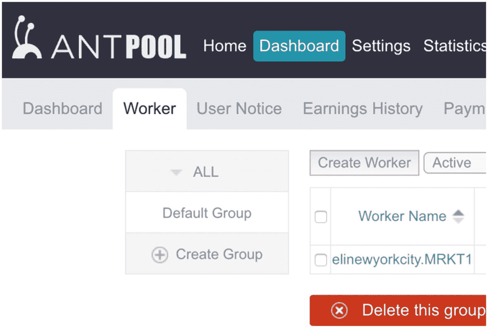

**图 2-1** 用于创建挖矿工作者的 Antpool 仪表板页面

现在你已经准备好了工作者，你将把你的矿机设置为使用 CPU 的 CPU 矿机，而对于你的 GPU，你可以将矿机设置为使用你的显卡。

打开你下载的 `MacMiner` 软件，点击“文件”，然后从文件下拉菜单中选择“偏好设置”选项。在偏好设置部分，将矿机设置为 CPU 和/或 GPU 矿机，如图 2-2 所示。

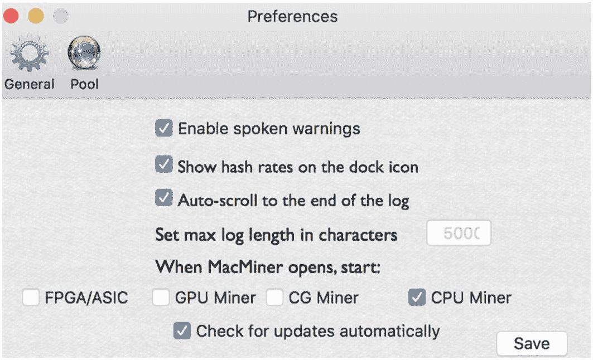

**图 2-2** `MacMiner` 偏好设置

在偏好设置的下一步中，你设置矿池 URL 和你的用户名。Antpool 设置时不需要密码，所以无需填写，矿池 URL 在 Antpool 网站上列出：

```
startum+tcp://startum.antpool.com:3333
```

见图 2-3。

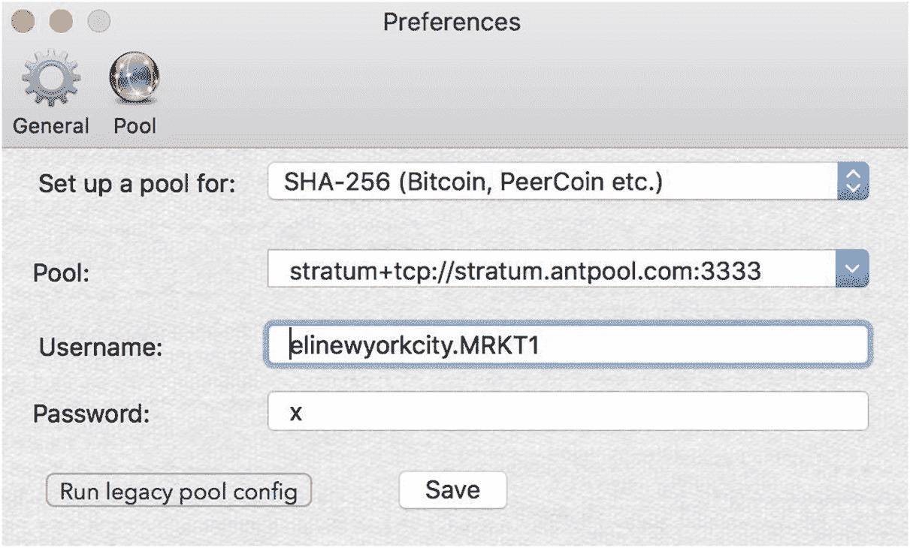

**图 2-3** 用于设置矿池的 `MacMiner` 偏好设置窗口

就这样。点击“开始”按钮开始挖矿，点击“停止”按钮停止挖矿，如图 2-4 所示。

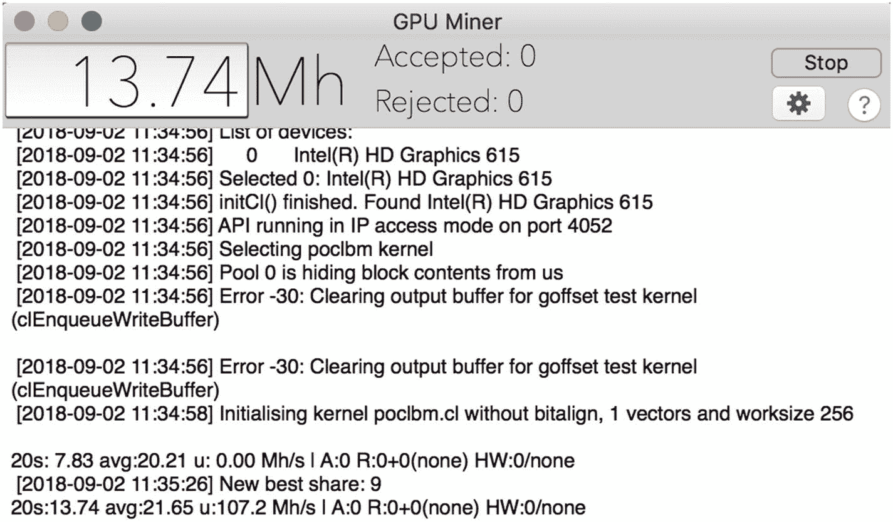

**图 2-4** `MacMiner` 启动矿机

六年前，你本可以用你的 GPU 挖到超过 100 个 BTC。如你所见，我在 2018 年的 MacBook 上的挖矿算力仅为 13.74 Mh（兆哈希）。

网上有很多资源可以帮助你计算挖矿盈利情况；试试 [`http://www.bitcoinx.com/profit/`](http://www.bitcoinx.com/profit/)。正如预期的那样，根据他们的计算，在当前条件下挖矿不会盈利。

### 创建 NEO 记账节点

之前我介绍了 NEO，它是一个流行的 PoS 区块链的例子。

在本节中，你将搭建一个节点（NEO 称之为`记账节点`）并准备好机器，以便它能够被选中帮助管理网络并获得交易奖励。

#### 注意

NEO 不将其管理节点称为矿工。矿工可以类比为节点为维护基于 PoW 的区块链所做的辛勤工作。由于 NEO 使用 PoS 共识算法，并采用技术民主方式选择管理节点，因此在使用 PoW 共识算法时，没有哈希算力，也没有繁重的工作。为了更好地理解 NEO 节点的工作原理，建议阅读 NEO 白皮书，网址为 [`https://github.com/neo-project/docs/blob/master/en-us/whitepaper.md`](https://github.com/neo-project/docs/blob/master/en-us/whitepaper.md)。

该节点验证区块链区块，并以一种名为`GAS` 的加密货币支付报酬。要被选中，你需要在性能足够的机器上设置一个全节点。所需的最低配置要求列在 NEO 项目的 wiki 上，网址为 [`https://github.com/neo-project/neo/wiki/Bookkeeping-Node-Deployment`](https://github.com/neo-project/neo/wiki/Bookkeeping-Node-Deployment)。

接下来，你需要获取共识授权证书，并获得质押的 GAS，才能被提名为记账节点。

#### 注意

您可能需要是中国公民，并注册一家中国企业才能获得身份证书；请参阅`NEO`文档[`http://docs.neo.org/en-us/index.html`](http://docs.neo.org/en-us/index.html)。您还需要质押 1,000 个 GAS 才能被提名为记账节点。

要因支持`NEO`网络而获得费用，您需要按照以下步骤创建一个全节点：

1.  设置一个完整的`NEO`节点。
2.  申请共识授权证书。
3.  质押 1,000 个 GAS。
4.  由`NEO`持有者选举产生。

要设置一个完整的`NEO`节点，您还需要满足此处列出的系统最低要求：[`https://github.com/neo-project/neo/wiki/Bookkeeping-Node-Deployment`](https://github.com/neo-project/neo/wiki/Bookkeeping-Node-Deployment)。

### 在 AWS Ubuntu 上设置 NEO 节点

由于我的计算机不满足最低要求列表，我将利用 AWS 来设置一个全节点。但是，如果您有一台满足这些要求的机器，可以跳过使用 Amazon AWS，或选择其他服务提供商来设置您的节点。

对于 AWS，请访问以下网址：[`https://aws.amazon.com/free/`](https://aws.amazon.com/free/)。选择“创建免费账户”并进行注册。

完成注册流程后，选择免费的基本计划。然后登录控制台[`https://us-east-2.console.aws.amazon.com/console/home`](https://us-east-2.console.aws.amazon.com/console/home)并选择“启动虚拟机”。

第一步，您可以选择机器类型。选择 Ubuntu。“在步骤 1，向导页面：选择一个 Amazon 系统映像 (AMI)” ➤ 下一步，选择：Ubuntu Server 16.04 LTS (HVM), SSD Volume Type ➤ 点击“选择”按钮。见图 2-5。

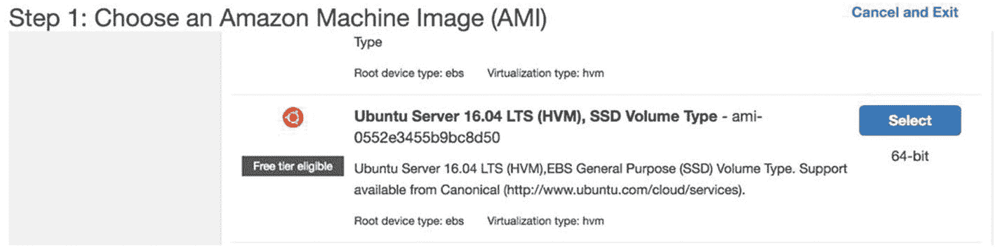

图 2-5

AWS，选择 Ubuntu Server 16.04 LTS

在下一个屏幕上，选择“通用型 - t2.micro - 有免费套餐资格”复选框。见图 2-6。

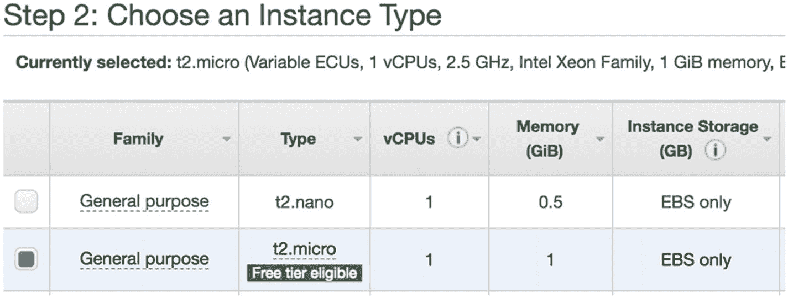

图 2-6

AWS，选择 t2.micro 机器

在下一个屏幕上，系统会提示您创建密钥对：选择“创建新密钥对” ➤ 下一步，选择“密钥对名称” ➤ 将密钥命名为`neo` ➤ 然后下载密钥：“下载密钥对” ➤ 最后，选择“启动实例”。见图 2-7。请确保您下载了密钥，因为如果没有密钥，您将无法通过 `ssh` 连接到该机器。

#### 注意

安全外壳 (`ssh`) 使用端口 22 将您的计算机连接到互联网上的另一台计算机。

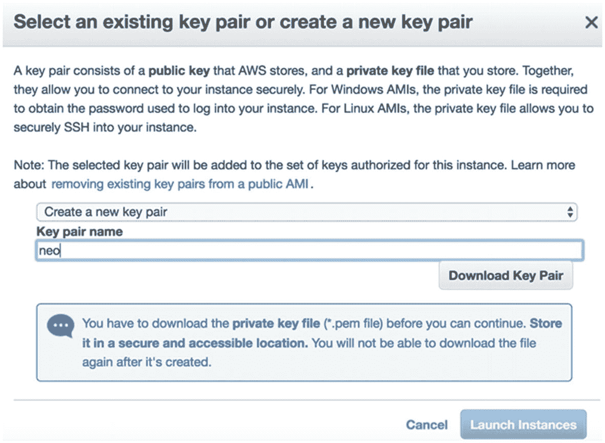

图 2-7

AWS 密钥对

接下来，您将收到一条消息，其中包含一个链接：您的实例正在启动。已启动以下实例： `[instance id]`。

点击该链接，您将能够查看实例，如图 2-8 所示。

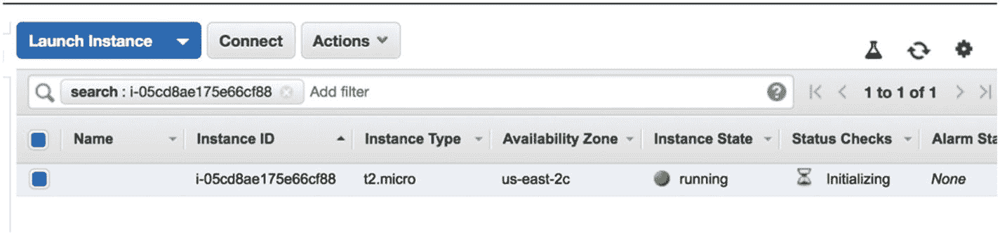

图 2-8

AWS，启动实例

在实例中，您会找到一个安全设置的链接。滚动到屏幕右侧，或转到左上方导航栏，选择“网络与安全” ➤ “安全组”。您可以更改安全设置。

对于 HTTP 和 `ssh`，您需要向全世界开放端口 (0.0.0.0/0)，但 `ssh` 将限制为您自己的计算机，称为“我的 IP”。见图 2-9。

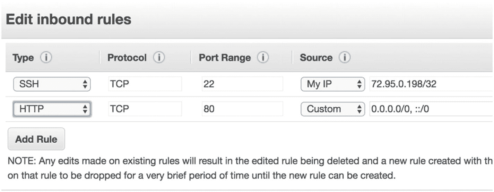

图 2-9

AWS 入站安全规则

接下来，您可以创建一个 `ssh` 快捷方式，通过一条命令访问服务器，如下所示：

```
> mkdir ~/.ssh
> vim ~/.ssh/config
```

将以下内容粘贴到配置文件中：

```
Host NEO
HostName [ip address]
User ubuntu
IdentityFile /[location of key]/neo.pem
```

使用机器的 IP 地址和密钥的位置配置这些设置。接下来设置密钥的权限。

```
> chmod 400 /[location of key]/neo.pem
```

现在，您可以使用一条命令访问您的机器，如图 2-10 所示。

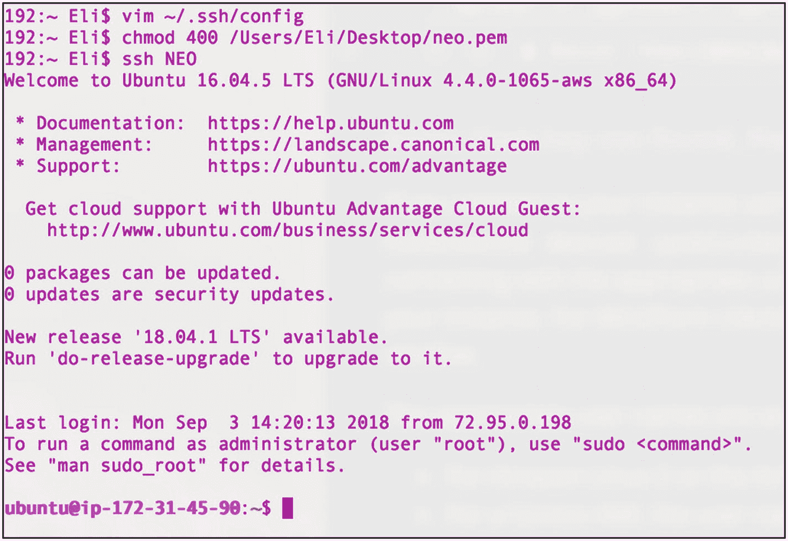

图 2-10

通过 `ssh` 连接到 AWS 机器

```
> ssh NEO
```

如果您在连接机器时遇到任何问题，请使用 AWS 故障排除页面，您可以在 [`https://docs.aws.amazon.com/AWSEC2/latest/UserGuide/TroubleshootingInstancesConnecting.html`](https://docs.aws.amazon.com/AWSEC2/latest/UserGuide/TroubleshootingInstancesConnecting.html) 找到它。

### 在 Ubuntu 16.04 上安装记账节点部署程序

现在您有了一台满足全节点最低需求的机器，可以安装所需软件了。首先安装依赖项，如下所示：

```
> sudo sh -c 'echo "deb [arch=amd64] https://apt-mo.trafficmanager.net/repos/dotnet-release/ trusty main" > /etc/apt/sources.list.d/dotnetdev.list'
> sudo apt-key adv --keyserver apt-mo.trafficmanager.net --recv-keys 417A0893
> sudo apt-get update
> sudo apt-get install dotnet-dev-1.0.4
```

NEO 文档中的当前安装说明似乎在安装过程中会产生错误，如下所示：

```
Depends:
dotnet-sharedframework-microsoft.netcore.app-1.0.4, dotnet-sharedframework-microsoft.netcore.app-1.1.1
```

解决方法是安装不同的 dotnet core 环境源列表并更新；然后您将能够安装`dotnet-dev-1.0.4`核心环境。

```
> sudo sh -c 'echo "deb [arch=amd64] https://apt-mo.trafficmanager.net/repos/dotnet-release/ xenial main" > /etc/apt/sources.list.d/dotnetdev.list'
> sudo apt-key adv --keyserver hkp://keyserver.ubuntu.com:80 --recv-keys 417A0893
> sudo apt-get update
```

记得将源列表改回如下：

```
> sudo sh -c 'echo "deb [arch=amd64] https://apt-mo.trafficmanager.net/repos/dotnet-release/ trusty main" > /etc/apt/sources.list.d/dotnetdev.list'
```

现在 dotnet core 环境已安装，使用以下命令检查 dotnet core 环境是否成功安装：

```
> mkdir hwapp
> cd hwapp
> dotnet new xunit --framework netcoreapp1.1
> dotnet restore hwapp.csproj
> dotnet run
> cd ..
> rm -rf hwapp/
```

### 记账节点部署

现在你已经安装了 `dotnet` 核心环境，接下来可以安装额外的依赖项并查看 NEO 项目。

```bash
> sudo apt-get install libleveldb-dev sqlite3 libsqlite3-dev libunwind8-dev
> git clone https://github.com/neo-project/neo-cli
> git branch -a
> git checkout v3.0
> git checkout head
```

要运行 NEO 节点，你需要 .NET Core 1.1.2 版本。下载 SDK 二进制文件；对于 Ubuntu 16.4，相关命令在此列出：[`https://www.microsoft.com/net/download/linux-package-manager/ubuntu16-04/sdk-2.1.300`](https://www.microsoft.com/net/download/linux-package-manager/ubuntu16-04/sdk-2.1.300)。

接下来，运行 `dpkg` 包管理器来安装软件包：

```bash
> wget -q https://packages.microsoft.com/config/ubuntu/16.04/packages-microsoft-prod.deb
> sudo dpkg -i packages-microsoft-prod.deb
```

现在你可以恢复 NEO 构建并进行编译，如下所示：

```bash
> dotnet restore
> dotnet publish -c Release
```

编译代码后，你会得到 DLL 文件的位置。

```bash
neo-cli -> /home/ubuntu/neo-cli/neo-cli/bin/Release/netcoreapp2.0/neo-cli.dll .
neo-cli -> /home/ubuntu/neo-cli/neo-cli/bin/Release/netcoreapp2.0/publish/
```

运行全节点：

```bash
> dotnet /home/ubuntu/neo-cli/neo-cli/bin/Release/netcoreapp2.0/neo-cli.dll .
```

此命令会打开一个名为 `neo` 的终端命令，并显示版本信息。

```
NEO-CLI Version: 3.0.0.0
```

在 `neo` 终端中，你可以查询版本以确保其工作正常。

```
neo> show state
```

你也可以创建一个钱包。

```
neo> create wallet wallet.db3
```

此命令将要求输入密码。

```
password: [选择一个密码]
password: [确认密码]
```

然后它会为你的钱包生成一个公钥和地址。

```
address: AXZmWZckF55xb1p566No2qh19uj8vt5d2R
pubkey: 03b80edc66c9324077c8c1c4bbad1e1ace7e1b7e8ac63945a3b5bb9f642f4520f1
```

现在你已经在 AWS 机器上拥有了一个 NEO 节点，并且能够与 NEO 命令行界面（CLI）进行交互。在接下来的章节中，你将使用 CLI。你可以提前了解 NEO 网站上关于智能合约和去中心化应用（dapp）开发的文档：[`http://docs.neo.org/en-us/node/cli.html`](http://docs.neo.org/en-us/node/cli.html)。

### 申请共识权限证书

既然你在合格的 Ubuntu 服务器上拥有一个可运行的节点，现在可以获取共识权限证书。NEO 白皮书中讨论了拥有真实身份的必要性：

> *“DBFT 结合了数字身份技术，意味着记账人可以是真实姓名的人或机构。因此，可以对他们进行冻结、撤销、继承、检索以及司法裁决。这有助于在 NEO 网络中注册合规的金融资产。NEO 网络计划在必要时支持此类操作。”*

你可以直接从 OnChain/NEO 获得 CA 证书。此外，你可以在 NEO 论坛上找到更多信息：[`https://www.reddit.com/r/NEO/`](https://www.reddit.com/r/NEO/)。此过程超出了本书的范围，但想要被选为节点，这是必需的。

### 获取 GAS

要成为节点，你还需要质押 1,000 GAS 才能成为记账人。购买 GAS 最简单的方法是在交易所进行。另一种选择是持有 NEO，每持有 1,000 NEO，你将获得 0.33 GAS。请参见图 2-11，该图显示了在持有 NEO 币后领取 GAS 币的按钮。

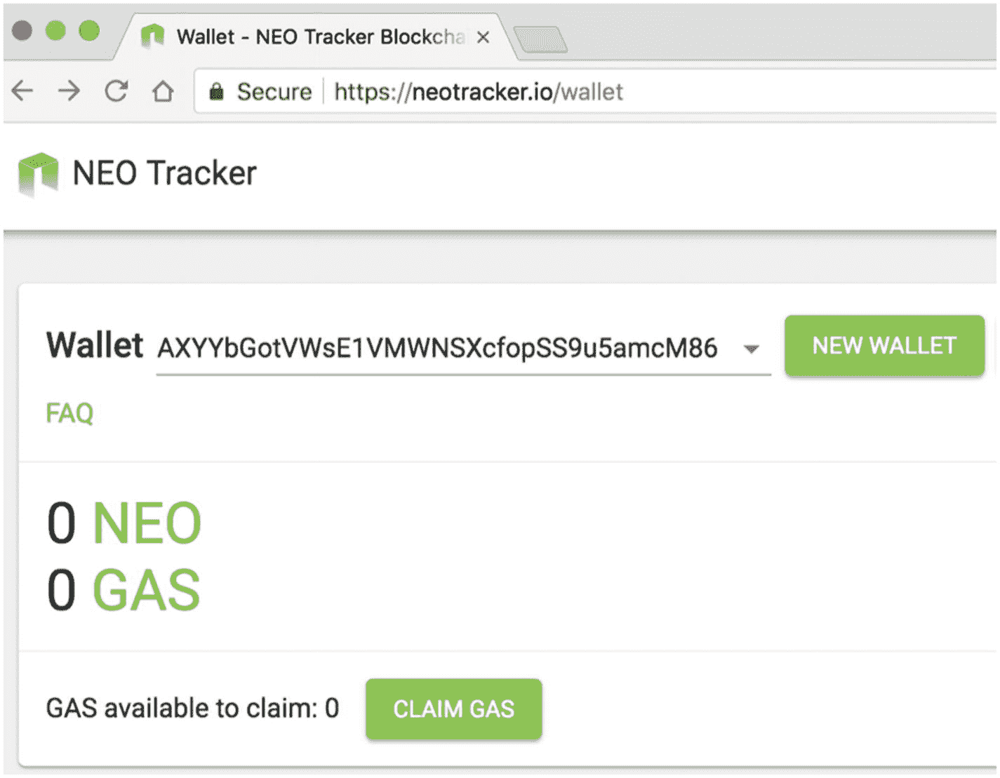

**图 2-11** — Neotracker.io 提供的“Claim Gas”（领取 GAS）选项

简单计算一下撰写本文时 NEO 和 GAS 的价格，可以看出这是一笔不小的投资。

### 被选为记账人

NEO 是一个电子民主系统，NEO 持有者可以投票决定谁应该成为记账人。在撰写本文时，NEO 团队尚未实现投票功能；但根据 GitHub 的维基百科页面显示，未来很可能会实现，因为其中描述了包含费用的支付结构，包括为投票记账人支付 10 GAS：[`https://github.com/neo-project/neo/wiki/Network-Protocol`](https://github.com/neo-project/neo/wiki/Network-Protocol)。

现在，停止 EC2 节点，以免产生费用。要停止实例，请选择 **EC2 控制面板** ➤ **正在运行的实例** ➤ **操作** ➤ **实例状态** ➤ **停止**。请参见图 2-12。

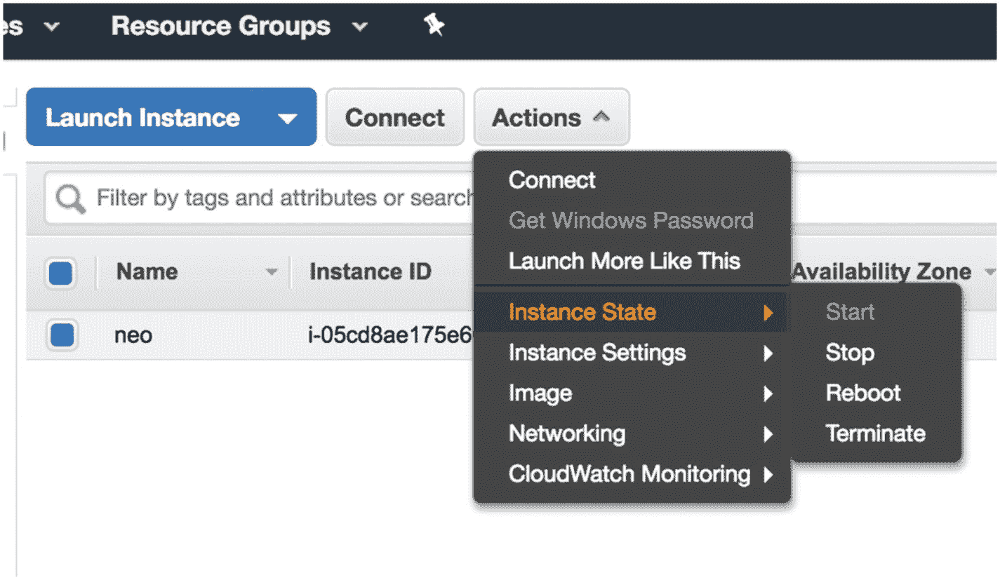

**图 2-12** — AWS，停止实例操作

> **提示：** 对于已停止的实例，Amazon 可能会对附加的 EBS 卷收取存储费用。费用为每 GB 5 美分。Amazon 提供一年的免费使用期。要完全避免收费，你需要“终止”该实例，而不仅仅是停止它。你可以通过以下网址确认是否产生费用：[`https://console.aws.amazon.com/billing/home`](https://console.aws.amazon.com/billing/home)。

### 创建 EOS 区块生产者

现在你将学习如何在专用服务器上运行一个完整的 EOS 节点；你只需要确保满足最低硬件要求。相关要求在此列出：[`https://developers.eos.io/eosio-nodeos/docs/install-nodeos`](https://developers.eos.io/eosio-nodeos/docs/install-nodeos)。

在撰写本文时，所有平台的系统要求如下：
- 需要 7 GB 可用内存
- 需要 20 GB 可用存储空间

你将学习如何设置一个 Ubuntu 服务器。我将使用 AWS。在 AWS 中，选择 **Ubuntu Server 16.04 LTS (HVM), SSD Volume Type** ➤ **选择实例类型** ➤ **通用型** ➤ **t2.large**。这种类型的机器有 8 GB 可用内存。

EOS 节点需要至少 20 GB 的存储空间，因此为了安全起见，我们将这台机器的存储设置为 25 GB。为此，选择 **配置实例详情**。接着选择：**添加存储**。在下一个窗口中，选择：**大小 (GiB)** 为 25 GB。下一个向导窗口将允许你：**审核并启动**。启动实例。

在安全方面，设置与你为 NEO 全节点服务器相同的设置：选择一个现有的安全组。接着选择：`launch-wizard-1`，该安全组包含用于 SSH 的 22 端口以及公共 HTTP/HTTPS 端口。现在，我们可以在下一个窗口中选择 **审核并启动**，最后点击 **启动**。

在密钥对中，使用你为 NEO 创建的相同密钥，或者创建一个新密钥。要选择相同的密钥，请选择 **选择现有的密钥对**。我们将此密钥命名为：`EOS`。

就这样。现在你可以用新的服务器更新 SSH 配置文件，以便快速连接。

```
> vim ~/.ssh/config
```

并粘贴以下内容：

```
Host EOS
HostName [IP 地址]
User ubuntu
IdentityFile /[密钥位置]/EOS.pem
```

现在你可以连接到 EOS 服务器。

```
> ssh EOS
```

### 安装 EOS 全节点

在 Ubuntu 服务器配置好 8 GB 内存和 25 GB 硬盘后，即可克隆项目并进行构建。

```bash
> git clone https://github.com/EOSIO/eos --recursive
> cd eos
> ./eosio_build.sh #大约需要 30 分钟到一小时
```

构建完成后，将会看到如图 2-13 所示的画面。

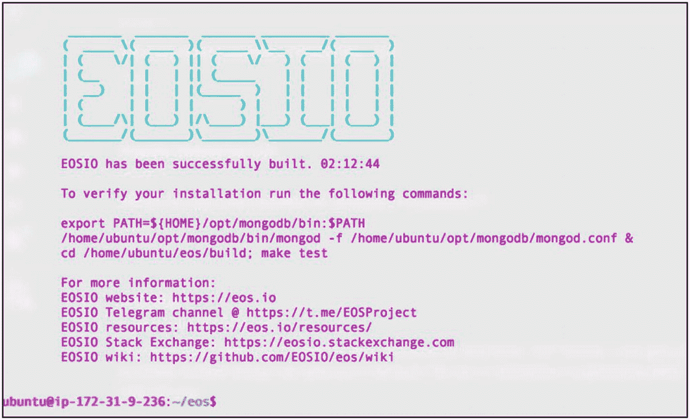

图 2-13 EOS 全节点构建完成输出

通过运行 `-h` 标志获取命令列表，确保守护进程正常工作。

```bash
> cd build/programs/nodeos
> ./nodeos -h #命令列表
```

现在可以运行 EOS 节点守护进程；图 2-14 显示了输出结果。

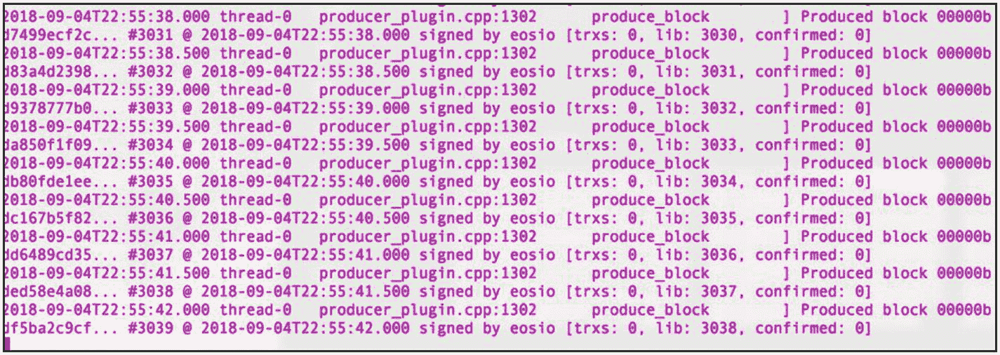

图 2-14 EOS 全节点运行中

```bash
> ./nodeos -e -p eosio --plugin eosio::chain_api_plugin --plugin eosio::history_api_plugin
```

EOS 在 [`https://developers.eos.io/`](https://developers.eos.io/) 提供一个门户网站，可帮助您快速上手节点、去中心化应用程序、智能合约、代币等。在后续章节中，您将进一步与 EOS 平台交互。

### 营销与上架

既然已成功运行 EOS 节点，您需要开展营销活动以争取当选。您可以将提交资料设置为类似于以下网址的格式：[`https://github.com/consenlabs/eos-bp-profile`](https://github.com/consenlabs/eos-bp-profile)。

接下来，您即可准备接收投票。您可以通过 `imToken` 2.0 应用（iPhone 或 Android）进行投票。该应用提供区块生产者投票功能，请按照以下指南操作：[`https://medium.com/imtoken/guide-imtoken-2-0-block-producers-voting-141983f9a76e`](https://medium.com/imtoken/guide-imtoken-2-0-block-producers-voting-141983f9a76e)。

### 终止 EOS 节点

请务必终止节点，以免产生费用，因为此机器配置不属于 Amazon 的免费套餐服务器。与之前操作相同，依次选择：EC2 仪表板 ➤ 运行实例 ➤ 操作 ➤ 实例状态 ➤ 终止。

同时，还需要终止您创建的 25 GB 卷。从左侧导航菜单中选择“卷”，然后选择“操作”➤“分离卷”。接着选择“删除卷”。参见图 2-15。

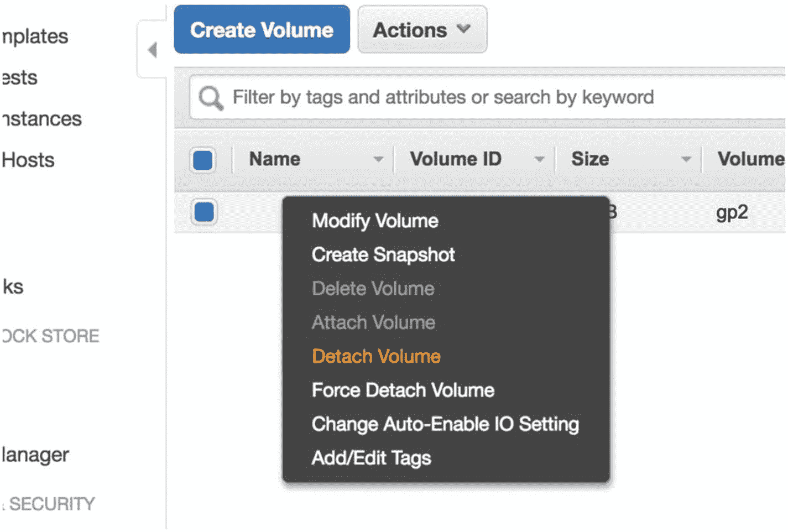

图 2-15 分离卷并删除卷

## Bitcoin Core API

作为开发者，您需要深入了解一项技术的工作原理。为了更全面地理解区块链，尤其是比特币区块链，您将下载并安装比特币核心代码。之前基于比特币核心搭建的全节点和比特币矿工，既可以通过源代码编译，也可以使用预编译的可执行文件。

之前您已在计算机上搭建了一个能够挖矿的比特币节点。要使用比特币核心 API，您需要一个全节点。那么，全节点和矿工之间有什么区别呢？

全节点是区块链的完整副本，能够验证自创世区块以来区块链上发生的所有交易。截至撰写本文时，这需要占用 180 GB 的存储空间。不过，您会发现，可以将全节点配置为不下载整个账本。全节点无需解决任何数学难题，哈希计算也不是其关注点。

矿工是网络中的一个节点；但正如您所见，其职责是通过处理交易并找出存储信息的最佳区块（或哈希）来生成区块。矿工们相互竞争，通常需要花费约 10 分钟来找到问题解决方案。全节点则将区块永久保存在数据库中，并由其他节点进行验证。相比之下，矿工无需了解之前的所有区块，只需知道前一个区块，并专注于哈希计算。然而，比特币矿工确实需要下载整个 180 GB 的区块链账本。

在接下来的练习中，您将安装并配置一个全节点，以连接和使用比特币核心 API。

### 安装并配置完整比特币节点

#### 系统设置

在本练习中，您将搭建环境，然后下载、配置并启动一个完整的比特币工作节点。随着您继续研究比特币和区块链的工作原理，这将非常实用。您将使用比特币核心源代码。比特币核心代码包含的文档提供了在不同操作系统上安装该代码的完整说明。本书中，我将重点介绍 macOS，因此为方便起见，提供了加速安装过程的说明；不过，您也可以在其他平台上安装比特币核心。以下是适用于 Mac 和 PC 的完整说明链接：

- macOS 安装说明：[`github.com/bitcoin/bitcoin/blob/master/doc/build-osx.md`](https://github.com/bitcoin/bitcoin/blob/master/doc/build-osx.md)
- Windows 安装说明：[`github.com/bitcoin/bitcoin/blob/master/doc/build-windows.md`](https://github.com/bitcoin/bitcoin/blob/master/doc/build-windows.md)

要开始操作，您需要安装 `Xcode` 和 `Xcode` 工具。如果您尚未安装，现在是个不错的时机。要检查您的计算机上是否已安装 `Xcode`，请点击 Spotlight 搜索打开命令行终端，然后输入 `Terminal`。

在命令行中，输入以下命令以检查是否已安装 `Xcode`：

```
> xcode-select –v
```

它应返回 `xcode-select` 及版本号，如图 2-16 所示。

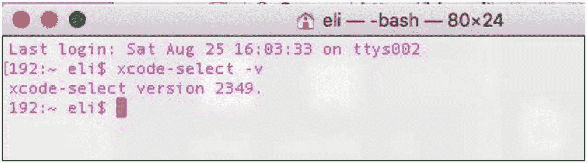

**图 2-16** 终端 `xcode-select` 版本

如果尚未安装 `Xcode`，您可以从 [`developer.apple.com/xcode/`](https://developer.apple.com/xcode/) 下载。

> **注意：** 根据您的网络连接状况，此安装可能需要数小时。

现在您已下载 `Xcode`，请执行 `Xcode` 的命令行工具。

```
> xcode-select –install
```

安装命令行工具后，您可以使用以下命令安装 `Homebrew` 和 `wget` 工具：

```
> /usr/bin/ruby -e "$(curl –fsSL https://raw.githubusercontent.com/Homebrew/install/master/install)"
> brew install wget
```

安装 `Homebrew` 和 `wget` 后，您就可以安装比特币核心所需的其他依赖项，如下所示：

```
> brew install automake berkeley-db4 libtool boost miniupnpc openssl pkg-config protobuf python qt libevent qrencode librsvg
```

#### 安装比特币核心

至此，您已安装了所需的工具和依赖项，接下来可以克隆比特币核心仓库、编译并运行它。

```
> git clone https://github.com/bitcoin/bitcoin.git
> cd bitcoin/
```

现在，您可以构建比特币核心节点使用的 Berkeley DB 版本 4：

```
> ./contrib/install_db4.sh .
```

继续安装：

```
> ./autogen.sh
> ./configure
> make
> make check && sudo make install
```

比特币核心代码包含两个工具：`bitcoind` 和 `bitcoin-cli`。

- **`bitcoind`（比特币守护进程）：** 实现用于远程过程调用（RPC）的比特币协议。安装后，您可以进行 API 调用。所有 API 调用的列表位于此处：[`en.bitcoin.it/wiki/Original_Bitcoin_client/API_Calls_list`](https://en.bitcoin.it/wiki/Original_Bitcoin_client/API_Calls_list)。
- **`bitcoin-cli`（比特币命令行界面）：** 使您能够与比特币核心守护进程进行交互。为确保安装顺利，您可以检查比特币守护进程和 `bitcoin-cli` 的配置是否正常并按预期工作。

要确保这些工具已正确安装，您可以对这些工具执行 `which` 命令以获取它们的位置。

```
> which bitcoind
> which bitcoin-cli
```

输出将返回 `bitcoind` 和 `bitcoin-cli` 的位置：

```
/usr/local/bin/bitcoind
/usr/local/bin/bitcoin-cli
```

#### 配置和编译比特币核心

接下来，您需要配置一个节点。每个比特币核心节点不参与挖矿，而是为比特币网络做出贡献，由客户端、矿工、钱包等组成。要配置节点，您可以通过在终端中输入以下命令来找到配置文件的路径：

```
> bitcoind -printtoconsole
```

几秒钟后，停止此服务（`Control+C`）。该命令将显示 `bitcoin.conf` 配置文件的路径。输出见图 2-17。

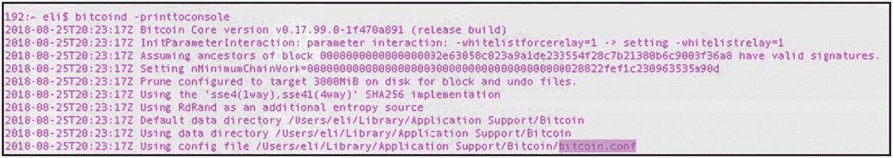

**图 2-17** `bitcoin.conf` 文件位置

```
> Using config file /[path]/.bitcoin/bitcoin.conf
```

在撰写本文时，一个完整索引的比特币核心节点需要 2 GB 内存和至少 180 GB 磁盘空间（[`blockchain.info/charts/blocks-size`](https://blockchain.info/charts/blocks-size)）。此外，由于比特币节点不断地发送和接收交易与区块，您还需要快速的互联网连接。

对于运行矿工的工作项目，建议使用完整节点，因为您可以运行专用服务器并通过 `bitcoin-cli` 与 `bitcoind` 交互；但是，就本书而言，大多数情况下您不需要完整节点。我建议限制比特币节点在您计算机上的资源使用，以免它占用您的计算机资源和互联网带宽。

为了限制您的节点下载整个共享账本，请使用 `vim` 或您喜欢的编辑器来编辑 `bitcoin.conf` 文件。

```
> vim /[path]/.bitcoin/bitcoin.conf
```

在 `vim` 打开 `bitcoin.conf` 后，粘贴以下配置：

```
alertnotify=myemailscript.sh "Alert: %s"
prune=3000
maxconnections=10
dbcache=150
maxmempool=100
maxsendbuffer=500
maxreceivebuffer=2000
txindex=0
```

请确保不要删除其中已有的以下行：

```
rpcuser=bitcoinrpcrpc
password=[password]
```

为了您的知识了解，配置文件包含以下参数：

- **`prune`：** 利用 `prune`，您可以限制磁盘使用量。将其设置为 3000。
- **`maxconnections`：** 通过设置有限的 `maxconnections` 值，您可以将最大节点连接数限制为十个连接。
- **`dbcache`：** 在 `dbcache` 中，您将 UTXO 缓存的大小从 300 MiB 减少到 100 MiB。
- **`maxsendbuffer` 和 `maxreceivebuffer`：** 您可以将每个连接的内存缓冲区限制在您设定的数值；例如，将 `maxreceivebuffer` 设置为 2000 MB。
- **`txindex`：** 将其设置为 1 以获取区块链上任何交易的交易数据；但是，这将占用更多磁盘空间。

#### 运行比特币核心守护进程

现在您已配置好节点，可以启动比特币核心守护进程了。要运行 `bitcoind`，请在终端中执行以下命令：

```
> bitcoind -printtoconsole
```

首次运行守护进程时，它将下载区块链。这可能需要数小时（取决于您的互联网连接）。由于您设置了参数以打印到控制台（`-printtoconsole`），您将能够在下载整个区块链时看到进程。见图 2-18。

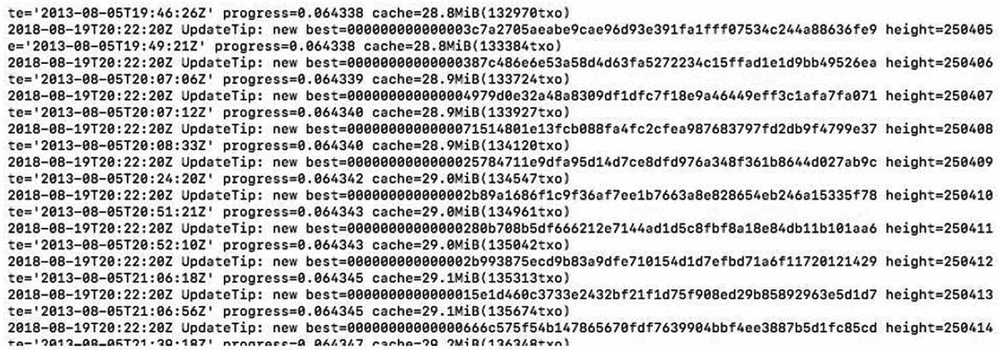

**图 2-18** 比特币核心守护进程（`bitcoind`）

在进程运行时，打开第二个终端窗口以查询 `bitcoind` 并通过 `bitcoin-cli` 与 API 交互。注意：您可以调用帮助功能并获得有关可用 API 的帮助。例如，要获取所有可用 API 的列表，请使用以下命令：

```
> bitcoin-cli --help # 输出命令行选项列表。
> bitcoin-cli help # 在守护进程运行时输出 RPC 命令列表。
> bitcoin-cli help getblockhash # 获取特定 API（例如 "getblockhash"）的帮助。
```

为了获取完整信息，你需要运行一个全节点。在配置文件中运行全节点时，在 `bitcoin.conf` 文件中将 `txindex` 设置为 `1`，并移除 `prune=3000`。使用你喜欢的编辑器打开 `bitcoin.conf`。

```
> vim /[path]/.bitcoin/bitcoin.conf
```

按如下方式修改参数：

```
txindex=1
#### prune=3000 - 注释掉此行
```

此更改将允许你运行全节点并提供索引信息，以便你审查区块链上任何交易的交易数据。现在，你可以重新启动比特币核心守护进程，并告诉守护进程重新索引所有数据。

```
> bitcoind -reindex –printtoconsole
```

再次强调，这个过程可能需要几个小时；然而，在下载区块时，你将能够与已下载的区块进行交互。

要获取区块链信息，你可以查询守护进程以显示你的节点进度。请参见图 2-19 中的预期输出。

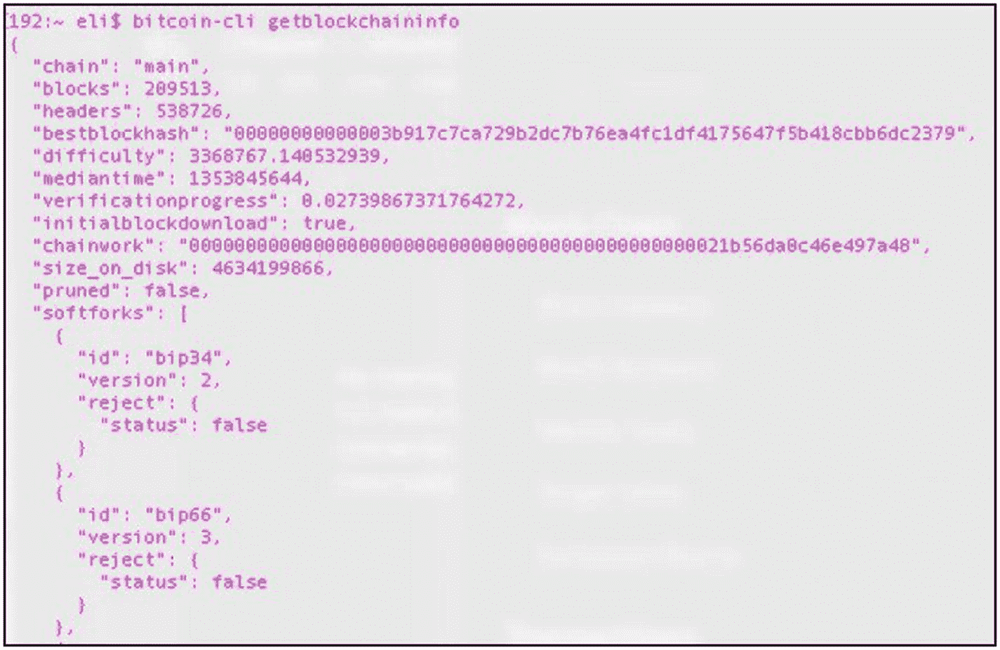

图 2-19：获取区块链信息

```
> bitcoin-cli getblockchaininfo
```

这并没有完成比特币节点的完整下载；然而，你已经拥有了 209,513 个区块和 538,726 个区块头。节点首先下载最佳链区块的区块头，然后下载完整的区块。

在本练习中，你设置了环境、下载了区块、进行了配置并启动了比特币节点。

### 序列化区块

每个全节点都持有相同的已验证区块并遵循相同的规则（共识规则）。链中的每个比特币区块都包含一个根据当前比特币共识规则序列化的 1 MB 代码。

区块头包含编码信息，包括以下内容：

*   `Version`
*   前一个区块头
*   `Merkle` 根哈希
*   `Time`
*   `nBits`
*   `nonce`
*   `txn_count`（保存交易总数）
*   `txns`（原始交易）

这些数据会被哈希，并且是工作量证明算法和共识规则的一部分。中本聪的白皮书解释了共识规则。

> “他们用 CPU 算力投票，通过努力延长有效区块来表达对其的接受，并通过拒绝在无效区块上工作来表达对其的拒绝。任何必要的规则和激励措施都可以通过这种共识机制来强制执行。”
>
> ——《比特币：一种点对点的电子现金系统》

比特币中的工作量证明（`PoW`）基于 Adam Back 的 `Hashcash`。每个矿工都在竞相解决难题；一旦难题被解决，过程就会重新开始。该难题是一个被称为“工作量证明问题”的数学谜题，奖励将给予第一个解决该问题的矿工。然后，经过验证的交易被存储在公共账本中。你将在下一节中了解更多相关信息。大约每 9.9 分钟生成约 25 个比特币。根据中本聪白皮书：

> “一个没有交易的区块头大约为 80 字节。如果我们假设每 10 分钟生成一个区块，那么 80 字节 * 6 * 24 * 365 = 每年 4.2 MB”
>
> ——《比特币：一种点对点的电子现金系统》

在撰写本文时，比特币每秒处理三笔交易，如果比特币交易量增加到每秒四笔，那么比特币将以峰值容量运行。另一方面，以太坊每秒运行五笔交易，如果达到八笔，那将是峰值容量。这种设计造成了可扩展性缺陷，因为大型企业需要每秒处理数十万笔交易，而不是每秒仅处理四到八笔。

### 区块头

如前所述，区块在比特币网络中的节点之间共享。每个区块头都是序列化的 80 字节格式。每个区块头中都编码了以下信息：

*   **版本**：在撰写本文时，有四个区块版本。版本 1 是创世区块（2009 年），版本 2 是比特币核心 0.7.0（2012 年）中的软分叉。版本 3 区块是比特币核心 0.10.0（2015 年）中的软分叉。版本 4 区块是比特币核心 0.11.2（2015 年）中的 `BIP65`。

#### 注意

什么是 `BIP`？`BIP` 是**比特币改进提案**（`BIP`）。它是一个用于向比特币引入特性或信息的文档。由于比特币是开源的且没有正式结构，`BIP` 是交流想法的标准。

*   **前一个区块头哈希**：这是前一个区块头的 `SHA256(SHA256())` 哈希。这确保了完整性，因为更改一个前一个区块将需要更改每一个之前的区块。
*   **Merkle 根哈希**：`Merkle` 树是一个二叉树，它包含树的所有哈希对。
*   **时间**：这是矿工开始对区块头进行哈希时的 Unix 纪元时间。
*   **nBits**：`nBits` 是区块头的目标部分。
*   **nonce**：这是矿工为了修改区块头哈希以产生一个小于或等于目标阈值的哈希而更改的任意数字。

你已经下载了部分区块链，并且能够查询已经下载的区块高度。

```
> bitcoin-cli getblockhash 375617
```

守护进程返回了一个字符串，其中包含索引 `375617` 处最佳链的区块哈希。然后，你可以请求获取实际的区块。

```
> bitcoin-cli getblock 00000000000000000f270563d7f2187beec75cdc04f98823572e5a31baf0a261
```

图 2-20 显示了结果。如你所见，区块信息包括`previousblockhash`键和`nextblockhas`键。这些键是 `SHA256(SHA256())` 哈希加密的键。规则确保区块无法被更改。这些规则是维护区块链安全性（即使是通过不可信的节点）而设置的共识规则的一部分。

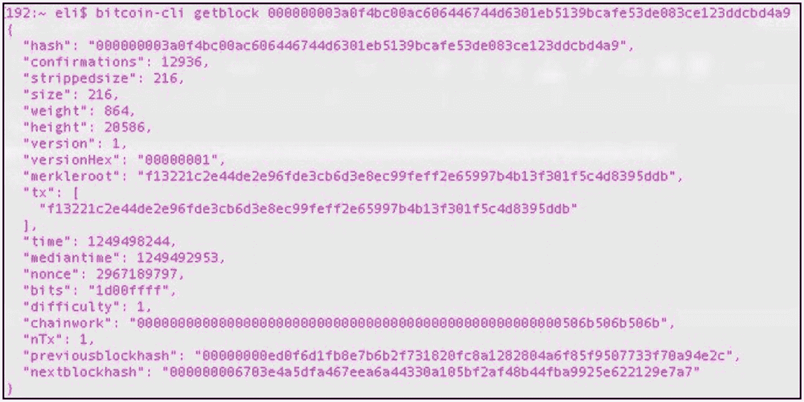

图 2-20：获取区块信息

### 区块版本

区块版本是区块头的一部分。你可以看到区块中使用的区块版本。在图 2-20 中，你可以看到区块 `00000000000000000f270563d7f2187beec75cdc04f98823572e5a31baf0a261` 仅使用了版本 1。

共识机制只能由比特币开源开发团队更改，该团队发布了关于如何处理升级建议的说明。引入升级方法来处理版本化交易和区块路径的 `BIP` 被用于版本 2、3 和 4。

添加到比特币核心的函数用于管理软分叉。你可以在此处了解更多关于此 `BIP` 功能的信息：[`https://github.com/bitcoin/bips/blob/master/bip-0034.mediawiki`](https://github.com/bitcoin/bips/blob/master/bip-0034.mediawiki)。

#### Merkle 树

你调用函数来检索区块信息，并收到了一个 `Merkle` 根哈希键。`Merkle` 树是一个二叉树。`Merkle` 树的根节点包含树的所有哈希对。为了帮助可视化这个过程，请看下面一个简单的哈希树二进制列表的 ASCII 示例：

```
交易列表: H(A)->H(B)->H(C)->H(D)
       Hash(A|B|C|D)
        /               \
   Hash(A|B)         Hash(C|D)
    / \          /         \
Hash(A)  Hash(B)  Hash(C)   Hash(D)
```

包含在此 `Merkle` 根中的区块头是该区块中所有交易后代的代表。`HASH(A|B|C|D)` 是 `Merkle` 根。每个元素 A、B、C 和 D 将是该区块中所有交易的哈希。在我们的示例中，每个区块只有一笔交易。

```
Merkle 根: H(A)
      /
   Hash(A)
```

### 目标 nBits
区块头中包含 `nBits`。`nBits` 是区块头的目标部分。`nBits` 是 256 位目标阈值的 32 位紧凑编码。它的工作方式类似于科学记数法，但使用 256 进制而不是 10 进制。每隔 2016 个区块，比特币核心会到达一个重新调整目标点，并根据比特币难度规则调整 `nBits`。比特币的难度会根据找到 2016 个区块所花费的时间是少于还是多于两周而增加或减少。换句话说，如果哈希率增加，难度就会增加；如果全网哈希率降低，难度就会降低。

例如，要将 `nBits` 值 `0x181b8330` 转换为目标阈值，你可以使用与常规科学记数法相同的简写方式来计算；见图 2-21。

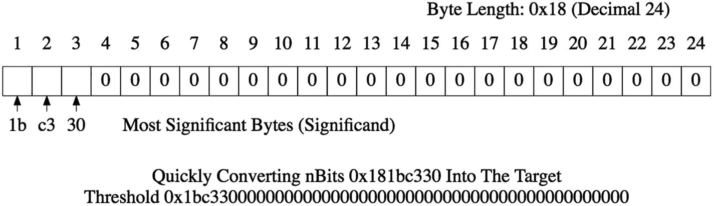

## 图 2-21 计算 `nBits`。图片来源：stackexchange.com。

将 `0x1bc3300000000000000000000000000000000000000000000` 转换为 `nBits` 值 `0x181b8330`。这将作为我们的目标阈值。

### txn_count
`txn_count` 参数表示给定区块中交易的总数，包括 coinbase 交易。

Coinbase 是一个特殊字段，用作 coinbase 交易的输入。Coinbase 允许你领取区块奖励，并提供最多 100 字节的任意数据空间。

每个区块都包含交易，而区块中的第一笔交易由矿工创建；它包含一个单一的 coinbase。

### 区块奖励
比特币矿工因创建区块而获得奖励。奖励是区块补贴加上该区块中所包含交易支付的交易费用之和。

区块补贴是新可用的 satoshis 奖励。它最初为 50 个比特币，并且每 210,000 个区块（大约每四年）减半一次。在撰写本文时，大约是 12.5 个比特币。80% 的区块补贴已被支付，在达到 2100 万个比特币的供应上限之前，只剩下 420 万个比特币可供挖掘。到那时，矿工将只能获得交易费用作为奖励。

如前所述，每个区块都包含交易，而区块中的第一笔交易由矿工创建；它包含一个单一的 coinbase，即奖励。

### txns：解码交易
`txns` 是区块中的原始交易。为了更好地理解这个过程，让我们实际操作一笔交易。存储在区块链账本中的比特币交易以序列化的字节格式（原始格式或原始交易）在不同节点之间广播。要解码 SHA256 原始交易，你可以调用比特币客户端并利用不同的 API。

首先，你可以检索一个你想处理的区块。你正在运行的守护进程会列出新的最佳区块，如图 2-22 所示。

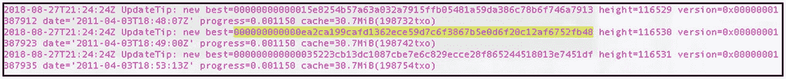

## 图 2-22 比特币守护进程打印到控制台的结果
如你所见，你可以通过查看比特币守护进程的输出来找到新的最佳区块。在本例中，你选择了哈希值 `000000000000ea2ca199cafd1362ece59d7c6f3867b5e0d6f20c12af6752fb48`。

最佳区块链是选定的最难重新创建的链。请记住，在区块链中，每个区块都指向它前面的区块；这就是区块链能够提供安全保障并防止双重支付的方式。

现在你有了新的最佳区块，你可以检索该区块的哈希数据。

```
> bitcoin-cli getblock 000000000000ea2ca199cafd1362ece59d7c6f3867b5e0d6f20c12af6752fb48
```

`getblock` 命令返回关于你请求的区块的编码后 SHA256 哈希数据（图 2-23）。

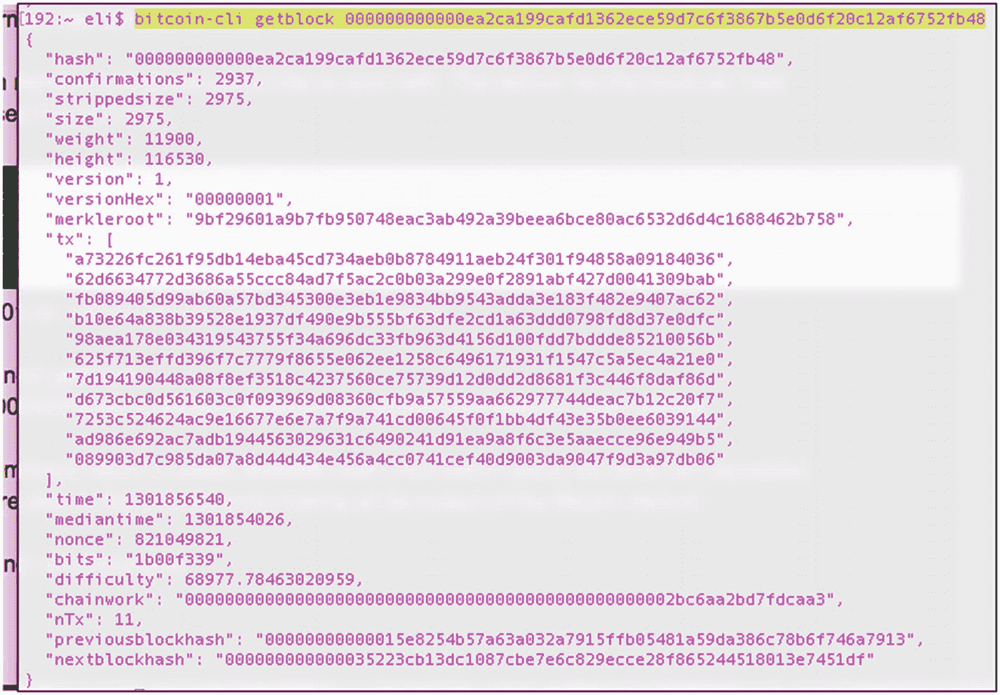

## 图 2-23 `getblock` 检索区块信息
让我们检查一下 `getblock` 调用的结果。你得到了一个作为哈希的 Merkle 根，以及该区块中所有交易的哈希 `tx`。

```
"tx": [
"a73226fc261f95db14eba45cd734aeb0b8784911aeb24f301f94858a09184036",
交易哈希 02,
交易哈希 03,
等等...
]
```

如你所见，这个区块的数组中包含多个 `tx`（交易）。现在你可以请求检索每笔交易（`tx`）的原始交易数据。

`getrawtransaction` 命令将返回原始数据。

```
> bitcoin-cli getrawtransaction a73226fc261f95db14eba45cd734aeb0b8784911aeb24f301f94858a09184036
```

这是原始交易的 SHA256 数据：

```
01000000010000000000000000000000000000000000000000000000000000000000000000ffffffff070439f3001b0141ffffffff0100f2052a01000000434104b5a750a0ca4bb5a47b6f169b8a8f42b39e2dbb7967d046f1bf018d927d102c280f1123ebfd973f6e651f2e5ff4486e18a90cc67d6d17ccdb95cd6bf028d791cfac00000000
```

现在你可以使用 `decoderawtransaction` 命令解码这个 SHA256 原始交易数据。

```
> bitcoin-cli decoderawtransaction 01000000010000000000000000000000000000000000000000000000000000000000000000ffffffff070439f3001b0141ffffffff0100f2052a01000000434104b5a750a0ca4bb5a47b6f169b8a8f42b39e2dbb7967d046f1bf018d927d102c280f1123ebfd973f6e651f2e5ff4486e18a90cc67d6d17ccdb95cd6bf028d791cfac00000000
```

该命令以可读格式返回交易结果，如图 2-24 所示。

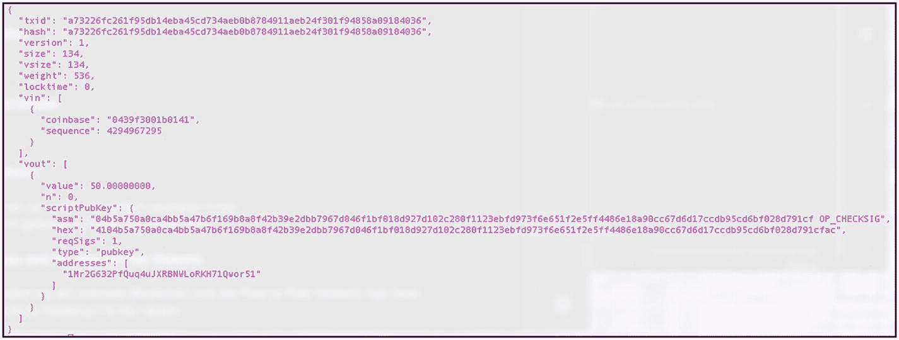

## 图 2-24 使用 `decoderawtransaction` 命令解码交易

### 比特币钱包
正如你在图 2-24 中看到的，钱包地址是 `1Mr2G632PfQuq4uJXRBNWLoRKH71Qwor51`，金额是 50 个币。

你也可以通过访问包含全节点的服务并检查钱包余额，在线确认该钱包的交易。图 2-25 显示了来自 `https://bitref.com/1Mr2G632PfQuq4uJXRBNWLoRKH71Qwor51` 的截图。

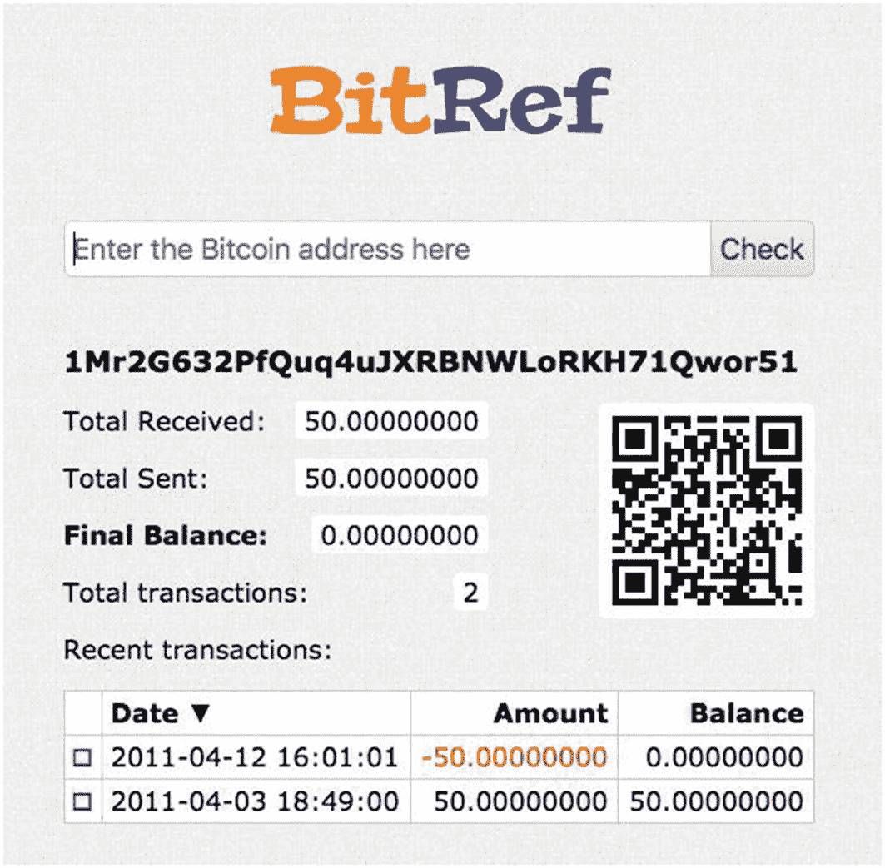

## 图 2-25 `1Mr2G632PfQuq4uJXRBNWLoRKH71Qwor51` 钱包余额
类似地，你可以通过 CLI 查询钱包的可用资金：

```
> bitcoin-cli getbalance 1Mr2G632PfQuq4uJXRBNWLoRKH71Qwor51
```

在接下来的章节中，我将会详细介绍钱包，届时我会更深入地解释钱包的操作，但现在，你可以看到该用户在 2003 年购买了 50 个币，并在 2012 年卖出了它们。请注意，虽然你不知道拥有该钱包的人的身份，但你可以查看该钱包的当前余额，因为这是公开信息。

## 总结
在本章中，你学习了如何运行一个可以帮助管理区块链的区块链节点。对于比特币，你创建了一个称为矿工的节点。对于 NEO，你创建了一个具有管理权限的节点，称为记账节点，而对于 EOS，你创建了一个区块生产者。你还探讨了需要做些什么才能让你的节点被选中或运行起来，从而使其有利可图。

接着，你安装了一个能够运行比特币核心 API 的完整比特币节点。你安装并配置了你的节点，并学习了如何运行比特币核心守护进程。然后，你与比特币核心 API 进行了交互，并学会了如何序列化区块以及更深入地理解每个区块内部的数据。

我介绍了区块奖励、交易和比特币钱包。在下一章中，你将构建你自己的区块链 P2P 网络，以便更深入地理解区块链的工作原理。