# 3. 创建你自己的区块链

本章将介绍如何构建你自己的区块链 P2P 网络。这是一个包含七个步骤的过程，因此每一节我都会先做简要介绍，然后安排一个练习。你可以从 GitHub 下载以下每个练习的代码，并跟着操作：

- 创建基础 P2P 网络
- 发送与接收区块
- 注册矿工并创建新区块
- 搭建键值数据库 LevelDB
- 创建私钥-公钥钱包
- 使用 API 服务
- 创建命令行界面

本章将深入讲解代码，本章中的示例本质简单，旨在用于学习。它们将帮助你更好地理解区块链，以及构建一个完全可运行的区块链原型所需的要素。

**注意**：在这篇简短的教学章节中，创建一个完整的生产级区块链并不可行；不过，我会为你提供创建基本可用区块链的基础知识。

### 创建基础 P2P 网络

创建区块链的第一步是创建一个 P2P 网络。正如你在前几章中所见，P2P 网络是使区块链运转的关键。在加密货币中，P2P 网络有助于防止工作量证明机制中的双重支付问题，同时也是权益证明机制背后的核心架构。在区块链中，它允许你在网络上同步任何所需的数据。

**注意**：点对点（P2P）是一种使用分布式架构的计算机网络。每个对等节点或节点共享工作负载，且与其他对等节点地位平等，这意味着不应该存在任何特权节点。

> “我们提出了一种不依赖信任的电子交易系统。我们从由数字签名构成的常规货币框架入手，该框架提供了强有力的所有权控制，但若缺少防止双重支付的方法则是不完整的。为解决此问题，我们提出了一种使用工作量证明来记录公开交易历史的 P2P 网络，一旦诚实节点控制了大部分的 CPU 算力，对于攻击者来说，修改历史在计算上会变得不切实际。”
>
> —*Bitcoin: A Peer-to-Peer Electronic Cash System*

在本章中，我将向你展示如何使用 `Node.js` 创建你的区块链，但你也可以使用任何其他编程语言来完成，因为原理是相同的。你将使用 `WebStorm` 集成开发环境（IDE）搭建你的机器，本书将全程使用该环境。要下载 `WebStorm`，请访问 `https://www.jetbrains.com/webstorm/`。`WebStorm` 提供 30 天试用期；不过，这不是必需的，你可以选择任何你喜欢的 IDE 并获得相同的结果。在撰写本书时，`WebStorm` 的版本是 2018.2。

#### 第一步：基础 P2P 网络练习

**设置你的项目**

在这个练习中，你将设置你的项目并创建一个基础的 P2P 网络，用于发送和接收消息。在能够发送和接收消息之后，你将能够创建一个区块类和一个链式库，并将多个区块连接在一起以创建一个区块链。你需要在你的机器上安装 `Node.js`；安装方法有很多。一种简单的方法是通过预构建的安装程序管理器；在这里找到适合你平台的安装程序：`https://nodejs.org/en/download/`。

下载 `WebStorm` 后，你可以创建一个新项目。选择 文件 ➤ 创建新项目 ➤ Node.js Express App ➤ 创建。在位置处，将项目命名为 **Blockchain**，然后点击创建（见图 3-1）。

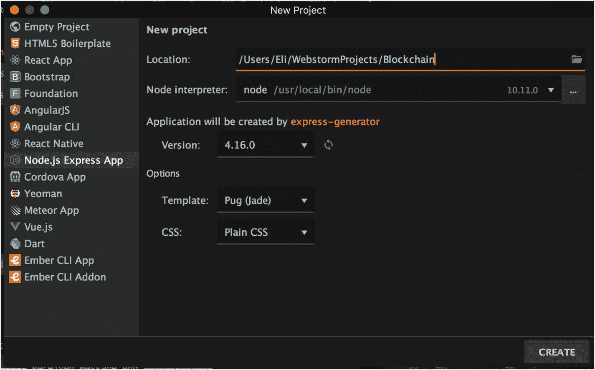

图 3-1 `WebStorm`，新建项目向导

**创建 P2P 网络**

创建一个文件夹并将其命名为 **Blockchain**。然后创建一个文件并将其命名为 `p2p.js`，并编写以下代码。或者，你也可以直接从 GitHub 克隆代码。

```javascript
https://github.com/Apress/the-blockchain-developer/blob/master/chapter2/step1/p2p.js
> git clone https://github.com/Apress/the-blockchain-developer
```

**提示** 你可以从 GitHub 克隆本书中的所有代码清单。使用以下终端命令：`> git clone` `https://github.com/Apress/the-blockchain-developer/chapter3/step1/`

```javascript
const crypto = require('crypto'),
Swarm = require('discovery-swarm'),
defaults = require('dat-swarm-defaults'),
getPort = require('get-port');
const peers = {};
let connSeq = 0;
let channel = 'myBlockchain';
const myPeerId = crypto.randomBytes(32);
console.log('myPeerId: ' + myPeerId.toString('hex'));
const config = defaults({
id: myPeerId,
});
const swarm = Swarm(config);
(async () => {
const port = await getPort();
swarm.listen(port);
console.log('Listening port: ' + port);
swarm.join(channel);
swarm.on('connection', (conn, info) => {
const seq = connSeq;
const peerId = info.id.toString('hex');
console.log(`Connected #${seq} to peer: ${peerId}`);
if (info.initiator) {
try {
conn.setKeepAlive(true, 600);
} catch (exception) {
console.log('exception', exception);
}
}
conn.on('data', data => {
let message = JSON.parse(data);
console.log('----------- Received Message start -------------');
console.log(
'from: ' + peerId.toString('hex'),
'to: ' + peerId.toString(message.to),
'my: ' + myPeerId.toString('hex'),
'type: ' + JSON.stringify(message.type)
);
console.log('----------- Received Message end -------------');
});
conn.on('close', () => {
console.log(`Connection ${seq} closed, peerId: ${peerId}`);
if (peers[peerId].seq === seq) {
delete peers[peerId]
}
});
if (!peers[peerId]) {
peers[peerId] = {}
}
peers[peerId].conn = conn;
peers[peerId].seq = seq;
connSeq++
})
})();
setTimeout(function(){
writeMessageToPeers('hello', null);
}, 10000);
writeMessageToPeers = (type, data) => {
for (let id in peers) {
console.log('-------- writeMessageToPeers start -------- ');
console.log('type: ' + type + ', to: ' + id);
console.log('-------- writeMessageToPeers end ----------- ');
sendMessage(id, type, data);
}
};
writeMessageToPeerToId = (toId, type, data) => {
for (let id in peers) {
if (id === toId) {
console.log('-------- writeMessageToPeerToId start -------- ');
console.log('type: ' + type + ', to: ' + toId);
console.log('-------- writeMessageToPeerToId end ----------- ');
sendMessage(id, type, data);
}
}
};
sendMessage = (id, type, data) => {
peers[id].conn.write(JSON.stringify(
{
to: id,
from: myPeerId,
type: type,
data: data
}
));
};
```

清单 3-1 展示用于发送和接收消息的 `Node.js` P2P 网络初始代码

要运行此示例，您需要运行此代码的两个实例。您可以在两台不同的机器上运行（如同真实场景），也可以在终端中从同一台机器运行两个实例。

您的代码需要查找并连接对等节点，部署用于发现其他对等节点的服务器，并获取可用的 TCP 端口。这通过使用以下三个库来实现：

- `discovery-swarm`：用于创建一个网络集群，该集群使用 `discovery-channel` 查找并连接对等节点。
- `dat-swarm-defaults`：部署用于发现其他对等节点的服务器。
- `get-port`：获取可用的 TCP 端口。

要安装这些库，请运行以下命令：

```bash
npm install crypto discovery-swarm dat-swarm-defaults get-port --save
```

现在已安装好库，请打开两个终端实例，并导航到库的所在位置。运行以下命令：

```bash
node p2p.js
```

要从 GitHub 上克隆的库运行代码，请导航到代码目录，遵循以下终端命令安装库，并运行一个附加了 `p2p.js` 代码的 `Node.js` 实例：

```bash
cd [location]/chapter2/step2
npm install
node p2p.js
```

图 3-2 显示了运行 `Node.js` 代码的输出。

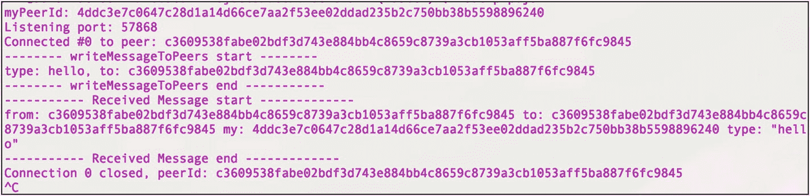

图 3-2 在终端中运行两个对等节点的 P2P 网络

如图 3-2 所示，网络为您的主机生成了一个随机对等节点 ID，并使用您安装的发现库选取了一个随机端口。然后，代码能够发现网络上的其他对等节点，并与这些对等节点发送和接收消息。您现在已通过 P2P 网络与其他用户连接。

让我们浏览代码以更好地理解其工作原理。代码的第一行是为您在代码中使用的开源库导入的 `import` 语句。

# P2P 网络基础设置与消息处理

## 初始化依赖与配置

首先，导入必要的模块：

```javascript
const crypto = require('crypto'),
Swarm = require('discovery-swarm'),
defaults = require('dat-swarm-defaults'),
getPort = require('get-port');
```

请注意，您使用 `const` 而不是 `let` 来设置变量。您希望确保没有重新绑定，并且始终引用同一个对象，因此根据最佳实践，建议选择 `const`。

接下来，设置变量以保存包含对等节点和连接序列的对象，并选择一个所有节点都将连接到的频道名称。还使用 `crypto` 库为您的对等节点设置一个随机生成的对等节点 ID。

```javascript
const peers = {};
let connSeq = 0;
let channel = 'myBlockchain';
const myPeerId = crypto.randomBytes(32);
console.log('myPeerId: ' + myPeerId.toString('hex'));
```

接下来，生成一个包含您的对等节点 ID 的配置对象。然后使用该配置对象初始化 `swarm` 库。`swarm` 库可以在以下位置找到：[`https://github.com/mafintosh/discovery-swarm`](https://github.com/mafintosh/discovery-swarm) 。它的作用是创建一个网络集群，该集群使用 `discovery-channel` 库在 UDP/TCP 网络上查找并连接对等节点。

```javascript
const config = defaults({
id: myPeerId,
});
const swarm = Swarm(config);
```

## 监听连接与消息

现在所有设置已准备就绪，您将创建一个 Node.js 异步函数来持续监视 `swarm.on` 事件消息。

```javascript
(async () => {
```

您监听所选随机端口，一旦与对等节点建立连接，便使用 `setKeepAlive` 确保网络连接与其他对等节点保持。

```javascript
const port = await getPort();
swarm.listen(port);
console.log('Listening port: ' + port);
swarm.join(channel);
swarm.on('connection', (conn, info) => {
const seq = connSeq;
const peerId = info.id.toString('hex');
console.log(`Connected #${seq} to peer: ${peerId}`);
if (info.initiator) {
try {
conn.setKeepAlive(true, 600);
} catch (exception) {
console.log('exception', exception);
}
}
```

一旦在 P2P 网络上收到 `data` 消息，您就使用 `JSON.parse`（这是一个 Node.js 原生命令，因此无需包含任何 `import` 语句）解析数据。此命令将您的消息解码回对象，而 `toString` 命令将字节转换为可读的字符串数据类型。

```javascript
conn.on('data', data => {
let message = JSON.parse(data);
console.log('----------- Received Message start -------------');
console.log(
'from: ' + peerId.toString('hex'),
'to: ' + peerId.toString(message.to),
'my: ' + myPeerId.toString('hex'),
'type: ' + JSON.stringify(message.type)
);
console.log('----------- Received Message end -------------');
});
```

您还监听 `close` 事件，该事件将指示您与对等节点失去了连接，因此您可以采取操作，例如从 `peers` 列表对象中删除该对等节点。

```javascript
conn.on('close', () => {
console.log(`Connection ${seq} closed, peerId: ${peerId}`);
if (peers[peerId].seq === seq) {
delete peers[peerId]
}
});
if (!peers[peerId]) {
peers[peerId] = {}
}
peers[peerId].conn = conn;
peers[peerId].seq = seq;
connSeq++
})();
```

## 发送消息

在这里，您将使用 `setTimeout` Node.js 原生函数在十秒后向任何可用的对等节点发送消息。您将发送的第一条消息只是一个“hello”消息。您创建了名为 `writeMessageToPeers` 和 `writeMessageToPeerToId` 的方法来处理您的对象，以便使用要传输的数据和发送目标进行格式化。

```javascript
setTimeout(function(){
writeMessageToPeers('hello', null);
}, 10000);
```

`writeMessageToPeers` 方法将向所有已连接的对等节点发送消息。

```javascript
writeMessageToPeers = (type, data) => {
for (let id in peers) {
console.log('-------- writeMessageToPeers start -------- ');
console.log('type: ' + type + ', to: ' + id);
console.log('-------- writeMessageToPeers end ----------- ');
sendMessage(id, type, data);
}
};
```

此外，您还将创建另一个方法 `writeMessageToPeerToId`，它将向特定的对等节点 ID 发送消息，以防您只想与一个特定的对等节点通信。

```javascript
writeMessageToPeerToId = (toId, type, data) => {
for (let id in peers) {
if (id === toId) {
console.log('-------- writeMessageToPeerToId start -------- ');
console.log('type: ' + type + ', to: ' + toId);
console.log('-------- writeMessageToPeerToId end ----------- ');
sendMessage(id, type, data);
}
}
};
```

最后，`sendMessage` 是一个通用方法，您将使用它发送根据要传递的参数格式化的消息，其中包括以下内容：

-   **`to/from`**：您发送和接收消息的对等节点 ID。
-   **`type`**：消息类型。
-   **`data`**：您希望在 P2P 网络上共享的任何数据。

在您共享区块链区块时，这些参数将非常有用。请注意，您传递的消息需要是字符串，不能是对象，因此您正在使用 `JSON.stringify` 原生函数在 P2P 网络上共享消息之前对消息进行编码。

```javascript
sendMessage = (id, type, data) => {
peers[id].conn.write(JSON.stringify(
{
to: id,
from: myPeerId,
type: type,
data: data
}
));
};
```

在本练习中，您下载并安装了 WebStorm IDE，并创建了项目，其中包含一个基本的 P2P 网络。您成功保持了与 TCP 网络随机端口的连接，并能够发送和接收消息，包括对这些消息进行编码和解码。您已准备好进入下一个练习，在网络上的每个节点之间发送实际的区块。

## 创建创世区块与共享区块

在接下来的练习中，你将创建可在节点间共享的区块对象。但在开始之前，让我们先仔细看看 `Block` 对象。并非所有区块链的 `Block` 对象都相同。不同的区块链使用不同类型的 `Block` 对象；你将使用的 `Block` 对象类似于比特币，我在第 2 章中已详细说明。为了更好地理解其架构，请查看图 3-3 中你将在下一个练习中使用的 `Block` 和 `BlockHeader` 对象的统一建模语言（UML）图示。

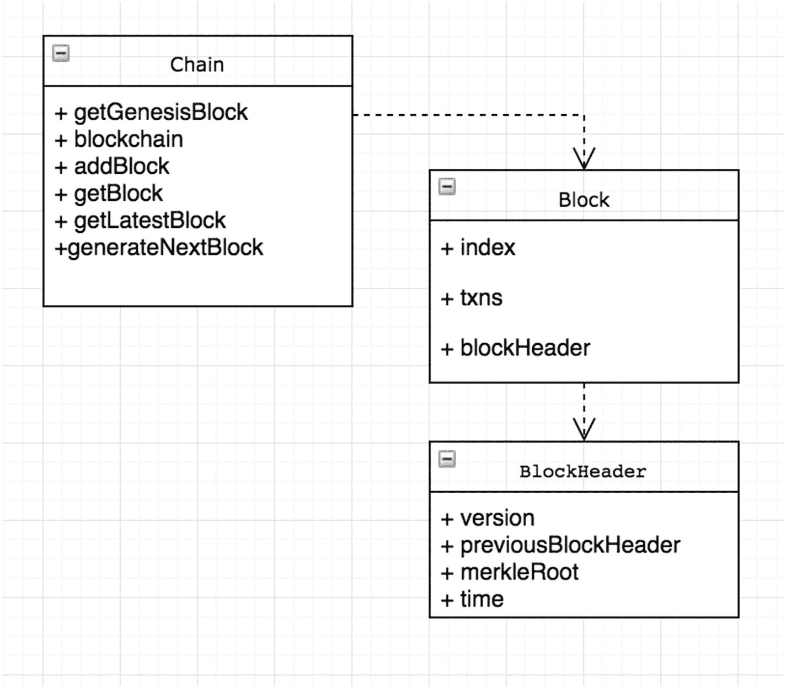

**图 3-3** — `Block` 和 `BlockHeader` UML 图示

回顾第 2 章，`Block` 对象包含以下属性：

- **`index`**：`GenesisBlock` 是我们的第一个区块，我们将区块索引赋值为 0。
- **`txns`**：这是区块中的原始交易数据。本章我不想只聚焦于加密货币，因此请将其视为你想存储的任何类型的数据。

`Block` 对象中包含 `BlockHeader` 对象，该对象包含以下属性：

- **`Version`**：截至撰写本文时，共有四个区块版本。版本 1 是创世区块（2009 年），版本 2 是比特币核心 0.7.0（2012 年）的软分叉。版本 3 区块是比特币核心 0.10.0（2015 年）的软分叉。版本 4 区块是比特币核心 0.11.2（2015 年）的 BIP65。
- **`Previous block header hash`**：这是前一个区块头的 SHA-256（安全哈希算法）哈希函数值。它确保前一个区块无法被更改，因为本区块也需要随之更改。
- **`Merkle root hash`**：默克尔树是一种二叉树，包含树中所有哈希值对。
- **`Time`**：这是矿工开始对区块头进行哈希计算时的 Unix 纪元时间。

如你所记，比特币还包含一个针对矿工的难度属性，该属性每 2,016 个区块重新计算一次。此处你不需要使用 `nBits` 和 `nounce` 参数，因为你没有进行工作量证明（PoW）。

- **`nounce`**：比特币区块中的区块随机数是 32 位（4 字节）字段，矿工会调整其值，使得区块的哈希值小于或等于网络的当前目标值。
- **`nBits`**：这指的是目标值。目标值是一个 256 位数字，与难度成反比。它每 2,016 个区块重新计算一次。

## P2P 通信流程

在 P2P 通信方面，区块在对等网络中的每个节点之间的流转包括：从网络中的某个节点请求最新的区块，然后接收区块请求。图 3-4 展示了该流程图。

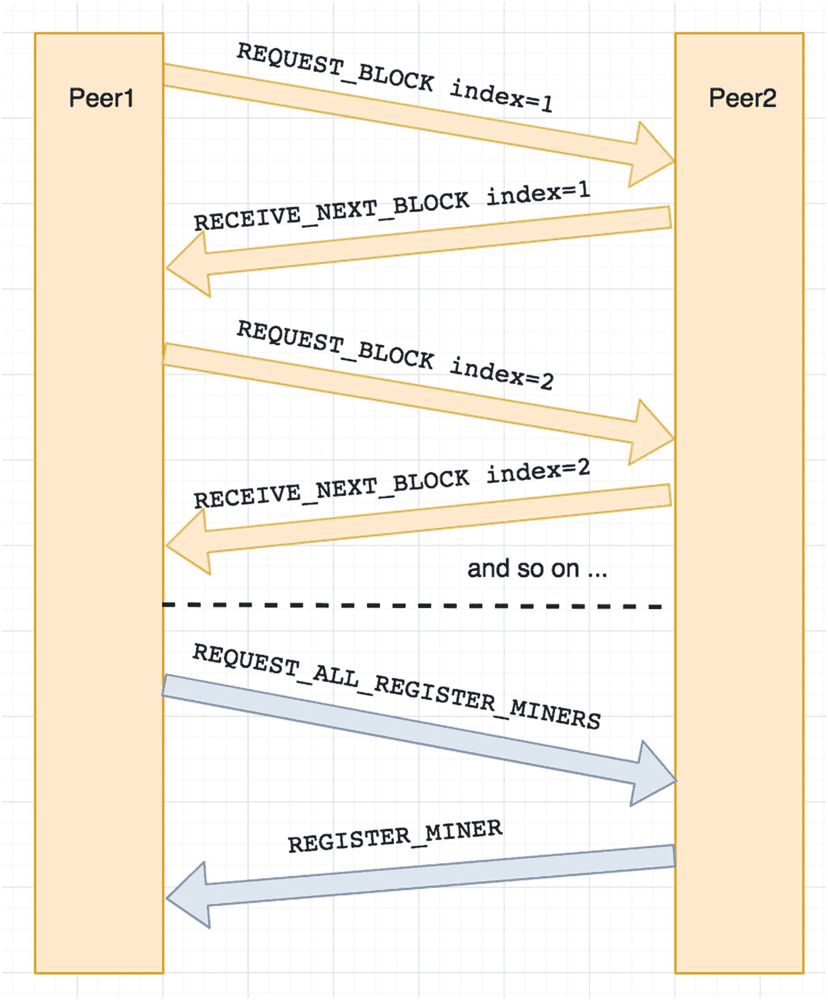

**图 3-4** — 请求最新区块与接收最新区块的 P2P 通信流程图

现在你已经理解了架构和区块在 P2P 网络中的流转方式，在接下来的练习中，你将发送和请求区块。

### 步骤 2：P2P 网络发送区块练习

#### 设置区块类和链库

在本练习中，你将创建自己的区块链。该区块链包含两个文件：`block.js` 和 `chain.js`。文件 `block.js` 将包含区块类对象，而 `chain.js` 则作为粘合剂，包含处理与区块交互的方法。至于 `Block` 对象，你将创建与比特币核心所持有的属性类似的属性。请看清单 3-2，`block.js` 文件包含了 `Block` 和 `BlockHeader` 对象。

**清单 3-2.** `block.js`

```javascript
exports.BlockHeader = class BlockHeader {
    constructor(version, previousBlockHeader, merkleRoot, time) {
        this.version = version;
        this.previousBlockHeader = previousBlockHeader;
        this.merkleRoot = merkleRoot;
        this.time = time;
    }
};
exports.Block = class Block {
    constructor(blockHeader, index, txns) {
        this.blockHeader = blockHeader;
        this.index = index;
        this.txns = txns;
    }
}
```

如你所见，`chain.js` 包含了第一个区块（称为 *创世* 区块），以及接收整个区块链对象、添加区块和检索区块的方法。请注意，你将在 `chain.js` 库中添加一个名为 `moment` 的库，用于以 Unix 时间格式保存时间。为此，请使用 `npm` 安装 `moment`。

```
> npm install moment --save
```

现在你已经创建了 `block.js` 文件，可以创建 `chain.js` 类；请参见清单 3-3。

**清单 3-3.** `chain.js`

```javascript
let Block = require("./block.js").Block,
    BlockHeader = require("./block.js").BlockHeader,
    moment = require("moment");

let getGenesisBlock = () => {
    let blockHeader = new BlockHeader(1, null, "0x1bc3300000000000000000000000000000000000000000000", moment().unix());
    return new Block(blockHeader, 0, null);
};

let getLatestBlock = () => blockchain[blockchain.length-1];

let addBlock = (newBlock) => {
    let prevBlock = getLatestBlock();
    if (prevBlock.index < newBlock.index -1) {
        // 验证并添加新区块的逻辑
    }
};

let getBlock = (index) => {
    if (blockchain.length-1 >= index)
        return blockchain[index];
    else
        return null;
};

const blockchain = [getGenesisBlock()];

if (typeof exports != 'undefined') {
    exports.addBlock = addBlock;
    exports.getBlock = getBlock;
    exports.blockchain = blockchain;
    exports.getLatestBlock = getLatestBlock;
}
```

你现在拥有了一个包含在 `chain.js` 中的区块对象。你的库可以创建创世区块，并将区块添加到区块链对象中。你还将能够发送和请求区块。

接下来，在你的 P2P 网络类中，你可以使用刚创建的 `chain.js` 文件。首先，你需要导入 `chain.js` 类。

```javascript
const chain = require("./chain");
```

然后，你可以定义一个消息类型来请求和接收最新区块。当你在 P2P 网络中发送消息时，你需要能够识别消息的目的。通过使用 `MessageType` 属性，你可以定义一个切换机制，以便不同的消息类型用于不同的功能。

```javascript
let MessageType = {
    REQUEST_LATEST_BLOCK: 'requestLatestBlock',
    LATEST_BLOCK: 'latestBlock'
};
```

一旦接收到连接数据事件消息，你可以创建切换代码来处理不同类型的请求，如清单 3-4 所示。

**清单 3-4** 消息交换机处理器

```javascript
switch (message.type) {
    case MessageType.REQUEST_BLOCK:
        console.log('-----------REQUEST_BLOCK-------------');
        let requestedIndex = (JSON.parse(JSON.stringify(message.data))).index;
        let requestedBlock = chain.getBlock(requestedIndex);
        if (requestedBlock)
            writeMessageToPeerToId(peerId.toString('hex'), MessageType.RECEIVE_NEXT_BLOCK, requestedBlock);
        else
            console.log('No block found @ index: ' + requestedIndex);
        console.log('-----------REQUEST_BLOCK-------------');
        break;
    case MessageType.RECEIVE_NEXT_BLOCK:
        console.log('-----------RECEIVE_NEXT_BLOCK-------------');
        chain.addBlock(JSON.parse(JSON.stringify(message.data)));
        console.log(JSON.stringify(chain.blockchain));
        let nextBlockIndex = chain.getLatestBlock().index+1;
        console.log('-- request next block @ index: ' + nextBlockIndex);
        writeMessageToPeers(MessageType.REQUEST_BLOCK, {index: nextBlockIndex});
        console.log('-----------RECEIVE_NEXT_BLOCK-------------');
        break;
}
```

最后，你需要设置一个超时请求，该请求将每 5000 毫秒（5 秒）发送一次请求以获取最新的区块。

```javascript
setTimeout(function(){
    writeMessageToPeers(MessageType.REQUEST_BLOCK, {index: chain.getLatestBlock().index+1});
}, 5000);
```

你可以从这里下载完整的练习代码：[`https://github.com/Apress/the-blockchain-developer/tree/master/chapter3/step2/`](https://github.com/Apress/the-blockchain-developer/tree/master/chapter3/step2/)。

在本练习中，你成功生成了创世区块，并创建了通过发送消息请求来请求和接收区块的机制。请求和接收区块的能力使你可以同步新加入 P2P 网络的节点。在创建创世区块后，你还需要同步任何额外生成的区块。

#### 注册矿工并创建新区块

到目前为止，你已经拥有一个基础的 P2P 网络，能够连接网络中的节点、创建创世区块以及发送和接收区块。下一步是能够生成新区块。正如你在第 2 章所见，工作量证明（PoW）基于创建一个数学难题，并奖励最先找到解决方案的矿工。但是，在本示例中，你将采用权益证明（PoS）的方法，即信任每个矿工来生成区块。每个节点将注册为矿工，并轮流挖矿。图 3-5 概述了每个矿工生成区块的过程。

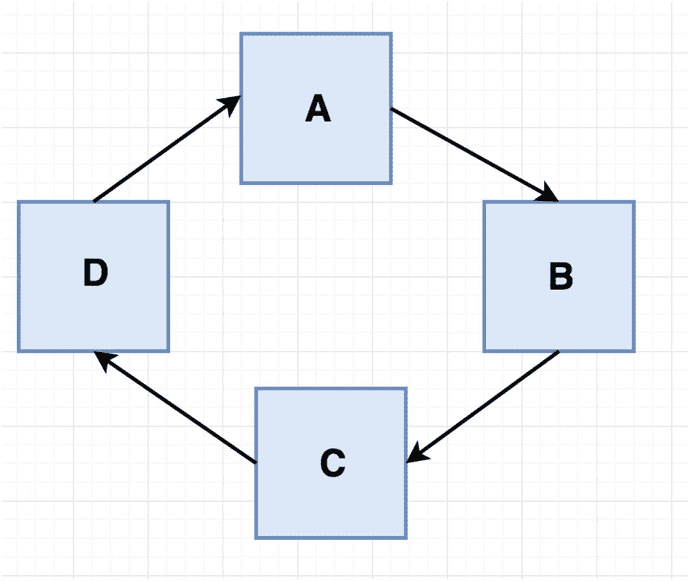

**图 3-5** – 你的区块链使用简单的 PoS 机制处理挖矿

最后，在开始下一个练习之前，请重新查看图 3-4 以更好地理解流程。该流程展示了你的 P2P 网络如何处理节点间请求最新区块和接收最新区块的通信。在下一个练习中，你将把节点注册为矿工并创建新区块。

### 步骤 3：注册矿工并创建新区块练习

**注册矿工**

在本练习中，你将注册矿工并创建新区块。你可以从这里下载完整的练习代码：[`https://github.com/Apress/the-blockchain-developer/tree/master/chapter3/step3`](https://github.com/Apress/the-blockchain-developer/tree/master/chapter3/step3)。

为了自动化每隔 x 分钟生成一个区块的过程，你可以使用一个名为 `cron` 的 `Node.js` 库，它类似于 `Linux` 中用于自动化任务的库。

要安装开源的 `cron` 库，请运行以下命令：

```
> npm install cron --save
```

接下来，在你的 `p2p.js` 文件中，你将创建两个变量来跟踪已注册的矿工以及谁挖出了上一个区块，这样你就可以将下一个区块分配给下一个矿工。

```
let registeredMiners = [];
let lastBlockMinedBy = null;
```

你还将添加两种消息类型：
- `REQUEST_ALL_REGISTER_MINERS`
- `REGISTER_MINER`

```
let MessageType = {
  REQUEST_BLOCK: 'requestBlock',
  RECEIVE_NEXT_BLOCK: 'receiveNextBlock',
  RECEIVE_NEW_BLOCK: 'receiveNewBlock',
  REQUEST_ALL_REGISTER_MINERS: 'requestAllRegisterMiners',
  REGISTER_MINER: 'registerMiner'
};
```

在将你的节点注册为矿工之前，你将请求接收网络中所有已注册的矿工，然后你的节点会作为矿工被添加到 `registeredMiners` 对象中。你通过运行一个定时器，每五秒钟更新一次矿工列表来实现这一点。

```
setTimeout(function(){
  writeMessageToPeers(MessageType.REQUEST_ALL_REGISTER_MINERS, null);
}, 5000);
```

现在，你有了一个自动化的超时命令，可以指向一个处理器来更新已注册矿工列表，你也可以自动化一个命令来将你的节点注册为矿工：

```
setTimeout(function(){
  registeredMiners.push(myPeerId.toString('hex'));
  console.log('----------注册我的矿工--------------');
  console.log(registeredMiners);
  writeMessageToPeers(MessageType.REGISTER_MINER, registeredMiners);
  console.log('---------- 注册我的矿工--------------');
}, 7000);
```

在你的 `switch` 命令中，你需要修改代码，以便能够为关于矿工注册的传入消息设置处理器。你需要跟踪已注册的矿工，并在新区块被挖出时处理消息。请参见清单 3-5 中的矿工处理器。

```
case MessageType.REQUEST_ALL_REGISTER_MINERS:
  console.log('-----------REQUEST_ALL_REGISTER_MINERS------------- ' + message.to);
  writeMessageToPeers(MessageType.REGISTER_MINER, registeredMiners);
  registeredMiners = JSON.parse(JSON.stringify(message.data));
  console.log('-----------REQUEST_ALL_REGISTER_MINERS------------- ' + message.to);
  break;
case MessageType.REGISTER_MINER:
  console.log('-----------REGISTER_MINER------------- ' + message.to);
  let miners = JSON.stringify(message.data);
  registeredMiners = JSON.parse(miners);
  console.log(registeredMiners);
  console.log('-----------REGISTER_MINER------------- ' + message.to);
  break;
```

清单 3-5
矿工处理器

**注销矿工**

你还需要在矿工连接关闭或丢失时注销该矿工。

```
console.log(`连接 ${seq} 已关闭, peerId: ${peerId}`);
if (peers[peerId].seq === seq) {
  delete peers[peerId];
  console.log('--- 注销前的 registeredMiners: ' + JSON.stringify(registeredMiners));
  let index = registeredMiners.indexOf(peerId);
  if (index > -1)
    registeredMiners.splice(index, 1);
  console.log('--- 注销后的 registeredMiners: ' + JSON.stringify(registeredMiners));
}
});
```

**挖出一个新区块**

与 `Bitcoin` 每 10 分钟生成一个区块不同，你的区块链将进行改进，每 30 秒生成一个区块。为了实现这一点，你已经安装了用于 `Node.js` 的开源 `cron` 库。`cron` 库的工作原理与 `Linux` 的 `cron` 相同。你可以利用 `cron` 库来设置每隔多久再次调用同一段代码，这里将用于每 30 秒调用你的矿工。

首先，在代码的 `import` 语句中包含该库，位于 `p2p.js` 文件的顶部。

```javascript
let CronJob = require('cron').CronJob;
```

接下来，你可以设置 `cronjob` 每隔 30 秒运行一次，`job.start();` 将启动该任务，如清单 3-6 所示。

清单 3-6. 用于挖矿新区块的 CronJob

```javascript
const job = new CronJob('30 ∗ ∗ ∗ ∗ ∗', function() {
  let index = 0; // 第一个区块
  if (lastBlockMinedBy) {
    let newIndex = registeredMiners.indexOf(lastBlockMinedBy);
    index = ( newIndex+1 > registeredMiners.length-1) ? 0 : newIndex + 1;
  }
  lastBlockMinedBy = registeredMiners[index];
  console.log('-- REQUESTING NEW BLOCK FROM: ' + registeredMiners[index] + ', index: ' + index);
  console.log(JSON.stringify(registeredMiners));
  if (registeredMiners[index] === myPeerId.toString('hex')) {
    console.log('-----------create next block -----------------');
    let newBlock = chain.generateNextBlock(null);
    chain.addBlock(newBlock);
    console.log(JSON.stringify(newBlock));
    writeMessageToPeers(MessageType.RECEIVE_NEW_BLOCK, newBlock);
    console.log(JSON.stringify(chain.blockchain));
    console.log('-----------create next block -----------------');
  }
});
job.start();
```

回顾一下代码，第一个区块的索引为 0，因此在第一个区块被挖掘后，`lastBlockMinedBy` 将被设置，接着你将向下一个矿工请求新区块。

```javascript
let newIndex = registeredMiners.indexOf(lastBlockMinedBy);
index = ( newIndex+1 > registeredMiners.length-1) ? 0 : newIndex + 1;
```

要生成并添加新区块，你将调用 `chain.generateNextBlock()` 和 `chain.addBlock()`。最后，你将把新区块广播给所有连接的节点。

```javascript
let newBlock = chain.generateNextBlock(null);
chain.addBlock(newBlock);
writeMessageToPeers(MessageType.RECEIVE_NEW_BLOCK, newBlock);
```

在你的代码中，`switch` 语句将处理新传入的区块。

```javascript
case MessageType.RECEIVE_NEW_BLOCK:
  if ( message.to === myPeerId.toString('hex') && message.from !== myPeerId.toString('hex')) {
    console.log('-----------RECEIVE_NEW_BLOCK------------- ' + message.to);
    chain.addBlock(JSON.parse(JSON.stringify(message.data)));
    console.log(JSON.stringify(chain.blockchain));
    console.log('-----------RECEIVE_NEW_BLOCK------------- ' + message.to);
  }
  break;
```

要查看此代码的运行效果，请运行三个你的代码实例。

```
> node p2p.js
```

你可以看到每个节点注册为矿工的消息，以及你的代码开始按顺序每 30 秒挖掘区块的过程，如图 3-6 所示。

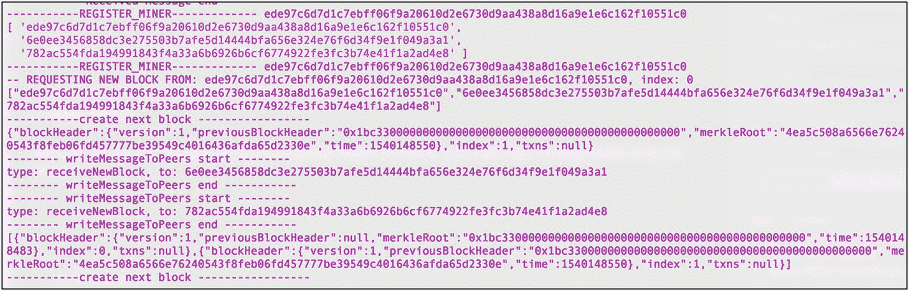

图 3-6

代码注册矿工并生成新区块

在这个练习中，你成功地将节点注册为矿工，生成了新区块，并与其它节点共享了区块。你使用了一个简单的权益证明（`PoS`）作为共识机制，并通过创建三个节点来测试功能。该共识机制较为简单，并未考虑所有可能出现的用例或安全性问题。下一步，你将把区块保存到 `LevelDB` 数据库中。

### 在 `LevelDB` 中存储区块

如果你让区块链运行数小时，你会发现创建的区块数量不断增加，这可能会成为一个问题，因为目前这些区块存储在计算机的内存缓存中。随着区块数量的增加，内存使用量也会增长，最终会导致代码崩溃。此外，如果不将区块存入数据库，你将无法启动和停止你的 `P2P` 网络，因为区块并没有被保存。

为了应对这些及其它用例，你将使用 `LevelDB` 数据库。

注意

`LevelDB` 数据库以一种称为“层级上升”和“层级下降”的方式存储键值对。对于区块链网络来说，这是一个理想的选择。事实上，`Bitcoin` 不仅使用 `LevelDB` 来存储区块信息，还用它来存储交易信息。参见 [`https://github.com/bitcoin-core/leveldb`](https://github.com/bitcoin-core/leveldb)。

### 第四步：使用 `LevelDB` 存储区块链的练习

**LevelDB**

在本练习中，你将实现一个用于存储区块的数据库。你可以从这里下载完整的练习代码：[`https://github.com/Apress/the-blockchain-developer/tree/master/chapter3/step4/blockchain`](https://github.com/Apress/the-blockchain-developer/tree/master/chapter3/step4/blockchain)。请记得运行 `install` 命令以获取所有 `npm` 模块。

```
> npm install
```

若要从上一步开始独立完成，你需要使用一个 `Node.js` 的 `LevelDB` 封装库，以便通过代码与 `LevelDB` 进行通信。通过 `npm` 安装此库。

```
> npm install level --save
```

接着，创建一个用于保存数据库的目录。

```
> mkdir db
```

现在你可以实现数据库了。在 `chain.js` 库中，你将添加一些代码，将区块保存到 `LevelDB` 数据库中，如清单 3-7 所示。

```
let level = require('level'),
    fs = require('fs');
let db;
let createDb = (peerId) => {
  let dir = __dirname + '/db/' + peerId;
  if (!fs.existsSync(dir)){
    fs.mkdirSync(dir);
    db = level(dir);
    storeBlock(getGenesisBlock());
  }
}
```

如你所见，你使用了 `Node.js` 的原生类 `__dirname` 来获取目录路径，因为你需要完整的路径来保存数据库。

由于你将在同一台机器上运行 `P2P` 网络的多个实例，因此无法为每个节点使用相同的路径，因为数据库需要相互隔离。你可以将每个数据库的位置设置在单独的路径中，并使用文件夹名称作为节点的 `ID`；这样每个数据库就可以存储在 `db` 文件夹中。同时请注意，你保存了第一个区块 `getGenesisBlock()`。

接下来，创建一个 `storeBlock` 方法来存储新区块。

```
let storeBlock = (newBlock) => {
  db.put(newBlock.index, JSON.stringify(newBlock), function (err) {
    if (err) return console.log('哦哦！', err) // 某种 I/O 错误
    console.log('--- 正在插入区块索引：' + newBlock.index);
  })
}
```

当你使用 `generateNextBlock` 方法生成一个新块时，现在可以将其存储到 `LevelDB` 数据库中。

```
storeBlock(newBlock);
```

你还将添加一个方法，以便从 `LevelDB` 数据库中检索区块。

```
let getDbBlock = (index, res) => {
  db.get(index, function (err, value) {
    if (err) return res.send(JSON.stringify(err));
    return(res.send(value));
  });
}
```

请确保将 `createDb` 和 `getDbBlock` 方法暴露出来。

```
if (typeof exports != 'undefined' ) {
  exports.createDb = createDb;
  exports.getDbBlock = getDbBlock;
}
```

最后，在你的 `P2P` 网络代码中，你只需要在启动代码时创建一个数据库即可。

```
chain.createDb(myPeerId.toString('hex'));
```

要查看代码的实际运行效果，请运行一个 `P2P` 网络实例。

```
> node p2p.js
```

你可以使用带有 `-f` 标志的 `tail` 命令，监控 `db` 文件夹中的数据库数据。终端将保持打开状态，并能在新区块生成时显示它们（参见图 3-7 中的输出）。

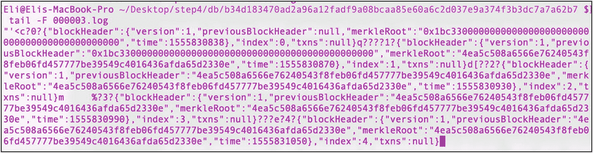

图 3-7：使用 `tail` 命令查看 `LevelDB` 数据库，显示正在生成的新区块

```
> cd step4/db/[我们的节点 ID]
> tail –f 000003.log
```

在本练习中，你创建了一个 `LevelDB` 数据库。你正在存储区块，这样你就可以检索它们，而不必依赖缓存。我在这里将事情简化了；如果这是一个真正的区块链应用，你需要实现以下步骤：
1.  减轻所有可能的安全风险。
2.  从 `LevelDB` 数据库中存储和检索区块。
3.  创建一个方法用于恢复 `LevelDB` 中的条目。
4.  清理旧数据库，因为每次初始化时都会创建新的数据库。

## 创建区块链钱包

在加密货币中，钱包是必需的，以便奖励生成区块的矿工，以及创建和发送交易。在本节中，你将创建一个钱包。你需要创建一对公钥和私钥，这不仅仅是为了验证用户身份，更是为了能够存储和检索用户拥有的数据。你将创建一个带有公钥和私钥的钱包。

在比特币中，钱包的原始软件是你在第二章下载的比特币核心协议；它需要自 2009 年以来所有交易的完整账本，在撰写本文时已超过 150 GB。因此，大多数使用的钱包都是“轻量级”钱包，或称为`简化支付验证`（SPV）钱包，它们与比特币核心同步。在区块链领域，有许多不同类型的钱包可用，从在线钱包到纸质钱包（将私钥写在纸上）。

在继续之前，让我们先快速了解一下如何与比特币钱包进行通信。回想一下，在第二章中，你能够获取某个比特币钱包的余额。为了更好地理解钱包，你可以使用比特币核心创建一个比特币钱包。

首先，你需要运行比特币守护进程。

```
> bitcoind –printtoconsole
```

接着，你可以请求一个地址。

```
> bitcoin-cli help getnewaddress
```

然后，你可以将私钥导出到一个文本文件中。

```
> bitcoin-cli dumpwallet ~/mywallet.txt
```

你可以找到私钥的位置并查看该密钥。

```
> vim /Users/[位置]/mywallet.txt
```

作为参考，请在此处查看 C++ 比特币核心钱包代码：

```
> vim /[比特币核心位置]/bitcoin/src/wallet/init.cpp
```

### 第 5 步：钱包练习

**创建一个区块链钱包**

在本练习中，你将生成用于钱包的公私钥对。你可以从 [`https://github.com/Apress/the-blockchain-developer/tree/master/chapter3/step5/blockchain`](https://github.com/Apress/the-blockchain-developer/tree/master/chapter3/step5/blockchain) 下载完整的练习文件，并运行 `npm install` 命令。此外，还需要创建一个名为 `wallet` 的文件夹。

```
> npm install
> mkdir wallet
```

你将使用 `elliptic-curve` 密码学库实现来生成公私钥对。请注意，`elliptic-curve` 库使用 `secp256k1` 作为 ECDSA 曲线算法。

**注意** *椭圆曲线密码学*（ECC）是比特币使用的公钥加密技术。它基于椭圆曲线理论来生成加密密钥。`Secp256k1` 是椭圆曲线图 ECDSA 算法。

要安装该库，请运行以下命令：

```
> npm install elliptic --save
```

接下来，添加一个文件并将其命名为 `wallet.js`。请查看清单 3-8 中的完整代码。

*清单 3-8. wallet.js*

```
let EC = require('elliptic').ec,
fs = require('fs');
const ec = new EC('secp256k1'),
privateKeyLocation = __dirname + '/wallet/private_key';
exports.initWallet = () => {
let privateKey;
if (fs.existsSync(privateKeyLocation)) {
const buffer = fs.readFileSync(privateKeyLocation, 'utf8');
privateKey = buffer.toString();
} else {
privateKey = generatePrivateKey();
fs.writeFileSync(privateKeyLocation, privateKey);
}
const key = ec.keyFromPrivate(privateKey, 'hex');
const publicKey = key.getPublic().encode('hex');
return({'privateKeyLocation': privateKeyLocation, 'publicKey': publicKey});
};
const generatePrivateKey = () => {
const keyPair = ec.genKeyPair();
const privateKey = keyPair.getPrivate();
return privateKey.toString(16);
};
```

在钱包文件中，你创建并初始化了 EC 上下文。

```
const ec = new EC('secp256k1'),
```

然后，你存储了钱包私钥 `privateKeyLocation` 的位置。

```
privateKeyLocation = __dirname + '/wallet/private_key';
```

接下来，你可以创建一个方法 `exports.initWallet` 来生成实际的公私钥 `generatePrivateKey`。

```
const keyPair = ec.genKeyPair();
const privateKey = keyPair.getPrivate();
```

请注意，只有当钱包不存在时，你才会生成一个新的钱包。

```
if (fs.existsSync(privateKeyLocation))
```

在本练习中，你创建了一个 `wallet.js` 文件，并利用椭圆曲线密码学库来生成你的公私钥对。

要查看代码运行效果，请将以下代码临时添加到 `wallet.js` 文件的末尾。该脚本将创建公钥和私钥。

```
let wallet = this;
let retVal = wallet.initWallet();
console.log(JSON.stringify(retVal));
```

接下来，创建一个 `wallet` 目录来存储私钥，并运行脚本。代码将初始化脚本并创建你的公钥。

```
> mkdir wallet
> node wallet.js
> cat wallet/private_key
```

当你运行 `node wallet.js` 命令时，就可以看到公钥。输出结果如图 3-8 所示。

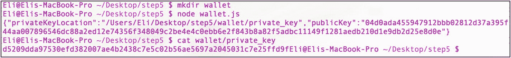

图 3-8

生成钱包的公私钥

请记得注释掉这些行，因为在下一个练习中，你将创建一个 API，以便能够通过浏览器创建你的密钥。

## 创建一个 API

下一步是创建一个应用程序接口（API），以便能够访问你编写的代码。这是区块链的重要组成部分，因为你希望使用 HTTP 服务来访问你的区块、钱包或任何其他 P2P 网络操作。在本节中，你将使用 `express` 库，因为它易于运行，并且你可以轻松创建自己的 API。

### 第 6 步：API P2P 区块链练习

**创建 API**

在本练习中，你将创建一个 API 来与你的 P2P 区块链网络进行交互。你可以从这里下载完整的练习文件：[`https://github.com/Apress/the-blockchain-developer/tree/master/chapter3/step6/blockchain`](https://github.com/Apress/the-blockchain-developer/tree/master/chapter3/step6/blockchain)。

你将创建以下服务：

*   `blocks`：检索区块链中的所有区块
*   `getBlock`：按索引检索特定区块
*   `getDBBlock`：从数据库中检索一个区块
*   `getWallet`：通过生成公私钥来创建一个新钱包

你将安装 `express` 和 `body-parser`。这些库将允许你创建服务器并在浏览器中显示页面。

```
> npm install express body-parser --save
```

你还需要导入你之前创建的 `wallet.js` 文件。

```
let express = require("express"),
bodyParser = require('body-parser'),
wallet = require('./wallet');
```

接下来，你创建一个名为 `initHttpServer` 的方法，该方法将启动服务器并创建这些服务。由于你在同一台计算机上使用 P2P 网络的不同实例并运行实例，因此你需要使用不同的端口号。通常使用端口 80 或 8081 用于 HTTP 服务，但这不是必须的。你将传递所使用的随机端口号，并利用 `slice` 方法获取端口号的最后两位数字。

```
let initHttpServer = (port) => {
let http_port = '80' + port.toString().slice(-2);
let app = express();
app.use(bodyParser.json());
```

`blocks` 服务将检索你的所有区块。

```
app.get('/blocks', (req, res) => res.send(JSON.stringify( chain.blockchain )));
```

`getBlock` 服务将根据索引检索一个区块。

```
app.get('/getBlock', (req, res) => {
let blockIndex = req.query.index;
res.send(chain.blockchain[blockIndex]);
});
```

`getDBBlock` 服务将根据索引检索一条 LevelDB 数据库记录。

```
app.get('/getDBBlock', (req, res) => {
let blockIndex = req.query.index;
chain.getDbBlock(blockIndex, res);
});
```

`getWallet` 服务将利用你在上一步中创建的 `wallet.js` 文件，并生成你的公私钥对。

```
app.get('/getWallet', (req, res) => {
res.send(wallet.initWallet());
});
```

最后，你将使用 `Express listen` 方法。

```
app.listen(http_port, () => console.log('Listening http on port: ' + http_port));
};
```

你将在启动 P2P 网络并选定随机端口后，调用你创建的 `initHttpServer` 方法。

```
(async () => {
const port = await getPort();
initHttpServer(port);
}
```

要调用你的服务，请运行 P2P 网络，然后打开浏览器并调用 API。

```
http://localhost:80[port]/getWallet
http://localhost:80[port]/blocks
http://localhost:80[port]/getBlock?index=0
http://localhost:80[port]/ getDBBlock?index=0
```

例如，当你在区块链中检索所有区块时，结果如图 3-9 所示。

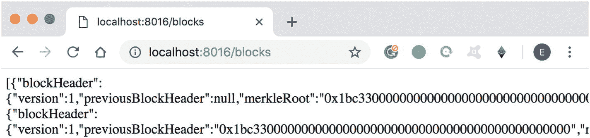

图 3-9

检索区块链中的所有区块

在本练习中，你创建了 API 服务，现在你可以与你的 P2P 网络进行交互。你创建的服务使你能够在同一台机器上创建多个 P2P 网络实例；然而，在现实中，每台机器只会持有一个对等节点。在下一个练习中，你将创建一个命令行界面（CLI）来轻松调用这些服务。

## 创建命令行界面

在本章的最后一步中，你将创建一个命令行界面（`CLI`）。我们需要通过`CLI`来轻松访问你创建的服务。我不会深入探讨`CLI`脚本的完整内部流程，因为这超出了本章的范围；不过，你可以下载完整示例并进行查阅。

### 第 7 步：CLI 练习

**区块命令**

在本练习中，你将创建一个`CLI`来与你的 P2P 区块链网络进行交互和访问。你可以从以下地址下载完整的练习：[`https://github.com/Apress/the-blockchain-developer/tree/master/chapter3/step7/blockchain`](https://github.com/Apress/the-blockchain-developer/tree/master/chapter3/step7/blockchain)。

接下来，安装你将用于运行 promise、运行`async`函数、为控制台添加颜色以及存储 cookie 的库。

```bash
> npm babel-polyfill async update-notifier handlebars colors nopt --save
```

在`block.js`文件中，你将设置两个命令：`get`和`all`。请查看清单 3-9 中的完整代码。

```javascript
let logger = require('../logger');
function Block(options) {
    this.options = options;
}
Block.DETAILS = {
    alias: 'b',
    description: 'block',
    commands: ['get', 'all'],
    options: {
        create: Boolean
    },
    shorthands: {
        s: ['--get'],
        a: ['--all']
    },
    payload: function(payload, options) {
        options.start = true;
    },
};
Block.prototype.run = function() {
    let instance = this,
        options = instance.options;
    if (options.get) {
        instance.runCmd('curl http://localhost:' + options.argv.original[2] + '/getBlock?index=' + options.argv.original[3]);
    }
    if (options.all) {
        instance.runCmd('curl http://localhost:' + options.argv.original[2] + '/blocks');
    }
};
Block.prototype.runCmd = function(cmd) {
    const { exec } = require('child_process');
    logger.log(cmd);
    exec(cmd, (err, stdout, stderr) => {
        if (err) {
            logger.log(`err: ${err}`);
            return;
        }
        logger.log(`stdout: ${stdout}`);
    });
};
exports.Impl = Block;
```

**清单 3-9** 区块命令代码

如你所见，`wallet.js`文件将包含`get`和`all`方法，用于指向运行 HTTP 服务调用的`curl`命令。

**钱包命令**

类似地，`block.js`文件将包含一个`create`方法和一个用于运行 HTTP 服务调用的`curl`命令。参见清单 3-10。

```javascript
let logger = require('../logger');
function Wallet(options) {
    this.options = options;
}
Wallet.DETAILS = {
    alias: 'w',
    description: 'wallet',
    commands: ['create'],
    options: {
        create: Boolean
    },
    shorthands: {
        c: ['--create']
    },
    payload: function(payload, options) {
        options.start = true;
    },
};
Wallet.prototype.run = function() {
    let instance = this,
        options = instance.options;
    if (options.create) {
        instance.runCmd('curl http://localhost:' + options.argv.original[2] + '/getWallet');
    }
};
Wallet.prototype.runCmd = function(cmd) {
    const { exec } = require('child_process');
    logger.log(cmd);
    exec(cmd, (err, stdout, stderr) => {
        if (err) {
            logger.log(`err: ${err}`);
            return;
        }
        logger.log(`stdout: ${stdout}`);
    });
};
exports.Impl = Wallet;
```

**清单 3-10** 钱包命令代码

现在你已经设置好了命令，可以将`CLI`作为别名添加到`bash_profile`中，以便能够从任何路径位置运行`CLI`。

```bash
> vim ~/.bash_profile
alias cli='node /[项目位置]/step7/bin/bin/cli.js
```

保存并运行`bash_profile`以应用这些更改。

```bash
> . ~/.bash_profile
```

一旦你运行了 P2P 网络并知道了正在使用的端口，就可以调用`CLI`了。

```bash
> cli block --get [端口] 1 #端口 #索引
> cli block –all [端口] #端口
> cli wallet --create [端口]
```

例如，在终端中启动一个 P2P 网络实例。

```bash
> node p2p.js
```

接下来，打开一个新的终端窗口并运行`CLI`命令来检索第一个生成的区块。

```bash
> cli block --get [端口] 1
```

你可以在图 3-10 和图 3-11 中看到输出结果。

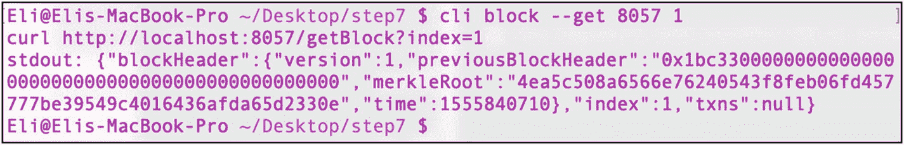

**图 3-11** 在端口 8057 上检索区块

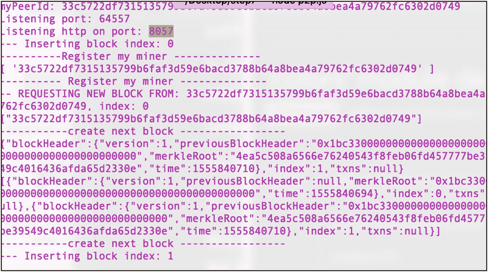

**图 3-10** 在端口 8057 上运行 P2P 区块链网络

在本练习中，你创建了用于获取区块和创建钱包的两个命令。这是你`CLI`的起点，你可以根据需要继续添加命令。

## 后续方向

我已经提到过，本章中的代码并未考虑许多用例，并且为了简化也没有加入安全性。你可以做很多事情来改进代码。

*   **确认机制**：每个矿工都会随区块发送一条消息。你可以创建一个确认系统来确保数据的完整性。
*   **交易/数据**：你可以实现交易或数据对象，以解决双重支付、交易验证和 coinbase 交易等问题。
*   **levelDB**：一旦 P2P 网络初始化，你可以创建一个脚本来将所有区块检索并写入`LevelDB`数据库，对它们进行验证，并在需要时清理数据库。

## 总结

本章介绍了如何创建你自己的基础 P2P 区块链网络；你能够发送和接收消息，并将区块包含在这些消息中。你还能够注册和注销矿工，并实现了一个简单的`PoS`共识机制。你创建了新区块并在对等节点之间发送它们。此外，你还设置了一个键值对类型的`LevelDB`数据库来存储区块。接着，你创建了一个包含私钥-公钥对的钱包。最后，你创建了通过 API 服务和`CLI`与 P2P 网络通信的方式。在下一章中，你将通过对比特币核心 API 的交互，深入理解比特币钱包和交易。