# 比特币钱包与交易

在本章中，你将深入探究比特币的核心 RPC，并学习钱包和交易的相关知识。你将学习如何使用传统钱包和 `SegWit` 比特币钱包。你将会提取钱包的公钥和私钥。

本章大部分内容将围绕交易展开，从利用比特币测试区块链以简单方式发送资金，到处理更复杂的交易。此外，你将学习如何通过比特币核心钱包 GUI 发送代币，以及如何在区块浏览器中查看交易并理解确认机制。你将研究原始交易，学习如何创建只有一个输出的原始交易，以及如何创建需要多个用户签名的交易。此外，你还会学习替换交易并设置锁定时间。你还将了解支付选项和手续费之间的差异。

最后，我将介绍如何在原始交易中传递数据。通过本章的学习，你将更好地理解交易、钱包、手续费、支付选项以及比特币的核心 RPC。

## Bitcoin Core RPC 资源

你已经学会如何利用 `bitcoin` 守护进程与 `bitcoin core` 交互，`bitcoin core` 作为一个 HTTP JSON-RPC 服务器，现在你可以发送调用并接收 JSON 响应。在本节中，你将基于这些技能深入理解钱包和交易。

第一步是初始化并运行 `bitcoin` 守护进程。

```
> bitcoind –printtoconsole
```

然后在另一个终端窗口中，你可以通过运行 `help` 命令查看可用的 RPC 命令。

```
> bitcoin-cli help
```

你也可以通过在任意命令前添加 `help` 来请求该命令的帮助信息。例如，在 `getnewaddress` 命令前添加 `help`，如下所示：

```
> bitcoin-cli help getnewaddress
```

在撰写本文时，最新的 RPC 版本是 `bitcoin core` 版本 `v0.18.99.0-56376f336`（发布版）；随着 `bitcoin core` 新版本的发布，本章中的命令可能会发生变化，因此建议查阅 [`https://bitcoincore.org/en/doc/`](https://bitcoincore.org/en/doc/) 获取最新的 RPC 命令。

请注意，`v0.18` 版本的文档在撰写本文时尚未上线；`v0.17` 是目前最新的文档（[`https://bitcoincore.org/en/doc/0.17.0/`](https://bitcoincore.org/en/doc/0.17.0/)）。在右侧菜单中，选择 `RAWTRANSACTIONS` 和 `WALLET`，即可查看与本章相关的 RPC 命令列表。

### 注意

除了 `bitcoin core` 文档外，还有两个免费的网页资源可以帮助你更好地理解本章未涵盖的 `bitcoin` RPC 命令行操作。它们是 [`https://github.com/ChristopherA/Learning-bitcoin-from-the-Command-Line`](https://github.com/ChristopherA/Learning-bitcoin-from-the-Command-Line) 和 [`http://learnmeabitcoin.com/guide/transactions`](http://learnmeabitcoin.com/guide/transactions)。

## Bitcoin 钱包

在第 2 章中，你通过 `getbalance` 命令查询了钱包的可用资金，并通过 `getnewaddress` 命令创建了一个新的 `bitcoin` 钱包。

在第 3 章中，你为自己的区块链创建了第一个区块链钱包；你通过利用 `Elliptic Curve Cryptography Node.js` 库创建了一个 `wallet.js` 文件，并生成了一个公私钥组合，随后通过命令行界面将其导出。在本节中，我将通过分析比特币核心以及钱包和交易的生成方式，进一步扩展你的这些知识。

Bitcoin 允许用户发送和接收币。用户可以生成一个包含公钥的钱包，发送者将币发送到接收者钱包的公钥地址。

发送币的过程与此相同，只是方向相反。接收者向发送者提供一个期望收款的钱包公钥地址，发送者将币发送到该公钥地址。钱包地址是通过公私钥哈希算法生成的公钥。接收者可以在每次期望收款时生成一个新的公钥。无需匿名的用户可以对多笔交易使用同一个公钥；然而，bitcoin 的原始愿景鼓励用户为每笔交易提供不同的公钥，并设置多个私钥以对应多个公钥。私钥存储在钱包中，每个公钥代表一个钱包地址。

### 创建传统钱包地址并检索私钥

最常见的一种 bitcoin 地址，也是你在第 2 章中生成的那种类型，称为“支付到公钥哈希（P2PKH）”地址。P2PKH 是公钥，公钥地址会通过算法进行哈希处理。

Bitcoin 也支持 P2SH-SEGWIT 协议，我将在本章后面讨论这一点。

#### 注意

隔离见证（SegWit）是通过一次软分叉对 `bitcoin core` 代码的补充，它通过移除解锁交易所需的签名数据，提高了比特币的区块大小限制。当解锁代码被移除后，多出的空间可用于在链上包含更多交易。

要生成支持 P2SH-SEGWIT 和 P2PKH 的地址，只需运行以下命令：

```
> bitcoin-cli getnewaddress
2N96AMUEX4VMNTApPAbUaA6wzP4V9QrbveK
```

要生成 P2PKH 地址，你需要使用 `legacy` 标志。

```
> bitcoin-cli getnewaddress "" legacy
13oWKiVQ7C5Ewwjv6KRpP3Xm5YstzqFixT
```

如你所见，这些命令返回了公钥。钱包的私钥可以通过将密钥转储到文件来查看，就像你之前做的那样，或者直接使用 `dumpprivkey` 命令。

```
> bitcoin-cli dumpprivkey "13oWKiVQ7C5Ewwjv6KRpP3Xm5YstzqFixT"
L5gDpFvfEkUSFeMSQb92kueD1BuX4JeZLAhQkXoEtjcZMog3uXB4
```

私钥不应与任何人分享，因为它们可以解锁与公钥地址关联的资金。话虽如此，我在此与你分享这个私钥仅作为学习示例。

#### 注意

保护你的私钥。如果私钥丢失，你将失去你的币/资金。

如你所知，你可以将私钥转储到一个文本文件中。

```
> bitcoin-cli dumpwallet ~/mywallet.txt
{
"filename": "/Users/Eli/mywallet.txt"
}
```

然后，你可以获取钱包的位置并查看你的密钥。

```
> vim /Users/[location]/mywallet.txt
```

你保存的数据文件不仅包含公钥和私钥，还包含与你的钱包相关的交易。

你可能还记得，另一个有用的 RPC 功能是，你可以向 `bitcoin` 守护进程查询特定钱包的资金。

```
> bitcoin-cli getbalance 1Mr2G632PfQuq4uJXRBNWLoRKH71Qwor51
```

要获取你钱包中的可用资金，只需运行 `getbalance` 命令，该命令会返回 `0` 余额，因为你还没有存入任何资金。

```
> bitcoin-cli getbalance
0.00000000
```

### 支付到见证公钥哈希（P2WPKH）：SegWit 软分叉

比特币（BTC）和比特币现金（BCH）曾因区块大小的分歧（即每个区块可以包含多少数据）而硬分叉。2017 年，`bitcoin core` 代码硬分叉为 `bitcoin cash`，并允许增加区块大小限制。2019 年，`bitcoin cash` 再次分叉，原因是对于每次分叉的若干新特性存在争议。

比特币的区块大小限制意味着交易有时必须等待才能被包含在区块中；然而，由于 1 MB 的限制，它们可能无法被包含在下一个区块中，当网络中有太多交易时，会导致交易确认时间变慢，进而导致矿工费用增加。为了解决这个问题，`bitcoin` 开源开发者创建了一次软分叉，并引入了隔离见证（SegWit）。SegWit 通过移除解锁交易所需的签名数据，增加了比特币的区块大小限制。当解锁代码被移除后，多出的空间可用于在链上包含更多交易。这种方法将区块大小增加到了 4 MB。

#### 注意

隔离见证（SegWit）是一种通过从比特币交易中移除签名数据来增加区块链区块大小限制的过程。这一过程释放了空间，允许你添加更多交易。SegWit 使用 BIP173 中定义的 Bech32 地址。该地址长度为 90 个字符，由可读部分、分隔符和数据组成。

解锁验证代码是 `见证`（witness）数据。可以说新代码“隔离了见证”（segregated the witness）。这就是其名称的由来。

在我们使用的 v17.0 版本构建中，钱包和交易里有一个“见证公钥哈希”（Witness Public Key Hash）选项，用于替换 `scriptSig` 参数并检查交易有效性。由于这是一次软分叉，旧的遗留代码仍然有效。

你在 `getaddressinfo` 命令中已经看到过这一点，该命令既包含用于支持传统地址的 `scriptPubKey`，也包含 `iswitness`。你可以运行 `getaddressinfo` 命令来查看这些参数。

```
> bitcoin-cli getaddressinfo $address1
```

在比特币核心 v0.16 之前，你必须使用 `addwitnessaddress` 命令将传统地址转换为 P2WPKH。自比特币核心 v0.16.0 起，一个地址既可以容纳 P2SH 也可以容纳 P2WPKH。因此，钱包现在是 P2SH-P2WPKH 格式。如果你使用的是 v0.18 版本，你可以看到 `getaddressinfo` 地址同时包含用于传统 `scriptSig` 和 SegWit 的参数。

### 椭圆曲线数字签名算法

比特币核心允许你利用椭圆曲线数字签名算法（ECDSA）创建签名。这可以通过使用 `signmessage` 命令来实现。添加签名可以让你证明自己拥有钱包的私钥，从而为发送方增加另一层安全保障，确保他们将资金发送到正确的地址。

```
> bitcoin-cli signmessage "13oWKiVQ7C5Ewwjv6KRpP3Xm5YstzqFixT" "John Doe"
```

此命令输出一个哈希值：

```
HzicuTXMl1COVh7Xw9ky9A/cl7ZjMSWNH10Y/invAgHWa74gS8EOvio3FJkofpH0nunIA7pJoGwWLRa0UdD7dc8=
```

发送方可以在发送资金之前验证该钱包。

```
> bitcoin-cli verifymessage "13oWKiVQ7C5Ewwjv6KRpP3Xm5YstzqFixT" "HzicuTXMl1COVh7Xw9ky9A/cl7ZjMSWNH10Y/invAgHWa74gS8EOvio3FJkofpH0nunIA7pJoGwWLRa0UdD7dc8=" "John Doe"
```

验证命令将输出 `true` 或 `false` 响应。在本例中，它将返回如下结果：

```
true
```

这允许用户确认他们确实拥有一个钱包。这在代码层面非常有用，例如，因为 P2PKH 地址将利用私钥生成签名。P2PKH 地址是与生成签名的私钥相对应的公钥的哈希值。

#### 注意

ECDSA 是比特币用于确保资金所有权的加密算法。它被用于生成公钥/私钥，并且也可以将签名包含在算法中。

ECDSA 签名最多可以与四个可能的 ECDSA 公钥进行比对。这些公钥将从签名哈希中重建；每个密钥都会被哈希，然后与提供的 P2PKH 钱包地址进行比较以寻找匹配项。结果要么是 `true`，要么是 `false`。正如你之前所见，当你运行 `verifymessage` 命令后，示例收到了 `true` 的结果。

#### 注意

二维码是字符串的一种图像表示形式。二维码阅读器可用于读取 URL 或编码钱包的公钥地址等操作。

你可以通过 Chart Google API（`https://chart.googleapis.com`）生成二维码。例如，要为地址 `13oWKiVQ7C5Ewwjv6KRpP3Xm5YstzqFixT` 生成一个金额为 0.00016 BTC 的二维码，你可以生成以下 URL：

`https://chart.googleapis.com/chart?chs=250x250&cht=qr&chl=bitcoin:13oWKiVQ7C5Ewwjv6KRpP3Xm5YstzqFixT?&amount=0.00016`。请参见图 4-1。

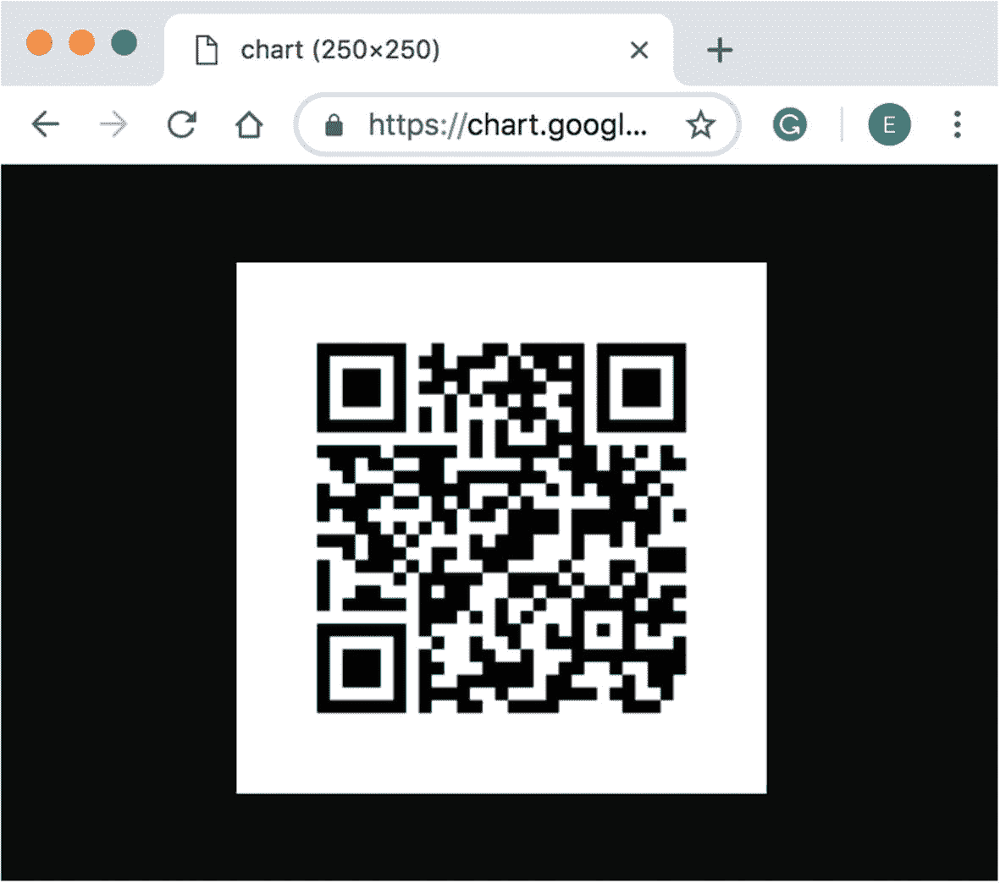

图 4-1

通过 Chart.googleapi.com 生成的比特币二维码

## 交易

在本节中，我将介绍交易。你将学习如何同时使用命令行和比特币核心钱包图形用户界面（GUI），在测试网上通过比特币守护进程发送代币。你将学习如何使用比特币浏览器查看你的交易。然后，我将通过展示如何创建一个具有单一输出的原始交易，以及利用多重签名（multisig，即需要多个密钥才能授权交易）创建更复杂的交易，来介绍更高级的交易创建方法。此外，我还会介绍如何更改其他选项，例如为了调整手续费而替换交易，以及设置锁定时间。你将学习 P2PKH 和 P2SH-SEGWIT 之间的区别。最后，你将学习如何使用 `OP_RETURN` 参数，在比特币中除了代币之外附加其他数据。让我们开始吧。

### 简单命令

区块中的第一笔交易被称为 `coinbase` 交易；这笔交易由该区块中包含的交易支付的交易手续费构成。要发送一笔交易，你需要向矿工支付交易手续费。如果手续费过低或未支付手续费，交易可能会长时间卡在 P2P 网络中，甚至永远无法确认，直到你更改手续费为止。

要设置交易手续费，你可以在 `bitcoin.conf` 文件中添加一个带默认手续费的参数。首先，你需要找到该文件的位置。为此，在运行守护进程之后，你可以查找文件的位置。

```
> bitcoind –printtoconsole
```

几秒钟后，按下 Control+C 停止此服务。该命令会显示 `bitcoin.conf` 文件的位置，并返回配置文件的路径。然后你可以打开该文件，通过添加默认手续费来修改它。在本例中，它位于“应用程序支持”文件夹内。

```
/Users/[my user]/Library/Application Support/Bitcoin/bitcoin.conf
```

当你打开文件时，可以看到默认交易手续费设置为 0.00000020（`mintxfee=0.00000020`）。

#### 注意

在 `bitcoind` 中还有其他手续费和设置。你可以修改你发送的交易的手续费（`paytxfee`）、最大总手续费（`maxtxfee`）、后备手续费等。请访问此比特币页面获取所有可用选项：`https://en.bitcoin.it/wiki/Running_Bitcoin`。

监控和更新比特币交易手续费可以确保发送的资金根据市场力量进行调整。有一些网站、应用程序和表单可以尝试预测需要支付的手续费。有许多网站可以帮助计算交易手续费预测，例如以下 API，你可以从你的代码中调用它：

`https://bitcoinfees.earn.com/api/v1/fees/recommended`

在撰写本文时，该 API 返回的手续费为 20 聪。

```
{"fastestFee":20,"halfHourFee":20,"hourFee":18}
```

另一个例子是 `https://bitcoinfees.net/`。在撰写本文时，该网站显示，大多数交易的手续费为 5 到 6 聪，预计在不到 6 小时内确认；或者 49 到 50 聪，预计在不到 20 分钟内确认。

#### 注意

聪是比特币的百万分之一，以中本聪命名。它是比特币可发送的最小单位：`0.00000001 BTC`。在撰写本文时，更快的交易手续费约为 50 聪。

现在你了解了手续费，可以将配置文件中的最低手续费修改为更高值，例如 50 聪。

```
> vim '/[location]/bitcoin/bitcoin.conf'
mintxfee=0.00000050
txconfirmtarget=3
```

`mintxfee` 值将最低交易手续费设置为 50 聪，即 `0.00000050 ฿`。这将在你的交易中设置为每字节数据 `20 聪`。这意味着浮动手续费需要计算出合适的金额，以确保交易能在接下来的三个区块中得到确认。正如你所知，每个区块大约需要 10 分钟进行哈希计算，因此目标是在 30 分钟内包含你的交易。

修改配置文件后，请记得重启 `bitcoind`。

```
> bitcoind –printtoconsole
```

## 测试网

在本节中，你将进一步了解交易。为了更深入地理解交易，你需要发送和接收比特币。要在主网（实际生产链）上获取比特币，你需要通过挖矿或交易来获取。然而，在学习过程中你并不想处理真实的比特币，因为你需要支付手续费，而且如果操作失误还会有丢失比特币的风险。此外，比特币的价格也可能下跌。

幸运的是，比特币提供了另一种用于测试的区块链，称为`测试网`。这种替代区块链使你可以在不使用真实比特币或滥用比特币主链的情况下进行实验。你可以使用 `-testnet` 标志启动一个比特币核心实例。在测试网上，这是通过`水龙头`（一种模拟币）来完成的。你通过停止比特币核心守护进程并用 `testnet` 标志重新启动，从而连接到测试网区块链，而不是主区块链。

```
> bitcoind –testnet
```

请记住，与比特币的主网链一样，同步和索引过程可能需要数小时，具体取决于你的网络连接。运行这个命令，然后去喝杯咖啡休息一下，如果你想开始处理区块的话。

BTC 测试网为你提供免费的水龙头比特币，你可以用于测试。测试网要求你在完成测试后归还这些币，因为这项服务是免费的，归还这些币将有利于下一个需要它们的开发者。

你可以在此处阅读更多关于测试网的信息：[`https://en.bitcoin.it/wiki/Testnet`](https://en.bitcoin.it/wiki/Testnet)。在撰写本文时，testnet3 是最新的用于测试的区块链。

你将使用 `coinfaucet.eu`，可以通过 [`https://coinfaucet.eu/en/btc-testnet/`](https://coinfaucet.eu/en/btc-testnet/) 访问。但是，如果这个水龙头不再可用，还有其他水龙头。第一步是向你的钱包发送币。首先，使用以下命令生成一个新的 P2PKH 钱包地址：

```
> bitcoin-cli getnewaddress "" legacy
mnMs77edsGV8VKwtB3d7fsnvrNuZ8ECKfh
```

如你所见，你收到的输出是可用于接收资金的公钥。接下来，将该地址粘贴到 [`https://coinfaucet.eu`](https://coinfaucet.eu)，选择“Bitcoin testnet”，验证你不是机器人，然后点击“Get bitcoins!”按钮，如图 4-2 所示。

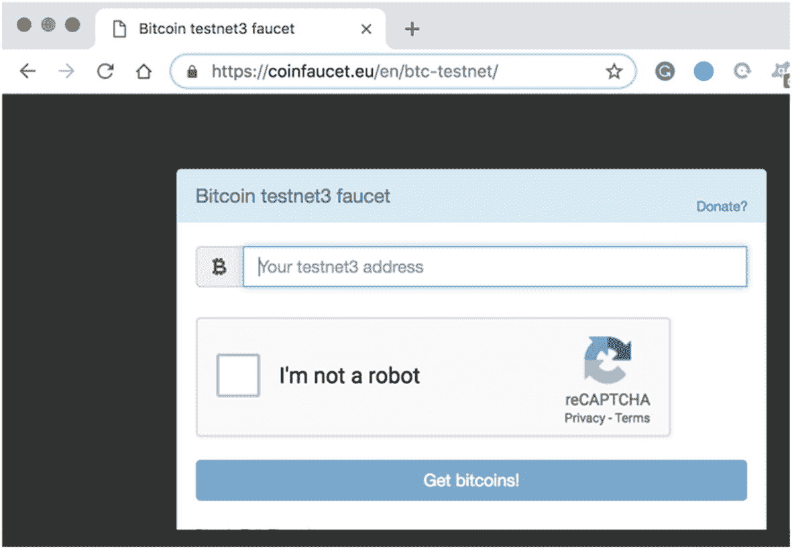

*图 4-2*

*Coin 测试网水龙头，请求测试资金*

一旦币发送到你的钱包，你会收到一个带有 `tx` 号的确认信息，如图 4-3 所示。

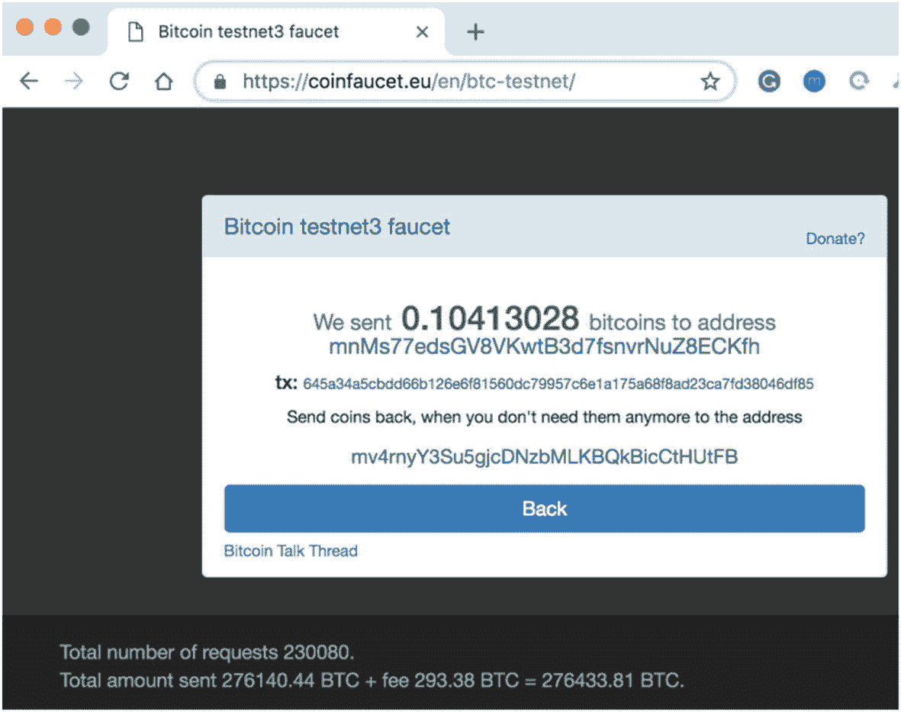

*图 4-3*

*Coin 测试网水龙头，比特币已发送*

### 注意

请记住，这些测试网水龙头网站经常会下线，你可能需要寻找一个新的测试网水龙头网站。为了方便起见，这里提供另一个在撰写本文时仍在运行的水龙头：[`https://testnet-faucet.mempool.co/`](https://testnet-faucet.mempool.co/)。

## 在区块链浏览器上查看交易

在测试网水龙头上，你可以像在比特币主网生产链上一样监控已发送的比特币。这可以通过测试网区块链浏览器完成；参见“tx”链接，如图 4-3 所示。如你所知，“tx ID”代表交易 ID。或者，你也可以将该交易 ID 直接粘贴到 [`https://live.blockcypher.com/btc-testnet/`](https://live.blockcypher.com/btc-testnet/) 的区块链浏览器中。参见图 4-4。

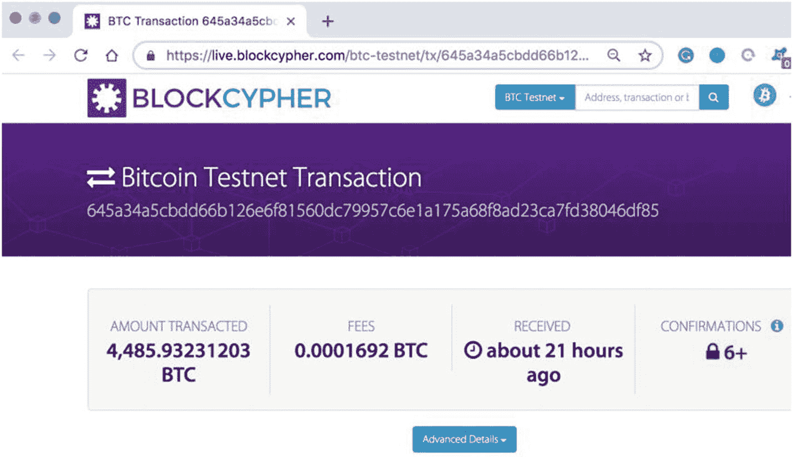

*图 4-4*

*在 live.blockcypher.com 上查看交易信息*

事实上，区块链上发生的每一笔交易都可以在区块链浏览器中被任何人公开查看；这包括除用户私钥之外的所有交易数据。尽管交易数据是公开的，但关于所有者的身份信息并非公开信息，也无需执行交易。将用户与你发送的币关联起来的是与公钥相关的私钥。

同样，你也可以通过 RPC 命令行进行同样的信息检查。你已经知道如何检查钱包余额，如下所示：

```
> bitcoin-cli getbalance
0.0000000
```

当接收到币时，在交易被挖出的区块确认之前，这些币无法用于花费。这就是为什么如果你立即检查余额，它仍然显示为 0。

在你的交易被包含在下一个区块中后，你可以立即通过 `getunconfirmedbalance` 命令看到未确认的币。要进行检查，请运行 `getunconfirmedbalance` 命令。

```
> bitcoin-cli getunconfirmedbalance
0.10413028
```

一旦你有足够多的确认，`getbalance` 命令将显示你的新余额，而 `getunconfirmedbalance` 将显示 0。

同样，你可以更精确地要求最小确认数为 2。

```
> bitcoin-cli getbalance "*" 2
```

### 注意

一笔交易在下一个新区块被创建之前将保持“未确认”状态。一旦新区块被创建，新交易被验证并包含在该区块中。现在，该交易将获得一次确认。大约十分钟后，新区块被创建，该交易再次被确认。每次确认都提高了交易的安全性，交易被撤销的可能性也随之降低。交易所的惯例是，需要四到六次确认才能让你使用这些币；对于大额币种，等待甚至六十次确认可能是明智的，这大约需要十个小时。

另一个有用的命令是 `listtransactions` 命令；它提供了与你钱包相关的完整交易数据列表。

```
> bitcoin-cli listtransactions
[
{
"address": "mnMs77edsGV8VKwtB3d7fsnvrNuZ8ECKfh",
"category": "receive",
"amount": 0.10413028,
"label": "",
"vout": 0,
"confirmations": 420,
"blockhash": "0000000000125d2714882704562c8442a6700c58a41cad0b4108305474be3bb1",
"blockindex": 4,
"blocktime": 1541783585,
"txid": "645a34a5cbdd66b126e6f81560dc79957c6e1a175a68f8ad23ca7fd38046df85",
"walletconflicts": [
],
"time": 1541783585,
"timereceived": 1541890511,
"bip125-replaceable": "no"
}
]
```

## 通过比特币核心钱包图形界面发送测试网币

你已使用 `testnet` 标志初始化了一个比特币核心实例；不过，还有一种更简便的收发币方式。比特币核心包含一个图形界面钱包可供使用。你将使用比特币核心自带的图形界面软件。要开始操作，请在终端中按下 `Control+C` 终止 `bitcoind` 守护进程，然后在命令行终端中运行带有 `testnet` 标志的 `bitcoin-qt`，以便连接到测试网而非主网。

```bash
> bitcoin-qt –testnet
```

此命令将打开一个新窗口，并与测试网区块链同步。与之前一样，如果你尚未完成测试网同步，根据你的网络连接情况，可能需要数小时，如图 4-5 所示。不过，在钱包图形界面中，你会看到同步所需的预估时间。

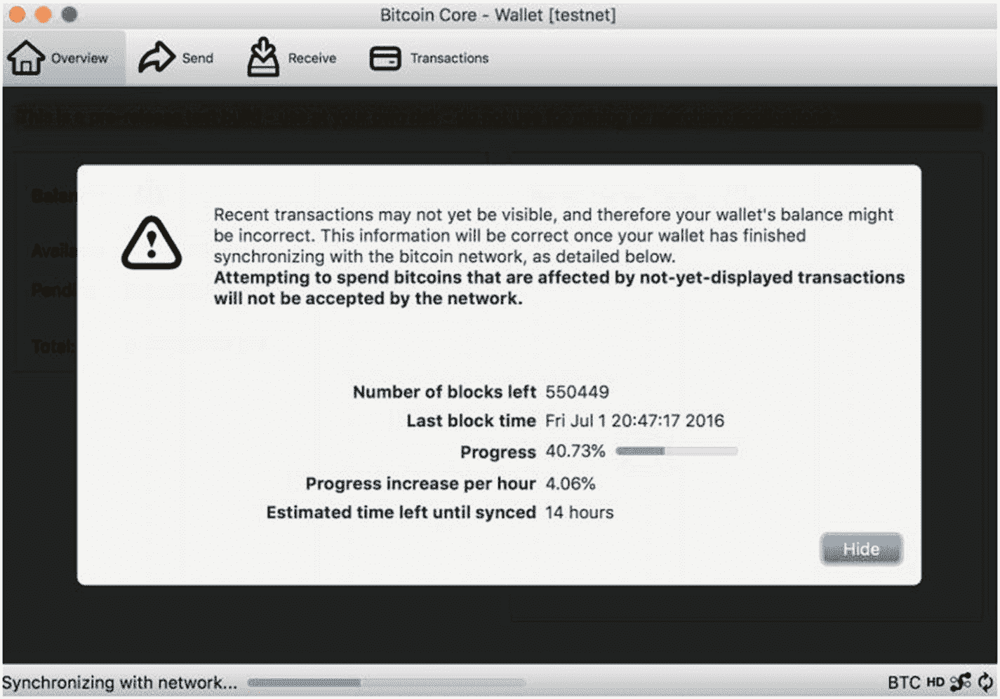

*图 4-5* —— 比特币钱包测试网图形界面与测试网网络同步

和之前一样，你需要等待同步完成；只有这样你才能获取钱包的公钥地址并花费你的币。在“总览”菜单中，你会看到余额，包括已确认（可用）资金和未确认（待处理）资金。你还可以点击顶部的“交易”按钮获取交易列表。参见图 4-6。

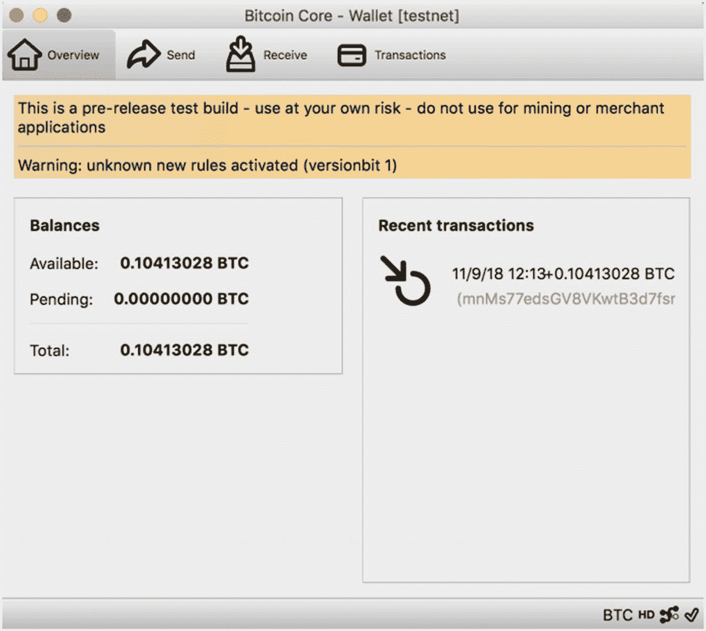

*图 4-6* —— 比特币核心钱包总览屏幕

要创建新的钱包公钥地址，请点击顶部的“接收”按钮，然后点击“请求付款”按钮。这将为你的钱包生成一个地址，如图 4-7 所示。

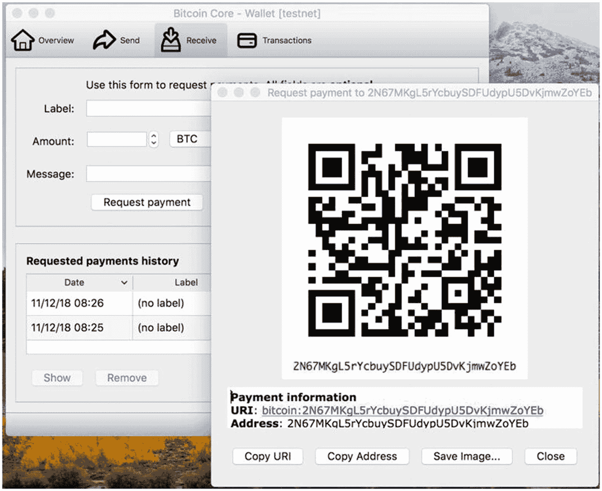

*图 4-7* —— 比特币核心钱包，接收币屏幕

如你所见，图形界面为方便生成了一个二维码。在支持此功能的场景下，发送币时可以扫描它。现在，让我们继续通过测试网水龙头（[`https://live.blockcypher.com/btc-testnet/`](https://live.blockcypher.com/btc-testnet/)）向你的钱包发送更多币。

如你所见，你可以像在命令行中一样接收币。接下来，你将发送一些币。

你将发送 0.01 BTC 回测试网水龙头，供其他开发者使用。为此，请点击图形界面顶部的“发送”按钮，并粘贴你向钱包发送币时测试网水龙头提供给您的钱包地址。

请注意，在比特币核心钱包图形界面中，“交易费”旁边有一个“选择”按钮。这允许你选择费用以及确认次数。它还包括启用“手续费替换”功能的方式。此功能允许你在费用过低且交易未被包含在区块中时更改费用。参见图 4-8。

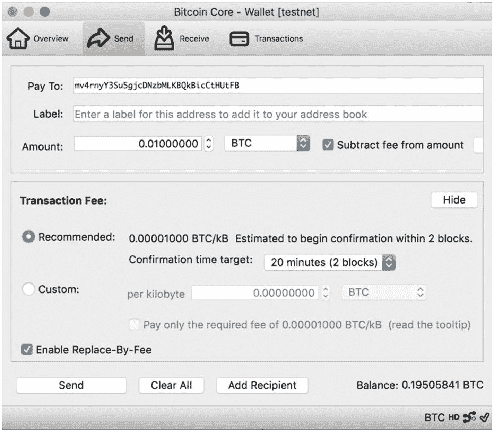

*图 4-8* —— 比特币核心钱包发送屏幕

测试网水龙头会将币发送到你提供的钱包地址。当你发送和接收币时，你会从图形界面收到一个弹窗通知，并且总览屏幕上的余额会更新。点击“交易”按钮查看交易信息。你也可以点击每笔交易查看实际的交易数据。这与你之前看到的 `listtransactions` 命令类似。参见图 4-9。

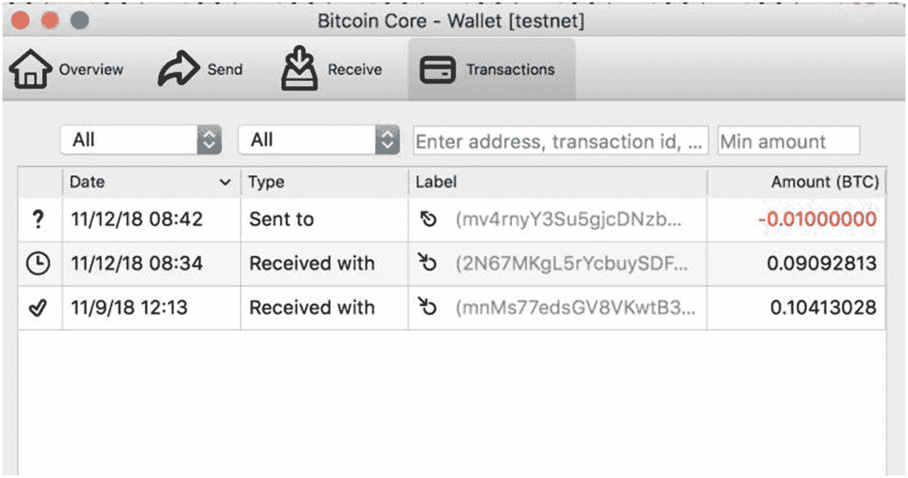

*图 4-9* —— 比特币核心钱包交易

## 原始交易

到目前为止，你已经通过命令行收到了一笔交易到钱包，也通过比特币核心图形界面收到了币。你还能够查看确认信息、费用余额和交易。如果你将资金发送回测试网水龙头并接收币，事情很简单。这被称为单输入单输出交易，因为你有一个发送方和一个接收方，并且花费的金额与你收到的金额相同（扣除费用）。在现实生活中，交易可能会变得更加复杂，因为有许多用例存在一个输入和多个输出，或多个输入和多个输出。比特币核心提供了一组命令来访问原始交易（`RawTransaction`），以便你可以对交易进行更精细的控制。

你将通过 RPC 命令行从简单的单输入单输出交易开始。

**注意：**
创建和理解 `RawTransaction` 对于构建软件非常有用，因为你可以对交易进行完全精细的控制。然而，出错可能导致灾难性后果和币的丢失，因此在发送任何资金之前请务必谨慎，并仔细检查所有内容。

当你收到一笔交易时，该交易会以称为`未花费交易输出`（UTXO）的状态保留在你的钱包中。要发送单输入单输出交易，你需要让你的金额等于你想要发送的资金。然后，你可以为接收币的接收方生成一个新的 UTXO。接收方可以使用这些 UTXO 向一个新的或多个接收方发送交易，并且这个过程可以无限继续。

**注意：**
UTXO 是你钱包中一个单独的传入币交易。当你向一个或多个钱包地址接收多笔交易时，每笔交易都作为一个 UTXO 存在，因此你会拥有多个 UTXO。要创建新的传出交易，你需要根据你要发送的金额收集一个或多个 UTXO。

现在，如果你的 UTXO 包含的金额大于你想要花费的金额怎么办？那么你需要将剩余的币发送回你的钱包。要获取未花费币的列表，你可以使用 `listunspent` 命令。

通过 `Control+C` 关闭比特币核心图形界面钱包，并再次使用 `testnet` 标志启动守护进程。

```bash
> bitcoind -testnet
```

当你运行 `getbalance` 命令时，你会得到钱包的余额，其中包含你从 [`https://live.blockcypher.com/btc-testnet/`](https://live.blockcypher.com/btc-testnet/) 收到的两笔交易，减去你发送回测试网水龙头的交易。

```bash
> bitcoin-cli getbalance
0.18505841
```

我想指出，你随时可以使用 `-named` 标志来代替顺序参数。使用命名参数有助于确保你在使用主网时不会出错。例如，使用命名参数的 `getbalance` 命令如下所示：

```bash
> bitcoin-cli -named getbalance minconf=2
0.18505841
```

接下来，让我们看看 `listunspent` 命令。顾名思义，它返回一个 JSON，其中包含你尚未花费的币的交易，换句话说，就是你的 UTXO。`listunspent` 命令还返回一个包含名为 `vout` 变量的 JSON，该变量表示交易中输出的索引号。

### 注意事项

`vout`值代表交易输出索引号。你将使用`txid`和`vout`选择现有输出作为新交易的输入。

```
> bitcoin-cli listunspent
[
{
"txid": "50e91c9b73a90bd883f4a9a8a51be729770df20fae0445a9090b80a8621f4538",
"vout": 0,
"address": "2N67MKgL5rYcbuySDFUdypU5DvKjmwZoYEb",
"label": "",
"redeemScript": "0014c27b4e6bd8eb821ee80a239e0edd59070f57233d",
"scriptPubKey": "a9148d1c6e108c60cfdfa61565ac328be6624591404b87",
"amount": 0.09092813,
"confirmations": 17,
"spendable": true,
"solvable": true,
"safe": true
},
{
"txid": "be05d068d1245f1c60ea4229c00eb5e96f2a5c5527f1deb7c6de5e1e20a4b4db",
"vout": 1,
"address": "2MveVhMe6PTzuhsJHx5zXAjDBwQvzdyqGjM",
"redeemScript": "00142e29123ba343c577ab9517ede9b74f047d2c2ea3",
"scriptPubKey": "a914254f0e95fb26c0f29975f866e69543519bf565e787",
"amount": 0.09413028,
"confirmations": 16,
"spendable": true,
"solvable": true,
"safe": true
}
]
```

这些 UTXO 展示了一个属性`txid`，该属性包含在比特币区块中。`txid`属性允许你追踪交易，正如你在区块链浏览器上看到的那样。

注意索引从 0 开始，由于你有两笔交易，因此索引分别为 0 和 1。如果你有更多交易，索引会继续递增。`图4-10`展示了当你有两个 UTXO 时`listunspent`的结果。

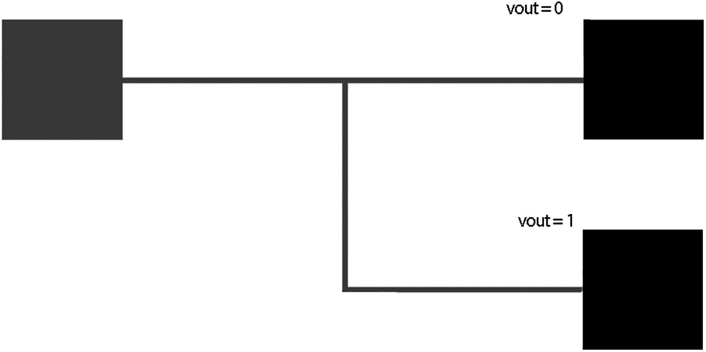

`图4-10` vout 索引插图

你可以通过`getrawtransaction`命令获取关于该交易的所有数据。这里我选取了刚才 UTXO 中的第一个`tx`属性，然后添加了`1`标志来解码十六进制编码的交易数据；请查看以下命令和完整输出：

```
> bitcoin-cli getrawtransaction 50e91c9b73a90bd883f4a9a8a51be729770df20fae0445a9090b80a8621f4538 1
{
"txid": "50e91c9b73a90bd883f4a9a8a51be729770df20fae0445a9090b80a8621f4538",
"hash": "e420b350f5b95e29f51b722a5bd44ea2e9d27a7239d2e17da02f28e04c757b14",
"version": 2,
"size": 248,
"vsize": 166,
"weight": 662,
"locktime": 1443113,
"vin": [
{
"txid": "2645c128d68194640a7207eeae6ea42e8e528bcba2369eec0ba572566228b507",
"vout": 0,
"scriptSig": {
"asm": "00143bfa0326c076fa6cab0d23aea170bac38ac9a164",
"hex": "1600143bfa0326c076fa6cab0d23aea170bac38ac9a164"
},
"txinwitness": [
"3045022100fb7f0fc2cf99c8174eb3d14169e1c206157d434d8290b2efbefa5a37d0773923022065f0b671c0596816c062b9bdc7b30931edfd99a846a0f1633d301bfb7c03db3c01",
"02d208ff6da0583b99392d30e33c5a12da61b9d9de4c35bb0d20c33ba3bfc49302"
],
"sequence": 4294967294
}
],
"vout": [
{
"value": 0.09092813,
"n": 0,
"scriptPubKey": {
"asm": "OP_HASH160 8d1c6e108c60cfdfa61565ac328be6624591404b OP_EQUAL",
"hex": "a9148d1c6e108c60cfdfa61565ac328be6624591404b87",
"reqSigs": 1,
"type": "scripthash",
"addresses": [
"2N67MKgL5rYcbuySDFUdypU5DvKjmwZoYEb"
]
}
},
{
"value": 1453.63689543,
"n": 1,
"scriptPubKey": {
"asm": "OP_HASH160 f4eb3fe1578076853a774d36f193684f86f71d5f OP_EQUAL",
"hex": "a914f4eb3fe1578076853a774d36f193684f86f71d5f87",
"reqSigs": 1,
"type": "scripthash",
"addresses": [
"2NFaEgWoTNL5akkTuGtYQhzTvWhUaCbxBtL"
]
}
}
],
"hex": "0200000000010107b528625672a50bec9e36a2cb8b528e2ea46eaeee07720a649481d628c1452600000000171600143bfa0326c076fa6cab0d23aea170bac38ac9a164feffffff02cdbe8a000000000017a9148d1c6e108c60cfdfa61565ac328be6624591404b8747e059d82100000017a914f4eb3fe1578076853a774d36f193684f86f71d5f8702483045022100fb7f0fc2cf99c8174eb3d14169e1c206157d434d8290b2efbefa5a37d0773923022065f0b671c0596816c062b9bdc7b30931edfd99a846a0f1633d301bfb7c03db3c012102d208ff6da0583b99392d30e33c5a12da61b9d9de4c35bb0d20c33ba3bfc4930229051600",
"blockhash": "00000000000000321b56aece3932b187927ac3e7dc4532f8811aa612bcfa639a",
"confirmations": 17,
"time": 1542029870,
"blocktime": 1542029870
}
```

注意，你能够看到关于区块、确认数、输入、输出等更多信息。

### 生成单一输出原始交易

交易可能会变得复杂，因为通常需要多个输入或多个输出。例如，如果你想把未花费的币发送回钱包，同时将币发送到多个地址，情况就会变得复杂。使用`RawTransaction`，你可以完全控制币的流向，并能够实现复杂交易。

我们将通过从一个钱包向另一个钱包发送一个 UTXO 来创建简单的`RawTransaction`。之前，你通过比特币核心钱包 GUI 将币发送回了测试网水龙头。现在让我们用`RawTransaction`命令做同样的事情。

首先，确认发送币之前你的钱包余额。

```
> bitcoin-cli getbalance
0.18505841
```

接下来，选择你将用于资助交易的 UTXO。正如你回忆的那样，你可以通过`listunspent`命令获取 UTXO 列表，然后查看 JSON 响应并选择交易`txid`。选择一个有足够资金来支持新交易且已经确认的交易。

```
> utxo_txid="50e91c9b73a90bd883f4a9a8a51be729770df20fae0445a9090b80a8621f4538"
```

你可能还记得，`vout`是交易中输出的索引号。在此示例中，我将指向一个`vout`并生成一个新交易。新交易可以包含多个其他`vout`，如`图4-11`所示。

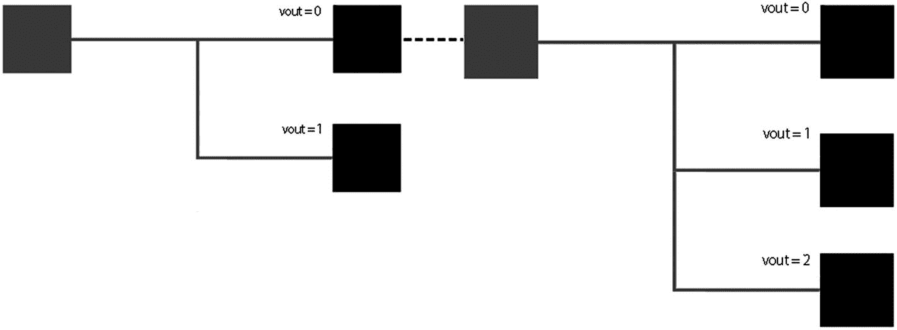

`图4-11` vout 新交易插图

在这个示例中，你将设置`vout`的第一个索引。

```
> utxo_vout="0"
```

你需要设置的最后一个也是最重要的变量是`recipient`地址。这里，你将使用之前发送币时使用的同一个钱包地址。

```
> recipient="mv4rnyY3Su5gjcDNzbMLKBQkBicCtHUtFB"
```

最后，你可以使用`echo`命令来验证并仔细检查变量设置是否正确。

```
> echo $utxo_txid
> echo $utxo_vout
> echo $recipient
```

现在你已经设置好了变量，可以通过`createrawtransaction`命令生成一个`RawTransaction`对象。你需要包含所有已设置的变量，并声明你想要花费的金额。你使用`0.xxx`，但你需要使用 UTXO 减去你想支付的费用，以发送 UTXO 中的所有币。

```
> rawtxhex=$(bitcoin-cli createrawtransaction "'[ { "txid": "'$utxo_txid'", "vout": '$utxo_vout' } ]"' "'{ "'$recipient'": 0.xxx }"')
```

接下来，你可以提取`rawtxhex`的值。

```
> echo $rawtxhex
020000000138451f62a8800b09a94504ae0ff20d7729e71ba5a8a9f483d80ba9739b1ce9500000000000ffffffff0140420f00000000001976a9149f9a7abd600c0caa03983a77c8c3df8e062cb2fa88ac00000000
```

`rawtxhex`值以十六进制编码数据的形式包含你新交易的信息。以下`decoderawtransaction`命令将返回一些 JSON 输出，其中包含你交易的解码数据：

```
> bitcoin-cli decoderawtransaction $rawtxhex
{
"txid": "91d4e108f8957251d2997e1f8dcdd0eec97192e8accf85a9e81f772f586118af",
"hash": "91d4e108f8957251d2997e1f8dcdd0eec97192e8accf85a9e81f772f586118af",
"version": 2,
"size": 85,
"vsize": 85,
"weight": 340,
"locktime": 0,
"vin": [
{
"txid": "50e91c9b73a90bd883f4a9a8a51be729770df20fae0445a9090b80a8621f4538",
"vout": 0,
"scriptSig": {
"asm": "",
"hex": ""
},
"sequence": 4294967295
}
],
"vout": [
{
"value": 0.01000000,
"n": 0,
"scriptPubKey": {
"asm": "OP_DUP OP_HASH160 9f9a7abd600c0caa03983a77c8c3df8e062cb2fa OP_EQUALVERIFY OP_CHECKSIG",
"hex": "76a9149f9a7abd600c0caa03983a77c8c3df8e062cb2fa88ac",
"reqSigs": 1,
"type": "pubkeyhash",
"addresses": [
"mv4rnyY3Su5gjcDNzbMLKBQkBicCtHUtFB"
]
}
]
}
]
```

如您所见，创建交易时，需要根据钱包的公钥哈希和私钥哈希生成签名。交易的输出脚本会获取公钥和签名，并检查它们是否与公钥哈希匹配。如果结果为真，您就可以花费这些币；否则，您将无法使用。

交易中可见公钥的交易类型称为"支付到公钥"（`P2PK`）。而您一直使用的隐藏公钥方式，其交易类型称为"支付到公钥哈希"（`P2PKH`）。

您将通过 `P2PKH` 对交易进行签名，以匹配您的钱包类型。签名交易有两种方式：可以使用 `signrawtransactionwithkey` 或 `signrawtransactionwithwallet`。

这两个签名方法在 `0.18.0 RPC` 中可用，其输入为序列化后的十六进制编码格式的原始交易。

`signrawtransactionwithwallet` 命令格式如下：
```
signrawtransactionwithwallet "hexstring" ( [{"txid":"id","vout":n,"scriptPubKey":"hex","redeemScript":"hex"},...] sighashtype )
```

请注意，`signrawtransactionwithwallet` 命令允许您包含一个名为 `prevtxs` 的第二个参数。`prevtxs` 的格式是一个数组，其中包含之前的交易输出。如果您决定使用并为 `prevtxs` 插入值，则交易将依赖于可能尚未上链的之前交易。如果您不需要此功能，只需将 `prevtxs` 设置为 `null`。

`signrawtransactionwithkey` 命令格式如下：
```
signrawtransactionwithkey "hexstring" ["privatekey1",...]
```

请注意，第二个参数是一个 base58 编码的私钥数组，这些将是用于签署交易的唯一密钥。第三个可选参数是一个包含此交易所依赖但可能尚未上链的之前交易输出的数组。

在我们的案例中，您将不包含第二个参数，因为您的交易不需要依赖其他条件。

```
> bitcoin-cli signrawtransactionwithwallet $rawtxhex
{
"hex": "0200000000010138451f62a8800b09a94504ae0ff20d7729e71ba5a8a9f483d80ba9739b1ce9500000000017160014c27b4e6bd8eb821ee80a239e0edd59070f57233dffffffff0140420f00000000001976a9149f9a7abd600c0caa03983a77c8c3df8e062cb2fa88ac0247304402205cc4b04859e34aa6b1e924745f33a7643fbe45fcd6e900fdaa29281feae3f8f6022059d4083a3cf81c3bb82267931660afb8ffc4bae87ede8dfa11efcb6af6a14ac90121028926735fcd5bf6580e6f669c240da8975dddf23a6d4015e4e0bc1ca3f1d2b7f100000000",
"complete": true
}
```

上一个命令在 JSON 响应中返回了已签名的十六进制编码数据。使用这些数据来设置 `signedtx` 变量的十六进制值。

```
> signedtx="0200000000010138451f62a8800b09a94504ae0ff20d7729e71ba5a8a9f483d80ba9739b1ce9500000000017160014c27b4e6bd8eb821ee80a239e0edd59070f57233dffffffff0140420f00000000001976a9149f9a7abd600c0caa03983a77c8c3df8e062cb2fa88ac0247304402205cc4b04859e34aa6b1e924745f33a7643fbe45fcd6e900fdaa29281feae3f8f6022059d4083a3cf81c3bb82267931660afb8ffc4bae87ede8dfa11efcb6af6a14ac90121028926735fcd5bf6580e6f669c240da8975dddf23a6d4015e4e0bc1ca3f1d2b7f100000000"
```

就这样；现在您可以通过 `sendrawtransaction` 命令发送您的交易。

```
> bitcoin-cli sendrawtransaction $signedtx
ff75dbb08da6f4dc6463dd32d8f9b1a4781e1eeee338e93e82820d0fdfbd43ff
```

输出会为您提供一个 `txid` 响应，您可以像之前一样在区块链浏览器中查看。您还可以通过 `getbalance` 命令验证资金是否已从您的账户中扣除。

```
> bitcoin-cli getbalance
0.09413028
```

以及 `listunspent` 命令。

```
> bitcoin-cli listunspent
[
{
"txid": "be05d068d1245f1c60ea4229c00eb5e96f2a5c5527f1deb7c6de5e1e20a4b4db",
"vout": 1,
"address": "2MveVhMe6PTzuhsJHx5zXAjDBwQvzdyqGjM",
"redeemScript": "00142e29123ba343c577ab9517ede9b74f047d2c2ea3",
"scriptPubKey": "a914254f0e95fb26c0f29975f866e69543519bf565e787",
"amount": 0.09413028,
"confirmations": 86,
"spendable": true,
"solvable": true,
"safe": true
}
]
```

此外，您还可以通过 `listtransactions` 命令查看交易。

```
> bitcoin-cli listtransactions
[
...
{
"address": "mv4rnyY3Su5gjcDNzbMLKBQkBicCtHUtFB",
"category": "send",
"amount": -0.01000000,
"label": "",
"vout": 0,
"fee": -0.08092813,
"confirmations": 1,
"blockhash": "0000000000000016ba1c314375d9bb17b6a857e091fd4924bda5c9d7d9a2fd15",
"blockindex": 1,
"blocktime": 1542070705,
"txid": "ff75dbb08da6f4dc6463dd32d8f9b1a4781e1eeee338e93e82820d0fdfbd43ff",
"walletconflicts": [
],
"time": 1542070656,
"timereceived": 1542070656,
"bip125-replaceable": "no",
"abandoned": false
}
]
```

### 需要多重签名的交易

到目前为止，您一直在进行标准的"单签交易"，因为只需要一个签名者使用一个签名来签署交易并执行转账。然而，比特币网络支持更复杂的交易。这些交易可以设置为需要多个签名者的签名。例如，机构、合作伙伴、配偶或编程脚本可能希望所有相关方都签名，而不是只有一人。在这些情况下，需要所有用户的私钥才能发送资金。

要执行多签名者交易，您将创建两个独立的钱包用于测试。您可以在两台不同的机器上运行比特币核心，并使用 RPC 调用为每个钱包生成一个新的公共地址；或者您可以在 `electrum.org/#download` 下载 Electrum 钱包，并在测试网模式下运行以生成您的第二个钱包。

作为第一个示例，您将运行 Electrum，因为您可以使用其内置的多重签名钱包来理解此过程。下载 Electrum 后，通过命令行将其作为测试网运行。

```
> open -n /Applications/Electrum.app --args –testnet
```

### 使用多重签名钱包设置 Electrum

Electrum 启动后，在创建钱包选项中选择"多重签名钱包"，然后单击"下一步"。参见图 4-12。

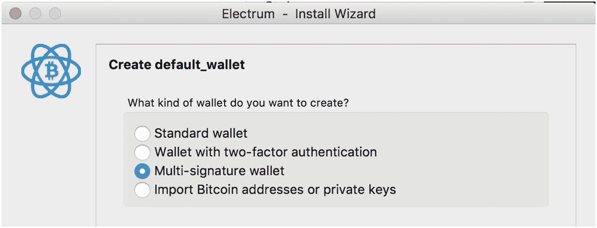

**图 4-12** `Electrum` 多重签名钱包

在下一个屏幕上，您可以选择需要多少名共同签名者以及需要多少个签名。这些交易通常被称为 *M-of-N 交易*，例如 2-of-3 场景。2-of-3 意味着您需要三个共同签名者中至少两个私钥（签名）才能授权该交易。您可以拖动滑块以更好地理解此功能，如图 4-13 所示。

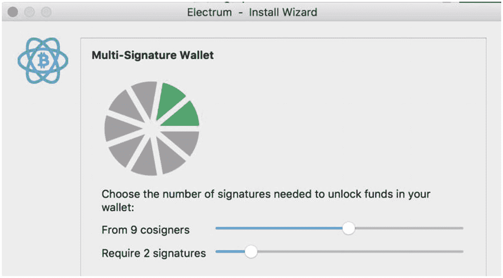

**图 4-13** `Electrum` 多重签名钱包的共同签名者和签名

在这里，选择 2-of-2 多重签名钱包，这意味着两名共同签名者和两个签名。然后点击"下一步"按钮。在接下来的屏幕上，点击"创建新种子"，然后点击"下一步"按钮。

在接下来的屏幕上，您可以选择种子类型。"标准"表示 `P2PKH` 或 SegWit，后者表示 `P2SH-SEGWIT`，因此选择"标准"并点击"下一步"。

下一步，您会得到一个代表您私钥的种子。请妥善保管您的种子，注意不要与任何人分享。然后您会获得 `Electrum` 所称的您的 `主` 公钥，并要求您将其分享给您的共同签名者，如图 4-14 所示。

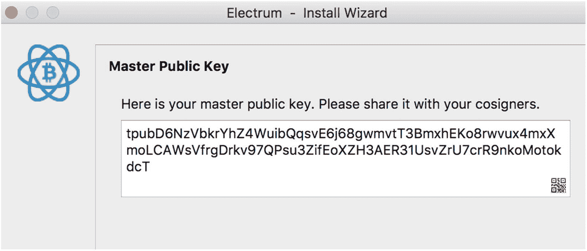

**图 4-14** `Electrum` 安装向导中的主公钥

#### 注意

Electrum 公钥主密钥是 Electrum 分层确定性钱包的一部分，该钱包基于一个主种子为你生成地址，这个主种子可用于备份你所有的资金。种子由用于检索你钱包私钥的单词组成；丢失种子就意味着丢失你的私钥。

点击“下一步”，你可以输入联合签名者的公钥或私钥。参见图 4-15。

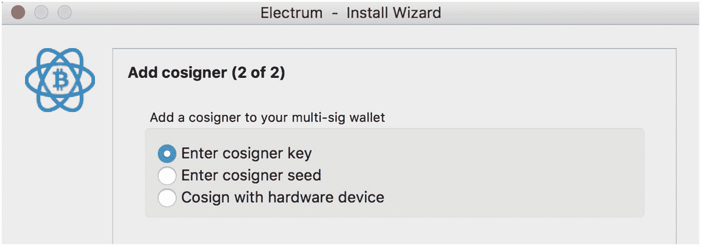

图 4-15
Electrum 安装向导 - 联合签名者密钥

在向导的下一个屏幕中，你将使用比特币核心钱包的主私钥，让 Electrum 代表你签署第二个钱包。你可以从你的私钥备份文件中检索该私钥。它显示在 `extended private masterkey` 下方。

```
> vim /Users/[位置]/mywallet.txt
### extended private masterkey: [key]
```

Electrum 向导会为你设置联合签名者，安装向导的下一步会要求你设置密码（如果你愿意），以增强安全性。

就是这样。现在向导已完成账户设置，你可以向你的联合签名者钱包发送资金，或从中接收资金。点击顶部的“接收”获取你的钱包地址，如图 4-16 所示。

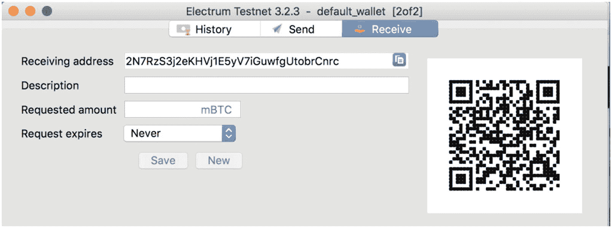

图 4-16
Electrum 钱包 - 接收地址和二维码

你将再次使用 Coinfaucet.eu 为你的新钱包注资：[`https://coinfaucet.eu/en/btc-testnet/`](https://coinfaucet.eu/en/btc-testnet/)。

然后，在交易被确认后，你可以将这些币发送回 Coinfaucet.eu 钱包的地址；以下是 Coinfaucet.eu 钱包的地址：

```
2N7RzS3j2eKHVj1E5yV7iGuwfgUtobrCnrc
```

由于你一直提供两个联合签名者的私钥，这笔交易将使用 `send` 命令进行。但是，如果你设置了两个账户但只提供了一个公钥，那么第二个联合签名者需要在其账户上批准此交易后，`send` 命令才会实际发送币。

类似地，你可以通过 RPC 命令行执行此交易。

首先，点击 Electrum 顶部的“文件 ➤ 删除”以创建一个标准钱包，而不是联合签名者钱包。

一旦此钱包被移除，你就可以重新开始，创建一个新的标准（P2PKH）钱包，将其用作第二个联合签名者。要检索你的钱包地址，请点击顶部的“查看”链接，然后点击“地址”。

接下来，右键单击你想要查看其公钥的地址。这将显示该地址的公钥。参见图 4-17。

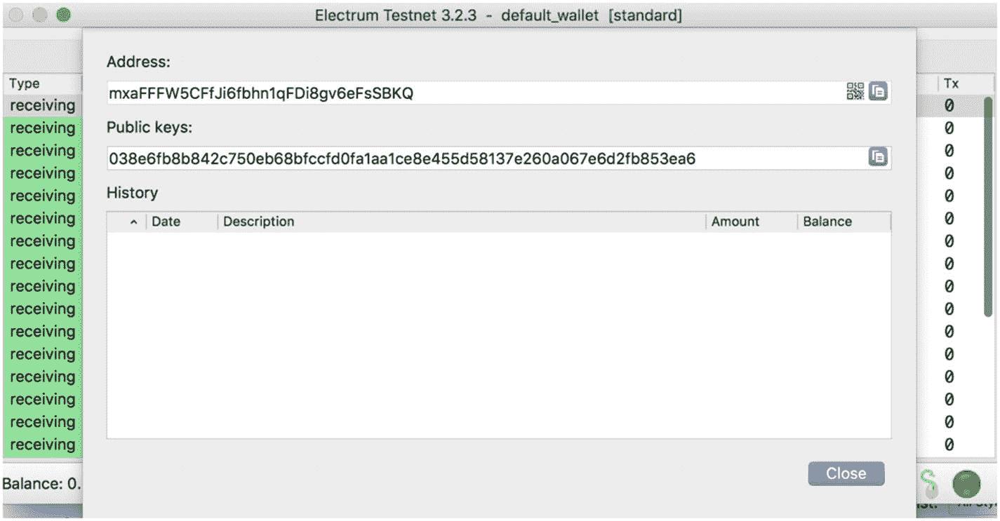

图 4-17
Electrum 标准钱包 - 地址和公钥

- 此处是示例钱包地址：`mxaFFFW5CFfJi6fbhn1qFDi8gv6eFsSBKQ`
- 此处是示例公钥：`038e6fb8b842c750eb68bfccfd0fa1aa1ce8e455d58137e260a067e6d2fb853ea6`

接下来，你将通过命令行 RPC 为你的联合签名者创建一个新地址。

```
> bitcoin-cli getnewaddress
2Msggcttx7wDDbcib6yD8ng2oKRdq8Bz4wV
```

接着，你可以设置两个联合签名者的地址。

```
> address1=2Msggcttx7wDDbcib6yD8ng2oKRdq8Bz4wV
> address2=mxaFFFW5CFfJi6fbhn1qFDi8gv6eFsSBKQ
```

通过 `validateaddress` 命令确保地址正确。

```
> bitcoin-cli validateaddress $address2
```

你需要两个联合签名者的公钥来创建你的联合签名者钱包。你已经有了 Electrum 钱包的公钥；现在你需要比特币核心的 RPC 公钥。为此，你可以使用 `getaddressinfo` 命令查看 RPC JSON 响应中的 `pubkey` 变量。

```
> bitcoin-cli getaddressinfo $address1
{
"address": "2Msggcttx7wDDbcib6yD8ng2oKRdq8Bz4wV",
"scriptPubKey": "a91404d0a132b5796d4462f39865d56af4ff7255d1b287",
"ismine": true,
"iswatchonly": false,
"isscript": true,
"iswitness": false,
"script": "witness_v0_keyhash",
"hex": "001440bbb1a949badb3a12a941a44bc994f7127c595c",
"pubkey": "034ffed96ffc416b90daa97df5c09b618d7fbf99076ed8100900cfa0890e763ac0",
"embedded": {
"isscript": false,
"iswitness": true,
"witness_version": 0,
"witness_program": "40bbb1a949badb3a12a941a44bc994f7127c595c",
"pubkey": "034ffed96ffc416b90daa97df5c09b618d7fbf99076ed8100900cfa0890e763ac0",
"address": "tb1qgzamr22fhtdn5y4fgxjyhjv57uf8ck2u4glnj9",
"scriptPubKey": "001440bbb1a949badb3a12a941a44bc994f7127c595c"
},
"label": "",
"timestamp": 1541782726,
"hdkeypath": "m/0'/0'/9'",
"hdseedid": "572deaa922cbf31076701942878c3e5fc2e23b60",
"hdmasterkeyid": "572deaa922cbf31076701942878c3e5fc2e23b60",
"labels": [
{
"name": "",
"purpose": "receive"
}
]
}
```

现在，你已经准备好通过 `createmultisig` 命令创建你的联合签名者多重签名地址，因为你已经拥有了两个联合签名者的公钥。

```
> bitcoin-cli -named createmultisig nrequired=2 keys="'["034ffed96ffc416b90daa97df5c09b618d7fbf99076ed8100900cfa0890e763ac0","038e6fb8b842c750eb68bfccfd0fa1aa1ce8e455d58137e260a067e6d2fb853ea6"]"'
{
"address": "2MtBkhgVLJ6VA1nFbjam36iUY1dCiWFf4ix",
"redeemScript": "5221034ffed96ffc416b90daa97df5c09b618d7fbf99076ed8100900cfa0890e763ac021038e6fb8b842c750eb68bfccfd0fa1aa1ce8e455d58137e260a067e6d2fb853ea652ae"
}
```

接下来，你需要挑选一个 UTXO `txid` 和 `vout` 来签署你的交易，就像你在之前的原始交易中所做的那样。

```
> bitcoin-cli listunspent
[
{
"txid": "ea3fb46ab103d15120e02ed6b60e3d83b265fed26794e3ed739496b62445410b",
"vout": 0,
...
]
```

然后设置 `utxo_txid` 属性。

```
> utxo_txid=ea3fb46ab103d15120e02ed6b60e3d83b265fed26794e3ed739496b62445410b
> utxo_vout=0
> recipient="mv4rnyY3Su5gjcDNzbMLKBQkBicCtHUtFB"
> rawtxhex=$(bitcoin-cli -named createrawtransaction inputs="'[ { "txid": "'$utxo_txid'", "vout": '$utxo_vout' } ]"' outputs="'{ "'$recipient'": 0.001}"')
```

现在解码并设置 `hexstring` 属性。

```
> bitcoin-cli -named decoderawtransaction hexstring=$rawtxhex
> bitcoin-cli signrawtransactionwithwallet $rawtxhex
{
"hex": "020000000001010b414524b6969473ede39467d2fe65b2833d0eb6d62ee02051d103b16ab43fea0000000017160014040c578cf60bf00980bfde1920f54459eaab3a09ffffffff01a0860100000000001976a9149f9a7abd600c0caa03983a77c8c3df8e062cb2fa88ac024730440220603883ace41bdf5cf85c87e80f7362b45e35949114f46ac5e5b89f5e13d8d95002205c5eb45ca7de8b2da88c41c4311711beb14e8e0d679e40d1fbc2cb8e81e053fb01210205e848e0f22dfe0c428d02c356d0c9a8d064a789a6bbcaa43a245d701948aba200000000",
"complete": true
}
```

最后，通过 `signedtx` 命令签署你的交易。

```
> signedtx="020000000001010b414524b6969473ede39467d2fe65b2833d0eb6d62ee02051d103b16ab43fea0000000017160014040c578cf60bf00980bfde1920f54459eaab3a09ffffffff01a0860100000000001976a9149f9a7abd600c0caa03983a77c8c3df8e062cb2fa88ac024730440220603883ace41bdf5cf85c87e80f7362b45e35949114f46ac5e5b89f5e13d8d95002205c5eb45ca7de8b2da88c41c4311711beb14e8e0d679e40d1fbc2cb8e81e053fb01210205e848e0f22dfe0c428d02c356d0c9a8d064a789a6bbcaa43a245d701948aba200000000"
```

你已经准备好使用 `sendrawtransaction` 值发送交易了。

```
> bitcoin-cli sendrawtransaction $signedtx
```

### 可替换交易与锁定时间

使用 `createrawtransaction` 命令创建 `RawTransaction` 时，可以包含两个可调用的附加变量：`locktime` 和 `replaceable`。

```
createrawtransaction [{"txid":"id","vout":n},...] [{"address":amount},{"data":"hex"},...] ( locktime ) ( replaceable )
```

您可以通过以下链接详细了解这些参数：
[`https://bitcoincore.org/en/doc/0.17.0/rpc/rawtransactions/createrawtransaction/`](https://bitcoincore.org/en/doc/0.17.0/rpc/rawtransactions/createrawtransaction/)

顾名思义，`replaceable` 允许一笔原始交易被另一笔手续费更高的新交易替换。当您设置的手续费过低导致交易无法通过时，就会发生这种情况。例如，如果您试图支付的手续费过高，可能会收到以下错误信息：

```
absurdly-high-fee, 11563419 > 10000000 (code 256)
```

Bitcoin Core 在原始交易中支持 `locktime` 参数；该参数允许您在未来的某个时间发送交易，并且在交易发送前，发送方可以取消交易。

有两种选项。小数值使用区块高度，大数值使用 UNIX 时间戳。这些参数意味着交易只有在条件满足时才会被插入区块。

#### 注意

区块高度是指链上任意区块与创世区块之间的区块数量。

### 比特币彩色币

比特币交易拥有一个名为 `OP_RETURN` 的属性。该属性最多可容纳 80 字节的数据，可用于传递数据。这看似不多，但对于所有权证明或传递少量数据进行验证来说已经足够。利用 `OP_RETURN` 属性是通过在交易的 `vout` 属性中设置数据代码字来实现的。要传递您希望包含在交易中的数据，您仍然需要发送资金才能使交易被包含在区块链中，但如果您不想向他人付款，可以将收款方设置为自己的钱包。这样，您就能将数据存储在比特币持久化区块链中，并且由于不需要向任何人付款，只需支付交易手续费。

#### 注意

`OP_RETURN` 是定义交易有效或无效的操作码脚本；它可用于将数据插入交易，从而将该数据存储在比特币区块链中。请记住，关于是否可以利用该属性存在不同意见。有些人认为在区块链中存储非货币数据不是一个好主意，因为存在成本更低、效率更高的数据存储方式；这实际上取决于具体用途。

### 发送包含 OP_RETURN 的交易

在设置交易之前，您需要引入一个名为 `jq` 的轻量级小型实用程序，以简化创建 `RawTransaction` 对象的过程。这是一个命令行 JSON 处理器，您可以用它在终端中处理 RPC JSON。您可以从 [`https://stedolan.github.io/jq/download`](https://stedolan.github.io/jq/download) 下载它。

使用 Brew 安装。

```
> brew install jq
```

`jq` 实用程序允许您检索返回的 JSON 片段，从而能够更快、更少出错地处理交易。

接下来，您可以设置一些数据，通过 `OP_RETURN` 参数发送。此示例将为文件创建一个 MD5。在实际应用中，这可以是双方之间的合同版本，或者您需要的任何代码片段。

#### 注意

消息摘要算法 5（MD5）是一种生成 128 位哈希值的函数。通常，它会创建一个包含校验和的文件，以确保数据的完整性，因为每次文件更改都会产生新的 MD5 结果。

您可以选择 Bitcoin Core 的某个核心文件，例如 `config.log`，来生成 MD5 哈希值并设置 `op_return_data` 变量。

```
> md5 config.log
MD5 (config.log) = 634ef85e038cea45bd20900fc97e09dc
> op_return_data="634ef85e038cea45bd20900fc97e09dc"
```

正如您在本章前面所见，您可以使用 `listunspent` 命令选择要花费的 UTXO。

```
> bitcoin-cli listunspent
```

现在，使用 `jq` 实用程序，您可以流式处理该过程，这样就不需要进行复制粘贴，并能避免错误。

```
> utxo_txid=$(bitcoin-cli listunspent | jq -r '.[0] | .txid')
> utxo_vout=$(bitcoin-cli listunspent | jq -r '.[0] | .vout')
> recipient=$(bitcoin-cli getrawchangeaddress)
```

请注意以下几点。这里设置了第一个 JSON 项 `[0]`，但您可以设置任何需要的项，例如 `[1]` 或 `[2]`。另外，请注意您需要运行 `listunspent` 命令来查找 UTXO 的“金额”。在本例中，金额为 `0.1166341`，由于您希望支付 `0.00000200` 作为手续费（200 聪），您总共将发送 `0.1166321`。

如果您没有正确设置手续费，最终可能会支付过高的手续费，或者收到如下错误信息：

```
-    min relay fee not met, 29  10000000 (code 256)
```

您可以使用 `echo` 命令确保变量设置正确。然后，您可以继续设置您的交易数据。

```
> rawtxhex=$(bitcoin-cli -named createrawtransaction inputs="'[ { "txid": "'$utxo_txid'", "vout": '$utxo_vout' } ]"' outputs="'{ "data": "'$op_return_data'", "'$recipient'": 0.1166321}"')
```

接下来，您需要签署并发送交易。

```
> signedtx=$(bitcoin-cli signrawtransactionwithwallet $rawtxhex | jq -r '.hex')
> bitcoin-cli sendrawtransaction $signedtx
43a14c3b1ac446e4774c5338e5ae4e23839ab65a38c45da8b790f4449b090ae5
```

现在，您可以在测试网区块链浏览器账本上跟踪 `RawTransaction` 对象，如图 4-18 所示。URL 如下：
[`https://live.blockcypher.com/btc-testnet/tx/43a14c3b1ac446e4774c5338e5ae4e23839ab65a38c45da8b790f4449b090ae5/`](https://live.blockcypher.com/btc-testnet/tx/43a14c3b1ac446e4774c5338e5ae4e23839ab65a38c45da8b790f4449b090ae5/)

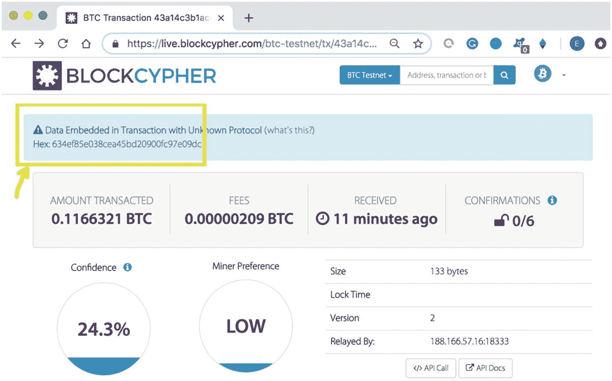

**图 4-18** 测试网区块浏览器，包含数据的交易

如图 4-18 所示，您会看到“交易中嵌入了未知协议的数据”这条消息。如果您要设计某种定期使用此方法的软件，您需要包含一个关键词来标识您的数据。

### 比特币的彩色币

“彩色币”这个名称源于 Bitcoin Core 较早版本的 EPOBC 协议，在该协议中，资产与聪相关联（因此称为“着色”）。现在，您可以通过 `OP_RETURN` 参数实现着色。

`OP_RETURN` 为您的币着色，并为比特币区块链提供了新功能，因为您能够嵌入提供所有权证明的数据。您还可以设置在特定时间触发的其他条件，或传递与您插入到区块链的交易相关的数据。`OP_RETURN` 非常强大，在本书后面，您将看到 `OP_RETURN` 如何在生产级项目中用于解决各种问题。

## 总结

在本章中，你深入研究了比特币核心 RPC。你生成了一个传统钱包和一个 SegWit 比特币钱包，并能够检索钱包的私钥，更好地理解了椭圆曲线数字签名算法（ECDSA）以及公钥和私钥是如何生成的。

本章大部分时间都在研究交易；你通过比特币守护程序在测试网上发送了币，并利用比特币核心钱包图形界面发送了币。发送完成后，你学习了如何在比特币的区块浏览器中查看交易。接着，你研究了 `RawTransaction`，并学会了如何生成单笔输出的交易，以及通过 Electrum 和命令行生成涉及多个签名者的更复杂交易。

此外，你还学习了其他选项，例如为更改手续费而替换交易，以及设置 `locktime` 变量。你了解了 P2PKH 和 P2SH-SEGWIT 之间的区别。最后，我介绍了如何使用 `OP_RETURN` 参数传递数据，这可用于比特币染色币，或者仅仅为了利用比特币区块链传递附加数据，而不仅仅是花费币。在下一章中，你将更深入地研究以太坊以及如何编写智能合约。