# 5. 以太坊钱包与智能合约

在第 1 章中，我在介绍比特币、山寨币和不同共识机制时提到了以太坊。具体来说，我介绍了以太坊的工作量证明（PoW）共识机制，以及如何利用以太坊让开发者创建自己的智能合约和代币。我提到以太坊代币可以作为以太坊征求意见（ERC）生成，例如 ERC-20、ERC-223 或 ERC-777。在第 3 章中，你创建了自己的区块链，并且我介绍了比特币钱包和交易。

在本章中，我将更详细地展开介绍以太坊。以太坊允许你创建代码（*智能合约*）来处理资金，利用区块链技术来克服停机时间和第三方干扰。以太坊平台主要归功于 Vitalik Buterin 和 Gavin Wood。根据以太坊网站的说法，以太坊的定义如下：

> *“以太坊是一个运行智能合约的去中心化平台：应用程序完全按照编程方式运行，不会出现停机、审查、欺诈或第三方干扰。”*
>
> ——Ethereum.org

在前面的章节中，你能够传递和存储数据，例如使用`OP_RETURN`参数的比特币染色币用例。这很有用，因为你可以生成文件的 MD5 哈希并将其存储在比特币网络上。你存储的 MD5 可以是文档、合同或任何你想要的东西。然而，正如你所见，比特币仅限于存储信息，你无法与数据进行交互。具体来说，你能够在网络上传递和存储数据，但无法针对你的文件运行代码，例如对数据执行操作。以太坊通过允许你利用区块链的力量创建智能合约，解决了这种功能缺失的问题。

#### 注意

智能合约是用于处理资金的可编程代码。代码自行运行，无需第三方参与。Solidity 是一种流行的以太坊面向合约编程语言，可用于编写智能合约并将代码部署到多个区块链上。

以太坊的核心是以太坊虚拟机（EVM）。EVM 是智能合约在以太坊中运行的地方。帮助你理解 EVM 的一个好方法是，将 EVM 视为一个分布式的全球计算机，智能合约可以在其上执行。

#### 注意

EVM 是一台分布式的全球计算机，用于运行任意的、算法化的、复杂的代码。更简单地说，EVM 由以太坊网络中的所有节点组成，这些节点连接成一个单一的共识体，能够接收智能合约的代码，处理并执行它。EVM 使用 256 位作为基本共识机制；它可以处理 1 TB 的区块，标准区块时间为 15 秒。

去中心化应用程序（dapp）开发者编写智能合约，然后借助前端代码在 EVM 上运行代码。见图 5-1。EVM 在所有连接的以太坊节点上以并行连接的方式执行代码。这确保了节点的共识。在撰写本文时，以太坊区块链的大小可能达到 1 TB，而比特币的区块高度限制为每个区块 4 MB。此外，比特币创建新区块大约需要 10 分钟，而 EVM 上仅需 15 秒。

尽管去中心化代码作为单一共识运行是有利的，但也存在缺点。例如，智能合约的代码比传统计算机更慢、更昂贵，因为它要在所有节点上运行。

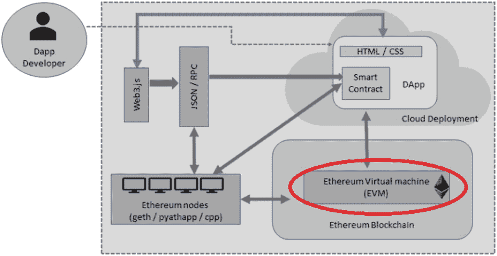

图 5-1

以太坊万米高空视角。图片来源：xbt.net。

要运行以太坊矿工，你需要运行一个全节点 EVM。矿工像比特币一样运行工作量证明（PoW）共识机制来验证交易。在挖矿过程中，每个区块会挖出五个币。正如你在第 1 章中看到的 NEO 一样，以太坊矿工会通过运行智能合约获得以太币作为报酬，这些以太币会被转换成所谓的*Gas*。

#### 注意

以太坊 Gas 是以太坊代币的一个极小单位。以太坊 Gas 由合约兑换并使用，用于支付矿工的工作。想象一辆汽车，它需要汽油才能运行，以太坊也是如此。没有以太坊 Gas，你就无法执行智能合约。

由于以太坊提供了构建有趣应用程序的能力，该平台因其潜力而受到认可，并以各种方式被微软、英特尔、亚马逊、摩根大通甚至政府所利用。这使以太坊变成了一个庞大的生态系统，提供了许多可供选择的方案，帮助你轻松创建智能合约。你可以从大量的开发工具、与其他工具通信的应用程序、最佳实践、基础设施、测试、安全、监控工具等中进行选择。

选择要使用的工具可能会让人不知所措和困惑，尤其是当许多工具仍处于 alpha、beta 阶段或未经充分测试时。但是请记住，到目前为止，你已经具备了区块链技术的基本理解，包括交易、钱包以及它们的工作原理。此外，你在第 3 章中开发的区块链是使用 Node.js 的 JavaScript 编写的，而 Node.js 是许多以太坊工具的基础。有两个列表我建议你收藏，如下所示：

*   [`https://github.com/ConsenSys/ethereum-developer-tools-list`](https://github.com/ConsenSys/ethereum-developer-tools-list)
*   [`https://github.com/ConsenSys/ethereum-developer-tools-list/blob/master/EcosystemResources.md`](https://github.com/ConsenSys/ethereum-developer-tools-list/blob/master/EcosystemResources.md)

这些资源提供了与以太坊相关的所有开发工具和资源的详尽列表。涵盖所有这些不同的工具超出了本书的范围，但我建议你在某个时间点研究一下这些工具，特别是如果你专注于以太坊开发，这样你就可以自行判断哪种工具最适合你的项目。

在本章中，我将重点介绍以太坊智能合约，并在测试网上运行它们，就像你在前面章节中对比特币所做的那样。我将展示如何设置你的开发工具和集成开发环境（IDE），并提供有关去中心化应用程序（dapp）主网部署的基本信息，我将在本书后续章节中对此进行详细阐述。


### `Ganache` 模拟全节点客户端

`Ganache`（之前被称为 `ethereumjs-testrpc`）允许你在自己的机器上运行一个以太坊模拟全节点客户端，并通过命令行界面与你的合约进行交互。这个工具非常有用，因为你将建立一个开发网络和一个私有测试网络来测试你的智能合约代码。

正如你在上一章所见，搭建一个测试网络可以让你在将代码部署到主网之前，使用虚拟货币来测试代码。我决定在本章中使用 `Ganache`，因为它是 `Truffle` 开发套件的一部分，并且与 `Truffle` 集成良好。

#### 安装 `Ganache`

首先，你可以通过 `npm` 全局安装 `Ganache`，并通过调用 `help` 命令来确认其是否正确运行。

```
> npm install -g ganache-cli
> ganache-cli help
```

如果你遇到安装问题，或想获取关于该工具的更多信息，请访问 `Ganache` 的 GitHub 页面：[`https://github.com/trufflesuite/ganache-cli`](https://github.com/trufflesuite/ganache-cli)。你也可以通过运行以下命令来检查 CLI 的版本：

```
> ganache-cli -v
```

该命令会输出版本信息。在撰写本书时，`Ganache` CLI 的版本是 v6.4.3（`ganache-core`: 2.5.5）。

#### `Ganache` CLI：监听端口

你可以在开发和调试合约时，在自己的机器上运行 `Ganache`。为此，你需要在终端中设置 `Ganache` CLI，使其监听你将在本章稍后在 `truffle.js` 中设置的端口。

```
> ganache-cli -p 8584
```

请注意，此刻没有任何程序在 8584 端口上运行，因此我们假设你将设置端口 8584。该命令应输出以下内容：

```
Listening on 127.0.0.1:8584
```

## 用于 Solidity 的 `IntelliJ IDEA` 插件

在第 3 章中，你下载并使用了 `WebStorm` 作为你的集成开发环境来开发区块链。`WebStorm` 是 `IntelliJ IDEA` 的一个子集，并且有一个针对 `Solidity` 语言的插件，这为编写合约提供了一种简便的方法。此外，它还提供高亮显示和代码补全功能，使开发更加容易。你可以使用之前安装的 `WebStorm` 版本，只需添加 `Solidity` 插件即可。为此，首先在此处下载插件：[`https://plugins.jetbrains.com/plugin/9475-intellij-solidity`](https://plugins.jetbrains.com/plugin/9475-intellij-solidity)。

要安装该插件，请遵循以下步骤：

1.  选择 `WebStorm` ➤ 偏好设置（或按 `command + ,` 键）。
2.  选择 `Plugins`。
3.  在“插件”中搜索“`Solidity`”。它会显示“未找到插件。”并附带一个“在仓库中搜索”的链接。点击“在仓库中搜索”链接。将会显示“Intellij-Solidity”插件。见图 5-2。
4.  安装两个“Intellij-Solidity”插件：LANGUAGES 和 INSPECTION。见图 5-2。
5.  点击 `IntelliJ-Solidity` ➤ 安装。见图 5-2。
    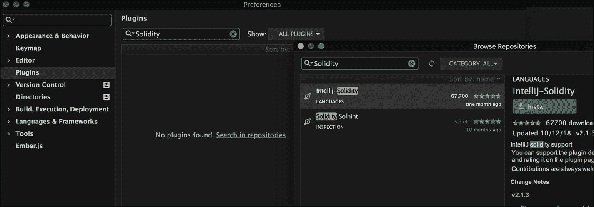
    图 5-2
    在 `WebStorm` 中安装 `IntelliJ-Solidity` 和 `Solidity Solhint`
6.  在 `Plugins` 下搜索 `Solidity Solhint`。它会显示“未找到插件。”并附带一个“在仓库中搜索”的链接。点击“在仓库中搜索”链接。点击 `Solidity Solhint INSPECTION` ➤ 然后点击安装。
7.  重启 `WebStorm`。

请注意，如果你是 Visual Studio 的爱好者，Visual Studio 也有一个 `Solidity` 扩展；参见 [`https://marketplace.visualstudio.com/items?itemName=ConsenSys.Solidity`](https://marketplace.visualstudio.com/items%253FitemName%253DConsenSys.Solidity)。在撰写本书时，该插件仅适用于 Visual Studio 2015 或更早版本。

请记住，一如既往，你可以使用你喜欢的集成开发环境、文本编辑器，甚至是 `vim` 来编写代码；没有必要购买集成开发环境。

## `Truffle` 套件

你将使用 `Truffle`，因为它是最流行的工具之一，并且拥有有助于加快开发周期的集成库。`Truffle Suite` 包括 `Truffle`、`Ganache` 和 `Drizzle`；见图 5-3。

> *“Truffle 是一个针对以太坊的开发环境、测试框架和资源管道，旨在让以太坊开发者的生活变得更轻松。”*
>
> *—* [`https://github.com/trufflesuite/truffle`](https://github.com/trufflesuite/truffle)

`Truffle` 文档中包含了安装说明，可以在 [`https://truffleframework.com/docs`](https://truffleframework.com/docs) 找到。

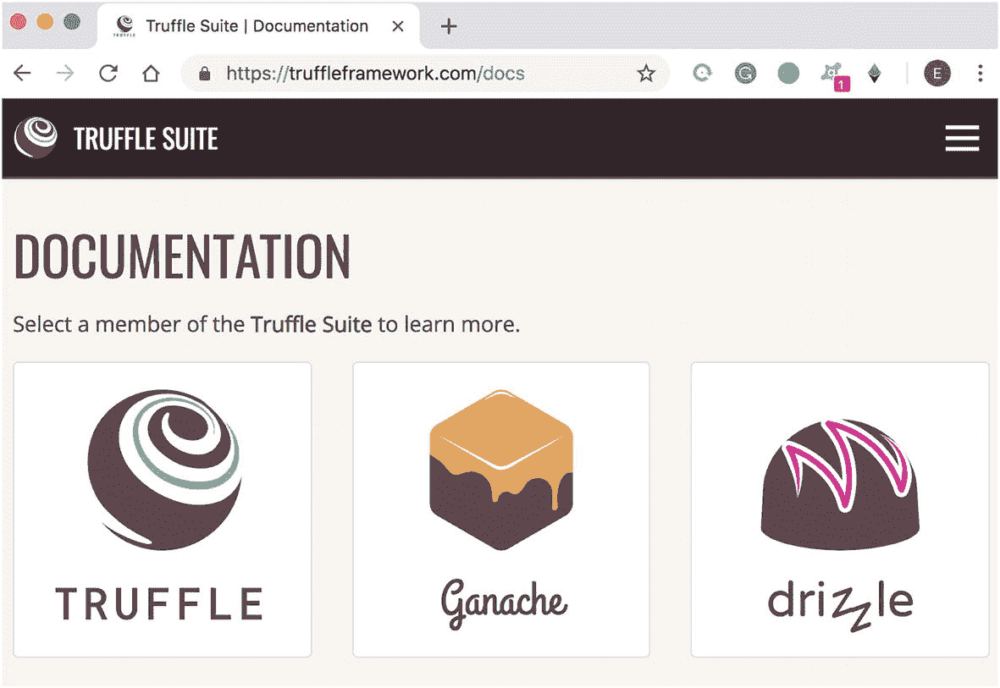
图 5-3
`Truffle Suite` 文档

要开始，请打开一个新的终端窗口，并在你的机器上全局安装 `Truffle`（在撰写本书时，当前 `Truffle` 版本是 5.0.14）。然后运行 `help` 命令来查看所有可用命令的列表，以确保其安装正确。

```
> npm install -g truffle
+ truffle@5.0.14
> truffle help
Truffle v5.0.14 - a development framework for Ethereum
Usage: truffle <command> [options]
```

### 创建你的智能合约

首先，让我们创建你的文件夹并初始化 `Truffle` 向导，以生成开始所需的所有代码。在终端中，输入以下内容：

```
> mkdir MySmartContract && cd $_
> truffle init
```

这些命令创建了一个名为 `MySmartContract` 的文件夹，并将目录位置更改到新项目；然后，`truffle init` 命令初始化该项目。你可以在图 5-4 中看到输出。

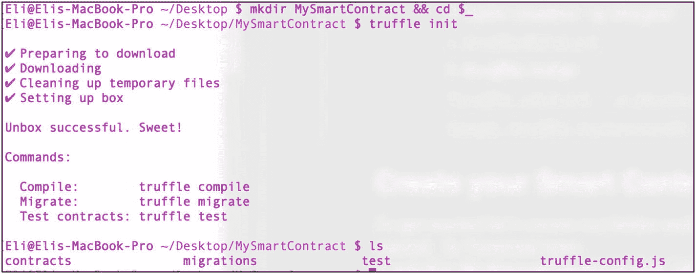
图 5-4
创建 `MySmartContract` 项目并使用 `truffle init` 命令进行初始化

接下来，打开 `WebStorm`，并通过选择 `File` ➤ `Open` 打开你创建的项目。导航到 `MySmartContract` 项目目录并点击 `Open`。`WebStorm` 将打开该项目，如图 5-5 所示。

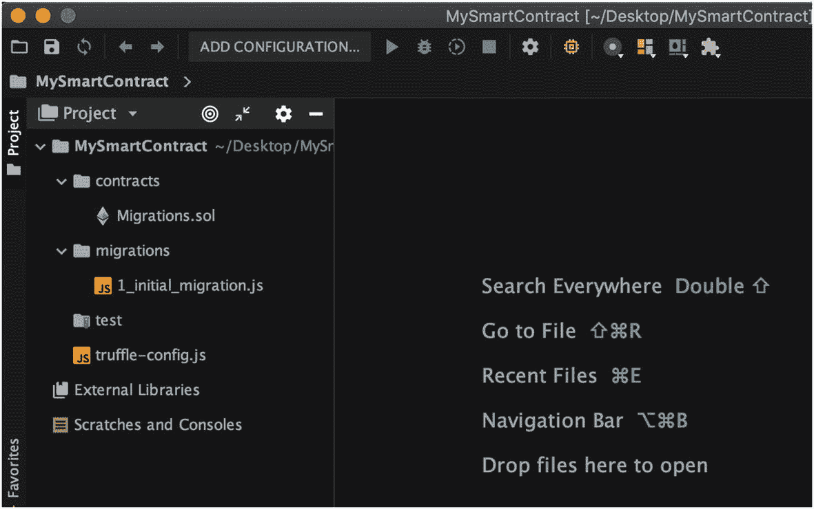
图 5-5
在 `WebStorm` 中打开的 `MySmartContract`

EVM 支持许多编程语言，如 Solidity、JavaScript、GO、C++、Python、Java、Ruby、Web Assembly、Rust 和 Haskell。在本节中，你将使用 Solidity，因为它是目前针对智能合约最流行的以太坊编程语言。Solidity 基于 ECMAScript，并受到 JavaScript、C++ 和 Python 的影响。Solidity 有一个优势，就是除了以太坊之外，你还可以将你的智能合约交易部署到其他各种区块链平台上，例如以太坊经典、Tendermint、ErisDB 和 Counterparty。

Solidity 使用 `.sol` 文件扩展名；实际上，如果你检查项目中的 `contracts` 文件夹，你会发现一个名为 `Migrations.sol` 的文件，如图 5-5 所示。这个文件是在你初始化 `Truffle` 向导时自动生成的。迁移文件帮助你向以太坊网络部署合约。随着项目的发展，你将创建新的迁移文件。


### 将 Truffle 连接至 Ganache 网络

接下来，你需要自定义环境，将网络命名为`development`，并设置 URL 和端口。回想一下，你已经运行了 Ganache，并将网络监听地址设为`127.0.0.1`，端口`8584`。你将使用这些设置将合约部署到你的以太坊区块链网络上。

首先，打开`MySmartContract/truffle-config.js`，在`network`对象内添加一个包含以下配置的`development`对象：

```
module.exports = {
networks: {
development: {
host: "127.0.0.1",
port: 8584,
network_id: "∗",
gas: 4712388,
gasPrice: 100000000000
}
}
}
```

你已设置了`host`（主机）、`port`（端口）、`network_id`（网络 ID）以及`gas`（燃料）和`gasPrice`（燃料价格）参数。以下是 Truffle 文档（`https://truffleframework.com/docs/truffle/reference/configuration#networks`）中的说明：

- `gas`：部署时使用的燃料限制。默认值为`4712388`。
- `gasPrice`：部署时使用的燃料价格。默认值为`100000000000`（100 Shannon）。

你设置的是默认值，你也可以通过省略`gas`和`gasPrice`标签来达到相同的效果；不过，对于正式主网，在撰写本文时，我建议将燃料价格设置为 21,000，这是一个合理的值。请参考 ETH Gas Station（`https://ethgasstation.info/`）来确定具体的`gasPrice`值，如图 5-6 所示。

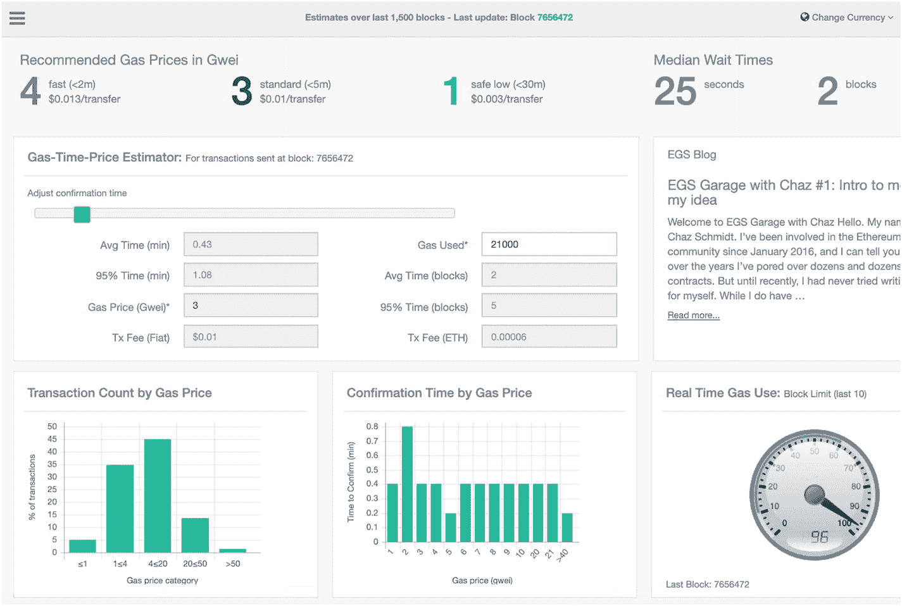

**图 5-6** Ethgasstation.info 计算推荐的燃料价格

如图所示，在撰写本文时，支付 0.014 美元的法币即可获得标准的 5.6 秒交易时间。

你目前仅设置了一个开发环境；但当你将代码从开发环境迁移到公共测试网络，再到生产环境时，可以在`truffle-config.js`文件中添加更多环境。

### “Hello, World”智能合约

如前所述，智能合约是以太坊区块链上的账户对象；你可以编写函数来与其他合约交互、发送代币、做出决策以及存储数据。通常来说，智能合约被构建为去中心化的；但请记住，也可以通过编程添加监管选项，使其中心化。例如，以太坊 Gemini 美元提供了冻结交易甚至撤销交易的选项，而其他代币可以由所有者构建自毁功能。

你将从创建一个简单的“Hello, World”合约开始。这是最小化的代码，此处目的并非创建有用的东西，而是帮助你理解如何创建智能合约。

在终端中，进入项目目录，使用`truffle`命令创建一个新合约，并命名为`HelloWorldContract`。

```
> truffle create contract HelloWorldContract
```

如果 CLI 正确无误地运行，它不会输出任何内容。

接下来，打开你创建的合约，它位于`contracts/HelloWorldContract.sol`路径下。如你所见，Truffle 向导已经为你创建了合约。

这第一个智能合约是一个最小化的可运行示例；它仅存储一条消息，并允许你通过调用主函数来检索该消息。用以下代码替换`contracts/HelloWorldContract.sol`中的现有内容：

```
pragma solidity ⁰.5.0;
contract HelloWorldContract {
string greeting;
constructor() public {
greeting = 'Hello World';
}
function greet() public view returns (string memory) {
return greeting;
}
}
```

如你所见，Solidity 脚本语言类似于 JavaScript 或 C++，易于阅读。第一行代码是 Solidity 编译器版本；你将使用`0.5.0`版本。在`HelloWorldContract`构造函数中，你将`greeting`变量设置为`'Hello World'`。主函数是`greet()`。一旦调用主函数，你就可以检索`greeting`变量的值。

### “MD5SmartContract”智能合约

现在你将创建第二个更实用的合约。这个合约将允许你存储上一章中保存的 MD5 哈希值，但这次你可以与之交互，而不仅仅是把 MD5 数据存储在区块链上。

在终端中，进入项目目录，使用`truffle`命令创建一个新合约，并命名为`MD5SmartContract`。

```
> truffle create contract MD5SmartContract
```

接下来，打开你创建的合约，它位于`contracts/RegisterContract.sol`路径下。你将运行以下合约：

```
pragma solidity ⁰.5.0;
contract MD5SmartContract {
bytes32 public signature;
event signEvent(bytes32 signature);
constructor() public {
}
function sign(string memory document) public {
signature = sha256(bytes(document));
emit signEvent(signature);
}
}
```

代码创建了一个名为`signature`的变量。然后，你的主函数签署你的文档。你传入文档的 MD5 值，并使用 SHA256 对文档进行签名。一旦你签署了文档，就会触发一个事件。

**注：** 安全哈希算法（SHA）是众多密码哈希函数之一。密码哈希函数充当文本或数据的签名；它是单向的，无法解密。生成的 SHA256 哈希值是一个固定大小的 256 位（32 字节），并且几乎是唯一的。

### 为智能合约部署创建 Truffle 迁移文件

如前所述，Truffle 迁移文件帮助你在以太坊网络上部署合约。你需要为部署创建一个迁移文件。为此，创建一个新的部署文件，命名为`2_deploy_contracts.js`，并将其放置在`migrations/2_deploy_contracts.js`路径下。你可以像这样指向你创建的智能合约代码：

```
const HelloWorldContract = artifacts.require("HelloWorldContract.sol");
module.exports = function(deployer) {
deployer.deploy(HelloWorldContract);
};
```

创建另一个部署文件，命名为`3_deploy_contracts.js`，并将其放置在`migrations/3_deploy_contracts.js`路径下。

```
const MD5SmartContract = artifacts.require("MD5SmartContract.sol");
module.exports = function(deployer) {
deployer.deploy(MD5SmartContract);
};
```

此时，你的项目包含两个智能合约和迁移文件。你可以将你的项目目录和文件与我的进行比较；见图 5-7。

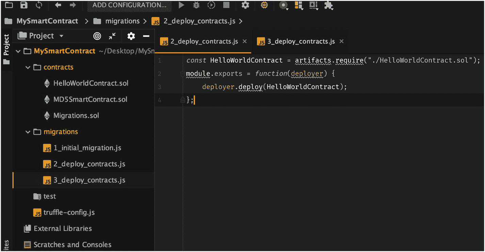

**图 5-7** MySmartContract 包含两个智能合约和迁移文件

对于更懒的开发人员，另一种技术是使用 Truffle 创建向导生成迁移文件。

```
> truffle create migration deploy_my_contract
```

此命令会自动为你生成迁移文件。

### 使用 Truffle 编译智能合约

在另一个终端窗口中，运行 Truffle 来编译你的智能合约。`compile`命令将你的 Solidity 代码转换为 EVM 可解释的字节码。目前，Ganache 模拟了 EVM。

```
> truffle compile
```

你可以在`build/contracts/HelloWorldContract.json`和`build/contracts/MD5SmartContract.json`的 JSON 文件中查看合约的字节码。查找如下所示的`bytecode`标签：

```
"bytecode": "0x608060405234801561001057600080fd5b5061031...",
```

**注：** 请记住，理想情况下，在再次编译之前，你应该手动删除合约的`contracts/*.json`文件。这将确保编译的是最新的代码，因为 CLI 并非总能立即识别更改。


### 将智能合约部署到你的开发网络

现在你已经有了从智能合约编译出的字节码，可以将字节码迁移到开发环境中，以便运行迁移命令切换到你在 `truffle.js` 文件中设置的网络。

```
> truffle migrate --network development
```

运行此命令将返回如图 5-8 所示的响应。这表示三个迁移文件已成功部署到网络上。每个合约都部署成功。

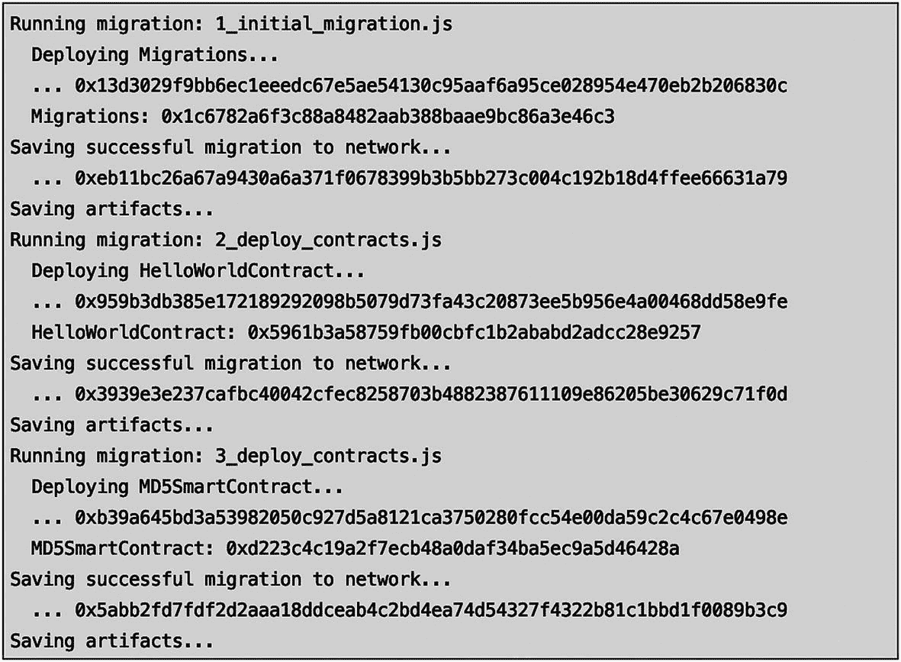

图 5-8

Truffle migrate 命令响应

请记住，当你更改代码时，`--reset` 标志很有用，因为你需要重新编译并重新部署。

```
> truffle migrate --reset
```

## Truffle 控制台

现在你的合约已部署到开发网络，你可以通过 Truffle CLI 与智能合约进行交互。为此，你可以打开一个控制台并将其连接到你的开发网络。

```
> truffle console --network development
```

运行 `console` 命令后，你的终端将显示你处于 Truffle CLI 开发模式。

```
truffle(development)>
```

要退出 CLI 模式，请在控制台中按两次 Control+C 或输入 `.exit`。

### 通过 Truffle CLI 与智能合约交互

你为智能合约设置了两个变量 `hello` 和 `sign`，以便与之交互。

```
truffle(development)> HelloWorldContract.deployed().then(_app => { hello = _app })
```

`undefined`

```
truffle(development)> MD5SmartContract.deployed().then(_app => { doc = _app })
undefined
```

要与你的 `HelloWorldContract` 合约交互，你可以调用你创建的主要公共函数，因为你暴露了 `greet` 函数。

```
truffle(development)> hello.greet()
'Hello World'
```

类似地，你可以与 `MD5SmartContract.sol` 合约交互。你将传入在第 3 章生成的相同 MD5 哈希值（`634ef85e038cea45bd20900fc97e09dc`），并调用你名为 `sign` 的主函数。该函数将生成一个 SHA256 哈希值，如图 5-9 所示。

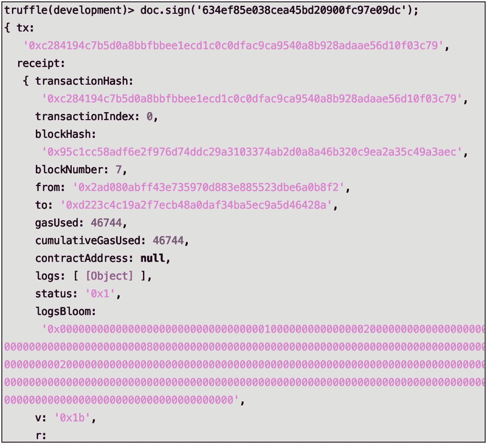

图 5-9

创建 doc.sign 交易

```
truffle(development)> doc.sign('634ef85e038cea45bd20900fc97e09dc')
```

现在你可以通过调用 `signature` 函数来确认你已获得一个 SHA256 哈希值；输出结果见图 5-10。

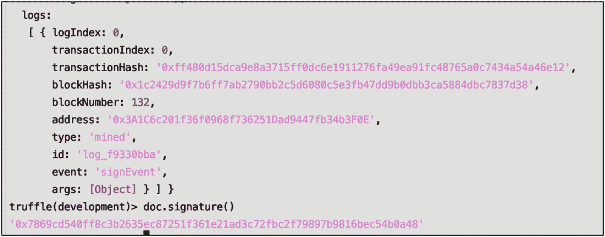

图 5-10

与 `MD5SmartContract` 智能合约交互以生成签名

```
truffle(development)> doc.signature()
'0x7869cd540ff8c3b2635ec87251f361e21ad3c72fbc2f79897b9816bec54b0a48'
```

你可以从此处下载整个智能合约项目：[`https://github.com/Apress/the-blockchain-developer/chapter5/step1/`](https://github.com/Apress/the-blockchain-developer/chapter5/step1/)。

## 使用 Remix 编译

到目前为止，你使用了 Truffle 工具、Ganache 网络和 WebStorm IDE 来创建、编译、部署和与合约交互；然而，还有一种更简单的方法。Remix 提供了一个在线 IDE，可以完成与 WebStorm 和 Truffle 相同的功能。

要体验此功能，请访问 Remix 网站：[`https://remix.ethereum.org`](https://remix.ethereum.org)。

粘贴你示例中的“Hello， World”智能合约代码。确保右侧面板设置为正确的编译器；你将使用“Current version:0.4.22”。然后点击“Start to compile (Ctrl-S)”。参见图 5-11。

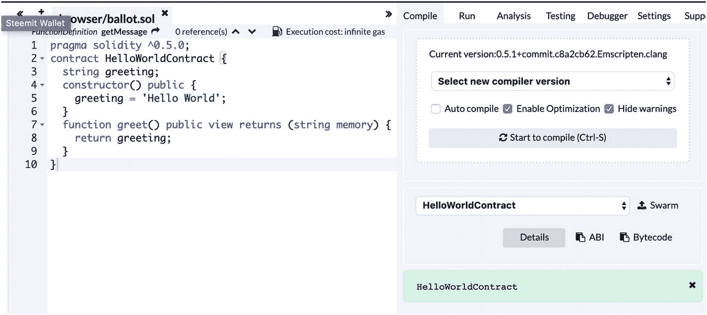

图 5-11

“Hello， World”智能合约

在你的项目中创建一个新文件夹并将其命名为 `remix`；然后创建一个文件并将其命名为 `HelloWorldContract.js`。点击 Remix 在线 IDE 中的 Details 按钮，复制 `WEB3DEPLOY` 内容并粘贴到你创建的 `HelloWorldRemix.js` 文件中，如图 5-12 所示。

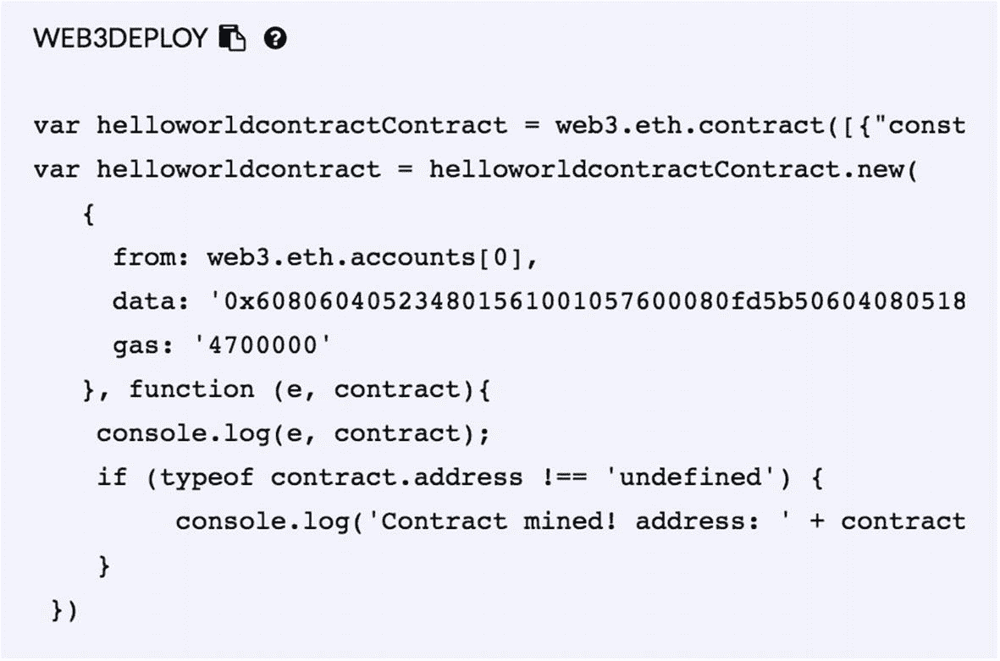

图 5-12

“Hello， World”智能合约 `WEB3DEPLOY` 代码

#### 注意

`web3.js` 是以太坊 JavaScript API；其库允许你通过 HTTP 或 IPC 连接与以太坊节点进行交互。`WEB3DEPLOY` 代码可以部署在本地或远程节点上。

## 使用 Geth 建立私有以太坊区块链

你已在本地机器上与智能合约进行了交互。接下来，建议运行一个完整节点并在测试网区块链上测试你的智能合约；这样可以在更真实的环境中进行测试。Geth 提供了一个用 Go 实现的完整以太坊节点，你可以在本地运行。这个私有测试网将允许你在与真实以太坊区块链隔离的环境中开发和测试当前的智能合约。

首先，使用 Brew 安装 Geth。

```
> brew tap ethereum/ethereum
> brew install ethereum
```

为了确保安装成功，运行 `--version` 命令查看当前 Geth 版本（撰写本文时我使用的是 1.8.27）。

```
> geth version
Version: 1.8.27-stable
```

### 初始化 Geth 私有区块链

现在你已经安装了 Geth，你将创建你的第一个区块，即第 0 个区块，也称为*创世*区块。创建一个名为 `genesis_block.json` 的文件并将其放在项目根目录下。现在只需粘贴提供的 JSON，但请注意，你可以使用此处的 Python 脚本生成自定义创世区块：[`https://blog.ethereum.org/2015/07/27/final-steps/`](https://blog.ethereum.org/2015/07/27/final-steps/)。

在本书的范围内，你将使用此脚本并将难度设置为较低的 1000，Gas 上限设置为 1000000，以便于挖矿和降低 Gas 费用；但在你自己的实验中，可以根据需要自由调整。请参见 `genesis_block.json`。

```
{
"config": {
"chainId": 1,
"homesteadBlock": 0,
"eip155Block": 0,
"eip158Block": 0
},
"difficulty": "0x1000",
"gasLimit": "0x1000000",
"alloc": {
"0x44dc998cbc1c7504bec0a96af4a9aef6606a768a":
{"balance": "0x1337000000000000000000"}
}
}
```

接下来，你将创建你的私有测试网。在终端中，运行此命令：

```
> geth --identity "MyTestNet" --nodiscover --networkid 1999 --datadir testnet-blockchain init genesis_block.json
```

你需要为你的 `testnet-blockchain` 创建一个账户；使用 `account` 命令。由于你运行的是本地测试网络，请选择一个简单的密码，但在主网上你需要注意安全性；这里我选择密码 123。

```
> geth account new --datadir testnet-blockchain
Passphrase: 123
Repeat passphrase: 123
Address: { a8eceb3e2dd7af9c6fdb12edd8a7e84290932c2d}
```

如你所见，选择密码后你收到了一个钱包地址。你可以将你的输出与我的进行比较，如图 5-13 所示。

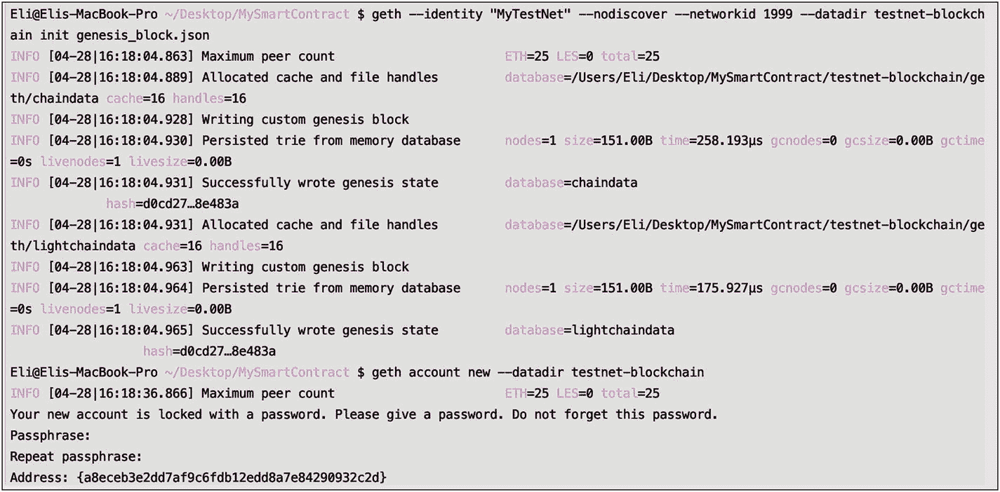

图 5-13

使用 Geth 创建私有测试网和钱包


### Geth 控制台

现在你已经设置好账户和 `testnet-blockchain` 链，可以打开一个 Geth 控制台与链进行交互。

```
> geth --identity "MyTestNet" --datadir testnet-blockchain --nodiscover --networkid 1999 console 2>> geth.log
```

注意，我使用了 `2>> geth.log` 参数将日志输出到自定义的文件位置。一旦 Geth 控制台启动，你可以运行 `eth.syncing` 命令来检查当前正在同步的区块。在这种情况下，它会返回 `false`，因为没有什么需要同步的；你是从本地网络的区块 0 开始的。

你会收到一个弹出式提醒，询问以下内容：

> *“是否允许应用程序“geth”接受传入的网络连接？点击“拒绝”可能会限制应用程序的行为。此设置可在“安全性与隐私”偏好设置的“防火墙”面板中进行更改。”选择“允许”。*

接下来，在 Geth 终端中，运行 `syncing` 命令。

```
geth> eth.syncing
false
```

如果你运行 `eth.blockNumber` 命令，它会返回 0，因为你还没有挖掘任何区块。

```
geth> eth.blockNumber

```

### 为你的私有测试网挖掘以太币

然后，你可以使用 `getBalance` 命令确认你的账户中有余额。

```
geth> eth.getBalance(eth.accounts[0])

```

使用 `eth.accounts` 命令，你将获得你创建的新账户。

```
geth> eth.accounts
["0xa2a6d8fe7e39645613e74fe19c79071ee52009ba"]
```

你可以在你创建的私有以太坊链上生成或挖掘以太币。无论如何，你需要知道如何挖矿，因为在测试代码时，你需要将交易包含在已挖掘的区块中。要开始挖矿，只需运行 `miner.start` 命令。

```
geth> miner.start()
null
```

同样，要停止挖矿，只需运行 `miner.stop` 命令。

```
> miner.stop()
null
```

如果你让挖矿持续运行，你将挖出一些区块，因此当你检查区块号时，会看到结果以及资金。

```
geth> eth.blockNumber

geth> eth.getBalance(eth.accounts[0])
8.36e+21
```

### 将 Remix 部署到 Geth

现在你的节点已同步，并且你知道如何挖矿，你可以将合约部署到测试网。首先，你需要解锁你的主 Geth 账户才能使用它。确保你的账户中有余额；否则，你将无法在网络上部署合约。在 Geth 上，使用你的密码解锁账户，以便 Geth 可以使用它。

```
geth> personal.unlockAccount(eth.accounts[0], "123", 24∗3600)
true
```

我使用了密码 `123`，但如果你使用了不同的密码，则需要将其更改为你的密码。接下来，加载你在 Remix 上生成的 `web3.js` 脚本。

```
> loadScript("remix/HelloWorldContract.js")
null [object Object]
true
```

挖掘下一个区块并包含此合约需要几秒钟；一旦挖掘完毕，你将收到以下消息：

```
Contract mined! address: 0x9905f1663f1b808d52dca42ce26e0d2648f8be07 transactionHash: 0x66b80787eb3eae16c9535a1bd86ff1a623c1914ac9ffc2addde74655aed09157
```

如果你没有看到此消息，请确保你正在挖矿。

```
geth> miner.start()
```

一旦合约被挖掘，你将在终端中收到以下消息，其中包含地址和交易哈希：

```
Contract mined! address: 0xe49da16551c5c5735de46e07e8ab9e713310a13b transactionHash: 0x36d3ec593f63280ca6aae1b079bfb6f00eea719468e04960643c23f39cbef5b3
```

### 将 Truffle 部署到 Geth

类似地，要通过 Truffle 部署 `web3.js` 合约脚本，你需要运行 `migrate --reset` 命令。`--reset` 标志告诉 Truffle 从头开始运行所有迁移。在运行 `migrate` 命令之前，确保使用 `.exit` 退出 Truffle 控制台。Truffle 会自动编译你的合约。

```
truffle(development)> .exit
> truffle migrate --reset
Using network 'development'.
Network up to date.
```

现在你可以再次打开一个开发控制台。

```
> truffle console --network development
truffle(development)> HelloWorldContract.deployed().then(_app => { hello = _app })
undefined
truffle(development)> hello.greet() 'Hello World'
```

合约已重新部署，你可以再次与合约交互。你可以从这里下载此步骤：[`https://github.com/Apress/the-blockchain-developer/chapter5/step2/`](https://github.com/Apress/the-blockchain-developer/chapter5/step2/)。

### Geth 中的常用命令

你可以通过按 Command+C 然后退出，或者通过 `aux` 检查是否有任何进程打开来停止 Geth 进程。或者，你可以使用 `killall` 命令来停止进程。

```
> ps aux | grep geth
> killall -HUP geth
```

任何时候，你都可以运行 `help` 标志来获取命令列表。

```
> geth –help
```

要获取待处理交易的列表，请运行以下命令：

```
> geth --identity "MyTestNet" --datadir testnet-blockchain --nodiscover --networkid 1999 console 2>> geth.log
geth> eth.pendingTransactions
```

要从公共测试网中删除本地同步的区块链数据，请使用以下命令：

```
geth> geth removedb
```

要删除私有区块链测试网数据，请使用以下命令：

```
geth> geth removedb --datadir test-net-blockchain
```

为了更快地同步区块链，请使用 `--fast` 标志执行快速以太坊同步。请注意，使用此命令你将不会保留过往交易数据。缓存标志用于设置缓存限制。

```
geth> geth --fast --cache=1024
```

## 将 Mist 以太坊钱包连接到你的私有网络

拥有一个钱包来连接你的私有网络会很有用。这正是 Mist 的用武之地。你可以将私有区块链连接到 Mist 并执行交易，进行逼真的交易，就像人们在使用你的合约一样。

首先，从这里下载 Mist：[`https://github.com/ethereum/mist/releases`](https://github.com/ethereum/mist/releases)。

对于 Mac，在撰写本文时，需要下载的文件名为 `Mist-macosx-0-11-1.dmg`。请注意，你也可以使用以太坊钱包达到同样的效果，该钱包可以从同一 URL 下载。

接下来，你将启动 Mist 并将其连接到你的测试网区块链。在命令行中，指向 Mist 的位置和 `geth.ipc` 数据库。

```
> /Applications/Mist.app/Contents/MacOS/Mist --rpc /[project location]/MySmartContract/testnet-blockchain/geth.ipc
```

Mist 打开并显示你的活跃账户和余额，如图 5-14 所示。

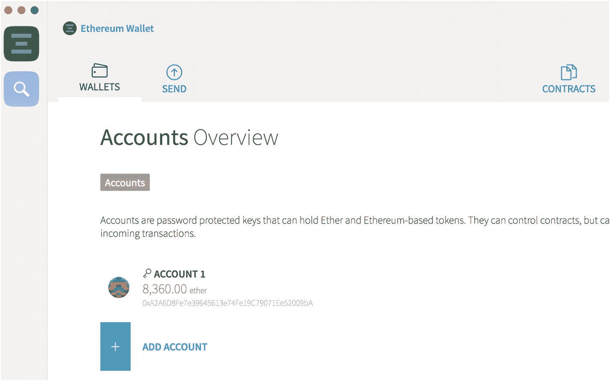

图 5-14

Mist 活跃账户和余额

### 其他人如何与你的智能合约交互

合约发布后，任何人都可以使用地址和应用程序二进制接口（ABI）来连接并与合约交互。你可以在将合约发布到主网之前，像真实用户一样启动并与之交互。

Mist 是一个可用于测试的桌面应用程序。要监视合约，在 Mist 中，点击右上角的“合约”链接，然后点击“监视合约”，如图 5-15 所示。


图 5-15

Mist 的“监视合约”按钮

要让其他人运行你的合约，他们需要两样东西。

*   合约地址
*   应用程序二进制接口


#### 注意

ABI 描述了合约的函数。为了知道如何调用函数，需要用到这份描述。你可以把它看作一份用户手册。

你可以按如下方式检索合约地址：

```
truffle(development)>var hello = HelloWorldContract.deployed().then(_app => { hello = _app })
truffle(development)>hello.address
'0x0b4f69f88390bc8cec93e730128a5e5c5dffd56c'
```

同样，你可以通过以下命令检索合约的 ABI：

```
truffle(development)>JSON.stringify(hello.abi)
'[{"inputs":[],"payable":false,"stateMutability":"nonpayable","type":"constructor","signature":"constructor"},{"constant":true,"inputs":[],"name":"greet","outputs":[{"name":"","type":"string"}],"payable":false,"stateMutability":"view","type":"function","signature":"0xcfae3217"}]'
```

然后在 Mist 中传入合约地址和 ABI，如图 5-16 所示。

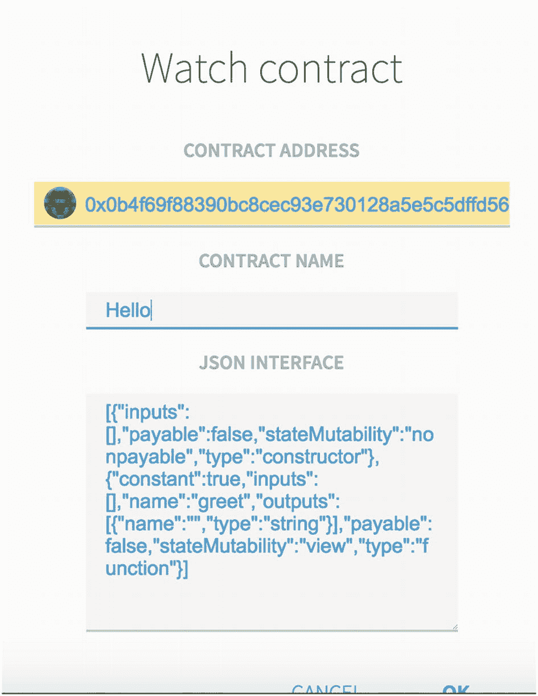

**图 5-16**

在 Mist 中传入信息

请注意，在将其粘贴到 Mist 之前，要省略 ABI 和地址中的单引号。

现在单击“确定”，你就可以在已监视的合约列表中看到你的合约。参见图 5-17。

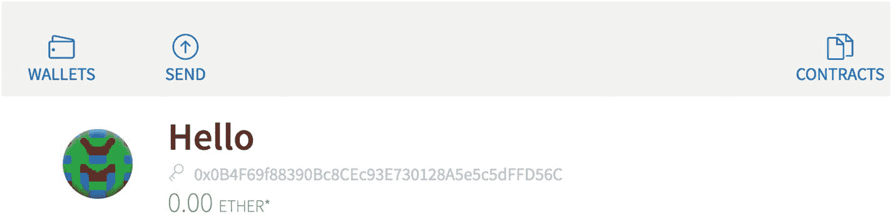

**图 5-17**

Mist 的已监视合约

你的合约现在就在 Mist 中，你可以与它交互、发送资金、监听事件以及调用函数，正如用户在以太坊主网上与你的合约交互一样。

## MetaMask

与 Mist 类似，另一种无需下载桌面应用程序就能与合约交互的方式是在 Chrome 或 Firefox 浏览器中使用一个名为 MetaMask 的插件。与 Mist 一样，你可以利用 MetaMask 将合约连接到主网、公开测试网以及本地区块链（例如你用 Ganache 创建的区块链），甚至可以连接到 Truffle Develop。要开始使用，请下载适用于 Chrome 或 Firefox 的 MetaMask 插件。

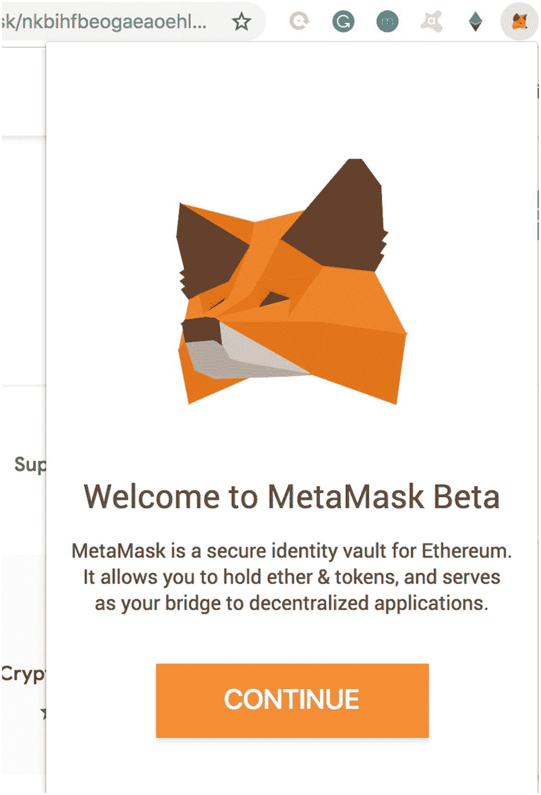

**图 5-18**

MetaMask 测试版 Chrome 扩展程序

- *Chrome 网上应用店*：[`https://chrome.google.com/webstore/detail/metamask/nkbihfbeogaeaoehlefnkodbefgpgknn`](https://chrome.google.com/webstore/detail/metamask/nkbihfbeogaeaoehlefnkodbefgpgknn) 。点击“添加至 Chrome”按钮。参见图 5-18。
- *Firefox 附加组件页面*：[`https://addons.mozilla.org/en-US/firefox/addon/ether-metamask`](https://addons.mozilla.org/en-US/firefox/addon/ether-metamask) 。点击“添加至 Firefox”按钮。

点击 MetaMask 图标，然后点击“继续”按钮。接下来，选择密码、接受条款、保存你的秘密备份短语，并创建你的账户。

创建账户后，你可以在顶部下拉菜单中选择要连接的网络，如图 5-19 所示。

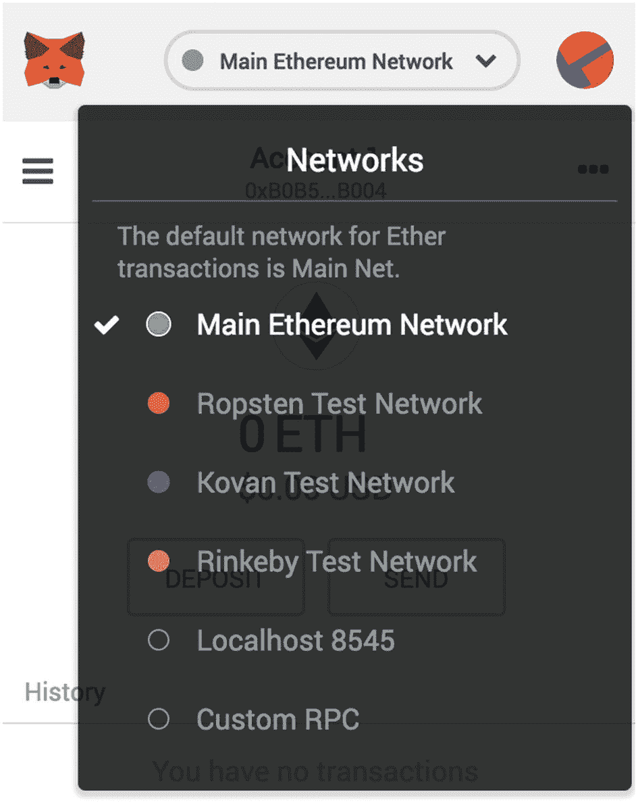

**图 5-19**

MetaMask 测试版 Chrome 网络下拉菜单

你可能还记得，你在 `truffle.js` 中设置了值，以在本地主机端口 8584 上配置网络，这与默认网络相匹配；不过，你也可以设置自定义 RPC 或连接到测试网或主网。

有关将 Truffle 与 MetaMask 连接的更多信息，请访问 Truffle 框架文档：

[`https://truffleframework.com/docs/truffle/getting-started/truffle-with-metamask`](https://truffleframework.com/docs/truffle/getting-started/truffle-with-metamask)

## 公开测试网

现在你已经能够在开发网络上运行你的智能合约，你可以在进入主网之前再迈出一步。你可以在公开的测试网网络上运行你的合约。

### 同步区块

有三个知名的测试网：Ropsten、Kovan 和 Rinkeby。你可以使用 `--testnet` 标志对 Geth 进行编程以连接到测试网，这将连接到公开的测试网网络（Ropsten）。

```
> geth --testnet --syncmode "fast" --cache=512 console
```

和之前一样，需要 `rpc` 标志来接受 Geth 的 RPC 连接，并使 Truffle 能够连接到 Geth。你还要将其设置为快速同步模式，并将缓存大小限制为 512。此命令包括启动 Geth 控制台。

要检查 `syncing` 命令的状态，请使用以下命令：

```
geth> eth.syncing
{
currentBlock: 1011878,
highestBlock: 3569550,
knownStates: 2058862,
pulledStates: 2056745,
startingBlock: 968873
}
```

完成后，`syncing` 命令将返回 `false`。请记住，在撰写本文时，有数百万个状态条目和 3,569,550 个区块，根据你的连接速度，同步可能需要数小时。`currentBlock` 值是从总区块数（最高区块）中当前正在检索的区块。这可以让你了解下载所需的时间。

回想一下，你可以通过在 Geth 控制台中运行 `eth.blockNumber` 命令来检查正在同步的当前区块编号，也可以检查你账户中的余额，看它是否已更新。

```
> eth.blockNumber
> eth.getBalance(eth.accounts[0])
```

### 公开测试网水龙头

除了测试网代币，你还可以通过水龙头获取额外的测试网代币，就像你获取比特币一样。访问 [`https://faucet.ropsten.be/`](https://faucet.ropsten.be/) ，如图 5-20 所示，并向你在 Mist 中设置的钱包地址申请代币。

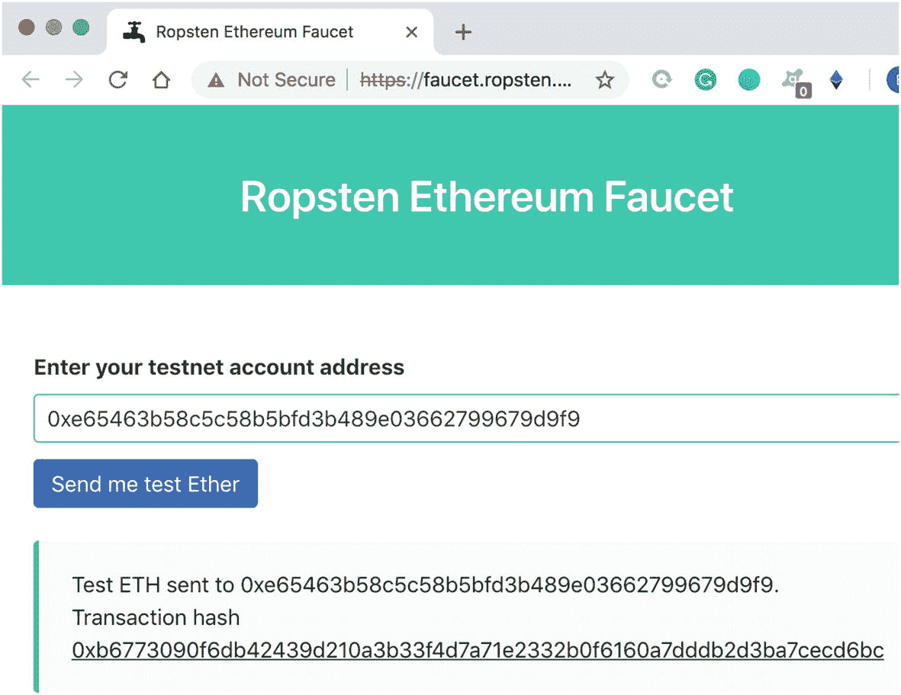

**图 5-20**

Ropsten 以太坊水龙头

## 以太坊主网

从 Ganache 控制台，你能够发布到公开的测试网网络（Ropsten）。下一步是发布到以太坊主网。为此，你将重启 Geth，并在此次连接到主网。

```
> geth --fast --cache=512
```

与公开测试网一样，你必须等待 Geth 同步。同步完成后，你可以调用 Truffle 的 `migrate` 命令进行部署，并且和之前一样，你的账户需要拥有以太币。

```
> truffle migrate --reset
```

## 推荐的智能合约工具

在本章中，我介绍了 Ganache、Solidity、IntelliJ、Truffle、Geth、Remix 和 MetaMask；不过，还有其他值得一提的工具。

- *Solium*：Solidity 代码清理解决方案
- *conteract.io*：与智能合约交互
- *Populus*：以太坊智能合约开发框架
- *Parity*：轻量级以太坊节点
- *Drizzle*：前端去中心化应用解决方案


## 总结

在本章中，我介绍了如何利用 `Ganache` 来模拟一个全节点的以太坊客户端。你安装了 `Ganache`，在成功连接到 `Ganache CLI` 之后，你便能够创建一个网络并监听端口。你学会了如何使用适用于 `Solidity` 的 `IntelliJ IDEA` 插件，通过自动补全和高亮功能来轻松开发智能合约。你还了解了 `Truffle Suite`，并学会了如何使用命令行向导创建自己的智能合约。你将 `Truffle` 连接到了 `Ganache` 网络，然后创建了一个“Hello, World”智能合约以及一个“`MD5SmartContract`”智能合约。

创建好合约后，你能够利用 `Truffle` 的部署流程来迁移智能合约。你使用 `Truffle` 编译并部署了智能合约代码到你的开发网络。然后，你通过 `Truffle CLI` 使用 `Truffle` 控制台与你的智能合约进行交互。接着，你使用 `Geth` 创建了一条私有以太坊区块链并对其进行了初始化。你使用 `Geth` 控制台，并在你的 `Geth` 私有测试网上挖掘了模拟以太币。

接下来，你将你的 Remix `web3.js` 以及 `Truffle` 合约部署到了你创建的 `Geth` 私有测试网上。此外，你还查看了一些在开发智能合约时会用到的实用 `Geth` 命令。你将你的 `Mist` 以太坊钱包连接到了你创建的私有 `Geth` 网络，并能够与你的智能合约进行交互。你成功地在浏览器中使用了 `MetaMask` 来替代桌面客户端。

当你能够查看合约的运行情况后，你设置了一个公共测试网，同步了区块，并通过水龙头获取了代币。最后，你学习了如何将代码迁移到以太坊主网。

在接下来的章节中，你将学习如何为智能合约构建前端代码，并发布一个完整的去中心化应用。

