# 6. EOS.IO 钱包与智能合约

在第 2 章中，我在介绍比特币、山寨币以及不同共识机制时提到了 `EOS.IO`。具体来说，我介绍了 `EOS.IO` 是如何作为山寨币转化为代币的一个实例；你创建了一个 EOS 区块生产者，并能够创建一个能够挖取 EOS 代币的全节点。以太坊是你区块链智能合约开发的起点，你学会了使用 `Solidity` 语言编写智能合约和去中心化应用。而 `EOS.IO` 则为智能合约和去中心化应用的开发构建了一个比以太坊更强大的架构。

在本章中，我将深入讲解 `EOS.IO` 区块链，并向你展示如何构建一个可用于去中心化应用的 `EOS.IO` 智能合约。你将搭建一个本地测试网环境，并学习如何配置 `EOS.IO` 工具和库。你还将学习有关 `EOS.IO` 钱包的知识，包括如何创建、删除和备份钱包，以及执行诸如打开、锁定和解锁钱包等操作。我将介绍钱包的密钥对，以及如何启动和重新启动本地测试网区块生产者。你还将了解权限、单签名和多签名选项。

为了更好地理解 `EOS.IO` 智能合约，你将创建一个“`HelloWorld`”智能合约和一个智能合约代币。你将创建账户，编写智能合约 C++ 代码，编译代码，生成 `WebAssembly` 和 `ABI` 文件以及李嘉图合约。然后，你将学习如何部署你的智能合约并与之交互，以及如何发行代币并将代币转账给另一个用户。

最后，你将连接到一个公共测试网区块生产者，以便在更真实的环境中进行测试，并了解如何连接和发布到主网区块生产者。

## 注意

`EOS` 是驱动 `EOS.IO` 软件的原生加密货币（代币）。`EOS.IO` 是一个工业级、完全可定制的区块链架构协议，它通过提供对构成区块链各个组件的访问，从而支持去中心化应用。你可以将 `EOS.IO` 视为一个区块链操作系统，因为它模拟了真实计算机，并允许访问 CPU、GPU、RAM 和硬盘等资源。`EOS.IO` 在处理每秒数百万笔交易时不收取交易费。`EOS` 代币是一种实用型代币，拥有（质押）该代币可以在 `EOS.IO` 区块链上获得带宽和存储空间。你获得的资源与你所持有的总质押量成正比（拥有 1% 的 `EOS` 代币，即可使用 `EOS.IO` 总带宽的 1%）。

> “`EOS.IO` 软件引入了一种新的区块链架构，旨在实现去中心化应用的垂直和水平扩展。这是通过创建一个类似操作系统的结构来实现的，应用程序可以在此基础上构建。该软件提供了账户、认证、数据库、异步通信以及跨多个 CPU 核心或集群的应用程序调度功能。最终，这种技术形成了一种区块链架构，它最终能够扩展到每秒处理数百万笔交易，消除用户费用，并允许在受治理的区块链环境中快速、轻松地部署和维护去中心化应用。”
> ——`EOS.IO` block.one 白皮书

正如第 2 章中提到的，`EOS.IO` 构建于委托权益证明（DPoS）共识机制之上。`EOS.IO` 能够处理低延迟和每天数千万的活跃用户（超越了以太坊）。这是通过 DPoS 共识机制以及 `EOS.IO` 作为多线程（在多个计算机核心上运行）并充当操作系统来实现的。

这种可扩展性可以使大型企业采用区块链技术。`EOS.IO` 还提供了许多额外功能，例如：

* 免费的速率受限交易
* 低延迟交易（例如 0.25 秒的广播时间或 0.5 秒的出块时间）
* 被盗密钥的恢复
* 应用程序的并行执行
* 跨多个账户的原子交易

我鼓励你阅读 `EOS.IO` 白皮书并访问 GitHub 页面以查看完整的功能列表。

* [`https://github.com/EOSIO/eos`](https://github.com/EOSIO/eos)
* [`https://github.com/EOSIO/Documentation/blob/master/TechnicalWhitePaper.md`](https://github.com/EOSIO/Documentation/blob/master/TechnicalWhitePaper.md)

从财务角度来看，`EOS` 是由一家名为 `block.one` 的私营公司开发的，并通过 `ERC-20` 代币销售在首次代币发行（ICO）中筹集了高达 40 亿美元的惊人资金。在撰写本文时，`EOS` 的价格在 2 到 8 美元左右，总市值约为 20 亿美元，这使得 `EOS` 成为按市值计算的第七大加密货币。

`EOS` 提供了几个有助于开发 `EOS.IO` 合约的代码仓库；它们列在 [`https://github.com/EOSIO`](https://github.com/EOSIO) 上，包括以下内容：`eos`、`eosio.cdt`、`eosjs`、`demux-js` 和 `eosio.contracts`。在本章中，你将安装 `EOS` 和 `EOSIO.CDT` 库。`EOS` 库是一个开源智能合约平台，`EOSIO.CDT` 库是一套用于构建 `EOS.IO` 合约的工具集。

在撰写本文时，`EOS.IO` 平台的学习曲线较为陡峭。代码不断变化，而 `EOS.IO` 的文档和示例并未及时更新，因此有时会感觉像是在追逐一个移动的目标。这导致代码有时无法编译，命令不起作用，文档和示例中包含已弃用的代码和命令。在开发合约的过程中，你很可能会遇到几次卡住的情况；不过，一旦你理解了 `EOS.IO`，克服这些障碍就会变得容易。

## 搭建测试网络环境

在开始编写代码之前，让我们先安装 EOS.IO 和 EOSIO.CDT。你需要构建自己的 EOS.IO 版本，并设置一个本地测试网区块生产者。接着，你将学习名为`cleos`、`keosd`和`nodeos`的 EOS.IO 工具，以及如何配置它们，并使用`cleos`创建和管理钱包。这些工具和库是开发过程中必不可少的。

### 安装 EOS.IO

在 macOS 上安装 EOS.IO 最简单的方法是使用 Brew。

```
> brew tap eosio/eosio
> brew install eosio
```

当前 EOS.IO 的版本是 1.7.3。我建议你查看 GitHub（<https://github.com/eosio/eos>）上的仓库和问题板块，或在谷歌上进行搜索，以防在安装或构建 EOS.IO 时遇到错误。也可参见<https://github.com/EOSIO/eos/issues>。

安装完成后，你将在终端的图 6-1 中看到如下信息。

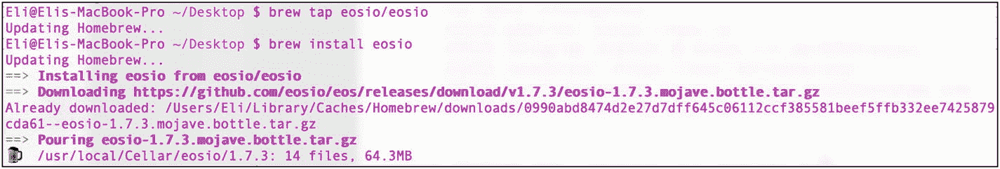

图 6-1 EOS.IO 构建成功

接下来，将 EOS.IO 的二进制文件位置添加到你的环境变量中，这样你就可以从任何地方运行`nodeos`了。

```
> export PATH=$PATH:/usr/local/eosio/bin
```

这将在当前终端会话中设置变量，但你可能希望永久设置该环境变量。因此，请使用 vim 或你喜欢的文本编辑器打开`bash_profile`文件，并将其添加进去。

```
> vim ~/.bash_profile
```

接着，插入以下几行内容：

```
## 为 EOSIO 设置 PATH
PATH="/usr/local/eosio/bin:${PATH}"
```

最后，运行`bash_profile`以提交更改。

```
> . ~/.bash_profile
```

EOS.IO 开箱即用，内置了工具和程序；它们位于`/usr/local/eosio/`目录下。图 6-2 展示了这些工具的架构图。

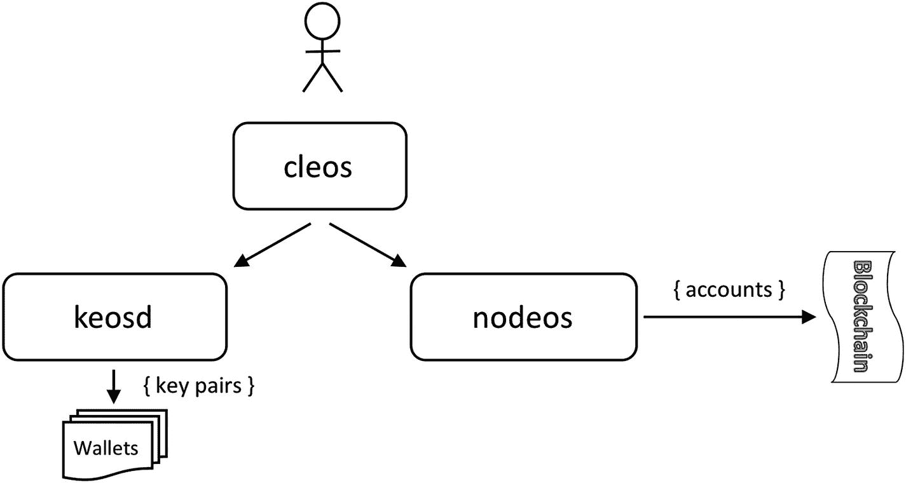

图 6-2 EOS 的基本架构。图片来源：developers.eos.io。

- `nodeos`: 这是 EOS.IO 的核心守护进程，使你能够运行一个区块链节点组件。`nodeos`可以通过插件进行配置。此外，`nodeos`可以配置为在本地开发环境或专用端点上运行区块生产者。它通过创建区块与区块链进行交互。
- `cleos`: 这是 EOS.IO 的主要命令行工具。它与`nodeos`暴露的 REST API 接口交互。在与`keosd`交互时，它也可以访问钱包。要查看`cleos`命令列表，只需运行以下命令：

    ```
    > cleos
    ```

- `keosd`: 这是用于加载和管理钱包密钥的钱包守护进程。它通过加载与钱包相关的插件来实现这一点，例如 HTTP 接口和 RPC API。
- `eosio-launcher`: 此工具将帮助你部署一个多节点区块链网络。

### 安装 EOSIO.CDT

你已经安装了 EOS.IO。另一个你需要的重要库是 EOSIO.CDT（CDT 代表“合约开发工具包”）。EOSIO.CDT 是用于构建 EOS.IO 合约的工具套件。要安装此库，你将使用 Brew。

```
> brew tap eosio/eosio.cdt
> brew install eosio.cdt
```

在撰写本文时，最新的 EOSIO.CDT 版本是 1.6.1。如果你使用的是旧版本，请运行`brew update`。

```
> brew upgrade eosio.cdt
```

为确保安装成功，请使用`help`参数运行`eosio-cpp`命令。

```
> eosio-cpp --help
```

回想一下，你曾使用 Truffle 和 Remix 来生成以太坊的应用程序二进制接口（ABI）文件。对于 EOS.IO 智能合约，你使用`eosio-cpp`，这是一个编译器，可生成 WebAssembly（`.wasm`）文件，该文件是智能合约需要上传到区块链的 ABI。`eosio-cpp`还会生成辅助函数，用于序列化/反序列化 ABI 代码中为智能合约开发定义的类型。

你可以在 GitHub 页面（<https://github.com/EOSIO/eosio.cdt>）上找到关于 EOSIO.CDT 的更多信息。

将来，如果你需要卸载 EOS.IO 和 EOSIO.CDT，请运行以下命令：

```
> brew remove eosio
> brew remove eosio.cdt
```

## 注意

`eosio-cpp`是已弃用的`eosiocpp`的替代品。最初，`eosiocpp`是 EOS.IO 安装的一部分，但现在它属于 CDT。

## 构建 EOS.IO

直观理解 EOS.IO 及相关工具的一个好方法是查看图 6-2。

## keosd 和 nodeos 配置文件

`keosd`和`nodeos`的默认端口都使用相同的端口：8888。

要配置`nodeos`，请查看此配置文件：

```
> vim "/Users/[user]/Library/Application Support/eosio/nodeos/config/config.ini"
```

在`config.ini`文件中，一个值得注意的需要修改变量是你加载的插件列表。目前你不会进行修改，但随着开发的深入，你可能需要做出更改。

与`nodeos`类似，你可以通过编辑以下配置文件来配置`keosd`：

```
> vim ~/eosio-wallet/config.ini
```

打开文件后，请注意有一个名为`http-server-address`的变量，如果 8888 端口被其他软件占用，可以使用该变量更改端口。这里我们将其设置为你喜欢的任何端口。

该变量默认是注释掉的。要将其设置为端口 9000，请将其从：

```
### http-server-address =
```

修改为：

```
http-server-address = http://127.0.0.1:9000
```

你可以使用默认端口；但是，了解如何配置 EOS.IO 是有好处的。

## 使用 cleos 创建和管理钱包

在上一节中，我介绍了一些 EOS.IO 内置的程序和工具。

如前所述，`cleos` 提供了由 `nodeos` 暴露的 REST API 接口。`cleos`参考指南可在此处找到：<https://developers.eos.io/eosio-cleos/reference>。

要查看`cleos --version`版本号，请运行`--version client`命令。在撰写本文时，你获取的版本为`d4ffb4eb`。

```
> cleos version client
d4ffb4eb
```

如前所述，要获取命令列表，只需键入`cleos`或`cleos --help`。

```
> cleos --help
```

如果你记不住某个特定的子命令，可以键入该命令并在输出中获取子命令列表；例如，`get`命令会输出子命令列表，如用于查询区块生产者信息的`info`。

```
> cleos get
> cleos get info
Failed to connect to nodeos at http://127.0.0.1:8888/; is nodeos running?
```

请注意，因为你尚未运行节点，所以没有结果，并显示了一条错误信息；然而，在本章后面，当你启动`nodeos`时，你将获得有关区块生产者的信息。

### EOS.IO 钱包

EOS.IO 钱包使用密钥，并提供锁定（加密）和解锁（解密）两种状态来保护密钥。`lock` 和 `unlock` 命令需要使用创建钱包时为您提供的高熵密码。钱包的密钥可以关联到一个账户，以提供对该账户代币的权限，但这并非创建钱包的必要条件。

钱包软件使用 `cleos` 作为 `keosd` 密钥检索操作和 `nodeos` 区块链操作之间的中间层。例如，您可以使用 `cleos` 来访问一个账户，因为它需要从密钥生成签名。要创建默认钱包，只需运行 `create wallet` 命令。使用 `--to-console` 标志来获取主密钥（密码）。

```
> cleos wallet create --to-console
Creating wallet: default
Save password to use in the future to unlock this wallet.
Without password imported keys will not be retrievable.
"[ DEFAULT_MASTER_KEY]"
```

请务必保存好密码。现在，您可以检查钱包是否已创建，并运行 `wallet list` 命令，您将看到一个列出钱包的数组，其中包含您创建的默认钱包。

```
> cleos wallet list
Wallets:
[
"default ∗"
]
```

请注意，创建默认钱包后，钱包名称旁边会有一个星号。这个星号表示它已解锁。您将在下一节中了解更多关于锁定和解锁状态的信息。

## 删除和备份钱包

要删除您创建的钱包，您需要删除实际的钱包文件；它位于：`~/eosio-wallet`。

```
> rm -rf ~/eosio-wallet
```

运行 `wallet list` 命令，您可以看到钱包数组为空。

```
> cleos wallet list
"/usr/local/eosio/bin/keosd" launched
Wallets:
[]
```

要备份钱包，请复制钱包文件并将其存储在安全的位置。

## 自定义名称的 EOS.IO 钱包

到目前为止，您已经创建了默认钱包。现在，假设您想创建另一个钱包并命名为 `mywallet`。您所需要做的就是使用 `-n` 或 `--name` 标志。选择一个名称，并注意严格的名称限制（仅允许使用 a–z 和 1–5，长度最长为 12）。我选择 `mywallet`。

```
> cleos wallet create -n mywallet --to-console
Creating wallet: mywallet
Save password to use in the future to unlock this wallet.
Without password imported keys will not be retrievable.
"[DEFAULT_MASTER_KEY]"
```

## EOS.IO：打开、锁定和解锁钱包

创建钱包时，您会得到一个高熵主密钥，也就是您的密码。该密码用于加密（锁定）和解密（解锁）您的钱包文件。要锁定和解锁您的钱包，请使用以下命令：

```
> cleos wallet lock -n mywallet
> cleos wallet unlock -n mywallet
password: [DEFAULT_MASTER_KEY]
password: Unlocked: mywallet
```

`lock` 和 `unlock` 命令使您的钱包能够设置由密码保护的加密和解密状态。您保护的是钱包的密钥。

要解锁默认钱包，只需运行以下命令：

```
> cleos wallet unlock
```

此外，要对您的钱包执行操作，您需要先打开钱包。当 `keosd` 重新启动时，钱包将关闭。根据需要运行 `open` 命令来打开钱包。

```
> cleos wallet open
Opened: default
```

## 生成 EOS.IO 密钥

与其他区块链一样，EOS.IO 将密钥存储在钱包中。您生成这些密钥并将其分配给一个 EOS.IO 账户。有多种创建密钥的方法。这里您将使用 `cleos`。首先，让我们重新创建默认钱包，以防您之前删除了它。

```
> cleos wallet create --to-console
Creating wallet: default
Save password to use in the future to unlock this wallet.
Without password imported keys will not be retrievable.
```

`"[DEFAULT_MASTER_KEY]"`

运行 `wallet list` 应该会显示您的两个钱包。

```
> cleos wallet list
Wallets:
[
"default",
"mywallet ∗"
]
```

接下来，要创建两个公钥/私钥对，请运行 `create key` 命令。

```
> cleos create key --to-console
Private key: [PRIVATE_KEY_1]
Public key: [PUBLIC_KEY_1]
> cleos create key --to-console
Private key: [PRIVATE_KEY_2]
Public key: [PUBLIC_KEY_2]
```

正如您注意到的，您运行了两次 `create key` 命令。这不是笔误；您需要有两个密钥：一个用于活跃用户，一个用于所有者。一旦您创建账户，您将了解更多关于这个概念的信息。

您运行的命令输出了公钥和私钥对。请注意，公钥以 `EOS` 关键字开头。这些任意密钥对本身是没有意义的，因为它们没有权限（它们不属于任何钱包或账户）。要将这些密钥对分配给一个钱包，您可以将这些密钥导入到您的钱包中。

```
> cleos wallet import --private-key [PRIVATE_KEY_1]
imported private key for:
[PRIVATE_KEY_1]
imported private key for: [key]
> cleos wallet import --private-key [PRIVATE_KEY_2]
imported private key for: [PRIVATE_KEY_2]
```

在命令的输出中，您会从命令行收到一条确认消息，表明密钥对已添加。但是，您也可以通过调用 `wallet keys` 命令来确认密钥对已添加。

```
> cleos wallet keys
[PUBLIC_KEY_1, PUBLIC_KEY_2]
```

此外，您可以请求查看密钥对。

```
> cleos wallet private_keys --password [DEFAULT_MASTER_KEY]
[[PUBLIC_KEY_1, PRIVATE_KEY_2],[ PUBLIC_KEY_1, PUBLIC_KEY_2]]
```

在上一个命令中，您直接传递了 `--password` 参数，而不是等待命令行提示您输入主密码。

最后，您需要导入一个特殊的 EOS.IO 父账户。这个特殊的父账户用于引导 EOS.IO 节点。没有此私钥，您将无法创建您的账户。EOS.IO 账户需要一个父账户才能创建另一个账户；这就是 EOS.IO 分配资源并防范垃圾邮件和黑客的方式。

```
> cleos wallet import --private-key 5KQwrPbwdL6PhXujxW37FSSQZ1JiwsST4cqQzDeyXtP79zkvFD3
imported private key for: EOS6MRyAjQq8ud7hVNYcfnVPJqcVpscN5So8BhtHuGYqET5GDW5CV
```

> **注意**
> 在撰写本文时，父钱包有效；但这种情况可能会改变，您可能需要找到一个可用于引导 EOS.IO 钱包的父钱包。

查看您的输出，以便您可以将其与我的进行比较，如图 6-3 所示。

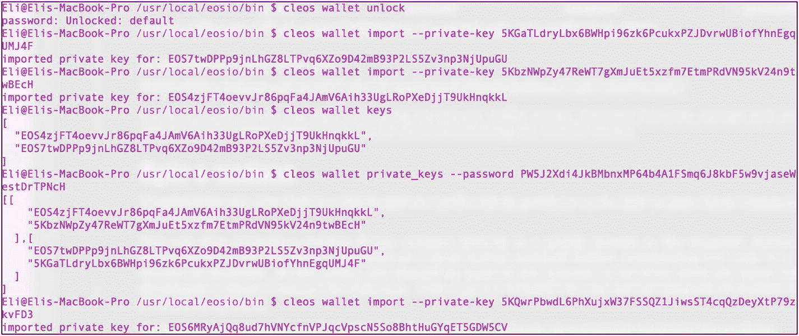

**图 6-3** 使用特殊父账户设置 EOS.IO 钱包密钥

## 使用 `nodeos` 启动节点

交易被附加到区块中，你需要一个区块生产者才能将这些交易传递到网络中。

如果你直接连接到公共测试网或主网，可以跳过创建 EOS 节点（`nodeos`）；但最好先在本地测试网络上运行你的智能合约，然后再将代码提交到公共测试网或主网。

此时，你应该已经熟悉这个过程了，因为在为以太坊开发智能合约时你也做过同样的事情。可以回顾一下图 6-2，其中展示了 `nodeos` 与 EOS.IO 区块链关系的示意图。

要在单独的终端中启动你自己的单节点本地区块链区块生产者，请运行 `nodeos`。

```
> nodeos -e -p eosio --plugin eosio::chain_api_plugin --plugin eosio::history_api_plugin --contracts-console
```

该命令将启动区块生产者，并应在控制台上显示进程信息。

```
info  2019-04-28T19:03:34.776 thread-0  chain_plugin.cpp:333          plugin_initialize    ] initializing chain plugin
info  2019-04-28T19:03:34.811 thread-0  block_log.cpp:134          open                 ] Log is nonempty
info  2019-04-28T19:03:34.820 thread-0  block_log.cpp:161          open                 ] Index is nonempty
info  2019-04-28T19:03:34.878 thread-0  http_plugin.cpp:422          plugin_initialize    ] configured http to listen on 127.0.0.1:8888
...
...
...
```

如你所见，控制台显示你的本地网络已开始生产区块。请注意，你使用的命令设置了插件，并且还设置了 `--contracts-console` 标志。在开发模式下，需要此标志才能看到你打印到控制台的消息。

> **注意**
> 你也可以在 `config.ini` 文件中设置 `--contracts-console` 标志，而不必每次都在 `nodeos` 命令中传递此参数。

回想一下，之前你运行 `cleos get info` 命令时，因为没有运行区块生产者，所以没有返回任何结果；现在，如果你在一个新的终端中运行相同的命令，就可以看到关于你区块的信息了。

```
> cleos get info
{
"server_version": "d4ffb4eb",
"chain_id": "cf057bbfb72640471fd910bcb67639c22df9f92470936cddc1ade0e2f2e7dc4f",
"head_block_num": 73699,
"last_irreversible_block_num": 73698,
"last_irreversible_block_id": "00011fe2a80bf11315396c85e70860122dddc24ac083911fba31f7ee2d64eb3e",
"head_block_id": "00011fe36fab1fc2d4885067e1391c72782895d43f14cf7970ac282ddef17d67",
"head_block_time": "2019-04-28T19:04:06.500",
"head_block_producer": "eosio",
"virtual_block_cpu_limit": 200000000,
"virtual_block_net_limit": 1048576000,
"block_cpu_limit": 199900,
"block_net_limit": 1048576,
"server_version_string": "v1.5.1-dirty"
}
```

## 重新启动本地测试网节点（`nodeos`）

如果你想清除区块生产者的历史记录，删除所有区块，并重新启动本地测试网，可以使用所谓的*硬重放*，通过添加以下标志来实现：

```
--delete-all-blocks --delete-state-history --hard-replay
```

这些参数将清除本地测试网上的账户以及区块。完整的命令如下所示：

```
> nodeos -e -p eosio --plugin eosio::chain_api_plugin --plugin eosio::history_api_plugin --delete-all-blocks --delete-state-history --hard-replay --contracts-console
```

## EOS.IO 账户

EOS.IO 账户持有一个人类可读的名称，该名称存储在 EOS.IO 区块链上。

要在主网上创建一个账户，需要已有的 EOS.IO 账户用户为你创建。这种规范化流程背后的原因是防止垃圾邮件、黑客攻击以及进行资源分配。默认情况下，账户拥有两个原生名称/权限。

-   `Owner`（所有者）：用于恢复其他权限，在权限被泄露的情况下非常有用。
-   `Active`（活跃）：用于高级账户更改，例如转账或为区块生产者投票。

创建测试网账户时，你导入了一个特殊的 EOS.IO 父账户密钥来进行引导。每个权限名称都需要一个“父级”。父级权限能够对其所有子级的任何权限设置进行更改。EOS.IO 为本地测试网提供了一个特殊的账户父密钥，你已导入该密钥来创建账户。参见图 6-4。

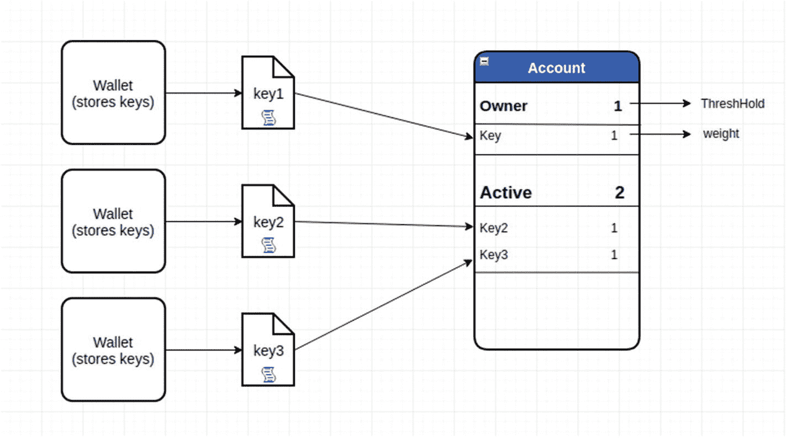

图 6-4 账户高级架构与权限结构。图片来源：hackernoon.com。

要使交易有效并被签名，每个命名权限都需要满足一些条件，例如客户端需要解锁钱包，并且钱包必须授予该账户的权限。如果不满足这些条件，交易将会失败。

既然你已经理解了账户，就可以创建自己的账户了。你已经创建了一个钱包并导入了父密钥。要创建一个账户，请运行以下命令语法：

```
> cleos create account eosio [账户名] [所有者公钥] [活跃公钥]
```

`OWNER_KEY` 值是账户所有者权限的公钥，`ACTIVE_KEY` 值是账户活跃权限的公钥。

在这个示例中，我们将账户命名为 `myaccount`，并使用你创建的两个密钥。命令将如下所示（预期输出见图 6-5）：

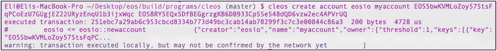

图 6-5 创建你的第一个名为 `myaccount` 的 EOS.IO 账户

```
> cleos create account eosio myaccount [公钥 _1] [公钥 _2]
```

你生成了两个密钥，所以用哪个密钥作为活跃密钥、哪个作为所有者密钥都无关紧要；只需记住你分别使用了哪个密钥。

要查看账户列表，请使用以下命令：

```
> cleos get accounts [公钥 _1]
{
"account_names": [
"myaccount"
]
}
```

> **注意**
> 如果你漏掉了本章中提供的任何步骤，尝试创建账户时可能会收到错误信息。该错误为“Error 3090003: provided keys, permissions, and delays do not satisfy declared authorizations.”（提供的密钥、权限和延迟不满足声明的授权。）

### 钱包、密钥和账户：完整命令

为了确保你完全理解整个过程，以下是创建账户步骤的总结：

1.  确保 `nodeos` 在单独的终端窗口中运行。

    ```
    > nodeos -e -p eosio --plugin eosio::chain_api_plugin --plugin eosio::history_api_plugin --delete-all-blocks --delete-state-history --hard-replay --contracts-console
    ```

2.  确保你的钱包已解锁。运行 `> cleos wallet list`（检查钱包名称旁边是否有一个星号）。

3.  已导入 EOS.IO 特殊账户的父密钥（`5KQwrPbwdL6PhXujxW37FSSQZ1JiwsST4cqQzDeyXtP79zkvFD3`）来引导 EOS.IO 网络。

    ```
    > cleos wallet import --private-key 5KQwrPbwdL6PhXujxW37FSSQZ1JiwsST4cqQzDeyXtP79zkvFD3
    ```

4.  使用 `> cleos wallet keys` 检查密钥列表。它应该输出一个包含你已导入密钥的数组。

总结一下到目前为止你所做的工作，或者重新执行创建账户的整个过程，完整步骤如下：

```
> rm -rf ~/eosio-wallet
> cleos wallet create --to-console
> cleos wallet open
> cleos wallet unlock --password [默认主密钥]
> cleos create key --to-console
> cleos create key --to-console
> cleos wallet import --private-key [私钥 _1]
> cleos wallet import --private-key [私钥 _2]
> cleos wallet import --private-key 5KQwrPbwdL6PhXujxW37FSSQZ1JiwsST4cqQzDeyXtP79zkvFD3
> cleos wallet keys
> cleos create account eosio myaccount [EOS∗ 所有者密钥] [EOS∗ 活跃密钥]
```

## 自定义、单签名与多重签名

默认情况下，你的账户配置为单签名模式，因为该模式使用默认权限（`active` 和 `owner`）授权操作。但你可以将账户配置为使用多重签名或自定义权限。例如，你可以为账户配置多个密钥，用于授权特定的 `owner` 操作和 `active` 操作。例如，你可以利用此功能创建一个名为 `publish` 的权限，并将其授予某个账户，使其仅能发布智能合约，而无法提取代币。

## "HelloWorld"智能合约

你将编写一段最小化代码的智能合约，并将其命名为“HelloWorld”。

### "HelloWorld"智能合约账户

首先，你需要为智能合约创建两个账户：一个用于发布智能合约，另一个用于与用户交互。输出结果如图 6-6 所示。

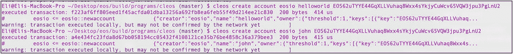

图 6-6 为“HelloWorld”智能合约创建账户

```
> cleos create account eosio helloworld [公钥]
> cleos create account eosio john [公钥]
```

### "HelloWorld"的 C++ 代码

EOS 选择了 C++ 语言，这在区块链开发者社区中引发了褒贬不一的评价。C++ 是一种底层语言，能够更好地管理内存指针和运算符重载等资源，从而可能带来更优的性能。但代价是编写代码的工作量增加，特别是当你不熟悉 C++ 时。

EOS.IO 的基础架构就是用 C++ 编写的，因此 EOS.IO 团队选择 C++ 也就不足为奇了。EOS.IO 的智能合约使用 C++ 编写，并以 CPP 文件格式保存；之后需要将 C++ 代码编译成 WebAssembly，再进行部署。

#### 注意

EOS.IO 智能合约的源文件可分为三种：CPP、HPP 和 Ricardian。HPP 文件定义了智能合约的类、动作和数据表。CPP 文件是实现动作逻辑的 C++ 代码。Ricardian 文件是一种数字文档（下一节将详细介绍）。

首先，进入目录并创建 `helloworld` 合约目录。

```
> mkdir ~/Desktop/helloworld && cd $_
```

注意，这里使用了桌面目录，但你也可以使用任何你喜欢的目录。接下来，使用 `vim` 或你喜欢的文本编辑器粘贴 `helloworld.cpp` 代码。

```
> vim helloworld.cpp
#include 
using namespace eosio;
class helloworld : public contract {
public:
using contract::contract;
[[eosio::action]]
void hello( name user ) {
print( "World: User: ", user);
}
};
EOSIO_DISPATCH(helloworld, (hello))
```

这段代码导入了 EOS.IO 库。`HelloWorld` 类继承自 `contract` 类型，你创建了一个名为 `hello` 的方法。这个方法就是你的动作；你传入用户参数并打印出单词 `world` 和用户名。当用户与你的合约交互并调用 `hello` 动作时，他们将获得 `world` 以及用户名。

注意，在这个示例中，你包含了 `eosio.hpp` 文件。要调试 EOS.IO 智能合约，你需要采用老式的“穴居人调试法”。

#### 注意

“穴居人调试法”，也就是 `printf()` 调试法，本质上就是在代码中插入 `print` 语句。EOS.IO 的打印 API 支持字符数组、64 位和 128 位无符号整数等。打印功能通过将 C++ 代码 `printi`、`prints_l`、`printi128` 等封装在 `print.hpp` 中实现，而 `print.hpp` 已通过 `import eosio.hpp` 库语句包含。

## 智能合约 IDE

使用终端是完全可行的，但随着代码变得复杂，使用专业的 IDE 在代码补全、高亮和可读性方面会更有帮助。你可以使用自己偏好的 IDE。既然你已经使用过 `WebStorm`，可以继续将项目导入到 `WebStorm` 中。`WebStorm` 已经包含了 C++ 插件，因此无需安装任何特殊插件。图 6-7 显示了在 `WebStorm` 中打开的 HelloWorld 项目。

要导入项目，请选择“文件” ➤ “打开”，然后导航到项目位置：`~/Desktop/helloworld`。

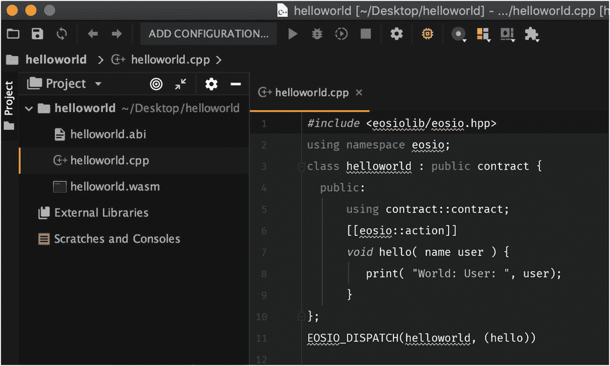

图 6-7 导入到 WebStorm 2018.2.4 版本的 HelloWorld 项目

## 编译合约并生成 ABI

如之前所述，`eosio-cpp` 工具可以将 C++ 代码生成 WebAssembly 和 ABI。这通过运行以下命令完成：

```
> eosio-cpp -o helloworld.wasm helloworld.cpp --abigen
```

注意，在命令中指定了输出文件名 `helloworld.wasm`。运行此命令后，编译器将生成以下文件：`helloworld.wasm` 和 `helloworld.abi`。

要验证编译器是否按预期工作，你应该能看到这两个文件；见图 6-7。

### Ricardian 合约

生成 WASM 和 ABI 文件后，你会注意到收到了超过 20 条警告。在这些警告中，你应该能看到如下输出：

```
警告，空的 Ricardian 条款文件
警告，空的 Ricardian 条款文件
警告，动作 没有相关的 Ricardian 合约
```

#### 注意

Ricardian 合约由 Ian Grigg 于 1996 年发明，旨在弥合软件应用与法院之间的鸿沟。EOS 中的 Ricardian 合约文件是一种 Markdown 语言格式（`.md`，`.markdown`）的数字文档，定义了各方之间交互的条款和条件。它虽然以参数形式设置，但以可读文本编写。EOS 使用密码学方法对 Ricardian 合约进行签名和验证。

为了帮助你生成 Ricardian 合约，你可以从一位贡献者那里复制一个 Python 脚本和模板，这些脚本和模板能自动生成文件：[`https://github.com/EOS-Mainnet/governance`](https://github.com/EOS-Mainnet/governance)。

由于只有三个文件，你可以使用 `wget` 而不是 `clone` 来下载这些文件。

首先检查你的机器上是否已安装 `wget`。

```
> wget --help
```

如果尚未安装，可以通过 Ruby 和 Brew 在 macOS 上安装 `wget`。

```
> ruby -e "$(curl -fsSL https://raw.githubusercontent.com/Homebrew/install/master/install)"  /dev/null
> brew install wget
> brew upgrade wget
```

接下来，在 `helloworld` 项目中创建目录并下载所需的文件。

```
> cd ~/desktop/helloworld
> mkdir rc && cd $_
> wget https://raw.githubusercontent.com/EOS-Mainnet/governance/master/scripts/abi_to_rc/abi_to_rc.py
> wget https://raw.githubusercontent.com/EOS-Mainnet/governance/master/scripts/abi_to_rc/rc-action-template.md
> wget https://raw.githubusercontent.com/EOS-Mainnet/governance/master/scripts/abi_to_rc/rc-overview-template.md
```

然后，运行 Python 脚本。

```
> cd ../
> python rc/abi_to_rc.py helloworld.abi
```

该脚本会自动为你生成 `helloworld-rc.md` 和 `helloworld-hello-rc.md` 文件，并已格式化为 Markdown 语言。如果你查看这些文件，会发现 Python 脚本使用你下载的模板生成了文件，你可以填充有关智能合约的条款和条件。

你可以制定用户具体购买/交换内容的指南，从而在各方之间建立更好的信任；这可以包括意图、保证、补救措施、不可抗力、争议解决、适用法律等条款和条件。请密切关注你设置的条款，因为它们可能在法庭上具有强制执行力。这些条款允许跳过律师等中间人，让智能合约直接设定双方同意的条款和条件。

## 部署合约

若要将智能合约部署到本地测试网，可使用 `set contract` 命令上传合约。预期输出结果如图 6-8 所示。

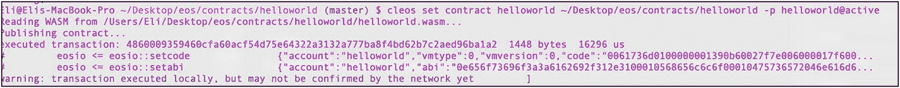

图 6-8 部署智能合约的终端输出

```
> cleos set contract helloworld ~/Desktop/helloworld -p helloworld@active
```

### 与智能合约交互

现在智能合约已部署到本地区块链，你可以与你创建的 `hello` 动作进行交互。你需要调用 `hello` 动作，并将用户名传递给用户的活跃密钥。输出结果如图 6-9 所示。

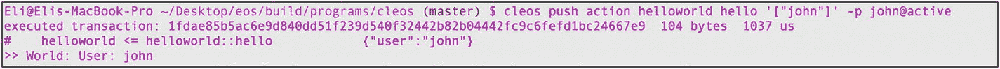

图 6-9 智能合约推送动作的终端输出

```
> cleos push action helloworld hello '["john"]' -p john@active
```

你可以从此处下载完整的智能合约项目：[`https://github.com/Apress/the-blockchain-developer/chapter6/helloworld/`](https://github.com/Apress/the-blockchain-developer/chapter6/helloworld/).

## 智能合约代币

EOS.IO GitHub 项目包含一个智能合约库，其中提供了可供参考的示例。其中一个库就是名为 `eosio.token` 的智能合约。该合约允许开发者创建其他代币，并实现代币转账。你将使用这些库来创建自己的代币。首先，创建一个新的智能合约项目，并将其命名为 `eosio.token`。

```
> mkdir ~/Desktop/eosio.token && cd $_
```

### 创建账户

代币由“发行者”账户发行。首先，你需要创建“发行者”账户，以及一个名为 `jane` 的账户，用于后续代币转账。

```
> cleos create account eosio eosio.token [公钥]
> cleos create account eosio jane [公钥]
```

### 使用最新 eosio.token 代码编译 wasm

为发行 `eosio.token`，你需要使用 `eosio.token.hpp` 文件（定义合约的类、动作和表）以及 `eosio.token.cpp` 文件（包含逻辑和编码）。你可以在此处找到这些文件及整个智能合约项目：[`https://github.com/Apress/the-blockchain-developer/chapter6/eosio.token/`](https://github.com/Apress/the-blockchain-developer/chapter6/eosio.token/).

接下来，请确保使用 `vim` 或其他文本编辑器修改 CPP 代码中的 `include` 语句，使其指向从 GitHub 下载的 HPP 文件。

```
> vim eosio.token.cpp
```

将 `eosio.token.cpp` 文件中的第 6 行修改为指向 `eosio.token.hpp` 文件的位置，本例中位置如下：

```
include "~/Desktop/eosio.token/eosio.token.hpp"
```

### 部署 eosio.token

准备好 `eosio.token.hpp` 和 `eosio.token.cpp` 后，你就拥有了所有必需的文件。可以使用 `eosio-cpp` 命令编译最新的 HPP 和 CPP 文件，以生成 `.wasm` 代码，这与 HelloWorld 智能合约示例的操作相同。

```
> eosio-cpp -o eosio.token.wasm eosio.token.cpp --abigen
```

接下来，使用 `set contract` 命令部署 `eosio.token` 合约。

```
> cleos wallet unlock --password [默认主密钥]
> cleos set contract eosio.token ~/Desktop/eosio.token --abi eosio.token.abi -p eosio.token@active
```

### 创建 EOS.IO 代币

要创建新代币，你需要使用 `create` 动作。此动作接收 `symbol_name` 类型参数，该参数包含两个部分：

- *最大供应量浮点数*：本例中将最大代币数设为 2000 万，即 `20000000.0000`。
- *符号*：为 `symbol_name` 选择一个名称。名称必须全部为大写英文字母；本例中选择名称 `TOKEN`。

“发行者”账户有权调用发行动作或其他动作，例如召回、冻结和设置白名单所有者。

要创建新的代币动作，请运行以下命令。预期输出结果如图 6-10 所示。

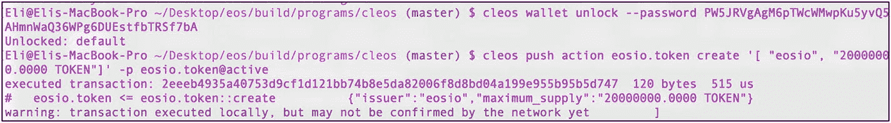

图 6-10 创建 eosio.token 动作的预期输出

```
> cleos wallet unlock --password [默认主密钥]
> cleos push action eosio.token create '[ "eosio", "20000000.0000 TOKEN"]' -p eosio.token@active
```

你可以通过调用 `currency stats` 命令来确认代币已发行。

```
> cleos get currency stats eosio.token TOKEN
{
"TOKEN": {
"supply": "0.0000 TOKEN",
"max_supply": "20000000.0000 TOKEN",
"issuer": "eosio"
}
}
```

### 发行代币

我们再创建一个账户，用于接收你发行的部分代币。这个账户将被命名为 `jane`。

```
> cleos create account eosio jane [公钥]
```

接下来，调用“issue”动作来发行代币。本例中，你将向 `jane` 发行 500 个代币。

```
> cleos push action eosio.token issue '[ "jane", "500.0000 TOKEN", "move tokens to Jane" ]' -p eosio@active
```

要查看 `jane` 账户中的 `TOKEN` 余额，你可以使用 `get currency` 命令。

```
> cleos get currency balance eosio.token jane TOKEN
500.0000 TOKEN
```

### 转账代币

要进行代币转账，你需要运行 `transfer` 动作。举例来说，我们将代币从 Jane 的账户转给 John 的账户。

```
> cleos push action eosio.token transfer '[ "jane", "john", "100.0000 TOKEN", "transfer tokens" ]' -p jane@active
```

你可以通过对两个账户分别运行 `currency balance` 命令来确认 John 的账户已收到代币，并验证数学计算是否正确。

```
> cleos get currency balance eosio.token jane TOKEN
400.0000 TOKEN
> cleos get currency balance eosio.token john TOKEN
100.0000 TOKEN
```

图 6-11 显示了预期输出。

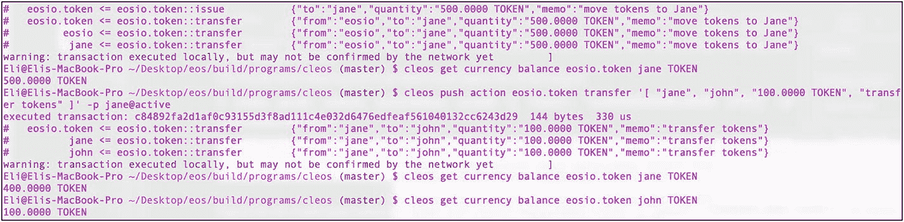

图 6-11 创建、转账及查询 eosio.token 动作余额的预期输出

## 连接公共测试网区块生产者

在撰写本文时，`EOS.IO` 提供了两个公共测试网，你可以在将代码提交到主网之前，在更真实的环境中进行测试。

- `Jungle2.0`：[https://jungletestnet.io/](https://jungletestnet.io/)
- `Kylin`：[https://www.cryptokylin.io/](https://www.cryptokylin.io/)

本例中，我选择 `Jungle2.0` 作为公共测试网，但你也可以同时测试两者；流程相同，仅端点不同。

首先，请访问 `Jungle` 项目的 `GitHub` 页面：[https://github.com/CryptoLions/EOS-Jungle-Testnet](https://github.com/CryptoLions/EOS-Jungle-Testnet)。

`EOS Jungle` 测试网与你的本地测试网几乎完全相同。你只需设置 `Jungle` API 端点并生成 `EOS` 水龙头代币，用于支付账户创建和 `RAM` 使用费用。

测试网 API 端点为 [https://jungle.eosio.cr:443](https://jungle.eosio.cr:443)；只需添加此端点，你之前的命令即可正常工作。

> **注意：**
> 始终在测试网上测试代码，然后再将代码发布到主网。仅在 2018 年 9 月，就有价值 24 万美元的 `EOS` 代币从 `EOSBet` 的智能合约账户中被盗，原因是智能合约的编程漏洞被黑客利用，而非 `EOS.IO` 平台本身的缺陷。你将在第 10 章中了解更多关于安全性的内容。

要创建账户，你需要生成两个默认权限：`owner` 和 `active`。你可以通过访问 [https://nadejde.github.io/eos-token-sale/](https://nadejde.github.io/eos-token-sale/) 或重复运行之前使用过的相同命令行来实现。

```
> cleos create key --to-console
Private key: [key]
Public key: [key]
```

接下来，你需要创建一个账户。你可以访问 `Jungle` 页面，并使用生成的公钥来创建账户：[https://monitor.jungletestnet.io/#account](https://monitor.jungletestnet.io/%2523account)。

我随机选择了一个名称 `liontestaa11`，但你可以随意使用任何你想要的名称。不过，请注意严格的命名限制（仅允许使用 a–z 和 1–5，长度必须为 12 个字符）。如果不遵守此命名限制，你的账户将无法创建。见图 6-12。

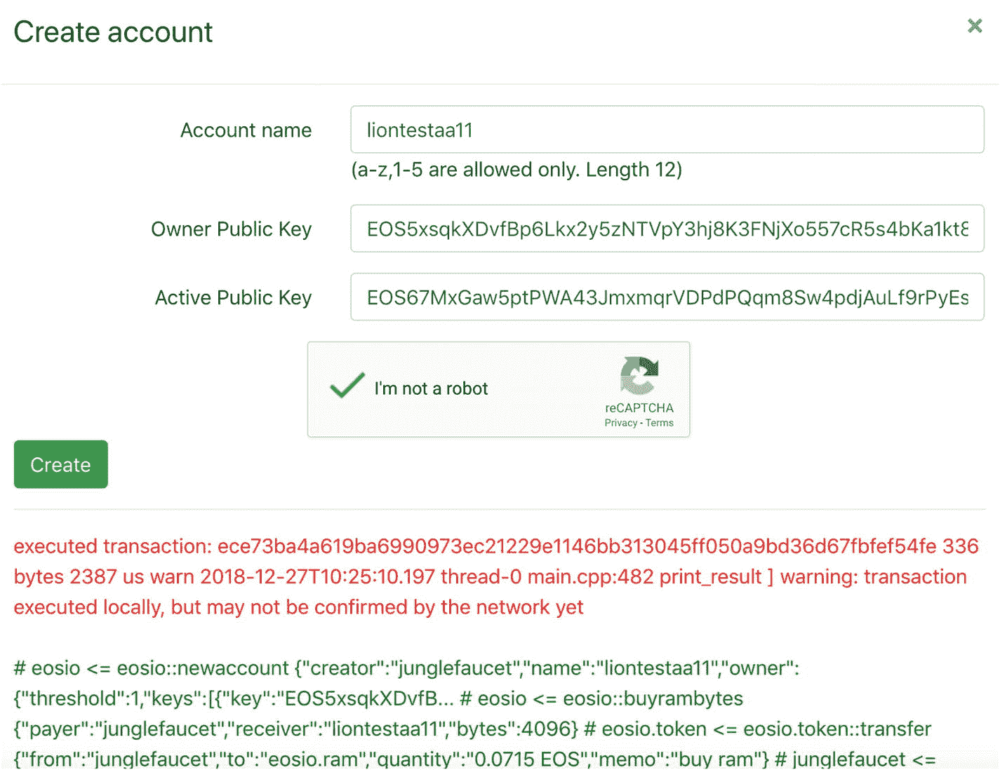
**图 6-12** `Jungle2.0`的`liontestaa11`账户已创建

注意，你会看到与本地测试网相同的关于交易正在执行但尚未确认的警告。

要获取测试网的信息，你可以运行与本地测试网相同的 `get info` 命令。只需添加 `Jungle` 端点的 URL 参数即可。

```
> cleos --url https://jungle.eosio.cr:443 get info
```

所有 `cleos` 命令都需要 URL 端点参数；你可以编辑你的 `bash` 配置文件，将 `cleos` 指向你想要的 URL。编辑 `bash` 配置文件，将区块生产者的端点指向公共测试网，同时钱包仍指向本地机器。

```
> vim ~/.bash_profile
```

添加以下行：

```
alias cleos-testnet='cleos --url https://jungle.eosio.cr:443 --wallet-url http://localhost:8888'
```

这里你没有设置自定义端口的 `config.ini` 文件，但将端口改为了 `8888`。请记住，要运行 `bash` 配置文件以提交更改，请执行以下操作：

```
> . ~/.bash_profile
```

现在，你可以使用 `cleos-testnet` 运行所有命令。

```
> cleos-testnet get info
```

### 在公共测试网区块生产者上购买资源分配

现在，你将发布上一节中创建的“HelloWorld”智能合约。

如果你要在主网上发布合约，你需要购买 `RAM` 并支付费用来创建账户，这样才能发布智能合约。`EOS` 代币用于购买资源。在公共测试网中，你不必为资源花费真钱。你可以获得用于 `Jungle` 区块生产者的虚假水龙头代币，以购买资源。

要获取这些代币，你只需要提供你的账户名称。在 `Jungle` 水龙头中输入你的账户名称以获取代币：[http://monitor.jungletestnet.io/#faucet](http://monitor.jungletestnet.io/%2523faucet)。见图 6-13。

我将在下一节中更详细地解释资源分配，届时你将准备发布到主网。

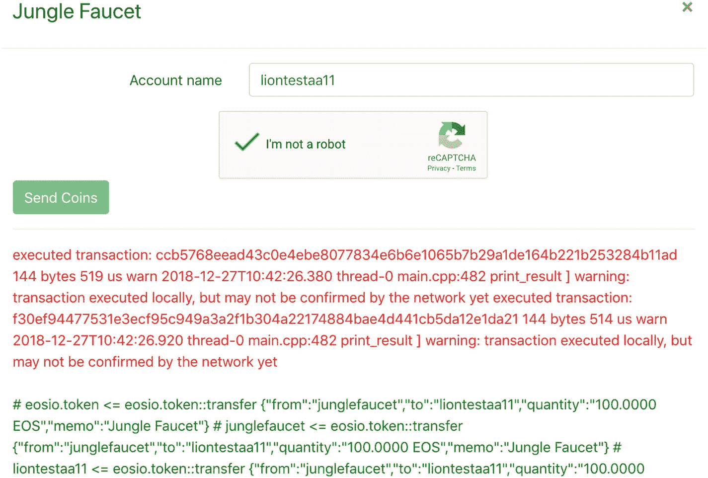
**图 6-13** `Jungle2.0`通过`Jungle`水龙头获取代币

你可以使用 `get account` 命令检查账户余额；输出结果见图 6-14。

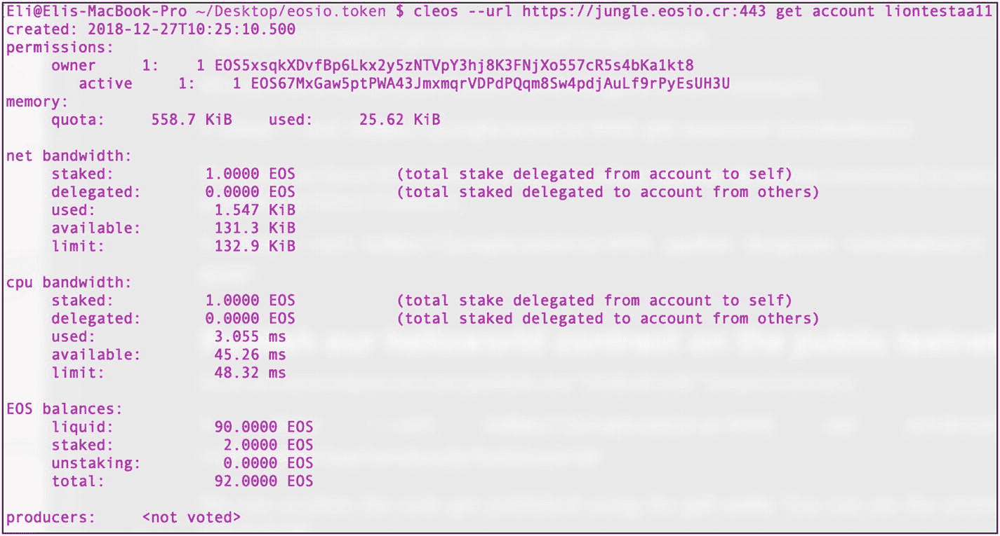
**图 6-14** `Jungle`水龙头账户余额

```
> cleos --url https://jungle.eosio.cr:443 get account liontestaa11
```

现在你有了 `EOS` 代币，可以运行 `cleos system buyram` 命令来购买 `RAM`，以便发布智能合约。

```
> cleos --url https://jungle.eosio.cr:443 system buyram liontestaa11 liontestaa11 "10 EOS"
```

### 在公共测试网上发布你的 HelloWorld 合约

现在你有了代币，可以在公共测试网上发布你的 `HelloWorld` 智能合约。运行 `set contract` 命令。

```
> cleos --url https://jungle.eosio.cr:443 set contract liontestaa11 ~/Desktop/helloworld
```

你可以使用 `get code` 命令确认代码已发布。你可以在图 6-15 中看到预期的完整输出。

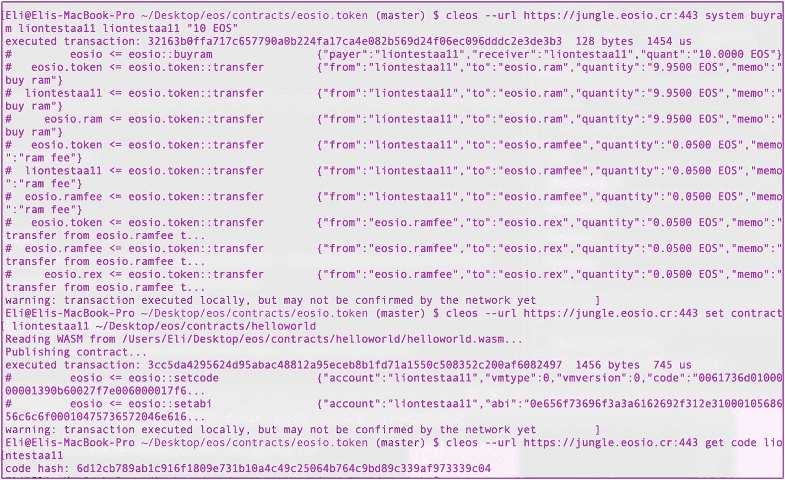
**图 6-15** 在公共测试网上发布合约时的预期输出

```
> cleos --url https://jungle.eosio.cr:443 get code liontestaa11
```

## 连接到主网

`EOS.IO` 主网与测试网几乎相同；你只需要使用不同的 API 端点，并实际用真实的 `EOS` 代币支付账户和 `RAM` 的费用。

获取 `EOS` 代币主要有三种方式：

*   *挖矿*：创建区块生产者并挖取 `EOS`。
*   *购买 `EOS` 代币*：可以在加密货币交易所购买。
*   *赠送*：从他人那里获得 `EOS` 作为礼物。

正如你在前面章节中所见，创建区块生产者并让 `EOS.IO` 网络选中并非易事，也无法保证成功；而且你只需要一些代币来购买 `RAM` 以开设账户和获取资源，所以不需要太多代币。因此，直接购买这些代币会更容易。

你需要首先在法币交易所（如 `Coinbase`、`CEX.io` 或 `Coinmama`）购买比特币、以太坊或其他币种。然后使用 `Binance` 或 `Changelly` 等交易所将你的币种兑换为 `EOS` 代币。原因是，在撰写本文时，还没有已知的交易所可以直接将你的法币兑换为 `EOS`。

接下来，你需要一个端点。21 个被选中的区块生产者能够为你提供端点。你可以在以下网址找到所有可用的区块生产者以及有关区块挖矿的其他数据：

*   [http://eosnetworkmonitor.io/](http://eosnetworkmonitor.io/)
*   [https://eostracker.io/producers](https://eostracker.io/producers)

找到你想使用的区块生产者后，在 URL 末尾添加 `/bp.json` 以查找端点。示例如下：[https://api.eosnewyork.io/bp.json](https://api.eosnewyork.io/bp.json)。

`JSON` 输出会提供区块生产者的信息，并确保其已准备好使用。要设置 URL，只需将 `--url` 标志调整为你想要连接的区块生产者；其余命令与公共测试网完全相同。

```
> cleos --url https://api.eosnewyork.io:443 get info
```

与之前一样，你可以像编辑公共测试网配置那样编辑 `bash` 配置文件。

```
alias cleos-mainnet='cleos --url https://api.eosnewyork.io:443 --wallet-url http://localhost:8888'
```

你的 `bash` 配置文件应该如下所示：

```
PATH="/usr/local/eosio/bin:${PATH}"
alias cleos-testnet='cleos --url https://jungle.eosio.cr:443 --wallet-url http://localhost:8888'
alias cleos-mainnet='cleos --url https://api.eosnewyork.io:443 --wallet-url http://localhost:8888'
```

通过运行 `get info` 命令确认其工作正常。

```
> cleos-mainnet get info
```

这里我将避免重复公共测试网部分中的相同步骤，以及花费真实现金在“HelloWorld”示例智能合约上。但是，我将介绍资源分配，因为你需要深入理解它才能在主网上发布智能合约。

### 资源分配详解

在讲解测试网时，我曾简要提及资源分配，因为你需要获取 `EOS` 代币才能在公共测试网上发布智能合约。

对于主网，你需要实际的 `EOS` 代币来购买 `RAM` 并创建账户。`EOS.IO` 账户会消耗三种类型的资源：

- **磁盘**：带宽和日志存储（磁盘）
- **CPU**：质押计算和计算积压（CPU）
- **RAM**：质押状态存储

### 在主网上购买 `RAM`

为了释放 `RAM`，你需要从账户状态机制中删除数据，然后 `RAM` 可以在 `RAM` 市场以当前价格出售。`RAM` 市场价格可在此处查看：[https://www.feexplorer.io/EOS_RAM_price](https://www.feexplorer.io/EOS_RAM_price)。

### 在主网上创建 `EOS.IO` 账户

`EOS.IO` 账户是必要的，因为你需要它们与 `EOS.IO` 网络交互并创建账户。正如我之前所解释的，已有账户的人需要为创建新账户作担保。如果你没有认识的人拥有 `EOS` 账户来帮你创建，你可以通过第三方服务提供商创建账户。第三方服务提供商通常会收取费用。例如，你可以在手机上下载 `EOS Lynx`，支付 2 美元创建一个 `EOS.IO` 账户。

### 更改账户的公钥和私钥

获得主网账户后，工作并未结束。在向账户充值前，你需要确保更改私钥，因为创建账户的服务方可能存储你的私钥并盗取资金。你对这些步骤已经熟悉；这里唯一的新命令是 `remove_key`，它用于从钱包中移除旧密钥。你需要创建一个新密钥，解锁钱包，使用新密钥重置权限，移除旧公钥并导入新私钥。请按照以下步骤操作：

```
> cleos create key
> cleos wallet unlock
> cleos set account permission [账户名] active [公钥] owner -p [账户名]@owner
> cleos set account permission MYACCOUNT owner [公钥] -p [账户名]@owner
> cleos wallet remove_key [旧公钥]
> cleos wallet import [私钥]
```

### `CPU` 和带宽分配

要获取带宽和 `CPU`，你需要分配 `EOS` 代币，资源将根据质押合约期内持有的代币数量按比例自动提供给你。

例如，在质押窗口期内，假设你想消耗 1 个 `CPU` 单位。为此，你需要与其他账户竞争，使你的账户拥有所有 `CPU` 质押代币的 0.1%，或者由他人将这些代币委托给你的账户。

质押期结束后，已消耗的资源会被释放，你可以重复使用相同的质押代币，因此无需每次购买更多 `EOS` 代币。使用完毕后，`EOS` 代币可以解除委托。

## 下一步

`EOS.IO` 提供了一个包含链接的在线资源，请访问：[https://developers.eos.io](https://developers.eos.io)。该开发者资源提供了有价值的文档，以及我未提及的其他工具信息，例如：

- **状态处理器**：`demux-js`
- **JavaScript 库**：`eosjs`

我还建议探索 `EOS` `GitHub` 上的智能合约示例，这可以帮助你了解所有功能以及 `EOS.IO` 能实现什么。

## 本章小结

在本章中，我详细介绍了 `EOS.IO` 区块链。你通过安装 `EOS.IO` 和 `EOSIO.CDT` 库搭建了本地测试网环境，并学习了如何配置 `keosd` 和 `nodeos`。你了解了 `EOS.IO` 钱包，包括如何创建、删除和备份钱包，以及如何创建自定义名称的钱包并执行打开、锁定和解锁钱包等操作。

接着，我介绍了钱包的密钥对，以及如何启动和重启本地节点（`nodeos`）来运行本地区块生产者。你学习了活动权限和所有者权限，以及单签名（`single-sig`）账户和多签名（`multisig`）账户。

为了理解 `EOS.IO` 智能合约，你通过先创建账户然后编写 `C++` 代码，创建了“HelloWorld”智能合约和代币。随后你编译并生成了 `WebAssembly` 和 `ABI` 文件以及黎加德合约。然后你学习了如何部署已创建的合约并与之交互。代币生成后，你能够在账户之间发行和转账代币。

接下来，你通过连接公共测试网区块生产者，在更真实的环境中测试了智能合约，最后学习了如何连接和发布主网，并了解了 `EOS.IO` 网络上的资源分配。

在下一章中，我将介绍 `NEO` 区块链钱包和 `NEO` 智能合约。