# 7. NEO 区块链与智能合约

在第 1 章中，我介绍了 NEO 权益证明（PoS）区块链共识机制。在第 2 章中，你在 AWS Ubuntu 上创建了 NEO 记账节点，并学习了如何申请共识授权证书以及如何被选举为记账人。

在本章中，我将进一步讲解 NEO 区块链，你将学习如何搭建本地环境、在 NEO 钱包中进行操作、创建智能合约（NeoContracts）并发布。本章将涵盖 NEO 区块链的高级架构，以及如何搭建本地环境、创建本地测试网链、用 C# 和 Python 创建“Hello, World”项目、发布这些智能合约，并学习比较以太坊、EOS 和 NEO 的标准。

如你所见，理解智能合约、区块链和发布流程在不同项目之间是相似的，学习三个项目足以让你掌握如何与其余 40 个（截至撰写本文时）可编写智能合约的项目进行协作。

## NEO 的高级区块链架构

NEO 成立于 2014 年，最初名为“小蚁股”（AntShares），由达鸿飞和张铮文创立，随后于 2015 年 6 月在 GitHub 上以 NEO 为名开源。NEO 的共识机制称为拜占庭容错（`dBFT`），这是一种改进的权益证明（PoS）机制。这种机制使得 NEO 成为一个可扩展的区块链。记账节点被随机选中来验证交易，并且每秒可支持多达 10,000 笔交易。

> *“NEO 是一个由社区驱动的非盈利区块链项目。它利用区块链技术和数字身份，通过智能合约实现资产数字化以及数字资产的自动化管理。它旨在利用分布式网络创建一个‘智能经济’。”*
>
> — Neo.org

NEO 的交易费用以 NEO 的 GAS 代币支付。NEO 的创世区块包含 1 亿枚 NEO。其中一半出售给了早期投资者，另一半则锁定在 NEO 智能合约代币中。每年有 1500 万枚 NEO 代币被解锁，用于 NEO 开发团队资助开发目标。NEO 对交易以及智能合约相关交易收取费用。与智能合约相关的 NEO 费用结构在 NEO 白皮书中列出：[`http://docs.neo.org/en-us/sc/systemfees.html`](http://docs.neo.org/en-us/sc/systemfees.html)。

在编程语言方面，NEO 智能合约支持 `NeoVM`（NEO 的通用轻量级虚拟机）编译器、Microsoft .NET、Java、Kotlin、Go 和 Python。

以下是一些值得注意的 NEO 开发特性：

- NEO 可以创建基于通信标准（`NEP5`）构建的智能合约代币。这些代币能够与其他 NEO 代币进行通信。
- 智能合约可以与其他区块链进行通信（此特性称为 `NeoX`）。
- NEO 可以通过文件共享协议（称为 `NeoFS`）传递信息。
- 它采用一种基于格密码的加密机制，称为量子安全机制（`NeoQS`）。

NEO 的“智能经济”基础设施（我将在下一节解释此概念）使智能合约能够支持前端应用，并通过开放 API 与其他智能合约以及其他区块链进行集成。

NEO 的开放 API 允许您集成来自外部来源的数据。图 7-1 展示了 `NeoVM` 的高级架构图。`NeoVM` 核心是部署框（虚线框）。如您所见，外部数据与执行引擎（绿色框）使智能合约能够交互并执行操作。然后，数据可以存储在 NEO 的分布式账本上。

> *“我们希望该平台可用于不同的前端场景，例如数字资产钱包、论坛、投票、个人资料管理和移动应用。该平台还具备一个开放 API，可用于与其他系统集成。”*
>
> — 达鸿飞，NEO 联合创始人

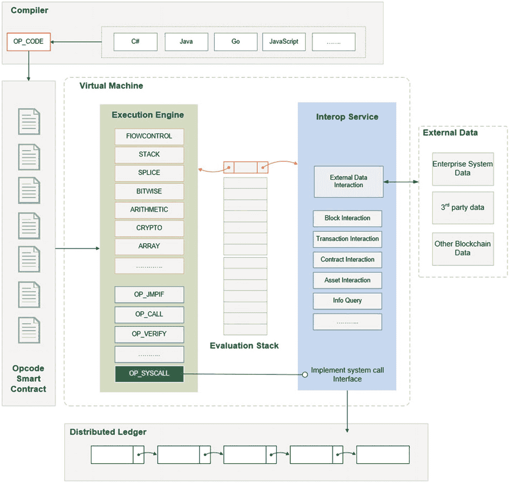

图 7-1 — NEO 的虚拟机架构图。图片来源：`docs.neo.org`。

## 什么是 NEO 的智能经济？

NEO 创造了 *智能经济* 这个术语，它诠释了 NEO 的愿景。这个愿景包括借助去中心化区块链的力量，将您现有的市场从传统经济转变为智能经济。为实现这一目标，NEO 将数字资产、数字身份和智能合约集成到其平台中。

### 注意

NEO 的智能经济愿景旨在通过去中心化区块链的力量，改变现有市场的运作方式，从传统经济转变为“智能经济”。这是通过集成数字资产、数字身份和智能合约来实现的。

NEO 的智能经济概念包含以下三个组成部分的集成：

- *NEO 数字资产*：这些资产包含电子数据并且是可编程的。将数字资产置于区块链上可以带来权益证明（PoS）区块链的优势，例如去中心化、信任、可追溯性和透明度。NEO 区块链使用户能够注册、交易和转让不同类型的资产。实物资产通过数字身份实现数字化；然后这些数字资产可以通过验证受到法律保护。对于首次代币发行（ICO），注册一个数字资产需要花费 5000 个 GAS。之后每年需缴纳 5000 个 GAS 的续期费。

- *NEO 数字身份*：这是个人、组织或任何其他实体身份的数字化。NEO 数字身份基于公钥基础设施（`PKI`）X.509 标准实现，该标准也支持信任网的点对点证书。

- *NEO 智能合约*：NEO 上的智能合约称为 `NeoContracts`，它们支持 C#、VB.NET、F#、Java、Kotlin 和 Python 语言。支持这些语言能够带来在 Visual Studio、Eclipse 和 WebStorm IDE 中进行复杂开发、调试和编译的好处。`NeoVM` 是为可扩展性而构建的。

## 设置您的本地环境

如前所述，NEO 支持企业级编程语言，例如 C#、VB.NET、F#、Java、Kotlin 和 Python。这种编程语言的选择使 NEO 在构建 `NeoContracts` 方面具有优势，因为您可以利用 Visual Studio 2017 IDE，该 IDE 提供用于开发的企业级工具。在本章中，我将使用以下 .NET 工具：

- *Visual Studio 2017 IDE*：若要跟上操作，请安装适用于 Mac 的 Visual Studio (VS) Community 版。
- *.NET Core*：若要跟上操作，请安装 .NET Core 以便能够发布 DLL 库文件。

除了 .NET，您还需要以下工具：

- *Xcode 10.1*：您需要 Xcode 10.2 来获取将要安装的工具和库。
- *Docker*：Docker 是用于创建容器和集成软件的流行工具。您将把 Docker 用于您的私有网络，以运行一个完整的 NEO 区块链，从而在单个轻量级 Docker 容器中模拟四个共识节点。
- *neo-compiler*：需要 NEO 编译器来将您的代码转换为可在 NEO 区块链上部署的 `.avm` 文件。
- *neo-cli*：您将安装并使用 NEO 命令行工具来处理钱包、操作以及对 NEO API 的 RPC 调用。

现在您已经了解了所需工具，让我们开始吧。

### Xcode 10.2

在撰写本文时，您需要安装至少版本为 10.1 的 Xcode，以获取 NEO 所需的工具和库。撰写本文时最新的 Xcode 版本是 Xcode 10.2.1。

您可以通过命令行检查是否已安装 Xcode。

```
> xcodebuild --version
Xcode 10.1
Build version 10B61
```

如果已安装 Xcode，此命令将输出版本号。如果您需要升级或安装，请访问 Apple 开发者门户：[`https://developer.apple.com/download/`](https://developer.apple.com/download/)。

### 安装 Visual Studio 2017 IDE

接下来，下载并安装最新版本的 Visual Studio (VS) Mac 社区版。社区版是免费的，可以从以下网址下载：[`https://visualstudio.microsoft.com/vs/community/`](https://visualstudio.microsoft.com/vs/community/)。

为方便日后参考，如需卸载部分或全部 VS，请按照此处的说明操作：[`https://docs.microsoft.com/en-us/visualstudio/mac/uninstall#net-core-script`](https://docs.microsoft.com/en-us/visualstudio/mac/uninstall%2523net-core-script)。

完整的 VS 2017 会占用大量磁盘空间；但是，您不需要下载所有包。为了开发 NeoContracts，您只需要 Xamarin Workbooks，因此只下载所需的部分即可。

在安装过程中，安装向导会提供您要安装的平台和工具的选项。通过单击复选框选择 Xamarin Workbooks，然后单击“安装”按钮。请参见图 7-2。

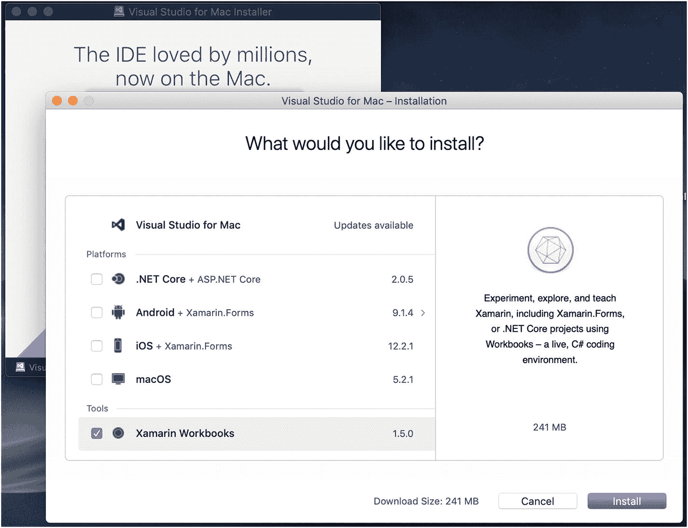

图 7-2 — Visual Studio 2017 Mac 社区版安装向导

### 安装 .NET Core

您将要安装 .NET Core，以便能够通过命令行发布 DLL 库文件。这将通过 `dotnet publish` 命令完成。要下载它，请访问 dotnet Microsoft 网站；请参见图 7-3。

[`https://dotnet.microsoft.com/download`](https://dotnet.microsoft.com/download)

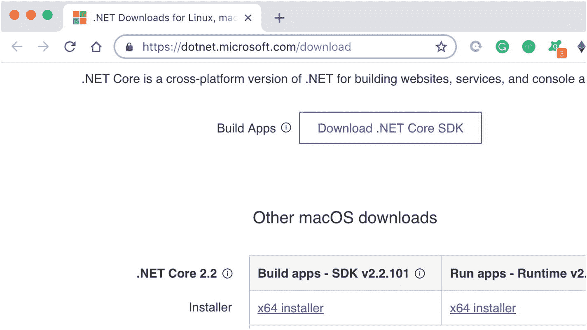

图 7-3 — 下载 Microsoft dotnet core

您将下载两者：构建应用 - SDK v2.2.101 和运行应用 - 运行时 v2.2.0。

要确认安装成功，请运行 `dotnet --version` 命令。

```
> dotnet --version
2.2.101
```

此命令将输出 dotnet 版本，在撰写本文时，该版本为 2.2.101。

如果 SDK 未安装，您将收到以下错误消息：

```
Did you mean to run dotnet SDK commands? Please install dotnet SDK from: http://go.microsoft.com/fwlink/?LinkID=798306&clcid=0x409
```

您还可以通过 `dotnet --info` 命令输出您的机器信息。

```
> dotnet --info
```

### 安装 Docker

接下来，您将安装 Docker。需要 Docker 来创建一个容器，您将使用该容器来创建您的本地区块链。

- **从此处下载 Docker**：[`https://download.docker.com/mac/beta/Docker.dmg`](https://download.docker.com/mac/beta/Docker.dmg)
- **安装说明**：[`https://runnable.com/docker/install-docker-on-macos`](https://runnable.com/docker/install-docker-on-macos)

一旦 Docker 下载并安装完成，请双击“应用程序”菜单中的 Docker 以启动 Docker。您将在计算机的顶部菜单中看到 Docker 图标。您可以通过在命令行中输入 `docker` 来验证它是否正确安装；它将列出 Docker 命令。

```
> docker
```

运行 `docker ps` 以查看正在运行的容器，以确保您不会收到任何错误消息。

```
> docker ps
```

如果 Docker 未运行，您将收到以下消息：

```
Cannot connect to the Docker daemon at unix:///var/run/docker.sock. Is the docker daemon running?
```

如果收到此消息，只需打开 Docker。此外，如果您的容器未运行但已创建，您可以使用 `-a`（全部）标志并查找容器 ID。

```
> docker ps –a
List containers
```

然后，当您获得容器 ID 时，您可以启动该容器。

```
> docker start [CONTAINER ID]
```

现在，您还看不到任何容器列表，因为您尚未创建您的容器。

### 下载 NeoCompiler 并生成 neon.dll

要创建您的 NeoContract，您需要生成一个 `.avm` 文件。为此，您需要创建一个 `neon.dll` 文件，以便能够生成智能合约。首先，您将把 neo-compiler 克隆到您的桌面，然后生成 `neon.dll` 文件。

```
> cd ~/Desktop
> git clone https://github.com/neo-project/neo-compiler
> cd ~/Desktop/neo-compiler/neon/
```

要发布您的独立 `.avm` 文件，您需要设置一个运行时标识符。您可以将 `neon.csproj` 运行时标识符设置为正确的操作系统。由于我在这里使用的是 Mac 而非 PC，因此我需要更改 `neon.csproj` 文件。要跟着操作，请先复制一份原始文件。

```
> cp neon.csproj neon.csproj.backup
```

我使用的是 vim，但您可以使用任何喜欢的编辑器。

```
> vim neon.csproj
```

打开文件后，替换以下设置目标框架的配置。

> **注意：** 您可以在此处将我项目的输出和设置与您的进行比较：`chapter7/NEO/neo-compiler/neon/`。同时，您也可以在那里找到 `neon.csproj`。

```xml
2016-2017 The Neo Project
Neo.Compiler.MSIL
2.3.1.1
The Neo Project
netcoreapp2.0
anycpu
neon
Exe
Neo.Compiler.MSIL
osx.10.12-x64
Neo.Compiler
The Neo Project
Neo.Compiler.MSIL
Neo.Compiler.MSIL
RELEASE;NETCOREAPP1_0
none
False
true
true
```

现在，通过传递 `RuntimeIdentifier` 设置参数，`dotnet publish` 指向运行时标识符 `osx.10.11-x64`。

```
> dotnet publish -r osx.10.11-x64
```

编译器在此处创建了您的 `neon.dll` 文件：

```
bin/Debug/netcoreapp2.0/osx.10.11-x64/publish/neon.dll
```

输出结果可参见图 7-4。

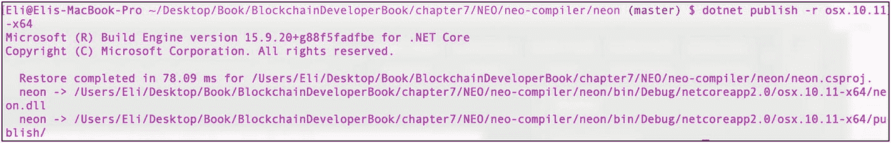

图 7-4 — 为目标 osx.10.11-x64 编译 neon.dll

### 使用 neo-cli 生成 NEO 节点

接下来，您要创建一个完整的 NEO 节点。要生成一个完整的 NEO 节点，有两个完全节点选项。

- **neo-gui**：开发者和 NEO 用户都可以使用。它可以用于执行基本的用户客户端操作，例如管理钱包以及发布智能合约。它有一个可视化用户界面。但是，在撰写本文时，它仅适用于 Windows。

- **neo-cli**：它为基本的钱包操作提供了一个外部 API。它还有助于其他节点与网络保持共识并生成新块。

在这种情况下，我将在 Mac 上进行安装，因此您将使用 `neo-cli` 通过命令行管理您的钱包。但是，您最好知道可以安装 `neo-gui` 并以这种方式创建一台虚拟 PC。

#### neo-cli

对于`neo-cli`，您需要安装 LevelDB 包，因为它是一个依赖项。您还记得，您已经在第 3 章中通过 Homebrew 安装了 LevelDB。如果您之前没有安装 LevelDB，请再次使用以下命令：

```
> brew install leveldb
```

或者，您可以检查是否已安装并进行升级。

```
> brew upgrade leveldb
```

接下来，将`neo-cli`克隆到您的桌面。

```
> cd ~/Desktop
> git clone https://github.com/neo-project/neo-cli
```

现在，您可以使用`dotnet`从您下载的源代码发布`neo-cli`。

```
> cd neo-cli
> dotnet restore
> dotnet publish -c Release
```

`.dll`文件应创建在`Release`文件夹中；输出结果可参见图 `7-5`。

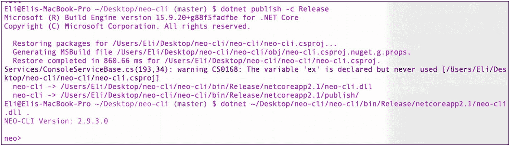

> **注意：** 您可以在此处将我项目的输出和设置与您的进行比较：`chapter7/NEO/neo-cli`。

要运行`.dll`文件，您可以使用`dotnet`命令和 DLL 文件的位置，这将启动一个 NEO 命令行终端。

```
> cd bin/Release/netcoreapp2.1/
> dotnet neo-cli.dll.
```

`neo-cli`也支持插件。例如，您可以在`neo-cli`中使用应用程序日志启用日志记录，或者通过 RPC 安全性提高 RPC 节点的安全性。插件列表可以在这里找到：[`https://github.com/neo-project/neo-plugins`](https://github.com/neo-project/neo-plugins)。

## 搭建本地 NEO 私有测试网

你可以像在其他区块链上一样，在公有测试网上运行你的 NeoContracts；不过，最好还是运行自己的私有测试网，这样你就能完全掌控它。私有测试网可以部署在云端，但你需向服务商付费，因此在本地机器上搭建测试网是更优选择。

从文档可以看出，NEO 的工具主要面向 PC 用户开发。然而，得益于 City of Zion 社区（CoZ, [`https://github.com/CityOfZion`](https://github.com/CityOfZion) ）开发的工具，任何支持 Docker 和 Python 的平台都可以运行私有链。

运行本地 NEO 私有测试网的步骤如下：

1. *安装`neo-python`*：这将使你能够运行一个完整的 NEO 节点并与区块链进行交互。
2. *创建`neo-privatenet-docker`*：这将使你能够在一个轻量级的 Docker 容器中运行包含四个共识节点的完整 NEO 区块链。
3. *创建 NEO 钱包*：这将连接到私有网络并创建一个钱包。
4. *领取*：初始状态为 100,000,000 个 NEO。
5. *引导测试网*：这将同步网络。

### Python 3.6

`neo-python`需要 Python 3.6 或更高版本。Mac 系统自带 Python，你可以通过`--version`命令确认是否已安装`python3`。

```
> python3 --version
Python 3.6.x
```

如果你运行的是旧版 Python 并需要安装/重装 Python，请遵循以下步骤：

```
> brew unlink python
```

接下来，使用 Brew 安装 Python。

```
> brew install --ignore-dependencies https://raw.githubusercontent.com/Homebrew/homebrew-core/f2a764ef944b1080be64bd88dca9a1d80130c558/Formula/python.rb
```

现在切换 Python 版本。

```
> brew switch python 3.7.0
> brew switch python 3.6.5_1
```

如果你没有安装`pip`，请运行以下命令：

```
> curl -O https://bootstrap.pypa.io/get-pip.py
> sudo python get-pip.py
> pip
```

### 安装`neo-python`

接下来，从 City of Zion 克隆`neo-python`并切换到 development 分支。

```
> cd ~/Desktop
> git clone https://github.com/CityOfZion/neo-python.git
> cd neo-python
> git checkout development
```

你可以使用 Python 3.6 创建一个虚拟环境，然后运行`activate`脚本。

```
> python3.6 -m venv venv
> source venv/bin/activate
```

通过运行以下命令确保你拥有最新的`pip`版本：

```
(venv)> pip install --upgrade pip
```

现在你可以以可编辑的形式安装该包。

```
(venv)> pip install -e .
```

你可以将你的输出与我的进行对比；到目前为止你完成的步骤，请参见图 `7-6`。

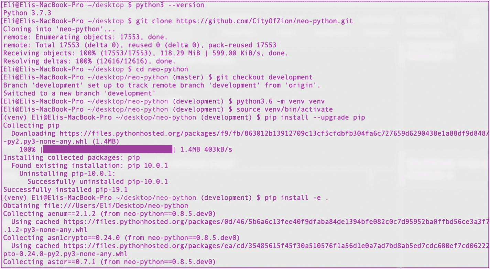

为确认安装成功，请运行`--version`命令。在撰写本文时，它输出版本号 0.8.3。

```
> np-prompt --version
neo-python v0.8.3-dev
```

现在你可以使用`np-prompt`命令打开一个 NEO bash 界面。要退出 bash，请运行`exit`命令。

```
> np-prompt
neo>exit
```

### 安装`neo-privatenet-docker`

你已经安装了 Docker，现在可以创建一个 Docker 容器，该容器将创建四个 NEO 节点以形成私有测试网。请继续在你的桌面上安装 Docker 容器并构建文件，如下所示：

```
> cd ~/Desktop
> git clone https://github.com/CityOfZion/neo-privatenet-docker.git
> cd neo-privatenet-docker
> ./docker_build.sh
```

镜像构建完成后，你可以像这样启动私有网络：

```
> ./docker_run.sh
Successfully built #build number
```

#### 注意

如果 Docker 需要重启或未运行，请执行以下命令：

```
> ./docker_run.sh
```

## 启动网络并领取初始 NEO 和 Gas

接下来，你将启动私有网络，创建钱包，并领取初始 NEO 和 40 个 Gas。这通过运行`docker_run_and_create_wallet.sh`脚本来完成。你可以在图 `7-7`中看到输出。

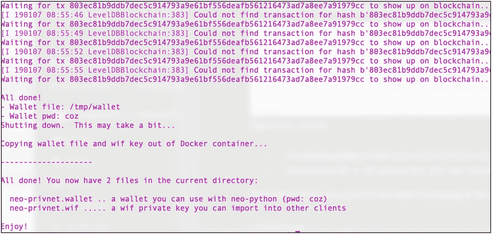

```
> ./docker_run_and_create_wallet.sh
```

过程完成后，你会得到所创建的两个文件的确认信息（参见图 `7-7`）。

* `neo-privnet.wallet`：这是一个可与`neo-python`配合使用的钱包文件。
* `neo-privnet.wif`：这是一个 WIF 私钥文件，你可以导入其他客户端，例如`neo-gui`。

这些文件使你可以访问包含私有网络 NEO 和 Gas 的钱包。脚本已自动为你领取了 NEO 和 Gas。

你可以检查 Docker，查看`neo-privnet`容器是否正在运行，如图 `7-8`所示。

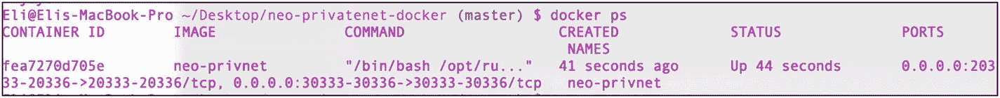

```
> docker ps
```

## 引导测试网

现在你已经有了一个正在运行的私有测试网，需要引导测试网的区块链数据库。这可以同步网络，通过运行`np-bootstrap`来完成。这可能需要一些时间；完成后，你会收到确认信息。

```
> np-bootstrap -n
confirm
Successfully downloaded bootstrap chain!
```

注意，你使用了`-n`标志来获取数据库通知。

## 启动 NEO Bash

现在你已经让私有测试网容器运行着四个节点，并且已引导测试网数据库，你可以通过调用`prompt.py`命令来启动一个`neo-cli`bash 界面。

```
> cd ~/Desktop/neo-python/neo/bin
> python3.6 prompt.py -p
```

运行此命令后，NEO bash 界面打开，你可以使用`state`命令查看区块链的信息，如图 `7-9`所示。

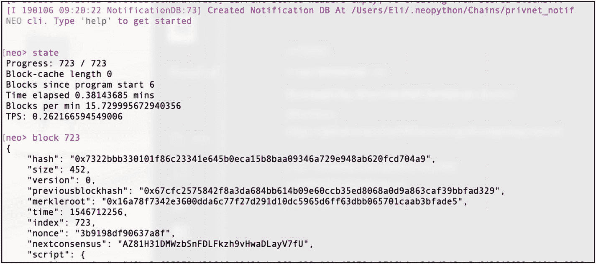

```
neo> state
```

`neo-cli`通过 NEO API 提供了对许多 RPC 调用的访问；但是，需要打开钱包才能运行这些命令。你可以使用`wallet`命令和文件位置打开钱包。该命令会要求输入钱包密码。密码请使用`coz`。

```
neo> wallet open ~/Desktop/neo-privatenet-docker/neo-privnet.wallet
password: coz
```

接下来，重建钱包并调用`wallet`命令。你将看到可用的 NEO 和 NeoGas 假测试网代币（参见图 `7-10`）。

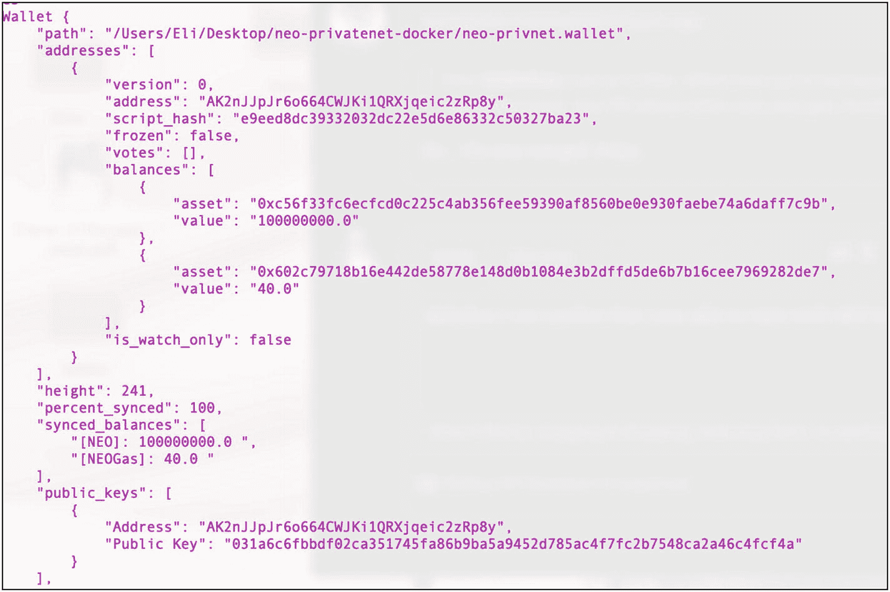

```
neo> wallet rebuild
neo> wallet
```

要关闭钱包并退出 bash，请使用`wallet close`命令然后退出。

```
neo> wallet close
neo> exit
```

你已经成功创建了一个在测试网上运行的私有 NEO 区块链，其中包含 1 亿个 NEO 和 40.0 个 NeoGas 的已领取代币，可供你用于开发。

### 安装过程中的潜在问题

NEO 有时感觉像是在追逐一个移动的目标。实际上，当你按照本书中的说明进行操作时，很可能由于 NEO 的变更，代码无法按预期工作。此外，在安装过程中，你可能会遇到一些潜在问题。建议你在此处查看最新信息：

[`https://github.com/CityOfZion/neo-python#getting-started`](https://github.com/CityOfZion/neo-python%2523getting-started)

#### 清理数据库

如果你需要清理`neo-python`数据库以重新引导和同步，请运行以下命令：

```
> rm -rf ~/.neopython/Chains/privnet*
```

#### b'Corruption 消息

如果你收到 “b’Corruption: corrupted compressed block contents” 消息，则需要重新安装 LevelDB。

```
> brew reinstall leveldb
```

#### 重启 Docker

了解如何重启 Docker 是很有用的，以防你需要重启计算机、升级 Docker 版本或升级容器文件。要重启 Docker，请从顶部菜单中选择 Docker，然后点击“重启”（参见图 `7-11`）。

状态将被删除（整个“旧”区块链将消失），并且你还应从`neo-python`中移除`Chains/privnet`以及你创建的任何私网钱包。

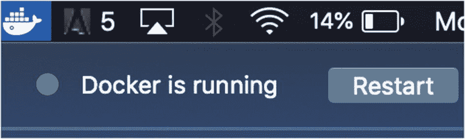

```
> rm ~/Desktop/neo-privatenet-docker/*.wallet
> rm ~/Desktop/neo-privatenet-docker/*.wif
> rm -rf ~/.neopython/Chains/privnet*
> docker ps
```

### NEO “Hello, World”

你已经在机器上搭建了本地私有测试网环境和 NEO 工具，现在可以开始开发你的 NeoContract 项目了。你可以使用不同的语言进行开发，流程是类似的。我将向你展示 C# 和 Python 两种语言的代码。我将代码精简为一个简单的“Hello, World”示例，但一旦你能够达到这一点，就可以尝试 NEO 提供的不同功能。请按照以下步骤创建并发布你的代码：

1.  *构建 NeoContract 框架*：生成一个`Neo.SmartContract.Framework.dll`文件。
2.  *创建 NEO “Hello, World” 项目*：创建你的 C# 合约项目。
3.  *用 C# 编写 NEO “Hello, World” 智能合约*：用 C# 编写你的最小化示例。
4.  *用 Python 编写 NEO “Hello, World” 智能合约*：用 Python 编写你的最小化示例。
5.  *发布*：将你的合约发布到你的私有测试网链上。

### 构建 NeoContract 框架：Neo.SmartContract.Framework.dll

第一步是创建一个包含 NeoContract 框架代码的文件，你需要将其包含在你的 NeoContract 中以访问 NEO 功能。

要构建你的 NeoContract，你需要下载并安装 NEO 开发包。你将把这些工具放在桌面上以便于访问。请注意，你之后可以随时将这些文件移动到更方便的位置。导航到桌面并克隆`neo-devpack-dotnet`项目。

```
> cd ~/Desktop
> git clone https://github.com/neo-project/neo-devpack-dotnet
```

接下来，双击运行`neo-devpack-dotnet.sln`文件，或运行终端`open`命令。

```
> open neo-devpack-dotnet.sln
```

VS 将打开，你预计会看到三条错误消息。点击“确定”忽略这些消息，因为这些错误不会影响构建你的项目。

在左侧窗口中，你可以看到“解决方案”选项卡，如图 `7-12`所示。如果`neo-devpack-dotnet (master)`未展开，请将其展开。

接下来，右键单击`Neo.Smartcontract.Framework`并选择“生成`Neo.Smartcontract.Framework`”。参见图 `7-12`。

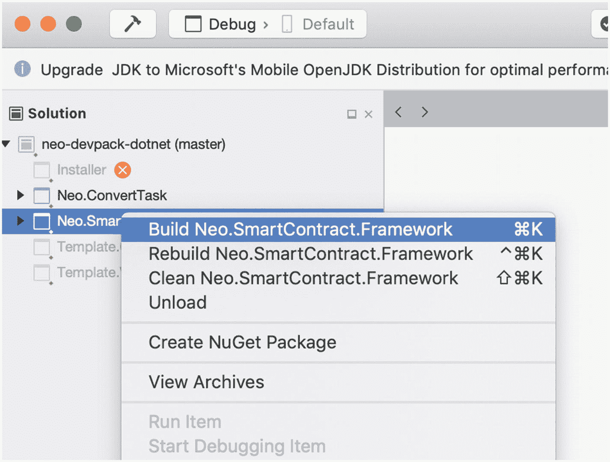

构建完成后，你将在 VS 输出窗口的顶部中间看到“生成成功”消息。你也可以在此处找到`Neo.Smartcontract.Framework.dll`文件：

```
> cat ~/Desktop/neo-devpack-dotnet/Neo.SmartContract.Framework/bin/Debug/netstandard1.6/Neo.SmartContract.Framework.dll
```

`.dll`文件是一个 .NET 中间语言（IL）文件，你将把它包含在你的库中以访问 NeoContract 框架代码。由于 NeoVM 和 C# IL 文件之间的差异，`Neo.SmartContract.Framework`不支持完整的 C# 功能集。

### 创建 NEO “Hello, World” 项目

既然 `Neo.Smartcontract.Framework.dll` 文件已经可以使用，你就可以创建你的项目并将 NEO 框架作为依赖项包含进来。

首先，打开 Visual Studio。选择**文件** ➤ **新建解决方案...** ➤ **新建项目**向导将打开。在左侧菜单中，选择**库** ➤ **.NET 标准库**。接下来，选择 **.NET Standard 2.0** 作为 .NET Core 版本，然后点击**下一步**。参见图 7-13。

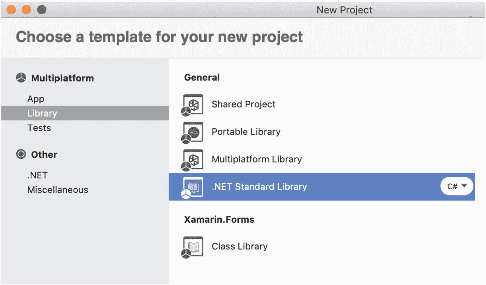

图 7-13 新建项目模板向导

配置向导将以一个新项目窗口打开。将项目命名为 `hello_contract`，保留默认设置，然后点击**创建**按钮。参见图 7-14。

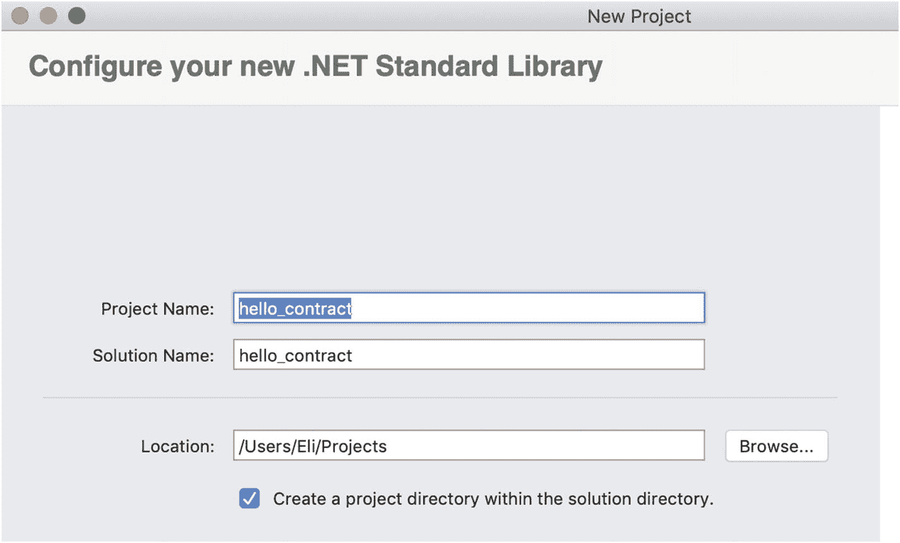

图 7-14 VS 创建新项目向导

项目创建完成后，你需要将文件 `Neo.Smartcontract.Framework.dll` 作为依赖项附加。为此，右键单击解决方案菜单中的**依赖项**文件夹，然后点击**编辑引用**。参见图 7-15。

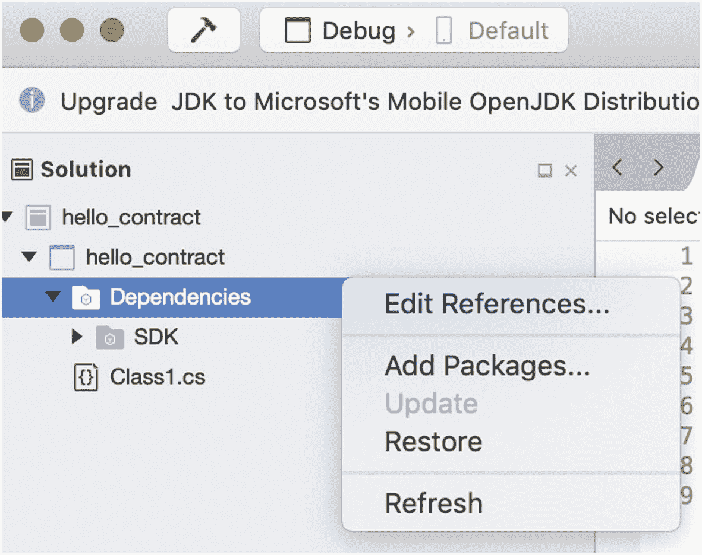

图 7-15 “Hello, World”项目依赖项编辑引用

在**编辑引用**窗口中，转到 **.NET 程序集**选项卡。选择**浏览**并添加位于以下位置的 `Neo.Smartcontract.Framework.dll` 文件：

```
~/Desktop/neo-devpack-dotnet/Neo.SmartContract.Framework/bin/Debug/netstandard1.6/Neo.SmartContract.Framework.dll
```

接下来，点击**打开**，如图 7-16 所示。选中 `Neo.SmartContract.Framework.dll` 复选框，然后点击**确定**。

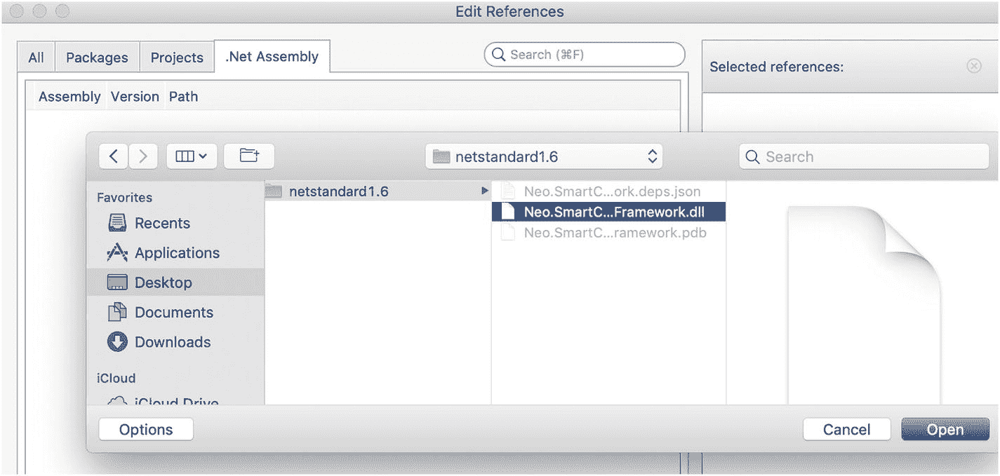

图 7-16 VC 编辑引用 .NET 程序集

### 在 C# 中编写 NEO “Hello, World” 智能合约

本节将使用 C# 在 .NET 中开发您的 NEO “Hello, World” 智能合约。NeoVM 更为精简；您只能将有限的 C# / `dotnet` 特性编译到 AVM 文件中。您可以在以下地址查看可用于开发的特性列表：[`https://docs.neo.org/en-us/sc/quickstart/limitation.html`](https://docs.neo.org/en-us/sc/quickstart/limitation.html)。

以下示例将使用 NEO 示例中提供的 “Hello, World” 示例。

```csharp
using Neo.SmartContract.Framework;
using Neo.SmartContract.Framework.Services.Neo;
public class Class1: SmartContract
{
    public static void Main()
    {
        Storage.Put(Storage.CurrentContext, "Hello", "World");
    }
}
```

编写完代码后，从顶部菜单中选择“生成”（Build），然后点击“生成解决方案”（Build All）（或按 Command+B）来编译 `Class1.cs` 代码。

`.dll` 库文件将创建在 `bin/Debug/netstandard2.0/` 文件夹中。您将使用此 `.dll` 文件配合 `neo-compiler`，将其转换为 AVM 文件。编译 DLL 文件后，`hello_contract.dll` 文件将创建在以下位置：

`~/Projects/hello_contract/hello_contract/obj/Debug/netstandard2.0/hello_contract.dll`

#### 注意

NeoContract 框架会生成 NeoVM 字节码。代码以 AVM 文件格式保存。随后可以将 `*.avm` 文件部署到 NEO 区块链上。

### 在 Python 中编写 NEO “Hello, World” 智能合约

与 C# 类似，您可以生成一些极简的 Python 代码来打印 “Hello, World”。您可以使用 Eclipse IDE（[`https://www.eclipse.org/ide/`](https://www.eclipse.org/ide/)）或任何您选择的编辑器。本指南将使用 vim。创建一个名为 `sample1.py` 的文件。

```bash
vim ~/Desktop/smartContracts/sample1.py
```

输入以下代码来打印 “Hello World”。

```python
def Main():
    print("Hello World")
    return True
```

要关闭并保存文件，请在 vim 中输入 `:wq`。

### 将智能合约编译为 .avm 文件

现在您已经拥有了两个文件，分别是 `sample1.py` 和 `hello_contract.dll`，下一步是将这些文件编译成 NEO 虚拟机文件 (`.avm`)，以便部署到 NEO 区块链上。

让我们从编译 `hello_contract.dll` 文件开始。将目录切换到 DLL 文件所在位置。

```bash
cd ~/Desktop/neo-compiler/neon/bin/Debug/netcoreapp2.0/osx.10.11-x64/publish
```

复制 `Neo.SmartContract.Framework.dll`。

```bash
cp ~/Projects/hello_contract/hello_contract/bin/Debug/netstandard2.0/Neo.SmartContract.Framework.dll ~/Projects/hello_contract/hello_contract/obj/Debug/netstandard2.0
```

现在，您可以使用 `dotnet` 核心工具将 DLL 发布为 AVM 文件，如图 7-17 所示。

```bash
dotnet neon.dll ~/Projects/hello_contract/hello_contract/obj/Debug/netstandard2.0/hello_contract.dll
```

您可以看到输出内容，如图 7-17 所示。

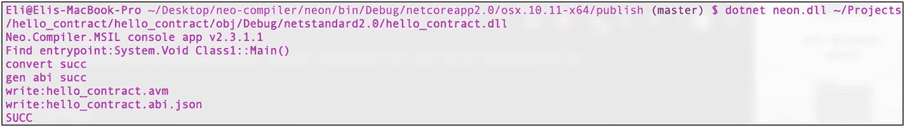

图 7-17 将 DLL 转换为 AVM 字节码

您可以使用 `ls` 命令查看 AVM 字节码文件。

```bash
ls ~/Projects/hello_contract/hello_contract/obj/Debug/netstandard2.0/∗.avm
```
```
hello_contract.avm
```

类似地，您可以将 Python 的 `sample1.py` 文件编译成 AVM。在 NEO bash 中，使用 `sc build` 命令。

```bash
cd ~/Desktop/neo-python/neo/bin
python3.6 prompt.py –p
```
```
neo> sc build ~/Desktop/smartContracts/sample1.py
Saved output to ~/Desktop/smartContracts/sample1.avm
```

### 在私有测试网上发布智能合约

下一步是将您的 AVM 文件部署到 NEO 私有测试网链上。您无需记住所有选项。可以使用 `help` 标志调用命令来查看选项。

```
neo> sc deploy help
Deploy a smart contract (.avm) file to the blockchain
Usage: sc deploy {path} {storage} {dynamic_invoke} {payable} {params} (returntype)
path            - 目标 Python (.py) 文件的路径
storage         - 布尔值输入，用于确定智能合约是否需要存储
dynamic_invoke  - 布尔值输入，用于确定智能合约是否需要动态调用
payable         - 布尔值输入，用于确定智能合约是否可接收付款
params          - 智能合约的输入参数类型
returntype      - （可选）智能合约输出的返回类型
有关参数类型的更多信息，请参阅
https://neo-python.readthedocs.io/en/latest/data-types.html#contractparametertypes
```

接下来，将 `storage`、`dynamic_invoke` 和 `payable` 设置为 `false`，并将 `params` 和 `returntype` 设置为 `01`，如图 7-18 所示。

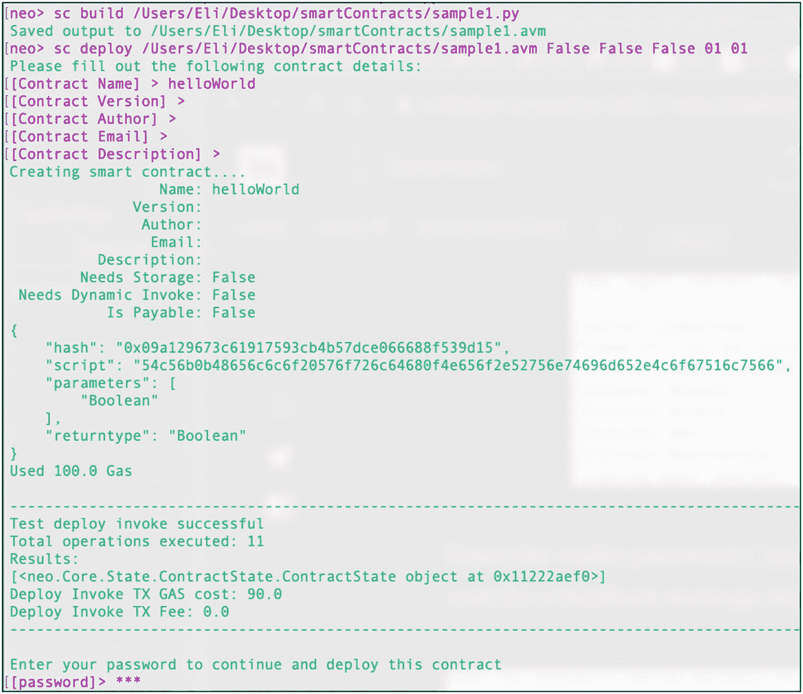

图 7-18 在私有测试网链上发布 AVM 文件

```
neo> sc deploy ~/Desktop/smartContracts/sample1.avm False False False 01 01
```

NEO 会要求输入合约名称；我们将此合约命名为 `helloWorld`。将版本、作者、电子邮件和描述字段留空，然后输入您的钱包密码以支付合约费用。

### 发布到主网

要发布到主网，您可以使用与测试网相同的过程；只需引导到主网即可。

#### 引导到主网

要引导到主网区块链，只需使用 `-m` 标志运行 `np-bootstrap`（该过程接近 10 GB）。您也可以在主网上使用通知数据库。

```bash
np-prompt –m -n
```

#### 安装 neo-gui 客户端

一种更简单的方法是通过 `neo-gui` 设置并发布 NeoContract。您需要为 PC 设置一台虚拟机，但部署 AVM 文件会变得非常简单。请按照以下说明操作：

[`https://docs.neo.org/en-us/sc/quickstart/deploy-invoke.html`](https://docs.neo.org/en-us/sc/quickstart/deploy-invoke.html)

[`https://docs.neo.org/en-us/node/gui/install.html`](https://docs.neo.org/en-us/node/gui/install.html)

### 以太坊对比 EOS 对比 NEO：智能合约开发者视角的对决

至此，我已经涵盖了三个主要的智能合约开发区块链平台，很难不对它们进行比较。然而，在比较这三个平台时，需要考虑的因素非常多。此外，在撰写本文时，已有超过 40 个区块链项目可供你选择部署智能合约。每个项目都有其优缺点，本书无法一一涵盖。相反，我将侧重于具体的评判标准，试图帮助你理解，在从我目前介绍的三个平台中选择一个时，需要考虑哪些因素。

有一个组织试图对这些不同的区块链进行评级，它叫做中国电子信息产业发展研究院（CCID）。CCID 利用来自中国最负盛名的教育机构（包括清华大学和北京大学）的教授和研究人员的贡献，综合考虑特性、采用率以及许多其他指标，对每个区块链进行排名。然而，这些排名经常变动，你应在网站 [`http://special.ccidnet.com/pub-bc-eval/index.shtml`](http://special.ccidnet.com/pub-bc-eval/index.shtml) 上查看最新的区块链排名。请注意，在撰写本文时，EOS 和以太坊已连续第四次在 CCID 榜单上保持领先地位。

此外，决定使用哪个区块链来发布智能合约还应考虑更多因素，例如你团队的能力、资金、所需的交易数量、所需的账户数量、钱包、交易所等等。

在判断一个区块链的健康状况时，另一个要考虑的主要指标是用户和开发者的采用情况。你可以通过查看以下网站来了解不同智能合约平台的当前 dApp 数量：

*   EOS: [`https://dappradar.com/eos-dapps`](https://dappradar.com/eos-dapps)
*   以太坊: [`https://dappradar.com/dapps`](https://dappradar.com/dapps)
*   NEO: [`http://ndapp.org/`](http://ndapp.org/)

浏览 dApp 列表时请记住，尽管在撰写本文时 Dappradar.com 上列出了 6,050 个 dApp，但只有 106,938 个用户，这表明实际被使用的 dApp 很少，大规模普及尚未到来。

另外请注意，此比较在撰写本文时有效，且基于我个人的观点。在选择理想的区块链以满足你的智能合约需求之前，你应该进行自己的研究和尽职调查。表 7-1 提供了比较。

**表 7-1** 以太坊对比 EOS 对比 NEO 智能合约比较

| 类别 | 以太坊 | EOS | NEO |
| --- | --- | --- | --- |
| 采用率 | 目前保持领先 | 稳步增长 | 三者中最低 |
| CCID 排名 | 第 2 名 | 第 1 名 | 第 5 名 |
| 共识机制 | PoW | DPoS | dBFT |
| 每秒交易数 | 15 | 百万级 | 每秒 10,000 笔交易 |
| dApp 部署成本 | 最低 32,000 gas 费用，加上每字节源代码 200 gas | ~120 EOS | 固定费用 100 到 1,000 gas；ICO 注册数字资产需 5,000 gas；每年续费 5,000 gas |
| 交易成本 | 0.05 到 3.5 美元 | 0 美元（但是，创建新账户每账户需支付 1 到 4 美元，由应用开发者承担） | 初始 10 gas 免费执行，系统调用和指令需付费（见白皮书） |
| 可扩展性 | 不支持；等待硬分叉 | 支持 | 支持 |
| 开发工具 | 来自项目和社区的成熟开发工具，包括开发框架、IDE、通信和测试工具 | 开发工具尚需升级；调试仍采用原始方法 | 成熟的开发工具 |
| 文档 | 项目和社区均有完善的文档 | `Developers.EOS.IO` 文档和社区教程未能与 EOS.IO GitHub 变更保持同步；存在许多关于安装的 GitHub 问题 | 项目文档（[`http://docs.neo.org`](http://docs.neo.org)）和社区教程 |
| 社区支持 | 以太坊社区基金（ECF），获得组织支持：微软、英特尔、亚马逊、摩根大通，甚至政府参与 | 承诺投入 *10 亿* 美元资金，专注于 EOS 生态系统发展 | 已举办并支持了超过 100 场社区活动 |
| 开发语言 | Solidity, Bamboo, Vyper, LLL, Flint | C, C++ | C#, VB.NET, F#, Java, Kotlin 以及 Python；未来计划支持更多语言 |
| 市值 | 14,068,553,166 美元 | 2,341,702,969 美元 | 488,507,580 美元 |
| dApp 数量 | *1,324* | 226 | 少于 100 |
| 钱包 | 桌面和硬件钱包，选项多于 EOS 和 NEO | 桌面和硬件钱包 | 桌面和硬件钱包 |
| 大型交易所支持 | 所有主流交易所均可交易 | 许多主流交易所（如 Coinbase）尚未支持 | 许多主流交易所（如 Coinbase）尚未支持 |
| 图灵完备 | 是 | 否 | 否 |

以下列表总结了以太坊、EOS.IO 和 NEO 区块链平台的优缺点：

*   以太坊最大的优点是它是第一个也是最受欢迎的智能合约平台，拥有最多的开发者、第三方工具、支持、文档和社区支持。最大的缺点是使用 PoW 带来的可扩展性问题；在撰写本文时，正在进行硬分叉以解决此缺点并将以太坊迁移到 PoS。另一个缺点是源代码每字节 200 gas 的成本；如果你的代码未经优化，这会很昂贵，尤其是你需要不断重新发布代码时。最后，对像 Solidity 这样不太流行的编程语言的支持不够理想。

*   EOS 的优势在于其可扩展性以及无需改动即可每秒处理数百万笔交易的能力，以及使用 WASM 实现更快的代码执行。EOS 支持 C 和 C++，并且其区块链本身用 C++ 编写，这使其具有优势，因为 C 语言的开发者基础比 Solidity 更庞大。然而，EOS 在采用率方面仍有很长的路要走，提供 10 亿美元的资金对有合适想法的公司和个人可能很有用。其高排名和出色的特性并不足以取代以太坊它所声称的主导地位。只有时间能给出答案。

*   NEO 支持主流编程语言（C#、VB.NET、Java 和 Python），这使其具有巨大优势，因为大量开发者可以通过较小的学习曲线进行编码。此外，合约计算的高效和低成本是其优势；然而，NEO 是三个平台中社区支持最小的，每年注册数字资产所需的 5,000 NeoGas 的硬性规定可能会让许多潜在项目望而却步。

## 下一步做什么

试试这些资源：

* 在此处阅读 NEO 文档：[http://docs.neo.org](http://docs.neo.org)。该网站包括示例 NeoContract 的教程、创建 NEO 节点、NEO 实用工具、白皮书等。
* 访问 [https://neo.org/client](https://neo.org/client) 查找第三方 NEO 钱包。
* 对于调试，请查看 `Neunity.Adapter` 或 `Neo-Debugger` 以在 IDE 中编写测试用例并运行源代码：[https://github.com/CityOfZion/neo-debugger-tools/releases](https://github.com/CityOfZion/neo-debugger-tools/releases)。
* 创建更多的 NeoContract，并包含通过 `neo.EventHub` 分发的 `SmartContractEvent`；订阅并测试你的合约。

## 摘要

在本章中，我介绍了 NEO 区块链和 NEO 合约。你了解了 NEO 的高级区块链架构，并学习了 NEO 的智能经济。你配置了本地环境，升级了 Xcode，安装了 Visual Studio 2017 IDE 和 .NET Core。

你安装了 Docker，因此现在可以创建容器；你下载了 `neo-compiler` 并生成了 `neon.dll`。最后，你构建了 `neo-cli`，以便管理钱包并执行其他 RPC 操作。

接着，你通过安装 `neo-python` 和 `neo-privatenet-docker` 创建了一个本地 NEO 私有测试网。你引导了该测试网，启动了 NEO bash，然后能够启动你的网络并领取 NEO 和 GAS。

此外，我还介绍了安装 NEO 工具过程中可能遇到的问题。

然后，你创建了两个“Hello, World”项目，一个用 C# 编写，另一个用 Python 编写，并成功将这些项目编译成了 NEO 虚拟机的字节码（AVM）文件。你学习了如何将这些文件发布到 NEO 测试网区块链以及 NEO 主网上。

最后，我对以太坊、EOS 和 NEO 进行了比较，以帮助你更好地理解这些平台之间的差异，以及在选择智能合约平台时应参考的标准。