# 8. Hyperledger

在前面的章节中，我介绍了专注于加密货币的区块链技术。事实上，到目前为止介绍的每个项目都包含其自身的货币。Hyperledger 则不同；它不附带任何货币，尽管你可以在需要时创建一种代币。相反，Hyperledger 的创建目标是成为一个开源平台，旨在利用区块链来满足商业需求。

Hyperledger 始于 2015 年，是 Digital Asset 和 IBM 在一场黑客马拉松中贡献的开源区块链（现在该区块链被称为 Hyperledger Fabric），随后扩展为由多个可插拔模块组成，整个项目称为 Hyperledger，旨在提高区块链的性能和可靠性，以便你可以组装模块来创建适合你业务需求的独特平台。

## 注意

Hyperledger 项目采用伞式战略模块化架构，由一组用于为企业创建定制区块链解决方案的可插拔组件组成。该架构旨在提供可扩展性、性能、机密性、弹性和灵活性。请注意，如果你查阅 Hyperledger 的文档，经常会看到“分布式账本技术”（DLT）这个术语；它与“区块链”是同义词。

## Hyperledger 概述

模块化架构允许你调整诸如区块链的共识机制之类的内容，以及管理存储、设置身份服务、为你设置的身份设置权限，并创建智能合约（在 Hyperledger Fabric 中，智能合约被称为*链码*）。在编程语言方面，Hyperledger 的链码使用`Go`（`Golang`）编写；但是，你可以利用 Hyperledger Composer 工具使用`JavaScript`。然后，链码可用于实现和自动化业务逻辑。

Hyperledger 项目的管理团队由十名成员组成，在撰写本文时，执行董事是 Brian Behlendorf。此外，根据`developer.ibm.com`的数据，来自 27 个组织的 159 名工程师为`Hyperledger Fabric` v1.0 做出了贡献。

> “*Hyperledger* 是一个开源开发项目，旨在惠及基于 Hyperledger 的解决方案提供商和用户生态系统。它专注于能够在各种工业领域应用的区块链相关用例。”
>
> — Brian Behlendorf（Hyperledger 执行董事）

Hyperledger 由 Linux 基金会托管。在应用方面，它得到了 IBM、Intel、SAP 等大型企业公司的支持，并且被 Oracle、Accenture、The National Association of Realtors、Deutsche Borse Group、Sony Global Education 等众多机构所采用。

Hyperledger 的共识机制允许节点网络在“无操作”（无共识）机制和一种称为实用拜占庭容错（PBFT）的协议之间进行选择。PBFT 共识通过赋予节点完全控制权来使两个或多个节点达成一致。这阻止了网络上的其他节点强制生成区块，从而防止了潜在的双花攻击，就像你在 PoW 中看到的 51% 的潜在挖矿攻击那样。Hyperledger 让你掌控共识机制，并且可以限制对交易的访问。这带来了更高的性能和可扩展性，因为需要就区块达成一致的节点更少。此外，PBFT 为网络提供了隐私性，这比你在其他区块链中看到的完全透明性更适合商业应用。

为了让你了解 Hyperledger 的灵活性，你可以使用动态共识并启用所谓的*热插拔*功能，即在网络运行时替换共识算法（使用 Hyperledger Sawtooth 实现）。

专注于加密货币的区块链通常提供交易和网络数据的透明性，因为它们处理的是资金且大多涉及不受信任的成员。然而，这也限制了灵活性以及你可以对网络进行修改的程度和可控制的程度，因为你受制于一套规则。Hyperledger 没有自身货币的支持，并提供了更精细的控制。

Hyperledger 项目以基本功能构建，采用原汁原味的设计，旨在让开发者能够尽可能定制一切，从区块链的共识机制到 Web 界面身份的权限，从而向成员提供有限的数据。

这种模块化架构方法允许开发者创建特定、定制、个性化的区块链，以精确满足业务需求。Hyperledger 包含以下主要的开源框架和工具。

**Hyperledger 框架**：

- `Hyperledger Fabric`（IBM 贡献）：这是一个带有`Node.js`、`Java`和`GoLang`SDK 的许可区块链基础设施。Hyperledger Fabric 是 Hyperledger 的核心，支持使用`GoLang`和`JavaScript`（利用 Hyperledger Composer 或原生方式）编写的链码。该区块链基于背书者/排序者架构。你将在本章后面部分了解更多信息。
- `Hyperledger Burrow`：这是一个按规范构建的以太坊虚拟机。
- `Hyperledger Indy`：将其视为独立体。这是一个用于在分布式账本上运行独立身份的工具和库。
- `Hyperledger Iroha`：此框架专为移动应用设计；其代码基于`Hyperledger Fabric`。
- `Hyperledger Grid`：这是一个基于分布式账本的供应链解决方案。该框架封装了数据类型、模型和智能合约的`Hyperledger`实现，并展示了构建供应链业务解决方案的实用方法。
- `Hyperledger Sawtooth`（由英特尔贡献）：此框架包含动态共识机制，支持在运行中的网络上热切换共识算法。这是一种更传统的区块链架构。

**Hyperledger 工具**：

- `Hyperledger Caliper`：这是一个区块链基准测试工具。
- `Hyperledger Cello`：这是一个按需提供的区块链模块工具包，用于创建、管理和终止区块链。
- `Hyperledger Composer`：此工具具有协作功能，可与`Hyperledger Fabric`配合使用，为面向企业的链码和区块链应用构建区块链。
- `Hyperledger Explorer`：这是一个用于查看、调用、部署以及查询区块、交易和网络数据的模块。
- `Hyperledger URSA`：这是一个共享的密码学库；其中包含多个共享项目，例如若干不同签名方案（基础密码库）的实现，以及 Z-mix（零知识证明）（`https://github.com/hyperledger-labs/z-mix`）。
- `Hyperledger Quilt`/`Interledger.js`：这是一个跨账本协议（ILP），意指账本间的原子交换。该支付协议支持跨分布式和非分布式账本转移资产（价值）。它有两种实现方式：`Java`版本称为`Quilt`，`JavaScript`版本称为`Interledger.js`。

可以构建一个`Hyperledger`项目，使得交易既透明又能在需要时保密。例如，设想以下业务需求：一家航空公司想向另一家企业（比如 Expedia）出售座位。该航空公司的业务需求是创建自己的区块链来跟踪库存、创建交易、设定价格并保持数据机密。航空公司可以从区块链中获益，但它不需要加密货币，也不想公开分享所有数据。该航空公司可以利用`Hyperledger`设置一个私有许可网络，而无需像在公有账本上那样将数据暴露给全世界。

然后，航空公司可以通过签发访问受限的加密密钥来设置特定身份的特殊权限，并将这些密钥仅提供给特定参与方。例如，只有一家组织（比如 Expedia）能够查看与 Expedia 相关的交易、座位定价和航班信息；而其他身份（如实际客户）只能查看与其账户和航班信息相关的预订信息。

财务团队可以持有提供更多数据的加密密钥，例如利润与亏损、燃油成本以及其他内部所需的数据。这对企业来说是有益的，因为他们可以在账本上运行数据，而不是在更容易受到黑客攻击的中心化数据库上运行数据。

如您所见，`Hyperledger`是一个庞大的项目，涵盖了六个框架以及五个工具。在一章中涵盖所有这些内容是不切实际的；事实上，它完全可以写成一本完整的书。在本章中，我将为您提供一个良好的基础，帮助您理解`Hyperledger`的基本概念，然后您可以自行继续尝试其他平台和工具。本章将重点介绍`Hyperledger Fabric`，因为它是最流行的`Hyperledger`平台。

## 理解 Hyperledger Fabric

正如我之前指出的，`Hyperledger Fabric`是一个开源框架实现，旨在用于私有且基于许可的业务网络。

在本章中，您将创建私有网络许可身份，然后创建一个链码来实现特定的业务逻辑。

`Hyperledger Fabric`被设计为`Hyperledger`的基础，然后您可以使用`Hyperledger`的模块化架构，根据您的业务需求添加特定模块。一个`Hyperledger Fabric`网络由以下组件组成：

- **资产（Assets）**：资产是代表价值的键值对。价值可以是任何东西，例如文档、股票或加密货币代币。每个资产都持有状态和所有权。
- **共享账本（Shared ledger）**：共享账本持有自己的一份账本副本，其中包含资产的状态。该账本被称为*世界状态*。共享账本还持有区块链的副本，该副本通过记录交易历史来存储资产的所有权。
- **智能合约（链码）**：`Hyperledger Fabric`将智能合约称为*链码*，可以用`Go`（`GoLang`）或`JavaScript`（`Node.js`）进行编程。链码可以与共享账本、资产和交易进行交互。这里没有什么新东西；您在其他区块链中已经看到过。链码包含业务逻辑，并且可以设置背书策略。

### 注意

在 Hyperledger Fabric 中，用户可以定义链码执行的资产背书策略。背书策略设置所需同意的节点对等体，以决定一个接受的事务是否有效，并将其添加到共享账本中。

- **成员服务提供者（`MSP`）**：`MSP`是管理数字证书的证书颁发机构；它管理用户 ID 并认证网络上的所有参与者。所有成员必须是已知身份才能在 Fabric 上进行交易。这是因为网络是私有的，且基于权限。`MSP`用于认证和验证这些成员的身份和权限。`MSP`使用一个名为`cryptogen`的证书生成工具。要更好地理解`MSP`，请访问此处文档：[`https://hyperledger-fabric.readthedocs.io/en/latest/msp.html`](https://hyperledger-fabric.readthedocs.io/en/latest/msp.html)。
- **对等节点（`Peer nodes`）**：Hyperledger Fabric 网络构建于由网络成员拥有和贡献的对等节点之上。节点可以是组织或个人。节点持有共享账本，并且可以执行链码。节点可以访问账本数据；它们可以背书事务并与应用程序交互。节点可以拥有背书对等体的权限或背书者的角色。对等节点接收排序后的账本状态更新作为所接收区块的一部分，以维护账本或 Hyperledger 所称的“世界状态”（`world state`）。
- **通道（`Channel`）**：通道可由一组对等节点创建。一组节点可以创建一个单独的事务账本。通道类似于你在第 [3] 章创建自己的区块链时所建立的 P2P 通道。
- **组织（`Organizations`）**：每个对等节点贡献资源，共同形成集体网络。拥有者组织可以通过`MSP`使用数字证书分配对等节点。此外，来自不同组织的对等节点可以加入同一个通道。拥有独立对等节点的组织能够共享相同的`MSP`。最佳实践是为每个组织设置一个`MSP`。
- **排序服务（`Ordering service`）**：该服务将事务打包成区块。然后，区块可以广播给共享 P2P 通道上的对等节点和客户端。该通道以相同的逻辑顺序向所有对等节点输出相同的消息。一致的逻辑顺序被称为“原子交付”（`atomic delivery`）。

请查看图 [8-1]，该图是构成 Hyperledger Fabric 各组件的图示。

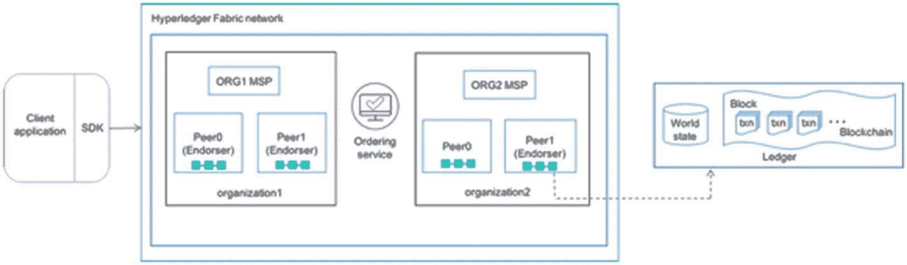

图 8-1

Hyperledger Fabric 图形化解释。图片来源：`developer.ibm.com`。

让我们使用图 [8-1] 中鸟瞰式的图形化概述来走一遍 Fabric 网络。Hyperledger Fabric 网络充当客户端应用程序的后端层。

客户端应用程序可以是任何东西，例如 DApp、门户、业务活动或网站；这些类型的应用程序是前端层，它们可以通过编程 Hyperledger Fabric SDK 或 REST Web 服务来访问链码、事务和事件。客户端调用链码节点，该节点使用 SDK 与网络交互。与迄今为止介绍的传统区块链不同，Fabric 的特殊之处在于并非所有对等节点都具有相同权限。

同样与传统区块链不同的是，Hyperledger Fabric 不允许未知身份在网络上进行交易。组织（称为“成员”）构建 Hyperledger Fabric 网络，每个成员可以通过`MSP`设置其节点对等体。你可以在图 [8-1] 中看到，示例中有`ORG1 MSP`和`ORG2 MSP`。

对等节点可以在网络中设置不同的规则：背书对等体、锚点对等体和排序对等体。

- **背书对等体（`Endorser peer`）**：它接收请求以验证事务并执行链码。背书者可以批准或不批准该事务。只有背书节点执行链码，因此无需在所有对等节点上安装链码。
- **锚点对等体（`Anchor peer`）**：这些对等体接收消息，并向组织中的其他对等体发送消息。P2P 网络由不同的通道组成，这些通道可以设置权限，因此不会对网络上的所有人可见。
- **排序对等体（`Orderer peer`）**：该对等体处理共享账本，并负责维护整个网络的状态。排序对等体生成区块并广播给所有对等体。排序对等体可以设置为`Solo`或`Kafka`模式。
    - **`Solo`**：用于开发，存在单点故障。你将在本章中为开发环境设置此模式。
    - **`Kafka`**：用于生产环境。`Kafka`构建时具有容错特性。

你将创建链码并将其部署到`Solo`对等体上的 Fabric 网络，然后你将能够访问并运行函数。要发送事务，你的客户端应用程序可以连接到 SDK 并创建一个事务。然后该事务被发送给进行背书的`Solo`对等体，该对等体验证签名并发送背书签名。背书签名被发送到排序服务。在生产环境中，排序服务随后会将事务发送给所有网络连接的节点，这些节点更新其账本上的世界状态。

我鼓励你访问 Hyperledger 页面以了解更多信息并阅读白皮书：[`https://www.hyperledger.org/projects/fabric`](https://www.hyperledger.org/projects/fabric)。

## 安装 Hyperledger Fabric 和 Composer

开始使用 Hyperledger 网络的一个好方法是安装 Hyperledger Fabric 和 Composer。你将通过安装所有工具和库以及 Hyperledger Fabric 和 Composer 来搭建环境；然后，通过启动和停止 Hyperledger Fabric 并检查 Composer 的库是否安装正确，来验证安装是否成功。

## 安装步骤

Hyperledger Fabric 和 Hyperledger Composer 依赖许多工具和库，并且由于每个用户使用不同的机器，这个过程可能不会快速和简单，并且可能会限制 Hyperledger 的适应性。我已将此过程分解为以下步骤：

1. 验证已安装的前提条件。
2. 更新 Git。
3. 安装 Node Version Manager。
4. 更新 Node.js。
5. 安装 VSCode。
6. 安装 Hyperledger Composer 扩展。
7. 安装 Hyperledger Composer 基本 CLI 工具。
8. 安装 Hyperledger Fabric。

建议你访问 Hyperledger Fabric 前提条件页面，因为版本和要求可能已更改：[`https://hyperledger.github.io/composer/v0.19/installing/installing-prereqs.html`](https://hyperledger.github.io/composer/v0.19/installing/installing-prereqs.html)。

在开始之前，建议你更新并升级 Brew（如果你有一段时间没有这样做的话）。
```
> brew update && brew upgrade
```

### 验证已安装的先决条件

安装 Hyperledger Fabric 需要一系列先决条件；不过，如果你一直跟随本书各章节的操作，大多数先决条件应该已经安装到你的计算机上了。

对于操作系统，Fabric 至少需要 macOS 10.12 版本。你可以通过电脑左上角的菜单检查版本。点击苹果图标，选择“关于本机”。概览选项卡会打开并显示 macOS 版本。如果你运行的是较旧版本，请点击“软件更新”按钮获取 10.12 更新。撰写本文时，macOS 被称为 Mojave，版本号为 10.14.4。

你还需要 Xcode 和 Docker。这些在前面的章节中已经安装过，但你需要确认它们已安装且版本正确。只需运行 `xcode-select --version` 命令来确保 Xcode 正在运行。你可以将你的结果与我的进行对比，如下所示：
```
> xcode-select -v
xcode-select version 2354.
> docker --version
Docker version 19.03.0-beta3, build c55e026
```

你需要 `docker-compose` 1.8 或更高版本。
```
> docker-compose --version
docker-compose version 1.24.0, build 0aa59064
```

你需要 `npm` v5.x 或更高版本。
```
> npm --version
6.8.0
```

你需要 Python 2.7.x 或更高版本。
```
> python --version
Python 2.7.10
```

### 更新 Git

安装要求 Git 2.2.x 或更高版本。然而，Mac 自带的是较旧版本的 Git；你可以通过以下命令检查版本：
```
> git --version
git version 2.20.1 (Apple Git-117)
```

要升级 Git，你将通过 Brew 安装 Git，并将计算机设置为使用 Brew 中的 Git 版本，而不是 Mac 自带的版本。首先，通过 Brew 安装 Git。
```
> brew install git
```

接下来，你将设置路径指向新的 Git 位置；使用 vim 或你喜欢的文本编辑器。
```
> vim ~/.bash_profile
```

将以下内容添加到 `PATH` 中：
```
#git point to brew
PATH=/usr/local/bin:$PATH
```

别忘了在保存并退出 bash profile 文件后运行 `.bash_profile`，以确保更改生效。
```
> . ~/.bash_profile
```

最后，你可以验证 Git 的版本。
```
> git --version
```

现在你已指向通过 Brew 安装的 Git 位置，将来升级 Git 时，只需运行以下命令：
```
> brew upgrade git
git version 2.21.0
```

### 安装 Node 版本管理器 (nvm)

需要 Node 版本管理器 (`nvm`)。要下载或更新 `nvm`，请查看 GitHub 页面 [`github.com/creationix/nvm/blob/master/README.md`](https://github.com/creationix/nvm/blob/master/README.md) 并运行以下命令：
```
> curl -o- https://raw.githubusercontent.com/creationix/nvm/v0.33.0/install.sh | bash
```

安装完成后，你可以确认是否安装正确。打开一个新终端，输入以下命令。我的版本是 0.34.0。
```
> nvm --version
0.34.0
```

### 更新 Node.js

Node 需要是 8 版本。要检查你运行的版本，请运行以下命令：
```
> node --version
```

撰写本文时，`hyperledger.github.io` 页面上列出的先决条件要求安装最新的（长期支持）Node 版本；然而，这会导致致命错误，并且在 GitHub 上已记录了一个错误。Node.js 9 版本在撰写本文时也不被支持。

为了让 Hyperledger Composer 正常工作，你将安装 node 8 并将 `nvm` 指向 node 8。
```
> nvm install 8
> npm config delete prefix
> nvm use 8
```

你可以确认 node 8 已安装并正确设置。
```
> node --version
v8.15.0
```

### 安装带 Hyperledger Composer 扩展的 VSCode

建议你安装带 Hyperledger Composer 扩展的 Visual Studio Code (VSCode)，并将其用作代码编辑器。该扩展提供代码高亮功能，是一个专业的免费 IDE。首先，从这里下载 VSCode：[`code.visualstudio.com`](https://code.visualstudio.com)。点击“Download for Mac”，如图 8-2 所示。

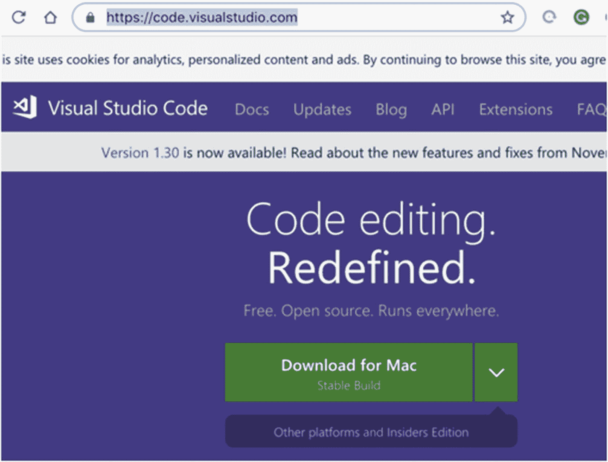

图 8-2. Visual Studio Code 安装页面

安装完成后，启动 VSCode。

要安装 Hyperledger Composer 扩展，点击 VSCode 左侧菜单，从左侧菜单栏中选择“扩展”（两个方块图标），在搜索框中输入 **Hyperledger Composer**。选择：Hyperledger Composer。然后点击“安装”。最后，点击“重新加载”以激活它。参见图 8-3。

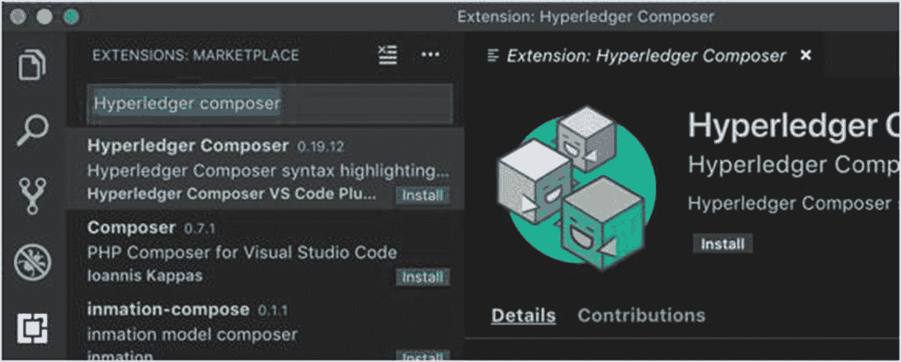

图 8-3. VSCode Hyperledger Composer 扩展

#### Hyperledger Composer 必备 CLI 工具

你将安装 Hyperledger Composer 必备 CLI 工具，包括 `composer-rest-server`、Composer Playground 和 Yeoman 生成器。

要安装 Composer CLI，请运行以下命令。
```
> npm install -g composer-cli @0.19
```

> **注意**: 我使用的是 0.19 版本。Hyperledger 的最新版本 0.20.6 存在一些与所有工具和库相关的已知错误，因此我使用的是旧版本的 Hyperledger Composer 和 Hyperledger Fabric。这种情况可能会改变，因此你可能需要查看文档并安装其他版本。此外，我汇总了在安装和运行 Hyperledger Composer 和 Fabric 时可能遇到的许多潜在错误；请参阅本章后面的“错误故障排除”部分。

接下来，安装用于生成 Hyperledger Composer 应用程序的 Yeoman 工具，该工具使用 `generator-hyperledger-composer`。执行以下命令：
```
> npm install -g generator-hyperledger-composer@0.19
```

现在，你可以使用 `npm` 全局安装 Composer Playground。
```
> npm install -g composer-playground@0.19
```

Composer 的一部分是一个名为 `composer-rest-server` 的工具，它生成一个基于 loopback 的 REST 接口，以便访问你将创建的网络。要安装该工具，请执行以下命令：
```
> npm install -g composer-rest-server@0.19
> npm install -g Yeoman
```

你可以通过运行 `--version` 标志来验证安装是否成功。
```
> composer --version
v0.19.20
> composer-rest-server --version
v0.15.2
> composer-playground --version
0.20.6
```

要确保生成器工具已安装，如果你运行 `Yeoman` 命令，它应列出 Hyperledger Composer 生成器。
```
> Yeoman
```

它将输出以下内容：
```
? 'Allo! 你想做什么？ (使用方向键)
运行一个生成器
◻ Hyperledger Composer
```

按 `Control+C` 退出 `Yeoman` 命令。

### 使用 Docker 安装 Composer Playground

除了通过`npm`全局安装 Composer 工具外，您还可以使用 Docker 运行 Hyperledger Composer Playground；只需运行容器并指定`composer-playground`作为名称即可。它将在 8080 端口上运行。
```
docker run --name composer-playground --publish 8080:8080 hyperledger/composer-playground
```

该 Docker 命令会下载镜像，如图 8-4 所示。

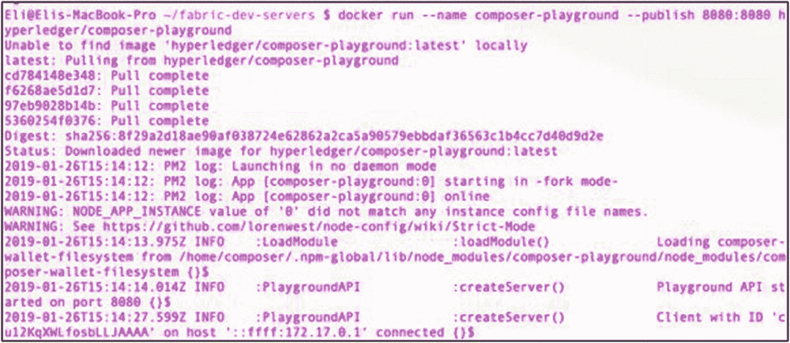

图 8-4. Composer-playground Docker 容器输出

若要取消容器，请按下`Control+C`。

现在，若要在浏览器中通过 8080 端口运行 Playground，请按`Command+T`打开一个新的终端窗口，并运行`open`命令。
```
open http://localhost:8080
```

您将看到 Hyperledger Composer Playground 欢迎页面，如图 8-5 所示。

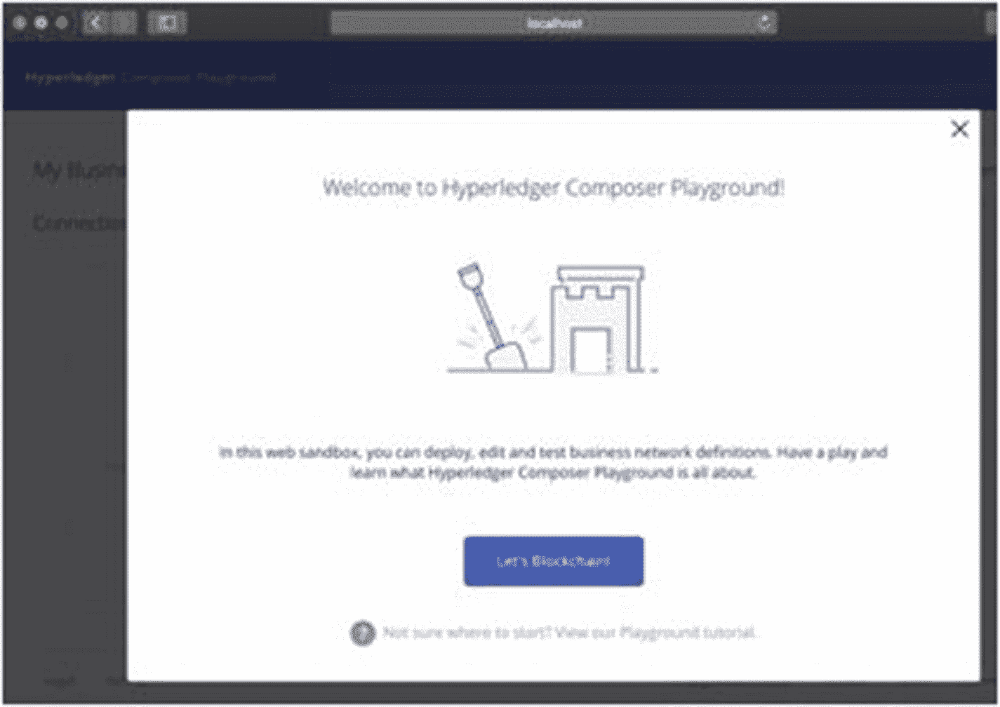

图 8-5. Playground 欢迎界面

请记住，要停止 Docker，可以运行`stop`命令。
```
docker stop composer-playground
```

若要移除`composer-playground`名称以便再次使用，您需要运行以下命令：
```
docker rm --force composer-playground
```

### 安装 Hyperledger Fabric 开发服务器

在撰写本文时，Hyperledger Fabric 的最新版本是 v1.4.1；您应该访问 GitHub 页面以获取最新版本和文档，因为版本可能会发生变化；请参见[`github.com/hyperledger/fabric`](https://github.com/hyperledger/fabric)。

Hyperledger Fabric 开发服务器提供不同版本可供选择。您将搭建一个 Hyperledger Fabric v1.2 网络用于开发。然后，您可以部署使用 Hyperledger Composer 构建的区块链业务网络，并测试您的应用程序。

创建一个目录来下载 Fabric；我选择了`~/fabric-dev-servers`，但您可以选择任意目录。
```
mkdir ~/fabric-dev-servers && cd ~/fabric-dev-servers
```

您将使用`curl`来获取安装 Hyperledger Fabric 所需的`.tar.gz`文件，如下所示：
```
curl -O https://raw.githubusercontent.com/hyperledger/composer-tools/master/packages/fabric-dev-servers/fabric-dev-servers.tar.gz
```

使用`tar`解压您下载的文件。
```
tar xzf fabric-dev-servers.tar.gz
```

解压完成后，您将获得一些脚本文件，可帮助快速启动 Hyperledger Fabric 实例。运行`ls`命令，您可以看到`.sh`文件以及其他有用的文件。
```
ls
startFabric.sh
teardownAllDocker.sh
stopFabric.sh
teardownFabric.sh
```

当您运行 Composer 的`–v`命令时，可以检查您正在运行的版本。您看到您确实安装了 Hyperledger Composer v0.19，因此根据文档，您需要使用 Hyperledger Fabric v1.1，并且可以将 Fabric 启动超时时间设置为 30 秒；这是运行脚本后等待网络启动的时间。
```
export FABRIC_VERSION=hlfv11
export FABRIC_START_TIMEOUT=30
```

> **提示**: 如果您运行的是不同版本的 Hyperledger Composer，请查看 GitHub 页面以了解需要设置哪个版本的 Fabric：[`github.com/hyperledger/composer-tools/tree/master/packages/fabric-dev-servers`](https://github.com/hyperledger/composer-tools/tree/master/packages/fabric-dev-servers)。

要启动您的 Hyperledger Fabric 网络，首先需要执行下载 Fabric 的脚本；这可能需要一些时间，具体取决于您的网络连接情况。
```
./downloadFabric.sh
```

就是这样；您应该会看到如图 8-6 所示的输出。

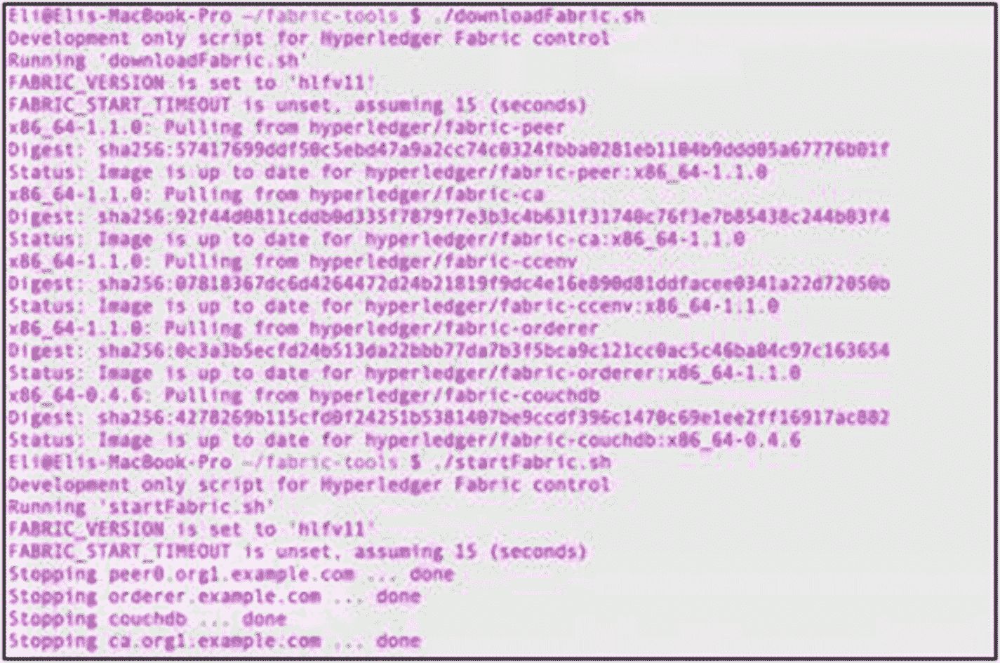

图 8-6. 下载 Hyperledger Fabric 输出

下载完成后，您可以确认已拥有 Docker 容器。
```
docker image ls hyperledger/*
hyperledger/fabric-ca
hyperledger/fabric-orderer
hyperledger/fabric-peer
hyperledger/fabric-ccenv
hyperledger/fabric-couchdb
```

### 网络连接配置文件

有一个名为`DevServer_connection.json`的网络连接配置文件 JSON。在本节中，您将修改该文件以适配您即将创建的 Docker localhost 容器。在修改文件之前，最好先制作一个副本。

```
cd ~/fabric-tools/
cp DevServer_connection.json DevServer_connection-backup.json
```

将原始文件中的排序节点、对等节点和证书颁发机构指向 localhost，因为您将在网络中以 Docker 容器的方式运行 Composer Rest Server，并访问这些网络上的主机名。使用`vim`或您喜欢的编辑器编辑`DevServer_connection`文件。

```
vim DevServer_connection.json
```

请参见图 8-7。

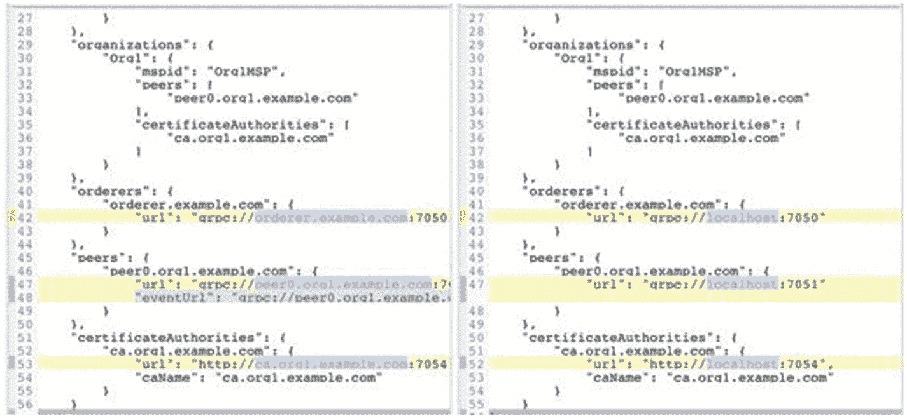

*图 8-7. 修改 devServer.json 指向本地主机*

您还需要编辑 hosts 文件，将主机指向本地服务器上的`127.0.0.1`。

```
sudo vim /etc/hosts
#### fabric
127.0.0.1 orderer.example.com peer0.org1.example.com ca.org1.example.com
```

### 启动本地 Hyperledger Fabric 业务网络

首次运行 Hyperledger Fabric 时，需要执行命令来启动本地 Hyperledger Fabric 实例并为管理员生成身份证。默认管理员名为`PeerAdmin`。要开始，请运行`start fabric`命令。

```
./startFabric.sh
```

预期输出将确认您的变量。

```
Development only script for Hyperledger Fabric control
Running 'startFabric.sh'
FABRIC_VERSION is set to [version number]
...
Creating network "composer_default" with the default driver
Creating ca.org1.example.com
Creating orderer.example.com
```

作为启动脚本的一部分，您可以看到确认`composer_default` Docker 网络已创建，并且容器正在所创建的网络中运行的输出行。这些容器能够使用自定义主机名进行通信：`ca.org1.example.com` 和 `orderer.example.com`。

### 创建管理员身份证

现在您已有一个正在运行的网络，最后一个设置步骤是创建凭据。您可以使用 Hyperledger Composer 创建 Hyperledger Fabric 所称的`.card`文件。您可以通过执行以下命令生成管理员身份证：

```
./createPeerAdminCard.sh
```

您可以将您的输出与我的输出进行比较，如图 8-8 所示。

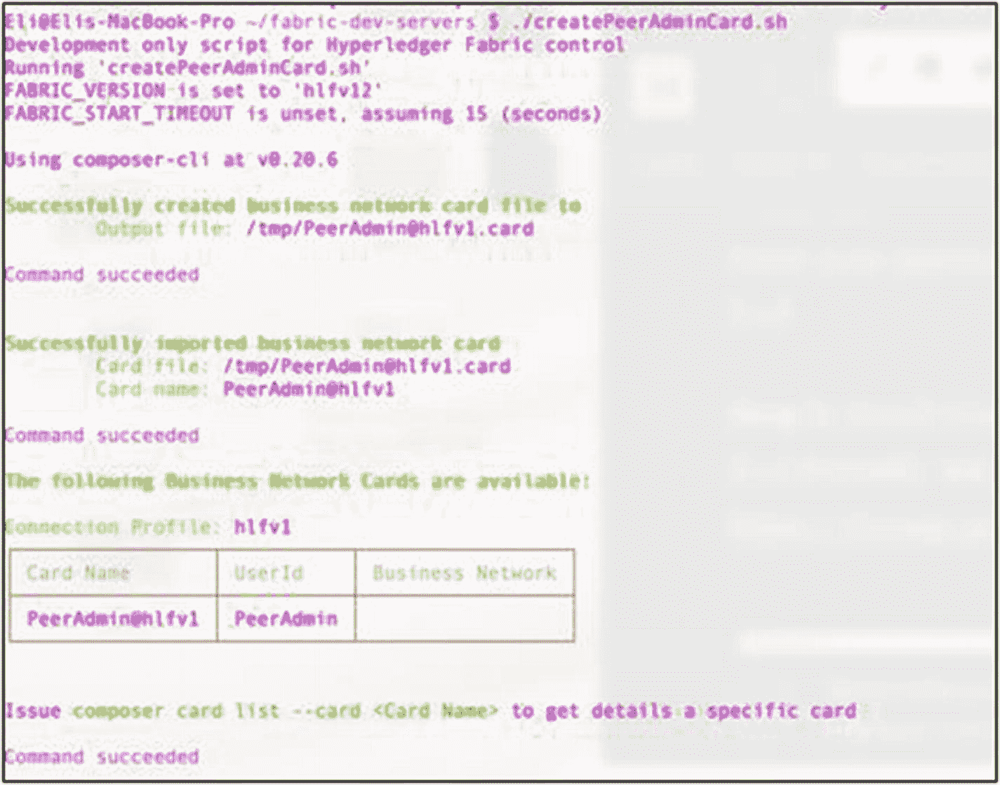

*图 8-8. Hyperledger Composer 生成身份证*

要确认身份证创建成功，请使用`<card name>`执行以下命令：

```
composer card list --card PeerAdmin@hlfv1
```

该命令会输出有关身份证的信息。请参见图 8-9。

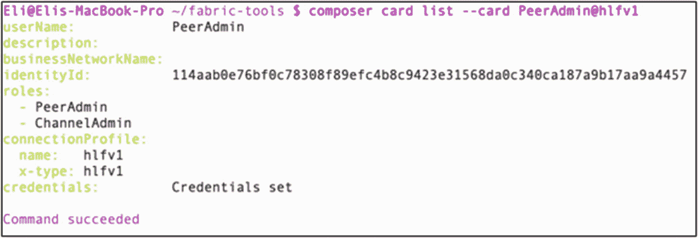

*图 8-9. Hyperledger Composer 卡片列表*

### 停止 Hyperledger Fabric

暂时让 Fabric 保持运行状态，但完成练习后，您可以通过执行`stop`命令来关闭 Hyperledger Fabric 运行时。

```
./stopFabric.sh
```

此外，您还应在开发周期结束时执行`teardown`脚本，以确保释放内存。

```
./teardownFabric.sh
```

#### 注意

如果您运行了`teardown`脚本，下次启动运行时时，您将需要像首次启动步骤一样创建一个新的 PeerAdmin 卡片。请参见以下步骤。

## 重新创建 PeerAdmin 身份卡

当你使用以下命令停止并拆除网络后：

```
./stopFabric.sh
./teardownFabric.sh
```

你需要重新创建管理员身份卡，因此只需执行以下相同的命令即可：

```
./startFabric.sh
./createPeerAdminCard.sh
composer card list --card PeerAdmin@hlfv1
```

按照图 8-10 中的流程操作是个好主意，该图展示了启动卡、停止卡、创建卡和拆除网络所需执行的步骤。

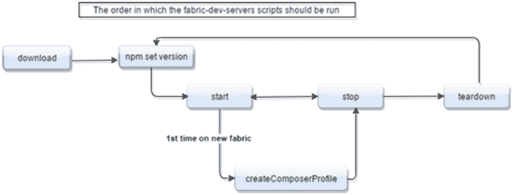

图 8-10 Fabric-dev-servers 启动-停止流程。图片来源：github.com/hyperledger/composer-tools。

## Hyperledger Composer

现在你已经安装并运行了 Hyperledger Fabric 网络，下一步是编写链码。你可以使用 Go 语言原生地在 Hyperledger Fabric 中编写链码；不过，你也可以利用 Hyperledger Composer 通过 JavaScript 编码来帮助创建链码和区块链应用程序，而无需使用 Go 语言。Hyperledger Composer 获取定义文件并生成业务网络存档（`.bna`）文件，然后你可以将这些文件部署到 Hyperledger 网络上运行。Composer 易于使用，不仅面向开发者，也面向业务人员。

Hyperledger Composer 由三个组件组成（见图 8-11）。

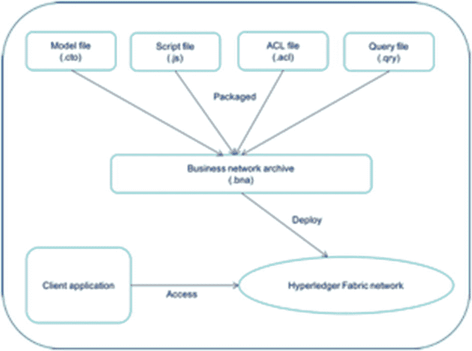

图 8-11 Hyperledger Composer 图形化说明。图片来源：developer.ibm.com。

- **业务网络存档 (`.bna`)**：由打包在一起的四个文件组成。
- **Hyperledger Composer Playground**：用于配置和部署网络，以及在不部署区块链的情况下测试代码。
- **REST API 支持**：暴露出可供前端客户端（如去中心化应用）使用的功能。

## 使用 Playground 实现“Hello, World”

你将创建一个“Hello, World”应用程序，并使用 Playground 将其部署到网络上。首先，通过命令行打开 Playground 并执行以下命令：

```
composer-playground
```

或者，你也可以使用 Docker。打开后，点击“Let's Blockchain!”关闭欢迎界面。

### 部署业务网络

接下来，选择“Deploy a new business network”（部署新业务网络）。在部署向导中，输入基本信息，例如在“Give your new Business Network a name”（为新业务网络命名）输入框中输入 `hello-network`。

选择中间的 `empty-business-network` 网络定义，然后点击“Deploy”（部署），如图 8-12 所示。

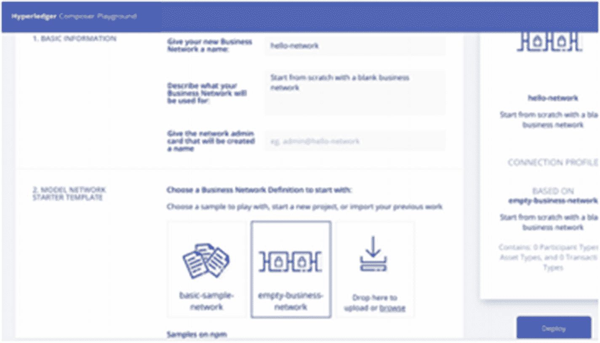

图 8-12 Hyperledger Composer Playground 部署新业务网络向导

系统会为你的网络创建一个管理员身份卡。要连接到网络，请点击“Connect now”（立即连接）链接，如图 8-13 所示。

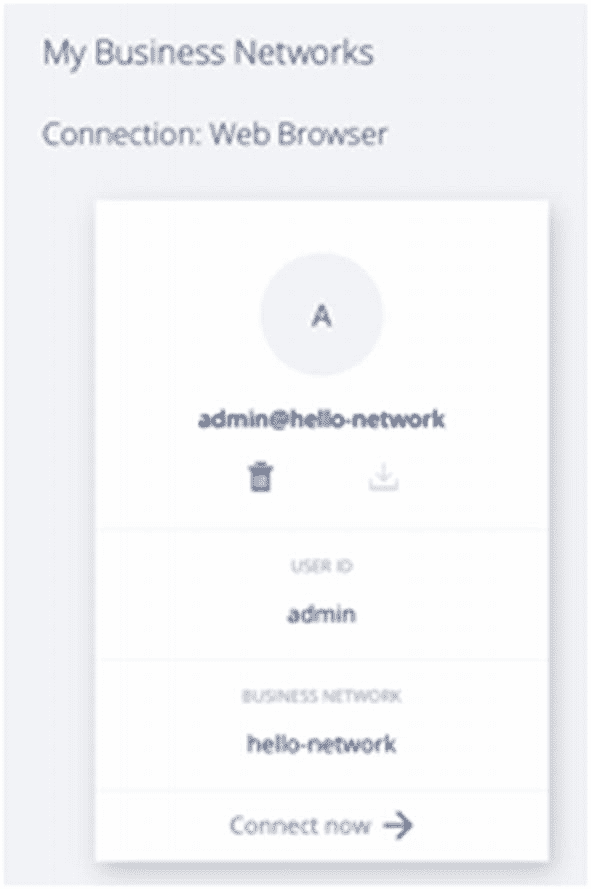

图 8-13 连接到 `hello-network` 业务网络定义

现在你已连接到该业务网络定义网络，你可以定义模型并对其进行操作。

### 业务网络存档 (`.bna`)

业务网络模型包括资产以及这些资产相关的交易。Hyperledger Composer 需要将以下内容打包在一起：一个网络模型文件、一个 JavaScript 文件（`.js`）、一个访问控制文件（`.acl`）和一个查询文件（`.qry`）。这些定义文件用于生成你的网络。

- **网络模型 (`.cto`)**：该文件定义了资产、交易以及可以与这些资产交互的参与者。该文件使用名为 CTO（源自原始项目名 Concerto）的建模语言创建。
- **JavaScript 文件 (`.js`)**：该文件定义了交易处理器函数，即链码。
- **访问控制 (ACL) (`.acl`)**：该文件包含定义不同参与者权限的访问控制规则。
- **查询 (`.qry`)**：该文件定义了可在网络中运行的查询。

Hyperledger Composer 接收这四个文件，并创建一个打包为存档（`.bna`）文件的业务网络定义。这些 `.bna` 文件可以部署在 Hyperledger Fabric 网络上。

然后，你可以编写一个客户端应用程序（例如去中心化应用），该应用程序可以使用 Hyperledger Composer API 来访问你通过 Hyperledger Fabric 网络编写的智能合约（`.bna` 功能）。

### 添加模型文件

要创建模型文件，你可以添加组成 `.bna` 存档的文件。例如，要添加一个模型文件，请点击“Add a file”（添加文件），选择“Model File (`.cto`)”（模型文件），然后点击“Add”（添加），如图 8-14 所示。

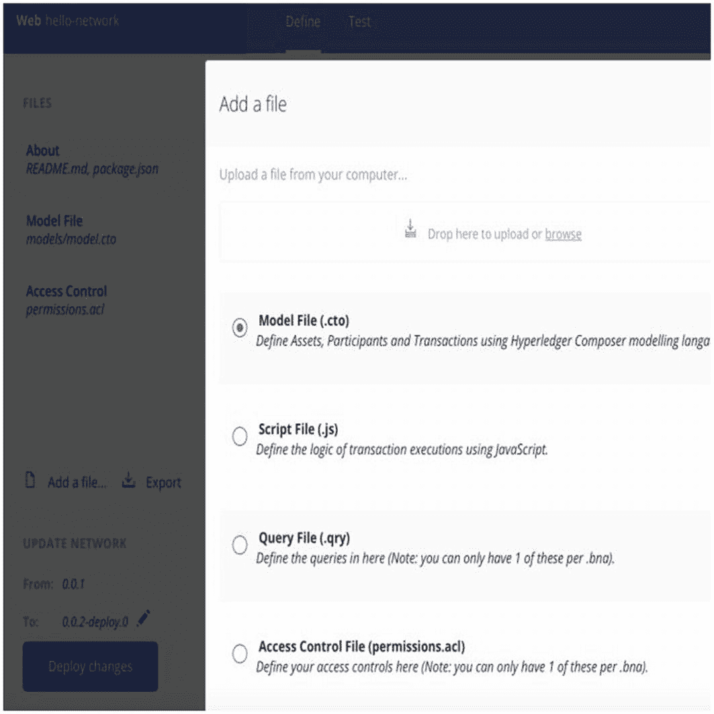

图 8-14 向业务网络模型添加文件

对于 `.cto` 文件，你将定义处理函数和交易。

对于命名空间，你将使用一个名为 Skynet 的虚构公司，并使用类型为 `String` 的标识符 ID。你还将创建一个 `msg` 字符串和一个交易 `Hello`，并传递包含消息的 `Myfunction` 资产。

```
namespace org.skynet.mymodel
asset Myfunction identified by id {
    o String id
    o String msg
}
transaction Hello {
    --> Myfunction check
}
```

### 添加链码

接下来，通过点击“Add a file”（添加文件）来添加一个 JS 文件。编写链码作为打印消息到控制台的交易逻辑，如下所示：

```
/**
@param {org.skynet.mymodel.Hello} hello
@transaction
*/
function hello(hello) {
    console.log("Hello " + hello.check.msg);
}
```

交易代表链码，即应用程序的业务逻辑。请注意，注释表明该代码是一个交易函数及其命名空间。点击“Deploy changes”（部署更改）以更新你的定义模型。

### 创建资产

接下来，为了测试模型，你将创建一个新资产，进行扩展并存储它。为此，请点击右上角的 `+ Create New Asset`（创建新资产）。创建新资产向导将打开，如图 8-15 所示。模型已经包含一个 ID；但在此示例中，你将把它改为 `001`（但该字符串可以是任意字符串）。对于消息，你将传递 `world`。

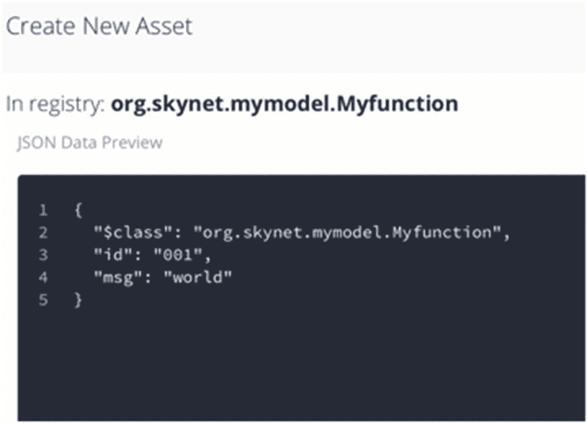

图 8-15 创建新资产向导

### 访问控制

请注意，在“定义”(Define)选项卡的左下方，有一个访问控制选项，其中包含 `permissions.acl` 文件，如图 8-16 所示。

如你所见，这些规则授予了非常开放的“允许所有”访问权限，这些权限是可以更改的。

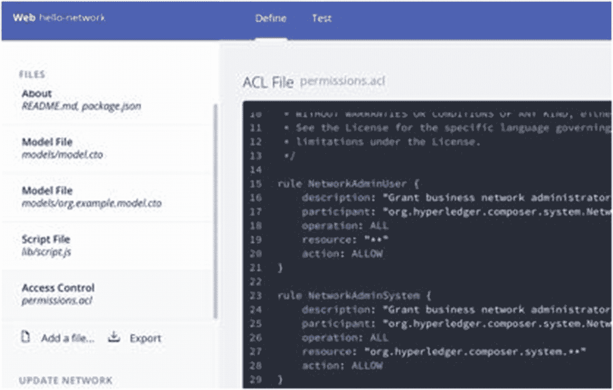

图 8-16 你的 `hello-network` 上的 ACL 权限文件

#### 测试模型

现在模型实例已保存，您可以提交交易来调用该交易。在左侧，点击“提交交易”按钮。提交交易向导随即打开。将 `ID` 设置为 `001`，如图 8-17 所示。

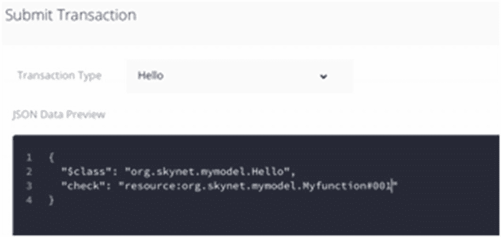

图 8-17 Hyperledger Playground，提交交易向导

在测试前，请打开开发者控制台以便查看 JavaScript 消息。对于 Safari 浏览器，请按照以下说明操作。

在顶部菜单中，选择 Safari ➤ 偏好设置。点击“高级”选项卡，然后勾选“在菜单栏中显示‘开发’菜单”复选框。

完成这些步骤后，您会在顶部菜单中看到“开发”选项。选择“显示 JavaScript 控制台”（或按 `Command+Option+C` 键）。

接下来，点击“提交”；您将在 JavaScript 控制台中看到“Hello world”消息，如图 8-18 所示。

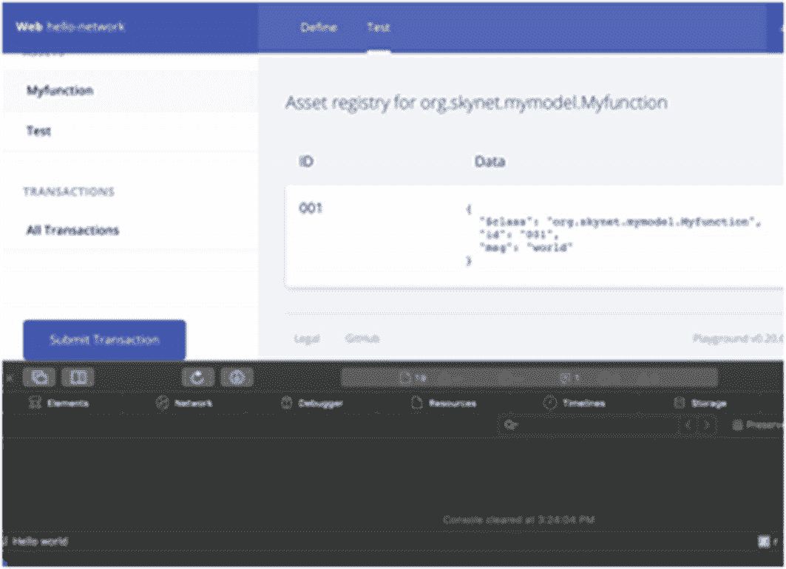

图 8-18 JavaScript 控制台中显示的“Hello world”消息

#### 导入/导出模型

要导出模型，您可以生成业务网络归档文件（`.bna`）。此 `.bna` 文件随后可部署到生产环境。您只需点击“导出”链接即可，如图 8-19 所示。

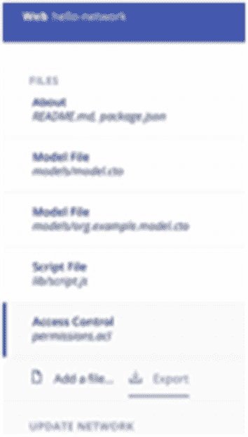

图 8-19 导出 `.bna` 文件

Playground 会生成 `hello-network.bna` 文件，该文件将下载到您的计算机上。

同样地，您可以导入一个 `.bna` 文件：点击“添加文件”链接，然后在“从您的计算机上传文件...”下，您可以浏览或拖放该 `.bna` 文件。

导入/导出功能不仅用于发布，还可以与他人共享模型以进行测试、开发或其他用途。我已将 `hello-network.bna` 文件包含在本书的代码中，欢迎导入使用；请参见 [`https://github.com/Apress/the-blockchain-developer/chapter8/hello-network`](https://github.com/Apress/the-blockchain-developer/chapter8/hello-network)。

`.bna` 文件实际上就是一个名为 `bna` 的 zip 文件夹。事实上，您可以将 `.bna` 文件复制为 `.zip` 文件并解压缩。

```
cp hello-network.bna hello-network.zip
unzip hello-network.zip
```

`VSCode` 可用作您整个 Hyperledger 项目的集成开发环境。例如，既然您已经解压了文件，可以打开 VSCode，并将模型文件 `models/org.example.model.cto` 拖放到 VSCode 中。您会看到代码已高亮显示，如图 8-20 所示。

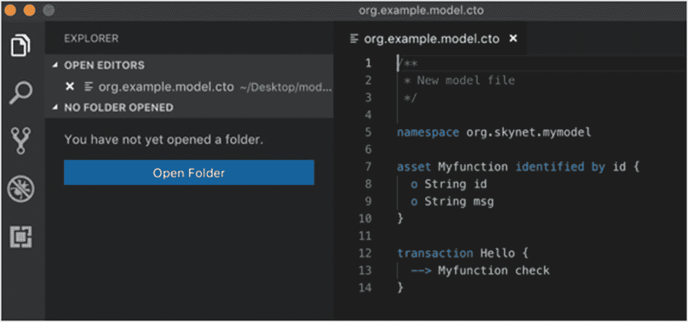

图 8-20 VSCode 中的模型 CTO 文件

您之前使用 Web 界面在 Composer Playground 中编写了文件。这种方式对开发者的技术要求较低；然而，较大的项目可能包含复杂的业务逻辑、事件、多笔交易和测试，因此建议使用 VSCode 创建和管理项目文件，然后将这些文件上传到 Playground 进行部署。

### Playground 在线版

Hyperledger Composer Playground 有一个在线版本，访问地址为 [`https://composer-playground.mybluemix.net/`](https://composer-playground.mybluemix.net/)。您可以使用之前相同的步骤来创建您的网络和文件。请参见图 8-21。

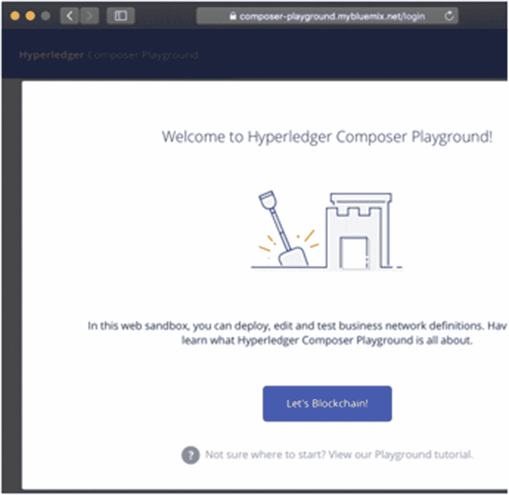

图 8-21 Composer Playground

要测试 Playground 在线版，您可以导入之前创建的 `hello-network.bna` 文件。为此，首先点击"Let's Blockchain!"，然后在"2. MODEL NETWORK STARTER TEMPLATE"下选择"拖拽到此处上传或浏览"，并上传 `hello-network.bna` 文件。点击右下角的"部署"按钮。您将看到网络已创建。点击"立即连接"链接以连接到新网络。请参见图 8-22。

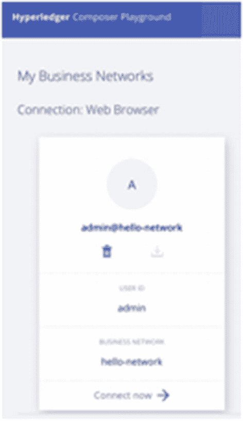

图 8-22 `hello-network` 连接链接

您可以重复相同的步骤来创建资产并进行测试，就像在本地 Playground 上所做的那样。

#### 使用 Yeoman 创建业务网络

您使用了 Hyperledger Playground 来生成业务网络。Hyperledger Playground 不仅面向开发者，也因其简易性而面向业务所有者；不过，您也可以在终端中创建网络。

`Yeoman` 提供了一个可用的向导。如果您不熟悉 `Yeoman`，它通过命令行提供了一个向导生成器。您可以运行 `Yeoman` 并选择 Hyperledger Composer 和业务网络生成器，或者运行以下命令：

```
> Yeoman hyperledger-composer:businessnetwork
```

请记住，Hyperledger Composer 不仅可用于生成业务网络，还可用于 Angular、LoopBack 和模型。请参见图 8-23。

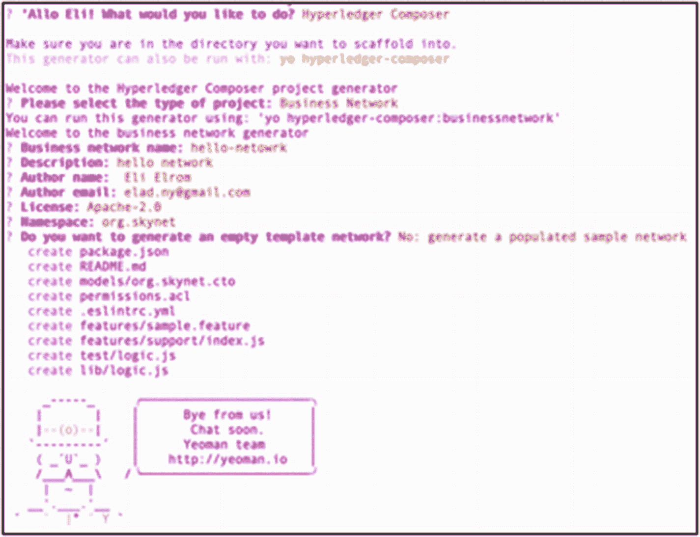

图 8-23 使用 `Yeoman` 向导生成 `hello-network`

`hello-network` 文件夹被生成，其中包含 `permissions.acl`、`models`、`features`、`test` 和 `lib`。接下来，要创建 `.bna` 文件，您可以使用 Hyperledger Composer。请参见图 8-24。

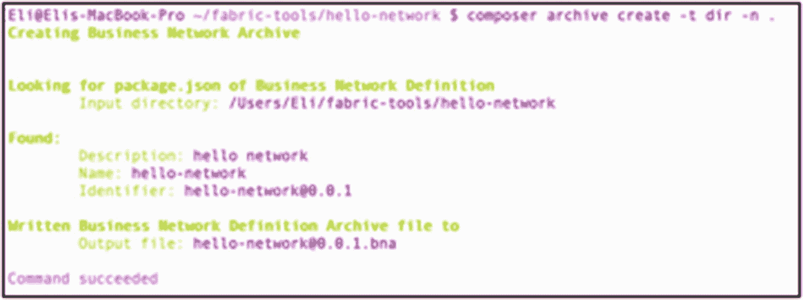

图 8-24 使用 Hyperledger Composer 生成 `hello-network` BNA 文件

```
> cd hello-network
> composer archive create -t dir -n .
```

运行 `ls` 命令，确认已生成 `hello-network@0.0.1.bna` 文件。

```
> ls *.bna
hello-network@0.0.1.bna
```

### 部署到本地 Hyperledger Fabric 网络

要将 `.bna` 文件部署到本地 Hyperledger Fabric 网络，请运行 `composer network install` 命令，并指定 `.bna` 文件以及身份卡。

```
> cd ~/fabric-dev-servers/
> composer network install --archiveFile ~/Desktop/hello-network.bna --card PeerAdmin@hlfv1
```

这将产生如图 8-25 所示的成功输出。

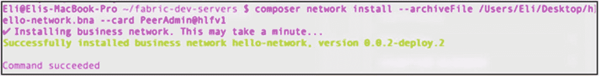

图 8-25 安装本地 Hyperledger Fabric 命令输出

### 运行 "hello-network" 网络

Hyperledger Composer 是一个应用程序开发框架，用于构建基于 Hyperledger Fabric 的区块链应用。

Hyperledger Composer 根据您创建的业务网络定义生成 REST API。这是通过一个称为 LoopBack 连接器的方式实现的。您可以将这些 REST API 用于：a) 客户端（例如去中心化应用）；b) 与非区块链客户端（例如网站）集成。这让您可以像使用任何带有中间件的数据库一样使用区块链账本。这非常强大。

Hyperledger Composer 可以生成一个 REST 接口。您可以在自己的计算机上运行 Hyperledger Fabric 并生成一个 GUI，然后使用此 GUI 与运行在您计算机上的网络进行交互，就像在真实的生产服务器上一样。

#### 启动“hello-network”业务网络和管理员卡

要运行你的“hello-network”网络，请执行以下命令，并参见图 8-26 中的输出：

```
> composer network start --networkName hello-network --networkVersion 0.0.2-deploy.3 -A admin -S adminpw -c PeerAdmin@hlfv1 --file networkadmin.card
```

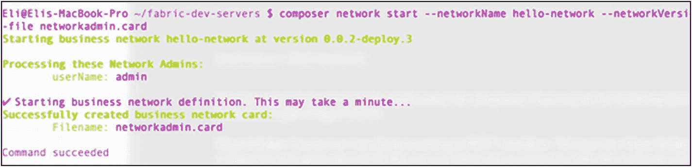

图 8-26 启动业务网络

要确认操作成功，你可以运行 `docker ps` 命令。你应该能看到已创建的 `dev-peer0.org1.example.com-hello-network-0.0.2-deploy.3-0` 镜像，如图 8-27 所示。

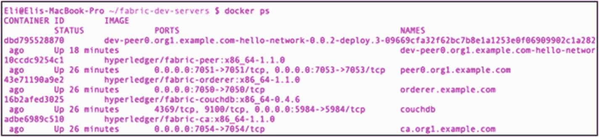

图 8-27 Docker 容器 hello-network

```
> docker ps
```

#### 导入业务卡

接下来，导入一张新的网络管理员卡，这样你就可以在你启动的业务网络中使用 `admin@hello-network`。

```
> composer card import --file networkadmin.card
```

此命令将导入网络管理员卡，其中将包含 `admin@hello-network`。

```
> composer network ping --card admin@hello-network
```

你可以将你的输出与我的输出进行对比，如图 8-28 所示。

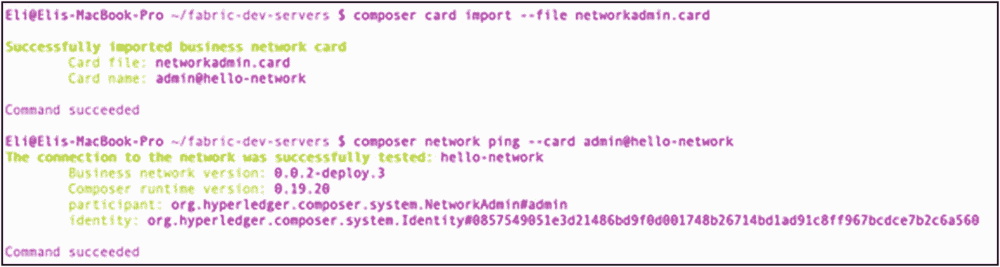

图 8-28 导入业务网络卡

### 后续方向

从这里开始，你可以为你的用户选择多种身份验证策略。例如，你可以根据组织正在使用的方案，选择 Google OAUTH2.0、SAML、`Passport-JWT` 或 LDAP。

然后，你将能够在多用户模式下运行 REST 服务器，并测试与你创建的客户端应用程序（例如你之前创建的那个）的交互。

以下是一些可以帮助你设置应用程序以认证多个用户的文章：

*   `Passport-JWT`：[`https://hyperledger.github.io/composer/latest/tutorials/google_oauth2_rest`](https://hyperledger.github.io/composer/latest/tutorials/google_oauth2_rest)
*   Google OAUTH2.0：`hyperledger/fabric-ca docker hyperledger/fabric-orderer hyperledger/fabric-peer hyperledger/fabric-ccenv hyperledger/fabric-couchdb`

Hyperledger 是一个大型项目，由五个主要平台和五个主要工具组成。本章仅关注 Hyperledger Fabric。不过，我们鼓励你继续尝试其他 Hyperledger 平台和工具，例如 Hyperledger Sawtooth，包括设置环境、创建账户、编写更复杂的链码，以及部署链码并将其连接到去中心化应用。

要获取更多入门信息，请访问官方网站：[`https://sawtooth.hyperledger.org/docs/seth/releases/latest/getting_started.html`](https://sawtooth.hyperledger.org/docs/seth/releases/latest/getting_started.html)。

事实上，你可以在以下网址找到关于所有平台和工具的更多信息：[`https://www.hyperledger.org/`](https://www.hyperledger.org/)。

最后，请将 Hyperledger 开发者中心加入书签：[`https://developer.ibm.com/technologies/blockchain/`](https://developer.ibm.com/technologies/blockchain/)。

### 错误排查

Hyperledger 的设计初衷是简洁明了，允许你将多台不同机器上的模块拼接在一起，但这并不意味着没有问题。Hyperledger 是为更高级的用户设置的，可能需要系统管理员权限来设置服务器。你可能已经遇到了一些错误，因此我将它们汇总在本节中。

#### Composer 运行时安装错误或找不到卡

如果你遇到如下错误：

*   “composer runtime install error card not found peerAdmin”
*   “错误：找不到卡：`PeerAdmin@hlfv1`”

这是因为管理员身份证创建不成功，或者未遵循正确的流程；你只需删除该身份证并重新创建即可。你需要删除 `~/.composer` 文件夹，创建一个新文件夹，然后重新运行命令。

```
> rm -rf ~/.composer
> mkdir ~/.composer
> ./createPeerAdminCard.sh
```

#### Docker 未授权认证错误

在下载 Hyperledger Fabric 时，你可能会遇到以下错误：

*   “unauthorized: authentication required”

这是向 Docker Hub 进行身份验证或代理时出现问题，与 Hyperledger Fabric 无关。

要尝试修复此问题，请将你的计算机时间设置为与 UTC 时区一致：[`https://www.timeanddate.com/worldclock/timezone/utc`](https://www.timeanddate.com/worldclock/timezone/utc)。

在 [`https://hub.docker.com`](https://hub.docker.com) 创建一个 Docker 账户，然后登录。

```
> docker login
```

或者，在登出后重试。

```
> docker logout
```

#### Docker 容器冲突错误

当你为某个项目使用 Docker 容器时，可能需要重新创建容器或停止某个容器；否则，你可能会遇到冲突错误。

你需要做的就是停止并移除该容器。

```
> docker stop [容器 id]
> docker rm [容器 id]
```

#### 提示

如果你已经创建了一个 Mongo-Docker 容器或任何其他会导致冲突的 Docker 容器，那么在尝试创建一个新的容器时，你将收到以下冲突错误：“容器名称已被容器 [容器 id] 使用。”你需要做的就是停止该容器并将其移除。

```
> docker stop [容器 id]
> docker rm [容器 id]
```

#### 版本不匹配与清理

如果你使用的 Hyperledger Composer 和 Hyperledger Fabric 版本不匹配，你可能会收到以下错误：

*   “正在启动业务网络定义。这可能需要一分钟... 错误：尝试启动业务网络时出错。错误：无法连接到任何对等事件中心。需要至少连接一个事件中心以接收提交事件。命令失败。”

在 Hyperledger Fabric 1.2 配合 Hyperledger Composer 0.20.6 的情况下也会出现此错误，因为存在一个未修复的 bug。要修复此问题，你需要检查你的 Hyperledger Composer 版本，通过 `npm` 卸载，并重新安装 Hyperledger Fabric。

此外，如果你需要完全清理，你需要停止并拆除 Fabric。要删除 Docker 镜像，删除 `fabric-dev-servers` ，最后删除 Composer，请遵循以下流程：

```
> cd ~/fabric-tools
> ./stopFabric.sh
> ./teardownFabric.sh
```

接下来，停止 Docker 容器，移除它们，并通过运行以下命令移除所有 Docker 镜像：

```
> docker kill $(docker ps -q)
> docker rm $(docker ps -a -q) –f
> docker rmi $(docker images -q) -f
```

现在你可以完全删除 `fabric-dev-servers`。

```
> rm -rf ~/fabric-dev-servers
```

要移除 Composer 和管理员身份证，请运行以下命令：

```
> sudo rm -rf ~/.composer
> npm uninstall -g composer-cli
```

`npm uninstall` 命令将输出一条确认信息，表明该库已卸载。

## 总结

本章中，我介绍了 Hyperledger，帮助你入门并理解其强大之处。我讲解了 Hyperledger 生态系统和术语，让你深入了解构成网络的各个组件以及可用的主要 Hyperledger 平台和工具。你安装了 Hyperledger Fabric 和 Hyperledger Composer，并确保安装了必要的依赖库。你使用 Playground 创建了“Hello, World”应用程序，以及在本地网络上部署的 `.bna` 文件。我提到了 Hyperledger Playground Online，并解释了如何使用 `Yeoman generator` 生成网络。我介绍了构成 `.bna` 存档文件的各个部分，包括处理 ID 卡。我还介绍了潜在的错误和故障排除，以确保你的安装顺利进行。最后，我提供了一些关于从何处继续学习 Hyperledger 的建议。

在下一章中，你将学习如何使用 Angular 构建去中心化应用（dapp）。Dapp 可以与你在前三章中开发的智能合约交互，并且是区块链生态系统中的一个重要组成部分。