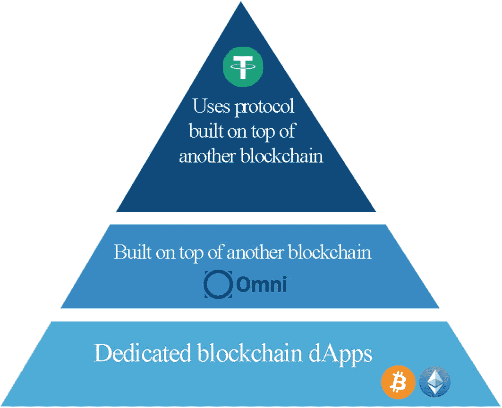
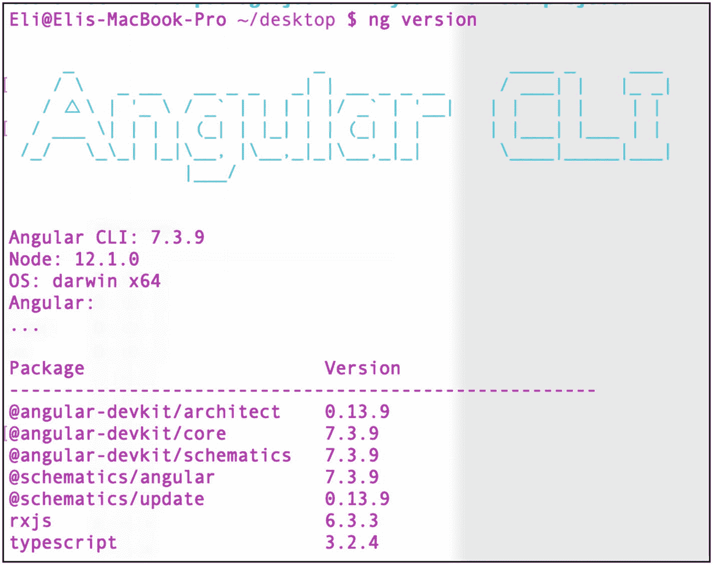
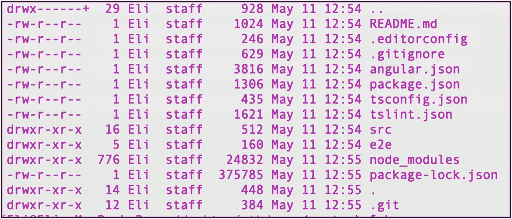
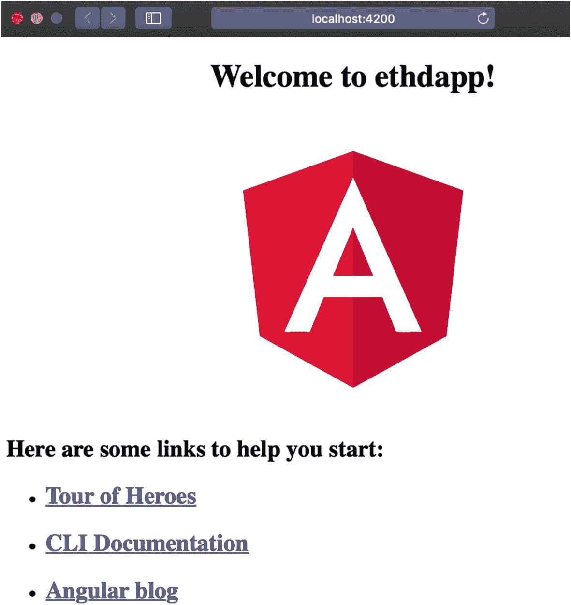
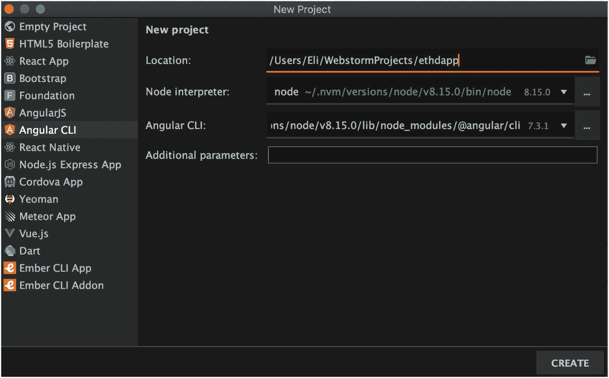
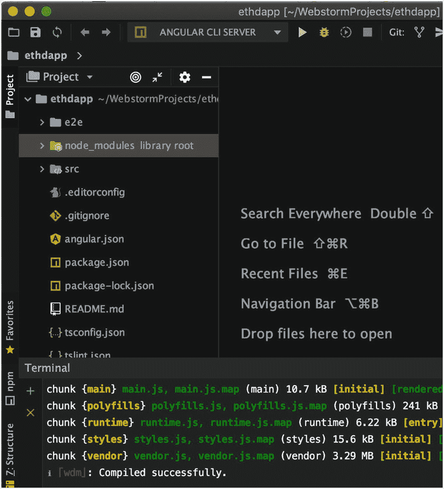
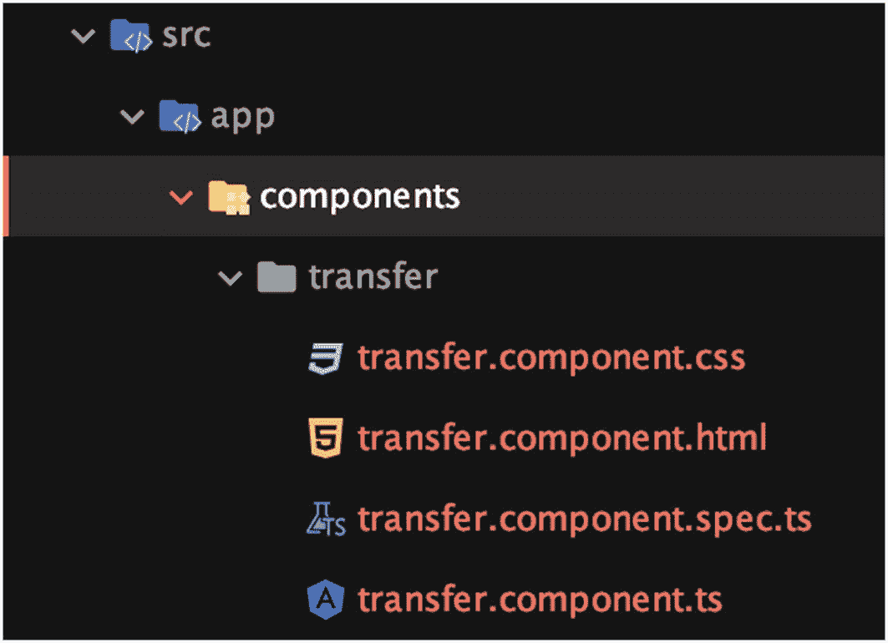
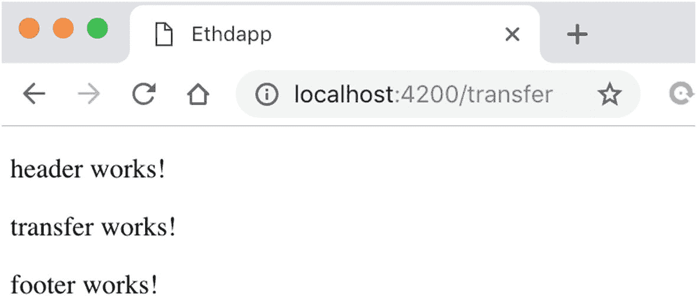
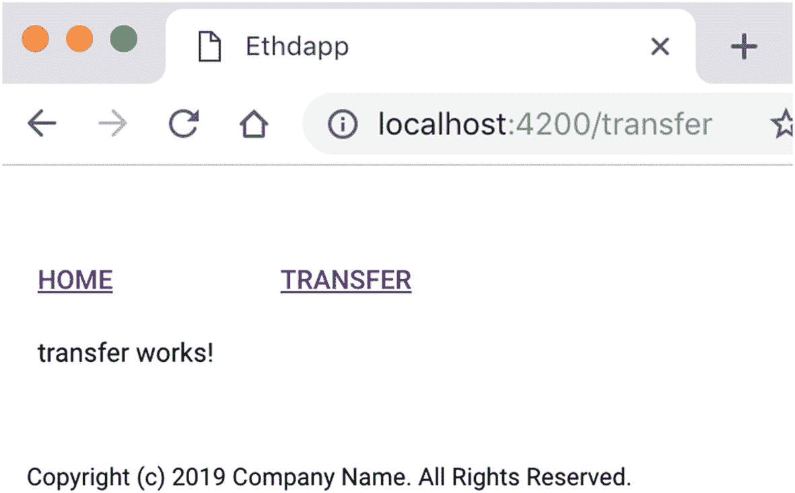

# 9. 使用 Angular 构建 Dapp：第一部分

在前几章中，我介绍了不同的区块链，你学习了如何创建可与区块链交互的智能合约。你在`Ethereum`、`NEO`、`EOS`和`Hyperledger`中创建了智能合约。在第一章中，我将过程分解为五个层面：共识层、记账/出块层、传播层、语义层和应用层。在开发周期中，智能合约是应用层的一部分；然而，如果没有一个允许最终用户与区块链交互的前端界面，应用层就是不完整的。

### 提示

很多时候你会听到去中心化应用（dapp）被直接称为智能合约。智能合约是自动执行的合约。Dapp 使用智能合约，但运行在点对点（P2P）网络上，而不是单机系统上。

开发者和更懂行的用户可以通过前面章节提到的命令行界面和工具与你创建的智能合约交互，但对于所有其他用户来说，开发一个能够与区块链交互的前端应用程序是必不可少的。这可以通过创建一个去中心化应用（dapp）来实现。在本章和下一章中，你将借助`Angular`创建一个去中心化应用，以便用户能够通过友好直观的用户界面（UI）与智能合约交互。我将这个过程分为两部分。

本章涵盖的第一部分包含以下主题：

- 开发 dapp，包括其优势和分类
- 使用`Angular`，包括其架构、优势、前置条件以及创建`Angular`骨架应用
- 创建和样式化`Angular`自定义组件

第 10 章涵盖的第二部分包含以下主题：

- 使用`Truffle`创建 dapp 的智能合约
- 将智能合约与 dapp 集成
- 链接并将你的 dapp 连接到`Ethereum`网络

让我们开始吧。

## 什么是 Dapp？

*去中心化应用*（缩写为 ÐApp、dapp、Dapp、dApp 或 DApp，发音为“dee-app”）是一种能够与智能合约交互的 Web 应用程序。Dapp 运行在区块链上，并利用分布式账本。`Ethereum`区块链目前是运行 dapp 最流行的平台；然而，你看到过的其他分布式账本技术（DLT）也提供了创建 dapp 的能力。我在前面章节中介绍了`NEO`、`EOS`和`Hyperledger`；其他还包括`ICON`、`Cardano`和`Hashgraph (Hedera)`。

> “一切可以去中心化的事物终将去中心化。”
>
> ——David Johnston，DApp Fund 首席执行官 [`https://github.com/DavidJohnstonCEO/DecentralizedApplications`](https://github.com/DavidJohnstonCEO/DecentralizedApplications)

如果你曾经开发过标准的桌面、Web 或移动应用程序，你会发现 dapp 既有相似之处，又非常不同。

Dapp 是使用与你构建其他任何应用相同的工具和语言构建的，但要将一个应用归类为 dapp，它需要满足以下标准：

- 开源：其代码以开源形式发布，不应由单个实体掌控（中心化）。请记住，应用可以根据提出的改进建议和市场反馈调整其自身协议；然而，所有更改都由其用户的共识驱动。
- 去中心化：Dapp 利用区块链或 P2P 网络。
- 激励机制：Dapp 使用数字资产进行融资。
- 算法/协议：Dapp 通常生成代币并包含共识机制，例如`PoW`、`PoS`，甚至其自有的机制。

这些标准确保了 dapp 不会像你从`iTunes`或`Google Play`等市场下载的其他应用那样出现停机；dapp 也将控制权交给社区，而不是单个实体。这些标准可能意义重大。例如，`Apple`和`Google`经常因应用不满足其任意或基于金钱的政策而拒绝它们。这些策略并非总是合理，也并非总是符合最终用户的最佳利益；它们通常是为了阻止竞争对手的使用或为了获取金钱利益。

许多人认为，基于开源代码、在去中心化区块链上实现、并由使用特定共识机制生成的代币提供资金的 dapp，是所有业务的未来。只有时间能给出答案。

此外，开源软件是一个优势，因为它允许用户查看源代码并可能为其做出贡献。使用区块链进行去中心化，可以发挥区块链作为 DLT 的优势，并作为传统单服务器数据库的替代品。

最后，向账本添加记录/交易通常是通过使用代币完成的，而代币的共识机制也是 dapp 所有用户之间的协议。

### Dapp 的分类

除了上述标准，dapp 还可以进行分类。分类基于 dapp 所利用的基础设施，可以细分为以下三类：

- 专用区块链 dapp：这类 dapp 直接使用专用区块链；例如`bitcoin`、`Ethereum`、`EOS`和`NEO`。
- 依赖另一区块链的 dapp：例如，`Omni Layer Protocol`（原名`Mastercoin`）是一种建立在`bitcoin`区块链之上的数字货币和通信协议。
- 依赖构建在另一区块链之上的另一协议的 dapp：这类 dapp 使用建立在另一区块链之上的协议。一个例子是使用`Omni Layer Protocol`的安全网络。

一个有助于理解分类概念的好例子是`USDT (Tether)`代币。该代币基于两种区块链发行过两次：`bitcoin`和`Ethereum`。在这种情况下，存在两种类型的`USDT`。最初基于`bitcoin`的版本是通过使用`Omni Layer Protocol`生成代币实现的，而基于`Ethereum`的`USDT`则兼容`Ethereum`的`ERC20`标准。请看图 9-1。



**图 9-1** USDT 的分类表示

### DApp 项目

大多数 DApp 要么直接构建在以太坊区块链之上，要么使用区块链来管理其代币。然而，也有一些 DApp 甚至构建了它们自己专用的区块链。请查看表 9-1，其中列举了一些不同类型的 DApp 及其分类。

**表 9-1** DApp 示例及分类

| **DApp** | **描述** | **分类** | **代币** | **区块链** |
| --- | --- | --- | --- | --- |
| Ethlance | 职位发布和自由职业者招聘的市场，收取 0% 费用。 | 直接使用以太坊 | 无代币 | 以太坊区块链 |
| Golem | 闲置计算能力的全球市场。 | 基于以太坊的代币 | GNT | 以太坊区块链 |
| SAFE 网络 | 数据存储和通信网络。 | 实现依赖于构建在另一区块链（比特币）之上的另一协议（Omni 协议） | SFE | 比特币 |

除了表 9-1 中的信息，还有很多资源可以找到更多的 DApp；这两个网站提供了 DApp 列表供你查阅：[`https://dapps.ethercasts.com/`](https://dapps.ethercasts.com/) 和 [`https://coinsutra.com`](https://coinsutra.com)。

### 如何创建你自己的 DApp？

比特币和区块链的成功带来了 DApp 的爆发式增长。开发者和企业主创建了一个开发 DApp 的基本流程。你不必完全照搬这个流程，并且它在你阅读时可能已经发生了变化；然而，许多已发布的 DApp 都遵循了这一流程。该流程包含以下五个步骤：

1. 撰写白皮书。
2. 发起首次代币发行（ICO）。
3. 开发 DApp。
4. 发布 DApp。
5. 营销 DApp。

让我们回顾一下这些步骤。

#### 撰写白皮书

白皮书类似于公司面向投资者的商业计划书。然而，它的目标受众不仅仅是投资者；它还是技术蓝图。白皮书既是技术文档也是商业计划书，它应该解释要解决的问题，以及 DApp 的概念、功能和技术细节。

就像在商业计划书中一样，包含你的独特卖点（USP）、路线图、团队成员简历、能力和历史记录是一个好主意，这有助于建立可信度。

#### 注意

独特卖点（USP）是你的 DApp 旨在解决的问题。

白皮书发布后，最好在早期阶段、开发之前，从同行和社区那里获得反馈。社交媒体、论坛和出版物常被用来推广 DApp 并帮助建立可信度。

#### 发起首次代币发行

白皮书发布后，下一步是发起 ICO，出售代币以资助和支持你的 DApp。你的代币应该有存在的理由，而不是与市场上已有的其他代币相同，因此你应该解释你的 DApp 为何以及如何需要自己的代币。

你还需要决定 DApp 的分类类型，这将决定你是否需要以下部分或全部内容：1) 发行代币，2) 设置使用费用，3) 拥有专用区块链，4) 拥有挖矿机制，5) 设置费用分配，6) 奖励投资者，7) 分配费用以支付你业务的不同部门：支持、开发、营销和业务。

#### 开发 DApp

开发应该是开源的，GitHub 通常用于存放开发工作的代码仓库。在每次发布时，最好让投资者和其他人知晓，以便围绕你的项目建立用户和开发者社区。许多 DApp 试图获取资金但未能交付可用的产品；你要让自己与众不同，并避免与监管机构产生潜在问题。（我将在第 11 章中讨论监管机构。）

#### 发布 DApp

发布你的 DApp，并包含发布说明、文档、路线图和维护计划。满足承诺的发布日期至关重要。

#### 营销 DApp

最后一步是营销。除了传统营销之外，DApp 在早期阶段或发布后通常会雇佣或与推广者合作以传播消息。DApp 另一个独特的营销方面是让代币在交易所上市。这是最终的认可标志。一些交易所设有投票系统来选择下一个要上市的代币。一些交易所滥用了这一流程，对代币上市收取高额费用。例如，在币安交易所上市一个功能型代币的费用可能在 50 万到 300 万美元之间。

许多早期投资者，包括 DApp 所有者，如果代币在主流交易所上市，他们就能够“套现”，因为上市通常会导致价格上涨；然而，DApp 上市变得越来越困难，它需要提供真正的价值。欺诈者经常会被揭露，代币上市后很快就会被摘牌。

## 为什么选择 Angular？

对于 DApp，就像任何传统应用一样，你可以为发布应用的设备编写原生应用（使用设备支持的语言，例如 iOS 的 Xcode）；然而，实践表明，使用框架可以加速开发。例如，如果你想复用同一段代码，并将其部署到具有不同屏幕尺寸的多个设备上，这对小团队来说可能是一个挑战。Angular 帮助你同时为 Web、移动端和桌面端构建跨平台的现代应用。Angular CLI 和组件开发套件（CDK）可以帮助加速应用的开发。

使用 Angular 的好处在于以下几点：

- 庞大的社区支持
- 企业级架构和扩展性
- 跨平台支持
- 文档完善

Angular 是一个结构化框架，能让你创建前端客户端应用。其各个部分松散耦合并以模块化方式组织，从而减少了需要编写的代码量，增加了灵活性，使代码更易于阅读，并缩短了开发时间。

Angular 允许开发者组合一套工具集，用于构建一个完全适合你应用需求的框架。你可以使用 HTML 作为模板语言，并扩展 HTML 的语法，使应用的组件易于阅读。除了 HTML，编码使用 TypeScript 完成，它将 JavaScript 转变为面向对象的编程语言，并为你提供企业级开发环境。

此外，Angular 结构良好，并且根据可访问性富互联网应用（ARIA）标准构建，可实现完全可访问性，因此你的应用或网站可以正确地为残障人士构建。

Angular 还能很好地与其他 JavaScript 库配合使用，因此你可以使用`npm`管理器安装诸如以太坊 JavaScript API`web3.js`之类的库。最后，Angular 的特性可以轻松修改或替换，以满足你的确切需求。

#### 注意

Angular 一词意指具有多个角度或由角度测量。Angular 是一个结构化框架，能让你为 Web、移动端和桌面端创建前端客户端应用。它是一个用于动态应用开发的开源前端框架。

Angular 最重要的特性是数据绑定和依赖注入。这些有助于减少代码量。此外，Angular 已存在多年，如今已是第七个版本。

#### 注意

依赖注入是一种设计模式技术。顾名思义，它意味着通过注入代码的方式，将一个对象作为另一个对象的依赖项来使用。

Angular 2 是对 AngularJS 的彻底重写，并带来了重大变化；不过，从 Angular 2 到版本 8 之间没有重大差异。

在撰写本文时，Angular 的最新发布版本是 7.3.1，该版本增加了一些功能，例如：

- 依赖项：升级了依赖项，并增加了对 TypeScript 3.1、RxJS 6.3 和 Node 10 的支持。
- 包预算：你可以为应用程序的大小设置警告，以确保不超过限制（默认为 2 MB）。
- Angular CLI：通过运行 CLI 向导，你可以添加路由等组件，并决定 CSS 的格式。
- Angular Material 的组件开发工具包（CDK）：新增功能，如开箱即用的虚拟滚动、拖放功能，以及对原生选择字段的`mat-form-field`支持。（我将在本章后面介绍 Material。）

Angular 8 处于第二个发布候选版本 (rc.2) 阶段，预期功能主要是为了提升性能。它将包含一个名为 Angular Ivy 的改进版视图引擎，改进对支持 ES2015+ 的现代浏览器的 JavaScript 上传，支持使用 Web Worker 来进行繁重的硬件处理，支持 TypeScript，并提供一个基准测试工具等。

### 提示

我选择了 Angular，但 Angular 并不是唯一能加快开发速度的框架。你可以使用其他框架，例如 React (<https://reactjs.org>)，并获得类似的好处。这个决定实际上取决于个人喜好和你团队的技能组合。你完全可以主要将项目文件复制到 React 项目，从而轻松地将此项目转换为 React 项目。

### 创建一个 Angular 去中心化应用

在本节中，你将创建一个实际的去中心化应用，该应用将连接到以太坊网络，并从一个账户向另一个账户转移资金。这通常是任何去中心化应用的核心功能。例如，你可以构建一个销售产品、提供服务，或向用户支付测验费用的去中心化应用，所有这些类型都需要有一个转移代币/通证的机制。在本章的这部分，你将使用 Angular 创建一个去中心化应用。

在环境和部署方面，你将使用第 5 章中使用过的 Truffle Web 框架，因为它有助于快速创建智能合约。Truffle 不仅能帮助你编译智能合约；它能完成将智能合约注入到 Web 应用程序所需的一切工作，并且可以运行测试套件。你还将再次使用 MetaMask，以便在浏览器中获得一个安全的区块链账户。最后，你将使用并运行 Ganache 来创建一个本地区块链 RPC 服务器，用于测试和开发。

#### 前置条件

你所需的大多数工具都已安装。Angular 需要 Node 和`npm`管理器，这些你之前已经安装过。通过运行带有`-v`标志的库来确认安装了正确的版本，就像你在前面的章节中所做的那样。

```
> node -v
> npm -v
```

如果你没有安装`npm`和`node`，只需运行以下命令：

```
> brew install node
```

为你当前的用户赋予`npm`所有权，这样你就不需要使用`sudo`来安装库了。

```
> sudo chown -R $USER:$GROUP ~/.npm
> sudo chown -R $USER:$GROUP ~/.config
```

建议你升级`npm`以确保使用的是最新版本；在撰写本文时，最新版本是 6.9.0。

```
> [sudo] npm install -g npm
+npm@6.9.0
```

#### Angular CLI

接下来，你需要安装 Angular 命令行界面（CLI）。对于 Angular CLI，建议（但不是必须）使用`sudo`和`allow-root`进行安装，并确保 Angular CLI 拥有正确的权限。你将安装 Angular 最新的稳定发布版本 7.3.9。

```
> sudo npm install -g @angular/cli@7.3.9 --unsafe-perm=true --allow-root
+ @angular/cli@7.3.9
added 363 packages from 197 contributors in 13.691s
```

你也可以安装最新版本的 Angular，但使用较新的 Angular 版本时，你的示例代码可能会失效。

```
> sudo npm install -g @angular/cli --unsafe-perm=true --allow-root
```

要验证安装是否成功，请运行版本标志，你应该会看到版本 7.3.9；图 9-2 显示了预期的输出。



**图 9-2** Angular CLI 安装验证

```
> ng version
```

## 创建 Angular 项目

现在你已经安装了主要的工具和库，可以继续从零开始创建项目了——这需要下载其他必要的库、测试库和构建脚本，并建立自己的文件夹结构。但为了加快这个过程，你可以使用 Angular 种子项目，它包含一个骨架项目，能帮助你快速启动项目。

使用 Angular 种子项目可以让你遵循 Angular 的最佳实践，快速高效地开始开发。使用样板骨架代码既有优点也有缺点。你可以自行决定是否在未来的项目中继续使用这个骨架，但对于这个演示应用来说，它非常理想。

使用 Angular 种子骨架创建项目有很多方法。这里我将展示两种方案：使用 `Angular CLI` 和使用 `WebStorm`。

### 使用 Angular CLI

`ng new` 命令将运行一个脚本，为你创建应用。你可以运行 CLI 的 `new` 命令，并将 `ethdapp` 作为你的应用名称。

```
> cd ~/desktop
> ng new ethdapp
Would you like to add Angular routing? (y/N) y
Which stylesheet format would you like to use? CSS
```

注意，我在这里添加了路由，并决定使用 `CSS` 作为样式格式。这些内容将在本章后面详细介绍。

安装完成后，它会输出所有创建的文件。

```
CREATE ethdapp/README.md (1024 bytes)
CREATE ethdapp/angular.json (3557 bytes)
CREATE ethdapp/package.json (1313 bytes)
...
```

切换到新创建的文件夹，确认你已经拥有了初始文件和目录。

```
> cd ethdapp
```

运行以下命令，它会分析你的 `package.json` 配置文件并提供建议：

```
> ng update
```

你可以运行以下命令来遵循这些建议：

```
> ng update --all
```

接下来，全局安装 `Bower`。`Bower` 是一个常用于 Angular 的包管理器。在撰写本文时，其版本为 `1.8.8`。

```
> npm install -g bower
> bower -v
1.8.8
```

我们来概述一下工作区中创建的内容以及启动项目文件（见图 9-3）。



**图 9-3** Angular CLI 创建的 Ethdapp 文件

*   **新工作区**：这是名为 `ethdapp` 的根文件夹。
*   **e2e 文件夹**：包含端到端测试项目，位于 `ethdapp/e2e`。测试文件夹包含 `Jasmin` 库的 `JSON` 配置文件。
*   **src 文件夹**：这是你的项目文件夹，包含项目的所有文件。
    *   初始骨架应用项目，位于 `ethdapp/src/app`
    *   带有入口文件 `index.html` 的 `assets` 文件夹
    *   其他配置文件
*   **.gitignore**：在这里列出你希望在上传到 `Git` 时忽略的任何文件和文件夹。
*   **angular.json**：这是你的项目配置文件，包含项目的相关信息。
*   **package.json**：这是 `npm` 管理器配置文件，包含你将在项目中使用的所有库。
*   **README.MD**：这是关于你项目的文档；它将作为项目的“主页”文档，也是开发者首先阅读以获取项目运行说明的文件。
*   **tsconfig.json**：这是 `TypeScript` 配置文件。
*   **tslint.json**：这是 `Lint` 配置文件，用于设置你的最佳实践格式化、间距等。

#### 启动应用

要查看你的实际去中心化应用（dapps），你将使用 `ng serve` 命令，它会构建应用、启动开发服务器、监视源文件，并在你修改这些文件时重新构建应用。`--open` 标志会在浏览器的 `4200` 端口上打开应用，地址为 `http://localhost:4200/`。运行带有 `open` 标志的 `ng serve` 命令。

```
> ng serve --open
```

你应该会在浏览器中看到正在运行的去中心化应用，如图 9-4 所示。



**图 9-4** 在浏览器中运行的 Angular 种子应用

骨架应用包含指向教程、文档和 Angular 博客的链接。通过浏览“Hero 之旅”和 `CLI` 文档，你可以很好地理解 Angular 的工作原理，而将 Angular 博客加入书签则可以让你获得未来版本发布和公告的更新。

要停止应用服务，请在终端中按 `Command+C`。

### 使用 WebStorm 创建 Angular 项目

启动 Angular 种子项目的另一个方法是利用你之前章节中使用过的 `WebStorm` IDE。`WebStorm` 允许你导入已创建的种子项目，或者创建一个新的种子项目。

要导入你使用 `Angular CLI` 的 `ng new` 命令创建的 `ethdapp` 项目，请打开 `WebStorm`，选择 **File** ➤ **Open**，然后导航到 `ethdapp` 目录。这样就完成了；`WebStorm` 会自动导入该项目。

或者，要在 `WebStorm` 中启动一个新的 Angular 种子项目，请从顶部菜单中选择 **File** ➤ **New** ➤ **Project**。接下来，选择 **Angular CLI** 并将你的项目命名为 **ethdapp**。使用下拉菜单选择 `Angular CLI` 的版本，如图 9-5 所示。



**图 9-5** 在 WebStorm 中生成 Angular 种子项目

现在项目已创建，你可以运行相同的命令，使用 `WebStorm` 底部菜单中的终端选项卡，如图 9-6 所示。



**图 9-6** 在 WebStorm 的终端中启动 ethdapp

```
> ng serve –open
```

你可以从本书的仓库下载骨架应用：[`https://github.com/Apress/the-blockchain-developer/chapter9/step1.zip`](https://www.scala-sbt.org/1.x/docs/Installing-sbt-on-Windows.html)。

下载你的步骤后，请确保运行 `npm install`，因为我移除了 `node` 模块以减小项目体积。

```
> npm install
```

**注意：** 我从项目中排除了 `node_modules`，它保存了项目的所有依赖项。由于体积原因，通常不将其包含在项目中；你可以使用 `npm install` 命令来安装它。

#### 确保与 Angular CLI 版本不冲突

你可以通过 `WebStorm` 或 `ng` 命令创建 Angular 种子项目，并且需要检查全局 `Angular CLI` 与本地项目 `Angular CLI` 是否存在版本不匹配。当配置文件指向先前版本时，或者你之前使用过旧版本 Angular 时，可能会出现这种情况。具体表现为：本地项目中的 Angular 版本低于计算机上安装的全局 Angular 版本。

为确保不发生这种情况，请运行任意 `ng` 命令。如果存在此问题，你将看到以下错误消息：

```
> ng
Your global Angular CLI version (7.3.9) is greater than your local
version (6.2.9). The local Angular CLI version is used.
```

如果继续使用这些设置，你将运行 `6.x` 版本而不是 `7.x` 版本。要解决此问题，你需要从开发环境中卸载 `Angular CLI`，然后安装 `7.x` 版本。

```
> npm uninstall --save-dev angular-cli
> npm install --save-dev @angular/cli@7.3.9
```

请注意，你使用了 `--save-dev` 标志，这样新版本将保存到你的 `package.json` 项目文件中。现在，再次运行版本命令，你应该会看到正确的版本，且没有警告消息。

```
> ng --version
Angular CLI: 7.3.2
```

现在，你已经确认运行的是正确版本的 `Angular CLI`，就可以继续开发并对种子启动应用进行更改了。

### Angular 组件

Angular 的最佳实践是使用模型-视图-控制器（MVC）风格的架构。与其他成熟框架一样，Angular 支持分离关注点的编码方式。

Angular MVC 包含以下三个元素：

*   **模型**：包含应用程序数据和 Angular 数据绑定，允许数据反射。
    > **注意**：数据绑定中的反射是指，与数据绑定的元素会在数据发生任何变化时自动反映该变化。例如，你将价格变化绑定到多个视图元素，一旦价格变化数据更新，所有视图元素都会自动更新。
*   **视图**：包含 `HTML` 或模板以及指令。
*   **控制器**：是连接模型和视图的粘合剂。控制器获取数据，应用业务逻辑，并将结果发送到视图。

你可能还记得，当你运行 `serve` 命令时，Angular 的欢迎页面打开了。欢迎组件就是应用程序外壳。该外壳由一个名为 `AppComponent` 的 Angular 组件控制。

组件是 Angular 应用程序的基本构建块。它们在屏幕上显示数据，监听用户输入，并根据输入执行操作。

你将创建一个名为 `transfer` 的组件，用于将代币转移到另一个地址。要创建 `transfer` 组件，请运行 `ng generate component` 命令。

```
> ng g c components/transfer
```

请注意，你使用了 `g` 和 `c` 这两个缩写，分别代表 "generate" 和 "component"，但你也可以使用完整名称而不是缩写。

`ng` 命令为你生成了以下四个文件：

*   `transfer.component.css`：组件的 `CSS` 样式
*   `transfer.component.html`：组件模板，用 `HTML` 编写
*   `transfer.component.spec.ts`：测试文件
*   `transfer.component.ts`：组件类代码，用 `TypeScript` 编写

这四个文件共同构成了 `transfer` 组件的实现。你可以在图 9-7 中看到文件夹结构。



**图 9-7** 传输组件文件结构

应用程序的结构通常由页眉、页脚和导航菜单组成，以便你可以导航到不同的局部视图。

使用这种页眉和页脚组件的架构可以帮助你创建不同的视图，并将页面视图拆分成独立的文件。将每个部分视为一个独立的可复用 `UI` 模块。Angular Seed 提倡这种架构，并已创建了欢迎组件。让我们创建一个启动组件，一个页眉组件和一个页脚组件。

```
> ng g c components/start
> ng g c components/header
> ng g c components/footer
```

你可以在输出中看到，每个组件都生成了以下文件：

```
CREATE src/app/components/[component-name]/[component-name].component.css
CREATE src/app/components/[component-name]/[component-name].component.html
CREATE src/app/components/[component-name]/[component-name].component.spec.ts
CREATE src/app/components/[component-name]/[component-name].component.ts
```

除了这些文件之外，你可以打开 `ethdapp/src/app/app.module.ts`，注意到每次创建组件时，`app.module.ts` 文件都会被修改。`app.module.ts` 文件是 Angular 中最重要的文件之一；它是用 `TypeScript` 编写的应用程序控制器。控制器是一个全局文件，它将你的组件连接在一起，因此你希望在应用程序中使用的每个组件都需要在该文件中定义。如果你没有使用 `ng` 脚本，则需要自己修改 `app.module.ts` 来链接新组件。

由于你使用了 `CLI`，这些导入会自动为你包含在内：

```
import { TransferComponent } from './components/transfer/transfer.component';
import { StartComponent } from './components/start/start.component';
import { HeaderComponent } from './components/header/header.component';
import { FooterComponent } from './components/footer/footer.component';
```

### 路由模块

另一个重要的文件及良好的实践是创建应用路由模块。该文件充当控制器，用于指示 Angular 如何在应用的不同视图之间导航。

通常，为应用生成路由时无需手动操作，因为在创建应用时，您已决定创建名为`app-routing`的路由文件。

如果需要创建`app-routing`文件，可以运行以下`module`命令：

```
> ng generate module app-routing --flat --module=app
CREATE src/app/app-routing.module.ts
UPDATE src/app/app.module.ts
```

请注意，这次在命令中您使用的是完整名称`generate module`，而不是仅使用首字母`g`和`m`。两种方式的效果相同。

`generate module`命令会为`src/app/app-routing.module.ts`创建清单 9-1 所示的初始代码。

```
import { NgModule } from '@angular/core';
import { Routes, RouterModule } from '@angular/router';
const routes: Routes = [];
@NgModule({
imports: [RouterModule.forRoot(routes)],
exports: [RouterModule]
})
export class AppRoutingModule { }
```

清单 9-1 app-routing 初始启动代码

初始代码包含一个导入 Angular 代码和模块标签的`import`语句。接下来，用清单 9-2 中的代码替换`app-routing.module.ts`文件中的预填充代码。

```
import { NgModule } from '@angular/core';
import { CommonModule } from '@angular/common';
import { RouterModule, Routes } from '@angular/router';
import { StartComponent } from './components/start/start.component';
import { TransferComponent } from './components/transfer/transfer.component';
const routes: Routes = [
{ path: '', redirectTo: '/start', pathMatch: 'full' },
{ path: 'start', component: StartComponent },
{ path: 'transfer', component: TransferComponent }
];
@NgModule({
declarations: [],
imports: [ RouterModule.forRoot(routes), CommonModule ],
exports: [ RouterModule ]
})
export class AppRoutingModule { }
```

清单 9-2 用于路由视图的 app-routing 代码

在清单 9-2 中，您导入了将要使用的视图组件，分别是`start`和`transfer`。它们将充当网站上的网页或移动应用中的局部视图。路由告诉应用哪个视图对应哪个关键字，最后您设置`import`语句来告知 Angular 哪些模块可以访问该模块。

现在路由已设置完毕，您可以获取页面的页脚、页眉和主体进行显示。只需打开`src/app/app.component.html`，将欢迎页面的 HTML 代码更新为以下三行：

要测试对应用所做的更改，无需重新发布应用或运行任何脚本；只需保存文件，然后在终端中运行之前执行过的相同`serve`命令即可。

```
> ng serve
⌈wdm⌋: Compiled successfully.
```

`serve`脚本包含监视文件更改并自动更新应用的脚本，因此当您修改文件后，只需返回浏览器即可。大多数情况下，甚至无需刷新网页，更改就会自动生效。访问`http://localhost:4200`即可查看更改。

如果您想直接跳转到转账页面，只需在设置路由机制时，在 URL 末尾添加所选的关键字：`http://localhost:4200/transfer`。参见图 9-8。



图 9-8 Ethdapp 的页眉、页脚和转账页面

您可以在此处下载此步骤的代码：[`https://github.com/Apress/the-blockchain-developer/chapter9/step2.zip`](https://www.scala-sbt.org/1.x/docs/Installing-sbt-on-Windows.html)。

### 为 Angular 应用设置样式

目前您的应用尚未设置样式，仅显示带有页眉、页面和页脚的文本；不过在开始设置样式之前，了解 Angular 样式架构会对您有所帮助，以确保不会产生过于庞大难以管理的层叠样式表 (CSS) 文件。您可以在全局级别设置整个应用所需的样式，也可以为单个组件设置独特的特定样式。

此外，快速从零开始构建一个具有样式的应用会很棒。这可以通过 Angular Material 实现。Angular Material 为您提供了一种捷径，无需费心考虑跨浏览器、跨设备编程，即可为应用获得一致的“外观”。让我们来看看。

#### Angular 样式架构

Angular 设置了一个全局 CSS 文件。该 CSS 文件名为`style.css`，位于项目的根目录。`src/style.css`包含您希望在整个应用中使用的样式，例如字体、主题、所有组件的样式等。

如您所见，每个组件还包含一个私有的 CSS 文件。特定的组件 CSS 文件用于存放该组件独有的样式。

例如，`/src/app/components/footer/footer.component.css`存放了专用于页脚组件的样式。

#### Angular Material

目前，您的入门应用运行快速，因为它包含的代码极少；然而，随着您向应用添加越来越多的组件、资源和样式，可能会出现性能问题。您的应用很容易变得臃肿，而每毫秒的延迟都很关键。

另一个潜在问题是测试。所有不同的浏览器、浏览器版本、屏幕尺寸和设备都需要进行测试，从头创建页面需要严格的测试和质量保证 (QA) 团队，以确保其在所有设备上表现一致。

Angular Material 解决了所有这些问题，同时还提供了可访问性和国际化支持。这是因为 Angular Material 专为 Angular 优化，并由 Angular 团队构建，因此能够与 Angular 无缝集成。它已经通过了所有兼容性测试。

更多信息，请查看 Angular Material 入门页面：[`https://material.angular.io/guide/getting-started`](https://material.angular.io/guide/getting-started)。

#### 安装 Angular Material

有几种安装 Material 的方式。由于您已安装 Angular DevKit，只需运行`ng add`命令即可获取 Angular Material 库。您需要先安装`cdk`，因为它是一个依赖项。

```
> ng add @angular/cdk
```

接下来，安装 Material。

```
> ng add @angular/material
```

请注意，输出会询问您想要哪个主题颜色并附有链接。我将在本章下一节介绍主题，但现在，请选择第一个或您喜欢的任何颜色。

```
? 选择预构建主题名称，或选择“custom”自定义主题： (使用方向键)
□ 靛蓝/粉红       [ 预览: https://material.angular.io?theme=indigo-pink ]
深紫/琥珀       [ 预览: https://material.angular.io?theme=deeppurple-amber ]
粉红/蓝灰       [ 预览: https://material.angular.io?theme=pink-bluegrey ]
紫色/绿色       [ 预览: https://material.angular.io?theme=purple-green ]
```

您还可以设置手势识别和动画。

```
? 设置 HammerJS 用于手势识别？ Yes
? 为 Angular Material 设置浏览器动画？ Yes
```

预期输出应显示已更新的文件：

#### 导入 Angular Material 模块

接下来，你需要修改应用，使其包含 Angular Material 的动画、Material 图标、手势支持以及组件模块。

在你的项目中，你只会使用组件模块，而不会用到 Angular Material 提供的所有功能；你需要做的是为你想要使用的每个组件导入 `NgModule`。打开 `src/app/app.module.ts` 并添加 `import` 语句。

```typescript
import {
MatButtonModule,
MatCheckboxModule,
MatInputModule,
MatSelectModule,
MatDatepickerModule,
MatNativeDateModule
} from '@angular/material';
```

接下来，更新 `@NgModule` 中的 `imports` 数组，以包含你导入的 Material 模块。

```typescript
imports: [
BrowserModule,
AppRoutingModule,
BrowserAnimationsModule,
MatButtonModule,
MatInputModule,
MatDatepickerModule,
MatNativeDateModule,
MatCheckboxModule,
MatSelectModule
]
```

就是这样。现在你可以访问所包含的 Angular Material 组件了。

#### 为你的 Angular Material 应用设置主题

现在你已经可以访问 Angular Material 组件，可以使用主题来设置它们的样式。*主题*是一组颜色，这些颜色将用于你的 Angular Material 组件。

在 Angular Material 中，主题是通过创建多个调色板来生成的。

- *主色板*：这些颜色是所有屏幕和组件中最常用的。
- *强调色板*：这些颜色用于按钮和交互元素。
- *警告色板*：这些颜色用于错误提示。
- *前景色板*：这些颜色用于文本和图标。
- *背景色板*：这些颜色用于元素的背景。

在 Angular Material 中，所有主题样式都是在构建时静态生成的，以避免拖慢应用启动速度。

Angular Material 预置了几个预构建的主题 CSS 文件。你可能还记得，在安装 Material 时，你曾可以选择要使用的主题。

这些主题文件还包含了核心组件的所有样式（所有组件通用的样式），因此你只需在应用中包含一个 Angular Material 的 CSS 文件。你可以直接从 `@angular/material/prebuilt-themes` 将一个主题文件引入到你的应用程序中。

以下是可用的预构建主题：

- `deeppurple-amber.css`
- `indigo-pink.css`
- `pink-bluegrey.css`
- `purple-green.css`

你在这里使用的是 Angular CLI，因此可以简单地将你想要的样式包含在全局的 `src/styles.css` 文件中。

最初它包含以下初始预代码：

```css
html, body { height: 100%; }
body { margin: 0; font-family: 'Roboto', sans-serif; }
```

在文档顶部添加以下 `import` 语句：

```css
@import "~@angular/material/prebuilt-themes/indigo-pink.css";
```

在打开 `src/style.css` 文件的同时，你还可以创建一个容器、一个段落和一个按钮的样式，以便在应用的不同页面中使用。

```css
p {
padding-left: 20px;
font-size: 12px;
}
.container {
margin-right: auto;
margin-left: auto;
padding: 20px 15px 30px;
width: 750px;
}
button {
color: #ffffff;
background-color: #611BBD;
border-color: #130269;
display: inline-block;
margin-bottom: 0;
font-weight: normal;
text-align: center;
vertical-align: middle;
touch-action: manipulation;
cursor: pointer;
white-space: nowrap;
padding: 6px 12px;
font-size: 12px;
line-height: 1.42857143;
border-radius: 4px;
-webkit-user-select: none;
-moz-user-select: none;
-ms-user-select: none;
user-select: none;
}
```

你可以将你的文件与我的进行比较：[`https://github.com/Apress/the-blockchain-developer/chapter9/step3.zip`](https://github.com/Apress/the-blockchain-developer/chapter9/step3.zip)。

### 创建内容

此时，你已经拥有了一个带有头部、主体和底部的基本应用框架。主体部分可以通过更改浏览器中的 URL 在起始页面和转账页面之间切换。你还导入并注入了 Material 模块，并为应用设置了全局样式。下一步是创建实际内容，替换你放置在头部、底部和起始组件中的临时文本消息。

#### 底部组件

对于底部组件，你只需替换公司的版权信息。要执行此操作，你需要做的是打开 `src/app/components/footer/footer.component.html` 并替换默认代码。

```html
footer works!

```

通过创建一个带有你添加到全局 CSS 文件中的样式的 `div` 容器来替换这段代码。

```html
<div class="container">
Copyright (c) 2019 Company Name. All Rights Reserved.
</div>
```

你还需要为底部组件创建一个特定的样式，这样每次使用 `<p>` 标签时，字体大小为 12px 且左内边距为 0。打开 `src/app/components/footer/footer.component.css` 并插入以下内容：

```css
p {
padding-left: 0;
font-size: 11px;
}
```

请注意，你定义了两遍 `<p>` 标签，一次在全局 CSS 文件中，一次在组件级别。发生的情况是，组件中的 `<p>` 样式会覆盖全局的 `<p>` 样式，因此你可以在底部组件中使用 `<p>` 标签，而在其他组件（如起始页面和转账页面）中使用不同的 `<p>` 标签，同时保持你的 HTML 代码不包含 CSS 代码。

#### 头部组件

对于头部组件，你将创建一个导航菜单，以便能够在起始页面和转账页面之间切换。对于头部组件特定的样式，打开 `src/app/components/header/header.component.css` 并添加导航列表样式。

```css
.nav {
margin-bottom: 0;
padding-left: 0;
list-style: none;
}
li {
display: block;
float: left;
width: 100px;
height: 25px;
padding: 5px;
}
.nav>li>a {
margin-bottom: 0;
padding-left: 0;
font-weight: 500;
font-size: 12px;
text-transform: uppercase;
position: relative;
}
```

对于 `src/app/components/header/header.component.html`，你需要创建一个容器以及一个包含两个指向起始页面和转账页面链接的列表。为此，请替换初始代码：

```html
header works!

```

为以下内容：

```html
<div class="container">
<ul class="nav">
<li><a routerLink="/start" routerLinkActive="active">home</a></li>
<li><a routerLink="/transfer" routerLinkActive="active">transfer</a></li>
</ul>
</div>
```

现在的分布式应用（dapp）包含了基本的样式和可用的导航功能，如图 9-9 所示。



图 9-9：具有基本样式和可用导航功能的 Ethdapp

你可以在此处下载此步骤的代码：[`https://github.com/Apress/the-blockchain-developer/chapter9/step4.zip`](https://github.com/Apress/the-blockchain-developer/chapter9/step4.zip)。

### 转账组件

`transfer`组件将包含一个表单，用于提交以将以太坊币从一个账户地址转账到另一个账户地址。你将使用表单模块来加快表单的创建。为此，你需要像处理其他 Material 模块一样，在 `app.module.ts` 中包含 Material 的 `FormsModule` 和 `ReactiveFormsModule` 表单模块。

打开 `src/app/app.module.ts` 并添加以下 `import` 语句：

```typescript
import { FormsModule, ReactiveFormsModule } from '@angular/forms';
```

你还需要更新 `imports` 语句：

```typescript
imports: [
  FormsModule,
  ReactiveFormsModule,
  ..
]
```

你将使用 `<mat-form-field>` 标签，它代表一个组件，用于包装多个 Angular Material 组件并应用常见的文本字段样式，如下划线、浮动标签和提示消息。这将加快开发速度，因为你无需实现所有这些功能并在多个设备/浏览器上进行测试。

表单字段是名为 `<mat-form-field>` 的包装组件。你可以使用任何表单字段控件（如输入框、文本区域、列表等）。

你可以在此处找到关于 `mat-forms` 的信息：[`https://material.angular.io/components/form-field/overview`](https://material.angular.io/components/form-field/overview)。

对于 `src/app/components/transfer/transfer.component.ts`，你将更新初始代码。首先，你需要导入将要使用的组件；在这种情况下，你需要初始化类并使用表单、表单控件和验证器。

```typescript
import {FormBuilder, FormControl, FormGroup, Validators} from '@angular/forms';
```

然后，你需要更新组件定义以实现 `OnInit` 方法：

```typescript
export class TransferComponent implements OnInit {
```

你将使用一个标志来指示表单是否已提交，并创建一个表单组实例，以及一个名为 `user` 的对象来保存用户信息。

```typescript
formSubmitted: Boolean = false;
userForm: FormGroup;
user: any;
```

为了验证你的表单，你需要在表单填写不正确的情况下定义消息。每个表单控件都需要使用必填字段和消息来定义。

```typescript
account_validation_messages = {
  'transferAddress': [
    { type: 'required', message: '转账地址是必填项' },
    { type: 'minLength', message: '转账地址长度必须为 42 个字符' },
    { type: 'maxLength', message: '转账地址长度必须为 42 个字符' }
  ],
  'amount': [
    { type: 'required', message: '金额是必填项' },
    { type: 'pattern', message: '金额必须为正数' }
  ],
  'remarks': [
    { type: 'required', message: '备注是必填项' }
  ]
};
```

当你创建构造函数时，需要包含 `FormBuilder` 组件以便能够生成表单。

```typescript
constructor(private fb: FormBuilder) { }
```

当你的组件初始化时，你将把 `formSubmitted` 标志设置为 `false`，并为用户信息设置默认值。然后，你将调用一个方法来获取用户的账户和余额，该方法将在稍后实现。最后，你将调用 `createForms` 方法来生成表单。

```typescript
ngOnInit() {
  this.formSubmitted = false;
  this.user = {address: '', transferAddress: '', balance: '', amount: '', remarks: ''};
  this.getAccountAndBalance();
  this.createForms();
}
```

`createForms` 方法将通过传递验证器和数据来生成表单控件。

```typescript
createForms() {
  this.userForm = this.fb.group({
    transferAddress: new FormControl(this.user.transferAddress, Validators.compose([
      Validators.required,
      Validators.minLength(42),
      Validators.maxLength(42)
    ])),
    amount: new FormControl(this.user.amount, Validators.compose([
      Validators.required,
      Validators.pattern('^[+]?([.]\\d+|\\d+[.]?\\d*)$')
    ])),
    remarks: new FormControl(this.user.remarks, Validators.compose([
      Validators.required
    ]))
  });
}
```

`getAccountAndBalance` 方法将设置用户账户的地址和余额；目前你使用的是虚拟数据，但你将在本章稍后实现实际的服务。

```typescript
getAccountAndBalance = () => {
  const that = this;
  that.user.address = '0xd8d0101f83e79fb4e8d21134f5325e64816bd6a0';
  that.user.balance = 0;
  // TODO: 获取数据
}
```

最后，一旦你提交表单，你需要一个方法来处理数据并调用服务。`submitForm` 将通过检查表单是否有效来使用，稍后你将调用将要创建的服务组件。

```typescript
submitForm() {
  if (this.userForm.invalid) {
    alert('transfer.components :: submitForm :: 表单无效');
    return;
  } else {
    console.log('transfer.components :: submitForm :: this.userForm.value');
    console.log(this.userForm.value);
    // TODO: 服务调用
  }
}
```

对于 `transfer.component.html`，你将设置表单标签，以便在表单提交后调用 `submitForm` 方法。

```html
<form [formGroup]="userForm" (ngSubmit)="submitForm()">
```

接下来，你将创建包裹的 `div` 并使用数据绑定来显示用户的账户地址和余额。

```html
<div class="transfer-container">
  <p>地址: {{user.address}} </p>
  <p>余额: {{user.balance}} Eth</p>
</div>
```

请注意，你使用了尚未定义的 `transfer-container` 样式；你将在 CSS 文件中定义它，它将用于格式化你的表单。

对于表单控件，你需要输入框来输入转账目标的账户、金额和消息。你还需要设置验证。

```markdown
### Angular 指令

在 Angular 中创建指令使你能够仅用几行代码就能创建自己的自定义 HTML 标签，就像你在 Material 表单中看到的那样。你能够包含包装了许多组件的自定义标签。从高层次来看，指令是 DOM 元素上的标记。这些标记可以指向任何 DOM 组件，从属性到元素名称，甚至是注释或 CSS 类。然后，这些标记会告诉 AngularJS 的 HTML 编译器附加指定的行为，或根据特定逻辑转换整个 DOM 元素及其子元素。

Angular 内置了许多这样的指令。然而，在开发过程中，你很有可能需要创建自己的指令。你的 dapp 目前很简单，所以你不需要创建任何指令，并且解释这一点超出了本章的范围。当你确实需要生成一个骨架指令时，请像生成其他组件一样使用 Angular CLI。

```bash
> ng generate directive {指令名称}
```

尽管你没有在你的应用中创建指令，但我还是想向你介绍这个概念，因为这是创建 Angular 项目不可或缺的一部分。

## 总结

在本章中，你深入探讨了什么是去中心化应用，并了解了去中心化应用的分类和项目。你学习了如何通过将过程分解为五个步骤来启动自己的去中心化应用项目：撰写白皮书、启动首次代币发行、开发去中心化应用、发布它，以及营销你的去中心化应用。

接着，你探讨了为什么要使用 Angular。然后，你创建了一个 Angular 去中心化应用，首先确保安装了先决条件，并安装了 Angular CLI。之后，你创建了一个 Angular 项目并运行了该应用。

接下来，你学习了如何将你的 Angular 项目导入 WebStorm 或创建一个新项目。你了解了构成 Angular 的各个部分，例如组件、模块和指令。你还通过学习 Angular 样式架构和使用 Angular Material，了解了如何为去中心化应用设置样式。

你开始构建组件并创建内容；你将应用拆分为页脚、页眉和主体，并创建了一个名为 `transfer` 的自定义组件，其中包含一个表单，以便稍后能够转移代币。

在下一章中，你将创建一个转账智能合约和一个 Truffle 开发项目，并且连接到 Ganache 开发网络。你将学习如何通过 Truffle 与以太坊网络交互以及测试你的智能合约。你还会将你的去中心化应用与以太坊网络的 `web3` 库链接起来，并通过 MetaMask 进行连接。
```