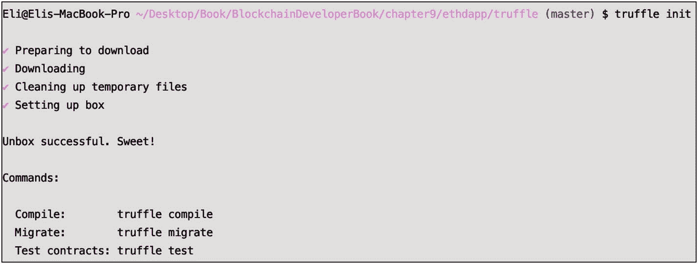
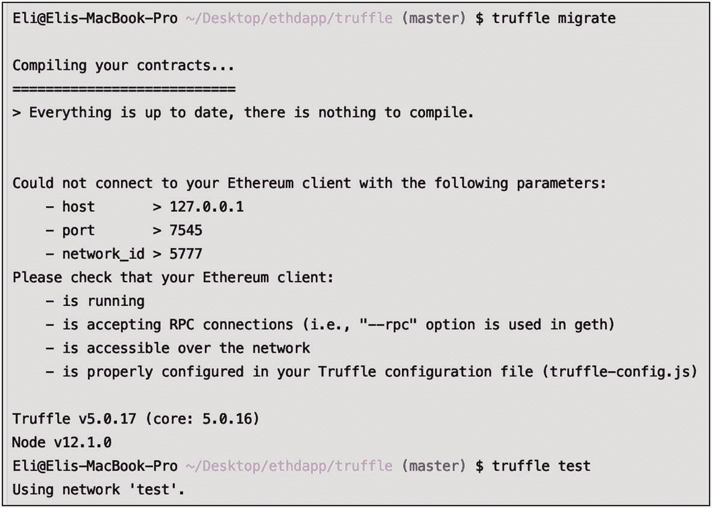
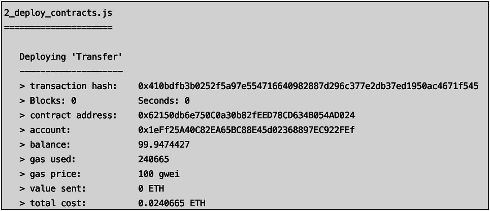
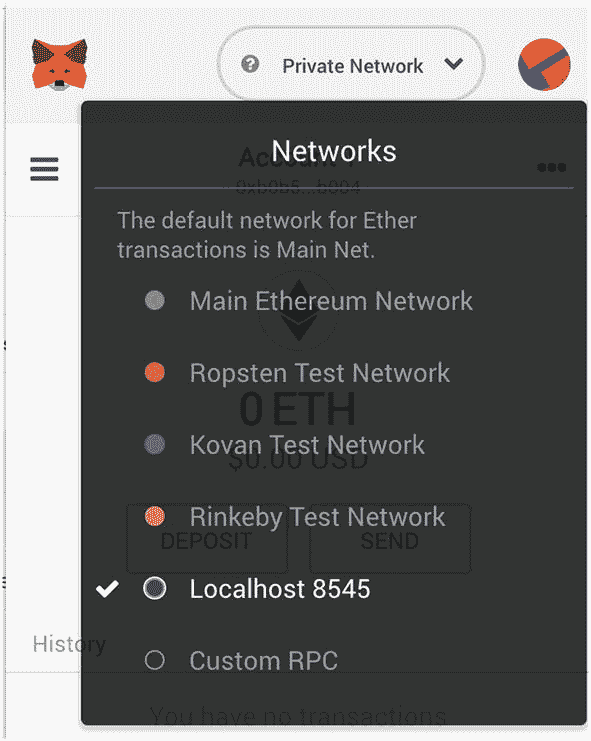
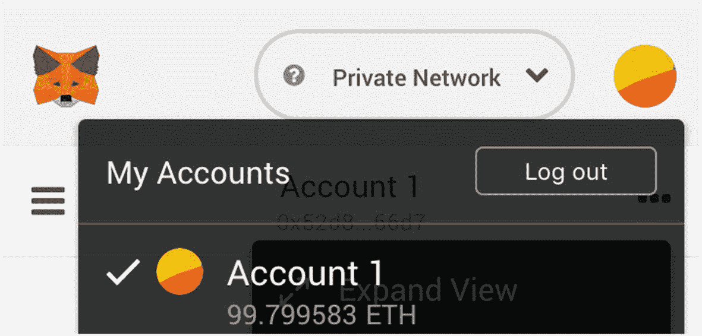
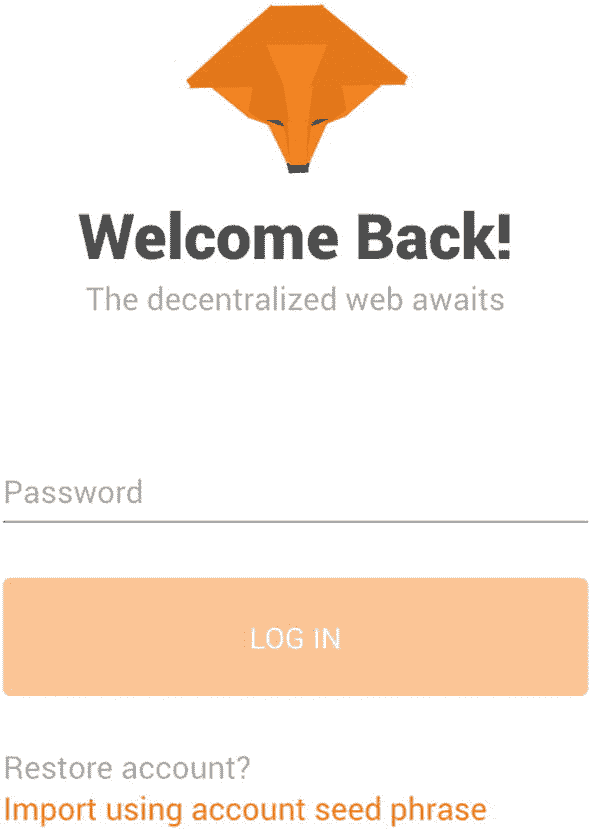
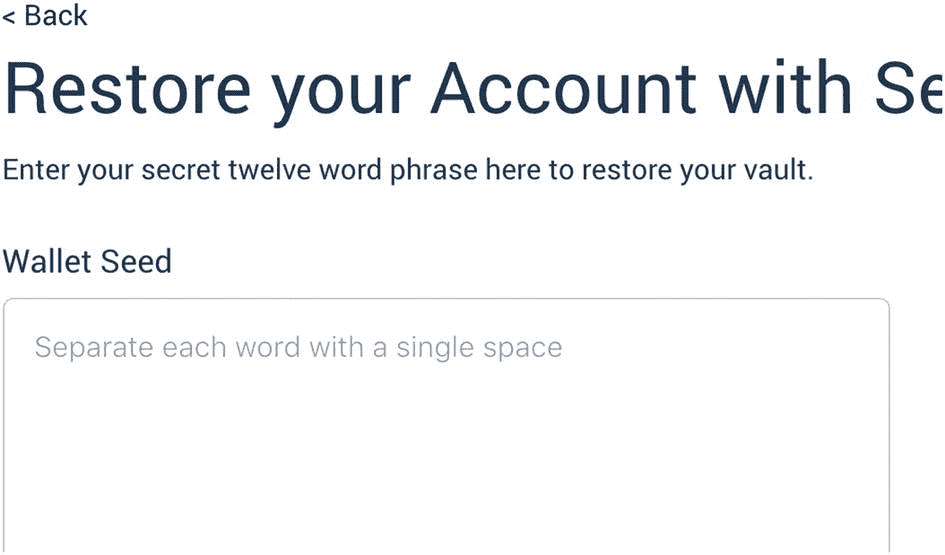
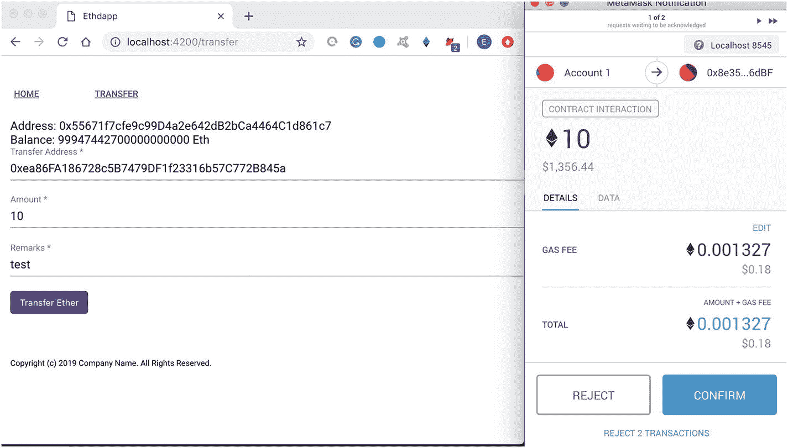

# 使用 Angular 构建去中心化应用：第二部分

在上一章中，你开始开发你的去中心化应用。具体来说，你了解了去中心化应用的分类和项目，并且你可以将自己的去中心化应用项目分解为五个步骤。然后，你探讨了为什么要使用 Angular 及其优势。接着，你创建了一个 Angular 项目，首先确保安装了先决条件，然后安装了 Angular CLI。你了解了构成 Angular 的各个部分，例如组件、模块和指令。你还通过学习 Angular 样式架构和使用 Angular Material，了解了如何为去中心化应用设置样式。你开始构建自己的自定义组件并创建内容；你将应用拆分为页脚、页眉和主体，并创建了一个你将在本章中使用的自定义 `transfer` 组件。

在本章中，我将介绍以下内容：

-   使用 Truffle 创建去中心化应用的智能合约
-   将智能合约集成到你的去中心化应用的 Angular 项目中
-   链接你的去中心化应用并将其连接到以太坊网络

你将使用我迄今为止一直在介绍的工具：Angular CLI、Truffle、`ganache-cli` 和 MetaMask。你将使用 Truffle 创建一个用于你的去中心化应用的智能合约，然后你将使用 `web3` 库连接到以太坊本地网络，并调用智能合约的函数和事件。MetaMask 将用于管理和连接到你的账户。

> **提示** 建议你在阅读本章之前先完成上一章和第 5 章，以便充分理解此处的示例，这些示例建立在第 9 章和第 5 章的概念、工具和已安装库的基础之上。

## 转账智能合约

在上一章中，你的应用中已经有了用于转移代币的前端逻辑；然而，你还没有一个与区块链交互的智能合约。智能合约可以在前端部分之前、之后或并行创建（如果你与一个开发团队一起工作）。

你已经在第 5 章中创建了一个以太坊智能合约，因此本节中的步骤对你来说应该很熟悉。请随时重温第 5 章以刷新记忆，因为对于本章中使用的工具和命令，我不会深入涉及太多细节。

首先，你将在你的 `ethdapp` 项目中创建一个新文件夹来存放 Truffle 项目。你可以在此处下载你中断时的最新步骤：[`https://github.com/Apress/the-blockchain-developer/chapter9/step5.zip`](https://github.com/Apress/the-blockchain-developer/chapter9/step5.zip)。在由多个开发人员参与的实际项目中，智能合约可能是一个独立项目。为了简单起见，你将其包含在你的项目中，这样你就可以使用 WebStorm 终端窗口底部的选项卡来运行命令。

首先，在你的项目中创建一个名为 `truffle` 的文件夹，并初始化 Truffle 来创建项目。你可以在图 10-1 中看到预期的输出。



**图 10-1** 创建 Truffle 项目的输出

```
> mkdir ethdapp/truffle
> cd truffle
> truffle init
```

> **提示** 如果你遇到“Error: Truffle Box”之类的错误，请卸载 Truffle，然后重新安装并重试。

如果出现错误信息，要重新安装 `truffle`，请全局移除 `truffle` 并再次安装。

```
> npm uninstall -g truffle
```

如果你没有安装 Truffle 或需要重新全局安装 Truffle，请运行 `install` 命令。

```
> npm install -g truffle
```

重新安装或全新安装后，再次运行 `truffle init` 命令，并确保在新的终端窗口中运行测试以确认更改已生效。

```
> truffle compile
> truffle migrate
> truffle test
```

你可以将你的结果与我的结果进行比较，如图 10-2 所示。



**图 10-2** Truffle 编译、迁移和测试你的项目

### 创建智能合约

你将创建一个智能合约并将其命名为 `Transfer.sol`；将其放在此处：`truffle/contracts/Transfer.sol`。该合约将允许你将资金从一个账户转移到另一个账户。首先，导航到 Truffle 中合约的位置，并使用编辑器创建一个新文件。

```
> cd ethapp/truffle/contracts
> vim Transfer.sol
```

完整的 `Transfer.sol` 代码如下所示：

```
pragma solidity ⁰.5.0;
contract Transfer {
    address payable from;
    address payable to;
    constructor() public {
        from = msg.sender;
    }
    event Pay(address _to, address _from, uint amt);
    function pay( address payable _to ) public payable returns (bool) {
        to = _to;
        to.transfer(msg.value);
        emit Pay(to, from, msg.value);
        return true;
    }
}
```

让我们浏览一下这段代码。首先，你需要定义将要使用的 `solidity` 版本和合约名称。

```
pragma solidity ⁰.5.0;
contract Transfer {
```

接下来，定义发送方和接收方地址以及构造函数。

```
address payable from;
address payable to;
constructor() public {
    from = msg.sender;
}
```

你将使用一个 `Pay` 事件，该事件将在使用 `pay` 函数时被触发。

```
event Pay(address _to, address _from, uint amt);
```

`pay` 函数使用 `Pay` 事件与网络交互并执行实际的转账操作。

```
function pay( address payable _to ) public payable returns (bool) {
    to = _to;
    to.transfer(msg.value);
    emit Pay(to, from, msg.value);
    return true;
}
}
```


#### 就这样。你保持了基础和简单，只有一个事件和一个函数。
你可以从这里下载这一步的代码：[`https://github.com/Apress/the-blockchain-developer/chapter10/step1.zip`](https://github.com/Apress/the-blockchain-developer/chapter10/step1.zip)。

## 创建 Truffle 开发网络

下一步是用以下配置替换 `truffle/truffle-config.js` 文件：

```javascript
module.exports = {
networks: {
development: {
host: "127.0.0.1",
port: 8545,
network_id: "*",
gas: 5000000,
gasPrice: 100000000000
}
}
};
```

请注意，你指向了 8545 端口，这将在本章稍后运行 MetaMask 时为你提供帮助。

## 部署智能合约

你需要的另一个配置文件是部署合约文件。创建一个部署文件，并将其命名为 `truffle/migrations/2_deploy_contracts.js`。在这个配置文件中，你只需要指向所创建的 `Transfer` 智能合约 SOL 代码。

```javascript
var Transfer = artifacts.require("./Transfer.sol");
module.exports = function(deployer) {
deployer.deploy(Transfer);
};
```

现在，你已经准备好使用 Ganache 在 8545 端口上创建你的网络，因此导航到 Truffle 项目，并运行以下命令：

```bash
> cd ethdapp/truffle
> ganache-cli -p 8545
```

**提示**  
如果你遇到诸如“NODE_MODULE_VERSION 不匹配”之类的错误，请卸载并重新安装 `ganache-cli`。然后打开一个新的终端窗口，确保它运行正常。

如果需要重新安装 `ganache-cli`，请运行以下命令：

```bash
> npm uninstall -g ganache-cli
> npm install -g ganache-cli
```

为了确保它运行正常，请运行以下命令：

```bash
> ganache-cli help
```

接下来，在一个新的终端窗口中，让我们在 `ganache` 仍在运行时编译并部署你的合约。

```bash
> truffle compile
```

编译输出应显示成功，并在 `Contract` 文件夹中创建你的合约。

```
Compiling ./contracts/Transfer.sol...
Writing artifacts to ./build/contracts
```

创建的文件是 `Transfer.json`，你将在你的去中心化应用中使用它与网络进行交互。接下来，你将使用 `migrate` 命令部署合约。

```bash
> truffle migrate --network development
```

输出应确认合约已迁移到网络，如图 10-3 所示。



**图 10-3** Truffle 迁移项目

输出摘要还应显示部署成功并产生了费用。

```
Summary
=======
> Total deployments:   2
> Final cost:          0.0525573 ETH
```

## Truffle 控制台

现在你已经编译并部署了合约，为了与网络交互，请启动一个控制台，如下所示：

```bash
> truffle console --network development
```

关于你可以对 Truffle CLI 运行的命令，一个很好的资源是 Ethereum JavaScript API 维基页面，网址是：[`https://github.com/ethereum/wiki/wiki/JavaScript-API`](https://github.com/ethereum/wiki/wiki/JavaScript-API)。

### 账户

如果你运行 `getAccounts`，你将获得与你的钱包关联的账户列表。

```javascript
truffle(development)> web3.eth.getAccounts()
[ '0x1eFf25A40C82EA65BC88E45d02368897EC922FEf',
'0xC135058b33d5df78636Cf14b74F281f95c4a407c',
'0xe682300Ef633F7d4f0d8Cb07c1bAD5d9B4eaE974'
....]
```

然后，你可以将 `address1` 和 `address2` 定义为第一个和第二个账户。

```javascript
truffle(development)> web3.eth.getAccounts().then( function(a){address1=a[0]})
undefined
truffle(development)> web3.eth.getAccounts().then( function(a){address2=a[1]})
undefined
```

现在它们已被定义，你可以调用它们，并在输出中获得第一个和第二个账户。

```javascript
truffle(development)> address1
'0x1eFf25A40C82EA65BC88E45d02368897EC922FEf'
truffle(development)> address2
'0xC135058b33d5df78636Cf14b74F281f95c4a407c'
```

你也可以使用 `getBalance` 来获取这些地址中的余额。

```javascript
truffle(development)> web3.eth.getBalance(address1)
'99942134400000000000'
truffle(development)> web3.eth.getBalance(address2)
'100000000000000000000'
```

### 测试智能合约的转账

现在你已经定义了两个地址，并且知道这些账户中的余额，你可以定义你的合约并在账户之间转移一些资金。为此，首先定义合约并将其命名为 `transferSmartContract`。

```javascript
truffle(development)> Transfer.deployed().then(function(instance){transferSmartContract = instance;})
undefined
```

接下来，运行你定义的 `transferSmartContract` 变量，以确保它工作正常并显示对象值。

```javascript
> transferSmartContract
```

现在，你可以使用智能合约在两个账户之间转移资金。账户 2 有一个整齐的整数金额，因此你将转移 5 个以太币。

```javascript
> transferSmartContract.pay(address2, {from: address1, value: 5});
```

命令输出显示了关于交易和挖矿的信息。现在你可以看到更新后的余额。

```javascript
> web3.eth.getBalance(address1);
'99942134399999999995'
> web3.eth.getBalance(address2);
'100000000000000000005'
```

如你所见，余额发生了变化，你成功在两个地址之间转移了代币。

## 链接到以太坊网络

你的合约已在终端中运行；下一步是让你的去中心化应用与合约交互。这是通过 `web3.js` 完成的，它是一个库的集合，允许你使用 HTTP 或 IPC 连接与本地或远程以太坊节点进行交互。首先，导航回你的 Angular 项目文件夹，然后使用 `--save` 标志安装 `web3.js`，以保存你正在安装的库。

```bash
> cd ethdapp/
> npm install web3 –save
+ web3@1.0.0-beta.55
```

如果安装顺利，你将在输出中看到已安装的版本。在撰写本文时，`web3` 的版本是 1.0.0-beta55。

你还需要安装 `truffle-contract`，它提供了包装代码，使与合约的交互更加容易。在撰写本文时，最新版本是 4.0.7，但当你阅读本书时，它可能会发生变化。

```bash
>  npm install truffle-contract –save
+ truffle-contract@4.0.15
```

**提示**  
`web3` 1.0.0 beta 版本和 `truffle-contract` 4.0.15 版本是与 Angular 7.3.x 兼容的最新版本。但是，这种情况可能会发生变化，因此请注意你正在安装的版本，以确保其兼容性并避免错误。如果你遇到兼容性问题，请使用精确的 `@[版本]` 重新安装，例如 `@4.0.15`。

## 转账服务

现在你已经安装了库，可以继续了。在本节中，你将创建并编写一个服务类。服务类将成为你与 `web3` 交互的前端中间层。首先，你可以使用 `ng s` 标志，该标志代表“service”。

```bash
> ng g s services/transfer --module=app.module
CREATE src/app/services/transfer.service.spec.ts
CREATE src/app/services/ transfer.service.ts
```

你将用与 `web3` 交互的逻辑替换服务类的初始代码。首先，你将定义将使用的库，即 Angular 核心以及你安装的 `truffle-contract` 和 `web3` 库。

```typescript
import { Injectable } from '@angular/core';
const Web3 = require('web3');
import * as TruffleContract from 'truffle-contract';
```

接下来，你将定义稍后将使用的三个变量：`require`、`window` 和 `tokenAbi`。请注意，`tokenAbi` 指向从合约 SOL 文件编译出的 ABI 文件。

```typescript
declare let require: any;
declare let window: any;
const tokenAbi = require('../../../truffle/build/contracts/Transfer.json');
```

你需要访问根目录才能与 `web3` 交互，因此需要将其注入到你的项目中。

```typescript
@Injectable({
providedIn: 'root'
})
```

接下来，定义类定义、`account` 和 `web3` 变量，以及 `init web3`。


好的，这是根据您的要求翻译的中文文档。


```typescript
export class TransferService {
private _account: any = null;
private readonly _web3: any;
constructor() {
if (typeof window.web3 !== 'undefined') {
this._web3 = window.web3.currentProvider;
} else {
this._web3 = new Web3.providers.HttpProvider('http://localhost:8545');
}
window.web3 = new Web3(this._web3);
console.log('transfer.service :: this._web3');
console.log(this._web3);
}
```

注意，你在代码中包裹了 `console.log` 消息，这样你可以在浏览器开发者工具的控制台消息部分看到这些消息，以帮助你理解正在发生的事情。为此，请在开发者工具模式下打开浏览器。对于 Chrome，选择 查看 ➤ 开发者 ➤ 开发者工具。

你需要一个 `async` 方法来获取账户地址和余额，因此你可以使用一个 promise 函数。如果之前没有检索到你的账户，你将像在终端中那样调用 `web3.eth.getAccounts` 来检索数据。你还需要处理出错时的错误代码。

```
private async getAccount(): Promise {
console.log('transfer.service :: getAccount :: start');
if (this._account == null) {
this._account = await new Promise((resolve, reject) => {
console.log('transfer.service :: getAccount :: eth');
console.log(window.web3.eth);
window.web3.eth.getAccounts((err, retAccount) => {
console.log('transfer.service :: getAccount: retAccount');
console.log(retAccount);
if (retAccount.length > 0) {
this._account = retAccount[0];
resolve(this._account);
} else {
alert('transfer.service :: getAccount :: no accounts found.');
reject('No accounts found.');
}
if (err != null) {
alert('transfer.service :: getAccount :: error retrieving account');
reject('Error retrieving account');
}
});
}) as Promise;
}
return Promise.resolve(this._account);
}
```

类似地，你需要一个服务方法来与账户交互并获取其余额。你像在终端中那样使用 `web3.eth.getBalance` 并包裹一些错误检查。你还需要将其设置为一个 promise。需要 promise 的原因在于这些调用是 `async` 的，而 JavaScript 并非如此。

```
public async getUserBalance(): Promise {
const account = await this.getAccount();
console.log('transfer.service :: getUserBalance :: account');
console.log(account);
return new Promise((resolve, reject) => {
window.web3.eth.getBalance(account, function(err, balance) {
console.log('transfer.service :: getUserBalance :: getBalance');
console.log(balance);
if (!err) {
const retVal = {account: account, balance: balance};
console.log('transfer.service :: getUserBalance :: getBalance :: retVal');
console.log(retVal);
resolve(retVal);
} else {
reject({account: 'error', balance: 0});
}
});
}) as Promise;
}
```

最后，你需要一个方法来传递表单中的值，并将付款从一个账户转移到另一个账户。使用合约的 `pay` 方法并包裹一些错误检查。

```
transferEther(value) {
const that = this;
console.log('transfer.service :: transferEther to: ' + value.transferAddress + ', from: ' + that._account + ', amount: ' + value.amount);
return new Promise((resolve, reject) => {
console.log('transfer.service :: transferEther :: tokenAbi');
console.log(tokenAbi);
const transferContract = TruffleContract(tokenAbi);
transferContract.setProvider(that._web3);
console.log('transfer.service :: transferEther :: transferContract');
console.log(transferContract);
transferContract.deployed().then(function(instance) {
return instance.pay(
value.transferAddress,
{
from: that._account,
value: value.amount
});
}).then(function(status) {
if (status) {
return resolve({status: true});
}
}).catch(function(error) {
console.log(error);
return reject('transfer.service error');
});
});
}
}
```

现在你已经完成了转账服务，可以连接 `transfer.component` 来获取用户的账户地址和余额，并在表单填写完毕后能够转账。

首先，你需要定义创建的服务组件。打开 `src/app/component/transfer/transfer.component.ts` 并在文档顶部添加 `import` 语句。

```
import {TransferService} from '../../services/transfer.service';
```

对于组件定义，将 `TransferService` 作为 provider 添加。

```
@Component({
..
providers: [TransferService]
})
```

另外，将 `TransferService` 添加到构造函数中，以便你可以在类中使用它。

```
constructor(private fb: FormBuilder,
private transferService: TransferService) { }
```

接下来，更新 `getAccountAndBalance` 方法，使其包含对服务类的调用，以检索用户的实际账户和余额。

```
getAccountAndBalance = () => {
const that = this;
this.transferService.getUserBalance().then(function(retAccount: any) {
that.user.address = retAccount.account;
that.user.balance = retAccount.balance;
console.log('transfer.components :: getAccountAndBalance :: that.user');
console.log(that.user);
}).catch(function(error) {
console.log(error);
});
}
```

最后，更新 `submitForm` 以调用 `transferEther` 进行转账和支付。将此处显示的 `submitForm TODO` 注释替换为对服务调用的调用：

```
// TODO: service call
```

然后传递用户提交的数据：

```
this.transferService.transferEther(this.userForm.value).then(function() {
}).catch(function(error) {
console.log(error);
});
});
```

你可以从此处下载完整的步骤：[`https://github.com/Apress/the-blockchain-developer/chapter10/step2.zip`](https://github.com/Apress/the-blockchain-developer/chapter10/step2.zip)。

## 连接 MetaMask

至此，你的去中心化应用代码已经完成。但是，如果你现在测试你的去中心化应用，`web3` 将无法连接到账户。你需要做的是连接到 MetaMask。

这里存在一个与去中心化应用相关的隐私问题，恶意网站能够注入代码以查看用户的活动和以太坊地址，然后查找余额、交易历史和个人信息。这些恶意网站进而能够代表用户发起未经授权的交易，用户可能意外批准未经授权的交易并损失资金。

为了避免这些问题并连接你的 Angular 服务，你将通过 MetaMask 将浏览器连接到网络。你已经使用过 MetaMask，因此它应该已经安装。

让我们稍作回顾。你可能还记得，你通过 `ganache-cli` 在端口 8545 上启动了一个网络。

```
> ganache-cli -p 8545
```

并且你将 Truffle 连接到了该网络。

```
> truffle migrate --network development
```

然后，你能够在端口 8545 上连接并在终端中运行命令。

你现在可以在浏览器中连接 MetaMask。要连接，请选择 MetaMask，然后在下拉菜单中选择 Localhost 8545。参见图 10-4。



**图 10-4** 将 MetaMask 连接到端口 8545 上的私有网络

请注意，你在本章前面选择了端口 8545。它是 MetaMask 上的默认端口，因此通过选择下拉菜单项（而不是指向自定义端口），可以轻松地在你的私有网络上连接。但是，当你检查账户列表时，你并没有看到任何账户。你之所以看不到账户，是因为每次启动网络时，你都需要更新账户。有两种方法可以用账户列表更新 MetaMask。

*选项 1*：当你运行 Ganache 时，使用 `m` 标志传递代表你在 Ganache 中拥有的私钥的助记词。例如，命令如下所示：

```
> ganache-cli -p 8545 -m 'journey badge medal slender behind junk develop produce spy enemy transfer room'
```

*选项 2*：当你运行 `ganache-cli` 时，你将看到账户列表、私钥和助记词。

```
> ganache-cli -p 8545
```

查找此输出并复制助记词。


```
HD 钱包
==================
助记词：`journey badge medal slender behind junk develop produce spy enemy transfer room`
基础 HD 路径：`m/44'/60'/0'/0/{account_index}`
```

接着，退出 MetaMask 并手动粘贴该助记词。点击右键并选择“退出”，如图 10-5 所示。



*图 10-5* 退出 MetaMask 账户

退出后，欢迎页面会重新出现，其下方有一个链接，写着“使用账户种子短语导入”。点击该链接，如图 10-6 所示。



*图 10-6* MetaMask 欢迎页面

现在，您可以选择密码并点击“恢复”来粘贴助记词，如图 10-7 所示。



*图 10-7* 使用助记词恢复 MetaMask 账户

## 测试你的 Dapp 功能

现在，您终于可以测试您的 dapp 了。浏览器刷新后，您将看到地址和余额。接下来，填写表单并初始化一笔转账。注意，MetaMask 会弹出窗口以确认转账。这是一项额外的安全措施，确保只有经过授权的转账才能获得批准。见图 10-8。



*图 10-8* 完成转账的 MetaMask 通知

## 后续方向

继续完善您创建的 dapp。例如，您可以进行以下操作：

*   创建一个用户服务类和一个共享服务类，用于保存用户信息和共享信息
*   创建登录/退出服务
*   创建切换账户的选项
*   创建侧边菜单，以优化应用导航
*   更新智能合约并添加更多方法和事件

## 本章小结

在本章中，您创建了一个转账智能合约和 Truffle 开发项目，并连接到了 Ganache 本地开发网络。您学习了如何通过 Truffle 与以太坊网络交互，以及如何测试您的智能合约。您通过命令行测试了使用智能合约进行资金转账。最后，您使用自己创建的 Angular `TransferService` 组件，将您的 dapp 与以太坊网络连接起来。通过 `web3` 库，您进行了一些服务调用。最后，您连接了 MetaMask 来管理您的账户。

在下一章中，您将学习区块链的安全性与合规性。

