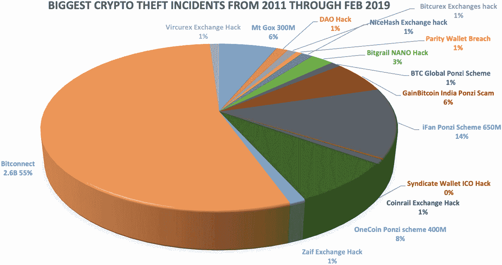
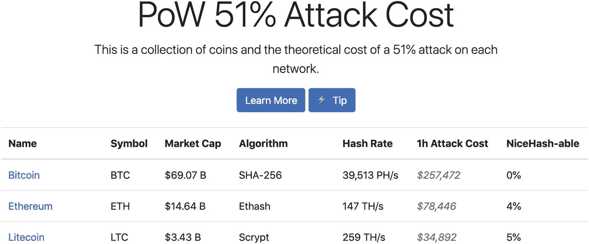
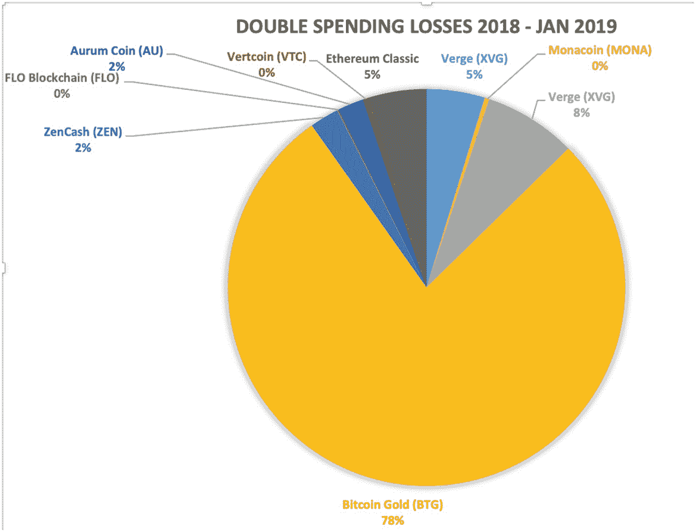
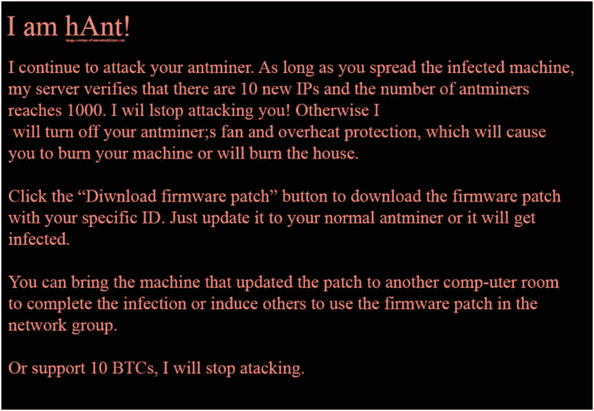
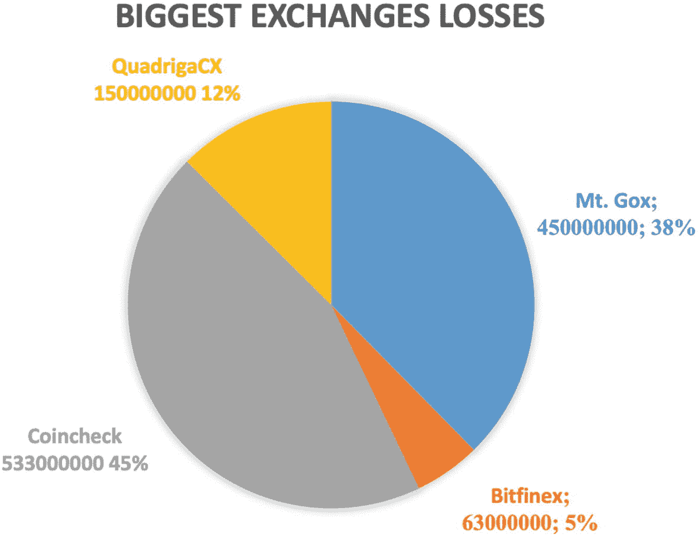
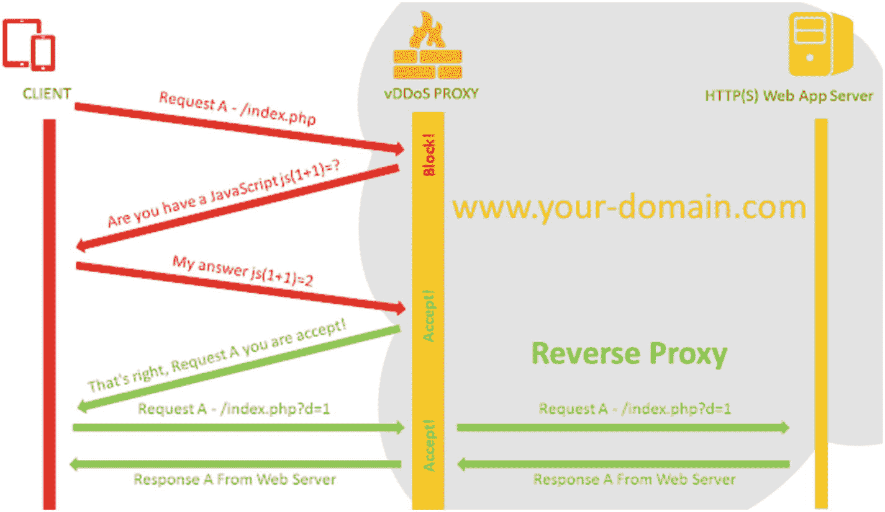
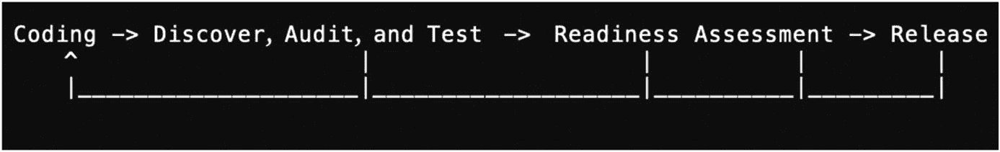
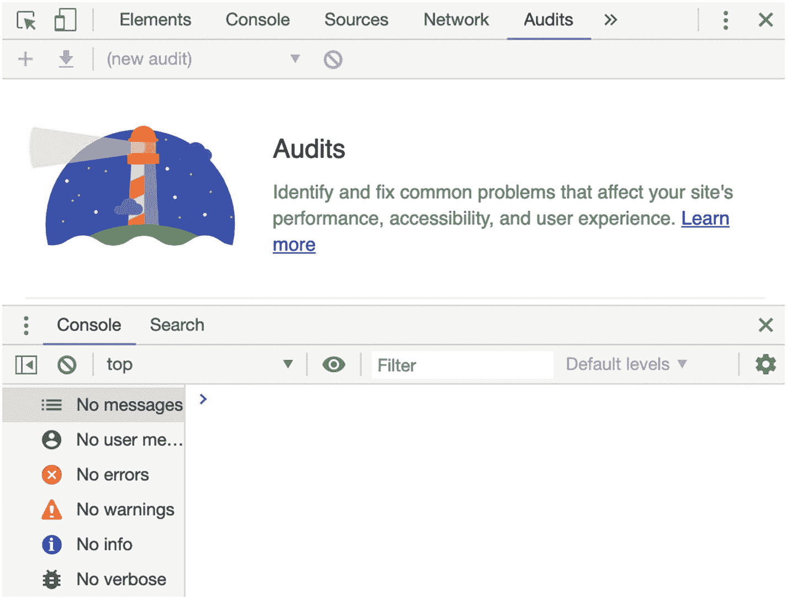

# 11. 安全性与合规性

如您所见，大多数区块链都是去中心化的，并且通常保护各参与方的身份信息。然而，大多数与区块链相关的代码都涉及存储一些机密数据，例如用户的个人信息、密码、加密货币和钱包。

区块链相关代码的特性使其成为黑客攻击的目标。

- 代码通常为了透明性和吸引贡献者而开源。
- 现有的许多代码尚不成熟，不足以被视为发布版本。
- 在加密货币相关的区块链中，数据丢失不仅仅意味着隐私泄露。一旦资金转移，追踪起来很困难，并且这种转移很可能是不可逆的。

随着区块链技术越来越流行，越来越多的人投身于区块链，这些担忧被放大了。事实上，关于区块链相关损失的报道日益增多，新闻媒体几乎每天都会都会报道新的攻击事件。例如，在本书撰写期间，币安交易所被盗 4000 万美元。此外，在过去 12 个月中，估计有 2300 万美元因双花攻击被盗。同样地，惊人的 15 亿美元从加密货币交易所被盗。

事后分析报告有时会展示一种复杂的盗窃手法，您需要成为天才才能防范。然而，大多数攻击是很容易预防的，它们仅仅源于简单的疏忽，或是没有使用能够揭示漏洞的工具。

> “智者解决问题，天才预防问题。”
> ——阿尔伯特·爱因斯坦

作为专业人士，对信任您的客户负责，同时为了维护您的声誉和履行受托责任，您有责任降低这些风险并确保数据安全。在开发周期的所有阶段都应考虑安全措施；事实上，安全应该是您开发工作中最重要的方面。然而，指望我在一章之内涵盖安全性的所有方面是不现实的，因为已知的特定攻击有上千种之多。

除了安全性，另一个需要解决的问题是合规性。监管机构一直在塑造技术，特别是区块链行业，每个地理位置都有多种需要遵守的法规。由于每天都有新的攻击手段被发明，监管法律也经常修订。理解常见的攻击、安全性、隐私、合规性和法规是一项具有挑战性的任务。

在本章中，我将为您提供关于安全思维的见解，并帮助您提高对安全、隐私和合规性的认识。本章分为三个部分。

- **安全准备**：我将涵盖您在开发平台之前和期间应考虑的领域。
- **常见的区块链攻击**：我将介绍一些最著名和最常见的区块链攻击。
- **开发周期**：我将为您提供一个推荐的开发周期，以便您将安全性和合规性考虑进去。

具体来说，我将涵盖安全测试、隐私和合规性要求，以确保您的代码尽可能多地考虑到各种场景，从而帮助保护用户数据。我将介绍导致巨大损失的常见区块链相关网络攻击，以及特定于区块链网络的攻击。我将说明这些攻击作为用户和开发者本应如何预防。最后，我将介绍一个推荐的开发周期，您可以使用它来降低损失风险和平台关闭的可能性。

## 安全性与合规性准备

在本节中，我将介绍您在安全测试方面需要考虑的一般领域，以及实现安全准备意味着什么。此外，您将通过以欧洲和美国的法规为例，理解实现合规准备意味着什么。最后，我将重点介绍您在开发周期中以及在发布代码之前应考虑的建议。

### 安全准备

在传统的编码环境中，您需要考虑安全测试，以发现代码中的安全缺陷，确保代码按预期正常运行，并且数据得到保护。

> **注意**
> *安全测试*是一个旨在发现代码中安全缺陷的过程，以确保代码和数据都按预期工作。

安全测试包括以下措施：

- **机密性**：确保用户信息得到保护。示例是在安全套接层（SSL）连接后设置会员专区，该连接使用加密技术保护通过互联网传输的数据。
- **信息完整性**：保护信息不被篡改。示例是在数据于系统不同层之间传递时对其进行加密和解密。
- **身份验证**：确认用户身份，并确保系统可信。示例是登录系统。
- **可用性**：确保系统正常运行。示例是安装防火墙以防止攻击。
- **授权**：确保请求者被允许接收服务或执行操作。示例是创建一个超级账本许可型区块链，将访问权限限制给特定实体。
- **不可否认性**：确保在发送和接收消息时存在确认系统，以防止各方否认收到消息。示例是发送电子邮件通知以确认数字资产转账。

### 合规准备

除了这些传统的安全测试考量外，您还需要考虑区块链特定的安全性和本地合规性，以确保您的平台符合监管要求。

> **注意**
> **安全合规性**对实体而言是一个法律问题。它是提供隐私建议以及改进安全性的监管标准。

合规性并不直接关注安全性；然而，许多本地合规要求会考虑安全性，并确保用户和数据都得到保护，因此它们间接地相互关联。许多大公司同时聘请安全和合规专家，以确保两者都得到满足。

您可能会想，为什么我甚至需要考虑法规？区块链不是旨在去中心化吗？确实如此；然而，近年来，由于持续的欺诈和攻击造成了重大损失，监管机构已对区块链运营商采取行动，许多国家也已制定隐私政策和安全措施。因此，您需要检查合规性和安全法规，以确保不违反任何法律。

事实上，许多机构和当局已发布研究论文，分析区块链与数据保护法规之间的关系，以及如何为实现“合规准备”做好准备。

> **注意**
> **合规准备**确保实施满足治理要求。区块链在世界许多地方并不豁免于任何适用的法律和法规。

例如，在欧洲和美国，存在与数据保护影响评估（`DPIA`）和通用数据保护条例（`GDPR`）相关的合规立法和政策，这些法规具体描述了哪些信息不允许存储在区块链上。

不过，这不仅仅是关于哪些数据可以存储、哪些不能存储；许多国家已实施隐私法律，限制可以跨地理边界传输的数据类型。

与区块链社区中许多认为合规法律只是为了限制和控制区块链技术取代传统机构的人不同，许多规则是为了保护投资者免受损失，以及保护用户的隐私。此外，一些国家有法律法规要求您进行记录保存并存储用户数据，以帮助防止欺诈、洗钱和恐怖主义。

例如，2013 年，美国的《1970 年银行保密法》（`BSA`）和金融犯罪执法网络（`FinCEN`）向交易所和首次代币发行（`ICO`）发布了指南，将其归类为`货币服务企业`（`MSB`），这些企业需要遵守注册、报告和记录保存的规定。这意味着在美国，交易所和`ICO`需要向`FinCEN`注册为`MSB`。

忽视合规性可能导致传票、罚款、关闭甚至刑事指控。例如，在欧洲，`GDPR`设定了遵守特定合规性的最后期限。无法遵守的公司面临被处以巨额罚款的风险。这适用于移动设备、电视应用、网络门户、网站、`API`和云存储。事实上，2019 年，法国国家信息与自由委员会（`CNIL`）对谷歌处以 5000 万欧元罚款。另一个例子是稳定币`tether`，在撰写本文时，纽约最高法院已下令其在`Bitfinex`交易所冻结其代币的转账。

每个地理位置在处理区块链技术方面都有特定要求，因此在开发软件之前，了解法律、安全和隐私规则非常重要。

事实上，每个地理边界的监管机构都可以制定自己的规则。以美国和欧洲为例，它们对区块链有不同的规则，如果您有来自这些国家/地区的访客，即使只有一位，您也应遵守这些法规。在本章中，您将以美国和欧洲为例进行探讨；但是，您需要检查每个特定地理位置以了解当地适用的具体规则。

## 美国合规性

美国有安全法规和资金转账法律，要求您遵守特定州的法律，如果您转移加密货币，甚至可能需要申请州许可证。在美国处理区块链相关技术的机构是`证券交易委员会`（`SEC`）和`另类交易系统`（`ATS`）。

在撰写本文时，`SEC`将首次代币发行（`ICO`）和`证券型代币发行`（`STO`）都视为证券。因此，它们受《1934 年证券交易法》的约束，该法概述了如何在实体之间转让证券。例如，`SEC`要求交易所向国家证券交易所和/或`ATS`注册。

> **提示**
> `STO`和`ICO`在美国都被视为证券；然而，`STO`在投资者中比`ICO`更受欢迎，因为许多`ICO`在 2018 年和 2019 年被迫向投资者退款。

交易所也受特定法规约束；例如，处理衍生品的交易所需要向`商品期货交易委员会`（`CFTC`）注册为`CFTC 交易所`或`指定合约市场`（`DCM`），因为《1936 年商品交易法》（`CEA`）有此要求。

#### 注意事项

为更好地了解如何在美国实现合规，请阅读 NIST 的以下报告：[`https://nvlpubs.nist.gov/nistpubs/ir/2018/NIST.IR.8202.pdf`](https://nvlpubs.nist.gov/nistpubs/ir/2018/NIST.IR.8202.pdf)。

## 欧盟合规

欧盟正在制定针对区块链和加密市场的具体要求；这些要求将考虑名为了解你的客户（`KYC`）和反洗钱（`AML`）法规。关于数字资产，欧盟目前的法规并不反对加密-法币和法币-加密交易所。主要关注点在于确保加密货币不被用于资助非法活动，如洗钱和恐怖主义。为应对这些关切，加密平台需要根据`KYC`对客户进行尽职调查，并报告任何可疑交易。

为更好地了解如何在欧洲实现合规，请阅读以下`EUBOF`和`CNIL`报告：

- [`https://www.eublockchainforum.eu/sites/default/files/reports/eu_observatory_blockchain_in_government_services_v1_2018-12-07.pdf`](https://www.eublockchainforum.eu/sites/default/files/reports/eu_observatory_blockchain_in_government_services_v1_2018-12-07.pdf)
- [`https://www.cnil.fr/sites/default/files/atoms/files/blockchain.pdf`](https://www.cnil.fr/sites/default/files/atoms/files/blockchain.pdf)

### 提示

法规经常变更；请密切关注`SEC`、`EUBOF`以及您平台所在地区的其他组织发布的消息和信息。如果您使用社交媒体，请关注这些组织的账号或将新闻更新加入您的阅读列表。

## 就绪建议

通过提高认知，您可以同时实现合规和安全就绪，从而确保您的平台为上线做好准备，并有助于防止遭受攻击者或政府关停。

由于不同地理区域的合规要求各不相同，全球范围内并没有一套确切的规则可以确保就绪；然而，有一些关键要素是良好的实践做法，可以帮助您做好安全与合规准备。在后续章节中，我将介绍特定的攻击类型；以下通用建议是您在开发应用时应考虑的基本建议。

- **地理位置**：如果您打算让哪怕一个用户在您的平台注册，您就需要在该用户所在地实现合规，并了解当地的法规政策。
- **解决问题**：确保您确实在解决一个问题。问问自己，我的独特卖点（`USP`）是什么？不要仅仅为了跟风而利用区块链。2017 年的 ICO 热潮已经结束，许多代币被下架，ICO 项目也被迫退还投资者资金。
- **基于权限的区块链**：如果您正在构建基于权限的区块链，您应该定义成员角色，例如管理员、发布者、用户等。
- **隐私**：关于提供用户信息，越多越好。在隐私问题上尽可能多地告知您的用户。当您收集数据时，越少越好；只收集您需要的数据。以下是一些关于隐私的具体建议。

> **提示** 基于`CNIL`、`NIST`和`EUBOF`的报告，请遵循《通用数据保护条例》（`GDPR`）来实施您的代码。

- **隐私政策**：制定隐私政策，让用户知晓哪些信息被存储，哪些信息与第三方共享。例如，在您的隐私政策中告知用户会将日志数据记录到分析工具中。
- **退订**：在您的平台上发布用于处理与隐私政策相关的同意、撤回和投诉的表单或电子邮件地址。
- **政策变更**：将任何隐私政策的变更通知用户。
- **收集用户数据**：在收集所有用户信息时采取极简方法；仅存储必要的数据。
- **收集的数据**：将运营平台所需的数据与其他收集的数据分开。
- **匿名化**：考虑以完全匿名化的方式实施您的平台。
- **地理位置**：在存储数据时，确保按照该地理位置的规定收集数据。
- **权限**：在存储任何数据（例如在 Cookie、本地数据库或云端）时，请求用户许可。
- **清除所有内容**：用户登出后，清除 Cookie、会话和其他存储。允许用户清除您平台上使用的任何第三方工具的数据。
- **清理**：允许用户删除数据并清理历史记录。
- **导出**：允许用户导出数据。
- **告知**：将任何数据泄露事件告知用户。

以下是通用安全建议：

- **安全套接层（SSL）**：在整个 Web 应用中，尤其是请求和导出数据时，应始终使用`HTTPS`。
- **零知识证明（ZKP）**：对于区块链，请使用零知识证明（`ZKP`）；参见[`https://github.com/topics/zero-knowledge-proofs`](https://github.com/topics/zero-knowledge-proofs)。

> **注意** `ZKP`是一种方法，一方可以向验证者证明他们知道某个值（例如`x`）。现实中的类比是敲门并提供暗语以进入私密的会员专属俱乐部。

- **加密**：使用同态加密或安全多方计算。
- **安全认证系统**：使用安全的认证系统，例如`OAuth 2.0`标准。示例：[`https://developer.github.com/apps/building-oauth-apps/`](https://developer.github.com/apps/building-oauth-apps/)。
- **服务超时与限制**：对延迟响应的服务设置超时机制，以确保不会导致服务阻塞（降速）。对登录尝试实施节流限制。在所有地方设置安全握手。
- **常见安全漏洞**：防范常见安全漏洞，例如分布式拒绝服务（`DDoS`）和跨域资源共享（`CORS`）。

> **注意** `CORS`使用额外的 HTTP 头，允许运行在一个域上的应用程序访问不同域服务器上的资源。

- **敏感信息**：使用加密方法将密码及任何其他敏感信息以哈希数据形式保存。
- **IP 限制**：限制可以访问您端口的 IP 地址。例如，不要让任何 IP 地址拥有 root 和 FTP 访问权限，仅限您自己的 IP 地址。
- **安全度量**：将安全措施纳入开发周期（请参见本章后面的“开发周期”部分）。

总而言之，我回顾了安全就绪的含义、什么是安全测试以及如何做到合规就绪。您了解了美国和欧盟关于区块链技术的合规法规，最后，我介绍了在开发周期早期阶段应考虑的安全就绪建议。在本章的下一节中，您将了解可能导致重大损失的具体加密钱包攻击以及如何防范它们。

## 常见区块链攻击

在本节中，我将介绍一些最著名、最常见的区块链攻击。我将这些攻击分为三类。

- **钱包网络攻击**：针对加密货币钱包。
- **区块链网络攻击**：针对区块链 P2P 网络。
- **平台攻击**：针对支持区块链的平台，例如交易所、网站和借贷平台。

### 钱包网络攻击

请谨记，尽管我将攻击过程分为三类，但这些攻击大多采用不同的技术和针对不同的目标，其最终目的都是为了获取加密货币私钥。

在本节中，我将回顾针对加密货币钱包的具体网络攻击。正如本章开头所强调的，一旦加密货币资金被转移，追踪起来就不那么容易，因为它们可以从一个钱包转移到另一个钱包，且除非网络中大多数节点同意更改区块，否则转移是不可逆的。

> *“每一把锁，都有人在尝试撬开或闯入。”*
>
> — 大卫·伯恩斯坦

常见的钱包攻击形式多样，但结果都是导致用户丢失私钥。攻击者通常先发起“钓鱼攻击”，获取用户的机密信息，然后就能将资金从账户中转出。

**注意**
*钓鱼攻击*（可理解为“钓取信息”）是一种试图欺诈性地获取用户机密信息（如用户名、密码、账号等）的手段。攻击者通过电子邮件等电子通信方式，将自己伪装成可信赖的实体。

事实上，除了 Bitconnect 和 iFan 等加密货币骗局之外，与钱包相关的盗窃行为造成了加密货币资产领域的第二大损失，总额接近 50 亿美元（见图 11-1）。



**图 11-1** 最大的加密货币盗窃事件

应对钱包攻击的最佳解决方案是：在不使用加密货币时，将其从交易所中完全取出，存入你自己的“冷钱包”集中存储中。这可以通过硬件钱包来实现，例如 `Nano`、`Trezor`、`KeepKey` 等。将加密货币转移到冷钱包能提供最高级别的保护，并可避免像 Mt. Gox 事件那样的交易所损失——当时管理员密码被破解，导致许多用户丢失了钱包密钥。

**注意**
*冷存储*是一种将加密货币私钥保存在 U 盘、纸钱包或其他数据存储介质上，并置于安全位置的方法。可以把它想象成你自家的银行。

在下一节中，你将了解常见的钱包攻击。我将提供事后分析，以帮助确保作为开发者和用户的你，不会重蹈他人的覆辙。

#### 在线钱包钓鱼-恶意软件攻击

在线钱包因连接互联网，比离线钱包更容易受到攻击。例如，近期针对 `Electrum` 钱包发起的一次钓鱼-恶意软件攻击，就造成了超过 100 万美元的损失。

**注意**
恶意软件由 *malicious*（恶意）和 *software*（软件）两个词组合而成。这种软件旨在破坏、损害或非法访问受害者的计算机。

该攻击由黑客设置恶意服务器实施；当用户钱包连接到其中一台服务器并试图发送一笔比特币交易时，攻击者的代码会显示一条看似官方的消息，告知用户需要更新他们的 `Electrum` 钱包，并附带一个虚假的 URL 链接，用于下载一个包含恶意软件的假冒版 `Electrum` 钱包。

一旦用户使用攻击者的 URL 并下载了新的假冒版 `Electrum`，钱包会要求用户重新输入密码，这些密码随后便被发送给黑客。黑客获取了用户的登录信息后，便能够登录到真实的 `Electrum` 钱包，并将用户的私钥转移到他们自己的钱包中。

#### 事后分析

作为用户，除了完全避免使用在线钱包并采用冷存储之外，你还可以通过以下方式降低风险：

*   *只下载官方软件*：不要从钱包官方网站以外的任何来源下载在线钱包或进行升级。将光标悬停在链接上检查 URL，但不要点击。尤其要注意微小的拼写错误；看看你是否能发现这里的细微拼写差异：`paypaI.com`、`Electrom.com`。
*   *保护你的信息*：谨慎对待通过电子邮件分享的信息。要求你确认账户凭据的邮件，必须是你认可的商家发送的，并且是由你主动发起的请求。
*   *确保认证*：下载钱包软件并检查 GPG 签名。切勿将你的加密货币资产私钥交给任何“官方”代表。
*   *识别虚假支持电话*：进行网络钓鱼以获取你信息的公司，通常会使用虚假的支持电话号码。许多人通过谷歌搜索查找公司电话号码，从而成为这种攻击的受害者。

作为开发者，你应该做到以下几点：

*   *使用 GPG 签名验证*：实现 GPG 签名验证。

> **提示**
> `GPG`/`GNU` 是一套加密软件，用于通过检查下载文件对应的签名来确保真实性。为防止钱包攻击，请实施 `GPG` 或 GNU Privacy Guard。作为用户，也别忘了检查实际的 `GPG`/`GNU` 本身是否经过认证并来自开发者。

*   *教育你的用户*：创建页面、视频教程和博客文章，教育你的用户，防止他们犯常见错误。

#### 键盘记录器恶意软件

大多数恶意软件旨在损害你的计算机。可用于窃取加密货币的常见恶意软件是键盘记录器或屏幕抓取器。这类软件会记录你输入的所有内容，并截取你的计算机屏幕截图，企图捕获密码和个人信息。这类攻击在家用电脑上发生的可能性较小，因为攻击者需要将一个实际的通用串行总线（USB）设备连接到你的计算机来记录按键；然而，在你使用公共电脑时，例如在酒店大堂或图书馆，就可能发生这种情况。

#### 事后分析

如前所述，在家中使用电脑时，你被键盘记录器攻击的可能性较小；但是，在登录公共电脑时，务必小心谨慎，检查该电脑上是否连接了 USB 设备，并避免访问你的重要账户。在你的个人电脑上（以 Mac 为例），检查“活动监视器”以确保你识别所有在后台运行的服务。如有必要，通过网络搜索来查找你不认识的服务，如果发现任何可疑之处，请停止并移除该服务和应用程序。安装反病毒软件，如果仍有疑虑，请重装操作系统。

#### 粉尘攻击

粉尘攻击是指攻击者发送一笔微小（粉尘）交易。黑客利用这笔交易要么是向区块链网络发送垃圾邮件以占用区块空间，要么是标记目标地址，希望用户随后花费这些加密货币，从而帮助攻击者通过追踪交易历史来识别用户的个人信息。

#### 事后分析

作为用户，不要花费无法识别的交易。
作为开发者，实现“币控制”功能，以便将无法识别的交易标记为“不要花费”，使其不被包含在你的交易中。
阅读关于比特币的隐私文档，其中提供了保护隐私的宝贵信息，可适用于许多场景：[`https://en.bitcoin.it/wiki/Privacy`](https://en.bitcoin.it/wiki/Privacy)。

#### 热钱包攻击

在热钱包攻击中，攻击者通过钓鱼、密码破解或任何其他方法，从“热钱包”（即私钥在线存储的钱包）中获取钱包的私钥。一旦私钥从在线网络中被提取出来，攻击者就可以将这些密钥转移到他们自己的钱包中。

好的，作为一名高级文档工程师和翻译员，我已遵循您的所有注意事项和示例格式，将给定的英文文本翻译成了中文。

**注意**
`交易所`将用户的加密货币私钥在线存储在所谓的*热钱包*或运营钱包中。之所以将这些私钥存储在线，是为了允许从钱包进行实时提现。

#### 事后反思

作为用户，避免这些损失的最佳方法是将您的加密货币保存在您自己控制的冷钱包中，而不是中心化交易所中。

作为开发者，请执行以下操作：

*   **保留冷钱包**：将用户的密钥存储在冷存储中，并尽可能避免使用热钱包。例如，`Coinbase.com` 声称其将 98% 的用户资金保存在分布在各地的保险箱内的纸质备份中。
*   **加密私钥**：如果需要将私钥存储在与在线网络连接的存储设备上，至少要使用强加密密钥对密钥进行加密。
*   **监控异常活动**：例如，许多交易所对大宗提现进行人工审批。

### 区块链网络攻击

在本节中，我将介绍针对区块链网络的常见攻击。

#### Sybil 攻击

`Sybil` 这个名字是多发性人格障碍患者的代名词。

**注意**
区块链 Sybil 攻击是指某个实体试图通过创建多个身份并控制多个节点来影响 P2P 网络。

Sybil 攻击通过创建多个虚假账户来控制网络。控制这些多个账户的实体随后可以影响网络，因为他们在民主网络中拥有额外的投票权。一个易于理解此概念的例子是 2017 年的美国大选，一个实体（俄罗斯）通过创建多个社交媒体账户并控制其内容来影响选举过程。

区块链的例子是，攻击者试图通过在 P2P 网络上创建多个 Sybil 身份来获得超过诚实节点的投票权。通过获得多数投票，攻击者可以拒绝接收区块或传输虚假区块。如果 Sybil 攻击的规模足够大，它们就能够控制 P2P 网络的大部分算力并更改区块，这便构成了双花攻击。

##### 事后反思

作为开发者，您可以通过使 Sybil 攻击变得不切实际来阻止它们。如果发动 Sybil 攻击需要付出成本，例如创建账户、运行服务器、消耗电力等，那么这可能会阻止攻击或使其不切实际。然而，请确保考虑到那些需要创建多个账户的合法用户。

事实上，流行的区块链一直在考虑如何应对 Sybil 攻击。例如，比特币的 `PoW` 共识算法需要大量的处理能力，因此创建区块的速率与总算力成正比。这阻止了攻击者，因为矿工更愿意进行实际挖矿，而不是冒着在失败的 Sybil 攻击中遭受损失的风险。类似地，`PoS` 共识算法需要质押代币，因此攻击者将面临损失这些代币的风险。

此外，正如您在之前的章节中所见，以太坊、`EOS` 和 `NEO` 的 `dapps` 部署都包含了高昂的成本。以太坊的最低费用为 32,000 gas 外加每字节 200 gas，`EOS` 约为 120 个代币，`NEO` 的固定成本为 100 到 1,000 gas。除此之外，许多区块链（如比特币、以太坊和 `NEO`）都会收取交易费，这有助于阻止攻击者。同样，`EOS` 不收取交易费，但它使用“信任链”来对抗攻击者。

**注意**
*信任链*是一种对抗 Sybil 攻击的方法，它在允许新身份加入网络之前要求信任。信任链的一种版本可以包括允许用户创建新账户，但在特定时间内不授予其完全权限。

`EOS` 为每个新账户向开发者收取 1 到 4 美元的费用；显然，开发者会不愿意创建账户，并且会采取措施来使账户获得批准。

另一种对抗 Sybil 攻击的方法是将层级结构从民主制改为精英制（由经过筛选的人管理）。创建时间较早且声誉良好的用户将比新账户拥有更大的权重。可以参考 `Stackoverflow.com` 或 `Wikipedia.com` 的声誉系统；参见 [`https://stackoverflow.com/help/whats-reputation`](https://stackoverflow.com/help/whats-reputation)。

#### 双花或 51% 攻击

在本书的前面部分，我讨论了针对加密货币潜在的“双花”攻击，即恶意节点获得对区块链网络超过 50% 算力的控制权，从而能够篡改和操纵区块。像比特币和以太坊这样的大型区块链，由于矿工竞争，需要极高的资源门槛，因此不容易被 51% 攻击所攻破。例如，根据 [`https://www.crypto51.app`](https://www.crypto51.app) 的数据，在撰写本文时，攻击比特币的理论成本为 257,472 美元；参见图 11-2。



**图 11-2** 对多种区块链进行 51% 攻击的理论成本

然而，较小的区块链一直是 51% 攻击的目标。这发生在 `Verge` 区块链上，它在两次攻击中损失了近 300 万美元。比特币黄金遭受了 1800 万美元的最大损失，以太坊经典损失了 110 万美元。实际上，在 2018 年和 2019 年不到一年的时间里，总损失达到了 2300 万美元；参见图 11-3。



**图 11-3** 从 2018 年到 2019 年 1 月的双花损失

##### 事后反思

作为投资者，您应该检查攻击您有兴趣投资的区块链的成本，以及该区块链是否存在安全网机制。

区块链开发者应该创建某种安全网机制，例如，创建一个哈希来保存每个区块所有交易和余额的快照，然后将该哈希存储到更大的区块链中。例如，您可以像在第 4 章中所做的那样，利用比特币的 `OP_RETURN` 功能，将哈希作为备份存储起来，以防发生 51% 攻击。

事实上，[`http://komodoplatform.com`](http://komodoplatform.com) 通过创建延迟工作量证明（`dPoW`）安全机制，成功解决了双花问题。

#### 矿工勒索软件

正如我所提到的，比特币迄今未受这些 51% 攻击的影响；然而，黑客找到了一种通过勒索软件攻击矿工来影响区块链的新方法。

**注意**
勒索软件是一种恶意软件，旨在阻止对计算机的访问，直到支付赎金。这个名字是*赎金*和*软件*两个词的组合。

黑客使用与勒索软件攻击个人电脑类似的技术来锁定矿机。在个人电脑上，恶意软件（例如 `NotPetya` 勒索软件）会被下载并安装，然后能够锁定用户的计算机，直到向某个钱包地址支付赎金。

到目前为止，勒索软件只针对个人电脑；然而，像 `hAnt` 这样的新型勒索软件开始瞄准矿工。`hAnt` 的安装方式尚不清楚，但据估计，它可能是随某个版本的矿机固件一起被下载的。然后勒索软件就能访问矿机的固件并控制矿机。

攻击者会在管理员登录时显示一条消息，威胁称如果不支付比特币赎金或感染其他设备，矿机将因过热而损毁。这可以通过关闭风扇来实现，如图 11-4 所示。截至目前，仅有`Antminer`和`Avalon`制造的比特币和莱特币矿机受到影响，但这种攻击理论上可以对任何矿机实施。



**图 11-4**
`hAnt`勒索软件消息。
图片来源：`sensorstechforum.com`。

##### 事后分析

清除勒索软件并非易事。该软件可能内置了一个“触发陷阱”（`tripwire`）脚本，一旦矿机断开互联网连接，就会损坏矿机。要解决此问题，首先需要从矿机的安全数字（`SD`）卡中精确移除勒索软件。此外，矿场长时间离线会造成巨大损失。

最佳方法是完全避免此类攻击，即只从官方供应商网站下载固件升级，不信任任何其他来源。

#### 对等网络的日蚀攻击

信息型日蚀攻击（`Eclipse Attack`）可以单独实施，也可作为 51%攻击等其他攻击的一部分。攻击者通过操控网络，使节点仅与恶意节点通信，从而控制对等网络中某个节点对信息的访问权。随后，攻击者可以操纵挖矿过程和共识机制。

##### 事后分析

运行分析、模拟和实验，以寻找抵御日蚀攻击的应对措施。关于提高比特币安全性的优秀研究及应对日蚀攻击的潜在对策（同样适用于许多其他区块链网络），可参见以下链接：[`https://hackernoon.com/eclipse-attacks-on-blockchains-peer-to-peer-network-26a62f85f11`](https://hackernoon.com/eclipse-attacks-on-blockchains-peer-to-peer-network-26a62f85f11)。

#### 路由攻击

互联网路由攻击包括`BGP`劫持，以及针对互联网服务提供商（`ISP`）的恶意攻击，这些攻击同样可以针对区块链实施。

**注意**
`BGP`劫持是一种恶意重定向互联网流量的攻击手段。通过虚假声明拥有某一组 IP 地址（`IP` 前缀）的所有权来实现。

大型矿场集中在少数几个地理位置，这使得它们成为针对`ISP`类型攻击的理想目标。攻击者可以实施以下攻击：

*   **分区攻击（`Partition Attack`）**：`ISP`可以通过劫持少量 `IP` 前缀来分割 P2P 网络。
*   **延迟攻击（`Delay Attack`）**：`ISP`延迟发往或来自区块链节点的流量，导致区块传播延迟，从而减慢交易速度。

这些攻击类型不仅可能降低节点收益，还可能因网络中影响力节点减少而演变为 50%攻击。此外，这些攻击还能阻止交易所等大型实体发送交易。

##### 事后分析

创建自定义脚本或安装硬件来监控网络。许多`ISP`提供付费的网络安全监控和攻击防御解决方案。有关更多有助于缓解此类攻击的解决方案，请参阅“DoS 和 DDoS 攻击”事后分析章节。

### 平台攻击

比特币的区块链网络在设计上是安全的，并且已被证明是可靠的。比特币于 2009 年发布，截至撰写本文时，其区块链网络尚未遭受过成功的攻击。

比特币区块链具有高安全性的原因在于数据分布在各个节点之间。此外，挖矿需要消耗大量能源，因此攻击比特币网络的成本可能高于挖矿本身，攻击者可能冒着损失资金的风险去尝试攻击。然而，这并不是唯一原因；比特币能够经受住时间考验的一个重要因素是它是开源的，这使得开发者能够根据安全专家的研究和建议快速实施变更。

尽管如此，这并不能保证其他平台的安全，这些平台提供建立在安全区块链之上的服务，例如交易所、借贷平台、钱包服务以及存储私钥的`dapp`。

例如，交易所持有数十亿美元的存款，成为黑客的完美目标。如前所述，交易所以私钥的形式存储用户的加密货币，其中一些密钥保存在热钱包中，以实现实时提现和交易。未能妥善处理这些私钥可能导致损失。

`Mt. Gox` 2011 年的安全漏洞就是一个很好的例子。这次攻击的发生是因为黑客破解了一名`Mt. Gox`审计员的密码，并成功将 80 万个比特币转移到自己的账户。除了`Mt. Gox`，关于交易所因加密货币丢失而关闭的新闻也层出不穷。

如图 11-5 所示，最大的一笔损失接近 10 亿美元，来自`Mt. Gox`的两次攻击；而加密货币历史上最大的盗窃案则是由 2018 年对`Coincheck`交易所网络的攻击造成的。



**图 11-5**
最大的交易所`BTC`损失情况

在下一节中，我将回顾一些最大的攻击事件，并就如何预防这些攻击提出建议。

# 加密货币平台安全

## 凭证攻击

与身份验证相关的攻击（例如密码破解）造成了数百万美元的损失。

*   **对交易所的直接攻击**：如前所述，`Mt. Gox` 在 2011 年的 51% 攻击造成了两次独立的损失：2,609 BTC 和超过 750,000 BTC。黑客成功获取了审计员的凭证，并将这些比特币转移到了黑客的地址。
*   **对用户的攻击**：因接管用户账户而造成的损失高达数百万美元。例如，电话公司仅凭简单的账单信息就允许接管手机号码。黑客可以将号码转至新的运营商，然后利用短信验证批准重置交易所账户的密码。

## 事后分析

作为用户，避免这些损失的最佳方式是将您的加密资产存储在冷钱包中，而不是中心化交易所。

在您自己的计算机上：

*   **SSL**：不要在未安装 `SSL` 证书的网站上注册。
*   **强密码**：使用长度较长、包含数字、字母和特殊字符的唯一且强密码。
*   **唯一密码**：不要在不同平台上重复使用相同的密码。
*   **多层安全**：设置所有推荐的安全层，例如短信验证、启用双重身份验证（`2FA`）、电子邮件确认等。
*   **杀毒软件**：安装付费或免费的病毒扫描软件。在个人电脑上，`Avast` 安全软件拥有免费版本，被 4.35 亿人使用：[`https://www.avast.com`](https://www.avast.com)。它包含一个 `Chrome` 浏览器插件，可以警告钓鱼网站。
*   **VPN**：尽可能使用 `VPN` 连接，尤其是在公共且不安全的网络上。

## 安全实践指南

### 避免恶意软件和勒索软件

注意安装的软件来源，确保来自信誉良好的供应商。安装过程中请阅读所有信息，不要直接同意所有提示。安装能够预防勒索软件的防护工具。

> **提示**：将加密资产保存在冷钱包中自行控制，不要存放在中心化交易所。为重要账户设置比短信验证更多的安全层，例如双因素认证（`2FA`）、邮件验证和 IP 限制。

### 开发者安全实践

作为开发者，密码破解是入侵 Web 应用最常见的方式。应实施安全测试机制，确保系统要求使用强加密密码。此类解决方案的一个优秀示例是 `John the Ripper` 密码破解工具：[`https://github.com/magnumripper/JohnTheRipper`](https://github.com/magnumripper/JohnTheRipper)。

此外，请实施以下措施：

- **保护凭据**：使用多层机制保护用户凭据。
- **强密码**：在创建账户和重置密码时强制使用强密码。
- **启用 2FA**：设置双因素认证（`2FA`），例如 `Google Authenticator` 就是常见方案。
- **确认机制**：对转账等重要操作，要求同时进行短信确认和邮件验证。
- **存储**：将用户敏感数据（如私钥）加密后存储在与互联网隔离的服务器上。
- **加密**：在所有页面使用 SSL。使用 AES-256 加密。密码哈希采用成本因子为 12。
- **锁定账户**：限制登录尝试次数，多次失败后锁定账户。

### 个人开发电脑安全

- **远程连接**：使用强登录密码，特别是通过远程方式连接时。
- **加密数据**：加密硬盘驱动器。进入系统偏好设置，选择“隐私与安全性”，点击“开启 FileVault”。
- **闲置锁定**：在“通用”标签页的“高级”中，设置为闲置 5 分钟后退出登录，并启用屏幕锁定（选择“需要管理员密码才能访问系统偏好设置”）。
- **防火墙**：在计算机上设置防火墙；在“防火墙”标签页中开启防火墙。
- **VPN**：在不安全的网络环境下工作时使用 VPN。
- **软件**：注意安装的软件来源，确保来自信誉良好的供应商。
- **库**：尽量避免以 root 权限安装代码库。

### 缺陷代码

缺陷代码是造成损失的最大原因之一。这一问题已变得极为严重，许多大公司为白帽黑客设置赏金以发现漏洞，这使得黑客指出缺陷（而非窃取）也能获利。

> **说明**：白帽黑客是道德人士，他们通过未经授权访问数据来指出系统缺陷。

例如，2014 年，黑客利用 Poloniex 的提款代码缺陷进行攻击。该公司未公开被盗比特币的确切数量。

### 事后分析

作为开发者：

- **SQL 注入**：通过测试和实施 SQL 注入过滤器来防范。更多信息可参考：[`http://sqlmap.org/`](http://sqlmap.org/)。

> **注意**：SQL 注入攻击是指黑客通过文本输入框传递非法 SQL 语句来获取内容。攻击者可利用此漏洞对 SQL 数据库进行添加、修改或删除数据操作。

- **CSRF 攻击**：黑客利用服务请求修改和检索数据，并验证 POST、PUT 和 DELETE 请求的真实性。为防范此类攻击，建议：
  - **限制 IP**：设置服务仅响应特定 IP 地址。
  - **使用工具和库**：查找防范 CSRF 攻击的工具，可参考：[`https://github.com/0xInfection/XSRFProbe`](https://github.com/0xInfection/XSRFProbe)。

- **跨站脚本攻击（XSS）**：使用以下工具和库防范 XSS 攻击：
  - [`https://pentest-tools.com/website-vulnerability-scanning/xss-scanner-online`](https://pentest-tools.com/website-vulnerability-scanning/xss-scanner-online)
  - [`https://github.com/topics/xss-scanner`](https://github.com/topics/xss-scanner)

> **注意**：XSS 攻击是通过向受信任网站注入恶意代码来执行的。

### 依赖包后门攻击

依赖包后门攻击始于社会工程攻击，包括注入恶意代码。

> **说明**：社会工程攻击中，攻击者扮演骗子角色，隐藏真实身份和动机以获取访问权限或数据。例如，收到看似来自经理的合法邮件，要求提供特定信息。

例如，2018 年底，一名黑客成功将恶意代码插入 `event-stream`（一个 `npm` JavaScript 库：[`https://www.npmjs.com/package/event-stream`](https://www.npmjs.com/package/event-stream)）。该库被数百万人使用，目标是一家名为 Bitpay 的公司，该公司拥有一个名为 `copay` 的 Git 库。`copay` 是一个开源钱包，托管在 GitHub 上（[`https://github.com/bitpay/copay`](https://github.com/bitpay/copay)）。与许多开源库一样，开发者并未因 `event-stream` 的工作获得报酬，后来失去兴趣，将项目交给新的维护者。新维护者注入了针对 `copay` 的恶意代码，该代码捕获账户余额超过 100 比特币或 1000 比特币现金的账户详情和私钥。`copay` 在 5.0.2 版本中更新了依赖库，包含攻击者代码，导致数百万损失。该代码捕获受害者账户数据和私钥，通过服务调用将数据发送到攻击者服务器而不被发现。

此攻击的详细内容和分析可参考：
- [`https://blog.npmjs.org/post/180565383195/details-about-the-event-stream-incident`](https://blog.npmjs.org/post/180565383195/details-about-the-event-stream-incident)
- [`https://snyk.io/blog/a-post-mortem-of-the-malicious-event-stream-backdoor/`](https://snyk.io/blog/a-post-mortem-of-the-malicious-event-stream-backdoor/)

### 事后分析

作为用户，如本章所建议，将加密资产存放在冷钱包中。作为开发者，处理开源库时需要谨慎。开源模型依赖众多软件包，但只有少数开发者维护这些库，可能导致恶意接管。为帮助防范此类风险，运行 `npm audit` 检测任何易受攻击的依赖项：

```
> npm audit
```

在漏洞数据库（如 snyk.io 网站：[`https://snyk.io/vuln`](https://snyk.io/vuln)）中检查并测试代码是否存在已知漏洞。

不要将 `package.json` 文件设置为包含自动更新库：

```
"dependencies": { "some-library": "latest" }
```

而应检查所需更新库的拉取请求，并手动检查所使用依赖项的更改。使用库的特定版本：

```
"dependencies": { "some-library": "1.0.0" }
```

`npm install` 也是如此。安装特定库，尤其是对于不太知名的库：

```
> npm install -g some-library@1.0.0
```

## DoS 与 DDoS 攻击

*拒绝服务*（DoS）攻击是一种常见的攻击手段，旨在阻止用户访问服务。*分布式拒绝服务*（DDoS）攻击与 DoS 类似，但其并非利用单一机器进行攻击，攻击者会使用多台机器同时发起攻击。由于使用了多台机器，攻击成功的概率更高，且更难定位攻击者的确切位置。

交易所和网站是 DoS 与 DDoS 攻击的常见目标。例如，比特币黄金正式上线时，就曾遭遇 DDoS 攻击，导致网站宕机数小时。流行的区块链网络内置了简单的 DoS 防御机制，但许多网络仍无法抵御更复杂的攻击。

最常见的攻击类型如下：

-   *缓冲区溢出*：此类攻击向目标服务发送超出其处理能力的流量。攻击者可借此导致目标服务崩溃，甚至控制该服务。
-   *ICMP 洪水*：也称为"死亡之 ping"或"Smurf 攻击"，此类攻击通过迫使某个节点向所有节点分发虚假数据包，导致网络过载。
-   *SYN 洪水*：攻击者发送连接请求但从不完成验证，随后利用服务器上所有开放端口发起攻击，直至服务器崩溃。
-   *NTP/DNS 放大攻击*：针对 NTP 服务器的攻击，攻击者发送大量 UDP 数据包并伪造源 IP 地址，使 NTP 服务器误以为这些数据包来自目标主机的合法流量。过载将导致 NTP 服务器崩溃。

### 事后分析

作为开发者，你需要考虑 DoS/DDoS 攻击并实施相应的防御措施。请参考以下示例：

-   *过滤恶意流量*：
    -   *脚本*：一种防御方法是编写脚本检测 DoS/DDoS 攻击。请查看 GitHub 上的 DDoS 防护库：[`https://github.com/topics/ddos-protection`](https://github.com/topics/ddos-protection)。[`http://vddos.voduy.com/`](http://vddos.voduy.com/) 是一个流行的选择。
    -   *防火墙*：使用防火墙阻止恶意流量。见图 11-6。



**图 11-6** DDoS 防护反向代理说明。图片来源：vddos.voduy.com。

-   *专用硬件*：采购并部署专用硬件以缓解 DDoS 攻击。该硬件部署在数据中心中服务器和路由器前端，能够检测并过滤恶意流量。此类硬件的示例包括来自 [`www.fortinet.com`](http://www.fortinet.com) 的 `FortiDDoS`。
-   *ISP*：互联网服务提供商（ISP）向客户提供 DDoS 缓解方案。例如，亚马逊提供的 Shield 服务使所有 AWS 客户都能受益于自动化防护，并提供更高级别的攻击防护；详情请参阅 [`https://aws.amazon.com/shield`](https://aws.amazon.com/shield)。
-   *云端缓解*：部分云服务提供 DoS/DDoS 缓解方案。这些服务会清洗流量以消除恶意流量。一家流行的服务商是 [`cloudflare.com`](http://cloudflare.com)，它提供免费标准版和付费企业版。

关于区块链网络的 DoS/DDoS 攻击，需要研究现有的区块链防御实现，例如比特币 Satoshi 客户端防护（已在 `0.7.0` 版本中实现）；详情请参阅 [`https://en.bitcoin.it/wiki/Weaknesses`](https://en.bitcoin.it/wiki/Weaknesses)。

总而言之，我回顾了针对平台的常见攻击。你了解了凭证攻击、有缺陷的代码、依赖后门攻击以及 DoS/DDoS 攻击。此外，我回顾了帮助你降低风险并防御这些攻击的方法。在下一节中，我将为你提供一个建议的开发周期，你可以采用它来帮助降低风险，并使用方法论的方法来防止攻击。

## 开发周期

正如你在本章所见，你的平台需要确保安全并防范潜在攻击。你不能依赖运气，需要确保利用所有可用措施来降低平台遭受攻击的风险，并确保实施与所在地区相关的所有最新法规。

该过程可分为以下几个阶段：

-   *设计与编码*
-   *发现、审计与测试*
-   *就绪评估*
-   *发布*

如图 11-7 所示，每个阶段都可能导致返回设计与编码阶段，因为发现的任何结果都可能构成安全风险或致命问题。



**图 11-7** 建议的开发周期，以降低安全与合规风险

> **提示**  
> 此开发周期是一个基本方法。你可以自由采用适合自身平台和需求的其它方法。

### 设计与编码

在设计与编码阶段之前及期间，你应该整合本章前文讨论的所有安全、隐私和合规要素。这些要素应纳入平台的所有组成部分，包括页面、登录系统、隐私页面、第三方插件集成、服务创建、服务器设置等等。

强烈建议你为自己独特的平台创建一份专属的核对清单，列出需要整合和考虑的所有要素。不可能存在一份放之四海而皆准的清单。每个平台都应有其独特的清单。此外，当你开始一个新的开发周期时，可能需要更新需求。例如，假设你想让平台支持新的地区，这就需要一份新的清单。

### 发现、审计与测试

此步骤可细分为三个步骤。这三个步骤相互交织、彼此依赖，因此应将其视为一个阶段。具体步骤如下：

-   *发现*：查明平台上使用的各种版本，例如库、固件、软件、第三方 SDK 等的版本。
-   *审计*：审计你的代码和平台，以发现常见问题、服务的可访问性，以及可能导致平台性能下降或无法访问的性能问题。
-   *测试*：这是你实际对平台运行测试的阶段。目的是识别平台正在使用的系统和服务的潜在安全漏洞。

#### 发现阶段

发现阶段的核心在于查明平台中使用的各组件版本。例如，你需要通过发现阶段来确定当前使用的固件版本。了解版本信息至关重要，因为某个组件的版本可能已被标记为存在安全漏洞或已遭弃用。随后，可依据发现阶段的结果进行审计与测试，为识别平台中的潜在漏洞提供依据。

在发现检查过程中，你可能会因版本问题而需要回溯至编码与设计阶段。例如，一旦你更改了某个库或固件的版本，代码可能无法正常运行，此时可能需要重构代码。

#### 审计阶段

在审计阶段，你应当对特定的潜在问题进行系统性审查。

正如会计师审计公司的财务状况，甚至本书也经过团队审计一样，你的平台需要通过审计和测试来确保代码遵循最佳实践，从而提升性能、可访问性，并满足安全与法规合规要求。

审计检查可由你所在的平台团队自行完成，但通常更建议由独立实体执行。需要认识到，不能期望审计能发现所有需要解决的问题。基于区块链的平台还应重视安全审计与合规审计。

#### 安全审计

安全审计可以采用完全手动的方式，或者利用自动化工具进行漏洞评估、安全评估和渗透测试，以确定需要解决的事项。目前存在超过 1500 种攻击手段，因此，在开发周期中至少在一定程度上依赖自动化审计工具作为核心环节，并确保平台能够规避常见问题，是一个明智之举。即使聘请第三方审计机构，也最好在启动更严格的审计前，先自行检查一遍常见问题。

#### 合规审计

在区块链领域，不仅需要检查安全层面，还必须进行合规审计，以确保隐私保护和法规遵循符合法律要求。

与安全审计类似，合规审计可以由第三方审计机构或内部团队完成。如本章前面所述，不同地区的立法者关注的许多问题都与安全漏洞相关。正如我指出的，合规法规可能频繁变动，且在不同地区存在差异，因此，合规评估通常更适合采用手动方式而非自动化方式。

### 测试阶段

发现与审计阶段都依赖测试来提出修复平台问题的建议。就测试而言，主要分为三种类型。

*   **动态测试**：测试攻击者可能利用的漏洞。攻击者试图利用你的平台时，无法访问你的代码和平台，因此此类测试是在无法获取源代码的情况下进行的。
*   **静态测试**：这是一种由内而外的方法，用于测试平台源代码中的漏洞。这种测试能够提供平台及其所依赖库的更深入、实时的快照。
*   **渗透测试**：模拟真实的恶意攻击。渗透测试可以基于已发现的漏洞，进一步获取对平台的访问权限。这有助于理解攻击者能够获取到何种程度的机密信息访问权。

测试可以通过自动化工具进行，但建议也安排人工测试人员执行手动测试，后者可以凭借经验和知识发现自动化工具未能识别的漏洞。

## 自动化工具有许多测试工具可以辅助你完成上述三种类型的测试。例如，针对库的静态测试，我在前面已经提到了 `npm audit`，它可以检测依赖项版本中是否存在漏洞。

```
> npm audit
```

对于 Web 应用，谷歌 Chrome 开发者工具提供了内置的审计工具，如图 11-8 所示。



图 11-8 谷歌 Chrome 开发者工具审计报告

浏览器的开发者工具提供了一个简单的 Web 代理网络工具；然而，这些工具可能缺少你所需的一些功能，例如导出数据、运行模拟和过滤数据。你可能会发现，在审计阶段使用第三方 Web 代理工具会更有用。Web 代理工具主要是一个网络协议分析器，可以提供网络协议的详细信息、数据包信息、解密等。两款流行的工具是 `Charlesproxy` 和 `Wireshark`。

*   [`https://www.charlesproxy.com/`](https://www.charlesproxy.com/)
*   [`https://www.wireshark.org/`](https://www.wireshark.org/)

至于自动化渗透测试工具，市面上有很多。以下是一些流行工具的例子：

1.  **安全自动化工具**
    1.  **`OWASP Zed` 攻击代理（`ZAP`）**：这包括流行的免费安全工具。请参阅 [`www.owasp.org/index.php/OWASP_Zed_Attack_Proxy_Project`](http://www.owasp.org/index.php/OWASP_Zed_Attack_Proxy_Project)。
    2.  **`Burp Suite`**：该自动化工具包含免费的社区版和付费版。请参阅 [`www.portswigger.net/burp`](http://www.portswigger.net/burp)。
2.  **`Metasploit`**：该工具基于 `exploit`，旨在突破平台的安全措施。你可以通过图形界面或命令行运行它。请参阅 [`https://www.rapid7.com/products/metasploit/download/editions/`](https://www.rapid7.com/products/metasploit/download/editions/)。
3.  **`CORE Impact`**：`Core Impact Pro` 测试移动设备渗透、密码识别与破解等。它也提供图形界面和命令行界面，但价格较高。请参阅 [`https://www.coresecurity.com/core-impact/`](https://www.coresecurity.com/core-impact/)。
4.  **`Netsparker`**：这包括一个 Web 应用扫描器，可帮助识别诸如访问敏感数据等漏洞，并提供解决方案建议。它涉及 SQL 注入和本地文件包含（`LFI`）。渗透测试模拟内部或外部的未授权攻击。请参阅 [`https://www.netsparker.com/`](https://www.netsparker.com/)。
5.  **谷歌免费安全工具（`ratproxy`）**：请参阅 [`https://code.google.com/archive/p/ratproxy/`](https://code.google.com/archive/p/ratproxy/)。
6.  **`Kali Linux` 操作系统**：此工具面向黑客，预装了许多黑客工具。该操作系统可作为虚拟机运行在你的 Mac/PC 上。
7.  SQL 注入工具：
    1.  **`Sqlmap`**：这是一个开源的渗透自动化测试工具，用于检测和利用 SQL 注入漏洞。请参阅 [`https://sqlmap.org`](https://sqlmap.org)。
    2.  **`SQLNinja`**：此工具检查针对微软 SQL Server 的 SQL 注入漏洞。请参阅 [`https://sqlninja.sourceforge.net`](https://sqlninja.sourceforge.net)。
    3.  **名为 `Hackbar` 的 `Firefox` 插件**：此测试可帮助你测试网站安全，包括 SQL 注入和跨站脚本（`XSS`）漏洞。请参阅 [`https://www.addons.mozilla.org/en-US/firefox/addon/hackbartool/`](https://www.addons.mozilla.org/en-US/firefox/addon/hackbartool/)。

> **注意**：文件包含漏洞允许攻击者利用应用程序中实现的动态文件包含功能（例如 jQuery 的 `$.getScript`）来插入文件。该文件随后通过用户输入上传，且缺乏适当的验证来检查该文件。解决方案是为动态文件包含功能实施验证，以确保其来源和内容。

这里列举的自动化安全测试工具只是冰山一角；不过，你可以在线查看一些精选的自动化安全测试工具列表，以找到完全符合你特定测试需求的工具。

*   [`https://github.com/topics/testing-tools`](https://github.com/topics/testing-tools)
*   [`https://github.com/atinfo/awesome-test-automation`](https://github.com/atinfo/awesome-test-automation)
*   [`https://forum.bugcrowd.com/t/researcher-resources-tools/167`](https://forum.bugcrowd.com/t/researcher-resources-tools/167)

遵循 `OWASP` 物联网测试指南和 `OWASP` 物联网测试讲义中的建议：

*   打印并遵循：[`www.owasp.org/images/2/2d/Iot_testing_methodology.JPG`](https://www.owasp.org/images/2/2d/Iot_testing_methodology.JPG)
*   遵循此检查清单：[`www.owasp.org/index.php/IoT_Testing_Guides`](http://www.owasp.org/index.php/IoT_Testing_Guides)

在发现、审计和测试阶段，你很可能会发现一些小型到大型的漏洞，这些漏洞可能需要你回到编码阶段，重复此过程，直到你的平台通过所有测试。

## 就绪评估
一旦你的平台通过了发现、审计和测试阶段，你就可以深入审视区块链应用的技术层面，以确保安全性和合规性已得到落实。这需要通过手动运行安全性与合规性评估来完成。

## 安全性与合规性评估
此评估建立在你之前阶段进行的漏洞评估之上。在发布之前，建议你添加手动验证步骤，以确认行业和/或内部安全标准已应用于你的平台，并评估风险与暴露程度。此阶段还应包括我在本章第一部分讨论的安全性就绪问题。

此外，验证内容还可能包括以下方面：

*   检查对平台的授权访问并确认系统设置
*   检查平台及服务器日志
*   确保符合现行法规
*   检查并跟踪错误代码和消息
*   审查最新的隐私与法律要求
*   审查设计与架构文档，确保代码满足这些要求
*   执行代码审查

请记住，安全性与合规性评估着眼于全局，你不应只关注单个漏洞的具体暴露程度，而应整体审视平台。评估可能会发现其他不可接受的风险和暴露，这将要求你回到设计和编码阶段，从头开始这一过程。

## 发布
一旦你的平台通过了就绪评估阶段，即可发布平台。建议对实际生产代码再次运行相同的测试和检查，以确保平台仍然通过测试和评估。完成此周期后，你可以为新的开发周期重复此过程。

## 后续方向
*   一份与区块链安全相关的优秀资源链接可在线上获取：[`https://github.com/1522402210/BlockChain-Security-List`](https://github.com/1522402210/BlockChain-Security-List)。
*   针对你的具体平台和地区，创建一份合规性与安全性检查清单。
*   如果你拥有平台/网站，请对你现有的平台或网站运行审计和自动化测试工具。

## 总结
在本章中，我将区块链流程的安全性与合规性分解为三个部分：安全性就绪、常见区块链攻击以及推荐的开发周期。第一部分作为引言，帮助你更好地理解构建安全平台所需的术语和思维模式。我涵盖了安全性测试与合规性就绪，并特别以美国和欧盟的合规要求为例。我讨论了在设计和编码阶段应考虑的安全性就绪建议。然后，我介绍了导致数十亿美元损失的常见区块链攻击。这些攻击主要针对加密钱包，但也涉及区块链网络和基于区块链的平台。最后，我为你提供了推荐的开发周期，以确保你考虑到所有必要的安全性与合规性问题。

在下一章，也是最后一章中，你将探索超越加密货币的区块链。我将介绍区块链的力量以及如何利用它，并讨论特定行业的去中心化，分析几个被区块链颠覆的行业及具体案例研究。