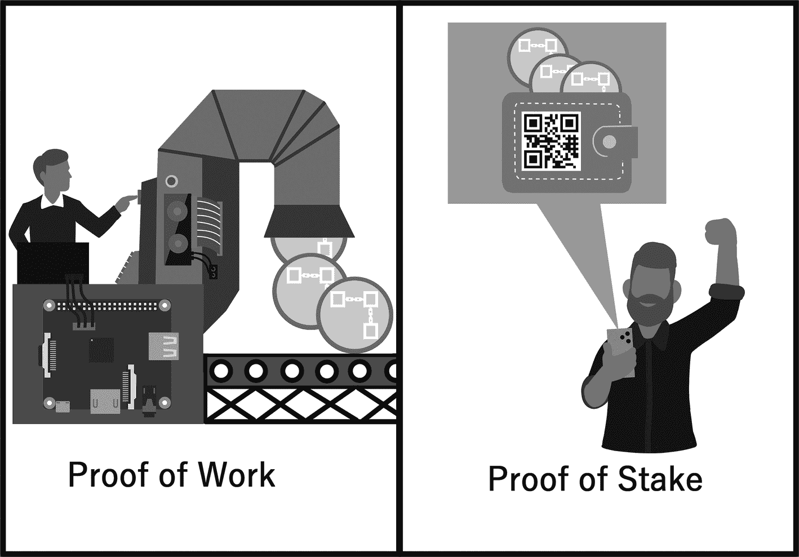
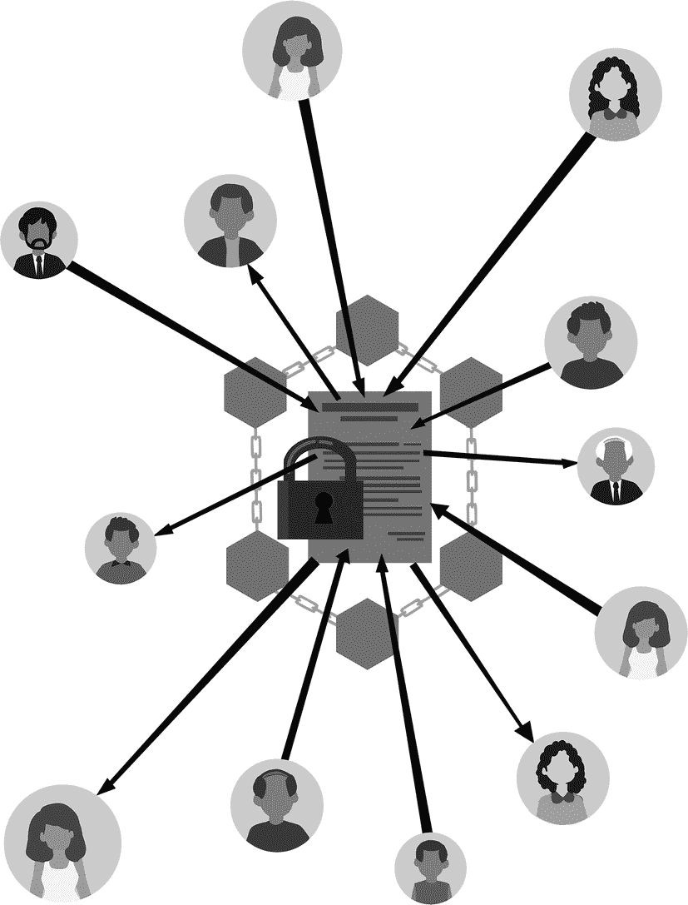

# 加密货币革命简介

2010 年，一位名叫拉斯洛·汉耶茨的人创造了历史，成为第一个使用比特币购买实物的人：两个披萨。当时，比特币的价值不到一美分，汉耶茨以用 1 万个比特币支付他的披萨订单而闻名。

如今，那 1 万个比特币价值数千万美元。但汉耶茨这笔交易的意义远不止他支付的惊人价格。它代表了一种思考货币和交易的新方式，挑战了传统银行体系，并为加密货币和区块链技术的崛起铺平了道路。

自从那次决定命运的披萨订单以来，加密货币越来越受欢迎和认可，特斯拉和 PayPal 等大公司开始投资并接受比特币作为一种支付方式。与此同时，区块链技术已扩展到加密货币之外，为从供应链管理到投票系统的方方面面提供解决方案。

随着我们进入一个日益受这些技术影响的世界，很明显，它们的影响将远远超出金融领域。从我们开展业务的方式到我们与政府以及彼此互动的方式，区块链和加密货币正以我们尚无法完全想象的方式改变我们的日常生活。

世界处于不断变化之中，近年来，变化的速度急剧加快。技术、通信和交通领域的创新改变了我们的生活、工作和互动方式。互联网和社交媒体的兴起使世界比以往任何时候都更加互联，信息现在触手可及，其方式我们过去无法想象。

在这场快速变革中，区块链技术作为一种强大新工具崭露头角，有潜力彻底改变我们进行交易、共享信息和彼此互动的方式。从本质上讲，区块链是一种去中心化的分类账本，以安全透明的方式记录交易。与传统的中心化系统不同，区块链运行在对等网络上，消除了对银行或其他金融机构等中介机构的需求。这项技术已经在颠覆从金融到医疗保健的各个行业，其影响才刚刚开始显现。例如，基于区块链的加密货币正在挑战传统的货币和金融体系概念。区块链也被用于改造供应链管理，实现更高的透明度和效率。在医疗保健行业，区块链正被探索作为一种安全存储和共享患者数据的方式，有可能彻底改变医疗服务的提供方式。

在继续之前，我想解释一下中心化与去中心化的概念。由于这些是区块链技术的重要方面，在本书的语境中明确它们的含义至关重要。

当我谈到中心化时，我指的是控制权、决策权和权威集中在单个中央实体或地点的系统或结构。这个中央实体可以是个人、组织或服务器。在中心化系统中，信息、资源和权力从中心流向各个节点或用户。中心化系统的例子包括银行、公司和传统数据库。虽然中心化系统可以很高效，并提供清晰的权力线，但它们也更容易出现单点故障、腐败和被少数人控制。

另一方面，去中心化是将控制权、决策权和权威分散到多个实体或地点的过程。在去中心化系统中，没有单个中央实体能完全控制系统。相反，系统通过其各个节点或用户的协作、互动和共识来运行。去中心化系统可能更有弹性，因为它们不依赖可能容易发生故障或受到攻击的单一控制点。此外，去中心化系统促进了权力和资源更公平的分配，因为没有单个实体可以垄断控制。

为了进一步说明中心化和去中心化的区别，让我们通过一个社交网络来比较：

*   **中心化系统**：在中心化社交网络中，如 Facebook 或 Twitter，所有用户数据、帖子及互动都存储并管理在由该公司拥有和控制的中心化服务器上。用户必须创建账户，并信任该公司来存储其个人信息、处理其数据并管理其与他人的互动。在这种情况下，社交网络平台及其背后的公司代表了中心权威。

*   **去中心化系统**：在去中心化社交网络中，没有单个公司或实体控制该平台。相反，该平台构建在一个分布式网络上，用户之间直接互动，没有中央服务器。用户数据、帖子及互动由用户自己存储管理，或分布在网络中的多个节点上。在这种情况下，社交网络的控制和管理由其用户共享，没有单一的中央权威。

这个例子突出了中心化和去中心化系统之间的关键区别。在中心化社交网络中，控制和管理集中在一家中心公司及其服务器上；而在去中心化系统中，控制和管理则分布在网络中的多个节点或用户之间。

理解中心化和去中心化的概念很重要，因为它们构成了区块链技术许多原理和优势的基础。当我深入探讨区块链时，我将探索去中心化如何在创建更透明、更安全、更高效的系统中发挥关键作用，这些系统可以改变行业以及我们彼此互动的方式。

区块链技术和加密货币之所以如此受欢迎，是因为它们解决了现代社会面临的一些最紧迫的挑战。它们受欢迎的主要原因之一是区块链技术的去中心化特性，这消除了对银行、金融机构或其他第三方中介的需求。这种去中心化的方法增加了交易中的信任、安全性和透明度，使交易更高效、成本更低。

此外，像比特币和以太坊这样的加密货币为主权政府控制和操纵的传统法定货币提供了替代选择。这使得加密货币对那些希望对自己的资金拥有更多控制权，并且不想依赖政府或金融机构的人具有吸引力。但除此之外，这项技术及其所能做到的事情远不止于此。区块链有潜力颠覆整个行业，从医疗保健到房地产，通过实现安全透明的数据共享和提高效率。当你阅读这本书时，一切都会变得清晰。

除了区块链技术和加密货币的潜在优势外，认识到围绕这一新兴领域的一些挑战和争议也至关重要。虽然一些人将区块链视为一股向善的力量，但另一些人则对其可扩展性、能源消耗和监管等问题表示担忧。可扩展性仍是许多区块链应用的关键问题，一些网络难以处理大量的交易和用户。能源消耗是另一个令人担忧的领域，因为在区块链上验证交易的过程可能非常耗能。然而，业内许多人正在积极研究解决这些挑战的方案，例如开发更高效的共识算法和使用可再生能源。

此外，还有监管问题。区块链和加密货币的去中心化与无国界特性对传统的监管框架构成了挑战，这些框架通常是为在国界内运作而设计的。因此，需要采取创新的监管方法，在平衡创新带来的好处的同时，保护消费者并防止非法活动。

欢迎阅读《安静的加密革命》，这是一本全面指南，旨在帮助您理解加密货币和区块链的过去、现在和未来，以及它们将如何影响您的生活。在本书中，我将深入探讨加密货币和区块链技术的历史，从它最初的概念萌芽，到如今作为一个快速发展的行业的现状。我将探讨加密货币市场的现状，包括最流行的货币以及支持它们的各种平台和技术。

但最重要的是，我将审视这项技术潜在的未来影响。加密货币有潜力颠覆传统金融体系，增强金融自由和自主权，并彻底改变我们对所有权和资产转移的看法。这项技术仍处于早期阶段，还有许多东西需要理解和发现。我们将共同探索加密货币改变我们日常生活的多种方式，包括使用去中心化金融（`DeFi`）和不可替代代币（`NFTs`）、运用智能合约，以及提升金融隐私与安全的潜力。我还将审视加密货币行业面临的挑战，包括监管和采用率问题，并讨论如何克服这些挑战。

本书旨在让您全面了解区块链技术和加密货币的过去、现在和未来。我将从探索区块链技术的基础知识开始，包括其关键组成部分以及在加密货币之外的潜在应用。我还将涵盖区块链技术在供应链管理、投票系统、医疗保健等各个行业的未来。

接着，我将探讨加密货币的实际应用方面，包括比特币及其他加密货币的历史和机制，以及通过不可替代代币（`NFTs`）实现数字所有权的潜在未来。我还将讨论当前围绕加密货币的法规和法律，以及与之相关的风险和挑战。

最后，我将涵盖快速发展的去中心化金融（`DeFi`）领域及其颠覆传统金融的潜力。我将讨论传统金融的基础知识，并介绍`DeFi`，重点聚焦于稳定币和去中心化自治组织（`DAOs`）。我还将审视当前的监管环境以及`DeFi`的颠覆潜力。

在整本书中，我将探索区块链技术和加密货币有潜力改变我们所生活的世界的多种方式，以及它们已经在如何改变这个世界。我希望本书能为读者提供对这个激动人心且快速发展的领域的全面理解。

本书面向所有知识层次的读者，无论是刚接触加密货币世界的新手，还是已关注该行业多年的老手。无论您是想投资加密货币的个人，还是考虑将其整合到业务中的企业，本书都将为您提供所需的知识和见解，以便您就能否参与这场加密革命做出明智的决策。

那么，请加入我的旅程，一起探索这个激动人心且快速发展的加密货币世界。我们将共同发现这项技术改变我们生活、工作和彼此互动方式的潜力。让我们开始吧。

## 2. 理解区块链

首先请允许我表示歉意，因为我将不得不在此涉及一些技术细节，并且我意识到并非每个人都像我一样对技术充满热情。然而，区块链技术是本书如此重要的组成部分，以至于我觉得让您至少理解其技术方面的基础知识至关重要。它是加密货币赖以存在的基础。所以我会尽量保持简明，但您需要通过这部分内容来理解加密货币的完整动态及其对世界的影响。请享用。

### 追根溯源

区块链技术的历史是一个关于创新、颠覆与革命的故事。从最初作为密码学领域一个鲜为人知的概念，区块链技术已发展成我们时代最具变革性的力量之一。

区块链的起源可以追溯到 20 世纪 90 年代初，当时由斯图尔特·哈伯和 W·斯科特·斯托内塔等计算机科学家组成的团队开始研究一种新型密码学，这种技术能够创建安全且防篡改的数字记录。他们的目标是找到一种安全存储数据的方法，使其不易受到篡改、黑客攻击或其他恶意行为的威胁。

2008 年，随着首个去中心化加密货币——比特币的诞生，世界迎来了当前形式的区块链。比特币背后的理念很简单：它利用区块链技术创建了一个安全、去中心化的交易账本，该账本无法以任何方式被操纵或篡改。这项新技术前所未有，立刻吸引了金融界和科技界的关注。发明比特币的主要动机之一，是创造一种能够绕过传统银行体系的去中心化货币。2008 年的金融危机凸显了传统银行体系的诸多缺陷，一些人认为需要一种新型的去中心化货币，以提供一种独立于传统金融体系、更稳定且更安全的替代方案。

自那以后，区块链技术不断发展与扩展，每天都有新的用途和应用被开发出来。从去中心化金融的兴起，到非同质化代币的创造，再到人们对去中心化自治组织日益增长的兴趣，区块链技术已被证明是创新与变革的催化剂。本书后续章节将涵盖所有这些主题。

区块链技术被发明出来的最令人兴奋的方面和原因之一，在于它有能力创造一个更公平、更公正的世界。通过消除对中介机构和中央权威的需求，区块链技术赋予个人和社区直接进行交易和价值交换的权力，而无需中间人。这为金融包容性、数据隐私以及更大的经济机遇开辟了新的可能性，使区块链技术成为金融及其他领域真正的游戏规则改变者。

总之，区块链技术的历史是一个创新与颠覆的故事，它有可能以我们难以想象的方式塑造未来。现在，让我们从基础知识开始，深入探讨这项创新技术可能对您的日常生活产生的潜在影响。

### 区块链入门：理解基础

区块链技术是一种革命性的新型数据存储与共享方式，它有可能改变我们与数字世界互动的方式。它是一个去中心化系统，允许多方共享和访问信息，而无需中央权威机构。其核心是，区块链技术是一个数字账本，能以安全且防篡改的方式记录交易。现在，如果您跟我有点像，我猜您心里在想：*“嗯，这话我好像在哪儿听过，但我还是不明白这有什么了不起。”* 让我用一个非常简单的例子来解释一下：

账本基本上就是一个用于跟踪交易的记录系统。它本质上是一个条目列表，详细记录了特定时间段内发生的事件。例如，假设您有一个记录个人开支的账本。每次买东西时，您都会在账本中添加一条记录，列出日期、金额和所购物品。这样，您就有了所有开支的记录，并能确切知道花了多少钱以及花在了什么地方。区块链技术本质上就是一个数字账本，它以安全、透明的方式，在计算机网络中记录交易。您可以把它想象成一个所有人都能访问的共享账本。网络中的每个成员的电脑上都存有一份副本。一旦有人试图篡改或删除账本中的某个条目，它就会与网络中其他电脑上的记录不符，因此被视为无效。

那么，这为什么如此强大呢？想象一个场景：您和一群朋友在餐厅分摊账单。与其依赖某个人来记录谁欠了多少钱、谁付了款，不如大家同意使用一个所有人都能访问的共享账本。每次有人付款时，交易都会被记录在账本上，每个人都能看到。这确保了大家的信息同步，没有争议或混淆的余地。

像上述与朋友分摊账单例子中描述的共享账本，有几个优势，包括：

*   **透明性**：每个人都能访问账本，看到正在进行的交易，消除了关于谁欠谁钱、谁付了款等方面的任何疑问或混淆。
*   **安全性**：信息一旦添加到账本中，就无法修改或删除，这意味着数据是安全且防篡改的。
*   **准确性**：交易实时记录和更新，确保每个人都能获得最新信息。
*   **可追溯性**：交易可以轻松追踪和审计，从而增加了问责制，降低了欺诈风险。
*   **提高效率**：通过消除对中央权威机构跟踪交易的需求，共享账本可以加快流程并降低交易成本。

总的来说，共享账本提供了一种安全、透明且高效的方式来跟踪交易，并确保所有人信息同步。

同样的基本概念被应用于区块链技术，但规模要大得多。交易被分组到区块中，每个区块都链接到前一个区块，从而形成一条链条，因此得名“区块链”。计算机组成的网络（称为节点）共同协作以验证交易并维护账本的完整性，如图 2-1 所示。

一个人坐在椅子上，面前是屏幕，屏幕上有一个带安全保护的账本图标。在屏幕上方，有一个大锁连接到其他小锁的图形。

**图 2-1**
**防篡改共享账本**

### 从共享账本到区块链

现在我们已经明确了共享账本的概念，接下来让我们搭建通往区块链的桥梁。在区块链中，每个区块包含一组交易，以及一个称为“哈希”的唯一代码，该代码标识区块并将其链接到链中的前一个区块。以下是一个类比，用于解释如何将区块添加到区块链：

想象一群人用积木搭建一座塔。每块积木代表一组交易，而这座塔代表区块链。每当一个新区块被添加到塔中时，它必须小心地放置在前一个区块之上，以保持塔身直立且不倒塌。这类似于新区块以安全且不可破坏的方式被添加到区块链的过程。

在新区块被添加到塔中之前，它必须由其他搭建塔的人进行验证。这个过程类似于区块链网络中的交易验证过程。在积木塔的类比中，其他搭建者可能会检查新区块，以确保它与其他积木契合，并且不包含任何欺诈或无效交易。

在区块链网络中，验证过程由一组称为“节点”的计算机网络完成。这些节点协同工作，验证新交易并将其添加到区块链。它们检查交易是否有效且未被篡改，一旦验证通过，交易就会被添加到区块链。新区块被验证后，就可以添加到塔顶。这个过程类似于区块被添加到区块链的方式。新区块通过其哈希码链接到链中的前一个区块，从而形成一条连续且不可破坏的区块链。哈希码是使用复杂数学算法生成的、用于标识区块的唯一标识符。

随着越来越多的区块被添加到塔中，塔会变得更高、更稳固。类似地，随着越来越多的区块被添加到区块链中，区块链会变得更长、更安全。将每个区块链接在一起的哈希码形成了一条不可破坏的链条，确保了账本的完整性，并防止任何欺诈或未经授权的更改。在区块链网络中，所有节点都拥有一份区块链副本，并协同维护它。这创建了一个去中心化且透明的系统，其中每笔交易都被记录，并且可以追溯到其来源。区块链的安全性和透明性使其适用于从加密货币到供应链管理再到投票系统等多种应用。

如前所述，区块链技术的关键特性之一是其去中心化的性质。回顾我在第 1 章中写过的内容，**中心化**指的是存在单一中央权威或控制点的系统。所有决策和权力都由该中央权威掌握。例如，传统银行是中心化的，因为所有交易都通过银行进行，并且银行做出所有决策。**去中心化**指的是不存在中央权威或控制点的系统。权力和决策分布在由个人或实体组成的网络中。例如，区块链网络是去中心化的，因为所有交易都记录在分布式账本上，并且没有单一实体控制该网络。简单来说，在中心化系统中，所有权力集中于一处；而在去中心化系统中，权力分布在多个实体之间。

为了确保区块链安全，网络中所需的节点（计算机）数量并非固定不变，这取决于多种因素，例如区块链的类型、其用途以及所需的安全级别。但一般而言，区块链网络中的节点越多，它就越安全。网络中拥有大量节点会提高区块链的安全性。当存在更多节点时，账本的副本也会更多，这使得任何人更难在不被发现的情况下篡改区块链上的信息。此外，区块链的去中心化性质意味着，即使某些节点被攻破或离线，整个网络也能继续运行。

因此，拥有足够数量的节点对于维护区块链的安全性和完整性至关重要。但值得注意的是，拥有更多节点并不一定能保证完全安全，因为共识算法和网络协议等其他因素也在区块链的安全性中发挥作用。我将在稍后对此进行详细解释。

与传统系统（依赖中央权威来验证和处理交易）不同，区块链技术基于一个所有计算机都拥有同等权力和权威的网络。这意味着不存在单点故障，也不存在可能被攻破的中央权威。相反，交易由网络共识进行验证和处理，从而确保系统安全且防篡改。

区块链技术的另一个关键特性是其对密码学的运用。密码学是一种通过以仅允许授权方访问的方式对通信和信息进行编码，从而保护通信和信息的实践。在区块链技术的背景下，这意味着所有交易都被加密并以一种使其无法在不被发现的情况下被篡改或更改的方式存储在网络上。这确保了区块链上数据的完整性得到维护，并且任何篡改尝试都能被轻易发现。

创建防篡改的交易记录是通过数据在区块链上的存储方式实现的。区块链上的每个数据区块都包含自上一个区块添加到链以来发生的所有交易的记录。一旦一个区块被添加到链中，它就无法被更改或删除，从而确保区块链上存储的数据是永久且不可变的。

区块链之所以必须是防篡改的，是因为这有助于确保存储在区块链上的数据的安全性、可信性和完整性。如果区块链可以轻易被更改或操纵，那么它就会变得不可靠且不值得信赖，因为数据可以在用户不知情或未同意的情况下被更改。另一方面，防篡改的区块链为存储和传输数据提供了一个安全且值得信赖的平台，使用户能够对区块链上信息和交易的有效性充满信心。这对于区块链技术的许多应用（例如加密货币）至关重要，因为在这些应用中必须维护金融交易的完整性。

# 区块链技术的核心组件

区块链网络是一种允许多个用户共同维护同一份数字账本副本的网络。账本的每个副本被称为一个`节点`。这些节点在网络中可扮演不同角色，要完全理解区块链技术的工作原理，了解不同节点类型及其功能至关重要。

`全节点`是区块链网络的基石。它们存储着区块链的完整副本，包括历史上发生的每一笔交易。这些节点负责验证新交易并将其添加到区块链中。同时，它们还通过遵循网络的共识机制，确保区块链始终保持一致的状态。

`轻节点`（也称“轻客户端”）并不存储区块链的完整副本。相反，它们仅存储区块链的一部分，例如网络的当前状态。这类节点通常被那些希望使用区块链网络，但缺乏运行全节点资源的个人或组织所使用。

`矿工节点`负责在区块链中创建新区块。它们通过解决被称为“工作量证明”（`PoW`）的复杂数学问题来寻找链上的下一个区块。这些节点还负责将新交易添加到区块链中，并确保区块链保持状态一致。

共识机制是网络中所有节点就区块链当前状态达成一致的过程。这确保了网络中的每个节点都拥有相同的账本副本。

共识机制的一个简单例子是投票系统。想象一群人试图决定晚餐去哪家餐厅最好。他们没有各自做决定，而是采用共识机制来达成共识。每人将心仪的餐厅写在纸条上，然后将所有纸条放入一顶帽子中。待所有纸条入帽后，进行清点，获得最多票数的餐厅就是大家共同前往的目的地。

在这个例子中，共识机制就是投票过程，网络中的参与者就是试图就最佳餐厅达成共识的人们。就像在区块链网络中一样，共识机制有助于确保所有参与者拥有相同的信息，并且所做的决定准确可靠。

在区块链技术中，最常用的共识机制称为“工作量证明”（`PoW`），比特币和其他加密货币便采用此机制。该机制使用由矿工节点解决的复杂数学问题。一旦找到解决方案，该方案就被广播到网络，所有节点都会验证该方案。如果大多数节点同意该方案，新区块就会被添加到区块链中。

以下是一个理解该概念的简单示例：想象一场寻宝游戏，参与者需要解开谜题才能找到宝藏。在这个场景中，谜题就是为了验证网络交易而需要解决的复杂数学问题。每位参与者都争相成为第一个解开谜题、找到宝藏的人。一旦谜题被解开，获胜者将获得一些加密货币作为奖励，并且该交易会被添加到区块链中。

这个解决谜题的过程被称为“挖矿”，参与者则被称为“矿工”。网络中的矿工越多，网络就越安全，因为任何一个矿工操纵网络交易的难度都会增加。这是因为交易在被添加到区块链之前，网络需要就交易的有效性达成共识。

总之，`PoW`是网络以一种安全且去中心化的方式达成共识并验证交易的一种方法。

`PoW`的主要缺点之一是验证交易需要消耗大量能源。矿工们必须互相竞争，解决复杂的数学问题，才能验证交易并将其添加到区块链中。这需要大量的计算能力，而计算能力的提供又需要大量能源来为计算机供电并为其降温。

另一种常用的共识机制是“权益证明”（`PoS`），以太坊和其他加密货币便采用此机制。在该机制中，节点需抵押一定数量的加密货币作为担保，才能参与交易的验证。节点抵押的资产越多，被选中验证交易的可能性就越大。

假设你是一群从头开始建造一座新城的人中的一员。为了确保每个人对城市的建设和运营都有发言权，你们都同意使用权益证明共识机制。在这种机制下，不是每个人投入等量的体力劳动（工作量证明），而是团队中每个人投入一定数量的资金，作为他们对城市成功的“权益”或“赌注”。

一个人愿意投入的资金越多，他们在决策中的影响力就越大。例如，如果有人押注了总资金的 10%，那么他们就拥有 10%的决策权。团队随后就诸如在哪里修路、建造何种建筑等重要决策进行投票。

权益证明机制激励人们为城市的最佳利益行事，因为如果城市成功，他们权益的价值就会增加。相反，如果他们采取恶意行动或做出糟糕决策，其权益的价值可能会下降。该机制确保了决策的分布式和民主性，因为拥有最大权益的人拥有最大的影响力，并且每个人都有经济激励去为城市的成功而共同努力。

权益证明被视为比工作量证明更环保的替代方案，因为运行网络所需的能源显著更少。图 2-2 描绘了这种差异。

*两张并排的图形分别代表工作量证明和权益证明。在工作量证明中，一个人在一台机器里制造东西；而在权益证明中，一个人投入资金。*

总之，了解区块链网络中不同类型的节点和共识机制，有助于理解区块链技术的工作原理。`全节点`是网络的基石，负责验证新交易和维护区块链的一致性。`轻节点`和`矿工节点`在网络中也扮演着重要角色，但用途不同。`全节点`用于存储区块链的完整副本，`轻节点`用于在不存储完整副本的情况下访问区块链，而`矿工节点`则用于创建新区块并在网络上验证交易。

此外，区块链技术还支持智能合约功能。`智能合约`是自动执行的数字协议，包含了交易各方之间的条款。它们是区块链技术的核心组成部分，可以通过编程自动执行合约的规则和条例。`智能合约`有潜力彻底改变从金融、房地产到医疗保健和政府等众多行业。

## 智能合约的主要优势

智能合约的主要优势之一在于其自动化与高效性。与传统合约需要手动处理和核对不同，智能合约基于预定义的规则和条件自动执行。这减少了对律师或金融机构等中介的需求，同时提高了交易的速度和准确性。我将在后文更详细地解释智能合约的概念，但这里先给出一些例子，让您对其运作方式有个初步印象。

### 众筹平台案例

我们以众筹平台为例，用简单的方式解释智能合约的概念。在传统众筹场景中，项目创建者在像`Kickstarter`或`Indiegogo`这样的中心化平台上发起活动。他们设定一个筹款目标和截止日期。支持者向活动认捐资金，平台持有这些资金。如果筹款目标在截止日期前达成，平台会扣除手续费后将资金发放给项目创建者。如果目标未达成，资金将退还给支持者。平台充当可信的中介，管理和执行活动规则。

现在，设想一个使用区块链网络上的智能合约的众筹活动：项目创建者创建一个包含筹款目标、截止日期以及资金发放或退还规则的智能合约。该智能合约部署在区块链网络上。支持者使用数字货币（如加密货币）直接将捐款发送到智能合约。智能合约自动跟踪总筹款金额和每笔个人捐款。

如果筹款目标在截止日期前达成，智能合约自动将资金发放给项目创建者，无需中心化平台或中介。如果筹款目标未在截止日期前达成，智能合约自动将捐款退还给支持者，同样无需中心化平台。

在这个例子中，智能合约取代了需要可信中央权威（众筹平台）来执行活动规则的需求。智能合约的自我执行特性确保资金根据预定义规则要么发放给项目创建者，要么退还给支持者，从而避免了管理不善或欺诈的风险。

在众筹中使用智能合约可以使流程更加高效、透明和安全，同时减少与传统众筹平台相关的手续费。这展示了智能合约在革新各行各业和应用方面的潜力。

### 手机电池保险案例

另一个例子是手机电池保险。在当今互联世界中，智能手机已成为我们日常生活的重要组成部分，让我们能够随时保持联系、获取信息并管理各种任务。智能手机的关键部件之一是电池，它为设备供电，使我们能够全天使用。然而，许多用户在使用过程中会因手机电池性能逐渐下降而感到沮丧，导致设备电量快速耗尽或需要频繁充电。在某些情况下，这种退化可能比预期更早出现，给用户带来不便和额外成本。

为了解决这个问题，我们可以推出手机电池保险，为投保人提供保障和经济赔偿，以防其手机电池性能过快下降。在此背景下，利用区块链网络上的智能合约可以通过自动化监控、验证和理赔支付来简化保险理赔流程，使投保人和保险公司双方的流程更高效、透明和安全。

在传统的手机电池保险场景中，如果手机电池性能下降过快，投保人需要联系保险公司，提交包含电池性能不佳证据的索赔申请，然后等待公司审核和批准索赔后才能获得赔付。这个过程可能非常耗时，并且需要投保人与保险公司之间进行大量的来回沟通。

现在，设想一个使用区块链网络上智能合约的手机电池保险。投保人和保险公司就手机电池保险的条款达成一致，例如保障范围、保费和赔付条件（如：电池容量在特定期限内低于某个阈值）。这些条款被编码成智能合约，并部署在区块链网络上。

投保人使用数字货币（如加密货币）直接将保费支付给智能合约。手机电池性能通过软件或硬件传感器自动监测，并定期将电池容量数据发送给智能合约。如果电池容量在指定期限内降至预定义阈值以下，智能合约会自动验证索赔条件，并向投保人发放保险赔付，无需手动提交索赔、审核或批准。

在这个例子中，智能合约通过自动化监控、索赔验证和付款发放，简化和加速了手机电池保险的理赔流程。智能合约的自我执行特性确保了基于保单预定义条件的赔付快速且准确地进行。

在手机电池保险中使用智能合约展示了它们在革新各行各业和应用方面的潜力，通过使流程更高效、透明和安全，同时减少对人工干预的需求以及错误或争议的可能性。

我将在本章后文更深入地探讨智能合约这一主题。

## 数字货币与区块链技术

区块链技术主要通过提供一种安全且去中心化的方式来记录和转移数字资产的所有权，从而用于创建数字货币（也称为加密货币）。最知名的加密货币`比特币`是首个采用区块链技术的货币，它于 2009 年由化名`中本聪`的个人或团体创建。

要理解区块链技术如何用于创建数字货币，首先需要理解数字代币的概念。数字代币是一种资产或功能（如货币）的数字表现形式，可以电子化交易和存储。在加密货币领域，这些代币代表该货币的特定单位。

区块链技术通过挖矿实现数字代币的创建。挖矿是在区块链中创建新区块的过程，而这又会生成新的加密货币单位。当一个新区块被添加到区块链时，其中包含一定数量的新代币，这些代币被创建并投入流通。这些代币可以在加密货币交易所买卖，并在用户之间转移。区块链技术允许用户之间安全透明地转移数字代币。当用户想向另一用户转移数字代币时，他们会向网络广播一笔交易。该交易随后由网络中的节点验证，若验证有效，则被添加到区块链的下一个区块中，从而形成数字代币所有权转移的永久且不可篡改的记录。

像`比特币`和`以太坊`这样的加密货币使用公有区块链，这意味着任何人都可以参与网络并查看交易历史。此外还有私有区块链，仅对特定人群或组织开放。这些通常用于企业解决方案和联盟中，只有授权成员才能访问区块链。

总而言之，加密货币是金融领域的一项革命性发展，它提供了一种安全、快速且任何人只要有互联网连接就能使用的交易和价值交换新方式。区块链技术通过提供安全且去中心化的方式来记录和转移数字资产的所有权，从而用于创建诸如`比特币`和`以太坊`之类的数字货币。数字代币（即货币单位）通过挖矿过程被创建并投入流通，随后这些代币可以在加密货币交易所买卖，并在用户之间转移。

### 加密货币之外的潜在应用

区块链技术有潜力颠覆加密货币之外的众多行业。区块链的主要优势之一是能够提供安全透明的方式来记录和追踪交易，这使得它在强调透明度和信任度的行业中尤为有用。以下是区块链技术在加密货币之外的一些潜在应用领域：

1.  **供应链管理**：供应链管理是监督商品和服务从源头到消费终端的流程。区块链技术可用于创建商品在供应链中流转的不可篡改记录。这有助于提高供应链的透明度和信任度，同时通过减少对中间商的需求来提高效率。例如，`沃尔玛`正在使用区块链技术追踪食品在其供应链中的流动，这有助于快速识别任何食品污染的来源。

2.  **数字身份**：区块链技术可用于为个人或组织创建安全且不可篡改的数字身份。这在银行和医疗等需要验证身份的重要行业中特别有用。例如，`微软`正在开发一个基于区块链的数字身份平台，允许个人控制和共享自己的个人信息。

3.  **投票系统**：区块链技术为创建安全透明的投票系统提供了解决方案。这有助于提高对选举过程的信任，并减少选民舞弊的可能性。例如，`西弗吉尼亚州`成功地将区块链技术用于一项针对海外军人的试点投票项目，提高了投票过程的透明度和信任度。该系统允许军人通过一个链接到区块链的移动应用程序在州初选中投票。区块链技术的使用有助于增强对投票过程的信任并降低欺诈风险，因为选票被记录在一个所有利益相关者都能访问的不可篡改的分类账上。

4.  **房地产**：区块链技术可以创建房产所有权和交易的不可篡改记录。这有助于提高房地产行业的透明度和信任度，同时减少对中间商的需求。例如，`Ubitquity`公司正在利用区块链技术创建房产所有权和交易的不可篡改记录，这有助于加快买卖房产的流程。

5.  **医疗健康**：区块链技术可用于创建安全透明的方式来存储和共享医疗记录。这有助于提高医疗行业的信任度和安全性，同时提升医学研究的效率。例如，`MedRec`项目利用区块链技术创建医疗信息的不可篡改记录，这有助于提高医学研究的效率。

总而言之，区块链技术通过提供安全透明的方式来记录和追踪交易，有潜力颠覆加密货币之外的众多行业。这使得它在那些重视透明度和信任度的行业中特别有用。区块链技术在加密货币之外的一些潜在实际应用包括供应链管理、数字身份、投票系统、房地产和医疗健康。这些行业可以从区块链的不可篡改和去中心化特性中受益，这有助于提高透明度、信任度、安全性和效率。凭借颠覆如此多行业的潜力，难怪众多公司和组织正在探索将区块链技术应用于其业务运营中。

## 智能合约

正如本章前述内容所述，智能合约是一种自动执行的合约，其协议条款直接以代码形式呈现。这些合约存储并复制在区块链网络中，当特定条件满足时可自动执行。一旦智能合约部署至区块链，便无法修改，从而确保所有参与方遵守协议条款。区块链技术的应用使得智能合约具备透明性、安全性和防篡改特性，使其成为各类交易的有效工具——从简单的商品服务交换到复杂的金融交易。智能合约消除了对律师或公证人等中介的需求，并凭借密码学安全账本实现的去信任化特性，大幅缩短执行时间。

以太坊虚拟机（`EVM`）是采用智能合约的平台之一。`EVM`是一个去中心化平台，允许开发者创建和部署智能合约（如图 2-3 所示）。这些合约使用名为`Solidity`的编程语言编写，并由`EVM`执行。`EVM`运行在由运行以太坊软件的计算机组成的节点网络上。

*信息图展示了不同用户与中央锁定文件之间的安全智能合约。*

智能合约可广泛应用于各行各业。以下列举几个实例：

1.  **房地产**：智能合约可用于自动化房产买卖流程。合约可包含所有协议条款（如购买价格、交割日期），并在条件满足时自动执行。这消除了中介需求，加速了房产买卖流程。

2.  **供应链管理**：智能合约可自动化追踪供应链中的货物。合约可包含所有协议条款（如交货日期、付款条件），并在条件满足时自动执行。这提升了供应链的透明度与信任度，同时提高了物流效率。

3.  **保险**：智能合约可自动化理赔与赔付流程。合约可包含所有协议条款（如保额上限、免赔额），并在条件满足时自动执行。这加快了理赔速度，并降低了传统保险流程的成本。

4.  **银行业**：智能合约可自动化发行和交易金融工具（如债券和衍生品）。合约可包含所有协议条款（如利率、到期日），并在条件满足时自动执行。这增强了金融系统的透明度与信任度，同时降低了传统银行流程的成本。

在后续章节中，我将更详细地探讨这些概念，但提前建立基本理解是有益的。

总结而言，智能合约是存储并复制在区块链网络上的自动执行合约。它通过预设条件（以代码形式编写，运行于以太坊虚拟机（`EVM`）等去中心化平台之上）实现多方复杂协议的自动化。这消除了传统合约执行方式中高昂的法律费用，同时凭借密码学安全账本实现的去中心化特性，显著提升执行速度。智能合约可广泛应用于房地产、供应链管理、保险、银行及去中心化金融等领域，以增强透明度、信任度、安全性及效率。

## 区块链技术基础原则

至此您已了解，区块链技术的核心基础原则包括不可篡改性、透明性与去中心化。

`不可篡改性`是指数据一旦记录到区块链上，便无法修改或删除。这一特性通过密码学实现，确保区块链上的数据防篡改。该功能特别适用于重视透明度与信任的行业，如供应链管理和金融系统。

`透明性`是区块链技术的另一关键概念。区块链的去中心化特性意味着所有交易均记录在公共账本上，任何人皆可访问。这确保区块链数据透明且易于审计。该功能特别适用于重视透明度的行业，如投票系统和供应链管理。

`去中心化`是区块链技术的又一核心原则。与传统系统依赖中央权威验证交易不同，区块链技术基于去中心化的节点网络。这确保系统不受单一实体控制，从而更加安全且不易被操纵。该功能特别适用于重视信任的行业，如金融系统和供应链管理。