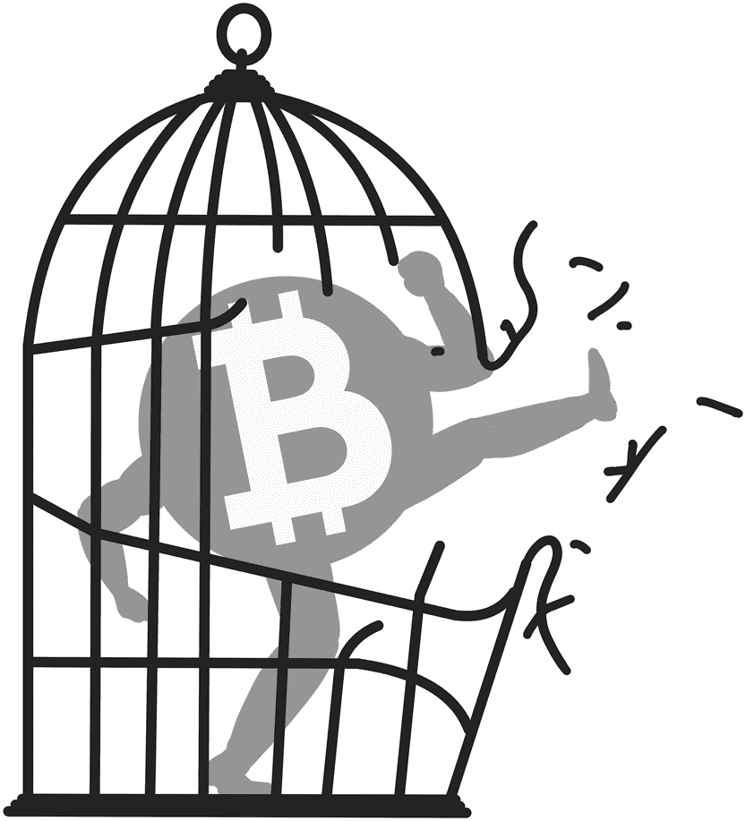
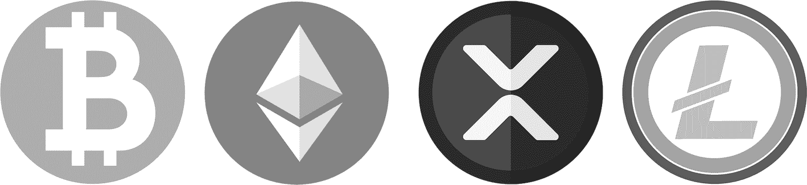
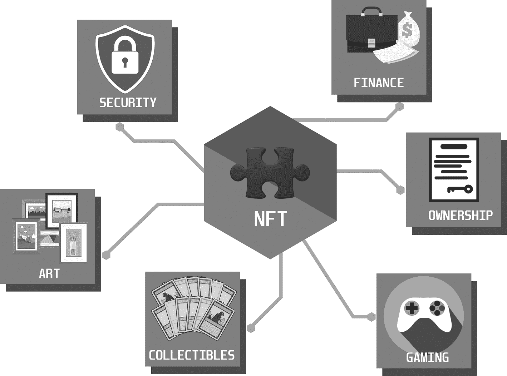
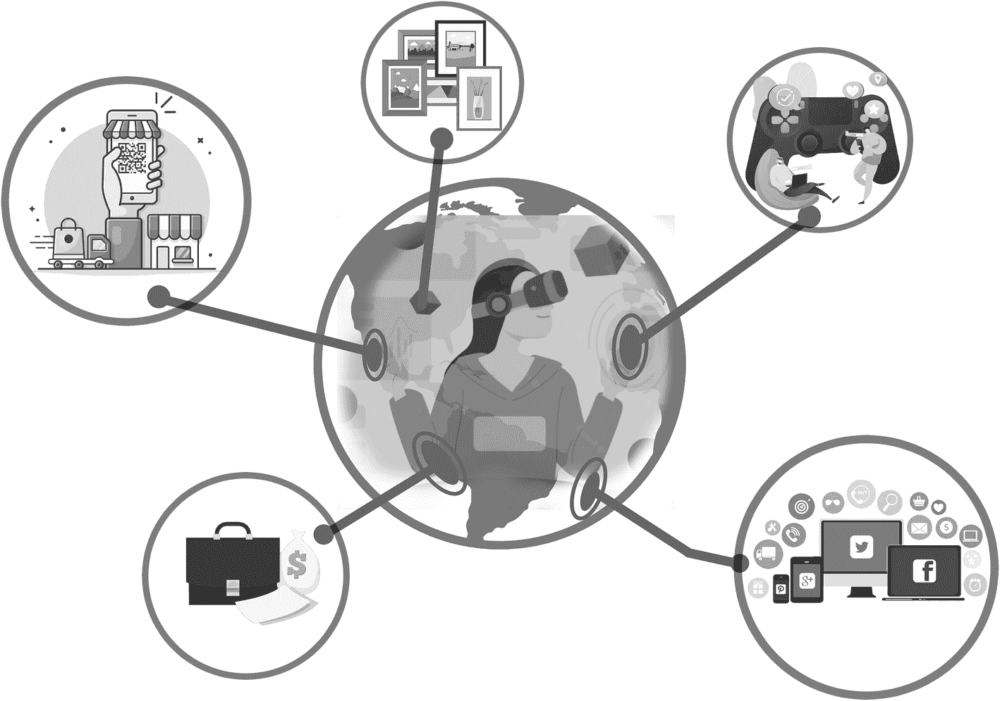

# 4. 加密货币实战

加密货币是一种利用密码学保障安全的数字或虚拟货币。加密货币是去中心化的系统，允许在没有中央机构或中介的情况下创建、转移和验证交易。

好吧，仅凭这两句话确实信息量很大。请再读一遍，仔细体会一下。无需中央机构或中介这一点有何特殊之处？关键就在于去中心化。正如你现在所知，加密货币的去中心化特性具有革命性，因为它消除了监督和验证交易所需的中央机构或中介。这意味着即使在金融监管严格的国家，人们仍然可以使用加密货币进行交易。正因如此，你会听到诸如“比特币就是自由”这样的说法（图 4-1）。

一个比特币模型的插画，它有手、腿和圆形的身体，正在打破一个笼子。

**图 4-1** 比特币就是自由

现存有超过 1000 种加密货币，但本书的目标并非涵盖所有。为了让你更好地理解，我将仅提及几种知名的：比特币、以太坊、瑞波币和莱特币。这应该能让你对这个概念有个良好的印象，其余的就留给你自己去探索吧。

## 比特币及其他加密货币

加密货币是去中心化的，意味着它们不受政府或金融机构的控制，并且运行在区块链上。最知名的加密货币是比特币，但目前市面上已有数千种不同的加密货币在流通。加密货币可以像传统货币一样买卖，也可以用于向接受其作为支付方式的商家购买商品和服务。在本书中，我将介绍其中几种，以便提供对这一强大概念的总体印象。我将深入探讨市场上最突出的四种加密货币的细节：比特币、以太坊、瑞波币和莱特币。这些加密货币各自具有独特的功能和特性，使其与众不同。图 4-2 展示了本节讨论的这四种加密货币的标志。

**图 4-2** 比特币、以太坊、瑞波币、莱特币

比特币是第一种也是市值最大的加密货币，由一位或一群化名为中本聪的匿名者在 2009 年创建。比特币的发明旨在为传统金融体系提供一种去中心化、安全且透明的替代方案。它的诞生是对 2008 年金融危机的回应，这场危机凸显了对一种不受任何中央机构控制、不能被政府或金融机构操纵的货币的需求。需要明确的是，尽管我非常看好比特币，但我并不声称它能解决所有问题，或它没有自身的局限性和挑战。我只是在这里解释它被发明的原因。

比特币的概念建立在一种去中心化数字货币的理念之上，这种货币允许点对点交易，无需银行等中介机构。这通过使用区块链技术实现，区块链是一种去中心化的数字账本，记录网络上的所有交易。

比特币的一个关键特征是它的 2100 万枚硬币的有限供应。这种稀缺性，加上不断增长的需求，使其可能成为有价值的投资和价值储存手段。然而，必须注意的是，投资任何资产（包括比特币）都伴随着风险和不确定性。在做出任何投资决策之前，始终建议进行彻底的研究并寻求专业建议。

比特币的另一个重要方面是其工作量证明共识机制，该机制通过解决复杂的数学难题来确保所有交易都得到网络参与者的验证。这有助于防止网络上的欺诈和双重支付。总而言之，比特币的去中心化性质、有限供应和强大的共识机制使其成为迄今为止最知名且被广泛采用的加密货币。

在转入下一个话题之前，关于比特币我想再提一个主题：闪电网络。随着越来越多的人开始使用比特币，网络上发生的交易数量可能会变得非常高。这可能引发一个问题，因为网络一次只能处理一定数量的交易。当同时发生太多交易时，会减慢处理速度，并使得使用比特币进行小额交易变得昂贵。

这就是闪电网络出现的原因。闪电网络是一种通过加快交易处理速度并降低使用比特币成本来帮助解决此问题的技术。它通过创建一个能够更快、更高效地处理交易的节点网络来实现这一点。可以把它想象成在高速公路上增加更多车道以减少交通拥堵，让旅程更顺畅。由于这项技术对比特币作为支付系统的未来普及至关重要，我将对此进行更深入的阐述。

闪电网络的工作原理是创建一个节点网络，这些节点相互连接，允许用户在彼此之间转移少量比特币，而无需将每笔交易都记录在区块链上。闪电网络中的每个节点都可以与另一个节点开启一个支付通道，允许它们直接相互交易，而无需经过主区块链。这意味着交易可以处理得更快，因为它们不需要经过整个网络确认。当闪电网络中的两个节点之间进行交易时，该交易不会立即广播到区块链。相反，它在两个节点之间进行结算，并更新支付通道的余额以反映交易。当通道关闭时，最终余额会被记录在区块链上。这使得能够以更低的费用处理许多交易，使得闪电网络成为小额交易的有用解决方案，否则这些交易在主比特币区块链上处理的成本会过高。此外，由于闪电网络上的交易不记录在区块链上，它们也更快且更私密。

总之，闪电网络是构建在比特币网络之上的一个技术层，通过在用户之间创建一个支付通道网络来实现更快、更便宜的交易。它对比特币的未来至关重要，因为它解决了网络面临的重大挑战之一，即处理交易速度慢和高昂的交易费用，从而使得该货币能够被更广泛地采用和使用。

2011 年，一名 17 岁的俄裔加拿大男孩维塔利克·布特林开始为一份名为《比特币杂志》的出版物撰稿。他当时以比特币的形式获得报酬，那时每个比特币仅值几美元。布特林被区块链技术的潜力深深吸引，但他觉得比特币的范围过于有限。他将区块链视为一种去中心化的计算机，不仅可以处理金融交易，还可以存储和执行计算机程序。这一愿景促使他提出了一种新的区块链平台，他将其命名为以太坊。

2013 年底，布特林发布了以太坊白皮书，阐述了他对一个能够执行智能合约的区块链平台的愿景：智能合约是自动执行且协议条款直接写入代码的合约。以太坊将成为一个全球性的、开源的去中心化应用平台，允许用户不仅转移资金，还可以在区块链上创建全新的应用。

布特林的想法得到了热烈响应，他从大学退学，全身心投入以太坊的开发，并通过公开众筹获得资金。该项目面临了无数挑战和挫折，但布特林和他的团队坚持了下来。

快进到今天。以太坊已成为按市值计算的第二大加密货币，并引发了区块链技术的一场革命，催生了去中心化金融（DeFi）和非同质化代币（NFT）等创新。这证明了优秀想法的力量、区块链技术的潜力，以及一个人所能产生的影响。

## 以太坊

以太坊被认为是一种比比特币更先进的区块链平台，因为它支持在其区块链上创建去中心化应用（dapps）。这些 dapps 由以太坊网络的本地加密货币以太币（`ETH`）驱动。以太坊还支持创建智能合约，这是一种将协议条款写入代码的自动执行合约。这开启了广泛的可能，例如创建去中心化交易所（`DEXs`）、预测市场，甚至是数字收藏品。

比特币与以太坊之间的一个关键区别在于，比特币主要作为一种数字货币，而以太坊更像是一个构建去中心化应用的平台。这意味着，正如我在前一章所解释的，以太坊有潜力颠覆众多行业。

以太坊的货币政策也与比特币不同。比特币的总供应量固定为 2100 万枚，而以太坊目前没有设定最大供应量。相反，以太坊网络的设计目标是保持一致的发行率，每年新产生的以太币数量会逐渐减少。

2022 年 9 月 15 日，以太坊将其共识机制从工作量证明（`PoW`）迁移到了权益证明（`PoS`）。从工作量证明共识机制迁移到权益证明共识机制意味着验证交易并将其添加到以太坊区块链的过程将有所不同。

提醒一下，在 `PoW` 系统中，验证者（也称为矿工）使用计算能力来解决复杂的数学问题，以验证交易并将其添加到区块链中。这个过程被称为挖矿，会消耗大量能源。在 `PoS` 系统中，验证者是根据他们持有的加密货币数量以及愿意“质押”作为抵押品的数量来选出的。然后，这些验证者负责验证交易并将其添加到区块链中。这个过程被称为质押。`PoS` 相较于 `PoW` 的主要优势在于它更节能，所需计算能力更少。这使得它更加环保且运行成本更低。

向 `PoS` 的迁移也改变了新以太币的创建方式。在 `PoS` 中，新以太币是通过一个称为“铸币”或“代币生成”的过程创建的，而不是像工作量证明（`PoW`）算法那样通过挖矿创建。在此过程中，验证者（也称为“锻造者”或“质押者”）负责在以太坊区块链上创建新区块并验证交易。验证者需要持有一定数量的以太币作为“质押”或抵押品，如果他们试图验证欺诈性或无效交易，可能会失去这些质押。

为了激励验证者参与网络并验证交易，会创建少量新以太币并将其添加到现有供应中，作为成功验证的奖励。这个过程被称为“通胀”，其设计目标是维持一个稳定且可预测的以太币创建速率。

与 `PoW` 不同，`PoW` 中矿工的奖励会随时间减少，并在达到最大代币供应量时最终停止，而 `PoS` 对以太币的总供应量没有硬性上限。相反，通胀率会根据网络需求和活跃验证者的数量动态调整。通胀率的设定目标是足够低以防止货币贬值，但又足够高以激励验证者参与网络。

总之，在 `PoS` 共识算法中，新以太币是通过铸币（而非挖矿）创建的，并作为成功验证交易的奖励发放给验证者。这个过程有助于维护以太坊网络的稳定性和安全性，同时激励参与并防止货币贬值。

总的来说，以太坊被认为是一个比比特币更通用、适应性更强的区块链平台，拥有更广泛的用户场景和更灵活的货币政策。这使其成为按市值计算的第二大加密货币，并被广泛认为是行业内最有前景的区块链项目之一。

## XRP

`XRP` 是瑞波网络的本地加密货币，该网络由克里斯·拉森和杰德·麦卡勒布创立的公司 Ripple Labs（现名 Ripple）于 2012 年创建。瑞波网络是一个实时全额结算（`RTGS`）系统、货币兑换和汇款网络，旨在实现任何规模的安全、即时且几乎免费的全球金融交易，且无拒付。该网络基于一个分布式开源协议构建，支持代表法定货币、加密货币、大宗商品或其他价值单位（如常旅客里程或移动分钟数）的代币。`XRP` 被用作一种桥梁货币，以促进瑞波网络上不同法定货币之间的交易。它作为一种流动性工具，允许用户无需事先购买他们希望交易的特定货币即可进行交易。这有助于降低参与全球金融体系的准入门槛，使其对更广泛的个人和机构更具可及性。

瑞波目前（2023 年第一季度）正面临美国证券交易委员会（`SEC`）的诉讼。`SEC` 指控瑞波及其两名高管布拉德·加林豪斯和克里斯·拉森通过未经注册的证券发行筹集了超过 13 亿美元。

该诉讼于 2020 年 12 月 22 日提起，声称瑞波将其原生加密货币 `XRP` 出售给投资者以换取资金，并且 `XRP` 的销售构成了证券的销售。`SEC` 还声称瑞波未注册该发行或未向投资者提供必要的披露。瑞波否认了这些指控，首席执行官布拉德·加林豪斯表示 `XRP` 是一种货币，而非证券，并且该公司因缺乏针对加密货币的明确监管法规而成为 `SEC` 的目标。

这场诉讼的结果可能对整个加密货币行业产生重大影响，因为它可能为其他加密货币在美国如何分类和监管开创先例。

许多专家正在密切关注此案，因为对于加密行业来说，了解如何遵守 `SEC` 的规则和法规至关重要。该案将由联邦法院审理，开庭日期尚未确定。自诉讼宣布以来，`XRP` 的价格大幅下跌，在诉讼程序进行期间，这种加密货币的未来仍不明朗。

## 莱特币

莱特币由前谷歌工程师李启威于 2011 年创建，常被称为“比特币黄金之下的白银”。与比特币一样，它是一种去中心化的点对点加密货币，但有几个关键区别。主要区别之一在于用于挖掘新币的算法。比特币使用 `SHA-256` 算法，而莱特币使用一种基于脚本的算法，该算法旨在让普通用户更容易参与。这使得更多人能够参与挖矿过程，并带来更快的交易时间。此外，莱特币的最大供应量为 8400 万枚，大于比特币的 2100 万枚。这意味着莱特币的交易比比特币更快、更便宜。莱特币还使用一种不同类型的地址格式，使其更能抵抗地址重用和交易追踪。

Bitcoin，Ethereum，XRP，和 Litecoin 是当今市场上一些最知名且广泛使用的加密货币，但还有一长串其他币种等待你去探索。每种货币都有其独特的特征和潜在应用，但它们都共享去中心化的基本原则，允许点对点交易而无需中介。随着加密货币市场的持续发展，所有这些币种都将在塑造未来金融格局中扮演重要角色。

## 央行数字货币（CBDC）的兴起

在探讨了加密货币及其示例之后，现在让我们深入了解一个你可能听说过的相关但不同的概念：央行数字货币（CBDC）。它们是法定货币的数字版本，由中央银行发行和监管。CBDC 旨在区块链或分布式账本技术（`DLT`）上运行，这可以实现更快、更高效的交易。这项技术预计将以多种方式变革金融世界。

中央银行就像国家的主银行，负责管理所有货币。它负责制造和控制国家的货币、设定利率，并确保其他银行以及整个金融体系保持稳定。它还持有和管理用于国际贸易的外汇。可以把它想象成国家经济的心脏，控制着货币的流动以确保一切平稳运行。

CBDC 是由中央银行发行和支持的数字货币。它旨在像法定货币一样运行，但不同于实物现金，CBDC 是可用于交易的数字代币，类似于`Bitcoin`。CBDC 可以是零售型或批发型，具体取决于目标受众。零售型 CBDC 面向公众的通用用途，而批发型 CBDC 则供金融机构使用。

像`Bitcoin`这样的加密货币与 CBDC 之间的主要区别在于谁发行和监管该货币。像`Bitcoin`这样的加密货币是去中心化的数字货币，不由任何中央机构或政府发行或监管。它们在一个由用户社区维护的去中心化网络上运行，交易通过称为挖矿的过程进行验证。相比之下，CBDC 是由中央银行发行和监管的数字货币。它旨在像法定货币一样运作，但不同于实物现金，CBDC 是可用于交易的数字代币。CBDC 预计将在区块链或`DLT`（分布式账本技术）上运行，这可以实现更快、更高效的交易。

世界各地许多中央银行正在致力于 CBDC 的开发。CBDC 有潜力以多种方式改变银行系统和金融世界。以下是一些关键的潜在影响：

1.  *提高效率*：CBDC 可以促进更快、更便宜的交易，因为它们消除了对支付处理商或清算所等中介的需求。

2.  *金融普惠*：CBDC 可以帮助为无法获得传统银行服务的服务不足人群提供金融服务。

3.  *减少欺诈*：CBDC 的设计比传统支付方式更安全，因为它们利用区块链技术来确保交易的真实性和完整性。

4.  *提高透明度*：CBDC 提供透明的交易记录，有助于防止洗钱和其他金融犯罪。

5.  *简化跨境交易*：CBDC 有助于简化跨境交易，因为它们消除了对中介的需求，并可加快结算时间。

虽然 CBDC 有潜力变革金融世界，但也存在对其对隐私、可编程性和个人自由影响的担忧。以下是一些关键的担忧：

1.  *隐私*：CBDC 有可能让中央银行监控和追踪所有交易，这引发了关于隐私和监控的担忧。

2.  *可编程性*：CBDC 可以被编程以包含某些规则或条件，这引发了对金融体系可能被集中控制的担忧。

3.  *个人自由*：CBDC 有可能消除实物现金的使用，这引发了对个人自由和自主权的担忧。

4.  *金融稳定*：如果 CBDC 没有谨慎实施并缺乏适当的保障措施，它们可能会影响金融体系的稳定性。

例如，设想一个中央银行将 CBDC 编程为在特定时间后自动失效的场景。这意味着用户将被迫在失效前花掉该 CBDC，这可以作为刺激经济活动的工具。虽然这看起来是可编程性的一种合理用途，但存在对潜在滥用的担忧。如果中央银行将 CBDC 编程为在很短的时间内失效，它可能迫使用户快速花掉货币，可能导致恶性通货膨胀和金融不稳定。

在 CBDC 中使用可编程性来限制某些类型的交易或经济活动，可能会限制个人自由和自主权。如果中央银行利用 CBDC 来限制某些类型的交易，它可能会限制个人和企业开展他们认为重要或必要的经济活动的能力。

例如，设想一个中央银行将 CBDC 编程为限制与某些类型企业或行业（如化石燃料生产）相关的交易的场景。尽管其初衷可能是为了促进环境可持续性，但这可能会限制个人和企业从事合法经济活动的自由。

此外，使用具有可编程性的 CBDC 还可能引发潜在的隐私问题，因为交易可能会被中央当局监控和追踪。如果个人或企业感觉其金融交易正受到中央当局的严密监控或控制，可能会导致对金融体系的信任丧失，并可能侵蚀个人自由和自主权。

虽然 CBDC 的可编程性有潜力被用作促进某些政策目标或确保金融体系稳定的工具，但政策制定者必须仔细考虑其对个人自由和自主权的潜在影响。确保 CBDC 的设计和实施方式能够平衡可编程性的好处与保护个人自由和自主权的需求，这一点至关重要。

通过可编程性对金融体系进行集中控制的潜力，是批评者对 CBDC 的主要担忧。虽然可编程性可用于实施有利政策并确保金融体系的稳定，但也存在其被用来限制个人自由并将权力集中在少数个人或机构手中的风险。政策制定者必须仔细考虑这些风险，并实施保障措施，以确保 CBDC 以既安全又公平的方式被使用。

## 加密货币：超越货币的革新

加密货币将长期存在，并会在未来产生深远影响。其最引人入胜的应用包括：

1.  **在线支付与微支付**：加密货币可用于实现快速、安全且低成本的在线支付，无需银行或支付处理商等中介机构。
2.  **跨境汇款**：与传统汇款服务相比，使用加密货币跨境转账的费用可降低数倍。
3.  **投资**：加密货币作为一种投资机会，具有获得高回报的潜力。
4.  **去中心化金融（DeFi）**：加密货币可用于创建去中心化的金融产品和服务，例如借贷平台。这一应用极具创新性和革命性，因此我将在本书后半部分用一整章进行阐述。
5.  **数字资产**：加密货币可作为数字资产使用，例如游戏内物品或数字收藏品。
6.  **隐私保护**：加密货币可用于对隐私敏感的交易，因为其收发过程可实现匿名。

我将逐一详细说明。

加密货币最广泛的应用之一是作为交换媒介。这意味着个人和企业可以像使用传统法定货币一样，用加密货币进行交易。使用加密货币作为交换媒介的主要优势之一，是它允许点对点交易，无需银行等中介机构。这意味著，由于无需第三方验证，交易可以更快完成，费用也更低。此外，许多加密货币利用区块链技术对资金转移进行加密和安全保障，从而提高了交易的安全性和匿名性。这对于在那些经济不稳定或货币受政府严格管控的国家运营的个人和企业尤其有用。更重要的是，加密货币的去中心化特性使其能够实现无国界交易，让个人和企业无需支付货币兑换费或转换费，即可与世界任何地方的个人或企业进行交易。总体而言，使用加密货币作为交换媒介，为传统法定货币提供了一种更高效、更安全、更全球化的替代方案。

加密货币的第二个应用是作为价值储存手段。与黄金和其他贵金属类似，加密货币可用于对冲通胀和经济不确定性。某些加密货币（如比特币）的供应量有限，这也增强了其感知价值，因为央行无法通过增发货币来使其贬值。此外，加密货币的去中心化特性在财富存储和转移方面提供了更高的安全性和可访问性。交易中使用的加密技术增加了额外的安全保障，使其成为希望将资产存放在传统银行体系之外的人士更具吸引力的选择。而且，加密货币不受任何地域限制，任何有互联网连接的人都可以使用，这使其成为生活在经济或政治不稳定国家的人们的有力工具。

然而，必须注意的是，加密货币的价值波动剧烈，可能在短时间内大幅涨跌。这种波动性使其成为长期财富储存的一种高风险选择。此外，缺乏监管和监督也使其容易受到欺诈和黑客攻击。尽管存在这些风险，许多个人甚至一些机构已经开始认识到加密货币作为价值储存手段的潜力，并开始将部分资产配置其中。

如果你想了解更多关于价值储存的应用，我强烈推荐赛菲迪安·阿莫斯所著的《比特币标准》一书。该书涵盖了货币史和黄金的角色、比特币的技术创新以及去中心化货币的经济影响。

加密货币的另一个应用是作为投机性投资。与股票或房地产等传统投资类似，许多人看到了加密货币投资获得丰厚回报的潜力。但重要的是要认识到，加密货币市场波动剧烈，风险很高。这也使得它对风险偏好较高的投资者颇具吸引力。价格可能在短时间内大幅波动，加密货币的价值涨得快，跌得也可能一样快。个人投资者在考虑投资某种加密货币之前，必须对其进行彻底研究，了解其内在价值和所涉及的风险。此外，做好投资组合多元化非常重要，且投资金额不应超过自己能够承受的损失。尽管存在风险，但许多人仍将获得高回报的潜力视为投资加密货币的主要吸引力。由于我不是财务顾问，我不会具体解释应该投资什么，但根据经验，我可以告诉你投资加密货币是一种令人上瘾的行为，因为这个领域常常在同一时间发生太多事情。

另一个应用——去中心化金融（DeFi）——是一个新兴概念，它利用区块链技术创建去中心化的金融产品和服务，例如借贷平台。通过使用智能合约和去中心化协议，DeFi 可以创建面向所有人开放（无论身处何地或信用记录如何）的金融产品和服务。这些去中心化应用（dapps）构建在以太坊等区块链网络上，提供广泛的金融服务，包括借贷、交易和保险。由于我将在本书后面用一整章来介绍，这里就先点到为止。

加密货币的第五个应用是作为数字资产。数字资产指任何可被数字化拥有和交易的非实物物品，例如游戏内物品或数字收藏品。加密货币因其易于在去中心化平台上买卖和转让的特性，已成为一种流行的数字资产形式。

例如，在游戏行业中，许多在线游戏都实现了可以用真实货币购买的游戏内货币或物品。这些物品，如武器或特殊技能，能让玩家在游戏中获得优势，备受追捧。加密货币使得创建去中心化市场成为可能，玩家可以在这些市场上无需中央机构或中介即可买卖这些游戏内物品。这催生了游戏行业内蓬勃发展的经济，一些游戏内物品的售价高达数千美元。

加密货币作为数字资产的使用也催生了用于买卖其他类型数字资产（如艺术品、音乐和视频）的去中心化平台。这些平台允许创作者直接向消费者出售作品，无需唱片公司或画廊等中介。这为创作者带来了更大的自主权和财务自由，同时也让消费者能够接触到更广泛、独特且原创的内容。

总体而言，将加密货币作为数字资产使用是一个日益增长的趋势，它为创作者、游戏玩家和收藏家提供了新的机会。在去中心化平台上买卖和转让这些资产的能力，正在创造令人振奋的新兴经济体和社区。

隐私是许多个人和企业关注的核心问题，而加密货币在保护隐私方面可以发挥重要作用。加密货币允许匿名交易，因为在交易过程中无需共享个人身份信息。这对于生活在压制性政府统治下的个人，或担心个人数据被出售或盗用的人来说尤其重要。此外，许多加密货币（例如`Monero`和`Zcash`等）使用先进的加密技术来提供额外的隐私和安全层。

加密货币带来的另一个隐私方面是个人能够控制自己的财务数据。传统金融系统依赖银行等中介机构来存储和管理财务数据。这可能导致数据泄露的担忧，以及数据被出售或用于定向广告的可能性。通过加密货币，个人能够存储和管理自己的财务数据，从而更好地控制谁可以访问这些数据。

此外，诸如零知识证明和环签名等隐私增强技术正在各种加密货币中开发和实施，这些技术允许在交易中实现更高的隐私和匿名性。这对于希望保持财务信息和交易隐私的人很重要，例如从事合法但敏感活动的人，或担心自己的财务信息被用来歧视他们的人。

隐私是加密货币中备受重视的一个关键方面，因为它允许个人和企业掌控自己的财务数据和交易，并使其保持私密和安全。先进的加密技术和隐私增强技术的使用进一步强化了加密货币的隐私特性，使其成为重视隐私人士的有吸引力的选择。

值得注意的是，许多政府和金融机构对加密货币的隐私功能持谨慎态度。一些政府已经采取措施监管甚至禁止使用加密货币，以维持对金融系统的控制并防止洗钱或恐怖主义融资等非法活动。此外，虽然加密货币确实提供了更高的隐私性和安全性，但它们也可能被用于毒品贩运或洗钱等非法活动。这导致一些政府对加密货币持怀疑态度，并采取更强硬的立场。

为了应对加密货币日益普及的趋势，许多政府已提议或实施了限制其使用的法规，例如要求交易所收集个人身份信息或限制匿名加密货币的使用。随着加密货币的采用持续增长，政府很可能会继续采取措施监管和监控其使用，以维持对金融系统的控制并防止非法活动。个人和企业必须意识到这些风险，并采取措施确保他们以负责任和合法的方式使用加密货币。

### 加密货币中的 NFT：数字所有权的前景

NFT（非同质化代币）是存储在区块链上的独特数字资产。与比特币或以太坊等可互换且可以互相替代的加密货币不同，NFT 是独一无二的，无法复制或分割。NFT 可以代表数字艺术、收藏品、游戏内物品以及其他数字资产的所有权。图 4-3 对该概念进行了说明性解释。由于存储在区块链上，NFT 可以像实物资产一样被购买、出售和交易，其所有权在区块链上记录并可验证。

一张信息图展示了区块链上的 NFT 所有权。这些包括金融、所有权、游戏、收藏品、艺术和安全性。

图 4-3

区块链上的 NFT 所有权

可替代代币和不可替代代币（NFT）是加密货币和区块链行业中使用的两种不同类型的数字代币。可替代代币是可以与同一类型的任何其他代币进行交换的代币。它们可以互换，并且可以分割成更小的单位。可替代代币的例子包括比特币、以太坊和莱特币。

不可替代代币（NFT）是独特的数字代币，无法与任何其他代币互换。NFT 用于代表独特的数字资产，例如艺术品、数字收藏品和游戏内物品。它们不能分割成更小的单位，并且具有所有权、真伪证明和稀缺性等独特特征。

NFT 基于区块链技术构建，这使得它们无需银行或其他金融机构等中介即可轻松购买、出售和转让。这允许在交易中实现更高的透明度和安全性，并且能够验证 NFT 的真实性和所有权。

购买和销售 NFT 的最大平台之一是`OpenSea`。它是一个用于购买、出售和发现独特数字资产的市场。在`OpenSea`上，您可以购买各种 NFT，包括但不限于：

*   *艺术*：数字艺术、可收藏的素描和画作
*   *收藏品*：虚拟交易卡、游戏内物品和稀有数字资产
*   *游戏*：来自热门视频游戏和虚拟世界的数字资产
*   *音乐*：限量版专辑封面、虚拟音乐会门票及其他与音乐相关的 NFT
*   *虚拟房地产*：虚拟世界中的虚拟地块及其他独特的数字财产

请注意，`OpenSea`上可用的特定 NFT 可能会随着时间的推移而变化，因为该平台会持续发展和演变。

在我看来，NFT 最令人兴奋的潜在用途之一是在艺术和收藏品领域。艺术家现在可以创建数字艺术品并将其作为 NFT 出售，然后这些 NFT 可以像传统实体艺术品一样在市场上转售。这有可能为数字艺术开辟一个全新的市场，并使艺术家能够接触到全球观众。

NFT 的另一个潜在用途是在游戏行业，它们可以用来代表可以在公开市场上购买、出售和交易的游戏内物品或收藏品。这可能会导致新虚拟经济的产生，并彻底改变人们与游戏互动的方式以及游戏内物品的价值。

在 DeFi 领域，NFT 可以用来代表广泛金融资产（如房地产、股票甚至衍生品）的所有权或真伪证明。这可能会催生新的去中心化金融产品和服务（如借贷平台），从而有可能颠覆传统金融行业。

NFT 技术应用的一个绝佳真实案例来自一家名为`Flybondi`的阿根廷低成本航空公司。他们与 NFT 票务公司`TravelX`合作，通过将电子票务作为`NFT`在`Algorand`区块链上发行，为其票务流程引入了一种新颖的方法。这项名为`Ticket 3.0`的最新集成，使乘客能够独立更改姓名、转让或出售他们的`NFTickets`。它提供了一种更灵活、更自主的旅行体验，允许乘客在不确定旅行计划或指定旅行者身份的情况下购买机票。基于`Algorand`区块链构建的 NFT 票务技术，确保了安全、透明且去中心化的票务交易。相应地，航空公司也能从客户服务成本的降低和交易费收入的增加中获益。`Flybondi`和`TravelX`创新性地将区块链技术和`Web3`带入了航空业，通过为乘客提供一种全新的飞行自由程度，改变了游戏规则。作为`Flybondi`与`TravelX`现有合作的一部分而推出的`Ticket 3.0`集成，再次证明了区块链技术如何变革各行业，并为传统问题提供创新解决方案。

总之，`NFT`是存储在区块链上的独特数字资产。它们旨在代表对特定物品或内容（例如艺术品、音乐或视频）的所有权。区块链技术的使用确保了每个`NFT`都是独一无二的，并且可以追溯到特定的所有者。这意味着无需银行或律师等中介，所有权就能被轻松验证和转移。

这改变了我们对所有权的看法，因为它为数字资产所有权的转移带来了全新的透明度、安全性和便利性。有了`NFT`，数字资产的所有权不再仅仅是一个想法或概念，而是一个具体且易于验证的事实。这有可能极大地影响我们对所有权的认知，以及我们交易和管理数字资产的方式。

### 元宇宙与 Web3：现实的新维度

`Web3`和元宇宙是加密货币领域的两大热门话题，这自有其道理。它们代表了互联网的下一个前沿领域，以及一个潜在的未来，在那里我们可以拥有远远超越当前在线体验的无缝、沉浸式体验。

`Web3`指的是互联网的新时代，用户对其数据和隐私拥有更多控制权，互联网也成为一个更安全、去中心化和值得信赖的地方。`Web3`建立在区块链技术和去中心化系统之上，允许用户在无需依赖`Google`或`Facebook`等中心化中介的情况下存储和共享数据。这意味着用户对其数据拥有完全的所有权和控制权，且数据只有获得用户明确同意才能被访问。

但为什么它被称为`Web3`？万维网自诞生以来经历了多次重大演进，每一次都建立在先前版本之上，并为互联网增加了新能力。`Web1`，也被称为早期网络或静态网络，是创建于 20 世纪 90 年代的互联网第一代。它是一个只读平台，主要由包含文本、图像和基本链接的简单网页组成。

`Web2`，也被称为社交网络或参与式网络，出现在 21 世纪初，其特点是更高的交互性和用户生成内容。`Web2`技术，如社交媒体、博客、维基和在线论坛，使用户能够参与在线社区、创建和分享内容，并实时与他人互动。

`Web3`，也被称为去中心化网络，是互联网的最新迭代，基于区块链技术。它旨在创建一个不受任何中央权威控制、更安全、透明和公平的互联网。`Web3`技术，如去中心化应用（`dapps`）、非同质化代币（`NFT`）和去中心化自治组织（`DAO`），使用户能够无需中介直接互动，从而创建一个更民主、更开放的互联网。

总之，`Web1`专注于创建基本网页和呈现信息，`Web2`专注于用户参与和内容创作，而`Web3`则专注于去中心化、安全性以及用户对数据和数字资产的控制权。

另一方面，元宇宙指的是由其居民创建并维持的虚拟世界。把它想象成一个与我们生活的物理世界平行的世界，用户可以在其中相互互动，并参与游戏、社交甚至商业等一系列活动。在元宇宙中，用户由他们的数字化身代表，并可以参与与现实生活一样真实和沉浸式的虚拟体验。请参见图 4-4 的图示，该图概括了元宇宙广阔且沉浸式的特性。

一张信息图式元宇宙代表了不同的虚拟领域，用户可以在其中玩游戏、在社交网络中相互联系、做生意或工作。

图 4-4

元宇宙：通往无限虚拟领域的大门

`Web3`与元宇宙的结合有潜力改变我们的生活、工作和相互互动的方式。元宇宙将能够利用区块链技术创建一个经济体，用户可以在其中以去中心化和安全的方式赚取、转移和使用价值。这可能会消除对银行等中心化中介的需求，并允许人们无论身在何处都能直接进行交易。

## 元宇宙与 Web3：一窥未来

元宇宙的关键优势之一在于，它有望创造出超越当前在线体验的沉浸式新境界。在元宇宙中，用户可以体验和探索视觉与感觉都如同真实世界的虚拟环境，并参与与现实活动同样引人入胜的活动。例如，用户可以与来自世界各地的朋友一起参加虚拟音乐会、探索虚拟博物馆或玩虚拟游戏。

此外，元宇宙还可能为创新和创业提供新平台。在一个物理障碍不复存在的世界里，企业能够以更高效、更具成本效益的方式接触新客户并探索新机遇。元宇宙还可以为教育和培训提供新平台，让人们以更具沉浸感和吸引力的方式获取新技能和知识。

目前，要完全理解元宇宙将对我们的生活产生何种影响可能很困难，因为它仍是一个相对较新且刚刚开始获得关注的概念。然而，随着这项技术的开发和普及不断发展和演进，它将如何改变我们的生活、工作和互动方式将愈发清晰。当我们进一步迈入 Web3 和元宇宙时代时，保持开放的心态，拥抱这项技术所带来的全新创新体验的可能性至关重要。

### Decentraland：一个知名的元宇宙项目

一个知名的元宇宙项目是 `Decentraland`。这是一个用户可以创建、体验内容及应用并将其变现的虚拟世界。它运行在 `Ethereum` 区块链上，并使用非同质化代币（`NFTs`）来代表虚拟土地、物品和角色。

用户可以在 `Decentraland` 中购买虚拟土地，并在其土地上创建独特的体验，例如游戏、社交聚会场所和虚拟商店。他们还可以与其他用户买卖和交易虚拟物品和角色。虚拟经济由 `Decentraland` 的原生加密货币 `MANA` 驱动。

`Decentraland` 允许用户对其虚拟创作拥有完全的控制权和所有权，他们还可以通过出售或出租虚拟资产来赚取收入。这为人们在一个由区块链技术驱动的虚拟世界中表达创造力并赚钱开辟了新途径。

### 对元宇宙的个人看法

作为三个年龄分别为 3 岁、11 岁和 13 岁孩子的父母，我亲眼目睹了他们与朋友在网上玩游戏所花的时间。这让我得以一窥未来，那时技术和互联网将在我们的日常生活中扮演重要角色。元宇宙，这个人们可以互动并参与各种活动的虚拟世界，正迅速成为我们数字景观的核心部分。我毫不怀疑，随着我的孩子们长大，元宇宙将在他们的日常生活中扮演重要角色。

在线互动和参与度增加的趋势，尤其是在年轻一代中，清楚地表明了社会的发展方向。随着技术的不断进步以及元宇宙变得更加沉浸和复杂，它很可能像今天的互联网和社交媒体一样，成为我们生活中不可或缺的一部分。无论是用于社交、娱乐、教育，甚至是商业，元宇宙都有可能彻底改变我们彼此互动和交往的方式，为个人和企业创造新的、令人兴奋的机会。

### 结论

总之，Web3 和元宇宙代表了互联网的未来，并有可能彻底改变我们的生活、工作和互动方式。通过创建一个去中心化、安全且沉浸式的数字世界，它们有望为我们提供超越当前在线能力的新机遇和体验。

## 加密货币挖矿机制

加密货币的一个关键实践部分是挖矿的概念。加密货币挖矿是将交易记录验证并添加到称为区块链的公共账本的过程。加密货币矿工使用专门的硬件和软件来解决记录和验证加密货币交易的复杂数学方程。第一个解出方程的矿工会获得一定数量的加密货币作为奖励。在本章的这一部分，我将探讨加密货币挖矿的基础知识、不同类型的矿工以及矿工如何获得奖励。

挖矿是维护区块链安全性的关键任务。它也是创建新加密货币代币并将其添加到区块链流通供应的过程。矿工负责验证和确认区块链上交易的准确性，并防止双重支付和其他欺诈活动。

### 矿工类型

加密货币挖矿领域主要有两种类型的矿工：独立矿工和矿池矿工。

- **独立矿工**是使用自己的硬件和软件来解决复杂方程的个体，他们会因自己的努力而获得加密货币奖励。
- **矿池矿工**是加入矿池的个体，矿池是一群矿工共同合作解方程并分享奖励。

独立矿工通常奖励更高，但解方程可能需要更长时间，而矿池矿工奖励较低，但解方程速度更快。

### 挖矿奖励

挖矿奖励是激励矿工执行必要工作以维护区块链安全性和完整性的动力。奖励通常以加密货币代币或硬币的形式发放。奖励的大小和频率取决于几个因素，例如所挖掘的加密货币类型、所使用的计算能力大小以及当前所解方程的难度级别。

### 挖矿的重要性

加密货币挖矿是整个加密货币生态系统中的一个重要过程。如果没有矿工，区块链网络将容易受到攻击和双重支付。挖矿提供了必要的安全性，并激励矿工继续支持网络。通过了解加密货币挖矿的基础知识，你可以帮助确保区块链的安全性和稳定性，并因自己的努力而获得回报。

### 挖矿的环境影响

一个主要问题是挖矿过程的能源消耗。挖矿消耗能源。这些能源消耗的很大一部分来自使用专门的挖矿硬件，例如`ASICs`（`专用集成电路`），它们被设计用于执行挖矿所需的复杂数学计算。这些设备消耗大量电力，而为它们供电的大部分能源来自不可再生资源，如煤炭和天然气。

然而，也存在一些潜在的发展可以减轻加密货币挖矿对环境的影响。其中一项发展是利用可再生能源为挖矿作业供电。随着可再生能源成本的持续下降，挖矿作业使用太阳能和风能等可持续能源正变得越来越可行。此外，开发更节能的新型挖矿算法和硬件也有助于降低挖矿过程的能源消耗。

