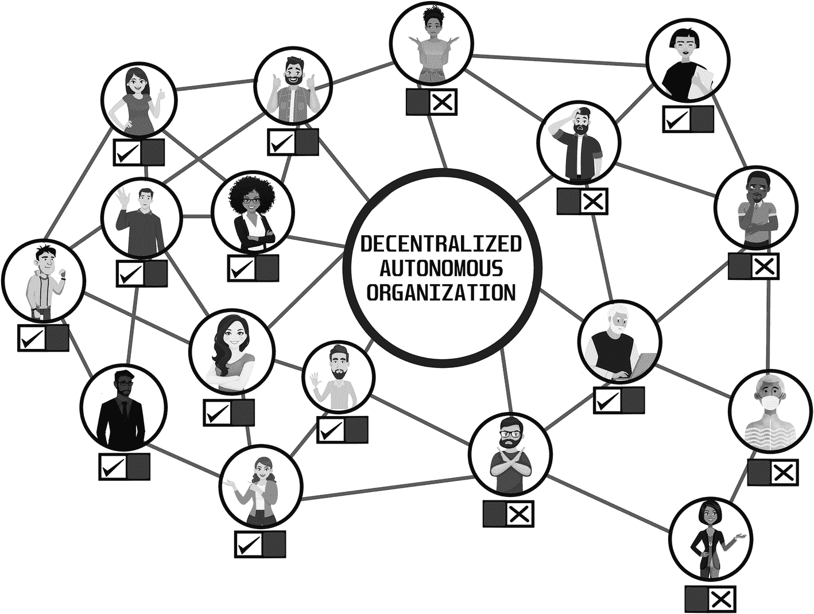

# 5. 去中心化金融的未来

想象一下，你可以无需与任何人交谈、甚至无需银行账户就能获得贷款。再想象一下，你的储蓄无需银行就能获得几个百分点的利息。这在去中心化金融的世界中是可能的。在本章中，我将带你了解去中心化金融的概念、其未来前景，以及它与传统金融世界的关系。我专门用一章来讨论这个主题，是因为我认为这一概念将在未来几年内以重大方式颠覆我们的生活。

让我们从一个能凸显传统金融问题、而去中心化金融（`DeFi`）可以解决这些问题的轶事开始本章。想象一下，在印度的一个小村庄里，有一位名叫拉维的年轻企业家。拉维对一项本地生意有一个绝妙的想法，这项生意有可能提升他整个社区的经济状况。他拥有知识、技能和热情，但缺乏启动创业所需的必要资金。

拉维决定向当地银行申请贷款。然而，他很快就遇到了障碍。银行要求提供大量文件、抵押品以及良好的信用记录——而这些拉维都没有。他确实拥有一小块土地，但这不足以满足银行的严格标准。尽管有可行的商业想法和偿还贷款的能力，但由于传统金融体系的局限，拉维无法获得他需要的资金。

现在想象一个替代场景，拉维生活在一个`DeFi`成为常态的世界里。在这个世界里，拉维可以利用区块链技术访问点对点借贷平台。他无需通过银行，而是可以直接与愿意出借资金的个人或实体建立联系。他的土地可以被代币化为数字资产，并用作抵押品。所有交易都将透明、安全且高效，成本更低，处理时间也比传统银行业务更快。

拉维的故事为我们探索去中心化金融奠定了基础。接下来，我们将深入探讨`DeFi`如何准备革新金融业，并有可能让像拉维这样的故事不仅成为可能，而且变得司空见惯。

## 传统金融的基础

在本章中，当我谈到传统金融时，我指的是存在多年的传统金融体系。这个体系是中心化的，意味着由少数机构和组织（如银行和政府）控制并监管。这些机构充当中间人，促进交易并维护金融活动的记录。它们在决策中也扮演着关键角色，例如设定利率和制定影响经济的政策。它们极其强大，而我个人并不确定这是否是件好事。

传统金融世界之所以强大，有几个原因。一个主要原因是它历史悠久，已经建立了几十年甚至几个世纪。这使它能够构建强大的基础设施，并确立其作为主要金融形式的地位。此外，传统金融通常有政府支持并受到监管，这使其在公众中具有一定程度的可信度和信任度。

传统金融世界强大的另一个原因是，它由银行、投资公司和保险公司等大型金融机构组成。这些组织拥有可观的资源，包括大量资本、先进技术和高技能人才。这使它们能够提供广泛的金融服务并主导金融格局。传统金融世界的另一个特点是高度中心化和控制。这主要是由于大多数金融机构由少数人控制，这些人往往背景和利益相似，这可能导致意见和决策的多样性不足。

我对传统金融的一个主要担忧是金融机构和政府当局可能存在的腐败和权力滥用。传统金融深受中央银行及其货币政策的影响，这可能导致通货膨胀和经济不稳定。中央银行有权控制货币供应量和利率，这会对经济以及个人和企业的生活产生巨大影响。

我想稍微详细讨论的一个话题是通货膨胀。通货膨胀是指一段时间内商品和服务价格水平的普遍上涨。当流通中的货币多于商品和服务的供应时，就会发生这种情况。结果，货币价值下降，商品和服务的价格上涨。例如，如果几年前一块面包的价格是`$0.75`，现在要`$2.50`，这就是通货膨胀的迹象。通货膨胀通过降低货币的购买力来影响人们，这意味着人们用同样的钱能买到的东西更少了。

通货膨胀也可能是一件好事，低而稳定的通货膨胀率允许货币价值逐渐下降，这可以鼓励消费和投资。这对于保持经济增长是有利的。然而，较高的通货膨胀率会导致财富从穷人转移到富人，因为它侵蚀了货币的购买力。当一个经济体中商品和服务的总体价格上涨时，每一单位货币的价值都会降低，这意味着人们用同样数量的钱能买到的商品和服务更少了。这对于依靠固定收入生活的人（如退休人员）或那些靠薪水度日的人来说尤其成问题，因为随着时间的推移，他们的钱能买到的东西会越来越少。

另一方面，那些拥有股票、房地产或大宗商品等资产的人往往会从通货膨胀中受益，因为他们的资产价值可能会以与通胀率相同甚至更快的速度增长。这导致富人财富增加，而穷人的购买力下降。总体而言，通货膨胀可被视为一种从穷人向富人的财富转移，因为它侵蚀了货币的购买力，使拥有资产或信贷渠道的人受益，同时伤害了依赖固定收入或资源有限的人群。

美国美元是通胀影响的一个很好的例证，其在近几十年来已丧失了大量的购买力。1971 年，一美元能买到的东西，到 2021 年需要 4.19 美元才能买到。这意味着，随着时间的推移，商品和服务的价格会上涨，一美元能买到的东西越来越少。这会对个人和企业产生重大影响，使他们更难负担生活必需品并为未来做规划。这就是为什么你会听到专家说通货膨胀是从穷人向富人的财富转移。请花点时间观察图 5-1，它说明了这一观点，我认为这一说法是公允的。中央银行在此过程中扮演着重要角色，因为它们负责控制货币供应量和制定货币政策，而这反过来又会影响通胀率。

一张信息图呈现了这样的观点：富人从穷人那里转移财富，从而变得更加富有。

图 5-1

通货膨胀：穷人的沉默窃贼

我谈及通货膨胀这个话题，是因为它突显了传统金融中的一个关键问题，而像比特币这样的加密货币正试图解决这个问题。当然，关于这个主题已有许多著作，所以我无意深入探讨。如果你对这个话题感兴趣并想了解更多，我推荐阅读德隆·阿西莫格鲁和詹姆斯·A·罗宾逊合著的《国家为什么会失败：权力、繁荣与贫困的起源》一书，该书探讨了国家成功与失败背后的原因。作者认为，决定一个国家成功或失败的关键因素是其政治和经济制度。他们认为，包容性的政治和经济制度为创新提供激励，并允许知识和思想的传播，这对于长期繁荣至关重要。相反，掠夺性制度将权力和财富集中在少数人手中，则会导致贫困和不发达。

## 去中心化金融：一种新的解决方案

让我们转换视角，探索一种有希望解决传统金融局限性的方案。去中心化金融是一种基于区块链技术的创新金融系统，能够实现无需中介的点对点交易。去中心化金融在没有中央权威或机构的情况下运行，而是依赖开源、透明且可访问的去中心化网络和协议。

聚焦于通货膨胀，比特币有可能解决传统金融引发的许多问题。比特币提供有限的供应量，上限为 2100 万枚，中央权威无法操纵。一个数学公式预先决定了新币的发行速度，从而创造了一个不受人为增加货币供应影响的系统，进而降低通胀并稳定货币价值。

此外，比特币的去中心化特性意味着它不受政府或中央权威的控制，使其不易受到政治驱动的通货膨胀影响。在传统金融中，中央权威可以增加货币供应量，导致货币贬值、价格上涨。相比之下，比特币的供应量不受中央权威影响，从而降低了通胀风险。

总之，采用比特币进行交易（将其用作货币）可以通过提供有限且不可篡改的供应量以及一个不受政治影响的去中心化系统，来对抗通货膨胀。

去中心化金融是加密货币领域内一个不断扩张的领域，旨在基于去中心化的区块链基础设施开发金融产品和服务。去中心化金融的基石是智能合约——一种将条款编码到其中的自动执行协议——它可以自动化金融交易和流程。

去中心化金融最流行的应用是创建借贷平台。这些平台使个人能够借出和借入加密货币资产，而无需银行等中介。智能合约自动执行贷款条款和还款计划，消除了借贷双方之间信任的需要。与传统的借贷系统相比，这带来了更高效、成本更低的借贷体验。去中心化金融还涵盖了保险、预测市场和资产管理，所有这些都由智能合约和区块链技术支持，提供了一个更透明、更安全的金融交易基础设施。这种颠覆性潜力不应被低估。

另一个流行的去中心化金融应用是去中心化交易所。这些加密货币交易所运行在去中心化的区块链基础设施上，允许点对点交易，无需中心化交易所等中介。去中心化交易所使用智能合约来自动执行交易并强制执行交易条款，从而提供一个更安全、更透明的交易环境。

然而，去中心化金融中的智能合约也带来了挑战和风险。确保智能合约的安全性和可靠性至关重要，因为一旦部署到区块链——一个去中心化的分布式账本——上的智能合约就无法被更改或删除，这使得修复错误和漏洞变得复杂。

可扩展性是另一个挑战。随着区块链交易量的增长，网络可能会变得拥堵，导致交易速度变慢和费用增加。这使得将智能合约用于大规模金融应用变得复杂。

## 深入解析 DeFi 中的稳定币

DeFi 面临的一个问题是，像比特币和以太坊这样的加密货币可能在短时间内出现显著的价格波动。这使得人们难以将其用于日常交易或金融服务，例如借贷或储蓄，因为其价值可能涨跌过快。

现在，请将稳定币想象成价值稳定的数字资产，就像您祖母钱包里的美元一样。它们的价值不会快速波动，因此非常适合在 DeFi 中使用。这些稳定币旨在保持价值稳定，通常是通过与美元等传统货币挂钩来实现。稳定币对 DeFi 世界至关重要，因为它们解决了价格波动的问题。通过使用稳定币，人们可以放心地使用 DeFi 服务，而不必担心数字资产价值意外涨跌。这种稳定性使得交易更加顺畅，也让人们更容易信任并使用 DeFi 来满足其财务需求。

因此，用简单的话来说，稳定币就像是保持价值稳定的数字美元，让人们可以更轻松、更安全地使用新的 DeFi 金融服务，而无需承担资产价值过快变化的风险。稳定币是一种旨在保持价值稳定的加密货币，通常通过与法定货币或黄金等大宗商品挂钩来实现。法定货币是一种依靠政府权威和信用背书的货币，而非像黄金或白银这样的实物资产。美元和欧元就是法定货币的例子。稳定币的理念在于提供加密货币的优势，例如快速且低成本的交易，同时避免像比特币这类加密货币常见的波动性。这使得稳定币更适合用于支付、汇款以及借贷等应用。

通过使用稳定币，您可以享受区块链技术带来的好处，如快速、低成本的交易，而无需承担价格剧烈波动带来的风险。这使得稳定币对于那些想要以加密货币形式储蓄，但又不愿承受其他加密货币所伴随的高风险的人来说，是一个实用的选择。

然而，也有人担心某些稳定币的稳定性，因为它们可能并非完全去中心化，并且容易受到操纵或失败的影响。此外，稳定币可能会受到监管机构的监督，这可能会限制其在某些司法管辖区的应用。稳定币面临的主要挑战之一是维持其稳定性。这可能在市场波动时期尤其困难。应对这一挑战的一种方法是为稳定币使用多种抵押品类型，例如法定货币、大宗商品或其他加密货币的组合。总体而言，稳定币是去中心化金融生态系统中一个重要且快速发展的方面，其作用和影响在未来很可能会继续演变。

两种使用最广泛的稳定币是 Tether（`USDT`）和 USD Coin（`USDC`）。

- **Tether（`USDT`）**：Tether 是一种与美元价值挂钩的稳定币。其主要目的是在波动的加密货币市场中提供一个稳定的价值储存手段。用户可以轻松地将他们的加密货币转换为 Tether 以避免价格波动。Tether 在保持价格稳定的同时，促进了加密货币与法定货币之间的无缝交易，使其在交易和对冲中广受欢迎。

- **USD Coin（`USDC`）**：USD Coin 是另一种与美元挂钩的稳定币，这意味着其价值保持在约 1 美元的相对稳定水平。由 Circle 和 Coinbase 创建，`USDC` 是基于以太坊区块链的 `ERC-20` 代币，确保了透明度和安全性。与 Tether 类似，`USDC` 为加密货币用户提供了一个稳定的价值储存手段，使他们能够保护资产免受市场波动的影响。它被广泛用于交易、跨境交易以及对稳定性至关重要的 DeFi 应用中。

这两种稳定币都充当了传统金融与加密货币世界之间的桥梁，在数字资产固有的价格波动中提供了一种稳定的交换媒介和价值储存手段。

## 去中心化自治组织

去中心化自治组织（DAO）是一个创新概念，它利用区块链技术创建了一种新型组织。与传统的中心化管理结构不同，DAO 通过去中心化的决策过程和编码在智能合约中的自动化规则来运作。这种方法带来了诸多好处，例如提高透明度和效率，并降低腐败或操纵的可能性。

DAO 在区块链网络上运行，区块链是一个去中心化的分布式账本，记录组织的所有交易和活动。区块链的安全性和不可篡改特性确保了 DAO 的数据和操作是不可篡改且可靠的。

DAO 的基础是一组智能合约，这些是自动执行的合约，其协议条款直接写入代码中。这些智能合约自动执行组织制定的规则和协议，从而无需中介或人工干预即可无缝、高效地执行任务。

在 DAO 中，决策过程是去中心化的，通常涉及一个由利益相关者组成的社区。这些利益相关者可以包括代币持有者，他们持有代表组织内所有权或投票权的数字代币。利益相关者有权对提案进行投票，例如更改组织规则或资金分配，并集体做出决策。这种去中心化的治理机制确保没有任何单一实体能够控制整个组织，从而营造出更加民主和公平的环境。

DAO 的一些关键特性包括：

- **基于代币的治理**：DAO 通常会发行代表所有权或投票权的代币。这些代币常被用来激励参与治理过程，并使利益相关者的利益与组织的成功保持一致。

- **透明的决策**：DAO 内的所有决策、交易和活动都记录在区块链上，确保了完全的透明度和可追溯性。这种开放性使利益相关者能够监督组织的行动，并让决策者承担责任。

- **自动化流程**：通过使用智能合约，DAO 可以自动化各种组织任务，例如管理资金、分配奖励或执行决策。这种自动化减少了对人工干预的需求，并降低了错误或欺诈的风险。

- **去中心化治理**：DAO 依赖其利益相关者的集体智慧来做决策。这种去中心化的方法可以带来更多样化和包容性的决策，因为它汲取了广泛个体的专业知识和观点。

总而言之，DAO 是一种在区块链网络上运行的数字组织，它使用智能合约来实现流程自动化和规则执行。决策由一个去中心化的利益相关者社区通过透明的治理机制做出，这可以带来更民主、高效和安全的组织结构。DAO 的创新之处在于，它们利用区块链技术创建了去中心化、自治且透明的组织。它们能够实现全球参与，提供可编程的激励机制，并具有灵活性和适应性来服务于各种目的。此外，它们还受益于区块链网络固有的增强安全措施。

DAO 在 DeFi 生态系统中扮演着重要角色，因为它们为许多 DeFi 项目提供了治理框架。去中心化是 DeFi 的关键特征，而 DAO 通过确保协议更新、资金分配等决策由代币持有者社区集体做出（而非中心化机构），促进了这一特征的实现。这种去中心化治理与 DeFi 的核心原则相一致，推动了金融服务领域的透明性、去信任化和可访问性。因此，DAO 常常处于 DeFi 项目的核心位置，助力创建并维护一个公平包容的金融体系。

DAO 的一个现实案例是 The DAO，它于 2016 年成立，是一个去中心化的风险投资基金。The DAO 的成员可以提议并对区块链项目的投资进行投票，组织资金会分配给获得票数最高的提案。The DAO 运行在以太坊区块链上，并使用以太坊原生加密货币 Ether 来资助其运营。成员可以用 Ether 购买该组织的股份，作为回报，他们有权获得 DAO 所投资项目产生的部分利润。

如图 5-2 所示，这种去中心化的 DAO 组织结构之所以强大，是因为它允许以更透明、更民主的方式进行决策和资源分配。在传统组织中，决策权往往集中在少数个人或单一领导者手中，这可能导致腐败、效率低下和问责缺失等问题。

一幅去中心化自治组织的信息图展示了不同的用户，他们通过勾选标记或叉号标记相连。

**图 5-2**

去中心化控制：解读加密 DAO

而在 DAO 中，决策通过基于共识的流程做出，所有成员对组织发展方向拥有同等发言权。这能实现更高效、更公平的资源分配，也使得任何个人或团体更难滥用权力。

目前已经有一些成功的 DAO（去中心化自治组织）实例正在解决现实问题。最知名的例子之一是 Aragon 的 DAO，这是一个用于创建和管理去中心化组织的平台。Aragon DAO 被广泛应用于多种场景，从管理在线社区到资助初创企业和社会项目。

另一个成功的 DAO 实例是 MolochDAO，这是一个投资以太坊项目的去中心化风险基金。MolochDAO 通过投票系统决定投资项目，DAO 成员拥有平等的投票权。

此外，还有一些专注于治理的 DAO，例如 MakerDAO。这是一个使用稳定币 DAI 的去中心化借贷平台。MakerDAO 通过去中心化投票系统对平台运营做出决策，MKR 代币持有者有权对提案进行投票。

总体而言，DAO 有潜力彻底改变组织的构建和运营方式，实现更高的透明度、问责制和民主决策。随着更多成功的 DAO 实例涌现，我们很可能会看到它们在更广泛的行业和应用中得到采用。

总之，DAO，即去中心化自治组织，是一种基于区块链技术运行的数字组织，受智能合约编码规则约束。它被视为去中心化金融的关键组成部分，因为它无需中心化机构，即可实现去中心化的决策和资金管理。

## 探索 DeFi 监管格局

去中心化金融（DeFi）经历了指数级增长，颠覆了传统金融体系，并为借贷、交易和投资提供了创新替代方案。随着 DeFi 生态系统的扩张，全球监管机构正密切关注其发展。在这篇简短的探讨中，我将分析探索 DeFi 监管格局的复杂性，重点关注监管机构面临的挑战，以及 DeFi 项目如何在这一不断变化的环境中适应并蓬勃发展。

由于 DeFi 日益显著的 prominence 和独特特征，监管机构正对其保持密切关注。去中心化金融（DeFi）的监管格局不断变化，各国政府和监管机构正努力理解和应对这项新兴技术带来的挑战。

DeFi 给监管机构带来了独特的挑战，包括：

1.  *去中心化*：去中心化是 DeFi 的显著特征，使其能够在没有中心化机构的情况下运行。这使得监管机构难以向个体参与者分配责任并强制执行监管规定。

2.  *跨境交易*：DeFi 的全球覆盖范围意味着交易常常跨越司法管辖区边界，进一步增加了监管流程的复杂性。

3.  *快速的技术演进*：DeFi 领域不断发展，新的项目、平台和代币层出不穷。这使得监管机构难以跟上最新发展步伐并制定恰当的监管规则。

4.  *匿名性与隐私*：DeFi 平台通常优先考虑用户隐私，并允许匿名交易，这可能导致监管机构难以执行反洗钱（AML）和了解你的客户（KYC）要求。

DeFi 的监管状态在不同国家差异显著。在某些司法管辖区，DeFi 项目基本不受监管，处于法律灰色地带。而在另一些国家，政府已出台具体法规，甚至全面禁止某些 DeFi 活动。

随着 DeFi 的普及度和使用率持续提升，预计监管机构将进一步调整其策略，以在保护消费者和鼓励创新之间取得平衡。这可能包括加强对 DeFi 项目和交易所的监督、更严格的 KYC 和 AML 要求，以及针对各类 DeFi 活动法律地位的更多指导。

DeFi 监管格局的一个潜在发展趋势是行业内自发监管组织（SRO）的出现。这些 SRO 由行业参与者组成，旨在制定并推行行业范围内的标准和最佳实践。它们有可能获得政府监管机构的认可和批准，从而应对 DeFi 带来的一些监管挑战。

截至 2023 年第一季度，不同国家和地区的 DeFi 法规各不相同。一些监管机构（如美国）采取了不干预的方式，允许行业在最低限度干预下发展。相比之下，其他国家（如中国）则采取了更强硬的手段，对 DeFi 项目和活动进行严厉打击。

总之，DeFi 的监管格局复杂且不断演变。DeFi 监管的未来可能受到行业增长、区块链等技术进步以及全球政府和监管机构行动等因素的影响。随着监管机构努力在促进创新与保护消费者之间寻求平衡，我们可以预期法规将持续变化。

在未来几年，对于 DeFi 项目而言，及时了解监管变化、与监管机构合作并实施最佳实践以确保合规将至关重要。通过这样做，DeFi 项目可以展示其在法律框架内运营的承诺，并为行业的可持续发展做出贡献。

此外，DeFi 领域的利益相关者，包括用户、开发者与投资者，必须了解监管环境及其对他们活动的影响。这种认识将使他们能够做出明智的决策，最大程度地降低潜在风险，并以负责任的态度参与 DeFi 生态系统。

随着全球各国政府和监管机构持续适应 DeFi 带来的挑战，该行业将不可避免地面临新的障碍与机遇。通过保持信息灵通、适应性强和积极主动，DeFi 项目可以成功驾驭监管环境，并为去中心化金融领域的持续演进贡献力量。

## DeFi 的颠覆性潜力

去中心化金融（DeFi）有潜力在多个方面颠覆我们的世界。其中最重要的潜在颠覆之一是金融服务获取的民主化。借助 DeFi，个人和小型企业能够获得传统上仅对大机构和富裕人士开放的相同金融产品和服务。这有助于创造公平的竞争环境，并促进更广泛的金融包容性。

DeFi 带来的另一个潜在颠覆是绕开传统中介机构（如银行和其他金融机构）的能力。在去中心化的金融体系中，交易可以直接在双方之间进行，无需中介充当守门人或抽取交易佣金。这有助于降低成本并提高效率。它还有潜力促进金融交易的更高透明度和问责制。在去中心化系统中，所有交易都记录在公开可查的账本上，任何人都能访问。这有助于增强信任，并降低欺诈或其他形式不当行为的风险。

最后，DeFi 有潜力催生新的金融创新形式。通过使用智能合约，开发人员可以在几分钟内创建并推出新的金融产品和服务，而非传统金融所需的数月甚至数年。这有助于推动金融领域的创新并促进竞争。DeFi 有潜力创造一个更包容、高效、透明且创新的金融体系。尽管仍有许多挑战需要克服，例如监管不确定性以及提升安全性和可扩展性的需求，但 DeFi 的潜在益处使其成为一个在未来几年值得关注的领域。随着 DeFi 生态系统的不断发展和成熟，我们可以期待看到越来越多基于区块链技术的新颖创新型金融产品和服务。

去中心化金融（DeFi）的未来潜力巨大且发展迅速。随着越来越多的人认识到 DeFi 的优势以及传统金融的局限性，DeFi 产品和服务的市场预计将经历显著增长。

DeFi 很可能出现显著增长的一个领域是借贷。去中心化的借贷平台，如`Aave`、`Compound`和`MakerDAO`，已经允许创建去中心化的金融产品和服务。这些平台提供了传统借贷平台所不具备的透明度和安全性。它们还让信贷的获取更加便捷，因为没有信用检查或最低要求。

DeFi 预计将出现显著增长的另一个领域是数字资产领域。去中心化交易所（DEX），如`Uniswap`和`SushiSwap`，允许在没有中央中介的情况下交易数字资产。这有可能极大地增加数字资产市场的流动性，并为更广泛的投资者提供更大的可及性。此外，还有关于去中心化保险平台发展的预测，这些平台将提供传统保险平台所不具备的透明度和安全性。

总体而言，DeFi 的未来前景光明，预计随着越来越多的人认识到去中心化金融的优势，市场将继续增长和演变。DeFi 面临的最大挑战之一，是挑战对金融业拥有控制性影响的传统金融的主导地位。随着市场的发展，我们可以预期会出现新的创新型 DeFi 产品和服务，这将进一步颠覆传统金融世界。

## 如何开始使用 DeFi

如果你有兴趣自己开始使用 DeFi，可以按照以下步骤操作：

1.  `获取加密货币`：访问 DeFi 的第一步是获取加密货币。大多数 DeFi 协议需要使用加密货币进行交易，因此如果你还没有，就需要购买一些。你可以在加密货币交易所用法币购买加密货币，或用你已有的其他加密货币进行兑换。DeFi 中常用的一些流行加密货币包括以太坊（`ETH`）、比特币（`BTC`）和`DAI`。

2.  `设置钱包`：拥有加密货币后，你需要一个钱包来存储它。DeFi 钱包是一种软件程序，可以让你安全地存储和管理你的加密货币。有多种类型的钱包可用，包括硬件钱包、软件钱包和浏览器扩展程序。一些流行的 DeFi 钱包包括`MetaMask`、`Ledger`和`Trezor`。我将在后续章节中更详细地解释加密钱包。设置好钱包后，你需要将加密货币从交易所转移到你的钱包中。

3.  `将钱包连接到 DeFi 平台`：要访问 DeFi，你需要将钱包连接到一个 DeFi 平台。有多个 DeFi 平台可用，包括去中心化交易所（DEX）、借贷平台和收益耕作协议。每个平台都有其自己的用户界面和一套连接钱包的说明。一些流行的 DeFi 平台包括`Uniswap`、`Aave`和`Compound`。

4.  `选择 DeFi 协议`：将钱包连接到 DeFi 平台后，你需要选择一个要使用的协议。有多种 DeFi 协议可用于交易、借贷、出借或赚取加密货币利息。每个协议都有自己的一套规则和费用，所以在选择之前务必做好研究。一些流行的 DeFi 协议包括`Balancer`、`Curve`和`Yearn Finance`。

5.  `开始使用 DeFi`：选择协议后，你就可以开始使用 DeFi 来交易、借款、出借或赚取加密货币利息了。每个协议都有其自己的用户界面和一套使用其服务的说明，所以请务必仔细阅读文档。请记住，DeFi 仍然是一个相对较新的领域，存在诸如智能合约漏洞、市场波动性和流动性问题等风险。在参与任何 DeFi 活动之前，务必做好研究并了解相关风险。

总体而言，开始使用 DeFi 需要一些初始设置以及对加密货币和区块链技术的熟悉。然而，DeFi 可以提供广泛的金融服务和投资机会，其潜在回报可能高于传统金融。通过遵循这些步骤，你可以开始探索激动人心的 DeFi 世界，并掌控自己的财务。

