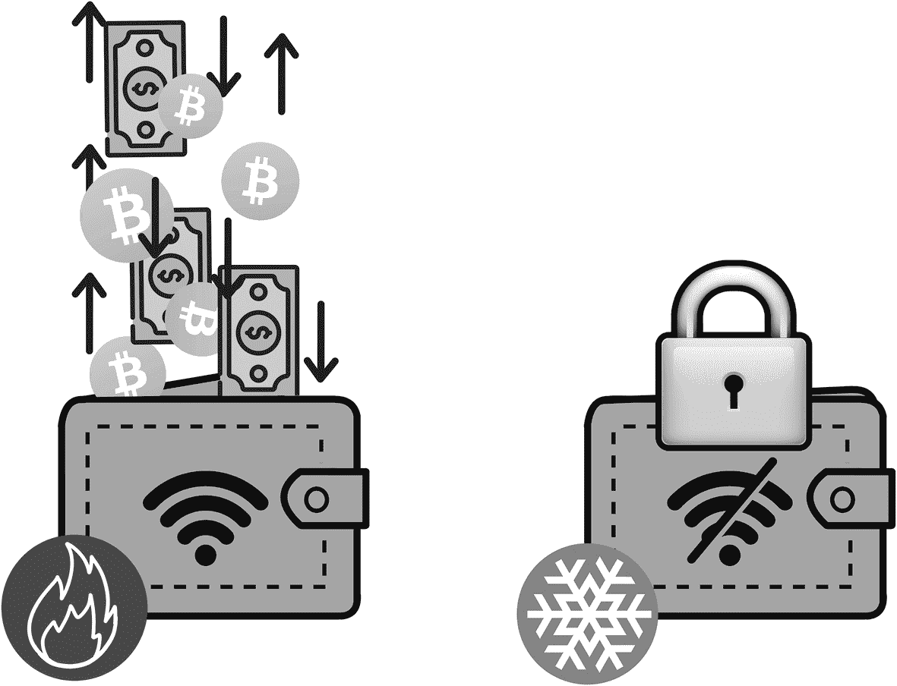

# 6. 安全与诈骗

在加密货币的世界里，安全是重中之重。数字资产面临着被黑客攻击、盗窃和诈骗的风险，这可能导致巨额资金的损失。在传统金融领域，如果你成为欺诈或盗窃的受害者，通常可以向银行或信用卡公司提出异议以追回资金。然而，在加密货币的世界中，没有中央机构来监督交易或提供退款。加密货币是去中心化的，这意味着没有像银行或政府这样的中央机构来控制它们。相反，交易是在一个去中心化的公共账本上进行验证和记录的。

本章关于安全与诈骗的内容，将探讨各类加密货币诈骗、与黑客攻击相关的风险，以及保护你资产的策略。通过了解风险并采取适当的预防措施，你可以确保你的加密货币投资保持安全。本章的目标是让你理解加密领域的**安全风险**，以及如何保护自己免受潜在损失。

## 加密货币诈骗的类型

加密货币的世界充满了潜在的投资和增长机会，但也伴随着其自身的一系列风险和挑战。对于参与加密领域的个人和机构而言，一个主要担忧是诈骗和欺诈活动的盛行。在本节中，我将探讨加密货币世界中存在的各类诈骗，并探索如何保护你和你的资产免受这些欺诈计划的侵害。

*网络钓鱼诈骗*：网络钓鱼诈骗是网络犯罪分子用来获取个人信息和窃取资金的常用手段。这类诈骗通常涉及一封看似来自合法来源（如交易所或钱包提供商）的电子邮件或消息，要求提供敏感信息，如登录凭据或私钥。这些诈骗通常使用紧急的语言和施压策略来诱使个人泄露信息。为了保护自己免受网络钓鱼诈骗，在提供个人信息之前，务必核实任何消息或电子邮件的真实性，并且切勿点击来自未知来源的链接或下载附件。

*虚假首次代币发行（ICO）*：`ICO` 是首次代币发行的缩写。这是一种区块链初创公司使用的筹款方法，它们通过向投资者发行新的加密货币或代币，以换取现有的加密货币（如 `Bitcoin` 或 `Ethereum`）或法定货币，从而为其项目筹集资金。`ICO` 已成为区块链项目筹集资金的热门方式，但也成为了欺诈者的目标。虚假 `ICO`，也称为“诈骗 `ICO`”，是指那些打着即将进行 `ICO` 的幌子，从投资者那里收集资金，但实际上从未推出任何功能性产品或服务的欺诈项目。这类诈骗可能难以识别，但危险信号包括：不切实际的回报承诺、缺乏清晰的商业计划或团队、没有白皮书或其他文档。在投资任何 `ICO` 之前，务必进行自己的研究，并对任何可疑活动保持警惕。

2017 年，一家名为 `Prodeum` 的公司为一个声称将彻底改变果蔬行业的区块链平台发起了首次代币发行（`ICO`）。投资者对利用区块链追踪和验证农产品来源与质量的前景感到兴奋，`Prodeum` 在短短几天内就筹集了超过 1100 万美元。但在 `ICO` 启动后的几个小时内，`Prodeum` 网站连同公司的社交媒体账户和投资者的资金一同消失。取而代之的只有一个词：“penis。”

`Prodeum` 骗局凸显了在基本不受监管的加密货币和区块链初创公司世界中投资所面临的风险和挑战。虽然这些技术提供了巨大的创新和颠覆潜力，但它们也吸引了那些试图利用炒作和兴奋情绪的欺诈者和骗子。

*拉高出货计划*：拉高出货是一种市场操纵行为，由一个群体或实体通过协调买入和推广某币种来人为抬高其价格。然后，该群体在价格不可避免地暴跌之前，通过以人为抬高的价格出售其所持资产来获利。这类计划可能难以察觉，但重要的是要了解它们，并避免买入那些出现突然且无法解释的上涨的加密货币。以下是拉高出货骗局在加密货币市场中可能如何运作的一个例子：

1.  骗子们会选择一种价格低、交易量小且市值较低的加密货币，这样更容易操纵其价格。加密货币的低市值意味着该加密货币所有流通币或代币的总价值相对较小。
2.  诈骗者开始在社交媒体平台和论坛上散布关于该加密货币的谣言和虚假信息，将其吹捧为“下一个大事件”，或就合作关系或即将发布的公告做出虚假声明。
3.  这会在该加密货币周围制造热度，吸引毫无戒心的投资者相信这种炒作并开始购买该加密货币，从而推高价格。
4.  随着加密货币价格开始上涨，诈骗者开始抛售自己持有的资产，利用高价迅速获利。
5.  一旦诈骗者抛售完持有的资产，他们便停止推广该加密货币，价格开始下跌。这引发其他投资者的恐慌性抛售，他们开始抛售自己的资产，导致价格进一步暴跌。
6.  最终结果是诈骗者获利，而其他投资者则蒙受损失。

意识到这些类型的骗局非常重要，并且在投资任何加密货币之前，务必自行进行研究。如果某件事听起来好得令人难以置信，那它很可能就是假的。此外，明智的做法是避免听从社交媒体上陌生人的建议，并在做出投资决策时坚持使用可靠的信息来源。

*退出骗局*：退出骗局发生在一个项目或公司突然消失，并卷走投资者资金的时候。这类骗局在首次代币发行（`ICO`）领域尤为普遍，可能发生在项目或公司从未打算交付功能性产品或服务的情况下。在投资任何项目之前，务必进行尽职调查，并意识到有些项目可能并不合法。

*庞氏骗局*：庞氏骗局是一种投资骗局，其回报是使用新投资者投入的资金支付给现有投资者，而非来自运营方赚取的利润。加密领域的庞氏骗局通常承诺高回报且几乎没有风险，并可能使用推荐奖励和奖金等策略来吸引新投资者。对于任何听起来好得令人难以置信的投资机会，务必保持警惕，并在投入任何资金之前对所有潜在投资进行彻底研究。

一个导致投资者遭受重大损失的知名加密货币欺诈案例是 `BitConnect`。`BitConnect` 是一个加密货币借贷和交易平台，承诺投资可获得高回报。该平台从 2016 年运营至 2018 年，以高达每日 1% 的回报承诺吸引了许多投资者。

然而，在 2018 年 1 月，`BitConnect` 突然关闭其借贷平台，其加密货币 `BCC` 的价值在数小时内从超过 400 美元暴跌至不到 10 美元。许多投资者损失了大量资金，有人估计总损失高达 27 亿美元。

对 `BitConnect` 的调查显示，该公司在运营一个庞氏骗局，其回报是使用新投资者的资金支付给早期投资者，而非来自实际利润。`BitConnect` 的运营者最终被指控犯有证券欺诈和其他罪行，但那些损失了资金的投资者几乎无法追回他们的资金。

这个案例是众多关于投资加密货币风险的警示故事之一，尤其是在那些承诺高回报或使用复杂金融安排的平台或项目中。投资者在投入资金之前，务必彻底研究任何加密货币投资，并了解其中涉及的风险。

总之，加密货币世界充满了众多机遇，但也伴随着潜在风险。了解加密领域中存在的不同类型的骗局，并采取措施保护自己和自己的资产非常重要。这包括彻底研究任何潜在投资，警惕不切实际的回报承诺，并且绝不向未知方透露个人信息或资金。此外，及时了解加密领域的最新发展和监管动态，将帮助您保持安全并做出明智的决策。

## 加密货币黑客攻击的风险

加密货币的兴起为投资者和数字资产持有者带来了一系列新的风险。其中最大的风险之一是黑客攻击，这可能导致资金和个人信息丢失。加密货币黑客攻击有几种不同类型，包括钱包黑客攻击、交易所黑客攻击和智能合约漏洞。

加密货币钱包是一种软件程序，允许用户安全地存储、管理和转移他们的加密货币。不幸的是，就像传统金融账户一样，加密货币钱包也可能成为黑客的目标，他们试图窃取其中存储的资金。这被称为钱包黑客攻击。钱包黑客攻击可通过多种手段发生，包括网络钓鱼诈骗、恶意软件和社会工程攻击。例如，在网络钓鱼诈骗中，攻击者可能会创建一个看起来与合法钱包登录页面一模一样的虚假登录页面。当用户输入其登录凭证时，攻击者便可窃取这些凭证，并用其访问用户的钱包。

为了保护自己免受钱包黑客攻击，您可以采取几项预防措施。首先，务必为钱包登录使用强大且唯一的密码，并避免在多个账户中使用相同的密码。此外，可以使用双因素认证（`2FA`）来提供额外的安全层，要求用户在输入密码之外再输入一个唯一代码才能访问其钱包。

交易所黑客攻击发生在攻击者获得加密货币交易所的访问权限并窃取其存储的资金时。这可以通过多种手段发生，包括网络钓鱼诈骗、恶意软件和社会工程攻击。用户可以通过使用强大、唯一的密码和双因素认证，以及将资金存放在个人钱包（而非交易所）中来保护自己免受交易所黑客攻击。

智能合约漏洞发生在发现智能合约代码中存在漏洞时，这使得攻击者能够窃取或操纵存储在合约中的资金。这可以通过多种手段发生，包括编码错误、合约设计缺陷以及恶意代码注入。用户可以通过在参与前彻底研究和理解智能合约，以及向合约开发者报告任何潜在漏洞来保护自己免受智能合约漏洞的危害。

总体而言，加密货币黑客攻击的风险可能很严重，但通过采取适当的预防措施并保持警惕，用户可以最大程度地降低风险并保护其资产。充分了解加密领域不同类型的黑客攻击和骗局，并始终了解当前的威胁态势非常重要。此外，定期审查和更新安全措施，并报告任何可疑活动也至关重要。

## 保护资产的策略

在加密货币世界中，保护资产至关重要。由于数字货币的价值波动剧烈，采取措施确保投资安全十分关键。在本章中，我将探讨在加密货币世界里保护资产的策略。

保护资产最重要的一步是选择一个安全的钱包。务必选择一个信誉良好且在安全性方面有可靠记录的钱包。一些热门选择包括硬件钱包（用于离线存储私钥）和软件钱包（可通过移动设备或电脑访问）。研究不同选项并选择最适合你需求和安全性级别的钱包十分重要。

另一个保护资产的重要策略是确保私钥安全。私钥是让你能够访问加密货币的代码，必须始终安全保存。可以通过离线存储、手写在纸上或使用硬件钱包来实现。切记永远不要与任何人分享你的私钥，因为私钥可被用来访问并窃取你的加密货币。

关注安全更新和警报也是保护资产的关键步骤。加密货币世界日新月异，随时可能出现新的威胁。通过保持信息灵通，你可以在问题发生前采取措施保护自己和资产。可以通过订阅安全简报、关注相关社交媒体账号，以及随时了解钱包或交易所的最新安全更新来做到这一点。

最后，警惕网络钓鱼攻击对于保护资产至关重要。网络钓鱼是一种诈骗手段，欺诈者会冒充可信来源，试图窃取登录凭证或私钥等个人信息。为保护自己，要警惕主动发来的电子邮件或消息，切勿点击来自未知来源的链接。此外，务必使用双重身份验证，并在输入任何敏感信息前仔细核实网站 `URL`。

遵循这些保护资产的策略，你就能在加密货币世界中采取措施确保投资安全。记住要时刻保持警惕、了解最新信息，并采取必要行动来保护资产安全。

## 在加密领域保持安全

学习如何保护你的加密资产极其重要。主要原因在于其去中心化特性：加密资产是去中心化的，这意味着它们不受政府或金融机构的背书。这意味着一旦你的资产被盗或丢失，可能无法找回。我认为这一点需要彻底明确。

在加密货币领域保护资产时，你可以采用多种策略来降低风险并确保投资安全。最重要的一步是选择一个能保护私钥、防止黑客攻击的安全钱包。

另一个重要策略是关注安全更新和警报，以便能快速应对任何潜在的漏洞或威胁。这包括监控主流加密货币交易所和平台的最新安全新闻与更新，同时留意黑客或钓鱼攻击的任何预警信号。

使用硬件钱包也可有效保障资产安全，这类专用设备通过离线存储私钥来提供额外安全层。此外，使用双重身份验证（`2FA`）也有助于保护资产，要求你在密码之外再提供一层认证才能访问钱包。

另一个可考虑的策略是限制单个钱包中存储的加密货币数量。这有助于在钱包被入侵或黑客攻击时降低风险。此外，分散投资组合也有益处，因为这能分散风险，降低单一投资可能带来的影响。

目前有几种类型的加密钱包可供选择，每种都有其优缺点。三种主要类型是热钱包、冷钱包和纸钱包。

热钱包（也称在线钱包或移动钱包）存储在与互联网连接的设备上。这类钱包易于访问，便于日常交易，但面临较高的黑客攻击或恶意软件攻击风险。热钱包的例子包括`MyEtherWallet`、`MetaMask`和`Coinbase Wallet`。

冷钱包（也称硬件钱包）是将私钥离线存储的物理设备。这类钱包被认为是最安全的钱包类型，因为它们不连接互联网，因此不易受到黑客攻击。请参考图 6-1，这张清晰的图示展示了热钱包与冷钱包之间的关键区别。

两张关于热钱包和冷钱包的信息图。冷钱包离线存储信息，是最安全的。热钱包中的数据可在线访问。

图 6-1
热钱包与冷钱包：加密钱包说明

纸钱包是一种冷钱包，用户的私钥打印在一张纸上。这被认为是一种非常安全的选择，因为密钥不是数字存储的，但务必注意纸张免受物理损坏或丢失。

在选择加密钱包时，要考虑你的具体需求和对安全性的要求。热钱包非常适合日常交易且易于使用，但可能不是长期存储大量加密货币的最佳选择。冷钱包提供最高级别的安全性，但日常使用可能不太方便。纸钱包是长期存储的好选择，但需要完善的物理安全保管。

总之，你选择的加密钱包类型将取决于你的具体需求和安全等级。在做出决定之前，务必研究并比较不同的可用选项。

## 选择并确保加密钱包的安全

在选择加密钱包时，为了确保您选到安全可靠的选项，有几个因素需要考虑。这些重要因素包括：

- **安全特性**：寻找提供双重身份验证和多重签名支持等功能以增强安全性的钱包。
- **易用性**：确保钱包易于使用且导航方便。
- **对不同加密货币的兼容性**：确保您选择的钱包与您计划存储的特定加密货币兼容。
- **声誉**：研究钱包提供商的声誉，并阅读其他用户的评价，以了解他们的使用体验。
- **支持服务**：考虑钱包提供商在您遇到问题或需要帮助时提供的支持水平。

一些流行且信誉良好的钱包包括硬件钱包中的 `Ledger` 和 `Trezor`，热钱包中的 `MyEtherWallet` 和 `MetaMask`，以及纸钱包中的 `Bitcoinpaperwallet` 和 `Walletgenerator`。在做出决定之前，自行研究并比较不同的可用选项至关重要。

总而言之，在选择加密钱包时，必须考虑安全特性、易用性、兼容性、声誉和支持服务等因素，以确保为您数字资产选择一个安全可靠的选项。

## 保护您的加密钱包安全

一旦您选择了加密钱包，采取步骤保持其安全以保护您的数字资产就很重要。以下是一些保护加密钱包安全的最佳实践：

- **使用强且唯一的密码**：避免使用易猜或常见的词语，并混合使用字母、数字和特殊字符。
- **启用双重身份验证**：这通过要求第二种形式的身份验证（例如指纹或发送到手机的验证码）来增加一层额外的安全。
- **保持设备和软件更新**：这将确保您拥有最新的安全补丁和功能来保护您的钱包。
- **警惕网络钓鱼**：小心那些索要您的私钥或助记词的网络钓鱼电子邮件或信息。合法的钱包提供商绝不会要求您提供这些信息。
- **将助记词存放在安全的地方**：您的助记词是您私钥的备份，应保存在安全位置，例如保险箱或密码管理器。
- **保持私钥私密**：不要与任何人分享您的私钥，也切勿将其存储在连接互联网的设备上。

总而言之，保护加密钱包安全对于保护您的数字资产至关重要。通过使用强密码、启用双重身份验证、保持设备和软件更新、警惕网络钓鱼、将助记词存放在安全的地方以及保持私钥私密，您可以大大降低资产受损的风险。

归根结底，在加密领域保持安全需要结合仔细的研究、风险管理和警觉性。通过遵循最佳实践并随时了解最新的安全更新和警报，您可以帮助确保您的资产得到保护，您的投资安全无虞。

## 保护您的加密资产：最终思考

总结来说，本章探讨了加密货币领域中存在的各种类型的骗局和黑客攻击风险。从网络钓鱼骗局和庞氏骗局到钱包和交易所黑客攻击，很明显，加密市场中的投资者面临着许多潜在的威胁。然而，通过了解这些风险并采取措施保护您的资产，您可以大大降低成为欺诈或黑客攻击受害者的几率。

保护资产的关键策略之一是选择一个安全的钱包、确保您的私钥安全、并随时了解安全更新和警报。使用硬件钱包、实施双重身份验证以及限制存储在单个钱包中的加密货币数量也是重要的步骤。分散您的资产组合同样重要，以分散风险并抵御市场波动。

在加密领域保持信息灵通和警惕也很重要。这包括在投资前研究项目和团队，避免风险高或未经证实的项目，并遵循风险管理的最佳实践。通过保持信息灵通和警惕，您可以做出更明智的决策，并保护自己免受潜在的欺诈或黑客攻击。

总体而言，本章强调了安全的重要性以及在加密领域保持信息灵通和警惕的必要性。通过了解风险并采取措施保护资产，投资者可以大大降低成为欺诈或黑客攻击受害者的几率。然而，保护您的加密货币不仅仅涉及在有生之年防范黑客和盗窃——提前规划好您去世后加密货币的处理方式也同样重要。如果您没有相应的计划，您的加密货币可能会丢失或让继承人无法访问，因此采取措施确保您的数字资产得到妥善处理至关重要。

提前规划您加密货币的一种方法是将其纳入您的遗产规划。您可以与律师或财务顾问合作，创建一份遗嘱或信托，其中包含关于您去世后加密货币应如何分配的说明。提供关于如何访问和转移您的加密货币的清晰指令（包括任何必要的密码或私钥）非常重要。另一种选择是使用加密货币继承服务，这可以提供一种安全且简单的方式将您的数字资产传递给继承人。这些服务通常要求您创建计划并提供关于加密货币应如何分配的指示，它们还可能为您的私钥和密码提供安全的存储选项。

确保您的继承人了解您的加密货币持有情况以及如何访问它们也是一个好主意。这可能涉及向他们传授加密货币的基础知识，并提供访问您钱包或账户的指示和途径。您可能还想考虑创建一个“数字遗产计划”，其中包含您所有数字资产的信息，包括加密货币、社交媒体账户和其他在线账户。

总而言之，提前规划您的加密货币是确保数字资产安全的重要组成部分。通过将加密货币纳入您的遗产规划、使用加密货币继承服务以及教育您的继承人如何访问您的数字资产，您可以确保您去世后您的加密货币得到妥善处理。