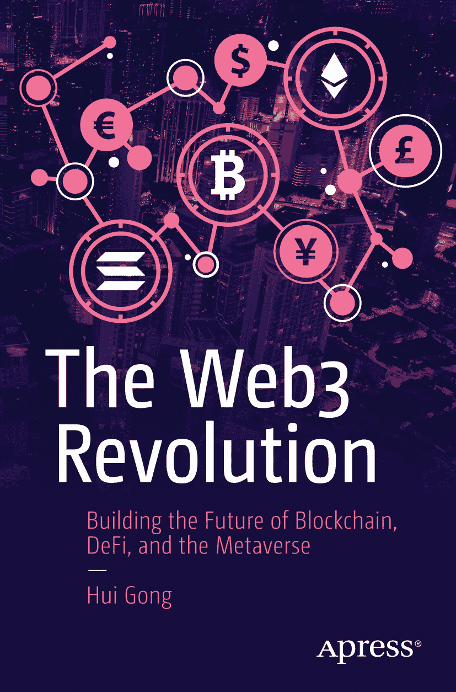

ISBN 979-8-8688-0490-8
e-ISBN 979-8-8688-0491-5
[`doi.org/10.1007/979-8-8688-0491-5`](https://doi.org/10.1007/979-8-8688-0491-5)

© 龚晖 2024
本作品受版权保护。无论全部还是部分内容，其所有权利均独家授权给出版商，具体包括翻译权、重印权、插图重用权、朗诵权、广播权、以缩微胶片或任何其他物理形式复制的权利，以及传输或信息存储与检索、电子改编、计算机软件或现在已知或未来开发的任何相似或不相似方法的权利。在本出版物中使用通用描述性名称、注册商标、商标、服务标记等，即使未明确声明，也不意味着这些名称不受相关保护性法律和法规的约束，因此可自由用于一般用途。出版商、作者和编辑假定本书中的建议和信息在出版之日是真实准确的。出版商、作者或编辑均不对本材料中包含的内容或可能存在的任何错误或遗漏提供明示或暗示的担保。出版商对已出版地图和机构隶属关系中的管辖权主张保持中立。

本 Apress 印记由注册公司 APress Media, LLC（斯普林格自然集团的一部分）出版。

注册公司地址为：美国纽约州纽约市新广场 1 号，邮编 10004。

*本书献给我的儿子，龚天逸。*

## 引言

在数字创新不断演变的格局中，《Web3 革命》描绘了一幅从区块链技术理论基础到其在当今数字世界实际应用的全面图景。这本书的编写不仅是为了提供指南，更是为了搭建一座桥梁，将去中心化、密码学和智能合约的复杂机制与其有望重新定义我们数字社会结构的实际应用连接起来。

当我们深入探究 Web3 的复杂世界时，我们探讨了这些技术如何不仅仅是技术进步，更是促进权力从中心化实体向个人和社区转移的变革性工具。每一章都系统地展开，从以比特币和以太坊为代表的区块链技术基础开始，贯穿非同质化代币（NFTs）、去中心化自治组织（DAOs）以及蓬勃发展的去中心化金融（DeFi）领域的细微差别。

本书旨在服务于技术行业的新手和经验丰富的专业人士，通过清晰、语境化的理解，阐明 Web3 拼图的每一块如何契合以及其重要性。通过技术描述、行业案例研究和真实场景的结合，《Web3 革命》不仅为读者提供知识，更提供了关于这一新数字前沿中潜在影响和机遇的愿景。

踏上这段旅程，揭开区块链复杂性的神秘面纱，发现使 Web3 成为迈向更透明、更安全、更公平数字未来的革命性一步的实际应用。无论你是企业家、开发者、建设者，还是一位科技爱好者，本书旨在为你提供对 Web3 和区块链技术的扎实理解，并激励你成为这场变革浪潮的一部分。

## 关于作者