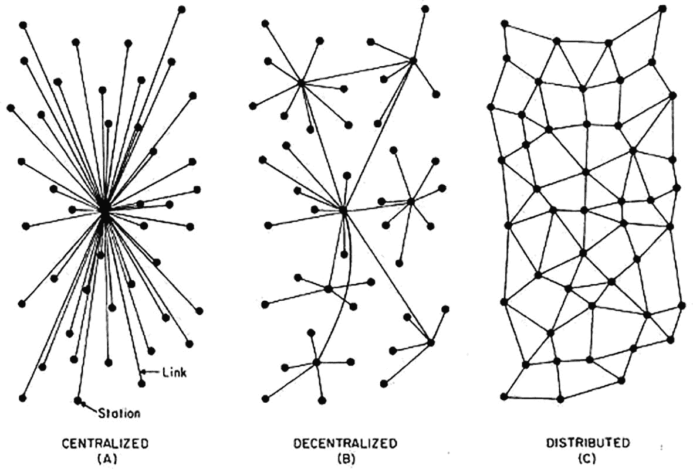
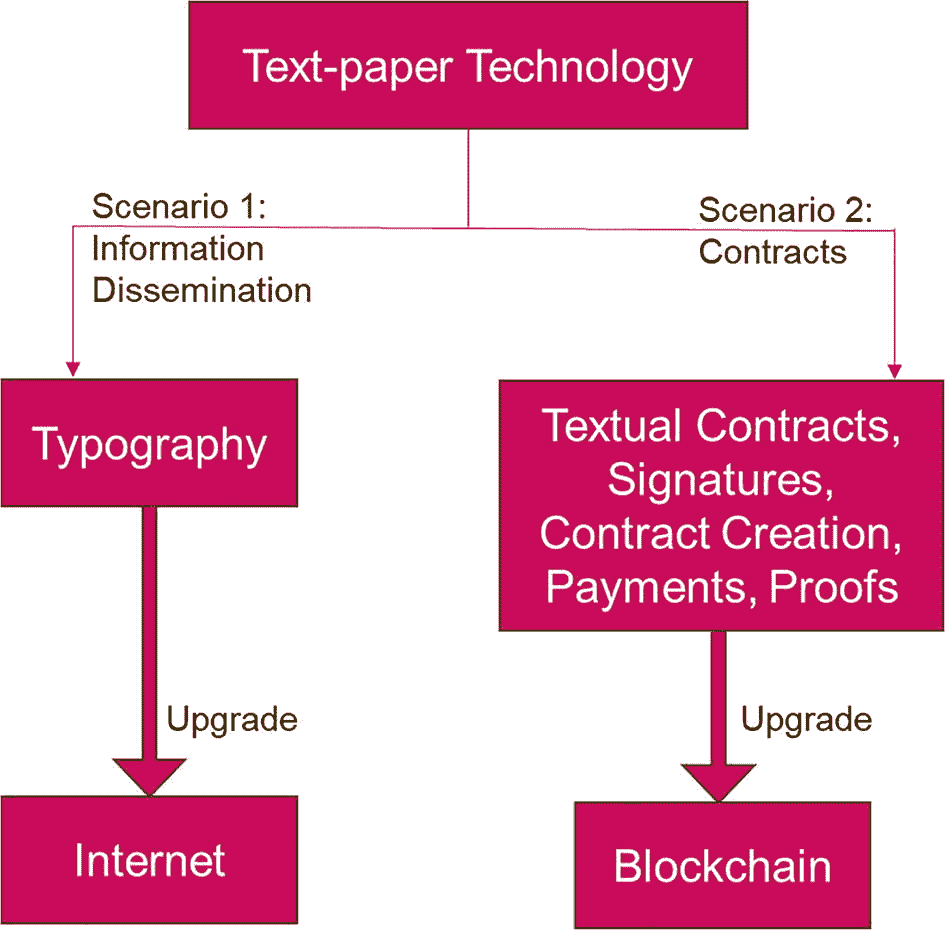
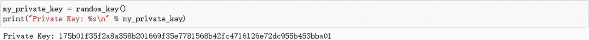
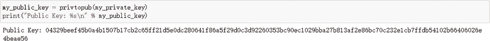
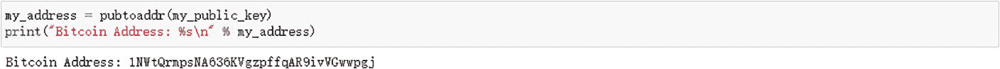
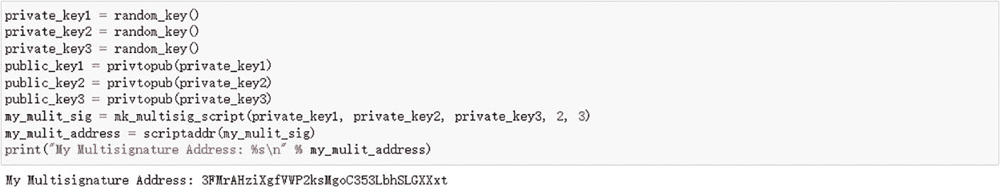
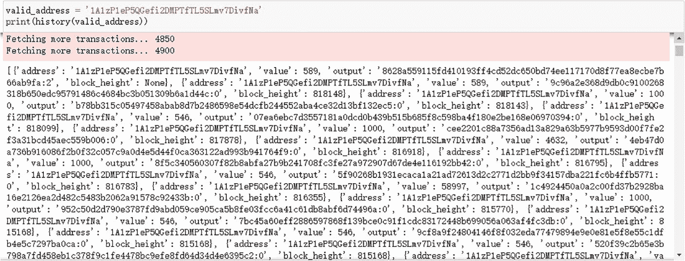

# 第一章：解密区块链技术

本章深入探讨区块链的基础方面，探索其起源、关键机制以及其在创造透明、高效、安全的数字世界方面所蕴含的变革潜力。随着我们层层揭开这项技术，我们邀请读者一同探索区块链如何不仅重塑金融，也如何重新定义现代科技与信任的边界。

## 1.1 什么是区块链？

区块链技术的起源与比特币密切相关，可追溯至 2008 年比特币概念的首次提出。比特币不仅是一种加密货币，更运行在一种称为区块链的创新技术之上。这项技术随着比特币的发展而演进，如今已广泛应用于各个领域。

比特币的诞生可追溯至 2008 年 10 月 31 日，一位化名中本聪的神秘人物或团队发布了一份开创性文件——比特币白皮书。¹ 在这份白皮书中，中本聪提出了一种新颖的数字货币概念，挑战了现有的金融体系，并彻底革新了传统的货币理念。随后，在 2009 年 1 月 3 日，比特币网络迎来了一个历史性时刻——第一个被称为 0 号区块的区块被成功挖出。² 这个通常被称为创世区块或原始区块的区块，不仅标志着比特币网络的正式启动，也标志着区块链技术的首次实际应用。这项创新应用预示了数字货币和分布式账本技术的新纪元，为现代加密货币及区块链技术奠定了基础。

作为一种创新的数字账本技术，区块链的核心在于其能够以去中心化、透明且不可篡改的方式存储和传输数据。在区块链中，数据被分组存储在称为 `blocks` 的结构中，这些区块按时间顺序链接，形成一条持续增长的链条。每个区块都包含一系列交易记录以及前一个区块的加密哈希值，这确保了数据一旦写入区块链，就几乎无法更改或删除，从而维护了数据的完整性和完整历史记录。

去中心化是区块链的另一个关键特性。与传统数据库或账本系统将数据存储在中心化服务器或数据中心不同，区块链数据分布在整个网络中，网络中的每个节点都维护着一份完整的区块链副本，如图 1-1 所示。这种分布式数据存储显著降低了单点故障的风险，并增强了系统抵御攻击的能力。



图 1-1

中心化 vs. 去中心化 vs. 分布式 来源：[`https://berty.tech/blog/decentralized-distributed-centralized`](https://berty.tech/blog/decentralized-distributedcentralized)

下表概述了每种系统类型在维护、稳定性、可扩展性、开发以及演进和多样性潜力方面的关键特征和权衡。

表 1-1

中心化 vs. 去中心化 vs. 分布式对比

| 系统类型 | 中心化 | 去中心化 | 分布式 |
| --- | --- | --- | --- |
| 故障点/维护 | 单点故障，较易维护 | 故障点比中心化多但有限，较难维护 | 无单点故障，最难维护 |
| 容错性/稳定性 | 如果中心节点失效则极不稳定 | 比中心化稳定，能承受中心节点故障 | 非常稳定，单个故障影响很小 |
| 可扩展性/最大规模 | 可扩展性低 | 可扩展性中等 | 无限可扩展性 |
| 易开发性/创建速度 | 创建最快，遵循单一框架 | 比中心化慢，需梳理底层细节 | 最慢，需要复杂的资源共享和通信 |
| 演进/多样性 | 多样性低，演进缓慢 | 基础设施就位后可快速演进 | 基础设施建立后具有很高的演进潜力 |

此外，区块链技术的透明性是其标志性特征之一。在公有链中，任何人都可以查看所有交易记录和区块信息，但交易参与者的身份是匿名或假名的，如图 1-2 所示。这种透明性与隐私性的结合，使得区块链成为金融、供应链管理和医疗保健等领域的理想技术选择。


图 1-2

比特币浏览器来源：[`www.blockchain.com/explorer`](http://www.blockchain.com/explorer)（访问日期：2023 年 11 月 23 日）

为确保交易的准确性和网络的安全性，区块链网络通常采用一种称为 `consensus mechanism` 的方法来验证和添加新交易。最著名的共识机制是比特币使用的工作量证明（`PoW`），网络中的参与者（矿工）必须解决复杂的计算问题来验证交易并创建新区块。

因此，区块链技术不仅旨在验证交易并增强数字账本的安全性，还旨在缓解加密货币的双重支付和各种欺诈活动等关键问题。区块链 1.0，³ 作为此项技术的初始迭代，主要应用于像比特币这样的加密货币，其目标是解决两个基本问题：

- **双重支付问题**：它结合使用点对点文件共享和公钥加密技术，防止同一数字货币单位被多次使用。这在一个无需信任的框架内执行，其中交易记录在公开可访问的账本上，并由参与者之间的共识进行确认，从而消除了对中心化权威机构的需求。

- **拜占庭将军问题**：这指的是在去中心化网络中达成共识的挑战。区块链 1.0 通过工作量证明（`PoW`）机制解决了这个问题，所有参与者无需可信中介即可就验证过的真相达成一致。这是通过矿工解决加密谜题来验证交易并添加新区块来实现的，从而确保网络就账本状态达成一致。⁴

这些基础方面强化了区块链抵御潜在漏洞的能力，并构成了其在加密货币之外的各个领域广泛应用的基石。

区块链 2.0 代表了从最初区块链概念的显著演进，其标志是将智能合约集成到区块链协议中。由以太坊率先推出的智能合约是自动执行的代码，当满足预设条件时运行，使得超越简单加密货币交换的复杂交易成为可能。这一进步促进了去中心化应用程序（`DApps`）和去中心化自治组织（`DAOs`）的发展，将区块链的实用性扩展到治理和数字所有权等各个领域，例如以非同质化代币（`NFTs`）为代表的领域。

区块链 3.0 将区块链的应用从金融领域扩展到各行各业，强调可持续性、可扩展性和增强的安全性。它将企业级系统与区块链相集成，使得医疗保健和供应链管理等行业能够利用智能合约实现医疗服务、物流等功能。此外，区块链 3.0 支持不同区块链网络之间的互操作性，这在 `Cosmos` 和 `Chainlink` 生态系统中可见一斑。在这一代区块链中，诸如权益证明共识模型和有向无环图（`DAG`）算法等技术创新，以 `Cardano`、`Solana` 和 `Avalanche` 等平台为代表，通过降低能耗和显著提升交易处理速度，解决了以往的局限性。⁵

总之，区块链技术通过其独特的去中心化结构、不可篡改的数据记录、透明性以及强大的共识机制，为数字交易和数据存储提供了一种新颖、更安全、更可靠的方法。

### 区块链 vs. 互联网

互联网彻底改变了信息传播的方式，使知识能够在全球范围内实现快速、经济高效且无缝的交换。然而，由于固有的信任问题和中心化特征，它在价值传递方面存在不足，通常需要中介机构进行验证。

相比之下，区块链技术则专为价值传递而设计。它通过提供一个去中心化平台来实现这一点，在该平台上，交易不仅透明而且不可篡改，从而营造出一种通过加密验证而非中心化权威机构建立信任的环境。区块链传递价值的能力体现在它能够促进数字资产交换、执行智能合约，并在无需中心化监管的情况下确保交易的真实性和完整性。这使得区块链成为数字经济的理想基础设施，在数字经济中，价值传递与信息交换同样至关重要。



图 1-3

信息传递与价值传递

图 1-3 勾勒了从纸质文本到数字格式的技术演进路径。顶部，“纸质文本技术”是起点。由此分岔出两条路径：一条通往“印刷术”，最终演变为“互联网”，象征着用于信息传播的文本的数字化升级。另一条路径则通向“文本合同、签名、合同创建、支付、证明”，进而走向“区块链”，代表着合同和交易流程的数字化。该图表明，互联网作为印刷术在文本领域的数字继承者而发展，而区块链则在交易和合同协议方面发挥着类似的作用。

### 区块链与人工智能

区块链与人工智能（`AI`）正在结成战略联盟，这不仅能放大各自的优势，还能应对根本性的社会和经济挑战。区块链以其安全性和不可篡改性而闻名的架构，为 `AI` 以透明且可验证的方式运作奠定了基础，为像 `SingularityNET` 这样的“去中心化 `AI`”系统铺平了道路。作为回报，`AI` 通过智能优化复杂计算，提升了区块链的运营效率。这种共生关系进一步赋予个人对自己数据的控制权，促进个人数据货币化，同时打破了科技巨头的数据垄断。随着 `AI` 算法变得日益复杂，区块链提供的信任和透明度对于验证和理解 `AI` 驱动的决策变得至关重要。尽管尚处于萌芽阶段且充满未知可能性，但区块链与强 `AI` 的融合证明了其在彻底改变生产力机制和生产关系基础设施方面的潜力，确保 `AI` 的广泛能力在一个维护透明度、问责制和道德标准​​的框架内得到利用。⁶


图 1-4

由 `ChatGPT DALL·E 3` 模型根据前述文本生成的图像 来源：[`https://chat.openai.com/?model=gpt-4`](https://chat.openai.com/?model=gpt-4)

## 1.2 区块链如何运作：哈希函数、加密与数字签名

区块链技术的工作机制依赖于两个核心组件：哈希函数和加密技术。

### 哈希函数

哈希函数在区块链，尤其是在加密货币领域扮演着核心角色，密码学哈希函数具有对于确保安全性和完整性至关重要的关键特性。以下三个属性——抗碰撞性、隐藏性和谜题友好性——对于加密货币中使用的密码学哈希函数尤为重要。

- **抗碰撞性**：在密码学中，抗碰撞性是哈希函数的一个关键属性，它要求对于给定的哈希函数 `H`，在计算上无法找到两个不同的输入 `x` 和 `y`，使得 `H(x) = H(y)`。这意味着，尽管理论上存在这样的输入对，但由于计算资源的限制，在现实中找到它们极其困难。抗碰撞性确保了加密货币中交易的唯一性，保证每笔交易生成一个唯一的哈希值。如果没有抗碰撞性，攻击者就可能创建两个具有相同哈希值的不同交易，从而能够在不被察觉的情况下篡改账本。在区块链中，由于每个区块的哈希值都包含在下一个区块中，因此抗碰撞性对于维护链的完整性至关重要。

- **隐藏性**：哈希函数的隐藏性特性对于保护密码学中的数据隐私非常重要。具有隐藏性的哈希函数意味着，即使知道哈希值，也无法确定是由哪个具体的输入值产生的。这一特性通常通过将随机性（如随机数或盐值）与输入数据相结合来实现，确保即使输入发生细微变化，也会产生截然不同的输出，从而使得在没有额外信息的情况下无法推导或猜测出原始数据。在区块链技术中，隐藏性极其重要，因为它确保了交易细节的隐私性，同时允许网络节点在不泄露实际数据的情况下验证交易的有效性。例如，比特币的哈希函数利用隐藏性来防止未经授权访问有关交易金额和参与者身份的信息。这可以类比为古代用火漆封缄信件或用信封隐藏信件内容的行为。正如封缄的信件确保只有预期的收件人才能访问消息内容一样，哈希函数中的隐藏性确保了敏感的交易细节保持私密，同时仍允许网络验证交易的真实性。此外，隐藏性在创建加密货币地址和处理智能合约方面也发挥着作用，进一步增强了区块链网络的安全性和隐私保护能力。

- **谜题友好性**：谜题友好性是哈希函数在加密货币领域的一项独特属性。它意味着，对于给定的一个输出值，找到一个能映射到该输出值的输入值非常困难。换句话说，除非尝试所有可能的输入，否则没有有效的方法能预测哪个输入值会产生特定的哈希值。在比特币等加密货币的挖矿过程中，谜题友好性至关重要。矿工必须尝试大量的不同输入（包括交易信息和一个随机数），以找到一个满足网络当前难度目标的哈希值，这个目标通常意味着哈希值必须小于某个特定数。这个过程计算量巨大，而随机性确保了没有任何捷径可以完成任务，从而保障了网络安全和货币的稳定发行。

这些特性共同构成了哈希函数在加密货币中的基石，确保了区块链网络的安全性和功能性。

### 加密

`非对称加密`：非对称加密是区块链中确保交易安全的关键技术。在此系统中，公钥将信息加密成密文，以供公开传输；而私钥则将密文解密回明文，只有私钥持有者可以访问，从而保证了信息的机密性。在区块链交易中，参与者使用自己的私钥对交易进行数字签名。其他人可以使用相应的公钥来验证签名的合法性，但无法伪造签名，从而确保了交易的真实性和不可否认性。

`默克尔树`：默克尔树是为验证数据而优化的结构。它们通过哈希函数聚合交易数据，其中每个叶节点包含单个交易的哈希值，内部节点则包含其子节点的哈希值。这种结构在确保数据完整性和加速信息验证方面非常高效，因此与非对称加密协同工作，共同确保数据的完整性和有效性。

`哈希指针与数据结构`：哈希指针结构记录了数据的哈希值以及指向数据结构其他部分的指针。区块链利用哈希指针将每个区块链接成一条链，其中每个区块都包含前一个区块的哈希值，从而确立了区块链的不可篡改性和历史连续性。这种顺序链接维护了一个带时间戳的、有序的交易记录，为数据的真实性提供了有力支持。通过将每个区块链接到其前驱区块的哈希值，不仅确认了数据的不可篡改性，还建立了一个可验证的、按顺序排列的交易记录链。

结合这三个要素，区块链为交易提供了一个透明、安全且不可篡改的环境，为构建信任和价值转移奠定了基础。

表 1-2 是比特币（`BTC`）和以太坊（`ETH`）使用的密码学函数对比表。

表 1-2 BTC 与 ETH 的密码学函数

| 特性 | 比特币 (`BTC`) | 以太坊 (`ETH`) |
| --- | --- | --- |
| 哈希函数 | `SHA-256` | `Keccak-256` （`SHA-3` 的一种变体） |
| 签名算法 | `ECDSA`（椭圆曲线数字签名算法） | `ECDSA`（椭圆曲线数字签名算法） |

此表说明了比特币和以太坊所采用的密码学函数的异同。虽然两者都使用 `ECDSA` 算法进行数字签名，但它们在哈希函数的选择上有所不同，比特币使用 `SHA-256`，而以太坊使用 `Keccak-256`。

### 数字签名

数字签名在区块链中扮演着至关重要的角色，它确保了交易的安全性和可认证性。数字签名机制包括生成密钥对（公钥和私钥）、签名过程和验证过程。私钥用于对消息进行签名，而公钥则允许任何人验证签名的真实性。数字签名不仅确保只有签名者本人才能生成签名，还将签名与特定文档绑定，确保该签名不能用于表示对另一份文档的批准或认可。该机制的设计目标在于满足两个主要特性，这与手写签名的类比非常相似：

1.  **唯一性**：只有你才能生成自己的签名，但任何看到它的人都能验证其有效性。这是通过使用私钥对消息进行签名来实现的，而私钥是保密的，只有密钥的所有者才能访问。
2.  **绑定**：签名与特定的文档绑定，因此不能用于表示对另一份文档的同意或认可。换句话说，签名是对特定交易或消息的验证，不能被滥用或挪用于其他内容。

数字签名方案包含以下三种算法：

-   **密钥生成**：此方法接收一个密钥大小参数，并生成一对密钥。私钥（秘密密钥）保持机密，用于对消息进行签名；公钥（公开验证密钥）是公开的，任何人都可以用它来验证签名。
-   **签名方法**：此方法以消息和私钥作为输入，并输出在该私钥下消息的签名。
-   **验证方法**：此方法以消息、签名和公钥作为输入。它返回一个布尔值，如果在该公钥下签名对消息有效，则返回 `true`，否则返回 `false`。

此外，数字签名还必须满足以下两个属性：

-   **有效签名必须能通过验证**：由相应私钥生成的签名在使用公钥验证时必须返回 `true`。
-   **签名具有存在性不可伪造性**：这意味着没有人能够伪造他人的签名。存在性不可伪造性这一属性确保了像比特币这样的区块链系统中交易的安全性和可信度。

多重签名（简称“多签”）是数字签名的一种扩展应用，它需要多个密钥共同签署一笔交易。在加密货币领域，如比特币中，多重签名通过要求多方批准交易才能执行来增强安全性。这对于需要高安全性和联合管理的场景非常有用，例如合伙关系、联合账户或家族信托。例如，一个 2/3 多重签名方案要求三名参与者中的任意两人提供他们的签名来验证和执行交易。这样的安排既提供了安全性，也提供了灵活性和冗余性，能够应对密钥丢失或一方无法履行职责等情况。

## 案例分析：使用 Python 创建比特币地址

在本案例分析中，可以利用如 `bitcoin` 之类的 Python 库来处理密码学运算和比特币特定的编码。

1.  **安装必要的 Python 库**
    ```
    pip install bitcoin
    ```

2.  **生成一个比特币地址**
    -   **生成一个私钥**：使用 Python 中的加密库来生成一个私钥。

    

    图 1-5 私钥

    ```python
    from bitcoin import *
    my_private_key = random_key()
    print("Private Key: %s\n" % my_private_key)
    ```

    -   **导出公钥**：从私钥计算出公钥。

    

    图 1-6 公钥

    ```python
    my_public_key = privtopub(my_private_key)
    print("Public Key: %s\n" % my_public_key)
    ```

    -   **创建一个比特币地址**：使用比特币特定的编码方法将公钥转换为标准的比特币地址。

    

    图 1-7 比特币地址

    ```python
    my_address = pubtoaddr(my_public_key)
    print("Bitcoin Address: %s\n" % my_address)
    ```

3.  **创建一个多重签名地址**
    -   **收集多个公钥**：收集参与各方的公钥。
    -   **构建多重签名脚本**：使用比特币脚本语言创建一个脚本，该脚本需要来自指定数量密钥的签名（例如，2/3，3/5）。
    -   **生成多重签名地址**：将多重签名脚本编码为比特币地址。

    

    图 1-8 多重签名地址

    ```python
    private_key1 = random_key()
    private_key2 = random_key()
    private_key3 = random_key()
    public_key1 = privtopub(private_key1)
    public_key2 = privtopub(private_key2)
    public_key3 = privtopub(private_key3)
    my_mulit_sig = mk_multisig_script(private_key1, private_key2, private_key3, 2, 3)
    my_mulit_address = scriptaddr(my_mulit_sig)
    print("My Multisignature Address: %s\n" % my_mulit_address)
    ```

4.  **查询地址的交易历史**
    -   **选择一个区块链 API**：选择一个允许查询比特币区块链的合适 API 服务（例如 BlockCypher、Blockchain.info）。
    -   **获取交易数据**：使用 Python 的 `requests` 库调用 API，传入比特币地址并检索其交易历史。

    

    图 1-9 ‘创世’ 比特币地址的交易历史

    ```python
    valid_address = '1A1zP1eP5QGefi2DMPTfTL5SLmv7DivfNa'
    print(history(valid_address))
    ```

比特币地址 `1A1zP1eP5QGefi2DMPTfTL5SLmv7DivfNa` 在比特币历史上意义重大，被公认为“创世”比特币地址。这个地址因接收了史上第一笔比特币交易而闻名。截至上次更新，其余额为 72.73 BTC，价值约 2,715,604.42 美元。该地址于 2009 年 1 月 3 日首次收到比特币，最近一次活动记录于 2023 年 11 月 23 日。有趣的是，它从未发送过任何 BTC，表明它仅被用于接收资金。

这个地址在比特币历史中占有特殊地位，是网络起源的象征。分析此类地址可以洞察比特币的早期使用模式和分布情况。

这段 Python 代码示例演示了生成单签比特币地址、多重签名地址以及获取交易历史的基本要素。然而，这仅是一个概念性演示，不能用于现实世界的应用程序。如果您需要创建一个功能性的比特币地址，建议使用可靠的服务，例如 BitAddress (`https://www.bitaddress.org`)。务必安全地处理私钥，并理解在像比特币这样的公共区块链上进行交易分析的含义。

### 共识算法

共识算法对于区块链网络的功能和可靠性至关重要。它是一种机制，使得去中心化网络中的多个节点能够就特定值（例如交易记录的有效性）达成共同协议。在没有任何中央机构来指定或验证账本状态的区块链环境中，这一过程至关重要。

在区块链技术中，共识算法使得所有参与者（或节点）能够在无需信任的环境中就区块链的内容达成一致。这种一致性对于确保分布式账本的每个副本都保持一致且准确，从而维护整个区块链系统的完整性和安全性是必要的。

共识机制还在解决区块链网络中的潜在冲突中扮演着关键角色，例如双重支付（即同一数字代币被花费多次）问题。它们有助于在不同节点间同步账本，确保所有交易按正确顺序记录，并且每个节点都拥有相同的真实版本。

通过利用共识算法，区块链网络可以在无需中央机构的情况下安全、透明且高效地运行。这种去中心化是区块链技术能够在加密货币之外的多种应用中（例如供应链管理、数字身份验证和安全投票系统）具有创新性和价值的关键属性之一。

共识算法的实现取决于区块链网络的特定需求和目标，包括交易速度、安全级别、能耗以及期望的去中心化程度等因素。特定共识机制的选择会显著影响区块链系统的性能和特性。

常见的共识算法包括：

1.  **工作量证明（PoW）**
    -   **原理**：`PoW` 要求参与者（矿工）通过解决复杂的数学问题来证明他们完成了特定量的计算工作。比特币是使用 `PoW` 的最著名的区块链。
    -   **优点**：增强了网络安全性，防止双重支付和其他类型的攻击。
    -   **缺点**：能耗高，并且随着时间的推移，矿工中心化的趋势可能导致网络中心化。

2.  **权益证明（PoS）**
    -   **原理**：`PoS` 基于持有币的数量和时间来选择区块的验证者。与 `PoW` 不同，`PoS` 不需要大量的计算工作。
    -   **优点**：能效更高，参与门槛更低。
    -   **缺点**：可能导致“富者愈富”的问题，因为持有更多币的用户更有可能被选为验证者。

3.  **委托权益证明（DPoS）**
    -   **原理**：在 `DPoS` 中，代币持有者通过投票选出少数代表（验证者）来验证区块。`EOS` 是使用 `DPoS` 算法的一个显著例子。
    -   **优点**：与 `PoW` 和传统 `PoS` 相比，交易确认速度更快，能效更高。
    -   **缺点**：可能导致网络中的权力集中，降低去中心化程度。

4.  **实用拜占庭容错（PBFT）**
    -   **原理**：`PBFT` 旨在通过节点间密集通信以达成共识，容忍网络中少数节点的恶意行为。
    -   **优点**：适用于许多需要高数据一致性和可靠性的系统。
    -   **缺点**：随着网络规模的增长，通信成本显著增加。

每种算法都有其特定的用例、优点和缺点。共识算法的选择取决于区块链的具体需求，例如安全性、速度、能效和去中心化程度。随着区块链技术的不断发展，可能会出现新的共识算法来更好地满足不同类型网络的需求。

表 1-3 列出了一些主要的共识算法及其对应的代表性项目。

**表 1-3** 不同区块链的共识算法

| 共识算法 | 代表性项目 |
|--------------------|------------------------|
| 工作量证明（`PoW`） | 比特币 |
| 权益证明（`PoS`） | 以太坊（即将推出的以太坊 2.0） |
| 委托权益证明（`DPoS`） | `EOS` |
| 实用拜占庭容错（`PBFT`） | Hyperledger Fabric |

这些项目展示了相应的共识算法如何在现实世界的区块链系统中实现。我们将在后续章节中进一步探讨 `PoW` 和 `PoS`。

### 总结

随着本章接近尾声，我们可以清楚地看到，区块链技术不仅仅是为加密货币服务的平台；它预示着数字安全和去中心化数据管理的新时代。从比特币的诞生到高级区块链应用程序的开发，标志着该技术的迅速演进。凭借强大的安全特性、固有的透明度以及跨领域的多功能性，区块链已成为数字时代的基础技术。后续章节将更深入地探讨区块链如何继续影响各行各业、重新定义隐私，并对全球经济格局提出挑战。区块链驱动重大创新的潜力是巨大的，其发展远未结束。

### 注释

1.  Nakamoto, S. (2008). `Bitcoin: A Peer-to-Peer Electronic Cash System`.
2.  Wallace, Benjamin (23 November 2011). ‘The Rise and Fall of Bitcoin’. Wired. Archived from the original on 31 October 2013. Retrieved 13 October 2012. Wallace, B. (2011). The rise and fall of Bitcoin. Wired, 19(12).
3.  Swan, M. (2015). `Blockchain: Blueprint for a New Economy`. O’Reilly Media, Inc.
4.  什么是拜占庭将军问题？| River Learn – 比特币技术 (2023). River. `https://river.com/learn/what-is-the-byzantine-generals-problem/` (访问日期：2023 年 11 月 23 日).
5.  Kisters, S. (2022). 区块链 1.0 对比 2.0 对比 3.0 – 有什么区别？OriginStamp. `https://originstamp.com/blog/blockchain-1-vs-2-vs-3-whats-the-difference/` (访问日期：2023 年 11 月 23 日).
6.  Banafa, A. (2021). 区块链与人工智能：天作之合？OpenMind. `www.bbvaopenmind.com/en/technology/artificial-intelligence/blockchain-and-ai-a-perfect-match/` (访问日期：2023 年 11 月 23 日).